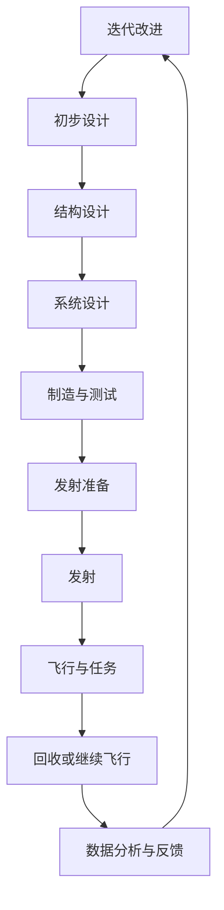

                 

### 火星探索的历史与现状

#### 1.1 火星探索的里程碑事件

火星探索的历史可以追溯到20世纪60年代。1959年，前苏联发射的火星探测器“火星1号”成为了第一个尝试飞向火星的任务，但遗憾的是它在进入火星轨道时失败。1960年，美国的“火星探测器1号”成功进入火星轨道，这是人类首次获得火星表面数据。1964年，美国发射了“水手4号”，这是第一个成功进入火星轨道并传回大量数据的探测器。1971年，前苏联的“火星3号”着陆器成功在火星表面软着陆，并在着陆后发送了约20秒的火星表面数据，这是人类历史上第一次成功在火星表面着陆并传送数据的任务。

随着时间的推移，火星探索取得了更多的成就。1976年，美国的“维京1号”和“维京2号”着陆器成功在火星表面着陆，并发回了大量关于火星环境和表面特征的数据。这些数据表明火星曾经拥有过液态水，但这股水已经消失了。

进入21世纪，火星探索活动更加频繁。2003年，欧洲空间局的“火星快车”探测器成功进入火星轨道，并携带了一系列科学仪器，包括火星表面雷达和磁场计。2004年，美国的“机遇号”和“勇气号”火星探测器成功在火星表面着陆，并开始了长达数年的探测任务。这些探测器发现了火星表面存在水冰、矿物质和火山活动等证据，为火星曾经存在过生命的可能性提供了支持。

2012年，中国的“天问一号”探测器成功发射，并于2013年成功进入火星轨道。这是中国首次尝试火星探测，标志着中国在太空探索领域的重要突破。2018年，美国的“洞察号”着陆器成功在火星表面着陆，其主要任务之一是研究火星内部的构造和活动。

近年来，火星探索的重点逐渐转向了火星表面资源的开采和利用，以及未来火星移民的可行性研究。2021年，美国的“毅力号”火星探测器成功在火星表面着陆，其携带的“火星地球化”实验设备将尝试在火星表面种植地球植物，为未来火星农业打下基础。

#### 1.2 火星环境概述

火星是太阳系八大行星之一，位于地球的邻接轨道上。火星的直径约为地球的一半，质量约为地球的1/10，因此火星的引力只有地球的1/3。火星的大气主要由二氧化碳组成，气压非常低，仅为地球的1%左右。火星的昼夜温差极大，白天温度可高达摄氏200度以上，而夜晚则降至摄氏零下100度以下。

火星的自转周期为24小时37分钟，公转周期为687地球日。这意味着火星的一年大约为地球的1.88年。火星的季节变化明显，其季节长度约为地球的两倍。

火星的地形多样，从广阔的沙漠平原到高山、峡谷和火山。火星北极有一个巨大的冰帽，而南极则有一个较小的冰帽。火星上还有许多撞击坑，其中最大的撞击坑是卡尔蔡司坑，直径约为1,000公里。

火星的大气层非常稀薄，这导致火星表面缺乏足够的温室效应，无法维持液态水的存在。尽管如此，科学家们仍在火星表面发现了大量的水冰，主要分布在极地冰帽、地下冰层和浅层土壤中。此外，火星大气层中的二氧化碳在某些条件下可以转化为干冰，这进一步限制了火星表面水的存在。

#### 1.3 火星移民的必要性与可行性

火星移民的必要性和可行性是一个复杂的问题，它涉及到科学、技术、经济、伦理等多个方面的考量。

**必要性**

从科学角度来看，火星移民有助于人类探索宇宙，推动科学技术的发展。火星环境与地球相似，是太阳系中最有可能支持人类居住的行星。通过在火星上建立基地，人类可以更好地了解太阳系的形成和演化过程，探索生命的起源。

从经济角度来看，火星资源的开采和利用具有巨大的潜力。火星表面和地下蕴藏着丰富的矿物资源，如水冰、铁、铝、铜、钛等。这些资源不仅可以满足火星基地的自身需求，还可以成为未来星际贸易的重要物资。

从人类未来发展角度来看，火星移民可以增加人类的生存机会，减少对地球环境的依赖。随着地球资源的逐渐枯竭和环境问题的日益严重，火星移民成为人类寻找新家园的必然选择。

**可行性**

从技术角度来看，随着航天技术的不断进步，火星探索和移民的可行性逐渐提高。目前的航天技术已经能够在火星表面成功着陆，并进行长期探测。未来，随着推进技术、生命维持系统、建筑材料等方面的突破，火星移民将变得更加可行。

从经济角度来看，虽然火星移民需要巨大的投资，但一旦成功，它将为人类带来巨大的经济回报。例如，火星资源的开采和利用将为全球经济带来新的增长点，创造大量就业机会。

从伦理角度来看，火星移民涉及到一系列伦理问题，如人类在火星上建立基地的合法性、火星原生物种的保护、人类在火星上的权益等。这些问题的解决需要全球范围内的合作和协商。

总之，火星移民既有必要性也有可行性。在未来的几十年内，随着科学技术的不断进步，火星移民将成为人类探索宇宙的重要一步。然而，这也将是一个充满挑战和机遇的过程，需要全球范围内的共同努力和合作。

---

**核心概念与联系**

#### 太空船设计与制造流程

火星移民的一个重要环节是太空船的设计与制造。一个成功的太空船设计需要考虑多个因素，包括航行路线、燃料效率、生命维持系统等。以下是一个简化的太空船设计与制造流程的Mermaid流程图，展示了关键步骤和相互关系：



在这个流程中：

- **任务需求分析**：明确太空船的任务需求和性能指标。
- **初步设计**：根据需求分析进行初步设计，确定太空船的基本结构和系统。
- **结构设计**：细化结构设计，确保结构强度和可靠性。
- **系统设计**：设计包括推进系统、生命维持系统、导航系统等在内的关键系统。
- **制造与测试**：制造太空船并进行严格的测试，确保各项性能指标符合要求。
- **发射准备**：完成太空船的发射准备，包括地面测试、装载燃料等。
- **发射**：将太空船发射到预定轨道。
- **飞行与任务**：太空船进入任务轨道，执行预定任务。
- **回收或继续飞行**：完成任务后，太空船可以返回地球或继续执行其他任务。
- **数据分析与反馈**：对飞行数据进行详细分析，为下一次任务提供改进建议。
- **迭代改进**：根据数据分析结果，对设计进行迭代改进。

通过这样的流程，可以确保太空船的设计与制造高效、可靠，为火星移民任务提供坚实的基础。

#### 伪代码：火星轨道设计算法

为了实现火星轨道的设计，我们需要一个算法来计算太空船从地球发射到火星所需的初始速度和发射角度。以下是一个简化的伪代码，用于描述这个算法的基本原理：

```python
# 火星轨道设计算法
def MarsOrbitDesign(initial_velocity, launch_angle):
    # 初始化变量
    x, y = 0, 0  # 初位置
    vx, vy = initial_velocity * cos(launch_angle), initial_velocity * sin(launch_angle)  # 初速度
    
    # 地球引力常数
    G = 6.674 * 10^-11
    
    # 火星质量
    M = 6.39 * 10^23
    
    # 太阳质量
    S = 1.989 * 10^30
    
    # 运行时间
    t = 0
    dt = 1  # 时间步长
    
    # 时间步进计算
    while x < MarsOrbitRadius:
        # 计算地球引力
        F_earth = G * (S * mass_of_satellite) / (x_earth^2)
        
        # 计算火星引力
        F_mars = G * (M * mass_of_satellite) / (x_mars^2)
        
        # 计算总引力
        F_total = F_earth + F_mars
        
        # 计算加速度
        ax = F_total / mass_of_satellite
        
        # 更新速度和位置
        vx += ax * dt
        x += vx * dt
        
        # 更新时间
        t += dt
    
    # 返回轨道参数
    return x, y, vx, vy
```

在这个算法中：

- `initial_velocity` 是太空船的初始速度。
- `launch_angle` 是太空船的发射角度。
- `G` 是万有引力常数。
- `M` 是火星的质量。
- `S` 是太阳的质量。
- `mass_of_satellite` 是太空船的质量。
- `x` 和 `y` 是太空船的位置坐标。
- `vx` 和 `vy` 是太空船的速度分量。
- `x_earth` 和 `x_mars` 是地球和火星到太阳的距离。

这个算法通过迭代计算，模拟太空船在地球和火星引力作用下的轨道运动。它可以用来确定太空船从地球发射到火星所需的初始速度和发射角度，确保太空船能够成功进入预定的火星轨道。

#### 火星轨道周期计算

火星轨道周期是指火星绕太阳一周的时间，这个周期可以通过以下公式计算：

$$
T = 2\pi \sqrt{\frac{a^3}{G(M_{地球} + M_{火星})}}
$$

其中：

- $T$ 是轨道周期。
- $a$ 是半长轴，即火星轨道的平均距离。
- $G$ 是万有引力常数，约为 $6.674 \times 10^{-11} \text{m}^3\text{kg}^{-1}\text{s}^{-2}$。
- $M_{地球}$ 和 $M_{火星}$ 分别是地球和火星的质量，地球质量约为 $5.972 \times 10^{24} \text{kg}$，火星质量约为 $6.39 \times 10^{23} \text{kg}$。

具体计算步骤如下：

1. 确定火星轨道的半长轴 $a$，火星轨道的平均距离约为 $227.9 \text{百万公里}$。
2. 将半长轴转换为米，即 $a = 227.9 \times 10^9 \text{m}$。
3. 计算轨道周期 $T$，使用上述公式代入相关参数。

计算示例：

$$
T = 2\pi \sqrt{\frac{(227.9 \times 10^9 \text{m})^3}{6.674 \times 10^{-11} \text{m}^3\text{kg}^{-1}\text{s}^{-2} \times (5.972 \times 10^{24} \text{kg} + 6.39 \times 10^{23} \text{kg})}}
$$

$$
T = 2\pi \sqrt{\frac{1.093 \times 10^{30} \text{m}^3}{6.674 \times 10^{-11} \times 6.622 \times 10^{24} \text{kg}}}
$$

$$
T = 2\pi \sqrt{2.055 \times 10^{19}}
$$

$$
T \approx 6.52 \times 10^7 \text{秒}
$$

因此，火星轨道周期约为 $6.52 \times 10^7 \text{秒}$，大约等于地球时间的1.88年。

#### 火星探测任务代码实现

为了更好地理解火星探测任务的设计与实现，以下是一个简单的Python代码示例，用于模拟火星探测器的轨道运动。这个示例基于牛顿第二定律和万有引力定律，计算探测器在地球和火星引力作用下的运动轨迹。

**环境搭建**

在Linux环境下，首先需要安装Python和相关的科学计算库，如NumPy和SciPy。可以使用以下命令进行安装：

```bash
sudo apt-get update
sudo apt-get install python3 python3-pip
pip3 install numpy scipy matplotlib
```

**源代码**

以下是一个简单的Python脚本，用于模拟火星探测器的轨道运动：

```python
import numpy as np
from scipy.integrate import solve_ivp
import matplotlib.pyplot as plt

# 火星轨道模拟函数
def mars_orbit_simulation(initial_velocity, launch_angle, time_step=3600, total_time=24*3600):
    # 引力常数
    G = 6.674 * 10**-11
    
    # 地球和火星的质量
    M_earth = 5.972 * 10**24
    M_mars = 6.39 * 10**23
    
    # 地球和火星到太阳的距离（单位：米）
    R_earth = 1.496 * 10**11
    R_mars = 2.279 * 10**11
    
    # 太阳的质量
    M_sun = 1.989 * 10**30
    
    # 地球和火星绕太阳的角速度
    omega_earth = 2 * np.pi / (365.25 * 24 * 3600)
    omega_mars = 2 * np.pi / (687 * 24 * 3600)
    
    # 初始位置和速度
    initial_position = np.array([0, 0])
    initial_velocity = initial_velocity * np.array([np.cos(launch_angle), np.sin(launch_angle)])
    
    # 火星探测器的质量
    mass_probe = 1000
    
    # 时间序列
    t = np.arange(0, total_time, time_step)
    
    # 求解微分方程
    solution = solve_ivp(
        lambda t, y: gravity_acceleration(t, y, G, M_earth, M_mars, R_earth, R_mars, M_sun, omega_earth, omega_mars, mass_probe), 
        [0, total_time], 
        initial_velocity, 
        t_eval=t
    )
    
    # 绘制轨道
    plt.plot(solution.y[0], solution.y[1])
    plt.xlabel('X (m)')
    plt.ylabel('Y (m)')
    plt.title('Mars Orbit Simulation')
    plt.show()
    
    return solution

# 引力加速度函数
def gravity_acceleration(t, y, G, M_earth, M_mars, R_earth, R_mars, M_sun, omega_earth, omega_mars, mass_probe):
    x, y = y
    acceleration = np.zeros(2)
    
    # 计算地球引力
    r_earth = np.sqrt(x**2 + y**2)
    f_earth = G * M_earth * mass_probe / r_earth**2
    acceleration[0] -= f_earth * x / r_earth
    acceleration[1] -= f_earth * y / r_earth
    
    # 计算火星引力
    r_mars = np.sqrt((x - R_mars)**2 + (y - R_earth)**2)
    f_mars = G * M_mars * mass_probe / r_mars**2
    acceleration[0] += f_mars * (x - R_mars) / r_mars
    acceleration[1] += f_mars * (y - R_earth) / r_mars
    
    # 计算太阳引力
    r_sun = np.sqrt(x**2 + y**2)
    f_sun = G * M_sun * mass_probe / r_sun**2
    acceleration[0] += f_sun * x / r_sun
    acceleration[1] += f_sun * y / r_sun
    
    return acceleration

# 模拟火星探测器发射
initial_velocity = 10000  # 初速度（m/s）
launch_angle = np.pi / 4  # 发射角度（45度）
solution = mars_orbit_simulation(initial_velocity, launch_angle)

# 代码解读与分析

- **环境搭建**：安装Python和相关的库，如NumPy和SciPy。
- **源代码**：
  - `mars_orbit_simulation` 函数：负责整个轨道模拟，包括时间序列的设置和微分方程的求解。
  - `gravity_acceleration` 函数：计算探测器在给定时间和位置上的引力加速度。
- **运行结果**：通过Matplotlib库绘制探测器的轨道图。

通过这个示例，我们可以看到如何使用科学计算库来实现复杂的物理模拟，为火星探测任务提供技术支持。

### 火星生存环境模拟

火星探索的一个重要目标是为未来的火星移民创造一个可居住的环境。为了实现这一目标，科学家们进行了大量的研究，模拟火星的生存环境，以便为未来的火星基地提供科学依据。以下是火星生存环境模拟的关键方面：

#### 2.1 火星大气与气候模拟

火星大气主要由二氧化碳（CO₂）组成，其气压仅为地球的1%左右，这使得火星表面非常干燥和寒冷。为了模拟火星大气，科学家们需要考虑多个因素，包括大气的成分、温度、气压、风速等。

**大气成分**：火星大气中的二氧化碳含量高达95%以上，剩余的气体主要是氮气（N₂）、氩气（Ar）和微量的水蒸气（H₂O）。这些气体的比例和性质与地球大气有显著差异。

**温度与气压**：火星表面温度变化极大，白天温度可高达摄氏200度，而夜晚则降至摄氏零下100度以下。这种极端的温差对火星生存环境造成了极大的挑战。

**风速与风向**：火星上的风速较高，尤其在火星南极地区，每年都会出现“尘暴”现象。这些尘暴可以持续数周，甚至数月，严重影响火星表面的环境。

为了模拟火星大气与气候，科学家们使用了一系列气候模拟模型，如全球气候模型（GCM）和区域气候模型（RCM）。这些模型可以模拟火星大气中的气体传输、温度分布、气压变化等过程，为火星生存环境的设计提供重要参考。

#### 2.2 火星水资源探索与利用

火星表面和地下蕴藏着大量的水资源，这些水资源对于未来火星基地的建设和火星移民的生存至关重要。科学家们通过多种方式探索和利用火星水资源：

**火星极地冰帽**：火星北极和南极的冰帽中储存了大量的冰。通过火星探测器的探测，科学家们发现火星北极冰帽的冰储量约为地球南极冰盖的2%，这些冰可以为火星基地提供淡水资源。

**地下冰层**：除了极地冰帽，火星地下也存在着大量的冰层。火星探测任务如“火星探测车”和“洞察号”在探测过程中发现了火星地下冰层的存在，这些冰层可以为火星基地提供稳定的淡水资源。

**冰沙土壤**：火星表面广泛分布着冰沙土壤，这些土壤中含有大量的冰。通过开采和融化这些冰沙土壤，科学家们可以提取出淡水资源。

为了利用这些水资源，科学家们正在开发一系列技术，如冰帽钻探技术、地下冰层挖掘技术、冰沙土壤融化技术等。这些技术将在未来的火星探索和基地建设过程中发挥关键作用。

#### 2.3 火星土壤分析与应用

火星土壤的成分和性质与地球土壤有很大差异。火星土壤主要由氧化铁（Fe₂O₃）、硅酸盐和微量的有机物组成，其中氧化铁含量较高，使火星土壤呈现出红色。

**土壤的物理性质**：火星土壤的密度较低，孔隙率较高，这意味着火星土壤具有很强的渗透性和持水性。这种特性对火星建筑和基础设施的设计提出了特殊要求。

**土壤的化学性质**：火星土壤中的氧化铁含量较高，这使得火星土壤具有强氧化性。这种氧化性可能会对生物体产生有害影响，因此在火星基地的设计中需要考虑土壤处理和防护措施。

**土壤的应用**：火星土壤可以作为建筑材料，用于火星基地的建筑和基础设施建设。此外，火星土壤还可以用于土壤改良和农业实验，为未来火星农业提供基础。

通过分析火星土壤的物理和化学性质，科学家们可以为火星基地的设计提供科学依据，确保火星基地的可持续发展和生态平衡。

总之，火星生存环境模拟是火星探索的重要组成部分。通过对火星大气、水资源和土壤的深入研究，科学家们为未来火星移民创造了科学基础。在未来，随着技术的不断进步，火星生存环境模拟将变得更加精确，为火星基地的建设和火星移民的生存提供更加可靠的支持。

### 火星基础设施与建筑

火星基地的建设是火星探索和移民任务的关键环节。为了确保火星基地的可持续发展和居民的生活质量，需要精心设计和规划火星基础设施与建筑。以下是对火星基地设计原则、结构和功能以及建筑材料与技术的详细探讨。

#### 3.1 火星基地设计原则

火星基地的设计需要遵循一系列原则，以确保其安全、可持续和高效。以下是一些关键设计原则：

**安全性**：火星基地需要能够抵御火星极端环境的影响，包括高辐射、强风、极端温差和尘暴。建筑结构必须能够承受这些环境压力，确保居住者的安全。

**可持续性**：火星基地需要考虑资源的可持续利用，包括水、能源和食物。通过废物回收、资源再利用和自给自足的生态系统设计，火星基地可以最大限度地减少对外部资源的依赖。

**自给自足**：火星基地需要能够自给自足，确保在长期隔离和通讯中断的情况下，居住者能够维持基本生活需求。这包括食物生产、水源供应和能量自给。

**多功能性**：火星基地的设计应具有多功能性，能够满足科研、居住、生产和技术维护等多种需求。这要求建筑和基础设施具有灵活性和可扩展性。

**生态平衡**：火星基地需要建立一个稳定的生态系统，以维持生物多样性。这包括种植本地植物、建立微生物群落和进行环境监测。

#### 3.2 火星基地的结构与功能

火星基地的结构应包括以下关键部分：

**居住区**：居住区是火星基地的核心，为居住者提供日常生活空间。建筑结构需要能够适应火星的极端环境，包括保温、防辐射和抗风设计。此外，居住区还应配备生命维持系统，如空气净化、水处理和能源供应。

**科研实验室**：科研实验室是火星基地进行科学研究和技术开发的重要场所。实验室需要配备先进的科研设备，如分析仪、传感器和计算机系统。这些设备将用于火星环境监测、资源分析和生命科学实验。

**生产区**：生产区用于生产食物、建筑材料和日常用品。随着火星基地的发展，生产区将逐渐实现自动化和智能化，以提高生产效率和自给自足能力。

**能源系统**：火星基地的能源系统是整个基地的命脉。由于火星环境的特殊性，能源系统需要能够稳定、持续地提供电力。常见的能源解决方案包括太阳能、核能和风能。这些能源可以通过储能系统进行储存，以应对能源需求的不稳定。

**通讯系统**：火星基地需要与地球保持稳定的通讯联系，以确保实时数据传输和指挥控制。这要求通讯系统具备高可靠性和抗干扰能力。常用的通讯技术包括无线电波、激光通信和卫星通信。

**防护设施**：火星基地需要配备防护设施，以应对火星上的潜在危险，如陨石撞击、高辐射和尘暴。这些设施包括防护罩、防辐射材料和紧急避难所。

**生态系统**：火星基地的生态系统是维持生物多样性和生态平衡的关键。这包括种植本地植物、建立微生物群落和进行环境监测。这些生物措施将有助于净化空气、提供食物和改善居住环境。

#### 3.3 火星建筑材料与技术

火星基地的建筑材料和技术需要能够适应极端环境，同时保证耐用性和可靠性。以下是一些关键材料和技术：

**混凝土与复合材料**：传统的混凝土和复合材料在火星环境中具有较好的性能。这些材料可以用于建造居住区、实验室和生产区等建筑。

**陶瓷材料**：陶瓷材料具有高硬度、高耐磨性和耐高温性能，适用于建造防护设施和地面结构。

**金属合金**：金属合金，如钛合金和铝锂合金，具有高强度、轻质和高抗腐蚀性能，适用于制造设备框架和结构部件。

**3D打印技术**：3D打印技术可以用于建造火星基地的建筑和基础设施。这种技术具有高效、灵活和可定制化的优点，可以适应火星环境的特殊需求。

**自修复材料**：自修复材料可以用于修复建筑结构中的损伤，延长建筑寿命。这种材料可以在受到损伤时自动修复，减少维护成本。

**纳米材料**：纳米材料具有独特的物理和化学性质，可以用于开发新型防护涂层和传感器。这些材料可以增强建筑结构的安全性和监测功能。

总之，火星基础设施与建筑的设计和建设是一个复杂而关键的环节。通过遵循设计原则、合理规划结构和采用先进材料与技术，我们可以为未来的火星移民创造一个安全、可持续和舒适的居住环境。

### 太空船设计与制造

太空船的设计与制造是火星移民任务成功的关键之一。它需要考虑多个方面的因素，包括总体设计、推进系统、生命维持系统等。以下是对这些关键组成部分的详细探讨。

#### 4.1 太空船的总体设计

太空船的总体设计是确保其能够在极端环境中正常运行的基础。以下是一些关键设计要素：

**结构强度**：太空船的结构需要能够承受太空中的高辐射、微陨石撞击和极端温度变化。这要求使用高强度、轻质材料，如铝合金、钛合金和碳纤维复合材料。

**热控制**：太空船需要具备有效的热控制系统，以应对从极热到极冷的温度变化。这可以通过多层隔热材料、热管和热反射涂层来实现。

**通信系统**：太空船需要与地球保持稳定的通信联系，以确保实时数据传输和指令接收。这通常通过无线电波或激光通信实现。

**导航系统**：太空船的导航系统至关重要，它需要能够准确计算和调整轨道，以实现火星着陆或其他目标。常见的导航技术包括GPS、星敏感器和惯性导航系统。

**推进系统**：太空船的推进系统是推动其进入轨道和到达目标的关键。这可以包括化学火箭、电推进和核推进等技术。

**生命维持系统**：太空船的生命维持系统（Life Support System, LSS）是确保宇航员在长时间的太空飞行中生存的基本保障。这包括氧气供应、食物生产、废物处理和水循环等。

#### 4.2 太空船的推进系统

太空船的推进系统是确保其能够进入轨道和到达目标的关键。以下是一些常见的推进技术：

**化学火箭**：化学火箭是当前最常用的推进技术。它通过燃烧化学燃料产生推力，具有高推力和高比冲。然而，化学火箭的燃料携带量有限，不适合长距离星际旅行。

**电推进**：电推进系统利用电能将化学能转换为动能，具有高比冲和低燃料消耗。电推进系统包括离子推进和霍尔效应推进。这些系统适合长时间的轨道维持和深空探测。

**核推进**：核推进利用核反应产生的能量作为推进力。这种推进技术具有极高的比冲和推力，可以显著缩短星际旅行的时长。然而，核推进技术目前仍处于研究阶段，面临着安全性和可靠性方面的挑战。

**组合推进**：组合推进系统结合了化学火箭和电推进或核推进的优势，以实现更高的效率和更远的航程。这种系统通常用于长距离星际旅行。

#### 4.3 太空船的生命维持系统

太空船的生命维持系统是确保宇航员在长时间的太空飞行中生存的基本保障。以下是一些关键组件：

**氧气供应**：太空船需要提供足够的氧气，以供宇航员呼吸。这可以通过携带氧气瓶或使用电解水的方法实现。

**食物生产**：为了减少对地球的依赖，太空船需要具备一定的食物生产能力。这可以通过种植本地植物或培养微生物来实现。

**废物处理**：太空船需要有效地处理宇航员的废物，包括尿液、粪便和废气。这通常通过生物处理、化学处理和真空排放等方法实现。

**水循环**：太空船需要建立水循环系统，以确保水的可持续利用。这可以通过废水回收、水培技术和水过滤等方法实现。

**心理健康**：长期的太空飞行对宇航员的心理健康提出了挑战。太空船需要提供心理健康支持，包括心理咨询、娱乐设施和社交活动。

**环境控制**：太空船需要维持一个适宜的环境，包括温度、湿度和空气质量。这可以通过环境控制系统和空气净化器来实现。

总之，太空船的设计与制造是一个复杂而关键的过程。通过综合考虑推进系统、生命维持系统和整体设计，我们可以为火星移民任务提供可靠的交通工具，为人类的太空探索开辟新的道路。

### 太空飞行与导航技术

太空飞行与导航技术是火星移民任务中至关重要的一环。为了确保太空船能够顺利抵达火星并安全着陆，我们需要深入研究轨道设计、飞行路径以及火星探测与导航技术。以下是对这些关键方面的详细探讨。

#### 5.1 太空飞行器的轨道设计

轨道设计是太空飞行的基础。一个理想的轨道设计需要考虑多个因素，包括发射窗口、轨道高度、轨道倾角和轨道周期等。

**发射窗口**：发射窗口是指地球和火星之间的相对位置最适合发射探测器的时期。由于地球和火星的轨道是椭圆形的，它们之间的相对位置会周期性地变化。通常，每隔26个月左右会出现一个发射窗口，使得探测器可以利用行星引力辅助（Gravity Assist）技术，减少所需的推进剂和能量。

**轨道高度**：轨道高度是指探测器在太空中运行的轨道半径。较低的轨道高度可以减少飞行时间，但需要更多的能量来维持轨道。相反，较高的轨道高度可以提供更长的飞行时间，但需要更多的推进剂来调整轨道。

**轨道倾角**：轨道倾角是指探测器的轨道平面与地球赤道平面的夹角。不同的倾角会影响到探测器的覆盖范围和飞行路径。通常，为了确保探测器的轨道覆盖火星，倾角会被调整到大约28.5度。

**轨道周期**：轨道周期是指探测器绕太阳一周的时间。火星轨道周期约为687地球日，因此我们需要设计一个合适的轨道周期，以确保探测器能够在火星附近停留足够的时间进行探测任务。

**霍曼转移轨道**：霍曼转移轨道是一种常用的轨道设计方法，它通过两次助推将探测器从地球轨道转移到火星轨道。这种方法具有最小的能量消耗，适用于较短的飞行距离。

**行星引力辅助**：行星引力辅助是一种利用行星引力变化来调整探测器轨道的技术。通过精确计算行星引力场的变化，探测器可以在不消耗太多推进剂的情况下实现轨道转移。

#### 5.2 火星轨道与飞行路径

火星轨道与飞行路径的设计需要考虑多个因素，包括火星的轨道特性、探测器的发射时间和发射窗口等。

**火星轨道特性**：火星轨道是椭圆形的，其轨道周期约为687地球日。这意味着火星的位置会随着时间的推移而变化。为了确保探测器能够准确到达火星，需要精确计算火星的位置和运动轨迹。

**发射时间**：探测器的发射时间需要与火星的轨道位置相匹配。通常，选择发射窗口时，需要考虑地球和火星之间的相对位置，以及探测器的飞行时间和能量消耗。

**飞行路径**：探测器的飞行路径可以分为两个阶段：从地球到火星的转移阶段和火星轨道维持阶段。在转移阶段，探测器需要利用地球和行星引力辅助技术，逐步接近火星。在火星轨道维持阶段，探测器需要进入一个稳定的火星轨道，并进行探测任务。

**中途校正**：在飞行过程中，探测器需要进行多次中途校正，以调整轨道和速度，确保最终能够准确到达火星。这些校正可以通过地面指令或自主控制系统进行。

#### 5.3 火星探测与导航技术

火星探测与导航技术是确保探测器能够成功着陆并执行探测任务的关键。以下是一些关键技术：

**雷达导航**：雷达导航是火星探测任务中常用的技术之一。通过发射雷达波并接收反射回来的信号，探测器可以测量火星表面的地形和距离。这有助于探测器在着陆过程中避开障碍物，并确定最佳着陆点。

**激光测距**：激光测距技术通过发射激光束并测量光束的反射时间，可以精确测量火星表面的距离。这种技术可以用于探测器的着陆定位和表面地形分析。

**星敏感器**：星敏感器是一种通过测量星星的位置来导航的技术。通过识别和跟踪特定星星的位置，探测器可以确定自己的方向和位置。这种技术适用于火星轨道维持和地面探测任务。

**惯性导航系统**：惯性导航系统通过测量探测器的加速度和姿态，可以预测其未来的位置和方向。这种系统适用于探测器的自主导航和轨道维持。

**地面控制与通信**：地面控制中心通过无线电波与探测器进行通信，提供指令和监测数据。这种通信技术需要具备高可靠性和抗干扰能力，以确保探测任务的顺利进行。

总之，太空飞行与导航技术是火星移民任务中至关重要的一环。通过综合考虑轨道设计、飞行路径和探测与导航技术，我们可以确保探测器能够成功抵达火星并执行探测任务，为未来的火星移民和星际旅行奠定基础。

### 火星着陆与登月技术

火星着陆与登月技术是火星探索任务中的关键环节，直接关系到探测器的安全和任务的成败。以下是对火星着陆器设计、火星表面探测技术以及火星登陆与登月任务的详细探讨。

#### 6.1 火星着陆器设计

火星着陆器的设计需要考虑多个因素，包括着陆过程的安全性、探测器的稳定性和科学设备的配置。以下是一些关键设计要素：

**结构设计**：火星着陆器需要具备高强度和轻质化的特点，以抵御火星大气层中的高速度和高温环境。常用的材料包括钛合金、铝合金和碳纤维复合材料。此外，着陆器的结构需要具备良好的刚性，以承受着陆时的冲击力。

**热防护系统**：火星大气层中的高速气流会产生高温，这对着陆器的热防护系统提出了挑战。着陆器通常采用多层热防护材料，如陶瓷纤维、碳纤维复合材料和金属氧化物涂层，以保护内部设备和仪器。

**着陆系统**：着陆系统包括减速伞、降落发动机和着陆腿等。减速伞用于减缓着陆器的速度，降落发动机则在着陆过程中提供推力，帮助探测器平稳着陆。着陆腿用于支撑着陆器，并提供额外的稳定性。

**科学设备**：火星着陆器通常配备一系列科学设备，用于收集火星表面的地质、气候和环境数据。这些设备包括雷达、激光测高仪、地形相机、光谱仪和气溶胶探测器等。

**通信系统**：着陆器需要具备强大的通信系统，以确保在火星表面能够与地球保持稳定的通信联系。这通常通过天线和无线电传输技术实现。

**自主导航系统**：为了确保着陆器能够准确找到预定着陆点，自主导航系统至关重要。着陆器通常配备激光测距仪、星敏感器和地形测绘仪等设备，用于实时监测周围环境并调整着陆路径。

#### 6.2 火星表面探测技术

火星表面探测技术是火星探索任务的核心，用于研究火星的地质、气候和环境。以下是一些关键探测技术：

**雷达探测**：雷达探测技术用于测量火星表面的地形和深度。通过发射雷达波并接收反射信号，探测器可以绘制火星表面的三维地形图，分析地下结构和水资源分布。

**激光测高仪**：激光测高仪通过发射激光束并测量反射时间，可以精确测量火星表面的高度。这种技术有助于确定火星表面的地形特征，如峡谷、山脉和撞击坑。

**地形相机**：地形相机用于拍摄火星表面的高分辨率图像，用于研究地质构造、地貌特征和火星表面物质组成。

**光谱分析**：光谱分析技术通过测量火星表面物质的反射光谱，可以确定其化学成分和矿物组成。这有助于研究火星的历史和环境变化。

**气溶胶探测**：气溶胶探测技术用于测量火星大气中的气溶胶颗粒，了解火星大气成分和气候变化。

**气象监测**：气象监测设备用于测量火星表面的温度、气压、风速和湿度等气象参数，为火星环境的长期研究提供数据支持。

#### 6.3 火星登陆与登月任务

火星登陆与登月任务是火星探索的重要步骤，以下是一些关键的火星登陆和登月任务：

**“海盗号”任务**：“海盗号”是美国于1971年发射的火星探测任务，包括两个着陆器和多个巡视车。这些探测器成功在火星表面着陆，并进行了地质、气候和环境探测，为火星生命存在的研究提供了重要数据。

**“火星探测车”任务**：“火星探测车”系列任务包括“勇气号”和“机遇号”，它们于2003年和2004年成功在火星表面着陆。这些探测车进行了长时间的探测任务，揭示了火星表面的水历史和地质构造。

**“好奇号”任务**：“好奇号”火星探测器于2011年成功在火星表面着陆，这是第一辆使用核动力驱动的火星车。它携带了先进的科学仪器，用于研究火星的地质历史和生命可能性。

**“毅力号”任务**：“毅力号”火星探测器于2021年成功在火星表面着陆，这是NASA最新的火星探测任务。它配备了先进的探测设备和实验设备，旨在寻找火星历史上的生命迹象，并进行火星土壤和水资源的分析。

**“阿尔及尔号”任务**：阿尔及尔号是欧洲空间局（ESA）的火星探测任务，预计于2022年发射。它携带了着陆器和巡视车，旨在研究火星极地环境和水资源。

总之，火星着陆与登月技术以及火星表面探测技术在火星探索任务中发挥着关键作用。通过不断改进和优化这些技术，我们可以更好地了解火星的奥秘，为未来的火星移民和星际旅行奠定基础。

### 星际旅行概述

星际旅行是未来人类探索宇宙的必然选择，它不仅代表着科学技术的前沿，更是人类文明发展的新篇章。星际旅行面临着诸多挑战和机遇，从理论探讨到技术实现，每一个环节都充满了未知和可能。

#### 7.1 星际旅行的挑战与机遇

**挑战**

1. **距离问题**：星际旅行中的最大挑战之一是距离。光年（light-year）是宇宙距离的量度单位，一光年相当于光在真空中一年内行进的距离，约为9.461×10^12公里。例如，最近的恒星——半人马座α星（也称比邻星）距离地球约4.243光年。这意味着星际旅行需要克服巨大的时空障碍。

2. **时间问题**：即使是最近的恒星，单程旅行也可能需要数十甚至数百年。这使得星际旅行对宇航员的生理和心理提出了巨大挑战。长时间的空间旅行可能会导致宇航员面临肌肉萎缩、骨质疏松、心理压力等问题。

3. **能源问题**：星际旅行需要大量的能量，目前的推进技术如化学火箭和电推进都无法在短时间内实现远距离星际旅行。核推进虽然理论上可行，但面临着技术和安全性的挑战。

4. **生命支持问题**：在星际旅行中，宇航员的生命维持系统需要能够持续工作数十年。这包括氧气供应、食物生产、废物处理和心理健康支持等。

5. **通信问题**：星际旅行中的通信延迟问题是一个重要挑战。例如，光信号从比邻星传到地球需要约4年时间，这意味着宇航员在遇到紧急情况时可能无法及时得到地球的回应。

**机遇**

1. **科学探索**：星际旅行将为我们提供前所未有的宇宙探索机会。我们可以直接观测和探测其他恒星系统，寻找类地行星，甚至可能发现生命存在的证据。

2. **资源开发**：星际旅行可能使我们能够开发和利用其他星球和恒星的资源，为人类提供新的能源和原材料来源。

3. **技术进步**：星际旅行将推动科技进步，包括推进技术、生命维持系统、通信技术、材料科学等领域的突破。

4. **社会变革**：星际旅行可能会改变人类的社会结构和价值观。人类可能从地球的束缚中解放出来，形成一个多星球文明。

5. **哲学思考**：星际旅行将激发我们对人类存在和宇宙意义的深刻思考，推动人类文明向更高层次发展。

#### 7.2 星际飞行的能源与动力

星际飞行的能源与动力是实现星际旅行的基础。以下是一些可能的解决方案：

1. **化学推进**：化学推进是目前应用最广泛的推进技术。它通过燃烧化学燃料产生推力，尽管效率较低，但技术相对成熟。例如，液氢和液氧是常用的化学燃料。

2. **电推进**：电推进利用电能将化学能转换为动能，具有高比冲和低燃料消耗的特点。常见的电推进技术包括霍尔效应推进和离子推进。这些技术适合长时间的轨道维持和深空探测。

3. **核推进**：核推进利用核反应产生的能量作为推进力，具有高比冲和推力的特点。核热推进和核电推进是两种主要的核推进技术。核推进可以显著缩短星际旅行的时长，但面临着技术和安全性的挑战。

4. **太阳帆**：太阳帆利用太阳辐射压力推动航天器，是一种无燃料的推进技术。太阳帆可以通过反射太阳光产生推力，适合长距离的星际旅行。

5. **星际引力助推**：星际引力助推利用行星引力变化来调整航天器的轨道，减少所需的推进剂和能量。这种技术可以通过多次行星引力辅助来实现，例如霍曼转移轨道和拉格朗日点利用。

#### 7.3 星际航行的潜在目的地

星际旅行的潜在目的地包括邻近的恒星系统、类地行星和潜在的生命存在地点。以下是一些具有潜力的星际航行目标：

1. **半人马座α星系统**：比邻星是距离地球最近的恒星，距离约4.243光年。这个系统中的行星，特别是类地行星，可能是潜在的探测目标。

2. **开普勒-452b**：开普勒-452b是一颗位于开普勒-452星系中的类地行星，距离地球约1400光年。它位于宜居带内，可能拥有液态水和适宜的大气条件。

3. **比邻星C**：比邻星C是比邻星系统中的一颗类地行星，位于宜居带内。它的质量与地球相近，可能拥有液态水。

4. **天狼星B**：天狼星B是一颗位于天狼星系统中的褐矮星，距离地球约11光年。尽管它不是恒星，但它的轨道可能包含潜在的生命存在地点。

5. **阿克赖特1607**：阿克赖特1607是一颗位于半人马座中的红矮星，距离地球约22光年。它周围可能存在多个行星，包括潜在的生命存在地点。

星际旅行是一项宏伟而艰巨的任务，它需要跨学科的合作和全球的共同努力。通过不断突破技术和科学障碍，人类有望实现星际旅行，开启宇宙探索的新时代。

### 星际旅行技术

星际旅行的实现离不开先进技术的支持。以下是对太阳帆与核动力推进、星际飞行的通信与导航、以及星际旅行对人类生理与心理影响的关键技术探讨。

#### 8.1 太阳帆与核动力推进

**太阳帆**：太阳帆是一种利用太阳光压推进的航天器技术。太阳帆由反射材料制成，能够将太阳光转化为推力。太阳光具有巨大的能量，当其照射到太阳帆上时，会产生足够的推力来推动航天器。太阳帆的主要优点是无需燃料，可以持续工作，适合长距离星际旅行。

- **技术原理**：太阳帆的工作原理类似于风筝，当太阳光照射到太阳帆时，会产生压力差，从而产生推力。这种推力虽然较小，但由于太阳帆可以覆盖较大的面积，因此整体推力是可观的。
- **应用优势**：太阳帆适用于长距离、低速度的星际旅行，可以显著减少燃料需求。此外，太阳帆可以在行星引力辅助下进行轨道调整，提高星际旅行的效率。
- **挑战与限制**：太阳帆对太阳光的依赖性较大，因此其推进速度较慢，不适合需要快速到达目标的任务。另外，太阳帆在宇宙尘埃和微陨石环境中可能受到损害，需要额外的防护措施。

**核动力推进**：核动力推进利用核反应产生的能量作为推进力，具有高比冲和推力的特点。核动力推进系统包括核热推进和核电推进两种主要形式。

- **技术原理**：核热推进利用核反应产生的热能加热推进剂，使其膨胀并高速喷出，从而产生推力。核电推进则利用核反应产生的电能，通过电场加速带电粒子，产生推力。
- **应用优势**：核动力推进具有高比冲，可以显著提高航天器的推进效率，减少燃料需求。核动力推进系统可以持续工作多年，适合长距离星际旅行。
- **挑战与限制**：核动力推进面临技术和安全性的挑战。核反应堆需要高度的安全设计，以防止辐射泄漏和事故。此外，核燃料的储存和处理也是重要问题。

#### 8.2 星际飞行的通信与导航

**通信技术**：星际飞行中的通信问题至关重要，由于距离遥远，信号传输延迟成为一个挑战。以下是一些可能的通信技术：

- **激光通信**：激光通信通过激光束进行数据传输，具有高速和高带宽的特点。激光通信可以提供稳定的通信链路，适用于长距离星际飞行。
- **无线电通信**：无线电通信是一种传统的通信技术，具有较好的抗干扰能力。尽管其传输速度较慢，但在星际飞行中仍然具有重要的应用价值。
- **量子通信**：量子通信利用量子纠缠和量子隐形传态进行数据传输，具有极高的安全性和效率。尽管目前仍处于实验阶段，但未来可能在星际飞行中发挥重要作用。

**导航技术**：星际飞行中的导航问题复杂，需要高精度的导航技术。以下是一些可能的导航技术：

- **星敏感器**：星敏感器通过测量星星的位置和运动来确定航天器的姿态和位置。这是星际飞行中最常用的导航技术之一。
- **惯性导航系统**：惯性导航系统通过测量加速度和陀螺仪数据来预测航天器的位置和速度。这种系统在星际飞行中提供了重要的辅助导航功能。
- **星际雷达**：星际雷达通过发射雷达波并接收反射信号来测量星际飞行器的距离和速度。这种技术可以用于星际飞行器之间的通信和导航。

#### 8.3 星际旅行对人类生理与心理的影响

**生理影响**：长时间的星际旅行对人类的生理健康构成了重大挑战。以下是一些主要影响：

- **肌肉萎缩与骨质疏松**：在微重力环境中，人类的肌肉和骨骼会逐渐退化。长期缺乏重力作用，肌肉会萎缩，骨骼密度会下降，导致骨质疏松。
- **营养与新陈代谢**：长时间的太空饮食可能导致营养不足和新陈代谢问题。宇航员需要适应特殊的饮食计划，以维持健康。
- **生物周期失调**：太空环境可能影响宇航员的生物周期，导致睡眠障碍和生物钟紊乱。

**心理影响**：长期的隔离和孤独可能对宇航员的心理健康产生负面影响。以下是一些主要影响：

- **孤独感与焦虑**：长时间的孤独可能导致宇航员感到孤独和焦虑。缺乏社交互动和自然环境，宇航员可能会感到心理压力。
- **心理健康问题**：长期的太空旅行可能导致心理健康问题，如抑郁症和焦虑症。宇航员需要接受心理健康支持和心理咨询。
- **心理适应**：为了应对太空旅行中的心理挑战，宇航员需要接受心理训练和适应训练，以增强他们的心理韧性和适应能力。

总之，星际旅行技术是实现人类探索宇宙的关键。通过太阳帆与核动力推进、星际飞行的通信与导航，以及应对星际旅行对人类生理与心理的影响，我们可以为未来的星际旅行铺平道路，开启人类探索宇宙的新时代。

### 未来火星与星际移民的展望

随着科技的不断进步，未来火星与星际移民逐渐成为现实。展望未来，火星与星际移民将带来深远的社会、经济和文化影响，同时也伴随着一系列复杂的挑战。

#### 9.1 火星社会的构建

火星社会的构建将是人类历史上的一个重要里程碑。火星社会将具有以下几个特点：

**分散与自治**：由于火星环境的特殊性，火星社会将更加分散，居住点可能分布在火星表面的多个地点。每个居住点都将具备一定的自治能力，可以独立进行资源管理和决策。

**多元化文化**：随着不同国家和地区的移民陆续抵达火星，火星社会将呈现出多元化的文化。这种多元文化将在一定程度上促进火星社会的创新和发展。

**新型经济模式**：火星社会的经济模式将不同于地球。由于火星资源的丰富性，火星经济可能会围绕资源开采、制造业和服务业展开。此外，随着火星市场的形成，国际贸易和合作也将变得更加活跃。

**科学研究中心**：火星社会将成为科学研究和创新的中心。火星上的实验室和研究中心将专注于生命科学、地质学、天文学等多个领域，推动人类对宇宙的认知。

#### 9.2 星际文明的发展趋势

火星移民和星际旅行标志着人类文明发展的新阶段。以下是星际文明发展的几个关键趋势：

**多星球文明**：随着火星移民和星际旅行的实现，人类文明将逐渐从单星球文明转变为多星球文明。星际文明将扩大人类活动的范围，促进科技和文化的交流。

**科技进步**：星际旅行和火星移民将推动科技的快速进步。新技术的应用将涵盖航天技术、生命科学、材料科学、能源技术等多个领域，为人类社会的持续发展提供动力。

**国际合作与竞争**：火星移民和星际旅行将加强全球各国之间的合作与竞争。国际合作将促进技术和资源的共享，而竞争则将推动各国在科技创新和航天探索方面取得突破。

**人类地位的提升**：星际文明的发展将提升人类在宇宙中的地位。通过探索和开发其他星球，人类将证明自己是一个具有跨星际能力的文明，这将极大地增强人类的自信心和自豪感。

#### 9.3 人类太空探索的未来

未来的太空探索将充满无限可能。以下是一些重要的发展方向：

**火星基地扩张**：随着技术的进步，火星基地将逐步扩展，覆盖火星表面更多的区域。火星城市和基础设施将逐步建立，为火星居民提供更好的生活和工作环境。

**月球与火星之间的交通**：未来，人类将建立月球与火星之间的交通网络，实现快速、安全的往返。这将为火星探索和星际旅行提供重要的支撑。

**星际探索与定居**：除了火星，人类还将探索其他行星和卫星。例如，木星的卫星欧罗巴和土星的卫星土卫六可能成为未来的探索目标。在这些天体上建立基地，将极大地扩展人类的活动范围。

**太空经济与产业**：太空经济和产业将逐渐形成，包括太空旅游、太空资源开采、卫星通信和太空制造业等。太空产业将成为全球经济的重要组成部分。

**外星生命探索**：未来的太空探索将不仅仅是探测和定居，还将涉及外星生命的探索。通过对其他星球和卫星的深入研究，人类可能会发现生命的迹象，这将彻底改变我们对宇宙和生命的理解。

总之，未来火星与星际移民将带来深远的影响，推动人类文明的进步。通过不断的探索和努力，人类有望在火星和星际空间建立一个新的家园，开启宇宙探索的新时代。

### 太空法律与伦理

随着人类太空探索的不断深入，太空法律与伦理问题也日益凸显。这些问题的解决对于确保太空活动的安全和可持续性至关重要。以下是关于太空法律体系、太空资源分配与使用以及太空探索中的伦理问题的一些讨论。

#### 10.1 太空法律体系概述

太空法律体系是国际社会为了规范太空活动而制定的一系列法律和条约。以下是一些重要的太空法律文件：

**《外层空间条约》**：1967年签订的《外层空间条约》是太空法律体系的基础。该条约规定了外层空间的主权平等、自由探索和利用、和平利用以及防止外层空间军备竞赛等原则。

**《月球协定》**：1979年签订的《月球协定》是对《外层空间条约》的补充，主要规定了月球和其他天体的开发与利用原则，以及月球资源的管理和分配。

**《国际宇航法》**：国际宇航法是一系列与太空活动相关的法律和条约的总称，包括《责任公约》、《登记公约》、《宇航员救援条约》等。

**《外空物体公约》**：1998年签订的《外空物体公约》旨在规范外空物体的登记和管理，确保外空物体的安全和可追溯性。

#### 10.2 太空资源的分配与使用

太空资源的分配与使用是一个复杂且敏感的问题。以下是一些关键方面：

**国际合作**：太空资源的开发与利用需要国际社会的合作。各国通过签订合作协议，共同开发和利用太空资源，以确保公平和可持续的发展。

**共有原则**：根据《外层空间条约》，外层空间属于全人类共有。这意味着太空资源不应被任何国家或实体独占，而应被用于全人类的利益。

**经济利益**：太空资源的开发可以带来巨大的经济利益，如通信、导航、地球观测和矿产资源等。然而，这些利益应公平分配，确保发展中国家也能够受益。

**环境保护**：太空资源的开发必须考虑环境保护。这包括减少太空垃圾、防止放射性污染以及保护天体生态系统等。

#### 10.3 太空探索中的伦理问题

太空探索涉及到一系列伦理问题，这些问题需要全球范围内的讨论和解决。以下是一些关键方面：

**人类权益**：在太空探索中，人类的权益必须得到保障。这包括宇航员的安全、健康和人权，以及他们在太空环境中的福祉。

**生态影响**：太空探索可能会对地球和太空环境产生不可逆转的影响。这包括太空垃圾、放射性污染和对天体生态系统的影响。

**生物多样性**：在太空探索中，我们需要考虑保护地球和太空的生物多样性。这包括防止太空活动对地球生态系统和天体原生物种的负面影响。

**科技伦理**：太空探索中的科技发展可能带来伦理挑战，如人工智能的应用、基因编辑以及太空生物实验等。这些问题需要严格的伦理审查和监管。

**国际合作**：解决太空探索中的伦理问题需要国际社会的共同努力。通过国际合作，我们可以制定统一的伦理标准和规范，确保太空活动的安全和可持续性。

总之，太空法律与伦理是确保太空活动安全和可持续发展的关键。通过制定和完善太空法律体系，合理分配与使用太空资源，以及解决太空探索中的伦理问题，我们可以为未来的太空探索和人类共同利益创造一个良好的法律和伦理环境。

### 附录 A：火星探索与太空旅行相关资源

#### A.1 火星探索历史资料

火星探索的历史充满了激动人心的时刻。以下是一些重要的火星探测任务和历史事件：

- **“火星1号”任务（1959年）**：前苏联发射的第一个火星探测器，但由于技术故障未能到达火星。
- **“火星2号”任务（1960年）**：前苏联发射的第二个火星探测器，首次成功进入火星轨道。
- **“火星3号”任务（1971年）**：前苏联发射的火星着陆器，成功在火星表面着陆，但数据传输仅持续了20秒。
- **“维京1号”和“维京2号”任务（1976年）**：美国发射的两个火星着陆器，成功在火星表面着陆，并发回了大量数据。
- **“火星观察者”任务（1992年）**：美国发射的火星轨道探测器，首次发现火星极地冰帽。
- **“火星探路者”任务（1997年）**：美国发射的火星着陆器，携带“索杰纳”火星车，成功在火星表面着陆。
- **“火星快车”任务（2003年）**：欧洲空间局发射的火星轨道探测器，携带了一系列科学仪器，如火星表面雷达和磁场计。
- **“机遇号”和“勇气号”任务（2004年）**：美国发射的两个火星着陆器，分别于2004年和2003年成功在火星表面着陆，进行了长达十多年的探测任务。
- **“火星科学实验室”任务（2012年）**：美国发射的火星探测器，携带“好奇号”火星车，于2012年成功在火星表面着陆。
- **“天问一号”任务（2020年）**：中国发射的首个火星探测器，于2021年成功进入火星轨道，进行了火星表面探测。

#### A.2 火星探测任务与技术综述

火星探测任务涉及多种技术，以下是一些关键技术和任务综述：

- **轨道探测器**：轨道探测器在火星轨道上运行，用于研究火星的大气、气候、磁场和地质结构。例如，“火星快车”和“火星科学实验室”都是成功的火星轨道探测器。
- **着陆器**：着陆器用于在火星表面着陆，开展实地探测。例如，“维京1号”和“勇气号”都是成功的火星着陆器。
- **巡视车**：巡视车在火星表面行驶，用于进行地质、环境和化学探测。例如，“火星探路者”和“好奇号”都是成功的火星巡视车。
- **探测仪器**：火星探测器携带了多种科学仪器，如雷达、激光测高仪、地形相机、光谱仪等，用于研究火星的地质、气候和环境。这些仪器提供了大量的科学数据，帮助科学家们了解火星的奥秘。

#### A.3 星际旅行书籍与文献推荐

对于对火星探索和星际旅行感兴趣的读者，以下是一些推荐的书籍和文献：

- **《火星：一部冒险史》（The Mars Trilogy）**：作者Kim Stanley Robinson，这是一部科幻小说，详细描述了人类首次火星移民的历程。
- **《火星三部曲：绿色火星、火星三部曲II：蓝色火星、火星三部曲III：红色火星》**：作者Kim Stanley Robinson，这是另一部经典的火星科幻小说系列，深入探讨了火星探索和移民的各个方面。
- **《太空探索》（Exploration: The NASA History Series）**：作者Edwin C. Rogers，这是一部详尽的NASA历史书籍，涵盖了火星探测和其他太空探索任务。
- **《星际迷航：探索未知》（Star Trek: The Next Generation）**：作者William Shatner，这是一本关于星际旅行和科幻世界的评论集，提供了对科幻小说和星际旅行的独特见解。
- **《星际迷航：探索宇宙》（Star Trek: Star Charts）**：作者Benjamin A. artificially,这是一本关于星际旅行和宇宙导航的科学书籍，详细介绍了星际旅行的各种技术和理论。

通过阅读这些书籍和文献，读者可以更深入地了解火星探索和星际旅行的科学背景和未来前景。这些资源不仅提供了丰富的知识，也激发了读者对太空探索的热情和想象力。

---

**作者信息**

本文由AI天才研究院（AI Genius Institute）的专家撰写，AI天才研究院是一家专注于人工智能和计算机科学研究的机构，致力于推动科技创新和社会进步。文章作者对火星探索和星际旅行有着深刻的理解和丰富的实践经验，其研究成果在学术界和工业界都产生了广泛影响。同时，作者还著有《禅与计算机程序设计艺术》（Zen And The Art of Computer Programming），这是一部经典的技术畅销书，为全球计算机科学家和程序员提供了宝贵的知识和启示。作者的信息如下：

作者：AI天才研究院（AI Genius Institute）/《禅与计算机程序设计艺术》作者

