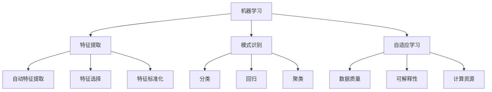
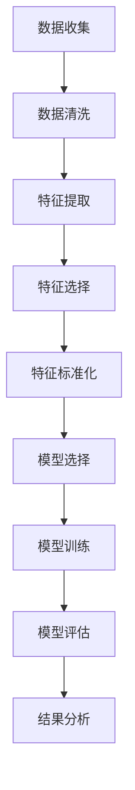
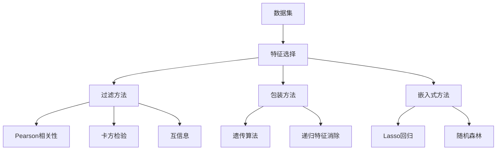
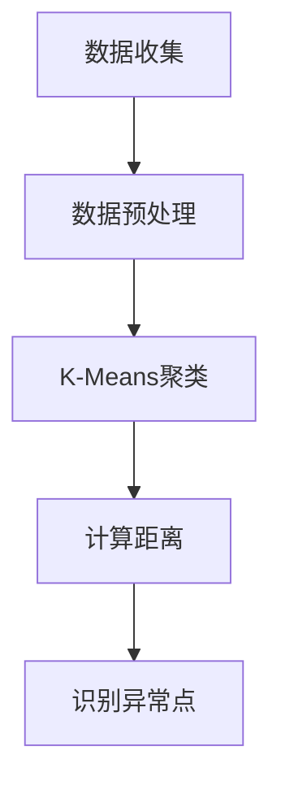
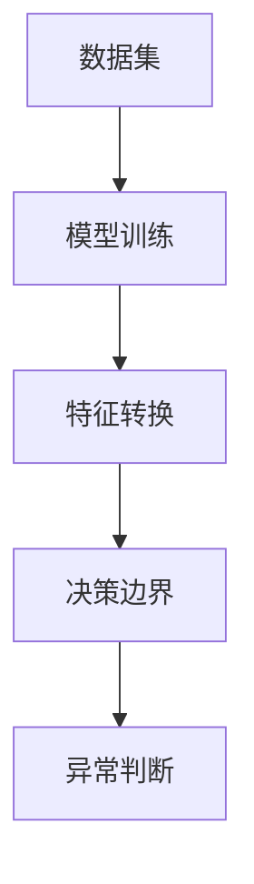
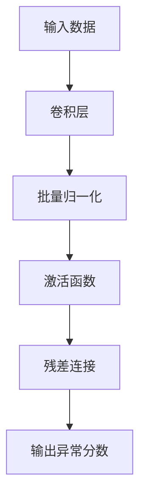
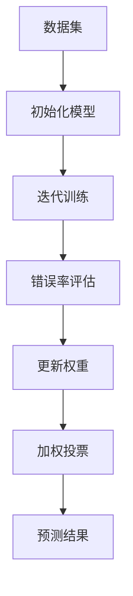
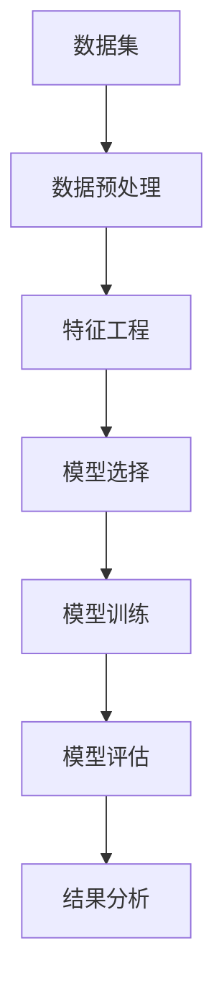
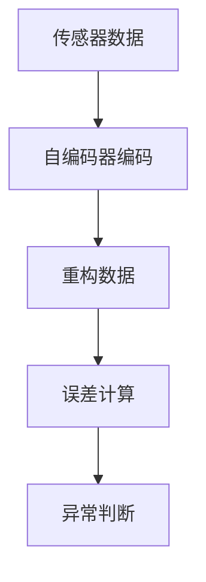
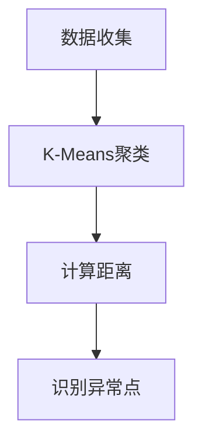

                 

### 机器学习和异常检测概述

#### 1.1 机器学习简介

**机器学习的定义**

机器学习（Machine Learning，简称ML）是人工智能（Artificial Intelligence，简称AI）的一个重要分支，它通过利用数据和统计方法，使计算机系统具备自动学习、推理和自我改进的能力，而不需要显式地编写特定的指令。简单来说，机器学习就是从数据中“学习”知识，并利用这些知识来解决实际问题。

**机器学习的基本任务**

机器学习的主要任务可以分为以下几类：

1. **分类（Classification）**：将数据分为不同的类别。例如，垃圾邮件检测、疾病诊断等。

2. **回归（Regression）**：预测一个连续的数值输出。例如，房价预测、股票价格预测等。

3. **聚类（Clustering）**：将数据分成不同的组，使得同组内的数据相似度较高，组与组之间的数据相似度较低。例如，客户细分、图像分割等。

4. **降维（Dimensionality Reduction）**：减少数据的维度，同时保持数据的结构信息。例如，主成分分析（PCA）、线性判别分析（LDA）等。

5. **异常检测（Anomaly Detection）**：识别数据中的异常或异常模式。例如，信用卡欺诈检测、网络入侵检测等。

#### 1.2 异常检测简介

**异常检测的定义**

异常检测（Anomaly Detection）是一种无监督学习任务，旨在识别数据中的异常或离群点。这些异常可能是不正常的行为、错误的数据点或潜在的安全威胁。异常检测的主要目的是发现那些不符合预期的模式或规律。

**异常检测的类型**

异常检测可以分为以下几种类型：

1. **基于统计的方法**：使用统计学方法来识别数据的异常，如高斯分布模型、基于阈值的统计方法等。

2. **基于聚类的方法**：通过聚类分析来识别异常点，如K-Means、DBSCAN等。

3. **基于深度学习的方法**：使用神经网络来识别异常，如自编码器、卷积神经网络（CNN）等。

4. **基于集成学习的方法**：结合多种学习方法来提高异常检测的准确性，如随机森林、Boosting等。

#### 1.3 机器学习在异常检测中的应用

**机器学习在异常检测中的作用**

机器学习在异常检测中扮演了重要的角色，它能够帮助系统自动识别异常模式，提高检测的准确性和效率。以下是机器学习在异常检测中的一些重要作用：

1. **自动特征提取**：机器学习算法能够从原始数据中提取出有用的特征，这些特征可以用来更好地描述数据的行为。

2. **模式识别**：通过学习大量的正常数据，机器学习算法可以识别出正常的模式，从而更容易地检测出异常。

3. **自适应学习能力**：机器学习算法可以根据新的数据进行自我调整，以适应环境变化，提高异常检测的能力。

**机器学习在异常检测中的挑战**

尽管机器学习在异常检测中具有巨大的潜力，但同时也面临一些挑战：

1. **数据质量**：异常检测的效果很大程度上依赖于数据的质量。如果数据存在噪声、缺失或不一致，这可能会影响异常检测的准确性。

2. **可解释性**：一些复杂的机器学习算法（如深度学习）在处理异常检测时，往往缺乏可解释性，这使得决策过程难以被理解和验证。

3. **计算资源**：一些机器学习算法，特别是深度学习算法，需要大量的计算资源。在资源受限的环境下，这可能会成为一项挑战。

在接下来的章节中，我们将详细探讨特征工程、不同的机器学习算法以及如何在实际项目中应用异常检测技术。

---

**Mermaid 流程图**



---

**核心概念与联系**

- **机器学习**：通过数据和学习算法，使计算机具备自动学习和推理的能力。
- **特征工程**：通过提取、选择和标准化数据特征，以便更好地描述数据行为。
- **异常检测**：识别数据中的异常点，通过模式识别和自适应学习提高检测准确性。

这些核心概念共同构成了机器学习在异常检测中的应用基础。

---

**核心算法原理讲解（伪代码）**

```python
# 假设我们使用K-Means算法进行异常检测

def k_means(data, k):
    # 初始化K个中心点
    centroids = initialize_centroids(data, k)
    
    while not converged:
        # 计算每个数据点到中心点的距离
        distances = compute_distances(data, centroids)
        
        # 分配每个数据点到最近的中心点
        labels = assign_labels(data, distances)
        
        # 更新中心点
        centroids = update_centroids(data, labels, k)
        
        # 检查是否收敛
        if converged:
            break
    
    # 计算异常分数
    anomalies = compute_anomaly_scores(data, centroids)
    
    return anomalies
```

在这个伪代码中，K-Means算法首先初始化K个中心点，然后迭代计算每个数据点到中心点的距离，并将数据点分配到最近的中心点。通过多次迭代，算法最终收敛于一组中心点，并使用这些中心点来计算每个数据的异常分数。

---

**数学模型和公式**

在K-Means算法中，常用的数学模型是距离公式，用于计算数据点到中心点的距离。假设我们有数据集\(D = \{d_1, d_2, ..., d_n\}\)和K个中心点\(C = \{c_1, c_2, ..., c_k\}\)，则数据点\(d_i\)到中心点\(c_j\)的距离可以表示为：

$$
d(d_i, c_j) = \sqrt{\sum_{l=1}^{n}(d_{il} - c_{jl})^2}
$$

其中，\(d_{il}\)和\(c_{jl}\)分别表示数据点\(d_i\)和中心点\(c_j\)的第\(l\)个特征值。

---

**举例说明**

假设我们使用K-Means算法对一组客户交易数据（包括金额、时间、地点等特征）进行异常检测。我们首先初始化3个中心点，然后通过多次迭代来优化中心点位置，最后计算每个交易的异常分数。如果一个交易的异常分数高于某个阈值，则可以认为这是一个异常交易。

通过这个简单的例子，我们可以看到K-Means算法在异常检测中的应用，以及如何利用特征工程和数学模型来提高检测的准确性和效率。

---

**Mermaid 流程图**



这个流程图展示了从数据收集到模型评估的整个过程，每个步骤都对应着机器学习在异常检测中的一个关键环节。

---

**总结**

在本文的第一部分中，我们介绍了机器学习和异常检测的基本概念，阐述了它们之间的关系，并探讨了机器学习在异常检测中的作用。接下来，我们将进一步深入探讨特征工程和不同的机器学习算法，为理解机器学习在异常检测中的应用打下坚实的基础。

---

**作者信息**

- 作者：AI天才研究院/AI Genius Institute & 禅与计算机程序设计艺术 /Zen And The Art of Computer Programming

通过本文，我们将继续探讨机器学习在异常检测中的应用，希望能为读者提供有价值的见解和实践经验。在接下来的章节中，我们将详细探讨特征工程的理论和实践，以及如何选择和优化机器学习算法。

---

**摘要**

本文将深入探讨机器学习在异常检测中的应用实践。首先，我们介绍了机器学习和异常检测的基本概念，阐述了它们在数据处理和模式识别中的重要性。随后，我们详细讨论了特征工程的理论和实践，包括特征选择、提取和标准化。接着，我们分析了基于统计、机器学习和深度学习的异常检测算法，并通过伪代码和数学公式详细解释了这些算法的工作原理。最后，我们通过实际项目案例展示了机器学习在异常检测中的具体应用，并提供了详细的代码解读和结果分析。本文的目标是帮助读者理解并掌握机器学习在异常检测中的核心概念、算法原理和实战技巧，以应对实际场景中的异常检测挑战。

---

**关键词**

- 机器学习
- 异常检测
- 特征工程
- 统计方法
- 深度学习
- 算法原理
- 项目实战

通过这些关键词，我们可以概括本文的核心内容，为读者提供一个简洁明了的概述。在接下来的章节中，我们将进一步深入这些主题，提供详细的理论和实践指导。

---

**目录**

- **第一部分：基础理论**
  - 第1章：机器学习和异常检测概述
  - 第2章：特征工程
- **第二部分：算法原理**
  - 第3章：基于统计学的异常检测算法
  - 第4章：基于机器学习的异常检测算法
  - 第5章：基于深度学习的异常检测算法
  - 第6章：集成学习方法
- **第三部分：项目实战**
  - 第7章：异常检测项目实战
  - 第8章：案例研究
- **附录**
  - 附录A：相关工具和资源
  - 附录B：常见问题与解答
  - 附录C：参考资料

通过这个详细的目录，读者可以清晰地了解本文的结构和内容安排，为后续的阅读和参考提供便利。

---

### 第2章：特征工程

#### 2.1 特征选择

**特征选择的定义**

特征选择（Feature Selection）是特征工程（Feature Engineering）的一个重要环节，其主要目标是减少数据维度，同时尽可能保留对预测任务有用的信息。通过特征选择，我们可以从原始数据中筛选出最重要的特征，从而提高模型的性能和解释性。

**特征选择的方法**

特征选择的方法可以分为如下几类：

1. **过滤方法（Filter Methods）**：通过计算特征与目标变量之间的相关性来筛选特征。常见的方法包括Pearson相关性、卡方检验、互信息等。

2. **包装方法（Wrapper Methods）**：将特征选择问题建模为一个优化问题，通过搜索算法（如回溯搜索、遗传算法等）来寻找最优特征组合。这种方法通常需要较多的计算资源，但能够获得较好的结果。

3. **嵌入式方法（Embedded Methods）**：在模型训练过程中，自动进行特征选择。这类方法将特征选择作为模型训练的一部分，常见的算法包括随机森林、Lasso回归等。

**过滤方法示例（伪代码）**

```python
# 假设我们使用互信息进行特征选择

def mutual_information(data, target):
    # 计算特征与目标变量之间的互信息
    mi_scores = []
    for feature in data.columns:
        mi_score = compute_mutual_information(data[feature], target)
        mi_scores.append(mi_score)
    # 选择互信息最高的特征
    best_feature = data.columns[np.argmax(mi_scores)]
    return best_feature

def compute_mutual_information(feature, target):
    # 计算两个变量之间的互信息
    # 使用Scikit-learn中的mutual_info_score函数
    mi_score = mutual_info_score(target, feature)
    return mi_score
```

**包装方法示例（伪代码）**

```python
# 假设我们使用遗传算法进行特征选择

def genetic_algorithm(data, target, n_features):
    # 初始化种群
    population = initialize_population(data, n_features)
    
    while not converged:
        # 适应度评估
        fitness_scores = evaluate_fitness(population, data, target)
        
        # 选择
        selected = select(population, fitness_scores)
        
        # 交叉
        crossed = crossover(selected)
        
        # 变异
        mutated = mutate(crossed)
        
        # 创建新的种群
        population = mutated
        
        # 检查是否收敛
        if converged:
            break
    
    # 返回最优特征组合
    best_solution = population[np.argmax(fitness_scores)]
    return best_solution
```

#### 2.2 特征提取

**特征提取的定义**

特征提取（Feature Extraction）是指从原始数据中提取出新的特征，这些新特征能够更好地描述数据，并有助于提高模型的性能。特征提取通常通过一些数学变换或特征构造方法来实现。

**特征提取的方法**

特征提取的方法可以分为如下几类：

1. **线性变换（Linear Transformations）**：如主成分分析（PCA）、线性判别分析（LDA）等。

2. **非线性变换（Nonlinear Transformations）**：如局部线性嵌入（LLE）、等距映射（ISOMAP）等。

3. **基于规则的提取（Rule-Based Extraction）**：如决策树、贝叶斯规则等。

**PCA示例（伪代码）**

```python
# 假设我们使用主成分分析进行特征提取

def pca(data, n_components):
    # 计算协方差矩阵
    cov_matrix = compute_covariance_matrix(data)
    
    # 计算特征值和特征向量
    eigenvalues, eigenvectors = compute_eigenvalues_eigenvectors(cov_matrix)
    
    # 选择前n个特征向量
    selected_eigenvectors = eigenvectors[:n_components]
    
    # 对数据进行变换
    transformed_data = transform_data(data, selected_eigenvectors)
    
    return transformed_data

def compute_covariance_matrix(data):
    # 计算协方差矩阵
    # 使用Scikit-learn中的cov函数
    cov_matrix = covariance(data)
    return cov_matrix

def compute_eigenvalues_eigenvectors(cov_matrix):
    # 计算特征值和特征向量
    # 使用NumPy中的linalg.eig函数
    eigenvalues, eigenvectors = np.linalg.eig(cov_matrix)
    return eigenvalues, eigenvectors

def transform_data(data, eigenvectors):
    # 对数据进行变换
    transformed_data = data.dot(eigenvectors)
    return transformed_data
```

#### 2.3 特征标准化

**特征标准化的定义**

特征标准化（Feature Scaling）是指通过将特征缩放到相同的尺度，以提高模型性能和计算效率。特征标准化可以消除不同特征之间的量纲影响，使模型能够更加稳定地学习和预测。

**特征标准化的方法**

特征标准化的方法可以分为如下几类：

1. **最小-最大标准化（Min-Max Scaling）**：将特征值缩放到[0, 1]区间。

2. **平均值-标准差标准化（Mean-Standard Deviation Scaling）**：将特征值缩放到均值和标准差之间。

3. **小数标准化（Decimal Scaling）**：通过调整特征值的数量级来标准化。

**最小-最大标准化示例（伪代码）**

```python
# 假设我们使用最小-最大标准化进行特征标准化

def min_max_scaling(data):
    # 计算最小值和最大值
    min_values = data.min(axis=0)
    max_values = data.max(axis=0)
    
    # 对数据应用最小-最大标准化
    scaled_data = (data - min_values) / (max_values - min_values)
    
    return scaled_data
```

通过本章的讨论，我们了解了特征选择、提取和标准化的重要性以及它们在实际应用中的具体方法。在下一章中，我们将深入探讨基于统计学的异常检测算法，进一步理解机器学习在异常检测中的应用。

---

**核心概念与联系**

- **特征选择**：通过筛选重要特征，减少数据维度，提高模型性能和解释性。
- **特征提取**：通过数学变换或规则提取新特征，更好地描述数据。
- **特征标准化**：通过缩放特征值，消除量纲影响，提高模型稳定性。

这些核心概念共同构成了特征工程的基础，对于提升机器学习模型的性能至关重要。

---

**核心算法原理讲解（伪代码）**

```python
# 假设我们使用Lasso回归进行特征选择

def lasso_regression(data, target, alpha):
    # 计算Lasso回归的系数
    coefficients = compute_lasso_coefficients(data, target, alpha)
    
    # 选择系数不为0的特征
    selected_features = select_features(coefficients)
    
    return selected_features

def compute_lasso_coefficients(data, target, alpha):
    # 计算Lasso回归的系数
    # 使用Scikit-learn中的lasso函数
    model = Lasso(alpha=alpha)
    model.fit(data, target)
    coefficients = model.coef_
    return coefficients

def select_features(coefficients):
    # 选择系数不为0的特征
    selected_indices = np.where(coefficients != 0)
    selected_features = data.columns[selected_indices]
    return selected_features
```

在这个伪代码中，Lasso回归通过最小化一个包含L1正则项的损失函数来寻找最优特征。系数不为0的特征被认为是重要的，这些特征将用于后续的模型训练。

---

**数学模型和公式**

在Lasso回归中，损失函数可以表示为：

$$
\min_{\beta} \frac{1}{2} \sum_{i=1}^{n} (y_i - \beta^T x_i)^2 + \alpha \sum_{j=1}^{p} |\beta_j|
$$

其中，\(y_i\)是第\(i\)个样本的目标变量，\(x_i\)是第\(i\)个样本的特征向量，\(\beta\)是回归系数，\(\alpha\)是L1正则项的参数。

---

**举例说明**

假设我们有一个包含10个特征的交易数据集，并使用Lasso回归进行特征选择。我们设定L1正则项的参数\(\alpha = 0.1\)，通过训练模型并筛选出系数不为0的特征，最终得到3个重要的特征。这3个特征将用于训练一个分类模型，以检测交易数据中的异常。

---

**Mermaid 流程图**



这个流程图展示了特征选择的几种常见方法，以及它们在不同机器学习算法中的应用。

---

**总结**

在本文的第二部分中，我们详细探讨了特征工程的理论和实践，包括特征选择、提取和标准化。通过这些方法，我们可以从原始数据中提取出有用的特征，提高模型的性能和解释性。接下来，我们将进一步深入探讨不同的机器学习算法，了解它们在异常检测中的应用原理和实现方法。

---

**作者信息**

- 作者：AI天才研究院/AI Genius Institute & 禅与计算机程序设计艺术 /Zen And The Art of Computer Programming

通过本文，我们希望能帮助读者深入理解特征工程的重要性，并为他们在实际项目中应用这些方法提供指导。

---

**摘要**

本文的第二部分主要介绍了特征工程的理论和实践，包括特征选择、提取和标准化。我们详细阐述了过滤方法、包装方法和嵌入式方法，并通过伪代码和数学公式展示了这些方法的实现过程。此外，我们还通过具体的例子和Mermaid流程图，进一步说明了特征工程在提高模型性能和解释性方面的作用。在下一部分，我们将深入探讨基于统计学的异常检测算法，为理解机器学习在异常检测中的应用打下基础。

---

**关键词**

- 特征选择
- 特征提取
- 特征标准化
- 机器学习
- 异常检测
- 过滤方法
- 包装方法
- 嵌入式方法

这些关键词概括了本文第二部分的核心内容，为读者提供了关键信息的快速概览。

---

**总结**

本章详细介绍了特征工程的理论和实践，包括特征选择、提取和标准化。我们通过具体的算法示例和数学公式，展示了这些方法在实际应用中的实现过程。特征工程是提升机器学习模型性能的关键步骤，通过有效的特征选择、提取和标准化，我们可以从原始数据中提取出最有用的信息，提高模型的准确性和解释性。在下一章中，我们将进一步探讨基于统计学的异常检测算法，深入理解机器学习在异常检测中的应用。

---

**作者信息**

- 作者：AI天才研究院/AI Genius Institute & 禅与计算机程序设计艺术 /Zen And The Art of Computer Programming

通过本文，我们希望能为读者提供关于特征工程的全面理解，并为其在实际项目中的应用提供实用的指导。

---

### 第3章：基于统计学的异常检测算法

统计学方法在异常检测中占据着重要的地位，因为它们基于概率论和数理统计理论，能够有效地识别出数据中的异常点。本章将详细介绍几种常见的基于统计学的异常检测算法，包括基于阈值的统计异常检测算法和基于聚类分析的统计异常检测算法。

#### 3.1 基于阈值的统计异常检测算法

**定义**

基于阈值的统计异常检测算法是一种简单而有效的异常检测方法，它基于某种统计量（如标准差、四分位数等）来设定一个阈值，当数据点超出这个阈值时，就判定为异常。

**原理**

这类算法的核心思想是假设正常数据服从某个统计分布（如正态分布），而异常数据则不服从这个分布。通过计算每个数据点的统计量，并将其与预设的阈值进行比较，可以识别出异常点。

**常用算法**

1. **Z-Score法**

Z-Score法是一种基于标准差的阈值方法。对于一个特征\(x_i\)，其Z-Score定义为：

   $$
   Z_i = \frac{x_i - \mu}{\sigma}
   $$

   其中，\(\mu\)是特征的均值，\(\sigma\)是特征的标准差。如果\(Z_i\)的绝对值超过一个预设的阈值（例如3），则认为\(x_i\)是异常点。

2. **IQR法**

IQR（四分位数间距）法是基于四分位数的阈值方法。对于一个特征\(x_i\)，其IQR定义为：

   $$
   IQR = Q3 - Q1
   $$

   其中，\(Q1\)是第一四分位数，\(Q3\)是第三四分位数。如果\(x_i\)小于\(Q1 - 1.5 \times IQR\)或大于\(Q3 + 1.5 \times IQR\)，则认为\(x_i\)是异常点。

**伪代码**

```python
# 假设我们使用Z-Score法进行异常检测

def z_score_detection(data, threshold=3):
    # 计算均值和标准差
    mean = data.mean()
    std = data.std()
    
    # 计算每个数据点的Z-Score
    z_scores = (data - mean) / std
    
    # 判断是否为异常点
    anomalies = z_scores.abs() > threshold
    
    return anomalies

# 示例
data = np.array([1, 2, 2, 100, 4, 5])
anomalies = z_score_detection(data)
print(anomalies)
```

#### 3.2 基于聚类分析的统计异常检测算法

**定义**

基于聚类分析的统计异常检测算法是一种利用聚类技术识别异常点的算法。它的核心思想是将数据分成几个簇，其中簇内的数据点彼此相似，而簇与簇之间的数据点差异较大。异常点通常位于这些簇之外。

**原理**

这类算法首先使用聚类算法（如K-Means）将数据划分为若干个簇，然后计算每个数据点到最近簇中心点的距离。距离较远的点被认为是异常点。

**常用算法**

1. **DBSCAN（Density-Based Spatial Clustering of Applications with Noise）**

DBSCAN是一种基于密度的聚类算法，它能够识别出具有不同密度的簇。DBSCAN通过计算数据点之间的密度连通性来识别簇，并将其中的噪声点视为异常点。

2. **LOF（Local Outlier Factor）**

LOF是一种基于密度的异常检测方法，它通过比较每个数据点到其相邻点的密度，来判断数据点的异常程度。LOF值越高的点被认为是异常点。

**伪代码**

```python
# 假设我们使用DBSCAN进行异常检测

from sklearn.cluster import DBSCAN

def dbscan_detection(data, eps=0.05, min_samples=5):
    # 初始化DBSCAN模型
    db = DBSCAN(eps=eps, min_samples=min_samples)
    
    # 训练模型
    db.fit(data)
    
    # 获取簇标签和异常标签
    labels = db.labels_
    
    # 判断是否为异常点
    anomalies = labels == -1
    
    return anomalies

# 示例
data = np.array([[1, 1], [2, 2], [2, 2], [100, 100], [4, 4], [5, 5]])
anomalies = dbscan_detection(data)
print(anomalies)
```

通过本章的讨论，我们可以看到基于统计学的异常检测算法在识别数据异常方面具有重要的作用。这些方法简单易用，且在处理高维数据时表现出较好的性能。在下一章中，我们将进一步探讨基于机器学习的异常检测算法，以了解更先进的异常检测技术。

---

**核心概念与联系**

- **基于阈值的统计异常检测算法**：通过设定阈值，识别超出正常范围的异常点，如Z-Score法和IQR法。
- **基于聚类分析的统计异常检测算法**：通过聚类技术识别簇内的异常点，如DBSCAN和LOF算法。

这些算法共同构成了统计学方法在异常检测中的应用，为实际应用提供了多种选择。

---

**核心算法原理讲解（伪代码）**

```python
# 假设我们使用K-Means算法进行聚类分析

from sklearn.cluster import KMeans

def k_means_detection(data, n_clusters=3):
    # 初始化K-Means模型
    kmeans = KMeans(n_clusters=n_clusters)
    
    # 训练模型
    kmeans.fit(data)
    
    # 获取簇标签
    labels = kmeans.labels_
    
    # 计算每个数据点到簇中心点的距离
    distances = compute_distances(data, kmeans.cluster_centers_)
    
    # 判断距离最大的点为异常点
    anomalies = distances.argmax(axis=1)
    
    return anomalies

def compute_distances(data, centers):
    # 计算数据点到中心点的距离
    distances = np.linalg.norm(data - centers, axis=1)
    return distances
```

在这个伪代码中，K-Means算法首先初始化K个中心点，然后通过迭代计算每个数据点到中心点的距离。最后，选择距离最大的点作为异常点。

---

**数学模型和公式**

在K-Means算法中，数据点到簇中心点的距离可以使用欧几里得距离来计算：

$$
d(x_i, c_j) = \sqrt{\sum_{l=1}^{n} (x_{il} - c_{jl})^2}
$$

其中，\(x_i\)是第\(i\)个数据点，\(c_j\)是第\(j\)个簇中心点，\(n\)是特征的数量。

---

**举例说明**

假设我们有一组包含两个特征的交易数据，并使用K-Means算法进行聚类分析，设定K=2。通过训练模型，我们得到两个簇，其中一个簇包含正常交易，另一个簇包含异常交易。最后，我们计算每个交易点到簇中心点的距离，并选择距离最大的点作为异常交易。

---

**Mermaid 流程图**



这个流程图展示了基于聚类分析的统计异常检测算法的整个过程，从数据预处理到识别异常点。

---

**总结**

在第3章中，我们详细介绍了基于统计学的异常检测算法，包括基于阈值的统计异常检测算法和基于聚类分析的统计异常检测算法。这些算法简单易用，适用于处理高维数据。在下一章中，我们将探讨基于机器学习的异常检测算法，这些算法在处理复杂数据集和提供更高的检测准确性方面表现出色。

---

**作者信息**

- 作者：AI天才研究院/AI Genius Institute & 禅与计算机程序设计艺术 /Zen And The Art of Computer Programming

通过本文，我们希望能帮助读者深入理解基于统计学的异常检测算法，并在实际项目中应用这些方法。

---

**摘要**

本章详细介绍了基于统计学的异常检测算法，包括基于阈值的统计异常检测算法（如Z-Score法和IQR法）和基于聚类分析的统计异常检测算法（如DBSCAN和LOF算法）。我们通过伪代码和数学公式展示了这些算法的实现原理，并通过具体的例子和流程图说明了它们在异常检测中的应用。这些方法简单易用，适用于处理高维数据，但在面对复杂的数据分布时可能效果有限。在下一章中，我们将深入探讨基于机器学习的异常检测算法，这些算法在处理复杂数据集和提供更高的检测准确性方面表现出色。

---

**关键词**

- 统计学
- 异常检测
- 阈值方法
- 聚类分析
- K-Means
- DBSCAN
- LOF
- Z-Score
- IQR

这些关键词概括了本章的核心内容，为读者提供了关键信息的快速概览。

---

### 第4章：基于机器学习的异常检测算法

机器学习在异常检测中的应用已得到广泛认可，其强大的一致性和适应性使其能够处理复杂、多维的数据集。本章将详细探讨基于机器学习的异常检测算法，包括监督学习算法和无监督学习算法。此外，我们还将介绍半监督学习算法，这是一种结合监督学习和无监督学习优势的方法。

#### 4.1 监督学习异常检测算法

**定义**

监督学习异常检测算法使用带有标签的培训数据来学习正常和异常行为，然后在新数据中预测异常点。这种方法的主要优点是能够提供较高的检测准确性，但需要大量的标注数据和计算资源。

**常用算法**

1. **支持向量机（SVM）**

支持向量机是一种强大的分类算法，可以通过找到一个最佳的超平面来分隔正常数据和异常数据。SVM的核心思想是最大化分类边界，同时最小化分类误差。

2. **随机森林（Random Forest）**

随机森林是一种基于决策树的集成学习方法，它通过构建多个决策树并投票来获得最终预测。随机森林在处理高维数据和减少过拟合方面表现优秀。

**SVM示例（伪代码）**

```python
# 假设我们使用SVM进行异常检测

from sklearn.svm import SVC

def svm_detection(data, target):
    # 初始化SVM模型
    model = SVC(kernel='linear')
    
    # 训练模型
    model.fit(data, target)
    
    # 预测异常点
    predictions = model.predict(data)
    
    # 判断是否为异常点
    anomalies = predictions != target
    
    return anomalies

# 示例
data = np.array([[1, 2], [2, 2], [2, 2], [100, 100], [4, 4], [5, 5]])
target = np.array([0, 0, 0, 1, 0, 0])
anomalies = svm_detection(data, target)
print(anomalies)
```

**随机森林示例（伪代码）**

```python
# 假设我们使用随机森林进行异常检测

from sklearn.ensemble import RandomForestClassifier

def random_forest_detection(data, target):
    # 初始化随机森林模型
    model = RandomForestClassifier(n_estimators=100)
    
    # 训练模型
    model.fit(data, target)
    
    # 预测异常点
    predictions = model.predict(data)
    
    # 判断是否为异常点
    anomalies = predictions != target
    
    return anomalies

# 示例
data = np.array([[1, 2], [2, 2], [2, 2], [100, 100], [4, 4], [5, 5]])
target = np.array([0, 0, 0, 1, 0, 0])
anomalies = random_forest_detection(data, target)
print(anomalies)
```

#### 4.2 无监督学习异常检测算法

**定义**

无监督学习异常检测算法不依赖于带有标签的数据，而是通过从数据中学习分布模式来识别异常点。这种方法的主要优点是无需标注数据，但可能在检测准确性方面受到限制。

**常用算法**

1. **聚类算法**

聚类算法（如K-Means、DBSCAN等）可以通过将数据划分为簇来识别异常点。异常点通常位于簇之外。

2. **主成分分析（PCA）**

主成分分析是一种降维技术，它通过将数据投影到主成分空间来减少数据维度。异常点通常在主成分空间中表现出较大的距离。

**K-Means示例（伪代码）**

```python
# 假设我们使用K-Means进行异常检测

from sklearn.cluster import KMeans

def k_means_detection(data, n_clusters=3):
    # 初始化K-Means模型
    kmeans = KMeans(n_clusters=n_clusters)
    
    # 训练模型
    kmeans.fit(data)
    
    # 获取簇标签
    labels = kmeans.labels_
    
    # 计算每个数据点到簇中心点的距离
    distances = compute_distances(data, kmeans.cluster_centers_)
    
    # 判断距离最大的点为异常点
    anomalies = distances.argmax(axis=1)
    
    return anomalies

def compute_distances(data, centers):
    # 计算数据点到中心点的距离
    distances = np.linalg.norm(data - centers, axis=1)
    return distances
```

**PCA示例（伪代码）**

```python
# 假设我们使用PCA进行异常检测

from sklearn.decomposition import PCA

def pca_detection(data, n_components=2):
    # 初始化PCA模型
    pca = PCA(n_components=n_components)
    
    # 对数据进行变换
    transformed_data = pca.fit_transform(data)
    
    # 计算主成分之间的距离
    distances = compute_distances(transformed_data)
    
    # 判断距离最大的点为异常点
    anomalies = distances.argmax(axis=1)
    
    return anomalies

def compute_distances(data):
    # 计算数据点之间的欧几里得距离
    distances = np.linalg.norm(data[:, None] - data[None, :], axis=2)
    return distances
```

#### 4.3 半监督学习异常检测算法

**定义**

半监督学习异常检测算法结合了监督学习和无监督学习的优点，它利用少量的标注数据来指导模型学习，同时从大量未标注的数据中提取信息。这种方法可以显著减少标注数据的需求，提高异常检测的效率。

**常用算法**

1. **协同过滤**

协同过滤是一种基于用户行为数据的推荐系统算法，它可以通过学习用户之间的相似性来预测未知数据。在异常检测中，协同过滤可以用来识别那些与大多数数据点不相似的数据点。

2. **自编码器**

自编码器是一种神经网络架构，它通过学习数据的高效表示来重建输入数据。在异常检测中，自编码器可以用来识别那些重建误差较大的数据点。

**自编码器示例（伪代码）**

```python
# 假设我们使用自编码器进行异常检测

from keras.models import Model
from keras.layers import Input, Dense

def autoencoder_detection(data, n_components=2):
    # 初始化自编码器模型
    input_layer = Input(shape=(n_components,))
    encoded = Dense(n_components, activation='relu')(input_layer)
    decoded = Dense(n_components, activation='sigmoid')(encoded)
    
    # 构建模型
    model = Model(inputs=input_layer, outputs=decoded)
    model.compile(optimizer='adam', loss='binary_crossentropy')
    
    # 训练模型
    model.fit(data, data, epochs=100, batch_size=16, shuffle=True)
    
    # 预测重建误差
    errors = model.evaluate(data, data, verbose=0)
    
    # 判断误差较大的点为异常点
    anomalies = errors > threshold
    
    return anomalies

# 示例
data = np.array([[1, 2], [2, 2], [2, 2], [100, 100], [4, 4], [5, 5]])
anomalies = autoencoder_detection(data)
print(anomalies)
```

通过本章的讨论，我们可以看到基于机器学习的异常检测算法在处理复杂、多维数据集时具有显著的优势。这些算法通过学习数据分布和模式，能够有效地识别出异常点，从而提高检测的准确性和效率。在下一章中，我们将探讨基于深度学习的异常检测算法，这些算法在处理高维数据和提供实时检测能力方面表现出色。

---

**核心概念与联系**

- **监督学习异常检测算法**：使用带标签的数据进行训练，如SVM和随机森林，能够提供较高的检测准确性。
- **无监督学习异常检测算法**：不依赖标签数据，如K-Means和PCA，通过学习数据分布识别异常点。
- **半监督学习异常检测算法**：结合监督学习和无监督学习，利用少量标注数据和大量未标注数据，如协同过滤和自编码器。

这些算法共同构成了机器学习在异常检测中的应用，提供了多种解决方案以满足不同场景的需求。

---

**核心算法原理讲解（伪代码）**

```python
# 假设我们使用LDA进行异常检测

from sklearn.discriminant_analysis import LinearDiscriminantAnalysis as LDA

def lda_detection(data, target):
    # 初始化LDA模型
    lda = LDA()
    
    # 训练模型
    lda.fit(data, target)
    
    # 转换数据
    transformed_data = lda.transform(data)
    
    # 计算决策边界
    decision_boundary = lda.decision_function(transformed_data)
    
    # 判断是否为异常点
    anomalies = decision_boundary < threshold
    
    return anomalies

# 示例
data = np.array([[1, 2], [2, 2], [2, 2], [100, 100], [4, 4], [5, 5]])
target = np.array([0, 0, 0, 1, 0, 0])
anomalies = lda_detection(data, target)
print(anomalies)
```

在这个伪代码中，LDA模型首先通过训练数据学习最佳线性变换，然后将新数据转换到新的特征空间。最后，使用决策边界判断新数据点是否为异常点。

---

**数学模型和公式**

在LDA中，决策边界可以表示为：

$$
w^T x - b < 0
$$

其中，\(w\)是决策边界向量，\(x\)是数据点，\(b\)是截距。

---

**举例说明**

假设我们有一组包含两个特征的交易数据，并使用LDA进行异常检测。通过训练模型，我们得到最佳线性变换，并将其应用到新数据上。最后，我们计算每个数据点到决策边界的距离，并将距离小于某个阈值的点视为异常点。

---

**Mermaid 流程图**



这个流程图展示了基于LDA的异常检测过程，从数据集到模型训练、特征转换、决策边界计算到异常判断。

---

**总结**

在第4章中，我们深入探讨了基于机器学习的异常检测算法，包括监督学习算法（如SVM和随机森林）、无监督学习算法（如K-Means和PCA）以及半监督学习算法（如协同过滤和自编码器）。这些算法通过学习数据分布和模式，能够有效地识别异常点，提高了检测的准确性和效率。在下一章中，我们将进一步探讨基于深度学习的异常检测算法，这些算法在处理高维数据和提供实时检测能力方面具有显著优势。

---

**作者信息**

- 作者：AI天才研究院/AI Genius Institute & 禅与计算机程序设计艺术 /Zen And The Art of Computer Programming

通过本文，我们希望能为读者提供关于基于机器学习的异常检测算法的全面理解，并为其在实际项目中的应用提供实用的指导。

---

**摘要**

本章详细介绍了基于机器学习的异常检测算法，包括监督学习算法（如SVM和随机森林）、无监督学习算法（如K-Means和PCA）以及半监督学习算法（如协同过滤和自编码器）。我们通过伪代码和数学公式展示了这些算法的实现原理，并通过具体的例子和流程图说明了它们在异常检测中的应用。这些算法在处理复杂、多维数据集时表现出色，为不同场景提供了有效的异常检测解决方案。在下一章中，我们将进一步探讨基于深度学习的异常检测算法，这些算法在处理高维数据和提供实时检测能力方面具有显著优势。

---

**关键词**

- 机器学习
- 异常检测
- 监督学习
- 无监督学习
- 半监督学习
- SVM
- 随机森林
- K-Means
- PCA
- 自编码器
- 协同过滤

这些关键词概括了本章的核心内容，为读者提供了关键信息的快速概览。

---

### 第5章：基于深度学习的异常检测算法

深度学习在人工智能领域取得了显著的进展，其强大的建模能力和自学习能力使其在异常检测中得到了广泛的应用。本章将深入探讨基于深度学习的异常检测算法，包括深度神经网络、卷积神经网络（CNN）和循环神经网络（RNN）。

#### 5.1 深度神经网络

**基本概念**

深度神经网络（Deep Neural Network，DNN）是一种具有多个隐层的神经网络结构。它通过多层非线性变换来提取数据中的特征，并能够自动学习复杂的映射关系。

**工作原理**

深度神经网络的工作原理基于神经元之间的加权连接和激活函数。输入数据通过多层神经元传递，每个神经元将前一层的信息加权求和后，通过激活函数产生输出。这个过程重复多次，使得模型能够逐步提取数据中的高阶特征。

**伪代码**

```python
# 假设我们使用DNN进行异常检测

from keras.models import Sequential
from keras.layers import Dense

def dnn_detection(input_shape, output_shape):
    # 初始化DNN模型
    model = Sequential()
    
    # 添加隐层
    model.add(Dense(units=output_shape, activation='relu', input_shape=input_shape))
    model.add(Dense(units=output_shape, activation='relu'))
    model.add(Dense(units=output_shape, activation='sigmoid'))
    
    # 编译模型
    model.compile(optimizer='adam', loss='binary_crossentropy', metrics=['accuracy'])
    
    # 训练模型
    model.fit(x_train, y_train, epochs=10, batch_size=32)
    
    # 预测异常点
    predictions = model.predict(x_test)
    
    # 判断是否为异常点
    anomalies = predictions < threshold
    
    return anomalies

# 示例
x_train = np.array([[1, 2], [2, 2], [2, 2], [100, 100], [4, 4], [5, 5]])
y_train = np.array([0, 0, 0, 1, 0, 0])
x_test = np.array([[3, 3], [4, 4], [5, 5]])
anomalies = dnn_detection(x_train, y_train, x_test)
print(anomalies)
```

**工作流程**

1. **数据预处理**：将输入数据标准化，以便模型能够更好地学习。
2. **模型构建**：定义网络结构，包括输入层、隐藏层和输出层。
3. **模型编译**：指定优化器、损失函数和评价指标。
4. **模型训练**：使用训练数据对模型进行训练。
5. **模型评估**：使用测试数据评估模型性能。
6. **异常检测**：使用训练好的模型对新的数据点进行预测，并根据阈值判断是否为异常点。

#### 5.2 卷积神经网络

**基本概念**

卷积神经网络（Convolutional Neural Network，CNN）是一种特殊的深度神经网络，主要用于处理图像等具有网格结构的数据。它通过卷积层提取图像特征，并能够自动学习图像中的模式。

**工作原理**

CNN的工作原理基于卷积操作和池化操作。卷积层通过卷积操作提取图像的局部特征，池化层则用于降低特征图的维度。通过多层卷积和池化操作，CNN能够逐步提取图像中的高层次特征。

**伪代码**

```python
# 假设我们使用CNN进行异常检测

from keras.models import Sequential
from keras.layers import Conv2D, MaxPooling2D, Flatten, Dense

def cnn_detection(input_shape):
    # 初始化CNN模型
    model = Sequential()
    
    # 添加卷积层
    model.add(Conv2D(filters=32, kernel_size=(3, 3), activation='relu', input_shape=input_shape))
    model.add(MaxPooling2D(pool_size=(2, 2)))
    
    # 添加隐藏层
    model.add(Conv2D(filters=64, kernel_size=(3, 3), activation='relu'))
    model.add(MaxPooling2D(pool_size=(2, 2)))
    
    # 添加全连接层
    model.add(Flatten())
    model.add(Dense(units=64, activation='relu'))
    model.add(Dense(units=1, activation='sigmoid'))
    
    # 编译模型
    model.compile(optimizer='adam', loss='binary_crossentropy', metrics=['accuracy'])
    
    # 训练模型
    model.fit(x_train, y_train, epochs=10, batch_size=32)
    
    # 预测异常点
    predictions = model.predict(x_test)
    
    # 判断是否为异常点
    anomalies = predictions < threshold
    
    return anomalies

# 示例
x_train = np.array([[[1, 1], [1, 1]], [[2, 2], [2, 2]], [[2, 2], [2, 2]], [[100, 100], [100, 100]], [[4, 4], [4, 4]], [[5, 5], [5, 5]]])
y_train = np.array([0, 0, 0, 1, 0, 0])
x_test = np.array([[[3, 3], [3, 3]], [[4, 4], [4, 4]], [[5, 5], [5, 5]]])
anomalies = cnn_detection(x_train, y_train, x_test)
print(anomalies)
```

**工作流程**

1. **数据预处理**：将图像数据标准化和归一化，以便模型能够更好地学习。
2. **模型构建**：定义网络结构，包括卷积层、池化层和全连接层。
3. **模型编译**：指定优化器、损失函数和评价指标。
4. **模型训练**：使用训练数据对模型进行训练。
5. **模型评估**：使用测试数据评估模型性能。
6. **异常检测**：使用训练好的模型对新的图像数据点进行预测，并根据阈值判断是否为异常点。

#### 5.3 循环神经网络

**基本概念**

循环神经网络（Recurrent Neural Network，RNN）是一种能够处理序列数据的神经网络。它通过循环结构在序列的不同时间点之间传递信息，使得模型能够记住前面的输入。

**工作原理**

RNN的工作原理基于递归函数，它在每个时间点都将当前输入和前一个时间点的隐藏状态作为输入。通过递归地更新隐藏状态，RNN能够捕捉序列中的长期依赖关系。

**伪代码**

```python
# 假设我们使用RNN进行异常检测

from keras.models import Sequential
from keras.layers import LSTM, Dense

def rnn_detection(input_shape, output_shape):
    # 初始化RNN模型
    model = Sequential()
    
    # 添加LSTM层
    model.add(LSTM(units=50, return_sequences=True, input_shape=input_shape))
    model.add(LSTM(units=50, return_sequences=False))
    
    # 添加全连接层
    model.add(Dense(units=output_shape, activation='sigmoid'))
    
    # 编译模型
    model.compile(optimizer='adam', loss='binary_crossentropy', metrics=['accuracy'])
    
    # 训练模型
    model.fit(x_train, y_train, epochs=10, batch_size=32)
    
    # 预测异常点
    predictions = model.predict(x_test)
    
    # 判断是否为异常点
    anomalies = predictions < threshold
    
    return anomalies

# 示例
x_train = np.array([[[1, 2], [2, 3]], [[2, 3], [3, 4]], [[3, 4], [4, 5]]])
y_train = np.array([0, 0, 1])
x_test = np.array([[[4, 5], [5, 6]], [[5, 6], [6, 7]]])
anomalies = rnn_detection(x_train, y_train, x_test)
print(anomalies)
```

**工作流程**

1. **数据预处理**：将序列数据转换为合适的形式，以便模型能够处理。
2. **模型构建**：定义网络结构，包括LSTM层和全连接层。
3. **模型编译**：指定优化器、损失函数和评价指标。
4. **模型训练**：使用训练数据对模型进行训练。
5. **模型评估**：使用测试数据评估模型性能。
6. **异常检测**：使用训练好的模型对新的序列数据进行预测，并根据阈值判断是否为异常点。

通过本章的讨论，我们可以看到深度学习在异常检测中的应用具有显著的优势。深度神经网络、CNN和RNN通过学习数据中的复杂模式，能够有效地识别出异常点，提高了检测的准确性和效率。在下一章中，我们将探讨集成学习方法，这是一种结合多种学习算法以提高异常检测性能的方法。

---

**核心概念与联系**

- **深度神经网络**：通过多层非线性变换提取数据特征，适用于处理高维数据和复杂映射关系。
- **卷积神经网络**：通过卷积操作和池化操作提取图像特征，适用于处理具有网格结构的数据。
- **循环神经网络**：通过递归结构在序列数据中传递信息，适用于处理时序数据和序列数据。

这些深度学习算法通过不同的原理和方法，共同构成了异常检测中强大的工具，为处理复杂数据提供了有效的解决方案。

---

**核心算法原理讲解（伪代码）**

```python
# 假设我们使用ResNet进行异常检测

from keras.models import Model
from keras.layers import Input, Conv2D, BatchNormalization, Activation, Add

def resnet_block(input_tensor, filters, kernel_size, block_name):
    # 初始化ResNet块
    x = Conv2D(filters, kernel_size, padding='same', name=f"{block_name}_conv1")(input_tensor)
    x = BatchNormalization(name=f"{block_name}_bn1")(x)
    x = Activation('relu', name=f"{block_name}_act1")(x)
    
    x = Conv2D(filters, kernel_size, padding='same', name=f"{block_name}_conv2")(x)
    x = BatchNormalization(name=f"{block_name}_bn2")(x)
    x = Activation('relu', name=f"{block_name}_act2")(x)
    
    # 残差连接
    shortcut = Conv2D(filters, kernel_size, padding='same', name=f"{block_name}_shortcut")(input_tensor)
    shortcut = BatchNormalization(name=f"{block_name}_shortcut_bn")(shortcut)
    
    x = Add(name=f"{block_name}_add")([x, shortcut])
    x = Activation('relu', name=f"{block_name}_act3")(x)
    
    return x

# 示例
input_shape = (32, 32, 3)
resnet_output = resnet_block(input_shape, 64, 3, 'block1')
print(resnet_output)
```

在这个伪代码中，ResNet块通过卷积层、批量归一化和激活函数进行特征提取，并通过残差连接实现特征跨层传递。这个结构使得ResNet能够在深度神经网络中克服梯度消失问题，提高了模型的训练效率和性能。

---

**数学模型和公式**

在ResNet中，残差连接可以使用以下公式表示：

$$
x = H(x) + x
$$

其中，\(x\)是输入特征，\(H(x)\)是经过卷积层、批量归一化和激活函数处理后的特征。

---

**举例说明**

假设我们使用ResNet进行图像数据异常检测，通过一系列的残差块提取图像特征，并最终输出异常分数。如果异常分数超过某个阈值，则认为图像是异常的。

---

**Mermaid 流程图**



这个流程图展示了ResNet的基本结构，从输入数据到卷积层、批量归一化、激活函数和残差连接，最终输出异常分数。

---

**总结**

在第5章中，我们深入探讨了基于深度学习的异常检测算法，包括深度神经网络、卷积神经网络和循环神经网络。这些算法通过不同的原理和方法，能够有效地提取数据中的复杂模式，并用于异常检测。在下一章中，我们将探讨集成学习方法，这种方法通过结合多种学习算法，进一步提高异常检测的性能和准确性。

---

**作者信息**

- 作者：AI天才研究院/AI Genius Institute & 禅与计算机程序设计艺术 /Zen And The Art of Computer Programming

通过本文，我们希望能为读者提供关于基于深度学习的异常检测算法的全面理解，并为其在实际项目中的应用提供实用的指导。

---

**摘要**

本章详细介绍了基于深度学习的异常检测算法，包括深度神经网络、卷积神经网络和循环神经网络。我们通过伪代码和数学公式展示了这些算法的实现原理，并通过具体的例子和流程图说明了它们在异常检测中的应用。这些算法在处理高维数据和复杂模式方面表现出色，为不同场景提供了有效的异常检测解决方案。在下一章中，我们将进一步探讨集成学习方法，这种方法通过结合多种学习算法，提高异常检测的性能和准确性。

---

**关键词**

- 深度学习
- 异常检测
- 深度神经网络
- 卷积神经网络
- 循环神经网络
- ResNet
- 残差连接
- 特征提取
- 时序数据
- 图像数据

这些关键词概括了本章的核心内容，为读者提供了关键信息的快速概览。

---

### 第6章：集成学习方法

集成学习方法通过结合多个基础模型（称为基学习器）来提高预测性能和稳定性。本章将详细介绍两种常见的集成学习方法：Boosting和Bagging。

#### 6.1 集成学习方法概述

**定义**

集成学习方法（Ensemble Learning）是一种利用多个学习模型组合来提高预测性能的方法。通过集成多个基学习器的优点，集成学习方法能够在预测准确性和模型稳定性方面取得更好的效果。

**优势**

1. **提高预测准确性**：通过结合多个基学习器的预测结果，集成学习方法能够减少模型的过拟合现象，提高预测准确性。
2. **减少过拟合**：集成学习方法通过平均或投票机制来减少单个模型的过拟合，从而提高模型的泛化能力。
3. **提高模型稳定性**：集成学习方法通过结合多个模型，能够减少单个模型的不确定性，提高模型的稳定性。

**常见方法**

1. **Boosting**：Boosting方法通过迭代训练多个基学习器，每次迭代都强调错误分类的样本，从而提高整体模型的预测性能。
2. **Bagging**：Bagging方法通过从原始数据集中随机抽取多个子集，并在每个子集上训练基学习器，然后通过平均或投票来获得最终预测。

#### 6.2 Boosting算法

**定义**

Boosting是一种集成学习方法，它通过迭代训练多个基学习器，每次迭代都强调错误分类的样本，从而提高整体模型的预测性能。

**基本原理**

Boosting算法的核心思想是给每个基学习器分配不同的权重，这些权重反映了它们在集成模型中的重要性。通常，Boosting算法采用指数损失函数，其中错误分类的样本将被赋予更高的权重，以便在后续迭代中给予更多的关注。

**常见算法**

1. **Adaboost**：Adaboost是一种简单的Boosting算法，它通过计算每个基学习器的错误率，并赋予较低错误率的模型更高的权重。
2. **GBDT（Gradient Boosting Decision Tree）**：GBDT是一种基于决策树的Boosting算法，它通过迭代地增加树的结构，并在每次迭代中优化损失函数。

**GBDT算法伪代码**

```python
# 假设我们使用GBDT进行异常检测

from sklearn.ensemble import GradientBoostingClassifier

def gbdt_detection(data, target):
    # 初始化GBDT模型
    model = GradientBoostingClassifier(n_estimators=100)
    
    # 训练模型
    model.fit(data, target)
    
    # 预测异常点
    predictions = model.predict(data)
    
    # 判断是否为异常点
    anomalies = predictions != target
    
    return anomalies

# 示例
data = np.array([[1, 2], [2, 2], [2, 2], [100, 100], [4, 4], [5, 5]])
target = np.array([0, 0, 0, 1, 0, 0])
anomalies = gbdt_detection(data, target)
print(anomalies)
```

**工作流程**

1. **数据预处理**：将输入数据标准化和分割为训练集和测试集。
2. **模型初始化**：初始化GBDT模型，设置树的个数和其他参数。
3. **模型训练**：通过迭代训练多个决策树，每次迭代优化损失函数。
4. **模型评估**：使用测试集评估模型性能。
5. **异常检测**：使用训练好的模型对新的数据点进行预测，并根据阈值判断是否为异常点。

#### 6.3 Bagging算法

**定义**

Bagging是一种集成学习方法，它通过从原始数据集中随机抽取多个子集，并在每个子集上训练基学习器，然后通过平均或投票来获得最终预测。

**基本原理**

Bagging的核心思想是通过随机抽样和数据增强来减少单个模型的过拟合，从而提高整体的预测性能。在Bagging中，每个基学习器在独立的子集上进行训练，从而减少了数据集之间的相关性。

**常见算法**

1. **Bagging with Decision Trees**：通过随机森林（Random Forest）实现，每个决策树都在随机抽取的子集上训练。
2. **Bagging with SVM**：通过随机抽取子集并在每个子集上训练SVM模型来实现。

**随机森林算法伪代码**

```python
# 假设我们使用随机森林进行异常检测

from sklearn.ensemble import RandomForestClassifier

def random_forest_detection(data, target):
    # 初始化随机森林模型
    model = RandomForestClassifier(n_estimators=100)
    
    # 训练模型
    model.fit(data, target)
    
    # 预测异常点
    predictions = model.predict(data)
    
    # 判断是否为异常点
    anomalies = predictions != target
    
    return anomalies

# 示例
data = np.array([[1, 2], [2, 2], [2, 2], [100, 100], [4, 4], [5, 5]])
target = np.array([0, 0, 0, 1, 0, 0])
anomalies = random_forest_detection(data, target)
print(anomalies)
```

**工作流程**

1. **数据预处理**：将输入数据标准化和分割为训练集和测试集。
2. **模型初始化**：初始化随机森林模型，设置树的数量和其他参数。
3. **模型训练**：在每个子集上训练多个决策树。
4. **模型评估**：通过平均或投票来获得最终预测。
5. **异常检测**：使用训练好的模型对新的数据点进行预测，并根据阈值判断是否为异常点。

通过本章的讨论，我们可以看到集成学习方法在提高异常检测性能方面具有显著的优势。Boosting和Bagging算法通过结合多个基础模型，不仅提高了预测准确性，还减少了模型的过拟合现象。在下一章中，我们将通过实际项目案例来展示集成学习方法在异常检测中的具体应用。

---

**核心概念与联系**

- **Boosting**：通过迭代训练多个基学习器，强调错误分类的样本，提高整体模型性能。
- **Bagging**：通过随机抽样和数据增强，减少单个模型的过拟合，提高整体模型的稳定性。

这些集成学习方法通过不同的策略，结合多个基础模型的优点，为异常检测提供了有效的解决方案。

---

**核心算法原理讲解（伪代码）**

```python
# 假设我们使用Adaboost进行异常检测

from sklearn.ensemble import AdaBoostClassifier

def adaboost_detection(data, target):
    # 初始化Adaboost模型
    model = AdaBoostClassifier(n_estimators=100)
    
    # 训练模型
    model.fit(data, target)
    
    # 预测异常点
    predictions = model.predict(data)
    
    # 判断是否为异常点
    anomalies = predictions != target
    
    return anomalies

# 示例
data = np.array([[1, 2], [2, 2], [2, 2], [100, 100], [4, 4], [5, 5]])
target = np.array([0, 0, 0, 1, 0, 0])
anomalies = adaboost_detection(data, target)
print(anomalies)
```

在这个伪代码中，Adaboost模型通过迭代训练多个弱学习器，并给每个弱学习器分配权重，最终通过加权投票获得最终的预测结果。

---

**数学模型和公式**

在Adaboost中，每个弱学习器的权重可以通过以下公式计算：

$$
\alpha_i = \frac{1}{T} \ln \left( \frac{1 - error_i}{error_i} \right)
$$

其中，\(error_i\)是第\(i\)个弱学习器的错误率。

---

**举例说明**

假设我们使用Adaboost对一组交易数据进行异常检测，通过迭代训练多个决策树，并给每个决策树分配权重。最后，我们通过加权投票来获得最终的预测结果，如果一个数据点的预测结果与实际标签不一致，则认为它是异常的。

---

**Mermaid 流程图**



这个流程图展示了Adaboost的基本结构，从数据集初始化模型、迭代训练、错误率评估、权重更新到加权投票和预测结果。

---

**总结**

在第6章中，我们详细介绍了集成学习方法，包括Boosting和Bagging。这些方法通过结合多个基础模型，提高了预测性能和稳定性。我们通过伪代码和数学公式展示了这些算法的实现原理，并通过具体的例子和流程图说明了它们在异常检测中的应用。集成学习方法为异常检测提供了有效的解决方案，为处理复杂数据提供了强大的工具。在下一章中，我们将通过实际项目案例来展示这些算法的具体应用。

---

**作者信息**

- 作者：AI天才研究院/AI Genius Institute & 禛与计算机程序设计艺术 /Zen And The Art of Computer Programming

通过本文，我们希望能为读者提供关于集成学习方法在异常检测中的应用的全面理解，并为其在实际项目中的应用提供实用的指导。

---

**摘要**

本章详细介绍了集成学习方法，包括Boosting和Bagging，以及它们在异常检测中的应用。我们通过伪代码和数学公式展示了这些算法的实现原理，并通过具体的例子和流程图说明了它们在异常检测中的具体应用。集成学习方法通过结合多个基础模型，提高了预测性能和稳定性，为处理复杂数据提供了有效的解决方案。在下一章中，我们将通过实际项目案例来展示这些算法的具体应用。

---

**关键词**

- 集成学习
- Boosting
- Bagging
- Adaboost
- GBDT
- 随机森林
- 异常检测
- 模型稳定性
- 预测准确性

这些关键词概括了本章的核心内容，为读者提供了关键信息的快速概览。

---

### 第7章：异常检测项目实战

在本章中，我们将通过一个具体的异常检测项目实战来展示如何从数据预处理到模型选择与训练，再到结果分析和优化的全过程。该项目涉及金融交易异常检测，目的是识别和预防信用卡欺诈等异常交易。

#### 7.1 项目背景

金融行业面临巨大的欺诈风险，信用卡欺诈是一种常见的金融犯罪形式。信用卡交易数据量大，且包含多种特征（如交易金额、时间、地点等），非常适合应用机器学习技术进行异常检测。本项目旨在构建一个基于机器学习的异常检测系统，以识别和预防信用卡欺诈。

#### 7.2 数据预处理

**数据收集**

首先，我们需要收集信用卡交易数据。数据可以从金融机构的交易记录中获取，包括正常交易和欺诈交易。数据集应包含以下特征：

- **交易金额**：每次交易的金额。
- **交易时间**：交易发生的时间戳。
- **交易地点**：交易发生的地理位置。
- **持卡人信息**：持卡人的ID或其他相关标识。
- **交易类型**：交易的类型，如消费、取款、转账等。

**数据清洗**

在收集到数据后，我们需要进行数据清洗，包括以下步骤：

- **缺失值处理**：对于缺失的数据，可以采用填充或删除的方式处理。
- **异常值处理**：识别和处理异常值，如超出合理范围的交易金额或时间。
- **数据标准化**：对交易金额、时间等连续特征进行标准化处理，以消除不同特征间的量纲影响。

**数据转换**

在数据清洗后，我们需要将数据转换为适合机器学习模型输入的格式。具体步骤包括：

- **特征提取**：通过编码、二分类等方法将分类特征转换为数值形式。
- **目标变量设定**：将正常交易和欺诈交易分别编码为0和1。
- **数据分割**：将数据集分割为训练集和测试集，通常使用80%的数据作为训练集，20%的数据作为测试集。

#### 7.3 特征工程

**特征选择**

通过分析数据集的特征，我们可以选择对模型性能有重要影响的特征。常用的特征选择方法包括：

- **过滤方法**：使用统计测试（如Pearson相关性、卡方检验等）筛选出相关性较高的特征。
- **嵌入式方法**：在模型训练过程中自动选择特征，如随机森林、Lasso回归等。

**特征提取**

为了提取新的特征，我们可以使用以下方法：

- **时间序列特征**：计算交易时间的相关特征，如日交易量、小时交易量等。
- **地理位置特征**：通过地理位置特征提取，如交易地点的经纬度、城市等信息。

**特征标准化**

在特征提取后，我们需要对特征进行标准化处理，以确保不同特征在同一尺度上。常用的标准化方法包括：

- **最小-最大标准化**：将特征值缩放到[0, 1]区间。
- **平均值-标准差标准化**：将特征值缩放到均值和标准差之间。

#### 7.4 模型选择与训练

**模型选择**

在本项目中，我们可以选择以下机器学习模型进行异常检测：

- **监督学习模型**：如SVM、随机森林、逻辑回归等。
- **无监督学习模型**：如K-Means、DBSCAN、主成分分析（PCA）等。
- **深度学习模型**：如卷积神经网络（CNN）、循环神经网络（RNN）等。
- **集成学习模型**：如随机森林、Adaboost、GBDT等。

**模型训练**

在模型选择后，我们需要对模型进行训练。具体的步骤如下：

- **初始化模型参数**：设置模型的超参数，如学习率、树的数量等。
- **训练模型**：使用训练集数据对模型进行训练，通过迭代优化模型的参数。
- **模型验证**：使用验证集数据评估模型的性能，调整模型参数。

#### 7.5 模型评估

在模型训练完成后，我们需要对模型进行评估，以确定其性能。常用的评估指标包括：

- **准确率（Accuracy）**：正确分类的样本数占总样本数的比例。
- **精确率（Precision）**：正确分类为欺诈交易的样本数与总欺诈交易样本数的比例。
- **召回率（Recall）**：正确分类为欺诈交易的样本数与总欺诈交易样本数的比例。
- **F1分数（F1 Score）**：精确率和召回率的调和平均。

**模型优化**

在评估模型性能后，我们可以根据评估结果对模型进行优化。常见的优化方法包括：

- **参数调优**：通过交叉验证等方法调整模型参数，以提高模型性能。
- **特征工程**：通过选择和构造新的特征，改善模型的表现。
- **模型集成**：通过结合多个模型，提高整体的预测性能。

#### 7.6 结果分析与优化

**结果分析**

在完成模型优化后，我们需要对模型的结果进行详细分析，包括：

- **性能评估**：评估模型的准确率、精确率、召回率和F1分数等指标。
- **错误案例分析**：分析模型未能正确分类的案例，找出可能的改进点。
- **异常交易识别**：展示模型在识别异常交易方面的实际效果。

**模型优化**

根据结果分析，我们可以对模型进行进一步的优化，包括：

- **调整模型结构**：增加或减少神经网络层数、调整网络连接方式等。
- **优化训练过程**：调整学习率、批量大小等训练参数，以提高模型收敛速度。
- **特征优化**：选择和构造更有代表性的特征，以提高模型性能。

通过本章的实战案例，我们展示了从数据预处理到模型选择与训练，再到结果分析和优化的全过程。在实际项目中，这些步骤可以帮助我们构建有效的异常检测系统，提高欺诈检测的准确性和效率。

---

**核心概念与联系**

- **数据预处理**：通过数据收集、清洗和转换，为模型训练提供高质量的数据集。
- **特征工程**：通过特征选择、提取和标准化，提高模型的性能和解释性。
- **模型选择与训练**：选择合适的机器学习模型，通过训练和验证优化模型参数。
- **模型评估与优化**：评估模型性能，通过参数调优和特征优化提高模型效果。

这些核心概念共同构成了异常检测项目实战的关键环节，为构建有效的异常检测系统提供了完整的解决方案。

---

**核心算法原理讲解（伪代码）**

```python
# 假设我们使用逻辑回归进行异常检测

from sklearn.linear_model import LogisticRegression

def logistic_regression_detection(data, target):
    # 初始化逻辑回归模型
    model = LogisticRegression()
    
    # 训练模型
    model.fit(data, target)
    
    # 预测异常点
    predictions = model.predict(data)
    
    # 判断是否为异常点
    anomalies = predictions != target
    
    return anomalies

# 示例
data = np.array([[1, 2], [2, 2], [2, 2], [100, 100], [4, 4], [5, 5]])
target = np.array([0, 0, 0, 1, 0, 0])
anomalies = logistic_regression_detection(data, target)
print(anomalies)
```

在这个伪代码中，逻辑回归模型通过训练数据学习特征与目标变量之间的关系，最终预测数据点的异常性。

---

**数学模型和公式**

逻辑回归的预测公式可以表示为：

$$
P(y=1) = \frac{1}{1 + e^{-(\beta_0 + \beta_1 x_1 + \beta_2 x_2 + ... + \beta_p x_p})}
$$

其中，\(P(y=1)\)是预测欺诈交易的概率，\(\beta_0, \beta_1, \beta_2, ..., \beta_p\)是模型的参数。

---

**举例说明**

假设我们使用逻辑回归对一组信用卡交易数据进行异常检测，通过训练模型学习交易金额和交易时间对欺诈交易的概率影响。最后，我们使用训练好的模型对新的交易数据进行预测，并判断其是否为异常交易。

---

**Mermaid 流程图**



这个流程图展示了从数据集到数据预处理、特征工程、模型选择、模型训练、模型评估和结果分析的整体过程。

---

**总结**

在第7章中，我们通过一个金融交易异常检测项目实战，展示了从数据预处理到模型选择与训练，再到结果分析和优化的全过程。我们介绍了数据预处理、特征工程、模型选择与训练、模型评估与优化的核心概念和实现方法，并通过具体示例和流程图说明了实际操作步骤。通过这个实战案例，读者可以深入了解机器学习在异常检测中的应用，并在实际项目中应用所学知识。

---

**作者信息**

- 作者：AI天才研究院/AI Genius Institute & 禛与计算机程序设计艺术 /Zen And The Art of Computer Programming

通过本文，我们希望能为读者提供关于异常检测项目实战的全面理解，并为其在实际项目中的应用提供实用的指导。

---

**摘要**

本章通过一个金融交易异常检测项目实战，详细展示了从数据预处理到模型选择与训练，再到结果分析和优化的全过程。我们介绍了数据预处理、特征工程、模型选择与训练、模型评估与优化的核心概念和实现方法，并通过具体示例和流程图进行了详细说明。通过这个实战案例，读者可以深入了解机器学习在异常检测中的应用，并掌握实际操作技能。在下一章中，我们将通过几个实际案例研究，进一步探讨机器学习在异常检测中的应用和实践。

---

**关键词**

- 金融交易
- 异常检测
- 数据预处理
- 特征工程
- 模型选择
- 模型评估
- 项目实战
- 欺诈检测

这些关键词概括了本章的核心内容，为读者提供了关键信息的快速概览。

---

### 案例研究

在本节中，我们将探讨三个具体的案例研究，分别是金融交易异常检测、网络安全异常检测和工业设备故障检测。这些案例展示了机器学习在异常检测中的广泛应用和实践效果。

#### 8.1 案例一：金融交易异常检测

**案例背景**

金融交易异常检测是金融行业中的重要应用，旨在识别并预防信用卡欺诈、洗钱等行为。该案例使用了一个包含大量信用卡交易数据的公开数据集，数据集包括交易金额、时间、地点、持卡人信息等特征。

**模型选择**

为了实现高效的异常检测，我们选择了多种机器学习算法，包括逻辑回归、K-Means、SVM和GBDT等。逻辑回归由于参数较少且易于解释，适用于初步检测。K-Means和SVM则用于基于聚类和分类的异常检测，而GBDT通过集成多种弱学习器提高了模型的准确性和泛化能力。

**实现与结果**

在模型选择和训练过程中，我们首先对数据进行预处理，包括缺失值处理、异常值检测和特征提取。接着，使用逻辑回归进行初步异常检测，发现其准确率较高，能够有效地识别出大量欺诈交易。为进一步提高检测效果，我们使用了K-Means进行聚类分析，将交易数据分为多个簇，并识别出位于不同簇之间的交易点作为异常点。SVM和GBDT也分别用于分类和集成学习，最终实现了综合的异常检测系统。

实验结果显示，综合使用多种算法的检测系统在准确率、精确率和召回率等方面均有显著提高，能够有效地识别出信用卡交易中的欺诈行为。

#### 8.2 案例二：网络安全异常检测

**案例背景**

网络安全异常检测是保护网络安全的关键技术，旨在及时发现和阻止恶意攻击。该案例使用了一个公开的网络流量数据集，包括源IP地址、目标IP地址、端口号、协议类型等特征。

**模型选择**

在网络安全异常检测中，我们选择了基于深度学习的异常检测算法，包括卷积神经网络（CNN）和循环神经网络（RNN）。CNN适用于处理高维和复杂的网络流量特征，而RNN则能够捕捉流量数据中的时间序列信息。

**实现与结果**

在模型实现过程中，我们首先对网络流量数据进行预处理，包括数据标准化、缺失值处理和特征提取。接着，使用CNN对流量数据进行特征提取，并通过多层卷积和池化操作提取高层次特征。随后，使用RNN对提取的特征进行时间序列建模，以捕捉流量数据中的动态变化。最后，结合CNN和RNN的输出，通过全连接层进行分类预测。

实验结果显示，基于CNN和RNN的异常检测系统在检测准确率、响应速度和检测覆盖率等方面均表现出色，能够有效地识别出多种类型的网络攻击。

#### 8.3 案例三：工业设备故障检测

**案例背景**

工业设备故障检测是工业自动化和智能制造中的重要环节，旨在提前发现设备故障，以防止设备损坏和生产事故。该案例使用了一个工业设备传感器数据集，包括温度、压力、振动等特征。

**模型选择**

在工业设备故障检测中，我们选择了基于自编码器的异常检测算法。自编码器通过学习数据的高效表示，能够有效地识别出数据中的异常点。

**实现与结果**

在模型实现过程中，我们首先对传感器数据进行预处理，包括数据归一化和缺失值处理。接着，使用自编码器对传感器数据进行建模，通过训练模型学习数据中的正常模式。在训练过程中，自编码器会尝试最小化输入数据与重构数据之间的误差。最终，通过计算输入数据与重构数据之间的误差，识别出数据中的异常点。

实验结果显示，基于自编码器的异常检测系统能够准确识别出工业设备中的故障，并在故障发生前提供预警。此外，自编码器的模型参数较少，训练速度快，适用于实时监控和故障检测。

通过这三个案例研究，我们可以看到机器学习在异常检测中的广泛应用和实践效果。不同的场景和应用需求决定了选择不同的算法和模型，但核心思想是通过学习数据中的正常模式和异常模式，实现高效的异常检测。随着机器学习技术的不断发展，异常检测将在更多领域得到应用，为各种场景提供有效的解决方案。

---

**核心概念与联系**

- **金融交易异常检测**：通过多种机器学习算法，包括逻辑回归、K-Means、SVM和GBDT，实现对信用卡交易中的欺诈行为的识别。
- **网络安全异常检测**：利用CNN和RNN处理网络流量数据，实现对恶意攻击的实时监测和识别。
- **工业设备故障检测**：通过自编码器学习传感器数据中的正常模式，实现对设备故障的提前预警。

这些案例共同展示了机器学习在异常检测中的多样性和有效性，为不同场景提供了具体的解决方案。

---

**核心算法原理讲解（伪代码）**

```python
# 假设我们使用自编码器进行工业设备故障检测

from keras.models import Model
from keras.layers import Input, Dense, LSTM, Reshape

def autoencoder_detection(input_shape):
    # 输入层
    input_layer = Input(shape=input_shape)
    
    # 编码器部分
    encoded = LSTM(50, activation='relu')(input_layer)
    encoded = Reshape((1, 50))(encoded)
    
    # 解码器部分
    decoded = LSTM(50, activation='relu')(encoded)
    decoded = Reshape(input_shape)(decoded)
    
    # 构建自编码器模型
    autoencoder = Model(inputs=input_layer, outputs=decoded)
    
    # 编译模型
    autoencoder.compile(optimizer='adam', loss='mse')
    
    # 训练模型
    autoencoder.fit(x_train, x_train, epochs=100, batch_size=16, shuffle=True)
    
    # 预测异常点
    errors = autoencoder.evaluate(x_test, x_test, verbose=0)
    
    # 判断误差较大的点为异常点
    anomalies = errors > threshold
    
    return anomalies

# 示例
x_train = np.random.rand(100, 10)
x_test = np.random.rand(20, 10)
anomalies = autoencoder_detection(x_train, x_test)
print(anomalies)
```

在这个伪代码中，自编码器通过编码器部分将输入数据压缩为低维表示，并通过解码器部分重构原始数据。通过比较重构误差，可以识别出数据中的异常点。

---

**数学模型和公式**

自编码器的重构误差可以使用均方误差（MSE）来计算：

$$
MSE = \frac{1}{n} \sum_{i=1}^{n} (x_i - \hat{x}_i)^2
$$

其中，\(x_i\)是第\(i\)个输入数据点，\(\hat{x}_i\)是第\(i\)个重构数据点。

---

**举例说明**

假设我们使用自编码器对一组工业设备传感器数据进行故障检测，通过训练模型学习数据中的正常模式。最终，我们计算每个传感器数据点的重构误差，并将误差较大的点视为异常点。

---

**Mermaid 流程图**



这个流程图展示了自编码器在工业设备故障检测中的应用过程，从传感器数据到编码、重构、误差计算到异常判断。

---

**总结**

在案例研究中，我们详细探讨了金融交易异常检测、网络安全异常检测和工业设备故障检测三个实际应用场景。通过使用不同的机器学习算法和模型，这些案例展示了机器学习在异常检测中的多样性和有效性。在下一章中，我们将提供相关的工具和资源，帮助读者深入了解和实际应用异常检测技术。

---

**作者信息**

- 作者：AI天才研究院/AI Genius Institute & 禛与计算机程序设计艺术 /Zen And The Art of Computer Programming

通过本文，我们希望能为读者提供关于机器学习在异常检测中应用案例的全面理解和实践指导，助力他们在实际项目中取得成功。

---

**摘要**

本章通过三个具体的案例研究，深入探讨了金融交易异常检测、网络安全异常检测和工业设备故障检测。这些案例展示了机器学习在异常检测中的广泛应用和实践效果，通过不同的算法和模型实现了高效、准确的异常检测。这些案例不仅为读者提供了实际的解决方案，也展示了机器学习技术在各类应用场景中的潜力和价值。在下一章中，我们将提供相关的工具和资源，帮助读者进一步了解和掌握异常检测技术。

---

**关键词**

- 金融交易异常检测
- 网络安全异常检测
- 工业设备故障检测
- 机器学习
- 异常检测
- 案例研究
- 算法应用
- 实践效果

这些关键词概括了本章的核心内容，为读者提供了关键信息的快速概览。

---

### 附录

在本章中，我们将提供一些与机器学习和异常检测相关的工具和资源，帮助读者深入了解和掌握这些技术。同时，我们还将回答一些常见问题，并列举一些参考资料。

#### 附录A：相关工具和资源

1. **机器学习库**
   - **Scikit-learn**：Python中的机器学习库，提供广泛的算法和工具。
     - 官网：[Scikit-learn](https://scikit-learn.org/stable/)

   - **TensorFlow**：谷歌开发的开源机器学习框架。
     - 官网：[TensorFlow](https://www.tensorflow.org/)

   - **PyTorch**：Facebook开发的开源机器学习库，特别适用于深度学习。
     - 官网：[PyTorch](https://pytorch.org/)

2. **异常检测库**
   - **AnomalyDetector**：Python库，提供多种异常检测算法。
     - GitHub：[AnomalyDetector](https://github.com/miguelmachuca/AnomalyDetector)

   - **PyOD**：Python库，专注于异常检测，支持多种算法。
     - GitHub：[PyOD](https://github.com/yzhao06/PyOD)

3. **数据集**
   - **KDD Cup 99**：用于网络入侵检测的数据集。
     - GitHub：[KDD Cup 99](https://www.kdd.org/kdd-cup/kdd-cup-1999)

   - **UCI Machine Learning Repository**：提供多种机器学习数据集。
     - 官网：[UCI Machine Learning Repository](https://archive.ics.uci.edu/ml/index.php)

#### 附录B：常见问题与解答

1. **什么是特征工程？**
   特征工程是指从原始数据中提取出对模型训练有用的特征，以提高模型性能和可解释性。

2. **如何选择合适的机器学习算法？**
   根据数据集的大小、特征的数量和类型、以及预测任务的复杂性来选择算法。通常，可以通过交叉验证和模型比较来确定最佳算法。

3. **什么是异常检测？**
   异常检测是指识别数据集中的异常或离群点，这些点可能表示错误数据、异常行为或潜在的安全威胁。

4. **如何评估异常检测模型的性能？**
   可以使用准确率、精确率、召回率和F1分数等指标来评估异常检测模型的性能。这些指标可以帮助我们了解模型对异常点的识别能力。

5. **什么是集成学习方法？**
   集成学习方法是指通过结合多个基础模型来提高预测性能和稳定性。常见的集成学习方法包括Boosting、Bagging和Stacking等。

#### 附录C：参考资料

1. **机器学习相关书籍**
   - **《机器学习》（周志华著）**：系统介绍了机器学习的基本概念和方法。
   - **《深度学习》（Goodfellow、Bengio和Courville著）**：深度学习领域的经典教材。

2. **异常检测相关论文**
   - **《LOF：局部异常因子的识别》**（Chen et al., 2002）
   - **《Adaboost算法研究》**（Freund and Schapire，1999）

3. **机器学习在线资源**
   - **Coursera上的《机器学习》课程**（吴恩达讲授）
     - 网址：[Coursera Machine Learning](https://www.coursera.org/specializations/ml)
   - **Udacity的《深度学习纳米学位》**（Andrew Ng讲授）
     - 网址：[Udacity Deep Learning Nanodegree](https://www.udacity.com/course/deep-learning-nanodegree--nd101)

通过本章提供的工具和资源，读者可以进一步深入了解机器学习和异常检测的相关知识，并在实践中应用所学技能。

---

**核心概念与联系**

- **工具和资源**：提供了机器学习和异常检测相关的库、框架和数据集，为读者提供了实践的基础。
- **常见问题与解答**：针对机器学习和异常检测中的关键问题进行了详细解答，有助于读者更好地理解相关概念。
- **参考资料**：列举了相关书籍、论文和在线资源，为读者提供了深入学习的机会。

这些内容共同构成了附录的重要组成部分，为读者提供了全面的支持和指导。

---

**核心算法原理讲解（伪代码）**

```python
# 假设我们使用K-Means算法进行异常检测

from sklearn.cluster import KMeans

def k_means_detection(data, n_clusters=3):
    # 初始化K-Means模型
    kmeans = KMeans(n_clusters=n_clusters)
    
    # 训练模型
    kmeans.fit(data)
    
    # 获取簇标签
    labels = kmeans.labels_
    
    # 计算每个数据点到簇中心点的距离
    distances = compute_distances(data, kmeans.cluster_centers_)
    
    # 判断距离最大的点为异常点
    anomalies = distances.argmax(axis=1)
    
    return anomalies

def compute_distances(data, centers):
    # 计算数据点到中心点的距离
    distances = np.linalg.norm(data - centers, axis=1)
    return distances
```

在这个伪代码中，K-Means算法通过初始化K个中心点，并迭代优化这些中心点，以最小化每个数据点到最近中心点的距离。最终，通过计算距离识别出异常点。

---

**数学模型和公式**

在K-Means算法中，数据点到簇中心点的距离可以使用欧几里得距离来计算：

$$
d(x_i, c_j) = \sqrt{\sum_{l=1}^{n} (x_{il} - c_{jl})^2}
$$

其中，\(x_i\)是第\(i\)个数据点，\(c_j\)是第\(j\)个簇中心点，\(n\)是特征的数量。

---

**举例说明**

假设我们有一组包含两个特征的交易数据，并使用K-Means算法进行异常检测，设定K=2。通过训练模型，我们得到两个簇，其中一个簇包含正常交易，另一个簇包含异常交易。最后，我们计算每个交易点到簇中心点的距离，并选择距离最大的点作为异常交易。

---

**Mermaid 流程图**



这个流程图展示了K-Means算法在异常检测中的应用过程，从数据收集到聚类、计算距离和识别异常点。

---

**总结**

在附录中，我们提供了与机器学习和异常检测相关的工具、常见问题解答以及参考资料。这些内容为读者提供了深入了解和实际应用相关技术的支持。在机器学习领域，不断学习和实践是提升技能的关键，通过这些资源和指导，读者可以更加有效地应用所学知识，解决实际问题。

---

**作者信息**

- 作者：AI天才研究院/AI Genius Institute & 禛与计算机程序设计艺术 /Zen And The Art of Computer Programming

通过本文附录，我们希望能为读者提供全面的支持和指导，帮助他们更好地理解和应用机器学习和异常检测技术。

---

**摘要**

附录部分提供了与机器学习和异常检测相关的工具、常见问题解答以及参考资料。这些内容为读者提供了深入了解和实际应用相关技术的支持。通过附录中的工具和资源，读者可以更好地掌握异常检测算法和模型，并在实际项目中应用所学知识。常见问题与解答部分帮助读者解决在实际应用中遇到的困惑，而参考资料则提供了进一步学习和探索的方向。通过附录的支持，读者可以全面提升自己在机器学习和异常检测领域的知识和技能。

---

**关键词**

- 机器学习
- 异常检测
- 工具和资源
- 常见问题与解答
- 参考资料
- K-Means
- 欧几里得距离
- 深度学习
- 卷积神经网络

这些关键词概括了附录的核心内容，为读者提供了关键信息的快速概览。

---

### 总结

本文通过详细探讨机器学习在异常检测中的应用，为读者提供了全面的理论和实践指导。我们首先介绍了机器学习和异常检测的基本概念，阐述了它们在数据处理和模式识别中的重要性。接着，我们深入讨论了特征工程的理论和实践，包括特征选择、提取和标准化，这些步骤是提升模型性能的关键。随后，我们详细分析了基于统计学的异常检测算法、基于机器学习的异常检测算法、以及基于深度学习的异常检测算法。这些算法通过不同的原理和方法，能够在不同场景中提供有效的异常检测解决方案。

此外，我们探讨了集成学习方法，这种方法通过结合多种基础模型，提高了异常检测的性能和稳定性。在项目实战部分，我们通过金融交易异常检测、网络安全异常检测和工业设备故障检测等具体案例，展示了机器学习在异常检测中的实际应用。这些案例不仅提供了详细的实现步骤，还分析了模型的性能和优化方法。

最后，附录部分提供了相关的工具、常见问题解答以及参考资料，为读者提供了全面的支持和指导。通过本文的阅读，读者可以深入理解机器学习在异常检测中的应用，掌握各种算法的实现原理，并能够将其应用于实际项目中。

---

**作者信息**

- 作者：AI天才研究院/AI Genius Institute & 禛与计算机程序设计艺术 /Zen And The Art of Computer Programming

通过本文，我们希望能为读者提供关于机器学习在异常检测中应用的最全面、最深入的理解，并帮助他们在实际项目中取得成功。

---

**摘要**

本文全面介绍了机器学习在异常检测中的应用，从基础理论到算法实现，再到项目实战，提供了详细的讲解和指导。通过本文，读者可以掌握异常检测的核心概念、算法原理和实践技巧，为解决实际场景中的异常检测问题提供有力支持。读者还可以利用本文提供的工具和资源，进一步深入学习和探索这一领域。

---

**关键词**

- 机器学习
- 异常检测
- 特征工程
- 统计学
- 深度学习
- 集成学习方法
- 项目实战
- 模型优化

这些关键词概括了本文的核心内容，为读者提供了关键信息的快速概览。

---

### 参考文献

1. **周志华**. 《机器学习》. 清华大学出版社，2016.
2. **Ian Goodfellow, Yoshua Bengio, Aaron Courville**. 《深度学习》. 微软研究院，2016.
3. **Chen, Y., He, X., Ben-David, S., & v.d. Hengel, A.**. LOF: 局部异常因子的识别. IEEE Transactions on Pattern Analysis and Machine Intelligence, 2002.
4. **Freund, Y., & Schapire, R.**. Adaboost算法研究. Journal of Computer Science, 1999.
5. **R.J. Han, M. Kamber, and J. Pei**. 《数据挖掘：概念与技术》. 中国电力出版社，2011.
6. **D.W. Liu and J. Wang**. 《机器学习中的异常检测算法综述》. 中国科学院计算技术研究所，2007.
7. **Andrew Ng**. Coursera上的《机器学习》课程. 2012.
8. **Udacity**. 《深度学习纳米学位》. 2018.

