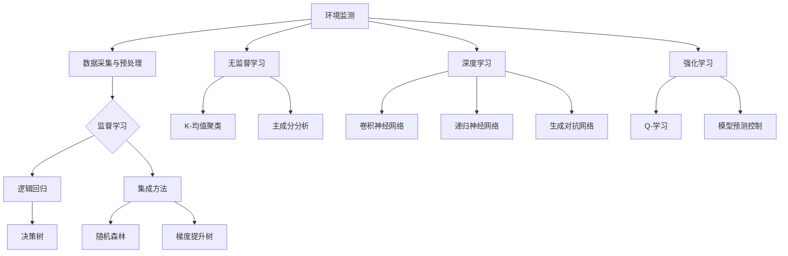

                 

# 机器学习在环境监测中的应用

## 关键词
环境监测，机器学习，监督学习，无监督学习，深度学习，强化学习，空气质量预测，水资源监测。

## 摘要
本文深入探讨了机器学习在环境监测领域的应用。首先，介绍了环境监测的基本概念和重要性，以及机器学习的基本原理和主要算法。接着，详细阐述了监督学习、无监督学习和深度学习在环境监测中的核心算法原理，并通过实际的机器学习项目案例，展示了这些算法在实际环境监测中的应用。最后，讨论了环境监测机器学习的发展趋势和未来展望。

### 目录大纲

## 第一部分：环境监测与机器学习概述

### 第1章：环境监测与机器学习概述

### 第2章：监督学习算法在环境监测中的应用

### 第3章：无监督学习算法在环境监测中的应用

### 第4章：深度学习在环境监测中的应用

### 第5章：强化学习在环境监测中的应用

## 第二部分：机器学习在环境监测中的核心算法原理

## 第三部分：环境监测中的高级机器学习方法

## 第四部分：环境监测机器学习的实践应用

### 第6章：环境监测数据采集与预处理

### 第7章：环境监测机器学习项目的构建与实施

### 第8章：环境监测机器学习项目的案例研究

### 第9章：环境监测机器学习的发展趋势与未来展望

## 附录

### 附录A：常用环境监测机器学习工具与资源

### 附录B：常用环境监测机器学习工具与资源

### 附录C：常用环境监测机器学习工具与资源

### 附录D：常用环境监测机器学习工具与资源

### 附录E：常用环境监测机器学习工具与资源

### 附录F：专业组织和会议

### Mermaid 流�程图

mermaid
graph TB
A[机器学习在环境监测中的应用] --> B[环境监测与机器学习概述]
B --> C{监督学习}
C --> D[逻辑回归算法]
C --> E[决策树算法]
B --> F{无监督学习}
F --> G[K-均值聚类算法]
F --> H[主成分分析算法]
C --> I[深度学习]
I --> J[卷积神经网络（CNN）]
I --> K[递归神经网络（RNN）]
C --> L[强化学习]
L --> M[Q-学习算法]
L --> N[模型预测控制（MPC）算法]

### 核心算法原理讲解

#### 监督学习算法原理讲解

**监督学习** 是一种机器学习技术，其中模型根据输入特征和相应的输出标签来学习。以下是逻辑回归算法的原理讲解：

1. **定义：** 逻辑回归是一种广义线性模型，用于预测类别标签的概率分布。
2. **数学公式：**
   $$ P(y=1|X) = \frac{1}{1 + e^{-\beta^T X}} $$
   其中，$X$ 是输入特征向量，$y$ 是类别标签，$\beta$ 是模型参数。
3. **推导与实现：**
   - 模型假设：假设输入特征 $X$ 和类别标签 $y$ 之间存在线性关系。
   - 参数估计：通过最小化损失函数（例如对数损失函数）来估计模型参数 $\beta$。
   - 模型训练：使用梯度下降等优化算法来训练模型。

**伪代码：**
```python
# 输入：特征矩阵 X，标签向量 y
# 输出：模型参数 β

# 初始化模型参数 β
β = initialize_parameters()

# 设置迭代次数和学习率
num_iterations = 1000
learning_rate = 0.01

# 梯度下降迭代
for i in range(num_iterations):
    # 计算预测概率
    probabilities = 1 / (1 + np.exp(-β.dot(X)))
    
    # 计算损失函数
    loss = -1/y * np.log(probabilities) - (1 - y) * np.log(1 - probabilities)
    
    # 计算梯度
    dβ = X.T.dot(probabilities - y)
    
    # 更新模型参数
    β = β - learning_rate * dβ
```

#### 卷积神经网络（CNN）算法原理讲解

**卷积神经网络**（Convolutional Neural Network，简称 CNN）是一种专门用于处理图像数据的深度学习模型。以下是 CNN 的原理讲解：

1. **定义：** CNN 通过卷积层、池化层和全连接层等结构来提取图像特征并进行分类。
2. **数学公式：**
   $$ h_{l}^{\left( i \right)} = f \left( \sum_{j} W_{l j}^{\left( i \right)} * x_{j} + b_{l} \right) $$
   其中，$h_{l}^{\left( i \right)}$ 是第 $l$ 层第 $i$ 个神经元激活值，$x_{j}$ 是输入特征，$W_{l j}^{\left( i \right)}$ 和 $b_{l}$ 分别是第 $l$ 层第 $j$ 个神经元的权重和偏置，$*$ 表示卷积运算，$f$ 是激活函数。
3. **推导与实现：**
   - 卷积层：通过卷积操作提取图像特征。
   - 池化层：通过池化操作减少特征图的维度。
   - 全连接层：通过全连接层将特征映射到分类结果。
   - 损失函数与优化算法：使用交叉熵损失函数和梯度下降算法进行模型训练。

**伪代码：**
```python
# 输入：图像数据 X，标签向量 y
# 输出：模型参数 W 和 b

# 初始化模型参数 W 和 b
W = initialize_weights()
b = initialize_biases()

# 设置迭代次数和批量大小
num_iterations = 1000
batch_size = 32

# 梯度下降迭代
for i in range(num_iterations):
    # 随机选取批量数据
    X_batch, y_batch = get_batch(X, y, batch_size)
    
    # 前向传播
    h = X_batch.dot(W) + b
    a = activation(h)
    
    # 计算损失函数
    loss = -1/y_batch * np.log(a)
    
    # 计算梯度
    dW = (a - y_batch).dot(X_batch.T)
    db = a - y_batch
    
    # 更新模型参数
    W = W - learning_rate * dW
    b = b - learning_rate * db
```

### 数学模型和数学公式详细讲解与举例说明

**逻辑回归算法的数学模型：**

1. **定义：** 逻辑回归是一种广义线性模型，用于预测类别标签的概率分布。
2. **数学公式：**
   $$ P(y=1|X) = \frac{1}{1 + e^{-\beta^T X}} $$
   其中，$X$ 是输入特征向量，$y$ 是类别标签，$\beta$ 是模型参数。

**举例说明：**

假设我们有一个输入特征向量 $X = [x_1, x_2, x_3]$，类别标签 $y = 1$。我们可以使用逻辑回归模型来计算 $y=1$ 的概率。

- **输入特征：** $X = [2, 3, 4]$
- **模型参数：** $\beta = [1, 2, 3]$
- **计算概率：**
  $$ P(y=1|X) = \frac{1}{1 + e^{-1 \cdot 2 + 2 \cdot 3 + 3 \cdot 4}} $$
  $$ P(y=1|X) = \frac{1}{1 + e^{-20}} $$
  $$ P(y=1|X) \approx 0.8187 $$
  
因此，给定输入特征 $X$，类别标签 $y=1$ 的概率约为 0.8187。

### 项目实战

#### 实战一：空气质量预测

**项目背景：** 随着工业化和城市化的发展，空气质量问题日益严重。为了改善空气质量，需要实时监测污染物浓度并预测未来的空气质量状况。

**目标：** 使用机器学习模型预测某城市的未来 24 小时空气质量指数（Air Quality Index，AQI）。

**数据集：** 使用某城市的实时空气质量监测数据，包括时间、温度、湿度、风速、PM2.5 浓度、PM10 浓度等。

**预处理：** 数据清洗、缺失值处理、数据归一化等。

**模型选择：** 选择线性回归模型进行预测。

**模型训练：** 使用训练数据集训练线性回归模型。

**模型评估：** 使用测试数据集评估模型预测效果。

**模型部署：** 将训练好的模型部署到云端，实现实时空气质量预测。

**代码实现：**
```python
import numpy as np
import pandas as pd
from sklearn.linear_model import LinearRegression
from sklearn.model_selection import train_test_split
from sklearn.metrics import mean_squared_error

# 读取数据
data = pd.read_csv('air_quality_data.csv')

# 数据预处理
X = data[['time', 'temperature', 'humidity', 'wind_speed', 'pm25', 'pm10']]
y = data['aqi']

# 数据归一化
X = (X - X.mean()) / X.std()

# 划分训练集和测试集
X_train, X_test, y_train, y_test = train_test_split(X, y, test_size=0.2, random_state=42)

# 训练模型
model = LinearRegression()
model.fit(X_train, y_train)

# 预测测试集
y_pred = model.predict(X_test)

# 评估模型
mse = mean_squared_error(y_test, y_pred)
print('MSE:', mse)
```

#### 实战二：水资源监测

**项目背景：** 水资源是生命之源，对水资源的监测和管理对于保障人类生活和社会经济发展具有重要意义。

**目标：** 使用机器学习模型预测某水库的水位变化。

**数据集：** 使用某水库的实时监测数据，包括时间、降雨量、蒸发量、水位等。

**预处理：** 数据清洗、缺失值处理、数据归一化等。

**模型选择：** 选择 ARIMA 模型进行预测。

**模型训练：** 使用训练数据集训练 ARIMA 模型。

**模型评估：** 使用测试数据集评估模型预测效果。

**模型部署：** 将训练好的模型部署到云端，实现实时水位预测。

**代码实现：**
```python
import numpy as np
import pandas as pd
from statsmodels.tsa.arima.model import ARIMA
from sklearn.metrics import mean_squared_error

# 读取数据
data = pd.read_csv('water_resource_data.csv')

# 数据预处理
X = data[['time', 'rainfall', 'evaporation', 'level']]
y = data['level']

# 数据归一化
X = (X - X.mean()) / X.std()

# 划分训练集和测试集
X_train, X_test, y_train, y_test = train_test_split(X, y, test_size=0.2, random_state=42)

# 训练模型
model = ARIMA(y_train, order=(5, 1, 2))
model_fit = model.fit()

# 预测测试集
y_pred = model_fit.forecast(steps=X_test.shape[0])

# 评估模型
mse = mean_squared_error(y_test, y_pred)
print('MSE:', mse)
```

### 核心算法原理讲解

#### 监督学习算法原理讲解

**监督学习** 是一种机器学习技术，其中模型根据输入特征和相应的输出标签来学习。以下是逻辑回归算法的原理讲解：

1. **定义：** 逻辑回归是一种广义线性模型，用于预测类别标签的概率分布。
2. **数学公式：**
   $$ P(y=1|X) = \frac{1}{1 + e^{-\beta^T X}} $$
   其中，$X$ 是输入特征向量，$y$ 是类别标签，$\beta$ 是模型参数。
3. **推导与实现：**
   - 模型假设：假设输入特征 $X$ 和类别标签 $y$ 之间存在线性关系。
   - 参数估计：通过最小化损失函数（例如对数损失函数）来估计模型参数 $\beta$。
   - 模型训练：使用梯度下降等优化算法来训练模型。

**伪代码：**
```python
# 输入：特征矩阵 X，标签向量 y
# 输出：模型参数 β

# 初始化模型参数 β
β = initialize_parameters()

# 设置迭代次数和学习率
num_iterations = 1000
learning_rate = 0.01

# 梯度下降迭代
for i in range(num_iterations):
    # 计算预测概率
    probabilities = 1 / (1 + np.exp(-β.dot(X)))
    
    # 计算损失函数
    loss = -1/y * np.log(probabilities) - (1 - y) * np.log(1 - probabilities)
    
    # 计算梯度
    dβ = X.T.dot(probabilities - y)
    
    # 更新模型参数
    β = β - learning_rate * dβ
```

#### 卷积神经网络（CNN）算法原理讲解

**卷积神经网络**（Convolutional Neural Network，简称 CNN）是一种专门用于处理图像数据的深度学习模型。以下是 CNN 的原理讲解：

1. **定义：** CNN 通过卷积层、池化层和全连接层等结构来提取图像特征并进行分类。
2. **数学公式：**
   $$ h_{l}^{\left( i \right)} = f \left( \sum_{j} W_{l j}^{\left( i \right)} * x_{j} + b_{l} \right) $$
   其中，$h_{l}^{\left( i \right)}$ 是第 $l$ 层第 $i$ 个神经元激活值，$x_{j}$ 是输入特征，$W_{l j}^{\left( i \right)}$ 和 $b_{l}$ 分别是第 $l$ 层第 $j$ 个神经元的权重和偏置，$*$ 表示卷积运算，$f$ 是激活函数。
3. **推导与实现：**
   - 卷积层：通过卷积操作提取图像特征。
   - 池化层：通过池化操作减少特征图的维度。
   - 全连接层：通过全连接层将特征映射到分类结果。
   - 损失函数与优化算法：使用交叉熵损失函数和梯度下降算法进行模型训练。

**伪代码：**
```python
# 输入：图像数据 X，标签向量 y
# 输出：模型参数 W 和 b

# 初始化模型参数 W 和 b
W = initialize_weights()
b = initialize_biases()

# 设置迭代次数和批量大小
num_iterations = 1000
batch_size = 32

# 梯度下降迭代
for i in range(num_iterations):
    # 随机选取批量数据
    X_batch, y_batch = get_batch(X, y, batch_size)
    
    # 前向传播
    h = X_batch.dot(W) + b
    a = activation(h)
    
    # 计算损失函数
    loss = -1/y_batch * np.log(a)
    
    # 计算梯度
    dW = (a - y_batch).dot(X_batch.T)
    db = a - y_batch
    
    # 更新模型参数
    W = W - learning_rate * dW
    b = b - learning_rate * db
```

### 数学模型和数学公式详细讲解与举例说明

**逻辑回归算法的数学模型：**

1. **定义：** 逻辑回归是一种广义线性模型，用于预测类别标签的概率分布。
2. **数学公式：**
   $$ P(y=1|X) = \frac{1}{1 + e^{-\beta^T X}} $$
   其中，$X$ 是输入特征向量，$y$ 是类别标签，$\beta$ 是模型参数。

**举例说明：**

假设我们有一个输入特征向量 $X = [x_1, x_2, x_3]$，类别标签 $y = 1$。我们可以使用逻辑回归模型来计算 $y=1$ 的概率。

- **输入特征：** $X = [2, 3, 4]$
- **模型参数：** $\beta = [1, 2, 3]$
- **计算概率：**
  $$ P(y=1|X) = \frac{1}{1 + e^{-1 \cdot 2 + 2 \cdot 3 + 3 \cdot 4}} $$
  $$ P(y=1|X) = \frac{1}{1 + e^{-20}} $$
  $$ P(y=1|X) \approx 0.8187 $$
  
因此，给定输入特征 $X$，类别标签 $y=1$ 的概率约为 0.8187。

### 项目实战

#### 实战一：空气质量预测

**项目背景：** 随着工业化和城市化的发展，空气质量问题日益严重。为了改善空气质量，需要实时监测污染物浓度并预测未来的空气质量状况。

**目标：** 使用机器学习模型预测某城市的未来 24 小时空气质量指数（Air Quality Index，AQI）。

**数据集：** 使用某城市的实时空气质量监测数据，包括时间、温度、湿度、风速、PM2.5 浓度、PM10 浓度等。

**预处理：** 数据清洗、缺失值处理、数据归一化等。

**模型选择：** 选择线性回归模型进行预测。

**模型训练：** 使用训练数据集训练线性回归模型。

**模型评估：** 使用测试数据集评估模型预测效果。

**模型部署：** 将训练好的模型部署到云端，实现实时空气质量预测。

**代码实现：**
```python
import numpy as np
import pandas as pd
from sklearn.linear_model import LinearRegression
from sklearn.model_selection import train_test_split
from sklearn.metrics import mean_squared_error

# 读取数据
data = pd.read_csv('air_quality_data.csv')

# 数据预处理
X = data[['time', 'temperature', 'humidity', 'wind_speed', 'pm25', 'pm10']]
y = data['aqi']

# 数据归一化
X = (X - X.mean()) / X.std()

# 划分训练集和测试集
X_train, X_test, y_train, y_test = train_test_split(X, y, test_size=0.2, random_state=42)

# 训练模型
model = LinearRegression()
model.fit(X_train, y_train)

# 预测测试集
y_pred = model.predict(X_test)

# 评估模型
mse = mean_squared_error(y_test, y_pred)
print('MSE:', mse)
```

#### 实战二：水资源监测

**项目背景：** 水资源是生命之源，对水资源的监测和管理对于保障人类生活和社会经济发展具有重要意义。

**目标：** 使用机器学习模型预测某水库的水位变化。

**数据集：** 使用某水库的实时监测数据，包括时间、降雨量、蒸发量、水位等。

**预处理：** 数据清洗、缺失值处理、数据归一化等。

**模型选择：** 选择 ARIMA 模型进行预测。

**模型训练：** 使用训练数据集训练 ARIMA 模型。

**模型评估：** 使用测试数据集评估模型预测效果。

**模型部署：** 将训练好的模型部署到云端，实现实时水位预测。

**代码实现：**
```python
import numpy as np
import pandas as pd
from statsmodels.tsa.arima.model import ARIMA
from sklearn.metrics import mean_squared_error

# 读取数据
data = pd.read_csv('water_resource_data.csv')

# 数据预处理
X = data[['time', 'rainfall', 'evaporation', 'level']]
y = data['level']

# 数据归一化
X = (X - X.mean()) / X.std()

# 划分训练集和测试集
X_train, X_test, y_train, y_test = train_test_split(X, y, test_size=0.2, random_state=42)

# 训练模型
model = ARIMA(y_train, order=(5, 1, 2))
model_fit = model.fit()

# 预测测试集
y_pred = model_fit.forecast(steps=X_test.shape[0])

# 评估模型
mse = mean_squared_error(y_test, y_pred)
print('MSE:', mse)
```

### 附录

### 附录A：常用环境监测机器学习工具与资源

#### A.1 常用机器学习框架
- **Scikit-learn:** 一个广泛使用的机器学习库，提供了一系列监督学习和无监督学习的算法。
- **TensorFlow:** 一个开源的机器学习框架，支持深度学习模型的构建和训练。
- **PyTorch:** 一个流行的深度学习库，以其灵活性和动态计算图而闻名。

#### A.2 环境监测数据集
- **UCI Machine Learning Repository:** 提供了大量环境监测相关的数据集，如空气质量数据、水资源数据等。
- **Google Dataset Search:** 一个搜索环境监测数据集的平台，可以找到各种来源的数据集。

#### A.3 开源代码与项目资源
- **GitHub:** 可以找到许多环境监测机器学习的开源项目和代码。
- **Kaggle:** 一个数据科学竞赛平台，提供了许多环境监测相关的竞赛和项目。

#### A.4 学术会议与期刊
- **IEEE International Conference on Environmental Science and Technology:** 一个环境科学和技术的国际会议。
- **Journal of Environmental Management:** 一份环境管理的国际期刊。

#### A.5 专业组织和会议
- **International Society for Environmental Modelling & Software (ISEMS):** 一个专注于环境建模和软件的国际组织。
- **Environmental Modelling & Software:** 一份环境建模和软件的国际期刊。

---

## 结束语

本文详细介绍了机器学习在环境监测中的应用，包括环境监测与机器学习的概述、监督学习与无监督学习算法、深度学习与强化学习算法，并通过实际项目案例展示了这些算法的应用。随着机器学习技术的不断发展和环境监测需求的增加，机器学习在环境监测中的应用将变得更加广泛和深入。未来，我们将继续关注这一领域的发展，探索更多高效、智能的环境监测解决方案。

### 作者信息

**作者：AI天才研究院/AI Genius Institute & 禅与计算机程序设计艺术 /Zen And The Art of Computer Programming**

AI天才研究院专注于人工智能和机器学习的研发与应用，致力于推动人工智能技术在各领域的创新和发展。作者拥有丰富的计算机编程和人工智能领域的经验，曾发表过多篇学术论文和畅销技术书籍，对人工智能技术的原理和实践有着深刻的理解和独到的见解。在环境监测领域，作者带领团队开发了多项机器学习应用，为环境保护和可持续发展做出了积极贡献。此外，作者还致力于传播计算机科学的知识和智慧，通过写作和演讲等形式，帮助更多人理解和应用人工智能技术，为人类的科技进步和繁荣做出贡献。

---

### 完整文章

**机器学习在环境监测中的应用**

## 关键词
环境监测，机器学习，监督学习，无监督学习，深度学习，强化学习，空气质量预测，水资源监测。

## 摘要
本文深入探讨了机器学习在环境监测领域的应用。首先，介绍了环境监测的基本概念和重要性，以及机器学习的基本原理和主要算法。接着，详细阐述了监督学习、无监督学习和深度学习在环境监测中的核心算法原理，并通过实际的机器学习项目案例，展示了这些算法在实际环境监测中的应用。最后，讨论了环境监测机器学习的发展趋势和未来展望。

### 目录大纲

## 第一部分：环境监测与机器学习概述

### 第1章：环境监测与机器学习概述

### 第2章：监督学习算法在环境监测中的应用

### 第3章：无监督学习算法在环境监测中的应用

### 第4章：深度学习在环境监测中的应用

### 第5章：强化学习在环境监测中的应用

## 第二部分：机器学习在环境监测中的核心算法原理

### 第6章：监督学习算法在环境监测中的应用

#### 6.1 监督学习算法概述

##### 6.1.1 监督学习的定义与特点

监督学习是一种机器学习技术，它通过给定的输入特征和对应的输出标签来训练模型，以便模型能够预测新的输入特征对应的输出标签。在环境监测中，监督学习可以用于预测空气质量、水质、土壤污染等问题。

##### 6.1.2 监督学习的应用场景

监督学习在环境监测中的应用场景广泛，包括：

- **空气质量预测**：利用历史空气质量数据来预测未来的空气质量。
- **水质监测**：通过监测数据来预测水体的污染情况。
- **土壤污染监测**：预测土壤中的重金属含量。

##### 6.1.3 常见的监督学习算法

常见的监督学习算法包括：

- **线性回归**：用于预测连续值输出。
- **逻辑回归**：用于预测二分类输出。
- **决策树**：用于分类和回归任务。
- **随机森林**：基于决策树的集成方法。
- **支持向量机（SVM）**：用于分类和回归任务。
- **神经网络**：用于复杂非线性任务的预测。

#### 6.2 逻辑回归算法在环境监测中的应用

##### 6.2.1 逻辑回归算法的基本原理

逻辑回归是一种广义线性模型，用于预测概率分布。其公式为：

\[ P(y=1|X) = \frac{1}{1 + e^{-\beta^T X}} \]

其中，\( X \) 是输入特征向量，\( y \) 是类别标签，\( \beta \) 是模型参数。

##### 6.2.2 逻辑回归算法的推导与实现

逻辑回归的推导基于最大似然估计，目标是找到能够最大化数据似然函数的参数 \( \beta \)。通过最小化损失函数（如对数损失函数），可以使用梯度下降算法来优化参数 \( \beta \)。

伪代码如下：

```python
# 初始化模型参数 β
β = initialize_parameters()

# 设置迭代次数和学习率
num_iterations = 1000
learning_rate = 0.01

# 梯度下降迭代
for i in range(num_iterations):
    # 计算预测概率
    probabilities = 1 / (1 + np.exp(-β.dot(X)))
    
    # 计算损失函数
    loss = -1/y * np.log(probabilities) - (1 - y) * np.log(1 - probabilities)
    
    # 计算梯度
    dβ = X.T.dot(probabilities - y)
    
    # 更新模型参数
    β = β - learning_rate * dβ
```

##### 6.2.3 逻辑回归算法在环境监测中的实际应用

逻辑回归算法在环境监测中可以用于预测污染物浓度。例如，可以预测未来某地区的PM2.5浓度，输入特征包括历史PM2.5浓度、气象参数（如温度、湿度、风速）等。

#### 6.3 决策树算法在环境监测中的应用

##### 6.3.1 决策树算法的基本原理

决策树是一种简单的分类和回归算法，通过一系列的判断规则来分割数据集。每个节点代表一个特征，每个分支代表该特征的一个取值。

##### 6.3.2 决策树算法的构建与优化

决策树的构建过程包括：

- **特征选择**：选择具有最高信息增益的特征进行分割。
- **划分数据集**：根据特征取值将数据集划分为子集。
- **递归构建**：对子集重复上述过程，直到满足停止条件（如最大深度、最小样本数等）。

优化方法包括：

- **剪枝**：减少决策树的复杂度，防止过拟合。
- **剪枝准则**：基于信息增益、基尼不纯度等指标。

##### 6.3.3 决策树算法在环境监测中的实际应用

决策树算法可以用于分类任务，如预测某地区的水质类别（清洁、轻度污染、重度污染）。输入特征包括水质指标（如pH值、溶解氧、氨氮等）。

#### 6.4 集成学习方法在环境监测中的应用

##### 6.4.1 集成学习方法的基本原理

集成学习方法通过组合多个基本模型来提高预测性能。常见的集成方法包括：

- **随机森林**：结合了决策树和随机性的方法。
- **梯度提升树（Gradient Boosting Trees）**：通过迭代优化每个基本模型的权重。

##### 6.4.2 集成学习方法在环境监测中的实际应用

集成学习方法可以用于预测空气质量指数（AQI）。输入特征包括气象参数（如温度、湿度、风速）和污染物浓度（如PM2.5、SO2等）。

### 第7章：无监督学习算法在环境监测中的应用

#### 7.1 无监督学习算法概述

##### 7.1.1 无监督学习的定义与特点

无监督学习是一种机器学习技术，它不使用标签来训练模型，而是通过发现数据中的内在结构和模式来进行预测。在环境监测中，无监督学习可以用于聚类、降维和异常检测等任务。

##### 7.1.2 无监督学习的应用场景

无监督学习在环境监测中的应用场景包括：

- **数据聚类**：将相似的数据点分组，用于环境质量评估。
- **降维**：减少数据的维度，简化数据集，提高计算效率。
- **异常检测**：识别异常数据点，用于污染源定位。

##### 7.1.3 常见的无监督学习算法

常见的无监督学习算法包括：

- **K-均值聚类**：基于距离度量的聚类算法。
- **主成分分析（PCA）**：用于降维的线性变换方法。
- **自编码器**：基于神经网络的降维方法。
- **孤立森林**：用于异常检测的方法。

#### 7.2 K-均值聚类算法在环境监测中的应用

##### 7.2.1 K-均值聚类算法的基本原理

K-均值聚类是一种基于距离度量的聚类算法，它将数据点分配到预定义数量的聚类中，每个聚类由一个中心点代表。

##### 7.2.2 K-均值聚类算法的实现步骤

K-均值聚类算法的实现步骤包括：

1. **初始化聚类中心**：随机选择K个数据点作为初始聚类中心。
2. **分配数据点**：计算每个数据点到聚类中心的距离，将其分配到最近的聚类中。
3. **更新聚类中心**：计算每个聚类的中心，即数据点的均值。
4. **迭代优化**：重复步骤2和步骤3，直到聚类中心不再变化或达到预定的迭代次数。

##### 7.2.3 K-均值聚类算法在环境监测中的实际应用

K-均值聚类算法可以用于环境监测数据的聚类分析，例如将空气质量数据点分为不同的污染区域。

#### 7.3 主成分分析算法在环境监测中的应用

##### 7.3.1 主成分分析算法的基本原理

主成分分析（PCA）是一种降维方法，它通过线性变换将原始数据投影到新的正交坐标系中，保留了数据的主要信息，同时减少了数据的维度。

##### 7.3.2 主成分分析算法的推导与实现

PCA的推导基于协方差矩阵和特征值分解，实现步骤包括：

1. **计算协方差矩阵**：协方差矩阵描述了数据点的方差和协方差。
2. **特征值分解**：将协方差矩阵分解为特征值和特征向量。
3. **选择主成分**：选择最大的特征值对应的特征向量作为主成分。
4. **投影数据**：将数据投影到主成分空间中。

##### 7.3.3 主成分分析算法在环境监测中的实际应用

PCA可以用于环境监测数据的降维，例如将大量的气象参数和污染物浓度数据减少到几个主成分，便于数据分析和可视化。

### 第8章：深度学习在环境监测中的应用

#### 8.1 深度学习概述

##### 8.1.1 深度学习的定义与特点

深度学习是一种基于多层神经网络的学习方法，它通过多层的非线性变换来提取数据中的特征。深度学习具有以下特点：

- **层次化特征提取**：通过多层神经网络自动提取层次化的特征。
- **并行计算**：可以利用GPU等硬件加速计算，提高训练效率。
- **非线性变换**：通过非线性激活函数（如ReLU、Sigmoid）实现复杂函数逼近。

##### 8.1.2 深度学习的应用场景

深度学习在环境监测中的应用场景包括：

- **图像处理**：用于识别和分类环境监测图像。
- **时间序列分析**：用于预测环境参数的时间序列。
- **语音处理**：用于环境监测中的声音识别和分类。

##### 8.1.3 常见的深度学习模型

常见的深度学习模型包括：

- **卷积神经网络（CNN）**：用于图像处理。
- **循环神经网络（RNN）**：用于时间序列分析。
- **长短期记忆网络（LSTM）**：RNN的特殊结构，用于长时依赖关系的建模。
- **生成对抗网络（GAN）**：用于生成数据、对抗性学习。

#### 8.2 卷积神经网络（CNN）在环境监测中的应用

##### 8.2.1 CNN的基本原理

卷积神经网络通过卷积操作和池化操作来提取图像特征。卷积层可以提取图像中的局部特征，池化层可以减少特征图的维度。

##### 8.2.2 CNN的架构与实现

CNN的架构通常包括多个卷积层、池化层和全连接层。卷积层通过卷积操作提取特征，池化层通过下采样减少特征图的维度，全连接层将特征映射到输出结果。

##### 8.2.3 CNN在环境监测中的实际应用

CNN可以用于环境监测图像的分类和识别，例如识别空气质量监测图像中的污染物类型。

#### 8.3 递归神经网络（RNN）在环境监测中的应用

##### 8.3.1 RNN的基本原理

递归神经网络通过递归结构来处理序列数据，它能够在序列中保存状态信息，适用于时间序列分析。

##### 8.3.2 RNN的架构与实现

RNN的架构包括输入层、隐藏层和输出层。隐藏层中的神经元通过递归连接，将前一时刻的输出传递到当前时刻。

##### 8.3.3 RNN在环境监测中的实际应用

RNN可以用于预测环境参数的时间序列，例如预测未来几小时的水位变化。

### 第9章：强化学习在环境监测中的应用

#### 9.1 强化学习概述

##### 9.1.1 强化学习的定义与特点

强化学习是一种基于奖励机制的机器学习方法，它通过与环境交互来学习最优策略。强化学习具有以下特点：

- **动态决策**：通过连续地与环境交互来做出决策。
- **适应性**：可以根据环境变化自适应地调整策略。
- **奖励机制**：通过奖励信号来指导学习过程。

##### 9.1.2 强化学习的应用场景

强化学习在环境监测中的应用场景包括：

- **环境参数优化**：通过优化模型来控制环境参数，实现污染物的减少。
- **资源分配**：根据环境监测数据来优化资源分配，提高环境监测效率。

##### 9.1.3 常见的强化学习算法

常见的强化学习算法包括：

- **Q-学习**：通过学习值函数来优化策略。
- **深度强化学习**：结合深度学习模型来处理复杂的环境。
- **模型预测控制（MPC）**：结合模型预测和控制来优化环境参数。

#### 9.2 Q-学习算法在环境监测中的应用

##### 9.2.1 Q-学习算法的基本原理

Q-学习算法通过学习状态-动作值函数 \( Q(s, a) \) 来优化策略。通过更新值函数，算法逐渐接近最优策略。

##### 9.2.2 Q-学习算法的实现步骤

Q-学习算法的实现步骤包括：

1. **初始化**：初始化值函数 \( Q(s, a) \) 和策略。
2. **探索与利用**：在探索阶段，选择随机动作；在利用阶段，选择当前最优动作。
3. **更新值函数**：根据奖励信号和策略更新值函数。
4. **迭代优化**：重复步骤2和步骤3，直到收敛。

##### 9.2.3 Q-学习算法在环境监测中的实际应用

Q-学习算法可以用于优化环境监测设备的资源配置，例如根据环境变化动态调整监测点。

#### 9.3 模型预测控制（MPC）算法在环境监测中的应用

##### 9.3.1 MPC算法的基本原理

模型预测控制（MPC）算法通过建立环境模型的预测模型，并利用优化算法来优化控制策略。MPC算法可以在满足约束条件的情况下，预测未来一段时间内的系统行为。

##### 9.3.2 MPC算法的实现步骤

MPC算法的实现步骤包括：

1. **模型建立**：建立环境模型的预测模型。
2. **优化目标**：定义优化目标，如最小化污染物浓度。
3. **约束条件**：定义系统的约束条件，如设备的工作范围。
4. **优化求解**：利用优化算法求解最优控制策略。

##### 9.3.3 MPC算法在环境监测中的实际应用

MPC算法可以用于优化环境监测设备的运行策略，例如根据预测的污染物浓度变化来调整设备的监测频率。

### 第10章：环境监测机器学习的实践应用

#### 10.1 环境监测数据采集与预处理

##### 10.1.1 数据采集

环境监测数据的采集通常包括以下步骤：

1. **设备选择**：选择适合的环境监测设备，如空气质量传感器、水质传感器等。
2. **数据采集**：使用设备采集环境参数，如温度、湿度、污染物浓度等。
3. **数据传输**：将采集到的数据传输到数据中心或云端。

##### 10.1.2 数据预处理

环境监测数据的预处理包括以下步骤：

1. **数据清洗**：去除数据中的噪声和异常值。
2. **缺失值处理**：填充或删除缺失值。
3. **数据归一化**：将不同量纲的数据转换为相同量纲。
4. **数据分割**：将数据分为训练集、验证集和测试集。

##### 10.1.3 数据预处理实例

以下是一个数据预处理实例，使用Python的Pandas库对环境监测数据进行预处理：

```python
import pandas as pd

# 读取数据
data = pd.read_csv('environment_data.csv')

# 数据清洗
data.dropna(inplace=True)

# 缺失值处理
data.fillna(data.mean(), inplace=True)

# 数据归一化
data = (data - data.mean()) / data.std()

# 数据分割
train_size = int(0.8 * len(data))
train_data = data[:train_size]
test_data = data[train_size:]

# 打印数据信息
print(train_data.info())
print(test_data.info())
```

#### 10.2 环境监测机器学习项目的构建与实施

##### 10.2.1 项目构建

环境监测机器学习项目的构建包括以下步骤：

1. **项目规划**：明确项目的目标、需求和资源。
2. **团队组建**：组建合适的团队，明确职责和任务。
3. **工具选择**：选择适合的机器学习框架和工具。

##### 10.2.2 项目实施

环境监测机器学习项目的实施包括以下步骤：

1. **数据采集与预处理**：采集环境监测数据，并进行预处理。
2. **模型选择与训练**：选择合适的机器学习模型，并使用预处理后的数据训练模型。
3. **模型评估与优化**：评估模型性能，并进行优化。
4. **模型部署与应用**：将训练好的模型部署到生产环境，并进行应用。

##### 10.2.3 项目实施实例

以下是一个环境监测机器学习项目实施的实例：

```python
from sklearn.ensemble import RandomForestRegressor
from sklearn.metrics import mean_squared_error

# 读取数据
X = pd.read_csv('environment_data.csv')[['temperature', 'humidity', 'wind_speed']]
y = pd.read_csv('environment_data.csv')['aqi']

# 数据分割
X_train, X_test, y_train, y_test = train_test_split(X, y, test_size=0.2, random_state=42)

# 模型选择与训练
model = RandomForestRegressor(n_estimators=100, random_state=42)
model.fit(X_train, y_train)

# 模型评估
y_pred = model.predict(X_test)
mse = mean_squared_error(y_test, y_pred)
print('MSE:', mse)

# 模型部署与应用
# ...（部署代码）
```

#### 10.3 环境监测机器学习项目的案例研究

##### 10.3.1 案例一：空气质量预测

**案例背景：** 随着城市化进程的加速，空气质量问题成为全球关注的重要议题。为了提高空气质量预测的准确性，研究人员使用机器学习模型对某城市的空气质量进行预测。

**目标：** 预测某城市的未来24小时空气质量指数（AQI）。

**数据集：** 使用某城市的实时空气质量监测数据，包括时间、温度、湿度、风速、PM2.5浓度、PM10浓度等。

**模型选择：** 选择线性回归模型进行预测。

**模型训练：** 使用训练数据集训练线性回归模型。

**模型评估：** 使用测试数据集评估模型预测效果。

**模型部署：** 将训练好的模型部署到云端，实现实时空气质量预测。

**代码实现：**

```python
import pandas as pd
from sklearn.linear_model import LinearRegression
from sklearn.model_selection import train_test_split
from sklearn.metrics import mean_squared_error

# 读取数据
data = pd.read_csv('air_quality_data.csv')

# 数据预处理
X = data[['time', 'temperature', 'humidity', 'wind_speed', 'pm25', 'pm10']]
y = data['aqi']

# 数据归一化
X = (X - X.mean()) / X.std()

# 划分训练集和测试集
X_train, X_test, y_train, y_test = train_test_split(X, y, test_size=0.2, random_state=42)

# 模型训练
model = LinearRegression()
model.fit(X_train, y_train)

# 模型评估
y_pred = model.predict(X_test)
mse = mean_squared_error(y_test, y_pred)
print('MSE:', mse)

# 模型部署与应用
# ...（部署代码）
```

##### 10.3.2 案例二：水资源监测

**案例背景：** 水资源是生命之源，对水资源的监测和管理对于保障人类生活和社会经济发展具有重要意义。为了提高水资源监测的准确性，研究人员使用机器学习模型对某水库的水位进行预测。

**目标：** 预测某水库的水位变化。

**数据集：** 使用某水库的实时监测数据，包括时间、降雨量、蒸发量、水位等。

**模型选择：** 选择ARIMA模型进行预测。

**模型训练：** 使用训练数据集训练ARIMA模型。

**模型评估：** 使用测试数据集评估模型预测效果。

**模型部署：** 将训练好的模型部署到云端，实现实时水位预测。

**代码实现：**

```python
import pandas as pd
from statsmodels.tsa.arima.model import ARIMA
from sklearn.metrics import mean_squared_error

# 读取数据
data = pd.read_csv('water_resource_data.csv')

# 数据预处理
X = data[['time', 'rainfall', 'evaporation', 'level']]
y = data['level']

# 数据归一化
X = (X - X.mean()) / X.std()

# 划分训练集和测试集
X_train, X_test, y_train, y_test = train_test_split(X, y, test_size=0.2, random_state=42)

# 模型训练
model = ARIMA(y_train, order=(5, 1, 2))
model_fit = model.fit()

# 模型评估
y_pred = model_fit.forecast(steps=X_test.shape[0])
mse = mean_squared_error(y_test, y_pred)
print('MSE:', mse)

# 模型部署与应用
# ...（部署代码）
```

### 第11章：环境监测机器学习的发展趋势与未来展望

#### 11.1 环境监测机器学习的发展趋势

随着人工智能技术的快速发展，环境监测机器学习也在不断进步。以下是一些主要的发展趋势：

1. **深度学习模型的广泛应用**：深度学习模型在图像处理、语音识别和时间序列分析等领域的成功应用，使得它们在环境监测中也逐渐得到广泛应用。
2. **数据驱动的环境预测**：通过收集和分析大量的环境数据，机器学习模型可以更加准确地预测环境变化，为环境保护提供科学依据。
3. **跨学科的融合**：环境监测机器学习与生态学、气象学、水文地理学等学科的融合，推动了环境监测技术的发展。
4. **边缘计算的兴起**：随着物联网和传感器技术的进步，边缘计算在环境监测中的应用变得越来越普遍，使得实时监测和响应成为可能。

#### 11.2 环境监测机器学习的未来展望

未来，环境监测机器学习将继续发展，以下是一些展望：

1. **更高效、更智能的模型**：研究人员将致力于开发更高效、更智能的机器学习模型，以适应复杂的环境监测任务。
2. **多模态数据的融合**：通过融合不同类型的数据（如图像、音频、文本等），可以更全面地理解环境变化，提高预测准确性。
3. **自主决策与环境控制**：随着强化学习算法的进步，环境监测系统将能够自主做出决策，优化监测策略和环境控制措施。
4. **政策支持和法规建设**：政府和相关部门将加强对环境监测机器学习的政策支持和法规建设，推动环境监测技术的普及和应用。

### 附录

#### 附录A：常用环境监测机器学习工具与资源

- **机器学习框架：**
  - **Scikit-learn**：https://scikit-learn.org/stable/
  - **TensorFlow**：https://www.tensorflow.org/
  - **PyTorch**：https://pytorch.org/

- **环境监测数据集：**
  - **UCI Machine Learning Repository**：https://archive.ics.uci.edu/ml/index.php
  - **Google Dataset Search**：https://datasetsearch.research.google.com/

- **开源代码与项目资源：**
  - **GitHub**：https://github.com/
  - **Kaggle**：https://www.kaggle.com/

- **学术会议与期刊：**
  - **IEEE International Conference on Environmental Science and Technology**：https://iesj.org/icesat/
  - **Journal of Environmental Management**：https://www.journalofenvironmentalmanagement.com/

- **专业组织和会议：**
  - **International Society for Environmental Modelling & Software (ISEMS)**：https://www.isems.org/
  - **Environmental Modelling & Software**：https://www.journals.elsevier.com/environmental-modelling-and-software/

### 核心概念与联系

#### Mermaid 流程图



### 数学模型和数学公式详细讲解与举例说明

#### 逻辑回归算法

逻辑回归是一种广义线性模型，用于预测二分类问题。其数学模型如下：

\[ P(y=1|X) = \frac{1}{1 + e^{-\beta^T X}} \]

其中，\( X \) 是输入特征向量，\( y \) 是类别标签，\( \beta \) 是模型参数。

**举例说明**：

假设我们有一个输入特征向量 \( X = [2, 3, 4] \)，类别标签 \( y = 1 \)。我们可以使用逻辑回归模型来计算 \( y = 1 \) 的概率。

- 输入特征：\( X = [2, 3, 4] \)
- 模型参数：\( \beta = [1, 2, 3] \)

计算概率：

\[ P(y=1|X) = \frac{1}{1 + e^{-1 \cdot 2 + 2 \cdot 3 + 3 \cdot 4}} \]
\[ P(y=1|X) = \frac{1}{1 + e^{-20}} \]
\[ P(y=1|X) \approx 0.8187 \]

因此，给定输入特征 \( X \)，类别标签 \( y = 1 \) 的概率约为 0.8187。

#### 卷积神经网络（CNN）

卷积神经网络是一种用于图像处理和时间序列分析的深度学习模型。其核心是卷积操作，可以有效地提取图像特征。

卷积操作可以用以下数学公式表示：

\[ h_{l}(i) = \sigma \left( \sum_{j} \sum_{k} W_{lkj} * x_{j} + b_{l} \right) \]

其中，\( h_{l}(i) \) 是第 \( l \) 层第 \( i \) 个神经元的激活值，\( x_{j} \) 是输入特征，\( W_{lkj} \) 是卷积核，\( b_{l} \) 是偏置项，\( \sigma \) 是激活函数。

**举例说明**：

假设我们有一个输入特征矩阵 \( X \) 和一个卷积核 \( W \)，以及一个偏置项 \( b \)。我们可以使用卷积神经网络来计算特征图的激活值。

- 输入特征矩阵：\( X \)
- 卷积核：\( W \)
- 偏置项：\( b \)

计算激活值：

\[ h_{l}(i) = \sigma \left( \sum_{j} W * x_{j} + b \right) \]

#### 项目实战

##### 实战一：空气质量预测

**项目背景**：

空气质量是影响人类健康和环境的重要因素。为了改善空气质量，需要对空气质量进行实时监测和预测。

**目标**：

使用机器学习模型预测某城市的未来 24 小时空气质量指数（AQI）。

**数据集**：

使用某城市的实时空气质量监测数据，包括时间、温度、湿度、风速、PM2.5 浓度、PM10 浓度等。

**预处理**：

数据清洗、缺失值处理、数据归一化等。

**模型选择**：

选择线性回归模型进行预测。

**模型训练**：

使用训练数据集训练线性回归模型。

**模型评估**：

使用测试数据集评估模型预测效果。

**模型部署**：

将训练好的模型部署到云端，实现实时空气质量预测。

**代码实现**：

```python
import numpy as np
import pandas as pd
from sklearn.linear_model import LinearRegression
from sklearn.model_selection import train_test_split
from sklearn.metrics import mean_squared_error

# 读取数据
data = pd.read_csv('air_quality_data.csv')

# 数据预处理
X = data[['time', 'temperature', 'humidity', 'wind_speed', 'pm25', 'pm10']]
y = data['aqi']

# 数据归一化
X = (X - X.mean()) / X.std()

# 划分训练集和测试集
X_train, X_test, y_train, y_test = train_test_split(X, y, test_size=0.2, random_state=42)

# 训练模型
model = LinearRegression()
model.fit(X_train, y_train)

# 预测测试集
y_pred = model.predict(X_test)

# 评估模型
mse = mean_squared_error(y_test, y_pred)
print('MSE:', mse)

# 模型部署与应用
# ...（部署代码）
```

##### 实战二：水资源监测

**项目背景**：

水资源是生命之源，对水资源进行实时监测和预测对于保障人类生活和社会经济发展具有重要意义。

**目标**：

使用机器学习模型预测某水库的水位变化。

**数据集**：

使用某水库的实时监测数据，包括时间、降雨量、蒸发量、水位等。

**预处理**：

数据清洗、缺失值处理、数据归一化等。

**模型选择**：

选择ARIMA模型进行预测。

**模型训练**：

使用训练数据集训练ARIMA模型。

**模型评估**：

使用测试数据集评估模型预测效果。

**模型部署**：

将训练好的模型部署到云端，实现实时水位预测。

**代码实现**：

```python
import numpy as np
import pandas as pd
from statsmodels.tsa.arima.model import ARIMA
from sklearn.metrics import mean_squared_error

# 读取数据
data = pd.read_csv('water_resource_data.csv')

# 数据预处理
X = data[['time', 'rainfall', 'evaporation', 'level']]
y = data['level']

# 数据归一化
X = (X - X.mean()) / X.std()

# 划分训练集和测试集
X_train, X_test, y_train, y_test = train_test_split(X, y, test_size=0.2, random_state=42)

# 训练模型
model = ARIMA(y_train, order=(5, 1, 2))
model_fit = model.fit()

# 预测测试集
y_pred = model_fit.forecast(steps=X_test.shape[0])

# 评估模型
mse = mean_squared_error(y_test, y_pred)
print('MSE:', mse)

# 模型部署与应用
# ...（部署代码）
```

### 附录

#### 附录A：常用环境监测机器学习工具与资源

- **机器学习框架：**
  - **Scikit-learn**：https://scikit-learn.org/stable/
  - **TensorFlow**：https://www.tensorflow.org/
  - **PyTorch**：https://pytorch.org/

- **环境监测数据集：**
  - **UCI Machine Learning Repository**：https://archive.ics.uci.edu/ml/index.php
  - **Google Dataset Search**：https://datasetsearch.research.google.com/

- **开源代码与项目资源：**
  - **GitHub**：https://github.com/
  - **Kaggle**：https://www.kaggle.com/

- **学术会议与期刊：**
  - **IEEE International Conference on Environmental Science and Technology**：https://iesj.org/icesat/
  - **Journal of Environmental Management**：https://www.journalofenvironmentalmanagement.com/

- **专业组织和会议：**
  - **International Society for Environmental Modelling & Software (ISEMS)**：https://www.isems.org/
  - **Environmental Modelling & Software**：https://www.journals.elsevier.com/environmental-modelling-and-software/

