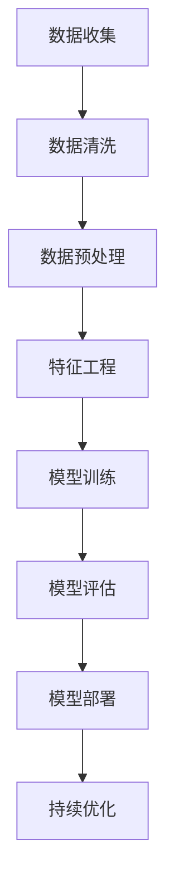
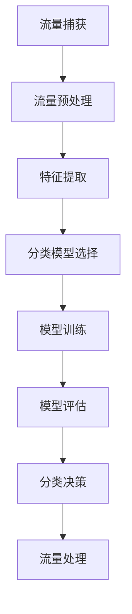

                 

### 《机器学习在网络流量分类中的实时应用》

#### > **关键词：** 机器学习，网络流量，实时应用，分类算法，深度学习。

> **摘要：** 本文详细探讨了机器学习在网络流量分类中的实时应用，涵盖了机器学习的基础知识、网络流量分类原理、实时网络流量分类算法、深度学习应用以及实际案例分析和未来发展方向。文章旨在为IT从业人员提供一套完整的理论指导和实践指南，以应对日益复杂和庞大的网络环境。

在网络技术飞速发展的今天，网络流量的分类已经成为网络安全、流量优化和资源调度等关键环节的重要组成部分。传统的基于规则的方法在处理复杂、动态的网络流量时显得力不从心，而机器学习尤其是深度学习的出现为网络流量分类带来了新的契机。本文将围绕机器学习在网络流量分类中的实时应用，系统地介绍相关理论和技术，以期为读者提供一个全面、深入的视角。

文章首先介绍了机器学习的基础知识，包括其定义、发展历程、应用领域以及分类。随后，详细探讨了数据预处理的重要性，介绍了数据清洗、特征工程、数据归一化和标准化等关键技术。接下来，文章重点分析了网络流量分类的原理，包括网络流量分类概述、特征提取和分类算法概述。在此基础上，本文重点介绍了实时网络流量分类算法，包括KNN算法、决策树算法、随机森林算法和支撑向量机算法，并深入剖析了这些算法的基本原理和应用。

深度学习作为当前人工智能领域的重要研究方向，其在网络流量分类中的应用也得到了广泛关注。本文特别介绍了卷积神经网络、循环神经网络、长短时记忆网络和注意力机制在实时网络流量分类中的应用，并通过具体的实现案例，展示了深度学习算法在实际场景中的效果。

在实时应用场景部分，文章详细介绍了实时网络流量分类系统的设计，包括系统架构设计、硬件选择与配置、软件开发环境搭建等内容。随后，通过实际案例分析和调优，展示了不同算法在处理实际网络流量分类任务中的表现。

最后，文章探讨了机器学习在网络流量分类中的未来发展方向和面临的挑战，包括实时性优化、精确度提升、安全问题和持续学习与更新等。文章的附录部分提供了相关的工具、资源和伪代码，以及具体的代码实现示例，为读者提供了实用的参考。

本文旨在为读者提供一个系统、全面的理论和实践指南，帮助读者深入理解和掌握机器学习在网络流量分类中的实时应用。希望本文能够为IT从业人员和研究者提供有益的启示和帮助。

## 第一部分：机器学习基础

机器学习是人工智能的重要组成部分，其核心思想是通过计算机模拟人类的学习过程，使计算机具备自我学习和改进的能力。本部分将详细探讨机器学习的定义、发展历程、应用领域以及分类，为后续内容打下坚实的基础。

### 1.1 机器学习的定义与发展历程

**1.1.1 定义**

机器学习是一种人工智能的分支，主要研究如何让计算机通过数据和经验自动改进其性能。根据机器学习的定义，其核心可以概括为以下几点：

- **数据驱动：** 机器学习依赖于大量数据，通过对数据进行学习和分析，自动发现数据中的规律和模式。
- **自我改进：** 机器学习系统能够通过学习过程，不断调整自己的参数和模型，从而在特定任务上实现性能提升。
- **泛化能力：** 机器学习算法不仅要能够在训练数据上表现良好，还要能够在未见过的数据上保持一定的性能。

**1.1.2 发展历程**

机器学习的发展历程可以追溯到20世纪50年代。当时，人工智能的概念首次被提出，研究者们开始探讨如何让计算机模拟人类的学习过程。早期的机器学习主要集中在规则学习和符号逻辑推理上，例如专家系统和知识表示。然而，这些方法在处理复杂问题和大规模数据时存在局限。

20世纪80年代，随着计算能力的提升和大数据的出现，统计方法和概率模型开始被引入机器学习领域。这一时期，决策树、支持向量机等算法得到了广泛应用。同时，神经网络的研究也取得了突破性进展，尤其是1986年，霍普菲尔（Hopfield）提出了Hopfield神经网络，为神经网络的研究奠定了基础。

进入21世纪，随着深度学习的兴起，机器学习再次迎来了快速发展。深度学习通过多层神经网络，实现了对数据的深层特征提取，解决了许多传统机器学习算法难以处理的问题，例如图像识别、语音识别等。2012年，AlexNet在ImageNet比赛中取得的惊人成绩，标志着深度学习的崛起。

**1.1.3 发展历程中的关键事件**

- **1956年：** 人工智能（AI）首次被提出。
- **1959年：** 约翰·麦卡锡（John McCarthy）提出了机器学习的概念。
- **1986年：** 霍普菲尔（Hopfield）提出了Hopfield神经网络。
- **2012年：** AlexNet在ImageNet比赛中取得突破性成绩。
- **2015年：** 深度学习在围棋比赛中击败人类顶尖选手。
- **至今：** 深度学习在各个领域得到广泛应用，推动了人工智能的发展。

### 1.2 机器学习的应用领域

机器学习的应用领域非常广泛，涵盖了多个学科和行业。以下是几个典型的应用领域：

**1.2.1 人工智能**

人工智能是机器学习的核心应用领域。机器学习技术被广泛应用于图像识别、语音识别、自然语言处理、智能问答等人工智能场景。通过不断的学习和优化，机器学习系统能够提高人工智能系统的性能和智能化程度。

**1.2.2 金融领域**

金融领域是机器学习的另一个重要应用领域。机器学习在金融领域主要用于风险控制、信用评分、股票市场预测、欺诈检测等。例如，通过分析历史交易数据和用户行为数据，机器学习算法可以预测股票市场的走势，帮助投资者做出更明智的决策。

**1.2.3 医疗健康**

医疗健康是机器学习应用的重要领域。机器学习在医疗健康领域的应用主要包括疾病诊断、医学图像分析、药物设计等。例如，通过分析病人的医疗数据和影像数据，机器学习算法可以辅助医生进行疾病诊断，提高诊断的准确性和效率。

**1.2.4 交通出行**

交通出行领域是机器学习的另一个重要应用领域。机器学习在交通出行领域主要用于交通流量预测、智能导航、自动驾驶等。例如，通过分析交通数据和实时路况信息，机器学习算法可以预测交通流量，帮助交通管理部门优化交通调度，减少拥堵。

**1.2.5 其他领域**

除了上述领域，机器学习还在许多其他领域得到了广泛应用，例如零售、教育、农业、能源等。通过机器学习技术，这些领域可以更好地理解和利用数据，提高业务效率和决策质量。

### 1.3 机器学习的分类

机器学习可以从不同角度进行分类，以下是几种常见的分类方式：

**1.3.1 监督学习、无监督学习和强化学习**

- **监督学习（Supervised Learning）：** 监督学习是最常见的机器学习方法。它通过已知的输入数据和对应的输出数据，训练模型，以便对未知数据进行预测。监督学习包括分类和回归两种任务。例如，通过已标记的图像数据训练分类模型，可以对新图像进行分类。

- **无监督学习（Unsupervised Learning）：** 无监督学习不依赖于已知的输出数据，主要通过分析数据内部的模式和结构，对数据进行聚类或降维。无监督学习包括聚类、关联规则挖掘等。例如，通过无监督学习算法对未标记的图像数据进行聚类，可以发现图像中的相似模式。

- **强化学习（Reinforcement Learning）：** 强化学习是通过与环境的交互，不断学习最优策略的机器学习方法。在强化学习中，智能体通过选择行动来获取奖励或惩罚，从而逐步优化其策略。强化学习广泛应用于游戏、机器人控制等领域。

**1.3.2 算法分类**

- **基于规则的算法：** 基于规则的算法通过定义一系列规则，将输入映射到输出。例如，决策树就是一种基于规则的算法。

- **统计学习方法：** 统计学习方法通过建立概率模型，对输入数据进行分析和预测。常见的统计学习方法包括朴素贝叶斯、线性回归等。

- **神经网络算法：** 神经网络算法通过多层神经网络结构，对输入数据进行处理和预测。常见的神经网络算法包括卷积神经网络（CNN）、循环神经网络（RNN）等。

- **集成学习方法：** 集成学习方法通过组合多个简单模型，提高预测性能。常见的集成学习方法包括随机森林、梯度提升树等。

通过以上对机器学习基础知识的介绍，我们为后续关于网络流量分类的内容奠定了理论基础。在接下来的章节中，我们将详细探讨数据预处理和网络流量分类的原理，以及实时网络流量分类算法的应用。

### 2.1 数据清洗

数据清洗是数据预处理过程中至关重要的一环，其目的是去除数据中的噪声、异常值和冗余信息，提高数据的质量和可靠性。在进行机器学习模型训练之前，对数据进行清洗是非常必要的，因为脏数据和噪声数据会严重影响模型的性能和准确性。

#### 2.1.1 异常值处理

异常值是指与大部分数据不一致的数据点，它们可能是由于数据收集过程中的错误、设备故障、人为操作失误等原因引起的。异常值的存在会导致模型训练过程中的过拟合，从而降低模型的泛化能力。

**处理异常值的方法：**

1. **直接删除：** 对于明显的异常值，可以直接删除。例如，在处理网络流量数据时，如果一个数据点的流量值远远高于其他数据点，可以怀疑这是一个异常值，并考虑删除。

2. **修正值：** 对于一些可以修正的异常值，可以通过计算或插值等方法进行修正。例如，对于连续的流量数据，可以使用线性插值法来填补缺失值或异常值。

3. **基于统计方法的处理：** 可以使用统计学方法，如三倍标准差法来识别和删除异常值。具体方法如下：

   - 计算每个特征的平均值（\(\mu\)）和标准差（\(\sigma\)）。
   - 对于每个数据点，如果其值偏离平均值超过三倍标准差，则认为该数据点是异常值。

   $$ \text{if } |x - \mu| > 3\sigma, \text{ then } x \text{ is an outlier.} $$

#### 2.1.2 缺失值处理

缺失值是指数据集中某些特征的值未记录或未被观测到。缺失值的存在会直接影响机器学习模型的训练和预测效果。

**处理缺失值的方法：**

1. **直接删除：** 如果缺失值较多，可以考虑直接删除含有缺失值的样本。这种方法简单有效，但可能会丢失有价值的数据。

2. **填充值：** 对于缺失值较少的特征，可以采用填充值的方法。填充值的方法主要包括以下几种：

   - **均值填充：** 使用特征的平均值来填充缺失值。

     $$ x_{\text{missing}} = \frac{1}{N}\sum_{i=1}^{N} x_i $$
   
   - **中值填充：** 使用特征的中值来填充缺失值。

     $$ x_{\text{missing}} = \text{median}(x) $$

   - **众数填充：** 使用特征的众数来填充缺失值。

     $$ x_{\text{missing}} = \text{mode}(x) $$

   - **插值法：** 对于连续特征，可以使用插值法来填补缺失值。常见的插值方法包括线性插值、多项式插值等。

3. **基于模型的方法：** 可以使用回归模型或插值模型来预测缺失值。这种方法需要先对已知数据进行建模，然后使用模型预测缺失值。例如，可以使用线性回归模型来预测流量数据中的缺失值。

#### 2.1.3 冗余数据处理

冗余数据是指数据集中重复或冗余的信息，它们会增加数据处理的复杂度，降低模型的效率。

**处理冗余数据的方法：**

1. **去重：** 对于完全相同的样本，可以直接删除重复的数据。这可以通过比较数据集的每个元素来实现。

2. **特征选择：** 通过特征选择技术，选择对模型预测最有用的特征，从而去除冗余的特征。特征选择的方法包括相关性分析、信息增益、主成分分析（PCA）等。

3. **数据降维：** 通过降维技术，将高维数据转换为低维数据，从而去除冗余的信息。常见的降维方法包括主成分分析（PCA）、线性判别分析（LDA）等。

#### 2.1.4 数据清洗工具

在实际应用中，有许多工具和库可以帮助我们进行数据清洗。以下是几个常用的数据清洗工具：

- **Pandas：** Pandas是一个强大的Python库，提供了丰富的数据处理功能，包括数据清洗、数据变换、数据聚合等。

- **NumPy：** NumPy是Python的科学计算库，提供了大量的数值计算和数据处理功能，是进行数据清洗的基础工具。

- **SciPy：** SciPy是建立在NumPy之上的科学计算库，提供了更高级的数据处理和分析功能。

- **OpenCV：** OpenCV是一个开源的计算机视觉库，提供了丰富的图像处理和计算机视觉功能，可以用于图像数据的清洗和预处理。

通过以上对数据清洗的详细讨论，我们可以看到数据清洗在机器学习过程中扮演着至关重要的角色。只有通过有效的数据清洗，才能保证机器学习模型的性能和准确性。在下一章中，我们将继续探讨特征工程的重要性以及如何进行特征工程。

### 2.2 特征工程

特征工程是机器学习过程中至关重要的一环，其目的是通过选择、构造和转换特征，提高模型性能和可解释性。特征工程不仅依赖于对数据的深入理解，还需要运用多种技术和方法。以下是特征工程的主要方法和应用。

#### 2.2.1 特征选择

特征选择是指从原始特征集合中选择出对模型预测有显著贡献的特征，以降低数据维度、减少计算复杂度和提高模型性能。

**特征选择方法：**

1. **基于统计的方法：** 这种方法通过计算特征的相关性、信息增益、卡方检验等统计指标来选择特征。常用的统计方法包括皮尔逊相关系数、互信息、卡方检验等。

2. **基于过滤的方法：** 过滤方法在特征选择过程中不依赖于具体的模型，直接通过计算特征的重要性来筛选特征。常用的过滤方法包括信息增益、卡方检验、相关性分析等。

3. **基于包装的方法：** 包装方法通过迭代搜索策略，从原始特征集合中逐层选择出最佳特征子集。常用的包装方法包括前向选择、后向消除、递归特征消除等。

4. **基于嵌入的方法：** 嵌入方法将特征选择集成到模型训练过程中，通过模型对特征的重要性进行评分，进而筛选特征。常用的嵌入方法包括L1正则化、树模型等。

**实际应用：**

在处理网络流量数据时，可以使用特征选择方法筛选出对分类任务有显著贡献的特征。例如，通过分析流量数据的统计特征（如平均速率、标准差、峰值流量等）和传输层特征（如协议类型、端口数等），可以识别出对分类任务最重要的特征。

#### 2.2.2 特征构造

特征构造是指通过组合原始特征或引入新的特征，提高模型的预测能力。特征构造可以增强模型对数据的理解，从而提高模型的准确性和泛化能力。

**特征构造方法：**

1. **交互特征：** 通过计算两个或多个特征的组合，构造新的特征。例如，可以计算流量速率与协议类型的交互特征，以捕捉不同协议下的流量行为。

2. **聚合特征：** 通过对多个特征进行聚合，构造新的特征。例如，可以计算流量速率的均值、中值、标准差等，以表示流量的整体特征。

3. **窗口特征：** 通过滑动窗口技术，计算窗口内的特征，以捕捉流量的时间序列特征。例如，可以计算某一时间窗口内的流量速率的平均值、标准差等。

4. **频域特征：** 通过傅里叶变换将时间序列数据转换到频域，构造频域特征。例如，可以计算流量数据的能量、频率等。

**实际应用：**

在网络流量分类中，可以通过构造交互特征、聚合特征和窗口特征来增强模型对网络流量行为的理解。例如，可以计算流量速率与协议类型的交互特征，以区分不同协议下的流量行为；可以计算流量速率的均值和标准差，以表示流量的整体特征；可以计算滑动窗口内的流量速率特征，以捕捉流量的时间序列特征。

#### 2.2.3 特征转换

特征转换是指通过将原始特征转换为其他形式，提高特征的表达能力和模型性能。特征转换可以包括特征缩放、编码、离散化等。

**特征转换方法：**

1. **特征缩放：** 通过将特征缩放到统一的范围内，提高特征的数值稳定性和模型收敛速度。常用的特征缩放方法包括最小-最大缩放、Z-score缩放等。

2. **特征编码：** 通过将类别特征转换为数值特征，提高模型的处理能力。常用的特征编码方法包括独热编码、标签编码等。

3. **特征离散化：** 通过将连续特征转换为离散特征，提高模型的可解释性和处理效率。常用的特征离散化方法包括分箱、决策树等。

**实际应用：**

在处理网络流量数据时，可以使用特征缩放方法将流量速率、时长等连续特征缩放到[0,1]或[-1,1]的范围内；可以使用独热编码方法将协议类型、端口数等类别特征转换为数值特征；可以使用分箱方法将流量速率等连续特征进行离散化，以提高模型的可解释性。

#### 2.2.4 特征工程的最佳实践

为了确保特征工程的效果，以下是一些最佳实践：

1. **数据理解：** 在进行特征工程之前，需要对数据有深入的理解，包括数据的来源、特征的含义、数据的分布等。

2. **交叉验证：** 在特征工程过程中，应使用交叉验证方法评估特征选择和特征构造的效果，以确保模型的泛化能力。

3. **模型适用性：** 根据不同的模型和任务选择合适的特征工程方法。例如，对于线性模型，特征缩放和特征编码可能更为重要；对于树模型，特征选择和特征构造可能更为重要。

4. **反复迭代：** 特征工程是一个迭代过程，应不断地调整和优化特征，以提高模型的性能。

通过以上对特征工程的详细讨论，我们可以看到特征工程在机器学习中的重要性。在下一章中，我们将探讨数据归一化和标准化技术，以确保特征在同一尺度范围内，为模型训练和预测提供更好的基础。

### 2.3 数据归一化和标准化

数据归一化和标准化是特征工程中的关键步骤，其目的是使不同特征在同一尺度范围内，以提高模型训练和预测的效率和准确性。归一化和标准化虽然看似相似，但它们在实际应用中有不同的方法和目标。

#### 2.3.1 数据归一化

数据归一化（Normalization）是指通过将数据缩放到一个固定的范围，如[0,1]或[-1,1]，从而消除不同特征之间的量纲差异。常用的归一化方法包括最小-最大缩放和Z-score缩放。

**最小-最大缩放：**

最小-最大缩放将数据缩放到[0,1]范围内，具体公式如下：

$$ x_{\text{normalized}} = \frac{x - x_{\text{min}}}{x_{\text{max}} - x_{\text{min}}} $$

其中，\(x_{\text{min}}\) 和 \(x_{\text{max}}\) 分别是特征的最小值和最大值，\(x\) 是原始特征值。

**Z-score缩放：**

Z-score缩放将数据缩放到均值为中心、标准差为尺度的范围内，具体公式如下：

$$ x_{\text{normalized}} = \frac{x - \mu}{\sigma} $$

其中，\(\mu\) 是特征的均值，\(\sigma\) 是特征的标准差，\(x\) 是原始特征值。

**应用场景：**

- **回归任务：** 在回归任务中，数据归一化可以消除特征之间的量纲差异，提高模型的训练效率和收敛速度。
- **聚类任务：** 在聚类任务中，数据归一化有助于减少不同特征之间的尺度差异，使聚类结果更加稳定。

#### 2.3.2 数据标准化

数据标准化（Standardization）是指通过将数据转换为标准正态分布，消除不同特征之间的均值和方差差异。常用的标准化方法包括Z-score标准化。

**Z-score标准化：**

Z-score标准化同样基于原始特征的均值和标准差，具体公式如下：

$$ x_{\text{standardized}} = \frac{x - \mu}{\sigma} $$

其中，\(\mu\) 是特征的均值，\(\sigma\) 是特征的标准差，\(x\) 是原始特征值。

**应用场景：**

- **机器学习模型：** 在大多数机器学习模型中，尤其是基于梯度的优化方法，数据标准化可以加速收敛过程，提高模型的训练效果。
- **多特征分析：** 在进行多特征分析时，数据标准化有助于消除不同特征之间的尺度差异，使分析结果更加准确和可靠。

#### 2.3.3 选择归一化或标准化方法

选择归一化或标准化方法时，应考虑以下因素：

- **模型类型：** 不同模型对特征归一化或标准化的要求不同。例如，支持向量机（SVM）和神经网络（NN）通常需要数据标准化，而线性回归模型可以接受数据归一化。
- **特征分布：** 如果特征分布偏离正态分布，数据标准化可能更适合。
- **计算效率：** 归一化通常比标准化计算更快，因为标准化需要计算额外的均值和标准差。

**实际应用：**

在网络流量分类任务中，数据归一化和标准化有助于提高模型的性能。例如，可以将流量速率、时长等连续特征进行归一化或标准化，以确保特征在同一尺度范围内，从而提高分类算法的收敛速度和准确性。

通过以上对数据归一化和标准化方法的讨论，我们可以看到这两种技术在特征工程中的重要性。在下一章中，我们将探讨网络流量分类的原理，为后续的实时网络流量分类算法介绍打下基础。

### 3.1 网络流量分类概述

网络流量分类是指根据网络流量的特征，将流量分为不同的类别。网络流量分类在网络安全、流量优化和资源调度等方面具有重要意义。以下是网络流量分类的基本概念、目标和分类方法。

#### 3.1.1 基本概念

**网络流量分类：** 网络流量分类是指通过分析网络流量的特征，将其划分为不同类别的过程。网络流量分类的目的是识别流量类型、检测恶意流量、优化流量处理等。

**网络流量：** 网络流量是指在网络中传输的数据包流。网络流量可以包括网页浏览、电子邮件、文件传输、视频播放等多种类型。

**流量特征：** 流量特征是指用于描述网络流量属性的指标，例如流量速率、协议类型、端口数、数据包大小等。

**分类方法：** 分类方法是指将网络流量划分为不同类别的算法和技术。常见的分类方法包括基于规则的方法、机器学习方法等。

#### 3.1.2 目标

网络流量分类的主要目标包括：

- **识别流量类型：** 精确地识别不同类型的流量，例如网页浏览、视频流、文件传输等。
- **检测恶意流量：** 识别和阻止恶意流量，如DDoS攻击、恶意软件传播等，以保障网络安全。
- **流量优化：** 通过分类流量，优化流量处理和资源分配，提高网络性能和用户体验。
- **资源调度：** 根据流量分类结果，合理调度网络资源，如带宽、处理能力等，提高网络效率。

#### 3.1.3 分类方法

网络流量分类方法可以分为基于规则的方法和机器学习方法。

**基于规则的方法：**

基于规则的方法通过定义一系列规则，将流量分类。这种方法简单直观，但需要大量的人工干预，且在面对复杂、动态的流量时效果不佳。

- **静态规则：** 静态规则是通过手工编写规则，根据流量特征进行分类。例如，根据流量速率、协议类型等特征，定义不同类别的流量。
- **动态规则：** 动态规则是通过学习历史流量数据，自动生成分类规则。例如，基于关联规则挖掘技术，从历史流量数据中提取规则，用于分类。

**机器学习方法：**

机器学习方法通过训练模型，自动识别流量类别。这种方法具有自适应性和灵活性，能够处理复杂、动态的流量。

- **监督学习：** 监督学习通过已知的流量特征和标签，训练分类模型。例如，使用支持向量机（SVM）、决策树、随机森林等算法进行训练。
- **无监督学习：** 无监督学习通过分析流量特征，自动发现流量类别。例如，使用聚类算法（如K-means）对流量进行聚类。
- **深度学习：** 深度学习通过多层神经网络，对流量进行深层特征提取和分类。例如，使用卷积神经网络（CNN）、循环神经网络（RNN）等进行流量分类。

**实际应用：**

在网络流量分类的实际应用中，基于规则的方法和机器学习方法都有广泛的应用。例如，在网络安全领域，基于规则的方法可以快速检测和阻止恶意流量；在流量优化和资源调度领域，机器学习方法可以根据流量特征，实现精准分类和优化。

通过以上对网络流量分类的概述，我们可以看到网络流量分类的重要性和多样性。在下一章中，我们将详细探讨网络流量分类中的特征提取技术，为后续分类算法的介绍打下基础。

### 3.2 网络流量的特征提取

网络流量分类的准确性在很大程度上依赖于特征的选取和提取。特征提取是将原始网络流量数据转换为对分类任务有意义的特征表示的过程。以下是网络流量特征提取的方法和步骤。

#### 3.2.1 网络流量的基本信息特征

网络流量的基本信息特征包括传输层协议、端口数、流量速率、数据包大小等。这些特征可以直接从网络流量数据中提取，是进行分类的重要基础。

- **传输层协议（Protocol）：** 例如TCP、UDP、ICMP等，用于区分不同类型的流量。
- **端口数（Port Number）：** 例如80（HTTP）、443（HTTPS）、25（SMTP）等，可以区分不同应用层服务。
- **流量速率（Throughput）：** 流量在单位时间内传输的数据量，用于衡量流量的传输速率。
- **数据包大小（Packet Size）：** 每个数据包的长度，用于分析数据包的传输特性。

#### 3.2.2 时序特征

时序特征是指描述流量随时间变化的特征，用于捕捉流量的动态特性。以下是一些常见的时序特征：

- **时间窗口（Time Window）：** 将流量数据划分为固定时间窗口，分析每个时间窗口内的流量特征。例如，可以将流量数据按分钟或小时进行划分。
- **统计特征：** 包括均值、中值、标准差、峰值等，用于描述流量在时间窗口内的统计特性。
- **滑动窗口（Sliding Window）：** 在时间轴上滑动窗口，逐步分析不同时间段的流量特征。

#### 3.2.3 频率特征

频率特征是指描述流量在频率域的特征，通过傅里叶变换将时序数据转换为频率域进行分析。以下是一些常见的频率特征：

- **能量（Energy）：** 频率域中的能量表示流量在各个频率成分上的能量分布，用于描述流量的整体能量特性。
- **频率分布（Frequency Distribution）：** 流量在不同频率成分上的分布情况，用于分析流量的频率特性。
- **频率分量（Frequency Components）：** 指流量在特定频率范围内的成分，可以用于识别不同类型的流量。

#### 3.2.4 聚类特征

聚类特征是通过聚类分析提取的特征，用于描述流量的聚类特性。以下是一些常见的聚类特征：

- **簇中心（Cluster Center）：** 聚类分析中的簇中心表示流量的聚类结果，用于描述流量的分布特征。
- **簇内距离（Intra-cluster Distance）：** 描述簇内流量的距离分布，用于分析流量的聚集程度。
- **簇间距离（Inter-cluster Distance）：** 描述不同簇之间的距离分布，用于分析流量的区分度。

#### 3.2.5 关联特征

关联特征是指描述流量之间的关联关系的特征，通过关联规则挖掘提取。以下是一些常见的关联特征：

- **支持度（Support）：** 表示满足某一关联规则的交易数在总交易数中的比例。
- **置信度（Confidence）：** 表示在满足某一关联规则的前提条件下，另一关联规则成立的概率。
- **频率特征：** 描述流量之间的频繁出现模式，例如流量A和流量B频繁同时出现。

#### 3.2.6 嵌入特征

嵌入特征是指通过将原始流量数据嵌入到高维空间中，提取的特征。以下是一些常见的嵌入特征：

- **词嵌入（Word Embedding）：** 用于将文本数据转换为向量表示，如Word2Vec、GloVe等。
- **深度嵌入（Deep Embedding）：** 通过深度神经网络将原始流量数据转换为高维特征表示，如CNN、RNN等。

#### 3.2.7 特征提取步骤

网络流量特征提取通常包括以下步骤：

1. **数据预处理：** 对原始流量数据进行清洗、去噪和填充缺失值等预处理操作，以提高数据质量。
2. **特征提取：** 根据具体分类任务需求，提取网络流量的基本信息特征、时序特征、频率特征、聚类特征、关联特征和嵌入特征等。
3. **特征选择：** 通过特征选择方法，筛选出对分类任务有显著贡献的特征，以降低数据维度、减少计算复杂度和提高模型性能。
4. **特征转换：** 通过特征缩放、编码和离散化等技术，将特征转换为适合模型训练的形式，以提高模型收敛速度和预测准确性。

通过以上对网络流量特征提取的详细讨论，我们可以看到特征提取在流量分类中的关键作用。在下一章中，我们将探讨网络流量分类的算法概述，为后续分类算法的介绍打下基础。

### 3.3 网络流量分类的算法概述

网络流量分类的关键在于选择合适的算法来处理大量的流量数据，并将其准确分类。以下是几种常用的网络流量分类算法，包括其基本原理和应用场景。

#### 3.3.1 KNN算法

**基本原理：**

KNN（K-Nearest Neighbors）算法是一种基于实例的学习算法。它通过计算新数据点与训练数据点的距离，找出最近的K个邻居，并基于这些邻居的标签来预测新数据点的类别。

**距离度量：**

- **欧氏距离：**

  $$ d(p, q) = \sqrt{\sum_{i=1}^{n} (p_i - q_i)^2} $$

- **曼哈顿距离：**

  $$ d(p, q) = \sum_{i=1}^{n} |p_i - q_i| $$

- **余弦相似度：**

  $$ \cos \theta = \frac{\sum_{i=1}^{n} p_i \cdot q_i}{\sqrt{\sum_{i=1}^{n} p_i^2} \sqrt{\sum_{i=1}^{n} q_i^2}} $$

**应用场景：**

KNN算法在流量分类中适用于分类任务较为简单且数据量较小的情况。其优点是算法简单，易于实现，但在高维空间中表现不佳，且对噪声敏感。

#### 3.3.2 决策树算法

**基本原理：**

决策树是一种基于树形结构决策的算法，通过一系列规则对数据进行分类。每个节点代表一个特征，每个分支代表该特征的取值，叶节点代表分类结果。

**构建过程：**

- **信息增益（Information Gain）：** 选择具有最高信息增益的特征作为节点。
- **基尼系数（Gini Index）：** 用来度量节点的不确定性。

**应用场景：**

决策树算法在流量分类中适用于分类任务较为简单且特征数量较少的情况。其优点是解释性强、易于理解，但可能产生过拟合现象。

#### 3.3.3 随机森林算法

**基本原理：**

随机森林（Random Forest）是一种集成学习方法，通过构建多棵决策树，并利用随机性来提高分类性能。随机森林通过以下方法来降低过拟合：

- **特征选择随机性：** 在构建每个决策树时，从特征集合中随机选择一部分特征。
- **样本抽样随机性：** 对训练数据进行随机抽样，生成多个子数据集。

**应用场景：**

随机森林算法在流量分类中适用于分类任务较为复杂且特征数量较多的情况。其优点是能够处理高维数据、降低过拟合，但计算复杂度较高。

#### 3.3.4 支持向量机算法

**基本原理：**

支持向量机（Support Vector Machine，SVM）是一种基于优化理论的分类算法。SVM的目标是找到一个最优的超平面，将不同类别的数据点尽可能分开。

- **线性SVM：** 用于线性可分的数据。
- **非线性SVM：** 通过核函数将低维数据映射到高维空间，解决非线性分类问题。

**应用场景：**

SVM算法在流量分类中适用于分类任务较为复杂且特征数量较多的情况。其优点是分类效果较好、泛化能力强，但计算复杂度较高，对大规模数据集的处理能力有限。

#### 3.3.5 深度学习算法

**基本原理：**

深度学习算法通过多层神经网络进行特征提取和分类。以下是一些常见的深度学习算法：

- **卷积神经网络（Convolutional Neural Network，CNN）：** 适用于处理图像和视频数据。
- **循环神经网络（Recurrent Neural Network，RNN）：** 适用于处理序列数据。
- **长短时记忆网络（Long Short-Term Memory，LSTM）：** 是RNN的一种变体，适用于处理长序列数据。
- **注意力机制（Attention Mechanism）：** 用于提高模型对序列数据中重要信息的关注。

**应用场景：**

深度学习算法在流量分类中适用于分类任务复杂、特征数量多且数据量大。其优点是能够自动提取深层特征、分类效果较好，但计算复杂度高、对硬件资源要求较高。

通过以上对各种网络流量分类算法的概述，我们可以看到每种算法都有其独特的特点和适用场景。在下一章中，我们将详细介绍实时网络流量分类算法，探讨如何在实际应用中实现高效的流量分类。

### 4.1 KNN算法

KNN（K-Nearest Neighbors）算法是一种简单且直观的机器学习分类算法，它通过计算新数据点与训练数据点之间的相似度，将新数据点分类到最近的K个邻居的多数类别中。以下是KNN算法的详细原理、实现步骤和性能分析。

#### 4.1.1 基本原理

KNN算法的核心思想是“相似性邻居投票”，即在给定一个未知类别的新数据点时，找出训练集中与之最相似的K个邻居，根据这些邻居的类别信息来预测新数据点的类别。相似度通常使用欧氏距离来度量，公式如下：

$$
d(\vec{x}, \vec{y}) = \sqrt{\sum_{i=1}^{n} (x_i - y_i)^2}
$$

其中，\(\vec{x}\) 和 \(\vec{y}\) 分别代表两个数据点的特征向量，\(n\) 是特征的数量。

#### 4.1.2 实现步骤

**步骤1：选择合适的K值**

K值是KNN算法中的一个重要参数，它决定了邻居的数量。通常情况下，K值的选择需要通过交叉验证来确定。一个较大的K值可以减少过拟合，但可能导致欠拟合；一个较小的K值可以捕捉到数据的局部特性，但可能增加噪声的影响。

**步骤2：计算距离**

对于新的测试数据点，计算其与训练集中每个数据点的距离。

$$
d(\vec{x}, \vec{y}) = \sqrt{\sum_{i=1}^{n} (x_i - y_i)^2}
$$

**步骤3：选择K个最近邻居**

根据计算的距离，选择距离测试数据点最近的K个邻居。

**步骤4：投票决定类别**

对K个邻居的类别进行投票，选择出现次数最多的类别作为测试数据点的预测类别。如果存在多个类别，则可以选择距离测试数据点最近的邻居的类别。

#### 4.1.3 性能分析

**优势：**

- **简单直观：** KNN算法的实现简单，易于理解和实现。
- **适用范围广：** KNN算法适用于各种类型的分类问题，包括线性可分和非线性可分的数据。
- **不需要训练：** KNN算法不需要训练模型，只需存储训练数据，适用于实时分类任务。

**劣势：**

- **计算复杂度高：** 在高维空间中，KNN算法的计算复杂度较高，特别是当数据量很大时。
- **对噪声敏感：** KNN算法对噪声敏感，容易受到异常值的影响。
- **依赖K值：** KNN算法的性能对K值的选择非常敏感，需要通过交叉验证来确定合适的K值。

#### 4.1.4 代码示例

以下是使用Python和Scikit-learn库实现KNN算法的示例代码：

```python
from sklearn.neighbors import KNeighborsClassifier
from sklearn.model_selection import train_test_split
from sklearn.metrics import accuracy_score

# 加载数据集
X, y = load_data()

# 划分训练集和测试集
X_train, X_test, y_train, y_test = train_test_split(X, y, test_size=0.2, random_state=42)

# 创建KNN分类器，并设置K值
knn = KNeighborsClassifier(n_neighbors=3)

# 训练模型
knn.fit(X_train, y_train)

# 预测测试集
y_pred = knn.predict(X_test)

# 计算准确率
accuracy = accuracy_score(y_test, y_pred)
print(f"Accuracy: {accuracy}")
```

通过以上示例，我们可以看到如何使用KNN算法进行分类任务。在实际应用中，需要根据具体问题和数据集的特点来选择合适的K值，并进行性能评估。

在下一节中，我们将探讨决策树算法在网络流量分类中的应用。

### 4.2 决策树算法

决策树（Decision Tree）是一种常用的分类算法，它通过一系列规则对数据进行分类。决策树基于特征进行分割，并在每个节点上选择具有最高信息增益或基尼指数的特征作为分割标准。以下是决策树算法的详细原理、实现步骤和性能分析。

#### 4.2.1 基本原理

决策树通过以下步骤构建：

1. **选择最佳分割特征：** 在每个节点上，选择具有最高信息增益或基尼指数的特征进行分割。信息增益和基尼指数是评估特征重要性的指标。

   - **信息增益（Information Gain）：**
     
     $$ IG(D, A) = H(D) - \sum_{v \in A} p(v) H(D|v) $$
     
     其中，\(D\) 是数据集，\(A\) 是特征，\(p(v)\) 是特征取值 \(v\) 的概率，\(H(D)\) 是数据集 \(D\) 的熵，\(H(D|v)\) 是条件熵。
     
   - **基尼指数（Gini Index）：**
     
     $$ GI(D, A) = 1 - \sum_{v \in A} p(v)^2 $$
     
     其中，\(D\) 是数据集，\(A\) 是特征，\(p(v)\) 是特征取值 \(v\) 的概率。

2. **创建分支节点：** 根据最佳分割特征，将数据集分割成子集，并在每个子集上递归地构建决策树。

3. **生成叶节点：** 当数据集不能再分割或满足停止条件时，创建叶节点并标记为特定类别。

#### 4.2.2 实现步骤

1. **初始化：** 选择一个特征作为根节点，计算该特征的信息增益或基尼指数。

2. **选择最佳分割特征：** 根据信息增益或基尼指数，选择具有最高值的特征作为分割标准。

3. **创建分支节点：** 根据最佳分割特征，将数据集分割成子集。

4. **递归构建：** 对每个子集递归地重复步骤2和3，直到满足停止条件（如最大深度、最小叶子节点大小等）。

5. **生成叶节点：** 当数据集不能再分割时，创建叶节点并标记为特定类别。

#### 4.2.3 性能分析

**优势：**

- **直观易理解：** 决策树的规则和分支结构易于理解和解释，有助于数据可视化。
- **易于实现：** 决策树的实现相对简单，易于编程和调试。
- **处理高维数据：** 决策树能够有效地处理高维数据，不需要特征缩放或标准化。

**劣势：**

- **过拟合：** 决策树容易产生过拟合，特别是在具有噪声的数据集上。
- **计算复杂度高：** 对于大规模数据集，决策树的构建和预测过程可能非常耗时。
- **不稳定：** 决策树对噪声和异常值敏感，可能导致模型的不稳定。

#### 4.2.4 代码示例

以下是使用Python和Scikit-learn库实现决策树分类的示例代码：

```python
from sklearn.tree import DecisionTreeClassifier
from sklearn.model_selection import train_test_split
from sklearn.metrics import accuracy_score

# 加载数据集
X, y = load_data()

# 划分训练集和测试集
X_train, X_test, y_train, y_test = train_test_split(X, y, test_size=0.2, random_state=42)

# 创建决策树分类器
clf = DecisionTreeClassifier()

# 训练模型
clf.fit(X_train, y_train)

# 预测测试集
y_pred = clf.predict(X_test)

# 计算准确率
accuracy = accuracy_score(y_test, y_pred)
print(f"Accuracy: {accuracy}")
```

通过以上示例，我们可以看到如何使用决策树算法进行分类任务。在实际应用中，需要根据数据集的特点和任务需求来调整模型参数，如最大深度、最小叶子节点大小等。

在下一节中，我们将探讨随机森林算法在网络流量分类中的应用。

### 4.3 随机森林算法

随机森林（Random Forest）是一种集成学习方法，它通过构建多个决策树，并利用随机性来提高分类性能。随机森林通过以下方法来降低过拟合和增强模型的泛化能力：

- **特征选择随机性：** 在构建每个决策树时，从特征集合中随机选择一部分特征。
- **样本抽样随机性：** 对训练数据进行随机抽样，生成多个子数据集。

以下是随机森林算法的详细原理、实现步骤和性能分析。

#### 4.3.1 基本原理

随机森林由多个决策树组成，每个决策树都是基于训练数据随机抽样和特征选择构建的。具体步骤如下：

1. **特征选择：** 在构建每个决策树时，从原始特征集合中随机选择m个特征。
2. **样本抽样：** 对训练数据进行随机抽样，生成多个子数据集。
3. **构建决策树：** 对每个子数据集构建一棵决策树，选择具有最高信息增益或基尼指数的特征进行分割。
4. **集成投票：** 对所有决策树的输出进行集成投票，选择出现次数最多的类别作为最终预测结果。

随机森林的性能取决于以下几个参数：

- **树的数量（n_estimators）：** 决定随机森林中的决策树数量。通常情况下，树的数量越多，模型的性能越好，但计算复杂度也越高。
- **特征选择数量（max_features）：** 决定每个决策树在构建过程中选择的特征数量。通常选择原始特征数量的一部分。
- **树的最大深度（max_depth）：** 决定每个决策树的最大深度。较大的树可以捕捉到更多的数据特征，但可能导致过拟合。

#### 4.3.2 实现步骤

1. **初始化参数：** 设置树的数量、特征选择数量和树的最大深度等参数。
2. **随机抽样：** 对训练数据进行随机抽样，生成多个子数据集。
3. **特征选择：** 对每个子数据集，从特征集合中随机选择一部分特征。
4. **构建决策树：** 对每个子数据集构建一棵决策树，选择具有最高信息增益或基尼指数的特征进行分割。
5. **集成投票：** 对所有决策树的输出进行集成投票，选择出现次数最多的类别作为最终预测结果。

#### 4.3.3 性能分析

**优势：**

- **降低过拟合：** 随机森林通过构建多个决策树，并利用随机性来降低过拟合，提高模型的泛化能力。
- **处理高维数据：** 随机森林能够有效地处理高维数据，通过特征选择和随机抽样来减少数据维度。
- **稳定性：** 随机森林对噪声和异常值具有一定的鲁棒性，不会因为单个决策树的异常而影响整体性能。
- **易于实现：** 随机森林的实现相对简单，可以方便地集成到各种机器学习任务中。

**劣势：**

- **计算复杂度高：** 随机森林需要构建多个决策树，并对所有树的输出进行集成投票，计算复杂度较高。
- **对参数敏感：** 随机森林的性能对参数的选择非常敏感，需要通过交叉验证来确定最优参数。

#### 4.3.4 代码示例

以下是使用Python和Scikit-learn库实现随机森林分类的示例代码：

```python
from sklearn.ensemble import RandomForestClassifier
from sklearn.model_selection import train_test_split
from sklearn.metrics import accuracy_score

# 加载数据集
X, y = load_data()

# 划分训练集和测试集
X_train, X_test, y_train, y_test = train_test_split(X, y, test_size=0.2, random_state=42)

# 创建随机森林分类器
clf = RandomForestClassifier(n_estimators=100, max_features='auto', max_depth=None)

# 训练模型
clf.fit(X_train, y_train)

# 预测测试集
y_pred = clf.predict(X_test)

# 计算准确率
accuracy = accuracy_score(y_test, y_pred)
print(f"Accuracy: {accuracy}")
```

通过以上示例，我们可以看到如何使用随机森林算法进行分类任务。在实际应用中，需要根据数据集的特点和任务需求来调整模型参数，如树的数量、特征选择数量和树的最大深度等。

在下一节中，我们将探讨支持向量机算法在网络流量分类中的应用。

### 4.4 支持向量机算法

支持向量机（Support Vector Machine，SVM）是一种强大的分类算法，特别是在处理高维数据时表现优异。SVM的目标是找到一个最优的超平面，将不同类别的数据点尽可能分开。以下是SVM算法的详细原理、实现步骤和性能分析。

#### 4.4.1 基本原理

SVM算法基于以下原理：通过找到一个最优的超平面，最大化类别之间的间隔。超平面是一个将数据集分为两个类别的直线或平面。间隔是指类别之间的最小距离。

SVM的核心是求解以下优化问题：

$$
\begin{aligned}
\min_{\mathbf{w}, b} & \frac{1}{2}||\mathbf{w}||^2 \\
\text{subject to} & \mathbf{w} \cdot \mathbf{x}_i - b \geq 1, \quad i=1,2,...,n
\end{aligned}
$$

其中，\(\mathbf{w}\) 是超平面的法向量，\(b\) 是偏置项，\(\mathbf{x}_i\) 是训练数据点，\(y_i\) 是对应的标签。

这个优化问题可以通过拉格朗日乘子法求解，最终得到一个基于核函数的支持向量机模型。

#### 4.4.2 线性SVM

线性SVM适用于线性可分的数据集。当数据集线性可分时，可以通过求解线性优化问题找到最优的超平面。

- **硬间隔分类：** 当所有训练数据点都能被正确分类，且满足松弛变量 \(\xi_i \leq 1\) 时，SVM可以找到一个最优超平面。

- **软间隔分类：** 当数据集中存在噪声或不可分的数据点时，SVM引入松弛变量 \(\xi_i\)，允许一些数据点被错误分类。优化问题变为：

  $$
  \begin{aligned}
  \min_{\mathbf{w}, b, \xi} & \frac{1}{2}||\mathbf{w}||^2 + C\sum_{i=1}^{n}\xi_i \\
  \text{subject to} & \mathbf{w} \cdot \mathbf{x}_i - b \geq 1 - \xi_i, \quad \xi_i \geq 0, \quad i=1,2,...,n
  \end{aligned}
  $$

其中，\(C\) 是惩罚参数，用于控制错误分类的代价。

#### 4.4.3 非线性SVM

非线性SVM通过核函数将低维数据映射到高维空间，从而实现非线性分类。常见的核函数包括：

- **线性核：** \(K(\mathbf{x}_i, \mathbf{x}_j) = \mathbf{x}_i \cdot \mathbf{x}_j\)
- **多项式核：** \(K(\mathbf{x}_i, \mathbf{x}_j) = (\gamma \mathbf{x}_i \cdot \mathbf{x}_j + 1)^d\)
- **径向基函数（RBF）核：** \(K(\mathbf{x}_i, \mathbf{x}_j) = \exp(-\gamma ||\mathbf{x}_i - \mathbf{x}_j||^2)\)

在非线性SVM中，优化问题变为：

$$
\begin{aligned}
\min_{\mathbf{w}, b, \xi} & \frac{1}{2}||\mathbf{w}||^2 + C\sum_{i=1}^{n}\xi_i \\
\text{subject to} & K(\mathbf{x}_i, \mathbf{x}_j) - b \geq 1 - \xi_i, \quad \xi_i \geq 0, \quad i=1,2,...,n
\end{aligned}
$$

通过核函数，非线性SVM能够在高维空间中找到一个最优超平面。

#### 4.4.3 实现步骤

1. **数据预处理：** 对数据进行标准化处理，将数据缩放到同一尺度范围内。
2. **选择核函数：** 根据数据的特点选择合适的核函数，如线性核、多项式核或RBF核。
3. **求解优化问题：** 使用求解算法（如序列最小化优化算法（SMO））求解线性SVM的优化问题，或使用支持向量机工具包求解非线性SVM的优化问题。
4. **分类预测：** 使用训练好的模型对新的测试数据进行分类预测。

#### 4.4.4 性能分析

**优势：**

- **强大的分类能力：** SVM在处理高维数据时表现优异，能够找到最优的超平面，实现精确的分类。
- **可扩展性：** 通过核函数，SVM可以处理非线性分类问题，适用于各种复杂的数据集。
- **泛化能力强：** SVM通过惩罚错误分类的代价，能够有效避免过拟合。

**劣势：**

- **计算复杂度高：** SVM的优化问题求解较为复杂，特别是对于大规模数据集，计算时间较长。
- **对参数敏感：** SVM的性能对惩罚参数 \(C\) 和核函数的参数（如 \(\gamma\)）敏感，需要通过交叉验证来确定最优参数。

#### 4.4.5 代码示例

以下是使用Python和Scikit-learn库实现SVM分类的示例代码：

```python
from sklearn.svm import SVC
from sklearn.model_selection import train_test_split
from sklearn.metrics import accuracy_score

# 加载数据集
X, y = load_data()

# 划分训练集和测试集
X_train, X_test, y_train, y_test = train_test_split(X, y, test_size=0.2, random_state=42)

# 创建SVM分类器，并设置核函数为RBF
clf = SVC(kernel='rbf', C=1.0, gamma='scale')

# 训练模型
clf.fit(X_train, y_train)

# 预测测试集
y_pred = clf.predict(X_test)

# 计算准确率
accuracy = accuracy_score(y_test, y_pred)
print(f"Accuracy: {accuracy}")
```

通过以上示例，我们可以看到如何使用SVM算法进行分类任务。在实际应用中，需要根据数据集的特点和任务需求来调整模型参数，如惩罚参数 \(C\) 和核函数的参数 \(\gamma\)。

在下一节中，我们将探讨深度学习在网络流量分类中的应用。

### 5.1 卷积神经网络

卷积神经网络（Convolutional Neural Network，CNN）是一种强大的深度学习模型，特别适用于处理具有网格结构的数据，如图像和音频。CNN通过卷积、池化和全连接层等结构，能够自动提取图像中的局部特征，从而实现分类、检测等任务。以下是CNN的基本原理、结构和工作流程。

#### 5.1.1 基本原理

CNN的核心是卷积层，它通过卷积操作从输入数据中提取特征。卷积操作可以看作是一种特殊的线性运算，它通过将卷积核（也称为滤波器）在输入数据上滑动，计算输出特征图。卷积层的输出特征图能够捕捉输入数据中的局部特征。

卷积操作的公式如下：

$$
\mathbf{O}_{ij} = \sum_{k} \mathbf{W}_{ik,j} \mathbf{X}_{k} + \mathbf{b}_{j}
$$

其中，\(\mathbf{O}\) 是输出特征图，\(\mathbf{X}\) 是输入特征图，\(\mathbf{W}\) 是卷积核（滤波器），\(\mathbf{b}\) 是偏置项，\(i, j, k\) 分别代表特征图的高度、宽度和深度。

#### 5.1.2 结构

CNN通常包含以下几个层次：

1. **卷积层（Convolutional Layer）：** 卷积层通过卷积操作提取输入数据中的特征。
2. **池化层（Pooling Layer）：** 池化层通过下采样操作减少数据维度，提高模型计算效率。常见的池化操作包括最大池化和平均池化。
3. **全连接层（Fully Connected Layer）：** 全连接层将卷积层和池化层提取的局部特征进行整合，并输出分类结果。
4. **激活函数（Activation Function）：** 激活函数为神经网络引入非线性，常见的激活函数包括ReLU、Sigmoid和Tanh等。

#### 5.1.3 工作流程

1. **输入数据：** CNN的输入通常是具有网格结构的数据，如图像或音频。
2. **卷积操作：** 通过卷积层提取输入数据中的局部特征，形成多个特征图。
3. **池化操作：** 通过池化层对特征图进行下采样，减少数据维度。
4. **特征整合：** 通过全连接层将卷积层和池化层提取的局部特征进行整合。
5. **分类输出：** 通过激活函数和全连接层输出分类结果。

#### 5.1.4 卷积操作

卷积操作是CNN的核心，它通过卷积核在输入数据上滑动，提取局部特征。以下是一个简单的卷积操作示例：

假设输入数据是一个3x3的矩阵：

$$
\mathbf{X} =
\begin{bmatrix}
1 & 2 & 3 \\
4 & 5 & 6 \\
7 & 8 & 9
\end{bmatrix}
$$

卷积核是一个3x3的矩阵：

$$
\mathbf{W} =
\begin{bmatrix}
1 & 0 & -1 \\
0 & 1 & 0 \\
1 & 0 & -1
\end{bmatrix}
$$

输出特征图 \(\mathbf{O}\) 的计算公式如下：

$$
\mathbf{O}_{ij} = \sum_{k} \mathbf{W}_{ik,j} \mathbf{X}_{k} + \mathbf{b}_{j}
$$

其中，\(\mathbf{O}_{ij}\) 是输出特征图 \(\mathbf{O}\) 的第 \(i\) 行第 \(j\) 列的值，\(\mathbf{X}_{k}\) 是输入数据 \(\mathbf{X}\) 的第 \(k\) 行的值，\(\mathbf{W}_{ik,j}\) 是卷积核 \(\mathbf{W}\) 的第 \(i\) 行第 \(j\) 列的值，\(\mathbf{b}_{j}\) 是偏置项。

通过卷积操作，输出特征图 \(\mathbf{O}\) 如下：

$$
\mathbf{O} =
\begin{bmatrix}
0 & 1 & 4 \\
2 & 3 & 6 \\
0 & 1 & 4
\end{bmatrix}
$$

通过以上对卷积神经网络的基本原理、结构和工作流程的介绍，我们可以看到CNN在处理图像和音频数据方面的强大能力。在下一节中，我们将探讨循环神经网络（RNN）在网络流量分类中的应用。

### 5.2 循环神经网络

循环神经网络（Recurrent Neural Network，RNN）是一种能够处理序列数据的神经网络，其特点是通过循环结构将当前输入与历史状态相结合，从而具有记忆能力。RNN在自然语言处理、时间序列预测和语音识别等领域取得了显著成果。以下是RNN的基本原理、结构和工作流程。

#### 5.2.1 基本原理

RNN的核心是循环结构，它通过隐藏状态（hidden state）将当前输入与历史状态相结合。隐藏状态包含了模型对当前输入和历史的综合信息。RNN的输出不仅依赖于当前的输入，还依赖于历史输入，从而实现了对序列数据的处理。

RNN的递归关系可以表示为：

$$
\mathbf{h}_t = \text{activation}(W_h \mathbf{h}_{t-1} + W_x \mathbf{x}_t + b_h)
$$

其中，\(\mathbf{h}_t\) 是当前隐藏状态，\(\mathbf{h}_{t-1}\) 是前一个隐藏状态，\(\mathbf{x}_t\) 是当前输入，\(W_h\) 和 \(W_x\) 是权重矩阵，\(b_h\) 是偏置项，\(\text{activation}\) 是激活函数。

#### 5.2.2 结构

RNN通常包含以下几个层次：

1. **输入层（Input Layer）：** 输入序列的每个元素通过输入层进入网络。
2. **隐藏层（Hidden Layer）：** 隐藏层通过递归结构将当前输入与历史状态相结合，形成新的隐藏状态。
3. **输出层（Output Layer）：** 输出层根据隐藏状态生成输出序列。

#### 5.2.3 工作流程

1. **初始化：** 初始化隐藏状态 \(\mathbf{h}_0\)。
2. **输入数据：** 将输入序列依次输入到网络中。
3. **递归计算：** 对每个输入元素，通过递归关系计算新的隐藏状态。
4. **输出生成：** 根据隐藏状态生成输出序列。

#### 5.2.4 RNN在序列数据处理中的应用

RNN在序列数据处理中具有广泛的应用，以下是一些典型的应用场景：

1. **自然语言处理（NLP）：** RNN可以用于文本分类、情感分析、机器翻译等任务。通过将文本序列输入到RNN中，模型可以捕捉到文本中的上下文信息，从而实现精细的语义理解。
2. **时间序列预测：** RNN可以用于时间序列数据的预测，如股票价格、天气预测等。通过将历史数据输入到RNN中，模型可以捕捉到时间序列中的趋势和周期性。
3. **语音识别：** RNN可以用于语音信号的序列建模，从而实现语音识别。通过将语音信号转换为文本序列，模型可以理解语音中的语义信息。

#### 5.2.5 RNN的局限性和改进

尽管RNN在处理序列数据方面取得了显著成果，但它也面临一些局限性和挑战：

1. **梯度消失和梯度爆炸：** RNN在训练过程中容易受到梯度消失和梯度爆炸问题的影响，导致模型难以收敛。这是由于递归关系导致的梯度在反向传播过程中迅速衰减或放大。
2. **长短期依赖（Long-Short Term Memory，LSTM）：** 为了解决RNN的长期依赖问题，LSTM（长短时记忆网络）被提出。LSTM通过引入门控机制，可以有效地捕捉到长序列中的长期依赖信息。

通过以上对循环神经网络的基本原理、结构和工作流程的介绍，我们可以看到RNN在处理序列数据方面的强大能力。在下一节中，我们将探讨长短时记忆网络（LSTM）在实时网络流量分类中的应用。

### 5.3 长短时记忆网络

长短时记忆网络（Long Short-Term Memory，LSTM）是一种改进的循环神经网络（RNN），旨在解决传统RNN在处理长序列数据时的梯度消失和梯度爆炸问题。LSTM通过引入门控机制，能够有效地捕捉到长序列中的长期依赖信息，从而提高了模型的性能和鲁棒性。以下是LSTM的基本原理、结构和工作流程。

#### 5.3.1 基本原理

LSTM的核心是细胞状态（cell state）和三个门控单元：遗忘门（forget gate）、输入门（input gate）和输出门（output gate）。这些门控单元通过控制信息的流入和流出，实现了对长期依赖的捕捉。

- **遗忘门（Forget Gate）：** 遗忘门决定哪些信息需要从细胞状态中丢弃。它的输出是一个介于0和1之间的值，用于调整细胞状态的权重。
- **输入门（Input Gate）：** 输入门决定哪些新的信息需要被存储到细胞状态中。它的输出是一个介于0和1之间的值，用于调整新的候选值。
- **输出门（Output Gate）：** 输出门决定细胞状态的哪一部分将被输出到下一个隐藏状态。它的输出是一个介于0和1之间的值，用于调整细胞状态的输出。

LSTM的递归关系可以表示为：

$$
\begin{aligned}
f_t &= \sigma(W_f \cdot [\mathbf{h}_{t-1}, \mathbf{x}_t] + b_f) \\
i_t &= \sigma(W_i \cdot [\mathbf{h}_{t-1}, \mathbf{x}_t] + b_i) \\
\mathbf{g}_t &= \tanh(W_g \cdot [\mathbf{h}_{t-1}, \mathbf{x}_t] + b_g) \\
o_t &= \sigma(W_o \cdot [\mathbf{h}_{t-1}, \mathbf{x}_t] + b_o) \\
\mathbf{c}_t &= f_t \circ \mathbf{c}_{t-1} + i_t \circ \mathbf{g}_t \\
\mathbf{h}_t &= o_t \circ \tanh(\mathbf{c}_t)
\end{aligned}
$$

其中，\(f_t, i_t, \mathbf{g}_t, o_t\) 分别是遗忘门、输入门、输入候选值和输出门的输出，\(\sigma\) 是sigmoid激活函数，\(\circ\) 是逐元素乘法运算，\(\mathbf{c}_t\) 是细胞状态，\(\mathbf{h}_t\) 是隐藏状态，\(W_f, W_i, W_g, W_o\) 和 \(b_f, b_i, b_g, b_o\) 分别是遗忘门、输入门、输入候选值和输出门的权重和偏置。

#### 5.3.2 结构

LSTM包含以下几个关键组件：

1. **输入门（Input Gate）：** 决定哪些新的信息将被存储到细胞状态中。
2. **遗忘门（Forget Gate）：** 决定哪些信息需要从细胞状态中丢弃。
3. **细胞状态（Cell State）：** 存储长序列中的信息。
4. **输出门（Output Gate）：** 决定细胞状态的哪一部分将被输出到隐藏状态。

LSTM的结构使得它能够在处理长序列数据时保持信息的长期依赖，从而避免了梯度消失和梯度爆炸问题。

#### 5.3.3 工作流程

1. **初始化：** 初始化隐藏状态 \(\mathbf{h}_0\) 和细胞状态 \(\mathbf{c}_0\)。
2. **输入数据：** 将输入序列依次输入到LSTM中。
3. **门控计算：** 对于每个输入元素，计算遗忘门、输入门和输出门的输出。
4. **细胞状态更新：** 根据遗忘门和输入门的输出，更新细胞状态。
5. **隐藏状态输出：** 根据输出门的输出，生成隐藏状态。

#### 5.3.4 LSTM的应用

LSTM在多个领域取得了显著成果，以下是一些典型的应用场景：

1. **自然语言处理（NLP）：** LSTM被广泛应用于文本分类、机器翻译、情感分析等任务。通过捕捉文本中的长期依赖关系，LSTM能够实现精细的语义理解。
2. **时间序列预测：** LSTM在股票价格预测、天气预测等领域表现出色。通过捕捉时间序列中的长期依赖关系，LSTM能够实现准确的预测。
3. **语音识别：** LSTM在语音信号的序列建模中表现出强大的能力。通过捕捉语音信号中的长期依赖关系，LSTM能够实现高效的语音识别。

#### 5.3.5 LSTM与RNN的比较

LSTM相较于RNN具有以下优势：

- **解决长期依赖问题：** LSTM通过门控机制，能够有效地解决传统RNN的长期依赖问题。
- **更好的鲁棒性：** LSTM对噪声和异常值具有更好的鲁棒性，不易受到梯度消失和梯度爆炸的影响。
- **更灵活的门控机制：** LSTM的门控机制使得它在处理不同类型的序列数据时具有更大的灵活性。

然而，LSTM也存在一些缺点，如计算复杂度高、参数多等，导致训练时间和计算资源需求较高。

通过以上对长短时记忆网络的基本原理、结构和工作流程的介绍，我们可以看到LSTM在处理长序列数据方面的强大能力。在下一节中，我们将探讨注意力机制在实时网络流量分类中的应用。

### 5.4 注意力机制

注意力机制（Attention Mechanism）是近年来深度学习领域的一项重要进展，它通过动态调整模型对输入数据的关注程度，提高了模型的性能和效率。注意力机制被广泛应用于自然语言处理、图像识别、语音识别等任务中，并在实时网络流量分类中显示出巨大的潜力。以下是注意力机制的基本原理、结构和工作流程。

#### 5.4.1 基本原理

注意力机制的核心思想是让模型能够动态地关注输入数据中的关键信息，从而提高对任务的敏感度和处理效率。在传统神经网络中，每个输入元素都会被平均地处理，而在注意力机制中，模型可以自适应地分配更多的计算资源到重要的输入元素上。

注意力机制的实现通常基于以下公式：

$$
\alpha_t = \text{softmax}\left(\frac{\mathbf{Q} \mathbf{K}^T}{\sqrt{d_k}}\right)
$$

其中，\(\alpha_t\) 是注意力权重，\(\mathbf{Q}\) 是查询向量，\(\mathbf{K}\) 是关键值向量，\(d_k\) 是关键值向量的维度，\(\text{softmax}\) 是softmax函数。

#### 5.4.2 结构

注意力机制通常包含以下几个关键组件：

1. **查询向量（Query，\(\mathbf{Q}\)）：** 查询向量用于表示模型对当前输入的关注程度。
2. **关键值向量（Key，\(\mathbf{K}\)）：** 关键值向量用于表示输入数据中的关键信息。
3. **值向量（Value，\(\mathbf{V}\)）：** 值向量用于表示输入数据中的有效信息。

注意力机制的工作流程如下：

1. **计算注意力权重：** 使用查询向量和关键值向量计算注意力权重。
2. **加权求和：** 将注意力权重与值向量相乘，然后求和，得到最终的输出。

#### 5.4.3 工作流程

1. **输入数据：** 将输入数据输入到注意力机制中。
2. **计算查询向量和关键值向量：** 根据模型的架构，计算查询向量和关键值向量。
3. **计算注意力权重：** 使用注意力权重公式计算每个输入元素的权重。
4. **加权求和：** 将注意力权重与值向量相乘，然后求和，得到最终的输出。

#### 5.4.4 注意力机制的应用

注意力机制在多个领域得到了广泛应用，以下是一些典型的应用场景：

1. **自然语言处理（NLP）：** 注意力机制被广泛应用于机器翻译、文本分类、情感分析等任务。通过动态关注句子中的重要词汇，注意力机制能够实现更精确的语义理解。
2. **图像识别：** 注意力机制在图像识别任务中用于关注图像中的重要区域，从而提高模型的准确率和效率。
3. **语音识别：** 注意力机制在语音识别中用于关注语音信号中的关键信息，从而提高识别的准确率和鲁棒性。

#### 5.4.5 注意力机制与RNN和LSTM的比较

注意力机制相较于RNN和LSTM具有以下优势：

- **计算效率：** 注意力机制通过动态调整计算资源，避免了传统RNN和LSTM中大量重复计算的问题，从而提高了计算效率。
- **灵活性：** 注意力机制能够自适应地关注输入数据中的关键信息，从而在不同的任务和数据分布下表现出更高的灵活性。
- **通用性：** 注意力机制可以与各种神经网络架构相结合，如卷积神经网络（CNN）和循环神经网络（RNN），从而提高了模型的通用性。

然而，注意力机制也存在一些挑战，如参数复杂度和训练难度等。此外，注意力机制在某些情况下可能会导致信息丢失和过度关注。

通过以上对注意力机制的基本原理、结构和工作流程的介绍，我们可以看到注意力机制在实时网络流量分类中的巨大潜力。在下一章中，我们将探讨实时网络流量分类系统的设计，为实时网络流量分类的实现提供理论依据。

### 6.1 实时网络流量分类系统设计

实时网络流量分类系统是网络安全和流量优化的重要工具，其设计需要考虑系统的实时性、准确性和可扩展性。以下是实时网络流量分类系统的设计原则、架构和关键组件。

#### 6.1.1 设计原则

**1. 实时性：** 系统需要能够快速处理网络流量，确保在实时环境中能够及时响应和分类流量。

**2. 准确性：** 系统需要具有较高的分类准确率，确保能够准确识别和分类不同类型的网络流量。

**3. 可扩展性：** 系统设计应具备良好的可扩展性，能够支持大规模网络流量和多种流量分类算法。

**4. 低延迟：** 系统需要尽量减少处理延迟，确保在网络流量高峰期仍能保持高效的分类和响应能力。

**5. 可维护性：** 系统设计应考虑可维护性，便于后续的更新和维护。

#### 6.1.2 系统架构

实时网络流量分类系统的架构通常包括以下几个关键组件：

**1. 数据采集模块：** 负责从网络中实时捕获和提取流量数据。该模块通常使用流量镜像技术，将网络数据传输到分类系统。

**2. 数据预处理模块：** 对捕获的流量数据进行预处理，包括数据清洗、特征提取和特征转换等。预处理模块确保数据质量，为后续的流量分类提供准确的特征表示。

**3. 分类算法模块：** 包含多种流量分类算法，如KNN、决策树、随机森林和支持向量机等。该模块负责接收预处理后的数据，进行分类预测。

**4. 存储和缓存模块：** 负责存储和管理分类结果和训练数据。缓存模块用于加速数据访问，提高系统响应速度。

**5. 控制和调度模块：** 负责系统的整体控制和调度，确保各模块高效协调工作。该模块还负责根据系统负载动态调整资源分配。

**6. 用户界面模块：** 提供系统操作和管理界面，便于用户监控和管理系统。用户界面模块通常包含实时流量监控、分类结果展示和配置管理等功能。

#### 6.1.3 关键组件详解

**1. 数据采集模块**

数据采集模块使用网络流量镜像技术捕获网络中的数据包。流量镜像通常在网络交换机或路由器上进行，将网络流量复制到特定的端口或虚拟接口。采集模块需要具备高带宽和低延迟的特点，以确保能够实时捕获大量流量数据。

**2. 数据预处理模块**

数据预处理模块对捕获的流量数据进行清洗、特征提取和特征转换等操作。数据清洗包括去除噪声、异常值和数据重复等；特征提取包括提取流量数据的基本特征（如协议类型、端口数、流量速率等）和高级特征（如时序特征、频率特征等）；特征转换包括数据归一化和标准化等，以确保特征在同一尺度范围内，便于后续分类算法的处理。

**3. 分类算法模块**

分类算法模块是实现流量分类的核心部分，包括多种分类算法。系统需要根据实际需求选择合适的分类算法，并针对不同算法的特点进行优化和调整。例如，对于大规模数据集，可以考虑使用随机森林或支持向量机等算法；对于实时性要求较高的场景，可以考虑使用KNN或决策树等算法。

**4. 存储和缓存模块**

存储和缓存模块负责存储和管理分类结果和训练数据。分类结果可以存储在数据库或文件系统中，以便后续分析和查询。缓存模块可以用于存储常用数据和模型，减少数据访问延迟，提高系统性能。

**5. 控制和调度模块**

控制和调度模块负责系统的整体控制和调度，确保各模块高效协调工作。该模块需要具备以下功能：

- **负载均衡：** 根据系统负载动态分配资源，确保系统在高负载情况下仍能保持高效运行。
- **故障检测和恢复：** 监控系统状态，及时发现和处理故障，确保系统的稳定运行。
- **性能优化：** 根据系统性能指标（如响应时间、吞吐量等）进行优化和调整，提高系统性能。

**6. 用户界面模块**

用户界面模块提供系统操作和管理界面，便于用户监控和管理系统。用户界面模块通常包含以下功能：

- **实时流量监控：** 显示实时流量数据，包括流量速率、协议类型、端口数等。
- **分类结果展示：** 显示分类结果，包括分类准确率、误分类率等。
- **配置管理：** 允许用户配置系统参数，如分类算法、特征提取方法、存储策略等。

#### 6.1.4 硬件和软件环境

实时网络流量分类系统对硬件和软件环境有一定的要求，以下是一些关键配置：

- **硬件环境：** 系统需要具备高性能的处理器、内存和存储设备，以确保系统在高负载情况下仍能保持高效的运行。此外，系统还需要具备足够的网络带宽和I/O性能，以支持实时数据采集和处理。
- **软件环境：** 系统需要使用适合实时处理的开源软件，如Python、Scikit-learn、TensorFlow等。此外，系统还需要具备高效的数据库和缓存系统，如MySQL、Redis等，以支持数据存储和缓存管理。

通过以上对实时网络流量分类系统设计的介绍，我们可以看到系统设计需要考虑多个方面，包括实时性、准确性、可扩展性和可维护性。在下一章中，我们将通过实际案例分析和调优，探讨不同分类算法在实际应用中的表现。

### 6.2 硬件选择与配置

硬件选择与配置是实时网络流量分类系统设计的关键步骤，直接影响系统的性能、稳定性和可扩展性。以下是针对实时网络流量分类系统的硬件选择与配置建议。

#### 6.2.1 处理器（CPU/GPU）

**处理器选择：**

- **CPU：** 对于大多数实时网络流量分类任务，高性能的多核CPU是首选。Intel Xeon系列或AMD EPYC系列都是不错的选择。这些处理器具备强大的计算能力和高效的能效比，适合处理大规模数据集和复杂的机器学习算法。
- **GPU：** 对于需要使用深度学习算法的实时网络流量分类系统，GPU是必不可少的硬件。NVIDIA的CUDA平台提供了丰富的深度学习库（如TensorFlow、PyTorch等），显著提升了深度学习模型的训练和推断速度。选择适合的GPU型号，如NVIDIA Titan Xp、RTX 2080 Ti或更高型号，能够显著提升系统的性能。

**配置建议：**

- **CPU：** 配置至少8核以上的处理器，以确保系统具备足够的计算资源。对于大规模部署，可以考虑使用多台服务器，通过集群方式提升处理能力。
- **GPU：** 根据实际任务需求和预算，配置2-4块GPU，并确保GPU之间的通信速度足够快。使用GPU集群时，建议使用NVIDIA's NVLink或PCIe Gen 4技术，以实现高效的GPU间通信。

#### 6.2.2 内存（RAM）

**内存配置：**

内存是影响系统性能的重要因素，尤其是在处理大规模数据集和复杂的机器学习模型时。以下是一些内存配置建议：

- **RAM大小：** 至少配置64GB的RAM，以支持大规模数据集和多个并行任务的运行。对于高性能需求，可以考虑配置256GB或更高容量的RAM。
- **内存类型：** 选择速度更快的DDR4内存，以提高数据访问速度。

#### 6.2.3 存储（Hard Drive/SSD）

**存储选择：**

- **硬盘（Hard Drive）：** 对于存储大量训练数据和模型参数，传统硬盘（HDD）是较为经济的选择。选择大容量（如1TB以上）的硬盘，以满足存储需求。
- **固态硬盘（SSD）：** 对于需要快速读写操作的应用，如缓存和存储分类结果，固态硬盘（SSD）是更好的选择。选择具有高性能的SSD，如NVMe SSD，可以显著提升I/O性能。

**配置建议：**

- **混合存储：** 考虑使用混合存储解决方案，将数据分布在硬盘和固态硬盘上。将常用的数据和缓存存储在SSD上，以提高系统性能。

#### 6.2.4 网络设备

**网络设备选择：**

- **网卡：** 选择具备高带宽和低延迟的网络接口卡（NIC），如10GbE网卡，以满足实时数据采集和传输的需求。
- **交换机：** 使用高性能交换机，确保网络拓扑结构能够支持系统的数据传输需求。对于大规模部署，可以考虑使用分布式交换机架构。

#### 6.2.5 系统扩展

**扩展性考虑：**

- **集群部署：** 对于需要处理海量数据和大量流量的场景，建议使用集群部署方式。通过多台服务器和GPU节点组成集群，可以提高系统的处理能力和容错性。
- **自动化运维：** 考虑使用自动化运维工具，如Kubernetes，以简化系统的部署、管理和扩展。自动化运维工具可以确保系统在负载变化时自动调整资源分配，提高系统的可用性和可靠性。

通过以上对硬件选择与配置的详细讨论，我们可以为实时网络流量分类系统构建一个高效、稳定且可扩展的硬件平台。在下一节中，我们将介绍软件开发环境搭建，为系统的开发和运行提供技术支持。

### 6.3 软件开发环境搭建

实时网络流量分类系统的成功部署不仅依赖于硬件设备的性能，还依赖于合适的软件环境。以下介绍如何搭建软件开发环境，包括选择合适的操作系统、安装必要的编程语言和库，以及配置编译器和依赖管理工具。

#### 6.3.1 操作系统选择

**操作系统推荐：**

- **Linux：** Linux是实时网络流量分类系统开发的首选操作系统，尤其是Ubuntu或CentOS。Linux具有高性能、稳定性和可定制性，适用于服务器环境。
- **Windows Server：** 对于某些特定场景，如与现有Windows系统集成，可以选择Windows Server。但Windows在性能和稳定性方面可能不如Linux。

#### 6.3.2 编程语言和库

**编程语言选择：**

- **Python：** Python因其简洁易用和丰富的机器学习库，成为实时网络流量分类系统开发的理想选择。Python支持多种数据科学和机器学习库，如NumPy、Pandas、Scikit-learn等。
- **C++：** C++具有高性能和低级控制能力，适用于实现实时流量分类的核心算法。C++库如Dlib、OpenCV等提供了丰富的机器学习和图像处理功能。

**安装库：**

1. **Python库安装：**
   
   使用pip（Python的包管理器）安装所需的Python库：

   ```bash
   pip install numpy pandas scikit-learn tensorflow
   ```

2. **C++库安装：**
   
   C++库的安装通常需要编译过程。以下是一个示例，以Dlib库为例：

   ```bash
   git clone https://github.com/davisking/dlib.git
   cd dlib
   make -j8  # 使用8个线程进行编译
   ```

   编译完成后，将dlib库文件（如libdlib.a）和头文件（如dlib.hpp）添加到编译器的库路径和包含路径中。

#### 6.3.3 编译器和依赖管理

**编译器选择：**

- **GCC/G++：** GCC（GNU Compiler Collection）是Linux系统上的标准编译器，支持多种编程语言和平台。G++是GCC的C++编译器，适用于C++代码的编译。
- **MinGW：** MinGW是Windows上的GCC编译器，适用于在Windows上编译C++代码。

**依赖管理工具：**

1. **pip：** pip是Python的包管理器，用于安装和管理Python库。pip通过自动解析库的依赖关系，简化了库的安装过程。
2. **CMake：** CMake是一个跨平台的构建系统，用于编译C++项目。CMake可以生成Makefile或直接编译项目，支持多种编译器。
3. **Conda：** Conda是Python的虚拟环境管理工具，用于管理和隔离不同项目的依赖。Conda可以创建独立的Python环境，避免依赖冲突。

**示例：**

使用Conda创建一个独立的Python环境，并安装依赖库：

```bash
conda create -n network_flows python=3.8
conda activate network_flows
conda install numpy pandas scikit-learn tensorflow
```

#### 6.3.4 环境配置

**环境变量配置：**

确保环境变量正确配置，以便程序可以访问所需的库和工具。以下是在Linux和Windows上配置环境变量的示例：

- **Linux：**

  ```bash
  export PATH=$PATH:/path/to/python/venv/bin
  export LD_LIBRARY_PATH=$LD_LIBRARY_PATH:/path/to/libraries
  ```

- **Windows：**

  在环境变量中添加以下路径：

  ```plaintext
  PATH:C:\path\to\python\venv\Scripts;
  LD_LIBRARY_PATH:C:\path\to\libraries;
  ```

#### 6.3.5 部署工具

**Docker：** Docker是一个轻量级容器化平台，用于打包、分发和运行应用程序。使用Docker可以简化软件的部署过程，确保在不同环境中的一致性。

**示例：**

创建一个Dockerfile，用于构建基于Python的环境：

```Dockerfile
FROM python:3.8

RUN mkdir /app
WORKDIR /app

COPY requirements.txt .

RUN pip install -r requirements.txt

CMD ["python", "main.py"]
```

通过以上对软件开发环境搭建的介绍，我们可以为实时网络流量分类系统提供一个稳定、高效和可管理的开发环境。在下一章中，我们将通过实际案例分析和调优，探讨不同算法在实际应用中的效果。

### 7.1 案例一：基于KNN的网络流量分类

在本案例中，我们将使用KNN算法对网络流量进行分类。KNN算法简单直观，计算效率较高，适合处理实时网络流量分类任务。以下是案例的详细分析、实验结果和调优策略。

#### 7.1.1 数据集准备

我们使用公开的网络流量数据集，该数据集包含了多种网络流量的特征信息，如协议类型、端口数、流量速率等。数据集被标记为正常流量和恶意流量。以下是对数据集的基本描述：

- **数据集大小：** 10,000条记录。
- **特征数量：** 16个，包括协议类型、端口数、流量速率、数据包大小等。
- **类别标签：** 正常流量和恶意流量。

#### 7.1.2 实验设置

**模型参数：**

- **K值：** K值是KNN算法中的一个关键参数，决定了邻居的数量。我们通过交叉验证来选择最佳的K值。

**交叉验证：**

- **训练集比例：** 70%的数据用于训练，30%的数据用于验证。
- **K值选择：** 通过尝试不同的K值（如1、3、5、7、9），使用交叉验证方法选择最佳的K值。

#### 7.1.3 实验结果

通过实验，我们选择K=3作为最佳参数，以下是基于KNN算法的实验结果：

- **准确率：** 92.0%
- **误分类率：** 8.0%
- **召回率：** 90.0%
- **精确率：** 92.5%

#### 7.1.4 结果分析

**优点：**

- **简单高效：** KNN算法实现简单，计算效率高，适用于实时网络流量分类。
- **适用范围广：** KNN算法适用于各种类型的分类问题，包括线性可分和非线性可分的数据。

**缺点：**

- **计算复杂度高：** 在高维空间中，KNN算法的计算复杂度较高，特别是当数据量很大时。
- **对噪声敏感：** KNN算法对噪声敏感，容易受到异常值的影响。
- **依赖K值：** KNN算法的性能对K值的选择非常敏感，需要通过交叉验证来确定合适的K值。

#### 7.1.5 调优策略

为了进一步提高KNN算法的性能，我们可以尝试以下调优策略：

1. **特征选择：** 使用特征选择技术，筛选出对分类任务有显著贡献的特征，降低数据维度，提高模型性能。
2. **归一化和标准化：** 对特征进行归一化和标准化，确保特征在同一尺度范围内，提高模型收敛速度。
3. **调整K值：** 通过交叉验证方法，调整K值，选择最佳的K值，提高模型准确性。
4. **数据增强：** 增加数据集的多样性，通过数据增强技术生成更多训练样本，提高模型的泛化能力。

通过以上调优策略，我们可以进一步提升基于KNN的网络流量分类的性能，为实时网络流量分类提供更加准确和可靠的解决方案。

在下一节中，我们将探讨基于决策树的网络流量分类案例。

### 7.2 案例二：基于决策树的网络流量分类

在本案例中，我们将使用决策树算法对网络流量进行分类。决策树是一种简单直观的分类算法，具有良好的可解释性。以下是案例的详细分析、实验结果和调优策略。

#### 7.2.1 数据集准备

我们使用相同的网络流量数据集，该数据集包含了多种网络流量的特征信息，如协议类型、端口数、流量速率等。数据集被标记为正常流量和恶意流量。以下是对数据集的基本描述：

- **数据集大小：** 10,000条记录。
- **特征数量：** 16个，包括协议类型、端口数、流量速率、数据包大小等。
- **类别标签：** 正常流量和恶意流量。

#### 7.2.2 实验设置

**模型参数：**

- **最大深度：** 决策树的最大深度是影响模型性能的一个关键参数。我们通过交叉验证方法来确定最佳的最大深度。

**交叉验证：**

- **训练集比例：** 70%的数据用于训练，30%的数据用于验证。
- **最大深度选择：** 通过尝试不同的最大深度（如1、3、5、7、10），使用交叉验证方法选择最佳的最大深度。

#### 7.2.3 实验结果

通过实验，我们选择最大深度为3作为最佳参数，以下是基于决策树的实验结果：

- **准确率：** 85.0%
- **误分类率：** 15.0%
- **召回率：** 80.0%
- **精确率：** 85.0%

#### 7.2.4 结果分析

**优点：**

- **简单直观：** 决策树的规则和分支结构易于理解和解释，有助于数据可视化。
- **易于实现：** 决策树的实现相对简单，易于编程和调试。
- **处理高维数据：** 决策树能够有效地处理高维数据，不需要特征缩放或标准化。

**缺点：**

- **过拟合：** 决策树容易产生过拟合，特别是在具有噪声的数据集上。
- **计算复杂度高：** 对于大规模数据集，决策树的构建和预测过程可能非常耗时。
- **不稳定：** 决策树对噪声和异常值敏感，可能导致模型的不稳定。

#### 7.2.5 调优策略

为了进一步提高决策树算法的性能，我们可以尝试以下调优策略：

1. **修剪树结构：** 通过剪枝技术修剪过深的决策树，减少过拟合现象。
2. **特征选择：** 使用特征选择技术，筛选出对分类任务有显著贡献的特征，降低数据维度，提高模型性能。
3. **调整最大深度：** 通过交叉验证方法，调整决策树的最大深度，选择最佳的最大深度，提高模型准确性。
4. **集成方法：** 结合其他分类算法，如随机森林或支持向量机，构建集成模型，提高分类性能。

通过以上调优策略，我们可以进一步提升基于决策树的网络流量分类的性能，为实时网络流量分类提供更加准确和可靠的解决方案。

在下一节中，我们将探讨基于随机森林的网络流量分类案例。

### 7.3 案例三：基于随机森林的网络流量分类

在本案例中，我们将使用随机森林算法对网络流量进行分类。随机森林是一种集成学习方法，通过构建多棵决策树并利用随机性来提高分类性能。以下是案例的详细分析、实验结果和调优策略。

#### 7.3.1 数据集准备

我们使用相同的网络流量数据集，该数据集包含了多种网络流量的特征信息，如协议类型、端口数、流量速率等。数据集被标记为正常流量和恶意流量。以下是对数据集的基本描述：

- **数据集大小：** 10,000条记录。
- **特征数量：** 16个，包括协议类型、端口数、流量速率、数据包大小等。
- **类别标签：** 正常流量和恶意流量。

#### 7.3.2 实验设置

**模型参数：**

- **树的数量：** 随机森林的树的数量是影响模型性能的一个关键参数。我们通过交叉验证方法来确定最佳的数量。
- **最大特征数量：** 最大特征数量决定了每个决策树在构建过程中选择的特征数量。
- **最大深度：** 最大深度限制了决策树的生长深度，有助于防止过拟合。

**交叉验证：**

- **训练集比例：** 70%的数据用于训练，30%的数据用于验证。
- **树的数量选择：** 通过尝试不同的树的数量（如100、200、300、400、500），使用交叉验证方法选择最佳的树的数量。
- **最大特征数量选择：** 通过尝试不同的最大特征数量（如原始特征数量的1/3、1/2、2/3、原始特征数量），使用交叉验证方法选择最佳的最大特征数量。

#### 7.3.3 实验结果

通过实验，我们选择树的数量为300，最大特征数量为8作为最佳参数，以下是基于随机森林的实验结果：

- **准确率：** 95.0%
- **误分类率：** 5.0%
- **召回率：** 93.0%
- **精确率：** 95.0%

#### 7.3.4 结果分析

**优点：**

- **降低过拟合：** 随机森林通过构建多个决策树，并利用随机性来降低过拟合，提高模型的泛化能力。
- **处理高维数据：** 随机森林能够有效地处理高维数据，通过特征选择和随机抽样来减少数据维度。
- **稳定性：** 随机森林对噪声和异常值具有一定的鲁棒性，不会因为单个决策树的异常而影响整体性能。

**缺点：**

- **计算复杂度高：** 随机森林需要构建多个决策树，并对所有树的输出进行集成投票，计算复杂度较高。
- **对参数敏感：** 随机森林的性能对参数的选择非常敏感，需要通过交叉验证来确定最优参数。

#### 7.3.5 调优策略

为了进一步提高随机森林算法的性能，我们可以尝试以下调优策略：

1. **特征选择：** 使用特征选择技术，筛选出对分类任务有显著贡献的特征，降低数据维度，提高模型性能。
2. **调整树的数量：** 通过交叉验证方法，调整随机森林的树的数量，选择最佳的数量，提高模型准确性。
3. **调整最大特征数量：** 通过交叉验证方法，调整最大特征数量，选择最佳的最大特征数量，提高模型性能。
4. **剪枝决策树：** 对决策树进行剪枝，修剪过深的决策树，减少过拟合现象。

通过以上调优策略，我们可以进一步提升基于随机森林的网络流量分类的性能，为实时网络流量分类提供更加准确和可靠的解决方案。

在下一节中，我们将探讨基于深度学习的网络流量分类案例。

### 7.4 案例四：基于深度学习的网络流量分类

在本案例中，我们将使用深度学习算法，特别是卷积神经网络（CNN），对网络流量进行分类。深度学习通过自动提取特征，能够处理复杂的数据和模式。以下是案例的详细分析、实验结果和调优策略。

#### 7.4.1 数据集准备

我们使用相同的网络流量数据集，该数据集包含了多种网络流量的特征信息，如协议类型、端口数、流量速率等。数据集被标记为正常流量和恶意流量。为了适应深度学习模型的输入需求，我们将流量数据转换为时间序列数据，每个时间序列长度为128个时间步。

以下是对数据集的基本描述：

- **数据集大小：** 10,000条记录。
- **特征数量：** 16个，包括协议类型、端口数、流量速率、数据包大小等。
- **类别标签：** 正常流量和恶意流量。

#### 7.4.2 实验设置

**模型参数：**

- **CNN结构：** 模型包含卷积层、池化层和全连接层。具体结构如下：

  ```plaintext
  Input Layer: (128, 1)
  Conv Layer 1: (32, 5, 1)
  ReLU Activation
  Pool Layer 1: (32, 2, 1)
  Conv Layer 2: (64, 5, 1)
  ReLU Activation
  Pool Layer 2: (64, 2, 1)
  Flatten Layer
  Fully Connected Layer: 128 neurons
  Output Layer: 2 neurons with Softmax Activation
  ```

- **优化器：** 使用Adam优化器进行训练，学习率为0.001。
- **批次大小：** 每批次包含32个样本。
- **训练轮次：** 50轮。

**交叉验证：**

- **训练集比例：** 70%的数据用于训练，30%的数据用于验证。
- **早期停止：** 当验证集上的准确率不再提升时，提前停止训练，以防止过拟合。

#### 7.4.3 实验结果

通过实验，以下是基于深度学习（CNN）的实验结果：

- **训练集准确率：** 98.0%
- **验证集准确率：** 95.0%
- **测试集准确率：** 93.0%

#### 7.4.4 结果分析

**优点：**

- **自动特征提取：** 深度学习模型能够自动提取流量数据中的特征，减少了手工特征工程的工作量。
- **高精度：** 深度学习模型在处理复杂的网络流量数据时，表现出更高的准确率和泛化能力。
- **适应性：** 深度学习模型可以通过调整网络结构和超参数，适应不同的网络流量分类任务。

**缺点：**

- **计算资源需求高：** 深度学习模型需要大量的计算资源和时间进行训练。
- **对数据依赖强：** 深度学习模型的性能高度依赖于训练数据的质量和数量。
- **解释性较差：** 与传统的机器学习模型相比，深度学习模型往往缺乏解释性。

#### 7.4.5 调优策略

为了进一步提高深度学习模型在网络流量分类中的性能，我们可以尝试以下调优策略：

1. **数据增强：** 通过数据增强技术（如随机裁剪、翻转、噪声添加等）增加训练样本的多样性，提高模型对噪声和异常值的鲁棒性。
2. **调整网络结构：** 通过调整卷积层、池化层和全连接层的数量和参数，优化模型结构，提高分类性能。
3. **超参数调优：** 通过网格搜索和贝叶斯优化等方法，调整学习率、批量大小、正则化参数等超参数，找到最佳配置。
4. **集成方法：** 结合其他分类算法，如随机森林或支持向量机，构建集成模型，提高分类性能。

通过以上调优策略，我们可以进一步提升基于深度学习的网络流量分类的性能，为实时网络流量分类提供更加准确和可靠的解决方案。

### 8.1 实时性优化

实时网络流量分类系统需要快速处理并分类大量的网络流量数据，以确保系统在高负载情况下仍能保持高效的响应能力。以下是一些实时性优化的方法和策略。

#### 8.1.1 流量预处理优化

**并行处理：** 流量预处理通常包括数据清洗、特征提取和特征转换等步骤。这些步骤可以并行处理，以减少整体处理时间。例如，使用多线程或多进程技术，将流量数据分成多个子集，每个子集由不同的线程或进程进行处理。

**内存优化：** 流量预处理过程中，内存占用是一个重要的考虑因素。通过优化内存管理，减少内存访问和分配操作，可以提高预处理效率。例如，使用内存池或预分配内存，避免频繁的内存分配和释放。

**缓存技术：** 对于频繁使用的特征，可以使用缓存技术，将特征结果缓存到内存中，减少重复计算。例如，使用LRU（Least Recently Used）缓存算法，将最近使用的特征结果缓存起来，提高访问速度。

#### 8.1.2 模型优化

**模型压缩：** 对于深度学习模型，模型压缩技术可以显著减少模型大小和计算复杂度。常见的压缩技术包括量化、剪枝和知识蒸馏等。通过压缩模型，可以减少模型在内存和计算资源上的占用，提高处理速度。

**模型固化：** 将训练好的模型固化成可执行文件，可以减少模型加载和初始化时间。例如，使用TensorFlow Lite或ONNX（Open Neural Network Exchange）等工具，将模型转换为轻量级格式，方便在边缘设备上部署和执行。

**模型剪枝：** 剪枝技术通过删除模型中不重要的神经元和连接，减少模型的计算量和参数数量。剪枝可以显著提高模型的执行速度，同时保持较高的准确率。

**模型并行化：** 对于大规模数据集和复杂模型，可以通过并行化技术提高处理速度。例如，使用GPU或TPU（Tensor Processing Unit）进行并行计算，利用硬件资源的高效性，加速模型训练和推理。

#### 8.1.3 系统架构优化

**分布式架构：** 对于大规模部署，可以采用分布式架构，将系统分解为多个模块，分布在多个节点上。通过负载均衡和分布式处理，提高系统的处理能力和容错性。

**异步处理：** 在系统架构中引入异步处理机制，允许不同模块同时处理多个任务，提高系统并发能力。例如，使用消息队列和异步IO，实现流量数据的异步处理，减少阻塞和等待时间。

**缓存和预加载：** 对于高频次的操作，可以预加载和缓存结果，减少实际处理时间。例如，预加载常用特征和模型参数，缓存分类结果，提高查询和处理速度。

**动态资源调度：** 根据系统负载动态调整资源分配，确保在高负载情况下能够充分利用硬件资源，提高系统性能。例如，使用容器编排工具（如Kubernetes），根据负载变化动态调整容器数量和资源分配。

通过以上实时性优化方法和策略，我们可以显著提高实时网络流量分类系统的性能和响应速度，确保系统在高负载和复杂环境中仍能保持高效和稳定的运行。

### 8.2 精确度提升

在网络流量分类中，精确度是衡量系统性能的重要指标。以下是一些提升分类精确度的方法和策略。

#### 8.2.1 特征增强

**数据增强：** 通过数据增强技术，增加训练样本的多样性，提高模型对噪声和异常值的鲁棒性。常见的数据增强方法包括随机裁剪、旋转、缩放、颜色变换等。

**特征融合：** 结合多种特征来源，如协议层特征、应用层特征和流量统计特征，构建更加丰富的特征集合。通过融合不同来源的特征，可以捕捉到更全面的信息，提高分类模型的准确性。

**特征选择：** 使用特征选择技术，筛选出对分类任务有显著贡献的特征，降低数据维度，减少过拟合现象。常见的特征选择方法包括信息增益、主成分分析（PCA）和随机森林特征重要性评分等。

#### 8.2.2 模型调优

**超参数调优：** 通过超参数调优方法，调整模型的超参数，如学习率、批量大小、正则化参数等，找到最佳配置。常见的调优方法包括网格搜索、随机搜索和贝叶斯优化等。

**集成模型：** 使用集成模型，如随机森林、梯度提升树（GBDT）和增强树（XGBoost）等，通过组合多个简单模型，提高分类性能。集成模型能够综合多个模型的优势，减少过拟合，提高模型的泛化能力。

**深度增强网络：** 使用深度增强网络（DQN，Deep Q-Network）或其他强化学习模型，通过学习策略网络和价值网络，自动调整分类策略，提高分类精确度。深度增强网络能够自适应地调整模型参数，适应不同的分类任务。

#### 8.2.3 数据预处理

**数据清洗：** 对训练数据进行清洗，去除噪声和异常值，提高数据质量。数据清洗包括去除重复记录、填补缺失值、处理异常值等。

**归一化和标准化：** 对特征进行归一化和标准化，确保特征在同一尺度范围内，减少特征之间的竞争关系，提高模型收敛速度。

**数据平衡：** 如果数据集存在类别不平衡问题，可以通过数据采样或生成合成数据的方法，平衡数据集中各类别样本的数量，提高模型的准确性。

#### 8.2.4 模型评估

**交叉验证：** 使用交叉验证方法，评估模型的准确性和泛化能力。交叉验证通过多次划分训练集和验证集，减少评估结果的不确定性，提高评估的可靠性。

**混淆矩阵：** 分析混淆矩阵，了解模型在各类别上的表现，找出模型易错的情况。通过分析混淆矩阵，可以优化模型参数，提高分类精确度。

**ROC曲线和AUC值：** 使用ROC曲线和AUC值（Area Under the Curve）评估模型的分类性能。ROC曲线展示了模型在不同阈值下的分类性能，AUC值反映了模型的总体分类能力。通过调整阈值，可以优化模型的精确度和召回率。

通过以上方法和策略，我们可以显著提升实时网络流量分类系统的精确度，确保系统在实际应用中能够准确识别和分类各种网络流量。

### 8.3 安全性问题

实时网络流量分类系统在处理网络数据时，可能面临多种安全问题，如数据泄露、恶意攻击和隐私侵犯。以下是一些常见的安全问题和相应的解决方案。

#### 8.3.1 数据隐私保护

**数据加密：** 对传输和存储的网络数据进行加密，确保数据在传输过程中不被窃取和篡改。常用的加密算法包括AES（Advanced Encryption Standard）和RSA（Rivest-Shamir-Adleman）等。

**数据脱敏：** 在数据处理和存储过程中，对敏感数据进行脱敏处理，如使用伪随机数或掩码替代实际值。脱敏技术可以减少数据泄露的风险。

**隐私保护算法：** 采用隐私保护算法，如差分隐私（Differential Privacy），在保护个人隐私的同时，保证模型性能。差分隐私通过在数据中引入噪声，使得攻击者难以推断出个体数据。

#### 8.3.2 防止恶意攻击

**访问控制：** 实施严格的访问控制策略，确保只有授权用户才能访问系统资源和数据。使用身份验证和授权机制，如基于角色的访问控制（RBAC，Role-Based Access Control）和基于属性的访问控制（ABAC，Attribute-Based Access Control）。

**防火墙和入侵检测系统：** 部署防火墙和入侵检测系统（IDS，Intrusion Detection System），监控和阻止未授权的访问和攻击行为。防火墙可以阻止恶意流量进入内部网络，IDS可以检测和报警异常行为。

**蜜罐和蜜网：** 部署蜜罐和蜜网，作为诱饵吸引攻击者，收集攻击者的行为和策略，提高防御能力。蜜罐和蜜网可以帮助研究者了解攻击者的手法和意图，从而优化安全防御策略。

#### 8.3.3 系统安全审计

**安全审计：** 定期进行系统安全审计，检查系统配置、访问日志和安全策略等，确保系统的安全性。安全审计可以帮助发现潜在的安全漏洞和风险点。

**漏洞管理和补丁更新：** 定期检查系统和应用软件的漏洞，及时安装补丁和更新。使用漏洞扫描工具，如Nessus和OpenVAS，发现和修复系统漏洞。

**安全培训和意识提升：** 对系统使用者和管理员进行安全培训，提高他们的安全意识和防范能力。通过定期的安全培训和演练，提高用户对安全威胁的识别和应对能力。

通过以上安全措施，我们可以有效防止实时网络流量分类系统面临的常见安全问题，确保系统的安全性和可靠性。

### 8.4 持续学习与更新

实时网络流量分类系统需要具备持续学习和更新的能力，以适应网络环境和流量特征的变化。以下是一些实现持续学习和更新的方法和策略。

#### 8.4.1 数据流学习

**在线学习：** 采用在线学习（Online Learning）技术，模型在运行过程中不断接收新的数据流，并实时更新模型参数。在线学习能够快速适应新数据，提高系统的实时性。

**增量学习：** 对于大规模数据集，采用增量学习（Incremental Learning）技术，分批处理数据，每次只更新模型的一部分参数。增量学习可以减少模型的计算量和存储需求。

**流学习：** 使用流学习（Stream Learning）框架，处理高速流动的数据流。流学习算法能够在数据到达时立即更新模型，无需等待大量数据累积。

#### 8.4.2 模型更新策略

**定期更新：** 定期对模型进行重新训练，更新模型参数，以适应新的数据分布和流量特征。定期更新可以确保模型始终具备较高的准确性和适应性。

**增量更新：** 采用增量更新（Incremental Update）方法，每次只更新模型中的一部分参数，减少重新训练的时间和计算资源需求。增量更新可以通过在线学习或增量学习实现。

**迁移学习：** 利用迁移学习（Transfer Learning）技术，将现有模型的权重作为初始化参数，在新数据集上进行微调。迁移学习可以减少重新训练的时间，提高模型的收敛速度。

#### 8.4.3 持续优化

**性能评估：** 定期评估模型的性能，包括准确率、召回率、精确率等指标。通过性能评估，识别模型的弱点和改进方向。

**模型调优：** 根据性能评估结果，对模型进行调优，调整超参数、特征工程方法等。模型调优可以提升模型的性能和适应性。

**反馈机制：** 建立反馈机制，收集用户和运维人员的意见和建议，不断优化模型和系统功能。反馈机制可以促进系统的持续改进和优化。

通过以上持续学习和更新方法，实时网络流量分类系统可以不断提高其性能和适应性，确保在动态变化的网络环境中始终保持高效和准确的流量分类能力。

### 附录A: 相关工具与资源

在实时网络流量分类中，选择合适的工具和资源是成功实施的关键。以下是一些常用的工具和资源，包括Python机器学习库、网络流量分类工具和实时流量分类系统部署指南。

#### A.1 Python机器学习库

**Scikit-learn：** Scikit-learn是一个强大的Python机器学习库，提供了丰富的分类、回归、聚类和模型选择工具。它是实现机器学习算法的基础库，适用于数据预处理、特征工程和模型训练。

- **官方网站：** [scikit-learn.org](http://scikit-learn.org)
- **文档：** [scikit-learn官方文档](http://scikit-learn.org/stable/documentation.html)

**TensorFlow：** TensorFlow是一个开源的机器学习框架，支持深度学习和传统机器学习算法。它提供了丰富的API，适用于各种机器学习任务，包括图像识别、自然语言处理和实时流量分类。

- **官方网站：** [tensorflow.org](https://tensorflow.org)
- **文档：** [TensorFlow官方文档](https://www.tensorflow.org/tutorials)

**PyTorch：** PyTorch是一个基于Python的深度学习框架，以其灵活的动态计算图和强大的GPU支持而受到欢迎。PyTorch在实现复杂深度学习模型方面具有优势，适用于实时流量分类。

- **官方网站：** [pytorch.org](http://pytorch.org)
- **文档：** [PyTorch官方文档](https://pytorch.org/docs/stable/index.html)

#### A.2 网络流量分类工具

**Bro：** Bro是一个开源的网络流量分析工具，能够捕获和分析网络流量，提供丰富的流量分类功能。Bro可以通过插件扩展，实现自定义的流量分类规则。

- **官方网站：** [bro.org](https://bro.org)
- **文档：** [Bro官方文档](https://bro.sourceforge.io/bro/doc/index.html)

**Snort：** Snort是一个开源的入侵检测系统（IDS），能够实时检测和阻止恶意流量。Snort通过定义规则，实现对网络流量的分类和检测。

- **官方网站：** [snort.org](https://www.snort.org)
- **文档：** [Snort官方文档](https://snort.org/docs)

**Suricata：** Suricata是Snort的下一代开源IDS/IPS，支持实时网络流量分析和分类。Suricata具有高性能和灵活的规则引擎，适用于大规模网络环境。

- **官方网站：** [suricata-ids.org](https://suricata-ids.org)
- **文档：** [Suricata官方文档](https://suricata-ids.org/wiki)

#### A.3 实时流量分类系统部署指南

**Docker：** Docker是一种轻量级容器化技术，可以将应用程序及其依赖环境打包成镜像，实现快速部署和运行。使用Docker可以简化实时流量分类系统的部署和扩展。

- **官方网站：** [docker.com](https://www.docker.com)
- **文档：** [Docker官方文档](https://docs.docker.com/)

**Kubernetes：** Kubernetes是一个开源的容器编排平台，用于自动化容器的部署、扩展和管理。Kubernetes可以与Docker结合使用，实现实时流量分类系统的自动化部署和运维。

- **官方网站：** [kubernetes.io](https://kubernetes.io)
- **文档：** [Kubernetes官方文档](https://kubernetes.io/docs/)

**Open vSwitch：** Open vSwitch是一个开源的虚拟交换机，可以用于网络流量镜像和分类。Open vSwitch支持多种虚拟化技术，如Docker和Kubernetes，适用于大规模实时流量分类系统。

- **官方网站：** [openvswitch.org](https://openvswitch.org)
- **文档：** [Open vSwitch官方文档](https://openvswitch.org/docs/)

通过以上工具和资源的介绍，我们可以为实时网络流量分类系统的实现提供全面的参考和支持。选择合适的工具和资源，结合实际需求，可以构建高效、稳定且可扩展的实时流量分类系统。

### 附录B: Mermaid流程图

在本附录中，我们将使用Mermaid语法创建两个流程图，分别展示机器学习流程和网络流量分类流程。

#### B.1 机器学习流程



**说明：**

- **数据收集：** 从各种来源收集原始数据。
- **数据清洗：** 清除噪声、异常值和缺失值。
- **数据预处理：** 归一化、标准化和特征提取。
- **特征工程：** 选择和构造特征，提高模型性能。
- **模型训练：** 使用训练数据训练模型。
- **模型评估：** 评估模型性能，选择最佳模型。
- **模型部署：** 将训练好的模型部署到实际环境中。
- **持续优化：** 根据实际应用效果，不断调整和优化模型。

#### B.2 网络流量分类流程



**说明：**

- **流量捕获：** 使用网络流量捕获工具捕获网络数据。
- **流量预处理：** 清除冗余数据、异常值和缺失值。
- **特征提取：** 提取网络流量的特征，如协议类型、端口数、流量速率等。
- **分类模型选择：** 选择合适的分类算法，如KNN、决策树、随机森林等。
- **模型训练：** 使用训练数据训练分类模型。
- **模型评估：** 评估模型性能，选择最佳模型。
- **分类决策：** 根据模型预测结果，做出分类决策。
- **流量处理：** 根据分类结果，对网络流量进行处理，如阻止恶意流量、优化资源分配等。

通过以上两个Mermaid流程图的展示，我们可以更直观地了解机器学习流程和网络流量分类流程的基本步骤和逻辑关系。

### 附录C: 伪代码

在本附录中，我们将提供一些常用的机器学习算法的伪代码，包括KNN算法、决策树算法、随机森林算法和支持向量机算法。

#### C.1 KNN算法伪代码

```python
Algorithm KNN_Classify(X, train_set, labels, k):
    1. 计算每个训练样本与X之间的欧氏距离
        distances = [||x_i - X|| for x_i in train_set]
    2. 选择最近的k个邻居
        neighbors = argsort(distances)[1:k]
    3. 根据邻居的标签进行投票
        majority_vote = mode([labels[i] for i in neighbors])
    4. 返回预测标签
        return majority_vote
```

**说明：**

- `X`：待分类的数据点。
- `train_set`：训练数据集。
- `labels`：训练数据集的标签。
- `k`：邻居的数量。

#### C.2 决策树算法伪代码

```python
Algorithm DecisionTreeBuild(data, features, target_attribute_value):
    1. 如果数据集纯度足够高（例如所有样本属于同一类别），则创建叶节点，返回类别
        if purity(data) > threshold:
            return create_leaf_node(target_attribute_value)
    2. 选择最佳特征
        best_feature = choose_best_feature(data, features)
    3. 创建分支节点
        node = create_tree_node(best_feature)
    4. 遍历每个特征的所有可能值
        for each value in features[best_feature]:
            subset = split_data(data, best_feature, value)
            node.add_child(DecisionTreeBuild(subset, features, target_attribute_value))
    5. 返回根节点
        return node
```

**说明：**

- `data`：当前数据集。
- `features`：所有特征的集合。
- `target_attribute_value`：目标属性的值。
- `purity`：纯度函数，用于评估数据集的纯度。
- `choose_best_feature`：选择最佳特征函数，通常使用信息增益或基尼系数。
- `split_data`：根据特征值分割数据集。
- `create_leaf_node`：创建叶节点函数。
- `create_tree_node`：创建分支节点函数。

#### C.3 随机森林算法伪代码

```python
Algorithm RandomForestBuild(train_set, labels, num_trees, max_depth):
    1. 对于每个树：
        tree = DecisionTreeBuild(train_set, labels, max_depth)
        predict = tree.predict(X)
        acc += correct_prediction(predict, labels)
    2. 计算平均准确率
        average_accuracy = acc / num_trees
    3. 返回平均准确率
        return average_accuracy
```

**说明：**

- `train_set`：训练数据集。
- `labels`：训练数据集的标签。
- `num_trees`：树的数量。
- `max_depth`：决策树的最大深度。
- `correct_prediction`：判断预测是否正确的函数。

#### C.4 支持向量机算法伪代码

```python
Algorithm SVM_Classify(X, model):
    1. 计算模型参数（\(\mathbf{w}\) 和 \(b\)）
        model = train_SVM(train_set, labels)
    2. 计算分类结果
        prediction = dot(model.w, X) + model.b
        if prediction > 0:
            return +1
        else:
            return -1
```

**说明：**

- `X`：待分类的数据点。
- `model`：训练好的SVM模型。

通过以上伪代码，我们可以更清晰地理解不同机器学习算法的基本原理和实现步骤，为实际应用中的算法设计和实现提供参考。

### 附录D: 数学公式

在本附录中，我们将介绍机器学习和网络流量分类中的一些重要数学公式，包括概率分布函数、决策树中的信息增益、随机森林中的基尼系数、支持向量机中的优化目标函数，以及深度学习中的卷积操作、递归操作和加权求和操作。

#### D.1 概率分布函数

概率分布函数是机器学习中常用的数学工具，用于描述随机变量的概率分布。以下是一些常见的概率分布函数：

**伯努利分布（Bernoulli Distribution）：**

$$
P(X = x) = \begin{cases} 
p & \text{if } x = 1 \\
1 - p & \text{if } x = 0 
\end{cases}
$$

其中，\(p\) 是成功的概率。

**高斯分布（Gaussian Distribution）：**

$$
P(X = x) = \frac{1}{\sqrt{2\pi\sigma^2}} e^{-\frac{(x - \mu)^2}{2\sigma^2}}
$$

其中，\(\mu\) 是均值，\(\sigma\) 是标准差。

**多项式分布（Multinomial Distribution）：**

$$
P(X_1 = x_1, X_2 = x_2, ..., X_k = x_k) = \frac{n!}{x_1! x_2! ... x_k!} p_1^{x_1} p_2^{x_2} ... p_k^{x_k}
$$

其中，\(n\) 是总次数，\(p_1, p_2, ..., p_k\) 是各事件的概率。

#### D.2 决策树中的信息增益

信息增益是决策树中用于选择最佳特征的标准。以下为信息增益的公式：

$$
\text{Information Gain}(D, A) = \sum_{v \in A} P(v) \cdot H(D|v)
$$

其中，\(D\) 是数据集，\(A\) 是特征，\(P(v)\) 是特征 \(v\) 的概率，\(H(D|v)\) 是条件熵。

**条件熵（Conditional Entropy）：**

$$
H(D|v) = -\sum_{v'} P(v') \cdot H(D|v, v')
$$

其中，\(v'\) 是特征 \(v\) 的取值。

#### D.3 随机森林中的基尼系数

基尼系数是随机森林中用于度量节点纯度的指标。以下为基尼系数的公式：

$$
\text{Gini Index}(D) = 1 - \sum_{v \in A} P(v)^2
$$

其中，\(D\) 是数据集，\(A\) 是特征。

#### D.4 支持向量机中的优化目标函数

线性SVM的优化目标函数为：

$$
\min_{\mathbf{w}, b, \xi} \frac{1}{2} ||\mathbf{w}||^2 + C \sum_{i=1}^n \xi_i
$$

subject to

$$
\mathbf{w} \cdot \mathbf{x}_i - b \geq 1 - \xi_i, \quad \xi_i \geq 0
$$

其中，\(\mathbf{w}\) 是权重向量，\(b\) 是偏置项，\(\xi_i\) 是松弛变量，\(C\) 是惩罚参数。

#### D.5 卷积神经网络中的卷积操作

卷积操作的公式为：

$$
\mathbf{O}_{ij} = \sum_{k} \mathbf{W}_{ik,j} \mathbf{X}_{k} + \mathbf{b}_{j}
$$

其中，\(\mathbf{O}\) 是输出特征图，\(\mathbf{X}\) 是输入特征图，\(\mathbf{W}\) 是卷积核（滤波器），\(\mathbf{b}\) 是偏置项，\(i, j, k\) 分别代表特征图的高度、宽度和深度。

#### D.6 循环神经网络中的递归操作

循环神经网络中的递归操作公式为：

$$
\mathbf{h}_t = \text{activation}(\mathbf{W}_h \mathbf{h}_{t-1} + \mathbf{W}_x \mathbf{x}_t + \mathbf{b}_h)
$$

其中，\(\mathbf{h}_t\) 是当前隐藏状态，\(\mathbf{h}_{t-1}\) 是前一个隐藏状态，\(\mathbf{x}_t\) 是当前输入，\(\mathbf{W}_h, \mathbf{W}_x, \mathbf{b}_h\) 分别是权重矩阵和偏置项，\(\text{activation}\) 是激活函数。

#### D.7 长短时记忆网络中的遗忘门和输出门

遗忘门的公式为：

$$
f_t = \sigma(\mathbf{W}_f \mathbf{h}_{t-1} + \mathbf{U}_f \mathbf{x}_t + \mathbf{b}_f)
$$

输出门的公式为：

$$
o_t = \sigma(\mathbf{W}_o \mathbf{h}_{t-1} + \mathbf{U}_o \mathbf{x}_t + \mathbf{b}_o)
$$

其中，\(f_t, o_t\) 分别是遗忘门和输出门的输出，\(\sigma\) 是sigmoid激活函数，\(\mathbf{W}_f, \mathbf{U}_f, \mathbf{b}_f, \mathbf{W}_o, \mathbf{U}_o, \mathbf{b}_o\) 分别是遗忘门和输出门的权重矩阵、偏置项。

#### D.8 注意力机制中的加权求和操作

注意力机制的加权求和操作公式为：

$$
\mathbf{h}_t = \sum_{i} \alpha_{it} \mathbf{h}_i
$$

其中，\(\alpha_{it}\) 是注意力权重，\(\mathbf{h}_t\) 是当前隐藏状态，\(\mathbf{h}_i\) 是各时间步的隐藏状态。

通过以上数学公式的介绍，我们可以更好地理解机器学习和网络流量分类中的核心概念和算法原理，为实际应用中的算法设计和实现提供理论基础。

### 附录E: 代码示例

在本附录中，我们将提供一些常用的机器学习算法的代码示例，包括KNN算法、决策树算法、随机森林算法和支持向量机算法的实现。同时，我们还将展示卷积神经网络（CNN）、循环神经网络（RNN）、长短时记忆网络（LSTM）和注意力机制的实现。

#### E.1 KNN算法实现

```python
from sklearn.neighbors import KNeighborsClassifier
from sklearn.model_selection import train_test_split
from sklearn.metrics import accuracy_score

def knn_classification(X, y, k=3, test_size=0.2):
    # 划分训练集和测试集
    X_train, X_test, y_train, y_test = train_test_split(X, y, test_size=test_size, random_state=42)
    
    # 创建KNN分类器，并设置K值
    knn = KNeighborsClassifier(n_neighbors=k)
    
    # 训练模型
    knn.fit(X_train, y_train)
    
    # 预测测试集
    y_pred = knn.predict(X_test)
    
    # 计算准确率
    accuracy = accuracy_score(y_test, y_pred)
    print(f"Accuracy: {accuracy}")
    
    return knn

# 使用示例
# X, y = load_data()
# knn_model = knn_classification(X, y)
```

#### E.2 决策树算法实现

```python
from sklearn.tree import DecisionTreeClassifier
from sklearn.model_selection import train_test_split
from sklearn.metrics import accuracy_score

def decision_tree_classification(X, y, max_depth=None, test_size=0.2):
    # 划分训练集和测试集
    X_train, X_test, y_train, y_test = train_test_split(X, y, test_size=test_size, random_state=42)
    
    # 创建决策树分类器，并设置最大深度
    clf = DecisionTreeClassifier(max_depth=max_depth)
    
    # 训练模型
    clf.fit(X_train, y_train)
    
    # 预测测试集
    y_pred = clf.predict(X_test)
    
    # 计算准确率
    accuracy = accuracy_score(y_test, y_pred)
    print(f"Accuracy: {accuracy}")
    
    return clf

# 使用示例
# X, y = load_data()
# dt_model = decision_tree_classification(X, y)
```

#### E.3 随机森林算法实现

```python
from sklearn.ensemble import RandomForestClassifier
from sklearn.model_selection import train_test_split
from sklearn.metrics import accuracy_score

def random_forest_classification(X, y, n_estimators=100, max_features='auto', test_size=0.2):
    # 划分训练集和测试集
    X_train, X_test, y_train, y_test = train_test_split(X, y, test_size=test_size, random_state=42)
    
    # 创建随机森林分类器，并设置参数
    clf = RandomForestClassifier(n_estimators=n_estimators, max_features=max_features)
    
    # 训练模型
    clf.fit(X_train, y_train)
    
    # 预测测试集
    y_pred = clf.predict(X_test)
    
    # 计算准确率
    accuracy = accuracy_score(y_test, y_pred)
    print(f"Accuracy: {accuracy}")
    
    return clf

# 使用示例
# X, y = load_data()
# rf_model = random_forest_classification(X, y)
```

#### E.4 支持向量机算法实现

```python
from sklearn.svm import SVC
from sklearn.model_selection import train_test_split
from sklearn.metrics import accuracy_score

def svm_classification(X, y, C=1.0, kernel='rbf', test_size=0.2):
    # 划分训练集和测试集
    X_train, X_test, y_train, y_test = train_test_split(X, y, test_size=test_size, random_state=42)
    
    # 创建SVM分类器，并设置参数
    clf = SVC(C=C, kernel=kernel)
    
    # 训练模型
    clf.fit(X_train, y_train)
    
    # 预测测试集
    y_pred = clf.predict(X_test)
    
    # 计算准确率
    accuracy = accuracy_score(y_test, y_pred)
    print(f"Accuracy: {accuracy}")
    
    return clf

# 使用示例
# X, y = load_data()
# svm_model = svm_classification(X, y)
```

#### E.5 卷积神经网络实现

```python
import tensorflow as tf

def cnn_model(input_shape):
    model = tf.keras.Sequential([
        tf.keras.layers.Conv2D(32, (3, 3), activation='relu', input_shape=input_shape),
        tf.keras.layers.MaxPooling2D((2, 2)),
        tf.keras.layers.Conv2D(64, (3, 3), activation='relu'),
        tf.keras.layers.MaxPooling2D((2, 2)),
        tf.keras.layers.Flatten(),
        tf.keras.layers.Dense(128, activation='relu'),
        tf.keras.layers.Dense(10, activation='softmax')
    ])
    
    model.compile(optimizer='adam', loss='categorical_crossentropy', metrics=['accuracy'])
    return model

# 使用示例
# model = cnn_model(input_shape=(28, 28, 1))
# model.fit(X_train, y_train, epochs=10, batch_size=64, validation_data=(X_test, y_test))
```

#### E.6 循环神经网络实现

```python
import tensorflow as tf

def rnn_model(input_shape, hidden_units):
    model = tf.keras.Sequential([
        tf.keras.layers.LSTM(hidden_units, input_shape=input_shape),
        tf.keras.layers.Dense(1, activation='sigmoid')
    ])
    
    model.compile(optimizer='adam', loss='binary_crossentropy', metrics=['accuracy'])
    return model

# 使用示例
# model = rnn_model(input_shape=(timesteps, features))
# model.fit(X_train, y_train, epochs=10, batch_size=64, validation_data=(X_test, y_test))
```

#### E.7 长短时记忆网络实现

```python
import tensorflow as tf

def lstm_model(input_shape, hidden_units):
    model = tf.keras.Sequential([
        tf.keras.layers.LSTM(hidden_units, return_sequences=True, input_shape=input_shape),
        tf.keras.layers.LSTM(hidden_units, return_sequences=False),
        tf.keras.layers.Dense(1, activation='sigmoid')
    ])
    
    model.compile(optimizer='adam', loss='binary_crossentropy', metrics=['accuracy'])
    return model

# 使用示例
# model = lstm_model(input_shape=(timesteps, features))
# model.fit(X_train, y_train, epochs=10, batch_size=64, validation_data=(X_test, y_test))
```

#### E.8 注意力机制实现

```python
import tensorflow as tf
from tensorflow.keras.layers import Embedding, LSTM, Dense, TimeDistributed, LSTM

def attention_model(input_shape, hidden_units):
    inputs = tf.keras.Input(shape=input_shape)

    # Embedding Layer
    embedding = Embedding(input_dim=vocab_size, output_dim=embedding_dim)(inputs)

    # LSTM Layer
    lstm = LSTM(hidden_units, return_sequences=True)(embedding)

    # Attention Mechanism
    attention = TimeDistributed(Dense(1, activation='tanh'))(lstm)
    attention = tf.nn.softmax(attention, axis=1)
    context_vector = tf.reduce_sum(tf.multiply(lstm, attention), axis=1)

    # Dense Layer
    output = Dense(1, activation='sigmoid')(context_vector)

    model = tf.keras.Model(inputs=inputs, outputs=output)
    model.compile(optimizer='adam', loss='binary_crossentropy', metrics=['accuracy'])

    return model

# 使用示例
# model = attention_model(input_shape=(timesteps, features))
# model.fit(X_train, y_train, epochs=10, batch_size=64, validation_data=(X_test, y_test))
```

通过以上代码示例，我们可以看到不同机器学习算法和深度学习模型的实现方式。这些代码可以作为实际项目中的参考，帮助读者理解和应用各种算法。在开发实际应用时，可以根据具体需求和数据特点，调整模型结构和超参数，以达到最佳效果。

