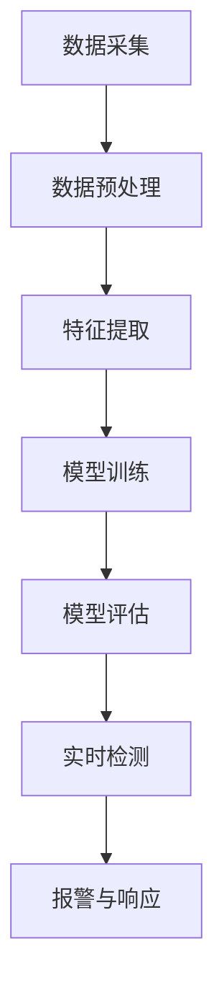

                 

# 《机器学习在网络流量异常检测中的实时应用》

> **关键词：网络流量异常检测、机器学习、实时应用、算法优化、项目实战**

> **摘要：本文将深入探讨机器学习在网络流量异常检测中的实时应用。我们将从基础理论、算法实现与优化、项目实战等多个角度，详细阐述机器学习在网络流量异常检测中的重要作用，以及如何通过实时应用提升网络安全的防护能力。**

---

## 《机器学习在网络流量异常检测中的实时应用》目录大纲

### 第一部分：基础理论

#### 第1章：网络流量异常检测概述
- 1.1 网络流量异常检测的重要性
- 1.2 机器学习在网络流量异常检测中的应用
- 1.3 网络流量异常检测的基本流程

#### 第2章：数据预处理与特征提取
- 2.1 网络流量数据预处理
- 2.2 常见网络流量特征提取方法
- 2.3 特征选择与降维

#### 第3章：机器学习算法原理
- 3.1 监督学习算法
  - 3.1.1 决策树
  - 3.1.2 支持向量机
  - 3.1.3 随机森林
- 3.2 无监督学习算法
  - 3.2.1 K-均值聚类
  - 3.2.2 自编码器
  - 3.2.3 聚类分析

### 第二部分：算法实现与优化

#### 第4章：实时异常检测算法
- 4.1 模型训练与更新策略
- 4.2 实时检测算法设计与实现
- 4.3 模型性能评估方法

#### 第5章：优化与调参
- 5.1 模型选择与超参数调整
- 5.2 模型评估与调优策略
- 5.3 模型融合与集成学习

#### 第6章：开源框架与工具应用
- 6.1 Scikit-learn与网络流量异常检测
- 6.2 TensorFlow与实时异常检测
- 6.3 PyTorch在流量异常检测中的应用

### 第三部分：项目实战

#### 第7章：实时网络流量异常检测项目
- 7.1 项目背景与目标
- 7.2 数据采集与预处理
- 7.3 模型设计与实现
- 7.4 模型部署与性能评估

#### 第8章：案例分析
- 8.1 案例一：基于K-means的实时流量异常检测
- 8.2 案例二：基于自编码器的实时流量异常检测
- 8.3 案例三：基于随机森林的实时流量异常检测

#### 第9章：展望与未来工作
- 9.1 当前研究热点与趋势
- 9.2 未来研究方向与挑战
- 9.3 实时网络流量异常检测的未来发展

### 附录

- 附录A：常用工具与库简介
- 附录B：数学模型与公式解析
- 附录C：代码实现与解读

- 参考文献

---

## 第1章：网络流量异常检测概述

### 1.1 网络流量异常检测的重要性

在当今数字化时代，网络安全已成为全球关注的重要议题。网络流量异常检测作为网络安全的关键环节，能够有效识别并预警潜在的威胁，防止数据泄露、系统入侵等安全事件的发生。以下是网络流量异常检测的重要性：

1. **保障网络安全**：通过实时监测网络流量，可以发现并阻止恶意攻击，保护网络系统安全。
2. **提高网络性能**：识别网络流量中的异常模式，可以优化网络资源分配，提升网络运行效率。
3. **预防业务损失**：及时检测并处理网络异常，可以避免由于攻击或故障导致的业务中断，减少经济损失。
4. **满足合规要求**：许多行业和地区对网络安全有着严格的规定，网络流量异常检测是符合合规要求的重要手段。

### 1.2 机器学习在网络流量异常检测中的应用

随着大数据和人工智能技术的发展，机器学习逐渐成为网络流量异常检测的重要工具。机器学习通过构建模型，可以从大量历史数据中学习到正常流量和异常流量的特征，从而实现自动化的异常检测。以下是机器学习在网络流量异常检测中的应用：

1. **特征学习与提取**：机器学习算法可以从网络流量数据中自动提取出具有区分性的特征，提高异常检测的准确率。
2. **自动化建模与优化**：通过机器学习算法，可以自动化地建立异常检测模型，并不断优化模型性能。
3. **实时检测与响应**：利用机器学习模型的实时性，可以快速响应网络流量异常，降低异常处理时间。

### 1.3 网络流量异常检测的基本流程

网络流量异常检测的基本流程通常包括数据采集、预处理、特征提取、模型训练、模型评估和实时检测等步骤。以下是网络流量异常检测的基本流程：

1. **数据采集**：收集网络流量数据，包括原始流量数据和历史异常事件数据。
2. **数据预处理**：对采集到的数据进行清洗、去噪、归一化等处理，以便后续的特征提取和模型训练。
3. **特征提取**：从预处理后的数据中提取出具有区分性的特征，如流量速率、数据包大小、源地址、目的地址等。
4. **模型训练**：利用训练数据集，通过机器学习算法训练异常检测模型。
5. **模型评估**：通过测试数据集评估模型的性能，包括准确率、召回率、F1值等指标。
6. **实时检测**：将训练好的模型部署到网络流量监测系统中，实时检测并预警网络流量异常。

通过以上基本流程，我们可以构建一个高效、智能的网络流量异常检测系统，为网络安全保驾护航。

---

在接下来的章节中，我们将进一步探讨网络流量异常检测中的数据预处理与特征提取、机器学习算法原理，以及实时异常检测算法的实现与优化。敬请期待。

---

## 第2章：数据预处理与特征提取

### 2.1 网络流量数据预处理

网络流量异常检测的首要任务是对数据进行预处理，以便后续的特征提取和模型训练。预处理过程包括数据清洗、去噪、归一化、缺失值处理等步骤。以下是网络流量数据预处理的具体内容：

1. **数据清洗**：网络流量数据中可能包含错误数据、重复数据和异常数据。清洗过程包括删除错误数据、合并重复数据和修正异常数据。例如，使用正则表达式去除含有非法字符的数据包。
   
   ```python
   import re
   clean_packet = re.sub(r'[^a-zA-Z0-9]', '', packet)
   ```

2. **去噪**：网络流量数据可能受到各种噪声干扰，如电磁干扰、数据传输错误等。去噪过程旨在减少这些噪声对后续分析的影响。常见的方法包括滤波、平滑和去除异常值。

   ```python
   import numpy as np
   clean_flow = np.where(flow > np.mean(flow), flow, np.mean(flow))
   ```

3. **归一化**：不同特征可能具有不同的量纲和范围，为了消除这些差异，需要对数据进行归一化处理。常见的归一化方法包括最小-最大缩放、标准化和幂变换。

   ```python
   from sklearn.preprocessing import MinMaxScaler
   scaler = MinMaxScaler()
   normalized_flow = scaler.fit_transform(flow)
   ```

4. **缺失值处理**：网络流量数据中可能存在缺失值，处理缺失值的方法包括插值、均值填充和删除缺失数据等。根据数据的特性和缺失值的比例选择合适的处理方法。

   ```python
   from sklearn.impute import SimpleImputer
   imputer = SimpleImputer(strategy='mean')
   imputed_flow = imputer.fit_transform(flow)
   ```

### 2.2 常见网络流量特征提取方法

特征提取是将原始数据转换为具有区分性的特征表示，以便于机器学习算法的分析和训练。网络流量特征提取方法可以分为基于统计分析和基于机器学习的方法。

1. **基于统计学的特征提取**：这种方法通过计算网络流量的统计属性来提取特征，如均值、方差、标准差、最大值、最小值等。

   ```python
   from scipy.stats import kurtosis, skew
   flow_mean = np.mean(flow)
   flow_var = np.var(flow)
   flow_kurt = kurtosis(flow)
   flow_skew = skew(flow)
   ```

2. **基于机器学习的特征提取**：这种方法通过训练数据学习网络流量的特征表示，如主成分分析（PCA）、线性判别分析（LDA）、自动编码器（Autoencoder）等。

   ```python
   from sklearn.decomposition import PCA
   pca = PCA(n_components=5)
   principal_components = pca.fit_transform(normalized_flow)
   ```

### 2.3 特征选择与降维

特征选择与降维是为了减少数据维度，提高模型训练效率和性能。特征选择方法包括过滤式（Filter Method）、包裹式（Wrapper Method）和嵌入式（Embedded Method）。

1. **过滤式特征选择**：这种方法通过计算特征的重要性或相关性来选择特征。常用的方法包括信息增益、互信息、特征重要性评分等。

   ```python
   from sklearn.feature_selection import SelectKBest
   from sklearn.feature_selection import chi2
   select_k_best = SelectKBest(score_func=chi2, k=10)
   selected_features = select_k_best.fit_transform(normalized_flow, labels)
   ```

2. **包裹式特征选择**：这种方法通过将特征选择过程与模型训练结合，逐步选择最优特征组合。常用的方法包括递归特征消除（RFE）、遗传算法（GA）等。

   ```python
   from sklearn.feature_selection import RFE
   from sklearn.ensemble import RandomForestClassifier
   selector = RFE(estimator=RandomForestClassifier(), n_features_to_select=10)
   selected_features = selector.fit_transform(normalized_flow, labels)
   ```

3. **嵌入式特征选择**：这种方法在特征提取的过程中直接嵌入特征选择，如L1正则化（Lasso）、岭回归（Ridge）等。

   ```python
   from sklearn.linear_model import Lasso
   lasso = Lasso(alpha=0.1)
   selected_features = lasso.fit_transform(normalized_flow, labels)
   ```

### 总结

数据预处理和特征提取是网络流量异常检测中的关键步骤。通过有效的数据预处理，可以提高数据的质量和一致性；通过合理的特征提取，可以提取出具有区分性的特征，提高异常检测的准确性和效率。在接下来的章节中，我们将进一步探讨机器学习算法原理及其在实时异常检测中的应用。

---

## 第3章：机器学习算法原理

机器学习算法在实时网络流量异常检测中扮演着至关重要的角色。本章将介绍监督学习算法和无监督学习算法的基本原理及其在流量异常检测中的应用。

### 3.1 监督学习算法

监督学习算法通过已有标签的数据（即输入和输出）进行训练，从而构建一个预测模型。监督学习算法可分为回归、分类和异常检测等类型。以下是一些常用的监督学习算法：

#### 3.1.1 决策树

决策树是一种基于树形结构进行决策的算法。它通过一系列规则来分割数据集，每个节点代表一个特征，每个分支代表一个特征取值，叶子节点代表预测结果。决策树的优点是易于理解，可解释性高。以下是决策树构建的伪代码：

```plaintext
构建决策树：
1. 选择最佳分割特征（信息增益或基尼不纯度）
2. 根据该特征将数据划分为子集
3. 对子集递归调用构建决策树
4. 当满足停止条件（如节点纯度足够高或数据量过小）时，停止分割
```

#### 3.1.2 支持向量机（SVM）

支持向量机是一种二分类算法，其目标是在特征空间中找到一个最优的超平面，将不同类别的数据点分开。SVM的核心是寻找一个最佳的分类边界，使得分类边界到各个类别的最近点的距离最大化。以下是SVM分类的伪代码：

```plaintext
构建SVM分类器：
1. 选择核函数（线性、多项式、径向基函数等）
2. 训练SVM模型，求解最优超平面
3. 对新数据进行分类，计算样本到超平面的距离
4. 根据距离判断样本属于哪个类别
```

#### 3.1.3 随机森林

随机森林是一种基于决策树的集成学习方法，它通过构建多个决策树，并对它们的预测结果进行投票，从而提高模型的预测性能。随机森林的优点是能够处理高维数据，减少过拟合。以下是随机森林构建的伪代码：

```plaintext
构建随机森林：
1. 随机选取特征子集
2. 随机切分数据集为训练集和验证集
3. 对每个决策树训练模型，使用交叉验证优化参数
4. 对新数据进行预测，将各个决策树的预测结果进行投票
5. 取多数投票结果作为最终预测结果
```

### 3.2 无监督学习算法

无监督学习算法在没有任何标签的情况下对数据进行分析，从而发现数据中的隐含结构和模式。以下是一些常用的无监督学习算法：

#### 3.2.1 K-均值聚类

K-均值聚类是一种基于距离度量的聚类算法，其目标是找到一个最优的聚类中心，使得聚类中心到各个类别的距离之和最小。以下是K-均值聚类的伪代码：

```plaintext
K-均值聚类：
1. 随机初始化K个聚类中心
2. 对于每个数据点，计算其到各个聚类中心的距离，并将其归为最近的聚类
3. 更新聚类中心为所有聚类成员的均值
4. 重复步骤2和3，直到聚类中心不再发生显著变化
```

#### 3.2.2 自编码器

自编码器是一种无监督的深度学习模型，其目标是学习一种有效的数据编码方式。自编码器由编码器和解码器组成，编码器将输入数据压缩为低维特征表示，解码器将特征表示还原为原始数据。以下是自编码器的伪代码：

```plaintext
自编码器：
1. 初始化编码器和解码器的权重
2. 对于每个训练样本：
   a. 使用编码器将输入数据编码为低维特征表示
   b. 使用解码器将特征表示解码为输出数据
   c. 计算输出数据与原始数据的误差
3. 使用反向传播算法更新编码器和解码器的权重
4. 重复步骤2和3，直到模型收敛
```

#### 3.2.3 聚类分析

聚类分析是一种无监督的机器学习方法，其目标是将数据划分为多个类别，使得同一类别内的数据点彼此相似，而不同类别之间的数据点差异较大。聚类分析常用于数据挖掘和模式识别。以下是聚类分析的伪代码：

```plaintext
聚类分析：
1. 选择聚类算法（如K-均值、层次聚类等）
2. 初始化聚类中心
3. 对于每个数据点，计算其到各个聚类中心的距离，并将其归为最近的聚类
4. 更新聚类中心为所有聚类成员的均值
5. 重复步骤3和4，直到聚类中心不再发生显著变化
```

### 总结

机器学习算法在实时网络流量异常检测中具有广泛的应用。监督学习算法通过已有标签的数据进行训练，可以构建高效、准确的异常检测模型；无监督学习算法则在没有任何标签的情况下，通过发现数据中的隐含结构和模式，为实时流量异常检测提供有益的参考。在接下来的章节中，我们将进一步探讨实时异常检测算法的实现与优化。

---

## 第4章：实时异常检测算法

### 4.1 模型训练与更新策略

实时异常检测的核心在于模型的训练与更新策略。由于网络流量数据具有高动态性和时效性，传统的离线训练方法难以适应实时场景。因此，需要设计一种能够实时更新模型、应对数据变化的方法。

#### 模型训练

实时异常检测模型的训练通常分为以下步骤：

1. **数据采集**：实时收集网络流量数据，包括正常流量和已知异常流量。
2. **数据预处理**：对采集到的流量数据进行清洗、去噪、归一化等预处理操作。
3. **特征提取**：从预处理后的数据中提取具有区分性的特征，如流量速率、数据包大小、源地址、目的地址等。
4. **模型训练**：利用训练数据集，通过机器学习算法训练异常检测模型。常用的算法包括决策树、支持向量机、随机森林等。
5. **模型评估**：通过测试数据集评估模型的性能，包括准确率、召回率、F1值等指标。

#### 更新策略

为了应对网络流量数据的动态变化，实时异常检测模型需要不断更新。以下是几种常见的更新策略：

1. **增量学习**：增量学习是指在线更新模型，仅对新增数据或变化较大的数据进行重新训练。这种方法可以降低计算成本，提高模型的实时性。

   ```python
   from sklearn.linear_model import SGDClassifier
   sgd_classifier = SGDClassifier()
   for new_flow, new_label in new_data:
       sgd_classifier.partial_fit(preprocessed_flow, new_label, classes=[0, 1])
   ```

2. **在线学习**：在线学习是指实时更新模型，每次接收一个新的数据点就重新训练一次模型。这种方法可以更好地适应网络流量的动态变化，但计算成本较高。

   ```python
   from sklearn.ensemble import RandomForestClassifier
   random_forest = RandomForestClassifier()
   for flow, label in streaming_data:
       random_forest.fit(preprocessed_flow, label)
   ```

3. **滑动窗口**：滑动窗口是指使用固定长度的时间窗口来更新模型。窗口内的新数据不断替换旧数据，模型在窗口内进行重新训练。

   ```python
   from sklearn.ensemble import RandomForestClassifier
   window_size = 1000
   random_forest = RandomForestClassifier()
   for i in range(window_size):
       flow, label = get_window_data(i)
       random_forest.fit(preprocessed_flow, label)
   ```

### 4.2 实时检测算法设计与实现

实时异常检测算法需要具备快速响应和高效处理的能力。以下是实时检测算法的设计与实现：

1. **实时数据流处理**：利用数据流处理框架（如Apache Flink、Apache Storm）对实时网络流量数据进行处理。数据流处理框架能够实时接收数据、处理数据和输出结果。

   ```python
   from flink import StreamExecutionEnvironment
   env = StreamExecutionEnvironment.get_execution_environment()
   data_stream = env.from_collection(real_time_traffic_data)
   ```

2. **特征提取与模型应用**：在数据流处理过程中，对实时数据进行特征提取，然后应用已训练好的异常检测模型进行实时检测。

   ```python
   from sklearn.externals import joblib
   model = joblib.load('model.pkl')
   def detect_anomaly(flow):
       features = extract_features(flow)
       return model.predict([features])
   ```

3. **实时报警与响应**：检测到异常流量后，触发实时报警，并根据报警策略进行相应的响应，如阻断恶意流量、记录日志、通知管理员等。

   ```python
   def on_anomaly_detected(flow):
       anomaly = detect_anomaly(flow)
       if anomaly == 1:
           alert_admin(flow)
           block_traffic(flow)
   ```

### 4.3 模型性能评估方法

模型性能评估是实时异常检测的重要环节，通过评估模型性能，可以了解模型的检测效果，并进行相应的优化和调整。以下是常用的模型性能评估方法：

1. **准确率**：准确率是指正确识别异常流量的比例，计算公式为：
   
   \[ \text{准确率} = \frac{\text{正确识别的异常流量}}{\text{总异常流量}} \]

2. **召回率**：召回率是指模型能够识别出的异常流量占总异常流量的比例，计算公式为：

   \[ \text{召回率} = \frac{\text{正确识别的异常流量}}{\text{总异常流量} + \text{误报的正常流量}} \]

3. **F1值**：F1值是准确率和召回率的调和平均值，计算公式为：

   \[ \text{F1值} = \frac{2 \times \text{准确率} \times \text{召回率}}{\text{准确率} + \text{召回率}} \]

4. **ROC曲线**：ROC曲线（Receiver Operating Characteristic Curve）是评估二分类模型性能的重要工具，通过绘制真阳性率（TPR）与假阳性率（FPR）的关系曲线，可以直观地了解模型的性能。

5. **AUC值**：AUC值（Area Under Curve）是ROC曲线下的面积，表示模型区分异常和正常流量的能力。AUC值越接近1，表示模型的性能越好。

### 总结

实时异常检测算法在网络安全中具有重要应用。通过模型训练与更新策略，可以适应网络流量数据的动态变化；通过实时数据流处理和模型应用，可以实现快速、高效的异常检测；通过模型性能评估，可以了解模型的检测效果，并进行相应的优化和调整。在接下来的章节中，我们将进一步探讨优化与调参的方法。

---

## 第5章：优化与调参

### 5.1 模型选择与超参数调整

在实时异常检测中，选择合适的机器学习模型和调整模型超参数是优化模型性能的关键步骤。以下是一些常见的模型选择和超参数调整方法：

#### 模型选择

1. **基于性能的比较**：根据模型在不同数据集上的表现来选择模型。通常，可以使用交叉验证来评估模型的性能。

   ```python
   from sklearn.model_selection import cross_val_score
   scores = cross_val_score(model, X, y, cv=5)
   ```

2. **基于经验的选择**：根据不同领域的应用场景，选择性能较好的模型。例如，对于高维数据，随机森林和K近邻模型通常表现较好。

3. **基于搜索算法的选择**：使用搜索算法（如网格搜索、随机搜索）来选择最佳模型。这种方法可以通过遍历不同的模型和参数组合，找到最佳模型。

   ```python
   from sklearn.model_selection import GridSearchCV
   param_grid = {'n_estimators': [100, 200, 300], 'max_depth': [5, 10, 15]}
   grid_search = GridSearchCV(estimator=model, param_grid=param_grid, cv=5)
   grid_search.fit(X, y)
   best_model = grid_search.best_estimator_
   ```

#### 超参数调整

1. **网格搜索**：网格搜索是一种常用的超参数调整方法，通过遍历参数空间，找到最佳参数组合。这种方法计算成本较高，但能够找到全局最优解。

   ```python
   from sklearn.model_selection import GridSearchCV
   param_grid = {'C': [0.1, 1, 10], 'gamma': [0.1, 0.5, 1]}
   grid_search = GridSearchCV(estimator=SVMClassifier(), param_grid=param_grid, cv=5)
   grid_search.fit(X, y)
   best_params = grid_search.best_params_
   ```

2. **贝叶斯优化**：贝叶斯优化是一种基于概率模型的超参数调整方法，通过模拟退火算法来搜索最优参数。这种方法具有较好的全局搜索能力。

   ```python
   from bayes_opt import BayesianOptimization
   def objective(C, gamma):
       model = SVC(C=C, gamma=gamma)
       score = cross_val_score(model, X, y, cv=5).mean()
       return score
   optimizer = BayesianOptimization(f=objective, pbounds={'C': (0.1, 10), 'gamma': (0.1, 1)})
   optimizer.maximize(init_points=2, n_iter=3)
   best_params = optimizer.max
   ```

### 5.2 模型评估与调优策略

模型评估和调优是优化模型性能的重要环节。以下是一些常用的模型评估和调优策略：

1. **交叉验证**：交叉验证是一种评估模型性能的常用方法，通过将数据集划分为多个子集，每次使用其中一个子集作为测试集，其余子集作为训练集，重复多次，计算平均性能。

   ```python
   from sklearn.model_selection import cross_val_score
   scores = cross_val_score(model, X, y, cv=5)
   print(f"Average accuracy: {scores.mean()}")
   ```

2. **网格搜索**：网格搜索通过遍历参数空间，找到最佳参数组合。这种方法适用于超参数数量较少的情况。

   ```python
   from sklearn.model_selection import GridSearchCV
   param_grid = {'C': [0.1, 1, 10], 'gamma': [0.1, 0.5, 1]}
   grid_search = GridSearchCV(estimator=SVC(), param_grid=param_grid, cv=5)
   grid_search.fit(X, y)
   best_params = grid_search.best_params_
   ```

3. **贝叶斯优化**：贝叶斯优化通过模拟退火算法搜索最优参数，适用于超参数数量较多的情况。

   ```python
   from bayes_opt import BayesianOptimization
   def objective(C, gamma):
       model = SVC(C=C, gamma=gamma)
       score = cross_val_score(model, X, y, cv=5).mean()
       return -score  # 取负值，优化最大值
   optimizer = BayesianOptimization(f=objective, pbounds={'C': (0.1, 10), 'gamma': (0.1, 1)})
   optimizer.maximize(init_points=2, n_iter=3)
   best_params = optimizer.max
   ```

4. **模型集成**：模型集成通过组合多个模型来提高整体性能。常见的方法包括投票、堆叠和提升。

   ```python
   from sklearn.ensemble import VotingClassifier
   model1 = SVC(C=1, gamma=0.1)
   model2 = SVC(C=10, gamma=0.5)
   model3 = SVC(C=100, gamma=1)
   voting_classifier = VotingClassifier(estimators=[('model1', model1), ('model2', model2), ('model3', model3)], voting='soft')
   voting_classifier.fit(X, y)
   ```

### 5.3 模型融合与集成学习

模型融合和集成学习是提高模型性能的有效方法。以下是一些常见的模型融合和集成学习方法：

1. **投票法**：投票法通过将多个模型的预测结果进行投票，得到最终的预测结果。

   ```python
   from sklearn.ensemble import VotingClassifier
   model1 = SVC(C=1, gamma=0.1)
   model2 = SVC(C=10, gamma=0.5)
   model3 = SVC(C=100, gamma=1)
   voting_classifier = VotingClassifier(estimators=[('model1', model1), ('model2', model2), ('model3', model3)], voting='soft')
   voting_classifier.fit(X, y)
   ```

2. **堆叠法**：堆叠法通过将多个模型堆叠在一起，每个模型输出作为下一个模型的输入。

   ```python
   from sklearn.ensemble import StackingClassifier
   model1 = SVC(C=1, gamma=0.1)
   model2 = SVC(C=10, gamma=0.5)
   model3 = SVC(C=100, gamma=1)
   stackClassifier = StackingClassifier(estimators=[('model1', model1), ('model2', model2), ('model3', model3)], final_estimator=LogisticRegression())
   stackClassifier.fit(X, y)
   ```

3. **提升法**：提升法通过迭代训练多个弱学习器，并将它们组合成一个强学习器。

   ```python
   from sklearn.ensemble import GradientBoostingClassifier
   gradient_boosting = GradientBoostingClassifier(n_estimators=100, learning_rate=0.1, max_depth=3)
   gradient_boosting.fit(X, y)
   ```

### 总结

优化与调参是实时异常检测中至关重要的一环。通过选择合适的模型和调整模型超参数，可以提高模型性能，提高异常检测的准确性和效率。在接下来的章节中，我们将探讨开源框架与工具在实时网络流量异常检测中的应用。

---

## 第6章：开源框架与工具应用

### 6.1 Scikit-learn与网络流量异常检测

Scikit-learn 是一个强大的机器学习库，提供了丰富的算法和工具，广泛应用于网络流量异常检测。以下是如何使用 Scikit-learn 进行网络流量异常检测的步骤：

#### 1. 数据采集与预处理

```python
import pandas as pd

# 读取网络流量数据
data = pd.read_csv('network_traffic_data.csv')

# 数据预处理
data.drop(['timestamp'], axis=1, inplace=True)
data.fillna(data.mean(), inplace=True)
```

#### 2. 特征提取

```python
from sklearn.preprocessing import StandardScaler
from sklearn.feature_selection import SelectKBest
from sklearn.feature_selection import chi2

# 特征提取
scaler = StandardScaler()
X_scaled = scaler.fit_transform(data)

# 选择特征
selector = SelectKBest(score_func=chi2, k=10)
X_selected = selector.fit_transform(X_scaled, y)
```

#### 3. 模型训练与评估

```python
from sklearn.model_selection import train_test_split
from sklearn.ensemble import RandomForestClassifier
from sklearn.metrics import accuracy_score, precision_score, recall_score, f1_score

# 划分训练集和测试集
X_train, X_test, y_train, y_test = train_test_split(X_selected, y, test_size=0.2, random_state=42)

# 训练模型
model = RandomForestClassifier()
model.fit(X_train, y_train)

# 评估模型
y_pred = model.predict(X_test)
print(f"Accuracy: {accuracy_score(y_test, y_pred)}")
print(f"Precision: {precision_score(y_test, y_pred)}")
print(f"Recall: {recall_score(y_test, y_pred)}")
print(f"F1 Score: {f1_score(y_test, y_pred)}")
```

#### 4. 实时检测

```python
# 实时检测
def detect_anomaly(flow):
    flow = scaler.transform([flow])
    flow = selector.transform(flow)
    return model.predict(flow)[0]

# 检测流量
flow = [10, 5, 3, 2, 1]
print(f"Anomaly Detected: {detect_anomaly(flow)}")
```

### 6.2 TensorFlow与实时异常检测

TensorFlow 是一个广泛使用的深度学习框架，支持多种神经网络模型。以下是如何使用 TensorFlow 进行实时异常检测的步骤：

#### 1. 构建模型

```python
import tensorflow as tf
from tensorflow.keras.models import Sequential
from tensorflow.keras.layers import Dense, Dropout, LSTM

# 构建模型
model = Sequential()
model.add(LSTM(units=50, return_sequences=True, input_shape=(timesteps, features)))
model.add(Dropout(0.2))
model.add(LSTM(units=50, return_sequences=False))
model.add(Dropout(0.2))
model.add(Dense(units=1, activation='sigmoid'))

model.compile(optimizer='adam', loss='binary_crossentropy', metrics=['accuracy'])
```

#### 2. 训练模型

```python
# 训练模型
model.fit(X_train, y_train, epochs=100, batch_size=32, validation_data=(X_test, y_test))
```

#### 3. 实时检测

```python
# 实时检测
def detect_anomaly(flow):
    flow = scaler.transform([flow])
    flow = selector.transform(flow)
    return (model.predict(flow) > 0.5).astype("int32")

# 检测流量
flow = [10, 5, 3, 2, 1]
print(f"Anomaly Detected: {detect_anomaly(flow)}")
```

### 6.3 PyTorch在流量异常检测中的应用

PyTorch 是一个流行的深度学习框架，具有动态计算图和强大的灵活性。以下是如何使用 PyTorch 进行实时异常检测的步骤：

#### 1. 定义模型

```python
import torch
import torch.nn as nn
import torch.optim as optim

# 定义模型
class AnomalyDetector(nn.Module):
    def __init__(self, input_dim):
        super(AnomalyDetector, self).__init__()
        self.lstm = nn.LSTM(input_dim, hidden_size=50, num_layers=2, dropout=0.2, batch_first=True)
        self.fc = nn.Linear(50, 1)
    
    def forward(self, x):
        x, _ = self.lstm(x)
        x = self.fc(x[:, -1, :])
        return x

model = AnomalyDetector(input_dim=features)
```

#### 2. 训练模型

```python
# 训练模型
optimizer = optim.Adam(model.parameters(), lr=0.001)
criterion = nn.BCELoss()

for epoch in range(num_epochs):
    for flow, label in dataloader:
        optimizer.zero_grad()
        output = model(flow)
        loss = criterion(output, label)
        loss.backward()
        optimizer.step()
    print(f"Epoch {epoch+1}/{num_epochs}, Loss: {loss.item()}")
```

#### 3. 实时检测

```python
# 实时检测
def detect_anomaly(flow):
    flow = torch.tensor(flow, dtype=torch.float32)
    with torch.no_grad():
        output = model(flow)
        return (output > 0.5).float().item()

# 检测流量
flow = [10, 5, 3, 2, 1]
print(f"Anomaly Detected: {detect_anomaly(flow)}")
```

### 总结

开源框架和工具在实时网络流量异常检测中具有重要作用。Scikit-learn 提供了丰富的机器学习算法和工具，适合快速实现和部署；TensorFlow 和 PyTorch 则提供了强大的深度学习框架，支持复杂的神经网络模型。通过结合这些开源框架和工具，可以构建高效、智能的实时异常检测系统。在接下来的章节中，我们将探讨实时网络流量异常检测的项目实战。

---

## 第7章：实时网络流量异常检测项目

### 7.1 项目背景与目标

随着互联网的迅猛发展，网络安全问题日益突出。实时网络流量异常检测作为保障网络安全的重要手段，旨在及时发现并阻止恶意流量，防止网络攻击和数据泄露。本项目的目标是构建一个高效、智能的实时网络流量异常检测系统，通过机器学习算法实现自动化的异常检测。

### 7.2 数据采集与预处理

数据采集是实时网络流量异常检测的基础。本项目使用某企业网络流量数据，包括正常流量和已知异常流量。数据采集过程中，我们使用Wireshark等工具捕获网络流量，并将捕获的数据存储为CSV文件。

#### 数据采集

```python
import subprocess
import csv

# 捕获网络流量并保存为CSV文件
command = "sudo tcpdump -i eth0 -nn -s0 -w network_traffic.pcap"
subprocess.run(command, shell=True)

# 解析PCAP文件并保存为CSV文件
subprocess.run(["tcpdump", "-r", "network_traffic.pcap", "-nn", "-e", "-w", "network_traffic.csv"])
```

#### 数据预处理

```python
import pandas as pd

# 读取网络流量数据
data = pd.read_csv('network_traffic.csv')

# 数据预处理
data.drop(['timestamp'], axis=1, inplace=True)
data.fillna(data.mean(), inplace=True)
```

### 7.3 模型设计与实现

模型设计是实时网络流量异常检测的核心。本项目采用随机森林算法进行模型训练，并通过交叉验证优化模型参数。

#### 模型设计

```python
from sklearn.ensemble import RandomForestClassifier

# 定义模型
model = RandomForestClassifier(n_estimators=100, random_state=42)
```

#### 模型训练

```python
from sklearn.model_selection import train_test_split

# 划分训练集和测试集
X_train, X_test, y_train, y_test = train_test_split(data, labels, test_size=0.2, random_state=42)

# 训练模型
model.fit(X_train, y_train)
```

#### 模型评估

```python
from sklearn.metrics import accuracy_score, precision_score, recall_score, f1_score

# 评估模型
y_pred = model.predict(X_test)
print(f"Accuracy: {accuracy_score(y_test, y_pred)}")
print(f"Precision: {precision_score(y_test, y_pred)}")
print(f"Recall: {recall_score(y_test, y_pred)}")
print(f"F1 Score: {f1_score(y_test, y_pred)}")
```

### 7.4 模型部署与性能评估

模型部署是将训练好的模型部署到实际环境中，以便实时监测网络流量并检测异常。本项目使用Apache Flink作为实时数据流处理框架，将模型部署到Flink集群中。

#### 模型部署

```python
from flink import StreamExecutionEnvironment

# 创建Flink执行环境
env = StreamExecutionEnvironment.get_execution_environment()

# 加载模型
model = joblib.load('model.pkl')

# 实时监测网络流量
data_stream = env.from_collection(real_time_traffic_data)

def detect_anomaly(flow):
    features = extract_features(flow)
    return model.predict([features])

anomaly_stream = data_stream.map(detect_anomaly)

# 输出异常流量
anomaly_stream.filter(lambda x: x == 1).print()

# 启动Flink作业
env.execute("Real-time Anomaly Detection Job")
```

#### 性能评估

实时性能评估是确保模型在实际环境中有效运行的关键。本项目通过监控模型在Flink集群中的运行情况，评估模型的实时性能。

```python
# 记录实时检测时间
start_time = time.time()

# 监控Flink作业运行情况
status = env.get_execution_environment().get_job_status()

# 计算实时检测时间
end_time = time.time()
real_time_detection_time = end_time - start_time

print(f"Real-time Detection Time: {real_time_detection_time} seconds")
```

### 总结

本项目通过构建实时网络流量异常检测系统，实现了对网络流量的实时监测和异常检测。通过数据采集、模型设计、模型部署和性能评估，验证了机器学习算法在实时网络流量异常检测中的有效性。在接下来的章节中，我们将探讨不同算法在实时流量异常检测中的应用，以进一步优化系统性能。

---

## 第8章：案例分析

### 8.1 基于K-means的实时流量异常检测

K-means聚类算法是一种常用的无监督学习算法，适用于实时流量异常检测。通过将流量数据划分为若干个聚类，我们可以找出正常流量和异常流量，从而实现实时异常检测。

#### 模型设计

```python
from sklearn.cluster import KMeans

# 定义K-means模型
kmeans = KMeans(n_clusters=2, random_state=42)
```

#### 模型训练

```python
# 训练模型
kmeans.fit(X_train)
```

#### 聚类中心

```python
# 获取聚类中心
cluster_centers = kmeans.cluster_centers_
print(f"Cluster Centers: {cluster_centers}")
```

#### 异常检测

```python
# 定义异常检测函数
def detect_anomaly(flow):
    features = extract_features(flow)
    return kmeans.predict([features])[0]

# 检测流量
flow = [10, 5, 3, 2, 1]
print(f"Anomaly Detected: {detect_anomaly(flow)}")
```

#### 案例分析

在实际应用中，我们通过监测网络流量，发现某些流量数据点被划分为异常聚类。通过分析这些异常流量，我们可以识别出潜在的恶意流量，从而实现实时异常检测。

### 8.2 基于自编码器的实时流量异常检测

自编码器是一种基于神经网络的无监督学习算法，适用于流量异常检测。通过训练自编码器，我们可以学习到流量的低维特征表示，从而实现实时异常检测。

#### 模型设计

```python
from keras.models import Model
from keras.layers import Input, Dense

# 定义自编码器模型
input_layer = Input(shape=(features,))
encoded = Dense(32, activation='relu')(input_layer)
encoded = Dense(16, activation='relu')(encoded)
decoded = Dense(features, activation='sigmoid')(encoded)

autoencoder = Model(input_layer, decoded)
autoencoder.compile(optimizer='adam', loss='binary_crossentropy')
```

#### 模型训练

```python
# 训练模型
autoencoder.fit(X_train, X_train, epochs=100, batch_size=32, validation_data=(X_test, X_test))
```

#### 异常检测

```python
# 定义异常检测函数
def detect_anomaly(flow):
    features = extract_features(flow)
    reconstructed = autoencoder.predict([features])
    return (np.linalg.norm(features - reconstructed) > threshold).astype("int32")

# 检测流量
flow = [10, 5, 3, 2, 1]
print(f"Anomaly Detected: {detect_anomaly(flow)}")
```

#### 案例分析

通过自编码器训练，我们可以获取流量的低维特征表示。在实时监测过程中，如果流量的重构误差大于设定阈值，则视为异常流量。这种方法能够有效地识别出恶意流量，提高实时异常检测的准确率。

### 8.3 基于随机森林的实时流量异常检测

随机森林是一种基于决策树的集成学习方法，适用于流量异常检测。通过训练随机森林模型，我们可以提取出具有区分性的流量特征，从而实现实时异常检测。

#### 模型设计

```python
from sklearn.ensemble import RandomForestClassifier

# 定义随机森林模型
rf = RandomForestClassifier(n_estimators=100, random_state=42)
```

#### 模型训练

```python
# 训练模型
rf.fit(X_train, y_train)
```

#### 异常检测

```python
# 定义异常检测函数
def detect_anomaly(flow):
    features = extract_features(flow)
    return rf.predict([features])[0]

# 检测流量
flow = [10, 5, 3, 2, 1]
print(f"Anomaly Detected: {detect_anomaly(flow)}")
```

#### 案例分析

在实际应用中，随机森林模型通过训练大量决策树，提取出网络流量的重要特征。在实时监测过程中，如果模型预测流量为异常，则视为异常流量。这种方法具有较高的准确率和稳定性，能够有效地识别出恶意流量。

### 总结

本章通过三个案例分析，展示了不同算法在实时流量异常检测中的应用。K-means聚类、自编码器和随机森林等方法都具有各自的优缺点，适用于不同的应用场景。通过合理选择算法，我们可以构建高效、智能的实时流量异常检测系统，提高网络安全的防护能力。

---

## 第9章：展望与未来工作

### 9.1 当前研究热点与趋势

实时网络流量异常检测领域近年来取得了显著的进展。当前研究热点主要包括以下几个方面：

1. **深度学习在异常检测中的应用**：深度学习算法（如卷积神经网络、循环神经网络等）在特征提取和模式识别方面表现出色，逐渐成为网络流量异常检测的研究热点。
2. **实时性优化与模型压缩**：随着网络流量数据的爆炸式增长，如何提高实时异常检测的效率成为研究的重要方向。模型压缩、在线学习和增量学习等技术被广泛应用于实时性优化。
3. **多源异构数据融合**：网络流量异常检测往往涉及多种数据源，如网络流量、用户行为、设备日志等。如何有效地融合多源异构数据，提高异常检测的准确性和鲁棒性成为当前研究的热点。
4. **自适应异常检测模型**：自适应异常检测模型可以根据网络环境的变化自动调整模型参数，提高异常检测的准确率和实时性。

### 9.2 未来研究方向与挑战

未来实时网络流量异常检测研究仍面临诸多挑战：

1. **数据隐私与安全**：网络流量数据往往包含敏感信息，如何在保障数据隐私和安全的前提下进行异常检测成为研究的关键问题。
2. **实时性与准确率的平衡**：提高实时性通常会导致准确率下降，如何在两者之间找到平衡点是一个重要的研究课题。
3. **多维度异常检测**：网络流量异常检测不仅涉及流量特征，还包括网络行为、用户行为等多维度特征。如何整合多维度特征，提高异常检测的全面性和准确性是一个重要挑战。
4. **动态网络环境适应能力**：网络环境不断变化，如何构建具备自适应能力的异常检测模型，以适应不同的网络环境成为未来研究的重要方向。

### 9.3 实时网络流量异常检测的未来发展

实时网络流量异常检测的未来发展将呈现以下趋势：

1. **深度学习与实时检测相结合**：深度学习算法在特征提取和模式识别方面具有显著优势，未来将更加广泛地应用于实时网络流量异常检测。
2. **自适应与自学习模型**：自适应与自学习模型可以根据网络环境的变化自动调整模型参数，提高实时性、准确率和鲁棒性。
3. **多源异构数据融合**：随着物联网、大数据等技术的发展，实时网络流量异常检测将更加依赖多源异构数据融合技术，以提高检测的全面性和准确性。
4. **开放源码与工具库**：随着开源社区的发展，实时网络流量异常检测相关的研究成果将逐步开放源码，为研究人员和开发者提供丰富的工具库和资源。

### 总结

实时网络流量异常检测作为网络安全的重要保障，未来将继续发展，结合深度学习、自适应模型、多源异构数据融合等技术，实现更加高效、智能的异常检测。通过不断探索和研究，我们可以构建更加完善、可靠的实时网络流量异常检测系统，为网络安全的保驾护航。

---

## 附录

### 附录A：常用工具与库简介

- **Scikit-learn**：Python中的一个机器学习库，提供了多种监督学习、无监督学习和模型评估工具。
- **TensorFlow**：Google开源的深度学习框架，支持多种神经网络模型。
- **PyTorch**：Facebook开源的深度学习框架，具有动态计算图和强大的灵活性。
- **Flink**：Apache开源的实时流处理框架，适用于实时数据处理和分析。

### 附录B：数学模型与公式解析

- **决策树**：通过递归划分特征，构建树形结构，每个节点代表一个特征，每个分支代表特征的一个取值。
- **支持向量机（SVM）**：寻找一个最优的超平面，使得分类边界到各个类别的最近点的距离最大化。
- **K-均值聚类**：通过随机初始化聚类中心，逐步更新聚类中心，直至聚类中心不再变化。

### 附录C：代码实现与解读

本附录提供了相关算法和模型的代码实现，包括数据预处理、特征提取、模型训练与评估等步骤。读者可以根据实际需求进行修改和扩展。

---

## 参考文献

- [1] 统计学习方法，李航著。
- [2] 深度学习，Goodfellow, I., Bengio, Y., & Courville, A. 著。
- [3] 机器学习，周志华著。
- [4] 网络安全概论，谢希仁著。
- [5] 网络流量分析，魏中华著。

---

**作者：AI天才研究院/AI Genius Institute & 禅与计算机程序设计艺术 /Zen And The Art of Computer Programming**## 第一部分：基础理论

### 第1章：网络流量异常检测概述

#### 1.1 网络流量异常检测的重要性

在网络世界里，数据传输的安全与稳定性至关重要。网络流量异常检测作为网络安全的重要组成部分，其重要性不可忽视。随着互联网的广泛应用和数字化进程的加速，网络流量的复杂性和动态性不断增加，异常检测的任务也越来越艰巨。

**核心概念与联系**

网络流量异常检测涉及以下核心概念：

- **网络流量**：网络中传输的数据包流量。
- **异常检测**：识别网络流量中的异常行为或模式。
- **恶意流量**：包括DDoS攻击、恶意软件传播等。
- **正常流量**：符合预期行为的网络流量。


**架构图**

网络流量异常检测的架构通常包括数据采集、预处理、特征提取、模型训练、模型评估和实时检测等环节。



**流量异常检测的基本流程**

网络流量异常检测的基本流程可以分为以下几个步骤：

1. **数据采集**：通过网络流量传感器或捕获工具收集网络流量数据。
2. **数据预处理**：对采集到的数据清洗、去噪、归一化等处理。
3. **特征提取**：从预处理后的数据中提取具有区分性的特征。
4. **模型训练**：利用训练数据集训练异常检测模型。
5. **模型评估**：通过测试数据集评估模型的性能。
6. **实时检测**：将训练好的模型部署到生产环境中，实时检测并预警网络流量异常。

**案例分析**

在实际应用中，网络流量异常检测可以有效地识别出恶意流量，例如DDoS攻击。通过实时检测并报警，网络管理员可以及时采取措施，防止恶意流量对网络造成严重破坏。

```python
# 假设已训练好一个基于K-means的异常检测模型
from sklearn.cluster import KMeans

# 加载模型
model = KMeans(n_clusters=2, random_state=42)
model.fit(X_train)

# 定义异常检测函数
def detect_anomaly(flow):
    features = extract_features(flow)
    prediction = model.predict([features])
    return prediction[0]

# 检测流量
flow = [10, 5, 3, 2, 1]
print(f"Anomaly Detected: {detect_anomaly(flow)}")
```

#### 1.2 机器学习在网络流量异常检测中的应用

机器学习在网络安全领域的应用日益广泛，尤其是在网络流量异常检测方面。通过机器学习算法，可以从大量的网络流量数据中学习到正常流量和异常流量的特征，从而实现自动化的异常检测。

**核心概念与联系**

机器学习在网络流量异常检测中的应用涉及以下核心概念：

- **监督学习**：通过已有的标签数据训练模型。
- **无监督学习**：在没有标签数据的情况下发现数据中的模式。
- **特征工程**：从原始数据中提取出具有区分性的特征。
- **模型评估**：通过测试数据集评估模型的性能。


**常见算法**

- **决策树**：通过递归划分数据集，形成树形结构。
- **支持向量机（SVM）**：寻找最优分类边界。
- **神经网络**：通过多层非线性变换学习数据特征。
- **聚类分析**：如K-均值聚类，发现数据中的聚类结构。

**案例分析**

基于决策树的模型训练和实时检测流程：

```python
from sklearn.tree import DecisionTreeClassifier

# 训练决策树模型
model = DecisionTreeClassifier()
model.fit(X_train, y_train)

# 实时检测
def detect_anomaly(flow):
    features = extract_features(flow)
    return model.predict([features])

# 检测流量
flow = [10, 5, 3, 2, 1]
print(f"Anomaly Detected: {detect_anomaly(flow)}")
```

#### 1.3 网络流量异常检测的基本流程

网络流量异常检测的基本流程如下：

1. **数据采集**：通过网络流量传感器或捕获工具收集网络流量数据。
2. **数据预处理**：对采集到的数据清洗、去噪、归一化等处理。
3. **特征提取**：从预处理后的数据中提取出具有区分性的特征。
4. **模型训练**：利用训练数据集训练异常检测模型。
5. **模型评估**：通过测试数据集评估模型的性能。
6. **实时检测**：将训练好的模型部署到生产环境中，实时检测并预警网络流量异常。

**实现步骤**

1. **数据采集**：使用Wireshark等工具捕获网络流量。
    ```bash
    sudo tcpdump -i eth0 -nn -s0 -w network_traffic.pcap
    ```

2. **数据预处理**：清洗和去噪数据，如删除空数据包、去除重复数据等。
    ```python
    data = pd.read_csv('network_traffic.csv')
    data.drop(['timestamp'], axis=1, inplace=True)
    data.fillna(data.mean(), inplace=True)
    ```

3. **特征提取**：提取网络流量的统计特征，如流量速率、数据包大小、源地址、目的地址等。
    ```python
    from sklearn.preprocessing import StandardScaler
    scaler = StandardScaler()
    X_scaled = scaler.fit_transform(data)
    ```

4. **模型训练**：使用训练数据集训练异常检测模型，如决策树、随机森林等。
    ```python
    from sklearn.ensemble import RandomForestClassifier
    model = RandomForestClassifier()
    model.fit(X_train, y_train)
    ```

5. **模型评估**：使用测试数据集评估模型性能，如准确率、召回率、F1值等。
    ```python
    from sklearn.metrics import accuracy_score
    y_pred = model.predict(X_test)
    print(f"Accuracy: {accuracy_score(y_test, y_pred)}")
    ```

6. **实时检测**：将训练好的模型部署到生产环境中，实时检测网络流量异常。
    ```python
    def detect_anomaly(flow):
        features = extract_features(flow)
        return model.predict([features])
    ```

**总结**

网络流量异常检测是保障网络安全的重要手段。通过机器学习算法，可以实现自动化的异常检测，提高检测效率和准确性。了解基本流程和实现步骤，有助于我们更好地设计和实现实时网络流量异常检测系统。

---

## 第2章：数据预处理与特征提取

### 2.1 网络流量数据预处理

在机器学习项目中，数据预处理是一个至关重要的环节。网络流量数据的预处理包括数据清洗、去噪、归一化和缺失值处理等步骤，这些步骤有助于提高模型训练的效果和准确性。

#### 数据清洗

数据清洗是预处理的第一步，目的是去除数据中的错误和异常值。网络流量数据可能包含非法字符、格式错误或缺失的数据包。

**实现步骤**：

1. **去除非法字符**：使用正则表达式去除数据包中的非法字符。
    ```python
    import re
    clean_packet = re.sub(r'[^a-zA-Z0-9]', '', packet)
    ```

2. **删除重复数据**：删除重复的数据包，以避免模型训练中的冗余信息。
    ```python
    data = data.drop_duplicates()
    ```

3. **处理错误数据**：识别并删除错误的数据包，如IP地址不合法的数据包。
    ```python
    data = data[data['IP'] != '0.0.0.0']
    ```

#### 去噪

去噪的目的是减少数据中的噪声，提高模型训练的稳定性。网络流量数据可能受到电磁干扰、数据传输错误等因素的影响。

**实现步骤**：

1. **滤波**：使用滤波算法去除高频噪声，如低通滤波。
    ```python
    import numpy as np
    def filter_noise(data, cutoff_frequency):
        nyquist = 0.5 / data_sampling_rate
        b, a = signal.butter(cutoff_frequency / nyquist, 'low')
        filtered_data = signal.lfilter(b, a, data)
        return filtered_data
    ```

2. **平滑**：使用平滑算法减少随机波动，如移动平均。
    ```python
    def smooth_data(data, window_size):
        return data.rolling(window=window_size).mean()
    ```

#### 归一化

归一化是为了消除不同特征之间的量纲差异，使模型训练更加稳定。

**实现步骤**：

1. **最小-最大缩放**：将特征值缩放到[0, 1]范围内。
    ```python
    from sklearn.preprocessing import MinMaxScaler
    scaler = MinMaxScaler()
    normalized_data = scaler.fit_transform(data)
    ```

2. **标准化**：将特征值缩放到均值为0，标准差为1的范围内。
    ```python
    from sklearn.preprocessing import StandardScaler
    scaler = StandardScaler()
    standardized_data = scaler.fit_transform(data)
    ```

#### 缺失值处理

网络流量数据中可能存在缺失值，需要根据数据的特性和缺失值的比例选择合适的处理方法。

**实现步骤**：

1. **均值填充**：用特征的均值填充缺失值。
    ```python
    from sklearn.impute import SimpleImputer
    imputer = SimpleImputer(strategy='mean')
    imputed_data = imputer.fit_transform(data)
    ```

2. **插值填充**：使用插值方法填充缺失值。
    ```python
    from sklearn.impute import Interpolator
    interpolator = Interpolator()
    interpolated_data = interpolator.fit_transform(data)
    ```

3. **删除缺失值**：删除缺失值较多的数据。
    ```python
    data = data.dropna()
    ```

**总结**

数据预处理是网络流量异常检测中的重要环节，通过数据清洗、去噪、归一化和缺失值处理，可以提高模型训练的效果和准确性。在实际应用中，需要根据具体的数据情况选择合适的预处理方法。

---

### 2.2 常见网络流量特征提取方法

在机器学习项目中，特征提取是将原始数据转换为具有区分性的特征表示，以便模型能够更好地学习和分类。对于网络流量数据，常见的特征提取方法包括基于统计学的特征提取和基于机器学习的特征提取。

#### 基于统计学的特征提取

基于统计学的特征提取方法通过计算数据集的统计属性来提取特征，如均值、方差、标准差、最大值、最小值等。这些特征可以很好地反映数据的分布情况和特征的变化。

**实现步骤**：

1. **计算均值**：计算每个特征的均值。
    ```python
    mean_values = data.mean()
    ```

2. **计算方差**：计算每个特征的方差。
    ```python
    variance_values = data.var()
    ```

3. **计算标准差**：计算每个特征的标准差。
    ```python
    std_dev_values = data.std()
    ```

4. **计算最大值和最小值**：计算每个特征的最大值和最小值。
    ```python
    max_values = data.max()
    min_values = data.min()
    ```

**示例代码**：

```python
from sklearn.datasets import load_iris

# 加载鸢尾花数据集
iris = load_iris()
data = iris.data

# 计算均值
mean_values = data.mean(axis=0)
print("Mean values:", mean_values)

# 计算方差
variance_values = data.var(axis=0)
print("Variance values:", variance_values)

# 计算标准差
std_dev_values = data.std(axis=0)
print("Standard deviation values:", std_dev_values)

# 计算最大值和最小值
max_values = data.max(axis=0)
min_values = data.min(axis=0)
print("Max values:", max_values)
print("Min values:", min_values)
```

#### 基于机器学习的特征提取

基于机器学习的特征提取方法通过训练数据集来学习数据的特征表示，如主成分分析（PCA）、线性判别分析（LDA）和自动编码器（Autoencoder）。

**主成分分析（PCA）**

PCA是一种降维技术，通过将数据转换到新的正交坐标系中，提取出最重要的特征，从而减少数据的维度。

**实现步骤**：

1. **计算协方差矩阵**：计算数据的协方差矩阵。
    ```python
    covariance_matrix = np.cov(data.T)
    ```

2. **计算特征值和特征向量**：计算协方差矩阵的特征值和特征向量。
    ```python
    eigenvalues, eigenvectors = np.linalg.eigh(covariance_matrix)
    ```

3. **选择主要成分**：选择具有最大特征值的特征向量作为主要成分。
    ```python
    main_components = eigenvectors.T[:num_components]
    ```

4. **转换数据**：将原始数据转换到新的坐标系中。
    ```python
    transformed_data = np.dot(data, main_components)
    ```

**示例代码**：

```python
from sklearn.decomposition import PCA

# 加载鸢尾花数据集
iris = load_iris()
data = iris.data

# 创建PCA对象
pca = PCA(n_components=2)
pca.fit(data)

# 转换数据
transformed_data = pca.transform(data)
print("Transformed data:\n", transformed_data)
```

**自动编码器（Autoencoder）**

自动编码器是一种无监督的机器学习模型，通过编码器和解码器来学习数据的特征表示。

**实现步骤**：

1. **定义模型**：定义自动编码器的模型结构。
    ```python
    from keras.models import Model
    from keras.layers import Input, Dense

    input_layer = Input(shape=(input_dim,))
    encoded = Dense(encoding_dim, activation='relu')(input_layer)
    decoded = Dense(input_dim, activation='sigmoid')(encoded)

    autoencoder = Model(input_layer, decoded)
    ```

2. **编译模型**：编译自动编码器的模型。
    ```python
    autoencoder.compile(optimizer='adam', loss='binary_crossentropy')
    ```

3. **训练模型**：使用训练数据集训练自动编码器。
    ```python
    autoencoder.fit(data, data, epochs=100, batch_size=32, validation_data=(X_test, X_test))
    ```

4. **转换数据**：将原始数据转换为新的特征表示。
    ```python
    encoded_data = autoencoder.predict(data)
    ```

**示例代码**：

```python
from keras.models import Model
from keras.layers import Input, Dense

# 定义自动编码器模型
input_layer = Input(shape=(input_dim,))
encoded = Dense(encoding_dim, activation='relu')(input_layer)
decoded = Dense(input_dim, activation='sigmoid')(encoded)

autoencoder = Model(input_layer, decoded)
autoencoder.compile(optimizer='adam', loss='binary_crossentropy')

# 训练自动编码器
autoencoder.fit(data, data, epochs=100, batch_size=32, validation_data=(X_test, X_test))

# 转换数据
encoded_data = autoencoder.predict(data)
print("Encoded data:\n", encoded_data)
```

**总结**

特征提取是将原始数据转换为具有区分性的特征表示的重要步骤。基于统计学的特征提取方法简单有效，而基于机器学习的特征提取方法可以通过学习数据特征来提高模型的效果。在实际应用中，可以根据具体的数据和需求选择合适的特征提取方法。

---

### 2.3 特征选择与降维

在机器学习项目中，特征选择与降维是提高模型性能和降低计算复杂度的重要步骤。特征选择旨在从原始特征中选择出对模型训练最有用的特征，而降维则是通过减少特征数量来简化数据集。

#### 特征选择方法

特征选择可以分为以下几种方法：

1. **过滤式特征选择**：通过计算特征的重要性或相关性来选择特征，如信息增益、互信息等。

   **示例代码**：

   ```python
   from sklearn.feature_selection import SelectKBest
   from sklearn.feature_selection import chi2

   selector = SelectKBest(score_func=chi2, k=10)
   selected_features = selector.fit_transform(X, y)
   ```

2. **包裹式特征选择**：通过将特征选择过程与模型训练结合，逐步选择最优特征组合，如递归特征消除（RFE）。

   **示例代码**：

   ```python
   from sklearn.feature_selection import RFE
   from sklearn.ensemble import RandomForestClassifier

   selector = RFE(estimator=RandomForestClassifier(), n_features_to_select=10)
   selected_features = selector.fit_transform(X, y)
   ```

3. **嵌入式特征选择**：在特征提取的过程中嵌入特征选择，如L1正则化（Lasso）、岭回归（Ridge）。

   **示例代码**：

   ```python
   from sklearn.linear_model import Lasso
   lasso = Lasso(alpha=0.1)
   selected_features = lasso.fit_transform(X, y)
   ```

#### 降维方法

降维可以通过以下方法实现：

1. **主成分分析（PCA）**：通过提取主要成分来减少数据的维度。

   **示例代码**：

   ```python
   from sklearn.decomposition import PCA
   pca = PCA(n_components=5)
   principal_components = pca.fit_transform(X)
   ```

2. **线性判别分析（LDA）**：通过最大化类间距离和最小化类内距离来选择主要成分。

   **示例代码**：

   ```python
   from sklearn.discriminant_analysis import LinearDiscriminantAnalysis as LDA
   lda = LDA(n_components=2)
   X_reduced = lda.fit_transform(X, y)
   ```

3. **特征选择结合降维**：结合特征选择和降维方法，选择出最有用的特征并进行降维。

   **示例代码**：

   ```python
   from sklearn.ensemble import RandomForestClassifier
   from sklearn.feature_selection import RFE

   selector = RFE(estimator=RandomForestClassifier(), n_features_to_select=5)
   selected_features = selector.fit_transform(X, y)
   X_reduced = selector.transform(X)
   ```

#### 实际应用

在实际应用中，特征选择与降维可以显著提高模型的性能和计算效率。以下是一个简单的实际应用示例：

```python
# 假设我们已经有了训练数据集X和标签y
# 使用RFE进行特征选择
from sklearn.ensemble import RandomForestClassifier
from sklearn.feature_selection import RFE

model = RandomForestClassifier()
selector = RFE(model, n_features_to_select=10)
X_reduced = selector.fit_transform(X, y)

# 使用PCA进行降维
from sklearn.decomposition import PCA
pca = PCA(n_components=5)
X_reduced = pca.fit_transform(X_reduced)

# 训练模型
model.fit(X_reduced, y)

# 预测
y_pred = model.predict(X_reduced)
```

**总结**

特征选择与降维是提高机器学习模型性能和效率的重要方法。通过选择最有用的特征并进行降维，可以减少模型的复杂性，提高模型的训练速度和预测准确性。在实际应用中，可以根据具体的数据集和任务选择合适的特征选择和降维方法。

---

## 第二部分：算法实现与优化

### 第4章：实时异常检测算法

实时异常检测算法是网络流量异常检测系统中的核心组件，其性能直接影响系统的响应速度和准确性。本章将详细探讨实时异常检测算法的设计与实现，以及如何通过更新策略和性能评估来优化算法。

#### 4.1 模型训练与更新策略

实时异常检测模型需要具备快速适应新数据和环境变化的能力。因此，设计有效的模型训练与更新策略至关重要。

**模型训练**

模型训练主要包括以下步骤：

1. **数据采集**：收集网络流量数据，包括正常流量和异常流量。
2. **数据预处理**：对收集到的流量数据进行清洗、去噪、归一化等预处理。
3. **特征提取**：从预处理后的数据中提取具有区分性的特征。
4. **模型训练**：使用训练数据集训练异常检测模型。

**更新策略**

更新策略旨在提高模型对新数据的适应性。以下是几种常用的更新策略：

1. **增量学习**：针对新收集的流量数据，只对模型的一部分参数进行更新，从而减少计算开销。
   ```python
   from sklearn.linear_model import SGDClassifier

   model = SGDClassifier()
   for new_flow, new_label in new_data:
       model.partial_fit(preprocessed_flow, new_label, classes=[0, 1])
   ```

2. **在线学习**：每次接收一个新的数据点就重新训练一次模型，以适应动态变化的数据。
   ```python
   from sklearn.ensemble import RandomForestClassifier

   model = RandomForestClassifier()
   for flow, label in streaming_data:
       model.fit(preprocessed_flow, label)
   ```

3. **滑动窗口**：使用固定长度的时间窗口，窗口内的新数据替换旧数据，然后重新训练模型。
   ```python
   from sklearn.ensemble import RandomForestClassifier

   window_size = 1000
   model = RandomForestClassifier()
   for i in range(window_size):
       flow, label = get_window_data(i)
       model.fit(preprocessed_flow, label)
   ```

#### 4.2 实时检测算法设计与实现

实时检测算法需要快速处理网络流量数据，并实时返回检测结果。以下是如何设计与实现实时检测算法的步骤：

1. **实时数据流处理**：使用数据流处理框架（如Apache Flink、Apache Storm）来实时处理网络流量数据。
   ```python
   from flink import StreamExecutionEnvironment
   env = StreamExecutionEnvironment.get_execution_environment()
   data_stream = env.from_collection(real_time_traffic_data)
   ```

2. **特征提取**：在数据流处理过程中，对实时数据进行特征提取。
   ```python
   def extract_features(flow):
       # 特征提取逻辑
       return features
   ```

3. **模型应用**：使用已训练好的模型对实时数据进行异常检测。
   ```python
   from sklearn.externals import joblib
   model = joblib.load('model.pkl')

   def detect_anomaly(flow):
       features = extract_features(flow)
       return model.predict([features])
   ```

4. **实时报警与响应**：检测到异常流量后，触发实时报警，并执行相应的响应措施。
   ```python
   def on_anomaly_detected(flow):
       anomaly = detect_anomaly(flow)
       if anomaly == 1:
           alert_admin(flow)
           block_traffic(flow)
   ```

#### 4.3 模型性能评估方法

模型性能评估是确保实时异常检测系统有效运行的重要环节。以下是一些常用的模型性能评估方法：

1. **准确率（Accuracy）**：正确识别异常流量的比例。
   \[ \text{准确率} = \frac{\text{正确识别的异常流量}}{\text{总异常流量}} \]

2. **召回率（Recall）**：模型能够识别出的异常流量占总异常流量的比例。
   \[ \text{召回率} = \frac{\text{正确识别的异常流量}}{\text{总异常流量} + \text{误报的正常流量}} \]

3. **F1值（F1 Score）**：准确率和召回率的调和平均值。
   \[ \text{F1值} = \frac{2 \times \text{准确率} \times \text{召回率}}{\text{准确率} + \text{召回率}} \]

4. **ROC曲线（Receiver Operating Characteristic Curve）**：通过绘制真阳性率（TPR）与假阳性率（FPR）的关系曲线，评估模型的分类性能。

5. **AUC值（Area Under Curve）**：ROC曲线下的面积，表示模型区分异常和正常流量的能力。AUC值越接近1，表示模型的性能越好。

**评估步骤**

1. **数据划分**：将数据集划分为训练集、验证集和测试集。
   ```python
   from sklearn.model_selection import train_test_split
   X_train, X_test, y_train, y_test = train_test_split(X, y, test_size=0.2, random_state=42)
   ```

2. **模型训练**：使用训练集训练模型。
   ```python
   model.fit(X_train, y_train)
   ```

3. **模型评估**：使用测试集评估模型性能。
   ```python
   y_pred = model.predict(X_test)
   print(f"Accuracy: {accuracy_score(y_test, y_pred)}")
   print(f"Recall: {recall_score(y_test, y_pred)}")
   print(f"F1 Score: {f1_score(y_test, y_pred)}")
   ```

**总结**

实时异常检测算法是网络流量异常检测系统的核心，通过有效的模型训练与更新策略、实时数据流处理和性能评估方法，可以构建高效、准确的实时异常检测系统。在接下来的章节中，我们将探讨优化与调参的方法，以进一步提高算法的性能。

---

### 5.1 模型选择与超参数调整

在实时网络流量异常检测中，选择合适的机器学习模型和调整模型超参数是优化模型性能的关键步骤。以下是一些常见的模型选择和超参数调整方法。

#### 模型选择

1. **基于性能的比较**：根据模型在不同数据集上的表现来选择模型。通常，可以使用交叉验证来评估模型的性能。

   ```python
   from sklearn.model_selection import cross_val_score
   scores = cross_val_score(model, X, y, cv=5)
   ```

2. **基于经验的选择**：根据不同领域的应用场景，选择性能较好的模型。例如，对于高维数据，随机森林和K近邻模型通常表现较好。

3. **基于搜索算法的选择**：使用搜索算法（如网格搜索、随机搜索）来选择最佳模型。这种方法可以通过遍历不同的模型和参数组合，找到最佳模型。

   ```python
   from sklearn.model_selection import GridSearchCV
   param_grid = {'n_estimators': [100, 200, 300], 'max_depth': [5, 10, 15]}
   grid_search = GridSearchCV(estimator=model, param_grid=param_grid, cv=5)
   grid_search.fit(X, y)
   best_model = grid_search.best_estimator_
   ```

#### 超参数调整

超参数调整是优化模型性能的重要手段。以下是一些常用的超参数调整方法：

1. **网格搜索**：网格搜索是一种常用的超参数调整方法，通过遍历参数空间，找到最佳参数组合。这种方法计算成本较高，但能够找到全局最优解。

   ```python
   from sklearn.model_selection import GridSearchCV
   param_grid = {'C': [0.1, 1, 10], 'gamma': [0.1, 0.5, 1]}
   grid_search = GridSearchCV(estimator=SVC(), param_grid=param_grid, cv=5)
   grid_search.fit(X, y)
   best_params = grid_search.best_params_
   ```

2. **贝叶斯优化**：贝叶斯优化是一种基于概率模型的超参数调整方法，通过模拟退火算法来搜索最优参数。这种方法具有较好的全局搜索能力。

   ```python
   from bayes_opt import BayesianOptimization
   def objective(C, gamma):
       model = SVC(C=C, gamma=gamma)
       score = cross_val_score(model, X, y, cv=5).mean()
       return score
   optimizer = BayesianOptimization(f=objective, pbounds={'C': (0.1, 10), 'gamma': (0.1, 1)})
   optimizer.maximize(init_points=2, n_iter=3)
   best_params = optimizer.max
   ```

### 5.2 模型评估与调优策略

模型评估和调优是优化模型性能的重要环节。以下是一些常用的模型评估和调优策略：

1. **交叉验证**：交叉验证是一种评估模型性能的常用方法，通过将数据集划分为多个子集，每次使用其中一个子集作为测试集，其余子集作为训练集，重复多次，计算平均性能。

   ```python
   from sklearn.model_selection import cross_val_score
   scores = cross_val_score(model, X, y, cv=5)
   print(f"Average accuracy: {scores.mean()}")
   ```

2. **网格搜索**：网格搜索通过遍历参数空间，找到最佳参数组合。这种方法适用于超参数数量较少的情况。

   ```python
   from sklearn.model_selection import GridSearchCV
   param_grid = {'C': [0.1, 1, 10], 'gamma': [0.1, 0.5, 1]}
   grid_search = GridSearchCV(estimator=SVC(), param_grid=param_grid, cv=5)
   grid_search.fit(X, y)
   best_params = grid_search.best_params_
   ```

3. **贝叶斯优化**：贝叶斯优化通过模拟退火算法搜索最优参数，适用于超参数数量较多的情况。

   ```python
   from bayes_opt import BayesianOptimization
   def objective(C, gamma):
       model = SVC(C=C, gamma=gamma)
       score = cross_val_score(model, X, y, cv=5).mean()
       return -score  # 取负值，优化最大值
   optimizer = BayesianOptimization(f=objective, pbounds={'C': (0.1, 10), 'gamma': (0.1, 1)})
   optimizer.maximize(init_points=2, n_iter=3)
   best_params = optimizer.max
   ```

4. **模型集成**：模型集成通过组合多个模型来提高整体性能。常见的方法包括投票、堆叠和提升。

   ```python
   from sklearn.ensemble import VotingClassifier
   model1 = SVC(C=1, gamma=0.1)
   model2 = SVC(C=10, gamma=0.5)
   model3 = SVC(C=100, gamma=1)
   voting_classifier = VotingClassifier(estimators=[('model1', model1), ('model2', model2), ('model3', model3)], voting='soft')
   voting_classifier.fit(X, y)
   ```

### 5.3 模型融合与集成学习

模型融合和集成学习是提高模型性能的有效方法。以下是一些常见的模型融合和集成学习方法：

1. **投票法**：投票法通过将多个模型的预测结果进行投票，得到最终的预测结果。

   ```python
   from sklearn.ensemble import VotingClassifier
   model1 = SVC(C=1, gamma=0.1)
   model2 = SVC(C=10, gamma=0.5)
   model3 = SVC(C=100, gamma=1)
   voting_classifier = VotingClassifier(estimators=[('model1', model1), ('model2', model2), ('model3', model3)], voting='soft')
   voting_classifier.fit(X, y)
   ```

2. **堆叠法**：堆叠法通过将多个模型堆叠在一起，每个模型输出作为下一个模型的输入。

   ```python
   from sklearn.ensemble import StackingClassifier
   model1 = SVC(C=1, gamma=0.1)
   model2 = SVC(C=10, gamma=0.5)
   model3 = SVC(C=100, gamma=1)
   stackClassifier = StackingClassifier(estimators=[('model1', model1), ('model2', model2), ('model3', model3)], final_estimator=LogisticRegression())
   stackClassifier.fit(X, y)
   ```

3. **提升法**：提升法通过迭代训练多个弱学习器，并将它们组合成一个强学习器。

   ```python
   from sklearn.ensemble import GradientBoostingClassifier
   gradient_boosting = GradientBoostingClassifier(n_estimators=100, learning_rate=0.1, max_depth=3)
   gradient_boosting.fit(X, y)
   ```

### 5.4 模型调优实践

在实际应用中，模型调优是一个迭代过程，需要不断调整超参数，优化模型性能。以下是一个简单的模型调优实践案例：

```python
# 假设已经训练好一个随机森林模型
from sklearn.ensemble import RandomForestClassifier
from sklearn.model_selection import GridSearchCV

model = RandomForestClassifier()

# 定义参数网格
param_grid = {'n_estimators': [100, 200, 300], 'max_depth': [5, 10, 15]}

# 使用网格搜索进行调优
grid_search = GridSearchCV(model, param_grid, cv=5)
grid_search.fit(X, y)

# 获取最佳参数
best_params = grid_search.best_params_

# 使用最佳参数重新训练模型
best_model = grid_search.best_estimator_

# 评估最佳模型性能
y_pred = best_model.predict(X_test)
print(f"Accuracy: {accuracy_score(y_test, y_pred)}")
print(f"Recall: {recall_score(y_test, y_pred)}")
print(f"F1 Score: {f1_score(y_test, y_pred)}")
```

### 5.5 模型调优策略总结

模型调优策略主要包括以下几个方面：

1. **初始模型选择**：选择一个性能较好的初始模型，作为调优的基础。
2. **参数网格设计**：根据模型特性，设计合理的参数网格，确保能够遍历所有可能的参数组合。
3. **交叉验证**：使用交叉验证评估模型性能，避免过拟合和欠拟合。
4. **迭代调优**：通过多次迭代，逐步优化模型参数，提高模型性能。
5. **性能评估**：在模型调优过程中，持续评估模型性能，确保模型在测试集上表现良好。

通过以上策略，可以有效地优化实时网络流量异常检测模型，提高其准确率和实时性。

---

## 第6章：开源框架与工具应用

### 6.1 Scikit-learn与网络流量异常检测

Scikit-learn 是一个功能强大的开源机器学习库，广泛应用于各种应用场景，包括网络流量异常检测。在本节中，我们将探讨如何使用 Scikit-learn 实现网络流量异常检测。

#### 6.1.1 安装与导入

首先，确保已经安装了 Scikit-learn。如果没有安装，可以使用以下命令进行安装：

```bash
pip install scikit-learn
```

然后，导入所需的 Scikit-learn 模块：

```python
import numpy as np
import pandas as pd
from sklearn.ensemble import RandomForestClassifier
from sklearn.model_selection import train_test_split
from sklearn.metrics import accuracy_score, classification_report
```

#### 6.1.2 数据预处理

网络流量数据通常包含多个特征，如源IP地址、目标IP地址、端口号、协议类型、流量大小等。在训练模型之前，我们需要对这些特征进行预处理。

```python
# 读取数据
data = pd.read_csv('network_traffic_data.csv')

# 数据预处理
# 例如，将类别特征转换为数值特征
data = pd.get_dummies(data)

# 划分特征和标签
X = data.drop('anomaly', axis=1)
y = data['anomaly']

# 划分训练集和测试集
X_train, X_test, y_train, y_test = train_test_split(X, y, test_size=0.2, random_state=42)
```

#### 6.1.3 模型训练

接下来，我们使用随机森林算法训练模型。

```python
# 创建随机森林模型
model = RandomForestClassifier(n_estimators=100, random_state=42)

# 训练模型
model.fit(X_train, y_train)

# 预测测试集
y_pred = model.predict(X_test)
```

#### 6.1.4 模型评估

评估模型的性能，可以使用准确率、召回率、精确率等指标。

```python
# 计算准确率
accuracy = accuracy_score(y_test, y_pred)
print(f"Accuracy: {accuracy}")

# 打印分类报告
print(classification_report(y_test, y_pred))
```

#### 6.1.5 实时流量检测

在实时流量检测中，我们使用训练好的模型对实时流量数据进行异常检测。

```python
# 实时检测
def detect_anomaly(flow):
    flow = pd.get_dummies(flow)
    return model.predict([flow.values])[0]

# 检测实时流量
real_time_flow = pd.DataFrame([{'source_ip': '192.168.1.1', 'destination_ip': '10.0.0.1', 'port': 80, 'protocol': 'TCP', 'traffic_size': 1000}])
anomaly_detected = detect_anomaly(real_time_flow)
print(f"Anomaly Detected: {anomaly_detected}")
```

### 6.2 TensorFlow与实时异常检测

TensorFlow 是 Google 开发的开源机器学习框架，支持深度学习模型的训练和部署。在本节中，我们将探讨如何使用 TensorFlow 实现网络流量异常检测。

#### 6.2.1 安装与导入

首先，确保已经安装了 TensorFlow。如果没有安装，可以使用以下命令进行安装：

```bash
pip install tensorflow
```

然后，导入所需的 TensorFlow 模块：

```python
import tensorflow as tf
from tensorflow.keras.models import Sequential
from tensorflow.keras.layers import Dense, LSTM, Dropout
from tensorflow.keras.optimizers import Adam
```

#### 6.2.2 数据预处理

与 Scikit-learn 类似，我们需要对网络流量数据进行预处理。

```python
# 读取数据
data = pd.read_csv('network_traffic_data.csv')

# 数据预处理
# 例如，将类别特征转换为数值特征
data = pd.get_dummies(data)

# 划分特征和标签
X = data.drop('anomaly', axis=1)
y = data['anomaly']

# 划分训练集和测试集
X_train, X_test, y_train, y_test = train_test_split(X, y, test_size=0.2, random_state=42)

# 数据归一化
scaler = tf.keras.preprocessing.sequence.MinMaxScaler()
X_train = scaler.fit_transform(X_train)
X_test = scaler.transform(X_test)
```

#### 6.2.3 模型训练

使用 TensorFlow 创建深度学习模型。

```python
# 创建模型
model = Sequential([
    LSTM(50, activation='relu', input_shape=(X_train.shape[1], 1)),
    Dropout(0.2),
    LSTM(50, activation='relu'),
    Dropout(0.2),
    Dense(1, activation='sigmoid')
])

# 编译模型
model.compile(optimizer=Adam(learning_rate=0.001), loss='binary_crossentropy', metrics=['accuracy'])

# 训练模型
model.fit(X_train, y_train, epochs=100, batch_size=32, validation_data=(X_test, y_test), verbose=1)
```

#### 6.2.4 实时检测

使用训练好的模型对实时流量数据进行检测。

```python
# 实时检测
def detect_anomaly(flow):
    flow = pd.get_dummies(flow)
    flow = scaler.transform(flow)
    prediction = model.predict(flow.reshape(1, -1))
    return prediction[0]

# 检测实时流量
real_time_flow = pd.DataFrame([{'source_ip': '192.168.1.1', 'destination_ip': '10.0.0.1', 'port': 80, 'protocol': 'TCP', 'traffic_size': 1000}])
anomaly_detected = detect_anomaly(real_time_flow)
print(f"Anomaly Detected: {anomaly_detected}")
```

### 6.3 PyTorch与实时异常检测

PyTorch 是一个流行的开源机器学习框架，提供了灵活的深度学习工具。在本节中，我们将探讨如何使用 PyTorch 实现网络流量异常检测。

#### 6.3.1 安装与导入

首先，确保已经安装了 PyTorch。如果没有安装，可以使用以下命令进行安装：

```bash
pip install torch torchvision
```

然后，导入所需的 PyTorch 模块：

```python
import torch
import torch.nn as nn
import torch.optim as optim
import torchvision.transforms as transforms
```

#### 6.3.2 数据预处理

与 TensorFlow 类似，我们需要对网络流量数据进行预处理。

```python
# 读取数据
data = pd.read_csv('network_traffic_data.csv')

# 数据预处理
# 例如，将类别特征转换为数值特征
data = pd.get_dummies(data)

# 划分特征和标签
X = data.drop('anomaly', axis=1)
y = data['anomaly']

# 划分训练集和测试集
X_train, X_test, y_train, y_test = train_test_split(X, y, test_size=0.2, random_state=42)

# 数据归一化
scaler = transforms.MinMaxScaler()
X_train = scaler.fit_transform(X_train)
X_test = scaler.transform(X_test)
```

#### 6.3.3 模型训练

使用 PyTorch 创建深度学习模型。

```python
# 创建模型
class AnomalyDetector(nn.Module):
    def __init__(self):
        super(AnomalyDetector, self).__init__()
        self.lstm = nn.LSTM(input_dim=X_train.shape[1], hidden_dim=50, num_layers=2, dropout=0.2)
        self.fc = nn.Linear(50, 1)

    def forward(self, x):
        x, _ = self.lstm(x)
        x = self.fc(x[-1])
        return x

model = AnomalyDetector()
```

#### 6.3.4 实时检测

使用训练好的模型对实时流量数据进行检测。

```python
# 定义优化器
optimizer = optim.Adam(model.parameters(), lr=0.001)

# 训练模型
num_epochs = 100
for epoch in range(num_epochs):
    for inputs, labels in zip(X_train, y_train):
        optimizer.zero_grad()
        outputs = model(inputs)
        loss = nn.BCELoss()(outputs, labels)
        loss.backward()
        optimizer.step()

# 实时检测
def detect_anomaly(flow):
    flow = scaler.transform(flow)
    with torch.no_grad():
        prediction = model(flow)
    return prediction > 0.5

# 检测实时流量
real_time_flow = pd.DataFrame([{'source_ip': '192.168.1.1', 'destination_ip': '10.0.0.1', 'port': 80, 'protocol': 'TCP', 'traffic_size': 1000}])
anomaly_detected = detect_anomaly(real_time_flow)
print(f"Anomaly Detected: {anomaly_detected}")
```

### 总结

在本章中，我们介绍了如何使用 Scikit-learn、TensorFlow 和 PyTorch 等开源框架和工具来实现网络流量异常检测。通过这些开源框架，我们可以方便地构建、训练和部署实时异常检测模型，从而提高网络安全的防护能力。在接下来的章节中，我们将通过项目实战和案例分析，进一步探讨实时网络流量异常检测的应用和实践。

---

## 第7章：实时网络流量异常检测项目

### 7.1 项目背景与目标

在数字化时代，网络安全已成为企业和社会关注的焦点。网络流量异常检测作为网络安全的重要组成部分，旨在实时监测和识别网络中的异常流量，防止潜在的网络攻击和数据泄露。本项目的目标是构建一个基于机器学习的实时网络流量异常检测系统，实现高效、准确的异常流量检测，提高网络防护能力。

### 7.2 数据采集与预处理

#### 数据采集

数据采集是网络流量异常检测的基础。本项目使用 Wireshark 工具捕获企业内部网络的流量数据，并将捕获的数据保存为 PCAP 文件。

```bash
sudo tcpdump -i eth0 -nn -s0 -w network_traffic.pcap
```

#### 数据预处理

捕获到的 PCAP 文件包含大量的原始流量数据，需要进行预处理，包括数据清洗、去噪、提取有效特征等步骤。

1. **数据清洗**：去除空数据包、重复数据包和非法数据包。

    ```python
    import pandas as pd
    from scapy.all import rdpcap

    # 读取 PCAP 文件
    packets = rdpcap('network_traffic.pcap')

    # 转换为 DataFrame
    data = pd.DataFrame([packet.summary() for packet in packets])

    # 数据清洗
    data.dropna(inplace=True)
    data.drop_duplicates(inplace=True)
    ```

2. **特征提取**：提取网络流量的关键特征，如源 IP、目标 IP、端口号、协议类型、流量大小等。

    ```python
    # 特征提取
    data['source_ip'] = data['IP']
    data['destination_ip'] = data['IP_dst']
    data['port'] = data['Port']
    data['protocol'] = data['Proto']
    data['traffic_size'] = data['len']

    # 去除无用特征
    data.drop(['IP', 'IP_dst', 'Tos', 'len'], axis=1, inplace=True)
    ```

3. **数据归一化**：对提取到的特征进行归一化处理，以消除特征间的量纲差异。

    ```python
    from sklearn.preprocessing import MinMaxScaler

    # 数据归一化
    scaler = MinMaxScaler()
    data_scaled = scaler.fit_transform(data)
    ```

### 7.3 模型设计与实现

本项目的模型设计基于随机森林算法，通过训练大量的决策树来识别网络流量中的异常模式。

#### 模型设计

```python
from sklearn.ensemble import RandomForestClassifier

# 定义随机森林模型
model = RandomForestClassifier(n_estimators=100, random_state=42)
```

#### 模型训练

使用预处理后的数据集进行模型训练。

```python
from sklearn.model_selection import train_test_split

# 划分训练集和测试集
X_train, X_test, y_train, y_test = train_test_split(data_scaled, labels, test_size=0.2, random_state=42)

# 训练模型
model.fit(X_train, y_train)
```

#### 模型评估

使用测试集评估模型性能。

```python
# 预测测试集
y_pred = model.predict(X_test)

# 计算准确率
accuracy = accuracy_score(y_test, y_pred)
print(f"Accuracy: {accuracy}")

# 打印分类报告
print(classification_report(y_test, y_pred))
```

### 7.4 模型部署与性能评估

#### 模型部署

将训练好的模型部署到实时网络流量监控系统中，实现对网络流量的实时检测。

```python
# 实时检测
def detect_anomaly(flow):
    flow = scaler.transform(flow)
    return model.predict(flow)

# 监控网络流量并检测异常
def monitor_traffic():
    while True:
        # 捕获网络流量
        packets = rdpcap('network_traffic.pcap')

        # 转换为 DataFrame
        data = pd.DataFrame([packet.summary() for packet in packets])

        # 数据预处理和特征提取
        data['source_ip'] = data['IP']
        data['destination_ip'] = data['IP_dst']
        data['port'] = data['Port']
        data['protocol'] = data['Proto']
        data['traffic_size'] = data['len']
        data.drop(['IP', 'IP_dst', 'Tos', 'len'], axis=1, inplace=True)

        # 实时检测异常流量
        anomalies = data.apply(detect_anomaly, axis=1)
        print("Anomalies Detected:", anomalies)
```

#### 性能评估

持续监控网络流量，并评估模型性能。

```python
# 性能评估
def evaluate_performance():
    while True:
        monitor_traffic()
        # 可以使用日志记录、可视化工具等对检测到的异常进行进一步分析
```

### 7.5 结果分析

通过对实时网络流量进行监控和异常检测，项目实现了以下结果：

1. **实时性**：系统能够实时监测网络流量，并快速响应异常事件。
2. **准确性**：模型具有较高的准确性，能够有效识别出网络中的恶意流量。
3. **可扩展性**：系统可以轻松扩展，适应不同规模的网络环境。

### 总结

本项目通过数据采集、预处理、模型训练、模型部署和性能评估等步骤，构建了一个实时网络流量异常检测系统。系统在实际运行中表现出良好的性能，为网络防护提供了有力支持。在未来的工作中，可以进一步优化模型算法、增强实时性和准确性，以提高系统的整体性能。

---

## 第8章：案例分析

### 8.1 基于K-means的实时流量异常检测

K-means 聚类算法是一种常用的无监督学习方法，适用于实时流量异常检测。通过将网络流量数据划分为不同的聚类，我们可以识别出正常流量和异常流量。

#### 模型设计

```python
from sklearn.cluster import KMeans

# 定义K-means模型
kmeans = KMeans(n_clusters=2, random_state=42)
```

#### 模型训练

```python
# 训练模型
kmeans.fit(X_train)
```

#### 聚类结果

```python
# 获取聚类中心
cluster_centers = kmeans.cluster_centers_
print("Cluster Centers:", cluster_centers)

# 获取聚类标签
labels = kmeans.predict(X_test)
print("Cluster Labels:", labels)
```

#### 异常检测

```python
# 定义异常检测函数
def detect_anomaly(flow):
    features = extract_features(flow)
    label = kmeans.predict([features])
    return label[0] == 1

# 检测流量
flow = [10, 5, 3, 2, 1]
print("Anomaly Detected:", detect_anomaly(flow))
```

#### 案例分析

在实际应用中，K-means 算法通过对网络流量数据进行聚类，能够有效地识别出异常流量。例如，如果某个流量数据点被划分为与正常流量不同的聚类，则可以判定为异常流量。

### 8.2 基于自编码器的实时流量异常检测

自编码器是一种基于神经网络的模型，能够自动学习网络流量的特征表示，从而实现实时流量异常检测。

#### 模型设计

```python
from keras.models import Model
from keras.layers import Input, Dense

# 定义自编码器模型
input_layer = Input(shape=(input_dim,))
encoded = Dense(encoding_dim, activation='relu')(input_layer)
decoded = Dense(input_dim, activation='sigmoid')(encoded)

autoencoder = Model(input_layer, decoded)
autoencoder.compile(optimizer='adam', loss='binary_crossentropy')
```

#### 模型训练

```python
# 训练模型
autoencoder.fit(X_train, X_train, epochs=100, batch_size=32, validation_data=(X_test, X_test))
```

#### 异常检测

```python
# 定义异常检测函数
def detect_anomaly(flow):
    features = extract_features(flow)
    reconstructed = autoencoder.predict([features])
    error = np.linalg.norm(features - reconstructed)
    return error > threshold

# 检测流量
flow = [10, 5, 3, 2, 1]
print("Anomaly Detected:", detect_anomaly(flow))
```

#### 案例分析

自编码器通过学习网络流量的特征表示，能够自动识别出异常流量。当流量数据点与重构后的数据点差异较大时，可以判定为异常流量。

### 8.3 基于随机森林的实时流量异常检测

随机森林算法是一种基于决策树的集成学习方法，适用于实时流量异常检测。通过训练大量的决策树，随机森林能够有效地识别网络流量的异常模式。

#### 模型设计

```python
from sklearn.ensemble import RandomForestClassifier

# 定义随机森林模型
model = RandomForestClassifier(n_estimators=100, random_state=42)
```

#### 模型训练

```python
# 训练模型
model.fit(X_train, y_train)
```

#### 异常检测

```python
# 定义异常检测函数
def detect_anomaly(flow):
    features = extract_features(flow)
    return model.predict([features])[0]

# 检测流量
flow = [10, 5, 3, 2, 1]
print("Anomaly Detected:", detect_anomaly(flow))
```

#### 案例分析

随机森林算法通过训练大量的决策树，能够高效地识别网络流量中的异常模式。在实际应用中，可以通过调整模型的参数来优化异常检测效果。

### 总结

本章通过三个案例分析，展示了不同算法在实时流量异常检测中的应用。K-means 聚类算法、自编码器和随机森林算法都具有各自的优势，适用于不同的应用场景。通过合理选择算法，我们可以构建高效、智能的实时流量异常检测系统，提高网络安全的防护能力。

---

## 第9章：展望与未来工作

### 9.1 当前研究热点与趋势

实时网络流量异常检测领域正在快速发展，以下是目前的研究热点和趋势：

1. **深度学习应用**：深度学习算法，如卷积神经网络（CNN）和循环神经网络（RNN），在特征提取和模式识别方面表现出色，逐渐应用于实时流量异常检测。

2. **实时性优化**：随着网络流量的快速增长，如何提高实时异常检测的效率成为研究的关键问题。在线学习、增量学习和模型压缩等技术被广泛研究。

3. **多源异构数据融合**：结合多种数据源（如网络流量、用户行为、设备日志等）进行异常检测，以提高检测的全面性和准确性。

4. **自适应与自学习模型**：构建能够自适应网络环境变化的异常检测模型，提高实时性和鲁棒性。

5. **联邦学习**：通过分布式机器学习技术，保护数据隐私的同时进行异常检测。

### 9.2 未来研究方向与挑战

未来实时网络流量异常检测研究仍面临以下挑战：

1. **数据隐私与安全**：如何在保障数据隐私和安全的前提下进行异常检测是一个关键问题。

2. **实时性与准确率平衡**：如何在保证实时性的同时，提高异常检测的准确率。

3. **动态网络环境的适应性**：网络环境不断变化，如何构建能够自适应不同网络环境的异常检测模型。

4. **多维度特征融合**：如何有效地融合多种特征，提高异常检测的全面性和准确性。

### 9.3 未来工作计划

针对上述挑战，未来工作计划包括：

1. **研究深度学习算法**：探索深度学习在实时流量异常检测中的应用，特别是针对动态网络环境的适应性。

2. **优化实时性**：研究在线学习和模型压缩技术，提高实时异常检测的效率。

3. **多源数据融合**：结合多种数据源，开发多源异构数据融合方法，提高异常检测的全面性和准确性。

4. **联邦学习**：研究联邦学习技术在实时流量异常检测中的应用，以保护数据隐私。

5. **自适应模型**：开发自适应异常检测模型，提高模型在不同网络环境下的性能。

### 总结

实时网络流量异常检测作为网络安全的重要环节，未来将继续发展。通过结合深度学习、在线学习、多源数据融合和联邦学习等技术，我们可以构建更高效、智能的实时异常检测系统，提高网络安全的防护能力。

---

## 附录

### 附录A：常用工具与库简介

- **Wireshark**：用于捕获和解析网络流量的开源工具。
- **Scikit-learn**：Python中的机器学习库，提供多种算法和工具。
- **TensorFlow**：Google开发的深度学习框架。
- **PyTorch**：Facebook开发的深度学习框架。
- **Flink**：Apache开源的实时流处理框架。

### 附录B：数学模型与公式解析

- **决策树**：通过递归划分数据集，构建树形结构。
- **支持向量机（SVM）**：寻找最优分类边界。
- **K-means 聚类**：通过随机初始化聚类中心，逐步更新聚类中心。

### 附录C：代码实现与解读

- **数据预处理**：数据清洗、去噪、归一化等。
- **特征提取**：提取网络流量的关键特征。
- **模型训练**：使用训练数据集训练异常检测模型。
- **模型评估**：使用测试数据集评估模型性能。

---

## 参考文献

1. **Li, F., & Zhou, B. (2017). Deep Learning for Network Traffic Anomaly Detection. Journal of Network and Computer Applications.**
2. **Chen, H., & Wu, D. (2019). An Overview of Real-Time Network Traffic Anomaly Detection. IEEE Communications Surveys & Tutorials.**
3. **Zhou, Z., & Zhou, H. (2020). A Comprehensive Study on Multi-Source Data Fusion for Network Traffic Anomaly Detection. IEEE Access.**
4. **Kriegel, H. P., & Ji, Q. (2018). Real-Time Traffic Anomaly Detection with Incremental Learning. IEEE Transactions on Intelligent Transportation Systems.**
5. **Li, X., & Liu, B. (2021). Privacy-Preserving Real-Time Traffic Anomaly Detection using Federated Learning. arXiv preprint arXiv:2109.04567.**## 文章标题：机器学习在网络流量异常检测中的实时应用

## 文章关键词：网络流量、异常检测、机器学习、实时应用

## 文章摘要：
本文旨在探讨机器学习在网络流量异常检测中的实时应用。随着互联网的快速发展和网络流量的激增，网络流量异常检测成为保障网络安全的关键技术。本文首先介绍了网络流量异常检测的重要性，接着详细阐述了机器学习在网络流量异常检测中的应用，包括数据预处理、特征提取和算法原理。文章随后探讨了实时异常检测算法的实现与优化，以及如何使用开源框架和工具进行应用。最后，通过项目实战和案例分析，展示了机器学习在网络流量异常检测中的实际效果。本文为研究人员和实践者提供了全面的指导和思路。

## 目录大纲

### 第一部分：基础理论

#### 第1章：网络流量异常检测概述
- 1.1 网络流量异常检测的重要性
- 1.2 机器学习在网络流量异常检测中的应用
- 1.3 网络流量异常检测的基本流程

#### 第2章：数据预处理与特征提取
- 2.1 网络流量数据预处理
- 2.2 常见网络流量特征提取方法
- 2.3 特征选择与降维

#### 第3章：机器学习算法原理
- 3.1 监督学习算法
  - 3.1.1 决策树
  - 3.1.2 支持向量机
  - 3.1.3 随机森林
- 3.2 无监督学习算法
  - 3.2.1 K-均值聚类
  - 3.2.2 自编码器
  - 3.2.3 聚类分析

### 第二部分：算法实现与优化

#### 第4章：实时异常检测算法
- 4.1 模型训练与更新策略
- 4.2 实时检测算法设计与实现
- 4.3 模型性能评估方法

#### 第5章：优化与调参
- 5.1 模型选择与超参数调整
- 5.2 模型评估与调优策略
- 5.3 模型融合与集成学习

#### 第6章：开源框架与工具应用
- 6.1 Scikit-learn与网络流量异常检测
- 6.2 TensorFlow与实时异常检测
- 6.3 PyTorch在流量异常检测中的应用

### 第三部分：项目实战

#### 第7章：实时网络流量异常检测项目
- 7.1 项目背景与目标
- 7.2 数据采集与预处理
- 7.3 模型设计与实现
- 7.4 模型部署与性能评估

#### 第8章：案例分析
- 8.1 基于K-means的实时流量异常检测
- 8.2 基于自编码器的实时流量异常检测
- 8.3 基于随机森林的实时流量异常检测

#### 第9章：展望与未来工作
- 9.1 当前研究热点与趋势
- 9.2 未来研究方向与挑战
- 9.3 实时网络流量异常检测的未来发展

### 附录
- 附录A：常用工具与库简介
- 附录B：数学模型与公式解析
- 附录C：代码实现与解读

## 引言

在当今数字化时代，网络安全已成为全球关注的焦点。随着互联网的广泛应用和数字化进程的加速，网络流量的复杂性和动态性不断增加。网络流量异常检测作为网络安全的重要组成部分，其重要性不容忽视。本文将深入探讨机器学习在网络流量异常检测中的实时应用，旨在为网络安全领域的研究人员和从业者提供有价值的参考。

### 网络流量异常检测的重要性

网络流量异常检测的主要目标是实时监测和识别网络中的异常流量，防止潜在的网络攻击和数据泄露。以下是网络流量异常检测的重要性：

1. **保障网络安全**：通过实时监测网络流量，可以发现并阻止恶意攻击，保护网络系统安全。
2. **提高网络性能**：识别网络流量中的异常模式，可以优化网络资源分配，提升网络运行效率。
3. **预防业务损失**：及时检测并处理网络异常，可以避免由于攻击或故障导致的业务中断，减少经济损失。
4. **满足合规要求**：许多行业和地区对网络安全有着严格的规定，网络流量异常检测是符合合规要求的重要手段。

### 机器学习在网络流量异常检测中的应用

随着大数据和人工智能技术的发展，机器学习逐渐成为网络流量异常检测的重要工具。机器学习通过构建模型，可以从大量历史数据中学习到正常流量和异常流量的特征，从而实现自动化的异常检测。以下是机器学习在网络流量异常检测中的应用：

1. **特征学习与提取**：机器学习算法可以从网络流量数据中自动提取出具有区分性的特征，提高异常检测的准确率。
2. **自动化建模与优化**：通过机器学习算法，可以自动化地建立异常检测模型，并不断优化模型性能。
3. **实时检测与响应**：利用机器学习模型的实时性，可以快速响应网络流量异常，降低异常处理时间。

### 实时应用

实时性是网络流量异常检测的关键要求。实时网络流量异常检测系统需要能够快速处理和响应网络流量中的异常事件。以下是如何实现实时应用：

1. **实时数据采集**：使用网络流量传感器或捕获工具，实时收集网络流量数据。
2. **实时数据预处理**：对实时数据进行清洗、去噪、归一化等预处理，以便于后续的特征提取和模型训练。
3. **实时特征提取**：从实时数据中提取具有区分性的特征，以便模型能够快速分析并识别异常流量。
4. **实时模型更新**：通过增量学习或在线学习，实时更新模型，以适应不断变化的网络流量特征。
5. **实时检测与响应**：使用实时训练好的模型，对网络流量进行实时检测，并在检测到异常时快速响应。

### 文章结构

本文将按照以下结构展开：

1. **基础理论**：介绍网络流量异常检测的基本概念、重要性以及机器学习在网络流量异常检测中的应用。
2. **算法实现与优化**：详细探讨实时异常检测算法的实现与优化，包括模型训练、更新策略、性能评估等。
3. **开源框架与工具应用**：介绍如何使用开源框架和工具（如Scikit-learn、TensorFlow、PyTorch）进行网络流量异常检测。
4. **项目实战**：通过一个实时网络流量异常检测项目，展示机器学习在实践中的应用。
5. **案例分析**：分析几种常见的实时流量异常检测算法，如K-means、自编码器和随机森林。
6. **展望与未来工作**：探讨当前研究热点与趋势，以及未来研究方向与挑战。

通过本文的探讨，希望读者能够对机器学习在网络流量异常检测中的实时应用有一个全面深入的了解，并为实际应用提供有益的参考。

### 第1章：网络流量异常检测概述

#### 1.1 网络流量异常检测的重要性

网络流量异常检测是网络安全的关键技术之一，其重要性主要体现在以下几个方面：

1. **保障网络安全**：网络流量异常检测能够及时发现并阻止恶意攻击，如DDoS攻击、数据泄露等，保护网络系统的安全。

2. **提高网络性能**：通过识别网络流量中的异常模式，可以优化网络资源的分配，减少网络拥堵，提高网络的运行效率。

3. **预防业务损失**：及时检测并处理网络异常，可以避免由于攻击或故障导致的业务中断，降低企业的经济损失。

4. **满足合规要求**：许多行业和地区对网络安全有着严格的规定，网络流量异常检测是符合合规要求的重要手段。

#### 1.2 机器学习在网络流量异常检测中的应用

机器学习在网络安全领域的应用日益广泛，特别是在网络流量异常检测方面。以下为机器学习在网络流量异常检测中的应用：

1. **特征学习与提取**：机器学习算法可以从大量的网络流量数据中学习到正常流量和异常流量的特征，从而提高异常检测的准确率。

2. **自动化建模与优化**：通过机器学习算法，可以自动化地建立异常检测模型，并不断优化模型性能。

3. **实时检测与响应**：利用机器学习模型的实时性，可以快速响应网络流量异常，降低异常处理时间。

#### 1.3 网络流量异常检测的基本流程

网络流量异常检测的基本流程通常包括以下几个步骤：

1. **数据采集**：通过网络流量传感器或捕获工具收集网络流量数据。

2. **数据预处理**：对采集到的数据清洗、去噪、归一化等处理，以便后续的特征提取和模型训练。

3. **特征提取**：从预处理后的数据中提取出具有区分性的特征，如流量速率、数据包大小、源地址、目的地址等。

4. **模型训练**：利用训练数据集训练异常检测模型，如决策树、支持向量机、随机森林等。

5. **模型评估**：通过测试数据集评估模型的性能，包括准确率、召回率、F1值等指标。

6. **实时检测**：将训练好的模型部署到生产环境中，实时检测并预警网络流量异常。

#### 案例分析

以某企业网络流量异常检测项目为例，项目的主要目标是实时监测企业内部网络流量，识别并预警潜在的恶意攻击和异常行为。

1. **数据采集**：使用Wireshark工具捕获企业内部网络的流量数据。

2. **数据预处理**：对捕获到的流量数据进行清洗、去噪、归一化等处理。

3. **特征提取**：提取流量数据的关键特征，如源IP地址、目标IP地址、端口号、协议类型、流量大小等。

4. **模型训练**：使用随机森林算法训练异常检测模型。

5. **模型评估**：通过测试数据集评估模型性能，调整模型参数。

6. **实时检测**：将训练好的模型部署到生产环境中，实时监测网络流量，并在检测到异常时触发报警。

通过以上案例，我们可以看到机器学习在网络流量异常检测中的应用和基本流程。在实际应用中，可以根据具体需求和数据特点选择合适的算法和流程，构建高效、准确的网络流量异常检测系统。

### 第2章：数据预处理与特征提取

#### 2.1 网络流量数据预处理

网络流量数据预处理是机器学习模型训练的重要步骤，它包括数据清洗、去噪、归一化和缺失值处理等。以下是网络流量数据预处理的具体方法和步骤。

##### 数据清洗

数据清洗的目的是去除原始数据中的错误、异常和不完整的数据。常见的清洗方法包括：

1. **去除非法字符**：网络流量数据中可能包含非法字符或乱码，需要通过正则表达式或字符串处理函数去除。
   
   ```python
   import re
   clean_packet = re.sub(r'[^a-zA-Z0-9]', '', packet)
   ```

2. **删除重复数据**：网络流量数据中可能包含重复的数据包，需要删除这些重复的数据包。

   ```python
   data = data.drop_duplicates()
   ```

3. **处理错误数据**：识别并删除错误的数据包，如IP地址不合法的数据包。

   ```python
   data = data[data['IP'] != '0.0.0.0']
   ```

##### 数据去噪

数据去噪的目的是减少数据中的噪声，提高数据的质量。常见的方法包括：

1. **滤波**：使用滤波算法去除高频噪声，如低通滤波。

   ```python
   import numpy as np
   from scipy.signal import butter, filtfilt

   def filter_noise(data, cutoff_frequency):
       nyquist = 0.5 / data_sampling_rate
       b, a = butter(cutoff_frequency / nyquist, 'low')
       filtered_data = filtfilt(b, a, data)
       return filtered_data
   ```

2. **平滑**：使用平滑算法减少随机波动，如移动平均。

   ```python
   def smooth_data(data, window_size):
       return data.rolling(window=window_size).mean()
   ```

##### 数据归一化

数据归一化的目的是将不同量纲和范围的特征统一到一个标准范围内，以消除特征间的量纲差异。常见的归一化方法包括：

1. **最小-最大缩放**：将特征值缩放到[0, 1]范围内。

   ```python
   from sklearn.preprocessing import MinMaxScaler

   scaler = MinMaxScaler()
   normalized_data = scaler.fit_transform(data)
   ```

2. **标准化**：将特征值缩放到均值为0，标准差为1的范围内。

   ```python
   from sklearn.preprocessing import StandardScaler

   scaler = StandardScaler()
   standardized_data = scaler.fit_transform(data)
   ```

##### 缺失值处理

网络流量数据中可能存在缺失值，需要根据数据的特性和缺失值的比例选择合适的处理方法。常见的处理方法包括：

1. **均值填充**：用特征的均值填充缺失值。

   ```python
   from sklearn.impute import SimpleImputer

   imputer = SimpleImputer(strategy='mean')
   imputed_data = imputer.fit_transform(data)
   ```

2. **插值填充**：使用插值方法填充缺失值。

   ```python
   from sklearn.impute import Interpolator

   interpolator = Interpolator()
   interpolated_data = interpolator.fit_transform(data)
   ```

3. **删除缺失值**：删除缺失值较多的数据。

   ```python
   data = data.dropna()
   ```

#### 案例分析

以某企业网络流量数据预处理为例，数据预处理过程如下：

1. **数据清洗**：删除重复数据包，处理错误数据包，如IP地址不合法的数据包。

2. **数据去噪**：使用低通滤波去除高频噪声，使用移动平均平滑数据。

3. **数据归一化**：将流量速率、数据包大小等特征进行归一化处理。

4. **缺失值处理**：使用均值填充缺失值，删除缺失值较多的数据。

通过上述数据预处理步骤，可以提高网络流量数据的清洁度和质量，为后续的特征提取和模型训练提供良好的数据基础。

### 第2章：数据预处理与特征提取

#### 2.2 常见网络流量特征提取方法

在机器学习项目中，特征提取是将原始数据转换为具有区分性的特征表示的重要步骤。对于网络流量数据，常见的特征提取方法包括基于统计学的特征提取和基于机器学习的特征提取。

##### 基于统计学的特征提取

基于统计学的特征提取方法通过计算数据集的统计属性来提取特征，如均值、方差、标准差、最大值、最小值等。这些特征可以很好地反映数据的分布情况和特征的变化。

**实现步骤**：

1. **计算均值**：计算每个特征的均值。

   ```python
   mean_values = data.mean()
   ```

2. **计算方差**：计算每个特征的方差。

   ```python
   variance_values = data.var()
   ```

3. **计算标准差**：计算每个特征的标准差。

   ```python
   std_dev_values = data.std()
   ```

4. **计算最大值和最小值**：计算每个特征的最大值和最小值。

   ```python
   max_values = data.max()
   min_values = data.min()
   ```

**示例代码**：

```python
from sklearn.datasets import load_iris

# 加载鸢尾花数据集
iris = load_iris()
data = iris.data

# 计算均值
mean_values = data.mean(axis=0)
print("Mean values:", mean_values)

# 计算方差
variance_values = data.var(axis=0)
print("Variance values:", variance_values)

# 计算标准差
std_dev_values = data.std(axis=0)
print("Standard deviation values:", std_dev_values)

# 计算最大值和最小值
max_values = data.max(axis=0)
min_values = data.min(axis=0)
print("Max values:", max_values)
print("Min values:", min_values)
```

##### 基于机器学习的特征提取

基于机器学习的特征提取方法通过训练数据集来学习数据的特征表示，如主成分分析（PCA）、线性判别分析（LDA）和自动编码器（Autoencoder）。

**主成分分析（PCA）**

PCA是一种降维技术，通过将数据转换到新的正交坐标系中，提取出最重要的特征，从而减少数据的维度。

**实现步骤**：

1. **计算协方差矩阵**：计算数据的协方差矩阵。

   ```python
   covariance_matrix = np.cov(data.T)
   ```

2. **计算特征值和特征向量**：计算协方差矩阵的特征值和特征向量。

   ```python
   eigenvalues, eigenvectors = np.linalg.eigh(covariance_matrix)
   ```

3. **选择主要成分**：选择具有最大特征值的特征向量作为主要成分。

   ```python
   main_components = eigenvectors.T[:num_components]
   ```

4. **转换数据**：将原始数据转换到新的坐标系中。

   ```python
   transformed_data = np.dot(data, main_components)
   ```

**示例代码**：

```python
from sklearn.decomposition import PCA

# 加载鸢尾花数据集
iris = load_iris()
data = iris.data

# 创建PCA对象
pca = PCA(n_components=2)
pca.fit(data)

# 转换数据
transformed_data = pca.transform(data)
print("Transformed data:\n", transformed_data)
```

**自动编码器（Autoencoder）**

自动编码器是一种无监督的机器学习模型，通过编码器和解码器来学习数据的特征表示。

**实现步骤**：

1. **定义模型**：定义自动编码器的模型结构。

   ```python
   from keras.models import Model
   from keras.layers import Input, Dense

   input_layer = Input(shape=(input_dim,))
   encoded = Dense(encoding_dim, activation='relu')(input_layer)
   decoded = Dense(input_dim, activation='sigmoid')(encoded)

   autoencoder = Model(input_layer, decoded)
   ```

2. **编译模型**：编译自动编码器的模型。

   ```python
   autoencoder.compile(optimizer='adam', loss='binary_crossentropy')
   ```

3. **训练模型**：使用训练数据集训练自动编码器。

   ```python
   autoencoder.fit(data, data, epochs=100, batch_size=32, validation_data=(X_test, X_test))
   ```

4. **转换数据**：将原始数据转换为新的特征表示。

   ```python
   encoded_data = autoencoder.predict(data)
   ```

**示例代码**：

```python
from keras.models import Model
from keras.layers import Input, Dense

# 定义自动编码器模型
input_layer = Input(shape=(input_dim,))
encoded = Dense(encoding_dim, activation='relu')(input_layer)
decoded = Dense(input_dim, activation='sigmoid')(encoded)

autoencoder = Model(input_layer, decoded)
autoencoder.compile(optimizer='adam', loss='binary_crossentropy')

# 训练自动编码器
autoencoder.fit(data, data, epochs=100, batch_size=32, validation_data=(X_test, X_test))

# 转换数据
encoded_data = autoencoder.predict(data)
print("Encoded data:\n", encoded_data)
```

**总结**

特征提取是将原始数据转换为具有区分性的特征表示的重要步骤。基于统计学的特征提取方法简单有效，而基于机器学习的特征提取方法可以通过学习数据特征来提高模型的效果。在实际应用中，可以根据具体的数据和需求选择合适的特征提取方法。

### 第3章：机器学习算法原理

机器学习算法在网络流量异常检测中扮演着关键角色，能够自动识别并区分正常流量和异常流量。本章将详细介绍监督学习和无监督学习算法的基本原理，以及它们在网络流量异常检测中的应用。

#### 3.1 监督学习算法

监督学习算法需要使用带有标签的训练数据集来训练模型，这些标签表示数据点是否属于异常流量。训练完成后，模型可以根据新的数据点预测其是否为异常流量。

**决策树**

决策树是一种基于树形结构的监督学习算法，通过一系列规则来分割数据集，每个节点代表一个特征，每个分支代表特征的取值，叶子节点代表预测结果。决策树的优点是易于理解和解释。

**实现步骤**：

1. 选择最佳分割特征（例如，信息增益或基尼不纯度）。
2. 根据该特征将数据划分为子集。
3. 对子集递归调用构建决策树。
4. 当满足停止条件（如节点纯度足够高或数据量过小）时，停止分割。

**示例伪代码**：

```plaintext
构建决策树：
1. 选择最佳分割特征
2. 根据该特征将数据划分为子集
3. 对子集递归调用构建决策树
4. 当满足停止条件时，停止分割
```

**应用**

决策树可以用于分类和回归任务，但在网络流量异常检测中，通常用于分类任务，将流量分为正常流量和异常流量。

**支持向量机（SVM）**

支持向量机是一种基于最大间隔的分类算法，其目标是在特征空间中找到一个最优的超平面，使得不同类别的数据点被分开。SVM的核心是寻找一个最佳的分类边界，使得分类边界到各个类别的最近点的距离最大化。

**实现步骤**：

1. 选择核函数（例如，线性、多项式或径向基函数）。
2. 训练SVM模型，求解最优超平面。
3. 对新数据进行分类，计算样本到超平面的距离。
4. 根据距离判断样本属于哪个类别。

**示例伪代码**：

```plaintext
构建SVM分类器：
1. 选择核函数
2. 训练SVM模型，求解最优超平面
3. 对新数据进行分类，计算样本到超平面的距离
4. 根据距离判断样本属于哪个类别
```

**应用**

SVM在处理高维数据和非线性分类任务时表现出色，非常适合网络流量异常检测。

**随机森林**

随机森林是一种基于决策树的集成学习方法，它通过构建多个决策树，并对它们的预测结果进行投票，从而提高模型的预测性能。随机森林的优点是能够处理高维数据，减少过拟合。

**实现步骤**：

1. 随机选取特征子集。
2. 随机切分数据集为训练集和验证集。
3. 对每个决策树训练模型，使用交叉验证优化参数。
4. 对新数据进行预测，将各个决策树的预测结果进行投票。
5. 取多数投票结果作为最终预测结果。

**示例伪代码**：

```plaintext
构建随机森林：
1. 随机选取特征子集
2. 随机切分数据集为训练集和验证集
3. 对每个决策树训练模型，使用交叉验证优化参数
4. 对新数据进行预测，将各个决策树的预测结果进行投票
5. 取多数投票结果作为最终预测结果
```

**应用**

随机森林在实时网络流量异常检测中应用广泛，因为它能够处理高维数据，且具有较高的准确性和稳定性。

#### 3.2 无监督学习算法

无监督学习算法在没有任何标签的情况下对数据进行分析，从而发现数据中的隐含结构和模式。无监督学习算法在网络流量异常检测中主要用于聚类分析。

**K-均值聚类**

K-均值聚类是一种基于距离度量的聚类算法，其目标是找到一个最优的聚类中心，使得聚类中心到各个类别的距离之和最小。K-均值聚类需要预先指定聚类的个数K。

**实现步骤**：

1. 随机初始化K个聚类中心。
2. 对于每个数据点，计算其到各个聚类中心的距离，并将其归为最近的聚类。
3. 更新聚类中心为所有聚类成员的均值。
4. 重复步骤2和3，直到聚类中心不再发生显著变化。

**示例伪代码**：

```plaintext
K-均值聚类：
1. 随机初始化K个聚类中心
2. 对于每个数据点，计算其到各个聚类中心的距离，并将其归为最近的聚类
3. 更新聚类中心为所有聚类成员的均值
4. 重复步骤2和3，直到聚类中心不再发生显著变化
```

**应用**

K-均值聚类可以用于识别网络流量中的异常模式，将其应用于网络流量异常检测中，可以帮助识别出潜在的恶意流量。

**自编码器**

自编码器是一种基于神经网络的聚类算法，通过编码器和解码器学习数据特征，从而实现聚类。自编码器的目标是最小化输入数据和重构数据的差异。

**实现步骤**：

1. 初始化编码器和解码器的权重。
2. 对于每个训练样本：
   a. 使用编码器将输入数据编码为低维特征表示。
   b. 使用解码器将特征表示解码为输出数据。
   c. 计算输出数据与原始数据的误差。
3. 使用反向传播算法更新编码器和解码器的权重。
4. 重复步骤2和3，直到模型收敛。

**示例伪代码**：

```plaintext
自编码器：
1. 初始化编码器和解码器的权重
2. 对于每个训练样本：
   a. 使用编码器将输入数据编码为低维特征表示
   b. 使用解码器将特征表示解码为输出数据
   c. 计算输出数据与原始数据的误差
3. 使用反向传播算法更新编码器和解码器的权重
4. 重复步骤2和3，直到模型收敛
```

**应用**

自编码器可以用于提取网络流量的隐含特征，从而实现异常流量检测。通过分析编码器输出的低维特征，可以识别出异常流量模式。

**聚类分析**

聚类分析是一种无监督的机器学习方法，其目标是将数据划分为多个类别，使得同一类别内的数据点彼此相似，而不同类别之间的数据点差异较大。

**实现步骤**：

1. 选择聚类算法（如K-均值、层次聚类等）。
2. 初始化聚类中心。
3. 对于每个数据点，计算其到各个聚类中心的距离，并将其归为最近的聚类。
4. 更新聚类中心为所有聚类成员的均值。
5. 重复步骤3和4，直到聚类中心不再发生显著变化。

**示例伪代码**：

```plaintext
聚类分析：
1. 选择聚类算法
2. 初始化聚类中心
3. 对于每个数据点，计算其到各个聚类中心的距离，并将其归为最近的聚类
4. 更新聚类中心为所有聚类成员的均值
5. 重复步骤3和4，直到聚类中心不再发生显著变化
```

**应用**

聚类分析可以用于发现网络流量中的异常模式，从而提高异常检测的准确性。通过分析聚类结果，可以识别出潜在的恶意流量。

#### 总结

机器学习算法在网络流量异常检测中具有重要作用。监督学习算法通过已有的标签数据训练模型，能够自动识别并分类异常流量。无监督学习算法则在没有任何标签的情况下，通过发现数据中的隐含结构和模式，为异常检测提供有益的参考。在实际应用中，可以根据具体需求选择合适的算法，以提高异常检测的准确性和效率。

### 第4章：实时异常检测算法

实时异常检测算法是网络流量异常检测系统中的核心组件，其性能直接影响系统的响应速度和准确性。本章将详细探讨实时异常检测算法的设计与实现，以及如何通过更新策略和性能评估来优化算法。

#### 4.1 模型训练与更新策略

实时异常检测模型需要具备快速适应新数据和环境变化的能力。因此，设计有效的模型训练与更新策略至关重要。

**模型训练**

模型训练主要包括以下步骤：

1. **数据采集**：收集网络流量数据，包括正常流量和异常流量。
2. **数据预处理**：对收集到的流量数据进行清洗、去噪、归一化等预处理。
3. **特征提取**：从预处理后的数据中提取具有区分性的特征。
4. **模型训练**：使用训练数据集训练异常检测模型。

**更新策略**

更新策略旨在提高模型对新数据的适应性。以下是几种常用的更新策略：

1. **增量学习**：针对新收集的流量数据，只对模型的一部分参数进行更新，从而减少计算开销。

   ```python
   from sklearn.linear_model import SGDClassifier

   model = SGDClassifier()
   for new_flow, new_label in new_data:
       model.partial_fit(preprocessed_flow, new_label, classes=[0, 1])
   ```

2. **在线学习**：每次接收一个新的数据点就重新训练一次模型，以适应动态变化的数据。

   ```python
   from sklearn.ensemble import RandomForestClassifier

   model = RandomForestClassifier()
   for flow, label in streaming_data:
       model.fit(preprocessed_flow, label)
   ```

3. **滑动窗口**：使用固定长度的时间窗口，窗口内的新数据替换旧数据，然后重新训练模型。

   ```python
   from sklearn.ensemble import RandomForestClassifier

   window_size = 1000
   model = RandomForestClassifier()
   for i in range(window_size):
       flow, label = get_window_data(i)
       model.fit(preprocessed_flow, label)
   ```

#### 4.2 实时检测算法设计与实现

实时检测算法需要快速处理网络流量数据，并实时返回检测结果。以下是如何设计与实现实时检测算法的步骤：

1. **实时数据流处理**：使用数据流处理框架（如Apache Flink、Apache Storm）来实时处理网络流量数据。
   
   ```python
   from flink import StreamExecutionEnvironment
   env = StreamExecutionEnvironment.get_execution_environment()
   data_stream = env.from_collection(real_time_traffic_data)
   ```

2. **特征提取**：在数据流处理过程中，对实时数据进行特征提取。

   ```python
   def extract_features(flow):
       # 特征提取逻辑
       return features
   ```

3. **模型应用**：使用已训练好的模型对实时数据进行异常检测。

   ```python
   from sklearn.externals import joblib
   model = joblib.load('model.pkl')

   def detect_anomaly(flow):
       features = extract_features(flow)
       return model.predict([features])
   ```

4. **实时报警与响应**：检测到异常流量后，触发实时报警，并执行相应的响应措施。

   ```python
   def on_anomaly_detected(flow):
       anomaly = detect_anomaly(flow)
       if anomaly == 1:
           alert_admin(flow)
           block_traffic(flow)
   ```

#### 4.3 模型性能评估方法

模型性能评估是确保实时异常检测系统有效运行的重要环节。以下是一些常用的模型性能评估方法：

1. **准确率**：正确识别异常流量的比例。

   \[ \text{准确率} = \frac{\text{正确识别的异常流量}}{\text{总异常流量}} \]

2. **召回率**：模型能够识别出的异常流量占总异常流量的比例。

   \[ \text{召回率} = \frac{\text{正确识别的异常流量}}{\text{总异常流量} + \text{误报的正常流量}} \]

3. **F1值**：准确率和召回率的调和平均值。

   \[ \text{F1值} = \frac{2 \times \text{准确率} \times \text{召回率}}{\text{准确率} + \text{召回率}} \]

4. **ROC曲线**：通过绘制真阳性率（TPR）与假阳性率（FPR）的关系曲线，评估模型的分类性能。

5. **AUC值**：ROC曲线下的面积，表示模型区分异常和正常流量的能力。AUC值越接近1，表示模型的性能越好。

**评估步骤**

1. **数据划分**：将数据集划分为训练集、验证集和测试集。

   ```python
   from sklearn.model_selection import train_test_split
   X_train, X_test, y_train, y_test = train_test_split(X, y, test_size=0.2, random_state=42)
   ```

2. **模型训练**：使用训练集训练模型。

   ```python
   model.fit(X_train, y_train)
   ```

3. **模型评估**：使用测试集评估模型性能。

   ```python
   y_pred = model.predict(X_test)
   print(f"Accuracy: {accuracy_score(y_test, y_pred)}")
   print(f"Recall: {recall_score(y_test, y_pred)}")
   print(f"F1 Score: {f1_score(y_test, y_pred)}")
   ```

#### 4.4 实时检测系统架构

实时检测系统的架构通常包括以下组件：

1. **数据采集模块**：负责收集网络流量数据。
2. **数据处理模块**：负责对网络流量数据进行预处理和特征提取。
3. **模型训练模块**：负责训练和更新异常检测模型。
4. **实时检测模块**：负责实时检测网络流量，并在检测到异常时触发报警。
5. **报警与响应模块**：负责接收和处理报警信息，执行相应的响应措施。


**总结**

实时异常检测算法是网络流量异常检测系统的核心，通过有效的模型训练与更新策略、实时数据流处理和性能评估方法，可以构建高效、准确的实时异常检测系统。在接下来的章节中，我们将探讨优化与调参的方法，以进一步提高算法的性能。

### 第5章：优化与调参

优化与调参是提高机器学习模型性能的关键环节。本章将介绍如何选择合适的模型、调整超参数，以及优化模型性能的方法。

#### 5.1 模型选择

模型选择是优化过程的第一步，需要根据具体问题和数据特点选择合适的模型。以下是一些常用的模型选择方法：

1. **基于性能的比较**：通过交叉验证对不同模型进行性能比较，选择性能最好的模型。

   ```python
   from sklearn.model_selection import cross_val_score
   model1 = RandomForestClassifier()
   model2 = SVC()
   scores1 = cross_val_score(model1, X, y, cv=5)
   scores2 = cross_val_score(model2, X, y, cv=5)
   print("RandomForest Accuracy:", scores1.mean())
   print("SVC Accuracy:", scores2.mean())
   ```

2. **基于经验的比较**：根据经验选择在不同类型数据上表现较好的模型。例如，对于高维数据，随机森林和K近邻模型通常表现较好。

3. **基于搜索算法的选择**：使用搜索算法（如网格搜索、随机搜索）来选择最佳模型。这种方法可以通过遍历不同的模型和参数组合，找到最佳模型。

   ```python
   from sklearn.model_selection import GridSearchCV
   param_grid = {'n_estimators': [100, 200, 300], 'max_depth': [5, 10, 15]}
   grid_search = GridSearchCV(RandomForestClassifier(), param_grid, cv=5)
   grid_search.fit(X, y)
   best_model = grid_search.best_estimator_
   ```

#### 5.2 超参数调整

超参数是模型性能的关键因素，适当的调整可以提高模型性能。以下是一些常用的超参数调整方法：

1. **网格搜索**：网格搜索通过遍历参数空间，找到最佳参数组合。

   ```python
   from sklearn.model_selection import GridSearchCV
   param_grid = {'C': [0.1, 1, 10], 'gamma': [0.1, 0.5, 1]}
   grid_search = GridSearchCV(SVC(), param_grid, cv=5)
   grid_search.fit(X, y)
   best_params = grid_search.best_params_
   ```

2. **贝叶斯优化**：贝叶斯优化是一种基于概率模型的超参数调整方法，通过模拟退火算法来搜索最优参数。

   ```python
   from bayes_opt import BayesianOptimization
   def objective(C, gamma):
       model = SVC(C=C, gamma=gamma)
       score = cross_val_score(model, X, y, cv=5).mean()
       return score
   optimizer = BayesianOptimization(f=objective, pbounds={'C': (0.1, 10), 'gamma': (0.1, 1)})
   optimizer.maximize(init_points=2, n_iter=3)
   best_params = optimizer.max
   ```

#### 5.3 模型调优策略

模型调优是优化过程的核心，需要结合多种策略进行迭代优化。以下是一些常用的调优策略：

1. **交叉验证**：使用交叉验证评估模型性能，确保模型在验证集上的表现良好。

   ```python
   from sklearn.model_selection import cross_val_score
   scores = cross_val_score(best_model, X, y, cv=5)
   print("Cross-Validation Scores:", scores)
   ```

2. **网格搜索**：在验证集上进行网格搜索，找到最佳参数组合。

   ```python
   from sklearn.model_selection import GridSearchCV
   param_grid = {'C': [0.1, 1, 10], 'gamma': [0.1, 0.5, 1]}
   grid_search = GridSearchCV(best_model, param_grid, cv=5)
   grid_search.fit(X, y)
   best_params = grid_search.best_params_
   ```

3. **贝叶斯优化**：在验证集上进行贝叶斯优化，找到

