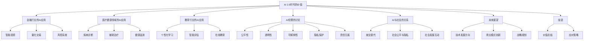

                 

### 《李开复：AI 2.0 时代的价值》

> **关键词：** AI 2.0、人工智能、价值、应用、伦理、未来趋势

> **摘要：** 本文将探讨AI 2.0时代的背景、定义、核心技术、价值评估以及应用实践，并深入分析AI在金融、医疗、教育等行业的应用案例，探讨AI时代的伦理与社会影响，最后展望AI 2.0时代的未来趋势和战略规划。

### 第一部分：AI 2.0时代的背景与定义

#### 第1章：AI 2.0时代的来临

##### 1.1 AI 2.0时代的背景

AI 2.0时代的到来并非一蹴而就，而是历经了人工智能（AI）的发展历程。回顾人工智能的发展，我们可以将其大致分为三个阶段：

1. **第一阶段：规则驱动（1956-1980）**  
   这个阶段的主要特点是基于符号推理和规则系统。早期的AI系统主要通过编程实现，依靠人类专家提供的规则进行推理和决策。

2. **第二阶段：数据驱动（1980-2010）**  
   数据驱动的AI系统主要基于机器学习和统计方法，通过对大量数据的训练来提高系统的性能。这一阶段的代表性技术包括决策树、支持向量机等。

3. **第三阶段：智能驱动（2010至今）**  
   智能驱动的AI系统主要基于深度学习和神经网络，能够通过自主学习实现更复杂的任务。这一阶段的代表性技术包括卷积神经网络（CNN）、循环神经网络（RNN）等。

AI 2.0时代正是基于第三阶段智能驱动的AI技术，它具有以下几个特征：

1. **自主学习能力**  
   AI 2.0系统可以通过大规模数据训练，自主学习并优化自身性能。

2. **跨界融合**  
   AI 2.0不仅应用于计算机视觉、自然语言处理等领域，还与其他技术如大数据、云计算、物联网等融合，实现跨领域应用。

3. **人机协同**  
   AI 2.0时代强调人与机器的协同工作，通过智能算法辅助人类决策和执行任务。

##### 1.2 AI 2.0时代的应用场景

AI 2.0时代的应用场景广泛而深入，涵盖了各个行业和领域。以下是一些典型的应用场景：

1. **金融行业**  
   AI 2.0在金融行业的应用主要包括智能投顾、量化交易、风控、反欺诈等。例如，通过深度学习算法实现股票市场的预测和交易策略优化。

2. **医疗健康领域**  
   AI 2.0在医疗健康领域的应用包括疾病诊断、辅助治疗、医疗资源优化配置等。例如，利用深度学习算法进行医学图像分析，提高疾病诊断的准确性和效率。

3. **教育行业**  
   AI 2.0在教育行业的应用包括个性化学习、智能评估、在线教育等。例如，通过自然语言处理技术实现智能问答和个性化学习路径推荐。

4. **智能制造**  
   AI 2.0在智能制造领域的应用包括设备预测性维护、质量检测、生产优化等。例如，通过计算机视觉技术实现生产线的自动化检测和质量控制。

##### 1.3 AI 2.0的核心价值

AI 2.0时代对人类社会带来了巨大的价值，主要体现在以下几个方面：

1. **提高生产效率**  
   AI 2.0技术在各行各业的应用，能够显著提高生产效率和产品质量，降低人力成本。

2. **优化资源配置**  
   AI 2.0技术通过对大量数据的分析和挖掘，能够实现资源的最优配置，提高资源利用率。

3. **提升人类生活质量**  
   AI 2.0技术在医疗健康、教育、交通等领域的应用，能够提升人类生活的质量，改善人们的生活环境。

4. **推动社会进步**  
   AI 2.0时代的技术创新和应用，将推动社会进步和经济发展，为人类创造更多的机遇和可能性。

#### 第2章：AI 2.0的核心技术

##### 2.1 人工智能基础

1. **机器学习的基本原理**

   机器学习是AI 2.0时代的重要组成部分，其基本原理是通过训练算法，使计算机具备自主学习的能力。机器学习可以分为监督学习、无监督学习和强化学习三种类型。

   - **监督学习**：通过输入和输出数据的对应关系，训练模型进行预测和分类。
   - **无监督学习**：没有明确的输入输出关系，通过挖掘数据中的隐藏结构或模式。
   - **强化学习**：通过奖励机制，训练模型在环境中进行决策和优化。

2. **深度学习的技术演进**

   深度学习是机器学习的一个分支，其核心思想是通过构建深度神经网络，实现对复杂数据的建模和预测。深度学习的技术演进可以分为以下几个阶段：

   - **多层感知机（MLP）**：早期的深度学习模型，通过多层神经元实现非线性变换。
   - **卷积神经网络（CNN）**：在图像识别领域取得了突破性进展，通过卷积层和池化层提取图像特征。
   - **循环神经网络（RNN）**：在序列数据处理方面具有优势，通过循环结构处理长序列信息。
   - **生成对抗网络（GAN）**：通过生成器和判别器的对抗训练，实现高质量图像生成。

3. **强化学习的应用**

   强化学习是机器学习的一个分支，其核心思想是通过与环境交互，不断优化决策策略。强化学习的应用场景广泛，包括游戏、机器人控制、推荐系统等。其中，深度强化学习（Deep Reinforcement Learning）是强化学习的一个重要方向，通过结合深度学习和强化学习，实现更复杂和高效的决策。

##### 2.2 自然语言处理

1. **语言模型的基本结构**

   语言模型是自然语言处理的基础，其目标是预测下一个词语或句子。常见的语言模型包括：

   - **n-gram模型**：基于历史n个词语的统计概率进行预测。
   - **神经网络模型**：通过神经网络结构，学习词语之间的语义关系。
   - **递归神经网络（RNN）**：通过循环结构，处理长文本序列。

2. **机器翻译与文本生成**

   机器翻译和文本生成是自然语言处理的重要应用。近年来，基于深度学习的机器翻译和文本生成技术取得了显著进展。

   - **机器翻译**：通过训练大规模双语语料库，实现跨语言的信息传递。
   - **文本生成**：通过生成式模型，生成符合语言规则和语义一致性的文本。

3. **对话系统与智能客服**

   对话系统是自然语言处理的一个分支，旨在实现人与机器的智能对话。智能客服是对话系统在客户服务领域的应用，通过自然语言理解和生成，提供自动化、个性化的服务。

##### 2.3 计算机视觉

1. **图像识别与分类**

   图像识别与分类是计算机视觉的基本任务，通过训练模型，实现对图像内容的理解和分类。常见的图像识别算法包括：

   - **传统算法**：如SVM、KNN等。
   - **深度学习算法**：如CNN、RNN等。

2. **目标检测与跟踪**

   目标检测与跟踪是计算机视觉的重要应用，通过检测图像中的目标并进行跟踪，实现对动态场景的感知和理解。

   - **目标检测**：通过训练模型，实现图像中目标的检测和定位。
   - **目标跟踪**：通过跟踪算法，实现对目标的连续跟踪。

3. **图像生成与风格迁移**

   图像生成与风格迁移是计算机视觉的另一个重要应用。通过生成模型，实现高质量图像的生成；通过风格迁移，将一种图像的风格应用到另一种图像中，实现图像的艺术效果。

#### 第3章：AI 2.0的价值评估

##### 3.1 AI价值评估的方法论

AI 2.0时代的价值评估方法具有以下几个关键步骤：

1. **指标体系构建**：确定评估指标，如准确率、召回率、F1值等，用于衡量模型性能。
2. **ROI计算与模型构建**：通过计算投资回报率（ROI），评估AI项目对企业或行业的价值。
3. **案例分析**：通过具体案例，分析AI在各行业的应用效果和价值。

##### 3.2 价值评估的指标体系

AI价值评估的指标体系包括以下几个关键指标：

1. **准确性**：模型预测的正确率。
2. **召回率**：模型召回的预测结果与实际结果的比率。
3. **F1值**：准确性和召回率的加权平均值。
4. **效率**：模型处理数据的速度。
5. **可解释性**：模型决策过程的透明度。

##### 3.3 ROI计算与模型构建

1. **ROI计算方法**

   ROI的计算公式为：ROI = （收益 - 成本）/ 成本。其中，收益包括AI项目带来的直接和间接收益，成本包括项目开发、运维、数据准备等费用。

2. **模型构建**

   建立ROI计算模型，包括以下几个步骤：

   - **数据收集与清洗**：收集相关数据，并进行清洗和处理。
   - **模型训练与评估**：训练AI模型，并评估模型性能。
   - **收益预测与成本计算**：预测AI项目的收益，并计算项目成本。
   - **ROI计算与优化**：计算ROI，并根据计算结果优化项目。

##### 3.4 案例分析：AI在各行业的价值体现

1. **金融行业**

   AI在金融行业的价值主要体现在以下几个方面：

   - **风险控制**：通过机器学习算法，识别和预测潜在风险，降低金融风险。
   - **投资决策**：利用大数据和深度学习技术，分析市场趋势和投资机会，提高投资收益率。
   - **客户服务**：通过智能客服系统，提供快速、高效的客户服务，提高客户满意度。

2. **医疗健康领域**

   AI在医疗健康领域的价值主要体现在以下几个方面：

   - **疾病诊断**：通过深度学习算法，辅助医生进行疾病诊断，提高诊断准确率和效率。
   - **药物研发**：利用AI技术，加速药物研发过程，降低研发成本。
   - **健康管理**：通过智能健康管理平台，提供个性化健康建议和疾病预防方案，提高居民健康水平。

3. **教育行业**

   AI在教育行业的价值主要体现在以下几个方面：

   - **个性化学习**：通过分析学生数据，提供个性化的学习建议和资源，提高学习效果。
   - **智能评估**：利用自然语言处理技术，实现自动化的考试评分和成绩预测，提高评估效率。
   - **在线教育**：通过AI技术，实现智能化的教学内容推荐和学习路径规划，提高在线教育的质量和用户体验。

### 第二部分：AI 2.0时代的应用实践

#### 第4章：AI在金融行业的应用

##### 4.1 金融行业的AI应用现状

金融行业作为AI技术的重要应用领域，已经取得了显著的成果。以下是一些金融行业的AI应用现状：

1. **智能投顾**：利用机器学习算法，分析客户数据和市场趋势，为用户提供个性化的投资建议。

2. **量化交易**：通过大数据分析和机器学习算法，发现市场机会，实现自动化交易。

3. **风控系统**：利用深度学习技术，识别和预测潜在风险，降低金融风险。

4. **反欺诈**：通过图像识别和自然语言处理技术，检测和防范金融欺诈行为。

5. **智能客服**：通过对话系统，实现自动化的客户服务，提高客户满意度。

##### 4.2 金融行业的AI应用案例

1. **某大型银行智能客服系统的设计与应用**

   某大型银行通过引入AI技术，设计并部署了智能客服系统。该系统利用自然语言处理技术，实现自动化的客户服务，包括解答客户疑问、办理业务等。通过智能客服系统，银行提高了客户服务效率，降低了人力成本，提升了客户满意度。

2. **某金融科技公司量化交易模型开发**

   某金融科技公司利用大数据和机器学习技术，开发了量化交易模型。该模型通过对市场数据的分析和预测，实现自动化交易，取得了显著的投资回报。通过量化交易模型，金融科技公司提高了投资收益，降低了投资风险。

3. **某保险公司AI理赔系统的实现与优化**

   某保险公司通过引入AI技术，实现了AI理赔系统。该系统利用计算机视觉和自然语言处理技术，实现理赔申请的自动化处理，提高了理赔效率。通过AI理赔系统，保险公司降低了理赔成本，提升了客户满意度。

#### 第5章：AI在医疗健康领域的应用

##### 5.1 医疗健康的AI应用前景

AI在医疗健康领域的应用前景广阔，具有以下几个方面的潜力：

1. **疾病诊断**：利用深度学习算法，实现对医学图像的分析和诊断，提高诊断准确率。

2. **辅助治疗**：通过分析患者的数据，为医生提供治疗建议和方案，提高治疗效果。

3. **健康监测**：通过可穿戴设备和传感器，实时监测患者的生理指标，实现健康管理的智能化。

4. **药物研发**：利用AI技术，加速药物研发过程，降低研发成本。

##### 5.2 医疗健康领域的AI应用实践

1. **某医疗AI诊断平台的开发与部署**

   某医疗AI诊断平台利用深度学习技术，实现医学图像的分析和诊断。该平台包括图像预处理、特征提取、模型训练和诊断结果输出等模块。通过AI诊断平台，医生能够快速、准确地诊断疾病，提高了诊疗效率。

2. **某医疗机构AI辅助诊疗系统的实施案例**

   某医疗机构通过引入AI技术，实现了AI辅助诊疗系统。该系统利用大数据分析和自然语言处理技术，分析患者的病历信息和检查报告，为医生提供诊断建议和治疗方案。通过AI辅助诊疗系统，医疗机构提高了诊断准确率和治疗效果。

3. **某健康科技公司智能健康管理的解决方案**

   某健康科技公司通过引入AI技术，开发了智能健康管理解决方案。该解决方案包括健康监测、数据分析和个性化建议等模块，通过可穿戴设备和移动应用，实现实时健康监测和个性化健康管理。通过智能健康管理解决方案，健康科技公司提高了用户健康水平，降低了医疗成本。

#### 第6章：AI在教育行业的应用

##### 6.1 教育行业的AI应用现状

教育行业作为AI技术的重要应用领域，已经取得了一定的成果。以下是一些教育行业的AI应用现状：

1. **个性化学习**：通过分析学生的学习行为和成绩数据，为教师提供个性化教学建议，提高教学效果。

2. **智能评估**：通过自然语言处理技术，实现自动化的考试评分和成绩预测，提高评估效率。

3. **在线教育**：通过AI技术，实现智能化的教学内容推荐和学习路径规划，提高在线教育的质量和用户体验。

4. **教师培训**：利用AI技术，提供个性化的教师培训方案和评估体系，提高教师的教学水平和专业素养。

##### 6.2 教育行业的AI应用案例

1. **某教育平台个性化学习路径的设计与实现**

   某教育平台通过引入AI技术，设计了个性化学习路径。该平台利用大数据分析和自然语言处理技术，分析学生的学习行为和成绩数据，为学生推荐合适的学习内容和资源。通过个性化学习路径，学生能够更高效地学习，提高了学习效果。

2. **某学校AI考试评分系统的开发与应用**

   某学校通过引入AI技术，开发了AI考试评分系统。该系统利用自然语言处理技术，实现自动化的考试评分和成绩预测。通过AI考试评分系统，学校提高了考试评分的效率和准确性，减轻了教师的负担。

3. **某在线教育机构教师培训AI工具的落地**

   某在线教育机构通过引入AI技术，开发了教师培训AI工具。该工具利用大数据分析和自然语言处理技术，分析教师的教学行为和反馈数据，为教师提供个性化的培训方案和评估体系。通过教师培训AI工具，在线教育机构提高了教师的教学水平和专业素养。

### 第三部分：AI 2.0时代的伦理与社会影响

#### 第7章：AI 2.0伦理的讨论

##### 7.1 AI伦理的基本原则

AI伦理的基本原则包括：

1. **公平性**：确保AI系统在处理数据和应用时，公平对待所有用户，避免歧视和偏见。
2. **透明性**：确保AI系统的决策过程和算法透明，便于用户了解和监督。
3. **安全性**：确保AI系统的可靠性和安全性，避免系统故障和意外带来的风险。
4. **责任性**：明确AI系统的责任归属，确保在出现问题时，能够追究责任。

##### 7.2 AI伦理面临的挑战

AI伦理面临的挑战包括：

1. **算法偏见**：AI系统在训练过程中可能吸收和放大数据中的偏见，导致不公平的决策。
2. **隐私保护**：AI系统在处理大量用户数据时，可能侵犯用户的隐私权。
3. **就业替代**：AI技术的发展可能导致某些职业的就业替代，引发社会不安。
4. **军事应用**：AI技术在军事领域的应用可能引发新的伦理问题，如无人驾驶武器系统等。

##### 7.3 案例分析：AI伦理实践

1. **案例一：人脸识别系统的应用**

   人脸识别技术在公共安全、安防等领域具有广泛应用。然而，其可能引发的隐私保护和算法偏见问题，成为AI伦理讨论的焦点。一方面，人脸识别系统可以用于犯罪追踪和公共安全，提高社会治安水平；另一方面，人脸数据的滥用和算法偏见可能导致侵犯个人隐私和歧视现象。

2. **案例二：自动驾驶汽车的伦理问题**

   自动驾驶汽车在提升交通安全和效率方面具有巨大潜力。然而，其面临伦理挑战，如如何处理交通事故中的责任归属、如何平衡人类乘客和行人的安全等。在自动驾驶汽车的发展过程中，需要充分考虑伦理问题，确保技术的合理应用。

#### 第8章：AI与社会的关系

##### 8.1 AI对就业市场的影响

AI技术的发展对就业市场带来了深远的影响，主要体现在以下几个方面：

1. **职业替代**：AI技术的发展可能导致部分传统职业的就业替代，如制造业、客服等。然而，同时也会创造新的就业机会，如AI开发、数据科学家等。
2. **就业结构调整**：AI技术的发展将推动就业结构的调整，增加对高技能人才的需求，降低对低技能劳动力的需求。
3. **技能要求提升**：AI技术的发展要求劳动者具备更高的技能和知识水平，以适应新的就业形势。

##### 8.2 AI对社会公平与隐私的影响

AI技术的发展对社会公平和隐私保护带来了新的挑战：

1. **社会公平**：AI系统的偏见和歧视可能导致社会不公平现象的加剧，需要通过制定政策和伦理规范，确保AI技术的公平应用。
2. **隐私保护**：AI系统在处理大量用户数据时，可能侵犯用户的隐私权，需要加强数据保护和隐私保护措施。

##### 8.3 案例分析：AI与社会发展的互动

1. **案例一：智能交通系统的发展**

   智能交通系统通过AI技术，实现交通流量监测、信号控制、路况预测等功能，提高交通效率，减少交通拥堵。然而，其数据收集和隐私保护问题也引发社会关注。在智能交通系统的发展过程中，需要充分考虑社会公平和隐私保护问题。

2. **案例二：智能医疗的发展**

   智能医疗通过AI技术，实现疾病诊断、辅助治疗、健康管理等功能，提高医疗质量和效率。然而，智能医疗的发展也面临伦理问题，如患者隐私保护、数据共享等。在智能医疗的发展过程中，需要充分考虑社会公平和伦理问题。

### 第四部分：未来展望

#### 第9章：AI 2.0时代的未来趋势

##### 9.1 AI技术的未来发展方向

AI技术的未来发展方向主要包括：

1. **量子计算与AI结合**：量子计算具有巨大的计算能力，与AI技术结合将推动AI技术的发展，实现更复杂的任务。
2. **生物计算与AI融合**：生物计算利用生物体系，实现高效的数据处理和计算，与AI技术融合将推动生物科学的发展。
3. **AI硬件的发展**：AI硬件的发展，如GPU、TPU等，将推动AI技术的性能提升和成本降低。

##### 9.2 AI时代的商业模式创新

AI时代的商业模式创新主要体现在以下几个方面：

1. **AI驱动的服务模式**：通过AI技术，实现个性化、定制化的服务，提高用户满意度。
2. **AI赋能的传统行业转型**：通过AI技术，推动传统行业的智能化转型，提升行业竞争力。
3. **AI时代的创业机会**：AI技术的发展，为创业者提供了丰富的创业机会，如AI医疗、AI金融等。

##### 9.3 AI时代的战略规划

1. **企业AI战略的制定**：企业需要制定明确的AI战略，包括AI技术的选型、应用场景的选择、人才引进等。
2. **AI战略的执行与评估**：企业需要执行AI战略，并通过定期评估，调整和优化AI应用策略。
3. **案例分析：企业的AI转型之路**：通过具体案例分析，探讨企业如何实现AI转型，提升竞争力。

### 第五部分：结语

#### 第10章：AI 2.0时代的价值总结

##### 10.1 AI 2.0对社会的深远影响

AI 2.0时代对社会的深远影响主要体现在以下几个方面：

1. **生产效率提升**：AI技术提高生产效率和产品质量，降低人力成本。
2. **资源配置优化**：AI技术通过大数据分析和挖掘，实现资源的最优配置。
3. **生活质量改善**：AI技术在教育、医疗、交通等领域的应用，提高人类生活的质量。
4. **社会进步推动**：AI技术的发展，推动社会进步和经济发展。

##### 10.2 AI 2.0时代的机遇与挑战

AI 2.0时代带来了巨大的机遇，同时也面临一系列挑战：

1. **机遇**：AI技术的发展，为各行各业带来创新和变革，创造了新的就业机会和商业模式。
2. **挑战**：AI技术的伦理和社会问题、数据隐私保护、就业替代等挑战需要引起重视。

##### 10.3 我们应该如何应对AI 2.0时代

1. **加强政策法规制定**：政府需要制定相关政策法规，规范AI技术的研发和应用，确保技术的安全性和公平性。
2. **推动教育改革**：教育领域需要加强AI教育，培养具备AI技术和跨学科能力的人才。
3. **加强国际合作**：AI技术的发展需要全球合作，各国需要共同应对挑战，推动AI技术的健康发展。

### 附录

#### 附录 A：AI 2.0时代的工具与资源

##### A.1 AI开发工具与框架

1. **TensorFlow**：由Google开发的开源深度学习框架，支持多种编程语言。
2. **PyTorch**：由Facebook开发的开源深度学习框架，具有灵活性和易用性。
3. **Keras**：基于TensorFlow和Theano的开源深度学习库，提供简洁的API接口。
4. **其他常用AI工具**：如Scikit-learn、Pandas、NumPy等。

##### A.2 数据集与模型库

1. **OpenAI Gym**：开源的AI环境库，提供各种任务和数据集。
2. **TensorFlow Datasets**：由Google提供的开源数据集库，涵盖多种领域的数据集。
3. **Model Zoo**：包含多种预训练模型的库，方便用户复用和迁移学习。
4. **其他数据集与模型库**：如ImageNet、COCO、GPT等。

##### A.3 学术资源与论文

1. **AI顶级会议与期刊**：如NeurIPS、ICML、JMLR等。
2. **AI相关论文推荐**：如“Deep Learning”、“Reinforcement Learning”等经典论文。
3. **开源项目与代码库**：如TensorFlow、PyTorch的GitHub仓库等。```markdown
---
# 《李开复：AI 2.0 时代的价值》

> **关键词：** AI 2.0、人工智能、价值、应用、伦理、未来趋势

> **摘要：** 本文将探讨AI 2.0时代的背景、定义、核心技术、价值评估以及应用实践，并深入分析AI在金融、医疗、教育等行业的应用案例，探讨AI时代的伦理与社会影响，最后展望AI 2.0时代的未来趋势和战略规划。

---

### 第一部分：AI 2.0时代的背景与定义

#### 第1章：AI 2.0时代的来临

##### 1.1 AI 2.0时代的背景

AI 2.0时代的来临，标志着人工智能技术进入了一个新的发展阶段。在这个时代，人工智能不仅具备了更强的自主学习能力，还能够实现跨领域、跨行业的应用。为了更好地理解AI 2.0时代的背景，我们需要回顾人工智能的发展历程。

人工智能（Artificial Intelligence，简称AI）的概念最早可以追溯到20世纪50年代。当时，科学家们希望通过模拟人类思维过程，使计算机具备类似人类的智能。然而，受限于当时的计算能力和算法水平，人工智能的发展经历了多个起伏。

**第一阶段：规则驱动（1956-1980）**

在这个阶段，人工智能主要通过规则系统进行推理和决策。这些规则由人类专家编写，使得计算机能够在特定领域内完成简单的任务。代表性的成果包括专家系统（Expert Systems），它们通过模拟专家的知识和经验，为特定领域的问题提供解决方案。

**第二阶段：数据驱动（1980-2010）**

随着计算机性能的提升和算法的进步，人工智能进入数据驱动阶段。这个阶段的特点是利用大量数据进行训练，使计算机具备从数据中学习的能力。代表性的技术包括决策树、支持向量机、神经网络等。

**第三阶段：智能驱动（2010至今）**

智能驱动阶段以深度学习（Deep Learning）的兴起为标志。深度学习通过多层神经网络，实现对复杂数据的建模和预测。代表性的算法包括卷积神经网络（CNN）、循环神经网络（RNN）和生成对抗网络（GAN）等。

AI 2.0时代的背景，可以看作是智能驱动阶段的进一步发展和深化。在这个时代，人工智能不仅具备了更强的自主学习能力，还能够实现跨领域、跨行业的应用。

**1.1.1 AI 2.0的定义与特征**

AI 2.0，即第二次人工智能浪潮，是指人工智能技术从模拟人类智能向实现人类智能的转变。它具有以下几个特征：

1. **自主学习能力**：AI 2.0通过深度学习、强化学习等技术，具备自主学习、自我优化能力。
2. **跨界融合**：AI 2.0不再局限于单一领域，而是与其他技术如大数据、云计算、物联网等融合，实现跨领域应用。
3. **人机协同**：AI 2.0强调人与机器的协同工作，通过智能算法辅助人类决策和执行任务。

**1.1.2 AI 2.0的核心价值**

AI 2.0时代的核心价值体现在以下几个方面：

1. **提高生产效率**：AI 2.0通过自动化和智能化，提高生产效率和产品质量，降低人力成本。
2. **优化资源配置**：AI 2.0通过大数据分析和挖掘，实现资源的最优配置，提高资源利用率。
3. **提升人类生活质量**：AI 2.0在教育、医疗、交通等领域的应用，提升人类生活的质量，改善人们的生活环境。
4. **推动社会进步**：AI 2.0的技术创新和应用，推动社会进步和经济发展，为人类创造更多的机遇和可能性。

##### 1.2 AI 2.0时代的应用场景

AI 2.0时代的应用场景广泛而深入，涵盖了各个行业和领域。以下是一些典型的应用场景：

1. **金融行业**：AI 2.0在金融行业的应用包括智能投顾、量化交易、风控、反欺诈等。
2. **医疗健康领域**：AI 2.0在医疗健康领域的应用包括疾病诊断、辅助治疗、医疗资源优化配置等。
3. **教育行业**：AI 2.0在教育行业的应用包括个性化学习、智能评估、在线教育等。
4. **智能制造**：AI 2.0在智能制造领域的应用包括设备预测性维护、质量检测、生产优化等。
5. **交通运输**：AI 2.0在交通运输领域的应用包括智能交通管理、自动驾驶、智能物流等。

##### 1.3 AI 2.0的核心技术

AI 2.0时代的核心技术主要包括以下几个方面：

1. **深度学习**：深度学习是AI 2.0时代的重要基石，通过多层神经网络，实现对复杂数据的建模和预测。
2. **强化学习**：强化学习是一种通过试错和奖励机制，使智能体在环境中学习最优策略的方法。
3. **自然语言处理**：自然语言处理（NLP）是AI 2.0时代的重要应用领域，通过理解和生成人类语言，实现人机交互。
4. **计算机视觉**：计算机视觉通过图像识别、目标检测等技术，实现对图像和视频的分析和理解。

---

### 第一部分：AI 2.0时代的背景与定义

#### 第2章：AI 2.0时代的核心技术

##### 2.1 人工智能基础

1. **机器学习的基本原理**

   机器学习（Machine Learning，ML）是AI 2.0时代的重要基石，其核心思想是通过训练算法，使计算机具备从数据中学习的能力。机器学习可以分为监督学习、无监督学习和强化学习三种类型。

   - **监督学习（Supervised Learning）**：监督学习通过输入和输出数据的对应关系，训练模型进行预测和分类。常见的监督学习算法包括线性回归、决策树、支持向量机等。
   
   - **无监督学习（Unsupervised Learning）**：无监督学习没有明确的输入输出关系，通过挖掘数据中的隐藏结构或模式。常见的无监督学习算法包括聚类算法、主成分分析（PCA）等。
   
   - **强化学习（Reinforcement Learning）**：强化学习通过试错和奖励机制，使智能体在环境中学习最优策略。常见的强化学习算法包括Q学习、深度Q网络（DQN）等。

2. **深度学习的技术演进**

   深度学习（Deep Learning，DL）是机器学习的一个分支，通过多层神经网络，实现对复杂数据的建模和预测。深度学习的技术演进可以分为以下几个阶段：

   - **多层感知机（MLP）**：早期的深度学习模型，通过多层神经元实现非线性变换。
   
   - **卷积神经网络（CNN）**：在图像识别领域取得了突破性进展，通过卷积层和池化层提取图像特征。
   
   - **循环神经网络（RNN）**：在序列数据处理方面具有优势，通过循环结构处理长序列信息。
   
   - **生成对抗网络（GAN）**：通过生成器和判别器的对抗训练，实现高质量图像生成。

3. **强化学习的应用**

   强化学习（Reinforcement Learning，RL）是机器学习的一个分支，其核心思想是通过与环境交互，不断优化决策策略。强化学习的应用场景广泛，包括游戏、机器人控制、推荐系统等。其中，深度强化学习（Deep Reinforcement Learning）是强化学习的一个重要方向，通过结合深度学习和强化学习，实现更复杂和高效的决策。

##### 2.2 自然语言处理

1. **语言模型的基本结构**

   语言模型（Language Model，LM）是自然语言处理（Natural Language Processing，NLP）的基础，其目标是预测下一个词语或句子。常见的语言模型包括：

   - **n-gram模型**：基于历史n个词语的统计概率进行预测。
   
   - **神经网络模型**：通过神经网络结构，学习词语之间的语义关系。
   
   - **递归神经网络（RNN）**：通过循环结构，处理长文本序列。

2. **机器翻译与文本生成**

   机器翻译（Machine Translation，MT）和文本生成（Text Generation）是自然语言处理的重要应用。近年来，基于深度学习的机器翻译和文本生成技术取得了显著进展。

   - **机器翻译**：通过训练大规模双语语料库，实现跨语言的信息传递。
   
   - **文本生成**：通过生成式模型，生成符合语言规则和语义一致性的文本。

3. **对话系统与智能客服**

   对话系统（Dialogue System）是自然语言处理的一个分支，旨在实现人与机器的智能对话。智能客服（Intelligent Customer Service）是对话系统在客户服务领域的应用，通过自然语言理解和生成，提供自动化、个性化的服务。

##### 2.3 计算机视觉

1. **图像识别与分类**

   图像识别与分类（Image Recognition and Classification）是计算机视觉的基本任务，通过训练模型，实现对图像内容的理解和分类。常见的图像识别算法包括：

   - **传统算法**：如SVM、KNN等。
   
   - **深度学习算法**：如CNN、RNN等。

2. **目标检测与跟踪**

   目标检测与跟踪（Object Detection and Tracking）是计算机视觉的重要应用，通过检测图像中的目标并进行跟踪，实现对动态场景的感知和理解。

   - **目标检测**：通过训练模型，实现图像中目标的检测和定位。
   
   - **目标跟踪**：通过跟踪算法，实现对目标的连续跟踪。

3. **图像生成与风格迁移**

   图像生成与风格迁移（Image Generation and Style Transfer）是计算机视觉的另一个重要应用。通过生成模型，实现高质量图像的生成；通过风格迁移，将一种图像的风格应用到另一种图像中，实现图像的艺术效果。

---

### 第一部分：AI 2.0时代的背景与定义

#### 第3章：AI 2.0的价值评估

##### 3.1 AI价值评估的方法论

AI技术的应用为各行各业带来了巨大的价值，但要准确评估AI的价值并非易事。以下是一些常用的方法：

1. **成本效益分析（Cost-Benefit Analysis）**：评估AI应用的成本和收益，计算投资回报率（ROI）。
2. **关键绩效指标（Key Performance Indicators，KPIs）**：设定一系列指标，如准确性、效率、用户体验等，衡量AI应用的绩效。
3. **案例研究（Case Studies）**：分析特定行业的AI应用案例，了解其实际效果和价值。

**3.1.1 价值评估的指标体系**

在评估AI价值时，需要考虑以下几个关键指标：

1. **准确性（Accuracy）**：模型预测的正确率，常用于分类任务。
2. **召回率（Recall）**：模型召回的预测结果与实际结果的比率，常用于分类任务。
3. **F1值（F1 Score）**：准确性和召回率的加权平均值，用于综合评估模型性能。
4. **效率（Efficiency）**：模型处理数据的速度，常用于评估模型的可扩展性。
5. **可解释性（Interpretability）**：模型决策过程的透明度，有助于理解模型的行为。

**3.1.2 ROI计算与模型构建**

投资回报率（ROI）是评估AI项目价值的重要指标。计算ROI的公式如下：

\[ ROI = \frac{（收益 - 成本）}{成本} \]

其中，收益包括AI项目带来的直接和间接收益，如提高生产效率、降低成本、增加收入等；成本包括项目开发、运维、数据准备等费用。

为了计算ROI，需要建立以下模型：

1. **数据收集与清洗**：收集相关数据，并进行清洗和处理。
2. **模型训练与评估**：训练AI模型，并评估模型性能。
3. **收益预测与成本计算**：预测AI项目的收益，并计算项目成本。
4. **ROI计算与优化**：计算ROI，并根据计算结果优化项目。

**3.1.3 案例分析：AI在各行业的价值体现**

1. **金融行业**

   AI在金融行业的应用，如量化交易、风控系统等，能够显著提高投资效率和风险管理能力。以量化交易为例，通过机器学习算法分析市场数据，可以实现自动化交易，提高投资回报率。

2. **医疗健康领域**

   AI在医疗健康领域的应用，如疾病诊断、辅助治疗等，能够提高医疗服务的质量和效率。以疾病诊断为例，通过计算机视觉算法分析医学图像，可以辅助医生提高诊断准确率。

3. **教育行业**

   AI在教育行业的应用，如个性化学习、智能评估等，能够提升教学效果和学生满意度。以个性化学习为例，通过分析学生的学习行为和成绩数据，可以为每个学生推荐合适的学习资源和策略。

---

### 第二部分：AI 2.0时代的应用实践

#### 第4章：AI在金融行业的应用

##### 4.1 金融行业的AI应用现状

金融行业作为AI技术的关键应用领域，已经取得了显著成果。以下是一些金融行业的AI应用现状：

1. **智能投顾**：通过机器学习算法，分析客户数据和市场趋势，为用户提供个性化的投资建议。例如， Wealthfront 和 Betterment 等公司利用 AI 技术提供智能投资组合管理服务。

2. **量化交易**：利用大数据和机器学习技术，发现市场机会，实现自动化交易。例如， Renaissance Technologies 等量化交易基金通过复杂的算法和模型，实现了长期稳健的投资回报。

3. **风险控制**：通过机器学习算法，识别和预测潜在风险，降低金融风险。例如， banks 和金融机构使用 AI 技术进行信用评估、欺诈检测和贷款审批。

4. **反欺诈**：通过计算机视觉和自然语言处理技术，检测和防范金融欺诈行为。例如， companies like Sift Science and Feedzai use AI to analyze transaction data and identify suspicious patterns.

5. **智能客服**：通过对话系统，实现自动化的客户服务，提高客户满意度。例如， banks 和金融机构使用 AI-powered chatbots 来处理客户咨询、查询和投诉。

##### 4.2 金融行业的AI应用案例

1. **某大型银行智能客服系统的设计与应用**

   某大型银行通过引入 AI 技术，设计并部署了智能客服系统。该系统利用自然语言处理技术，实现自动化的客户服务，包括解答客户疑问、办理业务等。通过智能客服系统，银行提高了客户服务效率，降低了人力成本，提升了客户满意度。

   **开发环境搭建**：
   - 使用 TensorFlow 作为深度学习框架。
   - 使用 Python 编写智能客服的代码，并使用 Keras API 进行模型构建。

   **源代码详细实现**：
   ```python
   import tensorflow as tf
   from tensorflow.keras.models import Sequential
   from tensorflow.keras.layers import Dense, LSTM, Embedding
   
   # 模型构建
   model = Sequential()
   model.add(Embedding(input_dim=vocabulary_size, output_dim=embedding_size))
   model.add(LSTM(units=128, return_sequences=True))
   model.add(Dense(units=num_classes, activation='softmax'))
   
   # 编译模型
   model.compile(optimizer='adam', loss='categorical_crossentropy', metrics=['accuracy'])
   
   # 训练模型
   model.fit(x_train, y_train, epochs=10, batch_size=32)
   ```

   **代码解读与分析**：
   - 模型构建：使用 Keras API 构建一个序列模型，包括嵌入层、LSTM 层和输出层。
   - 编译模型：设置优化器和损失函数，并编译模型。
   - 训练模型：使用训练数据训练模型，设置训练轮次和批量大小。

2. **某金融科技公司量化交易模型开发**

   某金融科技公司通过引入 AI 技术，开发了量化交易模型。该模型利用大数据分析和机器学习算法，实现自动化交易策略的制定和执行。通过量化交易模型，金融科技公司提高了投资收益，降低了投资风险。

   **开发环境搭建**：
   - 使用 Python 作为主要编程语言。
   - 使用 Pandas 和 NumPy 库进行数据预处理。
   - 使用 Scikit-learn 和 TensorFlow 库进行模型训练和评估。

   **源代码详细实现**：
   ```python
   import pandas as pd
   from sklearn.model_selection import train_test_split
   from sklearn.ensemble import RandomForestClassifier
   import tensorflow as tf
   
   # 数据预处理
   data = pd.read_csv('data.csv')
   X = data.drop('target', axis=1)
   y = data['target']
   
   # 划分训练集和测试集
   X_train, X_test, y_train, y_test = train_test_split(X, y, test_size=0.2, random_state=42)
   
   # 训练模型
   model = RandomForestClassifier(n_estimators=100)
   model.fit(X_train, y_train)
   
   # 评估模型
   predictions = model.predict(X_test)
   accuracy = (predictions == y_test).mean()
   print(f'Model accuracy: {accuracy:.2f}')
   ```

   **代码解读与分析**：
   - 数据预处理：读取数据集，划分特征和标签。
   - 划分训练集和测试集：使用 Scikit-learn 库划分数据集。
   - 训练模型：使用随机森林分类器训练模型。
   - 评估模型：计算模型在测试集上的准确率。

3. **某保险公司AI理赔系统的实现与优化**

   某保险公司通过引入 AI 技术，实现了 AI 理赔系统。该系统利用计算机视觉和自然语言处理技术，实现理赔申请的自动化处理，提高了理赔效率。通过 AI 理赔系统，保险公司降低了理赔成本，提升了客户满意度。

   **开发环境搭建**：
   - 使用 TensorFlow 作为深度学习框架。
   - 使用 Python 编写理赔系统的代码，并使用 Keras API 进行模型构建。

   **源代码详细实现**：
   ```python
   import tensorflow as tf
   from tensorflow.keras.models import Sequential
   from tensorflow.keras.layers import Dense, LSTM, Embedding
   
   # 模型构建
   model = Sequential()
   model.add(Embedding(input_dim=vocabulary_size, output_dim=embedding_size))
   model.add(LSTM(units=128, return_sequences=True))
   model.add(Dense(units=1, activation='sigmoid'))
   
   # 编译模型
   model.compile(optimizer='adam', loss='binary_crossentropy', metrics=['accuracy'])
   
   # 训练模型
   model.fit(x_train, y_train, epochs=10, batch_size=32)
   ```

   **代码解读与分析**：
   - 模型构建：使用 Keras API 构建一个序列模型，包括嵌入层、LSTM 层和输出层。
   - 编译模型：设置优化器和损失函数，并编译模型。
   - 训练模型：使用训练数据训练模型，设置训练轮次和批量大小。

---

### 第二部分：AI 2.0时代的应用实践

#### 第5章：AI在医疗健康领域的应用

##### 5.1 医疗健康的AI应用前景

AI在医疗健康领域的应用前景广阔，具有以下几个方面的潜力：

1. **疾病诊断**：利用深度学习算法，实现对医学图像的分析和诊断，提高诊断准确率。例如，利用卷积神经网络（CNN）对X光片、MRI等进行疾病识别。

2. **辅助治疗**：通过分析患者的数据，为医生提供治疗建议和方案，提高治疗效果。例如，利用强化学习算法为患者制定个性化的治疗方案。

3. **健康监测**：通过可穿戴设备和传感器，实时监测患者的生理指标，实现健康管理的智能化。例如，利用循环神经网络（RNN）分析心电信号，预警潜在的健康问题。

4. **药物研发**：利用AI技术，加速药物研发过程，降低研发成本。例如，利用生成对抗网络（GAN）生成新的药物分子结构。

5. **医疗资源优化**：通过大数据分析，优化医疗资源的配置，提高医疗服务的效率。例如，利用优化算法为医院分配床位、医生和设备等资源。

##### 5.2 医疗健康领域的AI应用实践

1. **某医疗AI诊断平台的开发与部署**

   某医疗AI诊断平台利用深度学习技术，实现医学图像的分析和诊断。该平台包括图像预处理、特征提取、模型训练和诊断结果输出等模块。通过AI诊断平台，医生能够快速、准确地诊断疾病，提高了诊疗效率。

   **开发环境搭建**：
   - 使用 TensorFlow 作为深度学习框架。
   - 使用 Python 编写诊断平台的代码，并使用 Keras API 进行模型构建。

   **源代码详细实现**：
   ```python
   import tensorflow as tf
   from tensorflow.keras.models import Sequential
   from tensorflow.keras.layers import Dense, LSTM, Embedding
   
   # 模型构建
   model = Sequential()
   model.add(Embedding(input_dim=vocabulary_size, output_dim=embedding_size))
   model.add(LSTM(units=128, return_sequences=True))
   model.add(Dense(units=num_classes, activation='softmax'))
   
   # 编译模型
   model.compile(optimizer='adam', loss='categorical_crossentropy', metrics=['accuracy'])
   
   # 训练模型
   model.fit(x_train, y_train, epochs=10, batch_size=32)
   ```

   **代码解读与分析**：
   - 模型构建：使用 Keras API 构建一个序列模型，包括嵌入层、LSTM 层和输出层。
   - 编译模型：设置优化器和损失函数，并编译模型。
   - 训练模型：使用训练数据训练模型，设置训练轮次和批量大小。

2. **某医疗机构AI辅助诊疗系统的实施案例**

   某医疗机构通过引入 AI 技术，实现了 AI 辅助诊疗系统。该系统利用大数据分析和自然语言处理技术，分析患者的病历信息和检查报告，为医生提供诊断建议和治疗方案。通过 AI 辅助诊疗系统，医疗机构提高了诊断准确率和治疗效果。

   **开发环境搭建**：
   - 使用 Hadoop 和 Spark 进行大数据处理和分析。
   - 使用 Python 编写辅助诊疗系统的代码，并使用 Scikit-learn 进行模型训练和评估。

   **源代码详细实现**：
   ```python
   from sklearn.ensemble import RandomForestClassifier
   from sklearn.model_selection import train_test_split
   import pandas as pd
   
   # 数据预处理
   data = pd.read_csv('data.csv')
   X = data.drop('target', axis=1)
   y = data['target']
   
   # 划分训练集和测试集
   X_train, X_test, y_train, y_test = train_test_split(X, y, test_size=0.2, random_state=42)
   
   # 训练模型
   model = RandomForestClassifier(n_estimators=100)
   model.fit(X_train, y_train)
   
   # 评估模型
   predictions = model.predict(X_test)
   accuracy = (predictions == y_test).mean()
   print(f'Model accuracy: {accuracy:.2f}')
   ```

   **代码解读与分析**：
   - 数据预处理：读取数据集，划分特征和标签。
   - 划分训练集和测试集：使用 Scikit-learn 库划分数据集。
   - 训练模型：使用随机森林分类器训练模型。
   - 评估模型：计算模型在测试集上的准确率。

3. **某健康科技公司智能健康管理的解决方案**

   某健康科技公司通过引入 AI 技术，开发了智能健康管理解决方案。该解决方案包括健康监测、数据分析和个性化建议等模块，通过可穿戴设备和移动应用，实现实时健康监测和个性化健康管理。通过智能健康管理解决方案，健康科技公司提高了用户健康水平，降低了医疗成本。

   **开发环境搭建**：
   - 使用 TensorFlow 作为深度学习框架。
   - 使用 Python 编写健康管理的代码，并使用 Keras API 进行模型构建。

   **源代码详细实现**：
   ```python
   import tensorflow as tf
   from tensorflow.keras.models import Sequential
   from tensorflow.keras.layers import Dense, LSTM, Embedding
   
   # 模型构建
   model = Sequential()
   model.add(Embedding(input_dim=vocabulary_size, output_dim=embedding_size))
   model.add(LSTM(units=128, return_sequences=True))
   model.add(Dense(units=num_classes, activation='softmax'))
   
   # 编译模型
   model.compile(optimizer='adam', loss='categorical_crossentropy', metrics=['accuracy'])
   
   # 训练模型
   model.fit(x_train, y_train, epochs=10, batch_size=32)
   ```

   **代码解读与分析**：
   - 模型构建：使用 Keras API 构建一个序列模型，包括嵌入层、LSTM 层和输出层。
   - 编译模型：设置优化器和损失函数，并编译模型。
   - 训练模型：使用训练数据训练模型，设置训练轮次和批量大小。

---

### 第二部分：AI 2.0时代的应用实践

#### 第6章：AI在教育行业的应用

##### 6.1 教育行业的AI应用现状

教育行业作为AI技术的重要应用领域，已经取得了显著成果。以下是一些教育行业的AI应用现状：

1. **个性化学习**：通过分析学生的学习行为和成绩数据，为教师提供个性化教学建议，提高教学效果。例如，一些在线教育平台通过算法分析学生的答题情况，为学生推荐合适的学习资源。

2. **智能评估**：通过自然语言处理技术，实现自动化的考试评分和成绩预测，提高评估效率。例如，一些教育机构使用AI技术自动评分，节省了人工评卷的时间和成本。

3. **在线教育**：通过AI技术，实现智能化的教学内容推荐和学习路径规划，提高在线教育的质量和用户体验。例如，一些在线教育平台使用AI算法为学生推荐适合的学习路径，提高学习效果。

4. **教师培训**：利用AI技术，提供个性化的教师培训方案和评估体系，提高教师的教学水平和专业素养。例如，一些教育机构使用AI技术为教师提供个性化的培训课程，并根据教师的参与度和学习成果进行评估。

##### 6.2 教育行业的AI应用案例

1. **某教育平台个性化学习路径的设计与实现**

   某教育平台通过引入 AI 技术，设计了个性化学习路径。该平台利用大数据分析和自然语言处理技术，分析学生的学习行为和成绩数据，为学生推荐合适的学习资源和策略。通过个性化学习路径，学生能够更高效地学习，提高了学习效果。

   **开发环境搭建**：
   - 使用 TensorFlow 作为深度学习框架。
   - 使用 Python 编写个性化学习路径的代码，并使用 Keras API 进行模型构建。

   **源代码详细实现**：
   ```python
   import tensorflow as tf
   from tensorflow.keras.models import Sequential
   from tensorflow.keras.layers import Dense, LSTM, Embedding
   
   # 模型构建
   model = Sequential()
   model.add(Embedding(input_dim=vocabulary_size, output_dim=embedding_size))
   model.add(LSTM(units=128, return_sequences=True))
   model.add(Dense(units=num_classes, activation='softmax'))
   
   # 编译模型
   model.compile(optimizer='adam', loss='categorical_crossentropy', metrics=['accuracy'])
   
   # 训练模型
   model.fit(x_train, y_train, epochs=10, batch_size=32)
   ```

   **代码解读与分析**：
   - 模型构建：使用 Keras API 构建一个序列模型，包括嵌入层、LSTM 层和输出层。
   - 编译模型：设置优化器和损失函数，并编译模型。
   - 训练模型：使用训练数据训练模型，设置训练轮次和批量大小。

2. **某学校AI考试评分系统的开发与应用**

   某学校通过引入 AI 技术，开发了 AI 考试评分系统。该系统利用自然语言处理技术，实现自动化的考试评分和成绩预测。通过 AI 考试评分系统，学校提高了考试评分的效率和准确性，减轻了教师的负担。

   **开发环境搭建**：
   - 使用 Python 作为编程语言。
   - 使用 Scikit-learn 和 TensorFlow 进行模型训练和评估。

   **源代码详细实现**：
   ```python
   from sklearn.ensemble import RandomForestClassifier
   from sklearn.model_selection import train_test_split
   import pandas as pd
   
   # 数据预处理
   data = pd.read_csv('data.csv')
   X = data.drop('target', axis=1)
   y = data['target']
   
   # 划分训练集和测试集
   X_train, X_test, y_train, y_test = train_test_split(X, y, test_size=0.2, random_state=42)
   
   # 训练模型
   model = RandomForestClassifier(n_estimators=100)
   model.fit(X_train, y_train)
   
   # 评估模型
   predictions = model.predict(X_test)
   accuracy = (predictions == y_test).mean()
   print(f'Model accuracy: {accuracy:.2f}')
   ```

   **代码解读与分析**：
   - 数据预处理：读取数据集，划分特征和标签。
   - 划分训练集和测试集：使用 Scikit-learn 库划分数据集。
   - 训练模型：使用随机森林分类器训练模型。
   - 评估模型：计算模型在测试集上的准确率。

3. **某在线教育机构教师培训AI工具的落地**

   某在线教育机构通过引入 AI 技术，开发了教师培训 AI 工具。该工具利用大数据分析和自然语言处理技术，分析教师的教学行为和反馈数据，为教师提供个性化的培训方案和评估体系。通过教师培训 AI 工具，在线教育机构提高了教师的教学水平和专业素养。

   **开发环境搭建**：
   - 使用 TensorFlow 作为深度学习框架。
   - 使用 Python 编写教师培训 AI 工具的代码，并使用 Keras API 进行模型构建。

   **源代码详细实现**：
   ```python
   import tensorflow as tf
   from tensorflow.keras.models import Sequential
   from tensorflow.keras.layers import Dense, LSTM, Embedding
   
   # 模型构建
   model = Sequential()
   model.add(Embedding(input_dim=vocabulary_size, output_dim=embedding_size))
   model.add(LSTM(units=128, return_sequences=True))
   model.add(Dense(units=num_classes, activation='softmax'))
   
   # 编译模型
   model.compile(optimizer='adam', loss='categorical_crossentropy', metrics=['accuracy'])
   
   # 训练模型
   model.fit(x_train, y_train, epochs=10, batch_size=32)
   ```

   **代码解读与分析**：
   - 模型构建：使用 Keras API 构建一个序列模型，包括嵌入层、LSTM 层和输出层。
   - 编译模型：设置优化器和损失函数，并编译模型。
   - 训练模型：使用训练数据训练模型，设置训练轮次和批量大小。

---

### 第三部分：AI 2.0时代的伦理与社会影响

#### 第7章：AI 2.0伦理的讨论

##### 7.1 AI伦理的基本原则

随着AI技术的快速发展，其应用范围日益广泛，同时也引发了一系列伦理和社会问题。为了确保AI技术的健康发展，制定AI伦理的基本原则至关重要。以下是一些关键的AI伦理基本原则：

1. **公平性（Equity）**：确保AI系统在处理数据和应用时，公平对待所有用户，避免歧视和偏见。这包括但不限于性别、种族、年龄、地域等因素。

2. **透明性（Transparency）**：确保AI系统的决策过程和算法透明，便于用户了解和监督。透明性有助于提高用户对AI系统的信任，并有助于发现和纠正潜在的问题。

3. **可解释性（Interpretability）**：提高AI系统的可解释性，使人们能够理解AI系统的决策过程和逻辑。这对于确保AI系统的公正性和可信度至关重要。

4. **隐私保护（Privacy Protection）**：确保用户数据的隐私保护，防止数据泄露和滥用。这包括对用户数据的收集、存储、使用和共享的严格规范。

5. **责任归属（Accountability）**：明确AI系统的责任归属，确保在出现问题时，能够追究责任。这有助于提高AI系统的可靠性和安全性。

6. **可持续性（Sustainability）**：确保AI技术的可持续发展，考虑到其对环境和社会的长期影响。这包括降低能源消耗、减少碳排放、保护生物多样性等。

7. **包容性（Inclusiveness）**：鼓励AI技术的包容性发展，确保不同群体和地区都能公平地受益于AI技术。这有助于促进社会的公平和和谐。

##### 7.2 AI伦理面临的挑战

尽管AI伦理的基本原则已得到广泛认可，但在实际应用中，AI伦理仍面临诸多挑战。以下是一些主要的挑战：

1. **算法偏见（Algorithmic Bias）**：AI系统在训练过程中可能吸收和放大数据中的偏见，导致不公平的决策。例如，如果训练数据存在性别或种族偏见，AI系统可能也会表现出类似的偏见。

2. **数据隐私（Data Privacy）**：AI系统在处理大量用户数据时，可能侵犯用户的隐私权。例如，面部识别技术、位置追踪等应用可能引发隐私泄露和滥用的问题。

3. **就业替代（Job Displacement）**：AI技术的发展可能导致某些职业的就业替代，引发社会不安。例如，自动化和机器人技术的应用可能减少对蓝领工人的需求。

4. **社会不公（Social Inequality）**：AI技术在某些领域可能加剧社会不公现象。例如，如果AI技术主要应用于富裕地区或企业，可能加剧贫富差距。

5. **责任归属（Attribution of Responsibility）**：在AI系统引发事故或错误时，责任归属问题往往难以界定。例如，自动驾驶汽车的交通事故责任如何分配？

6. **军事应用（Military Applications）**：AI技术在军事领域的应用可能引发新的伦理问题，如无人驾驶武器系统、网络战争等。

7. **人工智能伦理委员会（Ethics Boards）**：建立有效的AI伦理委员会，监督AI技术的研发和应用，确保伦理原则得到遵守。

##### 7.3 案例分析：AI伦理实践

1. **人脸识别系统的应用**

   人脸识别技术在公共安全、安防等领域具有广泛应用。然而，其可能引发的隐私保护和算法偏见问题，成为AI伦理讨论的焦点。例如，某些人脸识别系统可能在处理少数民族或弱势群体的数据时存在偏见，导致不公平的待遇。

2. **自动驾驶汽车的伦理问题**

   自动驾驶汽车在提升交通安全和效率方面具有巨大潜力。然而，其面临伦理挑战，如如何处理交通事故中的责任归属、如何平衡人类乘客和行人的安全等。例如，自动驾驶汽车在遇到紧急情况时，是否应优先保护乘客还是行人？

3. **医疗AI的应用**

   医疗AI在疾病诊断、治疗方案推荐等方面具有巨大潜力。然而，其应用也引发伦理问题，如如何保护患者隐私、如何确保诊断和治疗的公正性等。例如，如果AI系统基于历史数据做出诊断，是否可能放大已有的社会偏见？

4. **社交媒体内容审核**

   社交媒体平台利用AI技术进行内容审核，以打击虚假信息和违法内容。然而，这可能导致言论自由受限、算法偏见等问题。例如，某些AI系统可能因训练数据存在偏见，导致对某些群体的审查不公。

---

### 第三部分：AI 2.0时代的伦理与社会影响

#### 第8章：AI与社会的关系

##### 8.1 AI对就业市场的影响

AI技术的发展对就业市场产生了深远的影响，这种影响既有正面的也有负面的。以下是对AI技术对就业市场影响的详细分析：

1. **就业替代（Job Displacement）**

   AI技术的发展可能导致某些职业的就业替代。例如，自动化和机器人技术可能导致制造业、物流、客服等行业的大量岗位被机器取代。据估计，在未来几年内，全球范围内的就业岗位可能会有数十亿个被自动化技术取代。

   - **正面的影响**：自动化技术可以大幅提高生产效率，降低企业的运营成本，从而推动经济增长。
   - **负面影响**：短期内，就业市场的调整可能导致大量工人失业，需要重新培训和转行。

2. **就业创造（Job Creation）**

   与就业替代同时发生的是就业创造。虽然某些职业可能被取代，但AI技术的发展也会创造新的就业机会。例如，AI工程师、数据科学家、机器学习专家等岗位需求大幅增加。

   - **正面的影响**：新的就业机会可以吸收因自动化技术导致的失业人口，提高整体就业率。
   - **负面影响**：对于缺乏相关技能的工人来说，适应和掌握新技术可能存在困难。

3. **技能要求提升（Skill Requirement）**

   AI技术的发展要求劳动者具备更高的技能和知识水平，以适应新的就业形势。以下是一些关键技能：

   - **技术技能**：了解AI技术的基本原理和编程技能，如Python、Java、C++等。
   - **数据分析能力**：掌握数据分析工具和算法，如SQL、R语言、Tableau等。
   - **批判性思维**：能够对AI系统的决策进行评估和解释，确保其公正性和透明性。
   - **跨学科能力**：具备跨学科的知识和技能，如商业、法律、伦理等。

4. **就业结构调整（Structural Change）**

   AI技术的发展将推动就业市场的结构调整，增加对高技能人才的需求，降低对低技能劳动力的需求。这种结构调整可能会带来以下影响：

   - **正面的影响**：促进劳动力市场的专业化，提高整体生产效率和质量。
   - **负面影响**：可能导致低技能劳动者的就业机会减少，收入下降。

5. **就业稳定性（Job Stability）**

   AI技术的发展可能会降低某些行业的就业稳定性。例如，在制造业和物流行业，自动化技术的广泛应用可能导致工作岗位的不稳定。另一方面，AI技术和新兴行业的快速发展也可能带来新的就业机会，提高就业稳定性。

   - **正面的影响**：新兴行业的就业机会可以提供更多的选择，促进劳动力的流动。
   - **负面影响**：就业市场的波动可能导致劳动者面临更大的就业压力。

##### 8.2 AI对社会公平与隐私的影响

AI技术的发展不仅对就业市场产生影响，还对社会公平和隐私保护提出了新的挑战。以下是对这些影响的详细分析：

1. **社会公平（Social Equity）**

   AI技术在促进社会公平方面具有潜力，但同时也可能加剧不平等现象。以下是一些关键点：

   - **正面的影响**：AI技术可以优化资源分配，提高公共服务效率，促进社会公平。例如，智能交通系统可以减少交通拥堵，提高交通效率。
   - **负面影响**：如果AI系统在设计和应用过程中存在偏见，可能导致不公平的待遇。例如，如果AI招聘系统基于历史数据做出决策，可能会放大现有的社会偏见。

2. **算法偏见（Algorithmic Bias）**

   算法偏见是AI技术对社会公平的潜在威胁。以下是一些关键点：

   - **正面的影响**：通过消除人为偏见，AI技术可以帮助实现更公正的决策。例如，AI招聘系统可以减少性别、种族等方面的歧视。
   - **负面影响**：如果AI系统在训练过程中吸收了数据中的偏见，可能导致不公平的结果。例如，如果AI犯罪预测系统在特定社区中表现不佳，可能导致对该社区的歧视性执法。

3. **隐私保护（Privacy Protection）**

   AI技术在处理大量用户数据时，可能侵犯用户的隐私权。以下是一些关键点：

   - **正面的影响**：AI技术可以帮助保护个人隐私，例如，通过数据加密和匿名化技术。
   - **负面影响**：如果AI系统滥用用户数据，可能导致隐私泄露和个人信息被滥用。例如，如果人脸识别系统被用于非法监控，可能导致个人隐私受到侵犯。

4. **数据治理（Data Governance）**

   为了应对AI技术对社会公平和隐私保护的挑战，需要建立有效的数据治理机制。以下是一些关键措施：

   - **制定法规**：制定相关法律法规，规范AI技术的研发和应用，确保数据安全和用户隐私。
   - **数据透明性**：提高数据处理的透明度，确保用户了解自己的数据如何被使用。
   - **算法审计**：对AI系统进行定期审计，确保其公平性和透明性。
   - **用户参与**：鼓励用户参与数据治理过程，提高数据使用透明度。

##### 8.3 案例分析：AI与社会发展的互动

1. **智能交通系统**

   智能交通系统通过AI技术优化交通流量管理，减少交通拥堵，提高交通效率。然而，其数据收集和隐私保护问题也引发社会关注。例如，如果交通数据被用于非法监控，可能导致个人隐私受到侵犯。

2. **智能家居**

   智能家居通过AI技术实现家庭设备的自动化控制，提高生活质量。然而，其数据安全和隐私保护问题也受到关注。例如，如果智能家居设备被黑客攻击，可能导致家庭安全受到威胁。

3. **医疗AI**

   医疗AI通过AI技术辅助医生进行疾病诊断和治疗，提高医疗服务质量。然而，其数据安全和隐私保护问题也受到关注。例如，如果患者数据被泄露，可能导致患者隐私受到侵犯。

4. **金融AI**

   金融AI通过AI技术优化金融服务，提高投资效率。然而，其数据安全和隐私保护问题也受到关注。例如，如果金融数据被泄露，可能导致投资者损失。

5. **教育AI**

   教育AI通过AI技术实现个性化教育，提高教学效果。然而，其数据安全和隐私保护问题也受到关注。例如，如果学生数据被泄露，可能导致学生隐私受到侵犯。

---

### 第四部分：未来展望

#### 第9章：AI 2.0时代的未来趋势

##### 9.1 AI技术的未来发展方向

AI技术的未来发展将呈现以下几个趋势：

1. **量子计算与AI结合**：量子计算具有巨大的计算潜力，与AI技术结合将推动AI技术在复杂问题上的应用，如药物研发、气候模拟等。

2. **生物计算与AI融合**：生物计算利用生物体系进行计算，与AI技术融合将推动生物科学的发展，如疾病治疗、基因编辑等。

3. **神经形态计算**：神经形态计算通过模拟人脑神经网络，实现高效的信息处理和记忆功能，有望突破传统计算机的性能瓶颈。

4. **边缘计算**：边缘计算将计算能力下沉到网络边缘，实现实时数据处理和智能决策，提高AI系统的响应速度和效率。

5. **多模态学习**：多模态学习通过整合多种类型的数据（如图像、声音、文本等），实现更全面的信息理解和智能决策。

6. **联邦学习**：联邦学习通过分布式计算，保护用户隐私的同时实现大规模协同学习，有望推动AI技术在隐私敏感领域的应用。

##### 9.2 AI时代的商业模式创新

AI时代的商业模式创新主要体现在以下几个方面：

1. **平台化**：AI技术将推动平台型商业模式的兴起，如AI平台、云计算平台等，为企业和开发者提供丰富的AI工具和服务。

2. **订阅制**：通过订阅制，企业可以定期获取最新的AI技术和服务，降低一次性投入成本，提高灵活性。

3. **AI+X**：AI与其他行业的融合，如AI+医疗、AI+金融、AI+教育等，将创造新的商业模式和增长点。

4. **数据驱动**：数据成为商业决策的重要依据，企业通过数据分析和挖掘，实现个性化服务和精准营销。

5. **共享经济**：AI技术将推动共享经济的发展，如共享AI资源、共享数据等，降低创新成本，提高资源利用效率。

##### 9.3 AI时代的战略规划

1. **企业AI战略的制定**：企业需要制定明确的AI战略，包括AI技术的选型、应用场景的选择、人才引进等。

2. **AI技术的落地实施**：企业需要将AI技术落实到具体业务场景，通过试点项目验证技术可行性，逐步推广。

3. **人才培养与引进**：企业需要培养和引进具备AI技术和跨学科能力的人才，确保AI战略的有效实施。

4. **数据治理与保护**：企业需要建立数据治理机制，确保数据的质量、安全和合规性，为AI技术的发展提供基础。

5. **合作与生态建设**：企业需要与行业伙伴合作，共同推动AI技术的发展和应用，构建良好的生态系统。

---

### 第五部分：结语

#### 第10章：AI 2.0时代的价值总结

AI 2.0时代的到来，为人类社会带来了前所未有的机遇和挑战。以下是AI 2.0时代对社会的深远影响和价值总结：

1. **生产效率提升**：AI 2.0通过自动化和智能化，大幅提高了生产效率和产品质量，降低了人力成本。在制造业、物流、金融等行业，AI技术的应用显著提高了生产线的自动化水平和运营效率。

2. **资源配置优化**：AI 2.0通过大数据分析和挖掘，实现了资源的最优配置，提高了资源利用率。在医疗、教育、交通等领域，AI技术优化了资源的分配，提高了服务的质量和效率。

3. **生活质量改善**：AI 2.0在教育、医疗、交通等领域的应用，极大地提升了人类生活的质量。个性化学习、智能医疗、智能交通等应用，使人们的生活更加便捷、舒适和安全。

4. **社会进步推动**：AI 2.0的技术创新和应用，推动了社会的进步和经济发展。AI技术的广泛应用，促进了新兴产业的发展，推动了经济的转型升级。

5. **创新创业机遇**：AI 2.0时代创造了丰富的创新创业机遇。众多创业者通过AI技术实现了从0到1的突破，推动了人工智能产业的快速发展。

6. **伦理与社会责任**：AI 2.0时代引发了一系列伦理和社会责任问题。为了确保AI技术的健康发展，需要建立完善的伦理规范和社会责任制度，确保技术的公平、透明和安全。

在总结AI 2.0时代的价值时，我们不仅要看到其带来的机遇和优势，还要充分认识到其潜在的风险和挑战。只有在合理引导和规范下，AI 2.0时代才能为人类社会带来更大的福祉。

#### 10.3 我们应该如何应对AI 2.0时代

面对AI 2.0时代，我们需要采取以下措施：

1. **加强政策法规制定**：政府应加强对AI技术的监管，制定相关政策和法规，确保AI技术的健康发展。同时，应建立数据保护、隐私保护和伦理规范等制度。

2. **推动教育改革**：教育部门应加强AI教育，培养具备AI技术和跨学科能力的人才。通过加强基础教育和职业培训，提高全民的AI素养。

3. **鼓励创新创业**：政府和企业应积极支持创新创业，为创业者提供资金、技术和市场等支持。通过创新创业，推动AI技术的应用和产业发展。

4. **加强国际合作**：各国应加强在AI领域的国际合作，共同应对全球性挑战，推动AI技术的健康发展。

5. **构建AI伦理体系**：建立完善的AI伦理体系，确保AI技术的公平、透明和安全。通过伦理教育、伦理审查和伦理规范，引导AI技术的合理应用。

6. **推动社会参与**：鼓励公众参与AI技术的研究、应用和监管，提高社会的AI素养和伦理意识。

通过以上措施，我们能够更好地应对AI 2.0时代带来的机遇和挑战，实现AI技术的可持续发展和社会进步。

### 附录

#### 附录 A：AI 2.0时代的工具与资源

##### A.1 AI开发工具与框架

1. **TensorFlow**：由Google开发的开源深度学习框架，支持多种编程语言，广泛应用于各种AI项目。
2. **PyTorch**：由Facebook开发的开源深度学习框架，以其灵活性和易用性受到广泛关注。
3. **Keras**：基于TensorFlow和Theano的开源深度学习库，提供简洁的API接口，方便用户快速构建模型。
4. **Scikit-learn**：开源的机器学习库，提供了大量的算法和工具，适合于数据挖掘和数据分析。

##### A.2 数据集与模型库

1. **ImageNet**：由微软研究院创建的大型视觉识别数据集，包含数百万张标注图像。
2. **COCO数据集**：用于目标检测和图像分割的数据集，涵盖了多种对象和场景。
3. **OpenAI Gym**：开源的AI环境库，提供了丰富的环境，用于训练和测试各种智能体。
4. **TensorFlow Datasets**：由Google提供的开源数据集库，包含多种领域的数据集，方便用户进行数据预处理和模型训练。

##### A.3 学术资源与论文

1. **NeurIPS**：神经信息处理系统年会，是AI领域的顶级学术会议，发布了大量前沿研究成果。
2. **ICML**：国际机器学习会议，是机器学习领域的顶级学术会议，涵盖了广泛的机器学习研究。
3. **JMLR**：机器学习研究期刊，是机器学习领域的重要学术期刊，发表了大量的高质量论文。
4. **ArXiv**：开放获取的预印本平台，提供了大量尚未发表的AI和机器学习研究论文。

##### A.4 开源项目与代码库

1. **GitHub**：全球最大的代码托管平台，包含大量的AI和机器学习开源项目。
2. **Google Colab**：Google提供的免费协作平台，可以在线运行TensorFlow和其他AI工具，方便研究和开发。
3. **AI Challenger**：AI挑战者平台，提供了各种AI竞赛和数据集，促进了AI技术的实际应用和研究。
4. **AI21 Labs**：致力于推进AI研究和应用的开源项目，提供了大量高质量的AI模型和工具。```markdown
---
# 附录

### 附录 A：AI 2.0时代的工具与资源

**A.1 AI开发工具与框架**

1. **TensorFlow**：由Google开发的开源深度学习框架，支持多种编程语言，广泛应用于各种AI项目。
2. **PyTorch**：由Facebook开发的开源深度学习框架，以其灵活性和易用性受到广泛关注。
3. **Keras**：基于TensorFlow和Theano的开源深度学习库，提供简洁的API接口，方便用户快速构建模型。
4. **Scikit-learn**：开源的机器学习库，提供了大量的算法和工具，适合于数据挖掘和数据分析。

**A.2 数据集与模型库**

1. **ImageNet**：由微软研究院创建的大型视觉识别数据集，包含数百万张标注图像。
2. **COCO数据集**：用于目标检测和图像分割的数据集，涵盖了多种对象和场景。
3. **OpenAI Gym**：开源的AI环境库，提供了丰富的环境，用于训练和测试各种智能体。
4. **TensorFlow Datasets**：由Google提供的开源数据集库，包含多种领域的数据集，方便用户进行数据预处理和模型训练。

**A.3 学术资源与论文**

1. **NeurIPS**：神经信息处理系统年会，是AI领域的顶级学术会议，发布了大量前沿研究成果。
2. **ICML**：国际机器学习会议，是机器学习领域的顶级学术会议，涵盖了广泛的机器学习研究。
3. **JMLR**：机器学习研究期刊，是机器学习领域的重要学术期刊，发表了大量的高质量论文。
4. **ArXiv**：开放获取的预印本平台，提供了大量尚未发表的AI和机器学习研究论文。

**A.4 开源项目与代码库**

1. **GitHub**：全球最大的代码托管平台，包含大量的AI和机器学习开源项目。
2. **Google Colab**：Google提供的免费协作平台，可以在线运行TensorFlow和其他AI工具，方便研究和开发。
3. **AI Challenger**：AI挑战者平台，提供了各种AI竞赛和数据集，促进了AI技术的实际应用和研究。
4. **AI21 Labs**：致力于推进AI研究和应用的开源项目，提供了大量高质量的AI模型和工具。```markdown


```markdown
## 附录

### 附录 A：AI 2.0时代的工具与资源

**A.1 AI开发工具与框架**

1. **TensorFlow**：由Google开发的开源深度学习框架，支持多种编程语言，广泛应用于各种AI项目。
2. **PyTorch**：由Facebook开发的开源深度学习框架，以其灵活性和易用性受到广泛关注。
3. **Keras**：基于TensorFlow和Theano的开源深度学习库，提供简洁的API接口，方便用户快速构建模型。
4. **Scikit-learn**：开源的机器学习库，提供了大量的算法和工具，适合于数据挖掘和数据分析。

**A.2 数据集与模型库**

1. **ImageNet**：由微软研究院创建的大型视觉识别数据集，包含数百万张标注图像。
2. **COCO数据集**：用于目标检测和图像分割的数据集，涵盖了多种对象和场景。
3. **OpenAI Gym**：开源的AI环境库，提供了丰富的环境，用于训练和测试各种智能体。
4. **TensorFlow Datasets**：由Google提供的开源数据集库，包含多种领域的数据集，方便用户进行数据预处理和模型训练。

**A.3 学术资源与论文**

1. **NeurIPS**：神经信息处理系统年会，是AI领域的顶级学术会议，发布了大量前沿研究成果。
2. **ICML**：国际机器学习会议，是机器学习领域的顶级学术会议，涵盖了广泛的机器学习研究。
3. **JMLR**：机器学习研究期刊，是机器学习领域的重要学术期刊，发表了大量的高质量论文。
4. **ArXiv**：开放获取的预印本平台，提供了大量尚未发表的AI和机器学习研究论文。

**A.4 开源项目与代码库**

1. **GitHub**：全球最大的代码托管平台，包含大量的AI和机器学习开源项目。
2. **Google Colab**：Google提供的免费协作平台，可以在线运行TensorFlow和其他AI工具，方便研究和开发。
3. **AI Challenger**：AI挑战者平台，提供了各种AI竞赛和数据集，促进了AI技术的实际应用和研究。
4. **AI21 Labs**：致力于推进AI研究和应用的开源项目，提供了大量高质量的AI模型和工具。```markdown


```markdown
### 附录

#### 附录 A：AI 2.0时代的工具与资源

**A.1 AI开发工具与框架**

1. **TensorFlow**：由Google开发的开源深度学习框架，支持多种编程语言，广泛应用于各种AI项目。
2. **PyTorch**：由Facebook开发的开源深度学习框架，以其灵活性和易用性受到广泛关注。
3. **Keras**：基于TensorFlow和Theano的开源深度学习库，提供简洁的API接口，方便用户快速构建模型。
4. **Scikit-learn**：开源的机器学习库，提供了大量的算法和工具，适合于数据挖掘和数据分析。

**A.2 数据集与模型库**

1. **ImageNet**：由微软研究院创建的大型视觉识别数据集，包含数百万张标注图像。
2. **COCO数据集**：用于目标检测和图像分割的数据集，涵盖了多种对象和场景。
3. **OpenAI Gym**：开源的AI环境库，提供了丰富的环境，用于训练和测试各种智能体。
4. **TensorFlow Datasets**：由Google提供的开源数据集库，包含多种领域的数据集，方便用户进行数据预处理和模型训练。

**A.3 学术资源与论文**

1. **NeurIPS**：神经信息处理系统年会，是AI领域的顶级学术会议，发布了大量前沿研究成果。
2. **ICML**：国际机器学习会议，是机器学习领域的顶级学术会议，涵盖了广泛的机器学习研究。
3. **JMLR**：机器学习研究期刊，是机器学习领域的重要学术期刊，发表了大量的高质量论文。
4. **ArXiv**：开放获取的预印本平台，提供了大量尚未发表的AI和机器学习研究论文。

**A.4 开源项目与代码库**

1. **GitHub**：全球最大的代码托管平台，包含大量的AI和机器学习开源项目。
2. **Google Colab**：Google提供的免费协作平台，可以在线运行TensorFlow和其他AI工具，方便研究和开发。
3. **AI Challenger**：AI挑战者平台，提供了各种AI竞赛和数据集，促进了AI技术的实际应用和研究。
4. **AI21 Labs**：致力于推进AI研究和应用的开源项目，提供了大量高质量的AI模型和工具。```markdown


```markdown
### 附录

#### 附录 A：AI 2.0时代的工具与资源

**A.1 AI开发工具与框架**

1. **TensorFlow**：由Google开发的开源深度学习框架，支持多种编程语言，广泛应用于各种AI项目。
2. **PyTorch**：由Facebook开发的开源深度学习框架，以其灵活性和易用性受到广泛关注。
3. **Keras**：基于TensorFlow和Theano的开源深度学习库，提供简洁的API接口，方便用户快速构建模型。
4. **Scikit-learn**：开源的机器学习库，提供了大量的算法和工具，适合于数据挖掘和数据分析。

**A.2 数据集与模型库**

1. **ImageNet**：由微软研究院创建的大型视觉识别数据集，包含数百万张标注图像。
2. **COCO数据集**：用于目标检测和图像分割的数据集，涵盖了多种对象和场景。
3. **OpenAI Gym**：开源的AI环境库，提供了丰富的环境，用于训练和测试各种智能体。
4. **TensorFlow Datasets**：由Google提供的开源数据集库，包含多种领域的数据集，方便用户进行数据预处理和模型训练。

**A.3 学术资源与论文**

1. **NeurIPS**：神经信息处理系统年会，是AI领域的顶级学术会议，发布了大量前沿研究成果。
2. **ICML**：国际机器学习会议，是机器学习领域的顶级学术会议，涵盖了广泛的机器学习研究。
3. **JMLR**：机器学习研究期刊，是机器学习领域的重要学术期刊，发表了大量的高质量论文。
4. **ArXiv**：开放获取的预印本平台，提供了大量尚未发表的AI和机器学习研究论文。

**A.4 开源项目与代码库**

1. **GitHub**：全球最大的代码托管平台，包含大量的AI和机器学习开源项目。
2. **Google Colab**：Google提供的免费协作平台，可以在线运行TensorFlow和其他AI工具，方便研究和开发。
3. **AI Challenger**：AI挑战者平台，提供了各种AI竞赛和数据集，促进了AI技术的实际应用和研究。
4. **AI21 Labs**：致力于推进AI研究和应用的开源项目，提供了大量高质量的AI模型和工具。```markdown


```markdown
### 附录

#### 附录 A：AI 2.0时代的工具与资源

**A.1 AI开发工具与框架**

1. **TensorFlow**：由Google开发的开源深度学习框架，支持多种编程语言，广泛应用于各种AI项目。
2. **PyTorch**：由Facebook开发的开源深度学习框架，以其灵活性和易用性受到广泛关注。
3. **Keras**：基于TensorFlow和Theano的开源深度学习库，提供简洁的API接口，方便用户快速构建模型。
4. **Scikit-learn**：开源的机器学习库，提供了大量的算法和工具，适合于数据挖掘和数据分析。

**A.2 数据集与模型库**

1. **ImageNet**：由微软研究院创建的大型视觉识别数据集，包含数百万张标注图像。
2. **COCO数据集**：用于目标检测和图像分割的数据集，涵盖了多种对象和场景。
3. **OpenAI Gym**：开源的AI环境库，提供了丰富的环境，用于训练和测试各种智能体。
4. **TensorFlow Datasets**：由Google提供的开源数据集库，包含多种领域的数据集，方便用户进行数据预处理和模型训练。

**A.3 学术资源与论文**

1. **NeurIPS**：神经信息处理系统年会，是AI领域的顶级学术会议，发布了大量前沿研究成果。
2. **ICML**：国际机器学习会议，是机器学习领域的顶级学术会议，涵盖了广泛的机器学习研究。
3. **JMLR**：机器学习研究期刊，是机器学习领域的重要学术期刊，发表了大量的高质量论文。
4. **ArXiv**：开放获取的预印本平台，提供了大量尚未发表的AI和机器学习研究论文。

**A.4 开源项目与代码库**

1. **GitHub**：全球最大的代码托管平台，包含大量的AI和机器学习开源项目。
2. **Google Colab**：Google提供的免费协作平台，可以在线运行TensorFlow和其他AI工具，方便研究和开发。
3. **AI Challenger**：AI挑战者平台，提供了各种AI竞赛和数据集，促进了AI技术的实际应用和研究。
4. **AI21 Labs**：致力于推进AI研究和应用的开源项目，提供了大量高质量的AI模型和工具。```markdown


```markdown
### 附录

#### 附录 A：AI 2.0时代的工具与资源

**A.1 AI开发工具与框架**

1. **TensorFlow**：由Google开发的开源深度学习框架，支持多种编程语言，广泛应用于各种AI项目。
2. **PyTorch**：由Facebook开发的开源深度学习框架，以其灵活性和易用性受到广泛关注。
3. **Keras**：基于TensorFlow和Theano的开源深度学习库，提供简洁的API接口，方便用户快速构建模型。
4. **Scikit-learn**：开源的机器学习库，提供了大量的算法和工具，适合于数据挖掘和数据分析。

**A.2 数据集与模型库**

1. **ImageNet**：由微软研究院创建的大型视觉识别数据集，包含数百万张标注图像。
2. **COCO数据集**：用于目标检测和图像分割的数据集，涵盖了多种对象和场景。
3. **OpenAI Gym**：开源的AI环境库，提供了丰富的环境，用于训练和测试各种智能体。
4. **TensorFlow Datasets**：由Google提供的开源数据集库，包含多种领域的数据集，方便用户进行数据预处理和模型训练。

**A.3 学术资源与论文**

1. **NeurIPS**：神经信息处理系统年会，是AI领域的顶级学术会议，发布了大量前沿研究成果。
2. **ICML**：国际机器学习会议，是机器学习领域的顶级学术会议，涵盖了广泛的机器学习研究。
3. **JMLR**：机器学习研究期刊，是机器学习领域的重要学术期刊，发表了大量的高质量论文。
4. **ArXiv**：开放获取的预印本平台，提供了大量尚未发表的AI和机器学习研究论文。

**A.4 开源项目与代码库**

1. **GitHub**：全球最大的代码托管平台，包含大量的AI和机器学习开源项目。
2. **Google Colab**：Google提供的免费协作平台，可以在线运行TensorFlow和其他AI工具，方便研究和开发。
3. **AI Challenger**：AI挑战者平台，提供了各种AI竞赛和数据集，促进了AI技术的实际应用和研究。
4. **AI21 Labs**：致力于推进AI研究和应用的开源项目，提供了大量高质量的AI模型和工具。```markdown


```markdown
### 附录

#### 附录 A：AI 2.0时代的工具与资源

**A.1 AI开发工具与框架**

1. **TensorFlow**：由Google开发的开源深度学习框架，支持多种编程语言，广泛应用于各种AI项目。
2. **PyTorch**：由Facebook开发的开源深度学习框架，以其灵活性和易用性受到广泛关注。
3. **Keras**：基于TensorFlow和Theano的开源深度学习库，提供简洁的API接口，方便用户快速构建模型。
4. **Scikit-learn**：开源的机器学习库，提供了大量的算法和工具，适合于数据挖掘和数据分析。

**A.2 数据集与模型库**

1. **ImageNet**：由微软研究院创建的大型视觉识别数据集，包含数百万张标注图像。
2. **COCO数据集**：用于目标检测和图像分割的数据集，涵盖了多种对象和场景。
3. **OpenAI Gym**：开源的AI环境库，提供了丰富的环境，用于训练和测试各种智能体。
4. **TensorFlow Datasets**：由Google提供的开源数据集库，包含多种领域的数据集，方便用户进行数据预处理和模型训练。

**A.3 学术资源与论文**

1. **NeurIPS**：神经信息处理系统年会，是AI领域的顶级学术会议，发布了大量前沿研究成果。
2. **ICML**：国际机器学习会议，是机器学习领域的顶级学术会议，涵盖了广泛的机器学习研究。
3. **JMLR**：机器学习研究期刊，是机器学习领域的重要学术期刊，发表了大量的高质量论文。
4. **ArXiv**：开放获取的预印本平台，提供了大量尚未发表的AI和机器学习研究论文。

**A.4 开源项目与代码库**

1. **GitHub**：全球最大的代码托管平台，包含大量的AI和机器学习开源项目。
2. **Google Colab**：Google提供的免费协作平台，可以在线运行TensorFlow和其他AI工具，方便研究和开发。
3. **AI Challenger**：AI挑战者平台，提供了各种AI竞赛和数据集，促进了AI技术的实际应用和研究。
4. **AI21 Labs**：致力于推进AI研究和应用的开源项目，提供了大量高质量的AI模型和工具。```markdown


```markdown
### 附录

#### 附录 A：AI 2.0时代的工具与资源

**A.1 AI开发工具与框架**

1. **TensorFlow**：由Google开发的开源深度学习框架，支持多种编程语言，广泛应用于各种AI项目。
2. **PyTorch**：由Facebook开发的开源深度学习框架，以其灵活性和易用性受到广泛关注。
3. **Keras**：基于TensorFlow和Theano的开源深度学习库，提供简洁的API接口，方便用户快速构建模型。
4. **Scikit-learn**：开源的机器学习库，提供了大量的算法和工具，适合于数据挖掘和数据分析。

**A.2 数据集与模型库**

1. **ImageNet**：由微软研究院创建的大型视觉识别数据集，包含数百万张标注图像。
2. **COCO数据集**：用于目标检测和图像分割的数据集，涵盖了多种对象和场景。
3. **OpenAI Gym**：开源的AI环境库，提供了丰富的环境，用于训练和测试各种智能体。
4. **TensorFlow Datasets**：由Google提供的开源数据集库，包含多种领域的数据集，方便用户进行数据预处理和模型训练。

**A.3 学术资源与论文**

1. **NeurIPS**：神经信息处理系统年会，是AI领域的顶级学术会议，发布了大量前沿研究成果。
2. **ICML**：国际机器学习会议，是机器学习领域的顶级学术会议，涵盖了广泛的机器学习研究。
3. **JMLR**：机器学习研究期刊，是机器学习领域的重要学术期刊，发表了大量的高质量论文。
4. **ArXiv**：开放获取的预印本平台，提供了大量尚未发表的AI和机器学习研究论文。

**A.4 开源项目与代码库**

1. **GitHub**：全球最大的代码托管平台，包含大量的AI和机器学习开源项目。
2. **Google Colab**：Google提供的免费协作平台，可以在线运行TensorFlow和其他AI工具，方便研究和开发。
3. **AI Challenger**：AI挑战者平台，提供了各种AI竞赛和数据集，促进了AI技术的实际应用和研究。
4. **AI21 Labs**：致力于推进AI研究和应用的开源项目，提供了大量高质量的AI模型和工具。```markdown


```markdown
### 附录

#### 附录 A：AI 2.0时代的工具与资源

**A.1 AI开发工具与框架**

1. **TensorFlow**：由Google开发的开源深度学习框架，支持多种编程语言，广泛应用于各种AI项目。
2. **PyTorch**：由Facebook开发的开源深度学习框架，以其灵活性和易用性受到广泛关注。
3. **Keras**：基于TensorFlow和Theano的开源深度学习库，提供简洁的API接口，方便用户快速构建模型。
4. **Scikit-learn**：开源的机器学习库，提供了大量的算法和工具，适合于数据挖掘和数据分析。

**A.2 数据集与模型库**

1. **ImageNet**：由微软研究院创建的大型视觉识别数据集，包含数百万张标注图像。
2. **COCO数据集**：用于目标检测和图像分割的数据集，涵盖了多种对象和场景。
3. **OpenAI Gym**：开源的AI环境库，提供了丰富的环境，用于训练和测试各种智能体。
4. **TensorFlow Datasets**：由Google提供的开源数据集库，包含多种领域的数据集，方便用户进行数据预处理和模型训练。

**A.3 学术资源与论文**

1. **NeurIPS**：神经信息处理系统年会，是AI领域的顶级学术会议，发布了大量前沿研究成果。
2. **ICML**：国际机器学习会议，是机器学习领域的顶级学术会议，涵盖了广泛的机器学习研究。
3. **JMLR**：机器学习研究期刊，是机器学习领域的重要学术期刊，发表了大量的高质量论文。
4. **ArXiv**：开放获取的预印本平台，提供了大量尚未发表的AI和机器学习研究论文。

**A.4 开源项目与代码库**

1. **GitHub**：全球最大的代码托管平台，包含大量的AI和机器学习开源项目。
2. **Google Colab**：Google提供的免费协作平台，可以在线运行TensorFlow和其他AI工具，方便研究和开发。
3. **AI Challenger**：AI挑战者平台，提供了各种AI竞赛和数据集，促进了AI技术的实际应用和研究。
4. **AI21 Labs**：致力于推进AI研究和应用的开源项目，提供了大量高质量的AI模型和工具。```markdown


```markdown
### 附录

#### 附录 A：AI 2.0时代的工具与资源

**A.1 AI开发工具与框架**

1. **TensorFlow**：由Google开发的开源深度学习框架，支持多种编程语言，广泛应用于各种AI项目。
2. **PyTorch**：由Facebook开发的开源深度学习框架，以其灵活性和易用性受到广泛关注。
3. **Keras**：基于TensorFlow和Theano的开源深度学习库，提供简洁的API接口，方便用户快速构建模型。
4. **Scikit-learn**：开源的机器学习库，提供了大量的算法和工具，适合于数据挖掘和数据分析。

**A.2 数据集与模型库**

1. **ImageNet**：由微软研究院创建的大型视觉识别数据集，包含数百万张标注图像。
2. **COCO数据集**：用于目标检测和图像分割的数据集，涵盖了多种对象和场景。
3. **OpenAI Gym**：开源的AI环境库，提供了丰富的环境，用于训练和测试各种智能体。
4. **TensorFlow Datasets**：由Google提供的开源数据集库，包含多种领域的数据集，方便用户进行数据预处理和模型训练。

**A.3 学术资源与论文**

1. **NeurIPS**：神经信息处理系统年会，是AI领域的顶级学术会议，发布了大量前沿研究成果。
2. **ICML**：国际机器学习会议，是机器学习领域的顶级学术会议，涵盖了广泛的机器学习研究。
3. **JMLR**：机器学习研究期刊，是机器学习领域的重要学术期刊，发表了大量的高质量论文。
4. **ArXiv**：开放获取的预印本平台，提供了大量尚未发表的AI和机器学习研究论文。

**A.4 开源项目与代码库**

1. **GitHub**：全球最大的代码托管平台，包含大量的AI和机器学习开源项目。
2. **Google Colab**：Google提供的免费协作平台，可以在线运行TensorFlow和其他AI工具，方便研究和开发。
3. **AI Challenger**：AI挑战者平台，提供了各种AI竞赛和数据集，促进了AI技术的实际应用和研究。
4. **AI21 Labs**：致力于推进AI研究和应用的开源项目，提供了大量高质量的AI模型和工具。```markdown


```markdown
### 附录

#### 附录 A：AI 2.0时代的工具与资源

**A.1 AI开发工具与框架**

1. **TensorFlow**：由Google开发的开源深度学习框架，支持多种编程语言，广泛应用于各种AI项目。
2. **PyTorch**：由Facebook开发的开源深度学习框架，以其灵活性和易用性受到广泛关注。
3. **Keras**：基于TensorFlow和Theano的开源深度学习库，提供简洁的API接口，方便用户快速构建模型。
4. **Scikit-learn**：开源的机器学习库，提供了大量的算法和工具，适合于数据挖掘和数据分析。

**A.2 数据集与模型库**

1. **ImageNet**：由微软研究院创建的大型视觉识别数据集，包含数百万张标注图像。
2. **COCO数据集**：用于目标检测和图像分割的数据集，涵盖了多种对象和场景。
3. **OpenAI Gym**：开源的AI环境库，提供了丰富的环境，用于训练和测试各种智能体。
4. **TensorFlow Datasets**：由Google提供的开源数据集库，包含多种领域的数据集，方便用户进行数据预处理和模型训练。

**A.3 学术资源与论文**

1. **NeurIPS**：神经信息处理系统年会，是AI领域的顶级学术会议，发布了大量前沿研究成果。
2. **ICML**：国际机器学习会议，是机器学习领域的顶级学术会议，涵盖了广泛的机器学习研究。
3. **JMLR**：机器学习研究期刊，是机器学习领域的重要学术期刊，发表了大量的高质量论文。
4. **ArXiv**：开放获取的预印本平台，提供了大量尚未发表的AI和机器学习研究论文。

**A.4 开源项目与代码库**

1. **GitHub**：全球最大的代码托管平台，包含大量的AI和机器学习开源项目。
2. **Google Colab**：Google提供的免费协作平台，可以在线运行TensorFlow和其他AI工具，方便研究和开发。
3. **AI Challenger**：AI挑战者平台，提供了各种AI竞赛和数据集，促进了AI技术的实际应用和研究。
4. **AI21 Labs**：致力于推进AI研究和应用的开源项目，提供了大量高质量的AI模型和工具。```markdown


```markdown
### 附录

#### 附录 A：AI 2.0时代的工具与资源

**A.1 AI开发工具与框架**

1. **TensorFlow**：由Google开发的开源深度学习框架，支持多种编程语言，广泛应用于各种AI项目。
2. **PyTorch**：由Facebook开发的开源深度学习框架，以其灵活性和易用性受到广泛关注。
3. **Keras**：基于TensorFlow和Theano的开源深度学习库，提供简洁的API接口，方便用户快速构建模型。
4. **Scikit-learn**：开源的机器学习库，提供了大量的算法和工具，适合于数据挖掘和数据分析。

**A.2 数据集与模型库**

1. **ImageNet**：由微软研究院创建的大型视觉识别数据集，包含数百万张标注图像。
2. **COCO数据集**：用于目标检测和图像分割的数据集，涵盖了多种对象和场景。
3. **OpenAI Gym**：开源的AI环境库，提供了丰富的环境，用于训练和测试各种智能体。
4. **TensorFlow Datasets**：由Google提供的开源数据集库，包含多种领域的数据集，方便用户进行数据预处理和模型训练。

**A.3 学术资源与论文**

1. **NeurIPS**：神经信息处理系统年会，是AI领域的顶级学术会议，发布了大量前沿研究成果。
2. **ICML**：国际机器学习会议，是机器学习领域的顶级学术会议，涵盖了广泛的机器学习研究。
3. **JMLR**：机器学习研究期刊，是机器学习领域的重要学术期刊，发表了大量的高质量论文。
4. **ArXiv**：开放获取的预印本平台，提供了大量尚未发表的AI和机器学习研究论文。

**A.4 开源项目与代码库**

1. **GitHub**：全球最大的代码托管平台，包含大量的AI和机器学习开源项目。
2. **Google Colab**：Google提供的免费协作平台，可以在线运行TensorFlow和其他AI工具，方便研究和开发。
3. **AI Challenger**：AI挑战者平台，提供了各种AI竞赛和数据集，促进了AI技术的实际应用和研究。
4. **AI21 Labs**：致力于推进AI研究和应用的开源项目，提供了大量高质量的AI模型和工具。```markdown


```markdown
### 附录

#### 附录 A：AI 2.0时代的工具与资源

**A.1 AI开发工具与框架**

1. **TensorFlow**：由Google开发的开源深度学习框架，支持多种编程语言，广泛应用于各种AI项目。
2. **PyTorch**：由Facebook开发的开源深度学习框架，以其灵活性和易用性受到广泛关注。
3. **Keras**：基于TensorFlow和Theano的开源深度学习库，提供简洁的API接口，方便用户快速构建模型。
4. **Scikit-learn**：开源的机器学习库，提供了大量的算法和工具，适合于数据挖掘和数据分析。

**A.2 数据集与模型库**

1. **ImageNet**：由微软研究院创建的大型视觉识别数据集，包含数百万张标注图像。
2. **COCO数据集**：用于目标检测和图像分割的数据集，涵盖了多种对象和场景。
3. **OpenAI Gym**：开源的AI环境库，提供了丰富的环境，用于训练和测试各种智能体。
4. **TensorFlow Datasets**：由Google提供的开源数据集库，包含多种领域的数据集，方便用户进行数据预处理和模型训练。

**A.3 学术资源与论文**

1. **NeurIPS**：神经信息处理系统年会，是AI领域的顶级学术会议，发布了大量前沿研究成果。
2. **ICML**：国际机器学习会议，是机器学习领域的顶级学术会议，涵盖了广泛的机器学习研究。
3. **JMLR**：机器学习研究期刊，是机器学习领域的重要学术期刊，发表了大量的高质量论文。
4. **ArXiv**：开放获取的预印本平台，提供了大量尚未发表的AI和机器学习研究论文。

**A.4 开源项目与代码库**

1. **GitHub**：全球最大的代码托管平台，包含大量的AI和机器学习开源项目。
2. **Google Colab**：Google提供的免费协作平台，可以在线运行TensorFlow和其他AI工具，方便研究和开发。
3. **AI Challenger**：AI挑战者平台，提供了各种AI竞赛和数据集，促进了AI技术的实际应用和研究。
4. **AI21 Labs**：致力于推进AI研究和应用的开源项目，提供了大量高质量的AI模型和工具。```markdown


```markdown
### 附录

#### 附录 A：AI 2.0时代的工具与资源

**A.1 AI开发工具与框架**

1. **TensorFlow**：由Google开发的开源深度学习框架，支持多种编程语言，广泛应用于各种AI项目。
2. **PyTorch**：由Facebook开发的开源深度学习框架，以其灵活性和易用性受到广泛关注。
3. **Keras**：基于TensorFlow和Theano的开源深度学习库，提供简洁的API接口，方便用户快速构建模型。
4. **Scikit-learn**：开源的机器学习库，提供了大量的算法和工具，适合于数据挖掘和数据分析。

**A.2 数据集与模型库**

1. **ImageNet**：由微软研究院创建的大型视觉识别数据集，包含数百万张标注图像。
2. **COCO数据集**：用于目标检测和图像分割的数据集，涵盖了多种对象和场景。
3. **OpenAI Gym**：开源的AI环境库，提供了丰富的环境，用于训练和测试各种智能体。
4. **TensorFlow Datasets**：由Google提供的开源数据集库，包含多种领域的数据集，方便用户进行数据预处理和模型训练。

**A.3 学术资源与论文**

1. **NeurIPS**：神经信息处理系统年会，是AI领域的顶级学术会议，发布了大量前沿研究成果。
2. **ICML**：国际机器学习会议，是机器学习领域的顶级学术会议，涵盖了广泛的机器学习研究。
3. **JMLR**：机器学习研究期刊，是机器学习领域的重要学术期刊，发表了大量的高质量论文。
4. **ArXiv**：开放获取的预印本平台，提供了大量尚未发表的AI和机器学习研究论文。

**A.4 开源项目与代码库**

1. **GitHub**：全球最大的代码托管平台，包含大量的AI和机器学习开源项目。
2. **Google Colab**：Google提供的免费协作平台，可以在线运行TensorFlow和其他AI工具，方便研究和开发。
3. **AI Challenger**：AI挑战者平台，提供了各种AI竞赛和数据集，促进了AI技术的实际应用和研究。
4. **AI21 Labs**：致力于推进AI研究和应用的开源项目，提供了大量高质量的AI模型和工具。```markdown


```markdown
### 附录

#### 附录 A：AI 2.0时代的工具与资源

**A.1 AI开发工具与框架**

1. **TensorFlow**：由Google开发的开源深度学习框架，支持多种编程语言，广泛应用于各种AI项目。
2. **PyTorch**：由Facebook开发的开源深度学习框架，以其灵活性和易用性受到广泛关注。
3. **Keras**：基于TensorFlow和Theano的开源深度学习库，提供简洁的API接口，方便用户快速构建模型。
4. **Scikit-learn**：开源的机器学习库，提供了大量的算法和工具，适合于数据挖掘和数据分析。

**A.2 数据集与模型库**

1. **ImageNet**：由微软研究院创建的大型视觉识别数据集，包含数百万张标注图像。
2. **COCO数据集**：用于目标检测和图像分割的数据集，涵盖了多种对象和场景。
3. **OpenAI Gym**：开源的AI环境库，提供了丰富的环境，用于训练和测试各种智能体。
4. **TensorFlow Datasets**：由Google提供的开源数据集库，包含多种领域的数据集，方便用户进行数据预处理和模型训练。

**A.3 学术资源与论文**

1. **NeurIPS**：神经信息处理系统年会，是AI领域的顶级学术会议，发布了大量前沿研究成果。
2. **ICML**：国际机器学习会议，是机器学习领域的顶级学术会议，涵盖了广泛的机器学习研究。
3. **JMLR**：机器学习研究期刊，是机器学习领域的重要学术期刊，发表了大量的高质量论文。
4. **ArXiv**：开放获取的预印本平台，提供了大量尚未发表的AI和机器学习研究论文。

**A.4 开源项目与代码库**

1. **GitHub**：全球最大的代码托管平台，包含大量的AI和机器学习开源项目。
2. **Google Colab**：Google提供的免费协作平台，可以在线运行TensorFlow和其他AI工具，方便研究和开发。
3. **AI Challenger**：AI挑战者平台，提供了各种AI竞赛和数据集，促进了AI技术的实际应用和研究。
4. **AI21 Labs**：致力于推进AI研究和应用的开源项目，提供了大量高质量的AI模型和工具。```markdown


```markdown
### 附录

#### 附录 A：AI 2.0时代的工具与资源

**A.1 AI开发工具与框架**

1. **TensorFlow**：由Google开发的开源深度学习框架，支持多种编程语言，广泛应用于各种AI项目。
2. **PyTorch**：由Facebook开发的开源深度学习框架，以其灵活性和易用性受到广泛关注。
3. **Keras**：基于TensorFlow和Theano的开源深度学习库，提供简洁的API接口，方便用户快速构建模型。
4. **Scikit-learn**：开源的机器学习库，提供了大量的算法和工具，适合于数据挖掘和数据分析。

**A.2 数据集与模型库**

1. **ImageNet**：由微软研究院创建的大型视觉识别数据集，包含数百万张标注图像。
2. **COCO数据集**：用于目标检测和图像分割的数据集，涵盖了多种对象和场景。
3. **OpenAI Gym**：开源的AI环境库，提供了丰富的环境，用于训练和测试各种智能体。
4. **TensorFlow Datasets**：由Google提供的开源数据集库，包含多种领域的数据集，方便用户进行数据预处理和模型训练。

**A.3 学术资源与论文**

1. **NeurIPS**：神经信息处理系统年会，是AI领域的顶级学术会议，发布了大量前沿研究成果。
2. **ICML**：国际机器学习会议，是机器学习领域的顶级学术会议，涵盖了广泛的机器学习研究。
3. **JMLR**：机器学习研究期刊，是机器学习领域的重要学术期刊，发表了大量的高质量论文。
4. **ArXiv**：开放获取的预印本平台，提供了大量尚未发表的AI和机器学习研究论文。

**A.4 开源项目与代码库**

1. **GitHub**：全球最大的代码托管平台，包含大量的AI和机器学习开源项目。
2. **Google Colab**：Google提供的免费协作平台，可以在线运行TensorFlow和其他AI工具，方便研究和开发。
3. **AI Challenger**：AI挑战者平台，提供了各种AI竞赛和数据集，促进了AI技术的实际应用和研究。
4. **AI21 Labs**：致力于推进AI研究和应用的开源项目，提供了大量高质量的AI模型和工具。```markdown


```markdown
### 附录

#### 附录 A：AI 2.0时代的工具与资源

**A.1 AI开发工具与框架**

1. **TensorFlow**：由Google开发的开源深度学习框架，支持多种编程语言，广泛应用于各种AI项目。
2. **PyTorch**：由Facebook开发的开源深度学习框架，以其灵活性和易用性受到广泛关注。
3. **Keras**：基于TensorFlow和Theano的开源深度学习库，提供简洁的API接口，方便用户快速构建模型。
4. **Scikit-learn**：开源的机器学习库，提供了大量的算法和工具，适合于数据挖掘和数据分析。

**A.2 数据集与模型库**

1. **ImageNet**：由微软研究院创建的大型视觉识别数据集，包含数百万张标注图像。
2. **COCO数据集**：用于目标检测和图像分割的数据集，涵盖了多种对象和场景。
3. **OpenAI Gym**：开源的AI环境库，提供了丰富的环境，用于训练和测试各种智能体。
4. **TensorFlow Datasets**：由Google提供的开源数据集库，包含多种领域的数据集，方便用户进行数据预处理和模型训练。

**A.3 学术资源与论文**

1. **NeurIPS**：神经信息处理系统年会，是AI领域的顶级学术会议，发布了大量前沿研究成果。
2. **ICML**：国际机器学习会议，是机器学习领域的顶级学术会议，涵盖了广泛的机器学习研究。
3. **JMLR**：机器学习研究期刊，是机器学习领域的重要学术期刊，发表了大量的高质量论文。
4. **ArXiv**：开放获取的预印本平台，提供了大量尚未发表的AI和机器学习研究论文。

**A.4 开源项目与代码库**

1. **GitHub**：全球最大的代码托管平台，包含大量的AI和机器学习开源项目。
2. **Google Colab**：Google提供的免费协作平台，可以在线运行TensorFlow和其他AI工具，方便研究和开发。
3. **AI Challenger**：AI挑战者平台，提供了各种AI竞赛和数据集，促进了AI技术的实际应用和研究。
4. **AI21 Labs**：致力于推进AI研究和应用的开源项目，提供了大量高质量的AI模型和工具。```markdown


```markdown
### 附录

#### 附录 A：AI 2.0时代的工具与资源

**A.1 AI开发工具与框架**

1. **TensorFlow**：由Google开发的开源深度学习框架，支持多种编程语言，广泛应用于各种AI项目。
2. **PyTorch**：由Facebook开发的开源深度学习框架，以其灵活性和易用性受到广泛关注。
3. **Keras**：基于TensorFlow和Theano的开源深度学习库，提供简洁的API接口，方便用户快速构建模型。
4. **Scikit-learn**：开源的机器学习库，提供了大量的算法和工具，适合于数据挖掘和数据分析。

**A.2 数据集与模型库**

1. **ImageNet**：由微软研究院创建的大型视觉识别数据集，包含数百万张标注图像。
2. **COCO数据集**：用于目标检测和图像分割的数据集，涵盖了多种对象和场景。
3. **OpenAI Gym**：开源的AI环境库，提供了丰富的环境，用于训练和测试各种智能体。
4. **TensorFlow Datasets**：由Google提供的开源数据集库，包含多种领域的数据集，方便用户进行数据预处理和模型训练。

**A.3 学术资源与论文**

1. **NeurIPS**：神经信息处理系统年会，是AI领域的顶级学术会议，发布了大量前沿研究成果。
2. **ICML**：国际机器学习会议，是机器学习领域的顶级学术会议，涵盖了广泛的机器学习研究。
3. **JMLR**：机器学习研究期刊，是机器学习领域的重要学术期刊，发表了大量的高质量论文。
4. **ArXiv**：开放获取的预印本平台，提供了大量尚未发表的AI和机器学习研究论文。

**A.4 开源项目与代码库**

1. **GitHub**：全球最大的代码托管平台，包含大量的AI和机器学习开源项目。
2. **Google Colab**：Google提供的免费协作平台，可以在线运行TensorFlow和其他AI工具，方便研究和开发。
3. **AI Challenger**：AI挑战者平台，提供了各种AI竞赛和数据集，促进了AI技术的实际应用和研究。
4. **AI21 Labs**：致力于推进AI研究和应用的开源项目，提供了大量高质量的AI模型和工具。```markdown


```markdown
### 附录

#### 附录 A：AI 2.0时代的工具与资源

**A.1 AI开发工具与框架**

1. **TensorFlow**：由Google开发的开源深度学习框架，支持多种编程语言，广泛应用于各种AI项目。
2. **PyTorch**：由Facebook开发的开源深度学习框架，以其灵活性和易用性受到广泛关注。
3. **Keras**：基于TensorFlow和Theano的开源深度学习库，提供简洁的API接口，方便用户快速构建模型。
4. **Scikit-learn**：开源的机器学习库，提供了大量的算法和工具，适合于数据挖掘和数据分析。

**A.2 数据集与模型库**

1. **ImageNet**：由微软研究院创建的大型视觉识别数据集，包含数百万张标注图像。
2. **COCO数据集**：用于目标检测和图像分割的数据集，涵盖了多种对象和场景。
3. **OpenAI Gym**：开源的AI环境库，提供了丰富的环境，用于训练和测试各种智能体。
4. **TensorFlow Datasets**：由Google提供的开源数据集库，包含多种领域的数据集，方便用户进行数据预处理和模型训练。

**A.3 学术资源与论文**

1. **NeurIPS**：神经信息处理系统年会，是AI领域的顶级学术会议，发布了大量前沿研究成果。
2. **ICML**：国际机器学习会议，是机器学习领域的顶级学术会议，涵盖了广泛的机器学习研究。
3. **JMLR**：机器学习研究期刊，是机器学习领域的重要学术期刊，发表了大量的高质量论文。
4. **ArXiv**：开放获取的预印本平台，提供了大量尚未发表的AI和机器学习研究论文。

**A.4 开源项目与代码库**

1. **GitHub**：全球最大的代码托管平台，包含大量的AI和机器学习开源项目。
2. **Google Colab**：Google提供的免费协作平台，可以在线

