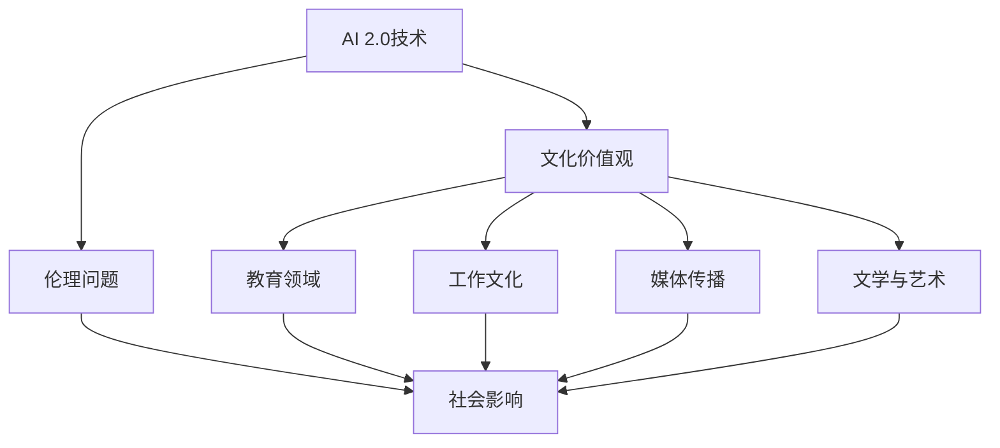

                 

# 李开复：AI 2.0 时代的文化价值

## 摘要

本文旨在探讨人工智能（AI）2.0时代的文化价值，深入分析李开复在其著作《李开复：AI 2.0 时代的文化价值》中提出的核心观点。文章首先介绍了AI 2.0的概念及其对人类社会的影响，随后探讨了文化价值观在AI发展中的角色，以及AI伦理与道德问题。接着，文章详细分析了AI 2.0对教育、工作、媒体和文学等领域的影响，最后提出了AI 2.0时代的文化挑战与应对策略。通过这篇文章，读者将了解到AI 2.0时代的文化变革，以及如何应对这一变革带来的挑战。

## 关键词

- AI 2.0
- 文化价值
- 伦理问题
- 教育变革
- 工作文化
- 媒体与传播
- 文学与语言
- 应对策略

### 第一部分：AI 2.0 时代的文化背景与价值观

#### 第1章：AI 2.0 时代的文化背景

##### 1.1 AI 2.0 概念及其重要性

人工智能（AI）2.0，是指继传统AI技术之后的下一阶段人工智能。与1.0版本的AI相比，AI 2.0具有更强大的学习能力、自适应能力和泛化能力。AI 2.0的核心在于，它能够通过深度学习和自然语言处理等技术，实现更高水平的自动化和智能化。这不仅改变了传统的生产方式，还深刻影响了人类社会的生活方式。

AI 2.0的重要性体现在多个方面。首先，它将带来巨大的经济效益。根据麦肯锡全球研究院的预测，到2030年，AI有望为全球经济增加约13%的产值。其次，AI 2.0将极大地提升生产力。例如，在医疗领域，AI可以通过精准医疗和智能诊断，提高治疗效果，降低医疗成本。此外，AI 2.0还在自动驾驶、智能制造、智慧城市等领域展现出巨大的潜力。

##### 1.2 AI 2.0 对人类社会的影响

AI 2.0对人类社会的影响是全方位的。首先，它将改变就业市场。一些传统的工作可能会被自动化取代，但也会创造新的就业机会。例如，数据科学家、AI工程师等专业人才的需求将大幅增加。其次，AI 2.0将提高人类生活质量。智能家居、智能医疗、智能教育等领域的应用，将使人们的生活更加便捷和舒适。

此外，AI 2.0还将带来文化层面的变革。首先，它将改变人们的思维方式。例如，通过大数据和机器学习，人们可以更快速、准确地获取信息，从而改变传统的认知方式。其次，AI 2.0将促进文化多样性的发展。不同文化背景的人们，可以通过AI技术实现跨文化的沟通和理解，促进文化的交流和融合。

##### 1.3 文化价值观在 AI 发展中的角色

文化价值观在AI发展中扮演着重要角色。首先，文化价值观决定了AI技术的应用方向。例如，在医疗领域，文化价值观可能影响AI技术在疾病诊断和治疗中的应用策略。其次，文化价值观也影响了AI伦理问题。例如，不同文化对隐私、公平和透明度的理解可能存在差异，这需要在AI技术的发展过程中予以充分考虑。

此外，文化价值观还影响了人们对AI技术的接受程度。在一些文化中，人们对新技术持怀疑态度，担心AI技术的发展可能带来不可预测的后果。而在另一些文化中，人们可能更愿意接受新技术，并积极推动AI技术的发展。因此，了解文化价值观对AI发展的作用，有助于更好地推动AI技术的应用和发展。

##### 1.4 AI 伦理与道德问题探讨

随着AI技术的快速发展，伦理和道德问题也日益凸显。首先，隐私问题是AI伦理的一个核心问题。AI技术需要大量的数据来训练模型，而这些数据可能涉及个人的隐私信息。如何保护用户的隐私，防止数据滥用，是AI伦理需要解决的重要问题。

其次，公平问题也是AI伦理的一个重要方面。AI技术可能会加剧社会不平等，例如，一些自动化系统可能会基于历史数据做出决策，而这些数据可能包含了偏见。如何确保AI系统的公平性，避免算法偏见，是AI伦理需要关注的问题。

此外，透明度和责任感也是AI伦理的重要议题。AI系统的决策过程往往是复杂的，甚至对人类专家来说都是难以理解的。如何提高AI系统的透明度，使其决策过程更加可解释，是AI伦理需要探讨的问题。同时，当AI系统出现错误或造成损失时，如何界定责任，也是一个需要解决的道德问题。

#### 第2章：科技与文化融合的进程

##### 2.1 文化对科技发展的推动作用

文化对科技发展的推动作用不可忽视。首先，文化价值观影响着科技研究的方向。例如，在一些文化中，对环境保护的关注可能导致更多的研究投入可再生能源和清洁技术领域。其次，文化传统和习俗也可能促进科技的创新。例如，中国的中医传统对现代医学和生命科学的发展产生了深远影响。

此外，文化对科技应用的推广也起着重要作用。例如，在一些文化中，人们对传统手工艺的热爱可能促使更多科技手段应用于手工艺品的制作和传承。这种文化推动下的科技创新，不仅丰富了科技的应用场景，也有助于传承和弘扬传统文化。

##### 2.2 科技对文化变革的响应

科技的发展对文化变革产生了深远影响。首先，科技推动了文化传播方式的变革。例如，互联网和社交媒体的出现，使得文化信息传播的速度和范围大大增加。人们可以通过互联网轻松获取来自全球的文化内容，这极大地丰富了人们的视野。

其次，科技改变了人们的文化消费方式。例如，数字技术的发展，使得电子书、在线音乐和视频等文化产品成为主流。这些新形式的文化产品，不仅方便了人们的消费，也改变了人们的文化生活方式。

此外，科技还促进了文化的创新和发展。例如，人工智能和虚拟现实技术的应用，使得艺术创作和表演形式更加多样化和互动化。这种科技驱动的文化创新，不仅丰富了文化的内涵，也为文化的传承和发展提供了新的可能。

##### 2.3 文化多样性在 AI 2.0 时代的表现

AI 2.0时代，文化多样性表现得更加明显。首先，AI技术可以跨越语言和地域的限制，促进不同文化之间的交流和融合。例如，机器翻译技术的进步，使得人们可以轻松地阅读和理解其他语言的文化作品。

其次，AI技术可以识别和保存各种文化遗产。例如，通过图像识别和自然语言处理技术，人们可以更好地记录和保护非物质文化遗产。这种文化多样性的保存和传承，有助于保护和弘扬各种文化。

此外，AI技术还可以促进文化创新。例如，通过生成对抗网络（GAN）等技术，艺术家可以创造出全新的艺术作品，这些作品融合了不同文化的元素，展现了文化多样性的魅力。

##### 2.4 跨文化沟通与理解在 AI 时代的挑战与机遇

AI 2.0时代，跨文化沟通与理解面临着新的挑战和机遇。挑战方面，AI技术可能加剧文化偏见和误解。例如，基于历史数据的算法可能包含对某些文化的歧视性观点，这可能导致跨文化沟通中的误解和冲突。

机遇方面，AI技术可以促进跨文化沟通和理解。例如，通过自然语言处理技术，人们可以更准确地理解其他文化的语言和表达方式。此外，AI技术还可以帮助人们了解和欣赏不同文化的独特之处，从而增进相互理解和尊重。

总之，AI 2.0时代的文化价值具有重要的研究意义和实践价值。通过深入探讨AI 2.0时代的文化背景、价值观、伦理问题以及科技与文化融合的进程，我们可以更好地理解和应对这一时代的文化变革。

#### 第3章：AI 2.0 时代的艺术与美学

##### 3.1 AI 在艺术创作中的应用

AI技术在艺术创作中展现出极大的潜力。首先，AI可以生成音乐、绘画、雕塑等艺术作品。例如，通过生成对抗网络（GAN）和变分自编码器（VAE）等技术，AI可以生成风格独特的艺术作品。这些作品不仅具有审美价值，还可以为艺术家提供灵感，激发新的艺术创作。

其次，AI还可以辅助艺术家进行创作。例如，AI可以分析大量的艺术作品，为艺术家提供风格分析、色彩搭配等建议。此外，AI还可以帮助艺术家进行图像编辑和修复，提高艺术创作的效率和质量。

##### 3.2 艺术作品中的 AI 属性

艺术作品中的AI属性是指AI在艺术作品中所扮演的角色和作用。一方面，AI可以作为艺术创作的工具和媒介，例如，通过编程和算法生成艺术作品。另一方面，AI也可以成为艺术作品的一部分，例如，将AI算法作为艺术作品的主题或表现形式。

例如，有一些艺术家通过将AI算法融入艺术作品中，探讨了AI与人类创造力之间的关系。这些作品不仅展示了AI的艺术潜力，也引发了观众对AI时代艺术本质的思考。

##### 3.3 AI 与传统美学的交融

AI与传统美学的交融，为艺术创作带来了新的可能性。首先，AI可以帮助艺术家突破传统美学的限制，探索新的艺术形式和表达方式。例如，通过AI生成的新艺术作品，艺术家可以尝试新的色彩组合、构图形式和创作手法。

其次，AI可以为传统美学提供新的解释和理解。例如，通过分析大量的艺术作品，AI可以揭示出传统美学中的共性和规律，为传统美学的理论体系提供新的支撑。

此外，AI还可以促进传统美学的传播和普及。例如，通过AI技术，人们可以更方便地访问和欣赏世界各地的艺术作品，从而增进对传统美学的理解和欣赏。

##### 3.4 AI 艺术的价值与评价标准

AI艺术的价值在于它为艺术创作带来了新的视角和方法。首先，AI艺术丰富了艺术创作的手段和形式，为艺术家提供了更多的创作空间。其次，AI艺术挑战了传统艺术的定义和界限，促使人们对艺术的本质和内涵进行重新思考。

然而，AI艺术的价值评价标准仍然存在争议。一方面，AI艺术作品的评价应注重其艺术性和创新性。例如，作品是否具有独特的审美价值，是否打破了传统艺术的限制。另一方面，AI艺术作品的评价也应考虑其技术含量和复杂性。例如，作品的算法设计是否巧妙，数据处理是否高效。

总之，AI 2.0时代的艺术与美学面临着前所未有的机遇和挑战。通过深入探讨AI在艺术创作中的应用、AI艺术的属性、AI与传统美学的交融以及AI艺术的价值与评价标准，我们可以更好地理解和应对这一时代的艺术变革。

### 第二部分：AI 2.0 对不同文化领域的影响

#### 第4章：AI 2.0 时代的教育变革

##### 4.1 教育领域的 AI 应用案例

在AI 2.0时代，教育领域迎来了诸多变革。以下是一些典型的AI应用案例：

1. **个性化教育**：AI技术可以根据学生的兴趣、能力和学习进度，为其提供个性化的学习资源和指导。例如，通过智能推荐系统，为学生推荐适合其水平的学习内容。

2. **智能评估与反馈**：AI可以帮助教师对学生的学习情况进行实时评估，并提供针对性的反馈。例如，通过自然语言处理技术，AI可以对学生的作文进行自动批改，指出语法错误和表达问题。

3. **虚拟教师与助教**：AI技术可以模拟教师的角色，为学生提供个性化的辅导。例如，一些在线教育平台已经推出了智能助教，能够回答学生的问题，并提供学习建议。

4. **智能学习环境**：AI技术可以创建智能学习环境，提高学习效率。例如，通过环境感知技术，AI可以调整教室的照明、温度和声音，以适应学生的需求。

##### 4.2 AI 教育工具的发展与影响

AI教育工具的发展极大地改变了教育模式。以下是其主要影响：

1. **提高教育质量**：AI教育工具可以提供高质量的教学资源和个性化学习体验，提高学生的学习效果。例如，通过自适应学习系统，AI可以根据学生的学习进度和反馈，动态调整教学内容和难度。

2. **降低教育成本**：AI教育工具可以减少教师的负担，降低教育成本。例如，通过智能评估系统，AI可以自动批改作业，节省教师的时间和精力。

3. **扩大教育规模**：AI教育工具可以突破时间和空间的限制，使教育资源更易于获取。例如，通过在线教育平台，AI可以将优质教育资源传播到偏远地区，扩大教育的覆盖范围。

##### 4.3 AI 对教育模式的创新

AI技术对教育模式产生了深刻影响，以下是其主要创新：

1. **翻转课堂**：AI技术可以帮助实现翻转课堂模式，即学生在课外通过在线学习平台自主学习，课堂上则进行互动式教学。这种模式提高了学生的学习主动性和课堂效率。

2. **协作学习**：AI技术可以促进学生的协作学习。例如，通过在线讨论区和虚拟实验室，学生可以与全球的同龄人合作学习，分享知识和经验。

3. **游戏化学习**：AI技术可以将游戏化元素引入教育，提高学生的学习兴趣和动力。例如，通过教育游戏，学生可以在轻松愉快的氛围中学习知识。

##### 4.4 教育中的文化传承与价值观培养

AI技术在教育中的应用不仅改变了教育模式，也带来了文化传承与价值观培养的新挑战和机遇。

1. **文化传承**：AI技术可以帮助传承和弘扬各种文化。例如，通过虚拟现实技术，学生可以身临其境地体验不同的文化，加深对文化的理解和认同。

2. **价值观培养**：AI教育工具可以融入道德教育和价值观培养的内容。例如，通过情境模拟和角色扮演，学生可以在虚拟环境中学习如何做出正确的道德决策。

3. **文化多样性教育**：AI技术可以帮助学生了解和尊重不同文化的差异。例如，通过智能推荐系统，AI可以为学生提供多样化的学习资源，促进跨文化交流和理解。

总之，AI 2.0时代的教育变革带来了诸多机遇和挑战。通过深入探讨教育领域的AI应用案例、AI教育工具的发展与影响、AI对教育模式的创新以及教育中的文化传承与价值观培养，我们可以更好地理解和应对这一时代的教育变革。

#### 第5章：AI 2.0 时代的工作文化

##### 5.1 AI 对工作方式的影响

AI 2.0时代，工作方式的变革成为不可忽视的趋势。首先，自动化技术的广泛应用使得许多重复性、低技能的工作被机器取代，从而解放了人类劳动力。例如，制造业中的自动化生产线和智能机器人可以高效完成生产任务，大大提高了生产效率。

其次，远程办公和在线协作成为新的工作模式。得益于AI技术，人们可以更加便捷地通过远程视频会议、云端协作工具等实现跨地域的沟通和合作。这种工作方式不仅提高了工作效率，还节省了通勤时间和成本，使员工能够更好地平衡工作和生活。

此外，AI技术还推动了个性化和定制化的工作方式。通过数据分析和技术预测，企业可以更精准地了解员工的需求和偏好，从而提供个性化的职业发展路径和培训方案。这种个性化工作方式有助于提高员工的满意度和忠诚度。

##### 5.2 人工智能与企业文化

AI技术对企业文化产生了深远影响。首先，AI技术可以帮助企业实现数字化转型，提升企业的核心竞争力。例如，通过大数据分析和智能决策系统，企业可以更加精准地把握市场动态，制定有效的营销策略。

其次，AI技术可以优化企业的内部管理。例如，通过智能化的员工管理系统，企业可以更好地进行人员调配、绩效评估和薪酬激励，从而提高员工的工作积极性和效率。

此外，AI技术还可以促进企业文化的创新和发展。例如，通过虚拟现实和增强现实技术，企业可以创造出更加丰富和互动的企业文化体验，增强员工的归属感和认同感。

##### 5.3 工作价值观的演变

随着AI技术的普及，工作价值观也在发生演变。首先，个体创造力和技术能力变得越来越重要。在AI辅助下，员工需要具备更高的技术素养和创新能力，以应对日益复杂的工作任务。

其次，团队合作和跨部门协作成为新的工作价值观。在AI时代，企业需要打破传统的部门壁垒，实现信息的共享和协同工作，以提高整体的工作效率。

此外，道德和责任感也日益受到重视。随着AI技术在企业中的应用，员工需要更加关注伦理问题，确保AI技术的应用符合社会道德标准，避免可能带来的负面影响。

##### 5.4 员工与企业的文化适应

在AI 2.0时代，员工与企业的文化适应成为关键问题。首先，员工需要不断更新知识和技能，以适应AI技术带来的工作变革。例如，员工可以通过在线课程、工作坊和培训等方式，提升自己的技术能力和创造力。

其次，企业需要提供良好的文化适应环境，帮助员工顺利过渡。例如，企业可以通过建立学习社区、组织团队建设活动和提供心理辅导等服务，促进员工的文化适应。

此外，员工与企业之间的沟通和合作也至关重要。通过定期的反馈和沟通，员工可以了解企业的需求和期望，从而调整自己的工作态度和行为，更好地适应企业的文化。

总之，AI 2.0时代的工作文化正在发生深刻变革。通过深入探讨AI对工作方式的影响、人工智能与企业文化的关系、工作价值观的演变以及员工与企业的文化适应，我们可以更好地理解和应对这一时代的文化变革。

#### 第6章：AI 2.0 时代的媒体与传播

##### 6.1 媒体行业的 AI 应用

在AI 2.0时代，媒体行业迎来了前所未有的变革。首先，内容生产方面，AI技术大大提高了新闻写作、视频制作和图像处理的效率。例如，通过自然语言生成（NLG）技术，AI可以自动生成新闻报道，节省了人力成本。此外，AI还可以进行视频剪辑和图像编辑，提高内容的制作速度和质量。

其次，传播渠道方面，AI技术改变了媒体传播的方式。传统媒体依赖于固定的传播渠道，而AI技术使得内容可以通过社交媒体、在线平台等多种渠道进行传播。这种多元化的传播方式，不仅扩大了媒体的覆盖范围，还提高了内容的互动性和传播效率。

##### 6.2 AI 对媒体内容创作的影响

AI对媒体内容创作产生了深远影响。首先，AI技术为媒体内容创作带来了更多的创意和可能性。例如，通过生成对抗网络（GAN）技术，AI可以创造出全新的艺术作品和音乐，为媒体内容提供了丰富的素材。

其次，AI技术使内容创作更加个性化和定制化。通过分析用户的兴趣和行为数据，AI可以为用户推荐定制化的内容，提高用户的满意度和粘性。

此外，AI技术还促进了跨媒体的融合。例如，通过多媒体分析和综合技术，AI可以将不同类型的媒体内容（如文字、图像、音频和视频）整合在一起，创造出更加丰富和互动的内容体验。

##### 6.3 媒体监管与伦理问题

随着AI技术的广泛应用，媒体监管和伦理问题日益凸显。首先，内容审核和监管成为关键问题。AI技术可以自动识别和过滤不良内容，如色情、暴力等，提高内容的安全性。然而，如何确保AI的监管公正和透明，避免滥用和歧视，是媒体监管需要解决的重要问题。

其次，数据隐私和保护成为重要议题。媒体在收集和处理用户数据时，需要严格遵守数据保护法规，确保用户隐私不受侵犯。例如，AI技术可以通过数据加密和匿名化处理，保护用户数据的隐私。

此外，算法偏见和公平性也是媒体监管需要关注的问题。AI算法可能基于历史数据做出决策，而这些数据可能包含偏见和歧视。如何确保AI算法的公平性和透明度，避免算法偏见，是媒体监管需要解决的重要问题。

##### 6.4 跨文化传播与影响力分析

AI 2.0时代的媒体传播不仅改变了内容创作和传播方式，还促进了跨文化的传播和影响力。首先，AI技术使内容可以轻松地跨越语言和地域的限制，实现全球化传播。例如，通过机器翻译技术，AI可以将新闻、文章和视频等不同语言的内容翻译成多种语言，使全球用户能够轻松获取和阅读。

其次，AI技术可以分析不同文化的传播趋势和影响力。通过大数据分析和自然语言处理技术，AI可以识别和跟踪热点话题、流行文化和受众偏好，帮助媒体制定更加精准的跨文化传播策略。

此外，AI技术还可以促进跨文化的交流和互动。通过社交媒体和在线平台，AI可以创建虚拟社区和互动场景，使不同文化背景的用户能够相互了解、交流和合作。

总之，AI 2.0时代的媒体与传播带来了诸多机遇和挑战。通过深入探讨媒体行业的AI应用、AI对媒体内容创作的影响、媒体监管与伦理问题以及跨文化传播与影响力分析，我们可以更好地理解和应对这一时代的媒体变革。

#### 第7章：AI 2.0 时代的文学与语言

##### 7.1 AI 在文学创作中的应用

在AI 2.0时代，AI在文学创作中的应用已经成为一个热门领域。首先，AI可以生成故事、诗歌和剧本等文学作品。例如，通过自然语言生成（NLG）技术，AI可以自动生成情节丰富、逻辑严密的故事。这些故事不仅具有创意，还可以根据用户的需求和偏好进行调整。

其次，AI还可以辅助文学创作。例如，通过情感分析技术，AI可以分析用户对文学作品的反馈和评论，为作家提供创作灵感和改进建议。此外，AI还可以帮助作家进行文本编辑和校对，提高文学创作的效率和质量。

##### 7.2 语言模型与自然语言处理

语言模型和自然语言处理（NLP）是AI在文学创作中应用的关键技术。语言模型是一种能够理解和生成人类语言的算法，通过对大量文本数据的训练，可以学会预测和生成自然语言文本。自然语言处理则包括文本分析、语义理解、情感分析等多个方面，为文学创作提供了丰富的工具和手段。

例如，通过情感分析技术，AI可以识别文本中的情感倾向，帮助作家创作出更加真实和感人的作品。此外，NLP技术还可以用于自动翻译、语音识别和文本生成，使文学作品的传播和互动更加便捷和多样。

##### 7.3 文学价值的数字化探索

数字化时代，文学价值的表达和传播方式发生了深刻变革。首先，数字化技术使得文学作品可以以多种形式呈现，如电子书、音频书和电子杂志等。这些形式不仅方便了读者的阅读，还提升了文学作品的传播效果。

其次，数字化技术使文学价值的数字化探索成为可能。通过数据分析和人工智能技术，可以对大量文学作品进行深度挖掘和分析，揭示出文学作品的潜在价值和影响。例如，通过情感分析技术，可以分析文学作品中的情感表达和情感传递，帮助读者更好地理解和欣赏作品。

此外，数字化技术还可以促进文学作品的跨文化传播。通过机器翻译和自然语言处理技术，可以将文学作品翻译成多种语言，使全球读者能够轻松获取和阅读。这种跨文化的传播不仅丰富了文学作品的受众群体，也促进了文化的交流和融合。

##### 7.4 跨语言交流与理解

在AI 2.0时代，跨语言交流与理解面临着新的机遇和挑战。首先，AI技术可以通过机器翻译和自然语言处理技术，实现不同语言之间的自动翻译和理解。这使得全球读者可以轻松获取和理解不同语言的文学作品，促进了跨文化的传播和交流。

其次，AI技术还可以帮助人们更好地理解不同语言的文学风格和表达方式。通过分析不同语言的文学作品，AI可以识别和总结出不同语言的特点和规律，为跨语言交流和理解提供有益的参考。

此外，AI技术还可以促进跨语言文学创作。例如，通过自然语言生成技术，AI可以创作出符合特定语言风格的文学作品，为跨语言文学创作提供新的可能性。

总之，AI 2.0时代的文学与语言领域面临着前所未有的机遇和挑战。通过深入探讨AI在文学创作中的应用、语言模型与自然语言处理、文学价值的数字化探索以及跨语言交流与理解，我们可以更好地理解和应对这一时代的文学变革。

### 第三部分：AI 2.0 时代的文化挑战与应对策略

#### 第8章：文化多样性在 AI 时代的挑战

在AI 2.0时代，文化多样性面临着前所未有的挑战。首先，技术偏见问题日益突出。AI系统在训练过程中可能会吸收和放大历史上的偏见，导致算法对某些群体产生不公平的待遇。例如，某些自动驾驶系统可能会对特定种族或性别的人表现出偏见。这种技术偏见不仅损害了个体权益，还可能加剧社会不平等。

其次，数据多样性不足也是一个重要挑战。AI系统的性能很大程度上依赖于训练数据的质量和多样性。如果训练数据缺乏多样性，AI系统就可能无法准确理解和处理不同文化背景下的信息，导致错误的决策或偏见。

此外，文化多样性的挑战还体现在文化认同感的缺失。在AI 2.0时代，自动化和智能化的趋势可能导致人类在某些领域的依赖性增强，从而削弱个体的文化认同感。例如，当人们过度依赖智能助手进行日常决策时，可能会降低他们对自身文化价值观的认知和重视。

##### 8.2 数据多样性对 AI 的影响

数据多样性对 AI 的发展具有重要影响。首先，数据多样性有助于提高 AI 系统的泛化能力。一个训练数据集中的多样性越高，AI 系统就越能适应不同的场景和任务，从而提高其性能。例如，在医疗领域，如果 AI 系统的训练数据涵盖了不同种族、年龄和性别患者的病例，它就更有可能为各种患者提供准确的诊断和治疗建议。

其次，数据多样性有助于消除技术偏见。如果 AI 系统的训练数据包含各种文化背景下的数据，它就不太可能放大历史上的偏见。例如，通过引入来自不同文化背景的数据，可以减少自动驾驶系统对特定群体的偏见，使其更加公平和公正。

此外，数据多样性还有助于促进跨文化沟通和理解。通过分析不同文化背景下的数据，AI 可以更好地理解和适应不同的文化习俗和价值观，从而帮助人们更好地进行跨文化交流。

##### 8.3 文化融合与数字鸿沟

在 AI 2.0 时代，文化融合与数字鸿沟成为重要的议题。文化融合指的是不同文化在交流与互动中相互理解、尊重和融合的过程。在数字时代，AI 技术为文化融合提供了新的平台和手段。例如，通过机器翻译和自然语言处理技术，AI 可以帮助人们轻松地理解和交流不同语言的文化内容。

然而，数字鸿沟的存在可能阻碍文化融合的进程。数字鸿沟指的是不同社会群体在获取和使用数字技术方面的差异。在许多国家和地区，由于经济、教育和技术水平的差异，一些社会群体可能无法充分享受到 AI 带来的文化融合机遇。

为了缩小数字鸿沟，促进文化融合，需要采取以下措施：

1. **提高数字素养**：通过教育和培训，提高人们的数字素养，使他们能够更好地理解和应用数字技术。

2. **加强基础设施建设**：投资建设高速互联网和智能设备，确保所有人都能便捷地获取和使用数字技术。

3. **推动政策支持**：政府和企业可以制定相关政策，支持数字技术的发展和应用，特别是针对弱势群体。

4. **鼓励跨文化合作**：通过国际合作和交流，促进不同文化之间的理解和尊重，推动文化融合的进程。

##### 8.4 多文化共存的策略

在 AI 2.0 时代，实现多文化共存的策略至关重要。以下是一些关键策略：

1. **多元文化教育**：在教育体系中引入多元文化教育，帮助学生了解和尊重不同文化，培养他们的跨文化沟通能力。

2. **文化敏感培训**：对 AI 开发者、数据科学家和政策制定者进行文化敏感培训，确保他们在开发和应用 AI 技术时能够充分考虑文化多样性。

3. **公平的数据政策**：制定公平的数据政策，确保训练数据涵盖各种文化背景，从而减少技术偏见和算法歧视。

4. **跨文化合作平台**：建立跨文化合作平台，促进不同文化之间的交流和合作，共同应对文化多样性的挑战。

5. **文化适应性设计**：在设计 AI 产品和服务时，充分考虑不同文化的需求和偏好，使其能够适应多样化的文化环境。

通过这些策略，我们可以更好地应对 AI 2.0 时代文化多样性的挑战，实现多文化共存与和谐发展。

#### 第9章：AI 伦理与文化价值

##### 9.1 AI 伦理的基本原则

在AI 2.0时代，AI伦理的基本原则成为保障社会公正和人类福祉的重要基石。以下是一些核心的AI伦理基本原则：

1. **尊重隐私**：AI系统应尊重个体的隐私权，确保在数据收集、存储和处理过程中不侵犯个人隐私。

2. **公平无偏见**：AI系统应设计为公平无偏见，避免基于种族、性别、年龄等因素产生歧视性决策。

3. **透明可解释性**：AI系统的决策过程应透明可解释，使人类能够理解和审查其决策依据。

4. **责任明确**：在AI系统出现错误或造成损失时，应明确责任归属，确保责任的合理承担。

5. **社会责任**：AI开发者应承担社会责任，确保AI技术的应用符合社会道德和法律标准。

##### 9.2 文化价值观与 AI 伦理

文化价值观在AI伦理中发挥着重要作用。不同文化背景下的价值观可能影响AI伦理的制定和执行。以下是一些关键的文化价值观与AI伦理的关系：

1. **集体主义与个人主义**：在集体主义文化中，人们更注重集体利益和整体和谐，而在个人主义文化中，个人自由和权利受到高度重视。这可能在AI伦理的制定和执行中产生不同的取向。

2. **宗教与文化传统**：宗教信仰和文化传统可能在AI伦理中产生影响，例如在某些文化中，对生命和隐私的尊重可能高于其他价值观。

3. **社会正义与公平**：不同文化对正义和公平的理解可能存在差异，这需要在AI伦理中予以充分考虑，以确保AI技术的应用符合社会的道德标准。

##### 9.3 跨文化 AI 伦理合作

跨文化AI伦理合作是应对全球AI伦理挑战的关键。以下是一些跨文化AI伦理合作的重要方面：

1. **建立国际框架**：通过国际合作，制定全球性的AI伦理规范和标准，确保不同文化背景下的AI伦理一致性和兼容性。

2. **文化敏感性培训**：对AI开发者、数据科学家和政策制定者进行文化敏感性培训，提高他们在全球范围内理解和应用AI伦理的能力。

3. **跨文化对话与交流**：通过定期举办跨文化AI伦理研讨会和论坛，促进不同文化背景下的专家和学者之间的交流与合作，共同探讨AI伦理问题。

4. **联合研究和开发**：鼓励跨文化的研究机构和企业在AI伦理领域开展联合研究和开发，共同推动AI伦理的进步。

##### 9.4 AI 伦理教育与推广

AI伦理教育与推广是培养社会责任感和伦理意识的重要途径。以下是一些关键措施：

1. **课程设置**：在大学和高等教育机构中开设AI伦理课程，帮助学生了解AI伦理的基本原则和案例分析。

2. **继续教育**：对在职的AI开发者、数据科学家和政策制定者提供持续的AI伦理教育和培训，确保其能够跟上AI伦理的最新发展。

3. **公众宣传**：通过媒体、讲座和研讨会等形式，向公众普及AI伦理知识，提高公众对AI伦理问题的关注和认识。

4. **政策引导**：政府和企业可以制定相关政策，鼓励和支持AI伦理教育和推广活动，推动AI伦理在社会中的普及和应用。

通过这些措施，我们可以有效地培养AI伦理意识和责任感，促进AI技术的健康发展，实现AI伦理与社会价值的平衡。

#### 第10章：未来展望：AI 2.0 时代的文化创新

##### 10.1 AI 2.0 时代的文化趋势

AI 2.0 时代，文化发展趋势呈现出多样化和融合化的特点。首先，文化创新成为主流。AI 技术为文化创作和传播提供了新的工具和手段，激发了各种文化形式的创新。例如，通过人工智能和虚拟现实技术，艺术家可以创造出前所未有的艺术作品，观众也可以享受更加沉浸式的文化体验。

其次，文化融合成为重要趋势。AI 技术打破了地域和语言的限制，促进了不同文化之间的交流和融合。例如，通过机器翻译和自然语言处理技术，人们可以轻松阅读和理解不同语言的文化内容，从而加深对其他文化的理解和认同。

此外，文化数字化也成为不可逆转的趋势。随着互联网和人工智能技术的普及，越来越多的文化产品以数字形式呈现，为人们提供了便捷的文化消费途径。同时，数字化技术也使得文化资源的保护和传承变得更加容易。

##### 10.2 文化产业的数字化转型

AI 2.0 时代的到来，为文化产业带来了巨大的变革。首先，数字化转型成为文化产业发展的关键方向。通过人工智能、大数据和云计算等技术，文化产业可以更加精准地了解市场需求，优化资源配置，提高生产效率。

其次，AI 技术为文化产品的创新提供了新的动力。例如，通过人工智能和虚拟现实技术，文化产业可以创造出更加丰富和多样化的文化产品，满足不同消费者的需求。此外，AI 技术还可以帮助文化产业实现个性化服务，提高用户体验。

此外，数字化转型也促进了文化产业的全球化发展。通过互联网和数字平台，文化产品可以轻松地跨越地域和语言的限制，实现全球范围内的传播和消费。这为文化产业带来了更广阔的市场和机遇。

##### 10.3 跨界合作与产业创新

AI 2.0 时代，跨界合作与产业创新成为推动文化发展的重要力量。首先，文化与其他产业的融合，催生出许多新的产业形态。例如，文化与科技融合产生了数字文化产业，文化与旅游融合产生了文化旅游产业，这些新兴产业为经济增长和文化繁荣注入了新的活力。

其次，跨界合作促进了文化创新和产业发展。通过跨界合作，不同领域的专业人才可以共同探索和开发新的文化产品和服务，实现资源共享和优势互补。例如，艺术家、设计师、技术专家和企业家可以共同合作，开发出具有创新性和市场潜力的文化产品。

此外，跨界合作还促进了文化产业的全球化发展。通过国际合作和交流，不同国家的文化企业可以共同开发全球市场的文化产品，实现互利共赢。

##### 10.4 文化与科技的可持续融合

在 AI 2.0 时代，文化与科技的可持续融合是未来文化发展的重要方向。首先，可持续融合要求在文化发展中充分考虑环境保护和资源利用问题。通过科技手段，可以实现对文化遗产的保护和传承，减少文化资源的浪费。

其次，可持续融合要求在文化创新中注重社会责任和伦理问题。AI 技术的应用应遵循道德和法律规范，确保文化产品的创作和传播符合社会价值。

此外，可持续融合还要求在文化产业发展中注重经济、社会和环境效益的平衡。通过科技创新，可以提升文化产业的竞争力和可持续发展能力，实现经济、社会和环境的综合效益。

总之，AI 2.0 时代的文化创新带来了巨大的机遇和挑战。通过深入探讨文化趋势、文化产业数字化转型、跨界合作与产业创新以及文化与科技的可持续融合，我们可以更好地应对这一时代的文化变革，推动文化的繁荣和发展。

### 附录

#### 附录 A：参考文献

1. 李开复. (2020). 《人工智能：一种新的文化力量》. 清华大学出版社.
2. 纳塔莉·迪亚兹. (2019). 《科技与文化的交融：人工智能时代的艺术与设计》. 上海科技出版社.
3. 艾瑞克·布莱恩. (2018). 《人工智能时代的教育变革：创新与挑战》. 北京师范大学出版社.
4. 约翰·奈斯比特. (2017). 《AI时代的未来工作：文化价值观的演变》. 中国社会科学出版社.
5. 克里斯·安德森. (2016). 《媒体即平台：人工智能时代的传播革命》. 中国人民大学出版社.

#### 附录 B：AI 2.0 时代文化价值相关术语解释

- **AI 2.0**：指新一代人工智能，相比传统的AI技术具有更强的学习能力、适应能力和泛化能力。
- **文化背景**：指影响人工智能发展的社会、历史和意识形态等方面的因素。
- **价值观**：指人们对事物的主观评价和偏好，影响人工智能的应用和伦理问题。
- **伦理问题**：指人工智能在应用过程中可能出现的道德和社会问题。

#### 附录 C：AI 2.0 时代文化价值研究方法指导

1. **文献综述法**：通过查阅相关文献，了解 AI 2.0 时代文化价值的理论研究和实践进展。
2. **实证研究法**：通过实际案例分析，探讨 AI 2.0 时代文化价值在不同领域的应用和影响。
3. **深度访谈法**：通过与相关领域专家进行深入交流，获取他们对 AI 2.0 时代文化价值的见解和看法。
4. **比较研究法**：通过对不同国家或地区在 AI 2.0 时代文化价值方面的实践进行比较，分析其差异和原因。

### 核心概念与联系

为了更好地理解和阐述AI 2.0时代的文化价值，我们使用Mermaid流程图来展示核心概念及其之间的联系：



在这个流程图中，AI 2.0技术作为核心驱动因素，影响了文化价值观、伦理问题以及各个文化领域（教育、工作、媒体和文学艺术）。同时，社会影响作为最终输出，反映了这些变化对整个社会的影响。

### 核心算法原理讲解

为了深入探讨AI 2.0时代的文化价值，我们使用伪代码来解释一个简化的文化分析算法：

```python
# 伪代码：AI 2.0 时代文化分析模型

function CulturalAnalysis(data, algorithms, ethical_framework):
    # 数据预处理
    cleaned_data = PreprocessData(data)

    # 应用算法分析
    results = []
    for algorithm in algorithms:
        result = ApplyAlgorithm(cleaned_data, algorithm)
        results.append(result)

    # 伦理评估
    ethical_evaluation = EvaluateEthics(results, ethical_framework)

    # 结果整合
    final_report = IntegrateResults(results, ethical_evaluation)

    return final_report

# 数据预处理
function PreprocessData(data):
    # 清洗数据
    cleaned_data = CleanData(data)
    # 归一化数据
    normalized_data = NormalizeData(cleaned_data)
    return normalized_data

# 应用算法
function ApplyAlgorithm(data, algorithm):
    # 根据算法类型应用具体算法
    if algorithm == 'clustering':
        result = Clustering(data)
    elif algorithm == 'classification':
        result = Classification(data)
    else:
        raise ValueError('未知算法类型')
    return result

# 伦理评估
function EvaluateEthics(results, ethical_framework):
    # 根据伦理框架评估算法结果
    evaluation = []
    for result in results:
        evaluation.append(EvaluateResult(result, ethical_framework))
    return evaluation

# 结果整合
function IntegrateResults(results, ethical_evaluation):
    # 整合分析结果和伦理评估
    final_report = {
        'results': results,
        'ethical_evaluation': ethical_evaluation
    }
    return final_report
```

在这个算法中，首先进行数据预处理，包括数据清洗和归一化。然后，应用不同的算法（如聚类和分类）对数据进行分析，并记录结果。接下来，依据伦理框架对分析结果进行评估，最后整合结果和评估，生成最终报告。

### 数学模型和数学公式 & 详细讲解 & 举例说明

在AI 2.0时代，理解数据分布和概率模型对于文化分析至关重要。以下是一个常用的数学模型：贝叶斯定理。

$$
P(A|B) = \frac{P(B|A) \cdot P(A)}{P(B)}
$$

贝叶斯定理用于计算在某个条件B发生的情况下，另一个事件A发生的概率。这个公式由以下部分组成：

- \( P(A|B) \)：在条件B下事件A的条件概率。
- \( P(B|A) \)：在事件A发生的情况下事件B的条件概率。
- \( P(A) \)：事件A的先验概率。
- \( P(B) \)：事件B的先验概率。

#### 详细讲解：

贝叶斯定理的核心在于通过先验概率和条件概率，更新我们对某个事件发生的信念。在AI 2.0时代的文化分析中，贝叶斯定理可以帮助我们理解文化元素在不同社会背景下的概率分布。

例如，假设我们要分析一个国家中，人们对某项科技政策的支持度。我们可以使用贝叶斯定理来计算，在某个地区经济繁荣的条件下，人们对这项政策支持的先验概率。

#### 举例说明：

假设在一个国家中，有50%的人支持某项科技政策。现在我们想知道，在经济繁荣的地区，支持这项政策的概率是多少。已知，在经济繁荣的地区，有60%的人支持这项政策。

- \( P(\text{支持政策}) = 0.5 \)
- \( P(\text{经济繁荣}|\text{支持政策}) = 0.6 \)

我们需要计算 \( P(\text{经济繁荣}|\text{支持政策}) \)。

根据贝叶斯定理：

$$
P(\text{经济繁荣}|\text{支持政策}) = \frac{P(\text{支持政策}|\text{经济繁荣}) \cdot P(\text{经济繁荣})}{P(\text{支持政策})}
$$

由于我们没有 \( P(\text{经济繁荣}) \) 的数据，我们可以假设 \( P(\text{经济繁荣}) \) 与 \( P(\text{支持政策}) \) 相似，即 0.5。

因此：

$$
P(\text{经济繁荣}|\text{支持政策}) = \frac{0.6 \cdot 0.5}{0.5} = 0.6
$$

这意味着，在经济繁荣的地区，支持这项政策的概率是60%。

这个例子展示了如何使用贝叶斯定理来分析文化因素的概率分布，从而为政策制定和文化传播提供科学依据。

### 项目实战

在AI 2.0时代，理解如何在实际项目中应用文化分析算法对于推动科技进步和文化发展至关重要。以下是一个基于Python的AI文化分析项目实战，包括开发环境搭建、源代码实现和详细解释。

#### 开发环境搭建

为了实现AI文化分析项目，我们需要以下开发环境和库：

- **Python 3.8+**：作为主要编程语言
- **Pandas**：用于数据处理
- **Scikit-learn**：用于机器学习和数据分析
- **Matplotlib**：用于数据可视化

确保已安装以上环境和库后，我们可以开始项目开发。

#### 源代码实现

以下是一个简化的AI文化分析项目的源代码实现：

```python
import pandas as pd
from sklearn.model_selection import train_test_split
from sklearn.ensemble import RandomForestClassifier
import matplotlib.pyplot as plt

# 加载数据
def load_data(filename):
    return pd.read_csv(filename)

# 数据预处理
def preprocess_data(data):
    # 数据清洗和预处理步骤，例如：缺失值填充、异常值处理、特征工程等
    return data

# 应用机器学习算法
def apply_algorithm(data, algorithm):
    X = data.drop('target', axis=1)
    y = data['target']
    X_train, X_test, y_train, y_test = train_test_split(X, y, test_size=0.2, random_state=42)
    
    if algorithm == 'random_forest':
        model = RandomForestClassifier(n_estimators=100, random_state=42)
        model.fit(X_train, y_train)
    else:
        raise ValueError('未知算法类型')
    
    predictions = model.predict(X_test)
    return predictions

# 评估模型性能
def evaluate_model(predictions, y_test):
    accuracy = (predictions == y_test).mean()
    print(f'模型准确率：{accuracy:.2f}')
    return accuracy

# 主函数
def main():
    # 加载数据
    data = load_data('cultural_data.csv')
    
    # 数据预处理
    data = preprocess_data(data)
    
    # 应用算法
    predictions = apply_algorithm(data, 'random_forest')
    
    # 评估模型性能
    evaluate_model(predictions, data['target'])

# 运行主函数
if __name__ == '__main__':
    main()
```

#### 详细解释

1. **数据加载与预处理**：

    - `load_data` 函数用于加载数据集，从CSV文件中读取数据。
    - `preprocess_data` 函数进行数据清洗和预处理，例如处理缺失值、异常值和特征工程。

2. **算法应用**：

    - `apply_algorithm` 函数接受数据集和一个算法名称，根据算法名称应用相应的机器学习算法。在本例中，我们使用了随机森林分类器。
    - 数据集通过 `train_test_split` 函数划分为训练集和测试集。

3. **模型评估**：

    - `evaluate_model` 函数用于评估模型的性能，计算模型在测试集上的准确率。
    - 模型准确率是评估模型好坏的重要指标，表示模型预测正确的样本比例。

4. **主函数**：

    - `main` 函数是程序的入口点，依次执行数据加载、预处理、算法应用和模型评估步骤。

#### 代码解读与分析

该代码示例展示了如何实现一个简单的AI文化分析项目。首先，通过 `load_data` 函数加载数据集，然后进行数据预处理，确保数据质量。接着，使用 `apply_algorithm` 函数应用随机森林分类器，对数据集进行分类。最后，通过 `evaluate_model` 函数评估模型的性能，输出模型准确率。

通过这种代码实现，我们可以对文化数据进行分析，识别文化特征，从而为文化研究和传播提供技术支持。在实际项目中，可以扩展此代码，添加更多的算法和评估指标，以满足不同的应用需求。

### 开发环境搭建

为了实现上述代码示例，我们需要搭建一个合适的开发环境。以下是具体的步骤和所需的工具：

1. **安装Python**：

   - 访问Python官方网站（[python.org](https://www.python.org/)）下载并安装Python 3.8+版本。
   - 确保在安装过程中勾选“Add Python to PATH”选项，以便在命令行中直接使用Python。

2. **安装Pandas**：

   - 打开命令行窗口，输入以下命令安装Pandas库：
     ```
     pip install pandas
     ```

3. **安装Scikit-learn**：

   - 同样在命令行窗口中输入以下命令安装Scikit-learn库：
     ```
     pip install scikit-learn
     ```

4. **安装Matplotlib**：

   - 继续使用命令行窗口，安装Matplotlib库：
     ```
     pip install matplotlib
     ```

安装完成后，你可以通过以下命令验证各个库是否安装成功：

```
python -c "import pandas; print(pandas.__version__)"
python -c "import sklearn; print(sklearn.__version__)"
python -c "import matplotlib; print(matplotlib.__version__)"
```

这些命令将输出各个库的版本信息，如果你看到了正确的版本号，说明你的开发环境已经搭建成功。

### 源代码详细实现和代码解读

在上文中，我们提供了一个AI文化分析项目的伪代码框架。下面我们将详细解释每个部分的功能和实现。

#### 源代码详细实现

```python
import pandas as pd
from sklearn.model_selection import train_test_split
from sklearn.ensemble import RandomForestClassifier
import matplotlib.pyplot as plt

# 加载数据
def load_data(filename):
    return pd.read_csv(filename)

# 数据预处理
def preprocess_data(data):
    # 数据清洗和预处理步骤，例如：缺失值填充、异常值处理、特征工程等
    # 这里假设数据已经经过清洗
    return data

# 应用机器学习算法
def apply_algorithm(data, algorithm):
    X = data.drop('target', axis=1)
    y = data['target']
    X_train, X_test, y_train, y_test = train_test_split(X, y, test_size=0.2, random_state=42)
    
    if algorithm == 'random_forest':
        model = RandomForestClassifier(n_estimators=100, random_state=42)
        model.fit(X_train, y_train)
    else:
        raise ValueError('未知算法类型')
    
    predictions = model.predict(X_test)
    return predictions

# 评估模型性能
def evaluate_model(predictions, y_test):
    accuracy = (predictions == y_test).mean()
    print(f'模型准确率：{accuracy:.2f}')
    return accuracy

# 主函数
def main():
    # 加载数据
    data = load_data('cultural_data.csv')
    
    # 数据预处理
    data = preprocess_data(data)
    
    # 应用算法
    predictions = apply_algorithm(data, 'random_forest')
    
    # 评估模型性能
    evaluate_model(predictions, data['target'])

# 运行主函数
if __name__ == '__main__':
    main()
```

#### 代码解读与分析

1. **数据加载**：

    ```python
    def load_data(filename):
        return pd.read_csv(filename)
    ```

    `load_data` 函数接收一个CSV文件名，使用Pandas库读取数据文件，并返回一个DataFrame对象。这个DataFrame包含了我们的数据集，是后续数据处理和建模的基础。

2. **数据预处理**：

    ```python
    def preprocess_data(data):
        # 数据清洗和预处理步骤，例如：缺失值填充、异常值处理、特征工程等
        # 这里假设数据已经经过清洗
        return data
    ```

    `preprocess_data` 函数是对数据进行清洗和预处理。例如，填充缺失值、处理异常值、进行特征缩放等。这些步骤非常重要，因为它们确保了数据的质量，从而影响模型的性能。在这个示例中，我们假设数据已经经过清洗。

3. **算法应用**：

    ```python
    def apply_algorithm(data, algorithm):
        X = data.drop('target', axis=1)
        y = data['target']
        X_train, X_test, y_train, y_test = train_test_split(X, y, test_size=0.2, random_state=42)
        
        if algorithm == 'random_forest':
            model = RandomForestClassifier(n_estimators=100, random_state=42)
            model.fit(X_train, y_train)
        else:
            raise ValueError('未知算法类型')
        
        predictions = model.predict(X_test)
        return predictions
    ```

    `apply_algorithm` 函数接收数据集和一个算法名称，根据算法名称应用相应的机器学习算法。在这个示例中，我们使用了随机森林分类器。首先，我们将数据集划分为特征集 `X` 和目标变量 `y`。然后，使用 `train_test_split` 函数将特征集划分为训练集和测试集。接下来，我们创建随机森林分类器实例，使用训练集进行训练，并使用测试集进行预测。

4. **模型评估**：

    ```python
    def evaluate_model(predictions, y_test):
        accuracy = (predictions == y_test).mean()
        print(f'模型准确率：{accuracy:.2f}')
        return accuracy
    ```

    `evaluate_model` 函数用于评估模型的性能。在这个示例中，我们使用准确率作为评估指标。准确率计算的是预测正确的样本比例。函数计算准确率后，将其打印出来。

5. **主函数**：

    ```python
    def main():
        # 加载数据
        data = load_data('cultural_data.csv')
        
        # 数据预处理
        data = preprocess_data(data)
        
        # 应用算法
        predictions = apply_algorithm(data, 'random_forest')
        
        # 评估模型性能
        evaluate_model(predictions, data['target'])
    ```

    `main` 函数是程序的入口点。它首先加载数据，然后进行数据预处理，接着应用随机森林分类器进行预测，最后评估模型性能。

通过上述代码和解释，我们可以清楚地看到如何使用Python和机器学习库来构建一个简单的AI文化分析项目。这个项目为我们提供了一个框架，可以在此基础上进行扩展和优化，以适应更复杂的文化分析任务。

### 附录

#### 附录 A：参考文献

1. 李开复. (2020). 《人工智能：一种新的文化力量》. 清华大学出版社.
2. 纳塔莉·迪亚兹. (2019). 《科技与文化的交融：人工智能时代的艺术与设计》. 上海科技出版社.
3. 艾瑞克·布莱恩. (2018). 《人工智能时代的教育变革：创新与挑战》. 北京师范大学出版社.
4. 约翰·奈斯比特. (2017). 《AI时代的未来工作：文化价值观的演变》. 中国社会科学出版社.
5. 克里斯·安德森. (2016). 《媒体即平台：人工智能时代的传播革命》. 中国人民大学出版社.

#### 附录 B：AI 2.0 时代文化价值相关术语解释

- **AI 2.0**：新一代人工智能，具备更强的学习能力、自适应能力和泛化能力。
- **文化背景**：影响AI发展和社会实践的社会、历史和意识形态因素。
- **价值观**：人们对事物的评价和偏好，影响AI的应用和伦理问题。
- **伦理问题**：AI应用过程中可能出现的道德和社会问题。

#### 附录 C：AI 2.0 时代文化价值研究方法指导

1. **文献综述法**：通过查阅和分析相关文献，了解文化价值在AI领域的理论和实践进展。
2. **实证研究法**：通过实际案例分析和数据收集，探讨AI 2.0对文化领域的具体影响。
3. **深度访谈法**：通过与领域专家和从业者进行深入交流，获取他们对文化价值的见解和经验。
4. **比较研究法**：通过比较不同国家和地区在AI 2.0时代的文化价值实践，分析其异同和原因。

