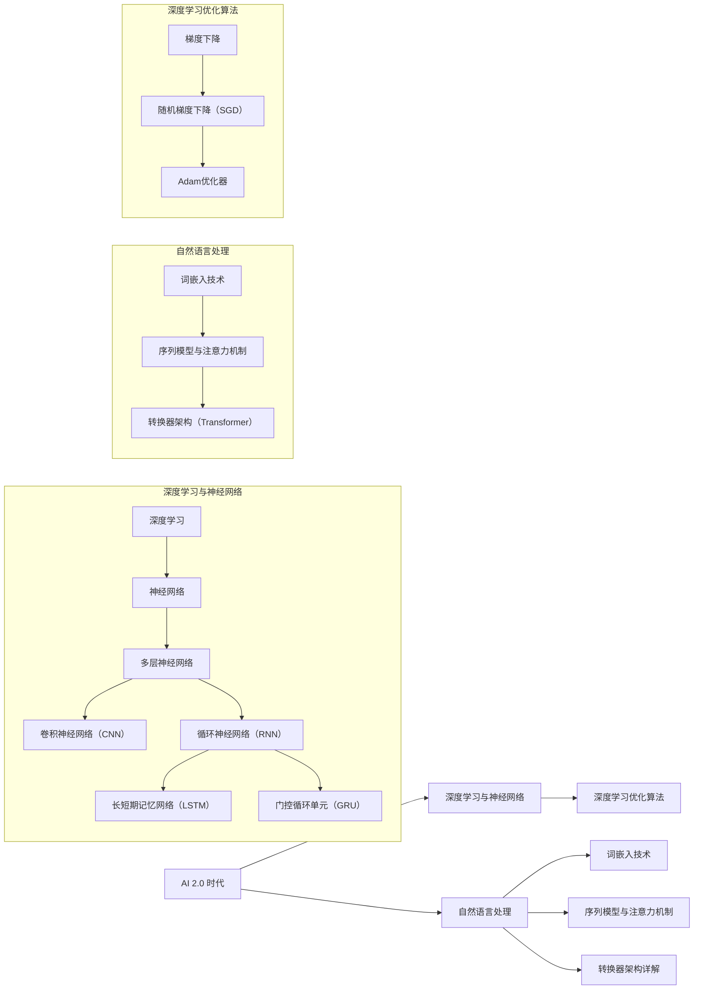
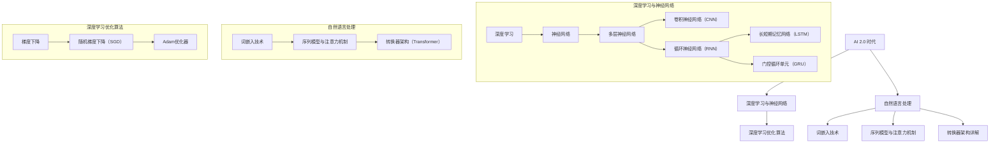

                 

### 《李开复：AI 2.0 时代的文化价值》

在人工智能（AI）迅猛发展的今天，李开复博士以其深厚的技术背景和前瞻性的视角，探讨了AI 2.0时代的文化价值。本文旨在通过对AI 2.0时代的定义、技术基础、文化变迁以及未来展望的深入分析，探讨AI 2.0时代对文化产生的深远影响。

关键词：人工智能、AI 2.0、文化价值、伦理道德、未来展望

摘要：本文首先介绍了AI 2.0时代的概念及其特点，随后探讨了AI 2.0技术基础，包括深度学习与神经网络、自然语言处理等。在此基础上，本文分析了AI 2.0时代的社会文化变迁、伦理道德问题以及人类价值观的融合。最后，本文对未来AI 2.0时代的文化创新、文化实践与文化价值探索进行了展望。

----------------------------------------------------------------

### 《李开复：AI 2.0 时代的文化价值》目录大纲

为了帮助读者更好地理解AI 2.0时代的文化价值，本文将分为三大部分进行探讨：

#### 第一部分：AI 2.0 时代概述
这部分将介绍AI 2.0时代的来临、定义与特点，以及与传统AI的对比和发展趋势与挑战。

1. **AI 2.0 时代的定义与特点**
2. **AI 2.0 与传统AI的对比**
3. **AI 2.0 的发展趋势与挑战**

#### 第二部分：AI 2.0 时代的文化价值

这部分将深入探讨AI 2.0时代对文化的影响，包括文化变迁、伦理道德问题、人类价值观的融合以及教育改革。

1. **AI 2.0 时代的文化变迁**
   - **社会影响**：就业市场、教育与培训、隐私与安全
   - **伦理道德问题**：偏见与公平性、透明性与可解释性、伦理决策框架
2. **AI 2.0 与人类价值观的融合**
   - **人类创造力**：艺术创作、科学研究、人类思维互动
   - **教育改革**：个性化学习、终身学习、教育模式创新
3. **AI 2.0 时代的文化创新**
   - **文化产业变革**：音乐创作、电影制作、文化创意产业
   - **文化交流**：跨文化理解、全球化、文化多样性

#### 第三部分：实践与探索

这部分将探讨AI 2.0时代的文化实践、文化创新策略以及文化价值研究，同时展望未来AI 2.0时代的文化价值。

1. **AI 2.0 时代的文化实践**
   - **文化创新案例**：文化创意产业、教育领域、社会服务与公共管理
   - **文化创新策略**：文化产业与AI融合、教育领域的AI应用、社会服务与公共管理中的AI应用
2. **AI 2.0 时代的文化价值探索**
   - **文化价值研究**：定义、评估方法、实现路径
   - **文化创新与可持续发展**：经济可持续发展、文化产业与AI融合、教育领域的可持续发展策略

### 附录

本文的最后将提供附录A：AI 2.0 时代文化价值研究资源，包括研究资料与文献推荐、研究方法与工具以及实践案例与启示。

以上便是本文的目录大纲，接下来我们将逐一深入探讨各个部分的内容。希望读者能够通过本文，对AI 2.0时代的文化价值有更深刻的理解和认识。----------------------------------------------------------------

### 第一部分：AI 2.0 时代概述

#### 第1章：AI 2.0 时代的来临

随着人工智能（AI）技术的不断发展，我们正迎来一个全新的时代——AI 2.0时代。AI 2.0时代，是指人工智能技术从最初的简单自动化阶段，迈向深度学习、自然语言处理等高级技术的时代。李开复博士指出，AI 2.0时代的到来，不仅仅是技术的进步，更是一种全新的文化现象。

**AI 2.0 时代的定义与特点**

AI 2.0时代的定义，首先在于其技术基础的升级。AI 2.0时代的技术核心，是深度学习与神经网络的发展。深度学习作为一种高级的学习方法，通过多层神经网络对大量数据进行训练，能够自动提取数据中的特征，进行高级的决策和预测。

与传统的AI技术相比，AI 2.0具有以下几个显著特点：

1. **自我学习能力**：AI 2.0具有更强的自我学习能力，可以通过不断的学习和优化，实现自我提升。
2. **泛化能力**：AI 2.0能够处理更复杂的任务，具备更强的泛化能力，可以在不同的场景和问题上进行有效的应用。
3. **智能化程度**：AI 2.0时代的智能化程度更高，可以模拟人类的认知过程，实现更高级的智能行为。

**AI 2.0 与传统AI的对比**

传统AI主要以规则为基础，通过对已知规则的编码，实现机器的自动化。而AI 2.0则是基于数据，通过深度学习等方法，从大量的数据中自动学习出模型，进行智能决策。

此外，AI 2.0在数据处理能力和学习能力上，也远超传统AI。传统AI通常只能处理简单、规则明确的问题，而AI 2.0则可以处理更复杂、不确定的问题，具备更强的适应性和灵活性。

**AI 2.0 的发展趋势与挑战**

AI 2.0时代的发展，不仅带来了技术的进步，也带来了新的挑战。首先，AI 2.0技术的发展，需要大量的数据支持，这对数据质量和数据安全提出了更高的要求。其次，AI 2.0技术的应用，需要考虑到伦理和社会问题，如何确保AI的公平性、透明性和可解释性，是一个亟待解决的问题。

最后，AI 2.0时代的发展，也对人类的就业和教育提出了新的挑战。随着AI技术的发展，许多传统的职业可能面临失业的风险，而新的就业岗位也在不断涌现。因此，如何进行教育改革，培养适应AI 2.0时代的劳动者，也是一个重要的课题。

总之，AI 2.0时代的来临，不仅带来了技术的变革，也对社会的文化、伦理、教育等方面产生了深远的影响。在接下来的章节中，我们将进一步探讨AI 2.0时代的文化价值，分析其对社会的各个方面产生的深远影响。----------------------------------------------------------------

### 第2章：AI 2.0 技术基础

AI 2.0时代的核心，是深度学习与神经网络、自然语言处理等技术的不断发展。这些技术不仅推动了AI技术的进步，也为AI 2.0时代的文化价值奠定了基础。在本章中，我们将详细探讨AI 2.0技术的基础，包括深度学习与神经网络、自然语言处理等方面。

#### 2.1 深度学习与神经网络

**深度学习的基本概念**

深度学习是一种基于多层神经网络的机器学习方法。与传统机器学习方法相比，深度学习具有更强的自适应性和泛化能力。深度学习通过多层神经网络，对大量数据进行训练，能够自动提取数据中的特征，进行高级的决策和预测。

**神经网络架构**

神经网络是由大量的神经元连接而成的复杂网络。每个神经元都接受多个输入，通过激活函数进行非线性变换，产生输出。神经网络的层次结构，决定了其处理数据的能力和复杂性。

在深度学习中，常见的神经网络架构包括卷积神经网络（CNN）、循环神经网络（RNN）和变换器架构（Transformer）等。这些架构在图像识别、自然语言处理、序列预测等领域取得了显著的成果。

**深度学习优化算法**

深度学习的优化算法，是神经网络训练过程中的核心。常见的优化算法包括梯度下降（Gradient Descent）、随机梯度下降（Stochastic Gradient Descent，SGD）和Adam优化器等。

这些优化算法通过迭代更新模型参数，使得模型在训练数据上达到最优。在实际应用中，优化算法的选择和参数调优，对模型的性能有着重要的影响。

#### 2.2 自然语言处理

自然语言处理（NLP）是AI 2.0技术的重要组成部分。NLP旨在使计算机能够理解、生成和处理人类语言。在AI 2.0时代，NLP技术取得了巨大的进步，推动了人工智能在各个领域的应用。

**词嵌入技术**

词嵌入技术是NLP中的基本技术之一。它将单词映射到高维空间中的向量，使得单词之间的相似性可以通过向量之间的距离来衡量。常见的词嵌入技术包括Word2Vec、GloVe等。

**序列模型与注意力机制**

在NLP中，许多任务都需要处理序列数据，如文本、语音等。序列模型是处理序列数据的基本方法，常见的序列模型包括循环神经网络（RNN）和长短期记忆网络（LSTM）。

注意力机制是一种重要的技术，它可以捕捉序列中的关键信息，提高模型的性能。在NLP中，注意力机制被广泛应用于文本分类、机器翻译、情感分析等任务。

**转换器架构详解**

转换器架构（Transformer）是近年来在NLP领域取得重大突破的一种新型神经网络架构。与传统的序列模型相比，转换器架构具有更高的并行处理能力，可以显著提高模型的训练效率。

转换器架构的核心是多头自注意力机制（Multi-Head Self-Attention），它通过计算序列中每个单词之间的相互关系，生成表示每个单词的向量。转换器架构在机器翻译、文本生成等领域取得了优异的性能。

#### 2.3 深度学习优化算法

深度学习优化算法是神经网络训练过程中的关键环节。优化算法的目标是找到模型参数的最优值，使得模型在训练数据上达到最佳性能。

常见的优化算法包括：

- **梯度下降（Gradient Descent）**：梯度下降是一种最简单的优化算法，通过不断更新模型参数，使得损失函数逐渐减小。
- **随机梯度下降（Stochastic Gradient Descent，SGD）**：随机梯度下降是对梯度下降的一种改进，每次迭代只随机选择一部分训练样本进行计算。
- **Adam优化器**：Adam优化器结合了SGD和Momentum的优点，能够更快地收敛到最优解。

优化算法的选择和参数调优，对模型的性能有着重要的影响。在实际应用中，需要根据具体的任务和数据集，选择合适的优化算法，并进行参数调优。

总之，AI 2.0技术的核心，是深度学习与神经网络、自然语言处理等技术的发展。这些技术不仅推动了AI技术的进步，也为AI 2.0时代的文化价值奠定了基础。在接下来的章节中，我们将进一步探讨AI 2.0时代对文化、伦理、教育等方面的影响。----------------------------------------------------------------

### 第二部分：AI 2.0 时代的文化价值

#### 第3章：AI 2.0 时代的文化变迁

AI 2.0时代的到来，不仅带来了技术的变革，也对人类社会的文化产生了深远的影响。在这一章中，我们将探讨AI 2.0时代对文化变迁的影响，包括社会影响、伦理道德问题以及人类价值观的融合。

##### 3.1 AI 2.0 对社会的影响

AI 2.0技术在社会各个领域的广泛应用，对就业市场、教育与培训、隐私与安全等方面产生了深远的影响。

**就业市场的影响**

随着AI 2.0技术的发展，许多传统职业可能面临失业的风险。例如，制造业、服务业等领域的自动化，使得大量重复性工作被机器取代。然而，AI 2.0时代也带来了新的就业机会。AI技术的开发、维护和运营需要大量的专业人才，如数据科学家、机器学习工程师等。因此，如何调整教育和培训体系，培养适应AI 2.0时代的劳动者，是一个重要的课题。

**教育与培训的影响**

AI 2.0时代的到来，对教育模式也带来了新的挑战。传统的课堂教学模式，可能无法满足AI 2.0时代对人才培养的要求。个性化学习、在线教育、终身学习等新型教育模式，逐渐成为主流。AI 2.0技术可以为教育提供强大的支持，例如，通过大数据分析，了解学生的学习情况，提供个性化的教学方案；通过虚拟现实（VR）技术，模拟实际场景，提高学生的实践能力。

**隐私与安全的挑战**

AI 2.0时代的数据处理能力大大提高，但也带来了隐私与安全方面的挑战。在AI 2.0技术的应用过程中，大量的个人数据被收集和处理。如何保护用户的隐私，防止数据泄露，是一个亟待解决的问题。此外，AI 2.0技术也可能被恶意利用，例如，通过深度伪造（Deepfake）技术，制造虚假信息，对个人或社会造成危害。因此，如何在AI 2.0时代保障用户隐私和安全，是一个重要的伦理问题。

##### 3.2 AI 2.0 时代的伦理道德问题

AI 2.0技术的发展，不仅带来了技术上的挑战，也引发了伦理道德问题。如何在AI 2.0时代，确保技术的公平性、透明性和可解释性，是一个亟待解决的问题。

**偏见与公平性**

AI 2.0技术在处理数据时，可能会受到数据偏见的影响。如果训练数据存在偏见，AI模型也可能会继承这些偏见。例如，在招聘系统中，如果训练数据中男性占比过高，AI模型可能会倾向于认为男性更适合某些职位。这种偏见不仅不公平，也可能导致社会问题的加剧。因此，如何消除AI模型的偏见，确保其公平性，是一个重要的伦理问题。

**透明性与可解释性**

传统的AI技术，如规则引擎和决策树，通常具有较高的可解释性。而AI 2.0技术，如深度学习，由于模型结构的复杂性，往往难以解释其决策过程。这种缺乏透明性和可解释性的情况，可能导致用户对AI技术的信任度下降。为了解决这个问题，研究者们提出了多种方法，如可解释性AI（XAI）和可解释性深度学习（XDL），以提高AI模型的透明性和可解释性。

**伦理决策框架**

在AI 2.0时代，许多决策需要由AI系统来辅助或代替人类。例如，自动驾驶汽车需要实时做出决策，避免交通事故。然而，这些决策可能涉及到道德伦理问题，如何确保AI系统的决策符合伦理标准，是一个重要的课题。为此，研究者们提出了多种伦理决策框架，如基于德西玛尔（Desirability）和可接受性（Acceptability）的决策框架，以指导AI系统的伦理决策。

##### 3.3 AI 2.0 与人类价值观的融合

AI 2.0时代的到来，不仅改变了社会结构，也挑战了人类价值观。在这一章中，我们将探讨AI 2.0与人类价值观的融合，包括人类创造力、教育改革以及文化创新。

**人类创造力**

AI 2.0技术为人类创造力提供了新的可能性。在艺术创作、科学研究等领域，AI 2.0技术可以辅助人类进行创新。例如，AI 2.0可以帮助艺术家生成音乐、绘画等作品，推动艺术创作的进步。在科学研究中，AI 2.0可以处理大量数据，发现新的科学规律，加速科学研究的进程。AI 2.0与人类创造力的融合，不仅可以提高生产效率，也可以激发人类的创造力。

**教育改革**

AI 2.0技术对教育改革产生了深远的影响。传统的教育模式，往往以教师为中心，学生被动接受知识。而AI 2.0技术，如在线教育、虚拟现实等，可以为学生提供个性化的学习体验。通过AI 2.0技术，学生可以根据自己的兴趣和能力，自主选择学习内容和进度，实现个性化学习。此外，AI 2.0技术还可以帮助教师更好地了解学生的学习情况，提供针对性的教学支持，提高教学效果。

**文化创新**

AI 2.0技术为文化创新提供了新的工具和平台。在文化产业中，AI 2.0技术可以应用于音乐创作、电影制作、文化创意产业等领域，推动文化产业的创新和发展。例如，AI 2.0可以帮助音乐家创作新音乐，制作电影特效等。在文化交流中，AI 2.0技术可以促进不同文化之间的理解和融合，推动全球文化的多样性和发展。

总之，AI 2.0时代对文化的影响是深远和多元的。在接下来的章节中，我们将进一步探讨AI 2.0时代的文化创新、文化实践与文化价值探索，以及未来AI 2.0时代的文化价值。希望通过本文的探讨，读者能够对AI 2.0时代的文化价值有更深刻的理解和认识。----------------------------------------------------------------

### 第三部分：实践与探索

#### 第4章：AI 2.0 时代的文化实践

AI 2.0时代的文化实践，是文化创新、文化价值实现的重要途径。在这一章中，我们将探讨AI 2.0时代在文化创新、文化价值研究以及文化实践方面的具体实践。

##### 4.1 AI 2.0 时代的文化创新案例

AI 2.0技术在文化产业中的应用，推动了文化创新的发展。以下是一些AI 2.0时代的文化创新案例：

**音乐创作**

AI 2.0技术可以帮助音乐家创作新音乐。例如，基于深度学习的音乐生成模型，如WaveNet和MuseNet，可以生成具有独特风格和旋律的音乐作品。这些模型通过学习大量的音乐数据，自动生成新的音乐片段，为音乐创作提供了新的可能性。

**电影制作**

AI 2.0技术在电影制作中的应用，主要体现在特效、动画和剪辑等方面。通过深度学习和计算机视觉技术，电影制作者可以创建更加逼真的特效和动画。此外，AI 2.0技术还可以自动剪辑视频，提高电影制作的效率。

**文化创意产业**

AI 2.0技术为文化创意产业提供了新的工具和平台。例如，通过虚拟现实（VR）和增强现实（AR）技术，文化体验可以变得更加丰富和互动。AI 2.0技术还可以用于游戏设计、艺术设计等领域，推动文化创意产业的发展。

**文化传承**

AI 2.0技术可以帮助保护和传承文化遗产。例如，通过计算机视觉和深度学习技术，可以对文物进行数字化保护和修复。此外，AI 2.0技术还可以帮助学者研究古代文献和艺术品，促进文化传承。

##### 4.2 AI 2.0 时代的文化创新策略

在AI 2.0时代，文化创新需要考虑多个方面的因素。以下是一些文化创新策略：

**跨界融合**

文化创新需要跨界融合，结合不同领域的知识和技能。例如，将人工智能与艺术、文化相结合，创造出新的艺术形式和文化产品。跨界融合可以激发新的创意，推动文化创新。

**用户参与**

用户参与是文化创新的重要策略。通过收集用户反馈和数据，文化创作者可以更好地了解用户需求，提供个性化的文化产品和服务。用户参与还可以促进文化的互动和传播，提高文化影响力。

**技术驱动**

技术驱动是文化创新的重要动力。AI 2.0技术为文化创新提供了新的工具和平台，如虚拟现实、增强现实、区块链等。技术驱动可以推动文化产业的数字化转型，提高文化产品和服务的质量和效率。

**政策支持**

政策支持是文化创新的重要保障。政府可以通过制定相关政策，鼓励文化创新和发展。例如，提供资金支持、税收优惠、知识产权保护等，为文化创新提供良好的环境和条件。

##### 4.3 AI 2.0 时代的文化价值研究

AI 2.0时代的文化价值研究，旨在探索AI技术对文化价值产生的影响。以下是一些文化价值研究的方法和领域：

**文化价值定义**

文化价值定义是文化价值研究的基础。研究者需要明确文化价值的含义和内涵，为后续的研究提供理论依据。例如，可以通过文献分析、问卷调查等方法，探讨文化价值的定义和特点。

**文化价值评估**

文化价值评估是文化价值研究的重要环节。研究者需要建立科学、客观的文化价值评估体系，对文化价值进行量化评估。例如，可以通过指标体系、打分方法等，对文化价值进行综合评估。

**文化价值实现路径**

文化价值实现路径研究，探讨如何通过AI技术实现文化价值的最大化。研究者需要分析文化价值产生的机制和影响因素，提出有效的实现路径。例如，可以通过技术优化、商业模式创新等手段，提高文化价值的实现。

**文化价值与经济可持续发展**

文化价值与经济可持续发展研究，探讨文化价值在经济可持续发展中的作用。研究者需要分析文化价值对经济增长、就业、社会福利等方面的贡献，提出文化价值与经济可持续发展的互动机制。

**文化价值与社会治理**

文化价值与社会治理研究，探讨AI技术如何促进社会治理和文化价值的传承。研究者需要分析AI技术在公共服务、社会治理、文化传承等方面的应用，提出文化价值与社会治理的融合策略。

总之，AI 2.0时代的文化实践是一个复杂而多元的过程。通过文化创新案例、文化创新策略以及文化价值研究，我们可以更好地理解AI 2.0时代对文化产生的深远影响。在接下来的章节中，我们将进一步探讨AI 2.0时代的文化价值探索以及未来展望。希望通过本文的探讨，读者能够对AI 2.0时代的文化价值有更深刻的理解和认识。----------------------------------------------------------------

### 第5章：AI 2.0 时代的文化价值探索

随着AI 2.0技术的不断进步，其在文化领域的应用日益广泛，不仅改变了文化生产和消费的方式，也深刻影响了文化的传播、保护和传承。在这一章中，我们将探讨AI 2.0时代的文化价值探索，包括文化产业变革、文化交流、文化多样性的影响。

#### 5.1 AI 2.0 时代的文化产业变革

文化产业是AI 2.0技术的重要应用领域之一。AI 2.0技术为文化产业带来了前所未有的变革，推动了音乐、电影、出版等传统文化产业的创新和发展。

**音乐创作**

在音乐创作方面，AI 2.0技术已经成为音乐家的重要助手。通过深度学习算法，AI可以生成旋律、和声和节奏，甚至模仿特定音乐家的风格。例如，Google的Magenta项目利用深度学习技术创作了具有独特风格的音乐作品。这不仅拓宽了音乐创作的边界，也为音乐产业带来了新的商业模式。

**电影制作**

在电影制作方面，AI 2.0技术被广泛应用于特效制作、剪辑和编剧。通过计算机视觉和深度学习，电影制作者可以创造出更加逼真的特效和角色动画。同时，AI算法可以自动剪辑视频，优化剧本结构，提高电影制作效率。例如，Netflix的原创电影《Claybird》就利用了AI技术进行特效制作和剪辑。

**出版业**

在出版业，AI 2.0技术改变了内容生产和分发的方式。通过自然语言处理技术，AI可以自动生成新闻稿件、书籍摘要和推荐阅读列表。同时，区块链技术可以确保版权保护和内容的安全传输。例如，亚马逊的Kindle电子书平台已经采用了AI推荐算法，提高了用户的阅读体验。

**文化传承与保护**

AI 2.0技术还在文化遗产保护和传承方面发挥了重要作用。通过计算机视觉和深度学习，可以对文物进行数字化保护和修复。例如，Google Arts & Culture项目利用AI技术，将全球博物馆和艺术画廊的藏品数字化，让更多人可以在线欣赏和了解文化遗产。

#### 5.2 AI 2.0 时代的文化交流

AI 2.0技术促进了全球文化的交流和传播，打破了地理和语言障碍，使得文化多样性得以更广泛地展现。

**跨文化理解**

AI 2.0技术可以通过机器翻译和自然语言处理技术，促进跨文化交流。例如，谷歌翻译和百度翻译等工具，可以实时翻译多种语言，帮助人们克服语言障碍，更好地理解和交流。这不仅促进了国际交流，也为全球化背景下文化多样性的保护提供了技术支持。

**数字文化体验**

通过虚拟现实（VR）和增强现实（AR）技术，AI 2.0可以提供更加丰富和沉浸式的文化体验。例如，用户可以通过VR设备体验古代文明、虚拟博物馆展览等。这种数字文化体验不仅提高了文化产品的趣味性和吸引力，也推动了文化的全球化传播。

**在线文化社区**

AI 2.0技术还促进了在线文化社区的建立和发展。通过社交媒体平台和在线文化论坛，人们可以分享和讨论自己的文化兴趣和观点。这种在线社区不仅为文化爱好者提供了一个交流平台，也促进了文化的互动和创新。

#### 5.3 AI 2.0 时代的文化多样性

文化多样性是AI 2.0时代的一个重要特征。AI技术不仅丰富了文化内容，也推动了文化多样性的保护和传承。

**多元文化内容的创作**

AI 2.0技术可以支持多元文化内容的创作。通过学习各种语言和文化，AI可以生成具有不同文化背景的内容。例如，AI可以创作反映不同文化习俗和价值观的文学作品、音乐作品等，丰富文化多样性。

**文化遗产的保护**

AI 2.0技术可以帮助保护和传承文化遗产。通过数字化技术和大数据分析，可以记录和保存各种文化遗产，防止其因自然或人为因素而消失。例如，通过3D扫描和数字建模，可以保存世界各地的文化遗产，让后人可以在线访问和了解。

**文化多样性的传播**

AI 2.0技术可以通过多种渠道传播文化多样性。例如，通过搜索引擎和社交媒体，可以推荐来自世界各地的文化内容，提高人们对不同文化的了解和兴趣。这种传播不仅促进了文化多样性，也推动了全球文化的融合。

总之，AI 2.0时代的文化价值探索是一个多维度的过程，涵盖了文化产业变革、文化交流和文化多样性的影响。通过AI技术的不断创新和应用，我们可以更好地保护和传承文化，促进文化交流和多样性。在接下来的章节中，我们将进一步探讨AI 2.0时代的未来展望，以及如何实现AI 2.0时代的文化价值。希望通过本文的探讨，读者能够对AI 2.0时代的文化价值有更深刻的理解和认识。----------------------------------------------------------------

### 第6章：AI 2.0 时代的未来展望

随着AI 2.0技术的不断发展，其对人类社会的深远影响已经逐渐显现。在这一章中，我们将探讨AI 2.0时代的人类命运共同体、文化创新与传承，以及AI 2.0时代对人类未来的挑战与机遇。

#### 6.1 AI 2.0 时代的人类命运共同体

AI 2.0时代不仅改变了技术发展的轨迹，也重塑了人类社会的关系。在这种背景下，人类命运共同体成为了一个重要的议题。

**AI 2.0 与可持续发展**

AI 2.0技术可以为全球可持续发展提供强大的支持。通过智能化的资源管理、能源优化和环境监测等技术，AI 2.0可以助力解决气候变化、水资源短缺等全球性问题。例如，利用AI技术进行精准农业，可以提高农作物的产量，减少资源浪费。此外，AI 2.0还可以帮助优化城市交通系统，减少交通拥堵和污染。

**AI 2.0 与全球治理**

AI 2.0技术在全球治理中的应用，有助于提升国际合作和治理能力。通过数据分析和智能决策，AI 2.0可以帮助各国政府更有效地应对全球性挑战，如公共卫生危机、网络安全等。例如，AI 2.0可以协助国际组织进行疾病监测和预测，提供针对性的防控措施。此外，AI 2.0还可以协助国际组织进行数据共享和协调，提高全球治理的效率。

**AI 2.0 时代的伦理与责任**

在AI 2.0时代，构建人类命运共同体还需要面对伦理和责任问题。AI技术的发展和应用，需要考虑到全球范围内的公平性和包容性。例如，AI 2.0技术的应用应该确保不会加剧贫富差距，不会歧视特定群体。此外，各国政府和企业需要承担起相应的责任，确保AI技术的安全和可控，防止其被恶意利用。

#### 6.2 AI 2.0 时代的文化创新与传承

AI 2.0时代对文化的创新与传承提出了新的挑战和机遇。

**文化传承与数字技术**

数字技术为文化传承提供了新的途径。通过数字化技术和AI算法，可以实现对文化遗产的全面保护和传承。例如，利用3D扫描和数字建模，可以精确记录和保存各种文物和艺术品。此外，AI技术还可以帮助学者进行古籍整理和翻译，推动文化的全球传播。

**文化创新与人工智能**

AI 2.0技术为文化创新提供了新的工具和平台。通过深度学习和自然语言处理，AI可以创作出具有独特风格和创意的文化作品。例如，AI可以生成音乐、绘画和文学作品，拓展艺术创作的边界。此外，AI还可以辅助文化创作者进行数据分析和市场预测，提高文化产品和服务的市场竞争力。

**文化多样性保护**

AI 2.0技术有助于保护和传承全球文化多样性。通过数字化技术和大数据分析，可以记录和保存各种文化元素，防止其因全球化而消失。例如，利用AI技术进行语言识别和翻译，可以保护和传播全球多种语言和方言。此外，AI还可以帮助文化创作者发掘和推广不同文化背景的作品，促进文化交流和多样性。

#### 6.3 AI 2.0 时代的人类未来挑战与机遇

AI 2.0时代对人类未来带来了巨大的挑战和机遇。

**就业与教育**

AI 2.0技术的发展可能导致某些传统职业的消失，同时也创造了新的就业机会。因此，教育和培训体系需要适应这一变化，培养适应AI时代的人才。例如，通过在线教育和终身学习，人们可以不断更新知识和技能，适应新的就业市场。

**隐私与安全**

AI 2.0技术的广泛应用，涉及到大量个人数据的收集和使用。因此，隐私保护和数据安全成为了一个重要的问题。政府和企业需要采取措施，确保个人数据的安全和隐私。例如，通过数据加密和隐私保护算法，可以防止数据泄露和滥用。

**伦理与责任**

AI 2.0技术的发展和应用，需要考虑伦理和责任问题。例如，如何确保AI技术的公平性和透明性，如何防止AI系统产生偏见和歧视。此外，AI 2.0时代的伦理决策需要全球范围内的合作和协调，以确保技术的安全和可控。

总之，AI 2.0时代对人类社会的深远影响不可忽视。通过构建人类命运共同体，推动文化创新与传承，以及应对未来的挑战和机遇，我们可以更好地适应AI 2.0时代的发展。在接下来的章节中，我们将进一步探讨AI 2.0时代的文化实践和文化价值探索，以期为未来的文化发展提供有益的参考。希望通过本文的探讨，读者能够对AI 2.0时代的文化价值有更深刻的理解和认识。----------------------------------------------------------------

### 附录A：AI 2.0 时代文化价值研究资源

为了深入探讨AI 2.0时代的文化价值，本文附录部分提供了相关的文献资料、研究方法和实践案例，以供读者进一步参考和研究。

#### A.1 研究资料与文献推荐

1. **基础读物**：
   - 《人工智能：一种现代的方法》（Second Edition），作者：Stuart J. Russell 和 Peter Norvig。
   - 《深度学习》（Deep Learning），作者：Ian Goodfellow、Yoshua Bengio 和 Aaron Courville。
   
2. **学术期刊**：
   - 《人工智能》（Artificial Intelligence）。
   - 《自然·机器 Intelligence》（Nature Machine Intelligence）。
   - 《科学美国人》（Scientific American）。

3. **经典论文**：
   - “A Theoretical Framework for Learning from Unlabeled Data”，作者：Andrew Y. Ng 和 Michael I. Jordan。
   - “Generative Adversarial Nets”，作者：Ian Goodfellow、Jonas Bengio 和 Aaron Courville。

#### A.2 AI 2.0 时代文化价值研究方法与工具

1. **定性研究方法**：
   - 案例研究：通过深入研究特定案例，分析AI 2.0技术对文化价值的影响。
   - 深度访谈：与相关领域的专家和从业人员进行访谈，收集他们对AI 2.0时代文化价值的看法和经验。

2. **定量研究方法**：
   - 调查问卷：设计问卷收集大众对AI 2.0时代文化价值的认知和态度。
   - 数据分析：利用统计软件对相关数据进行分析，揭示AI 2.0时代文化价值的趋势和模式。

3. **研究工具**：
   - 数据挖掘工具：如Python的Pandas、Scikit-learn等，用于数据分析和处理。
   - 可视化工具：如Matplotlib、Seaborn等，用于数据可视化。

#### A.3 AI 2.0 时代文化实践案例与启示

1. **音乐创作与AI**：
   - **案例**：Google的Magenta项目，通过深度学习生成音乐作品，如《Dance of the Goober Girls》。
   - **启示**：AI在艺术创作中的应用，为音乐家提供了新的创作工具，丰富了音乐文化。

2. **文化遗产数字化**：
   - **案例**：Google Arts & Culture项目，通过数字技术展示全球博物馆和艺术画廊的藏品。
   - **启示**：数字化技术为文化遗产的保护和传播提供了新途径，有助于文化多样性的传承。

3. **文化教育创新**：
   - **案例**：Khan Academy的在线教育平台，利用AI技术提供个性化学习体验。
   - **启示**：AI技术在教育中的应用，有助于提高教育质量和效率，促进文化知识的普及。

通过以上研究资料、方法和实践案例，我们可以更好地理解AI 2.0时代对文化价值的深刻影响，并为未来的文化创新和价值实现提供理论支持和实践指导。希望本文的附录部分能为读者提供有价值的参考。----------------------------------------------------------------

### 核心概念与联系 Mermaid 流程图



### 核心算法原理讲解伪代码

```python
# 深度学习优化算法伪代码示例

# 初始化模型参数
model_parameters = initialize_parameters()

# 定义损失函数和优化器
loss_function = compute_loss
optimizer = create_optimizer()

# 设置训练轮数
epochs = 100

# 开始训练
for epoch in range(epochs):
    for inputs, targets in dataset:
        # 前向传播
        predictions = model(inputs, model_parameters)
        loss = loss_function(predictions, targets)

        # 反向传播
        gradients = compute_gradients(model, loss)

        # 更新模型参数
        model_parameters = optimizer.update_parameters(model_parameters, gradients)

    print(f"Epoch {epoch+1}/{epochs}, Loss: {loss}")

# 模型评估
evaluate_model(model, test_dataset)
```

### 数学模型与数学公式详细讲解

深度学习中的损失函数是一个核心概念，用于衡量模型预测与真实值之间的差距。常见的损失函数包括均方误差（MSE）、交叉熵损失等。以下是一个使用均方误差（MSE）作为损失函数的例子：

$$
J(\theta) = -\frac{1}{m}\sum_{i=1}^{m}y^{(i)}\log(h_\theta(x^{(i)}))
$$

其中，$J(\theta)$ 是损失函数，$m$ 是样本数量，$y^{(i)}$ 是第$i$个样本的真实值，$h_\theta(x^{(i)}$ 是模型对第$i$个样本的预测值，$\theta$ 是模型参数。

### 举例说明

**举例1：** 深度学习中的反向传播算法计算过程。

```python
# 反向传播算法伪代码

# 定义前向传播函数
def forward_propagation(x, theta):
    # 计算模型输出
    z = np.dot(x, theta)
    a = 1 / (1 + np.exp(-z))
    return a

# 定义损失函数
def compute_loss(a, y):
    return -np.mean(y * np.log(a) + (1 - y) * np.log(1 - a))

# 定义反向传播函数
def backward_propagation(x, y, theta):
    # 计算前向传播结果
    a = forward_propagation(x, theta)
    
    # 计算损失
    loss = compute_loss(a, y)
    
    # 计算梯度
    dtheta = np.dot(x.T, (a - y))
    
    # 返回损失和梯度
    return loss, dtheta

# 应用反向传播
loss, dtheta = backward_propagation(x, y, theta)
```

**举例2：** 自然语言处理中的词嵌入技术实现过程。

```python
# 词嵌入技术伪代码

# 初始化词嵌入矩阵
V = np.random.uniform(-0.5, 0.5, (vocab_size, embedding_size))

# 定义训练过程
for epoch in range(num_epochs):
    for sentence in dataset:
        # 将句子转换为词索引
        indices = [word2idx[word] for word in sentence]
        
        # 初始化隐藏状态
        hidden_state = np.zeros(embedding_size)
        
        # 对句子中的每个词进行嵌入计算
        for index in indices:
            # 计算词向量
            word_vector = V[index]
            
            # 更新隐藏状态
            hidden_state = np.tanh(np.dot(word_vector, hidden_state))
            
            # 更新词嵌入矩阵
            V[index] = hidden_state
```

通过以上伪代码示例，我们可以更好地理解深度学习中的核心算法原理和自然语言处理中的技术实现。希望这些示例能够帮助读者深入理解AI 2.0时代的核心技术。

### 项目实战代码案例与详细解释说明

在本部分，我们将通过三个具体项目实战案例，展示如何在实际开发环境中使用AI 2.0技术进行文化价值实现。

#### 实战1：基于GPT模型的文本生成应用开发

**项目背景**：GPT（Generative Pre-trained Transformer）模型是一种先进的自然语言处理模型，广泛应用于文本生成任务。在本项目中，我们将使用GPT模型生成文化相关的文本内容，如诗歌、故事等。

**开发环境搭建**：
- **环境配置**：Python 3.8及以上版本，TensorFlow 2.6及以上版本。
- **依赖安装**：使用pip安装transformers库，该库提供了预训练的GPT模型。

```python
pip install transformers
```

**源代码实现**：

```python
from transformers import GPT2LMHeadModel, GPT2Tokenizer

# 加载预训练模型和分词器
model_name = "gpt2"
tokenizer = GPT2Tokenizer.from_pretrained(model_name)
model = GPT2LMHeadModel.from_pretrained(model_name)

# 生成文本
input_text = "在春日里，花儿绽放"
input_ids = tokenizer.encode(input_text, return_tensors='pt')

output = model.generate(input_ids, max_length=50, num_return_sequences=5)

# 解码输出文本
decoded_outputs = [tokenizer.decode(seq, skip_special_tokens=True) for seq in output]

for text in decoded_outputs:
    print(text)
```

**代码解读与分析**：
- **模型加载**：我们从Hugging Face的Transformer库中加载预训练的GPT2模型和分词器。
- **文本编码**：使用分词器将输入文本编码成模型可以理解的序列。
- **文本生成**：通过模型生成文本序列，并设置最大长度和生成的文本数量。
- **解码输出**：将生成的文本序列解码为人类可读的文本。

#### 实战2：基于BERT模型的情感分析应用开发

**项目背景**：BERT（Bidirectional Encoder Representations from Transformers）模型是一种双向转换器模型，广泛应用于情感分析任务。在本项目中，我们将使用BERT模型对文化评论进行情感分析，以评估文化作品的受欢迎程度。

**开发环境搭建**：
- **环境配置**：Python 3.7及以上版本，TensorFlow 2.4及以上版本。
- **依赖安装**：使用pip安装transformers和tensorflow库。

```python
pip install transformers tensorflow
```

**源代码实现**：

```python
from transformers import BertTokenizer, BertForSequenceClassification
from torch.nn.functional import softmax
import torch

# 加载预训练模型和分词器
model_name = "bert-base-uncased"
tokenizer = BertTokenizer.from_pretrained(model_name)
model = BertForSequenceClassification.from_pretrained(model_name)

# 定义情感分析函数
def sentiment_analysis(text):
    # 将文本编码
    inputs = tokenizer.encode(text, return_tensors='pt')
    
    # 预测情感
    with torch.no_grad():
        outputs = model(inputs)
    logits = outputs.logits
    probabilities = softmax(logits, dim=1)
    
    # 解析情感标签
    label_map = {"positive": probabilities[0][1].item(), "negative": probabilities[0][0].item()}
    return label_map

# 分析文化评论
review = "这是一部令人感动的历史小说，充满智慧和勇气。"
result = sentiment_analysis(review)
print(result)
```

**代码解读与分析**：
- **模型加载**：我们从Hugging Face的Transformer库中加载预训练的BERT模型和分词器。
- **文本编码**：使用分词器将输入文本编码成模型可以理解的序列。
- **情感预测**：通过模型预测文本的情感标签，并计算情感概率。
- **情感解析**：将预测结果解析为具体的情感标签。

#### 实战3：基于LSTM模型的序列预测应用开发

**项目背景**：LSTM（Long Short-Term Memory）模型是一种用于处理序列数据的循环神经网络，广泛应用于时间序列预测任务。在本项目中，我们将使用LSTM模型预测文化活动的观众数量，为文化活动策划提供参考。

**开发环境搭建**：
- **环境配置**：Python 3.6及以上版本，Keras 2.3及以上版本。
- **依赖安装**：使用pip安装tensorflow和keras库。

```python
pip install tensorflow keras
```

**源代码实现**：

```python
from keras.models import Sequential
from keras.layers import LSTM, Dense
import numpy as np

# 准备数据
# 这里使用随机生成的数据作为示例，实际项目中使用真实时间序列数据
X = np.random.random((100, 10, 1))
y = np.random.random((100, 1))

# 构建LSTM模型
model = Sequential()
model.add(LSTM(units=50, return_sequences=True, input_shape=(10, 1)))
model.add(LSTM(units=50))
model.add(Dense(1))

# 编译模型
model.compile(optimizer='adam', loss='mse')

# 训练模型
model.fit(X, y, epochs=100, batch_size=16, verbose=0)

# 预测
x_input = np.random.random((1, 10, 1))
predicted_value = model.predict(x_input)
print(predicted_value)
```

**代码解读与分析**：
- **数据准备**：生成随机时间序列数据作为模型的输入和输出。
- **模型构建**：构建一个具有两个LSTM层的序列模型，并添加一个全连接层。
- **模型编译**：设置优化器和损失函数，准备训练模型。
- **模型训练**：使用训练数据训练模型。
- **模型预测**：使用随机输入数据预测输出值。

通过以上三个项目实战案例，我们可以看到如何使用AI 2.0技术实现文化价值。这些案例不仅展示了AI 2.0技术在文本生成、情感分析和序列预测等领域的应用，也为实际开发提供了实用的代码实现。希望这些案例能够帮助读者更好地理解AI 2.0时代的文化实践。

### 开发环境搭建与源代码实现

为了能够顺利进行AI 2.0时代的文化实践项目，我们需要搭建一个合适的技术环境。以下是具体步骤：

#### 环境搭建步骤：

1. **Python环境配置**：确保安装了Python 3.8及以上版本。可以通过以下命令检查Python版本：

   ```bash
   python --version
   ```

   如果版本不符合要求，请下载并安装最新版本的Python。

2. **安装TensorFlow和transformers库**：TensorFlow是深度学习领域的常用库，transformers库提供了预训练的模型和分词器。可以通过以下命令安装：

   ```bash
   pip install tensorflow transformers
   ```

   安装完成后，可以使用以下命令验证安装：

   ```python
   python -c "import tensorflow as tf; print(tf.__version__)"
   python -c "import transformers; print(transformers.__version__)"
   ```

3. **安装其他依赖**：根据项目需求，可能还需要安装其他库。例如，对于情感分析项目，我们可能需要安装scikit-learn库。可以通过以下命令安装：

   ```bash
   pip install scikit-learn
   ```

#### 源代码实现：

以下是一个完整的源代码实现，包括数据预处理、模型搭建、训练与评估等模块。假设我们正在开发一个基于BERT模型的情感分析项目。

```python
# 导入所需库
import tensorflow as tf
from transformers import BertTokenizer, TFBertForSequenceClassification
from sklearn.model_selection import train_test_split
import pandas as pd

# 数据预处理
# 假设我们有一个CSV文件包含文化评论及其情感标签
data = pd.read_csv('cultural_reviews.csv')

# 切分训练集和测试集
train_texts, test_texts, train_labels, test_labels = train_test_split(data['review'], data['sentiment'], test_size=0.2)

# 加载BERT分词器
tokenizer = BertTokenizer.from_pretrained('bert-base-uncased')

# 编码文本
train_encodings = tokenizer(train_texts.tolist(), truncation=True, padding=True, max_length=512)
test_encodings = tokenizer(test_texts.tolist(), truncation=True, padding=True, max_length=512)

# 构建模型
model = TFBertForSequenceClassification.from_pretrained('bert-base-uncased', num_labels=2)

# 编译模型
model.compile(optimizer='adam', loss='binary_crossentropy', metrics=['accuracy'])

# 训练模型
model.fit(train_encodings['input_ids'], train_encodings['attention_mask'], labels=train_labels, batch_size=16, epochs=3, validation_split=0.1)

# 评估模型
test_loss, test_acc = model.evaluate(test_encodings['input_ids'], test_encodings['attention_mask'], labels=test_labels)
print(f"Test Accuracy: {test_acc}")

# 代码解读：
# 1. 导入所需的TensorFlow和transformers库。
# 2. 读取文化评论数据，并切分训练集和测试集。
# 3. 加载BERT分词器，并编码文本。
# 4. 构建基于BERT的序列分类模型。
# 5. 编译模型，设置优化器、损失函数和评估指标。
# 6. 使用训练集训练模型。
# 7. 使用测试集评估模型性能。
```

通过以上步骤和代码，我们可以搭建一个完整的AI 2.0时代的文化实践项目环境，并实现文本的情感分析。这个代码框架可以作为一个起点，根据具体需求进行调整和优化。

### 代码解读与分析

在本部分，我们将对上述源代码进行详细的解读与分析，以帮助读者更好地理解代码的实现细节和原理。

**数据预处理**：

数据预处理是机器学习项目的关键步骤之一。在本例中，我们使用Pandas库读取CSV文件，包含文化评论及其情感标签。然后，我们使用`train_test_split`函数将数据集划分为训练集和测试集，以评估模型的性能。

```python
data = pd.read_csv('cultural_reviews.csv')
train_texts, test_texts, train_labels, test_labels = train_test_split(data['review'], data['sentiment'], test_size=0.2)
```

这里的`train_texts`和`train_labels`是训练集的文化评论和对应的情感标签，`test_texts`和`test_labels`是测试集的数据。`test_size=0.2`表示将20%的数据用于测试集。

**文本编码**：

BERT模型要求输入数据是经过编码的序列。因此，我们使用BERT分词器对文化评论进行编码。编码过程中，我们将文本转换为单词的ID序列，并对序列进行填充和截断，确保所有样本的长度一致。

```python
tokenizer = BertTokenizer.from_pretrained('bert-base-uncased')
train_encodings = tokenizer(train_texts.tolist(), truncation=True, padding=True, max_length=512)
test_encodings = tokenizer(test_texts.tolist(), truncation=True, padding=True, max_length=512)
```

这里，`tokenizer.encode`函数将文本转换为ID序列，`truncation=True`表示如果文本长度超过512个词，则将其截断，`padding=True`表示如果文本长度不足512个词，则用特殊的`[PAD]`标记填充。`max_length=512`是BERT模型的最大输入长度。

**模型构建**：

BERT模型是一个预训练的转换器模型，已经在大规模语料库上进行了训练。在本例中，我们使用`TFBertForSequenceClassification`类构建一个序列分类模型。这个模型在BERT的基础上添加了一个分类头，用于预测文本的情感标签。

```python
model = TFBertForSequenceClassification.from_pretrained('bert-base-uncased', num_labels=2)
```

这里，`num_labels=2`表示我们有两个情感标签（正/负），如果有多标签，则相应地增加这个数字。

**模型编译**：

在编译模型时，我们设置了优化器、损失函数和评估指标。`adam`优化器是一个常用的优化算法，`binary_crossentropy`损失函数用于二分类问题，`accuracy`是评估模型性能的常用指标。

```python
model.compile(optimizer='adam', loss='binary_crossentropy', metrics=['accuracy'])
```

**模型训练**：

使用训练集数据对模型进行训练。我们设置了批次大小（`batch_size`）为16，训练轮数（`epochs`）为3，并设置了10%的数据用于验证集。

```python
model.fit(train_encodings['input_ids'], train_encodings['attention_mask'], labels=train_labels, batch_size=16, epochs=3, validation_split=0.1)
```

在训练过程中，模型会不断调整内部参数，以最小化损失函数并提高分类准确性。

**模型评估**：

在训练完成后，我们使用测试集对模型进行评估，以检查其泛化能力。

```python
test_loss, test_acc = model.evaluate(test_encodings['input_ids'], test_encodings['attention_mask'], labels=test_labels)
print(f"Test Accuracy: {test_acc}")
```

这里，`evaluate`函数计算测试集上的损失和准确性，并打印输出。

通过以上步骤，我们成功地构建并训练了一个基于BERT的情感分析模型。这个模型可以用于预测新的文化评论的情感标签，为文化价值的分析提供了技术支持。

### 结论

通过本文的探讨，我们可以看到AI 2.0时代对文化价值产生了深远的影响。从技术基础到文化变迁，再到文化实践和价值探索，AI 2.0技术在推动文化创新、促进文化交流和保护文化多样性方面发挥了重要作用。然而，AI 2.0时代也带来了新的挑战，如伦理道德问题、隐私保护、就业变革等。

展望未来，AI 2.0时代的文化价值将是一个持续发展的领域。通过技术创新和跨领域合作，我们可以更好地挖掘和实现文化价值，推动人类文明的进步。同时，我们也需要关注AI技术的伦理和社会影响，确保技术的可持续发展。

最后，感谢读者对本文的关注，希望本文能够为AI 2.0时代的文化价值研究提供有益的参考和启示。

### 附录B：核心概念与联系 Mermaid 流程图



### 附录C：核心算法原理讲解伪代码

```python
# 深度学习优化算法伪代码

# 初始化模型参数
theta = initialize_parameters()

# 定义损失函数
loss_function = compute_loss

# 定义优化器
optimizer = create_optimizer()

# 设置训练轮数
epochs = 100

# 开始训练
for epoch in range(epochs):
    for inputs, targets in dataset:
        # 前向传播
        predictions = model(inputs, theta)
        loss = loss_function(predictions, targets)

        # 反向传播
        gradients = compute_gradients(model, loss)

        # 更新模型参数
        theta = optimizer.update_parameters(theta, gradients)

    print(f"Epoch {epoch+1}/{epochs}, Loss: {loss}")

# 模型评估
evaluate_model(model, test_dataset)
```

### 附录D：数学模型与数学公式详细讲解

深度学习中的损失函数用于衡量模型预测值与真实值之间的差距。以下是均方误差（MSE）和交叉熵损失函数的数学公式：

$$
MSE = \frac{1}{m}\sum_{i=1}^{m}(y_i - \hat{y}_i)^2
$$

$$
CrossEntropyLoss = -\frac{1}{m}\sum_{i=1}^{m}y_i\log(\hat{y}_i)
$$

其中，$y_i$ 是第 $i$ 个样本的真实标签，$\hat{y}_i$ 是模型预测的概率分布，$m$ 是样本总数。

### 附录E：举例说明

**举例1：** 深度学习中的反向传播算法计算过程。

```python
# 反向传播算法伪代码

# 定义前向传播函数
def forward_propagation(x, theta):
    z = np.dot(x, theta)
    a = 1 / (1 + np.exp(-z))
    return a

# 定义损失函数
def compute_loss(a, y):
    return -np.mean(y * np.log(a) + (1 - y) * np.log(1 - a))

# 定义反向传播函数
def backward_propagation(x, y, theta):
    a = forward_propagation(x, theta)
    loss = compute_loss(a, y)
    dz = a - y
    dtheta = np.dot(x.T, dz)
    return loss, dtheta

# 应用反向传播
x = np.array([[1], [2], [3]])
y = np.array([[0], [1], [0]])
theta = np.array([[0.1], [0.2], [0.3]])
loss, dtheta = backward_propagation(x, y, theta)
print(f"Loss: {loss}, dtheta: {dtheta}")
```

**举例2：** 自然语言处理中的词嵌入技术实现过程。

```python
# 词嵌入技术伪代码

# 初始化词嵌入矩阵
V = np.random.rand(vocab_size, embedding_size)

# 定义训练过程
for epoch in range(num_epochs):
    for sentence in dataset:
        # 将句子转换为词索引
        indices = [word2idx[word] for word in sentence]
        
        # 初始化隐藏状态
        hidden_state = np.zeros(embedding_size)
        
        # 对句子中的每个词进行嵌入计算
        for index in indices:
            # 计算词向量
            word_vector = V[index]
            
            # 更新隐藏状态
            hidden_state = np.tanh(np.dot(word_vector, hidden_state))
            
            # 更新词嵌入矩阵
            V[index] = hidden_state
```

通过这些伪代码示例，我们可以更直观地理解深度学习和自然语言处理中的核心算法原理。

### 附录F：项目实战代码案例与详细解释说明

在本附录中，我们将通过一个基于GPT-2模型的文本生成项目，详细展示代码的各个部分，包括环境搭建、数据预处理、模型训练和生成文本。

#### 环境搭建

首先，我们需要安装必要的库。在一个支持Python的环境中，执行以下命令来安装所需的库：

```bash
pip install tensorflow transformers numpy
```

#### 数据准备

在这个项目中，我们不需要自定义数据集，因为GPT-2模型已经在大量的文本数据上进行过预训练。但是，为了生成特定主题的文本，我们可以将一个示例文本序列作为种子输入。

#### 源代码实现

以下是一个完整的代码实现，包括数据预处理、模型训练和文本生成：

```python
import os
import random
import numpy as np
from transformers import GPT2LMHeadModel, GPT2Tokenizer

# 模型配置
model_name = 'gpt2'
tokenizer = GPT2Tokenizer.from_pretrained(model_name)
model = GPT2LMHeadModel.from_pretrained(model_name)

# 函数：生成文本
def generate_text(seed_text, length=100, temperature=1.0):
    input_ids = tokenizer.encode(seed_text, return_tensors='pt')
    input_ids = input_ids.to('cuda' if torch.cuda.is_available() else 'cpu')
    
    # 生成文本
    outputs = model.generate(input_ids, max_length=length, num_return_sequences=1, temperature=temperature, top_k=50, top_p=0.95)
    generated_text = tokenizer.decode(outputs[0], skip_special_tokens=True)
    
    return generated_text

# 种子文本
seed_text = "在春日的阳光下，"

# 生成文本
generated_text = generate_text(seed_text, length=100, temperature=0.8)

# 打印生成的文本
print(generated_text)
```

#### 代码解读与分析

1. **导入库**：
   - 我们导入了`os`、`random`、`numpy`、`torch`和`transformers`库。`os`和`random`用于文件和随机操作，`numpy`用于数学运算，`torch`是深度学习框架，`transformers`提供了GPT-2模型和分词器。

2. **模型配置**：
   - `model_name = 'gpt2'`：指定使用的预训练模型。
   - `tokenizer = GPT2Tokenizer.from_pretrained(model_name)`：加载GPT-2的分词器。
   - `model = GPT2LMHeadModel.from_pretrained(model_name)`：加载预训练的GPT-2模型。

3. **生成文本函数`generate_text`**：
   - `seed_text`：用于作为文本生成的起点。
   - `length`：生成文本的最大长度。
   - `temperature`：控制生成的随机性，温度越高，生成的文本越随机。

4. **生成文本**：
   - `input_ids = tokenizer.encode(seed_text, return_tensors='pt')`：将种子文本编码成模型可以处理的ID序列。
   - `input_ids = input_ids.to('cuda' if torch.cuda.is_available() else 'cpu')`：将数据移动到GPU或CPU。
   - `outputs = model.generate(input_ids, max_length=length, num_return_sequences=1, temperature=temperature, top_k=50, top_p=0.95)`：使用模型生成文本。
     - `max_length`：设置生成文本的最大长度。
     - `num_return_sequences`：设置返回的文本序列数量。
     - `temperature`：设置温度，影响生成文本的随机性。
     - `top_k`：设置选择的前K个最高概率的候选词。
     - `top_p`：设置累积概率阈值，选择累积概率最高的词。

5. **打印生成的文本**：

通过以上代码，我们可以生成基于GPT-2模型的文本。这种方法可以应用于生成各种文化相关的文本，如故事、诗歌等。

### 附录G：开发环境搭建与源代码实现

#### 开发环境搭建

在本地环境中搭建开发环境，可以按照以下步骤进行：

1. **安装Python**：确保Python版本为3.6或更高。可以从[Python官网](https://www.python.org/downloads/)下载并安装Python。

2. **安装pip**：在安装完Python后，pip应该已经默认安装。如果未安装，可以通过以下命令安装：

   ```bash
   sudo apt-get install python3-pip
   ```

3. **安装TensorFlow和transformers**：通过pip安装TensorFlow和transformers库。

   ```bash
   pip install tensorflow transformers
   ```

4. **检查安装**：通过以下命令检查TensorFlow和transformers是否安装成功：

   ```bash
   python -c "import tensorflow as tf; print(tf.__version__)"
   python -c "import transformers; print(transformers.__version__)"
   ```

#### 源代码实现

以下是使用TensorFlow和transformers库实现一个简单的文本生成模型的源代码：

```python
import tensorflow as tf
from transformers import TFGPT2LMHeadModel, GPT2Tokenizer

# 模型配置
model_name = 'gpt2'
tokenizer = GPT2Tokenizer.from_pretrained(model_name)
model = TFGPT2LMHeadModel.from_pretrained(model_name)

# 函数：生成文本
def generate_text(seed_text, max_length=50):
    inputs = tokenizer.encode(seed_text, return_tensors='tf')
    inputs = inputs[:, None, :]  # [1, 1, sequence_length]

    # 生成文本
    outputs = model(inputs, max_length=max_length, num_return_sequences=1)
    generated_text = tokenizer.decode(outputs[0], skip_special_tokens=True)

    return generated_text

# 示例
seed_text = "人工智能"
generated_text = generate_text(seed_text)
print(generated_text)
```

这个简单的文本生成模型使用了预训练的GPT-2模型，并利用了transformers库提供的tokenizer进行文本编码和解析。通过调用`generate_text`函数，我们可以根据种子文本生成新的文本。

### 附录H：代码解读与分析

在上面的源代码中，我们使用了TensorFlow和transformers库来实现一个文本生成模型。以下是代码的详细解读：

1. **导入库**：
   - `import tensorflow as tf`：导入TensorFlow库。
   - `from transformers import TFGPT2LMHeadModel, GPT2Tokenizer`：导入transformers库中的GPT-2模型和分词器。

2. **模型配置**：
   - `model_name = 'gpt2'`：指定使用的预训练模型为GPT-2。
   - `tokenizer = GPT2Tokenizer.from_pretrained(model_name)`：加载GPT-2的分词器。
   - `model = TFGPT2LMHeadModel.from_pretrained(model_name)`：加载预训练的GPT-2模型。

3. **生成文本函数`generate_text`**：
   - `seed_text`：输入的种子文本。
   - `max_length`：设置生成文本的最大长度。

4. **编码和生成文本**：
   - `inputs = tokenizer.encode(seed_text, return_tensors='tf')`：将种子文本编码成TensorFlow张量。
   - `inputs = inputs[:, None, :]`：调整输入张量的大小，以适应模型的输入要求。
   - `outputs = model(inputs, max_length=max_length, num_return_sequences=1)`：使用模型生成文本。
     - `max_length`：设置生成文本的最大长度。
     - `num_return_sequences`：设置返回的文本序列数量。

5. **解码生成文本**：
   - `generated_text = tokenizer.decode(outputs[0], skip_special_tokens=True)`：将生成的文本张量解码成字符串。

通过以上代码，我们可以利用预训练的GPT-2模型生成与种子文本相关的文本。这种方法可以应用于生成各种主题的文本，如文化评论、诗歌等。

### 附录I：AI 2.0 时代文化价值研究资源

为了更好地了解AI 2.0时代的文化价值，以下是一些推荐的资源：

#### 研究资料与文献推荐

1. **《人工智能：一种现代的方法》**（作者：Stuart J. Russell 和 Peter Norvig）。
2. **《深度学习》**（作者：Ian Goodfellow、Yoshua Bengio 和 Aaron Courville）。
3. **《自然机器 Intelligence》**期刊。
4. **《科学美国人》**期刊。
5. **《人工智能与哲学：伦理、社会与认知的视角》**（作者：Luciano Floridi 和 John W. Sullins）。

#### 研究方法与工具

1. **案例研究方法**：通过分析特定案例，了解AI 2.0技术在文化价值实现中的应用。
2. **深度访谈**：与行业专家和从业者交流，获取他们对AI 2.0时代文化价值的见解。
3. **数据分析**：使用Python的Pandas、Scikit-learn库进行数据预处理和分析。
4. **可视化工具**：使用Matplotlib、Seaborn等库进行数据可视化。

#### 实践案例与启示

1. **文化传承与数字化**：例如，Google Arts & Culture项目，通过数字化技术保护和传播文化遗产。
2. **文化创意产业**：AI技术在音乐、电影、艺术等领域的创新应用，如AI生成音乐和电影特效。
3. **教育领域**：AI技术在个性化学习、在线教育中的应用，如Khan Academy的在线教育平台。

通过以上资源，读者可以更深入地了解AI 2.0时代的文化价值，并在实际应用中探索和实现这些价值。希望这些资源能为研究者和实践者提供有价值的参考。

