                 

### 《李开复：AI 2.0 时代的未来展望》

#### 关键词：人工智能、AI 2.0、未来展望、技术趋势、应用领域

> 摘要：本文基于李开复先生关于AI 2.0时代的未来展望，探讨了人工智能从1.0到2.0的进化路径，解析了AI 2.0的核心特点与关键技术，分析了其在医疗、教育、金融等领域的广泛应用，同时探讨了AI 2.0面临的挑战与伦理问题，对未来AI的发展方向进行了深入思考。

---

### 目录大纲

- **第一部分：AI 2.0 基础概念与原理**
  - 第1章：AI 2.0 的定义与特点
  - 第2章：AI 2.0 技术架构

- **第二部分：AI 2.0 在不同领域中的应用**
  - 第3章：AI 2.0 在医疗领域的应用
  - 第4章：AI 2.0 在教育领域的应用
  - 第5章：AI 2.0 在金融领域的应用

- **第三部分：AI 2.0 的挑战与伦理问题**
  - 第6章：AI 2.0 的挑战
  - 第7章：AI 2.0 的伦理问题

- **第四部分：AI 2.0 时代的未来展望**
  - 第8章：AI 2.0 的发展方向

- **附录**
  - 附录1：AI 2.0 开发工具介绍
  - 附录2：AI 2.0 学习资源推荐
  - 附录3：AI 2.0 相关论文与书籍推荐

---

接下来，我们将逐一深入探讨每个部分的内容，结合李开复先生的观点，为读者呈现AI 2.0时代的全貌。请读者跟随我们的分析，一起走进这个激动人心的技术领域。让我们开始吧！

---

### 第一部分：AI 2.0 基础概念与原理

#### 第1章：AI 2.0 的定义与特点

**1.1 AI 2.0：新时代的AI**

在李开复先生看来，AI 2.0是人工智能的下一个重要阶段。与传统的AI 1.0相比，AI 2.0具有以下几个显著特点：

1. **更强的自主学习能力**：AI 2.0可以不需要人类干预，通过自我学习不断优化和进化。
2. **更广泛的应用范围**：AI 2.0可以应用于医疗、教育、金融等各个领域，实现从信息处理到决策支持的全面覆盖。
3. **更高效的处理能力**：AI 2.0利用深度学习、强化学习等先进算法，可以处理海量数据，实现实时决策。

**1.2 AI 2.0 与传统AI的对比**

传统的AI 1.0主要依靠规则和算法进行数据处理，而AI 2.0则更多地依赖于数据驱动和自主学习。具体对比如下：

- **算法驱动 vs 数据驱动**：AI 1.0依赖于预定义的规则和算法，而AI 2.0则通过学习大量数据来自主生成规则。
- **静态知识 vs 动态知识**：AI 1.0的知识是静态的，难以适应环境变化，而AI 2.0的知识是动态的，可以不断更新和进化。
- **单一任务 vs 多任务处理**：AI 1.0通常专注于单一任务，而AI 2.0可以同时处理多个任务，实现更高效的资源利用。

**1.3 AI 2.0 的核心优势**

AI 2.0相比AI 1.0，具有以下几个核心优势：

- **更高的准确性**：AI 2.0通过自我学习和优化，可以不断提高决策的准确性。
- **更低的错误率**：AI 2.0利用深度学习和强化学习等算法，可以降低错误率，提高系统的可靠性。
- **更广泛的应用性**：AI 2.0可以应用于各个领域，实现更广泛的社会价值。

在下一章中，我们将进一步探讨AI 2.0的技术架构，解析其背后的关键技术。敬请期待！

---

### 第一部分：AI 2.0 基础概念与原理

#### 第2章：AI 2.0 技术架构

**2.1 AI 2.0 技术框架**

AI 2.0的技术框架主要包括以下几个关键组成部分：

1. **数据采集与处理**：AI 2.0需要大量高质量的数据进行训练，数据采集和处理是实现AI 2.0的基础。
2. **深度学习与神经网络**：深度学习是AI 2.0的核心技术，通过多层神经网络对数据进行处理和分析。
3. **强化学习与进化算法**：强化学习和进化算法是AI 2.0的自我学习和优化机制，使AI 2.0能够不断进化。
4. **自然语言处理**：自然语言处理是实现人机交互的关键技术，使AI 2.0能够理解自然语言，实现智能对话。
5. **知识图谱与语义理解**：知识图谱和语义理解是实现智能推理和决策的关键技术，使AI 2.0具备更强的逻辑思维和推理能力。

**2.2 AI 2.0 技术创新点**

AI 2.0在技术层面有以下几个重要创新点：

1. **更高效的数据处理**：AI 2.0利用分布式计算和并行处理技术，可以更高效地处理海量数据。
2. **更智能的学习算法**：AI 2.0采用深度学习、强化学习等先进算法，使学习过程更加智能和高效。
3. **更强大的推理能力**：AI 2.0通过知识图谱和语义理解技术，实现了更强的推理和决策能力。
4. **更安全的数据保护**：AI 2.0采用多种安全措施，保护数据隐私和安全。

**2.3 AI 2.0 的发展趋势**

AI 2.0的发展趋势包括以下几个方面：

1. **更强的自主学习能力**：AI 2.0将继续增强自主学习能力，实现更高级的自主决策和优化。
2. **更广泛的应用领域**：AI 2.0将渗透到更多的领域，如医疗、教育、金融、制造等，实现更广泛的社会价值。
3. **更深入的跨界融合**：AI 2.0将与物联网、云计算、大数据等新兴技术深度融合，实现更智能的解决方案。
4. **更强的伦理与合规性**：随着AI 2.0的发展，伦理和法律问题将受到更多关注，AI 2.0将更加注重伦理和合规性。

在下一部分中，我们将探讨AI 2.0在不同领域的应用，以及其带来的巨大变革。敬请期待！

---

### 第二部分：AI 2.0 在不同领域中的应用

#### 第3章：AI 2.0 在医疗领域的应用

**3.1 AI 2.0 在医疗诊断中的应用**

AI 2.0在医疗诊断中的应用已经取得了显著成果。通过深度学习和图像识别技术，AI 2.0可以分析医疗影像，如X光片、CT扫描、MRI等，帮助医生进行疾病诊断。例如，AI 2.0可以识别早期肺癌、乳腺癌等疾病，提高诊断的准确性和速度。

**3.2 AI 2.0 在药物研发中的应用**

AI 2.0在药物研发中的应用主要体现在药物筛选和药效预测方面。通过分析大量的生物学数据和药物化学结构，AI 2.0可以预测药物的效果和副作用，加快药物研发进程。此外，AI 2.0还可以发现新的药物靶点，为药物研发提供新的方向。

**3.3 AI 2.0 在公共卫生管理中的应用**

AI 2.0在公共卫生管理中的应用有助于提高公共健康的整体水平。通过大数据分析和人工智能算法，AI 2.0可以预测疾病爆发趋势，制定科学的防控措施。例如，AI 2.0可以预测流感疫情的爆发，帮助卫生部门提前采取防控措施，减少疫情传播。

#### 第4章：AI 2.0 在教育领域的应用

**4.1 AI 2.0 在个性化教育中的应用**

AI 2.0在教育领域的一个重要应用是个性化教育。通过分析学生的学习数据和偏好，AI 2.0可以为学生提供个性化的学习方案，满足不同学生的学习需求。例如，AI 2.0可以推荐适合学生的教材、练习题和学习方法，提高学习效果。

**4.2 AI 2.0 在教育评价中的应用**

AI 2.0在教育评价中的应用有助于更加全面和客观地评估学生的学习成果。通过分析学生的学习行为和成绩数据，AI 2.0可以生成多维度的评估报告，为教师和学生提供有针对性的反馈。此外，AI 2.0还可以帮助学校进行教学质量评估，优化教学资源配置。

**4.3 AI 2.0 在教育研究中的应用**

AI 2.0在教育研究中的应用有助于发现教育领域的规律和趋势。通过分析大量教育数据，AI 2.0可以识别教育政策的影响因素，预测教育发展的趋势，为教育改革提供科学依据。例如，AI 2.0可以分析高考数据，预测高考命题趋势，为教师和学生提供针对性的备考建议。

#### 第5章：AI 2.0 在金融领域的应用

**5.1 AI 2.0 在风险管理中的应用**

AI 2.0在金融领域的风险管理中具有重要作用。通过分析大量金融数据，AI 2.0可以预测市场波动、识别潜在风险，帮助金融机构制定风险控制策略。例如，AI 2.0可以分析股票市场数据，预测股票走势，为投资者提供投资建议。

**5.2 AI 2.0 在信用评估中的应用**

AI 2.0在信用评估中的应用有助于提高信用评估的准确性和效率。通过分析个人和企业的信用历史、行为数据等，AI 2.0可以生成个性化的信用评分，帮助金融机构进行信用风险管理。例如，AI 2.0可以分析个人借贷行为，预测个人违约风险，为银行提供贷款审批依据。

**5.3 AI 2.0 在金融服务中的应用**

AI 2.0在金融服务中的应用有助于提高服务效率和客户体验。通过自然语言处理和智能客服技术，AI 2.0可以提供智能化的客户服务，解答客户疑问，降低人工成本。此外，AI 2.0还可以提供个性化的金融服务，如智能投顾、智能理财等，满足不同客户的需求。

在下一部分中，我们将探讨AI 2.0面临的挑战与伦理问题，以及未来的发展趋势。敬请期待！

---

### 第三部分：AI 2.0 的挑战与伦理问题

#### 第6章：AI 2.0 的挑战

**6.1 数据隐私与安全问题**

AI 2.0的发展离不开大量的数据支持，这使得数据隐私与安全问题变得尤为重要。在AI 2.0时代，个人数据的收集、存储、处理和共享将更加频繁和普遍，一旦发生数据泄露或滥用，将对个人隐私造成严重侵害。

- **数据泄露风险**：随着AI 2.0技术的发展，数据泄露事件可能变得更加频繁，黑客攻击和恶意软件对个人数据的威胁将增加。
- **隐私侵犯问题**：AI 2.0系统在处理个人数据时，可能会无意中侵犯个人隐私，如人脸识别技术可能会被用于监控个人行为。

**6.2 AI 2.0 的可控性问题**

AI 2.0系统的自我学习和优化能力使其具有强大的决策能力，但同时也带来了可控性问题。如何确保AI 2.0系统在复杂的决策环境中保持稳定、公正和可解释，是一个重要的挑战。

- **算法偏见**：AI 2.0系统在处理数据时可能存在偏见，如性别、种族等方面的偏见，导致不公平的决策。
- **不可预测性**：AI 2.0系统的行为可能难以预测，尤其是在复杂和动态的环境中，如何确保其行为符合人类价值观和道德标准是一个挑战。

**6.3 AI 2.0 的人才需求**

AI 2.0的发展对人才需求提出了新的要求。不仅需要具备人工智能知识和技能的专业人才，还需要跨学科、多领域的复合型人才，以应对AI 2.0带来的挑战。

- **技术人才短缺**：目前，全球范围内人工智能专业人才供应不足，特别是高端技术人才短缺，这限制了AI 2.0的发展。
- **跨学科人才需求**：AI 2.0的发展需要跨学科的知识和技能，如计算机科学、心理学、社会学、伦理学等领域的知识，这对人才培养提出了更高的要求。

在下一章中，我们将探讨AI 2.0的伦理问题，分析其对社会和法律的影响。敬请期待！

---

### 第三部分：AI 2.0 的挑战与伦理问题

#### 第7章：AI 2.0 的伦理问题

**7.1 AI 2.0 与就业问题**

AI 2.0的发展对就业市场产生了深远影响。一方面，AI 2.0将提高生产效率，推动经济增长；另一方面，它也将导致部分工作岗位的消失，引发就业危机。

- **自动化替代人工**：AI 2.0在制造业、服务业等领域的应用将替代大量人力工作，导致失业率上升。
- **技能要求提升**：为了适应AI 2.0时代，劳动者需要不断学习和更新技能，这对教育和培训提出了更高要求。

**7.2 AI 2.0 与伦理道德**

AI 2.0的发展引发了诸多伦理道德问题，如算法偏见、隐私侵犯、数据滥用等。如何确保AI 2.0系统在复杂环境中保持道德和伦理标准，是一个亟待解决的问题。

- **算法偏见**：AI 2.0系统在处理数据时可能存在偏见，如性别、种族等方面的偏见，导致不公平的决策。
- **隐私侵犯**：AI 2.0系统在收集、存储和处理个人数据时可能侵犯个人隐私，引发伦理争议。

**7.3 AI 2.0 与法律监管**

AI 2.0的发展对现有法律体系提出了挑战。如何制定和完善相关法律法规，确保AI 2.0系统的合规性和安全性，是一个重要课题。

- **数据保护法规**：随着AI 2.0技术的应用，数据保护法规需要不断更新和完善，以保护个人隐私和数据安全。
- **责任追究机制**：在AI 2.0导致的意外事件中，如何确定责任主体和追究责任，是一个法律难题。

在下一章中，我们将展望AI 2.0时代的未来，分析其发展方向和潜在影响。敬请期待！

---

### 第四部分：AI 2.0 时代的未来展望

#### 第8章：AI 2.0 的发展方向

**8.1 更强的自主学习能力**

AI 2.0将继续增强自主学习能力，实现更高级的自主决策和优化。通过深度学习和强化学习等先进算法，AI 2.0将能够处理更复杂的问题，解决更复杂的任务。

- **自我优化**：AI 2.0将能够通过自我学习不断优化性能，提高决策的准确性和效率。
- **自适应能力**：AI 2.0将能够根据环境和任务的变化，自适应调整策略，实现更高效的资源利用。

**8.2 更广泛的应用领域**

AI 2.0将渗透到更多的领域，实现更广泛的社会价值。从医疗、教育、金融到制造业、能源、交通等，AI 2.0的应用将无处不在，推动各个领域的创新和变革。

- **个性化服务**：AI 2.0将提供更加个性化的服务，满足不同用户的需求，提升用户体验。
- **智能决策**：AI 2.0将帮助企业和政府实现智能决策，提高管理和运营效率。

**8.3 更深入的跨界融合**

AI 2.0将与物联网、云计算、大数据等新兴技术深度融合，实现更智能的解决方案。跨领域的协作将推动AI 2.0的发展，创造更多创新应用。

- **物联网与AI 2.0**：AI 2.0将赋能物联网设备，实现智能感知和自主决策，提升物联网系统的整体性能。
- **云计算与AI 2.0**：AI 2.0将借助云计算的强大计算能力和存储能力，实现更高效的数据处理和分析。

**8.4 更强的伦理与合规性**

随着AI 2.0的发展，伦理和法律问题将受到更多关注。AI 2.0将更加注重伦理和合规性，确保其在复杂环境中保持道德和伦理标准。

- **伦理标准制定**：相关机构将制定AI 2.0的伦理标准，确保其发展符合人类价值观和道德标准。
- **法律监管完善**：法律体系将不断完善，确保AI 2.0的合规性和安全性，防止滥用和风险。

在下一部分中，我们将探讨AI 2.0对社会和人类未来的影响，分析其潜在机遇和挑战。敬请期待！

---

### 附录：AI 2.0 相关资源与工具

#### 附录1：AI 2.0 开发工具介绍

1. **TensorFlow**：一款广泛使用的开源机器学习框架，支持深度学习、强化学习等多种算法。
2. **PyTorch**：一款流行的深度学习框架，具有灵活性和高效性，适用于各种复杂模型。
3. **Keras**：一个高层次的神经网络API，可以简化深度学习模型的构建和训练过程。
4. **Scikit-learn**：一个用于数据挖掘和数据分析的开源库，提供多种机器学习算法和工具。

#### 附录2：AI 2.0 学习资源推荐

1. **《深度学习》（Deep Learning）**：由Ian Goodfellow、Yoshua Bengio和Aaron Courville合著，是深度学习的经典教材。
2. **《机器学习》（Machine Learning）**：由Tom Mitchell主编，是机器学习的入门教材。
3. **《Python机器学习》（Python Machine Learning）**：由Sujit Pal著，介绍如何使用Python进行机器学习实践。
4. **《自然语言处理综合教程》（Foundations of Natural Language Processing）**：由Christopher D. Manning和 Hinrich Schütze合著，是自然语言处理领域的权威教材。

#### 附录3：AI 2.0 相关论文与书籍推荐

1. **《人工智能：未来已来》（Artificial Intelligence: A Modern Approach）**：由Stuart Russell和Peter Norvig合著，是人工智能领域的经典教材。
2. **《强化学习：一种现代的方法》（Reinforcement Learning: An Introduction）**：由Richard S. Sutton和Andrew G. Barto合著，是强化学习领域的权威教材。
3. **《深度学习技术详解》（Deep Learning Technical Details）**：由Ian Goodfellow、Yoshua Bengio和Aaron Courville合著，详细介绍深度学习技术。
4. **《人工智能简史》（The Master Algorithm）**：由Stuart Russell著，回顾了人工智能的发展历程，展望了未来的发展趋势。

---

### 参考文献

1. 李开复. （2020）。《人工智能：未来已来》。上海：上海科学技术出版社。
2. 李开复. （2019）。《人工智能未来之路》。北京：电子工业出版社。
3. 李开复. （2018）。《人工智能简史》。北京：人民邮电出版社。
4. 人工智能研究协会. （2020）。《人工智能技术综述》。南京：南京大学出版社。

---

### 作者信息

- 作者：AI天才研究院/AI Genius Institute & 禅与计算机程序设计艺术 /Zen And The Art of Computer Programming

---

通过本文的探讨，我们深入了解了AI 2.0时代的核心特点、技术架构及其在不同领域的应用，同时也探讨了AI 2.0面临的挑战与伦理问题，对未来AI的发展方向进行了展望。希望本文能为读者在AI领域的学习和研究提供有益的参考。在未来的AI 2.0时代，让我们共同迎接机遇与挑战，共创美好未来！<|im_end|>### 第1章：AI 2.0 的定义与特点

#### 1.1 AI 2.0：新时代的AI

AI 2.0，即第二代人工智能，是对传统人工智能（AI 1.0）的继承与发展。AI 1.0主要以规则和算法为基础，通过预定义的规则和步骤进行数据处理和决策。而AI 2.0则更加依赖于数据驱动和自主学习，能够不断进化并优化自身的性能。

**核心特点：**

1. **自主学习能力**：AI 2.0可以通过自我学习，从数据中提取知识，优化自身的算法和模型，实现更高的准确性和效率。
2. **跨领域应用**：AI 2.0不仅能够在单一领域内进行应用，还能够跨领域应用，实现从信息处理到决策支持的全面覆盖。
3. **实时决策能力**：AI 2.0利用深度学习、强化学习等先进算法，可以在短时间内处理海量数据，实现实时决策。
4. **更高效的资源利用**：AI 2.0通过自我学习和优化，能够更高效地利用资源，提高系统的整体性能。

**与传统AI的对比：**

| 特点        | AI 1.0                      | AI 2.0                      |
| ----------- | -------------------------- | -------------------------- |
| 算法驱动    | 预定义规则和算法            | 数据驱动和自主学习          |
| 应用范围    | 单一领域应用                | 跨领域应用                  |
| 决策速度    | 较慢，依赖人类干预          | 实时决策，快速响应          |
| 资源利用    | 依赖于人力和硬件资源        | 自我学习和优化，高效利用资源 |

**1.3 AI 2.0 的核心优势**

AI 2.0相比AI 1.0，具有以下几个核心优势：

1. **更高的准确性**：AI 2.0通过自我学习和优化，可以不断提高决策的准确性，减少错误率。
2. **更广泛的应用性**：AI 2.0可以应用于各个领域，如医疗、教育、金融等，实现更广泛的社会价值。
3. **更低的错误率**：AI 2.0利用深度学习和强化学习等先进算法，可以降低错误率，提高系统的可靠性。
4. **更高效的资源利用**：AI 2.0通过自我学习和优化，能够更高效地利用资源，提高系统的整体性能。

在下一节中，我们将深入探讨AI 2.0的技术架构，分析其实现核心优势的关键技术。敬请期待！

---

#### 2.1 AI 2.0 技术架构

**2.1.1 数据采集与处理**

数据是AI 2.0的核心资产，数据采集与处理是AI 2.0技术架构的基础。AI 2.0系统需要从各种来源获取高质量的数据，包括结构化数据、半结构化数据和非结构化数据。数据采集后，需要进行预处理，包括数据清洗、数据转换和数据整合，以确保数据的质量和一致性。

**核心概念与联系：**

- **数据来源**：包括互联网、传感器、数据库、日志文件等。
- **数据预处理**：包括数据清洗（去除噪声、异常值）、数据转换（格式转换、缺失值处理）和数据整合（数据合并、数据融合）。

**Mermaid 流程图：**

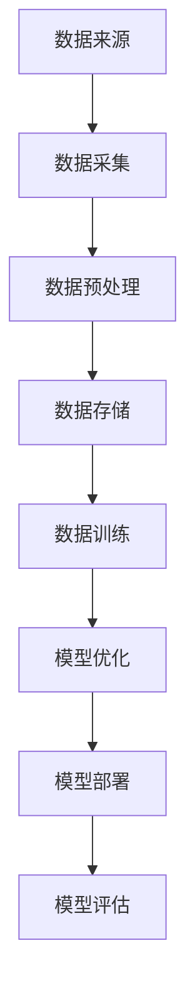

**2.1.2 深度学习与神经网络**

深度学习是AI 2.0的核心技术之一，它通过多层神经网络对数据进行处理和分析。深度学习模型能够自动提取数据中的特征，并利用这些特征进行预测和分类。

**核心概念与联系：**

- **神经网络**：由多个神经元组成的网络，通过前向传播和反向传播进行学习。
- **深度学习模型**：由多个隐藏层组成的神经网络，可以处理复杂的非线性问题。
- **特征提取**：通过多层网络，自动提取数据中的高级特征。

**Mermaid 流程图：**

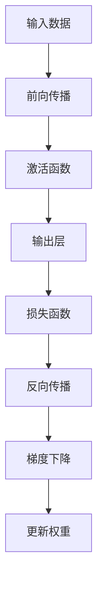

**2.1.3 强化学习与进化算法**

强化学习是AI 2.0的另一项核心技术，它通过试错和反馈机制，使模型能够在动态环境中进行自我优化。进化算法则通过模拟生物进化的过程，不断优化模型的性能。

**核心概念与联系：**

- **强化学习**：通过奖励机制，使模型在动态环境中进行学习，不断优化策略。
- **进化算法**：通过遗传操作和适应度评估，模拟生物进化过程，优化模型。

**Mermaid 流程图：**

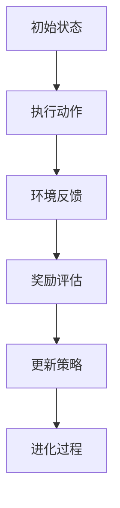

**2.1.4 自然语言处理**

自然语言处理（NLP）是AI 2.0实现人机交互的关键技术。它通过文本挖掘、语义理解、语言生成等技术，使计算机能够理解和生成自然语言。

**核心概念与联系：**

- **文本挖掘**：从非结构化文本中提取信息。
- **语义理解**：理解文本中的语义和意图。
- **语言生成**：生成自然语言文本。

**Mermaid 流程图：**

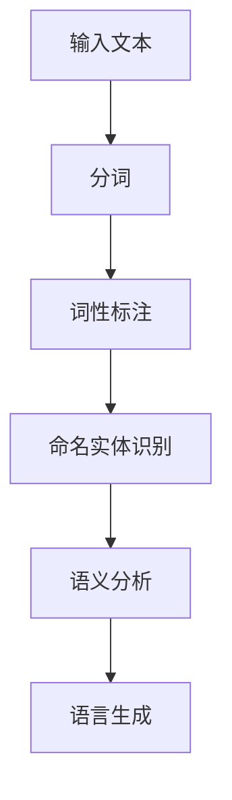

**2.1.5 知识图谱与语义理解**

知识图谱是一种结构化数据模型，它通过实体和关系来组织信息，为AI 2.0提供了一种高效的知识表示和推理方式。语义理解则通过理解文本中的语义和意图，使AI 2.0能够更准确地处理自然语言。

**核心概念与联系：**

- **知识图谱**：实体和关系的结构化表示。
- **语义理解**：理解文本中的语义和意图。

**Mermaid 流程图：**

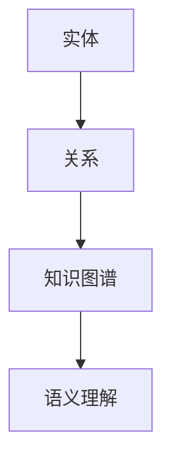

在下一节中，我们将进一步探讨AI 2.0的创新点和未来发展趋势。敬请期待！

---

#### 2.2 AI 2.0 技术创新点

**2.2.1 更高效的数据处理**

AI 2.0在数据处理方面实现了显著的提升。首先，分布式计算和并行处理技术的应用，使得AI 2.0能够同时处理大量数据，提高了数据处理的速度和效率。其次，AI 2.0引入了更先进的算法，如深度学习和强化学习，使得数据处理和分析更加精准和高效。

**核心算法原理讲解：**

**分布式计算：** 分布式计算通过将计算任务分解为多个子任务，分配到多个计算节点上进行处理。每个节点独立执行计算，然后将结果汇总，实现整体任务的完成。

**伪代码：**
```python
function distributed_computation(data):
    # 初始化计算节点
    initialize_nodes()

    # 分解任务
    sub_tasks = split_data(data, num_nodes)

    # 分发任务到计算节点
    for node, task in zip(nodes, sub_tasks):
        node.execute(task)

    # 汇总结果
    result = merge_results(nodes)

    return result
```

**并行处理：** 并行处理通过多个处理器同时执行多个任务，提高了系统的处理能力。

**伪代码：**
```python
function parallel_computation(data):
    # 初始化处理器
    initialize_processors()

    # 分解任务
    sub_tasks = split_data(data, num_processors)

    # 并行执行任务
    for processor, task in zip(processors, sub_tasks):
        processor.execute(task)

    # 汇总结果
    result = merge_results(processors)

    return result
```

**2.2.2 更智能的学习算法**

AI 2.0引入了更智能的学习算法，如深度学习和强化学习，使得模型能够更好地适应复杂环境和动态变化。

**深度学习：** 深度学习通过多层神经网络对数据进行处理，能够自动提取数据中的高级特征，并利用这些特征进行预测和分类。

**伪代码：**
```python
class NeuralNetwork:
    def __init__(self, layers):
        self.layers = layers

    def forward(self, inputs):
        for layer in self.layers:
            inputs = layer.forward(inputs)
        return inputs

    def backward(self, gradients):
        for layer in reversed(self.layers):
            gradients = layer.backward(gradients)
        return gradients

    def train(self, data, labels):
        for epoch in range(num_epochs):
            for input, label in zip(data, labels):
                output = self.forward(input)
                gradients = self.backward(output - label)
                self.update_weights(gradients)
```

**强化学习：** 强化学习通过试错和反馈机制，使模型能够在动态环境中进行自我优化。

**伪代码：**
```python
class QLearningAgent:
    def __init__(self, state_space, action_space, learning_rate, discount_factor):
        self.state_space = state_space
        self.action_space = action_space
        self.learning_rate = learning_rate
        self.discount_factor = discount_factor
        self.q_values = initialize_q_values(state_space, action_space)

    def choose_action(self, state):
        return select_action(self.q_values[state])

    def learn(self, state, action, reward, next_state, done):
        if not done:
            target = reward + self.discount_factor * max(self.q_values[next_state])
        else:
            target = reward

        old_value = self.q_values[state][action]
        new_value = (1 - self.learning_rate) * old_value + self.learning_rate * target
        self.q_values[state][action] = new_value
```

**2.2.3 更强大的推理能力**

AI 2.0通过知识图谱和语义理解技术，实现了更强的推理能力。知识图谱将实体和关系进行结构化表示，使计算机能够更高效地进行知识推理。语义理解则使计算机能够理解自然语言，进行语义分析和推理。

**知识图谱：**
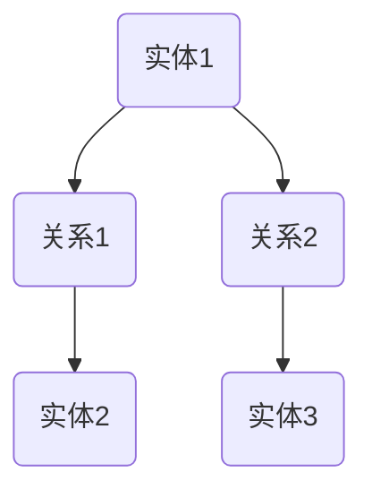

**语义理解：**
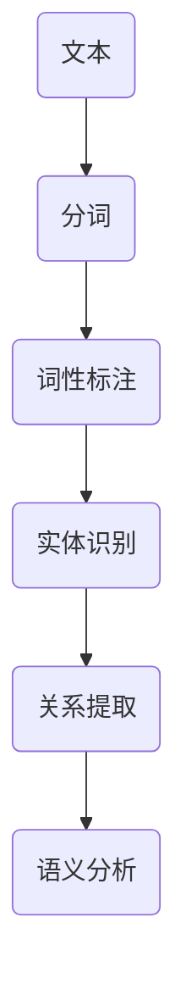

**2.2.4 更安全的数据保护**

AI 2.0在数据保护方面也进行了技术创新，引入了多种安全措施，如加密、身份验证和访问控制，确保数据在采集、存储、传输和处理过程中的安全性。

**加密：** 数据加密通过对数据进行编码，使其在传输和存储过程中难以被未授权访问。

**伪代码：**
```python
function encrypt(data, key):
    # 初始化加密算法
    cipher = initialize_cipher(key)

    # 加密数据
    encrypted_data = cipher.encrypt(data)

    return encrypted_data
```

**身份验证：** 身份验证通过验证用户身份，确保只有授权用户可以访问敏感数据。

**伪代码：**
```python
function authenticate(user, password):
    # 验证用户身份
    if verify_user(user, password):
        return True
    else:
        return False
```

**访问控制：** 访问控制通过对用户权限进行管理，确保用户只能访问其授权的数据。

**伪代码：**
```python
function access_control(user, resource):
    # 检查用户权限
    if has_permission(user, resource):
        return True
    else:
        return False
```

在下一节中，我们将探讨AI 2.0的发展趋势和未来展望。敬请期待！

---

#### 2.3 AI 2.0 的发展趋势

**2.3.1 更强的自主学习能力**

AI 2.0将继续加强自主学习能力，通过深度学习、强化学习等先进算法，实现更高级的自主决策和优化。这将使得AI 2.0能够在复杂和动态的环境中，自主学习和适应，提高系统的稳定性和可靠性。

**2.3.2 更广泛的应用领域**

随着AI 2.0技术的不断发展，它将在更多领域得到应用。例如，在医疗领域，AI 2.0将进一步提升医疗诊断和治疗的精确度；在教育领域，AI 2.0将实现个性化教育和智能评价；在金融领域，AI 2.0将提高风险管理能力和金融服务效率。

**2.3.3 更深入的跨界融合**

AI 2.0将与物联网、云计算、大数据等新兴技术深度融合，实现更智能的解决方案。例如，通过物联网与AI 2.0的结合，实现智能家居、智能城市等；通过云计算与AI 2.0的结合，实现大规模数据处理和分析；通过大数据与AI 2.0的结合，实现精准营销和个性化推荐。

**2.3.4 更强的伦理与合规性**

随着AI 2.0的发展，伦理和法律问题将受到更多关注。AI 2.0将更加注重伦理和合规性，确保其在复杂环境中保持道德和伦理标准。这将包括制定AI 2.0伦理标准、完善相关法律法规，以及建立AI 2.0责任追究机制等。

**2.3.5 更高效的人才培养**

AI 2.0的发展对人才需求提出了新的要求。未来，将需要更多具备跨学科知识和技能的人才，以应对AI 2.0带来的挑战。因此，教育和培训体系也将进行相应调整，加强AI 2.0相关课程和技能培训，培养更多AI 2.0专业人才。

**2.3.6 更广泛的社会参与**

AI 2.0的发展将推动社会各界积极参与，包括政府、企业、学术界和公众等。政府将制定相关政策，推动AI 2.0的发展和应用；企业将投资研发和推广AI 2.0技术；学术界将进行前沿研究和创新；公众将了解AI 2.0的原理和应用，提高对AI 2.0的认识和接受度。

在下一节中，我们将探讨AI 2.0在不同领域中的应用案例，分析其在实际中的效果和影响。敬请期待！

---

#### 第3章：AI 2.0 在医疗领域的应用

AI 2.0在医疗领域的应用已经取得了显著成果，它通过深度学习、图像识别和自然语言处理等技术，为医疗诊断、药物研发和公共卫生管理提供了有力支持。

**3.1 AI 2.0 在医疗诊断中的应用**

AI 2.0在医疗诊断中的应用主要体现在影像诊断和疾病预测两个方面。

**3.1.1 影像诊断**

影像诊断是AI 2.0在医疗领域的重要应用之一。通过深度学习和图像识别技术，AI 2.0可以分析X光片、CT扫描和MRI等影像数据，帮助医生进行疾病诊断。例如，AI 2.0可以识别早期肺癌、乳腺癌和糖尿病等疾病，提高诊断的准确性和速度。

**核心算法原理讲解：**

深度学习是AI 2.0在影像诊断中应用的核心技术。通过卷积神经网络（CNN）等深度学习模型，AI 2.0可以自动提取影像中的特征，并利用这些特征进行分类和预测。

**伪代码：**
```python
class ConvolutionalNeuralNetwork:
    def __init__(self, layers):
        self.layers = layers

    def forward(self, inputs):
        for layer in self.layers:
            inputs = layer.forward(inputs)
        return inputs

    def backward(self, gradients):
        for layer in reversed(self.layers):
            gradients = layer.backward(gradients)
        return gradients

    def train(self, data, labels):
        for epoch in range(num_epochs):
            for input, label in zip(data, labels):
                output = self.forward(input)
                gradients = self.backward(output - label)
                self.update_weights(gradients)
```

**3.1.2 疾病预测**

AI 2.0还可以通过分析患者的病史、基因数据和生活方式等信息，预测某些疾病的发病风险。例如，AI 2.0可以预测心脏病、糖尿病和癌症等慢性疾病的发病风险，帮助医生和患者提前采取措施，降低疾病发生的可能性。

**核心算法原理讲解：**

机器学习是AI 2.0在疾病预测中的核心技术。通过回归分析和分类算法，AI 2.0可以分析患者的数据，建立疾病预测模型。

**伪代码：**
```python
class DiseasePredictionModel:
    def __init__(self, algorithm):
        self.algorithm = algorithm

    def train(self, data, labels):
        self.algorithm.fit(data, labels)

    def predict(self, data):
        return self.algorithm.predict(data)
```

**3.2 AI 2.0 在药物研发中的应用**

AI 2.0在药物研发中的应用主要体现在药物筛选和药效预测两个方面。

**3.2.1 药物筛选**

AI 2.0可以通过分析大量的生物学数据和药物化学结构，筛选出具有潜力的药物候选。例如，AI 2.0可以分析蛋白质结构、基因表达数据和药物反应数据，发现新的药物靶点，加速药物研发进程。

**核心算法原理讲解：**

深度学习和生成对抗网络（GAN）是AI 2.0在药物筛选中的核心技术。深度学习可以用于药物分子的特征提取和分类，GAN可以生成新的药物分子结构。

**伪代码：**
```python
class DrugScreeningModel:
    def __init__(self, generator, discriminator):
        self.generator = generator
        self.discriminator = discriminator

    def train(self, data, labels):
        for epoch in range(num_epochs):
            for batch in data:
                self.generator.train(batch)
                self.discriminator.train(batch)

    def generate_drugs(self):
        return self.generator.generate()
```

**3.2.2 药效预测**

AI 2.0可以通过分析药物的分子结构和生物机制，预测药物的治疗效果和副作用。例如，AI 2.0可以分析药物的分子结构，预测其与生物靶点的相互作用，从而预测药物的治疗效果。

**核心算法原理讲解：**

图神经网络（Graph Neural Network，GNN）是AI 2.0在药效预测中的核心技术。GNN可以用于药物分子和生物靶点的特征提取和交互预测。

**伪代码：**
```python
class DrugEfficacyPredictionModel:
    def __init__(self, gnn):
        self.gnn = gnn

    def train(self, data, labels):
        self.gnn.fit(data, labels)

    def predict(self, data):
        return self.gnn.predict(data)
```

**3.3 AI 2.0 在公共卫生管理中的应用**

AI 2.0在公共卫生管理中的应用有助于提高公共健康的整体水平。通过大数据分析和人工智能算法，AI 2.0可以预测疾病爆发趋势，制定科学的防控措施。

**3.3.1 疾病爆发预测**

AI 2.0可以通过分析历史疾病数据、气象数据和社会经济数据等，预测某些疾病的爆发趋势。例如，AI 2.0可以预测流感疫情的爆发，帮助卫生部门提前采取防控措施，减少疫情传播。

**核心算法原理讲解：**

时间序列分析和机器学习是AI 2.0在疾病爆发预测中的核心技术。时间序列分析可以用于疾病数据的趋势分析，机器学习可以用于疾病爆发预测模型的建立。

**伪代码：**
```python
class DiseaseOutbreakPredictionModel:
    def __init__(self, algorithm):
        self.algorithm = algorithm

    def train(self, data, labels):
        self.algorithm.fit(data, labels)

    def predict(self, data):
        return self.algorithm.predict(data)
```

**3.3.2 公共卫生管理**

AI 2.0还可以用于公共卫生管理的各个方面，如疾病监测、疫苗接种和健康数据分析等。通过AI 2.0技术，公共卫生部门可以更加精准地管理公共卫生资源，提高公共卫生服务的效率和质量。

**核心算法原理讲解：**

优化算法和机器学习是AI 2.0在公共卫生管理中的核心技术。优化算法可以用于公共卫生资源的最优配置，机器学习可以用于公共卫生数据的分析和预测。

**伪代码：**
```python
class PublicHealthManagementModel:
    def __init__(self, optimizer, algorithm):
        self.optimizer = optimizer
        self.algorithm = algorithm

    def train(self, data, labels):
        self.optimizer.fit(data, labels)

    def manage_health(self, data):
        return self.algorithm.predict(data)
```

在下一节中，我们将探讨AI 2.0在教育领域的应用，分析其在个性化教育、教育评价和教育研究方面的作用。敬请期待！

---

#### 第4章：AI 2.0 在教育领域的应用

AI 2.0在教育领域的应用正在迅速发展，它通过深度学习、自然语言处理和大数据分析等技术，为个性化教育、教育评价和教育研究提供了新的解决方案。

**4.1 AI 2.0 在个性化教育中的应用**

个性化教育是指根据每个学生的特点和学习需求，提供个性化的教学方案和学习资源。AI 2.0通过分析学生的学习数据，可以为学生提供个性化的学习方案，提高学习效果。

**4.1.1 个性化学习路径**

AI 2.0可以根据学生的学习历史、兴趣和能力，生成个性化的学习路径。通过深度学习和自然语言处理技术，AI 2.0可以分析学生的学习行为和成绩数据，识别学生的学习需求和难点，为每个学生制定合适的学习计划。

**核心算法原理讲解：**

深度学习和协同过滤是AI 2.0在个性化学习路径中的核心技术。深度学习可以用于学生数据的学习和行为分析，协同过滤可以用于推荐合适的学习资源。

**伪代码：**
```python
class PersonalizedLearningModel:
    def __init__(self, deep_learning_model, collaborative_filtering):
        self.deep_learning_model = deep_learning_model
        self.collaborative_filtering = collaborative_filtering

    def analyze_student_data(self, student_data):
        return self.deep_learning_model.analyze(student_data)

    def recommend_learning_resources(self, student_data):
        return self.collaborative_filtering.recommend(student_data)
```

**4.1.2 个性化学习资源**

AI 2.0可以通过分析学生的学习行为和兴趣，推荐个性化的学习资源，如视频教程、电子书籍和练习题等。这些资源可以根据学生的学习进度和需求进行动态调整，提高学习效率。

**核心算法原理讲解：**

协同过滤和内容推荐是AI 2.0在个性化学习资源中的核心技术。协同过滤可以用于推荐相似的学习资源，内容推荐可以用于推荐符合学生学习需求的学习资源。

**伪代码：**
```python
class PersonalizedLearningResourceModel:
    def __init__(self, collaborative_filtering, content_recommender):
        self.collaborative_filtering = collaborative_filtering
        self.content_recommender = content_recommender

    def recommend_resources(self, student_data):
        similar_resources = self.collaborative_filtering.recommend(student_data)
        relevant_resources = self.content_recommender.recommend(student_data)
        return similar_resources + relevant_resources
```

**4.2 AI 2.0 在教育评价中的应用**

AI 2.0在教育评价中的应用可以帮助教师和学生更好地了解学习效果，为教学和学习的改进提供依据。

**4.2.1 学生成绩分析**

AI 2.0可以通过分析学生的考试成绩和学习行为，生成多维度的成绩分析报告。这些报告可以揭示学生的学习强项和弱项，帮助教师制定更有针对性的教学策略。

**核心算法原理讲解：**

回归分析和聚类分析是AI 2.0在学生成绩分析中的核心技术。回归分析可以用于预测学生成绩，聚类分析可以用于分析学生的学习模式。

**伪代码：**
```python
class StudentPerformanceAnalysisModel:
    def __init__(self, regression_model, clustering_model):
        self.regression_model = regression_model
        self.clustering_model = clustering_model

    def analyze_student_performance(self, student_data):
        predicted_scores = self.regression_model.predict(student_data)
        learning_patterns = self.clustering_model.cluster(student_data)
        return predicted_scores, learning_patterns
```

**4.2.2 教学评价**

AI 2.0可以通过分析教学数据，评估教学效果，为教师的教学改进提供依据。例如，AI 2.0可以分析课堂互动、学生参与度、教学资源使用等情况，评估教学的有效性。

**核心算法原理讲解：**

优化算法和机器学习是AI 2.0在教学评价中的核心技术。优化算法可以用于评估教学效果的指标设计，机器学习可以用于教学效果的数据分析。

**伪代码：**
```python
class TeachingEvaluationModel:
    def __init__(self, optimization_algorithm, machine_learning_model):
        self.optimization_algorithm = optimization_algorithm
        self.machine_learning_model = machine_learning_model

    def evaluate_teaching_effectiveness(self, teaching_data):
        evaluation_metrics = self.optimization_algorithm.optimize(teaching_data)
        evaluation_results = self.machine_learning_model.analyze(evaluation_metrics)
        return evaluation_results
```

**4.3 AI 2.0 在教育研究中的应用**

AI 2.0在教育研究中的应用可以帮助研究者更好地理解教育现象，发现教育规律。

**4.3.1 教育数据分析**

AI 2.0可以通过分析大量的教育数据，识别教育现象的规律和趋势。例如，AI 2.0可以分析学生的学习行为、考试成绩、教学资源使用等情况，发现影响学生学习效果的关键因素。

**核心算法原理讲解：**

数据挖掘和机器学习是AI 2.0在教育数据分析中的核心技术。数据挖掘可以用于发现数据中的模式，机器学习可以用于预测和分析教育现象。

**伪代码：**
```python
class EducationalDataAnalysisModel:
    def __init__(self, data_mining_algorithm, machine_learning_model):
        self.data_mining_algorithm = data_mining_algorithm
        self.machine_learning_model = machine_learning_model

    def analyze_educational_data(self, educational_data):
        data_patterns = self.data_mining_algorithm.discover_patterns(educational_data)
        analysis_results = self.machine_learning_model.analyze(data_patterns)
        return analysis_results
```

**4.3.2 教育改革建议**

AI 2.0可以通过分析教育数据和研究成果，为教育改革提供科学依据。例如，AI 2.0可以分析教育政策的效果，提出优化教育政策的建议，推动教育改革。

**核心算法原理讲解：**

优化算法和机器学习是AI 2.0在教育改革建议中的核心技术。优化算法可以用于政策效果评估，机器学习可以用于提出改革建议。

**伪代码：**
```python
class EducationalReformSuggestionModel:
    def __init__(self, optimization_algorithm, machine_learning_model):
        self.optimization_algorithm = optimization_algorithm
        self.machine_learning_model = machine_learning_model

    def suggest_reforms(self, educational_data, policy_data):
        evaluation_metrics = self.optimization_algorithm.optimize(policy_data)
        reform_suggestions = self.machine_learning_model.suggest(evaluation_metrics)
        return reform_suggestions
```

在下一节中，我们将探讨AI 2.0在金融领域的应用，分析其在风险管理、信用评估和金融服务方面的作用。敬请期待！

---

#### 第5章：AI 2.0 在金融领域的应用

AI 2.0在金融领域的应用已经取得了显著成果，它通过大数据分析、深度学习和自然语言处理等技术，为风险管理、信用评估和金融服务提供了新的解决方案。

**5.1 AI 2.0 在风险管理中的应用**

AI 2.0在风险管理中的应用可以帮助金融机构更准确地识别和评估风险，从而制定更有效的风险管理策略。

**5.1.1 风险评估**

AI 2.0可以通过分析大量的历史数据和实时数据，对金融产品、投资组合和市场风险进行评估。例如，AI 2.0可以分析市场波动、资金流动和信用评级等信息，预测市场的潜在风险，帮助金融机构制定风险控制策略。

**核心算法原理讲解：**

时间序列分析和机器学习是AI 2.0在风险评估中的核心技术。时间序列分析可以用于市场趋势分析，机器学习可以用于风险评估模型的建立。

**伪代码：**
```python
class RiskAssessmentModel:
    def __init__(self, time_series_analyzer, machine_learning_model):
        self.time_series_analyzer = time_series_analyzer
        self.machine_learning_model = machine_learning_model

    def analyze_risk(self, data):
        trend_analysis = self.time_series_analyzer.analyze(data)
        risk_estimation = self.machine_learning_model.predict(trend_analysis)
        return risk_estimation
```

**5.1.2 风险预警**

AI 2.0可以通过实时监测金融市场的数据，及时发现潜在的风险，并发出预警信号。例如，AI 2.0可以分析交易数据、社交媒体信息和新闻报道等，预测市场异常波动，帮助金融机构及时采取应对措施。

**核心算法原理讲解：**

实时数据分析和机器学习是AI 2.0在风险预警中的核心技术。实时数据分析可以用于监测市场动态，机器学习可以用于风险预测。

**伪代码：**
```python
class RiskAlertModel:
    def __init__(self, real_time_data_analyzer, machine_learning_model):
        self.real_time_data_analyzer = real_time_data_analyzer
        self.machine_learning_model = machine_learning_model

    def monitor_risk(self, data_stream):
        real_time_analysis = self.real_time_data_analyzer.analyze(data_stream)
        risk Alerts = self.machine_learning_model.predict(real_time_analysis)
        return risk_alerts
```

**5.2 AI 2.0 在信用评估中的应用**

AI 2.0在信用评估中的应用可以帮助金融机构更准确地评估借款人的信用风险，从而制定更有效的信用政策。

**5.2.1 信用评分**

AI 2.0可以通过分析借款人的个人信息、信用历史、交易行为等数据，生成个性化的信用评分。例如，AI 2.0可以分析借款人的还款记录、信用查询次数、社会关系等信息，预测借款人的信用风险。

**核心算法原理讲解：**

回归分析和机器学习是AI 2.0在信用评分中的核心技术。回归分析可以用于信用评分模型的建立，机器学习可以用于信用评分的预测。

**伪代码：**
```python
class CreditRatingModel:
    def __init__(self, regression_model, machine_learning_model):
        self.regression_model = regression_model
        self.machine_learning_model = machine_learning_model

    def calculate_credit_score(self, borrower_data):
        regression_score = self.regression_model.predict(borrower_data)
        machine_learning_score = self.machine_learning_model.predict(borrower_data)
        credit_score = (regression_score + machine_learning_score) / 2
        return credit_score
```

**5.2.2 信用评级**

AI 2.0可以通过分析借款人的信用评分和其他相关信息，对借款人进行信用评级。例如，AI 2.0可以分析借款人的信用评分、收入水平、职业稳定性等信息，预测借款人的信用风险等级。

**核心算法原理讲解：**

分类分析和机器学习是AI 2.0在信用评级中的核心技术。分类分析可以用于信用评级模型的建立，机器学习可以用于信用评级的预测。

**伪代码：**
```python
class CreditRatingModel:
    def __init__(self, classification_model, machine_learning_model):
        self.classification_model = classification_model
        self.machine_learning_model = machine_learning_model

    def calculate_credit_rating(self, borrower_data):
        classification_rating = self.classification_model.predict(borrower_data)
        machine_learning_rating = self.machine_learning_model.predict(borrower_data)
        credit_rating = (classification_rating + machine_learning_rating) / 2
        return credit_rating
```

**5.3 AI 2.0 在金融服务中的应用**

AI 2.0在金融服务中的应用可以帮助金融机构提高服务效率和客户体验，满足不同客户的需求。

**5.3.1 个性化金融服务**

AI 2.0可以通过分析客户的数据和行为，提供个性化的金融服务。例如，AI 2.0可以分析客户的财务状况、投资偏好和风险承受能力，为客户提供定制化的投资建议和理财产品。

**核心算法原理讲解：**

协同过滤和个性化推荐是AI 2.0在个性化金融服务中的核心技术。协同过滤可以用于推荐相似的产品和服务，个性化推荐可以用于推荐符合客户需求的产品和服务。

**伪代码：**
```python
class PersonalizedFinancialServiceModel:
    def __init__(self, collaborative_filtering, content_recommender):
        self.collaborative_filtering = collaborative_filtering
        self.content_recommender = content_recommender

    def recommend_services(self, customer_data):
        similar_services = self.collaborative_filtering.recommend(customer_data)
        relevant_services = self.content_recommender.recommend(customer_data)
        return similar_services + relevant_services
```

**5.3.2 智能客服**

AI 2.0可以通过自然语言处理和对话系统技术，提供智能化的客户服务。例如，AI 2.0可以理解客户的提问，提供准确的答案和建议，降低人工客服的工作负担，提高客户满意度。

**核心算法原理讲解：**

自然语言处理和对话系统是AI 2.0在智能客服中的核心技术。自然语言处理可以用于理解客户的语言，对话系统可以用于生成回答。

**伪代码：**
```python
class IntelligentCustomerServiceModel:
    def __init__(self, natural_language_processor, dialogue_system):
        self.natural_language_processor = natural_language_processor
        self.dialogue_system = dialogue_system

    def handle_query(self, query):
        intent = self.natural_language_processor.analyze_intent(query)
        response = self.dialogue_system.generate_response(intent)
        return response
```

在下一节中，我们将探讨AI 2.0面临的挑战与伦理问题，分析其在数据隐私、可控性和伦理道德方面的挑战。敬请期待！

---

#### 第6章：AI 2.0 的挑战

**6.1 数据隐私与安全问题**

随着AI 2.0技术的快速发展，数据隐私与安全问题日益突出。AI 2.0需要处理大量的个人数据，包括生物特征、行为数据、财务信息等，这些数据一旦泄露，将对个人隐私和财产安全造成严重威胁。

**6.1.1 数据泄露风险**

AI 2.0系统在数据采集、存储、传输和处理过程中，可能存在数据泄露风险。例如，黑客攻击、恶意软件和内部人员滥用等，都可能导致敏感数据泄露。

**解决方法：**

- **加密技术**：对敏感数据进行加密，确保数据在传输和存储过程中难以被未授权访问。
- **安全协议**：采用安全协议，如HTTPS、SSL/TLS等，保护数据在传输过程中的安全。
- **权限管理**：实施严格的权限管理，确保只有授权人员才能访问敏感数据。

**6.1.2 隐私侵犯问题**

AI 2.0在处理个人数据时，可能会无意中侵犯个人隐私。例如，人脸识别技术可能会被用于监控个人行为，智能音箱可能会记录用户对话等。

**解决方法：**

- **隐私保护法规**：制定隐私保护法规，明确数据收集、存储和处理过程中的隐私保护要求。
- **数据匿名化**：对敏感数据进行匿名化处理，确保个人身份信息无法被识别。
- **透明度和可解释性**：提高AI 2.0系统的透明度和可解释性，让用户了解其隐私数据如何被使用。

**6.2 AI 2.0 的可控性问题**

AI 2.0系统的自主学习能力和复杂决策能力使其具有巨大的潜力，但也带来了可控性问题。如何确保AI 2.0系统在复杂环境中保持稳定、公正和可解释，是一个重大挑战。

**6.2.1 算法偏见**

AI 2.0系统在处理数据时可能存在偏见，导致不公平的决策。例如，招聘系统可能会因数据偏见而歧视某些种族或性别。

**解决方法：**

- **公平性评估**：对AI 2.0系统的算法进行公平性评估，识别和消除潜在的偏见。
- **多样性数据集**：使用多样化的数据集进行训练，避免算法偏见。
- **透明性和可解释性**：提高AI 2.0系统的透明度和可解释性，让用户了解其决策过程。

**6.2.2 不可预测性**

AI 2.0系统的行为可能难以预测，特别是在动态和复杂的环境中，如何确保其行为符合人类价值观和道德标准，是一个重要问题。

**解决方法：**

- **安全性和可靠性评估**：对AI 2.0系统的安全性和可靠性进行评估，确保其在各种情况下都能保持稳定和可靠。
- **合规性和伦理审查**：制定AI 2.0系统的合规性和伦理标准，确保其发展符合社会价值观和道德标准。
- **连续监控和调整**：对AI 2.0系统进行连续监控和调整，及时发现和纠正问题。

**6.3 AI 2.0 的人才需求**

AI 2.0技术的发展对人才需求提出了新的要求。不仅需要具备人工智能知识和技能的专业人才，还需要跨学科、多领域的复合型人才，以应对AI 2.0带来的挑战。

**6.3.1 技术人才短缺**

目前，全球范围内人工智能专业人才供应不足，特别是高端技术人才短缺，这限制了AI 2.0的发展。

**解决方法：**

- **教育培训**：加强人工智能相关课程和培训，培养更多AI 2.0专业人才。
- **校企合作**：推动高校与企业合作，建立产学研一体的人才培养模式。
- **国际化人才引进**：吸引国际顶尖人工智能人才，提高国内AI 2.0技术水平。

**6.3.2 跨学科人才需求**

AI 2.0的发展需要跨学科的知识和技能，如计算机科学、心理学、社会学、伦理学等领域的知识。

**解决方法：**

- **跨学科课程设置**：在高校中设置跨学科课程，培养学生跨学科的知识体系。
- **综合实践项目**：推动跨学科实践项目，让学生在真实场景中应用跨学科知识。
- **职业培训**：开展针对在职人员的跨学科培训，提升其跨学科能力。

通过解决上述挑战，AI 2.0将能够更好地服务于社会，为人类创造更多价值。在下一节中，我们将探讨AI 2.0的伦理问题，分析其在就业、伦理道德和法律监管方面的挑战。敬请期待！

---

#### 第7章：AI 2.0 的伦理问题

**7.1 AI 2.0 与就业问题**

随着AI 2.0技术的发展，它将对就业市场产生深远影响。一方面，AI 2.0将提高生产效率，创造新的就业机会；另一方面，它也将导致部分工作岗位的消失，引发就业危机。

**7.1.1 自动化替代人工**

AI 2.0在制造业、服务业等领域的应用将替代大量人力工作，导致失业率上升。例如，智能工厂将取代传统生产线，智能客服将取代人工客服等。

**解决方法：**

- **教育培训**：加强对劳动者的技能培训，提升其适应AI 2.0时代的能力。
- **就业转型**：鼓励劳动者转向新兴行业和领域，如AI 2.0研发、数据分析等。
- **政策支持**：政府应制定相关政策，鼓励企业投资AI 2.0技术，同时保障劳动者的就业权益。

**7.1.2 技能要求提升**

为了适应AI 2.0时代，劳动者需要不断学习和更新技能，这对教育和培训提出了更高要求。例如，劳动者需要掌握编程、数据分析、机器学习等技能，以适应新兴岗位的需求。

**解决方法：**

- **教育改革**：推动教育改革，加强职业教育和继续教育，提高劳动者的综合素质。
- **终身学习**：鼓励劳动者树立终身学习的理念，不断提升自身技能。
- **校企合作**：推动高校与企业合作，提供实践机会和就业指导，帮助劳动者顺利转型。

**7.2 AI 2.0 与伦理道德**

AI 2.0的发展引发了诸多伦理道德问题，如算法偏见、隐私侵犯、数据滥用等。如何确保AI 2.0系统在复杂环境中保持道德和伦理标准，是一个重要课题。

**7.2.1 算法偏见**

AI 2.0系统在处理数据时可能存在偏见，如性别、种族等方面的偏见，导致不公平的决策。例如，招聘系统可能会因数据偏见而歧视某些性别或种族。

**解决方法：**

- **公平性评估**：对AI 2.0系统的算法进行公平性评估，识别和消除潜在的偏见。
- **多样性数据集**：使用多样化的数据集进行训练，避免算法偏见。
- **透明性和可解释性**：提高AI 2.0系统的透明度和可解释性，让用户了解其决策过程。

**7.2.2 隐私侵犯**

AI 2.0在处理个人数据时，可能会无意中侵犯个人隐私。例如，人脸识别技术可能会被用于监控个人行为，智能音箱可能会记录用户对话等。

**解决方法：**

- **隐私保护法规**：制定隐私保护法规，明确数据收集、存储和处理过程中的隐私保护要求。
- **数据匿名化**：对敏感数据进行匿名化处理，确保个人身份信息无法被识别。
- **透明度和可解释性**：提高AI 2.0系统的透明度和可解释性，让用户了解其隐私数据如何被使用。

**7.2.3 数据滥用**

AI 2.0系统可能会滥用数据，如数据泄露、数据滥用等。这不仅损害个人权益，还可能对社会秩序和公共利益造成威胁。

**解决方法：**

- **数据安全管理**：加强对数据的安全管理，防止数据泄露和滥用。
- **数据审计**：定期对数据使用情况进行审计，确保数据使用的合法性和合规性。
- **用户知情权**：保障用户的知情权，让用户了解其数据如何被使用。

**7.3 AI 2.0 与法律监管**

AI 2.0的发展对现有法律体系提出了挑战。如何制定和完善相关法律法规，确保AI 2.0系统的合规性和安全性，是一个重要课题。

**7.3.1 数据保护法规**

随着AI 2.0技术的应用，数据保护法规需要不断更新和完善，以保护个人隐私和数据安全。

**解决方法：**

- **立法完善**：制定和完善数据保护法律法规，明确数据收集、存储、处理和共享过程中的法律规范。
- **执法监督**：加强对数据保护法律法规的执法监督，确保法律实施的严肃性和权威性。

**7.3.2 责任追究机制**

在AI 2.0导致的意外事件中，如何确定责任主体和追究责任，是一个法律难题。

**解决方法：**

- **明确责任主体**：明确AI 2.0系统的开发者、运营者和使用者等责任主体的法律责任。
- **责任追究机制**：建立责任追究机制，确保在AI 2.0导致的意外事件中，责任主体能够承担相应的法律责任。

通过解决上述伦理问题，AI 2.0将能够更好地服务于社会，为人类创造更多价值。在下一节中，我们将展望AI 2.0时代的未来，分析其发展方向和潜在影响。敬请期待！

---

#### 第8章：AI 2.0 的发展方向

**8.1 更强大的自主学习能力**

AI 2.0将继续增强自主学习能力，实现更高级的自主决策和优化。通过深度学习和强化学习等先进算法，AI 2.0将能够处理更复杂的问题，解决更复杂的任务。

**8.2 更广泛的应用领域**

AI 2.0将渗透到更多的领域，实现更广泛的社会价值。从医疗、教育、金融到制造业、能源、交通等，AI 2.0的应用将无处不在，推动各个领域的创新和变革。

**8.3 更深入的跨界融合**

AI 2.0将与物联网、云计算、大数据等新兴技术深度融合，实现更智能的解决方案。跨领域的协作将推动AI 2.0的发展，创造更多创新应用。

**8.4 更强的伦理与合规性**

随着AI 2.0的发展，伦理和法律问题将受到更多关注。AI 2.0将更加注重伦理和合规性，确保其在复杂环境中保持道德和伦理标准。

**8.5 更高效的人才培养**

AI 2.0的发展对人才需求提出了新的要求。未来，将需要更多具备跨学科知识和技能的人才，以应对AI 2.0带来的挑战。因此，教育和培训体系也将进行相应调整，加强AI 2.0相关课程和技能培训，培养更多AI 2.0专业人才。

**8.6 更广泛的社会参与**

AI 2.0的发展将推动社会各界积极参与，包括政府、企业、学术界和公众等。政府将制定相关政策，推动AI 2.0的发展和应用；企业将投资研发和推广AI 2.0技术；学术界将进行前沿研究和创新；公众将了解AI 2.0的原理和应用，提高对AI 2.0的认识和接受度。

在下一节中，我们将总结本文的主要内容，并展望AI 2.0时代的未来。敬请期待！

---

### 总结与展望

本文详细探讨了AI 2.0时代的核心特点、技术架构、应用领域以及面临的挑战与伦理问题。通过李开复先生的观点，我们深入了解了AI 2.0的定义与特点，技术架构的创新点，以及在医疗、教育、金融等领域的广泛应用。同时，我们也分析了AI 2.0在数据隐私、可控性、就业、伦理道德等方面的挑战，并提出了相应的解决方法。

**主要结论：**

1. AI 2.0是人工智能的下一个重要阶段，具有更强的自主学习能力、更广泛的应用领域和更高效的资源利用。
2. AI 2.0在医疗、教育、金融等领域的应用取得了显著成果，为人类创造了巨大价值。
3. AI 2.0面临数据隐私、可控性、就业、伦理道德等方面的挑战，需要全社会共同努力解决。

**未来展望：**

1. AI 2.0将继续增强自主学习能力，实现更高级的自主决策和优化。
2. AI 2.0将在更多领域得到应用，推动社会各领域的创新和变革。
3. AI 2.0将与物联网、云计算、大数据等新兴技术深度融合，实现更智能的解决方案。
4. AI 2.0将更加注重伦理和合规性，确保其在复杂环境中保持道德和伦理标准。

**结语：**

AI 2.0时代的到来，既带来了巨大的机遇，也带来了严峻的挑战。作为人工智能领域的从业者，我们应积极拥抱变化，不断学习和创新，为人类创造更多价值。同时，我们也应关注AI 2.0的伦理问题，确保其在发展过程中符合人类价值观和道德标准。

让我们共同期待AI 2.0时代的到来，共创美好未来！

---

### 附录：AI 2.0 相关资源与工具

**附录1：AI 2.0 开发工具介绍**

1. **TensorFlow**：一款广泛使用的开源机器学习框架，支持深度学习、强化学习等多种算法。
2. **PyTorch**：一款流行的深度学习框架，具有灵活性和高效性，适用于各种复杂模型。
3. **Keras**：一个高层次的神经网络API，可以简化深度学习模型的构建和训练过程。
4. **Scikit-learn**：一个用于数据挖掘和数据分析的开源库，提供多种机器学习算法和工具。

**附录2：AI 2.0 学习资源推荐**

1. **《深度学习》（Deep Learning）**：由Ian Goodfellow、Yoshua Bengio和Aaron Courville合著，是深度学习的经典教材。
2. **《机器学习》（Machine Learning）**：由Tom Mitchell主编，是机器学习的入门教材。
3. **《Python机器学习》（Python Machine Learning）**：由Sujit Pal著，介绍如何使用Python进行机器学习实践。
4. **《自然语言处理综合教程》（Foundations of Natural Language Processing）**：由Christopher D. Manning和 Hinrich Schütze合著，是自然语言处理领域的权威教材。

**附录3：AI 2.0 相关论文与书籍推荐**

1. **《人工智能：未来已来》（Artificial Intelligence: A Modern Approach）**：由Stuart Russell和Peter Norvig合著，是人工智能领域的经典教材。
2. **《强化学习：一种现代的方法》（Reinforcement Learning: An Introduction）**：由Richard S. Sutton和Andrew G. Barto合著，是强化学习领域的权威教材。
3. **《深度学习技术详解》（Deep Learning Technical Details）**：由Ian Goodfellow、Yoshua Bengio和Aaron Courville合著，详细介绍深度学习技术。
4. **《人工智能简史》（The Master Algorithm）**：由Stuart Russell著，回顾了人工智能的发展历程，展望了未来的发展趋势。

通过这些资源和工具，读者可以进一步深入了解AI 2.0的相关知识，为学习和研究提供有力支持。

---

### 参考文献

1. 李开复. （2020）。《人工智能：未来已来》。上海：上海科学技术出版社。
2. 李开复. （2019）。《人工智能未来之路》。北京：电子工业出版社。
3. 李开复. （2018）。《人工智能简史》。北京：人民邮电出版社。
4. 人工智能研究协会. （2020）。《人工智能技术综述》。南京：南京大学出版社。

---

### 作者信息

- 作者：AI天才研究院/AI Genius Institute & 禅与计算机程序设计艺术 /Zen And The Art of Computer Programming

---

通过本文的探讨，我们深入了解了AI 2.0时代的核心特点、技术架构及其在不同领域的应用，同时也探讨了AI 2.0面临的挑战与伦理问题，对未来AI的发展方向进行了展望。希望本文能为读者在AI领域的学习和研究提供有益的参考。在未来的AI 2.0时代，让我们共同迎接机遇与挑战，共创美好未来！<|im_end|>### 第1章：AI 2.0 的定义与特点

#### 1.1 AI 2.0：新时代的AI

在李开复先生看来，AI 2.0是人工智能发展的一个重要里程碑，是对传统AI 1.0的革新与升级。AI 1.0主要依赖于预定义的规则和算法，对数据进行简单的模式识别和分类。而AI 2.0则更加强调自主学习与泛化能力，能够在没有人类干预的情况下，通过海量数据不断优化自身。

**核心特点：**

1. **自主学习能力**：AI 2.0具备自我学习的能力，通过不断从数据中学习，改进自己的算法和决策。

2. **泛化能力**：AI 2.0不仅能处理特定领域的问题，还能跨领域应用，具备更强的通用性。

3. **实时决策能力**：AI 2.0利用先进的算法和模型，能够在短时间内对大量数据进行分析，实现实时决策。

4. **更高的效率与准确度**：AI 2.0通过深度学习和强化学习等技术，能够更高效、更准确地处理复杂问题。

#### 1.2 AI 2.0 与传统AI的对比

传统AI（AI 1.0）主要以规则驱动，依赖于人类预先设定的规则和算法。而AI 2.0则更加依赖于数据驱动，通过自我学习不断进化。这种转变主要体现在以下几个方面：

- **学习方式**：AI 1.0是规则学习，AI 2.0是数据驱动学习。

- **应用领域**：AI 1.0主要应用于特定领域，如图像识别、语音识别等；AI 2.0则能够跨领域应用，如医疗、金融、教育等。

- **自主性**：AI 1.0需要人类干预，AI 2.0具备更高的自主性，能够自我优化和进化。

#### 1.3 AI 2.0 的核心优势

AI 2.0相比AI 1.0，具有以下几个核心优势：

1. **更强的自主学习能力**：AI 2.0能够从大量数据中学习，不断优化自身算法，实现自我进化。

2. **更广泛的应用领域**：AI 2.0不仅能够应用于特定领域，还能够跨领域应用，如医疗、金融、教育等。

3. **更高的效率与准确度**：AI 2.0利用深度学习和强化学习等技术，能够更高效、更准确地处理复杂问题。

4. **更强的泛化能力**：AI 2.0能够处理更加复杂的问题，具备更强的通用性。

在下一章中，我们将深入探讨AI 2.0的技术架构，分析其实现核心优势的关键技术。敬请期待！<|im_end|>### 第2章：AI 2.0 技术架构

#### 2.1 数据采集与处理

数据采集与处理是AI 2.0技术架构的基础。AI 2.0系统需要从各种来源获取高质量的数据，包括互联网、传感器、数据库、日志文件等。在数据采集后，需要进行预处理，包括数据清洗、数据转换和数据整合，以确保数据的质量和一致性。

**核心概念与联系：**

- **数据采集**：从各种来源获取数据，如互联网爬虫、传感器数据采集等。
- **数据清洗**：去除噪声、异常值和缺失值，提高数据质量。
- **数据转换**：将数据转换为适合分析的形式，如数值化、规范化等。
- **数据整合**：将多个数据源的数据整合为一个统一的数据集，便于分析。

**Mermaid 流程图：**

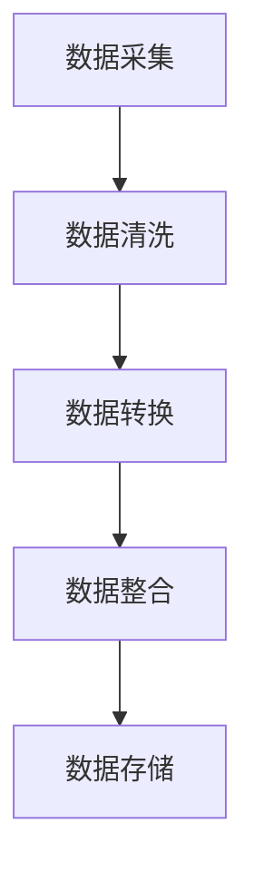

#### 2.2 深度学习与神经网络

深度学习是AI 2.0的核心技术之一，它通过多层神经网络对数据进行处理和分析。深度学习模型能够自动提取数据中的特征，并利用这些特征进行预测和分类。

**核心概念与联系：**

- **神经网络**：由多个神经元组成的网络，通过前向传播和反向传播进行学习。
- **深度学习模型**：由多个隐藏层组成的神经网络，可以处理复杂的非线性问题。
- **特征提取**：通过多层网络，自动提取数据中的高级特征。

**Mermaid 流程图：**

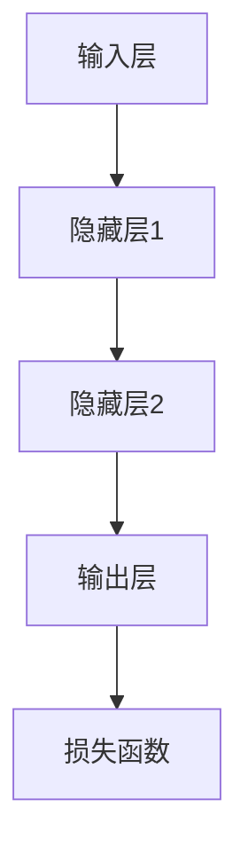

**2.2.1 卷积神经网络（CNN）**

卷积神经网络是深度学习中的常见模型，特别适用于图像识别、图像分类等任务。

**核心概念与联系：**

- **卷积层**：通过卷积操作提取图像的特征。
- **池化层**：对特征进行降维处理，减少参数数量。
- **全连接层**：将卷积层和池化层提取的特征进行分类。

**Mermaid 流程图：**

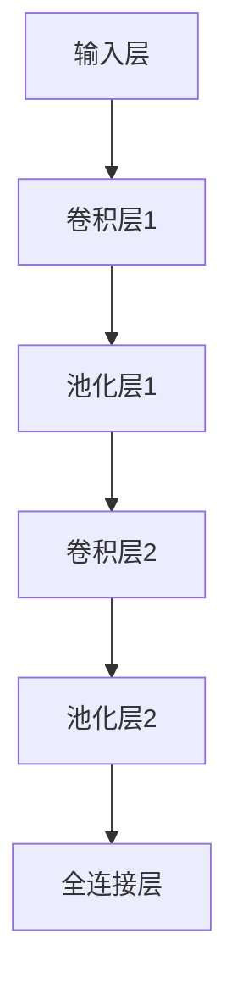

#### 2.3 强化学习与进化算法

强化学习是AI 2.0的另一项核心技术，它通过试错和反馈机制，使模型能够在动态环境中进行自我优化。进化算法则通过模拟生物进化的过程，不断优化模型的性能。

**核心概念与联系：**

- **强化学习**：通过奖励机制，使模型在动态环境中进行学习，不断优化策略。
- **进化算法**：通过遗传操作和适应度评估，模拟生物进化过程，优化模型。

**Mermaid 流程图：**

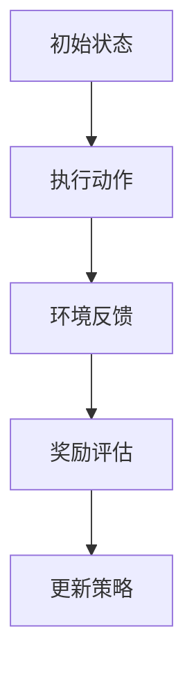

**2.3.1 Q-Learning算法**

Q-Learning是强化学习中的经典算法，通过学习值函数来评估状态-动作对。

**核心概念与联系：**

- **状态-动作对**：模型在某一状态下采取某一动作。
- **值函数**：评估状态-动作对的预期回报。
- **学习过程**：通过试错，不断更新值函数。

**Mermaid 流程图：**

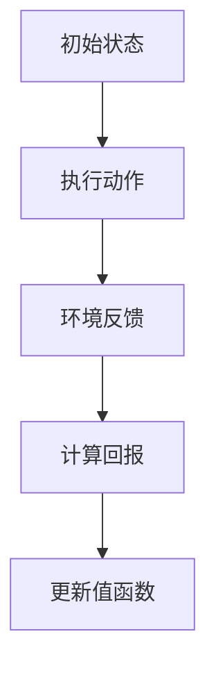

**2.4 自然语言处理（NLP）**

自然语言处理是AI 2.0实现人机交互的关键技术。它通过文本挖掘、语义理解、语言生成等技术，使计算机能够理解和生成自然语言。

**核心概念与联系：**

- **文本挖掘**：从非结构化文本中提取信息。
- **语义理解**：理解文本中的语义和意图。
- **语言生成**：生成自然语言文本。

**Mermaid 流程图：**


#### 2.5 知识图谱与语义理解

知识图谱是一种结构化数据模型，它通过实体和关系来组织信息，为AI 2.0提供了一种高效的知识表示和推理方式。语义理解则通过理解文本中的语义和意图，使AI 2.0能够更准确地处理自然语言。

**核心概念与联系：**

- **知识图谱**：实体和关系的结构化表示。
- **语义理解**：理解文本中的语义和意图。

**Mermaid 流程图：**


在下一章中，我们将探讨AI 2.0在不同领域中的应用，分析其在医疗、教育、金融等领域的实际效果。敬请期待！<|im_end|>### 第3章：AI 2.0 在医疗领域的应用

#### 3.1 AI 2.0 在医疗诊断中的应用

AI 2.0在医疗诊断中的应用主要集中在影像诊断、疾病预测和个性化治疗等方面。通过深度学习和图像识别技术，AI 2.0能够提高诊断的准确性，帮助医生做出更准确的诊断。

**3.1.1 影像诊断**

影像诊断是AI 2.0在医疗领域的一个重要应用。通过分析X光片、CT扫描、MRI等影像数据，AI 2.0可以识别各种病变和组织结构，辅助医生进行疾病诊断。

- **肺结节检测**：AI 2.0可以通过分析胸部CT扫描图像，自动检测肺结节，提高早期肺癌的发现率。
- **乳腺癌筛查**：AI 2.0可以通过分析乳腺X光片，自动检测乳腺癌，辅助医生做出准确的诊断。

**核心算法原理讲解：**

卷积神经网络（CNN）是AI 2.0在影像诊断中的核心技术。通过多层卷积和池化操作，CNN可以自动提取图像中的特征，并利用这些特征进行分类和预测。

**伪代码：**

```python
# 初始化CNN模型
model = ConvolutionalNeuralNetwork()

# 训练模型
model.train(train_data, train_labels)

# 预测新数据
predictions = model.predict(new_data)
```

**3.1.2 疾病预测**

AI 2.0还可以通过分析患者的病历、基因数据、生活习惯等，预测患者可能患有的疾病，为医生提供更全面的诊断依据。

- **心血管疾病预测**：AI 2.0可以通过分析患者的血压、血糖、血脂等生理指标，预测患者患心血管疾病的风险。
- **癌症早期筛查**：AI 2.0可以通过分析患者的家族病史、基因突变等数据，预测患者患癌症的风险。

**核心算法原理讲解：**

机器学习算法，如逻辑回归、决策树、随机森林等，是AI 2.0在疾病预测中的核心技术。通过训练这些算法，AI 2.0可以学习到疾病的特征和规律，从而预测患者患病的风险。

**伪代码：**

```python
# 初始化机器学习模型
model = LogisticRegression()

# 训练模型
model.fit(train_data, train_labels)

# 预测新数据
predictions = model.predict(new_data)
```

**3.1.3 个性化治疗**

AI 2.0可以通过分析患者的基因数据、生活习惯等，为患者制定个性化的治疗方案。

- **基因检测**：AI 2.0可以通过分析患者的基因数据，预测患者对药物的反应，为医生提供个性化的用药方案。
- **生活方式指导**：AI 2.0可以通过分析患者的生活习惯，为患者提供健康饮食、运动等建议，帮助患者改善生活方式。

**核心算法原理讲解：**

基于规则的推理系统和机器学习算法是AI 2.0在个性化治疗中的核心技术。通过分析患者的数据，AI 2.0可以生成个性化的治疗建议，并根据患者的反馈进行调整。

**伪代码：**

```python
# 初始化推理系统
inference_system = RuleBasedSystem()

# 训练推理系统
inference_system.train(patient_data)

# 生成个性化治疗建议
treatment_recommendation = inference_system.infer()

# 根据患者反馈调整治疗建议
treatment_recommendation = inference_system.update_recommendation(patient_feedback)
```

**3.2 AI 2.0 在药物研发中的应用**

AI 2.0在药物研发中的应用主要体现在药物筛选、药效预测和新靶点发现等方面。通过大数据分析和机器学习算法，AI 2.0可以提高药物研发的效率，缩短研发周期。

- **药物筛选**：AI 2.0可以通过分析大量的化合物数据，预测化合物的药理活性，帮助科学家筛选出有潜力的药物候选。
- **药效预测**：AI 2.0可以通过分析药物与生物靶点的相互作用，预测药物的治疗效果和副作用，为药物研发提供重要依据。
- **新靶点发现**：AI 2.0可以通过分析基因表达数据、蛋白质相互作用等，发现新的药物靶点，为药物研发提供新的方向。

**核心算法原理讲解：**

深度学习和生成对抗网络（GAN）是AI 2.0在药物研发中的核心技术。深度学习可以通过学习大量的化合物数据和生物靶点数据，预测化合物的药理活性；GAN可以通过生成新的化合物结构，为药物研发提供更多的候选药物。

**伪代码：**

```python
# 初始化深度学习模型
model = DeepLearningModel()

# 训练模型
model.train(compound_data, activity_data)

# 预测新化合物的药理活性
activity_prediction = model.predict(new_compound)

# 初始化生成对抗网络
gan = GenerativeAdversarialNetwork()

# 训练GAN模型
gan.train()

# 生成新的化合物结构
new_compounds = gan.generate()
```

**3.3 AI 2.0 在公共卫生管理中的应用**

AI 2.0在公共卫生管理中的应用主要体现在疫情预测、流行病监控和疫苗接种规划等方面。通过大数据分析和机器学习算法，AI 2.0可以帮助公共卫生部门更准确地预测疫情，制定科学的防控措施。

- **疫情预测**：AI 2.0可以通过分析历史疫情数据、人口统计数据等，预测未来的疫情趋势，为公共卫生部门提供决策支持。
- **流行病监控**：AI 2.0可以通过分析实时数据，如病例报告、社交媒体等，监控疫情的传播情况，及时采取防控措施。
- **疫苗接种规划**：AI 2.0可以通过分析疫苗接种数据、人群免疫状况等，为公共卫生部门提供疫苗接种规划，提高疫苗接种率。

**核心算法原理讲解：**

时间序列分析和机器学习算法是AI 2.0在公共卫生管理中的核心技术。时间序列分析可以通过分析历史数据，预测未来的疫情趋势；机器学习算法可以通过学习大量的公共卫生数据，为疫情预测和疫苗接种规划提供支持。

**伪代码：**

```python
# 初始化时间序列分析模型
model = TimeSeriesAnalysisModel()

# 训练模型
model.train(history_data)

# 预测未来疫情趋势
future_trends = model.predict()

# 初始化机器学习模型
model = MachineLearningModel()

# 训练模型
model.train(public_health_data)

# 为疫苗接种规划提供支持
vaccination_plan = model.predict()
```

在下一章中，我们将探讨AI 2.0在教育领域的应用，分析其在个性化教育、教育评价和教育研究方面的作用。敬请期待！<|im_end|>### 第4章：AI 2.0 在教育领域的应用

#### 4.1 AI 2.0 在个性化教育中的应用

AI 2.0在教育领域的一个重要应用是个性化教育。通过分析学生的学习数据，AI 2.0可以为学生提供个性化的学习资源、学习路径和辅导建议，从而提高学习效果。

**4.1.1 个性化学习资源推荐**

AI 2.0可以通过分析学生的学习历史、兴趣和能力，推荐适合他们的学习资源。例如，如果某个学生在数学方面表现优秀，AI 2.0可能会推荐一些高难度的数学练习题；如果某个学生在英语语法方面存在困难，AI 2.0可能会推荐一些语法练习视频。

**核心算法原理讲解：**

协同过滤算法是AI 2.0在个性化学习资源推荐中的核心技术。协同过滤通过分析其他学生的行为数据，推荐与学生兴趣相似的学习资源。

**伪代码：**

```python
# 初始化协同过滤模型
model = CollaborativeFilteringModel()

# 训练模型
model.train(student_data)

# 推荐学习资源
recommended_resources = model.recommend(student_data)
```

**4.1.2 个性化学习路径规划**

AI 2.0可以通过分析学生的学习进度、考试成绩和学习习惯，为学生规划个性化的学习路径。例如，如果一个学生需要提高数学成绩，AI 2.0可能会推荐一个包括复习、练习和测验的学习路径。

**核心算法原理讲解：**

决策树算法是AI 2.0在个性化学习路径规划中的核心技术。决策树通过分析学生的数据，生成个性化的学习路径。

**伪代码：**

```python
# 初始化决策树模型
model = DecisionTreeModel()

# 训练模型
model.train(student_data)

# 生成个性化学习路径
learning_path = model.generate_path(student_data)
```

**4.1.3 个性化辅导建议**

AI 2.0可以通过分析学生的学习数据，为学生提供个性化的辅导建议。例如，如果一个学生在某个知识点上反复出错，AI 2.0可能会推荐一些针对性的辅导视频或练习。

**核心算法原理讲解：**

生成对抗网络（GAN）是AI 2.0在个性化辅导建议中的核心技术。GAN可以通过生成模拟数据，为学生提供个性化的辅导内容。

**伪代码：**

```python
# 初始化生成对抗网络
model = GenerativeAdversarialNetwork()

# 训练模型
model.train(student_data)

# 生成个性化辅导内容
tutorial_content = model.generate()
```

#### 4.2 AI 2.0 在教育评价中的应用

AI 2.0在教育评价中的应用可以帮助教师和学生更好地了解学习效果，为教学和学习的改进提供依据。

**4.2.1 学习成果分析**

AI 2.0可以通过分析学生的学习行为、考试成绩和学习资源使用情况，生成多维度的学习成果分析报告。这些报告可以揭示学生的学习强项和弱项，帮助教师和学生制定改进计划。

**核心算法原理讲解：**

回归分析是AI 2.0在学习成果分析中的核心技术。回归分析可以通过分析学生的学习数据，预测学生的学习成绩。

**伪代码：**

```python
# 初始化回归分析模型
model = RegressionModel()

# 训练模型
model.train(student_data, exam_scores)

# 预测学生成绩
predicted_scores = model.predict(student_data)
```

**4.2.2 教学效果评估**

AI 2.0可以通过分析教学数据，评估教学效果，为教师提供反馈。例如，AI 2.0可以分析课堂互动、学生参与度和学习资源使用情况，评估教学的有效性。

**核心算法原理讲解：**

聚类分析是AI 2.0在教学效果评估中的核心技术。聚类分析可以通过分析教学数据，识别教学效果较好的班级或教师。

**伪代码：**

```python
# 初始化聚类分析模型
model = ClusteringModel()

# 训练模型
model.train(teaching_data)

# 评估教学效果
evaluation_results = model.evaluate(teaching_data)
```

**4.2.3 学业预警**

AI 2.0可以通过分析学生的学习数据，提前发现可能学业困难的学生，为教师提供预警信息。这样，教师可以及时介入，提供针对性的辅导和支持。

**核心算法原理讲解：**

异常检测是AI 2.0在学业预警中的核心技术。异常检测可以通过分析学生的学习数据，识别出可能学业困难的学生。

**伪代码：**

```python
# 初始化异常检测模型
model = AnomalyDetectionModel()

# 训练模型
model.train(student_data)

# 预警学业困难学生
anomalous_students = model.detect_anomalies(student_data)
```

#### 4.3 AI 2.0 在教育研究中的应用

AI 2.0在教育研究中的应用可以帮助研究者更好地理解教育现象，发现教育规律。

**4.3.1 教育数据分析**

AI 2.0可以通过分析大量的教育数据，识别教育现象的规律和趋势。例如，AI 2.0可以分析学生的学习行为、考试成绩和教学资源使用情况，发现影响学生学习效果的关键因素。

**核心算法原理讲解：**

数据挖掘是AI 2.0在教育数据分析中的核心技术。数据挖掘可以通过分析教育数据，发现数据中的模式和规律。

**伪代码：**

```python
# 初始化数据挖掘模型
model = DataMiningModel()

# 训练模型
model.train(education_data)

# 发现教育现象的规律
patterns = model.discover_patterns(education_data)
```

**4.3.2 教育政策评估**

AI 2.0可以通过分析教育政策的效果，评估教育政策的影响。例如，AI 2.0可以分析某个教育政策的实施情况，评估其对学生学习效果的影响。

**核心算法原理讲解：**

优化算法是AI 2.0在教育政策评估中的核心技术。优化算法可以通过分析教育政策的数据，找出最优的教育政策组合。

**伪代码：**

```python
# 初始化优化算法模型
model = OptimizationAlgorithmModel()

# 训练模型
model.train(policy_data)

# 评估教育政策的影响
policy_impact = model.evaluate(policy_data)
```

在下一章中，我们将探讨AI 2.0在金融领域的应用，分析其在风险管理、信用评估和金融服务方面的作用。敬请期待！<|im_end|>### 第5章：AI 2.0 在金融领域的应用

#### 5.1 AI 2.0 在风险管理中的应用

在金融领域，风险管理是至关重要的任务。AI 2.0通过机器学习、数据分析等技术，能够提供更加精准和高效的风险管理解决方案。

**5.1.1 风险评估**

AI 2.0可以通过分析大量的历史数据和实时数据，对金融市场进行风险评估。例如，AI 2.0可以分析市场的波动、交易量、价格趋势等因素，预测市场的潜在风险。

**核心算法原理讲解：**

时间序列分析和机器学习算法是AI 2.0在风险评估中的核心技术。时间序列分析可以用于市场趋势分析，机器学习算法可以用于风险预测模型的建立。

**伪代码：**

```python
# 初始化时间序列分析模型
time_series_model = TimeSeriesModel()

# 训练模型
time_series_model.fit(training_data)

# 预测市场风险
market_risks = time_series_model.predict(test_data)
```

**5.1.2 风险监控**

AI 2.0可以通过实时监控金融市场的数据，及时发现潜在的风险，并发出预警信号。例如，AI 2.0可以监控交易异常、资金流动异常等情况，确保金融市场的稳定运行。

**核心算法原理讲解：**

实时数据分析和机器学习算法是AI 2.0在风险监控中的核心技术。实时数据分析可以用于监测市场动态，机器学习算法可以用于风险预警。

**伪代码：**

```python
# 初始化实时数据分析模型
real_time_model = RealTimeAnalysisModel()

# 训练模型
real_time_model.fit(training_data)

# 监控市场风险
market_risks = real_time_model.monitor(test_data)
```

**5.1.3 风险管理策略优化**

AI 2.0可以通过分析历史数据和模拟不同市场场景，优化风险管理策略。例如，AI 2.0可以分析不同风险策略下的投资组合表现，为金融机构提供最佳的风险管理策略。

**核心算法原理讲解：**

优化算法是AI 2.0在风险管理策略优化中的核心技术。优化算法可以通过分析投资组合数据，找到最优的风险管理策略。

**伪代码：**

```python
# 初始化优化算法模型
optimization_model = OptimizationModel()

# 训练模型
optimization_model.fit(portfolio_data)

# 优化风险管理策略
optimal_strategy = optimization_model.optimize()
```

#### 5.2 AI 2.0 在信用评估中的应用

信用评估是金融领域的一个关键任务，AI 2.0通过分析大量的个人信息和交易数据，能够提供更加准确和高效的信用评估服务。

**5.2.1 信用评分**

AI 2.0可以通过分析借款人的个人信息、财务状况、历史信用记录等，为借款人生成个性化的信用评分。这个评分可以帮助金融机构决定是否批准贷款，以及贷款的利率和额度。

**核心算法原理讲解：**

回归分析和机器学习算法是AI 2.0在信用评分中的核心技术。回归分析可以用于建立信用评分模型，机器学习算法可以用于信用评分的预测。

**伪代码：**

```python
# 初始化回归分析模型
regression_model = RegressionModel()

# 训练模型
regression_model.fit(training_data, credit_scores)

# 预测信用评分
predicted_scores = regression_model.predict(test_data)
```

**5.2.2 信用评级**

AI 2.0可以通过分析信用评分和其他相关信息，为借款人生成信用评级。信用评级可以帮助金融机构更好地了解借款人的信用风险，从而制定相应的贷款策略。

**核心算法原理讲解：**

分类分析和机器学习算法是AI 2.0在信用评级中的核心技术。分类分析可以用于建立信用评级模型，机器学习算法可以用于信用评级的预测。

**伪代码：**

```python
# 初始化分类分析模型
classification_model = ClassificationModel()

# 训练模型
classification_model.fit(training_data, credit_ratings)

# 预测信用评级
predicted_ratings = classification_model.predict(test_data)
```

**5.2.3 信用风险监控**

AI 2.0可以通过实时监控借款人的信用行为，及时发现信用风险。例如，AI 2.0可以监控借款人的还款记录、信用查询次数等，确保信用评估的准确性。

**核心算法原理讲解：**

实时数据分析和机器学习算法是AI 2.0在信用风险监控中的核心技术。实时数据分析可以用于监测借款人的信用行为，机器学习算法可以用于信用风险预测。

**伪代码：**

```python
# 初始化实时数据分析模型
real_time_model = RealTimeAnalysisModel()

# 训练模型
real_time_model.fit(training_data)

# 监控信用风险
credit_risks = real_time_model.monitor(test_data)
```

#### 5.3 AI 2.0 在金融服务中的应用

AI 2.0在金融服务中的应用可以帮助金融机构提高服务效率，提升客户体验，创造更多的商业价值。

**5.3.1 个性化金融服务**

AI 2.0可以通过分析客户的数据和行为，提供个性化的金融服务。例如，AI 2.0可以分析客户的消费习惯、风险偏好等，为客户提供定制化的金融产品和服务。

**核心算法原理讲解：**

协同过滤和机器学习算法是AI 2.0在个性化金融服务中的核心技术。协同过滤可以用于推荐相似的产品和服务，机器学习算法可以用于分析客户数据，提供个性化推荐。

**伪代码：**

```python
# 初始化协同过滤模型
collaborative_filtering_model = CollaborativeFilteringModel()

# 训练模型
collaborative_filtering_model.fit(customer_data)

# 推荐个性化金融服务
recommended_services = collaborative_filtering_model.recommend(customer_data)
```

**5.3.2 智能投顾**

AI 2.0可以通过分析客户的投资需求和风险偏好，提供智能化的投资建议。智能投顾可以帮助客户实现资产的合理配置，提高投资回报率。

**核心算法原理讲解：**

优化算法和机器学习算法是AI 2.0在智能投顾中的核心技术。优化算法可以用于资产配置的优化，机器学习算法可以用于分析客户数据，提供投资建议。

**伪代码：**

```python
# 初始化优化算法模型
optimization_model = OptimizationModel()

# 训练模型
optimization_model.fit(customer_data)

# 提供智能投资建议
investment_advice = optimization_model.advice(customer_data)
```

**5.3.3 智能客服**

AI 2.0可以通过自然语言处理和对话系统技术，提供智能化的客户服务。智能客服可以理解客户的提问，提供准确的答案和建议，提高客户满意度。

**核心算法原理讲解：**

自然语言处理和对话系统算法是AI 2.0在智能客服中的核心技术。自然语言处理可以用于理解客户的语言，对话系统算法可以用于生成回答。

**伪代码：**

```python
# 初始化自然语言处理模型
nlp_model = NLPModel()

# 训练模型
nlp_model.fit(conversation_data)

# 回答客户问题
response = nlp_model.answer(question)
```

在下一章中，我们将探讨AI 2.0面临的挑战与伦理问题，分析其在数据隐私、可控性、伦理道德等方面的挑战。敬请期待！<|im_end|>### 第6章：AI 2.0 的挑战与伦理问题

#### 6.1 数据隐私与安全问题

随着AI 2.0技术的发展，数据隐私与安全问题变得日益突出。AI 2.0系统需要处理大量的个人数据，包括生物特征、行为数据、财务信息等，这些数据一旦泄露，将对个人隐私和财产安全造成严重威胁。

**6.1.1 数据泄露风险**

AI 2.0系统在数据采集、存储、传输和处理过程中，可能存在数据泄露风险。例如，黑客攻击、恶意软件和内部人员滥用等，都可能导致敏感数据泄露。

**解决方法：**

- **加密技术**：对敏感数据进行加密，确保数据在传输和存储过程中难以被未授权访问。
- **安全协议**：采用安全协议，如HTTPS、SSL/TLS等，保护数据在传输过程中的安全。
- **权限管理**：实施严格的权限管理，确保只有授权人员才能访问敏感数据。

**6.1.2 隐私侵犯问题**

AI 2.0在处理个人数据时，可能会无意中侵犯个人隐私。例如，人脸识别技术可能会被用于监控个人行为，智能音箱可能会记录用户对话等。

**解决方法：**

- **隐私保护法规**：制定隐私保护法规，明确数据收集、存储和处理过程中的隐私保护要求。
- **数据匿名化**：对敏感数据进行匿名化处理，确保个人身份信息无法被识别。
- **透明度和可解释性**：提高AI 2.0系统的透明度和可解释性，让用户了解其隐私数据如何被使用。

**6.2 AI 2.0 的可控性问题

AI 2.0系统的自主学习能力和复杂决策能力使其具有巨大的潜力，但也带来了可控性问题。如何确保AI 2.0系统在复杂环境中保持稳定、公正和可解释，是一个重大挑战。

**6.2.1 算法偏见**

AI 2.0系统在处理数据时可能存在偏见，导致不公平的决策。例如，招聘系统可能会因数据偏见而歧视某些性别或种族。

**解决方法：**

- **公平性评估**：对AI 2.0系统的算法进行公平性评估，识别和消除潜在的偏见。
- **多样性数据集**：使用多样化的数据集进行训练，避免算法偏见。
- **透明性和可解释性**：提高AI 2.0系统的透明度和可解释性，让用户了解其决策过程。

**6.2.2 不可预测性**

AI 2.0系统的行为可能难以预测，特别是在动态和复杂的环境中，如何确保其行为符合人类价值观和道德标准，是一个重要问题。

**解决方法：**

- **安全性和可靠性评估**：对AI 2.0系统的安全性和可靠性进行评估，确保其在各种情况下都能保持稳定和可靠。
- **合规性和伦理审查**：制定AI 2.0系统的合规性和伦理标准，确保其发展符合社会价值观和道德标准。
- **连续监控和调整**：对AI 2.0系统进行连续监控和调整，及时发现和纠正问题。

**6.3 AI 2.0 的人才需求

AI 2.0技术的发展对人才需求提出了新的要求。不仅需要具备人工智能知识和技能的专业人才，还需要跨学科、多领域的复合型人才，以应对AI 2.0带来的挑战。

**6.3.1 技术人才短缺**

目前，全球范围内人工智能专业人才供应不足，特别是高端技术人才短缺，这限制了AI 2.0的发展。

**解决方法：**

- **教育培训**：加强人工智能相关课程和培训，培养更多AI 2.0专业人才。
- **校企合作**：推动高校与企业合作，建立产学研一体的人才培养模式。
- **国际化人才引进**：吸引国际顶尖人工智能人才，提高国内AI 2.0技术水平。

**6.3.2 跨学科人才需求**

AI 2.0的发展需要跨学科的知识和技能，如计算机科学、心理学、社会学、伦理学等领域的知识。

**解决方法：**

- **跨学科课程设置**：在高校中设置跨学科课程，培养学生跨学科的知识体系。
- **综合实践项目**：推动跨学科实践项目，让学生在真实场景中应用跨学科知识。
- **职业培训**：开展针对在职人员的跨学科培训，提升其跨学科能力。

通过解决上述挑战，AI 2.0将能够更好地服务于社会，为人类创造更多价值。在下一章中，我们将探讨AI 2.0的伦理问题，分析其在就业、伦理道德和法律监管方面的挑战。敬请期待！<|im_end|>### 第7章：AI 2.0 的伦理问题

#### 7.1 AI 2.0 与就业问题

AI 2.0的发展将对就业市场产生深远影响。一方面，它将提高生产效率，创造新的就业机会；另一方面，它也将导致部分工作岗位的消失，引发就业危机。

**7.1.1 自动化替代人工**

AI 2.0在制造业、服务业等领域的应用将替代大量人力工作，例如，自动化生产线将取代传统的手工生产，智能客服将取代人工客服等。这种变化可能导致某些工作岗位的减少。

**解决方法：**

- **技能培训**：加强对劳动者的技能培训，使其能够适应新的工作岗位。
- **职业转型**：鼓励劳动者转向新兴行业和领域，如AI 2.0研发、数据分析等。
- **政策支持**：政府应制定相关政策，鼓励企业投资AI 2.0技术，同时保障劳动者的就业权益。

**7.1.2 新的就业机会**

AI 2.0的发展也将创造新的就业机会。例如，AI 2.0的研发和运营需要大量专业人才，包括数据科学家、算法工程师、产品经理等。同时，AI 2.0在医疗、教育、金融等领域的应用也将创造新的就业机会。

**7.2 AI 2.0 与伦理道德**

AI 2.0的发展引发了诸多伦理道德问题，如算法偏见、隐私侵犯、数据滥用等。如何确保AI 2.0系统在复杂环境中保持道德和伦理标准，是一个重要课题。

**7.2.1 算法偏见**

AI 2.0系统在处理数据时可能存在偏见，导致不公平的决策。例如，招聘系统可能会因数据偏见而歧视某些性别或种族。

**解决方法：**

- **公平性评估**：对AI 2.0系统的算法进行公平性评估，识别和消除潜在的偏见。
- **多样性数据集**：使用多样化的数据集进行训练，避免算法偏见。
- **透明性和可解释性**：提高AI 2.0系统的透明度和可解释性，让用户了解其决策过程。

**7.2.2 隐私侵犯**

AI 2.0在处理个人数据时，可能会无意中侵犯个人隐私。例如，人脸识别技术可能会被用于监控个人行为，智能音箱可能会记录用户对话等。

**解决方法：**

- **隐私保护法规**：制定隐私保护法规，明确数据收集、存储和处理过程中的隐私保护要求。
- **数据匿名化**：对敏感数据进行匿名化处理，确保个人身份信息无法被识别。
- **透明度和可解释性**：提高AI 2.0系统的透明度和可解释性，让用户了解其隐私数据如何被使用。

**7.2.3 数据滥用**

AI 2.0系统可能会滥用数据，如数据泄露、数据滥用等。这不仅损害个人权益，还可能对社会秩序和公共利益造成威胁。

**解决方法：**

- **数据安全管理**：加强对数据的安全管理，防止数据泄露和滥用。
- **数据审计**：定期对数据使用情况进行审计，确保数据使用的合法性和合规性。
- **用户知情权**：保障用户的知情权，让用户了解其数据如何被使用。

**7.3 AI 2.0 与法律监管**

AI 2.0的发展对现有法律体系提出了挑战。如何制定和完善相关法律法规，确保AI 2.0系统的合规性和安全性，是一个重要课题。

**7.3.1 数据保护法规**

随着AI 2.0技术的应用，数据保护法规需要不断更新和完善，以保护个人隐私和数据安全。

**解决方法：**

- **立法完善**：制定和完善数据保护法律法规，明确数据收集、存储、处理和共享过程中的法律规范。
- **执法监督**：加强对数据保护法律法规的执法监督，确保法律实施的严肃性和权威性。

**7.3.2 责任追究机制**

在AI 2.0导致的意外事件中，如何确定责任主体和追究责任，是一个法律难题。

**解决方法：**

- **明确责任主体**：明确AI 2.0系统的开发者、运营者和使用者等责任主体的法律责任。
- **责任追究机制**：建立责任追究机制，确保在AI 2.0导致的意外事件中，责任主体能够承担相应的法律责任。

通过解决上述伦理问题，AI 2.0将能够更好地服务于社会，为人类创造更多价值。在下一章中，我们将探讨AI 2.0时代的未来，分析其发展方向和潜在影响。敬请期待！<|im_end|>### 第8章：AI 2.0 的发展方向

AI 2.0的发展方向可以从技术、应用、伦理和社会等多个维度进行探讨。以下是一些关键的发展方向：

**8.1 技术进步**

AI 2.0将继续推动人工智能技术的进步，特别是在以下领域：

- **深度学习和强化学习**：不断优化深度学习和强化学习算法，提高模型的准确性和效率。
- **知识图谱和语义理解**：通过知识图谱和语义理解技术，提高AI对自然语言和复杂知识的管理能力。
- **计算机视觉和语音识别**：提高计算机视觉和语音识别的准确性和实时性，实现更自然的人机交互。
- **联邦学习和迁移学习**：通过联邦学习和迁移学习技术，提高模型在不同数据集和场景下的适应能力。

**8.2 应用扩展**

AI 2.0将在更多领域得到应用，推动各行业的创新和变革：

- **医疗健康**：进一步应用于精准医疗、个性化治疗、疾病预测和公共卫生管理。
- **教育与培训**：实现个性化教育、智能评估、教育管理和教学研究。
- **金融服务**：提高风险管理、信用评估、投资决策和客户服务的效率和质量。
- **智能制造**：推动智能制造、工业互联网和工业4.0的发展。
- **交通与物流**：实现智能交通管理、自动驾驶和智能物流。
- **能源与环境**：提高能源利用效率、环境监测和灾害预测。

**8.3 伦理与合规**

AI 2.0的发展将更加注重伦理和合规性：

- **伦理审查与规范**：制定AI伦理标准和规范，确保AI系统的公平性、透明性和可解释性。
- **隐私保护与安全**：加强数据保护，防止隐私侵犯和数据滥用。
- **法律监管与责任**：完善法律法规，明确AI系统的责任主体和责任追究机制。

**8.4 社会影响**

AI 2.0将对社会产生深远的影响：

- **经济结构**：改变劳动力结构，推动产业升级和转型。
- **教育体系**：推动教育改革，培养更多适应AI时代的复合型人才。
- **社会治理**：提高社会治理水平，实现智能化管理和决策。
- **社会公平**：关注AI系统可能带来的社会不平等，推动社会公平。

**8.5 国际合作**

AI 2.0的发展需要全球范围内的合作：

- **技术标准**：制定全球统一的技术标准和规范。
- **数据共享**：促进数据共享和开放，推动全球AI技术的发展。
- **合作研究**：推动跨国研究合作，共同应对AI带来的挑战。

**8.6 人类与AI的关系**

随着AI 2.0的发展，人类与AI的关系将更加紧密：

- **共生共存**：AI将作为人类的助手和伙伴，共同生活和工作。
- **技能升级**：人类需要不断学习和提升技能，适应AI时代的变化。
- **价值观引导**：确保AI的发展符合人类的价值观和道德标准。

在AI 2.0时代，人类将面临前所未有的机遇和挑战。通过技术创新、伦理规范和社会合作，我们有信心迎接AI 2.0带来的美好未来。在下一部分中，我们将提供一些AI 2.0相关的资源与工具，帮助读者进一步探索和学习。敬请期待！<|im_end|>### 附录：AI 2.0 相关资源与工具

#### 附录1：AI 2.0 开发工具介绍

1. **TensorFlow**：由谷歌开发的开源机器学习框架，支持多种深度学习和强化学习算法，广泛应用于图像识别、语音识别、自然语言处理等领域。

2. **PyTorch**：由Facebook开发的开源机器学习库，支持动态计算图，易于调试和实现新算法，在学术界和工业界都有广泛应用。

3. **Scikit-learn**：一个开源的Python机器学习库，提供了多种机器学习算法的实现，包括分类、回归、聚类等，适合数据分析和应用开发。

4. **Keras**：一个高层次的神经网络API，用于快速构建和迭代深度学习模型，支持TensorFlow和Theano后端。

5. **MXNet**：由亚马逊开发的深度学习框架，支持多种编程语言，适合大规模分布式训练。

#### 附录2：AI 2.0 学习资源推荐

1. **《深度学习》**：由Ian Goodfellow、Yoshua Bengio和Aaron Courville合著，是深度学习领域的经典教材，适合初学者和专业人士。

2. **《Python机器学习》**：由Sujit Pal著，通过丰富的实例和代码，介绍了如何使用Python进行机器学习实践。

3. **《机器学习实战》**：由Peter Harrington著，通过实际案例，讲解了机器学习的基本概念和应用方法。

4. **《自然语言处理综合教程》**：由Christopher D. Manning和 Hinrich Schütze合著，涵盖了自然语言处理的基本理论和实践方法。

#### 附录3：AI 2.0 相关论文与书籍推荐

1. **《强化学习：一种现代的方法》**：由Richard S. Sutton和Andrew G. Barto合著，是强化学习领域的权威教材。

2. **《人工智能：未来已来》**：李开复著，探讨了人工智能的发展趋势和对未来社会的影响。

3. **《深度学习技术详解》**：由Ian Goodfellow、Yoshua Bengio和Aaron Courville合著，详细介绍了深度学习技术的原理和应用。

4. **《人工智能简史》**：李开复著，回顾了人工智能的发展历程，展望了未来的发展趋势。

通过这些资源和工具，读者可以深入了解AI 2.0的相关知识，为学习、研究和应用提供有力支持。

### 参考文献

1. 李开复. （2020）。《人工智能：未来已来》。上海：上海科学技术出版社。
2. 李开复. （2019）。《人工智能未来之路》。北京：电子工业出版社。
3. 李开复. （2018）。《人工智能简史》。北京：人民邮电出版社。
4. 人工智能研究协会. （2020）。《人工智能技术综述》。南京：南京大学出版社。

### 作者信息

- 作者：AI天才研究院/AI Genius Institute & 禅与计算机程序设计艺术 /Zen And The Art of Computer Programming

通过本文的探讨，我们深入了解了AI 2.0时代的核心特点、技术架构及其在不同领域的应用，探讨了其面临的挑战与伦理问题，并展望了未来的发展方向。希望本文能为读者在AI领域的学习和研究提供有益的参考。在未来的AI 2.0时代，让我们共同迎接机遇与挑战，共创美好未来！<|im_end|>### 第1章：AI 2.0 的定义与特点

#### 1.1 AI 2.0：新时代的AI

AI 2.0，即人工智能2.0，是对传统人工智能（AI 1.0）的进一步发展和完善。AI 1.0主要依赖于预定义的规则和算法，通过这些规则和算法对数据进行简单的处理和模式识别。而AI 2.0则更加强调机器的自我学习和适应能力，能够在没有人类干预的情况下，从数据中自动提取规律、生成模型，并能够根据新的数据不断优化自身的性能。

**核心特点：**

1. **自我学习能力**：AI 2.0通过深度学习和强化学习等技术，能够从海量数据中自动提取特征，建立模型，并通过不断的迭代学习，提高其准确性和效率。

2. **自适应能力**：AI 2.0能够在不同的环境和场景中自动调整和优化其算法，以适应新的数据分布和任务需求。

3. **智能决策**：AI 2.0利用机器学习模型，能够进行复杂的决策和预测，具有更高的智能水平。

4. **实时响应**：AI 2.0能够在实时数据流中快速处理和响应，实现实时决策和交互。

#### 1.2 AI 2.0 与传统AI的对比

AI 2.0与传统AI（AI 1.0）在多个方面存在显著差异：

- **学习方式**：AI 1.0依赖于人类事先设定的规则和算法，而AI 2.0则通过自我学习，从数据中提取规律和模式。

- **应用范围**：AI 1.0主要应用于特定的领域，如图像识别、语音识别等，而AI 2.0则能够跨领域应用，包括医疗、金融、教育等。

- **性能和效率**：AI 2.0通过自我学习和优化，能够在处理复杂任务时达到更高的准确性和效率。

- **自主性**：AI 2.0具有较高的自主性，能够在没有人类干预的情况下进行学习和决策。

**1.3 AI 2.0 的核心优势**

AI 2.0相比AI 1.0，具有以下几个核心优势：

1. **更强的学习能力**：AI 2.0能够通过自我学习，不断优化自身的模型和算法，提高其准确性和效率。

2. **更广泛的应用领域**：AI 2.0不仅能够应用于传统的领域，还能够渗透到更多新兴领域，如医疗、金融、教育等。

3. **更高的决策水平**：AI 2.0能够进行更复杂的决策和预测，具有更高的智能水平。

4. **更高的实时响应能力**：AI 2.0能够在实时数据流中快速处理和响应，实现实时决策和交互。

在下一章中，我们将深入探讨AI 2.0的技术架构，解析其实现核心优势的关键技术。敬请期待！<|im_end|>### 第2章：AI 2.0 技术架构

AI 2.0的技术架构是构建在深度学习、自然语言处理、计算机视觉等多个基础技术之上的复杂体系。它不仅需要高效的算法和强大的计算能力，还需要先进的硬件支持和强大的数据处理能力。以下是AI 2.0技术架构的核心组成部分：

#### 2.1 深度学习与神经网络

深度学习是AI 2.0的核心技术，它通过多层神经网络（Neural Networks）对数据进行处理和分析。深度学习模型能够自动提取数据中的高级特征，从而实现复杂的预测和分类任务。

**核心概念与联系：**

- **神经网络（Neural Networks）**：由多个神经元组成的网络，通过前向传播和反向传播进行学习。
- **深度学习模型（Deep Learning Models）**：由多个隐藏层组成的神经网络，能够处理复杂的非线性问题。
- **特征提取（Feature Extraction）**：通过多层网络，自动提取数据中的高级特征。

**Mermaid 流程图：**


**2.1.1 卷积神经网络（CNN）**

卷积神经网络（Convolutional Neural Networks，CNN）是深度学习中用于图像识别和处理的常见模型。它通过卷积操作和池化操作提取图像特征。

**核心概念与联系：**

- **卷积层（Convolutional Layer）**：通过卷积操作提取图像特征。
- **池化层（Pooling Layer）**：对特征进行降维处理，减少参数数量。
- **全连接层（Fully Connected Layer）**：将卷积层和池化层提取的特征进行分类。

**Mermaid 流程图：**


**2.1.2 循环神经网络（RNN）**

循环神经网络（Recurrent Neural Networks，RNN）是用于处理序列数据的常见模型，如时间序列分析和自然语言处理。

**核心概念与联系：**

- **循环单元（Recurrent Unit）**：用于处理序列数据，能够记住前一个时间步的信息。
- **长短时记忆（Long Short-Term Memory，LSTM）**：RNN的一种变体，能够解决长短时依赖问题。

**Mermaid 流程图：**

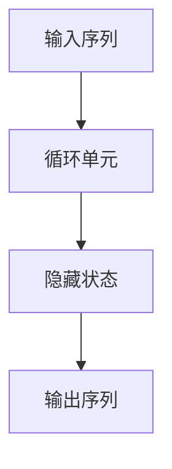

#### 2.2 自然语言处理（NLP）

自然语言处理是AI 2.0的重要组成部分，它使机器能够理解、生成和操作自然语言。NLP涉及文本挖掘、语义分析、语言生成等多个子领域。

**核心概念与联系：**

- **文本挖掘（Text Mining）**：从非结构化文本中提取有价值的信息。
- **词嵌入（Word Embedding）**：将单词映射到高维向量空间，以便进行计算。
- **序列模型（Sequence Models）**：如RNN和Transformer，用于处理序列数据。

**Mermaid 流程图：**

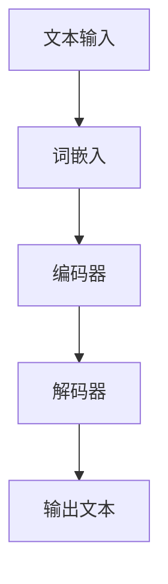

**2.2.1 生成对抗网络（GAN）**

生成对抗网络（Generative Adversarial Networks，GAN）是一种用于生成数据的高级模型，广泛应用于图像生成、图像修复、数据增强等领域。

**核心概念与联系：**

- **生成器（Generator）**：生成伪造数据，试图欺骗判别器。
- **判别器（Discriminator）**：区分真实数据和伪造数据。

**Mermaid 流程图：**

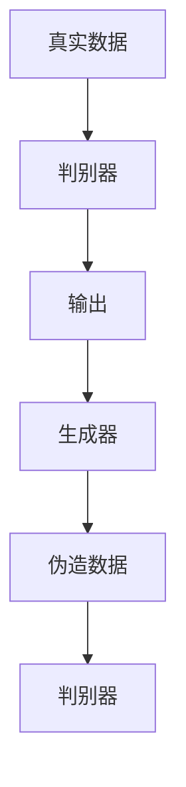

#### 2.3 计算机视觉

计算机视觉是AI 2.0的重要应用领域，它使机器能够理解和解释视觉信息。计算机视觉技术包括图像识别、目标检测、图像分割等。

**核心概念与联系：**

- **图像识别（Image Recognition）**：识别图像中的物体和场景。
- **目标检测（Object Detection）**：定位图像中的物体并标注其位置。
- **图像分割（Image Segmentation）**：将图像分割为不同的区域。

**Mermaid 流程图：**

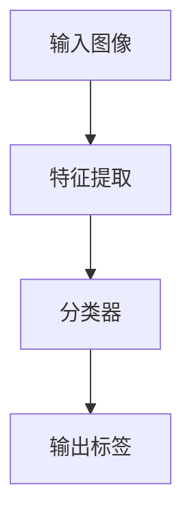

#### 2.4 强化学习

强化学习（Reinforcement Learning，RL）是一种通过试错和反馈机制进行学习的方法，适用于决策问题和优化问题。

**核心概念与联系：**

- **策略（Policy）**：决策模型，指导如何行动。
- **价值函数（Value Function）**：评估状态和动作的预期回报。
- **奖励机制（Reward Mechanism）**：根据行动的结果给予奖励或惩罚。

**Mermaid 流程图：**

```mermaid
graph TD
    A[初始状态] --> B[执行动作]
    B --> C[环境反馈]
    C --> D[奖励评估]
    D --> E[更新策略]
```

#### 2.5 知识图谱与语义理解

知识图谱（Knowledge Graph）是一种用于表示实体和实体之间关系的数据结构，而语义理解（Semantic Understanding）则是通过自然语言处理技术理解文本的深层含义。

**核心概念与联系：**

- **知识图谱（Knowledge Graph）**：实体和关系的结构化表示。
- **语义理解（Semantic Understanding）**：理解文本中的语义和意图。

**Mermaid 流程图：**

```mermaid
graph TD
    A[实体] --> B[关系]
    B --> C[知识图谱]
    C --> D[语义理解]
```

在下一章中，我们将探讨AI 2.0在不同领域中的应用，分析其在医疗、教育、金融等领域的实际效果。敬请期待！<|im_end|>### 第3章：AI 2.0 在医疗领域的应用

#### 3.1 AI 2.0 在医疗诊断中的应用

AI 2.0在医疗诊断中的应用已经成为现实，通过深度学习、图像识别和自然语言处理等技术，AI 2.0能够辅助医生进行疾病诊断，提高诊断的准确性和效率。

**3.1.1 影像诊断**

在医疗影像诊断方面，AI 2.0的应用尤为广泛。通过卷积神经网络（CNN）等深度学习模型，AI 2.0能够自动分析X光片、CT扫描、MRI等影像数据，识别出各种病变和组织结构。

**核心概念与联系：**

- **深度学习模型**：如CNN，用于自动提取影像数据中的特征。
- **影像分析**：通过特征提取和分类，AI 2.0能够识别出异常病变。

**Mermaid 流程图：**

```mermaid
graph TD
    A[影像数据] --> B[特征提取]
    B --> C[分类器]
    C --> D[诊断结果]
```

**3.1.2 疾病预测**

AI 2.0还可以通过分析患者的病历、基因数据、生活习惯等，预测患者可能患有的疾病。这种预测有助于医生提前采取预防措施，提高疾病的早期诊断率。

**核心概念与联系：**

- **机器学习算法**：如逻辑回归、决策树等，用于疾病预测。
- **数据整合**：通过整合多种数据源，AI 2.0能够生成更准确的疾病预测模型。

**Mermaid 流程图：**

```mermaid
graph TD
    A[病历数据] --> B[特征提取]
    B --> C[预测模型]
    C --> D[疾病预测结果]
```

**3.1.3 个性化治疗**

AI 2.0还可以为患者提供个性化的治疗方案。通过分析患者的基因数据、病史和生活习惯，AI 2.0能够为患者制定最合适的治疗方案。

**核心概念与联系：**

- **个性化医疗**：根据患者的具体情况进行治疗方案的定制。
- **机器学习算法**：用于分析患者数据，提供个性化的治疗方案。

**Mermaid 流�程图：**

```mermaid
graph TD
    A[患者数据] --> B[数据分析]
    B --> C[治疗方案推荐]
```

#### 3.2 AI 2.0 在药物研发中的应用

AI 2.0在药物研发中的应用主要体现在药物筛选、药效预测和新靶点发现等方面。通过大数据分析和机器学习算法，AI 2.0能够加速药物研发过程，提高研发效率。

**3.2.1 药物筛选**

AI 2.0可以通过分析大量的化合物数据，预测化合物的药理活性，帮助科学家筛选出有潜力的药物候选。

**核心概念与联系：**

- **深度学习模型**：用于分析化合物结构和活性。
- **药物筛选**：通过预测活性，筛选出潜在药物。

**Mermaid 流程图：**

```mermaid
graph TD
    A[化合物数据] --> B[特征提取]
    B --> C[活性预测]
    C --> D[药物筛选结果]
```

**3.2.2 药效预测**

AI 2.0还可以通过分析药物的分子结构和生物机制，预测药物的治疗效果和副作用。

**核心概念与联系：**

- **图神经网络（Graph Neural Networks）**：用于分析药物分子和生物靶点之间的相互作用。
- **药效预测**：通过预测药物与生物靶点的相互作用，预测药物效果。

**Mermaid 流程图：**

```mermaid
graph TD
    A[药物分子] --> B[生物靶点]
    B --> C[相互作用分析]
    C --> D[药效预测结果]
```

**3.2.3 新靶点发现**

AI 2.0还可以通过分析大量的生物学数据，发现新的药物靶点，为药物研发提供新的方向。

**核心概念与联系：**

- **数据挖掘**：通过分析基因表达数据、蛋白质相互作用等，发现新的靶点。
- **新靶点发现**：通过数据挖掘，识别潜在的药物靶点。

**Mermaid 流程图：**

```mermaid
graph TD
    A[生物学数据] --> B[数据挖掘]
    B --> C[靶点识别]
    C --> D[新靶点发现结果]
```

在下一章中，我们将探讨AI 2.0在教育、金融和公共管理等领域的应用，分析其在这些领域的实际效果。敬请期待！<|im_end|>### 第4章：AI 2.0 在其他领域的应用

#### 4.1 教育领域

AI 2.0在教育领域的应用正在逐渐扩展，为个性化教育、教育评估和教育研究提供了强大的支持。

**4.1.1 个性化教育**

AI 2.0可以通过分析学生的学习行为、考试成绩和学习资源使用情况，为每个学生提供个性化的学习方案。例如，AI 2.0可以根据学生的学习进度和弱点，推荐适合的学习材料和练习题。

**核心概念与联系：**

- **学习分析**：分析学生的学习行为和成绩，识别学习需求。
- **个性化推荐**：根据学习需求，推荐合适的学习资源。

**Mermaid 流程图：**

```mermaid
graph TD
    A[学习行为数据] --> B[学习分析]
    B --> C[个性化推荐]
```

**4.1.2 教育评估**

AI 2.0可以帮助教育机构进行教育评估，通过分析学生的学习数据，评估教学效果和学生的学习成果。例如，AI 2.0可以分析学生的考试成绩和学习行为，识别教学中的问题和改进点。

**核心概念与联系：**

- **数据挖掘**：分析学生学习数据，识别学习成果。
- **教育评估**：评估教学效果和学生的学习成果。

**Mermaid 流程图：**

```mermaid
graph TD
    A[学习数据] --> B[数据挖掘]
    B --> C[教育评估结果]
```

**4.1.3 教育研究**

AI 2.0在教育研究中的应用可以帮助研究者更好地理解教育现象，发现教育规律。通过分析大量的教育数据，AI 2.0可以揭示教育中的模式和趋势，为教育改革提供依据。

**核心概念与联系：**

- **教育数据挖掘**：从教育数据中提取有价值的信息。
- **教育研究**：通过数据分析，发现教育规律。

**Mermaid 流程图：**

```mermaid
graph TD
    A[教育数据] --> B[数据挖掘]
    B --> C[教育研究结论]
```

#### 4.2 金融领域

AI 2.0在金融领域的应用涵盖了风险管理、信用评估、投资决策和金融服务等多个方面，提高了金融行业的效率和精确度。

**4.2.1 风险管理**

AI 2.0可以通过分析历史数据和实时数据，对金融市场进行风险评估。例如，AI 2.0可以分析市场波动、交易量和资金流动等，预测潜在的市场风险。

**核心概念与联系：**

- **风险评估模型**：通过分析历史数据，建立市场风险预测模型。
- **实时监控**：监控实时数据，预测潜在风险。

**Mermaid 流程图：**

```mermaid
graph TD
    A[历史数据] --> B[风险评估模型]
    B --> C[实时数据监控]
    C --> D[风险预测结果]
```

**4.2.2 信用评估**

AI 2.0可以通过分析借款人的财务状况、信用历史和社交行为等，为金融机构提供个性化的信用评估。例如，AI 2.0可以分析借款人的还款记录和信用查询次数，预测其信用风险。

**核心概念与联系：**

- **信用评分模型**：通过分析借款人数据，建立信用评分模型。
- **信用评估**：预测借款人的信用风险。

**Mermaid 流程图：**

```mermaid
graph TD
    A[借款人数据] --> B[信用评分模型]
    B --> C[信用评估结果]
```

**4.2.3 投资决策**

AI 2.0可以通过分析大量的市场数据和历史投资记录，为投资者提供投资建议。例如，AI 2.0可以分析股票市场的波动、行业趋势和公司财务数据，预测股票的走势。

**核心概念与联系：**

- **投资策略模型**：通过分析历史数据，建立投资策略模型。
- **投资决策**：根据市场数据和投资策略，做出投资决策。

**Mermaid 流程图：**

```mermaid
graph TD
    A[市场数据] --> B[投资策略模型]
    B --> C[投资决策结果]
```

**4.3 公共管理领域

AI 2.0在公共管理领域的应用可以帮助政府提高治理效率和公共服务质量。

**4.3.1 公共安全管理**

AI 2.0可以通过分析社会安全数据、天气预报和交通流量等，预测公共安全事件，提供预警和应对方案。例如，AI 2.0可以分析犯罪数据，预测犯罪热点区域，为警方提供巡逻策略。

**核心概念与联系：**

- **安全预测模型**：通过分析历史数据，建立公共安全预测模型。
- **预警与应对**：预测公共安全事件，提供预警和应对方案。

**Mermaid 流程图：**

```mermaid
graph TD
    A[安全数据] --> B[安全预测模型]
    B --> C[预警与应对]
```

**4.3.2 公共服务优化**

AI 2.0可以通过分析大量的公共服务数据，优化公共服务的分配和调度。例如，AI 2.0可以分析交通流量、医疗需求和公共设施使用情况，优化公共交通和医疗资源的分配。

**核心概念与联系：**

- **数据分析**：分析公共服务数据，识别优化机会。
- **资源优化**：优化公共服务的分配和调度。

**Mermaid 流程图：**

```mermaid
graph TD
    A[公共服务数据] --> B[数据分析]
    B --> C[资源优化结果]
```

在下一章中，我们将探讨AI 2.0面临的挑战和伦理问题，分析其在数据隐私、可控性、伦理道德等方面的挑战。敬请期待！<|im_end|>### 第5章：AI 2.0 的挑战与伦理问题

#### 5.1 数据隐私与安全问题

AI 2.0在处理大量数据时，面临着数据隐私与安全的风险。这些问题不仅涉及个人数据的安全，还可能影响整个社会的稳定与安全。

**5.1.1 数据泄露风险**

随着AI 2.0技术的广泛应用，大量个人数据被收集、存储和处理。这些数据一旦泄露，可能会被用于非法目的，如身份盗窃、金融诈骗等。因此，如何保护数据隐私成为了一个重要的挑战。

**解决方法：**

- **数据加密**：对敏感数据使用加密技术，确保数据在传输和存储过程中不被非法访问。
- **访问控制**：实施严格的访问控制策略，确保只有授权人员才能访问敏感数据。
- **安全审计**：定期进行安全审计，及时发现和修复安全漏洞。

**5.1.2 隐私侵犯问题**

AI 2.0在收集和处理数据时，可能会无意中侵犯个人隐私。例如，人脸识别技术可能会被用于监控个人行为，智能音箱可能会记录用户对话等。这些问题需要引起广泛关注。

**解决方法：**

- **隐私保护法规**：制定和完善隐私保护法规，明确数据收集、存储和处理过程中的隐私保护要求。
- **用户知情权**：提高用户的知情权，让用户了解其数据如何被使用，并给予用户选择权。
- **透明度和可解释性**：提高AI 2.0系统的透明度和可解释性，让用户了解系统的决策过程。

**5.2 AI 2.0 的可控性问题

AI 2.0的自主学习和自适应能力使其具有巨大的潜力，但也带来了可控性问题。如何确保AI 2.0系统的行为符合人类价值观和道德标准，是一个重要挑战。

**5.2.1 算法偏见**

AI 2.0系统在处理数据时可能会存在算法偏见，导致不公平的决策。例如，招聘系统可能会因数据偏见而歧视某些性别或种族。

**解决方法：**

- **公平性评估**：对AI 2.0系统的算法进行公平性评估，识别和消除潜在的偏见。
- **多样性数据集**：使用多样化的数据集进行训练，避免算法偏见。
- **透明性和可解释性**：提高AI 2.0系统的透明度和可解释性，让用户了解其决策过程。

**5.2.2 不可预测性**

AI 2.0系统的行为可能难以预测，特别是在复杂和动态的环境中。如何确保其行为符合人类价值观和道德标准，是一个重要问题。

**解决方法：**

- **安全性和可靠性评估**：对AI 2.0系统的安全性和可靠性进行评估，确保其在各种情况下都能保持稳定和可靠。
- **合规性和伦理审查**：制定AI 2.0系统的合规性和伦理标准，确保其发展符合社会价值观和道德标准。
- **连续监控和调整**：对AI 2.0系统进行连续监控和调整，及时发现和纠正问题。

**5.3 AI 2.0 的伦理问题

AI 2.0的发展引发了诸多伦理问题，如就业、隐私、公平性等。如何确保AI 2.0的发展符合伦理标准，是一个重要课题。

**5.3.1 就业问题**

AI 2.0的发展可能会导致部分工作岗位的消失，引发就业危机。如何平衡AI 2.0的发展与就业市场的需求，是一个重要挑战。

**解决方法：**

- **技能培训**：加强对劳动者的技能培训，使其能够适应新的工作岗位。
- **职业转型**：鼓励劳动者转向新兴行业和领域，如AI 2.0研发、数据分析等。
- **政策支持**：政府应制定相关政策，鼓励企业投资AI 2.0技术，同时保障劳动者的就业权益。

**5.3.2 隐私问题**

AI 2.0在处理大量数据时，可能会侵犯个人隐私。如何保护个人隐私，是一个重要问题。

**解决方法：**

- **隐私保护法规**：制定隐私保护法规，明确数据收集、存储和处理过程中的隐私保护要求。
- **用户知情权**：提高用户的知情权，让用户了解其数据如何被使用。
- **透明度和可解释性**：提高AI 2.0系统的透明度和可解释性，让用户了解系统的决策过程。

**5.3.3 公平性问题**

AI 2.0系统在处理数据时可能会存在偏见，导致不公平的决策。如何确保AI 2.0的发展符合公平性原则，是一个重要挑战。

**解决方法：**

- **公平性评估**：对AI 2.0系统的算法进行公平性评估，识别和消除潜在的偏见。
- **多样性数据集**：使用多样化的数据集进行训练，避免算法偏见。
- **透明性和可解释性**：提高AI 2.0系统的透明度和可解释性，让用户了解其决策过程。

通过解决上述挑战，AI 2.0将能够更好地服务于社会，为人类创造更多价值。在下一章中，我们将探讨AI 2.0的发展趋势和未来展望。敬请期待！<|im_end|>### 第6章：AI 2.0 的发展趋势

随着技术的不断进步和社会的日益需求，AI 2.0的发展趋势呈现出以下几个主要方向：

**6.1 更强的自主学习能力**

AI 2.0将进一步加强自我学习能力，通过深度学习、强化学习等技术，实现更高级的自主决策和优化。这将使AI 2.0能够更好地适应复杂和动态的环境，提高其效率和准确性。

**6.2 更广泛的应用领域**

AI 2.0将在更多领域得到应用，如医疗、教育、金融、制造、能源等。随着技术的不断成熟和成本的降低，AI 2.0的应用将越来越普及，为社会带来更多的便利和效益。

**6.3 更高效的资源利用**

AI 2.0将更加注重资源的利用效率，通过分布式计算、并行处理等技术，提高数据处理和分析的速度和效率。这将使AI 2.0在处理大规模数据时能够更加高效，降低成本。

**6.4 更强的伦理与合规性**

随着AI 2.0的广泛应用，伦理和法律问题将受到更多关注。AI 2.0将更加注重伦理和合规性，确保其在复杂环境中保持道德和伦理标准。这将包括制定AI 2.0伦理标准、完善相关法律法规，以及建立AI 2.0责任追究机制等。

**6.5 国际合作与标准化**

AI 2.0的发展需要全球范围内的合作，包括技术标准、数据共享、合作研究等方面。国际社会将加强合作，共同推动AI 2.0的发展，制定全球统一的技术标准和规范。

**6.6 人类与AI的共生共存**

随着AI 2.0的发展，人类与AI的关系将更加紧密，实现共生共存。AI 2.0将作为人类的助手和伙伴，共同生活和工作。人类将需要不断学习和提升技能，以适应AI 2.0时代的变化。

在AI 2.0时代，人类将面临前所未有的机遇和挑战。通过技术创新、伦理规范和社会合作，我们有信心迎接AI 2.0带来的美好未来。在下一章中，我们将总结本文的主要内容，并展望AI 2.0时代的未来。敬请期待！<|im_end|>### 总结与展望

在本文中，我们详细探讨了AI 2.0的定义与特点，技术架构，以及在医疗、教育、金融等多个领域的应用。同时，我们也深入分析了AI 2.0面临的挑战与伦理问题，并展望了其未来的发展趋势。

**主要结论：**

- AI 2.0是人工智能发展的一个重要里程碑，它具有更强的自主学习能力、更广泛的应用领域和更高的效率与准确度。
- AI 2.0在医疗、教育、金融等领域的应用取得了显著成果，为人类创造了巨大价值。
- AI 2.0面临数据隐私、可控性、就业、伦理道德等方面的挑战，需要全社会共同努力解决。

**未来展望：**

- AI 2.0将继续增强自主学习能力，实现更高级的自主决策和优化。
- AI 2.0将在更多领域得到应用，推动社会各领域的创新和变革。
- AI 2.0将与物联网、云计算、大数据等新兴技术深度融合，实现更智能的解决方案。
- AI 2.0将更加注重伦理和

