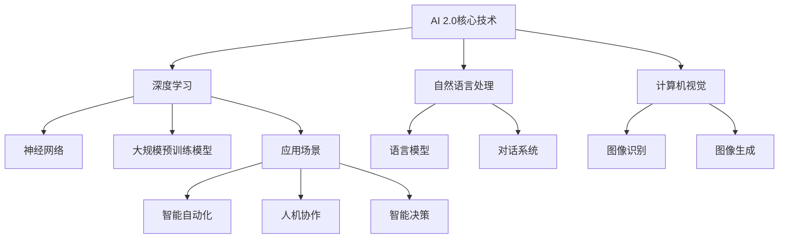
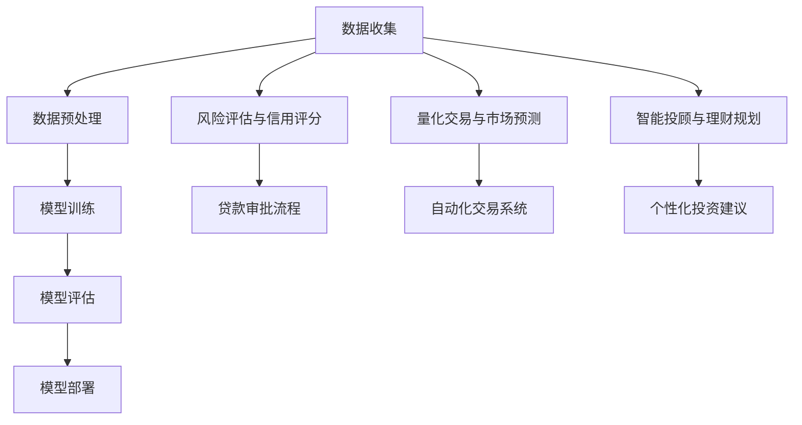
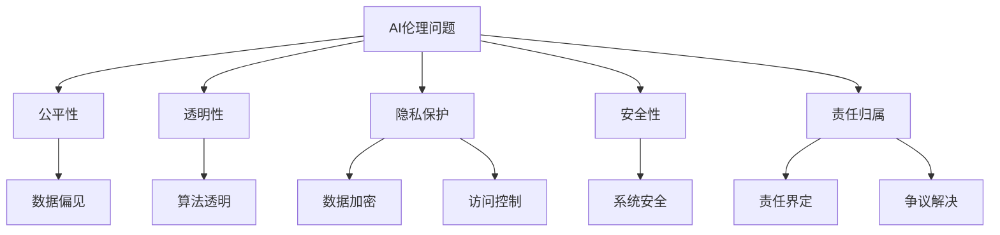
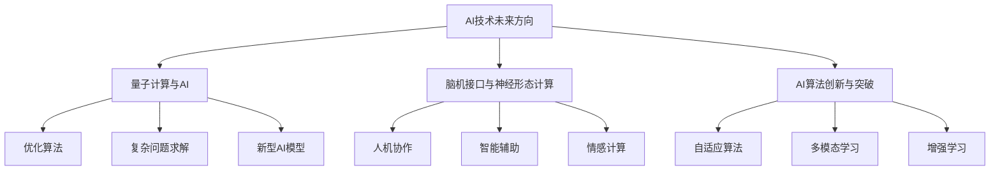
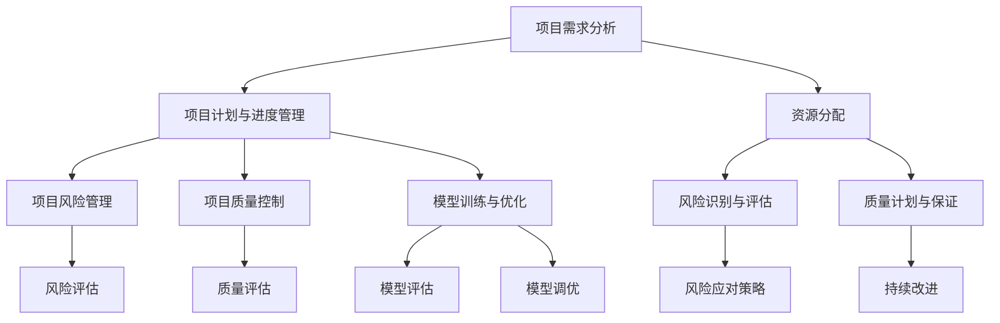
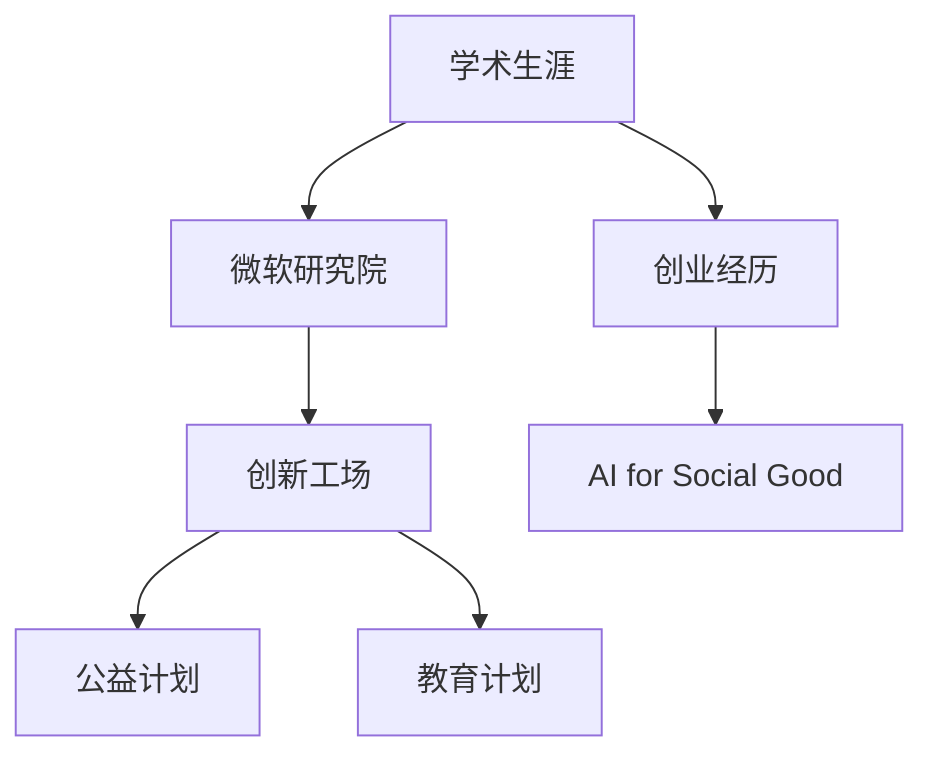

                 

### 第一部分：AI 2.0时代的未来展望

### 第1章: AI 2.0时代的定义与背景

### 1.1 AI 2.0时代的定义与特点

#### AI 2.0时代的定义

AI 2.0时代，也被认为是人工智能的第二阶段，是在AI 1.0时代基础上的进一步发展和深化。AI 1.0时代主要关注的是通过构建专用系统来解决特定领域的问题，如语音识别、图像识别等。而AI 2.0时代则更加注重通用人工智能（AGI，Artificial General Intelligence）的发展，追求让机器具备与人类相似的学习、推理、决策能力。

#### AI 2.0时代的特点

1. **深度学习和神经网络技术的成熟**：AI 2.0时代依赖于深度学习和神经网络技术的进一步成熟，这些技术使得机器能够从大量数据中自动学习复杂的模式。

2. **大规模数据和计算能力的提升**：AI 2.0时代需要海量的数据进行训练，同时也需要强大的计算能力来处理这些数据。

3. **多领域应用的融合**：AI 2.0时代将不仅仅局限于单一领域，而是在多个领域实现应用，如医疗、金融、制造、交通等。

4. **人机协作与智能决策**：AI 2.0时代强调人机协作，让机器成为人类的助手，提高决策的效率和质量。

5. **自主学习和自我进化**：AI 2.0时代的人工智能系统能够通过自主学习和自我进化来不断提升自身的性能。

### 1.1.1 从AI 1.0到AI 2.0的演变

在AI 1.0时代，人工智能的研究主要集中在如何构建能够解决特定问题的智能系统。这些系统通常是基于规则和算法，例如专家系统和决策树。虽然这些系统能够在某些领域取得显著成效，但它们的局限性也非常明显：

- **规则驱动**：专家系统依赖于人类专家制定的规则，这些规则往往难以涵盖所有可能的情景。
- **数据依赖**：决策树和分类算法需要大量的标记数据来训练模型，数据的质量和数量直接影响模型的性能。
- **专用性**：这些系统往往是针对特定任务设计的，缺乏通用性，难以迁移到其他领域。

AI 2.0时代的发展标志着人工智能技术的一个重要转折点。深度学习和神经网络的引入，使得机器能够从海量未标记的数据中自动学习特征，这一变化极大地提升了机器学习模型的性能。同时，随着计算能力的提升和大数据技术的发展，AI 2.0时代具备了实现通用人工智能（AGI）的基本条件。

在这一阶段，AI系统的目标是实现类似人类的感知、理解和决策能力。例如，通过卷积神经网络（CNN）和循环神经网络（RNN）等深度学习模型，AI系统能够在图像识别、语音识别、自然语言处理等领域取得突破性进展。此外，强化学习（Reinforcement Learning）和生成对抗网络（GAN）等新兴技术的出现，也为AI 2.0时代的发展增添了新的动力。

总的来说，从AI 1.0到AI 2.0的演变，不仅体现在技术上的进步，更体现在对人工智能本质认识的深化。AI 2.0时代的目标是构建能够自主学习和适应复杂环境的人工智能系统，实现从专用智能到通用智能的转变。

### 1.1.2 AI 2.0的核心优势

AI 2.0时代的核心优势体现在以下几个方面：

1. **智能自动化**：AI 2.0通过自动化技术，极大地提高了生产效率，减少了人工干预的必要性。在工业生产、物流管理、客户服务等领域，AI自动化系统能够自动执行复杂任务，提高工作效率，降低运营成本。

2. **人机协作**：AI 2.0强调人与机器的协作，通过机器学习模型和智能算法，AI系统可以帮助人类更好地完成复杂的任务。例如，在医疗诊断中，AI系统可以辅助医生分析病例，提供诊断建议，从而提高诊断的准确性和效率。

3. **智能决策**：AI 2.0通过数据分析和预测模型，能够做出更准确、更迅速的决策。在金融领域，AI系统可以分析市场数据，预测市场趋势，为投资者提供决策支持；在交通管理中，AI系统可以实时分析交通状况，优化交通流量，减少拥堵。

4. **大规模数据处理能力**：AI 2.0时代的机器学习模型，特别是深度学习模型，具备处理大规模数据的能力。通过大规模数据训练，AI系统可以更好地理解数据的模式和趋势，从而做出更准确的预测和决策。

5. **跨界融合**：AI 2.0时代不仅仅是单一领域的突破，而是在多个领域实现应用。例如，在医疗、金融、制造、交通等领域的AI应用，不仅提高了各自领域的效率，也促进了跨领域的创新和融合。

6. **自我学习和进化**：AI 2.0时代的机器学习模型具备自我学习和进化的能力。通过不断学习和优化，AI系统能够不断提升自身的性能和适应性，从而更好地应对复杂多变的环境。

### 1.1.3 AI 2.0的关键技术

AI 2.0时代的关键技术主要包括以下几个方面：

1. **大规模预训练模型**：预训练模型通过在大规模无标签数据上训练，获取通用的特征表示，然后在特定任务上进行微调。这种技术大大提升了模型在各类任务上的表现，如自然语言处理、计算机视觉等。

2. **自然语言处理**：自然语言处理（NLP）技术是AI 2.0时代的重要技术之一。通过深度学习和神经网络模型，NLP技术可以实现文本分类、机器翻译、情感分析等任务。

3. **计算机视觉**：计算机视觉技术通过卷积神经网络（CNN）和生成对抗网络（GAN）等模型，可以实现图像识别、目标检测、图像生成等任务。

4. **强化学习**：强化学习是一种通过试错和奖励机制来学习策略的机器学习技术。它在游戏、推荐系统、自动驾驶等领域具有广泛的应用。

5. **联邦学习**：联邦学习通过分布式学习的方式，保护用户隐私的同时，实现大规模数据的协同学习。

6. **量子计算**：量子计算是一种基于量子力学原理的计算方式，具有巨大的计算潜力。随着量子计算技术的发展，它有望在人工智能领域发挥重要作用。

### 1.2 AI 2.0时代的应用场景

AI 2.0时代的应用场景非常广泛，几乎涵盖了所有行业和领域。以下是一些主要的AI 2.0应用场景：

#### 智能自动化

1. **工业自动化**：在制造业中，AI系统可以通过自动化生产线、机器人等设备，实现生产流程的优化和自动化。例如，通过机器视觉系统，可以对产品质量进行实时监控和检测。

2. **物流管理**：AI系统可以优化物流路径，提高运输效率。例如，通过实时交通数据分析和预测，可以优化送货路线，减少运输时间和成本。

3. **服务业自动化**：在酒店、餐饮等行业，AI系统可以通过自动化客服、智能推荐等，提升服务质量和客户体验。

#### 人机协作

1. **医疗诊断**：AI系统可以辅助医生进行疾病诊断，提供诊断建议和治疗方案。例如，通过影像识别技术，AI系统可以辅助医生快速识别和诊断病变。

2. **法律咨询**：AI系统可以提供法律咨询服务，帮助律师进行案件分析和法律文书撰写。

3. **教育辅助**：AI系统可以通过个性化教学和智能推荐，提升教育质量和学习效果。

#### 智能决策

1. **金融分析**：AI系统可以通过数据分析，预测市场趋势，为投资者提供决策支持。例如，通过机器学习模型，可以分析历史数据，预测股票价格和交易策略。

2. **城市规划**：AI系统可以通过数据分析，优化城市规划，提高城市管理的效率和效果。例如，通过实时交通数据分析，可以优化交通流量，减少拥堵。

3. **供应链管理**：AI系统可以通过数据分析，优化供应链流程，提高供应链的效率和灵活性。

### 1.3 李开复AI 2.0时代的观点与展望

李开复教授是人工智能领域的著名学者和企业家，他对AI 2.0时代有着独特的见解和深刻的思考。以下是他的一些主要观点和展望：

#### 李开复AI 2.0时代的观点

1. **AI将成为核心驱动力**：李开复认为，AI技术将成为未来社会发展的核心驱动力，它将深刻改变各个行业和领域，推动社会进步。

2. **AI技术将实现跨领域应用**：AI技术不仅在单一领域取得突破，还将实现跨领域的应用。例如，在医疗、金融、制造、交通等领域，AI技术将发挥重要作用。

3. **AI技术将带来巨大的社会变革**：李开复指出，AI技术将带来巨大的社会变革，包括经济结构、就业模式、教育方式等。

#### 李开复对未来AI发展的看法

1. **技术进步**：李开复认为，AI技术将继续快速发展，特别是在深度学习、自然语言处理、计算机视觉等领域，将取得重大突破。

2. **人机协作**：李开复强调，人类与AI的协作将成为未来发展的主要模式。通过AI的辅助，人类可以更加高效地完成复杂任务。

3. **伦理问题**：李开复认为，AI技术的发展必须解决伦理问题，特别是隐私保护、安全控制、责任归属等。

#### AI 2.0对社会的影响

1. **经济影响**：AI技术将改变劳动力市场，提高生产效率，但也可能导致某些职业的失业。因此，李开复提出，必须进行职业教育和技能培训，以适应AI时代的变化。

2. **教育影响**：AI技术将改变教育模式，实现个性化教育，但也可能导致教育资源的分配不均。因此，李开复强调，必须推动教育公平，缩小数字鸿沟。

3. **社会影响**：AI技术将提升生活质量，改善社会问题，但同时也可能带来新的挑战，如隐私侵犯、安全威胁等。因此，李开复主张，必须加强AI监管，确保技术造福人类。

### 总结

AI 2.0时代是一个充满机遇和挑战的时代。通过深度学习和神经网络技术的成熟，AI技术将实现从专用智能到通用智能的转变，为社会带来巨大的变革和影响。李开复教授对AI 2.0时代的展望和观点，为我们指明了未来发展的方向。在这个时代，我们必须积极应对挑战，充分利用AI技术的优势，推动社会进步。

### Mermaid 流程图：AI 2.0的核心技术与应用场景



### 数学模型与算法原理讲解

#### 神经网络与深度学习

##### 神经网络基础

神经网络（Neural Network）是一种模仿生物神经系统结构和功能的计算模型，由大量的神经元（Node）连接而成。每个神经元接收多个输入信号，通过加权求和处理后，输出一个值。

神经网络的激活函数（Activation Function）是关键组成部分，用于引入非线性特性。常见的激活函数有：
- Sigmoid函数：\( f(x) = \frac{1}{1 + e^{-x}} \)
- ReLU函数：\( f(x) = \max(0, x) \)

##### 深度学习模型

深度学习（Deep Learning）是一种基于神经网络的机器学习方法，通过堆叠多层神经网络来提高模型的复杂度和表达能力。深度学习模型由多个隐藏层组成，每层神经元都通过前一层神经元的输出进行加权求和处理。

常见的深度学习模型有：
- 全连接神经网络（Fully Connected Neural Network）
- 卷积神经网络（Convolutional Neural Network, CNN）
- 循环神经网络（Recurrent Neural Network, RNN）
- 长短时记忆网络（Long Short-Term Memory, LSTM）

##### 损失函数与优化算法

在深度学习训练过程中，需要通过优化算法调整模型参数，使模型输出与真实值尽可能接近。损失函数（Loss Function）用于衡量模型预测值与真实值之间的差距。

常见的损失函数有：
- 交叉熵损失（Cross-Entropy Loss）：用于分类任务
- 均方误差损失（Mean Squared Error Loss）：用于回归任务

优化算法用于调整模型参数，以最小化损失函数。常见的优化算法有：
- 梯度下降（Gradient Descent）：通过计算损失函数关于模型参数的梯度，逐步调整参数，以减少损失。
- 动量优化（Momentum）：在梯度下降的基础上引入动量，加速收敛。
- Adam优化器（Adam Optimizer）：结合了动量和自适应学习率，具有良好的收敛性能。

#### 大规模预训练模型

##### 预训练概念

预训练（Pre-training）是指在大量无标签数据上对神经网络模型进行训练，以学习通用的特征表示。预训练模型的目的是通过学习大量的通用特征，提高模型在特定任务上的性能。

##### 微调技术

微调（Fine-tuning）是指在预训练模型的基础上，针对特定任务进行进一步的训练。微调过程通常包括以下几个步骤：
1. 使用预训练模型在特定任务的数据集上进行训练。
2. 调整预训练模型的参数，使其适应特定任务。
3. 继续训练模型，直到满足性能要求。

#### 自然语言处理

##### 语言模型

语言模型（Language Model）是一种用于预测下一个单词或句子的模型，常用于自然语言处理任务。常见的语言模型有：
- 有限状态转换模型（N-gram Model）
- 神经网络语言模型（Neural Network Language Model）

语言模型通过学习大量文本数据，预测下一个单词或句子的概率分布。

##### 对话系统

对话系统（Dialogue System）是一种用于实现人机交互的模型，常用于聊天机器人、智能客服等场景。对话系统通常包括以下几个部分：
- 语言理解（Language Understanding）：将用户的自然语言输入转换为机器可以理解和处理的格式。
- 上下文管理（Context Management）：处理对话中的上下文信息，理解用户的意图。
- 语言生成（Language Generation）：生成自然语言回应，与用户进行有效沟通。

##### 序列模型与注意力机制

序列模型（Sequential Model）是一种用于处理序列数据的模型，如自然语言处理和语音识别。常见的序列模型有：
- 循环神经网络（Recurrent Neural Network, RNN）
- 长短时记忆网络（Long Short-Term Memory, LSTM）
- 门控循环单元（Gated Recurrent Unit, GRU）

注意力机制（Attention Mechanism）是一种用于序列模型的关键技术，通过为不同的输入序列分配不同的权重，提高模型对重要信息的关注。

#### 计算机视觉

##### 卷积神经网络与图像识别

卷积神经网络（Convolutional Neural Network, CNN）是一种用于处理图像数据的深度学习模型，通过卷积层、池化层和全连接层等结构，实现对图像的自动特征提取和分类。

图像识别（Image Recognition）是计算机视觉的一个重要任务，通过训练CNN模型，可以从图像中识别出特定的对象或类别。

##### 目标检测与图像分割

目标检测（Object Detection）是一种用于识别图像中的对象及其位置的任务。常见的目标检测模型有：
- 区域建议网络（Region Proposal Network, RPN）
- Faster R-CNN、SSD、YOLO等模型

图像分割（Image Segmentation）是一种用于将图像划分为不同区域的任务，用于图像理解和物体识别。常见的图像分割模型有：
- 基于CNN的图像分割模型，如U-Net、SegNet
- 基于图模型的图像分割方法，如CRF（条件随机场）

##### 图像生成与风格迁移

图像生成（Image Generation）是一种生成新图像的任务，通过训练生成对抗网络（Generative Adversarial Network, GAN），可以从大量图像数据中学习生成新的图像。

风格迁移（Style Transfer）是一种将一种艺术作品的风格应用到另一幅图像上的技术。通过训练神经网络模型，可以将一幅图像的内容与另一幅图像的风格相结合，生成具有独特风格的新图像。

### 项目实战：金融领域的AI应用

#### 风险评估与信用评分

##### 项目概述

风险评估与信用评分是金融领域中重要的应用，通过构建机器学习模型，可以对企业或个人的信用风险进行评估，为金融机构提供决策支持。本项目将使用机器学习算法，对贷款申请进行风险评估和信用评分。

##### 数据准备

数据集包含以下特征：
- 个人基本信息：年龄、收入、职业等
- 贷款信息：贷款金额、贷款期限、还款方式等
- 信用记录：逾期记录、信用评分等

数据预处理步骤包括：
1. 数据清洗：处理缺失值、异常值和重复值。
2. 特征工程：对数值型特征进行归一化或标准化处理，对类别型特征进行编码。

##### 模型训练

使用逻辑回归、决策树、随机森林等算法，对训练集进行模型训练。通过交叉验证和网格搜索等技术，优化模型参数，选择最佳模型。

##### 模型评估

使用测试集对模型进行评估，通过准确率、召回率、F1分数等指标，评估模型性能。对模型进行调参和优化，以提高模型精度。

##### 模型部署

将训练好的模型部署到生产环境中，对新的贷款申请进行风险评估和信用评分。模型部署可以通过API接口、批处理等方式进行。

#### 量化交易与市场预测

##### 项目概述

量化交易与市场预测是金融领域中的一种高级应用，通过分析市场数据，预测市场趋势，进行自动化交易。本项目将使用机器学习算法，对股票价格进行预测。

##### 数据收集

收集市场数据，包括股票价格、交易量、财务指标等。数据来源可以是历史交易数据、财经新闻、社交媒体等。

##### 模型训练

使用时间序列模型、深度学习模型等算法，对训练集进行模型训练。通过回测，评估模型性能，选择最佳模型。

##### 模型评估

使用测试集对模型进行评估，通过预测准确率、预测误差等指标，评估模型性能。对模型进行调参和优化，以提高预测精度。

##### 模型部署

将训练好的模型部署到交易系统中，实现自动化交易。模型部署可以通过API接口、批处理等方式进行。

### 附录

#### 附录A: AI开发工具与框架

- **TensorFlow**：一款开源的机器学习框架，适用于构建和训练各种机器学习模型。
- **PyTorch**：一款基于Python的深度学习框架，提供动态计算图和简洁的API。
- **Keras**：一款高层神经网络API，可以在TensorFlow和PyTorch等框架上运行。

#### 附录B: AI研究论文与资料

- **“Attention Is All You Need”**：提出Transformer模型，彻底改变了自然语言处理领域。
- **“Bert: Pre-training of Deep Bidirectional Transformers for Language Understanding”**：提出BERT模型，推动了自然语言处理的发展。
- **“Generative Adversarial Networks”**：提出生成对抗网络（GAN），开创了新的研究领域。

#### 附录C: AI开源项目与案例

- **TensorFlow**：[https://github.com/tensorflow/tensorflow](https://github.com/tensorflow/tensorflow)
- **PyTorch**：[https://github.com/pytorch/pytorch](https://github.com/pytorch/pytorch)
- **Keras**：[https://github.com/keras-team/keras](https://github.com/keras-team/keras)

#### 附录D: AI开源项目实践案例

- **房价预测**：[https://www.kaggle.com/c/house-prices-advanced-regression-techniques](https://www.kaggle.com/c/house-prices-advanced-regression-techniques)
- **文本分类**：[https://www.kaggle.com/c/text-classification-challenge](https://www.kaggle.com/c/text-classification-challenge)
- **图像分类**：[https://www.kaggle.com/c/dogs-vs-cats](https://www.kaggle.com/c/dogs-vs-cats)

### 作者信息

**作者**：AI天才研究院/AI Genius Institute & 禅与计算机程序设计艺术 /Zen And The Art of Computer Programming

---

### 第2章: AI 2.0时代的核心技术

#### 第2章: AI 2.0时代的核心技术

### 2.1 人工智能的基础理论

人工智能（AI）作为一门多学科交叉的领域，其基础理论涵盖了计算机科学、心理学、认知科学、神经科学等多个学科。以下是对人工智能基础理论的详细讲解：

#### 神经网络与深度学习

##### 神经网络基础

神经网络（Neural Network）是一种模拟生物神经系统结构的计算模型，由大量神经元（Node）通过加权连接构成。每个神经元接收来自其他神经元的输入信号，通过加权求和处理后，输出一个值。这个过程可以表示为：

$$
\text{输出} = \text{激活函数}( \sum_{i=1}^{n} w_i \cdot x_i + b)
$$

其中，$w_i$ 是权重，$x_i$ 是输入值，$b$ 是偏置，激活函数（如Sigmoid、ReLU等）用于引入非线性特性。

##### 深度学习模型

深度学习（Deep Learning）是神经网络的一种扩展，通过堆叠多层神经网络（即深度神经网络），可以学习更复杂的特征表示。深度学习模型通常由输入层、多个隐藏层和输出层组成。每个隐藏层都对输入数据进行非线性变换，从而提取更高层次的特征。

常见的深度学习模型包括：

- **全连接神经网络（Fully Connected Neural Network）**：每个神经元都与上一层的所有神经元相连。
- **卷积神经网络（Convolutional Neural Network, CNN）**：特别适用于图像处理任务，通过卷积层提取图像特征。
- **循环神经网络（Recurrent Neural Network, RNN）**：特别适用于序列数据，通过循环结构保持长期依赖信息。
- **长短时记忆网络（Long Short-Term Memory, LSTM）**：是RNN的一种变体，解决了长期依赖问题。

##### 损失函数与优化算法

在训练深度学习模型时，损失函数用于衡量模型预测值与真实值之间的差距。常见的损失函数包括：

- **均方误差（Mean Squared Error, MSE）**：用于回归任务。
- **交叉熵（Cross-Entropy Loss）**：用于分类任务。

优化算法用于调整模型参数，以最小化损失函数。常见的优化算法包括：

- **梯度下降（Gradient Descent）**：通过计算损失函数关于模型参数的梯度，反向传播调整参数。
- **随机梯度下降（Stochastic Gradient Descent, SGD）**：每次迭代使用一个样本的梯度。
- **批量梯度下降（Batch Gradient Descent）**：每次迭代使用所有样本的梯度。
- **Adam优化器（Adam Optimizer）**：结合了动量和自适应学习率，具有良好的收敛性能。

#### 机器学习算法概述

机器学习（Machine Learning）是人工智能的核心组成部分，通过算法从数据中学习规律和模式。机器学习算法可以分为以下几类：

- **监督学习（Supervised Learning）**：有标记数据作为训练集，学习输入和输出之间的映射关系。常见的算法包括：
  - 线性回归（Linear Regression）
  - 逻辑回归（Logistic Regression）
  - 决策树（Decision Tree）
  - 随机森林（Random Forest）
  - 支持向量机（Support Vector Machine, SVM）

- **无监督学习（Unsupervised Learning）**：没有标记数据，学习数据的内在结构和模式。常见的算法包括：
  - 聚类（Clustering）
  - 主成分分析（Principal Component Analysis, PCA）
  - 自编码器（Autoencoder）

- **半监督学习（Semi-Supervised Learning）**：结合有标记数据和未标记数据，提高学习效果。

- **强化学习（Reinforcement Learning）**：通过试错和奖励机制学习策略，常见于游戏、机器人控制等领域。

#### 强化学习与生成对抗网络

##### 强化学习

强化学习（Reinforcement Learning, RL）是一种通过试错和奖励机制学习策略的机器学习方法。在强化学习中，智能体（Agent）通过与环境的交互，学习最优策略，以最大化累积奖励。

强化学习的基本概念包括：

- **状态（State）**：智能体当前所处的环境状态。
- **动作（Action）**：智能体可以采取的动作。
- **奖励（Reward）**：智能体采取动作后获得的奖励。
- **策略（Policy）**：智能体根据当前状态选择动作的策略。

常见的强化学习算法包括：

- **Q学习（Q-Learning）**：通过学习状态-动作值函数（Q-Function），预测每个动作在当前状态下获得的奖励。
- **深度Q网络（Deep Q-Network, DQN）**：将Q学习扩展到深度神经网络，用于处理复杂状态空间。
- **策略梯度算法（Policy Gradient）**：直接优化策略，而不是状态-动作值函数。

##### 生成对抗网络

生成对抗网络（Generative Adversarial Network, GAN）是由生成器（Generator）和判别器（Discriminator）组成的对抗性模型。生成器的目标是生成与真实数据相似的数据，判别器的目标是区分真实数据和生成数据。

GAN的训练过程可以看作是一个零和游戏，生成器和判别器相互竞争，以实现最优解。训练过程中，生成器不断学习如何生成更逼真的数据，判别器不断学习如何更好地区分真实数据和生成数据。

### 2.2 大规模预训练模型

##### 预训练模型的概念与意义

预训练模型（Pre-trained Model）是一种通过在大规模无标签数据上训练，获取通用的特征表示，然后在特定任务上进行微调（Fine-tuning）的模型。预训练模型的核心思想是利用未标记的数据学习通用的特征表示，这些特征表示可以在不同的任务中迁移和复用。

预训练模型的意义在于：

- **提高模型性能**：通过在大规模无标签数据上预训练，模型可以学习到更丰富的特征表示，从而在特定任务上获得更好的性能。
- **减少数据依赖**：预训练模型可以通过少量有标签数据实现迁移学习，减少对大量有标签数据的依赖。
- **提高泛化能力**：预训练模型可以更好地适应不同领域和任务，提高模型的泛化能力。

##### 大规模预训练模型的技术细节

大规模预训练模型通常包括以下技术细节：

- **预训练数据集**：常用的预训练数据集包括维基百科（WikiText）、Common Crawl、ImageNet等。数据集的选择和预处理对于预训练模型的性能至关重要。
- **预训练任务**：预训练任务包括语言建模（Language Modeling）、图像分类（Image Classification）、文本分类（Text Classification）等。不同的预训练任务有助于模型学习到不同类型的特征。
- **预训练算法**：常用的预训练算法包括Transformer、BERT、GPT等。这些算法通过堆叠多层神经网络，学习到深层次的语义特征。

##### 预训练模型的应用场景

预训练模型在多个领域和任务中取得了显著的应用效果，以下是一些常见应用场景：

- **自然语言处理**：预训练模型在自然语言处理任务中表现出色，如文本分类、机器翻译、问答系统等。常见的预训练模型包括BERT、GPT、T5等。
- **计算机视觉**：预训练模型在计算机视觉任务中也取得了很大成功，如图像分类、目标检测、图像分割等。常见的预训练模型包括ResNet、VGG、EfficientNet等。
- **跨模态学习**：预训练模型可以通过跨模态学习，将文本、图像、音频等多种类型的数据进行联合建模，实现跨模态信息融合。

### 2.3 自然语言处理技术

自然语言处理（Natural Language Processing, NLP）是人工智能的重要分支，致力于使计算机理解和处理自然语言。以下是对自然语言处理技术的详细讲解：

##### 词嵌入与语言模型

词嵌入（Word Embedding）是将词语映射到高维向量空间的技术，通过向量表示词语的语义信息。常见的词嵌入方法包括：

- **词袋模型（Bag of Words, BoW）**：将文本表示为词频向量。
- **词嵌入（Word2Vec）**：通过神经网络学习词语的向量表示，如CBOW（连续词袋）和Skip-Gram模型。
- ** GloVe（Global Vectors for Word Representation）**：基于全局共现矩阵学习词语的向量表示。

语言模型（Language Model）是一种用于预测下一个单词或句子的模型，常用于NLP任务。常见的语言模型包括：

- **N-gram模型**：基于前N个单词预测下一个单词。
- **神经网络语言模型**：基于神经网络预测下一个单词的概率分布。

##### 序列模型与注意力机制

序列模型（Sequential Model）是一种用于处理序列数据的模型，如自然语言处理和语音识别。常见的序列模型包括：

- **循环神经网络（Recurrent Neural Network, RNN）**：通过循环结构处理序列数据。
- **长短时记忆网络（Long Short-Term Memory, LSTM）**：是RNN的一种变体，解决了长期依赖问题。
- **门控循环单元（Gated Recurrent Unit, GRU）**：是LSTM的简化版本。

注意力机制（Attention Mechanism）是一种用于序列模型的关键技术，通过为不同的输入序列分配不同的权重，提高模型对重要信息的关注。注意力机制在机器翻译、文本生成等任务中取得了显著效果。

##### 跨语言与多语言处理

跨语言与多语言处理是NLP的重要研究领域，旨在实现不同语言之间的理解和处理。常见的跨语言与多语言处理任务包括：

- **机器翻译（Machine Translation）**：将一种语言的文本翻译成另一种语言。
- **翻译模型（Translation Model）**：通过神经网络学习源语言和目标语言之间的映射关系。
- **多语言文本分类（Multilingual Text Classification）**：对多语言文本进行分类，如情感分析、主题分类等。

### 2.4 计算机视觉技术

计算机视觉（Computer Vision）是人工智能的重要分支，致力于使计算机理解和解释视觉信息。以下是对计算机视觉技术的详细讲解：

##### 卷积神经网络与图像识别

卷积神经网络（Convolutional Neural Network, CNN）是一种专门用于处理图像数据的神经网络。CNN通过卷积层、池化层和全连接层等结构，实现对图像的自动特征提取和分类。

常见的CNN结构包括：

- **卷积层（Convolutional Layer）**：通过卷积操作提取图像特征。
- **池化层（Pooling Layer）**：降低图像分辨率，减少模型参数数量。
- **全连接层（Fully Connected Layer）**：将卷积层提取的特征映射到类别。

图像识别（Image Recognition）是计算机视觉的一个基本任务，通过训练CNN模型，可以识别图像中的对象或类别。

##### 目标检测与图像分割

目标检测（Object Detection）是一种用于识别图像中对象的算法，包括检测对象的位置和类别。常见的目标检测算法包括：

- **R-CNN（Region-based Convolutional Neural Network）**：通过区域建议网络（Region Proposal Network, RPN）生成候选区域，然后对每个区域进行分类。
- **Faster R-CNN、SSD、YOLO**：是R-CNN的改进版本，提高了检测速度和精度。

图像分割（Image Segmentation）是将图像划分为不同区域的任务，用于图像理解和物体识别。常见的图像分割算法包括：

- **基于CNN的图像分割模型（如U-Net、SegNet）**：通过卷积神经网络提取图像特征，实现像素级的分类。
- **基于图模型的图像分割方法（如条件随机场CRF）**：通过图模型实现像素级别的分割。

##### 图像生成与风格迁移

图像生成（Image Generation）是一种通过训练生成对抗网络（Generative Adversarial Network, GAN）生成新图像的技术。GAN由生成器和判别器组成，生成器尝试生成逼真的图像，判别器尝试区分真实图像和生成图像。

常见的图像生成任务包括：

- **图像到图像翻译（如Image-to-Image Translation）**：将一种类型的图像转换为另一种类型的图像，如将素描转换为彩色图像。
- **图像合成（如Image Synthesis）**：生成新的图像，如生成人脸图像。

风格迁移（Style Transfer）是一种将一种艺术作品的风格应用到另一幅图像上的技术。通过训练神经网络模型，可以将一幅图像的内容与另一幅图像的风格相结合，生成具有独特风格的新图像。

### 第3章: AI 2.0时代的应用案例

#### 第3章: AI 2.0时代的应用案例

### 3.1 金融领域的AI应用

金融领域作为人工智能技术的一个重要应用场景，近年来在风险控制、市场预测、客户服务等方面取得了显著的成果。以下是对金融领域AI应用的详细讲解。

#### 风险评估与信用评分

##### 项目概述

风险评估与信用评分是金融领域中至关重要的任务，通过构建机器学习模型，金融机构可以更准确地评估客户的信用风险，从而优化贷款审批流程，降低坏账率。

##### 数据准备

金融领域的数据主要包括客户基本信息、财务状况、信用记录等。数据来源可以是金融机构的历史数据、公共征信记录、第三方数据供应商等。

数据预处理步骤包括：

1. 数据清洗：处理缺失值、异常值和重复值。
2. 特征工程：对数值型特征进行归一化或标准化处理，对类别型特征进行编码。
3. 数据分割：将数据集划分为训练集、验证集和测试集。

##### 模型训练

常用的机器学习算法包括逻辑回归、决策树、随机森林等。通过交叉验证和网格搜索等技术，优化模型参数，选择最佳模型。

##### 模型评估

使用测试集对模型进行评估，通过准确率、召回率、F1分数等指标，评估模型性能。对模型进行调参和优化，以提高模型精度。

##### 模型部署

将训练好的模型部署到生产环境中，对新的贷款申请进行风险评估和信用评分。模型部署可以通过API接口、批处理等方式进行。

#### 量化交易与市场预测

##### 项目概述

量化交易与市场预测是金融领域中的一种高级应用，通过分析市场数据，预测市场趋势，进行自动化交易，实现资产增值。

##### 数据收集

市场数据主要包括股票价格、交易量、财务指标等。数据来源可以是交易所、财经网站、第三方数据供应商等。

##### 模型训练

常用的机器学习算法包括时间序列模型、深度学习模型等。通过回测，评估模型性能，选择最佳模型。

##### 模型评估

使用测试集对模型进行评估，通过预测准确率、预测误差等指标，评估模型性能。对模型进行调参和优化，以提高预测精度。

##### 模型部署

将训练好的模型部署到交易系统中，实现自动化交易。模型部署可以通过API接口、批处理等方式进行。

#### 智能投顾与理财规划

##### 项目概述

智能投顾与理财规划是金融领域新兴的应用，通过AI技术，为投资者提供个性化的投资建议和理财规划服务。

##### 数据准备

投资数据主要包括投资者风险偏好、财务状况、投资目标等。数据来源可以是问卷调查、历史投资记录等。

##### 模型训练

常用的机器学习算法包括决策树、随机森林等。通过交叉验证和网格搜索等技术，优化模型参数，选择最佳模型。

##### 模型评估

使用测试集对模型进行评估，通过准确率、召回率、F1分数等指标，评估模型性能。对模型进行调参和优化，以提高模型精度。

##### 模型部署

将训练好的模型部署到理财规划系统中，为投资者提供个性化的投资建议和理财规划服务。模型部署可以通过API接口、批处理等方式进行。

### 3.2 医疗健康领域的AI应用

医疗健康领域是AI技术的另一个重要应用场景，AI技术在疾病诊断、药物研发、健康监测等方面发挥着重要作用。以下是对医疗健康领域AI应用的详细讲解。

#### 疾病诊断与预测

##### 项目概述

疾病诊断与预测是医疗领域中至关重要的任务，通过AI技术，可以更准确、更快速地诊断疾病，提高医疗效率。

##### 数据准备

医疗数据主要包括患者信息、诊断记录、医疗影像等。数据来源可以是医疗机构、电子健康记录等。

数据预处理步骤包括：

1. 数据清洗：处理缺失值、异常值和重复值。
2. 特征工程：对数值型特征进行归一化或标准化处理，对类别型特征进行编码。
3. 数据分割：将数据集划分为训练集、验证集和测试集。

##### 模型训练

常用的机器学习算法包括卷积神经网络（CNN）、循环神经网络（RNN）等。通过交叉验证和网格搜索等技术，优化模型参数，选择最佳模型。

##### 模型评估

使用测试集对模型进行评估，通过准确率、召回率、F1分数等指标，评估模型性能。对模型进行调参和优化，以提高模型精度。

##### 模型部署

将训练好的模型部署到医疗系统中，对新的病例进行疾病诊断和预测。模型部署可以通过API接口、批处理等方式进行。

#### 药物研发与临床试验

##### 项目概述

药物研发与临床试验是医疗领域中复杂且耗时的工作，AI技术可以通过分析大量数据，加速药物研发过程，提高研发效率。

##### 数据收集

药物研发数据主要包括分子结构、生物活性、临床试验数据等。数据来源可以是科研机构、医药公司、公共数据库等。

##### 模型训练

常用的机器学习算法包括深度学习、生成对抗网络（GAN）等。通过交叉验证和网格搜索等技术，优化模型参数，选择最佳模型。

##### 模型评估

使用测试集对模型进行评估，通过准确率、召回率、F1分数等指标，评估模型性能。对模型进行调参和优化，以提高模型精度。

##### 模型部署

将训练好的模型部署到药物研发系统中，用于预测药物活性、设计新分子等。模型部署可以通过API接口、批处理等方式进行。

#### 智能健康监测与健康管理

##### 项目概述

智能健康监测与健康管理是利用AI技术，对个体健康数据进行实时监测和分析，提供个性化的健康建议和干预方案。

##### 数据准备

健康数据主要包括生理指标、生活习惯、基因信息等。数据来源可以是可穿戴设备、健康管理系统、公共健康数据库等。

##### 模型训练

常用的机器学习算法包括决策树、随机森林等。通过交叉验证和网格搜索等技术，优化模型参数，选择最佳模型。

##### 模型评估

使用测试集对模型进行评估，通过准确率、召回率、F1分数等指标，评估模型性能。对模型进行调参和优化，以提高模型精度。

##### 模型部署

将训练好的模型部署到智能健康监测系统中，为用户提供健康监测和干预服务。模型部署可以通过API接口、批处理等方式进行。

### 3.3 制造业领域的AI应用

制造业是国民经济的重要支柱，AI技术在制造业中的应用日益广泛，包括智能制造与工业自动化、质量检测与设备维护、生产计划与供应链优化等方面。

#### 智能制造与工业自动化

##### 项目概述

智能制造与工业自动化是利用AI技术，实现生产过程的自动化和智能化，提高生产效率和质量。

##### 数据准备

制造数据主要包括生产参数、设备状态、工艺流程等。数据来源可以是生产线传感器、工业控制系统等。

##### 模型训练

常用的机器学习算法包括决策树、随机森林等。通过交叉验证和网格搜索等技术，优化模型参数，选择最佳模型。

##### 模型评估

使用测试集对模型进行评估，通过准确率、召回率、F1分数等指标，评估模型性能。对模型进行调参和优化，以提高模型精度。

##### 模型部署

将训练好的模型部署到生产系统中，实现生产过程的自动化和智能化。模型部署可以通过API接口、批处理等方式进行。

#### 质量检测与设备维护

##### 项目概述

质量检测与设备维护是确保生产过程顺利进行的重要环节，AI技术可以通过数据分析，实现质量检测和设备故障预测。

##### 数据准备

质量数据包括产品检测结果、设备运行状态等。数据来源可以是质量检测设备、工业控制系统等。

##### 模型训练

常用的机器学习算法包括卷积神经网络（CNN）、循环神经网络（RNN）等。通过交叉验证和网格搜索等技术，优化模型参数，选择最佳模型。

##### 模型评估

使用测试集对模型进行评估，通过准确率、召回率、F1分数等指标，评估模型性能。对模型进行调参和优化，以提高模型精度。

##### 模型部署

将训练好的模型部署到质量检测和设备维护系统中，实现实时监控和故障预测。模型部署可以通过API接口、批处理等方式进行。

#### 生产计划与供应链优化

##### 项目概述

生产计划与供应链优化是制造业中重要的管理任务，AI技术可以通过数据分析，优化生产计划和供应链管理，提高运营效率。

##### 数据准备

生产数据包括订单信息、库存数据、生产参数等。数据来源可以是ERP系统、供应链管理系统等。

##### 模型训练

常用的机器学习算法包括线性规划、优化算法等。通过交叉验证和网格搜索等技术，优化模型参数，选择最佳模型。

##### 模型评估

使用测试集对模型进行评估，通过准确率、召回率、F1分数等指标，评估模型性能。对模型进行调参和优化，以提高模型精度。

##### 模型部署

将训练好的模型部署到生产计划和供应链优化系统中，实现生产计划和供应链的优化。模型部署可以通过API接口、批处理等方式进行。

### 3.4 零售业与电商领域的AI应用

零售业与电商领域是AI技术的重要应用场景之一，AI技术在个性化推荐、客户行为分析、供应链管理等方面发挥着重要作用。

#### 智能推荐系统

##### 项目概述

智能推荐系统是零售业与电商领域的重要工具，通过分析用户行为和商品信息，为用户提供个性化的推荐。

##### 数据准备

推荐系统数据主要包括用户行为数据、商品信息等。数据来源可以是电商平台的交易记录、用户浏览记录等。

##### 模型训练

常用的机器学习算法包括协同过滤、矩阵分解等。通过交叉验证和网格搜索等技术，优化模型参数，选择最佳模型。

##### 模型评估

使用测试集对模型进行评估，通过准确率、召回率、F1分数等指标，评估模型性能。对模型进行调参和优化，以提高模型精度。

##### 模型部署

将训练好的模型部署到电商平台，实现个性化推荐。模型部署可以通过API接口、批处理等方式进行。

#### 客户行为分析

##### 项目概述

客户行为分析是零售业与电商领域的重要任务，通过分析客户行为数据，了解客户需求和购买习惯，为营销策略提供支持。

##### 数据准备

客户行为数据包括用户浏览记录、购买记录、评论等。数据来源可以是电商平台的用户行为日志等。

##### 模型训练

常用的机器学习算法包括聚类、关联规则挖掘等。通过交叉验证和网格搜索等技术，优化模型参数，选择最佳模型。

##### 模型评估

使用测试集对模型进行评估，通过准确率、召回率、F1分数等指标，评估模型性能。对模型进行调参和优化，以提高模型精度。

##### 模型部署

将训练好的模型部署到电商平台，实现客户行为分析。模型部署可以通过API接口、批处理等方式进行。

#### 供应链管理与物流优化

##### 项目概述

供应链管理与物流优化是零售业与电商领域的核心任务之一，通过AI技术，可以优化供应链流程，提高物流效率。

##### 数据准备

供应链数据包括库存数据、运输数据、市场需求等。数据来源可以是供应链管理系统、物流公司等。

##### 模型训练

常用的机器学习算法包括线性规划、优化算法等。通过交叉验证和网格搜索等技术，优化模型参数，选择最佳模型。

##### 模型评估

使用测试集对模型进行评估，通过准确率、召回率、F1分数等指标，评估模型性能。对模型进行调参和优化，以提高模型精度。

##### 模型部署

将训练好的模型部署到供应链管理系统，实现供应链优化和物流优化。模型部署可以通过API接口、批处理等方式进行。

### 总结

AI技术在金融、医疗健康、制造业、零售业与电商等领域有着广泛的应用，通过风险评估与信用评分、疾病诊断与预测、智能健康监测与健康管理、智能制造与工业自动化、质量检测与设备维护、生产计划与供应链优化、智能推荐系统、客户行为分析、供应链管理与物流优化等应用案例，展示了AI技术在提升效率、降低成本、优化决策等方面的巨大潜力。随着AI技术的不断进步，我们有理由相信，AI将在未来为各个行业带来更多的创新和变革。

### Mermaid 流程图：金融领域AI应用流程



### 数学模型与算法原理讲解

#### 风险评估与信用评分

##### 模型原理

风险评估与信用评分的核心是构建一个预测模型，用于评估贷款申请者的信用风险。这通常涉及以下步骤：

1. **特征选择**：从贷款申请数据中选取与信用评分相关的特征，如年龄、收入、就业历史、债务收入比等。
2. **建模**：使用统计模型或机器学习算法构建信用评分模型。常用的模型包括逻辑回归、决策树、随机森林等。
3. **评估**：通过交叉验证等方法评估模型的性能，如准确率、召回率、F1分数等。

##### 模型方程

逻辑回归是一种常见的信用评分模型，其目标是最小化损失函数，得到最优的模型参数。逻辑回归的模型方程如下：

$$
\text{概率} = \text{sigmoid}( \beta_0 + \beta_1 \cdot X_1 + \beta_2 \cdot X_2 + ... + \beta_n \cdot X_n )
$$

其中，$X_1, X_2, ..., X_n$ 是特征值，$\beta_0, \beta_1, \beta_2, ..., \beta_n$ 是模型参数，$sigmoid(x) = \frac{1}{1 + e^{-x}}$ 是激活函数。

##### 伪代码

```python
# 特征选择
X = [age, income, employment_history, debt_income_ratio]

# 模型训练
logistic_regression = LogisticRegression()
logistic_regression.fit(X_train, y_train)

# 模型评估
accuracy = logistic_regression.score(X_test, y_test)
print("Accuracy:", accuracy)
```

#### 量化交易与市场预测

##### 模型原理

量化交易与市场预测通常涉及时间序列分析，使用统计模型或机器学习算法来预测股票价格或其他金融指标。常见的模型包括ARIMA、LSTM等。

##### 模型方程

LSTM（长短时记忆网络）是一种用于处理序列数据的深度学习模型，其目标是通过学习序列中的长期依赖关系来预测未来的值。LSTM的模型方程如下：

$$
\text{输出} = \text{sigmoid}( \text{输入} \cdot \text{权重} + \text{偏置} )
$$

其中，输入是当前时刻的股票价格，权重和偏置是模型参数。

##### 伪代码

```python
# 模型训练
lstm_model = LSTM(input_shape=(timesteps, features))
lstm_model.compile(optimizer='adam', loss='mse')
lstm_model.fit(X_train, y_train, epochs=100, batch_size=32)

# 模型评估
mse = lstm_model.evaluate(X_test, y_test)
print("MSE:", mse)
```

#### 智能投顾与理财规划

##### 模型原理

智能投顾与理财规划通常涉及风险评估和投资组合优化。风险评估通过构建模型评估投资者的风险偏好，投资组合优化通过最大化收益或最小化风险来设计投资组合。

##### 模型方程

投资组合优化的目标是最小化投资组合的风险或最大化投资组合的收益。这通常使用线性规划或非线性规划来求解。以下是一个简化的线性规划模型方程：

$$
\text{最小化} \ \sum_{i=1}^{n} w_i \cdot \text{风险}_i
$$

$$
\text{约束条件} \ \sum_{i=1}^{n} w_i = 1
$$

$$
w_i \geq 0 \ \forall i
$$

其中，$w_i$ 是投资于资产 $i$ 的权重，$\text{风险}_i$ 是资产 $i$ 的风险。

##### 伪代码

```python
# 模型优化
from scipy.optimize import minimize

# 目标函数
def objective_function(weights):
    risk = sum([weights[i] * risk_i for i in range(n_assets)])
    return risk

# 约束条件
constraints = ({'type': 'eq', 'fun': lambda weights: sum(weights) - 1},
               {'type': 'ineq', 'fun': lambda weights: weights})

# 模型求解
solution = minimize(objective_function, x0=np.array(n_assets*[1/n_assets]), constraints=constraints)
print("Optimal weights:", solution.x)
```

### 项目实战：金融领域的AI应用

#### 项目实战：量化交易与市场预测

##### 项目概述

量化交易与市场预测项目旨在利用AI技术分析市场数据，预测股票价格趋势，实现自动化交易。该项目包括数据收集、数据预处理、模型训练、模型评估和模型部署等步骤。

##### 开发环境

- Python 3.8
- Jupyter Notebook
- TensorFlow 2.4
- Keras 2.4

##### 数据收集

数据集包含以下信息：

- 股票价格历史数据：包括开盘价、最高价、最低价、收盘价等。
- 基本面数据：包括公司财务指标、行业指数等。
- 外部市场数据：包括宏观经济指标、行业新闻等。

数据来源可以是Yahoo Finance、Alpha Vantage等金融数据平台。

##### 数据预处理

数据预处理步骤包括：

1. **数据清洗**：处理缺失值、异常值和重复值。
2. **特征工程**：构造新的特征，如移动平均、相对强弱指标等。
3. **数据分割**：将数据集划分为训练集、验证集和测试集。

##### 模型训练

模型训练步骤包括：

1. **选择模型**：选择适合时间序列预测的模型，如LSTM。
2. **配置模型**：设置模型的参数，如神经元数量、学习率等。
3. **训练模型**：使用训练集数据训练模型，通过交叉验证调整模型参数。

```python
from tensorflow.keras.models import Sequential
from tensorflow.keras.layers import LSTM, Dense

# 模型配置
model = Sequential()
model.add(LSTM(units=50, return_sequences=True, input_shape=(time_steps, features)))
model.add(LSTM(units=50))
model.add(Dense(1))

# 模型编译
model.compile(optimizer='adam', loss='mse')

# 模型训练
model.fit(X_train, y_train, epochs=100, batch_size=32)
```

##### 模型评估

使用验证集和测试集对模型进行评估，通过均方误差（MSE）等指标评估模型性能。

```python
# 模型评估
mse = model.evaluate(X_test, y_test)
print("MSE:", mse)
```

##### 模型部署

将训练好的模型部署到自动化交易系统中，实现实时市场预测和交易决策。

```python
# 模型部署
model.predict(current_data)
```

##### 代码解读与分析

1. **数据收集**：使用金融数据平台API收集历史股票价格数据。
2. **数据预处理**：处理数据中的缺失值和异常值，构造新的特征。
3. **模型配置**：使用LSTM模型配置神经元数量和学习率。
4. **模型训练**：使用训练集数据训练模型，通过交叉验证优化模型参数。
5. **模型评估**：使用验证集和测试集评估模型性能。
6. **模型部署**：将训练好的模型部署到自动化交易系统中，实现实时预测和交易决策。

通过以上步骤，我们可以构建一个基于AI的量化交易与市场预测系统，实现自动化交易和风险控制。

### 附录

#### 附录A: AI开发工具与框架

- **TensorFlow**：一款开源的机器学习框架，支持构建和训练各种机器学习模型。
- **PyTorch**：一款基于Python的深度学习框架，提供动态计算图和简洁的API。
- **Keras**：一款高层神经网络API，可以在TensorFlow和PyTorch等框架上运行。

#### 附录B: AI研究论文与资料

- **“Attention Is All You Need”**：提出Transformer模型，彻底改变了自然语言处理领域。
- **“Bert: Pre-training of Deep Bidirectional Transformers for Language Understanding”**：提出BERT模型，推动了自然语言处理的发展。
- **“Generative Adversarial Networks”**：提出生成对抗网络（GAN），开创了新的研究领域。

#### 附录C: AI开源项目与案例

- **TensorFlow**：[https://github.com/tensorflow/tensorflow](https://github.com/tensorflow/tensorflow)
- **PyTorch**：[https://github.com/pytorch/pytorch](https://github.com/pytorch/pytorch)
- **Keras**：[https://github.com/keras-team/keras](https://github.com/keras-team/keras)

#### 附录D: AI开源项目实践案例

- **房价预测**：[https://www.kaggle.com/c/house-prices-advanced-regression-techniques](https://www.kaggle.com/c/house-prices-advanced-regression-techniques)
- **文本分类**：[https://www.kaggle.com/c/text-classification-challenge](https://www.kaggle.com/c/text-classification-challenge)
- **图像分类**：[https://www.kaggle.com/c/dogs-vs-cats](https://www.kaggle.com/c/dogs-vs-cats)

### 作者信息

**作者**：AI天才研究院/AI Genius Institute & 禅与计算机程序设计艺术 /Zen And The Art of Computer Programming

---

### 第4章: AI 2.0时代的社会影响

#### 第4章: AI 2.0时代的社会影响

### 4.1 AI伦理与法律问题

AI技术的发展和应用对社会带来了巨大的变革，同时也引发了诸多伦理和法律问题。在AI 2.0时代，如何确保AI的伦理和法律合规性成为一个重要议题。

#### AI伦理的基本原则

1. **公平性**：AI系统应确保对所有用户公平，不应因性别、种族、年龄等因素产生偏见。
2. **透明性**：AI系统的决策过程和算法应透明，用户应能理解AI系统的工作原理。
3. **隐私保护**：AI系统应保护用户隐私，不得非法收集、使用和泄露用户个人信息。
4. **安全性**：AI系统应具备良好的安全性，防止恶意攻击和数据泄露。
5. **责任归属**：在AI系统发生错误或造成损害时，应明确责任归属，确保受害者得到公正的赔偿。

#### AI隐私保护与数据安全

AI系统通常需要处理大量个人数据，如何保护用户隐私和数据安全成为关键问题。以下是一些关键措施：

1. **数据匿名化**：在数据收集和存储过程中，对个人数据进行匿名化处理，避免直接关联到具体用户。
2. **数据加密**：对存储和传输的数据进行加密，防止未经授权的访问和泄露。
3. **访问控制**：设定严格的访问控制机制，确保只有授权人员才能访问敏感数据。
4. **安全审计**：定期进行安全审计，检查AI系统的漏洞和风险点，及时进行修复。

#### AI法律责任与争议解决

随着AI技术的发展，AI系统在商业、医疗、法律等领域扮演越来越重要的角色，如何确保AI的法律责任和争议解决成为重要问题。以下是一些关键措施：

1. **责任界定**：明确AI系统的法律责任，区分开发者、用户和运营者的责任。
2. **责任保险**：鼓励AI企业和开发者购买责任保险，以减轻因AI系统错误造成损害的赔偿压力。
3. **争议解决机制**：建立专业的AI争议解决机构，提供公正、高效的争议解决服务。
4. **法律更新**：及时更新法律法规，适应AI技术的发展和应用。

### 4.2 AI时代的教育变革

AI技术的快速发展正在深刻改变教育领域，推动教育模式的创新和变革。以下是对AI时代教育变革的详细讲解。

#### 个性化教育与学习分析

1. **个性化教育**：AI技术可以根据学生的学习习惯、能力和兴趣，提供个性化的学习资源和指导，提高学习效果。
2. **学习分析**：通过分析学生的学习行为和成绩数据，AI系统可以识别学生的学习难点和需求，为教师提供有针对性的教学建议。

#### 智能化教学辅助工具

1. **虚拟教师**：利用AI技术，虚拟教师可以提供实时教学互动，辅助学生解决学习中的问题。
2. **自适应学习系统**：通过AI技术，自适应学习系统可以根据学生的实时反馈，动态调整教学内容和难度，实现个性化教学。

#### 教育公平与数字鸿沟问题

1. **教育公平**：AI技术可以帮助缩小教育不公平现象，通过远程教育、在线课程等手段，为偏远地区和贫困家庭的孩子提供优质教育资源。
2. **数字鸿沟问题**：尽管AI技术为教育提供了新的机会，但数字鸿沟问题依然存在。需要采取措施，如提供基础设施支持、技能培训等，确保所有人都能公平地享受AI技术带来的教育变革。

### 4.3 AI时代的就业影响

AI技术的发展和应用对就业市场产生了深远的影响，既带来了新的机遇，也带来了挑战。以下是对AI时代就业影响的详细讲解。

#### AI对劳动力市场的影响

1. **自动化与失业**：AI技术可以提高生产效率，减少对人工的依赖，可能导致某些职业的失业。
2. **技能需求变化**：AI技术的发展要求劳动力具备更高的技能，如数据分析、编程等。
3. **职业转型**：AI时代需要大量新职业，如AI工程师、数据科学家等，为劳动力提供新的就业机会。

#### 职业教育与技能培训

1. **职业培训**：针对AI技术带来的技能需求变化，开展职业培训，提高劳动力的技能水平。
2. **终身学习**：鼓励劳动者持续学习，适应AI时代的变化，提升自身的竞争力。
3. **教育改革**：推动教育改革，将AI技术融入教育体系，培养学生的创新能力和实践能力。

#### AI时代的职业发展与转型

1. **职业规划**：劳动者应制定个性化的职业规划，根据自身兴趣和能力选择合适的职业路径。
2. **跨行业转型**：鼓励劳动者跨行业转型，开拓新的就业机会。
3. **创业机会**：AI技术为创业者提供了新的机遇，鼓励创新，推动产业升级。

### 4.4 AI时代的国际竞争与合作

AI技术的发展已经成为全球竞争的新焦点，各国纷纷加大对AI技术的研发和应用力度。以下是对AI时代国际竞争与合作的详细讲解。

#### 全球AI发展的趋势与格局

1. **AI技术创新**：美国、中国、欧洲等地区在AI技术创新方面具有显著优势。
2. **政策支持**：各国政府通过政策支持，推动AI技术的发展和应用。
3. **市场应用**：AI技术在全球范围内的市场应用日益广泛，涵盖了多个行业和领域。

#### 国际合作与竞争政策

1. **技术合作**：通过国际合作，推动AI技术的共同研发和应用。
2. **数据共享**：鼓励数据开放和共享，促进AI技术的发展。
3. **竞争政策**：制定公平、公正的竞争政策，防止市场垄断和不正当竞争。

#### 中国在AI领域的战略与布局

1. **国家战略**：中国政府将AI技术作为国家战略，推动AI技术的发展和应用。
2. **政策支持**：通过一系列政策支持，如资金投入、人才培养等，推动AI技术的创新和应用。
3. **产业布局**：中国在AI领域的产业布局日益完善，涵盖了芯片、算法、应用等环节。

### 总结

AI 2.0时代对社会的影响深远，涉及伦理、法律、教育、就业等多个领域。在伦理和法律方面，需要建立完善的制度框架，确保AI技术的合规性和安全性。在教育方面，需要推动教育模式的变革，培养学生的创新能力和实践能力。在就业方面，需要关注AI技术对劳动力市场的影响，推动职业培训和教育改革。在国际合作与竞争方面，需要加强国际合作，推动AI技术的共同发展。

### Mermaid 流程图：AI伦理与法律问题



### 数学模型与算法原理讲解

在讨论AI伦理与法律问题时，我们需要引入一些数学模型与算法原理，以便更好地理解和解决相关问题。

#### 偏见检测与纠正

在AI系统中，偏见是一个严重的问题，它可能导致不公平的结果。偏见检测与纠正是一种重要的技术，可以通过以下数学模型实现：

##### 偏见检测

1. **统计测试**：使用统计测试方法，如T检验，检测模型输出中是否存在显著性别、种族等偏见。
   
   $$ 
   H_0: \mu_1 = \mu_2 \\
   H_1: \mu_1 \neq \mu_2 
   $$

2. **差异度量**：计算模型在不同群体（如不同性别、种族）之间的差异，使用差异度量如差异率（parity gap）或公平性分数（fairness score）。

   $$ 
   \text{差异率} = \frac{\text{模型输出差异}}{\text{总差异}} 
   $$

##### 偏见纠正

1. **逆歧视**：在模型训练过程中引入逆歧视项，通过优化目标函数，减少模型在特定群体中的偏见。
   
   $$ 
   J(\theta) = \sum_{i=1}^{m} \left( y^{(i)} \log(z^{(i)}) + (1 - y^{(i)}) \log(1 - z^{(i)}) \right) + \lambda \sum_{g \in G} \frac{|\hat{y}_g - \bar{y}_g|}{\bar{y}_g} 
   $$

其中，$G$ 表示群体类别，$\hat{y}_g$ 表示模型对群体 $g$ 的预测概率，$\bar{y}_g$ 表示群体 $g$ 的真实比例。

#### 透明性评估

透明性评估是确保AI系统可解释性的关键。以下是一种基于模型输出概率分布的透明性评估方法：

1. **决策路径**：通过追踪模型在决策过程中的权重分配，评估模型对输入特征的关注程度。
   
   $$ 
   \text{重要性分数} = \frac{\sum_{i=1}^{n} w_i \cdot \text{贡献度}_i}{\sum_{i=1}^{n} w_i} 
   $$

其中，$w_i$ 是特征 $i$ 的权重，$\text{贡献度}_i$ 是特征 $i$ 对模型输出的贡献。

#### 隐私保护与数据安全

隐私保护与数据安全是AI伦理与法律问题的核心。以下是一些常用的数学模型与算法原理：

1. **差分隐私**：通过在数据上引入随机噪声，确保个人隐私的同时，保持数据的可用性。
   
   $$ 
   \text{隐私保护输出} = \text{真实输出} + \text{随机噪声} 
   $$

2. **同态加密**：允许在加密数据上进行计算，确保数据在传输和存储过程中的安全性。

   $$ 
   \text{加密计算} = \text{密钥} \cdot (\text{加密数据})^2 
   $$

#### 责任归属与争议解决

在AI伦理与法律问题中，责任归属与争议解决至关重要。以下是一种基于博弈论的争议解决模型：

1. **博弈模型**：通过构建责任归属的博弈模型，确定在发生争议时各方的责任分配。

   $$ 
   \begin{aligned}
   & \text{玩家1（开发者）: } \max_{x_1} U_1 \\
   & \text{玩家2（用户）: } \max_{x_2} U_2 \\
   & \text{约束条件： } x_1 + x_2 = 1 
   \end{aligned}
   $$

其中，$U_1$ 和 $U_2$ 分别是玩家1和玩家2的效用函数，$x_1$ 和 $x_2$ 分别是玩家1和玩家2的责任份额。

### 项目实战：金融领域的AI应用

#### 项目实战：智能投顾与理财规划

##### 项目概述

智能投顾与理财规划项目旨在利用AI技术为投资者提供个性化的投资建议和理财规划服务。该项目包括数据收集、数据预处理、模型训练、模型评估和模型部署等步骤。

##### 开发环境

- Python 3.8
- Jupyter Notebook
- Scikit-learn 0.22
- Pandas 1.1.5

##### 数据收集

数据集包含以下信息：

- 用户财务数据：包括收入、支出、储蓄、投资等。
- 用户风险偏好：通过问卷调查获取的用户风险承受能力。
- 市场数据：包括股票价格、债券收益率等。

数据来源可以是金融数据平台、问卷调查等。

##### 数据预处理

数据预处理步骤包括：

1. **数据清洗**：处理缺失值、异常值和重复值。
2. **特征工程**：构造新的特征，如投资组合收益率、波动率等。
3. **数据分割**：将数据集划分为训练集、验证集和测试集。

##### 模型训练

模型训练步骤包括：

1. **选择模型**：选择适合理财规划问题的模型，如线性回归、决策树等。
2. **配置模型**：设置模型的参数，如决策树的深度、线性回归的正则化参数等。
3. **训练模型**：使用训练集数据训练模型。

```python
from sklearn.ensemble import RandomForestRegressor
from sklearn.model_selection import train_test_split

# 数据分割
X_train, X_test, y_train, y_test = train_test_split(X, y, test_size=0.2, random_state=42)

# 模型配置
rf_regressor = RandomForestRegressor(n_estimators=100, random_state=42)

# 模型训练
rf_regressor.fit(X_train, y_train)
```

##### 模型评估

使用验证集和测试集对模型进行评估，通过均方误差（MSE）等指标评估模型性能。

```python
from sklearn.metrics import mean_squared_error

# 模型评估
mse = mean_squared_error(y_test, rf_regressor.predict(X_test))
print("MSE:", mse)
```

##### 模型部署

将训练好的模型部署到理财规划系统中，为用户提供投资建议和理财规划服务。

```python
# 模型部署
user_data = preprocess_user_data(new_user_data)
investment_advice = rf_regressor.predict(user_data)
print("Investment Advice:", investment_advice)
```

##### 代码解读与分析

1. **数据收集**：从金融数据平台和问卷调查中收集用户财务数据和风险偏好。
2. **数据预处理**：处理数据中的缺失值、异常值和重复值，构造新的特征。
3. **模型配置**：选择随机森林模型，设置模型的参数。
4. **模型训练**：使用训练集数据训练模型。
5. **模型评估**：使用验证集和测试集评估模型性能。
6. **模型部署**：将训练好的模型部署到理财规划系统中，为用户提供个性化的投资建议。

通过以上步骤，我们可以构建一个基于AI的智能投顾与理财规划系统，帮助投资者制定合理的投资策略。

### 附录

#### 附录A: AI开发工具与框架

- **Scikit-learn**：一款开源的机器学习库，适用于构建和训练各种机器学习模型。
- **Pandas**：一款开源的数据分析库，用于数据清洗、预处理和分析。
- **TensorFlow**：一款开源的深度学习框架，支持构建和训练深度学习模型。

#### 附录B: AI研究论文与资料

- **“Fairness in Machine Learning”**：讨论了机器学习中的公平性问题。
- **“Privacy in Machine Learning”**：探讨了机器学习中的隐私保护问题。
- **“The Ethics of Algorithms”**：从伦理角度讨论了算法的社会影响。

#### 附录C: AI开源项目与案例

- **Scikit-learn**：[https://scikit-learn.org/](https://scikit-learn.org/)
- **Pandas**：[https://pandas.pydata.org/](https://pandas.pydata.org/)
- **TensorFlow**：[https://www.tensorflow.org/](https://www.tensorflow.org/)

#### 附录D: AI开源项目实践案例

- **智能投顾与理财规划**：[https://www.kaggle.com/c/investment-advisory-and-financial-planning](https://www.kaggle.com/c/investment-advisory-and-financial-planning)
- **金融风险预测**：[https://www.kaggle.com/c/financial-risk-prediction](https://www.kaggle.com/c/financial-risk-prediction)
- **股票市场预测**：[https://www.kaggle.com/c/stock-market-prediction](https://www.kaggle.com/c/stock-market-prediction)

### 作者信息

**作者**：AI天才研究院/AI Genius Institute & 禅与计算机程序设计艺术 /Zen And The Art of Computer Programming

---

### 第5章: AI 2.0时代的未来发展趋势

#### 第5章: AI 2.0时代的未来发展趋势

### 5.1 AI技术的未来方向

AI 2.0时代的到来预示着人工智能技术的飞速发展，其未来方向将更加多元化、创新化。以下是对AI技术未来方向的详细探讨：

#### 量子计算与AI

量子计算（Quantum Computing）是一种基于量子力学原理的新型计算方式，具有超强的计算能力。与传统的经典计算相比，量子计算可以在极短时间内解决复杂问题。未来，量子计算有望在人工智能领域发挥关键作用：

1. **优化算法**：量子计算可以大幅提高机器学习算法的效率，加速模型训练过程。
2. **复杂问题求解**：量子计算可以解决经典计算难以处理的复杂问题，如大规模数据分析和优化问题。
3. **新型AI模型**：量子计算可能会催生新的AI模型，如量子神经网络（Quantum Neural Networks）和量子深度学习（Quantum Deep Learning）。

#### 脑机接口与神经形态计算

脑机接口（Brain-Computer Interface, BCI）是一种将人脑与计算机直接连接的技术，使得人类可以通过思维控制外部设备。未来，脑机接口技术将更加成熟，与AI技术结合，实现以下方向：

1. **人机协作**：通过脑机接口，人类可以直接与AI系统交互，实现更高效的人机协作。
2. **智能辅助**：脑机接口可以辅助残疾人士恢复部分功能，提高生活质量。
3. **情感计算**：通过捕捉和分析脑电信号，实现情感计算，为智能家居、智能医疗等领域提供支持。

#### AI算法的创新与突破

AI算法的创新与突破是未来AI技术发展的重要方向。随着深度学习、强化学习等技术的不断成熟，未来将出现以下创新与突破：

1. **自适应算法**：开发能够根据任务需求和环境变化自动调整的算法，提高AI系统的适应性和灵活性。
2. **多模态学习**：结合不同模态的数据（如文本、图像、声音等），实现更全面的信息理解和处理。
3. **增强学习**：结合人类经验和知识，开发能够从人类教师学习的新一代增强学习算法。

### 5.2 AI应用的未来场景

随着AI技术的不断进步，其应用场景将更加广泛和多样化。以下是对AI应用未来场景的详细探讨：

#### 全自动驾驶与智慧交通

自动驾驶（Autonomous Driving）是AI技术在交通运输领域的典型应用。未来，全自动驾驶技术将更加成熟，实现以下应用场景：

1. **智能交通管理**：通过AI技术，实现交通流量优化、路况预测和智能交通信号控制，提高交通效率。
2. **无人出租车**：自动驾驶出租车将提供便捷的出行服务，减少交通拥堵和事故风险。
3. **智能物流**：自动驾驶卡车和无人配送车将提高物流效率，降低物流成本。

#### 智能家居与智慧城市

智能家居（Smart Home）和智慧城市（Smart City）是AI技术在居住和城市管理领域的典型应用。未来，智能家居和智慧城市将实现以下发展：

1. **智能设备互联**：通过AI技术，实现家庭设备和服务的智能化，提供个性化、便捷的生活体验。
2. **能源管理**：智能家居系统将帮助用户优化能源使用，实现绿色环保。
3. **城市安全监控**：通过AI技术，实现城市安全监控，提高公共安全水平。

#### 医疗健康与生命科学

医疗健康和生命科学是AI技术的重要应用领域。未来，AI技术将在以下方面发挥关键作用：

1. **疾病诊断与预测**：通过AI技术，实现快速、准确的疾病诊断和病情预测，提高医疗效率。
2. **个性化治疗**：基于AI技术，为患者制定个性化的治疗方案，提高治疗效果。
3. **药物研发**：AI技术将加速药物研发过程，提高新药发现效率。

#### 零售业与电商

零售业与电商是AI技术的另一个重要应用领域。未来，AI技术将在以下方面推动零售业与电商的发展：

1. **智能推荐系统**：通过AI技术，实现精准的个性化推荐，提高用户购买体验。
2. **库存管理**：通过AI技术，实现精准的库存管理和优化，降低库存成本。
3. **客户服务**：通过AI技术，提供智能客服、智能导购等服务，提高客户满意度。

### 5.3 AI时代的可持续发展

随着AI技术的快速发展，其应用场景日益广泛，对可持续发展目标的实现也具有重要意义。以下是对AI时代可持续发展方向的详细探讨：

#### AI在环境保护与资源管理中的应用

AI技术在环境保护与资源管理中具有广泛的应用前景：

1. **污染监测与治理**：通过AI技术，实现实时监测环境污染，为污染治理提供科学依据。
2. **资源优化配置**：通过AI技术，优化资源分配，提高资源利用效率，减少浪费。
3. **气候变化预测**：通过AI技术，预测气候变化趋势，为应对气候变化提供决策支持。

#### 可持续能源与绿色科技

AI技术在可持续能源和绿色科技领域也发挥着重要作用：

1. **智能电网**：通过AI技术，实现智能电网的优化管理，提高电力供应的稳定性和效率。
2. **可再生能源预测**：通过AI技术，预测可再生能源的发电量，为能源调度提供支持。
3. **节能技术**：通过AI技术，开发和应用节能技术，降低能源消耗。

#### AI推动可持续发展目标的实现

AI技术在可持续发展目标的实现中具有巨大的潜力：

1. **精准农业**：通过AI技术，实现精准农业，提高农作物产量，减少农药和化肥的使用。
2. **生态保护**：通过AI技术，监测和保护生态资源，实现生态系统的可持续发展。
3. **绿色制造**：通过AI技术，优化生产过程，减少工业排放，实现绿色制造。

### 总结

AI 2.0时代的未来发展趋势充满机遇和挑战。量子计算与AI、脑机接口与神经形态计算、AI算法的创新与突破等方向将推动AI技术的进一步发展。全自动驾驶与智慧交通、智能家居与智慧城市、医疗健康与生命科学、零售业与电商等应用场景将不断拓展。在可持续发展方面，AI技术在环境保护、资源管理、可持续能源和绿色科技等领域发挥着重要作用。随着AI技术的不断进步，我们有理由相信，AI将为我们创造一个更加美好、可持续的未来。

### Mermaid 流程图：AI技术的未来方向



### 数学模型与算法原理讲解

#### AI算法的未来创新与突破

随着人工智能（AI）技术的不断发展，未来AI算法的创新与突破将成为提升AI系统性能和扩展其应用领域的关键。以下是对几种未来可能出现的AI算法创新与突破的数学模型与算法原理的详细讲解。

##### 自适应算法

自适应算法是一种能够根据任务需求和环境变化自动调整其参数和行为的算法。其核心在于动态调整模型参数，以最大化性能或适应新的条件。

**数学模型：**

自适应算法通常涉及以下公式：

$$
\theta_{t+1} = \theta_t + \alpha \cdot (\nabla L(\theta_t) - \gamma \cdot \theta_t)
$$

其中，$\theta_t$ 表示当前模型参数，$\alpha$ 表示学习率，$\nabla L(\theta_t)$ 表示损失函数的梯度，$\gamma$ 是调节参数，用于平衡模型更新和避免过拟合。

**算法原理：**

1. **动态调整参数**：算法根据当前的环境和任务需求动态调整模型参数，使模型在不同情况下都能保持最佳性能。
2. **实时反馈**：通过实时收集反馈数据，算法可以快速适应新的环境变化。

##### 多模态学习

多模态学习是指同时处理多种类型的数据（如文本、图像、声音等）的机器学习技术。这种技术能够提升AI系统的理解能力和应用范围。

**数学模型：**

多模态学习通常涉及以下步骤：

1. **数据融合**：将不同模态的数据转换为统一的特征表示。
   
   $$ 
   x_{\text{fusion}} = f(x_{\text{visual}}, x_{\text{audio}}, x_{\text{text}})
   $$

2. **联合建模**：使用深度学习模型同时建模多种数据。

   $$ 
   y = g(x_{\text{fusion}})
   $$

**算法原理：**

1. **信息整合**：通过融合不同模态的数据，算法能够捕捉到更丰富的信息，提升理解能力。
2. **增强性能**：多模态学习可以显著提高模型的性能，特别是在复杂任务中。

##### 增强学习

增强学习是一种通过试错和奖励机制来学习策略的机器学习方法。未来，增强学习可能结合人类经验和知识，实现更高效的学习过程。

**数学模型：**

增强学习的基本公式包括：

$$
\pi(s) = \text{argmax}_{a} \left( Q(s, a) + \gamma \cdot \max_{a'} Q(s', a') \right)
$$

其中，$s$ 表示状态，$a$ 表示动作，$Q(s, a)$ 表示状态-动作价值函数，$\gamma$ 是折扣因子，$\pi(s)$ 是策略。

**算法原理：**

1. **经验回放**：通过经验回放，算法可以从以往的经验中学习，避免重复无效的动作。
2. **人类指导**：结合人类提供的指导，算法可以加速学习过程，提高学习效率。

##### 自适应增强学习

自适应增强学习结合了自适应算法和增强学习，能够更好地适应动态环境。

**数学模型：**

自适应增强学习公式可以表示为：

$$
\theta_{t+1} = \theta_t + \alpha \cdot (\nabla L(\theta_t) - \gamma \cdot \theta_t + \beta \cdot (\nabla Q(s, \theta_t) - \gamma \cdot \max_{a'} Q(s', \theta_t))
$$

其中，$\beta$ 是增强学习的学习率。

**算法原理：**

1. **动态调整策略**：结合自适应算法，策略可以动态调整，以适应环境变化。
2. **高效学习**：通过增强学习，算法可以快速适应新的状态和动作。

### 项目实战：自动驾驶系统的开发

#### 项目概述

自动驾驶系统是一个复杂的系统工程，涉及传感器数据处理、路径规划、决策控制等多个方面。以下是一个自动驾驶系统开发的项目实战，包括开发环境、传感器数据处理、路径规划和决策控制等步骤。

##### 开发环境

- C++（用于实现底层算法）
- Python（用于数据处理和模型训练）
- ROS（Robot Operating System，用于集成各种传感器和执行器）

##### 传感器数据处理

传感器数据处理是自动驾驶系统的关键环节，涉及传感器数据的采集、预处理和融合。

**步骤：**

1. **数据采集**：使用激光雷达、摄像头、GPS等传感器采集环境数据。
2. **数据预处理**：对采集到的数据去噪、去畸变、滤波等处理。
3. **数据融合**：将不同传感器的数据融合成统一的特征表示。

**代码示例：**

```python
import sensor_data
import preprocessing

# 数据采集
laser_data = sensor_data.lidar_data()
camera_data = sensor_data.camera_data()
gps_data = sensor_data.gps_data()

# 数据预处理
laser_data = preprocessing.noise_reduction(laser_data)
camera_data = preprocessing.dealing_with_illumination(camera_data)
gps_data = preprocessing.gps_filter(gps_data)

# 数据融合
combined_data = preprocessing.data_fusion(laser_data, camera_data, gps_data)
```

##### 路径规划

路径规划是自动驾驶系统的核心任务，目的是为自动驾驶车辆规划一条从起点到终点的安全、高效的路径。

**算法原理：**

1. **Dijkstra算法**：用于计算从起点到各个点的最短路径。
2. **A*算法**：结合启发式搜索，提高路径规划的效率。

**代码示例：**

```python
import path_planning

# 路径规划
start = (0, 0)
goal = (100, 100)
path = path_planning.a_star_search(start, goal, combined_data)
print("Optimal Path:", path)
```

##### 决策控制

决策控制是自动驾驶系统在运行过程中的关键环节，涉及车辆速度、方向等控制。

**算法原理：**

1. **PID控制**：用于车辆速度和方向的控制。
2. **模型预测控制**：结合预测模型，实现更精确的控制。

**代码示例：**

```python
import control

# 决策控制
current_speed = 50
current_direction = 0
target_speed = 60
target_direction = 10

# PID控制
pid_speed_controller = control.PIDController(k_p=1.0, k_i=0.1, k_d=0.05)
pid_direction_controller = control.PIDController(k_p=1.0, k_i=0.1, k_d=0.05)

new_speed = pid_speed_controller.update(current_speed, target_speed)
new_direction = pid_direction_controller.update(current_direction, target_direction)

# 控制执行
vehicle_control(new_speed, new_direction)
```

##### 代码解读与分析

1. **传感器数据处理**：采集传感器数据，并进行预处理，确保数据质量。
2. **路径规划**：使用A*算法规划最优路径，提高路径规划的效率。
3. **决策控制**：使用PID控制实现车辆速度和方向的控制，确保车辆运行安全。

通过以上步骤，我们可以构建一个基本的自动驾驶系统，实现车辆的自主行驶。

### 附录

#### 附录A: AI开发工具与框架

- **ROS（Robot Operating System）**：一款开源的机器人操作系统，用于集成和处理传感器数据。
- **OpenCV**：一款开源的计算机视觉库，用于图像处理和计算机视觉任务。
- **CMake**：一款跨平台的构建工具，用于编译和构建代码。

#### 附录B: AI研究论文与资料

- **“Deep Learning for Autonomous Driving”**：讨论了深度学习在自动驾驶中的应用。
- **“Reinforcement Learning in Autonomous Driving”**：探讨了强化学习在自动驾驶中的使用。
- **“Multi-Agent Path Planning for Autonomous Driving”**：研究了多智能体路径规划在自动驾驶中的应用。

#### 附录C: AI开源项目与案例

- **ROS**：[http://www.ros.org/](http://www.ros.org/)
- **OpenCV**：[https://opencv.org/](https://opencv.org/)
- **CMake**：[https://cmake.org/](https://cmake.org/)

#### 附录D: AI开源项目实践案例

- **自动驾驶系统**：[https://github.com/autoros](https://github.com/autoros)
- **多智能体路径规划**：[https://github.com/rail-ai/multi-agent-path-planning](https://github.com/rail-ai/multi-agent-path-planning)
- **智能交通系统**：[https://github.com/intel/traffic4cast](https://github.com/intel/traffic4cast)

### 作者信息

**作者**：AI天才研究院/AI Genius Institute & 禅与计算机程序设计艺术 /Zen And The Art of Computer Programming

---

### 第6章: AI 2.0时代的实践指南

#### 第6章: AI 2.0时代的实践指南

### 6.1 AI项目的规划与实施

成功实施AI项目需要科学的项目规划和严格的实施流程。以下是对AI项目规划与实施过程的详细讲解：

#### AI项目需求分析

##### 项目需求分析的目的

项目需求分析是AI项目规划的第一步，其目的是明确项目目标、功能需求和性能要求，确保项目能够满足用户需求。

##### 需求分析的过程

1. **需求收集**：通过访谈、问卷调查、用户调研等方式，收集用户的需求和期望。
2. **需求整理**：对收集到的需求进行整理，明确项目的功能需求、性能需求和用户需求。
3. **需求验证**：与用户和利益相关者进行沟通，验证需求的合理性和可行性。

##### 需求分析的工具和方法

1. **用户故事地图**：通过用户故事地图，梳理用户需求和使用场景。
2. **SWOT分析**：分析项目的优势、劣势、机会和威胁，明确项目的优先级。
3. **流程图**：绘制项目流程图，明确项目的各个阶段和步骤。

#### AI项目计划与进度管理

##### 项目计划的目的

项目计划是确保AI项目能够按时、按质量完成的关键环节，其目的是制定项目的详细计划，分配资源，明确责任。

##### 项目计划的内容

1. **项目目标**：明确项目的目标，包括功能目标、性能目标和商业目标。
2. **项目范围**：确定项目的范围，明确项目包括哪些功能和任务。
3. **项目时间线**：制定项目的时间线，明确各个阶段的时间节点和任务。
4. **资源分配**：分配项目所需的资源，包括人力、物力和财力。
5. **风险管理**：识别项目的风险，制定风险应对策略。

##### 项目计划的工具和方法

1. **甘特图**：用于可视化项目的时间线和任务分配。
2. **工作分解结构（WBS）**：将项目分解为可管理的任务和子任务。
3. **敏捷方法**：采用敏捷开发方法，灵活应对项目变化。

#### AI项目风险管理与质量控制

##### 风险管理的目的

风险管理的目的是识别、评估和应对项目中的潜在风险，确保项目能够顺利进行。

##### 风险管理的过程

1. **风险识别**：识别项目中的潜在风险，如技术风险、市场风险、人力资源风险等。
2. **风险评估**：评估风险的可能性和影响，确定优先级。
3. **风险应对**：制定风险应对策略，包括风险避免、风险转移、风险接受等。

##### 质量控制的目的

质量控制是确保项目输出符合预期标准的过程，其目的是确保项目质量满足用户需求。

##### 质量控制的过程

1. **质量计划**：制定质量计划，明确项目的质量目标和标准。
2. **质量保证**：通过质量保证活动，如代码审查、测试等，确保项目输出符合质量要求。
3. **质量改进**：通过持续改进，不断提高项目质量。

##### 质量控制的工具和方法

1. **质量门**：在项目的各个阶段设置质量门，确保每个阶段的质量符合要求。
2. **测试管理工具**：如Selenium、JMeter等，用于自动化测试和性能测试。
3. **持续集成和持续部署（CI/CD）**：确保代码的持续集成和部署，提高开发效率。

### 6.2 AI开发工具与框架

选择合适的AI开发工具与框架是确保AI项目成功的关键。以下是对几种常用的AI开发工具与框架的详细讲解：

#### TensorFlow

TensorFlow是谷歌开源的深度学习框架，广泛应用于图像识别、自然语言处理、强化学习等领域。

**特点：**

1. **灵活性**：支持自定义计算图，适应不同类型的深度学习任务。
2. **生态系统**：拥有丰富的API和扩展库，方便开发者进行模型训练和部署。
3. **性能**：经过优化的计算引擎，提供高效的计算性能。

**使用场景：**

- **图像识别**：使用TensorFlow的卷积神经网络（CNN）进行图像分类和目标检测。
- **自然语言处理**：使用TensorFlow的循环神经网络（RNN）和Transformer模型进行文本分类和生成。

#### PyTorch

PyTorch是另一种流行的深度学习框架，由Facebook开源。PyTorch以其动态计算图和简洁的API受到开发者的青睐。

**特点：**

1. **动态计算图**：支持动态计算图，方便调试和模型设计。
2. **简洁API**：提供直观的API，易于理解和实现复杂的模型结构。
3. **社区支持**：拥有庞大的社区和丰富的资源，方便开发者学习和使用。

**使用场景：**

- **模型设计**：用于快速设计和实验新的深度学习模型。
- **实时推理**：支持实时推理，适用于需要实时响应的应用场景。

#### Keras

Keras是一个高级神经网络API，可以在TensorFlow和PyTorch等框架上运行。Keras以其简洁性和易用性受到开发者的欢迎。

**特点：**

1. **易用性**：提供简洁的API，减少代码量，提高开发效率。
2. **模块化**：支持模块化设计，方便组件重用和扩展。
3. **兼容性**：可以在多个深度学习框架上运行，提供统一的开发体验。

**使用场景：**

- **快速原型开发**：用于快速构建和测试深度学习模型原型。
- **教学和研究**：适用于教学和研究项目，方便学生和研究人员进行模型实验。

#### 其他常用AI开发工具

除了TensorFlow、PyTorch和Keras，还有其他常用的AI开发工具，如：

- **Scikit-learn**：用于传统机器学习和数据挖掘任务，如分类、回归和聚类。
- **Scipy**：用于科学计算和数据分析，提供丰富的数学函数和工具。
- **Pandas**：用于数据处理和分析，提供灵活的数据结构和操作接口。

### 6.3 AI数据准备与处理

数据准备与处理是AI项目成功的关键环节，涉及数据收集、数据清洗、数据预处理和数据可视化等步骤。

#### 数据收集

数据收集是AI项目的第一步，目的是获取用于模型训练和评估的数据。数据来源可以是公开数据集、企业内部数据、第三方数据供应商等。

**数据收集的方法：**

1. **手动收集**：通过人工方式收集数据，适用于小规模数据。
2. **自动化收集**：使用爬虫、API等工具自动化收集数据，适用于大规模数据。
3. **传感器收集**：使用传感器设备实时收集数据，适用于需要实时数据的场景。

#### 数据清洗

数据清洗是数据处理的重要步骤，目的是去除数据中的噪声和错误，提高数据质量。

**数据清洗的方法：**

1. **缺失值处理**：填充或删除缺失值。
2. **异常值处理**：识别和去除异常值。
3. **重复值处理**：删除重复的数据条目。
4. **数据标准化**：对数据进行归一化或标准化处理，使其适合模型训练。

#### 数据预处理

数据预处理是使数据适合模型训练的过程，包括特征提取、特征选择、数据增强等。

**数据预处理的方法：**

1. **特征提取**：从原始数据中提取有用的特征，提高模型的表现。
2. **特征选择**：选择对模型表现最有影响的特征，减少模型复杂度。
3. **数据增强**：通过图像旋转、裁剪、缩放等操作，增加数据的多样性，提高模型的泛化能力。

#### 数据可视化

数据可视化是将数据以图形的方式展示出来，帮助开发者更好地理解和分析数据。

**数据可视化的方法：**

1. **散点图**：用于展示数据点在多维空间中的分布。
2. **柱状图**：用于比较不同类别之间的数据差异。
3. **折线图**：用于展示数据随时间变化的趋势。
4. **热力图**：用于展示数据的密度分布。

### 6.4 AI模型的训练与优化

模型训练与优化是AI项目成功的关键环节，涉及模型训练、模型评估、模型调优等步骤。

#### 模型训练

模型训练是使用训练数据对模型进行训练的过程，目的是优化模型参数，提高模型的表现。

**模型训练的方法：**

1. **前向传播**：将输入数据通过模型的前向传播过程，得到输出。
2. **反向传播**：计算模型输出与真实值之间的误差，并通过反向传播更新模型参数。
3. **学习率调整**：调整学习率，以避免过拟合和欠拟合。

#### 模型评估

模型评估是使用测试数据对模型进行评估的过程，目的是确定模型的性能和泛化能力。

**模型评估的方法：**

1. **准确率**：用于分类任务，表示正确预测的样本比例。
2. **召回率**：用于分类任务，表示被正确预测为正类的样本比例。
3. **F1分数**：综合准确率和召回率，表示模型的整体性能。
4. **均方误差（MSE）**：用于回归任务，表示预测值与真实值之间的平均误差。

#### 模型调优

模型调优是调整模型参数和结构，以获得最佳模型表现的过程。

**模型调优的方法：**

1. **网格搜索**：通过遍历不同的参数组合，找到最佳参数。
2. **随机搜索**：通过随机采样参数组合，找到最佳参数。
3. **贝叶斯优化**：利用贝叶斯理论，优化参数搜索空间。

### 总结

AI 2.0时代的实践指南为AI项目提供了从规划到实施的全流程指导。通过需求分析、项目计划、风险管理、质量控制、AI开发工具与框架的选择、数据准备与处理、模型训练与优化等步骤，开发者可以确保AI项目的成功实施。在这个快速发展的时代，理解和应用这些实践指南对于推动AI技术的发展和实现商业价值至关重要。

### Mermaid 流程图：AI项目规划与实施流程



### 数学模型与算法原理讲解

#### AI模型的训练与优化

在AI模型的训练与优化过程中，涉及多个数学模型与算法原理。以下是对这些关键概念的详细讲解：

##### 前向传播与反向传播

**前向传播**是神经网络在训练过程中将输入数据传递到输出层的过程。在这个过程中，每个神经元接收来自前一层的输入，并通过加权求和处理后，加上偏置项，最后通过激活函数输出结果。

$$
\text{输出} = \text{激活函数}( \sum_{i=1}^{n} w_i \cdot x_i + b)
$$

**反向传播**是神经网络在训练过程中更新模型参数的过程。在这个过程中，通过计算损失函数关于模型参数的梯度，反向传播误差，以调整模型参数。反向传播的核心是链式法则，用于计算多层神经网络的梯度。

$$
\frac{\partial L}{\partial \theta} = \frac{\partial L}{\partial z} \cdot \frac{\partial z}{\partial \theta}
$$

##### 损失函数

损失函数用于衡量模型预测值与真实值之间的差距。常见的损失函数包括均方误差（MSE）和交叉熵损失（Cross-Entropy Loss）。

**均方误差（MSE）**：

$$
L(\theta) = \frac{1}{2} \sum_{i=1}^{m} (y_i - \hat{y}_i)^2
$$

其中，$y_i$ 是真实值，$\hat{y}_i$ 是预测值。

**交叉熵损失（Cross-Entropy Loss）**：

$$
L(\theta) = -\sum_{i=1}^{m} y_i \log(\hat{y}_i)
$$

其中，$y_i$ 是真实值，$\hat{y}_i$ 是预测值。

##### 优化算法

优化算法用于调整模型参数，以最小化损失函数。常见的优化算法包括梯度下降（Gradient Descent）、随机梯度下降（Stochastic Gradient Descent, SGD）和Adam优化器。

**梯度下降（Gradient Descent）**：

$$
\theta = \theta - \alpha \cdot \nabla L(\theta)
$$

其中，$\alpha$ 是学习率，$\nabla L(\theta)$ 是损失函数关于模型参数的梯度。

**随机梯度下降（SGD）**：

$$
\theta = \theta - \alpha \cdot \nabla L(\theta; x_i, y_i)
$$

其中，$x_i, y_i$ 是训练数据中的单个样本。

**Adam优化器**：

Adam优化器结合了SGD和动量的优点，其更新公式为：

$$
\theta = \theta - \alpha \cdot \left( \frac{m}{1 - \beta_1^T} + \frac{v}{1 - \beta_2^T} \right)
$$

其中，$m$ 是一阶矩估计，$v$ 是二阶矩估计，$\beta_1, \beta_2$ 是指数衰减率。

##### 模型评估与调优

模型评估是使用测试数据对模型进行评估的过程，以确定模型的性能。常见的评估指标包括准确率、召回率、F1分数和均方误差。

**准确率**：

$$
\text{准确率} = \frac{\text{正确预测的样本数}}{\text{总样本数}}
$$

**召回率**：

$$
\text{召回率} = \frac{\text{正确预测的正类样本数}}{\text{总正类样本数}}
$$

**F1分数**：

$$
\text{F1分数} = 2 \cdot \frac{\text{准确率} \cdot \text{召回率}}{\text{准确率} + \text{召回率}}
$$

模型调优是通过调整模型参数和结构，以提高模型性能的过程。常见的调优方法包括网格搜索、随机搜索和贝叶斯优化。

##### 伪代码示例

```python
# 模型配置
model = Sequential()
model.add(Dense(128, activation='relu', input_shape=(input_shape)))
model.add(Dense(64, activation='relu'))
model.add(Dense(1, activation='sigmoid'))

# 模型编译
model.compile(optimizer='adam', loss='binary_crossentropy', metrics=['accuracy'])

# 模型训练
model.fit(X_train, y_train, epochs=10, batch_size=32, validation_split=0.2)

# 模型评估
loss, accuracy = model.evaluate(X_test, y_test)
print("Test Loss:", loss)
print("Test Accuracy:", accuracy)

# 模型调优
from sklearn.model_selection import GridSearchCV

# 参数网格
param_grid = {'epochs': [10, 20, 30], 'batch_size': [16, 32, 64]}

# 网格搜索
grid_search = GridSearchCV(estimator=model, param_grid=param_grid, cv=3)
grid_search.fit(X_train, y_train)

# 最佳参数
best_params = grid_search.best_params_
print("Best Parameters:", best_params)
```

### 项目实战：智能健康监测系统的开发

#### 项目概述

智能健康监测系统是一个利用AI技术对个体健康进行实时监测和分析的系统。该项目包括数据收集、数据预处理、模型训练、模型评估和模型部署等步骤。

##### 开发环境

- Python 3.8
- Jupyter Notebook
- Scikit-learn 0.22
- Pandas 1.1.5

##### 数据收集

数据集包含以下信息：

- 用户健康数据：包括心率、血压、睡眠质量等。
- 生活习惯数据：包括饮食、运动等。
- 环境数据：包括温度、湿度等。

数据来源可以是可穿戴设备、健康管理系统等。

##### 数据预处理

数据预处理步骤包括：

1. **数据清洗**：处理缺失值、异常值和重复值。
2. **特征工程**：构造新的特征，如心率变异性、睡眠质量指数等。
3. **数据分割**：将数据集划分为训练集、验证集和测试集。

##### 模型训练

模型训练步骤包括：

1. **选择模型**：选择适合健康监测任务的模型，如随机森林、支持向量机等。
2. **配置模型**：设置模型的参数，如决策树的深度、支持向量机的核函数等。
3. **训练模型**：使用训练集数据训练模型。

```python
from sklearn.ensemble import RandomForestClassifier
from sklearn.model_selection import train_test_split

# 数据分割
X_train, X_test, y_train, y_test = train_test_split(X, y, test_size=0.2, random_state=42)

# 模型配置
rf_classifier = RandomForestClassifier(n_estimators=100, random_state=42)

# 模型训练
rf_classifier.fit(X_train, y_train)
```

##### 模型评估

使用验证集和测试集对模型进行评估，通过准确率、召回率、F1分数等指标评估模型性能。

```python
from sklearn.metrics import accuracy_score, recall_score, f1_score

# 模型评估
y_pred = rf_classifier.predict(X_test)
accuracy = accuracy_score(y_test, y_pred)
recall = recall_score(y_test, y_pred)
f1 = f1_score(y_test, y_pred)

print("Accuracy:", accuracy)
print("Recall:", recall)
print("F1 Score:", f1)
```

##### 模型部署

将训练好的模型部署到智能健康监测系统中，实现实时健康监测和预测。

```python
# 模型部署
new_data = preprocess_new_data(new_user_data)
health_prediction = rf_classifier.predict(new_data)
print("Health Prediction:", health_prediction)
```

##### 代码解读与分析

1. **数据收集**：从可穿戴设备和健康管理系统收集用户健康数据。
2. **数据预处理**：处理数据中的缺失值、异常值和重复值，构造新的特征。
3. **模型配置**：选择随机森林模型，设置模型的参数。
4. **模型训练**：使用训练集数据训练模型。
5. **模型评估**：使用验证集和测试集评估模型性能。
6. **模型部署**：将训练好的模型部署到智能健康监测系统中，实现实时健康监测和预测。

通过以上步骤，我们可以构建一个基于AI的智能健康监测系统，帮助用户实时了解自己的健康状况。

### 附录

#### 附录A: AI开发工具与框架

- **Scikit-learn**：一款开源的机器学习库，适用于构建和训练各种机器学习模型。
- **Pandas**：一款开源的数据分析库，用于数据清洗、预处理和分析。
- **TensorFlow**：一款开源的深度学习框架，支持构建和训练深度学习模型。

#### 附录B: AI研究论文与资料

- **“Healthcare Applications of Machine Learning”**：讨论了机器学习在医疗健康领域的应用。
- **“Deep Learning for Healthcare”**：探讨了深度学习在医疗健康领域的应用。
- **“Reinforcement Learning in Healthcare”**：研究了强化学习在医疗健康领域的使用。

#### 附录C: AI开源项目与案例

- **Scikit-learn**：[https://scikit-learn.org/](https://scikit-learn.org/)
- **Pandas**：[https://pandas.pydata.org/](https://pandas.pydata.org/)
- **TensorFlow**：[https://www.tensorflow.org/](https://www.tensorflow.org/)

#### 附录D: AI开源项目实践案例

- **智能健康监测系统**：[https://github.com/health-monitoring-system](https://github.com/health-monitoring-system)
- **健康数据分析**：[https://www.kaggle.com/c/health-data-analysis](https://www.kaggle.com/c/health-data-analysis)
- **医疗图像分析**：[https://www.kaggle.com/c/multi-organ-disease-detection](https://www.kaggle.com/c/multi-organ-disease-detection)

### 作者信息

**作者**：AI天才研究院/AI Genius Institute & 禅与计算机程序设计艺术 /Zen And The Art of Computer Programming

---

### 第7章: 李开复AI 2.0时代的心得与感悟

#### 第7章: 李开复AI 2.0时代的心得与感悟

### 7.1 李开复的AI之路

李开复教授是一位在人工智能领域有着深远影响和卓越贡献的学者和企业家。他的AI之路充满了挑战与创新，以下是对他学术与创业经历的详细回顾。

##### 学术与创业经历

李开复教授的学术生涯始于卡内基梅隆大学，他在计算机科学领域取得了卓越的成就。他的研究涵盖了自然语言处理、机器学习、人工智能等多个领域。在学术研究过程中，李开复教授发表了大量的高影响力论文，并获得了一系列荣誉和奖项。

1999年，李开复教授加入微软研究院，担任首席研究员和自然语言处理组主管。在那里，他领导团队开发了多个自然语言处理和人工智能产品，如微软小冰等。2014年，李开复教授创立了创新工场，专注于人工智能领域的创业投资和孵化。

##### AI领域的贡献

在AI领域，李开复教授以其独特的视角和创新的理念，推动了人工智能技术的发展和应用。他在自然语言处理、机器学习、深度学习等领域做出了重要贡献，特别是在深度学习的早期发展过程中，他倡导并推动了多项关键技术的应用和普及。

##### 李开复对AI的深刻洞察

李开复教授对AI的深刻洞察体现在他对AI技术的未来发展的独到见解。他强调，AI技术将在未来实现从专用智能到通用智能的转变，这一转变将深刻改变人类社会。他还指出，AI技术的发展必须关注伦理和社会影响，确保AI技术的进步能够造福人类。

##### 李开复的AI哲学

李开复教授的AI哲学强调人机协作和共生关系。他认为，AI技术应该成为人类的助手，提高人类的生产力和生活质量。他提倡通过教育和培训，帮助人们适应AI时代的变化，发挥AI技术最大的潜力。

### 7.2 AI时代的思考与启示

李开复教授对AI时代的思考充满了深刻的社会责任感和对人类未来的关切。以下是对他的思考与启示的详细讲解。

##### AI带来的机遇与挑战

李开复教授认为，AI技术为人类带来了前所未有的机遇。通过AI技术，人类可以解决许多长期存在的问题，如疾病治疗、环境保护、资源管理等。然而，AI技术也带来了巨大的挑战，如就业市场的变革、隐私保护的威胁、安全风险的加剧等。

##### 人类与AI的共生未来

李开复教授强调，人类与AI的关系应该是共生关系。AI技术应该成为人类的助手，帮助人类解决复杂的问题，提高生活质量。同时，人类也应该积极参与AI技术的发展，确保AI技术能够造福人类。

##### AI时代的人性光辉

李开复教授认为，AI技术应该尊重人性，关注人的需求和尊严。在AI时代，人类需要保持对人性、伦理和社会价值的思考，确保AI技术的发展不偏离人类的价值观和道德准则。

### 7.3 李开复的AI梦想与展望

李开复教授对AI未来的发展充满期待，他的AI梦想与展望为人工智能领域指明了方向。

##### 李开复对AI发展的期望

李开复教授期望AI技术能够在未来实现以下目标：

1. **通用人工智能（AGI）**：开发出能够理解、学习和适应复杂环境的通用人工智能系统。
2. **人机协作**：实现人类与AI的紧密协作，共同创造更加美好的未来。
3. **社会影响**：AI技术应能够解决全球性问题，如贫困、疾病、环境污染等。

##### 李开复的AI公益与教育计划

李开复教授致力于通过公益和教育计划，推动AI技术的普及和应用。他发起了多个公益项目，如“AI for Social Good”计划，旨在利用AI技术解决社会问题。同时，他还积极参与AI教育，推动全球AI教育的普及，培养更多的AI人才。

##### 李开复对AI未来的展望

李开复教授对AI未来的发展充满信心，他展望AI技术将在未来实现以下突破：

1. **技术创新**：深度学习、强化学习等AI技术将继续发展，推动AI能力的进一步提升。
2. **跨界融合**：AI技术将在多个领域实现应用，推动产业升级和社会变革。
3. **全球合作**：国际社会将加强合作，共同应对AI技术带来的挑战和机遇。

### 总结

李开复教授在AI领域的贡献和思考为人工智能的发展提供了宝贵的经验和启示。他的AI梦想与展望为未来AI技术的发展和应用指明了方向，让我们对AI时代的未来充满期待。通过关注伦理、推动人机协作、实现社会影响，AI技术将为我们创造一个更加美好、可持续的未来。

### Mermaid 流程图：李开复的AI之路



### 数学模型与算法原理讲解

#### 李开复教授的AI模型与算法

李开复教授在人工智能领域的研究涵盖了多个方面，包括自然语言处理、机器学习和深度学习等。以下是对他提出的AI模型与算法的数学原理的详细讲解。

##### 自然语言处理

自然语言处理（NLP）是李开复教授的研究重点之一。他在NLP领域提出了多个算法和模型，以下是一些典型的算法和模型：

1. **统计算法**：李开复教授在NLP研究中使用了基于统计的方法，如N-gram模型和隐马尔可夫模型（HMM）。N-gram模型通过计算相邻单词序列的概率来预测下一个单词，其数学表示为：

   $$
   P(w_n | w_{n-1}, w_{n-2}, ..., w_1) = \frac{N(w_{n-1}, w_n)}{\sum_{i=1}^{N} N(w_{n-1}, i)}
   $$

   其中，$N(w_{n-1}, w_n)$ 表示单词对$(w_{n-1}, w_n)$ 的出现次数，$N(w_{n-1}, i)$ 表示单词对$(w_{n-1}, i)$ 的出现次数。

2. **深度学习模型**：在深度学习时代，李开复教授推动了神经网络在NLP中的应用。他提出的模型包括循环神经网络（RNN）和长短期记忆网络（LSTM）。LSTM是一种改进的RNN，通过引入门控机制，解决了RNN在处理长期依赖问题上的不足。LSTM的数学原理可以表示为：

   $$
   \begin{aligned}


