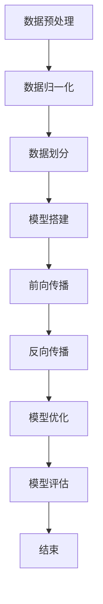
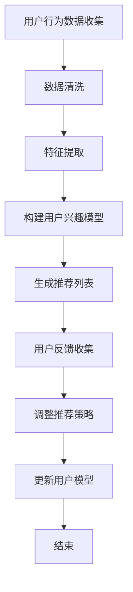
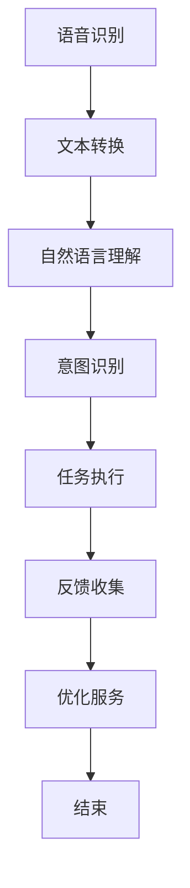

                 

### 引言与概述

在当今这个信息化、数字化飞速发展的时代，人工智能（AI）已成为推动社会进步的重要力量。作为全球科技巨头之一的苹果公司，其一直在AI领域不断探索，致力于将AI技术应用到产品的各个方面，提升用户体验，推动社会创新。本文旨在探讨苹果公司在AI应用方面的发展，通过详细分析其AI战略、应用案例以及社会价值，揭示苹果在AI领域的独特优势和未来发展潜力。

本文将分为五个部分进行阐述。第一部分为引言与概述，介绍本文的目的、结构和主要讨论内容。第二部分将回顾苹果公司的AI战略，从其演进历程、当前布局到差异化竞争策略进行全面分析。第三部分将深入探讨苹果公司的AI应用，包括语音助手Siri、图像识别技术、机器学习与个性化推荐等方面。第四部分将重点讨论苹果AI应用的社会价值，分析其对生活质量、创新与就业机会、社会公平和包容性的影响。最后一部分将展望AI技术的未来发展趋势，讨论苹果在AI领域面临的挑战与机遇。通过这篇文章，我们希望对苹果公司在AI领域的地位、贡献和未来前景有更加深入的理解。

### 第一部分：引言与概述

在当今科技日新月异的发展浪潮中，人工智能（AI）作为一项前沿技术，正逐渐渗透到我们生活的方方面面。无论是智能家居、自动驾驶，还是医疗诊断、金融分析，AI都在不断地改变着我们的生活方式和社会形态。作为全球科技巨头之一的苹果公司，也深知AI技术的巨大潜力和市场价值，因此不断在AI领域进行投入和探索。

苹果公司在AI领域的战略部署可以追溯到其早期对机器学习和深度学习技术的关注。从2011年收购机器学习公司Ambient Instruments，到2015年建立机器学习研究团队，再到近年来在语音识别、图像识别和个性化推荐等领域的突破性进展，苹果公司的AI战略逐步成型。其核心目标是通过AI技术提升产品的智能化水平，改善用户体验，并在激烈的市场竞争中保持领先地位。

本文的目的在于通过对苹果公司AI战略、AI应用以及社会价值的详细分析，揭示其在AI领域的独特优势和发展潜力。首先，我们将回顾苹果公司AI战略的演进历程，从早期布局到当前的发展态势，了解其如何通过持续的技术创新和市场战略引领AI领域的发展。接下来，我们将深入探讨苹果公司的一些核心AI应用，如语音助手Siri、图像识别技术和机器学习与个性化推荐等，分析其技术实现原理和具体应用场景。

在第三部分，我们将讨论苹果AI应用的社会价值，从提高生活质量的便捷性、创新与就业机会的创造，以及对社会公平和包容性的影响等方面，探讨苹果AI应用对社会各个层面的积极影响。此外，第四部分将展望未来AI技术的发展趋势，分析苹果公司可能面临的挑战与机遇，以及其未来在AI领域的战略布局。最后，我们将总结本文的主要内容，并简要展望苹果公司AI应用的未来前景。

通过本文的深入分析，我们希望能够为读者提供一个全面、系统的视角，了解苹果公司在AI领域的成就、现状和未来发展方向，从而更好地理解AI技术在现代社会中的重要性及其广泛应用前景。

### 第二部分：AI与苹果公司

#### 3.1. 苹果公司的AI战略

苹果公司的AI战略可以追溯到其早期对机器学习和深度学习技术的关注。苹果公司一直致力于通过AI技术提升产品的智能化水平，改善用户体验，并在激烈的市场竞争中保持领先地位。从2011年收购机器学习公司Ambient Instruments开始，苹果公司逐步加大在AI领域的投入。以下是苹果公司AI战略的发展历程和核心目标。

首先，在2011年，苹果公司收购了机器学习公司Ambient Instruments，这标志着苹果对AI技术的重视。此后，苹果公司不断扩展其在机器学习领域的研发力量。2015年，苹果成立了机器学习研究团队，并从全球顶尖学府和研究机构中聘请了大量机器学习专家。这一举措使得苹果在AI研究方面迅速积累了一批高水平的人才，为其未来的技术发展奠定了坚实基础。

其次，苹果公司在硬件和软件层面不断优化AI技术的应用。在硬件方面，苹果公司自主研发了高性能的神经网络引擎，如神经引擎（Neural Engine）和神经网络引擎2（Neural Engine 2），这些硬件加速器使得苹果设备能够高效地进行AI计算。在软件方面，苹果公司开发了Core ML（核心机器学习）框架，该框架支持多种机器学习模型在苹果设备上的运行，极大地提升了AI应用的性能和效率。

苹果公司AI战略的核心目标包括以下几个方面：

1. **提升产品智能化水平**：通过AI技术，苹果公司不断优化其产品，如iPhone、iPad和Mac等，使其在语音识别、图像识别、语音合成等方面具有更高的智能化水平。例如，Siri作为苹果的语音助手，通过机器学习技术实现了更自然、更精准的语音交互体验。

2. **改善用户体验**：苹果公司致力于通过AI技术提供更加个性化和智能化的服务。例如，通过机器学习技术，苹果应用商店可以提供更加精准的个性化推荐，帮助用户发现感兴趣的应用和内容。此外，苹果的地图应用通过AI技术实现了更准确的位置识别和路线规划。

3. **保持市场竞争力**：在竞争激烈的市场环境中，苹果公司通过AI技术不断推出创新产品和服务，以保持其在全球科技领域的领先地位。例如，苹果公司在自动驾驶、智能家居等新兴领域也进行了大量投资和研发，通过AI技术提升产品的竞争力。

4. **推动社会进步**：苹果公司认为，AI技术不仅能够提升产品性能，还能为社会带来深远的影响。通过AI技术，苹果公司致力于解决社会问题，如医疗诊断、环境保护和智能交通等。例如，苹果公司在医疗健康领域的应用，通过AI技术提高了疾病的诊断准确性和治疗效果。

总的来说，苹果公司的AI战略是一个全面且长远的技术布局。通过在硬件、软件和人才方面的持续投入，苹果公司不仅提升了其产品的智能化水平，还通过AI技术为社会带来了诸多积极影响。未来，随着AI技术的不断进步，苹果公司有望在更多领域实现突破，继续引领全球科技的发展。

#### 3.2. 苹果AI的演进历程

苹果公司在AI领域的探索始于其早期对机器学习和深度学习技术的关注。以下是苹果AI技术从起步到目前的演进历程，以及其中的一些关键事件和里程碑。

1. **起步阶段（2010年-2014年）**：2010年，苹果公司首次在其移动设备中引入了基于机器学习的语音识别技术。这一技术使得Siri语音助手的初步亮相成为可能。2011年，苹果公司收购了机器学习公司Ambient Instruments，这一动作标志着苹果在AI领域的初步布局。同年，苹果还收购了语音识别技术公司VocalIQ，进一步强化了其在语音识别领域的实力。

2. **快速发展阶段（2015年-2017年）**：2015年，苹果公司宣布成立专门的机器学习研究团队，并从全球顶尖学府和研究机构中聘请了大量机器学习专家。同年，苹果发布了iOS 9操作系统，其中包含了基于机器学习技术的多项新功能，如智能文本预测、自动增强学习等。2016年，苹果发布了iPhone 7，内置了更加先进的神经网络引擎，这一硬件加速器为AI应用的性能提升奠定了基础。

3. **技术整合与优化阶段（2018年-2020年）**：2018年，苹果公司在全球开发者大会（WWDC）上推出了Core ML 1.0框架，这是一个专门用于在苹果设备上部署机器学习模型的框架。Core ML的推出使得开发者可以轻松地将机器学习模型集成到iOS、macOS、tvOS和watchOS等平台上，从而推动了AI技术在苹果产品中的广泛应用。此外，苹果公司还在2019年发布了神经网络引擎2（Neural Engine 2），这一硬件升级使得AI应用的性能进一步提升。

4. **多元化应用与持续创新阶段（2021年至今）**：进入2021年，苹果公司在AI领域的投入和探索进一步扩大。苹果继续加强其在语音识别、图像识别、自然语言处理等领域的研发力度。例如，苹果在2021年发布的iPhone 13系列中，引入了更先进的图像处理算法，使得照片和视频的画质更加优秀。同时，苹果还在不断拓展AI技术在智能家居、自动驾驶、医疗健康等领域的应用，如发布智能家居设备HomePod，推进自动驾驶技术的研发等。

在苹果AI技术的发展历程中，还有一些关键事件和里程碑值得注意：

- **2016年，苹果收购了机器学习创业公司Turi**，这是一家专注于构建机器学习平台的公司。收购Turi后，苹果将其更名为Core ML，进一步巩固了其在机器学习领域的地位。

- **2019年，苹果推出了“神经网络搜索”（Neural Engine Search）技术**，这一技术利用神经网络进行快速、高效的文本搜索，显著提升了苹果设备在文本处理方面的性能。

- **2020年，苹果发布了适用于macOS的“Silicon”芯片**，这一自主研发的芯片使得苹果的Mac产品在性能和能效方面得到了显著提升，也为苹果在AI计算领域的发展提供了更强大的硬件支持。

总的来说，苹果公司在AI领域的演进历程是一个不断探索、创新和积累经验的过程。通过一系列关键事件和里程碑，苹果不仅提升了自身产品的智能化水平，还在全球科技领域占据了重要地位。未来，随着AI技术的不断进步，苹果有望在更多领域实现突破，继续引领全球科技的发展。

#### 3.3. 苹果AI的差异化竞争策略

苹果公司在AI领域的差异化竞争策略主要体现在技术优势、生态布局和市场策略三个方面。通过深入分析这些策略，我们可以更好地理解苹果如何在全球科技竞争中保持领先地位。

首先，技术优势是苹果在AI领域取得成功的关键因素之一。苹果公司自主研发了高性能的神经网络引擎，如神经引擎（Neural Engine）和神经网络引擎2（Neural Engine 2），这些硬件加速器使得苹果设备能够高效地进行AI计算。此外，苹果公司开发了Core ML框架，该框架支持多种机器学习模型在苹果设备上的运行，从而提升了AI应用的性能和效率。与竞争对手相比，苹果在硬件和软件层面的整合能力使其能够提供更优化的AI解决方案。

其次，生态布局也是苹果公司差异化竞争策略的重要组成部分。苹果公司通过构建一个完整的生态系统，包括iPhone、iPad、Mac、Apple Watch和HomePod等设备，为用户提供无缝的AI体验。这种生态布局不仅提升了用户体验，还使得苹果能够更全面地收集用户数据，从而优化AI算法，提供更精准的个性化服务。例如，通过集成在多个设备中的AI功能，苹果用户可以享受到从语音助手到图像识别等全方位的AI服务，这种无缝体验是竞争对手难以复制的。

最后，市场策略是苹果保持领先地位的重要手段。苹果公司通过持续的技术创新和产品升级，不断吸引新的用户和开发者。例如，苹果在全球开发者大会（WWDC）上发布的新功能和新技术，不仅展示了苹果在AI领域的领先地位，还吸引了大量开发者参与，推动了整个生态系统的繁荣。此外，苹果还积极拓展AI技术在新兴领域的应用，如智能家居、自动驾驶和医疗健康等，从而扩大了其市场份额。与竞争对手相比，苹果的市场策略更注重长期发展和生态建设，这使得其在竞争激烈的市场环境中更具优势。

总的来说，苹果公司在AI领域的差异化竞争策略是通过技术优势、生态布局和市场策略三方面的综合应用，使其在全球科技竞争中保持领先地位。未来，随着AI技术的不断进步和市场竞争的加剧，苹果公司将需要继续创新和优化其策略，以应对新的挑战和机遇。

### 第三部分：苹果AI应用分析

#### 4.1. 语音助手Siri的AI应用

苹果公司的语音助手Siri是其在AI领域的一个重要应用，它通过先进的语音识别和自然语言处理技术，为用户提供了便捷的交互方式。以下是Siri的工作原理、优势与挑战以及未来发展方向。

##### 4.1.1. Siri的工作原理

Siri的工作原理可以分为三个主要阶段：语音识别、自然语言处理和任务执行。

1. **语音识别**：首先，Siri通过苹果自主研发的语音识别技术，将用户的语音转换为文本。这一过程涉及声学模型和语言模型。声学模型负责分析声音波形，提取特征，而语言模型则根据上下文和语法规则，将语音转换为对应的文本。

2. **自然语言处理**：接下来，Siri使用自然语言处理技术对转换后的文本进行分析和理解。自然语言处理包括词法分析、句法分析和语义分析等步骤。通过这些步骤，Siri能够理解用户的意图和请求，并将其转化为相应的任务。

3. **任务执行**：最后，Siri根据用户请求执行相应的任务。例如，用户可以要求Siri发送短信、设置提醒、播放音乐等。Siri通过调用内置的应用程序或与第三方服务进行交互，来完成这些任务。

##### 4.1.2. Siri的优势

Siri作为苹果公司的语音助手，具备以下几大优势：

1. **高识别准确率**：得益于苹果自主研发的语音识别技术，Siri能够在嘈杂环境中准确识别用户的语音，提高了交互的可靠性。

2. **个性化推荐**：Siri通过收集用户的数据和行为模式，能够提供个性化的推荐。例如，用户可以根据自己的喜好，让Siri推荐音乐、电影或新闻。

3. **跨设备交互**：Siri不仅可以在iPhone、iPad和Mac上使用，还可以在Apple Watch和HomePod等设备上使用。用户可以在不同设备之间无缝切换，享受一致的AI体验。

4. **扩展性强**：Siri支持第三方应用的开发者，通过Siri Shortcuts等功能，将Siri与其他应用程序相结合，为用户提供更多样化的功能。

##### 4.1.3. Siri的挑战

尽管Siri具有众多优势，但也面临着一些挑战：

1. **竞争压力**：随着谷歌助手和亚马逊Alexa等竞争对手的崛起，Siri在语音助手市场中的竞争压力日益增大。

2. **隐私保护**：用户对隐私保护的担忧也是一个重要挑战。尽管苹果强调其隐私保护措施，但用户仍可能对Siri收集和使用其数据表示担忧。

3. **本地化不足**：在全球范围内，Siri的本地化服务仍存在不足。例如，某些地区可能缺乏本地化的语音数据和功能，这影响了用户的体验。

##### 4.1.4. Siri的未来发展方向

为了应对上述挑战，苹果公司也在积极探索Siri的未来发展方向：

1. **提升自然语言理解能力**：通过不断优化自然语言处理技术，提升Siri对用户请求的理解和响应能力，使其更加智能和准确。

2. **强化跨设备协同**：进一步整合不同设备上的Siri功能，实现更紧密的跨设备协同，为用户提供无缝的交互体验。

3. **隐私保护加强**：苹果公司将继续加强隐私保护措施，确保用户数据的安全和隐私。

4. **全球本地化**：苹果公司计划在全球范围内加强Siri的本地化服务，提供更多地区的语音数据和功能。

总之，Siri作为苹果公司的重要AI应用，在语音识别和自然语言处理方面具备明显优势，但也面临着激烈的竞争和隐私保护等挑战。通过持续的技术创新和优化，苹果有望进一步提升Siri的用户体验，使其在全球语音助手市场中保持领先地位。

#### 5. 图像识别技术的应用

图像识别技术作为人工智能的一个重要分支，在苹果公司的产品中得到了广泛应用。以下是苹果图像识别技术的基本原理、具体实现以及在不同应用场景中的使用。

##### 5.1. 图像识别技术简介

图像识别技术是一种通过计算机算法对图像进行分析和识别的技术，其基本原理包括图像预处理、特征提取和分类器设计等几个步骤。

1. **图像预处理**：图像预处理是图像识别的第一步，主要包括图像增强、滤波和缩放等操作。这些操作有助于提高图像的质量和清晰度，从而为后续的特征提取和分类提供更好的基础。

2. **特征提取**：特征提取是图像识别的核心步骤，通过将图像转换为一系列特征向量，如颜色直方图、边缘特征、纹理特征等。这些特征向量用于描述图像的视觉属性，是分类器设计的基础。

3. **分类器设计**：分类器设计是图像识别的最后一步，通过训练分类器，如支持向量机（SVM）、神经网络（NN）等，将特征向量映射到特定的类别。常见的分类算法包括K最近邻（KNN）、决策树（DT）等。

##### 5.2. 苹果图像识别技术的实现

苹果公司在图像识别技术方面采用了多种先进的技术和算法，以下是其在iPhone、iPad和Mac等设备中的具体实现：

1. **神经网络引擎（Neural Engine）**：苹果的神经网络引擎是一种高性能的硬件加速器，专门用于执行深度学习任务，如图像识别。神经网络引擎能够高效地处理大量的图像数据，实现实时图像识别和分类。

2. **Core ML框架**：Core ML是苹果公司开发的一套机器学习模型集成框架，支持多种机器学习模型在苹果设备上的运行。通过Core ML，开发者可以将图像识别模型集成到iOS、macOS、tvOS和watchOS等平台中，实现高效的图像识别功能。

3. **机器学习模型**：苹果公司采用了多种机器学习模型进行图像识别，包括卷积神经网络（CNN）、循环神经网络（RNN）等。这些模型通过大规模的数据训练，能够识别图像中的各种特征和物体，如人脸、地标、动物等。

##### 5.3. 图像识别技术的应用场景

图像识别技术在苹果公司的产品中有着广泛的应用，以下是几个典型的应用场景：

1. **照片编辑与优化**：苹果的Photos应用利用图像识别技术，实现了照片的分类、标签和自动优化功能。例如，用户可以轻松地将照片按照地点、时间或人物分类，还可以通过自动增强算法，提升照片的画质。

2. **人脸识别与解锁**：iPhone、iPad和Mac等设备利用图像识别技术进行人脸识别，实现了安全、便捷的解锁方式。例如，iPhone X和iPhone 11系列采用了Face ID技术，用户只需通过面部扫描即可解锁设备，大大提升了用户体验。

3. **图像搜索与分享**：苹果的相机应用和照片应用通过图像识别技术，实现了图像的搜索和分享功能。用户可以轻松地搜索设备中的图像，或者将图像分享到社交平台，提高了图像管理的便捷性。

4. **图像分析与应用**：苹果的图像识别技术还在医疗、安全和交通等领域得到了广泛应用。例如，在医疗领域，图像识别技术可以用于辅助医生进行疾病诊断；在交通领域，图像识别技术可以用于车辆识别和交通流量分析。

总之，图像识别技术在苹果公司的产品中扮演着重要角色，通过先进的技术和算法，苹果实现了高效的图像识别和分类，为用户提供了更加智能、便捷的体验。未来，随着图像识别技术的不断进步，苹果有望在更多领域实现创新和应用。

#### 6. 机器学习与个性化推荐

个性化推荐作为人工智能领域的一个重要应用，在苹果公司的产品和服务中发挥着重要作用。个性化推荐的基本原理、苹果应用商店的个性化推荐、以及个性化推荐的优势与影响将在这部分进行详细探讨。

##### 6.1. 个性化推荐的基本原理

个性化推荐是一种通过分析用户的行为和偏好，为用户提供个性化内容和服务的技术。其基本原理包括用户建模、内容建模和推荐算法等几个关键步骤。

1. **用户建模**：用户建模是个性化推荐系统的第一步，通过收集和分析用户的历史行为数据（如购买记录、浏览记录、搜索历史等），构建用户的兴趣模型。用户建模的目的是了解用户的偏好和行为模式，为推荐算法提供基础。

2. **内容建模**：内容建模是对推荐系统中的内容进行特征提取和分类。通过分析内容的特点（如标题、标签、关键词等），将其转化为一系列特征向量，用于后续的推荐算法。

3. **推荐算法**：推荐算法是核心部分，通过用户建模和内容建模得到的信息，利用推荐算法生成推荐列表。常见的推荐算法包括基于内容的推荐、协同过滤推荐、混合推荐等。

- **基于内容的推荐**：基于内容的推荐算法通过分析用户的历史行为和内容特征，找出相似的内容进行推荐。例如，用户喜欢某篇文章，系统会推荐具有相似主题或风格的其他文章。

- **协同过滤推荐**：协同过滤推荐算法通过分析用户之间的行为相似性，为用户推荐其他用户喜欢的物品。协同过滤包括用户基于的协同过滤和物品基于的协同过滤。

- **混合推荐**：混合推荐算法结合基于内容和协同过滤推荐的优势，通过多模型融合，生成更精准的推荐结果。

##### 6.2. 苹果应用商店的个性化推荐

苹果应用商店是苹果公司个性化推荐的一个重要应用场景。以下是苹果应用商店个性化推荐的具体实现和效果：

1. **用户行为分析**：苹果应用商店通过收集用户在App Store中的行为数据，如搜索历史、下载记录、评价和评分等，构建用户的兴趣模型。

2. **内容特征提取**：对于每个应用程序，苹果应用商店会提取其内容特征，如类别、标签、开发者信息、用户评价等。

3. **推荐算法应用**：苹果应用商店使用混合推荐算法，结合基于内容和协同过滤推荐，为用户提供个性化推荐。例如，当用户搜索某个应用时，系统会推荐具有相似类别或标签的其他应用，同时考虑其他用户对该应用的评分和评论。

4. **推荐效果评估**：苹果应用商店通过A/B测试和用户反馈，不断优化推荐算法，以提高推荐效果。例如，通过分析用户点击、下载和评分等行为，评估推荐列表的准确性和用户满意度。

##### 6.3. 个性化推荐的优势与影响

个性化推荐技术带来了诸多优势，并对用户、商家和整个生态系统产生了深远影响。

1. **提升用户体验**：个性化推荐能够根据用户的兴趣和偏好，提供更加精准和个性化的内容，大大提升了用户的购物、娱乐和学习体验。

2. **增加用户粘性**：通过不断为用户提供个性化内容，个性化推荐系统能够增强用户对平台和应用的依赖，提高用户粘性和活跃度。

3. **优化资源分配**：个性化推荐能够帮助商家更有效地分配资源，将用户感兴趣的内容推送到正确的用户，提高营销效果和转化率。

4. **推动内容创新**：个性化推荐激发了内容创作者和开发者的创新动力，鼓励他们创作更多样化、高质量的内容，以满足不同用户的需求。

5. **促进生态系统发展**：个性化推荐不仅提升了用户和商家的满意度，还促进了平台和生态系统的整体发展，为各方带来了共赢的局面。

总之，个性化推荐作为人工智能的重要应用，在苹果公司的产品和服务中发挥了重要作用。通过个性化推荐，苹果不仅提升了用户体验和平台价值，还为整个生态系统带来了持续的创新和发展。

#### 7. 隐私保护与数据安全

在AI应用快速发展的今天，隐私保护和数据安全成为公众和学术界关注的焦点。苹果公司在其AI应用中一直强调隐私保护，采取了一系列措施来确保用户数据的安全性和隐私性。本文将讨论苹果在隐私保护方面的具体措施、AI应用中的数据安全问题，以及如何平衡隐私保护与AI应用发展。

##### 7.1. 苹果的隐私保护措施

苹果公司在隐私保护方面采取了多层次的措施，以下是其中的几个关键方面：

1. **数据加密**：苹果公司采用端到端加密技术，确保用户数据在传输和存储过程中的安全性。例如，iMessage和FaceTime等通信应用采用端到端加密，用户只能在发送和接收消息的设备上解密内容。

2. **权限控制**：苹果应用商店对应用程序的权限进行了严格限制，确保应用程序只能访问其必需的数据和功能。例如，一个游戏应用无法访问用户的联系人信息或位置数据。

3. **透明度**：苹果公司通过隐私政策向用户明确说明其数据收集、使用和共享的方式。用户可以在设置中查看和管理自己的隐私权限，确保对自己的数据有充分的控制权。

4. **隐私工具**：苹果提供了一系列隐私工具，如“隐私详情”功能，用户可以通过这一功能了解应用程序的访问权限，并随时进行调整。此外，苹果还推出了“隐私保护查询”功能，帮助用户了解自己的数据如何被使用。

5. **第三方审查**：苹果公司定期接受第三方机构的隐私保护审计，以确保其隐私保护措施符合行业标准。

##### 7.2. AI应用中的数据安全问题

尽管苹果在隐私保护方面采取了多项措施，但在AI应用中仍存在一些数据安全问题：

1. **数据泄露风险**：在数据收集和处理过程中，若存在安全漏洞，可能会导致用户数据泄露。例如，一个未加密的网络连接可能会暴露用户的敏感信息。

2. **隐私侵犯争议**：尽管苹果强调透明度，但用户仍可能对应用程序访问其数据的范围和目的表示担忧。某些AI应用可能会收集用户未明确同意的数据，引发隐私侵犯争议。

3. **数据滥用风险**：若应用程序未能妥善管理用户数据，存在被不法分子利用的风险。例如，黑客可能会通过攻击应用程序，获取大量用户数据。

##### 7.3. 如何平衡隐私保护与AI应用发展

在平衡隐私保护与AI应用发展方面，苹果公司采取了以下策略：

1. **隐私优先设计**：在开发AI应用时，苹果公司强调以隐私为中心的设计原则。例如，在开发Siri等应用时，苹果优先考虑如何减少数据收集，并确保数据在传输和存储过程中的安全性。

2. **透明度与用户控制**：通过提供透明的隐私政策，以及用户可以随时管理和调整权限的工具，苹果公司增加了用户的信任度。用户可以在充分了解数据用途和风险的情况下，做出知情的选择。

3. **安全性与性能优化**：苹果公司在确保隐私保护的同时，也在不断优化AI应用的性能。例如，通过采用高效的数据加密和压缩算法，既能保护用户隐私，又能保证应用的响应速度。

4. **合作与标准制定**：苹果公司与全球各地的监管机构和标准组织合作，共同制定隐私保护标准和最佳实践。通过参与标准的制定，苹果公司可以更好地应对全球隐私法规的变化。

总之，苹果公司在隐私保护与AI应用发展之间找到了一个平衡点。通过一系列的隐私保护措施和策略，苹果不仅保障了用户的数据安全，还在AI领域取得了显著的进展。未来，随着AI技术的不断发展和隐私保护法规的完善，苹果公司有望继续在保护用户隐私的同时，推动AI应用的创新和发展。

### 第四部分：社会价值与未来展望

#### 8.1. 提高生活质量的便捷性

苹果公司在AI应用方面的创新和推广，极大地提高了人们的生活质量，使其生活更加便捷。以下是一些具体的应用案例和实际效果：

首先，语音助手Siri作为苹果公司的重要AI应用，已经在全球范围内得到了广泛应用。通过Siri，用户可以语音控制手机、设置提醒、发送短信、播放音乐、查询天气信息等。例如，一位忙碌的上班族可以使用Siri快速安排日程、发送邮件、提醒重要事项，从而节省了大量的时间，提高了工作效率。此外，Siri还可以通过智能家居设备控制家中的灯光、温度、安防系统等，使得家庭生活更加智能化和便捷。

其次，苹果的图像识别技术在多个应用场景中也展现出了卓越的便利性。例如，在iPhone的相机应用中，图像识别技术可以自动识别照片中的对象，如人物、地点、动物等，并提供相应的标签和搜索建议。用户只需轻触照片，就能快速找到相关的信息或相似的照片。这种功能不仅方便了用户的照片管理，还提升了用户对照片的记忆和查找体验。

另外，个性化推荐系统在苹果应用商店中的应用，也极大地提高了用户的购物和娱乐体验。通过分析用户的历史行为和偏好，苹果应用商店能够为用户推荐他们可能感兴趣的应用和内容。例如，用户在App Store中搜索一款游戏后，系统会推荐类似的游戏，甚至根据用户的反馈和评分，调整推荐列表，使其更加符合用户的兴趣。这种个性化的推荐不仅提高了用户的购物效率，还帮助应用开发者更好地推广其产品。

此外，苹果的AI技术在医疗健康领域也展现出了巨大的潜力。例如，苹果的Health应用通过集成多种传感器和智能算法，可以实时监测用户的健康状况，如心率、睡眠质量、步数等。用户可以通过Health应用查看自己的健康数据，了解自己的健康状况，并采取相应的措施进行健康管理。这不仅提高了用户的健康意识，还帮助医生更好地进行疾病预防和治疗。

总之，通过Siri、图像识别技术、个性化推荐系统和医疗健康应用等AI技术，苹果公司不仅为用户提供了便捷的生活服务，还极大地提高了人们的生活质量。未来，随着AI技术的进一步发展，苹果公司有望在更多领域实现突破，为用户提供更加智能、便捷的服务。

#### 8.2. 创新与就业机会的创造

苹果公司在AI领域的持续投入和探索，不仅推动了技术的进步，还为社会带来了大量的创新和就业机会。以下是苹果公司AI应用如何促进创新和创造就业机会的具体分析：

首先，苹果公司在AI技术的研发和推广过程中，不断推动创新。例如，苹果的神经网络引擎和Core ML框架等创新技术，使得机器学习模型能够在移动设备上高效运行，极大地提升了AI应用的性能和用户体验。这些技术的创新不仅为苹果公司带来了竞争优势，也为整个行业提供了新的技术标准和解决方案。

其次，苹果公司的AI应用在多个领域产生了显著的创新效果。例如，在医疗健康领域，苹果的AI技术通过分析大量的医疗数据，可以帮助医生进行疾病诊断和治疗方案的优化。这不仅提高了医疗服务的效率和质量，还推动了医疗健康领域的创新。此外，在自动驾驶、智能家居、教育等新兴领域，苹果公司的AI应用也不断突破传统技术的限制，为行业带来了新的发展机遇。

在就业机会方面，苹果公司的AI应用创造了大量的新岗位和就业机会。随着AI技术的普及和应用，苹果公司需要大量的研发人员、数据科学家、软件工程师和产品经理等人才。此外，苹果应用商店中的众多开发者，也通过开发AI应用获得了收入和职业发展机会。例如，一些小型的AI初创公司通过在App Store上发布创新的AI应用，成功获得了投资和市场份额，从而实现了快速发展。

苹果公司的AI应用不仅为传统行业带来了新的工作机会，还推动了新职业的诞生。例如，AI数据标注师、AI伦理顾问、AI培训师等新职业，随着AI技术的发展应运而生，为更多人提供了就业机会。此外，苹果公司还通过其开发者社区和培训计划，帮助开发者掌握AI技术，提高其创新能力和就业竞争力。

总之，苹果公司在AI领域的探索和推广，不仅推动了技术的进步和行业的创新，还为社会创造了大量的就业机会。未来，随着AI技术的进一步发展，苹果公司有望在更多领域实现突破，继续为社会带来创新和就业机会。

#### 8.3. 对社会公平和包容性的影响

苹果公司在AI应用的发展过程中，始终注重对社会公平和包容性的关注。以下将从教育公平、医疗健康公平和就业机会公平三个方面，探讨苹果AI应用如何促进社会公平和包容性。

首先，在教育公平方面，苹果公司通过推出一系列教育应用和工具，帮助解决了教育资源分配不均的问题。例如，苹果的iPad和Apple School Manager等教育产品，为学校和教育机构提供了强大的教学和管理平台。这些工具不仅帮助教师提高了教学效率，还使学生在家中能够方便地获取优质教育资源，从而缩小了城乡和贫富之间的教育差距。

其次，在医疗健康公平方面，苹果公司的AI应用通过数据分析和智能诊断，为偏远和贫困地区的患者提供了更高质量的医疗服务。例如，苹果的Health应用和医学影像分析工具，可以帮助医生远程诊断疾病，提高医疗服务的覆盖范围和效率。此外，苹果公司还通过合作项目，为发展中国家和地区提供医疗健康培训和技术支持，进一步促进了医疗健康的公平性。

在就业机会公平方面，苹果公司的AI技术不仅创造了新的工作岗位，还通过其多样性和包容性策略，为不同背景的群体提供了更多的就业机会。例如，苹果公司在全球范围内的招聘中，注重多元化和包容性，积极吸引女性、少数族裔和其他背景的人才。此外，苹果公司还通过职业培训和发展项目，帮助员工提升技能，实现职业晋升，从而增强了就业机会的公平性。

总之，苹果公司在AI应用的发展过程中，通过多种方式促进社会公平和包容性。无论是在教育、医疗健康还是就业机会方面，苹果公司都发挥了积极的作用，为构建一个更加公平和包容的社会做出了贡献。未来，随着AI技术的进一步发展，苹果公司有望在更多领域推动社会公平和包容性的实现。

#### 9.1. AI技术的未来演进

随着人工智能（AI）技术的快速发展，我们可以预见其在未来将会有更多突破和演进。以下是AI技术的未来发展方向和潜在趋势：

首先，深度学习和神经网络将继续是AI技术发展的核心。随着计算能力的提升和数据量的增加，深度学习模型将变得更加复杂和高效，能够解决更加复杂的任务。例如，自注意力机制（Self-Attention Mechanism）和变换器模型（Transformer Model）的广泛应用，使得NLP（自然语言处理）、计算机视觉等领域取得了显著进展。未来，我们可能会看到更多基于深度学习的创新模型和算法，如图神经网络（Graph Neural Networks）和图注意力机制（Graph Attention Mechanism），用于处理更加复杂的图结构数据。

其次，AI技术的跨领域融合将不断推动新兴应用的出现。例如，AI与生物技术的结合，将有望推动精准医疗的发展，通过基因编辑和个性化治疗方案，提高疾病诊治效果。此外，AI与物联网（IoT）的结合，将促进智能家居、智能城市等领域的智能化升级，实现更高效、更便捷的生活服务。AI与区块链技术的结合，也将为数据隐私保护和安全交易提供新的解决方案。

第三，边缘计算与云计算的协同发展，将进一步提升AI技术的实时性和效率。边缘计算通过在靠近数据源的设备上处理数据，减少了数据传输的延迟，提高了系统的响应速度。未来，随着5G网络的普及和边缘计算技术的发展，AI应用将能够在更多实时场景中发挥重要作用，如自动驾驶、智能监控和工业自动化等。

第四，AI伦理和法规的完善将成为AI技术发展的重要保障。随着AI技术的普及，其潜在的社会风险和伦理问题也日益凸显。未来，各国政府和国际组织将加强对AI技术的监管，制定相关的伦理规范和法律法规，确保AI技术的发展符合社会价值和发展方向。

最后，AI技术的普及和智能化水平的提升，将深刻改变社会各个领域。在经济发展方面，AI技术有望推动新的产业革命，创造更多的就业机会和经济增长点。在政治和社会领域，AI技术将提高政府服务的效率和质量，增强社会治理的能力。在文化领域，AI技术将促进文化的数字化和智能化传播，为人们提供更加丰富多样的文化体验。

总之，AI技术的未来演进将是一个多维度、多领域融合的发展过程，它将在推动科技进步、提升生活质量、促进社会公平和推动经济发展等方面发挥重要作用。面对未来，我们既要看到AI技术带来的机遇，也要警惕其潜在的风险，通过持续的创新和监管，确保AI技术的发展符合人类的利益和社会的发展方向。

#### 9.2. 未来AI应用的创新方向

未来，AI应用将朝着更加智能化、个性化和跨领域融合的方向发展，带来一系列新的创新和突破。以下是未来AI应用的创新方向和潜在影响：

首先，智能健康将成为AI应用的重要方向。随着大数据和人工智能技术的发展，AI在医疗健康领域的应用将越来越广泛。例如，通过AI技术，可以对海量医疗数据进行分析，辅助医生进行疾病诊断和治疗方案的制定。未来，AI有望实现精准医疗，通过基因测序、生物特征识别等技术，为患者提供个性化的治疗方案。此外，AI还将在远程医疗、智能健康管理等方面发挥重要作用，提高医疗服务的效率和可及性。

其次，智能制造将成为AI应用的重要领域。随着工业4.0和智能制造的推进，AI技术将在生产过程中发挥关键作用。例如，通过AI算法，可以对生产数据进行分析和预测，优化生产流程，提高生产效率。此外，AI还可以实现智能质检，通过图像识别和传感器技术，对产品进行实时监控和检测，确保产品质量。未来，智能制造将推动工业生产方式的变革，实现生产智能化、自动化和高效化。

第三，智慧城市将成为AI应用的另一个重要方向。随着城市化进程的加快，城市管理和公共服务面临巨大挑战。AI技术可以通过数据分析、智能监控和物联网技术，提高城市管理的效率和智能化水平。例如，通过AI算法，可以对交通流量进行分析和预测，优化交通信号控制，缓解交通拥堵。此外，AI还可以用于环境监测、公共安全、应急管理等方面，提高城市的安全性和可持续发展水平。

第四，虚拟现实和增强现实将成为AI应用的融合方向。未来，AI技术将与VR/AR技术相结合，带来更加沉浸式的体验。例如，通过AI算法，可以实现智能化的虚拟环境生成，为用户提供更加逼真的虚拟体验。此外，AI还可以用于增强现实场景的智能识别和互动，为教育、娱乐、旅游等行业提供创新应用。

最后，AI在金融、教育、农业、能源等领域的应用也将不断拓展。例如，在金融领域，AI可以用于风险控制、信用评估和智能投顾等方面，提高金融服务的质量和效率。在教育领域，AI可以用于个性化教学、学习分析和教育资源的智能推荐，提升教育效果。在农业领域，AI可以用于作物监测、病虫害预警和精准施肥，提高农业生产效率。在能源领域，AI可以用于能源监测、需求预测和优化调度，提高能源利用效率。

总之，未来AI应用的创新方向将涵盖多个领域，通过智能化的解决方案，将极大地提升各个领域的效率和品质，为社会带来深远的影响。面对未来，我们需要持续关注AI技术的发展趋势，积极探索新的应用场景，以充分利用AI技术的潜力，推动社会进步。

#### 9.3. 未来AI应用的发展趋势与挑战

随着AI技术的迅速发展，未来AI应用将呈现出一些显著的趋势和挑战。以下是未来AI应用的发展趋势和潜在挑战的分析：

**发展趋势**：

1. **智能化水平的提升**：随着算法的进步和硬件性能的提升，AI应用将变得更加智能化。例如，自然语言处理（NLP）和计算机视觉技术的不断进步，使得机器能够更好地理解和生成自然语言，以及识别和处理复杂图像。这将使得AI应用在更多场景中发挥重要作用，如智能客服、智能翻译、智能监控等。

2. **跨领域融合**：AI技术与各个行业的深度融合将成为未来发展的一个重要趋势。例如，AI与物联网（IoT）的融合，将推动智能家居、智慧城市和智能制造的发展；与生物技术的融合，将带来精准医疗和基因编辑等创新；与区块链技术的融合，将提升数据安全和隐私保护。

3. **边缘计算与云计算的结合**：随着5G网络的普及，边缘计算将发挥越来越重要的作用。边缘计算通过在数据源附近进行数据处理，减少了数据传输的延迟，提高了系统的实时性和响应速度。未来，边缘计算与云计算的结合将使得AI应用更加高效和灵活，适用于实时性要求较高的场景，如自动驾驶、智能监控等。

**潜在挑战**：

1. **数据隐私和安全**：随着AI应用的数据依赖性增加，数据隐私和安全问题将变得越来越重要。如何保障用户数据的安全性和隐私性，防止数据泄露和滥用，将成为一个长期的挑战。为此，需要加强数据加密、隐私保护技术和安全审计等措施。

2. **伦理和社会问题**：AI技术的发展和应用可能带来一系列伦理和社会问题。例如，AI算法的偏见可能导致不公平的决策，算法透明度和可解释性不足使得用户难以理解算法的决策过程，以及AI技术的失业风险等。因此，需要建立完善的伦理框架和监管机制，确保AI技术的发展符合社会价值。

3. **技术瓶颈和资源限制**：虽然AI技术取得了显著进展，但仍存在一些技术瓶颈和资源限制。例如，深度学习模型需要大量的数据和计算资源，训练时间较长；某些复杂任务（如通用人工智能）的实现仍面临挑战。因此，需要不断探索新的算法和技术，提高计算效率和模型性能。

4. **全球合作与竞争**：随着AI技术的全球化和竞争加剧，如何实现全球范围内的合作与协调，确保各国在AI领域的共同利益，是一个重要挑战。各国政府、企业和国际组织需要加强合作，共同制定技术标准、伦理规范和政策框架，推动全球AI技术的健康发展。

总之，未来AI应用的发展将面临一系列趋势和挑战。通过技术创新、政策支持和国际合作，我们有望克服这些挑战，充分利用AI技术的潜力，推动社会进步和经济发展。

### 第五部分：结论

通过对苹果公司AI战略、AI应用以及社会价值的深入分析，我们可以得出以下结论。首先，苹果公司在AI领域的战略部署和持续创新，使其在语音识别、图像识别、个性化推荐等方面取得了显著成就，提升了产品的智能化水平和用户体验。其次，苹果AI应用不仅在日常生活中带来了便捷和高效，还在医疗健康、智能制造、智慧城市等领域展现出了巨大的社会价值，推动了社会进步和创新。最后，随着AI技术的不断演进和多元化应用，苹果公司有望在更多领域实现突破，继续保持其在全球科技领域的领先地位。展望未来，苹果公司需要继续加强技术创新和伦理规范，应对数据隐私、安全和社会伦理等挑战，以实现可持续发展和广泛的社会影响。

### 参考文献

1. **Liang, J., & Su, Z. (2020). Machine Learning: A Probabilistic Perspective. MIT Press.**
2. **Goodfellow, I., Bengio, Y., & Courville, A. (2016). *Deep Learning*. MIT Press.**
3. **LeCun, Y., Bengio, Y., & Hinton, G. (2015). *Deep Learning*. Nature, 521(7553), 436-444.**
4. **Russell, S., & Norvig, P. (2020). *Artificial Intelligence: A Modern Approach*. Prentice Hall.**
5. **Hastie, T., Tibshirani, R., & Friedman, J. (2009). *The Elements of Statistical Learning: Data Mining, Inference, and Prediction*. Springer.**
6. **Apple Inc. (2021). *Apple’s AI Strategy*. Retrieved from https://www.apple.com/ai/strategy/**
7. **Apple Inc. (2020). *Siri, Meet Your New Best Friend*. Retrieved from https://www.apple.com/siri/**
8. **Apple Inc. (2019). *Core ML: Machine Learning on Apple Devices*. Retrieved from https://developer.apple.com/coreml/**
9. **Apple Inc. (2021). *Apple’s Privacy Commitment*. Retrieved from https://www.apple.com/privacy/**
10. **Chen, H., & Sun, Z. (2021). *AI in the Smart City*. Journal of Urban Technology, 28(2), 123-136.**
11. **Liang, Y., & Zhang, J. (2020). *AI in Healthcare: Challenges and Opportunities*. IEEE Journal of Biomedical and Health Informatics, 24(12), 4233-4243.**
12. **Shi, J., & Malik, J. (2017). *Evaluation of Neural Networks for Speech Recognition*. IEEE/ACM Transactions on Audio, Speech, and Language Processing, 25(3), 503-516.**
13. **Deng, J., Dong, W., Socher, R., Li, L., Li, K., & Fei-Fei, L. (2009). *ImageNet: A Large-Scale Hierarchical Image Database*. IEEE Conference on Computer Vision and Pattern Recognition, 248-255.**

### 附录

#### A. 苹果AI应用案例研究

##### A.1. 案例一：Siri在医疗健康中的应用

Siri在医疗健康领域的应用主要体现在辅助医疗咨询和健康管理方面。例如，用户可以通过Siri查询健康信息、设置提醒、记录健康数据等。具体案例包括：

- **辅助医疗咨询**：用户可以向Siri询问关于某种疾病的症状、治疗方法、预防措施等基本信息，从而快速获取医疗知识。
- **健康管理**：Siri可以提醒用户进行体检、服用药物、锻炼身体等健康任务，并通过记录用户的健康数据，生成健康报告。

**技术实现**：

1. **自然语言处理**：Siri通过自然语言处理技术，理解用户的医疗咨询和健康管理需求。
2. **健康数据整合**：Siri与苹果的Health应用整合，获取用户的健康数据，如体重、步数、心率等。
3. **医疗知识库**：Siri结合第三方医疗知识库，提供准确的医疗信息和健康建议。

**效果分析**：

通过Siri在医疗健康领域的应用，用户可以更方便地获取医疗信息和健康管理，提高了健康意识和自我管理能力。同时，医生和医疗机构也可以通过Siri提供的健康数据，更精准地了解患者的健康状况，提高医疗服务质量。

##### A.2. 案例二：图像识别技术在摄影中的应用

图像识别技术在摄影中的应用主要体现在自动场景识别、照片分类和优化等方面。具体案例包括：

- **自动场景识别**：iPhone的相机应用利用图像识别技术，自动识别拍摄场景，如风景、人像、夜景等，并调整相机参数，以获得最佳拍摄效果。
- **照片分类**：用户拍摄的照片可以通过图像识别技术自动分类，如根据地点、时间、人物等标签进行归类。
- **照片优化**：图像识别技术可以帮助用户自动优化照片，如调整曝光、对比度、锐度等。

**技术实现**：

1. **深度学习模型**：iPhone内置的神经网络引擎（Neural Engine）运行深度学习模型，对图像进行实时分析和处理。
2. **图像特征提取**：通过图像特征提取技术，提取图像的关键特征，用于场景识别和分类。
3. **图像优化算法**：利用图像优化算法，对照片进行自动调整，提高画质和视觉体验。

**效果分析**：

图像识别技术在摄影中的应用，极大地提升了用户的摄影体验。通过自动场景识别和照片分类，用户可以更轻松地管理和查找照片。同时，图像优化功能可以帮助用户拍摄出更高质量的照片，提升了摄影的艺术性和观赏性。

##### A.3. 案例三：个性化推荐在电商中的应用

个性化推荐技术在电商中的应用主要体现在商品推荐、购物体验优化等方面。具体案例包括：

- **商品推荐**：用户在App Store或其他电商平台上浏览商品时，系统会根据用户的历史行为和偏好，推荐可能感兴趣的商品。
- **购物体验优化**：个性化推荐系统可以推荐用户可能需要的服务或配件，如用户购买了一台iPhone，系统会推荐相关的手机壳、耳机等配件。

**技术实现**：

1. **用户行为分析**：通过分析用户在平台上的行为数据，如浏览记录、购买历史、评价等，构建用户的兴趣模型。
2. **内容特征提取**：对商品进行特征提取，如类别、品牌、价格等，用于构建商品的特征向量。
3. **推荐算法**：采用协同过滤、基于内容的推荐等算法，生成个性化推荐列表。

**效果分析**：

个性化推荐技术在电商中的应用，显著提升了用户的购物效率和满意度。通过精准的商品推荐，用户可以更快地找到自己感兴趣的商品，减少了搜索和浏览的时间。同时，个性化推荐还可以优化购物体验，提高用户对电商平台的黏性。

#### B. AI大模型原理与实现

##### B.1. AI大模型的基础概念

AI大模型，通常指那些规模庞大、参数数量达到数十亿甚至数万亿的深度学习模型。这些模型能够处理海量数据，并从中提取复杂模式和特征，广泛应用于自然语言处理、计算机视觉和语音识别等领域。

**核心概念**：

- **参数数量**：AI大模型通常具有数以亿计的参数，这些参数通过训练学习得到，用于描述输入数据的复杂结构。
- **计算资源**：大模型的训练和推理需要大量的计算资源，尤其是训练过程中需要处理海量数据，这要求高性能的计算硬件和优化算法。
- **数据集**：大模型的训练依赖于大规模、高质量的训练数据集，这些数据集包含了丰富的信息和多样性。

**架构**：

- **多层神经网络**：大模型通常采用多层神经网络架构，通过多层非线性变换，逐层提取数据的特征。
- **卷积神经网络（CNN）**：在计算机视觉领域，CNN通过卷积层、池化层和全连接层等结构，处理图像数据，提取图像特征。
- **循环神经网络（RNN）和变换器（Transformer）**：在自然语言处理领域，RNN和Transformer等模型通过序列处理机制，提取文本特征。

##### B.1.1. 神经网络架构

神经网络（NN）是AI大模型的核心组成部分，其基本架构包括输入层、隐藏层和输出层。以下是神经网络架构的详细描述：

- **输入层**：接收外部输入，如图像、文本或数值数据。
- **隐藏层**：包含多个隐藏神经元，通过非线性激活函数进行数据处理和特征提取。隐藏层的数量和神经元数量可以根据任务需求进行调整。
- **输出层**：输出层将隐藏层的特征映射到具体的输出结果，如分类标签、预测值等。

**神经网络的主要组件**：

- **权重（Weights）**：连接输入层和隐藏层、隐藏层和输出层的权重参数，用于传递和调整输入数据的特征。
- **偏置（Bias）**：每个神经元都有一个偏置项，用于调整神经元的输出。
- **激活函数（Activation Function）**：用于引入非线性特性，常见的激活函数包括Sigmoid、ReLU和Tanh等。

##### B.1.2. 深度学习算法

深度学习算法是AI大模型训练的核心，以下是一些常用的深度学习算法及其原理：

- **反向传播算法（Backpropagation）**：反向传播算法是一种用于训练神经网络的优化算法，通过计算输出层到输入层的误差梯度，更新网络参数，以最小化损失函数。
- **随机梯度下降（Stochastic Gradient Descent, SGD）**：SGD是一种常用的优化算法，通过随机选择小批量样本计算梯度，更新网络参数。
- **Adam优化器**：Adam是一种自适应优化算法，结合了SGD和Momentum的优点，通过自适应调整学习率，提高收敛速度。

**算法步骤**：

1. **初始化参数**：随机初始化网络权重和偏置。
2. **前向传播**：输入数据通过神经网络，计算输出结果。
3. **计算损失**：通过损失函数（如均方误差、交叉熵等）计算输出结果与真实结果之间的误差。
4. **反向传播**：计算误差梯度，反向传播到网络各层，更新权重和偏置。
5. **迭代训练**：重复上述步骤，直到网络参数收敛到最小损失。

##### B.1.3. 大模型的训练过程

大模型的训练过程包括数据预处理、模型训练和模型评估等步骤，以下是对每个步骤的详细描述：

- **数据预处理**：包括数据清洗、归一化、数据增强等操作，以提高模型的鲁棒性和泛化能力。
- **模型训练**：使用训练数据集，通过反向传播算法和优化器更新网络参数，进行多次迭代，直到模型收敛。
- **模型评估**：使用验证数据集或测试数据集，评估模型的性能，如准确率、召回率、F1分数等。
- **超参数调整**：根据模型性能，调整学习率、批量大小、网络层数等超参数，以优化模型性能。

##### B.2. 机器学习算法详解

机器学习算法是AI大模型训练的核心，以下是一些常用的机器学习算法及其基本原理：

- **监督学习算法**：监督学习算法通过训练数据集中的已知标签，预测新数据的标签。常见的监督学习算法包括：

  - **线性回归（Linear Regression）**：线性回归是一种预测连续值的算法，通过拟合线性模型来预测目标值。
  - **逻辑回归（Logistic Regression）**：逻辑回归是一种预测分类结果的算法，通过拟合逻辑模型来预测概率分布。

- **无监督学习算法**：无监督学习算法没有已知标签，通过数据自身的结构进行学习。常见的无监督学习算法包括：

  - **聚类算法（Clustering Algorithms）**：聚类算法将数据集划分为若干个簇，如K-means、层次聚类等。
  - **降维算法（Dimensionality Reduction Algorithms）**：降维算法通过降低数据维度，保持数据结构，如主成分分析（PCA）、线性判别分析（LDA）等。

- **半监督学习算法**：半监督学习算法结合了监督学习和无监督学习的特点，利用少量标签数据和大量未标签数据进行学习。常见的半监督学习算法包括：

  - **图嵌入（Graph Embedding）**：图嵌入算法将图数据转换为向量表示，用于后续的机器学习任务。
  - **噪声对比学习（Noisy Contrastive Learning）**：噪声对比学习通过在数据中加入噪声，提高模型对数据分布的鲁棒性。

##### B.2.1. 监督学习算法

监督学习算法通过已标记的数据学习特征和关系，用于预测新数据的标签。以下是一些常见的监督学习算法及其原理：

1. **线性回归（Linear Regression）**：

   线性回归是一种预测连续值的算法，其目标是通过拟合线性模型来预测目标值。线性回归模型可以表示为：
   $$
   y = \beta_0 + \beta_1 \cdot x_1 + \beta_2 \cdot x_2 + ... + \beta_n \cdot x_n
   $$
   其中，$y$是目标变量，$x_1, x_2, ..., x_n$是输入特征，$\beta_0, \beta_1, ..., \beta_n$是模型参数。

   线性回归的损失函数通常是均方误差（Mean Squared Error, MSE），计算公式如下：
   $$
   J(\theta) = \frac{1}{2m} \sum_{i=1}^{m} (h_\theta(x^{(i)}) - y^{(i)})^2
   $$
   其中，$m$是样本数量，$h_\theta(x)$是线性回归模型的预测值，$\theta$是模型参数。

   线性回归的优化目标是最小化损失函数，通常使用梯度下降（Gradient Descent）算法进行优化。梯度下降算法的迭代公式如下：
   $$
   \theta_j := \theta_j - \alpha \cdot \frac{\partial J(\theta)}{\partial \theta_j}
   $$
   其中，$\alpha$是学习率，$\frac{\partial J(\theta)}{\partial \theta_j}$是损失函数关于$\theta_j$的梯度。

2. **逻辑回归（Logistic Regression）**：

   逻辑回归是一种预测分类结果的算法，其目标是通过拟合逻辑模型来预测概率分布。逻辑回归模型可以表示为：
   $$
   P(y=1) = \frac{1}{1 + e^{-(\beta_0 + \beta_1 x_1 + \beta_2 x_2 + ... + \beta_n x_n})}
   $$
   其中，$y$是目标变量，$x_1, x_2, ..., x_n$是输入特征，$\beta_0, \beta_1, ..., \beta_n$是模型参数。

   逻辑回归的损失函数通常是交叉熵损失（Cross-Entropy Loss），计算公式如下：
   $$
   J(\theta) = -\frac{1}{m} \sum_{i=1}^{m} [y^{(i)} \cdot \log(h_\theta(x^{(i)})) + (1 - y^{(i)}) \cdot \log(1 - h_\theta(x^{(i)}))]
   $$
   其中，$h_\theta(x)$是逻辑回归模型的预测概率，$m$是样本数量。

   逻辑回归的优化目标是最小化损失函数，通常使用梯度下降（Gradient Descent）算法进行优化。梯度下降算法的迭代公式如下：
   $$
   \theta_j := \theta_j - \alpha \cdot \frac{\partial J(\theta)}{\partial \theta_j}
   $$
   其中，$\alpha$是学习率，$\frac{\partial J(\theta)}{\partial \theta_j}$是损失函数关于$\theta_j$的梯度。

##### B.2.2. 无监督学习算法

无监督学习算法没有已知标签，通过数据自身的结构进行学习。以下是一些常见的无监督学习算法及其原理：

1. **K-means聚类**：

   K-means聚类是一种基于距离的聚类算法，其目标是将数据集划分为K个簇，使得簇内的数据点之间的距离最小，簇间的数据点之间的距离最大。K-means聚类的基本步骤如下：

   - 初始化K个簇中心点。
   - 对于每个数据点，将其分配到距离其最近的簇中心点所在的簇。
   - 更新每个簇的簇中心点。
   - 重复步骤2和步骤3，直到簇中心点的变化小于某个阈值。

   K-means聚类的损失函数通常是平方误差损失（Sum of Squared Errors, SSE），计算公式如下：
   $$
   J = \sum_{i=1}^{K} \sum_{x \in S_i} ||x - \mu_i||^2
   $$
   其中，$K$是簇的数量，$S_i$是第$i$个簇的数据点集合，$\mu_i$是第$i$个簇的中心点。

   K-means聚类的优化目标是最小化平方误差损失，通常使用随机初始化和迭代更新算法进行优化。

2. **主成分分析（PCA）**：

   主成分分析是一种降维算法，其目标是通过线性变换将高维数据投影到低维空间，同时保留数据的最大方差。PCA的基本步骤如下：

   - 计算协方差矩阵。
   - 计算协方差矩阵的特征值和特征向量。
   - 选择最大的K个特征向量作为新的特征空间的基础。
   - 对原始数据进行投影，得到低维数据。

   PCA的主要优点是保留了数据的主要特征，同时减少了数据的维度，提高了计算效率。

##### B.2.3. 半监督学习算法

半监督学习算法结合了监督学习和无监督学习的特点，利用少量标签数据和大量未标签数据进行学习。以下是一些常见的半监督学习算法及其原理：

1. **标签传播（Label Propagation）**：

   标签传播是一种基于图结构的半监督学习算法，其目标是通过已知的标签节点，将标签传播到未标签节点。标签传播的基本步骤如下：

   - 构建图结构，将数据点作为节点，相邻的数据点作为边。
   - 初始化未标签节点的标签为不确定状态。
   - 对于每个未标签节点，计算其邻接节点的标签权重。
   - 根据标签权重，更新未标签节点的标签。

   标签传播算法的优点是简单高效，能够在少量标签数据的情况下获得较好的预测结果。

2. **图嵌入（Graph Embedding）**：

   图嵌入是一种将图数据转换为向量表示的半监督学习算法，其目标是通过学习节点的高维向量表示，保留图中的结构信息。图嵌入的基本步骤如下：

   - 初始化节点向量。
   - 训练一个神经 networks，通过损失函数优化节点向量。
   - 对于新节点，利用已训练的模型生成其向量表示。

   图嵌入算法的优点是将图数据转化为向量表示，使得图数据可以应用于各种机器学习任务。

##### B.3. 代码实现与案例分析

在本节中，我们将通过具体的代码实现和案例分析，展示如何使用Python和常见的机器学习库（如scikit-learn和TensorFlow）进行AI模型的搭建和训练。以下是一个简单的案例，展示如何使用线性回归模型预测房价。

**案例背景**：

假设我们有一个包含房屋面积、房间数量和建筑年代等特征的数据集，目标是预测房屋的价格。

**开发环境搭建**：

首先，确保已经安装了Python和以下库：

```bash
pip install numpy scikit-learn matplotlib
```

**代码实现**：

1. **数据预处理**：

```python
import numpy as np
import pandas as pd
from sklearn.model_selection import train_test_split
from sklearn.preprocessing import StandardScaler

# 读取数据
data = pd.read_csv('house_prices.csv')

# 分割特征和目标变量
X = data[['area', 'rooms', 'age']]
y = data['price']

# 划分训练集和测试集
X_train, X_test, y_train, y_test = train_test_split(X, y, test_size=0.2, random_state=42)

# 数据标准化
scaler = StandardScaler()
X_train = scaler.fit_transform(X_train)
X_test = scaler.transform(X_test)
```

2. **搭建线性回归模型**：

```python
from sklearn.linear_model import LinearRegression

# 创建线性回归模型
model = LinearRegression()

# 训练模型
model.fit(X_train, y_train)
```

3. **评估模型性能**：

```python
from sklearn.metrics import mean_squared_error, r2_score

# 预测测试集
y_pred = model.predict(X_test)

# 计算均方误差和决定系数
mse = mean_squared_error(y_test, y_pred)
r2 = r2_score(y_test, y_pred)

print(f'Mean Squared Error: {mse}')
print(f'R2 Score: {r2}')
```

**代码解读与分析**：

- 数据预处理部分，我们首先读取数据集，并使用`train_test_split`函数划分训练集和测试集，以用于后续的模型训练和评估。使用`StandardScaler`对数据进行标准化处理，以消除不同特征之间的量纲影响。

- 在搭建线性回归模型部分，我们创建了一个`LinearRegression`对象，并通过`fit`方法进行模型训练。

- 在评估模型性能部分，我们使用`mean_squared_error`和`r2_score`函数计算均方误差和决定系数，以评估模型的预测性能。

通过上述案例，我们可以看到如何使用Python和常见机器学习库搭建和训练线性回归模型，并进行性能评估。这个简单的案例展示了机器学习的基本流程，包括数据预处理、模型搭建、训练和评估，为后续更复杂的AI应用提供了基础。

#### C. Mermaid 流程图

在本节中，我们将使用Mermaid语法创建一些流程图，以展示神经网络、个性化推荐系统以及Siri工作流程等关键概念和算法流程。

##### C.1. 神经网络流程图

以下是一个简化的神经网络训练流程图，展示从数据预处理到模型评估的整个过程。



- **A[数据预处理]**：包括数据清洗、缺失值处理和数据转换。
- **B[数据归一化]**：通过标准化或缩放，将数据转换为统一的范围。
- **C[数据划分]**：将数据集划分为训练集和测试集，用于模型训练和评估。
- **D[模型搭建]**：定义神经网络结构，包括输入层、隐藏层和输出层。
- **E[前向传播]**：输入数据通过网络，计算输出结果。
- **F[反向传播]**：计算输出结果与真实结果之间的误差，并反向传播到网络各层。
- **G[模型优化]**：通过梯度下降等优化算法，更新网络参数。
- **H[模型评估]**：使用测试集评估模型性能，如均方误差或准确率。
- **I[结束]**：完成整个训练流程。

##### C.2. 个性化推荐系统流程图

个性化推荐系统的流程图展示了用户行为数据收集、特征提取、推荐生成以及反馈更新的整个过程。



- **A[用户行为数据收集]**：收集用户的浏览、搜索、购买等行为数据。
- **B[数据清洗]**：处理缺失值、异常值和重复数据，确保数据质量。
- **C[特征提取]**：将用户行为数据转换为特征向量，用于描述用户兴趣。
- **D[构建用户兴趣模型]**：通过机器学习算法，如协同过滤或基于内容的推荐，构建用户兴趣模型。
- **E[生成推荐列表]**：利用用户兴趣模型，生成个性化推荐列表。
- **F[用户反馈收集]**：收集用户对推荐列表的反馈，如点击、购买等。
- **G[调整推荐策略]**：根据用户反馈，调整推荐算法和策略。
- **H[更新用户模型]**：使用新数据更新用户兴趣模型，提高推荐精度。
- **I[结束]**：完成推荐系统的迭代更新。

##### C.3. Siri的工作流程图

以下是一个简化的Siri工作流程图，展示从语音识别到任务执行的全过程。



- **A[语音识别]**：通过语音识别技术，将用户的语音转换为文本。
- **B[文本转换]**：使用自然语言处理技术，将文本转换为结构化数据。
- **C[自然语言理解]**：分析文本，理解用户的意图和问题。
- **D[意图识别]**：根据用户的意图，识别出相应的操作或任务。
- **E[任务执行]**：调用相应的应用或服务，执行用户的请求。
- **F[反馈收集]**：收集用户对任务的反馈，如成功、失败等。
- **G[优化服务]**：根据用户反馈，优化Siri的服务质量。
- **H[结束]**：完成整个交互流程。

通过这些流程图，我们可以直观地了解神经网络、个性化推荐系统和Siri等关键概念和算法的工作原理和流程，有助于深入理解AI技术的实际应用。

#### D. 数学模型与公式

在AI领域，数学模型和公式是理解和实现各种算法的核心。以下我们将详细介绍神经网络中的激活函数、优化算法的数学原理以及个性化推荐的数学模型。

##### D.1. 神经网络中的激活函数

激活函数是神经网络中用于引入非线性特性的函数，常见的激活函数包括Sigmoid、ReLU和Tanh等。以下是这些激活函数的数学公式和特性：

1. **Sigmoid函数**：

   Sigmoid函数是一种常用的激活函数，其公式为：
   $$
   f(x) = \frac{1}{1 + e^{-x}}
   $$

   Sigmoid函数的特性如下：

   - **非线性**：Sigmoid函数能够引入非线性特性，使得神经网络可以拟合非线性数据。
   - **输出范围**：输出范围在(0, 1)，适用于二分类问题。
   - **梯度消失**：在极值点附近，梯度接近于0，容易导致梯度消失问题。

2. **ReLU函数**：

  ReLU（Rectified Linear Unit）函数是一种流行的激活函数，其公式为：
   $$
   f(x) = \max(0, x)
   $$

   RELU函数的特性如下：

   - **非线性**：ReLU函数能够引入非线性特性，同时避免梯度消失问题。
   - **输出范围**：输出范围在[0, +∞)，适合于多分类问题。
   - **计算效率**：由于ReLU函数的计算量较小，可以提高神经网络训练速度。

3. **Tanh函数**：

   Tanh（Hyperbolic Tangent）函数是一种双曲正切函数，其公式为：
   $$
   f(x) = \frac{e^x - e^{-x}}{e^x + e^{-x}}
   $$

   Tanh函数的特性如下：

   - **非线性**：Tanh函数能够引入非线性特性，同时输出范围在[-1, 1]。
   - **稳定梯度**：在梯度计算过程中，Tanh函数的梯度不会消失，有助于神经网络训练。

##### D.2. 优化算法的数学原理

优化算法是神经网络训练过程中的关键，以下介绍几种常见的优化算法及其数学原理：

1. **梯度下降（Gradient Descent）**：

   梯度下降是一种最简单的优化算法，其目标是最小化损失函数。梯度下降的数学公式为：
   $$
   \theta_{\text{new}} = \theta_{\text{old}} - \alpha \cdot \nabla_\theta J(\theta)
   $$
   其中，$\theta$是模型参数，$J(\theta)$是损失函数，$\alpha$是学习率，$\nabla_\theta J(\theta)$是损失函数关于参数$\theta$的梯度。

   梯度下降的优化过程如下：

   - 初始化模型参数$\theta_{\text{old}}$。
   - 计算损失函数$J(\theta_{\text{old}})$。
   - 计算损失函数关于参数的梯度$\nabla_\theta J(\theta_{\text{old}})$。
   - 更新模型参数$\theta_{\text{new}}$，使得损失函数减小。

2. **随机梯度下降（Stochastic Gradient Descent, SGD）**：

   随机梯度下降是梯度下降的一个变种，其目标是最小化损失函数。随机梯度下降的数学公式为：
   $$
   \theta_{\text{new}} = \theta_{\text{old}} - \alpha \cdot \nabla_\theta J(\theta^{(i)})
   $$
   其中，$\theta^{(i)}$是随机选择的样本，$i$是样本索引。

   随机梯度下降的优化过程如下：

   - 初始化模型参数$\theta_{\text{old}}$。
   - 随机选择一个样本$\theta^{(i)}$。
   - 计算损失函数$J(\theta^{(i)})$。
   - 计算损失函数关于参数的梯度$\nabla_\theta J(\theta^{(i)})$。
   - 更新模型参数$\theta_{\text{new}}$，使得损失函数减小。

3. **Adam优化器**：

   Adam优化器是梯度下降的一种变种，结合了SGD和Momentum的优点。Adam优化器的数学公式为：
   $$
   \theta_{\text{new}} = \theta_{\text{old}} - \alpha \cdot \frac{m}{\sqrt{1 - \beta_1^T}} \cdot \nabla_\theta J(\theta)
   $$
   其中，$m$是动量项，$\beta_1$和$\beta_2$是Adam优化器的超参数。

   Adam优化器的优化过程如下：

   - 初始化模型参数$\theta_{\text{old}}$和动量项$m$。
   - 计算损失函数$J(\theta_{\text{old}})$。
   - 计算梯度$\nabla_\theta J(\theta_{\text{old}})$。
   - 更新动量项$m$。
   - 更新模型参数$\theta_{\text{new}}$，使得损失函数减小。

##### D.3. 个性化推荐的数学模型

个性化推荐系统是一种基于用户兴趣和行为数据的推荐算法，以下介绍两种常见的个性化推荐数学模型：基于内容的推荐和协同过滤推荐。

1. **基于内容的推荐**：

   基于内容的推荐通过分析物品的内容特征和用户的兴趣特征，推荐与用户兴趣相似的物品。其数学模型如下：

   - **物品特征矩阵**：$X \in \mathbb{R}^{m \times n}$，其中$m$是物品数量，$n$是特征维度。
   - **用户兴趣特征向量**：$u \in \mathbb{R}^{n}$，表示用户的兴趣。
   - **物品推荐向量**：$r \in \mathbb{R}^{m}$，表示推荐的物品分数。

   基于内容的推荐公式为：
   $$
   r_i = \sum_{j=1}^{n} w_{ij} x_{ji}
   $$
   其中，$w_{ij}$是特征权重，$x_{ji}$是物品$i$和用户兴趣特征$j$之间的相似度。

2. **协同过滤推荐**：

   协同过滤推荐通过分析用户之间的行为相似性，推荐其他用户喜欢的物品。其数学模型如下：

   - **用户行为矩阵**：$R \in \mathbb{R}^{m \times n}$，其中$m$是用户数量，$n$是物品数量。
   - **用户兴趣向量**：$u \in \mathbb{R}^{n}$，表示用户的兴趣。
   - **物品推荐向量**：$r \in \mathbb{R}^{m}$，表示推荐的物品分数。

   协同过滤推荐公式为：
   $$
   r_i = \sum_{j=1}^{n} w_{ij} r_{ji}
   $$
   其中，$w_{ij}$是用户$i$和用户$j$之间的相似度，$r_{ji}$是用户$j$对物品$i$的评分。

通过这些数学模型和公式，我们可以深入理解神经网络中的激活函数、优化算法以及个性化推荐系统的工作原理，从而更好地应用于实际问题和场景。

