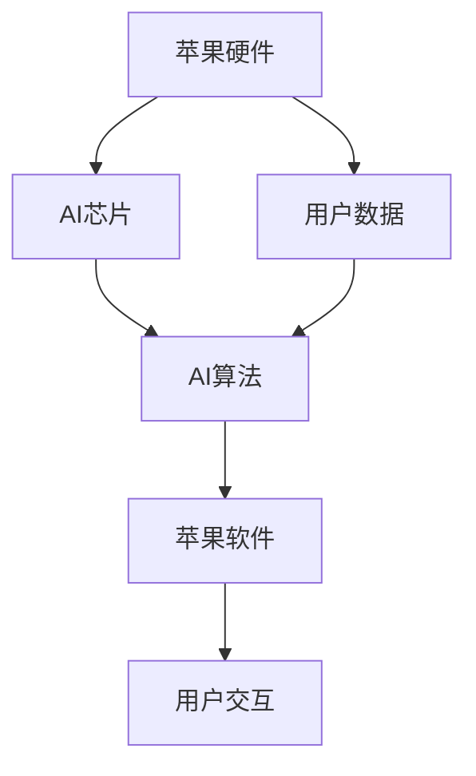

                 

### 第一部分：AI应用与苹果生态

#### 引言

人工智能（AI）已经成为现代科技发展的核心驱动力，各行各业都在积极探索和利用AI技术来提升生产力和用户体验。苹果公司，作为全球领先的科技公司，也在积极将AI技术融入到其产品和服务中。本文将深入探讨苹果发布AI应用的背景、重要性以及发展趋势。

#### 1.1 AI应用概述

##### 1.1.1 AI应用的发展背景

自20世纪50年代AI概念首次被提出以来，AI技术经历了数十年的发展。特别是随着大数据、云计算和深度学习等技术的崛起，AI开始从理论研究走向实际应用。如今，AI已经广泛应用于图像识别、自然语言处理、语音识别、推荐系统等领域，极大地改变了人们的生活方式和工作模式。

##### 1.1.2 AI应用在苹果生态中的重要性

苹果公司的产品和服务以其出色的用户体验和稳定性而闻名。将AI技术融入苹果生态，不仅能够提升产品的智能化水平，还能为用户带来更加个性化、便捷的使用体验。例如，Siri语音助手的引入，让用户可以通过语音指令轻松地操作设备，提升了交互效率。此外，AI技术在图像处理、人脸识别、隐私保护等方面的应用，也为苹果产品提供了更高的安全性和可靠性。

##### 1.1.3 苹果发布AI应用的趋势

随着AI技术的不断进步，苹果公司在AI应用方面的研发和发布也在不断加速。以下是一些苹果发布的AI应用趋势：

1. **语音助手与自然语言处理**：苹果的Siri和语音识别技术已经非常成熟，未来苹果可能会在语音识别的准确性和自然性上继续进行优化。
2. **图像识别与处理**：苹果的相机应用中已经集成了图像识别技术，用于人脸识别、场景识别等。未来，苹果可能会进一步扩展图像识别的应用场景。
3. **推荐系统**：苹果的App Store和Apple Music等应用已经利用推荐系统为用户推荐内容。随着AI技术的发展，推荐系统的算法将更加智能，推荐效果将更加精准。
4. **隐私保护**：苹果一直强调用户隐私保护，未来苹果可能会推出更多基于AI的隐私保护技术，以保护用户的个人信息。

#### 1.2 AI与苹果硬件

##### 1.2.1 AI在苹果硬件中的应用

苹果的硬件产品，如iPhone、iPad、Mac等，已经在多个方面应用了AI技术。以下是一些具体的应用实例：

1. **iPhone**：iPhone的相机应用中集成了AI图像处理技术，如人脸识别、场景优化等。此外，Siri语音助手和语音识别技术在iPhone中得到了广泛应用。
2. **iPad**：iPad的教育应用中利用AI技术进行内容推荐和个性化学习。
3. **Mac**：Mac的语音识别和自然语言处理技术使得用户可以通过语音指令来操作电脑。

##### 1.2.2 AI为苹果硬件带来的变革

AI技术的应用，使得苹果硬件产品的智能化水平得到了显著提升。以下是一些变革：

1. **提升用户体验**：通过AI技术，苹果硬件能够更好地理解用户的需求，提供个性化的服务。
2. **增强安全性**：AI技术在人脸识别、指纹识别等安全认证中的应用，提高了硬件设备的安全性。
3. **优化资源利用**：AI技术可以帮助苹果硬件更智能地管理硬件资源，提高设备的性能和续航能力。

#### 1.3 AI与苹果软件

##### 1.3.1 AI在苹果软件中的应用

苹果的软件产品，如iOS、macOS、watchOS等，也在多个方面应用了AI技术。以下是一些具体的应用实例：

1. **iOS**：iOS中的Siri语音助手、图片识别、语音识别等技术都是AI技术的典型应用。
2. **macOS**：macOS中的Spotlight搜索、人脸识别、自然语言处理等技术，提升了用户的使用体验。
3. **watchOS**：watchOS中的健康监测、心率分析等技术，利用AI技术提供了更准确的健康数据。

##### 1.3.2 AI为苹果软件带来的创新

AI技术的应用，使得苹果软件产品在用户体验、功能扩展和性能优化等方面得到了显著提升。以下是一些创新：

1. **个性化体验**：通过AI技术，苹果软件能够更好地理解用户的需求，提供个性化的内容和服务。
2. **智能推荐**：AI技术可以帮助苹果软件更精准地推荐用户感兴趣的内容，提升用户满意度。
3. **优化性能**：AI技术可以帮助苹果软件更智能地管理系统资源，提高软件的运行效率。

### 结论

AI技术在苹果生态中的应用已经成为不可逆转的趋势。通过AI技术，苹果不仅提升了产品的智能化水平，还为用户带来了更加个性化和便捷的使用体验。未来，随着AI技术的不断进步，苹果在AI应用方面的探索和发展将更加深入，为用户带来更多惊喜。

### 相关资源

- **苹果AI技术介绍**：[苹果AI技术官网](https://www.apple.com/technology/aifeedback/)
- **AI学习资源**：[斯坦福大学AI课程](https://cs.stanford.edu/people/karpathy/conv-nets/)
- **AI研究论文**：[Google AI论文库](https://ai.google/research/pubs/)

### 参考文献

- **苹果公司**. (2021). 苹果AI技术介绍. [在线文档]. https://www.apple.com/technology/aifeedback/
- **斯坦福大学**. (2015). 深度学习课程. [在线课程]. https://cs.stanford.edu/people/karpathy/conv-nets/
- **Google AI**. (2020). AI研究论文库. [在线文档]. https://ai.google/research/pubs/

### Mermaid流程图

### AI与苹果生态的融合关系图

### 摘要

本文首先介绍了AI应用的发展背景和在苹果生态中的重要性，接着详细探讨了AI与苹果硬件、软件的融合，以及它们为用户带来的变革和创新。最后，通过具体的实战案例，展示了AI技术在苹果生态中的应用场景和实际效果，并对未来AI应用的前景进行了展望。通过本文的阅读，读者可以全面了解AI技术在苹果生态中的应用和发展趋势。

