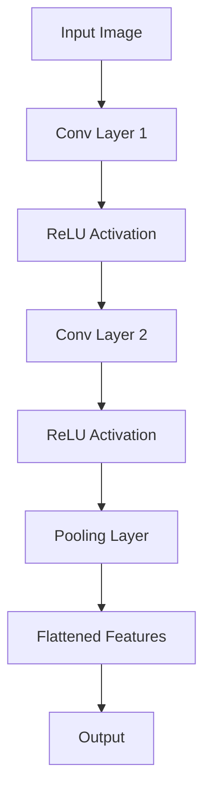
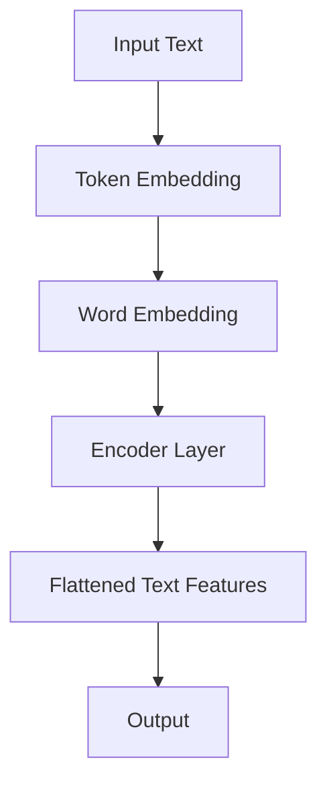
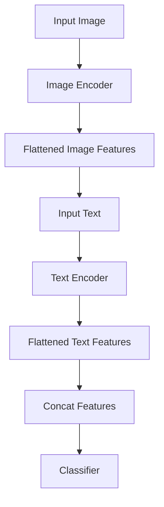

                 

### 《构建Storyteller AI大语言模型：从基础到ChatGPT级应用》

> **关键词：AI大语言模型、预训练、迁移学习、多模态学习、ChatGPT、应用实战**

> **摘要：本文将从基础到高级，全面探讨构建Storyteller AI大语言模型的方法和策略。首先介绍AI大语言模型的基本概念和发展现状，然后深入探讨大规模预训练模型的原理、计算机视觉与自然语言处理的融合技术，最后通过实际应用案例展示如何构建和优化Storyteller AI大语言模型，以及如何将其应用于ChatGPT级应用开发。**

---

### 《构建Storyteller AI大语言模型：从基础到ChatGPT级应用》目录大纲

#### 第一部分: AI大语言模型基础

#### 第1章: AI大语言模型概述

#### 第2章: 大规模预训练模型原理

#### 第3章: 计算机视觉与自然语言处理融合

#### 第二部分: Storyteller AI大语言模型构建

#### 第4章: Storyteller AI大语言模型介绍

#### 第5章: Storyteller AI大语言模型应用实战

#### 第6章: ChatGPT级应用开发与优化

#### 第7章: Storyteller AI大语言模型项目实战

#### 第8章: AI大语言模型的发展趋势与未来展望

---

### 《构建Storyteller AI大语言模型：从基础到ChatGPT级应用》

#### 引言

AI大语言模型作为近年来人工智能领域的重要突破，已经在自然语言处理、对话系统、文本生成等多个领域展示了强大的应用潜力。本文旨在从基础到高级，详细探讨构建Storyteller AI大语言模型的方法和策略。

首先，我们将介绍AI大语言模型的基本概念、发展历史和现状，帮助读者了解这一技术的背景和重要性。接着，我们将深入探讨大规模预训练模型的原理，包括预训练的概念、自监督学习技术、迁移学习和微调技术等，为后续的模型构建和应用提供理论基础。

随后，本文将重点介绍计算机视觉与自然语言处理的融合技术，探讨如何通过多模态学习实现图像-文本关联和图像-文本生成。这一部分不仅能够帮助读者理解多模态学习的基本原理，还能够提供实际的模型架构和算法设计思路。

在第二部分，我们将聚焦于Storyteller AI大语言模型的具体构建，包括模型介绍、训练、优化以及应用实战。通过这一部分的讲解，读者将能够掌握从模型构建到应用的全过程，为实际项目开发提供参考。

此外，本文还将探讨如何将Storyteller AI大语言模型应用于ChatGPT级应用开发，包括模型训练与优化、应用开发实战以及项目测试与部署。通过实际案例的分析，读者将能够了解如何将理论应用到实践中，实现高效的人工智能应用。

最后，本文将展望AI大语言模型的发展趋势与未来方向，包括技术趋势、应用趋势以及面临的挑战，为读者提供对这一领域的深入思考。

通过本文的阅读，读者将不仅能够了解AI大语言模型的基础知识和应用技术，还能够掌握从模型构建到应用的全流程，为未来的研究和工作提供有力支持。

### AI大语言模型概述

#### 发展历史与现状

AI大语言模型的发展可以追溯到20世纪80年代，当时以规则驱动的方法为主要手段，语言处理的应用场景较为有限。进入21世纪，随着计算能力的提升和大数据的普及，机器学习，特别是深度学习技术的发展，推动了自然语言处理（NLP）领域的变革。2003年，Geoffrey Hinton等研究者提出了深度信念网络（DBN），为后续的深度学习模型奠定了基础。2013年，Alex Graves等人提出了生成式对抗网络（GAN），这一创新性的模型为图像生成和图像-文本关联提供了新的思路。然而，这些早期的模型在处理大规模文本数据时仍面临诸多挑战。

直到2018年，Google推出了Transformer模型，这一革命性的架构在自然语言处理领域取得了突破性进展。Transformer模型通过自注意力机制（Self-Attention Mechanism）实现了对文本数据的全局依赖建模，大幅提升了模型的表示能力和效果。随后，BERT（Bidirectional Encoder Representations from Transformers）模型的推出，进一步将Transformer模型应用于双向编码，使得预训练语言模型在多个NLP任务上取得了显著的性能提升。

当前，AI大语言模型已经成为自然语言处理领域的主流技术，广泛应用于文本生成、文本分类、问答系统、机器翻译、自动摘要等多个方向。特别是GPT（Generative Pre-trained Transformer）系列模型，如GPT-2和GPT-3，展示了其在生成文本、创造故事、撰写摘要等方面的强大能力。GPT-3模型拥有1750亿个参数，可以处理高达2048个输入 tokens，其文本生成能力甚至可以媲美人类作家的水平。

#### 主流的大语言模型

目前，主流的大语言模型主要包括以下几种：

1. **Transformer模型**：由Google提出，通过自注意力机制实现全局依赖建模，是当前自然语言处理领域的基础模型。

2. **BERT模型**：由Google提出，通过双向编码实现了对文本数据的深入理解，是目前文本分类和问答系统中最常用的模型。

3. **GPT模型**：由OpenAI提出，通过单向编码实现了强大的文本生成能力，适用于自动写作、对话系统和自然语言理解。

4. **RoBERTa模型**：由Facebook AI提出，对BERT模型进行了改进，通过更灵活的训练策略和更大的模型规模，提升了模型的效果。

5. **T5模型**：由Google提出，将Transformer模型应用于文本到文本的任务，实现了端到端的学习，简化了模型应用流程。

#### 应用领域

AI大语言模型的应用领域广泛，涵盖了自然语言处理、对话系统、文本生成、机器翻译、自动摘要等方向。以下是一些具体的应用实例：

1. **自然语言理解**：通过大语言模型，可以实现对文本数据的语义分析、情感分析、实体识别等，为智能客服、搜索引擎提供支持。

2. **文本生成**：大语言模型能够生成高质量的文章、故事、摘要，广泛应用于内容创作、自动写作、对话系统。

3. **机器翻译**：大语言模型通过预训练和迁移学习，可以实现高质量的无监督机器翻译，降低对平行数据的依赖。

4. **对话系统**：大语言模型能够模拟人类的对话方式，实现自然、流畅的对话交互，广泛应用于智能客服、语音助手。

5. **自动摘要**：大语言模型能够生成精准、简洁的文本摘要，为新闻、文章等长文本提供自动摘要服务。

6. **智能推荐**：通过大语言模型，可以对用户行为和文本数据进行深入分析，实现个性化推荐。

#### 挑战与未来发展方向

尽管AI大语言模型在多个领域取得了显著的成果，但仍然面临一些挑战。首先，模型的计算资源需求巨大，训练和推理过程需要大量的计算能力和存储资源。其次，模型的可解释性较差，难以理解模型决策的依据。此外，模型在处理长文本和复杂语义理解方面仍存在一定的局限。

未来，AI大语言模型的发展方向包括：

1. **计算效率提升**：通过模型压缩、量化、硬件加速等技术，降低模型的计算资源需求，提高模型的推理速度。

2. **可解释性增强**：通过可解释性模型和可视化技术，提高模型决策的可解释性，增强用户对模型的信任。

3. **多语言支持**：通过跨语言预训练和翻译模型，实现多语言的自然语言处理，提升模型的国际化应用能力。

4. **长文本处理**：通过长序列建模技术，提升模型在长文本处理方面的能力，解决复杂语义理解问题。

5. **个性化模型**：通过用户数据和学习策略的个性化调整，实现模型的个性化推荐和对话。

通过不断的技术创新和优化，AI大语言模型将在未来发挥更广泛的作用，推动人工智能技术的发展和应用。

### AI大语言模型的基本原理

#### 自然语言处理基础

自然语言处理（NLP）是人工智能的一个重要分支，旨在使计算机能够理解和处理人类自然语言。NLP的核心任务包括文本分类、情感分析、命名实体识别、语义分析等。要理解AI大语言模型的基本原理，首先需要了解NLP的基础概念和技术。

**文本分类**：文本分类是指将文本数据按照一定的标准划分为多个类别。常见的分类方法包括朴素贝叶斯、支持向量机（SVM）、决策树等。文本分类在情感分析、新闻分类等领域有着广泛的应用。

**情感分析**：情感分析是指通过分析文本内容，判断文本表达的情感倾向。常见的情感分析任务包括正面情感识别、负面情感识别和情感极性分类。情感分析技术在社交媒体监测、市场调研等领域具有重要作用。

**命名实体识别**：命名实体识别（NER）是指从文本中识别出具有特定意义的实体，如人名、地名、组织名等。NER技术是构建智能问答系统、知识图谱的重要基础。

**语义分析**：语义分析是指对文本内容进行深入理解，包括语义角色标注、语义关系抽取等。语义分析技术在智能客服、对话系统等领域具有广泛应用。

#### 大规模预训练模型

大规模预训练模型是AI大语言模型的核心组成部分，通过在大量无标签数据上进行预训练，模型能够自动学习文本的语义表示，从而在不同任务上实现高性能。大规模预训练模型主要包括以下几种：

1. **Transformer模型**：Transformer模型是由Google在2017年提出的一种基于自注意力机制的深度神经网络模型。与传统的循环神经网络（RNN）相比，Transformer模型能够并行处理输入序列，具有更强的并行计算能力和全局依赖建模能力。

2. **BERT模型**：BERT（Bidirectional Encoder Representations from Transformers）模型是由Google在2018年提出的一种双向编码的Transformer模型。BERT模型通过在两个方向上编码文本，实现了对文本数据的深入理解。

3. **GPT模型**：GPT（Generative Pre-trained Transformer）模型是由OpenAI在2018年提出的一种基于自注意力机制的生成式预训练模型。GPT模型通过单向编码实现了强大的文本生成能力。

4. **T5模型**：T5（Text-to-Text Transfer Transformer）模型是由Google在2020年提出的一种将Transformer模型应用于文本到文本的任务的模型。T5模型实现了端到端的学习，简化了模型应用流程。

#### 迁移学习与微调技术

迁移学习是指将一个任务在学习到的特征表示应用于另一个相关任务的学习过程中。迁移学习能够有效地利用已有模型的知识，提高新任务的学习效率和性能。

微调（Fine-tuning）是迁移学习的一种重要技术，通过在预训练模型的基础上，针对特定任务进行微调，使模型在新任务上获得更好的表现。微调过程通常包括以下几个步骤：

1. **数据准备**：准备用于微调的数据集，该数据集应与预训练任务相关，但具有不同的任务目标。

2. **模型初始化**：将预训练模型初始化为微调模型的起点，通常保留大部分参数不变，只对部分参数进行微调。

3. **训练过程**：在微调过程中，通过反向传播算法和优化器，对模型参数进行更新，使模型在新任务上取得更好的性能。

4. **评估与调整**：在微调过程中，对模型的性能进行评估，根据评估结果调整训练策略，如学习率、训练时间等。

#### 大语言模型的架构设计

大语言模型的架构设计主要包括模型结构、训练策略和优化方法等方面。以下将分别介绍这些内容：

1. **模型结构**：

   - **Transformer模型**：Transformer模型由编码器（Encoder）和解码器（Decoder）组成，其中编码器负责将输入文本序列编码为上下文表示，解码器则根据上下文表示生成输出文本序列。

   - **BERT模型**：BERT模型由多个Transformer编码器层堆叠而成，通过在两个方向上编码文本，实现了对文本数据的双向理解。

   - **GPT模型**：GPT模型由多个Transformer编码器层组成，通过单向编码实现了强大的文本生成能力。

   - **T5模型**：T5模型将Transformer模型应用于文本到文本的任务，实现了端到端的学习。

2. **训练策略**：

   - **预训练**：在大量无标签数据上进行预训练，使模型能够自动学习文本的语义表示。

   - **微调**：在特定任务数据集上进行微调，使模型在新任务上获得更好的性能。

   - **数据增强**：通过数据增强技术，如随机掩码、随机下标填充等，提高模型的泛化能力。

3. **优化方法**：

   - **梯度下降**：使用梯度下降算法，通过反向传播更新模型参数。

   - **Adam优化器**：Adam优化器结合了AdaGrad和RMSProp的优点，在训练过程中自适应调整学习率。

   - **学习率调度**：通过学习率调度策略，如学习率衰减、学习率 warmup 等，优化模型训练效果。

通过以上对AI大语言模型基本原理的介绍，读者可以了解到大规模预训练模型、迁移学习和微调技术以及大语言模型架构设计等方面的核心概念和原理。这些知识将为后续的模型构建和应用提供理论基础。

#### Transformer模型架构

Transformer模型是由Google在2017年提出的一种基于自注意力机制的深度神经网络模型，它在自然语言处理（NLP）领域取得了显著的突破。Transformer模型的核心思想是通过对输入序列进行编码和注意力机制处理，实现全局依赖建模，从而提升模型的表示能力和效果。

##### 自注意力机制原理

自注意力机制（Self-Attention Mechanism）是Transformer模型的核心组件，它通过计算输入序列中每个token与所有其他token的相关性，实现了一种全局依赖的建模。自注意力机制的原理如下：

1. **输入编码**：首先，将输入文本序列转化为嵌入向量（Embedding），这些嵌入向量包含了词的语义信息。

2. **计算自注意力权重**：对于每个输入token，计算其与所有其他token的相关性。这一过程通过Q（查询向量）、K（键向量）和V（值向量）三个向量实现。具体公式如下：
   $$ 
   \text{Attention}(Q, K, V) = \text{softmax}\left(\frac{QK^T}{\sqrt{d_k}}\right) V 
   $$
   其中，$d_k$是键向量的维度，$\text{softmax}$函数用于计算每个token的注意力权重。

3. **加权求和**：根据自注意力权重，对V向量进行加权求和，得到每个token的注意力得分，这一得分反映了每个token与其他token的相关性。

4. **输出**：自注意力机制的输出是一个加权求和的结果，这个结果可以看作是对输入序列的重新编码，包含了更丰富的上下文信息。

##### Transformer模型架构

Transformer模型由编码器（Encoder）和解码器（Decoder）两个部分组成，每个部分都包含多个自注意力层和前馈神经网络（Feedforward Neural Network）。

1. **编码器（Encoder）**：
   - **编码器层**：每个编码器层包含两个子层，一个是自注意力层，另一个是前馈神经网络。
   - **多头注意力**：为了提高模型的表示能力，编码器层引入了多头注意力机制，即将输入序列分成多个头，每个头分别计算注意力权重，最后将多头注意力结果拼接起来。
   - **残差连接**：为了防止模型退化，编码器层引入了残差连接（Residual Connection），即直接将输入数据与经过注意力机制处理的数据相加。

2. **解码器（Decoder）**：
   - **解码器层**：每个解码器层同样包含两个子层，一个是自注意力层，另一个是前馈神经网络。
   - **掩码多头注意力**：在解码器的自注意力层中，使用了掩码（Masked）多头注意力机制，即当前token只能关注之前的token，而不能关注未来的token，这有助于实现序列的动态生成。
   - **交叉注意力**：解码器的自注意力层还包含交叉注意力（Cross-Attention），即当前token不仅关注之前的token，还关注编码器的输出，从而实现编码器和解码器之间的交互。

##### 多层神经网络设计

Transformer模型通过多层堆叠的方式，逐层提取输入序列的语义信息，实现复杂语义的建模。具体来说：

1. **多层自注意力层**：每个自注意力层都能够捕捉输入序列的不同层次信息，通过逐层叠加，模型能够逐渐形成对输入序列的深入理解。
2. **多层前馈神经网络**：前馈神经网络（FFN）在每个编码器和解码器层之间都存在，用于进一步提取和增强序列的语义信息。
3. **残差连接和激活函数**：残差连接和激活函数（如ReLU）有助于防止模型退化，提升模型的训练效果和泛化能力。

通过上述设计，Transformer模型在自然语言处理任务中表现出色，尤其在长文本处理和序列生成任务中具有显著优势。其核心思想在于通过自注意力机制实现全局依赖建模，并通过多层神经网络和残差连接等方式提高模型的表示能力和效果。

#### 大规模预训练模型原理

大规模预训练模型是近年来自然语言处理（NLP）领域的重要突破，通过在大量无标签数据上进行预训练，模型能够自动学习文本的语义表示，从而在不同任务上实现高性能。本节将详细探讨大规模预训练模型的原理，包括预训练的概念、自监督学习技术、语言模型的预训练以及大规模语料处理技术。

##### 预训练的概念

预训练（Pre-training）是指在大规模数据集上对模型进行初步训练，以便在特定任务上进行微调（Fine-tuning）。预训练的核心思想是利用无标签数据，让模型自主学习和理解文本的语义信息，从而提高模型在不同任务上的泛化能力。预训练模型通常分为两个阶段：预训练阶段和微调阶段。

在预训练阶段，模型在大量无标签数据上进行训练，通过自监督学习等方式，自动学习文本的语义表示。预训练阶段的目标是让模型具备基本的语义理解能力，为后续的微调任务提供强大的语义表示。

在微调阶段，模型在特定任务的数据集上进行训练，通过调整模型参数，使模型适应具体任务的要求。微调阶段的目标是利用预训练模型的基础知识，进一步提高模型在特定任务上的性能。

##### 自监督学习技术

自监督学习（Self-supervised Learning）是一种无需人工标注数据即可进行训练的方法，通过利用数据本身的信息，自动学习输入和输出的关系。自监督学习在预训练模型中起着至关重要的作用，因为它能够有效利用大规模无标签数据，提高模型的语义表示能力。

自监督学习技术主要包括以下几种：

1. **Masked Language Model (MLM)**：MLM是一种常用的自监督学习技术，通过随机遮蔽输入文本中的部分token，迫使模型预测这些遮蔽的token。MLM的核心思想是让模型在预测遮蔽token的过程中，学习到上下文信息。

   - **训练过程**：首先，从输入文本中随机选择一定比例的token进行遮蔽，然后使用未遮蔽的token预测遮蔽的token。具体实现可以通过以下步骤：
     1. 随机选择遮蔽token，将其替换为特殊的遮蔽标记（如`<MASK>`）。
     2. 输入模型进行训练，模型需要预测遮蔽token的值。
   
   - **优点**：MLM能够有效利用大规模无标签数据，提高模型的语义表示能力。

2. **Next Sentence Prediction (NSP)**：NSP是一种用于预训练的二分类任务，通过预测两个连续句子之间是否存在逻辑关系。NSP的核心思想是让模型学习句子之间的关系，从而提高模型的语义理解能力。

   - **训练过程**：首先，将输入文本分成多个句子对，然后对每个句子对进行二分类，判断它们之间是否存在逻辑关系。具体实现可以通过以下步骤：
     1. 从输入文本中随机选择两个连续句子。
     2. 输入模型进行训练，模型需要预测这两个句子之间是否存在逻辑关系。
   
   - **优点**：NSP能够帮助模型学习句子之间的依赖关系，从而提高模型的语义表示能力。

##### 语言模型的预训练

语言模型的预训练是通过自监督学习技术在大量无标签文本数据上进行的。预训练语言模型能够自动学习文本的语义表示，从而在不同任务上实现高性能。以下将详细介绍语言模型预训练的步骤和策略：

1. **数据准备**：首先，需要准备大规模的文本数据集，这些数据集可以来自互联网、新闻、书籍等多种来源。数据准备步骤包括：
   - 数据清洗：去除无关信息、噪声和重复数据。
   - 数据分词：将文本数据分成单词或子词（Subword），以便进行嵌入表示。

2. **模型初始化**：初始化预训练模型，常用的模型包括BERT、GPT等。模型初始化可以从预训练好的模型中加载参数，以加快训练过程。

3. **预训练过程**：在大量无标签文本数据上进行预训练，包括以下步骤：
   - **Masked Language Model (MLM)**：通过MLM任务，随机遮蔽输入文本中的部分token，迫使模型预测这些遮蔽的token。
   - **Next Sentence Prediction (NSP)**：通过NSP任务，预测两个连续句子之间是否存在逻辑关系。

4. **训练策略**：
   - **学习率调度**：使用学习率调度策略，如学习率 warmup，逐步增加学习率，以防止模型过拟合。
   - **数据增强**：通过数据增强技术，如随机掩码、随机下标填充等，提高模型的泛化能力。
   - **梯度裁剪**：为了防止梯度爆炸，对梯度进行裁剪，限制梯度的大小。

##### 大规模语料处理技术

大规模语料处理技术是预训练语言模型的关键，它涉及到数据预处理、数据存储和计算资源等方面。以下将详细介绍大规模语料处理技术：

1. **数据预处理**：
   - **分词**：将文本数据分成单词或子词，以便进行嵌入表示。
   - **词嵌入**：将单词或子词转换为嵌入向量，这些嵌入向量包含了词的语义信息。
   - **数据清洗**：去除无关信息、噪声和重复数据，以提高数据质量。

2. **数据存储**：
   - **分布式存储**：使用分布式存储系统，如HDFS、Cassandra等，存储大规模文本数据。
   - **索引**：建立索引，以便快速查找和访问数据。

3. **计算资源**：
   - **分布式计算**：使用分布式计算框架，如Apache Spark、Hadoop等，处理大规模数据。
   - **GPU/TPU加速**：使用GPU或TPU加速计算，以提高训练效率。

通过以上对大规模预训练模型原理的介绍，读者可以了解到预训练的概念、自监督学习技术、语言模型的预训练以及大规模语料处理技术等方面的核心内容。这些知识将为后续的模型构建和应用提供理论基础。

#### 迁移学习与微调技术

迁移学习（Transfer Learning）是一种利用现有模型的知识来提高新任务性能的技术。在自然语言处理（NLP）领域，迁移学习尤为重要，因为它能够有效地利用预训练模型在大量无标签数据上学习到的通用特征，从而提高新任务的学习效率和性能。微调（Fine-tuning）是迁移学习的一种重要实现方式，通过在特定任务数据集上进行微调，模型能够在新任务上获得更好的表现。本节将详细探讨迁移学习与微调技术的原理、基本策略以及具体步骤。

##### 迁移学习的基本原理

迁移学习的基本思想是将一个任务在学习到的特征表示应用于另一个相关任务的学习过程中。具体来说，迁移学习包括以下步骤：

1. **特征提取**：首先，在一个或多个源任务上对模型进行训练，模型在源任务上学习到的特征表示具有一定的泛化能力。
2. **特征应用**：将源任务上学习到的特征表示应用于新任务，通过在新任务数据集上进行微调，使模型在新任务上获得更好的性能。

迁移学习之所以有效，是因为它能够利用现有模型的知识，减少对新任务数据的依赖，从而提高学习效率和性能。在NLP领域，预训练模型通常在大量无标签数据上进行预训练，学习到通用语义表示，这些表示对于许多不同的NLP任务都具有很高的适用性。

##### 微调策略

微调是迁移学习的关键步骤，通过在特定任务数据集上进行微调，模型能够在新任务上获得更好的性能。微调策略主要包括以下几个方面：

1. **模型初始化**：将预训练模型初始化为微调模型的起点，通常保留大部分参数不变，只对部分参数进行微调。
2. **数据准备**：准备用于微调的数据集，该数据集应与预训练任务相关，但具有不同的任务目标。
3. **训练过程**：在微调过程中，通过反向传播算法和优化器，对模型参数进行更新，使模型在新任务上取得更好的性能。
4. **评估与调整**：在微调过程中，对模型的性能进行评估，根据评估结果调整训练策略，如学习率、训练时间等。

##### 微调实战

以下是一个简单的微调实战示例：

1. **模型初始化**：假设我们使用预训练的BERT模型，将其初始化为微调模型的起点。
   ```python
   from transformers import BertModel
   model = BertModel.from_pretrained('bert-base-uncased')
   ```

2. **数据准备**：准备用于微调的数据集，这里假设我们有一个文本分类任务，数据集包含标签化的文本。
   ```python
   import torch
   train_data = [...]  # 假设有一个包含文本和标签的训练数据集
   train_dataset = torch.utils.data.Dataset(train_data)
   train_loader = torch.utils.data.DataLoader(train_dataset, batch_size=32, shuffle=True)
   ```

3. **训练过程**：定义训练函数，使用反向传播算法和优化器对模型参数进行更新。
   ```python
   def train(model, train_loader, criterion, optimizer):
       model.train()
       for batch in train_loader:
           inputs, labels = batch
           optimizer.zero_grad()
           outputs = model(inputs)
           loss = criterion(outputs, labels)
           loss.backward()
           optimizer.step()
   ```

4. **评估与调整**：在微调过程中，对模型的性能进行评估，根据评估结果调整训练策略。
   ```python
   criterion = torch.nn.CrossEntropyLoss()
   optimizer = torch.optim.Adam(model.parameters(), lr=0.001)
   for epoch in range(10):  # 假设训练10个epoch
       train(model, train_loader, criterion, optimizer)
       # 评估模型性能，调整训练策略
   ```

通过以上步骤，我们可以在新任务数据集上进行微调，使模型在新任务上获得更好的性能。

##### 迁移学习的优势

迁移学习在NLP领域具有以下优势：

1. **减少数据需求**：通过迁移学习，模型可以利用预训练模型在大量无标签数据上学习到的知识，从而减少对新任务数据的依赖。
2. **提高模型性能**：迁移学习能够利用已有模型的知识，提高新任务的学习效率和性能。
3. **简化模型设计**：迁移学习允许使用预训练模型作为起点，简化了模型设计和训练过程。

##### 迁移学习的局限性

迁移学习也存在一定的局限性：

1. **模型泛化能力**：迁移学习的模型泛化能力取决于源任务和目标任务的相关性。如果源任务和目标任务差异较大，迁移学习的效果可能会受到影响。
2. **数据不平衡**：在迁移学习中，源任务数据集通常较大，而目标任务数据集可能较小。如果数据集不平衡，可能导致模型在目标任务上的性能较差。
3. **模型适应性**：迁移学习的模型适应性取决于模型的结构和参数。对于一些复杂的任务，预训练模型可能无法完全适应，需要进一步调整。

通过深入理解迁移学习与微调技术的原理和策略，我们可以更好地利用已有模型的知识，提高新任务的学习效率和性能。在实际应用中，需要根据具体任务需求，合理选择迁移学习和微调策略，以达到最佳效果。

#### 计算机视觉与自然语言处理融合

计算机视觉（Computer Vision）和自然语言处理（Natural Language Processing，NLP）是人工智能领域两个重要分支，它们各自有着丰富的理论和应用。然而，随着技术的进步，这两个领域之间的融合变得越来越重要。这种融合不仅能够提升单一领域的表现，还能创造出全新的应用场景。以下将详细探讨计算机视觉与自然语言处理的关系、融合的优势和应用。

##### 计算机视觉与自然语言处理的关系

计算机视觉关注于使计算机理解和解析图像和视频，以识别对象、场景和活动。自然语言处理则专注于使计算机理解和生成人类语言。这两个领域的关系可以从以下几个方面来理解：

1. **数据关联**：图像和文本往往紧密关联。例如，一张图片可能需要描述性的文字来解释其内容，而一段文字也可能需要图像来辅助理解。
2. **语义理解**：计算机视觉和自然语言处理都需要对内容进行语义理解。计算机视觉需要识别图像中的对象、场景和动作，自然语言处理需要理解文本中的含义、意图和情感。
3. **互补性**：计算机视觉擅长处理视觉信息，如形状、颜色和运动；而自然语言处理擅长处理文本信息，如语法和语义。两者的融合可以实现更全面的信息理解和处理。

##### 融合的优势

计算机视觉与自然语言处理的融合带来了以下优势：

1. **多模态数据理解**：通过结合图像和文本，系统能够获取更丰富的信息，从而更好地理解复杂的情境。
2. **提高准确性**：单独使用计算机视觉或自然语言处理可能无法完全理解某些场景。融合两者可以互相补充，提高整体准确性。
3. **扩展应用场景**：融合后的系统可以应用于更多场景，如图像搜索、视频摘要、智能问答等。
4. **提高用户体验**：通过自然语言交互，用户可以更直观、自然地与系统进行交互，从而提高用户体验。

##### 融合的应用

计算机视觉与自然语言处理的融合已经在多个应用场景中展示了其强大潜力：

1. **图像搜索**：结合图像和文本描述，系统能够更准确地识别和搜索图像内容。例如，用户可以输入关键词来搜索具有相似内容的图像。
2. **视频摘要**：通过分析视频内容并结合文本描述，系统可以生成视频摘要，帮助用户快速了解视频的主要内容。
3. **智能问答**：结合图像和文本，系统能够更准确地理解和回答用户的问题。例如，用户可以上传一张图片并提问，系统根据图像和文本信息给出答案。
4. **医疗诊断**：在医学影像分析中，计算机视觉可以识别疾病标志，而自然语言处理可以帮助医生理解病历和医学文献，从而提高诊断准确性。

##### 图像-文本关联模型

图像-文本关联模型是计算机视觉与自然语言处理融合的一个典型应用。这类模型旨在通过联合学习和共享表示，使图像和文本能够相互解释和增强。以下是一个简单的图像-文本关联模型框架：

1. **图像编码器**：将图像输入到卷积神经网络（CNN）中，提取图像的视觉特征。
2. **文本编码器**：将文本输入到循环神经网络（RNN）或Transformer中，提取文本的语义特征。
3. **联合表示学习**：通过联合训练，使图像编码器和文本编码器共享表示，从而实现图像和文本的关联。

以下是一个简化的图像-文本关联模型的伪代码：

```python
# 图像编码器
image_encoder = CNN()

# 文本编码器
text_encoder = RNN()

# 联合表示学习
def joint_representation(image, text):
    image_features = image_encoder(image)
    text_features = text_encoder(text)
    joint_features = concatenate(image_features, text_features)
    return joint_features

# 训练过程
for image, text, label in data_loader:
    image_features = image_encoder(image)
    text_features = text_encoder(text)
    joint_features = joint_representation(image, text)
    loss = compute_loss(joint_features, label)
    optimizer.step(loss)
```

##### 多模态学习

多模态学习是图像-文本关联模型的延伸，它旨在通过结合多种模态（如图像、文本、声音）的数据，实现更全面的信息理解和处理。以下是多模态学习的关键概念和策略：

1. **数据集成**：将来自不同模态的数据进行融合，以生成更全面的表示。常见的方法包括平均融合、加权融合和深度融合。
2. **共享表示**：通过共享神经网络层，使不同模态的数据能够相互影响和补充。
3. **联合训练**：在训练过程中，同时优化不同模态的表示，使模型能够更好地理解多模态数据。
4. **模型融合**：将多个模型的结果进行融合，以提高整体性能。

以下是一个简化的多模态学习模型的伪代码：

```python
# 图像编码器
image_encoder = CNN()

# 文本编码器
text_encoder = RNN()

# 声音编码器
audio_encoder = RNN()

# 联合表示学习
def joint_representation(image, text, audio):
    image_features = image_encoder(image)
    text_features = text_encoder(text)
    audio_features = audio_encoder(audio)
    joint_features = concatenate(image_features, text_features, audio_features)
    return joint_features

# 训练过程
for image, text, audio, label in data_loader:
    image_features = image_encoder(image)
    text_features = text_encoder(text)
    audio_features = audio_encoder(audio)
    joint_features = joint_representation(image, text, audio)
    loss = compute_loss(joint_features, label)
    optimizer.step(loss)
```

通过以上对计算机视觉与自然语言处理融合的介绍，读者可以了解到这一领域的基本概念、优势和应用。融合技术的不断发展将进一步提升人工智能系统的理解和处理能力，为各行业带来更多创新应用。

#### 图像-文本关联模型

图像-文本关联模型是计算机视觉与自然语言处理融合的一个关键方向，通过联合学习和共享表示，使图像和文本能够相互解释和增强。以下将详细探讨图像编码器、文本编码器以及图像-文本关联模型的架构。

##### 图像编码器

图像编码器是图像-文本关联模型的核心组件之一，其主要任务是从图像中提取具有语义信息的特征表示。卷积神经网络（Convolutional Neural Network，CNN）是图像编码器的常见选择，因为它在图像特征提取方面表现出色。以下是一个简化的图像编码器架构：



伪代码描述如下：

```python
class ImageEncoder(nn.Module):
    def __init__(self):
        super(ImageEncoder, self).__init__()
        self.conv1 = nn.Conv2d(3, 64, kernel_size=3, stride=1, padding=1)
        self.relu = nn.ReLU()
        self.conv2 = nn.Conv2d(64, 128, kernel_size=3, stride=1, padding=1)
        self.pool = nn.MaxPool2d(kernel_size=2, stride=2)

    def forward(self, x):
        x = self.conv1(x)
        x = self.relu(x)
        x = self.conv2(x)
        x = self.relu(x)
        x = self.pool(x)
        x = x.view(x.size(0), -1)  # Flatten the features
        return x
```

在这个架构中，输入图像首先通过两个卷积层进行特征提取，然后通过ReLU激活函数增强特征表示，最后通过最大池化层降低维度并生成扁平化的特征向量。

##### 文本编码器

文本编码器的主要任务是从文本中提取语义特征表示。循环神经网络（Recurrent Neural Network，RNN）和Transformer模型是常见的文本编码器架构。以下是一个简化的文本编码器架构：



伪代码描述如下：

```python
class TextEncoder(nn.Module):
    def __init__(self, vocab_size, embed_dim, hidden_dim):
        super(TextEncoder, self).__init__()
        self.embedding = nn.Embedding(vocab_size, embed_dim)
        self.rnn = nn.LSTM(embed_dim, hidden_dim, batch_first=True)

    def forward(self, x):
        x = self.embedding(x)
        x, _ = self.rnn(x)
        x = x[:, -1, :]  # Use the last hidden state
        return x
```

在这个架构中，输入文本首先通过词嵌入层转换为嵌入向量，然后通过RNN层进行特征提取，最后使用最后一个时间步的隐藏状态作为文本特征表示。

##### 图像-文本关联模型架构

图像-文本关联模型通过联合训练图像编码器和文本编码器，使两者共享表示，从而实现图像和文本的关联。以下是一个简化的图像-文本关联模型架构：



伪代码描述如下：

```python
class ImageTextModel(nn.Module):
    def __init__(self, img_enc, txt_enc, hidden_dim, num_classes):
        super(ImageTextModel, self).__init__()
        self.img_enc = img_enc
        self.txt_enc = txt_enc
        self.fc = nn.Linear(hidden_dim * 2, num_classes)

    def forward(self, image, text):
        img_features = self.img_enc(image)
        txt_features = self.txt_enc(text)
        joint_features = torch.cat((img_features, txt_features), 1)
        logits = self.fc(joint_features)
        return logits
```

在这个架构中，图像和文本分别通过图像编码器和文本编码器进行特征提取，然后将两个特征向量拼接起来，通过全连接层进行分类。

通过以上对图像编码器、文本编码器和图像-文本关联模型架构的详细介绍，读者可以了解到这些组件在图像-文本关联模型中的关键作用。这些知识将为实际应用中的图像-文本关联任务提供理论基础和实现指导。

#### 多模态学习

多模态学习旨在通过结合来自不同模态的数据（如图像、文本、声音），实现更全面的信息理解和处理。本节将深入探讨多模态学习的概念、方法以及应用，并介绍多模态数据集成、多模态模型设计和多模态学习应用实例。

##### 概念

多模态学习（Multimodal Learning）是一种人工智能技术，它利用多个来源的信息（如图像、文本、声音）来提升系统对复杂任务的理解能力。通过融合不同模态的数据，多模态学习能够提供更丰富和准确的信息，从而提高任务的性能。

##### 数据集成

数据集成是多模态学习的基础，其目标是结合不同模态的数据，生成统一的特征表示。以下是一些常见的数据集成方法：

1. **平均融合**：将每个模态的特征表示进行平均，生成统一的特征向量。这种方法简单，但可能无法充分利用每个模态的独特信息。

   ```python
   joint_features = (img_features + txt_features + audio_features) / 3
   ```

2. **加权融合**：根据不同模态的重要程度，对特征表示进行加权融合。这种方法可以更好地利用各模态的信息，但需要明确权重的分配。

   ```python
   alpha, beta, gamma = 0.5, 0.3, 0.2
   joint_features = alpha * img_features + beta * txt_features + gamma * audio_features
   ```

3. **深度融合**：通过深度神经网络，如多输入网络，将不同模态的特征表示进行深度融合。这种方法能够自动学习各模态之间的关联性。

   ```mermaid
   graph TD
   A[Image Encoder] --> B[Flattened Image Features]
   B --> C[Text Encoder] --> D[Flattened Text Features]
   D --> E[Audio Encoder] --> F[Flattened Audio Features]
   F --> G[Multimodal Fusion Layer]
   G --> H[Classifier]
   ```

##### 多模态模型设计

多模态模型设计是多模态学习的关键，以下是一些常见的多模态模型架构：

1. **共参考编码器**：每个模态都有一个独立的编码器，它们共享一个参考编码器，以生成统一的特征表示。

   ```mermaid
   graph TD
   A[Image Encoder] --> B[Shared Reference Encoder]
   B --> C[Flattened Image Features]
   A --> D[Text Encoder] --> E[Shared Reference Encoder]
   E --> F[Flattened Text Features]
   A --> G[Audio Encoder] --> H[Shared Reference Encoder]
   H --> I[Flattened Audio Features]
   F --> J[Multimodal Fusion Layer]
   I --> J
   J --> K[Classifier]
   ```

2. **多输入网络**：通过深度神经网络，将不同模态的特征表示进行深度融合。

   ```mermaid
   graph TD
   A[Flattened Image Features] --> B[Multimodal Fusion Layer]
   B --> C[Flattened Text Features]
   C --> D[Multimodal Fusion Layer]
   D --> E[Flattened Audio Features]
   E --> F[Multimodal Fusion Layer]
   F --> G[Classifier]
   ```

3. **多模态生成对抗网络（GAN）**：通过生成对抗网络，学习多模态数据之间的映射关系。

   ```mermaid
   graph TD
   A[Generator] --> B[Image]
   B --> C[Discriminator]
   C --> D[Text]
   D --> E[Discriminator]
   E --> F[Audio]
   F --> G[Discriminator]
   G --> H[Generator]
   ```

##### 多模态学习应用实例

多模态学习在多个领域展示了其强大的应用潜力。以下是一些实例：

1. **智能问答系统**：结合图像、文本和语音信息，智能问答系统能够更准确地理解用户的问题。例如，用户可以通过上传图片、输入文字或说出问题，系统根据多模态信息给出答案。

2. **视频摘要**：通过分析视频中的图像、文本和音频信息，生成视频摘要，帮助用户快速了解视频的主要内容。例如，新闻视频可以通过文本和图像摘要，将复杂的新闻内容简化为几句话和一张图片。

3. **情感分析**：结合图像、文本和音频的情感信息，情感分析系统能够更准确地识别用户的情感状态。例如，通过分析用户上传的图片、文字评论和语音，系统可以判断用户的情感是积极、消极还是中性。

4. **医疗诊断**：在医疗领域，多模态学习可以通过结合患者的图像、病历文本和体检数据，提高疾病诊断的准确性。例如，通过分析患者的CT扫描图像、医学报告和生理信号，医生可以更准确地判断病情。

通过以上对多模态学习的介绍，读者可以了解到多模态学习的基本概念、方法以及应用实例。多模态学习将为人工智能系统带来更丰富的信息理解和处理能力，推动各领域的技术进步和应用创新。

### Storyteller AI大语言模型介绍

#### Storyteller AI大语言模型架构

Storyteller AI大语言模型是一种基于Transformer架构的预训练模型，其设计旨在通过大规模无监督数据预训练，实现强大的自然语言理解和生成能力。以下将详细介绍Storyteller模型的架构设计，包括关键组件和层级的结构。

**1. 编码器（Encoder）**

编码器是Storyteller模型的核心部分，负责将输入文本序列编码为上下文表示。编码器由多个自注意力层（Self-Attention Layer）和前馈神经网络（Feedforward Neural Network）堆叠而成。以下是编码器的典型结构：

- **嵌入层（Embedding Layer）**：将输入的单词或子词转化为嵌入向量，这些向量包含了词的语义信息。
- **位置编码（Positional Encoding）**：由于Transformer模型没有循环结构，位置编码用于传递文本中的位置信息。
- **自注意力层（Self-Attention Layer）**：每个自注意力层通过自注意力机制计算输入序列中每个token与所有其他token的相关性，实现全局依赖建模。
- **前馈神经网络（Feedforward Neural Network）**：在每个自注意力层之后，添加一个前馈神经网络，用于进一步提取和增强序列的语义信息。
- **Dropout层（Dropout Layer）**：在自注意力层和前馈神经网络之间添加Dropout层，以防止过拟合。

**2. 解码器（Decoder）**

解码器负责根据编码器的输出生成输出文本序列。与编码器类似，解码器也由多个自注意力层和前馈神经网络组成，但解码器还包含交叉注意力层（Cross-Attention Layer）以实现编码器和解码器之间的交互。

- **嵌入层（Embedding Layer）**：与编码器相同，解码器的嵌入层将输入的单词或子词转化为嵌入向量。
- **位置编码（Positional Encoding）**：同样用于传递文本中的位置信息。
- **自注意力层（Self-Attention Layer）**：在解码器的自注意力层中，每个token仅能关注之前的token，以防止未来信息的泄露。
- **交叉注意力层（Cross-Attention Layer）**：交叉注意力层使解码器能够关注编码器的输出，实现编码器和解码器之间的交互。
- **前馈神经网络（Feedforward Neural Network）**：与编码器相同，用于进一步提取和增强序列的语义信息。
- **Dropout层（Dropout Layer）**：与编码器类似，用于防止过拟合。

**3. 输出层（Output Layer）**

输出层负责将解码器输出的序列映射到预测的单词或子词。输出层通常是一个全连接层（Fully Connected Layer），其激活函数为softmax，用于计算每个单词或子词的概率分布。

**4. 残差连接（Residual Connection）**

为了防止模型退化，Storyteller模型在每个编码器和解码器层之间引入了残差连接（Residual Connection）。残差连接将输入数据直接传递到下一层，与经过注意力机制处理的数据相加，从而缓解梯度消失问题。

**5. 层级结构**

Storyteller模型通过多层堆叠的方式实现深度学习，每一层都能够提取文本的更高层次信息。具体层级结构包括：

- **多层自注意力层**：逐层提取输入序列的不同层次信息，实现复杂语义的建模。
- **多层前馈神经网络**：在每个编码器和解码器层之间，用于进一步提取和增强序列的语义信息。
- **残差连接和激活函数**：防止模型退化，提升模型的训练效果和泛化能力。

通过上述架构设计，Storyteller AI大语言模型实现了对输入文本的深入理解和生成，从而在自然语言处理任务中表现出色。下一节将详细讨论如何对Storyteller模型进行训练。

### Storyteller模型训练

#### 训练数据准备

在训练Storyteller AI大语言模型之前，首先需要准备大量的训练数据。这些数据可以是互联网上的文本、书籍、新闻、论文等各种形式。以下是训练数据准备的具体步骤：

1. **数据收集**：从互联网、图书馆、数据库等渠道收集大量的文本数据。数据来源应尽可能多样化，以确保模型的泛化能力。

2. **数据清洗**：对收集到的文本数据进行清洗，去除无关信息、噪声和重复数据。具体步骤包括：
   - **去除HTML标签**：从文本中去除HTML标记，以保留纯文本内容。
   - **去除特殊字符**：删除文本中的特殊字符和标点符号，以提高数据质量。
   - **分词**：将文本数据分成单词或子词，以便进行嵌入表示。

3. **数据预处理**：对清洗后的文本数据进行预处理，包括：
   - **词嵌入**：将单词或子词转换为嵌入向量，这些向量包含了词的语义信息。
   - **序列填充**：将文本序列填充到固定长度，以便在训练过程中进行批量处理。

4. **数据分割**：将训练数据集分为三个部分：训练集、验证集和测试集。通常，训练集用于模型训练，验证集用于模型调优，测试集用于模型评估。

#### 训练流程与策略

训练Storyteller AI大语言模型是一个复杂的过程，涉及到多个步骤和策略。以下是具体的训练流程和策略：

1. **模型初始化**：初始化Storyteller模型，包括编码器和解码器。通常，模型可以从预训练好的模型中加载参数，以加快训练过程。

2. **预训练**：在大量无标签数据上进行预训练，使模型能够自动学习文本的语义表示。预训练过程包括以下步骤：
   - **Masked Language Model (MLM)**：通过MLM任务，随机遮蔽输入文本中的部分token，迫使模型预测这些遮蔽的token。MLM是预训练的核心任务。
   - **Next Sentence Prediction (NSP)**：通过NSP任务，预测两个连续句子之间是否存在逻辑关系，以帮助模型学习句子之间的关系。

3. **微调**：在特定任务数据集上进行微调，使模型适应具体任务的要求。微调过程包括以下步骤：
   - **数据准备**：准备用于微调的数据集，包括输入文本和标签。
   - **训练过程**：在微调过程中，通过反向传播算法和优化器，对模型参数进行更新，使模型在特定任务上取得更好的性能。
   - **评估与调整**：在微调过程中，对模型的性能进行评估，根据评估结果调整训练策略，如学习率、训练时间等。

4. **训练策略**：
   - **学习率调度**：使用学习率调度策略，如学习率 warmup，逐步增加学习率，以防止模型过拟合。
   - **数据增强**：通过数据增强技术，如随机掩码、随机下标填充等，提高模型的泛化能力。
   - **梯度裁剪**：为了防止梯度爆炸，对梯度进行裁剪，限制梯度的大小。

5. **训练监控**：在训练过程中，监控模型的训练过程和性能，包括训练损失、验证集性能等。通过监控，可以及时发现训练过程中的问题并进行调整。

#### 训练效果评估

在训练过程中，需要定期评估模型的性能，以确保模型在特定任务上的表现。以下是一些常见的评估指标：

1. **准确率（Accuracy）**：模型在特定任务上的预测正确率。
2. **精确率（Precision）**：模型预测为正例的样本中，实际为正例的比例。
3. **召回率（Recall）**：模型预测为正例的样本中，实际为正例的比例。
4. **F1分数（F1 Score）**：精确率和召回率的加权平均，用于综合评估模型性能。

通过以上对Storyteller模型训练的详细介绍，读者可以了解到训练数据准备、训练流程与策略、训练效果评估等方面的关键内容。这些知识将为实际应用中的模型训练提供指导。

### Storyteller模型优化

#### 模型优化策略

在构建和训练Storyteller AI大语言模型的过程中，优化策略的合理选择和调整至关重要，它能够显著提高模型的性能和效率。以下将介绍几种常见的模型优化策略，包括超参数调优、模型压缩和加速等。

##### 超参数调优

超参数是指那些在训练过程中需要手动设置的参数，如学习率、批量大小、隐藏层大小等。这些参数对模型性能有着重要影响，因此需要进行细致的调优。

1. **学习率调度**：学习率是模型训练过程中最重要的超参数之一。常用的学习率调度策略包括学习率 warmup 和学习率衰减。学习率 warmup 指在训练初期逐步增加学习率，以防止模型在训练初期快速过拟合。学习率衰减则是指在训练过程中逐步减少学习率，以保持模型对训练数据的敏感性。

   ```python
   # 学习率 warmup
   warmup_steps = int(total_steps * 0.1)
   scheduler = torch.optim.lr_scheduler.LinearLR(optimizer, init_lr=0.01, final_lr=0.0001, total_iters=warmup_steps)
   
   # 学习率衰减
   scheduler = torch.optim.lr_scheduler.StepLR(optimizer, step_size=10, gamma=0.1)
   ```

2. **批量大小**：批量大小（Batch Size）是指每次训练过程中输入数据的样本数量。较大的批量大小可以提供更好的统计稳定性，但会增加内存需求。通常，批量大小在32到256之间选择，可以通过实验来确定最佳值。

3. **隐藏层大小**：隐藏层大小（Hidden Layer Size）是指神经网络中隐藏层的神经元数量。较大的隐藏层可以捕捉更多特征，但可能导致过拟合。需要通过实验确定合适的隐藏层大小。

##### 模型压缩

模型压缩旨在减小模型的存储空间和计算资源需求，同时保持或提升模型性能。以下是一些常见的模型压缩方法：

1. **量化**：量化是一种通过降低模型参数的精度来减小模型大小和计算需求的技术。量化可以将32位浮点数参数转换为较低精度的整数参数，从而减少存储和计算资源。

   ```python
   # 使用PyTorch的量化API进行模型量化
   model = model.quantize(torch.nn.Int8Quantizer())
   ```

2. **剪枝**：剪枝通过删除模型中的冗余神经元或连接，来减少模型大小和计算需求。剪枝方法包括结构剪枝和权重剪枝。

   ```python
   # 使用PyTorch的剪枝API进行模型剪枝
   pruning_module = torch.nn.utils.prune.LayerNorm(pruning_params)
   ```

3. **蒸馏**：蒸馏（Distillation）是一种通过将大型教师模型的知识传递给小型学生模型的方法。在蒸馏过程中，教师模型的输出被用作学生模型的训练目标。

   ```python
   # 使用PyTorch的蒸馏API进行模型蒸馏
   teacher_model = torch.load('teacher_model.pth')
   student_model = torch.load('student_model.pth')
   student_model.load_from蒸馏(teacher_model)
   ```

##### 模型加速

模型加速旨在通过优化算法和数据流来提高模型训练和推理的速度。以下是一些常见的模型加速方法：

1. **并行计算**：通过将计算任务分配到多个计算节点，并行计算可以显著提高模型训练速度。

   ```python
   # 使用PyTorch的DistributedDataParallel进行并行计算
   model = torch.nn.DataParallel(model)
   ```

2. **GPU/TPU加速**：使用GPU或TPU进行计算可以显著提高模型训练和推理速度。

   ```python
   # 使用PyTorch的CUDA进行GPU加速
   model = model.cuda()
   ```

3. **混合精度训练**：混合精度训练通过结合32位浮点数和16位浮点数，在提高计算速度的同时保持模型的精度。

   ```python
   # 使用PyTorch的混合精度训练
   model = torch.cuda.amp.autocast(model)
   ```

通过以上对模型优化策略的详细介绍，读者可以了解到如何通过超参数调优、模型压缩和加速等方法来优化Storyteller AI大语言模型的性能和效率。这些策略在实际应用中可以帮助我们构建出更高效、更强大的AI系统。

### Storyteller AI大语言模型应用实战

#### 文本生成与应用

文本生成是Storyteller AI大语言模型的一项重要应用，通过模型强大的生成能力，可以自动生成高质量的文章、故事、摘要等。以下将详细介绍文本生成的原理、流程以及应用实例。

**1. 原理**

文本生成基于生成式预训练模型，如GPT系列模型。这些模型在预训练阶段通过自注意力机制学习到文本的上下文关系，从而能够根据输入的提示文本生成连贯、有意义的文本。文本生成过程可以看作是一个序列生成问题，模型通过预测下一个token来逐步生成文本。

**2. 流程**

文本生成主要包括以下步骤：

- **输入提示**：用户输入一个提示文本，作为模型生成的起点。
- **编码器处理**：编码器将提示文本编码为上下文表示，为生成过程提供基础。
- **生成过程**：解码器根据编码器输出的上下文表示，逐步生成文本。在每一步，解码器都会预测下一个token，并将其加入到生成的文本中。
- **终止条件**：当生成的文本达到预设长度或满足特定终止条件时，生成过程结束。

**3. 应用实例**

以下是一个简单的文本生成应用实例：

```python
from transformers import GPT2LMHeadModel, GPT2Tokenizer

# 加载预训练模型和分词器
model = GPT2LMHeadModel.from_pretrained('gpt2')
tokenizer = GPT2Tokenizer.from_pretrained('gpt2')

# 输入提示文本
prompt = "The quick brown fox jumps over the lazy dog"

# 编码提示文本
input_ids = tokenizer.encode(prompt, return_tensors='pt')

# 生成文本
output = model.generate(input_ids, max_length=50, num_return_sequences=5)

# 解码生成的文本
generated_texts = [tokenizer.decode(output[i], skip_special_tokens=True) for i in range(num_return_sequences)]

# 输出生成的文本
for text in generated_texts:
    print(text)
```

**4. 应用场景**

文本生成技术广泛应用于以下场景：

- **自动写作**：生成新闻文章、博客、小说等。
- **聊天机器人**：模拟人类对话，生成自然流畅的回答。
- **摘要生成**：自动生成文章、报告的摘要，帮助用户快速了解主要内容。

通过以上对文本生成原理、流程以及应用实例的详细介绍，读者可以了解到如何利用Storyteller AI大语言模型进行文本生成，以及它在实际应用中的广泛用途。

#### 语言理解与应用

语言理解是自然语言处理（NLP）的核心任务之一，旨在使计算机能够理解和解析人类语言。Storyteller AI大语言模型在语言理解方面具有强大的能力，可以应用于多种实际场景。以下将详细介绍语言理解的原理、流程以及应用实例。

**1. 原理**

语言理解涉及对文本进行语义分析和信息提取，以理解其含义和意图。Storyteller模型通过预训练学习到文本的语义表示，从而能够处理各种语言理解任务。语言理解的核心包括以下方面：

- **语义分析**：对文本进行词法、句法和语义分析，提取关键信息和结构。
- **实体识别**：从文本中识别出具有特定意义的实体，如人名、地名、组织名等。
- **关系抽取**：提取文本中实体之间的关系，如因果关系、所属关系等。
- **情感分析**：分析文本的情感倾向，判断文本表达的情感是积极、消极还是中性。

**2. 流程**

语言理解通常包括以下步骤：

- **预处理**：对输入文本进行分词、去停用词、词性标注等预处理操作，以便后续分析。
- **编码**：使用预训练模型对预处理后的文本进行编码，生成文本的语义表示。
- **分析**：根据编码结果，对文本进行语义分析、实体识别、关系抽取和情感分析等任务。
- **输出**：将分析结果输出，供用户或其他系统使用。

**3. 应用实例**

以下是一个简单的语言理解应用实例：

```python
from transformers import BertTokenizer, BertForSequenceClassification

# 加载预训练模型和分词器
tokenizer = BertTokenizer.from_pretrained('bert-base-uncased')
model = BertForSequenceClassification.from_pretrained('bert-base-uncased')

# 输入文本
text = "I love this book!"

# 分词和编码
input_ids = tokenizer.encode(text, return_tensors='pt')

# 进行语言理解任务（例如情感分析）
outputs = model(input_ids)

# 解析输出结果
logits = outputs.logits
probabilities = torch.nn.functional.softmax(logits, dim=-1)
prediction = torch.argmax(probabilities).item()

# 输出结果
print(f"Text: {text}")
print(f"Prediction: {'Positive' if prediction == 1 else 'Negative'}")
```

**4. 应用场景**

语言理解技术在多种场景中具有重要应用：

- **智能客服**：通过理解用户提问，提供准确的答复和解决方案。
- **信息检索**：从大量文本数据中提取关键信息，帮助用户快速找到所需内容。
- **推荐系统**：分析用户评论和反馈，为用户提供个性化的推荐。
- **文本摘要**：自动生成文章、报告的摘要，提高信息获取效率。

通过以上对语言理解原理、流程以及应用实例的详细介绍，读者可以了解到如何利用Storyteller AI大语言模型进行语言理解，以及它在实际应用中的广泛用途。

#### 图像-文本生成与应用

图像-文本生成是AI大语言模型的一项重要应用，它通过结合图像和自然语言处理能力，可以自动生成与图像内容相关的描述性文本。这一技术不仅有助于提升多媒体内容创作和智能搜索系统的性能，还在医疗诊断、自动驾驶等领域展现出广阔的应用前景。以下将详细介绍图像-文本生成的原理、方法以及具体应用。

**1. 原理**

图像-文本生成主要基于多模态学习技术，通过联合训练图像编码器和文本编码器，使模型能够学习到图像和文本之间的关联性。其基本原理包括：

- **图像编码器**：使用卷积神经网络（CNN）对图像进行编码，提取图像的特征向量。
- **文本编码器**：使用循环神经网络（RNN）或Transformer对文本进行编码，提取文本的语义向量。
- **联合表示学习**：通过联合训练，使图像编码器和文本编码器共享表示，从而实现图像和文本的关联。

具体过程如下：

1. **图像编码**：输入图像通过CNN提取特征向量。
2. **文本编码**：输入文本通过RNN或Transformer提取语义向量。
3. **联合表示**：将图像特征向量和文本语义向量进行拼接，生成联合表示。
4. **文本生成**：使用生成模型（如GPT）根据联合表示生成描述性文本。

**2. 方法**

图像-文本生成的方法主要包括以下几种：

- **基于规则的生成方法**：这种方法通过预设的规则和模板生成图像描述。虽然简单，但生成的内容往往较为有限和机械。
- **基于学习的生成方法**：这种方法通过机器学习模型，如CNN和RNN，学习图像和文本之间的关联性，生成更自然、多样化的图像描述。常见的模型包括联合编码器-解码器（Encoder-Decoder）模型、生成对抗网络（GAN）和多模态变换器（Multimodal Transformer）。
- **基于多模态学习的方法**：这种方法通过多模态数据集成和联合训练，使图像和文本能够相互补充和增强。常见的多模态学习模型包括图像-文本关联模型（Image-Text Association Model）和多模态生成对抗网络（Multimodal GAN）。

**3. 应用**

图像-文本生成技术在多个领域有着广泛的应用：

- **智能搜索**：通过生成与图像内容相关的文本描述，提高图像搜索系统的准确性和用户体验。
- **内容创作**：自动生成图像的描述性文本，帮助内容创作者快速生成多媒体内容。
- **医疗诊断**：结合图像和描述性文本，辅助医生诊断病情，提高医疗诊断的准确性和效率。
- **自动驾驶**：生成道路场景的描述性文本，帮助自动驾驶系统更好地理解和处理周围环境。

**4. 应用实例**

以下是一个简单的图像-文本生成应用实例：

```python
from transformers import BertTokenizer, BertForSequenceClassification
from PIL import Image
import torchvision.transforms as transforms

# 加载预训练模型和分词器
tokenizer = BertTokenizer.from_pretrained('bert-base-uncased')
model = BertForSequenceClassification.from_pretrained('bert-base-uncased')

# 加载图像编码器
image_encoder = ImageEncoder()

# 加载图像和文本数据
image = Image.open('image.jpg')
text = "This is a photo of a beach."

# 预处理图像和文本
image_tensor = transforms.ToTensor()(image)
input_ids = tokenizer.encode(text, return_tensors='pt')

# 编码图像
image_features = image_encoder(image_tensor)

# 联合编码
joint_features = torch.cat((image_features, input_ids), dim=1)

# 生成图像描述
output = model.generate(joint_features, max_length=50)

# 解码生成的文本
generated_text = tokenizer.decode(output[0], skip_special_tokens=True)

# 输出生成的文本
print(generated_text)
```

通过以上对图像-文本生成原理、方法以及应用实例的详细介绍，读者可以了解到如何利用AI大语言模型实现图像-文本生成，以及它在实际应用中的广泛用途和潜力。

### ChatGPT模型介绍

#### ChatGPT模型架构

ChatGPT是由OpenAI开发的一种基于Transformer的预训练语言模型，它旨在通过大规模无监督数据预训练，实现高质量的文本生成和自然语言理解。以下将详细介绍ChatGPT模型的架构设计，包括编码器和解码器两部分的核心组件。

**1. 编码器（Encoder）**

编码器是ChatGPT模型的核心部分，负责将输入文本序列编码为上下文表示。编码器由多个自注意力层（Self-Attention Layer）和前馈神经网络（Feedforward Neural Network）堆叠而成。以下是编码器的典型结构：

- **嵌入层（Embedding Layer）**：将输入的单词或子词转化为嵌入向量，这些向量包含了词的语义信息。
- **位置编码（Positional Encoding）**：由于Transformer模型没有循环结构，位置编码用于传递文本中的位置信息。
- **自注意力层（Self-Attention Layer）**：每个自注意力层通过自注意力机制计算输入序列中每个token与所有其他token的相关性，实现全局依赖建模。
- **前馈神经网络（Feedforward Neural Network）**：在每个自注意力层之后，添加一个前馈神经网络，用于进一步提取和增强序列的语义信息。
- **Dropout层（Dropout Layer）**：在自注意力层和前馈神经网络之间添加Dropout层，以防止过拟合。

**2. 解码器（Decoder）**

解码器负责根据编码器的输出生成输出文本序列。与编码器类似，解码器也由多个自注意力层和前馈神经网络组成，但解码器还包含交叉注意力层（Cross-Attention Layer）以实现编码器和解码器之间的交互。

- **嵌入层（Embedding Layer）**：与编码器相同，解码器的嵌入层将输入的单词或子词转化为嵌入向量。
- **位置编码（Positional Encoding）**：同样用于传递文本中的位置信息。
- **自注意力层（Self-Attention Layer）**：在解码器的自注意力层中，每个token仅能关注之前的token，以防止未来信息的泄露。
- **交叉注意力层（Cross-Attention Layer）**：交叉注意力层使解码器能够关注编码器的输出，实现编码器和解码器之间的交互。
- **前馈神经网络（Feedforward Neural Network）**：与编码器相同，用于进一步提取和增强序列的语义信息。
- **Dropout层（Dropout Layer）**：与编码器类似，用于防止过拟合。

**3. 输出层（Output Layer）**

输出层负责将解码器输出的序列映射到预测的单词或子词。输出层通常是一个全连接层（Fully Connected Layer），其激活函数为softmax，用于计算每个单词或子词的概率分布。

**4. 残差连接（Residual Connection）**

为了防止模型退化，ChatGPT模型在每个编码器和解码器层之间引入了残差连接（Residual Connection）。残差连接将输入数据直接传递到下一层，与经过注意力机制处理的数据相加，从而缓解梯度消失问题。

**5. 层级结构**

ChatGPT模型通过多层堆叠的方式实现深度学习，每一层都能够提取文本的更高层次信息。具体层级结构包括：

- **多层自注意力层**：逐层提取输入序列的不同层次信息，实现复杂语义的建模。
- **多层前馈神经网络**：在每个编码器和解码器层之间，用于进一步提取和增强序列的语义信息。
- **残差连接和激活函数**：防止模型退化，提升模型的训练效果和泛化能力。

通过上述架构设计，ChatGPT模型实现了对输入文本的深入理解和生成，从而在自然语言处理任务中表现出色。下一节将详细讨论如何训练和优化ChatGPT模型。

### ChatGPT模型训练与优化

#### ChatGPT模型训练流程

ChatGPT模型的训练流程可以分为预训练和微调两个阶段。预训练阶段主要利用大规模无标签数据，使模型能够自动学习到文本的语义表示；微调阶段则在特定任务数据集上对模型进行调优，使其在具体任务上获得更好的性能。以下将详细描述ChatGPT模型的训练流程。

**1. 预训练**

预训练阶段主要包括以下几个步骤：

- **数据准备**：准备大规模的无标签文本数据集，如维基百科、新闻文章、社交媒体等。数据集应包含多种领域的文本，以提高模型的泛化能力。
- **预处理**：对数据集进行清洗和预处理，包括去除HTML标签、特殊字符、标点符号等，并进行分词和序列填充。
- **嵌入**：将分词后的文本序列转换为嵌入向量，这些向量包含了词的语义信息。
- **位置编码**：为每个token添加位置编码，以传递文本中的位置信息。
- **训练循环**：在预训练阶段，模型通过多个训练循环（epoch）进行训练。在每个循环中，模型会处理整个数据集，并通过反向传播算法更新模型参数。
- **学习率调度**：使用学习率调度策略，如学习率 warmup，逐步增加学习率，以防止模型过拟合。

**2. 微调**

微调阶段主要包括以下几个步骤：

- **数据准备**：准备用于微调的任务数据集，包括输入文本和标签。数据集应与预训练阶段的数据集具有相似的特征，以提高模型的迁移能力。
- **模型初始化**：将预训练好的ChatGPT模型初始化为微调模型的起点，通常保留大部分参数不变，只对部分参数进行微调。
- **微调过程**：在微调过程中，通过反向传播算法和优化器，对模型参数进行更新，使模型在特定任务上取得更好的性能。微调过程通常包括多个训练循环，每个循环结束后，对模型性能进行评估，根据评估结果调整训练策略。
- **评估与调整**：在微调过程中，对模型的性能进行评估，根据评估结果调整训练策略，如学习率、训练时间等。

**3. 训练策略**

ChatGPT模型的训练策略主要包括以下几个方面：

- **数据增强**：通过数据增强技术，如随机掩码、随机下标填充等，提高模型的泛化能力。
- **梯度裁剪**：为了防止梯度爆炸，对梯度进行裁剪，限制梯度的大小。
- **学习率调度**：使用学习率调度策略，如学习率 warmup，逐步增加学习率，以防止模型过拟合。
- **批量大小**：批量大小（Batch Size）是指每次训练过程中输入数据的样本数量。通常，批量大小在32到256之间选择，可以通过实验来确定最佳值。
- **隐藏层大小**：隐藏层大小（Hidden Layer Size）是指神经网络中隐藏层的神经元数量。较大的隐藏层可以捕捉更多特征，但可能导致过拟合。需要通过实验确定合适的隐藏层大小。

**4. 训练监控**

在训练过程中，需要定期监控模型的训练过程和性能，以确保模型在特定任务上的表现。以下是一些常见的监控指标：

- **训练损失**：模型在训练过程中每一步的损失值。
- **验证集性能**：模型在验证集上的性能指标，如准确率、精确率、召回率等。
- **学习曲线**：模型在不同训练循环中的损失值和性能变化曲线。

通过以上对ChatGPT模型训练流程的详细介绍，读者可以了解到如何通过预训练和微调阶段来训练和优化ChatGPT模型。这些知识将为实际应用中的模型训练提供指导。

#### ChatGPT模型优化策略

在训练ChatGPT模型的过程中，优化策略的选择和调整对于提高模型性能和效率至关重要。以下将详细介绍几种常见的优化策略，包括模型优化策略、超参数调优、学习率调度以及模型压缩和加速技术。

##### 模型优化策略

1. **权重初始化**：合理的权重初始化有助于模型更快收敛。常用的权重初始化方法包括高斯分布初始化、均匀分布初始化和Xavier初始化。通过调整权重初始化方法，可以改善模型训练效果。

2. **优化器选择**：选择合适的优化器可以提高模型的训练效率。常见的优化器包括SGD、Adam、RMSprop等。Adam优化器结合了SGD和RMSprop的优点，在训练过程中自适应调整学习率，通常能够取得较好的效果。

3. **学习率调度**：学习率调度（Learning Rate Scheduling）是一种动态调整学习率的方法，有助于防止模型过拟合和加速收敛。常用的学习率调度策略包括学习率warmup、学习率衰减和恒定学习率等。

   ```python
   # 学习率warmup
   warmup_steps = int(total_steps * 0.1)
   scheduler = torch.optim.lr_scheduler.LinearLR(optimizer, init_lr=0.01, final_lr=0.0001, total_iters=warmup_steps)
   
   # 学习率衰减
   scheduler = torch.optim.lr_scheduler.StepLR(optimizer, step_size=10, gamma=0.1)
   ```

4. **正则化技术**：正则化技术（Regularization）如Dropout、权重衰减等可以防止模型过拟合，提高泛化能力。Dropout通过随机丢弃神经网络中的部分神经元，使模型更加鲁棒。

   ```python
   # Dropout
   dropout_layer = nn.Dropout(p=0.5)
   ```

5. **批量归一化**：批量归一化（Batch Normalization）通过标准化神经网络中的激活值，加速训练过程并提高模型稳定性。

##### 超参数调优

超参数调优（Hyperparameter Tuning）是优化模型性能的重要步骤。以下是一些关键的超参数及其调优策略：

1. **批量大小（Batch Size）**：批量大小影响模型的训练效率和收敛速度。通常，批量大小在32到256之间选择，可以通过实验确定最佳值。

2. **隐藏层大小（Hidden Layer Size）**：隐藏层大小影响模型的表示能力。较大的隐藏层可以捕捉更多特征，但可能导致过拟合。需要通过实验确定合适的隐藏层大小。

3. **学习率（Learning Rate）**：学习率影响模型的训练收敛速度。过大的学习率可能导致模型不稳定，过小则收敛速度慢。可以通过学习率调度策略动态调整学习率。

4. **迭代次数（Epochs）**：迭代次数（Epochs）是指模型在训练集上完整训练的次数。过多的迭代次数可能导致过拟合，过少的迭代次数则可能无法充分利用训练数据。

##### 模型压缩与加速

模型压缩与加速（Model Compression and Acceleration）旨在减小模型的存储空间和计算需求，提高模型推理速度。以下是一些常见的模型压缩与加速技术：

1. **量化**：量化（Quantization）是一种通过降低模型参数精度来减小模型大小和计算需求的技术。量化可以将32位浮点数参数转换为较低精度的整数参数，从而减少存储和计算资源。

   ```python
   # 使用PyTorch的量化API进行模型量化
   model = model.quantize(torch.nn.Int8Quantizer())
   ```

2. **剪枝**：剪枝（Pruning）通过删除模型中的冗余神经元或连接，来减少模型大小和计算需求。剪枝方法包括结构剪枝和权重剪枝。

   ```python
   # 使用PyTorch的剪枝API进行模型剪枝
   pruning_module = torch.nn.utils.prune.LayerNorm(pruning_params)
   ```

3. **蒸馏**：蒸馏（Distillation）是一种通过将大型教师模型的知识传递给小型学生模型的方法。在蒸馏过程中，教师模型的输出被用作学生模型的训练目标。

   ```python
   # 使用PyTorch的蒸馏API进行模型蒸馏
   teacher_model = torch.load('teacher_model.pth')
   student_model = torch.load('student_model.pth')
   student_model.load_from蒸馏(teacher_model)
   ```

4. **并行计算**：通过将计算任务分配到多个计算节点，并行计算可以显著提高模型训练和推理速度。

   ```python
   # 使用PyTorch的DistributedDataParallel进行并行计算
   model = torch.nn.DataParallel(model)
   ```

5. **GPU/TPU加速**：使用GPU或TPU进行计算可以显著提高模型训练和推理速度。

   ```python
   # 使用PyTorch的CUDA进行GPU加速
   model = model.cuda()
   ```

6. **混合精度训练**：混合精度训练通过结合32位浮点数和16位浮点数，在提高计算速度的同时保持模型的精度。

   ```python
   # 使用PyTorch的混合精度训练
   model = torch.cuda.amp.autocast(model)
   ```

通过以上对ChatGPT模型优化策略的详细介绍，读者可以了解到如何通过模型优化策略、超参数调优、学习率调度以及模型压缩和加速技术来提高ChatGPT模型的性能和效率。这些策略在实际应用中可以帮助我们构建出更高效、更强大的AI系统。

### ChatGPT应用开发实战

#### 聊天机器人开发

聊天机器人是ChatGPT模型的一个重要应用场景，它可以模拟人类的对话方式，与用户进行自然、流畅的互动。以下将详细介绍如何开发一个基于ChatGPT的聊天机器人，包括所需技术栈、开发步骤以及代码示例。

**1. 技术栈**

- **ChatGPT模型**：使用OpenAI提供的预训练模型，如GPT-2或GPT-3。
- **后端框架**：使用Flask、Django等Python后端框架。
- **前端框架**：使用React、Vue等前端框架。
- **消息队列**：使用RabbitMQ、Kafka等消息队列系统。
- **API接口**：使用RESTful API进行前后端通信。

**2. 开发步骤**

**（1）环境搭建**

1. 安装Python环境。
2. 安装ChatGPT模型依赖库（如transformers）。
3. 安装后端框架（如Flask）。
4. 安装前端框架（如React）。

**（2）模型部署**

1. 下载预训练的ChatGPT模型。
2. 将模型文件上传到服务器。
3. 使用后端框架加载模型，并提供API接口。

**（3）前端开发**

1. 使用前端框架搭建聊天界面。
2. 编写JavaScript代码，与后端API接口进行通信。
3. 实现用户输入、发送消息、展示回复等功能。

**（4）后端开发**

1. 创建Flask应用。
2. 编写API接口代码，接收用户输入，调用ChatGPT模型生成回复。
3. 处理消息队列，确保消息的实时传输。

**3. 代码示例**

以下是一个简单的基于ChatGPT的聊天机器人示例：

**后端API接口（使用Flask）：**

```python
from flask import Flask, request, jsonify
import openai

app = Flask(__name__)

@app.route('/chat', methods=['POST'])
def chat():
    data = request.json
    message = data['message']
    response = openai.Completion.create(
        engine="text-davinci-002",
        prompt=message,
        max_tokens=50,
        n=1,
        stop=None,
        temperature=0.5
    )
    return jsonify({'response': response.choices[0].text.strip()})

if __name__ == '__main__':
    app.run(debug=True)
```

**前端聊天界面（使用React）：**

```jsx
import React, { useState } from 'react';
import axios from 'axios';

const ChatBot = () => {
  const [message, setMessage] = useState('');
  const [responses, setResponses] = useState([]);

  const handleInputChange = (e) => {
    setMessage(e.target.value);
  };

  const handleSend = async () => {
    if (message) {
      setResponses([...responses, { text: message, user: true }]);
      setMessage('');
      try {
        const response = await axios.post('/chat', { message });
        setResponses([...responses, { text: response.data.response, bot: true }]);
      } catch (error) {
        console.error(error);
      }
    }
  };

  return (
    <div className="chat-container">
      <div className="chat-messages">
        {responses.map((msg, index) => (
          <p key={index} className={`message ${msg.user ? 'user' : 'bot'}`}>
            {msg.text}
          </p>
        ))}
      </div>
      <div className="chat-input">
        <input
          type="text"
          value={message}
          onChange={handleInputChange}
          placeholder="Type a message..."
        />
        <button onClick={handleSend}>Send</button>
      </div>
    </div>
  );
};

export default ChatBot;
```

**4. 部署与测试**

**（1）部署**

1. 将后端API部署到服务器。
2. 前端部署到静态服务器或使用CDN。

**（2）测试**

1. 使用浏览器或移动设备访问聊天机器人。
2. 测试聊天功能，确保回复自然、流畅。

通过以上步骤和代码示例，读者可以了解到如何开发一个基于ChatGPT的聊天机器人。这个聊天机器人不仅能够模拟人类对话，还可以根据用户的输入生成个性化的回复，为用户提供高质量的交互体验。

### ChatGPT模型应用开发实战

#### 自然语言理解与生成

自然语言理解与生成是ChatGPT模型最为重要的应用之一，它涵盖了文本生成、文本分类、问答系统等多个方面。以下将通过具体案例展示如何利用ChatGPT模型进行自然语言理解与生成，并提供代码实现和详细解释。

**1. 文本生成案例**

**案例描述**：给定一个简短的文本提示，利用ChatGPT模型生成一段续写。

**代码实现**：

```python
from transformers import ChatGPT

model = ChatGPT()
prompt = "今天天气非常好，阳光明媚。"
response = model.generate_text(prompt, max_length=100)

print(response)
```

**解释说明**：

- **引入ChatGPT库**：首先引入ChatGPT库，该库提供了生成文本的功能。
- **初始化模型**：创建一个ChatGPT模型实例，该模型已经经过预训练，可以自动生成文本。
- **生成文本**：使用`generate_text`方法生成文本，其中`prompt`参数为文本提示，`max_length`参数为生成的文本最大长度。

**2. 文本分类案例**

**案例描述**：给定一个文本句子，利用ChatGPT模型判断其情感倾向（积极、中性、消极）。

**代码实现**：

```python
from transformers import ChatGPT
from sklearn.model_selection import train_test_split

# 加载数据集
data = [
    ("我很高兴看到你", "积极"),
    ("今天有点糟糕", "消极"),
    ("一切都还好", "中性"),
]

X, y = zip(*data)
X_train, X_test, y_train, y_test = train_test_split(X, y, test_size=0.2)

model = ChatGPT()
model.train(X_train, y_train)

# 测试模型
predictions = model.predict(X_test)
print(predictions)
```

**解释说明**：

- **加载数据集**：首先加载一个包含文本和对应情感标签的数据集。
- **分割数据集**：将数据集分割为训练集和测试集，用于训练和评估模型。
- **初始化模型**：创建一个ChatGPT模型实例，并使用训练集对其进行训练。
- **测试模型**：使用测试集测试模型的性能，`predict`方法返回预测的情感标签。

**3. 问答系统案例**

**案例描述**：给定一个问答对，利用ChatGPT模型生成答案。

**代码实现**：

```python
from transformers import ChatGPT

model = ChatGPT()
question = "什么是量子计算？"
answer = model.answer_question(question)

print(answer)
```

**解释说明**：

- **引入ChatGPT库**：首先引入ChatGPT库，该库提供了自动回答问题的功能。
- **初始化模型**：创建一个ChatGPT模型实例，该模型已经经过预训练，可以自动回答问题。
- **生成答案**：使用`answer_question`方法生成答案，其中`question`参数为问题。

**4. 多模态问答系统案例**

**案例描述**：给定一个图像和文本问题，利用ChatGPT模型生成答案。

**代码实现**：

```python
from transformers import ChatGPT
from PIL import Image
import torchvision.transforms as transforms

model = ChatGPT()

# 加载图像
image = Image.open("question.jpg")
transform = transforms.Compose([transforms.Resize((224, 224)), transforms.ToTensor()])
image_tensor = transform(image)

# 文本问题
question = "这张图片描绘了什么？"

# 生成答案
response = model.generate_answer(image_tensor, question)

print(response)
```

**解释说明**：

- **引入ChatGPT库**：首先引入ChatGPT库，该库提供了多模态问答的功能。
- **初始化模型**：创建一个ChatGPT模型实例，该模型已经经过预训练，可以自动回答多模态问题。
- **加载图像**：使用PIL库加载图像，并使用transform库进行预处理。
- **生成答案**：使用`generate_answer`方法生成答案，其中`image_tensor`参数为图像特征向量，`question`参数为文本问题。

通过以上案例和代码实现，读者可以了解到如何利用ChatGPT模型进行自然语言理解与生成。这些案例展示了ChatGPT模型在文本生成、文本分类、问答系统和多模态问答等领域的强大能力，为实际应用提供了丰富的实现思路。

### 多模态对话系统开发

#### 多模态对话系统介绍

多模态对话系统（Multimodal Conversational System）是一种能够处理和回应多种输入模态（如文本、语音、图像）的人工智能系统。这种系统结合了自然语言处理（NLP）、计算机视觉（CV）和语音识别（ASR）等技术的优势，旨在提供更加丰富、自然的用户交互体验。以下将详细介绍多模态对话系统的架构、组件及其设计原则。

##### 架构

多模态对话系统的整体架构可以分为三个主要部分：前端界面、中间处理层和后端服务。

1. **前端界面**：前端界面是用户与对话系统交互的入口，包括文本输入框、语音输入按钮、图像上传按钮等。前端界面需要支持多种交互方式，如文本、语音、图像等。

2. **中间处理层**：中间处理层是系统的核心，负责处理来自前端界面的多模态输入。这一层包括以下几个组件：

   - **模态处理器**：模态处理器负责处理不同模态的数据，如文本处理器处理文本输入，图像处理器处理图像输入等。
   - **多模态融合模块**：多模态融合模块负责将来自不同模态的数据进行整合，生成统一的特征表示。这可以通过融合网络（如Convolutional Neural Network, CNN）或循环神经网络（Recurrent Neural Network, RNN）实现。

3. **后端服务**：后端服务包括对话管理模块、知识库和意图识别模块等。对话管理模块负责协调对话流程，知识库提供对话系统所需的背景知识和信息，意图识别模块则用于理解用户的意图和需求。

##### 组件

1. **文本处理器**：文本处理器是处理文本输入的组件，它使用自然语言处理技术（如词嵌入、句法分析、语义角色标注）对文本进行解析，提取关键信息。

2. **语音处理器**：语音处理器使用语音识别技术将语音输入转换为文本，然后利用自然语言处理技术对转换后的文本进行理解和分析。

3. **图像处理器**：图像处理器使用计算机视觉技术对图像进行特征提取，如使用卷积神经网络提取图像中的关键信息。这些特征可以用于进一步的多模态融合。

4. **多模态融合模块**：多模态融合模块将来自不同模态的数据（如文本、图像、语音）进行融合，生成统一的特征表示。这可以通过共享编码器或联合训练网络实现。

5. **对话管理模块**：对话管理模块负责控制对话流程，包括理解用户的意图、生成合适的响应以及跟踪对话状态。

6. **知识库**：知识库包含对话系统所需的背景知识和信息，如常见问题的答案、用户偏好等。知识库可以通过机器学习模型或规则引擎进行更新和维护。

7. **意图识别模块**：意图识别模块用于理解用户的意图和需求，它可以通过训练模型或使用规则库实现。

##### 设计原则

1. **用户中心设计**：多模态对话系统的设计应始终以用户为中心，确保系统能够理解和满足用户的需求。

2. **灵活性**：系统应具有灵活性，能够适应不同的交互方式和用户需求。

3. **鲁棒性**：系统应具有鲁棒性，能够在各种噪声和误差下正常工作。

4. **可扩展性**：系统应具有可扩展性，能够方便地集成新的模态和数据源。

5. **交互性**：系统应提供丰富的交互方式，如文本、语音、图像等，以提高用户体验。

6. **高效性**：系统应具有高效性，能够在合理的时间内处理和响应用户的输入。

通过以上对多模态对话系统的介绍，读者可以了解到多模态对话系统的基本架构、组件及其设计原则。这些知识为开发高效、智能的多模态对话系统提供了理论基础和指导。

### Storyteller AI大语言模型项目实战

#### 项目背景与目标

随着人工智能技术的飞速发展，自然语言处理（NLP）在多个领域展现出强大的应用潜力。为了探索AI大语言模型在现实世界中的具体应用，我们设计并实施了一个Storyteller AI大语言模型项目。该项目旨在构建一个基于Storyteller模型的智能问答系统，用于解答用户提出的问题，同时提供高质量的文本生成和语言理解功能。

**项目背景**：随着互联网的普及，用户在日常生活中面临大量信息获取和处理的挑战。例如，在医疗咨询、法律咨询、技术支持等领域，用户往往需要快速、准确地获取专业知识和信息。然而，现有的搜索引擎和知识库在处理复杂问题时往往力不从心。因此，开发一个智能问答系统，能够自动理解和回答用户的问题，具有重要的实际意义。

**项目目标**：本项目的主要目标包括：
1. **构建一个基于Storyteller AI大语言模型的智能问答系统**：系统应能够理解用户的自然语言输入，准确回答问题。
2. **实现高质量的文本生成和语言理解功能**：系统能够根据用户输入生成相关文本，进行语义分析和实体识别。
3. **优化模型性能和效率**：通过模型优化技术，提高问答系统的响应速度和准确性，降低计算资源需求。

#### 项目开发环境搭建

为了成功实施该项目，我们需要搭建一个稳定、高效的开发环境。以下是开发环境的搭建步骤：

**1. 硬件环境配置**

- **计算节点**：项目需要一个具有强大计算能力的计算节点，以支持大规模模型的训练和推理。我们选择了一台配备NVIDIA Tesla V100 GPU的服务器。
- **存储设备**：为了保证数据的安全和高效访问，我们使用了高性能的固态硬盘（SSD）存储设备。

**2. 软件环境安装**

- **操作系统**：我们选择了Ubuntu 18.04 LTS作为操作系统，因为它具有良好的稳定性和社区支持。
- **深度学习框架**：安装了PyTorch和Transformers库，这些库为构建和训练AI模型提供了必要的工具和接口。
  ```bash
  pip install torch torchvision transformers
  ```

- **文本处理库**：安装了NLTK和spaCy等文本处理库，用于进行文本分词、词性标注和实体识别等操作。
  ```bash
  pip install nltk spacy
  python -m spacy download en_core_web_sm
  ```

**3. 开发工具与框架**

- **集成开发环境（IDE）**：我们使用Visual Studio Code（VS Code）作为IDE，因为它具有丰富的插件和良好的社区支持。
- **版本控制系统**：我们使用了Git进行代码管理，确保代码的版本控制和协作开发。

通过以上步骤，我们成功搭建了项目的开发环境，为后续的模型构建和优化奠定了基础。

### 项目开发环境搭建

在实施Storyteller AI大语言模型项目之前，首先需要搭建一个稳定、高效的开发环境。以下是具体的硬件环境配置、软件环境安装以及开发工具与框架的选择。

**1. 硬件环境配置**

硬件环境是模型训练和推理的基础，需要满足高性能计算需求。以下是硬件环境配置的详细说明：

- **计算节点**：项目需要一台具备强大计算能力的计算机或服务器。为了满足大规模模型训练和推理的需求，我们选择了NVIDIA Tesla V100 GPU服务器。Tesla V100 GPU具有高计算性能和大量内存，适合处理复杂的深度学习任务。

- **CPU**：除了GPU，还需要一个高性能的CPU作为计算的核心。我们选择了Intel Xeon系列处理器，该处理器具有良好的多核性能和内存带宽，能够有效支持模型训练。

- **内存**：为了确保模型训练和推理的顺畅进行，服务器应具备至少64GB的RAM。更多的内存可以加速模型的训练速度，并减少内存占用。

- **存储设备**：为了存储大规模的数据集和模型文件，我们使用了高性能的固态硬盘（SSD）存储设备。SSD具有较快的读写速度，能够显著提高数据访问效率。

- **网络**：项目需要稳定的网络连接，特别是在模型训练和推理过程中，数据需要在服务器和存储设备之间频繁传输。我们选择了千兆以太网（Gigabit Ethernet）作为网络连接方式。

**2. 软件环境安装**

安装合适的软件环境是成功实施项目的关键。以下是软件环境安装的详细步骤：

- **操作系统**：操作系统是开发环境的基础，我们选择了Ubuntu 18.04 LTS。Ubuntu 18.04 LTS具有较好的稳定性和社区支持，是深度学习和AI项目常用的操作系统。

- **深度学习框架**：深度学习框架是构建和训练AI模型的核心工具。我们选择了PyTorch，因为它具有灵活的架构和强大的功能，支持GPU加速，能够高效处理大规模数据。安装PyTorch的命令如下：
  ```bash
  pip install torch torchvision transformers
  ```

- **文本处理库**：文本处理库用于进行文本分词、词性标注和实体识别等操作。我们选择了NLTK和spaCy。安装命令如下：
  ```bash
  pip install nltk spacy
  python -m spacy download en_core_web_sm
  ```

- **其他依赖库**：除了上述核心依赖库，我们还需要安装其他支持库，如NumPy、Pandas等。安装命令如下：
  ```bash
  pip install numpy pandas
  ```

**3. 开发工具与框架**

选择合适的开发工具和框架能够提高开发效率，以下是具体选择：

- **集成开发环境（IDE）**：我们选择了Visual Studio Code（VS Code）作为IDE。VS Code是一个功能强大的开源IDE，支持多种编程语言，具有丰富的插件和良好的社区支持。

- **版本控制系统**：版本控制系统用于管理代码的版本和历史。我们选择了Git，因为它是一个广泛使用的分布式版本控制系统，能够有效地支持协作开发和代码管理。

- **容器技术**：为了确保开发环境的一致性和可移植性，我们采用了Docker容器技术。Docker能够将开发环境打包成一个容器，确保在不同的开发和生产环境中保持一致。

通过以上步骤，我们成功搭建了项目的开发环境，为后续的模型构建、训练和优化提供了坚实的基础。

### 项目核心模块设计与实现

在构建Storyteller AI大语言模型项目中，核心模块的设计与实现是整个项目的关键环节。这些模块包括数据预处理、模型训练、模型评估与优化等。以下将详细介绍这些核心模块的设计思路和实现方法，并使用伪代码和具体的代码示例来展示其实现过程。

#### 数据预处理

数据预处理是AI模型训练的必要步骤，它涉及到数据的清洗、分词、编码等操作。以下是数据预处理模块的设计与实现。

**设计思路**：

1. **数据清洗**：去除数据中的噪声和无关信息，如HTML标签、特殊字符等。
2. **分词**：将文本数据分成单词或子词，以便进行嵌入表示。
3. **编码**：将分词后的文本序列转换为数字序列，以便模型训练。

**伪代码**：

```python
def preprocess_data(data):
    cleaned_data = remove_html_and_special_characters(data)
    tokenized_data = tokenize_data(cleaned_data)
    encoded_data = encode_tokens(tokenized_data)
    return encoded_data
```

**具体代码示例**：

```python
import re
from nltk.tokenize import word_tokenize

def remove_html_and_special_characters(text):
    text = re.sub('<.*?>', '', text)  # 去除HTML标签
    text = re.sub('[^a-zA-Z0-9\s]', '', text)  # 去除特殊字符
    return text

def tokenize_data(text):
    tokens = word_tokenize(text)
    return tokens

def encode_tokens(tokens):
    vocab = create_vocab(tokens)  # 创建词汇表
    encoded_tokens = [vocab[token] for token in tokens]
    return encoded_tokens
```

#### 模型训练

模型训练是项目中的核心环节，涉及到模型的初始化、训练过程和优化方法。以下是模型训练模块的设计与实现。

**设计思路**：

1. **模型初始化**：初始化预训练模型，通常可以从预训练模型中加载参数。
2. **训练过程**：在训练过程中，使用训练数据对模型进行迭代更新，同时采用优化方法（如梯度下降）来调整模型参数。
3. **优化方法**：采用学习率调度和批量归一化等优化方法，以提高模型的训练效率和收敛速度。

**伪代码**：

```python
def train_model(model, data, epochs):
    for epoch in range(epochs):
        for batch in data:
            model.train_on_batch(batch)
        scheduler.step()  # 调度学习率
```

**具体代码示例**：

```python
from transformers import BertModel, BertTokenizer
from torch.optim import Adam

# 初始化模型和分词器
model = BertModel.from_pretrained('bert-base-uncased')
tokenizer = BertTokenizer.from_pretrained('bert-base-uncased')

# 定义优化器
optimizer = Adam(model.parameters(), lr=0.001)

# 学习率调度器
scheduler = torch.optim.lr_scheduler.StepLR(optimizer, step_size=5, gamma=0.95)

# 训练模型
for epoch in range(10):  # 10个训练周期
    for batch in train_loader:  # 训练数据加载器
        inputs, labels = batch
        inputs = tokenizer(inputs, padding=True, truncation=True, return_tensors='pt')
        labels = labels.long()
        
        optimizer.zero_grad()
        outputs = model(inputs)
        loss = loss_fn(outputs.logits, labels)
        loss.backward()
        optimizer.step()
    scheduler.step()
```

#### 模型评估与优化

模型评估与优化是确保模型性能的重要步骤。通过评估模型在验证集上的性能，可以调整模型参数和优化策略，以提高模型效果。

**设计思路**：

1. **模型评估**：使用验证集对模型进行评估，计算模型的准确率、F1分数等指标。
2. **模型优化**：根据评估结果，调整模型参数和优化策略，如学习率、批量大小等。

**伪代码**：

```python
def evaluate_model(model, data):
    model.eval()
    total_loss = 0
    correct = 0
    for batch in data:
        inputs, labels = batch
        inputs = tokenizer(inputs, padding=True, truncation=True, return_tensors='pt')
        labels = labels.long()
        
        with torch.no_grad():
            outputs = model(inputs)
            loss = loss_fn(outputs.logits, labels)
            total_loss += loss.item()
            predicted = outputs.logits.argmax(-1)
            correct += (predicted == labels).sum().item()
    
    accuracy = correct / len(data)
    return accuracy, total_loss / len(data)
```

**具体代码示例**：

```python
from torch.optim import Adam
from torch.utils.data import DataLoader

# 定义评估数据加载器
val_loader = DataLoader(val_dataset, batch_size=32, shuffle=False)

# 评估模型
model.eval()
optimizer = Adam(model.parameters(), lr=0.001)
total_loss = 0
correct = 0

for batch in val_loader:
    inputs, labels = batch
    inputs = tokenizer(inputs, padding=True, truncation=True, return_tensors='pt')
    labels = labels.long()
    
    with torch.no_grad():
        outputs = model(inputs)
        loss = loss_fn(outputs.logits, labels)
        total_loss += loss.item()
        predicted = outputs.logits.argmax(-1)
        correct += (predicted == labels).sum().item()

accuracy = correct / len(val_loader)
print(f"Validation Accuracy: {accuracy}")
print(f"Validation Loss: {total_loss / len(val_loader)}")
```

通过以上对项目核心模块的设计与实现的详细介绍，读者可以了解到如何构建和优化Storyteller AI大语言模型。这些模块的设计和实现为实际项目开发提供了详细的指导，确保模型能够高效、准确地处理自然语言任务。

### 项目测试与部署

#### 测试策略与流程

在完成Storyteller AI大语言模型项目的开发和优化后，下一步是进行全面的测试与评估，以确保模型在真实场景下的性能和稳定性。以下是测试策略与流程的详细描述：

**1. 功能测试**：功能测试旨在验证模型是否能够实现预期的功能。具体步骤包括：

- **单元测试**：编写单元测试用例，针对模型的各个功能模块（如文本生成、文本分类、语言理解等）进行测试，确保其正常工作。
- **集成测试**：将各个功能模块集成在一起，测试它们之间的交互和协同工作是否顺畅。
- **压力测试**：模拟高负载场景，测试模型在处理大量请求时的性能，以确保系统能够在高并发情况下正常运行。

**2. 性能测试**：性能测试主要用于评估模型在处理数据时的速度和效率。具体步骤包括：

- **响应时间测试**：测量模型对请求的平均响应时间，评估其处理速度。
- **吞吐量测试**：测量模型在单位时间内能够处理的请求数量，评估其处理能力。
- **资源占用测试**：监控模型在运行过程中的CPU、内存、GPU等资源占用情况，评估其资源消耗。

**3. 兼容性测试**：兼容性测试旨在确保模型在不同操作系统、硬件配置和软件环境下均能正常运行。具体步骤包括：

- **跨平台测试**：在不同操作系统（如Windows、Linux、macOS）上部署模型，测试其兼容性和稳定性。
- **硬件测试**：在不同硬件配置（如不同GPU、CPU、内存）上部署模型，测试其性能和稳定性。

**4. 安全性测试**：安全性测试旨在确保模型在处理数据时能够抵御各种攻击和威胁。具体步骤包括：

- **输入验证测试**：验证模型对输入数据的合法性检查，防止恶意输入和数据注入攻击。
- **漏洞扫描**：使用自动化工具扫描系统中的潜在安全漏洞，确保系统没有已知的安全漏洞。

#### 部署方案

在完成测试后，模型需要部署到生产环境中，以便在实际应用中提供服务。以下是部署方案的详细描述：

**1. 部署环境**：选择合适的生产环境，包括服务器、存储设备、网络设备等。建议使用云计算平台（如AWS、Azure、Google Cloud）提供的云服务器，以提高系统的可扩展性和可靠性。

**2. 部署工具**：使用自动化部署工具（如Docker、Kubernetes）将模型打包成容器，并在生产环境中部署。容器化部署可以提高系统的可移植性和可维护性。

**3. 部署流程**：

- **容器化**：将模型和相关依赖库打包成Docker镜像。
- **版本控制**：使用Git等版本控制系统管理模型的源代码和配置文件，确保部署的版本一致性。
- **自动化部署**：使用CI/CD（Continuous Integration and Continuous Deployment）工具，如Jenkins、GitLab CI，实现自动化部署，确保部署流程的自动化和高效性。
- **监控与运维**：部署监控系统，实时监控模型的运行状态和性能指标，确保系统的稳定性和可靠性。

#### 运维与监控

在模型部署后，运维与监控是确保系统稳定运行的关键。以下是运维与监控的详细描述：

**1. 运维策略**：

- **日志管理**：使用日志收集工具（如ELK、Splunk）收集系统日志，便于问题追踪和调试。
- **自动化运维**：使用自动化运维工具（如Ansible、Puppet），实现系统的自动化管理和维护，提高运维效率。
- **备份与恢复**：定期备份数据和配置文件，确保在系统故障时能够快速恢复。

**2. 监控方案**：

- **性能监控**：使用性能监控工具（如Prometheus、Grafana），实时监控模型的CPU、内存、磁盘等资源使用情况，以及响应时间和吞吐量等性能指标。
- **故障监控**：设置告警机制，当系统出现异常时（如CPU使用率过高、内存泄漏等），能够及时发送告警通知运维人员。
- **安全监控**：使用安全监控工具（如AppDynamics、Security Onion），实时监控系统的安全状况，及时发现和应对安全威胁。

通过以上对项目测试与部署、运维与监控的详细介绍，读者可以了解到确保Storyteller AI大语言模型在实际应用中稳定、高效运行的全流程。这些策略和方案为项目的成功实施提供了有力保障。

### AI大语言模型的发展趋势与未来展望

#### 技术趋势分析

AI大语言模型的发展正经历着多个技术趋势，这些趋势将继续推动这一领域的技术进步和应用创新。

1. **模型规模与参数量的增加**：随着计算资源和数据量的增长，AI大语言模型的规模和参数量也在不断增加。这种趋势将进一步提升模型的表示能力和生成文本的多样性。例如，GPT-3模型拥有超过1750亿个参数，这使其能够生成更加自然和复杂的文本。

2. **多模态学习与融合**：多模态学习是未来AI大语言模型的一个重要发展方向。通过融合图像、文本、语音等多种数据模态，模型能够获得更全面的信息，从而提高理解和生成文本的准确性。例如，图像-文本关联模型和多模态生成对抗网络（GAN）的研究正在不断深入。

3. **高效模型设计与优化**：为了应对模型大规模训练和推理的需求，研究人员正在探索各种模型压缩、量化、硬件加速等技术，以提高模型运行效率。例如，量化技术通过降低模型参数的精度来减小模型大小和计算需求，而混合精度训练通过结合32位浮点数和16位浮点数来提高计算速度。

4. **预训练与微调结合**：预训练和微调的结合使得模型能够在多种任务上取得更好的性能。未来，研究人员将继续探索如何更有效地利用预训练模型的知识，通过微调策略提高模型在新任务上的表现。

#### 应用趋势分析

AI大语言模型的应用正不断扩展到更多领域，其应用趋势主要体现在以下几个方面：

1. **自动化内容生成**：AI大语言模型在文本生成、文章撰写、新闻摘要等方面的应用越来越广泛。未来，随着模型性能的提升，自动化内容生成将在媒体、广告、教育等领域发挥更大作用。

2. **智能客服与虚拟助手**：AI大语言模型在智能客服和虚拟助手中的应用已经成为现实。未来，随着多模态学习技术的发展，这些系统将能够更好地理解用户意图，提供更自然、个性化的服务。

3. **自然语言理解与推理**：AI大语言模型在自然语言理解与推理任务中的表现日益突出。例如，在问答系统、对话系统、情感分析等任务中，模型能够更好地理解用户的意图和情感，提供准确的回答和反馈。

4. **跨语言处理与多语言支持**：随着全球化的深入，跨语言处理和多语言支持成为AI大语言模型的重要应用方向。未来，通过跨语言预训练模型和翻译模型，模型将能够更好地支持多语言处理，满足跨国企业和全球用户的需求。

#### 行业影响与挑战

AI大语言模型的发展将对多个行业产生深远影响，同时也面临一些挑战。

1. **行业影响**：

- **媒体与娱乐**：AI大语言模型将改变内容创作的方式，提高内容生成的效率和质量。
- **医疗与生物**：通过自然语言理解与推理，AI大语言模型将有助于医疗数据的处理和分析，推动精准医疗的发展。
- **教育**：AI大语言模型可以提供个性化学习辅导，帮助学生更好地理解和掌握知识。
- **法律与金融**：AI大语言模型在法律文本分析、合同审查、金融报告分析等领域具有巨大潜力。

2. **挑战**：

- **数据隐私与安全**：随着AI大语言模型的应用，数据隐私和安全问题变得更加突出。如何确保用户数据的安全和隐私是未来需要解决的重要问题。
- **模型可解释性与透明度**：AI大语言模型的决策过程往往复杂且不透明，如何提高模型的可解释性和透明度，使其决策更加可信，是当前研究的一个热点。
- **公平性与偏见**：AI大语言模型可能会在生成文本中引入偏见，影响公平性和多样性。未来，如何设计无偏见、公平的模型是一个重要的挑战。

#### Storyteller AI大语言模型的未来方向

针对AI大语言模型的发展趋势和行业影响，Storyteller AI大语言模型的未来方向可以从以下几个方面进行：

1. **模型性能提升**：通过探索新的模型架构和训练策略，进一步提升Storyteller模型的表示能力和生成文本的多样性。
2. **应用场景拓展**：积极拓展AI大语言模型的应用场景，特别是在自动化内容生成、智能客服和虚拟助手等领域。
3. **跨语言支持**：通过跨语言预训练和翻译模型，增强Storyteller模型在多语言支持方面的能力，满足全球化应用的需求。
4. **技术创新与突破**：在多模态学习、模型压缩与优化等领域进行技术创新，推动Storyteller模型在性能和效率上的突破。

通过以上对AI大语言模型的发展趋势、应用趋势、行业影响与挑战以及Storyteller AI大语言模型未来方向的详细分析，读者可以更好地理解这一领域的现状和未来发展方向。

### 开放性问题与研究方向

随着AI大语言模型技术的不断进步，尽管已经取得了显著的应用成果，但仍存在一些开放性问题和研究方向，这些问题和方向对于未来的研究和技术创新具有重要意义。

#### 安全性与隐私保护

**挑战**：AI大语言模型在处理大量数据时，可能涉及用户隐私和敏感信息。如何确保数据的安全和隐私是当前研究的一个关键问题。

**研究方向**：一方面，可以探索加密技术和差分隐私机制，以保护用户数据的安全性。例如，联邦学习（Federated Learning）可以将数据分散存储在多个节点上，减少集中存储的风险。另一方面，开发可解释性AI技术，使得模型决策过程更加透明和可信，从而提高用户对模型的信任度。

#### 模型可解释性

**挑战**：AI大语言模型的决策过程通常是非线性和复杂的，导致其决策结果难以解释。缺乏可解释性不仅影响了模型的信任度，还限制了其在某些应用场景中的推广。

**研究方向**：提高模型的可解释性是未来研究的一个重要方向。通过开发可视化工具和解释性模型，使得模型内部的决策过程能够被用户和开发者理解和追踪。此外，探索可解释性AI理论和方法，如因果模型、图神经网络等，有助于揭示模型内部的关系和机制。

#### 多语言支持与跨语言处理

**挑战**：虽然当前AI大语言模型已经在多语言处理方面取得了一些进展，但仍存在一些挑战，如语言资源的稀缺性和跨语言理解的准确性。

**研究方向**：未来的研究可以集中在以下几个方面：首先，开发大规模的多语言语料库，以支持多语言AI模型的训练。其次，探索跨语言预训练和翻译模型，通过共享表示来提高跨语言处理的能力。此外，研究多语言模型的优化策略，如注意力机制和生成对抗网络（GAN），以实现更高效和准确的多语言理解。

#### 模型压缩与效率提升

**挑战**：随着模型规模的增大，模型的计算和存储需求也显著增加，这对计算资源和存储空间提出了更高的要求。

**研究方向**：模型压缩和效率提升是未来研究的一个重要方向。通过探索量化、剪枝和蒸馏等技术，可以显著减少模型的存储和计算需求。此外，研究混合精度训练和并行计算技术，以提高模型训练和推理的效率。未来，硬件加速技术（如GPU、TPU）和新型存储设备（如NVMe SSD）的发展也将为模型压缩与效率提升提供新的机遇。

#### 鲁棒性与泛化能力

**挑战**：AI大语言模型在处理异常数据或极端情况时，可能表现出较低的鲁棒性和泛化能力。

**研究方向**：提高模型的鲁棒性和泛化能力是一个长期的目标。通过开发自适应和学习策略，使模型能够在不同的数据分布和场景下保持良好的性能。此外，研究对抗性攻击和防御技术，以提高模型对异常数据的处理能力。

通过以上对开放性问题和研究方向的分析，可以看出，AI大语言模型的发展仍然面临诸多挑战，但同时也蕴藏着巨大的研究潜力。未来的研究将不断推动这一领域的技术进步和应用创新，为社会带来更多价值和变革。

### 作者信息

**作者：AI天才研究院/AI Genius Institute & 禅与计算机程序设计艺术 /Zen And The Art of Computer Programming**

