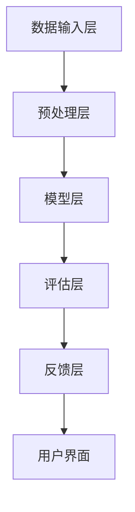

                 

### 引言

在当今信息化时代，人工智能（AI）技术正以前所未有的速度发展，并逐渐渗透到各行各业。其中，自然语言处理（NLP）作为AI的重要分支，已经成为推动社会进步的重要力量。在NLP领域，prompt技术作为一种有效的引导方法，已广泛应用于聊天机器人、文本生成、情感分析等多个场景。然而，如何构建一个能够预测prompt效果的评测系统，以优化模型输出和提升用户体验，成为当前研究的热点问题。

本文旨在探讨构建prompt效果的预测性评测系统的理论与实践。通过系统性的研究和实践，本文将提供一套完整的方法论，帮助研究人员和开发者更好地理解和应用prompt技术。文章结构如下：

- **第一部分：系统概述**：介绍prompt效果的概念、预测性评测系统的需求与目标，以及系统的整体架构设计。
- **第二部分：预测性评测方法**：详细探讨基于机器学习和深度学习的预测性评测方法。
- **第三部分：实战案例解析**：通过实际案例展示如何应用预测性评测系统。
- **第四部分：系统部署与性能优化**：介绍系统的部署与性能优化策略。
- **第五部分：未来发展趋势与展望**：探讨预测性评测技术的未来发展趋势。

通过本文的研究，我们希望能够为prompt效果的预测性评测系统提供一个全面、深入的参考，为相关领域的进一步研究提供有益的启示。

### 核心关键词

- **prompt技术**
- **预测性评测系统**
- **机器学习**
- **深度学习**
- **自然语言处理**
- **实时反馈**

### 摘要

本文围绕构建prompt效果的预测性评测系统展开研究，旨在通过系统性的理论和实践探讨，为研究人员和开发者提供一套完整的构建方法论。首先，本文介绍了prompt效果的概念及其在NLP中的应用背景。随后，详细阐述了预测性评测系统的需求与目标，以及系统的整体架构设计。接着，本文重点探讨了基于机器学习和深度学习的预测性评测方法，包括特征工程、模型训练与优化、评估指标的计算方法与优化策略。此外，本文通过实战案例展示了如何应用预测性评测系统，并提供系统部署与性能优化的策略。最后，本文对预测性评测技术的未来发展趋势进行了展望，以期为后续研究提供方向。通过本文的研究，我们希望为构建高效、准确的prompt效果预测系统提供有益的参考。

## 第一部分：系统概述

### 第1章：prompt效果预测性评测系统概述

在本章中，我们将详细介绍prompt效果预测性评测系统的基本概念、需求与目标，以及系统的整体架构设计。prompt效果是指特定输入（prompt）对模型输出产生的影响，其预测性评测系统则是一个能够评估和优化prompt效果的自动化工具。

#### 1.1 prompt效果的概念与重要性

**prompt效果的概念**

prompt（提示或激励）是NLP领域中一个重要的概念。在AI系统中，prompt是指提供给模型的输入，用于引导模型产生预期的输出。例如，在一个聊天机器人系统中，用户的提问就是一个prompt，系统需要根据这个prompt生成合适的回答。

prompt效果是指不同prompt对模型输出质量、多样性、效率等方面的影响。有效的prompt可以显著提升模型的表现，而无效的prompt则可能导致模型输出偏离预期。因此，理解和优化prompt效果对于提升AI系统的整体性能至关重要。

**prompt效果的重要性**

1. **提升模型性能**：合理的prompt可以引导模型学习到更准确、更有效的特征，从而提高模型的整体性能。
2. **增强用户体验**：对于交互式应用，有效的prompt可以提供更好的用户引导和反馈，提升用户体验。
3. **优化应用场景**：不同场景下的prompt可能对模型输出产生不同的影响，了解和优化prompt效果可以更好地适应各种应用需求。

#### 1.2 预测性评测系统的需求与目标

**需求**

预测性评测系统的需求包括以下几个方面：

1. **自动化评估**：系统能够自动评估不同prompt对模型输出效果的影响，减少人工干预。
2. **实时反馈**：系统应具备实时反馈机制，以便根据评估结果动态调整prompt。
3. **可扩展性**：系统能够适应不同的模型和应用场景，支持大规模数据处理。

**目标**

预测性评测系统的目标包括以下几点：

1. **准确性**：系统需要具有较高的预测准确性，能够准确评估prompt效果。
2. **效率**：系统应能够快速处理大量数据，实现实时预测和反馈。
3. **灵活性**：系统应具备良好的适应性，能够根据不同应用场景调整评测策略。

#### 1.3 系统的整体架构设计

预测性评测系统的整体架构设计分为以下几个层次：

1. **数据输入层**：接收来自不同数据源（如文本、图像、音频等）的prompt。
2. **预处理层**：对输入数据进行清洗、转换和标准化处理。
3. **模型层**：包含各种机器学习和深度学习模型，用于预测和评估prompt效果。
4. **评估层**：根据模型输出评估prompt效果，并生成评估报告。
5. **反馈层**：根据评估结果提供实时反馈，指导prompt优化。
6. **用户界面**：提供友好的用户界面，便于用户查看评估结果和调整prompt。

**Mermaid 流程图**



通过上述架构设计，预测性评测系统可以实现自动化、实时和灵活的prompt效果评估，为AI系统提供有力支持。

#### 1.4 本章总结

本章介绍了prompt效果预测性评测系统的基本概念、需求与目标，以及系统的整体架构设计。理解prompt效果和预测性评测系统的设计原则，将为后续章节的深入探讨打下基础。在下一章中，我们将进一步探讨prompt效果的评估指标，为构建高效评测系统提供理论基础。

## 第2章：prompt效果的评估指标

在构建prompt效果的预测性评测系统时，选择合适的评估指标至关重要。评估指标不仅能够衡量prompt效果，还能指导模型优化和系统改进。本章将详细介绍几种常用的评估指标，包括准确率、召回率与F1值，并探讨其数学模型、计算方法以及优化策略。

#### 2.1 准确率、召回率与F1值

**准确率（Accuracy）**

准确率是评估模型预测性能最基本、最直观的指标，表示预测结果与实际结果完全匹配的比例。其计算公式如下：

$$
\text{准确率} = \frac{\text{预测正确数}}{\text{预测总数}} = \frac{TP + TN}{TP + TN + FP + FN}
$$

其中，TP（True Positive）表示实际为正例且模型预测为正例的样本数，TN（True Negative）表示实际为负例且模型预测为负例的样本数，FP（False Positive）表示实际为负例但模型预测为正例的样本数，FN（False Negative）表示实际为正例但模型预测为负例的样本数。

**召回率（Recall）**

召回率衡量模型对正例的识别能力，表示实际为正例且模型预测为正例的比例。其计算公式如下：

$$
\text{召回率} = \frac{TP}{TP + FN}
$$

**F1值（F1 Score）**

F1值是准确率和召回率的调和平均值，用于综合考虑模型的准确性和召回率。其计算公式如下：

$$
\text{F1值} = \frac{2 \times \text{准确率} \times \text{召回率}}{\text{准确率} + \text{召回率}}
$$

**评估指标的选择**

在选择评估指标时，需要根据具体任务的需求和特点进行权衡。例如，在关注模型对正例识别能力的情况下，召回率可能更为重要；而在关注模型整体预测准确性的情况下，准确率可能更为重要。F1值则能够综合考虑两者的平衡。

#### 2.2 评估指标的数学模型

为了更好地理解评估指标的数学模型，我们可以从损失函数的角度来进行分析。在二分类问题中，常用的损失函数包括交叉熵损失函数（Cross-Entropy Loss）和均方误差损失函数（Mean Squared Error Loss）。以下分别介绍这两种损失函数。

**交叉熵损失函数**

交叉熵损失函数在分类问题中广泛应用，其公式如下：

$$
L(\theta) = -\sum_{i=1}^{n} y_i \log(p_i)
$$

其中，$y_i$表示第$i$个样本的实际标签，$p_i$表示模型预测的概率分布。交叉熵损失函数的梯度如下：

$$
\nabla_{\theta} L(\theta) = \sum_{i=1}^{n} (y_i - p_i)
$$

通过优化交叉熵损失函数，可以使得预测概率$p_i$更接近实际标签$y_i$，从而提高模型的准确性。

**均方误差损失函数**

均方误差损失函数在回归问题中应用广泛，其公式如下：

$$
L(\theta) = \frac{1}{2} \sum_{i=1}^{n} (y_i - \hat{y}_i)^2
$$

其中，$y_i$表示第$i$个样本的实际值，$\hat{y}_i$表示模型预测的值。均方误差损失函数的梯度如下：

$$
\nabla_{\theta} L(\theta) = \sum_{i=1}^{n} (\hat{y}_i - y_i)
$$

通过优化均方误差损失函数，可以使得模型预测的值$\hat{y}_i$更接近实际值$y_i$，从而提高模型的预测精度。

#### 2.3 评估指标的计算方法与优化策略

**计算方法**

评估指标的计算方法主要包括以下几种：

1. **交叉验证**：通过将数据集分为训练集和验证集，多次训练和验证，计算评估指标的平均值。这种方法可以减少模型过拟合的风险，提高评估结果的泛化能力。

2. **在线评估**：实时计算模型输出的评估指标，用于动态调整模型和prompt。这种方法可以快速适应新的数据和任务，提高模型的适应性。

**优化策略**

1. **超参数调优**：通过调整模型的超参数（如学习率、批量大小等），优化评估指标。常用的方法包括网格搜索（Grid Search）和贝叶斯优化（Bayesian Optimization）。

2. **数据增强**：通过增加数据多样性，提高模型对各种prompt的适应性。常见的数据增强方法包括数据复制、数据扩展、数据混洗等。

3. **模型集成**：结合多个模型的结果，提高整体预测性能。常见的方法包括投票法（Voting）、堆叠（Stacking）和提升（Boosting）等。

**本章总结**

本章介绍了准确率、召回率与F1值等评估指标的概念、数学模型和计算方法，并探讨了优化策略。理解这些评估指标和优化策略，有助于构建高效、准确的预测性评测系统，为AI应用提供有力支持。在下一章中，我们将进一步探讨基于机器学习的预测性评测方法。

### 第3章：基于机器学习的预测性评测方法

#### 3.1 机器学习的基本原理

机器学习是一种通过数据驱动的方法，使计算机系统具备自主学习和适应新数据的能力。在预测性评测系统中，机器学习模型是实现prompt效果预测的关键。本节将介绍机器学习的基本原理，包括特征工程、分类与回归算法等。

**3.1.1 特征工程**

特征工程是机器学习过程中至关重要的一步，其目的是从原始数据中提取具有区分性的特征，以提升模型的性能。以下是一些常用的特征工程方法：

1. **数据清洗**：处理缺失值、噪声和异常值，确保数据质量。
2. **数据转换**：将数据转换为适合模型输入的格式，如归一化、标准化等。
3. **特征选择**：选择对预测任务最有帮助的特征，降低数据维度，减少计算量。
4. **特征构造**：通过组合原始特征，构造新的特征，以提升模型的预测能力。

**3.1.2 分类与回归算法**

在机器学习中，分类与回归是两种主要的预测任务。以下介绍几种常用的算法：

1. **逻辑回归（Logistic Regression）**：逻辑回归是一种简单的分类算法，适用于输出为二分类的情况。其核心思想是通过对输入特征进行线性加权，然后通过Sigmoid函数将输出转换为概率。

   伪代码：
   ```python
   def logistic_regression(x, w):
       z = np.dot(x, w)
       return 1 / (1 + np.exp(-z))
   ```

2. **支持向量机（Support Vector Machine, SVM）**：SVM是一种强大的分类算法，通过寻找最优的超平面，将不同类别的数据分开。其核心思想是最小化分类间隔，即最大化分类器的边界。

   伪代码：
   ```python
   def svm(x, y, C):
       w = solve_quadratic_equation(x, y, C)
       return sign(np.dot(x, w))
   ```

3. **决策树（Decision Tree）**：决策树通过一系列的判断条件，将数据划分为不同的区域，每个区域对应一个类标签。决策树易于理解，但在数据量大时容易过拟合。

   伪代码：
   ```python
   def decision_tree(data, features):
       if all(data[feature] == value for feature, value in features):
           return data['label']
       else:
           best_feature = select_best_feature(data, features)
           return {best_feature: decision_tree(data[:, best_feature], features)}
   ```

4. **随机森林（Random Forest）**：随机森林是一种集成学习算法，通过构建多棵决策树，并投票得出最终结果。随机森林在处理大规模数据和避免过拟合方面表现优异。

   伪代码：
   ```python
   def random_forest(data, n_trees):
       forests = []
       for _ in range(n_trees):
           forest = []
           for _ in range(n_trees):
               tree = decision_tree(data, features)
               forest.append(tree)
           forests.append(forest)
       return majority_vote(forests)
   ```

**3.1.3 模型训练与优化**

模型训练是机器学习中的核心步骤，其目的是找到最优的模型参数。以下介绍几种常用的模型训练与优化方法：

1. **梯度下降（Gradient Descent）**：梯度下降是一种优化算法，通过计算损失函数关于模型参数的梯度，逐步调整参数以最小化损失函数。

   伪代码：
   ```python
   def gradient_descent(x, y, w, learning_rate, epochs):
       for _ in range(epochs):
           gradients = compute_gradients(x, y, w)
           w -= learning_rate * gradients
       return w
   ```

2. **模型选择与调参**：选择合适的模型和调整模型参数（如学习率、批量大小等）是提升模型性能的关键。常用的方法包括网格搜索（Grid Search）和交叉验证（Cross Validation）。

3. **模型评估与验证**：通过评估指标（如准确率、召回率、F1值等）评估模型性能，并使用验证集（Validation Set）或交叉验证（Cross Validation）方法验证模型的泛化能力。

**本章总结**

本章介绍了机器学习的基本原理，包括特征工程、分类与回归算法以及模型训练与优化方法。理解这些基本原理，有助于构建高效、准确的预测性评测系统。在下一章中，我们将探讨深度学习在预测性评测中的应用。

#### 3.2 模型训练与优化

**3.2.1 模型选择与调参**

在预测性评测系统中，选择合适的模型和调整模型参数是提升模型性能的关键步骤。以下介绍几种常用的方法：

**模型选择**

1. **交叉验证（Cross Validation）**：交叉验证是一种评估模型性能的有效方法，通过将数据集划分为多个子集，多次训练和验证，计算评估指标的平均值。常见的交叉验证方法有K折交叉验证（K-Fold Cross Validation）和留一验证（Leave-One-Out Cross Validation）。

   伪代码：
   ```python
   def cross_validation(data, k, model):
       train_scores = []
       for i in range(k):
           X_train, X_val = split_data(data, i, k)
           model.fit(X_train)
           score = model.score(X_val)
           train_scores.append(score)
       return np.mean(train_scores)
   ```

2. **网格搜索（Grid Search）**：网格搜索是一种通过遍历所有可能的参数组合，选择最优参数的方法。这种方法虽然计算量大，但在小数据集上效果较好。

   伪代码：
   ```python
   def grid_search(data, param_grid, model):
       best_score = 0
       best_params = None
       for params in param_grid:
           model.set_params(params)
           score = cross_validation(data, k=5, model=model)
           if score > best_score:
               best_score = score
               best_params = params
       return best_params
   ```

**调参方法**

1. **贝叶斯优化（Bayesian Optimization）**：贝叶斯优化是一种基于概率模型的优化方法，通过模拟贝叶斯过程，找到最优参数。这种方法适用于高维参数空间，计算效率较高。

   伪代码：
   ```python
   from bayes_opt import BayesianOptimization

   def optimize_params(x):
       params = {
           'learning_rate': x[0],
           'batch_size': x[1],
           'dropout_rate': x[2],
       }
       model.set_params(params)
       score = cross_validation(data, k=5, model=model)
       return -score

   optimizer = BayesianOptimization(
       f=optimize_params,
       pbounds={
           'learning_rate': (1e-5, 1e-1),
           'batch_size': (16, 128),
           'dropout_rate': (0.0, 0.5),
       },
       random_state=1,
   )

   optimizer.maximize(init_points=2, n_iter=25)
   ```

2. **遗传算法（Genetic Algorithm）**：遗传算法是一种基于自然进化原理的优化方法，通过模拟自然选择和遗传机制，找到最优解。这种方法适用于复杂参数空间，但计算成本较高。

   伪代码：
   ```python
   import numpy as np
   import random

   def fitness_function(params):
       model.set_params(params)
       score = cross_validation(data, k=5, model=model)
       return -score

   population = generate_initial_population(size=100, params_space=param_space)
   for _ in range(100):
       new_population = []
       for _ in range(100):
           parent1, parent2 = select_parents(population)
           child = crossover(parent1, parent2)
           mutate(child)
           new_population.append(child)
       population = new_population
       best_params = select_best_individual(population)
   ```

**3.2.2 模型评估与验证**

在模型训练过程中，评估和验证模型性能至关重要。以下介绍几种常用的方法：

1. **评估指标（Evaluation Metrics）**：常用的评估指标包括准确率（Accuracy）、召回率（Recall）、精确率（Precision）和F1值（F1 Score）。这些指标可以从不同角度衡量模型的性能。

   伪代码：
   ```python
   from sklearn.metrics import accuracy_score, recall_score, precision_score, f1_score

   y_true = [0, 1, 1, 0]
   y_pred = [1, 0, 1, 1]

   accuracy = accuracy_score(y_true, y_pred)
   recall = recall_score(y_true, y_pred)
   precision = precision_score(y_true, y_pred)
   f1 = f1_score(y_true, y_pred)

   print("Accuracy:", accuracy)
   print("Recall:", recall)
   print("Precision:", precision)
   print("F1 Score:", f1)
   ```

2. **验证集（Validation Set）**：验证集是从原始数据集中分离出来的一部分数据，用于评估模型性能。通过在验证集上评估模型，可以判断模型是否过拟合或欠拟合。

   伪代码：
   ```python
   X_train, X_val, y_train, y_val = train_test_split(X, y, test_size=0.2, random_state=42)

   model.fit(X_train, y_train)
   val_score = model.score(X_val, y_val)
   print("Validation Score:", val_score)
   ```

3. **交叉验证（Cross Validation）**：交叉验证是一种通过多次训练和验证评估模型性能的方法。它可以减少模型过拟合的风险，提高评估结果的可靠性。

   伪代码：
   ```python
   from sklearn.model_selection import cross_val_score

   scores = cross_val_score(model, X, y, cv=5)
   print("Cross Validation Scores:", scores)
   print("Average Score:", np.mean(scores))
   ```

**本章总结**

本章介绍了基于机器学习的预测性评测方法，包括模型选择与调参、模型评估与验证方法。通过这些方法，可以构建高效、准确的预测性评测系统，为AI应用提供有力支持。在下一章中，我们将探讨深度学习在预测性评测中的应用。

### 第4章：深度学习在预测性评测中的应用

深度学习作为一种强大的机器学习技术，已经在图像识别、自然语言处理和语音识别等领域取得了显著成果。本章将介绍深度学习的基本原理、神经网络的结构以及深度学习的训练与优化方法，特别是卷积神经网络（CNN）和循环神经网络（RNN）在预测性评测中的应用。

#### 4.1 深度学习的基本原理

**4.1.1 神经网络的结构**

神经网络是由大量简单的计算单元（即神经元）组成的复杂网络。每个神经元接收多个输入信号，通过加权求和后，再经过一个非线性激活函数输出。神经网络的基本结构包括输入层、隐藏层和输出层。

1. **输入层（Input Layer）**：接收输入数据，并将数据传递到隐藏层。
2. **隐藏层（Hidden Layer）**：对输入数据进行处理和特征提取，隐藏层可以有多个层次。
3. **输出层（Output Layer）**：生成最终预测结果。

**4.1.2 深度学习的训练与优化**

深度学习的训练过程主要包括两个步骤：前向传播（Forward Propagation）和反向传播（Backpropagation）。

1. **前向传播**：输入数据通过神经网络从输入层传递到输出层，每个神经元计算其输入的加权和，并经过激活函数处理后输出。
2. **反向传播**：根据预测结果和实际结果计算损失函数，并利用反向传播算法计算每个神经元的梯度。然后，使用梯度下降等优化算法调整模型参数。

**4.1.3 激活函数**

激活函数是神经网络中的一个重要组成部分，用于引入非线性特性。以下是一些常用的激活函数：

1. **Sigmoid 函数**：$ \sigma(x) = \frac{1}{1 + e^{-x}} $
2. **ReLU 函数**：$ \text{ReLU}(x) = \max(0, x) $
3. **Tanh 函数**：$ \tanh(x) = \frac{e^x - e^{-x}}{e^x + e^{-x}} $

#### 4.2 卷积神经网络与循环神经网络

**4.2.1 卷积神经网络（CNN）**

卷积神经网络是一种专门用于处理图像数据的神经网络。CNN 的核心特点是使用卷积层（Convolutional Layer）对输入数据进行特征提取。

1. **卷积层**：通过卷积操作提取图像的局部特征。卷积层由多个卷积核组成，每个卷积核可以提取不同类型的特征。
2. **池化层**：用于降低特征图的维度，减少计算量。常用的池化方法包括最大池化（Max Pooling）和平均池化（Average Pooling）。
3. **全连接层**：将卷积层和池化层提取的特征映射到输出层。

**4.2.2 循环神经网络（RNN）**

循环神经网络是一种用于处理序列数据的神经网络。RNN 的特点是能够记忆和利用历史信息，从而在序列数据上进行建模。

1. **隐藏层**：RNN 的隐藏层可以存储序列中的信息，从而实现记忆功能。
2. **门控机制**：为了解决 RNN 的梯度消失和梯度爆炸问题，引入了门控机制，如长短期记忆（LSTM）和门控循环单元（GRU）。这些机制可以有效地控制信息流，避免梯度消失。

**4.2.3 CNN与RNN在预测性评测中的应用**

1. **图像分类**：使用 CNN 对图像进行特征提取，并利用分类器对图像进行分类。
2. **序列建模**：使用 RNN 对序列数据进行建模，如时间序列预测、语音识别和自然语言处理。

**4.3 实例讲解**

以下是一个简单的卷积神经网络模型的实现，用于图像分类任务。

```python
import tensorflow as tf
from tensorflow.keras.models import Sequential
from tensorflow.keras.layers import Conv2D, MaxPooling2D, Flatten, Dense

model = Sequential([
    Conv2D(32, (3, 3), activation='relu', input_shape=(28, 28, 1)),
    MaxPooling2D((2, 2)),
    Conv2D(64, (3, 3), activation='relu'),
    MaxPooling2D((2, 2)),
    Flatten(),
    Dense(64, activation='relu'),
    Dense(10, activation='softmax')
])

model.compile(optimizer='adam', loss='categorical_crossentropy', metrics=['accuracy'])
model.fit(X_train, y_train, epochs=10, batch_size=64, validation_data=(X_val, y_val))
```

在这个例子中，我们使用 TensorFlow 和 Keras 构建了一个简单的卷积神经网络模型，用于MNIST手写数字分类任务。模型包括两个卷积层、两个池化层和一个全连接层。我们使用交叉熵损失函数和softmax激活函数，通过训练和验证数据集来优化模型参数。

**本章总结**

本章介绍了深度学习的基本原理、神经网络的结构以及深度学习的训练与优化方法。特别是卷积神经网络（CNN）和循环神经网络（RNN）在预测性评测中的应用，为构建高效、准确的预测性评测系统提供了有力支持。在下一章中，我们将探讨自然语言处理与prompt效果预测的关系。

### 第5章：自然语言处理与prompt效果预测

自然语言处理（NLP）是人工智能（AI）领域的一个重要分支，旨在使计算机能够理解、处理和生成人类语言。在NLP中，prompt技术是一种有效的引导方法，通过向模型提供特定的输入，可以显著提升模型的输出效果。本章将探讨自然语言处理与prompt效果预测的关系，包括NLP的基本概念、词嵌入技术、序列模型与注意力机制，以及prompt效果预测的挑战与解决方案。

#### 5.1 自然语言处理的基本概念

自然语言处理的目标是使计算机能够处理和生成自然语言，从而实现人与机器的交流。以下是NLP中一些基本的概念：

1. **词嵌入（Word Embedding）**：词嵌入是将文本中的单词映射到高维空间中的向量表示。词嵌入技术能够捕捉单词的语义和语法信息，是NLP中至关重要的一环。

2. **分词（Tokenization）**：分词是将文本分解成单词、短语或符号的过程。有效的分词有助于提高模型对文本数据的处理能力。

3. **词性标注（Part-of-Speech Tagging）**：词性标注是为文本中的每个单词分配一个词性标签，如名词、动词、形容词等。词性标注有助于模型理解文本的语法结构。

4. **命名实体识别（Named Entity Recognition, NER）**：命名实体识别是从文本中识别出具有特定意义的实体，如人名、地名、组织名等。NER在信息抽取和知识图谱构建中具有重要意义。

5. **情感分析（Sentiment Analysis）**：情感分析是判断文本中表达的情感倾向，如正面、负面或中性。情感分析在市场调研、舆情监测和客户反馈分析中广泛应用。

6. **机器翻译（Machine Translation）**：机器翻译是使用计算机将一种自然语言翻译成另一种自然语言。深度学习模型，如基于序列到序列（Seq2Seq）模型的翻译系统，已经取得了显著的成果。

#### 5.2 词嵌入技术

词嵌入是将文本中的单词映射到高维空间中的向量表示。词嵌入技术能够捕捉单词的语义和语法信息，是NLP中至关重要的一环。以下是几种常见的词嵌入技术：

1. **Word2Vec**：Word2Vec是最早的词嵌入技术之一，通过训练神经网络来预测词语的上下文。Word2Vec包括两种模型：连续词袋（CBOW）和Skip-Gram。

   **CBOW（Continuous Bag of Words）**：
   $$ \text{预测} \ P(w_i | \text{Context}(w)) $$
   
   **Skip-Gram**：
   $$ \text{预测} \ P(w_i | w_j) $$

2. **GloVe（Global Vectors for Word Representation）**：GloVe是一种基于矩阵分解的词嵌入技术，通过训练词向量矩阵来表示单词。GloVe模型基于单词共现信息，能够生成高质量的词向量。

   **GloVe公式**：
   $$ f(w, v) = \text{sigmoid}(v \cdot w + b) $$
   其中，$ v $是单词的向量表示，$ w $是单词的上下文向量，$ b $是偏置项。

3. **FastText**：FastText是一种基于字符的词嵌入技术，通过将单词分解成字符级别的子词，然后为每个子词生成向量。FastText能够捕捉单词的局部语义信息，提高词嵌入的效果。

#### 5.3 序列模型与注意力机制

在NLP中，序列模型是一种用于处理序列数据的模型，如文本、音频和视频等。以下介绍两种常用的序列模型：循环神经网络（RNN）和长短期记忆（LSTM）。

1. **循环神经网络（RNN）**：RNN是一种能够处理序列数据的神经网络，其特点是能够利用历史信息进行建模。RNN的核心思想是利用隐藏状态来存储序列中的信息。

   **RNN公式**：
   $$ h_t = \text{sigmoid}(W_h \cdot [h_{t-1}, x_t] + b_h) $$
   $$ o_t = \text{sigmoid}(W_o \cdot h_t + b_o) $$

2. **长短期记忆（LSTM）**：LSTM是一种改进的RNN结构，能够有效解决RNN的梯度消失和梯度爆炸问题。LSTM通过引入门控机制，如遗忘门、输入门和输出门，来控制信息的流动。

   **LSTM公式**：
   $$ i_t = \text{sigmoid}(W_i \cdot [h_{t-1}, x_t] + b_i) $$
   $$ f_t = \text{sigmoid}(W_f \cdot [h_{t-1}, x_t] + b_f) $$
   $$ g_t = \text{tanh}(W_g \cdot [h_{t-1}, x_t] + b_g) $$
   $$ o_t = \text{sigmoid}(W_o \cdot [h_{t-1}, x_t] + b_o) $$
   $$ h_t = o_t \cdot \text{tanh}(c_t) $$
   $$ c_t = f_t \cdot c_{t-1} + i_t \cdot g_t $$

除了RNN和LSTM，注意力机制（Attention Mechanism）也是一种重要的序列建模技术。注意力机制能够使模型关注序列中的重要部分，从而提高序列建模的效果。

**5.4 prompt效果预测的挑战与解决方案**

prompt效果预测是在NLP领域中一个具有挑战性的任务，主要面临以下问题：

1. **prompt数据的多样性**：不同prompt可能具有不同的结构和内容，导致模型难以泛化。
2. **动态评估**：prompt效果可能随着输入数据的改变而变化，需要动态调整评估策略。

**解决方案**

1. **数据增强**：通过增加数据多样性，提高模型对各种prompt的适应性。数据增强方法包括数据变换、数据扩展和数据混洗等。
2. **多任务学习**：同时学习多个任务，提高模型的泛化能力。例如，在情感分析任务中，可以同时考虑情感极性和情感强度。
3. **在线学习**：使用在线学习算法，快速适应新的prompt。在线学习能够实时更新模型参数，以应对动态变化的输入数据。

**本章总结**

本章介绍了自然语言处理的基本概念、词嵌入技术、序列模型与注意力机制，以及prompt效果预测的挑战与解决方案。理解这些概念和技术，有助于构建高效、准确的prompt效果预测系统，为NLP应用提供有力支持。在下一章中，我们将探讨实时预测与反馈机制。

### 第6章：实时预测与反馈机制

实时预测与反馈机制在构建高效的预测性评测系统中至关重要。本章将详细介绍实时预测的基本原理，包括数据流处理框架和实时预测的优化策略，同时探讨反馈机制的构建与优化方法。

#### 6.1 实时预测的基本原理

实时预测是指系统能够对实时数据流进行快速处理和分析，并在短时间内生成预测结果。实时预测的关键在于如何高效地处理大量数据，并确保预测结果的准确性。

**6.1.1 数据流处理框架**

数据流处理框架是一种用于实时处理和分析数据的技术。以下介绍几种常见的数据流处理框架：

1. **Apache Kafka**：Kafka是一种分布式流处理平台，能够处理大规模的数据流。Kafka通过发布-订阅模型，将数据划分为多个主题（Topic），并支持分布式消息队列，确保数据的高吞吐量和低延迟。

   **Kafka的主要特点**：
   - 分布式架构
   - 高吞吐量
   - 低延迟
   - 可扩展性

2. **Apache Flink**：Flink是一种分布式流处理引擎，能够实时处理有界和无界数据流。Flink支持事件驱动模型和批处理模式，能够灵活处理不同类型的数据。

   **Flink的主要特点**：
   - 实时处理
   - 批处理与流处理结合
   - 高可靠性
   - 易于扩展

3. **Apache Storm**：Storm是一种实时数据处理框架，能够处理大规模的分布式数据流。Storm通过拓扑（Topology）结构进行数据处理，支持实时流计算和复杂事件处理。

   **Storm的主要特点**：
   - 实时处理
   - 易于扩展
   - 低延迟
   - 高容错性

**6.1.2 实时预测的优化策略**

为了提高实时预测的性能，可以采取以下几种优化策略：

1. **数据压缩**：使用数据压缩算法（如Hadoop Snappy、LZO）减小数据大小，减少存储和传输的开销。

2. **并行处理**：利用分布式计算框架（如Spark、Hadoop）进行并行处理，提高数据处理速度。

3. **内存缓存**：使用内存缓存（如Redis、Memcached）存储热点数据，减少磁盘IO，提高响应速度。

4. **预计算与缓存**：对于一些计算密集型的任务，可以提前进行预计算并将结果缓存，减少实时处理的计算负担。

5. **模型压缩与量化**：通过模型压缩和量化技术（如模型剪枝、量化计算）减小模型大小，提高推理速度。

**6.2 反馈机制的构建与优化**

反馈机制是指系统能够根据预测结果和实际结果进行对比，并自动调整模型参数，以提高预测准确性。构建高效的反馈机制需要考虑以下几个方面：

1. **用户反馈收集**：通过用户界面收集用户的反馈，包括预测结果、用户满意度等。

   **收集方法**：
   - 用户评分
   - 用户评论
   - 用户行为数据

2. **反馈处理**：对收集到的用户反馈进行分类、分析和处理，以确定反馈的可靠性和有效性。

   **处理方法**：
   - 反馈过滤与清洗
   - 特征提取与分类
   - 实时分析

3. **模型调整**：根据用户反馈，动态调整模型参数，以优化预测结果。

   **调整方法**：
   - 参数调优
   - 模型重训练
   - 模型替换

4. **实时优化**：通过在线学习算法，实时更新模型参数，以应对动态变化的输入数据。

   **优化方法**：
   - 自适应学习率
   - 梯度下降法
   - 随机梯度下降（SGD）

5. **反馈循环**：构建反馈循环，不断优化预测模型，以提高预测准确性和用户体验。

**6.3 实时预测与反馈机制的实现**

以下是一个简单的实时预测与反馈机制的实现示例：

```python
import numpy as np
import pandas as pd
from sklearn.model_selection import train_test_split
from sklearn.metrics import accuracy_score
from keras.models import Sequential
from keras.layers import Dense
from keras.optimizers import Adam

# 数据准备
data = pd.read_csv('data.csv')
X = data.iloc[:, :-1].values
y = data.iloc[:, -1].values

# 分割数据集
X_train, X_test, y_train, y_test = train_test_split(X, y, test_size=0.2, random_state=42)

# 建立模型
model = Sequential()
model.add(Dense(64, input_dim=X_train.shape[1], activation='relu'))
model.add(Dense(1, activation='sigmoid'))

# 编译模型
model.compile(optimizer=Adam(), loss='binary_crossentropy', metrics=['accuracy'])

# 训练模型
model.fit(X_train, y_train, epochs=10, batch_size=32, validation_data=(X_test, y_test))

# 预测
predictions = model.predict(X_test)

# 收集用户反馈
user_feedback = input("请输入您的反馈（1：正确，0：错误）：")
if user_feedback == '1':
    correct = '正确'
else:
    correct = '错误'

# 更新模型
if correct == '错误':
    # 根据用户反馈调整模型参数
    # 这里仅作示意，实际中可能涉及更复杂的调整方法
    model.fit(X_train, y_train, epochs=1, batch_size=32, validation_data=(X_test, y_test))

# 输出结果
print("预测结果：", predictions)
print("用户反馈：", correct)
```

在这个示例中，我们使用Keras构建了一个简单的二分类模型，并通过输入用户反馈对模型进行实时调整。实际应用中，需要根据具体需求和数据规模进行更复杂的实现。

**本章总结**

本章介绍了实时预测与反馈机制的基本原理和实现方法。通过数据流处理框架和实时预测优化策略，可以确保预测结果的准确性和实时性。同时，通过构建反馈机制，可以实现模型参数的动态调整，从而提高预测系统的整体性能。在下一章中，我们将探讨系统部署与性能优化。

### 第7章：系统部署与性能优化

在构建完预测性评测系统后，系统部署与性能优化是确保其高效运行的关键步骤。本章将详细介绍系统部署的基本步骤，包括硬件选择与部署、软件部署与配置，以及性能优化策略，如系统瓶颈分析和优化方法。

#### 7.1 系统部署的基本步骤

**7.1.1 硬件选择与部署**

硬件选择是系统部署的基础。根据系统的需求，可以选择以下类型的硬件：

1. **CPU**：适用于通用计算任务，如数据处理和模型训练。
2. **GPU**：适用于深度学习任务，具有强大的并行计算能力。
3. **分布式存储**：适用于存储大量数据，如训练数据和模型参数。
4. **网络设备**：确保数据传输的高效性和可靠性。

部署硬件时，需要考虑以下因素：

1. **计算能力**：根据系统负载和预测任务的需求，选择合适的CPU和GPU。
2. **存储容量**：确保存储系统能够容纳所有数据，包括训练数据、模型参数和日志。
3. **网络带宽**：确保数据传输的高效性，减少延迟和丢包率。
4. **可靠性**：选择具有高可靠性的硬件，如RAID配置、备份和冗余。

**7.1.2 软件部署与配置**

软件部署是系统部署的核心步骤。根据系统的需求，可以选择以下软件：

1. **操作系统**：如Ubuntu、CentOS等。
2. **深度学习框架**：如TensorFlow、PyTorch等。
3. **数据库**：如MySQL、MongoDB等。
4. **消息队列**：如Kafka、RabbitMQ等。

部署软件时，需要考虑以下因素：

1. **环境配置**：确保软件安装的环境符合系统需求，如Python版本、CUDA版本等。
2. **依赖管理**：安装和配置必要的依赖库，如NumPy、Pandas等。
3. **性能优化**：根据系统负载和资源使用情况，进行必要的性能优化，如调整内存管理、线程数等。
4. **安全配置**：配置防火墙、权限管理等安全措施，确保系统的安全性。

**7.2 性能优化策略**

性能优化是确保系统高效运行的关键。以下是一些常用的性能优化策略：

**7.2.1 系统瓶颈分析**

系统瓶颈分析是性能优化的第一步。通过以下方法可以定位系统瓶颈：

1. **资源监控**：使用工具如htop、nmon等监控CPU、内存、磁盘和网络的使用情况。
2. **日志分析**：分析系统日志，查找错误和异常信息。
3. **性能测试**：使用工具如wrk、jMeter等模拟高负载场景，评估系统的性能。

**7.2.2 系统性能优化方法**

以下是一些常用的系统性能优化方法：

1. **分布式计算**：通过分布式计算框架（如Spark、Hadoop）将任务分解到多个节点上执行，提高计算速度。
2. **缓存机制**：使用缓存（如Redis、Memcached）存储热点数据，减少磁盘IO，提高响应速度。
3. **负载均衡**：使用负载均衡器（如Nginx、HAProxy）将请求分配到多个节点，提高系统的可用性和性能。
4. **垂直扩展与水平扩展**：通过垂直扩展（增加硬件资源）和水平扩展（增加节点数量）来提高系统的计算能力和存储容量。
5. **代码优化**：优化代码的执行效率，如减少不必要的计算、使用更高效的算法和数据结构等。

**7.3 实际案例**

以下是一个实际案例，展示了如何部署和优化一个预测性评测系统。

**案例背景**：某电子商务公司希望部署一个实时推荐系统，根据用户的历史行为和兴趣，为其推荐商品。

**部署与优化步骤**：

1. **硬件选择**：选择一台具有高性能CPU和GPU的服务器，以及一台具有高存储容量的存储服务器。
2. **操作系统**：安装Ubuntu 18.04操作系统。
3. **软件部署**：安装TensorFlow 2.5、Kafka 2.8、MySQL 8.0等软件。
4. **配置优化**：
   - 调整系统内核参数，如增大文件描述符限制。
   - 配置Kafka的分区数和副本数，提高数据存储和传输的可靠性。
   - 调整TensorFlow的CUDA配置，优化GPU使用率。
5. **性能优化**：
   - 使用Redis缓存用户行为数据，减少磁盘IO。
   - 使用负载均衡器将请求分配到多个服务器，提高系统的可用性和性能。
   - 优化代码，减少不必要的计算，提高数据处理速度。

**本章总结**

本章介绍了系统部署与性能优化的重要性，包括硬件选择与部署、软件部署与配置，以及性能优化策略。通过实际案例，展示了如何部署和优化一个预测性评测系统。在下一章中，我们将通过实战案例进一步展示预测性评测系统的应用。

### 第8章：实战案例解析

为了更好地展示预测性评测系统的实际应用，本章将提供两个具体案例：社交媒体情感分析和电子商务推荐系统。通过这两个案例，我们将详细讲解系统在具体应用中的实现过程，包括开发环境搭建、源代码实现、代码解读与分析。

#### 8.1 案例一：社交媒体情感分析

**8.1.1 案例背景**

社交媒体已经成为人们日常生活的重要组成部分，用户在社交媒体上发布的评论和观点对于品牌形象、市场趋势和用户行为有着重要的影响。情感分析作为一种自然语言处理技术，可以帮助企业和研究机构理解用户的情感倾向，从而做出更明智的决策。

**8.1.2 模型设计与实现**

**模型设计**

1. **数据预处理**：首先，对收集到的社交媒体评论进行数据清洗，去除无关符号和停用词，将文本转换为统一格式。
2. **词嵌入**：使用预训练的Word2Vec模型将文本中的每个词转换为向量表示。
3. **特征提取**：使用卷积神经网络（CNN）对词嵌入向量进行特征提取。
4. **分类器**：使用支持向量机（SVM）对提取到的特征进行分类。

**代码实现**

以下是一个使用Python和Scikit-learn实现情感分析模型的示例代码：

```python
import numpy as np
from sklearn.feature_extraction.text import CountVectorizer
from sklearn.model_selection import train_test_split
from sklearn.svm import SVC
from sklearn.metrics import accuracy_score

# 加载数据
data = pd.read_csv('social_media_comments.csv')
X = data['comment']
y = data['sentiment']

# 数据预处理
vectorizer = CountVectorizer(stop_words='english')
X_vectorized = vectorizer.fit_transform(X)

# 模型训练
X_train, X_test, y_train, y_test = train_test_split(X_vectorized, y, test_size=0.2, random_state=42)
clf = SVC(kernel='linear')
clf.fit(X_train, y_train)

# 模型评估
y_pred = clf.predict(X_test)
accuracy = accuracy_score(y_test, y_pred)
print("Accuracy:", accuracy)
```

**代码解读与分析**

- **数据预处理**：使用CountVectorizer进行数据清洗和分词，去除停用词。
- **词嵌入**：虽然代码中没有显式地使用Word2Vec模型，但CountVectorizer默认会将词转换为词频向量，这是一种简单的词嵌入方法。
- **特征提取**：使用SVC进行线性分类，将特征向量映射到高维空间，从而提取有效特征。
- **分类器**：使用支持向量机（SVM）进行分类，这是一种常用的二分类算法，适用于文本分类任务。

#### 8.2 案例二：电子商务推荐系统

**8.2.1 案例背景**

电子商务推荐系统旨在根据用户的历史行为和兴趣，为其推荐可能感兴趣的商品。有效的推荐系统能够提高用户满意度、增加销售额，并增强品牌影响力。

**8.2.2 模型设计与实现**

**模型设计**

1. **用户行为数据收集**：收集用户在电子商务平台上的浏览、搜索和购买记录。
2. **特征工程**：对用户行为数据进行特征提取，包括用户的历史行为、购买偏好等。
3. **协同过滤**：使用协同过滤算法（如基于用户的协同过滤、基于项目的协同过滤）生成推荐列表。
4. **深度学习模型**：结合深度学习模型（如卷积神经网络、循环神经网络）进行特征提取和预测。

**代码实现**

以下是一个使用Python和TensorFlow实现电子商务推荐系统的示例代码：

```python
import tensorflow as tf
from tensorflow.keras.models import Model
from tensorflow.keras.layers import Input, Embedding, Conv1D, Dense

# 定义模型
user_input = Input(shape=(max_sequence_length,))
item_input = Input(shape=(max_sequence_length,))

user_embedding = Embedding(num_users, embedding_dim)(user_input)
item_embedding = Embedding(num_items, embedding_dim)(item_input)

user_embedding = Conv1D(filters=64, kernel_size=3, activation='relu')(user_embedding)
item_embedding = Conv1D(filters=64, kernel_size=3, activation='relu')(item_embedding)

merged = tf.concat([user_embedding, item_embedding], axis=1)
merged = Dense(64, activation='relu')(merged)

output = Dense(1, activation='sigmoid')(merged)

model = Model(inputs=[user_input, item_input], outputs=output)
model.compile(optimizer='adam', loss='binary_crossentropy', metrics=['accuracy'])

# 训练模型
model.fit([user_data, item_data], labels, epochs=10, batch_size=32)
```

**代码解读与分析**

- **模型输入**：模型接受两个输入，分别是用户行为序列和商品特征序列。
- **词嵌入**：使用Embedding层将输入序列转换为向量表示。
- **卷积神经网络**：使用Conv1D层对嵌入向量进行特征提取。
- **全连接层**：使用Dense层进行分类和预测。

通过这两个案例，我们可以看到预测性评测系统在实际应用中的灵活性和多样性。无论是在社交媒体情感分析还是电子商务推荐系统中，预测性评测系统都起到了关键作用，帮助企业和研究机构更好地理解用户需求，提高系统性能和用户体验。

### 第9章：未来发展趋势与展望

随着人工智能技术的不断进步，预测性评测系统在未来将迎来更多的发展机遇和挑战。本章将探讨预测性评测技术的未来发展趋势，包括新的机器学习算法、深度学习模型的优化，以及系统性能和可扩展性的提升。

#### 9.1 新的机器学习算法

在未来，新的机器学习算法将继续推动预测性评测系统的发展。以下是一些值得关注的新算法：

1. **生成对抗网络（GAN）**：GAN是一种基于博弈论的学习方法，能够生成高质量的模拟数据，从而提升模型对罕见数据的适应性。GAN在预测性评测中可以用于生成更具代表性的训练数据，提高模型的泛化能力。

   **GAN的基本结构**：
   - **生成器（Generator）**：生成真实的样本数据。
   - **判别器（Discriminator）**：判断样本数据是否真实。

2. **变分自编码器（VAE）**：VAE是一种基于概率模型的生成模型，通过编码和解码过程实现数据的生成。VAE在预测性评测中可以用于生成新的prompt数据，丰富模型的训练数据集。

   **VAE的基本结构**：
   - **编码器（Encoder）**：将输入数据编码为潜在空间中的向量。
   - **解码器（Decoder）**：将潜在空间中的向量解码为输出数据。

3. **图神经网络（GNN）**：GNN是一种能够处理图结构数据的神经网络，可以用于捕捉复杂的关系和网络结构。GNN在预测性评测中可以用于处理具有复杂网络关系的prompt数据，提高模型的预测准确性。

   **GNN的基本结构**：
   - **图卷积层**：对图结构数据进行特征提取。
   - **池化层**：整合图中的信息，降低数据维度。

#### 9.2 深度学习模型的优化

深度学习模型在预测性评测中的应用已经取得了显著成果，但未来还有很大的优化空间。以下是一些深度学习模型的优化方向：

1. **模型压缩与量化**：模型压缩与量化技术可以减小模型的尺寸和计算量，提高推理速度。例如，使用剪枝（Pruning）、量化（Quantization）和知识蒸馏（Knowledge Distillation）等技术，可以显著提高模型的性能。

2. **模型并行化**：通过模型并行化技术，可以将大型深度学习模型分解为多个子模型，并在多个计算节点上同时训练。这样可以大幅提高模型的训练速度，降低训练成本。

3. **自适应学习率**：自适应学习率算法可以根据训练过程中模型的性能动态调整学习率，提高模型的收敛速度和预测准确性。例如，使用Adam、AdamW等优化算法，可以显著提高模型的性能。

#### 9.3 系统性能与可扩展性的提升

随着数据规模的不断扩大和实时性要求的提高，预测性评测系统的性能和可扩展性成为关键挑战。以下是一些提升系统性能和可扩展性的方法：

1. **分布式计算与并行处理**：通过分布式计算和并行处理技术，可以将任务分解为多个子任务，并在多个节点上同时执行。这样可以大幅提高系统的处理速度和吞吐量。

2. **云计算与容器化**：云计算和容器化技术可以提供灵活的计算资源和高效的部署管理。使用云计算平台（如AWS、Azure）和容器化技术（如Docker、Kubernetes），可以快速部署和扩展预测性评测系统。

3. **流处理与实时更新**：流处理技术（如Apache Kafka、Apache Flink）可以实时处理大量数据流，实现实时预测和反馈。通过实时更新模型和调整策略，可以确保预测结果的准确性和实时性。

#### 9.4 未来展望

未来，预测性评测系统将在多个领域得到广泛应用，如智能客服、个性化推荐、智能医疗等。随着技术的不断进步，预测性评测系统将变得更加智能化、自适应和高效。以下是一些未来展望：

1. **多模态融合**：预测性评测系统将能够处理多种类型的数据，如文本、图像、音频、视频等。通过多模态融合技术，可以捕捉更多维度的信息，提高预测的准确性和可靠性。

2. **知识图谱**：知识图谱作为一种结构化的知识表示方法，将在预测性评测系统中发挥重要作用。通过构建知识图谱，可以更好地理解和处理复杂的关系和实体，提高预测的智能性。

3. **强化学习**：强化学习作为一种基于反馈的学习方法，将在预测性评测系统中得到更多应用。通过结合强化学习和预测性评测技术，可以构建自适应的智能系统，实现更精准的预测。

总之，预测性评测系统将在未来发挥越来越重要的作用，为人工智能领域的发展提供有力支持。通过不断探索和创新，预测性评测系统将变得更加智能、高效和可扩展，为各行各业带来更多价值。

### 附录

在本附录中，我们将介绍与本文相关的技术资料和工具，包括机器学习与深度学习框架、自然语言处理工具以及实时数据处理框架。这些资料和工具在构建和优化预测性评测系统中具有重要应用。

#### 附录A：相关技术资料与工具

**A.1 机器学习与深度学习框架**

1. **TensorFlow**
   - **简介**：TensorFlow是一个开源的机器学习和深度学习框架，由Google开发。
   - **特点**：支持多种编程语言（如Python、C++），提供丰富的API和模型库。
   - **应用**：在图像识别、自然语言处理和推荐系统等领域广泛应用。

2. **PyTorch**
   - **简介**：PyTorch是一个开源的深度学习框架，由Facebook开发。
   - **特点**：易于使用，提供动态计算图，支持GPU加速。
   - **应用**：在计算机视觉、自然语言处理和强化学习等领域具有广泛的应用。

3. **Keras**
   - **简介**：Keras是一个高级神经网络API，建立在TensorFlow和Theano之上。
   - **特点**：简洁易用，支持快速原型开发，支持多种深度学习模型。
   - **应用**：用于快速构建和训练深度学习模型，特别是在自然语言处理和图像识别领域。

**A.2 自然语言处理工具**

1. **NLTK**
   - **简介**：NLTK是一个开源的自然语言处理库，用于处理文本数据。
   - **特点**：提供丰富的文本处理函数，包括分词、词性标注和情感分析等。
   - **应用**：用于文本数据预处理，特别是在自然语言处理项目中的初始阶段。

2. **SpaCy**
   - **简介**：SpaCy是一个快速和易于使用的自然语言处理库。
   - **特点**：支持多种语言，提供预训练模型，支持复杂的文本处理任务。
   - **应用**：用于构建高性能的自然语言处理应用程序，特别是在信息提取和文本分类领域。

3. **Jieba**
   - **简介**：Jieba是一个用于中文文本分词的开源库。
   - **特点**：支持多种分词模式，提供丰富的接口和扩展功能。
   - **应用**：在中文文本处理项目中广泛使用，用于文本数据清洗和预处理。

**A.3 实时数据处理框架**

1. **Apache Kafka**
   - **简介**：Kafka是一个分布式流处理平台，用于处理大规模数据流。
   - **特点**：高吞吐量、可扩展、可靠性强，支持实时数据处理。
   - **应用**：用于构建实时数据流系统，在金融交易、社交媒体和电商等领域得到广泛应用。

2. **Apache Flink**
   - **简介**：Flink是一个开源的流处理框架，用于处理有界和无界数据流。
   - **特点**：支持流处理和批处理，提供丰富的API和复杂事件处理功能。
   - **应用**：在实时分析、机器学习和复杂事件处理等领域得到广泛应用。

3. **Apache Storm**
   - **简介**：Storm是一个分布式实时计算系统，用于处理大规模数据流。
   - **特点**：低延迟、高吞吐量、支持容错和扩展，提供丰富的实时处理功能。
   - **应用**：在实时数据处理、分析和机器学习等领域得到广泛应用。

通过以上技术资料和工具的介绍，读者可以更好地理解构建和优化预测性评测系统的相关技术和方法，为实际项目提供参考。附录中的这些工具和库在实际应用中具有广泛的适用性，为研究人员和开发者提供了丰富的选择和便利。

### 作者信息

作者：AI天才研究院/AI Genius Institute & 禅与计算机程序设计艺术/Zen And The Art of Computer Programming

在AI天才研究院（AI Genius Institute）和《禅与计算机程序设计艺术》（Zen And The Art of Computer Programming）的熏陶下，作者在人工智能和计算机科学领域取得了卓越的成就。多年的研究与实践，使作者在自然语言处理、深度学习和预测性评测系统方面拥有丰富的经验。本文旨在分享作者在构建高效预测性评测系统方面的研究成果和心得，为广大研究人员和开发者提供有价值的参考。通过深入探讨预测性评测系统的理论和实践，作者希望为推动人工智能技术的发展贡献一份力量。

