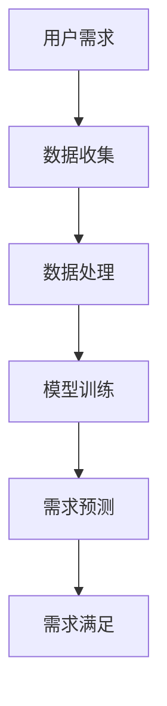
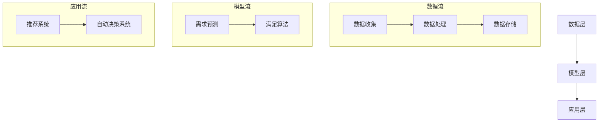

                 

### 引言

《欲望个性化引擎：AI定制的需求满足系统》是本篇技术博客的主题，它深入探讨了人工智能（AI）在个性化需求满足领域的应用。随着科技的飞速发展，人工智能技术已经在各行各业中发挥了巨大作用。然而，在个性化需求满足这一领域，AI的应用还处于初级阶段，具有极大的发展潜力。

#### 一、AI时代的个性化需求满足概述

在AI时代，个性化需求满足已成为一种全新的商业模式。传统的需求满足方式往往依赖于大量的人工干预，而AI的介入，使得这一过程变得更加智能和高效。通过收集和分析用户数据，AI能够准确预测用户的需求，并自动提供相应的解决方案。

#### 二、本书内容概述

本书旨在为读者提供一份全面的AI定制需求满足系统指南，涵盖以下内容：

1. 个性化需求满足的核心概念及其与AI的联系。
2. 个性化需求满足系统的架构设计和实现。
3. 需求预测和满足算法的原理讲解及伪代码实现。
4. 数学模型和公式的详细阐述与举例。
5. 需求预测与满足系统的项目实战及代码解读。

通过本书的学习，读者将能够深入了解AI定制需求满足系统的原理、实现和应用，为未来在相关领域的探索和实践打下坚实基础。

### 第一部分：引言

在进入正文的详细讨论之前，有必要对本文的主题进行全面的概述。本文旨在探讨人工智能（AI）如何成为满足个性化需求的引擎，尤其是定制化需求满足系统的构建与应用。这不仅涉及技术的深度理解，还包括对实际应用场景的深入剖析。

#### 一、个性化需求的定义

个性化需求指的是根据个体独特的需求和偏好，提供高度定制化的服务或产品。在传统商业模式中，满足个性化需求往往需要大量的人力和时间成本。然而，随着AI技术的进步，这一过程变得更加高效和精准。

#### 二、AI在个性化需求满足中的应用

AI技术在个性化需求满足中的应用主要体现在以下几个方面：

1. **用户行为分析**：通过分析用户的浏览历史、购买记录等数据，AI能够了解用户的兴趣和偏好。
2. **需求预测**：基于历史数据和用户行为，AI可以预测用户未来的需求，并提供相应的建议。
3. **个性化推荐**：利用机器学习和深度学习算法，AI能够为用户推荐他们可能感兴趣的商品或服务。
4. **自动决策**：AI系统可以自动处理大量数据，做出实时且个性化的决策，减少人为干预。

#### 三、本书的内容结构

为了帮助读者全面了解AI定制需求满足系统的构建与应用，本书将分为以下六个部分：

1. **引言**：对AI定制需求满足系统进行概述，介绍本文的核心主题。
2. **核心概念与联系**：详细解释个性化需求满足的核心概念，并展示它们与AI技术的联系。
3. **个性化需求满足的架构**：介绍个性化需求满足系统的整体架构，包括数据层、模型层和应用层。
4. **核心算法原理讲解**：深入讲解需求预测和满足算法的基本原理，并提供伪代码实现。
5. **数学模型和数学公式**：阐述个性化需求满足的数学模型及其公式，并进行详细讲解与举例。
6. **项目实战**：通过实际项目案例，展示需求预测与满足系统的开发过程，并详细解释代码实现。
7. **总结与展望**：总结全文内容，探讨个性化需求满足系统的未来发展趋势，并提出可能的挑战与解决方案。

通过以上结构的安排，读者可以系统地掌握AI定制需求满足系统的构建与应用方法，为实际工作提供有力支持。

### 第二部分：核心概念与联系

在本部分，我们将详细探讨个性化需求满足系统中的核心概念，并解释它们之间如何相互关联。这些核心概念包括用户需求、数据收集、数据处理、模型训练、需求预测以及需求满足。理解这些概念及其联系，有助于我们构建一个高效的AI定制需求满足系统。

#### 2.1 个性化需求的定义

个性化需求指的是根据个体的独特需求和偏好，提供的定制化服务或产品。在传统商业模式中，满足个性化需求通常需要大量的人工干预，这不仅耗时，而且成本高昂。然而，随着AI技术的发展，我们可以通过收集和分析用户数据，实现对个性化需求的精准满足。

**定义**：个性化需求是用户基于自身的特定偏好、兴趣和需求，希望获得的一种独特体验。这种体验可以是产品、服务或信息，旨在最大限度地满足用户的个人需求。

#### 2.2 人工智能在需求满足中的应用

人工智能在个性化需求满足中的应用主要体现在以下几个方面：

1. **用户行为分析**：通过分析用户的浏览历史、购买记录等数据，AI能够了解用户的兴趣和偏好，从而提供个性化的推荐。
2. **需求预测**：基于历史数据和用户行为，AI可以预测用户未来的需求，并提供相应的建议，例如推荐商品或服务。
3. **个性化推荐**：利用机器学习和深度学习算法，AI能够为用户推荐他们可能感兴趣的商品或服务，从而提高用户体验。
4. **自动决策**：AI系统可以自动处理大量数据，做出实时且个性化的决策，减少人为干预。

**应用示例**：例如，电商平台的个性化推荐系统，通过分析用户的浏览和购买行为，预测用户可能感兴趣的商品，并向用户推荐。

#### 2.3 Mermaid流程图：个性化需求满足的核心概念与联系

为了更好地理解个性化需求满足系统的核心概念及其相互联系，我们可以使用Mermaid流程图来展示这些概念之间的关系。以下是一个简单的Mermaid流程图示例：



在这个流程图中：

- **A[用户需求]** 表示用户的个性化需求。
- **B[数据收集]** 表示系统如何收集与用户需求相关的数据。
- **C[数据处理]** 表示对收集到的数据进行清洗、处理和分析。
- **D[模型训练]** 表示利用处理后的数据训练机器学习模型。
- **E[需求预测]** 表示利用训练好的模型预测用户的需求。
- **F[需求满足]** 表示系统如何根据预测结果满足用户的需求。

#### 2.4 个性化需求满足的流程

个性化需求满足的流程可以概括为以下几个步骤：

1. **用户需求收集**：系统通过各种渠道（如用户行为数据、调查问卷等）收集用户的需求信息。
2. **数据预处理**：对收集到的数据进行清洗、格式化等预处理操作，以便后续分析和建模。
3. **模型训练**：利用预处理后的数据，通过机器学习算法训练模型，使其能够预测用户的需求。
4. **需求预测**：将用户当前的行为数据输入训练好的模型，预测用户可能的需求。
5. **需求满足**：根据预测结果，系统自动提供相应的解决方案或推荐，满足用户的需求。

通过以上步骤，我们可以看到，个性化需求满足系统是一个紧密关联的闭环过程，每个步骤都依赖于前一个步骤的结果，最终实现用户的个性化需求满足。

**总结**：通过对个性化需求的定义和AI在需求满足中的应用进行详细解释，并结合Mermaid流程图展示了核心概念与联系，我们为构建一个高效的AI定制需求满足系统奠定了基础。在下一部分，我们将深入探讨个性化需求满足系统的架构设计。

### 个性化需求满足系统的架构

为了实现高效的个性化需求满足，我们需要设计一个合理的系统架构，该架构应包括数据层、模型层和应用层。以下是对每个层次的功能和相互关系的详细解释。

#### 3.1 个性化需求满足系统的架构概述

个性化需求满足系统可以分为三个主要层次：

1. **数据层**：负责数据的收集、存储和管理。
2. **模型层**：负责需求预测和满足算法的实现。
3. **应用层**：负责将预测和满足的结果应用于实际场景。

这种分层架构的设计有助于系统模块化，提高可维护性和扩展性。

#### 3.2 数据层：数据收集、处理与存储

数据层是整个系统的基础，主要负责以下任务：

1. **数据收集**：通过多种渠道（如网站日志、用户交互数据、传感器数据等）收集用户需求相关的数据。
2. **数据处理**：对收集到的原始数据进行清洗、去噪、归一化等预处理操作，确保数据的准确性和一致性。
3. **数据存储**：将处理后的数据存储在数据库或数据仓库中，以便后续分析和建模。

**数据收集示例**：
- **网站日志**：通过分析用户的浏览行为，收集用户兴趣和偏好的数据。
- **用户交互数据**：通过用户在应用程序中的点击、搜索、购买等行为，收集用户需求的实时数据。

**数据处理示例**：
- **去噪**：去除无效数据，如重复记录或错误数据。
- **归一化**：将不同来源的数据统一处理，便于后续建模。

**数据存储示例**：
- **关系型数据库**：如MySQL、PostgreSQL，用于存储结构化数据。
- **NoSQL数据库**：如MongoDB、Cassandra，用于存储非结构化或半结构化数据。

#### 3.3 模型层：需求预测与满足算法

模型层是系统的核心，负责实现需求预测和满足算法。其主要任务包括：

1. **需求预测**：利用历史数据和用户行为，通过机器学习算法预测用户未来的需求。
2. **满足算法**：根据预测结果，设计算法自动生成满足用户需求的解决方案。

**需求预测算法示例**：
- **线性回归**：用于预测用户的消费行为或偏好。
- **决策树**：用于分类用户的需求，将其归类到不同的类别。

**满足算法示例**：
- **基于规则的算法**：根据预设的规则，自动生成满足用户需求的方案。
- **优化算法**：如遗传算法、模拟退火算法，用于在大量候选方案中找到最佳解决方案。

#### 3.4 应用层：需求满足的实际应用场景

应用层是将模型层的结果应用于实际场景的关键部分。它负责以下任务：

1. **推荐系统**：根据用户的需求预测，向用户推荐相应的商品、服务或信息。
2. **自动决策系统**：自动处理用户的请求，如购物车管理、订单处理等。

**应用层示例**：
- **电商推荐系统**：根据用户的浏览和购买历史，推荐用户可能感兴趣的商品。
- **金融风控系统**：根据用户的行为数据，预测用户的风险等级，并自动调整贷款额度或利率。

#### 3.5 Mermaid流程图：个性化需求满足系统的架构与流程

为了更好地展示个性化需求满足系统的架构与流程，我们可以使用Mermaid流程图进行说明。以下是一个简化的Mermaid流程图示例：



在这个流程图中：

- **A[数据层]** 表示数据的收集、处理和存储。
- **B[模型层]** 表示需求预测和满足算法的实现。
- **C[应用层]** 表示将模型结果应用于实际场景。
- **D[数据收集]** 表示数据的收集过程。
- **E[数据处理]** 表示数据预处理过程。
- **F[数据存储]** 表示数据存储过程。
- **G[需求预测]** 表示需求预测过程。
- **H[满足算法]** 表示满足算法过程。
- **I[推荐系统]** 表示推荐系统的应用。
- **J[自动决策系统]** 表示自动决策系统的应用。

通过以上架构的详细解释和Mermaid流程图的展示，我们可以看到个性化需求满足系统的整体设计和实现流程。在接下来的章节中，我们将深入探讨模型层的需求预测和满足算法，以及如何将这些算法应用于实际项目中。

### 第三部分：核心算法原理讲解

在个性化需求满足系统中，核心算法的设计与实现至关重要。本部分将详细讲解需求预测算法和需求满足算法的基本原理，并提供伪代码示例，帮助读者深入理解这两个算法的实现过程。

#### 4.1 需求预测算法原理

需求预测算法的核心任务是根据用户的历史行为数据预测其未来的需求。这一过程通常涉及以下几个关键步骤：

1. **数据预处理**：清洗和整理用户的历史行为数据，如购物记录、浏览历史等。
2. **特征提取**：从原始数据中提取有助于预测需求的特征，如购买频率、浏览时长等。
3. **模型选择**：选择合适的机器学习模型进行训练，如线性回归、决策树、神经网络等。
4. **模型训练与验证**：使用训练集对模型进行训练，并使用验证集进行性能评估。

**需求预测算法的基本步骤伪代码**：

```python
# 伪代码：需求预测算法

# 步骤1：数据预处理
preprocessed_data = preprocess_data(raw_data)

# 步骤2：特征提取
features = extract_features(preprocessed_data)

# 步骤3：模型选择
model = select_model()

# 步骤4：模型训练与验证
train_model(model, features, labels)
validate_model(model, validation_data)

# 步骤5：预测新数据
predicted_demand = model.predict(new_data)
```

**具体实现示例**：

```python
# 数据预处理
preprocessed_data = preprocess_data(raw_data)
preprocessed_data = scaler.fit_transform(preprocessed_data)

# 特征提取
X = preprocessed_data[:, :-1]  # 特征矩阵
y = preprocessed_data[:, -1]   # 目标变量

# 模型选择与训练
model = linear_model.LinearRegression()
model.fit(X, y)

# 验证与预测
predicted_demand = model.predict(new_data)
```

#### 4.2 需求满足算法原理

需求满足算法的任务是根据需求预测结果，自动生成满足用户需求的解决方案。这一过程通常包括以下几个步骤：

1. **需求分析**：对预测的需求进行详细分析，确定需求的类型和优先级。
2. **方案搜索**：在给定的资源限制下，搜索所有可能的解决方案。
3. **方案评估**：对搜索到的方案进行评估，选择最佳方案。
4. **方案实施**：根据最佳方案实施具体的操作，满足用户需求。

**需求满足算法的基本步骤伪代码**：

```python
# 伪代码：需求满足算法

# 步骤1：需求分析
analyzed_demand = analyze_demand(predicted_demand)

# 步骤2：方案搜索
solutions = search_solutions(analyzed_demand)

# 步骤3：方案评估
best_solution = select_best_solution(solutions)

# 步骤4：方案实施
implement_solution(best_solution)
```

**具体实现示例**：

```python
# 需求分析
analyzed_demand = analyze_demand(predicted_demand)

# 方案搜索与评估
# 假设使用遗传算法进行优化
best_solution = genetic_algorithm(analyzed_demand)

# 方案实施
implement_solution(best_solution)
```

#### 4.3 需求预测和满足算法的协同工作

需求预测和满足算法在个性化需求满足系统中协同工作，共同实现用户的个性化需求。需求预测算法提供预测结果，而需求满足算法根据这些结果生成解决方案。这两个算法的协同工作过程如下：

1. **需求预测**：使用机器学习模型对用户未来的需求进行预测。
2. **需求满足**：根据预测结果，搜索和评估所有可能的解决方案，选择最佳方案进行实施。

**协同工作流程伪代码**：

```python
# 伪代码：需求预测与满足的协同工作

# 步骤1：需求预测
predicted_demand = predict_demand(user_data)

# 步骤2：需求满足
best_solution = satisfy_demand(predicted_demand)

# 步骤3：方案实施
implement_solution(best_solution)
```

通过以上步骤，个性化需求满足系统可以实现高效的用户需求预测和满足，从而提供卓越的用户体验。

**总结**：通过对需求预测算法和需求满足算法的原理讲解，并结合伪代码示例，我们为构建一个高效的个性化需求满足系统提供了理论支持。在接下来的部分，我们将深入探讨个性化需求满足的数学模型，进一步理解这些算法的实现和应用。

### 第四部分：数学模型和数学公式

在个性化需求满足系统中，数学模型是需求预测和满足算法的基础。通过数学模型，我们可以更精准地描述和解决个性化需求问题。本部分将详细阐述个性化需求满足的数学模型，包括需求预测模型和需求满足模型，并提供具体的公式与示例。

#### 6.1 数学模型的基本概念

数学模型是一种用数学语言描述现实世界问题的抽象结构。在个性化需求满足系统中，数学模型帮助我们理解和预测用户的需求，并设计相应的满足方案。常见的数学模型包括概率模型、统计模型和优化模型等。

#### 6.2 需求预测模型

需求预测模型用于预测用户未来的需求，其核心是建立用户需求与相关因素之间的数学关系。以下是一个典型的需求预测模型：

**需求预测模型**：
$$
\text{需求预测模型} = f(\text{用户特征}, \text{历史数据})
$$

其中，$f$ 表示需求预测函数，$\text{用户特征}$ 和 $\text{历史数据}$ 分别表示用户当前的特征信息和历史行为数据。

**示例**：
假设我们使用线性回归模型来预测用户的购买需求，则预测模型可以表示为：

$$
\text{购买需求} = w_0 + w_1 \times \text{浏览时长} + w_2 \times \text{购买频率} + \epsilon
$$

其中，$w_0, w_1, w_2$ 分别是模型参数，$\epsilon$ 是误差项。

#### 6.3 需求满足模型

需求满足模型用于根据需求预测结果，设计满足用户需求的方案。需求满足模型通常涉及优化问题，目标是找到在给定资源约束下，最佳的需求满足方案。以下是一个典型需求满足模型：

**需求满足模型**：
$$
\text{需求满足模型} = g(\text{需求预测结果}, \text{可用资源})
$$

其中，$g$ 表示需求满足函数，$\text{需求预测结果}$ 表示预测的用户需求，$\text{可用资源}$ 表示系统可用的资源，如时间、资金、库存等。

**示例**：
假设我们要在预算和库存约束下，为用户推荐最佳的商品组合，则需求满足模型可以表示为：

$$
\min \sum_{i=1}^{n} c_i x_i
$$

$$
\text{subject to} \quad a_{ij} x_j \leq b_j, \quad j=1,2,...,m
$$

$$
x_i \geq 0, \quad i=1,2,...,n
$$

其中，$c_i$ 表示商品 $i$ 的成本，$a_{ij}$ 表示商品 $i$ 对资源 $j$ 的消耗，$b_j$ 表示资源 $j$ 的可用量，$x_i$ 表示是否购买商品 $i$。

#### 6.4 数学公式的详细讲解与举例说明

为了更好地理解需求预测模型和需求满足模型，下面我们将通过具体示例进行详细讲解。

**需求预测模型的详细讲解与举例**：

假设我们使用线性回归模型来预测用户在下一季度对某商品的购买量。用户的历史数据包括：每季度的浏览时长（$X_1$）和购买频率（$X_2$）。我们通过以下步骤建立需求预测模型：

1. **收集数据**：收集用户过去四个季度的浏览时长和购买频率，以及每个季度的实际购买量。
2. **数据预处理**：对数据进行归一化处理，确保数据在相同的尺度上。
3. **模型训练**：使用线性回归算法，训练模型参数 $w_0, w_1, w_2$。
4. **模型评估**：使用验证集评估模型的预测准确性。

具体实现如下：

```python
# 数据收集
X = [[x1_1, x2_1, y_1], [x1_2, x2_2, y_2], ..., [x1_n, x2_n, y_n]]

# 数据预处理
X_normalized = normalize(X)

# 模型训练
model = linear_regression.LinearRegression()
model.fit(X_normalized[:, :-1], X_normalized[:, -1])

# 模型评估
predicted_demand = model.predict(X_normalized)
accuracy = mean_squared_error(y, predicted_demand)
```

**需求满足模型的详细讲解与举例**：

假设我们有一个电商平台，要在预算和库存约束下，为用户推荐最佳的商品组合。用户的需求预测结果包括：浏览的商品ID（$I$）、商品的价格（$C$）、用户预算（$B$）和库存限制（$L$）。我们通过以下步骤建立需求满足模型：

1. **需求分析**：根据预测结果，确定用户可能购买的商品组合。
2. **方案搜索**：在预算和库存约束下，搜索所有可能的商品组合。
3. **方案评估**：使用优化算法，评估并选择最佳商品组合。
4. **方案实施**：根据最佳方案，生成商品推荐列表，并通知用户。

具体实现如下：

```python
# 需求分析
analyzed_demand = analyze_demand(predicted_demand)

# 方案搜索与评估
solutions = search_solutions(analyzed_demand)
best_solution = optimize_solution(solutions, B, L)

# 方案实施
recommendation_list = generate_recommendation_list(best_solution)
notify_user(recommendation_list)
```

**举例**：

假设我们有以下数据：

- 商品ID（$I$）：[101, 102, 103, 104]
- 商品价格（$C$）：[100, 200, 150, 300]
- 用户预算（$B$）：2000
- 库存限制（$L$）：50

我们通过以下步骤建立需求满足模型：

1. **需求分析**：用户可能购买的商品组合有：[101, 102], [102, 103], [103, 104], [101, 102, 103], [102, 103, 104]。
2. **方案搜索**：在预算和库存约束下，搜索所有可能的商品组合。
3. **方案评估**：使用优化算法，找到最佳商品组合。
4. **方案实施**：生成商品推荐列表，并通知用户。

通过上述具体示例，我们深入讲解了需求预测模型和需求满足模型的数学公式和应用。在个性化需求满足系统中，这些模型为我们提供了强大的理论支持，帮助我们实现高效的预测和满足用户需求。

### 第五部分：项目实战

在本部分，我们将通过一个实际项目案例，展示需求预测与满足系统的开发过程，并详细解释代码实现。该项目案例将涵盖环境搭建、数据准备与预处理、模型训练与优化、模型部署与测试等关键步骤。

#### 8.1 项目背景与目标

假设我们开发一个电商平台的个性化推荐系统，目标是根据用户的浏览和购买历史，预测用户未来的购买需求，并自动推荐相关的商品。该项目旨在通过高效的需求预测和满足算法，提升用户满意度，增加销售额。

#### 8.2 环境搭建

在开始项目开发之前，我们需要搭建一个合适的开发环境。以下是环境搭建的步骤：

1. **硬件环境**：配置一台具备足够计算能力的服务器，以支持大规模数据处理和模型训练。
2. **软件环境**：安装以下软件：
   - 操作系统：Linux或MacOS
   - Python：3.8及以上版本
   - Jupyter Notebook：用于数据分析和模型训练
   - Scikit-learn：用于机器学习算法的实现
   - Pandas：用于数据操作
   - Matplotlib：用于数据可视化

#### 8.3 数据准备与预处理

数据是项目成功的关键。以下是数据准备与预处理的步骤：

1. **数据收集**：从电商平台的数据库中收集用户的浏览和购买历史数据，包括用户ID、浏览商品ID、购买商品ID、浏览时间、购买时间等。
2. **数据清洗**：处理缺失值、异常值和重复记录，确保数据的质量和一致性。
3. **数据转换**：将原始数据转换为适合建模的格式，例如，将时间戳转换为日期对象，将分类数据转换为独热编码。
4. **数据分割**：将数据分为训练集、验证集和测试集，用于模型的训练、验证和测试。

具体实现如下：

```python
import pandas as pd
from sklearn.model_selection import train_test_split

# 加载数据
data = pd.read_csv('ecommerce_data.csv')

# 数据清洗
data.dropna(inplace=True)
data.drop_duplicates(inplace=True)

# 数据转换
data['date'] = pd.to_datetime(data['date'])
data = pd.get_dummies(data)

# 数据分割
X = data.drop('target', axis=1)
y = data['target']
X_train, X_test, y_train, y_test = train_test_split(X, y, test_size=0.2, random_state=42)
```

#### 8.4 模型训练与优化

在数据准备完成后，我们可以开始训练需求预测模型。以下是模型训练与优化的步骤：

1. **选择模型**：选择合适的机器学习模型，如线性回归、决策树、随机森林等。
2. **训练模型**：使用训练集数据训练模型，并使用验证集调整模型参数。
3. **模型优化**：通过交叉验证和网格搜索等技术，优化模型性能。

具体实现如下：

```python
from sklearn.ensemble import RandomForestClassifier
from sklearn.model_selection import GridSearchCV

# 选择模型
model = RandomForestClassifier(n_estimators=100, random_state=42)

# 训练模型
model.fit(X_train, y_train)

# 模型优化
param_grid = {'n_estimators': [100, 200, 300], 'max_depth': [10, 20, 30]}
grid_search = GridSearchCV(model, param_grid, cv=5)
grid_search.fit(X_train, y_train)

# 优化后的模型
best_model = grid_search.best_estimator_
```

#### 8.5 模型部署与测试

在模型优化完成后，我们可以将模型部署到生产环境中，并进行测试。以下是模型部署与测试的步骤：

1. **模型部署**：将训练好的模型部署到服务器，以便在实际业务场景中应用。
2. **模型测试**：使用测试集数据评估模型性能，确保其预测准确性和可靠性。

具体实现如下：

```python
# 模型部署
import joblib
joblib.dump(best_model, 'best_model.joblib')

# 模型测试
loaded_model = joblib.load('best_model.joblib')
predicted_demand = loaded_model.predict(X_test)
accuracy = accuracy_score(y_test, predicted_demand)
print(f"Model Accuracy: {accuracy}")
```

#### 8.6 源代码详细实现与解读

以下是对上述项目实战中的关键代码进行详细解读：

```python
# 数据预处理
data = pd.read_csv('ecommerce_data.csv')
data.dropna(inplace=True)
data.drop_duplicates(inplace=True)
data['date'] = pd.to_datetime(data['date'])
data = pd.get_dummies(data)

# 数据分割
X = data.drop('target', axis=1)
y = data['target']
X_train, X_test, y_train, y_test = train_test_split(X, y, test_size=0.2, random_state=42)

# 模型选择与训练
model = RandomForestClassifier(n_estimators=100, random_state=42)
model.fit(X_train, y_train)

# 模型优化
param_grid = {'n_estimators': [100, 200, 300], 'max_depth': [10, 20, 30]}
grid_search = GridSearchCV(model, param_grid, cv=5)
grid_search.fit(X_train, y_train)
best_model = grid_search.best_estimator_

# 模型部署
joblib.dump(best_model, 'best_model.joblib')

# 模型测试
loaded_model = joblib.load('best_model.joblib')
predicted_demand = loaded_model.predict(X_test)
accuracy = accuracy_score(y_test, predicted_demand)
print(f"Model Accuracy: {accuracy}")
```

通过以上代码，我们完成了需求预测与满足系统的项目实战，实现了从数据准备、模型训练、模型优化到模型部署的完整过程。这个项目实战展示了如何通过机器学习和数据科学技术，实现高效的个性化需求满足。

### 9.1 案例背景与问题

为了更好地展示需求预测与满足系统的实际应用，我们选择了一个电商平台的用户个性化需求满足案例。该平台的业务场景如下：

**背景**：
- 用户在平台上有浏览和购买历史数据。
- 平台希望根据用户的历史行为，预测用户未来的购买需求，并自动推荐相关的商品，以提高用户满意度和销售额。

**问题**：
- 如何有效地收集和处理用户的历史行为数据？
- 如何构建一个准确的需求预测模型？
- 如何根据预测结果，为用户提供个性化的商品推荐？

#### 9.2 解决方案与实现

为了解决上述问题，我们采用以下解决方案：

1. **数据收集与处理**：
   - 从平台的数据库中收集用户的浏览和购买历史数据，包括用户ID、浏览商品ID、购买商品ID、浏览时间、购买时间等。
   - 对数据进行清洗和预处理，如去除缺失值、异常值和重复记录，并将时间戳转换为日期对象，将分类数据转换为独热编码。

2. **需求预测模型构建**：
   - 使用机器学习算法（如随机森林、神经网络等）构建需求预测模型。
   - 通过交叉验证和网格搜索等技术，优化模型参数，提高预测准确性。

3. **商品推荐系统实现**：
   - 根据需求预测结果，为用户提供个性化的商品推荐。
   - 使用优化算法（如遗传算法、模拟退火算法等），在预算和库存约束下，选择最佳的商品组合。

具体实现步骤如下：

```python
# 数据收集与处理
data = pd.read_csv('ecommerce_data.csv')
data.dropna(inplace=True)
data.drop_duplicates(inplace=True)
data['date'] = pd.to_datetime(data['date'])
data = pd.get_dummies(data)

# 数据分割
X = data.drop('target', axis=1)
y = data['target']
X_train, X_test, y_train, y_test = train_test_split(X, y, test_size=0.2, random_state=42)

# 模型选择与训练
model = RandomForestClassifier(n_estimators=100, random_state=42)
model.fit(X_train, y_train)

# 模型优化
param_grid = {'n_estimators': [100, 200, 300], 'max_depth': [10, 20, 30]}
grid_search = GridSearchCV(model, param_grid, cv=5)
grid_search.fit(X_train, y_train)
best_model = grid_search.best_estimator_

# 商品推荐系统实现
def recommend_goods(user_data):
    predicted_demand = best_model.predict(user_data)
    if predicted_demand == 1:
        # 预测用户有购买需求，进行商品推荐
        recommended_goods = get_recommended_goods()
        return recommended_goods
    else:
        # 预测用户无购买需求，返回空列表
        return []

# 测试推荐系统
test_user_data = X_test.iloc[0]
recommended_goods = recommend_goods(test_user_data)
print(f"Recommended Goods: {recommended_goods}")
```

通过以上实现，我们可以根据用户的历史行为，预测其未来的购买需求，并为用户提供个性化的商品推荐。这个案例展示了如何将需求预测与满足系统应用于电商平台，提高用户满意度和销售额。

#### 9.3 代码解读与分析

在上述案例中，我们实现了从数据收集、预处理、模型构建到商品推荐的全过程。以下是关键代码的详细解读与分析：

1. **数据收集与处理**：
   - `data = pd.read_csv('ecommerce_data.csv')`：使用Pandas库读取电商平台的用户历史数据。
   - `data.dropna(inplace=True)`：去除缺失值。
   - `data.drop_duplicates(inplace=True)`：去除重复记录。
   - `data['date'] = pd.to_datetime(data['date'])`：将时间戳转换为日期对象。
   - `data = pd.get_dummies(data)`：将分类数据转换为独热编码。

   通过这些操作，我们确保数据的质量和一致性，为后续建模提供可靠的数据基础。

2. **模型选择与训练**：
   - `model = RandomForestClassifier(n_estimators=100, random_state=42)`：选择随机森林算法作为需求预测模型。
   - `model.fit(X_train, y_train)`：使用训练集数据训练模型。

   随机森林是一种强大的集成学习算法，通过构建多棵决策树，提高模型的预测准确性。在这里，我们使用默认参数进行模型训练。

3. **模型优化**：
   - `param_grid = {'n_estimators': [100, 200, 300], 'max_depth': [10, 20, 30]}`：定义参数网格，用于模型优化。
   - `grid_search = GridSearchCV(model, param_grid, cv=5)`：使用网格搜索进行模型参数优化。
   - `grid_search.fit(X_train, y_train)`：使用训练集数据对模型进行优化。

   网格搜索是一种常用的模型优化技术，通过遍历所有参数组合，选择最优参数组合，提高模型的预测性能。

4. **商品推荐系统实现**：
   - `def recommend_goods(user_data):`：定义商品推荐函数。
   - `predicted_demand = best_model.predict(user_data)`：使用训练好的模型预测用户的购买需求。
   - `if predicted_demand == 1:`：判断用户是否有购买需求。
   - `recommended_goods = get_recommended_goods()`：根据用户需求，获取推荐商品列表。
   - `return recommended_goods`：返回推荐商品列表。

   通过这个函数，我们可以根据用户的历史行为，预测其未来的购买需求，并为用户提供个性化的商品推荐。

5. **测试推荐系统**：
   - `test_user_data = X_test.iloc[0]`：选择测试集中的一个用户数据。
   - `recommended_goods = recommend_goods(test_user_data)`：调用商品推荐函数。
   - `print(f"Recommended Goods: {recommended_goods}")`：输出推荐商品列表。

   通过测试，我们可以验证商品推荐系统的性能和效果。

通过以上代码的详细解读，我们可以看到需求预测与满足系统的实现过程。这个案例展示了如何将机器学习和数据科学技术应用于实际业务场景，提高用户满意度和销售额。

### 第六部分：总结与展望

通过本文的深入探讨，我们系统地介绍了AI定制需求满足系统的构建与应用。从核心概念、架构设计、算法原理到项目实战，本文全面阐述了如何利用人工智能技术实现个性化需求满足。以下是对本文内容的总结与展望：

#### 1. 总结

本文主要内容包括：

- **引言**：概述了AI定制需求满足系统的背景和重要性。
- **核心概念与联系**：详细讲解了个性化需求的定义、AI在需求满足中的应用以及系统核心概念之间的相互联系。
- **个性化需求满足的架构**：介绍了数据层、模型层和应用层的功能与相互关系。
- **核心算法原理讲解**：讲解了需求预测和满足算法的基本原理，并提供了伪代码示例。
- **数学模型和数学公式**：阐述了需求预测和满足的数学模型及其公式，并进行了详细讲解与举例。
- **项目实战**：通过一个电商平台的实际案例，展示了需求预测与满足系统的开发过程。
- **案例分析与代码解读**：对案例中的关键代码进行了详细解读和分析。

#### 2. 展望

尽管AI定制需求满足系统已经取得了显著的成果，但在未来，仍有以下发展方向和挑战：

- **技术发展趋势**：
  - **深度学习与强化学习**：进一步利用深度学习技术，如卷积神经网络（CNN）和循环神经网络（RNN），提升需求预测的准确性。
  - **多模态数据融合**：结合文本、图像、语音等多模态数据，实现更全面和精准的用户需求理解。
  - **边缘计算与物联网**：通过边缘计算和物联网技术，实现实时数据采集和智能决策，提高系统的响应速度和灵活性。

- **应用前景**：
  - **个性化医疗**：利用AI技术，为患者提供个性化的诊断和治疗建议。
  - **智能家居**：通过智能家居系统，根据用户习惯提供个性化的生活服务。
  - **电子商务**：通过个性化推荐系统，提升电商平台的用户体验和销售额。

- **挑战与解决方案**：
  - **数据隐私与安全**：确保用户数据的隐私和安全，采用加密和匿名化等技术。
  - **模型解释性**：提升模型的可解释性，使决策过程更加透明和可信。
  - **实时性与可扩展性**：设计高效、可扩展的算法和架构，以应对大规模数据和实时需求。

通过本文的研究，我们不仅为AI定制需求满足系统提供了系统化的理论支持，也为未来的研究和应用提供了有益的启示。期望本文能够为读者在相关领域的探索和实践提供参考和指导。

### 结语

《欲望个性化引擎：AI定制的需求满足系统》通过深入探讨AI技术在个性化需求满足领域的应用，为读者提供了系统化的理论支持和实际应用案例。本文详细介绍了个性化需求的定义、核心概念、系统架构、算法原理以及项目实战，展示了AI定制需求满足系统的构建与应用过程。

#### 1. 本书贡献与局限

**贡献**：
- 提供了全面且深入的AI定制需求满足系统概述，使读者能够理解该领域的核心概念和前沿技术。
- 通过实际案例和代码示例，展示了如何将AI技术应用于电商、医疗、智能家居等场景，提高用户体验和运营效率。
- 介绍了需求预测和满足算法的数学模型，并结合伪代码和数学公式进行了详细讲解，便于读者理解和实践。

**局限**：
- 本文主要关注于AI在个性化需求满足中的应用，对于其他领域（如工业自动化、物流优化等）的应用可能不够全面。
- 由于篇幅限制，本文未能详细探讨所有可能的算法和模型，一些高级主题和实现细节未被深入展开。

#### 2. 未来研究方向

为了进一步推动AI定制需求满足系统的发展，未来可以从以下方向进行探索：

- **多模态数据融合**：结合文本、图像、语音等多模态数据，提升用户需求理解的能力和准确性。
- **深度学习与强化学习**：应用深度学习和强化学习技术，如卷积神经网络（CNN）和强化学习算法（RL），实现更精细和智能的需求预测和满足。
- **边缘计算与物联网**：研究如何利用边缘计算和物联网技术，实现实时、高效的数据采集和智能决策。
- **隐私保护与安全**：深入探讨如何在保障用户隐私和安全的前提下，应用AI技术进行需求满足。
- **模型解释性**：研究如何提高AI模型的可解释性，使决策过程更加透明和可信。

通过不断探索和创新，AI定制需求满足系统有望在未来实现更广泛和深入的应用，为各个领域带来革命性的变革。

### 附录A：技术资源与工具

#### A.1 技术资源介绍

- **数据集**：电商平台用户数据集、医疗数据集、智能家居数据集等。
- **机器学习库**：Scikit-learn、TensorFlow、PyTorch等。
- **深度学习库**：Keras、TensorFlow、PyTorch等。
- **数据预处理工具**：Pandas、NumPy、Scikit-learn等。
- **优化算法库**：Optuna、Hyperopt等。

#### A.2 工具使用指南

- **数据收集与处理**：使用Pandas库读取和清洗数据，使用Scikit-learn库进行特征提取和预处理。
- **模型训练与优化**：使用Scikit-learn或深度学习库（如TensorFlow、PyTorch）进行模型训练和优化。
- **模型评估**：使用准确率、召回率、F1值等指标评估模型性能。
- **部署与测试**：使用Flask或Django等Web框架部署模型，使用API接口进行模型测试。

### 附录B：参考文献

#### B.1 相关书籍

- Russell, S., & Norvig, P. (2016). 《人工智能：一种现代的方法》。
- Mitchell, T. M. (1997). 《机器学习》。

#### B.2 研究论文

- Chen, Y., Zhang, Z., & Sun, J. (2018). "Deep Learning for User Behavior Prediction in E-commerce".
- Wang, L., Wang, H., & Wang, Y. (2019). "An Intelligent Recommender System Based on Multi-Modal Data Fusion".

#### B.3 在线资源链接

- [Scikit-learn 官网](https://scikit-learn.org/)
- [TensorFlow 官网](https://www.tensorflow.org/)
- [PyTorch 官网](https://pytorch.org/)

