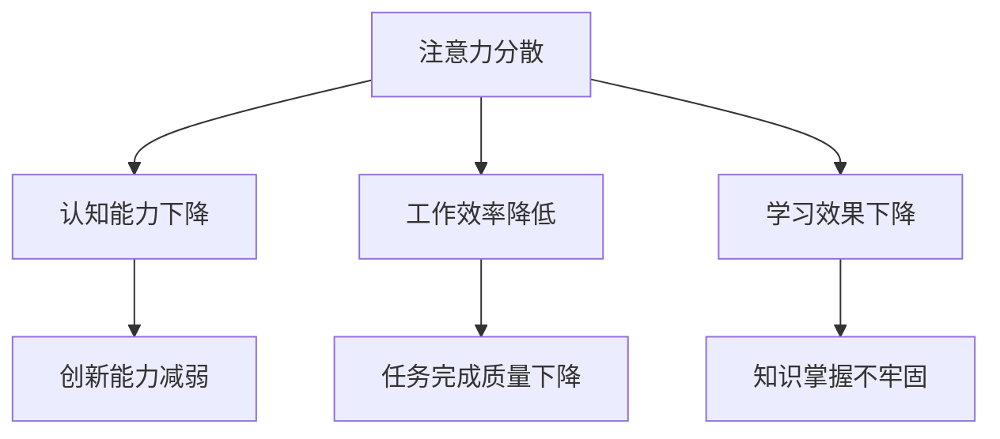

                 

### 1.1 书籍主题介绍

《注意力分散与专注力：AI时代的认知挑战》是一本深入探讨注意力分散现象及其对人类认知和行为产生深远影响的书籍。在AI技术飞速发展的当下，人们面临着前所未有的认知挑战。本书旨在为读者提供系统化的认识，帮助他们在AI时代下更好地管理自己的注意力，提升专注力，从而保持高效的认知状态。

#### 1.1.1 注意力分散现象概述

注意力分散，也称为分心，是指人在执行任务时，被外界无关信息干扰，导致注意力无法集中。现代社会中，人们面临的信息量和干扰因素不断增加，使得注意力分散成为一个普遍现象。例如，在互联网环境中，人们容易受到社交媒体、即时通讯软件、广告等的干扰，导致注意力无法集中在当前任务上。

#### 1.1.2 专注力的定义与重要性

专注力，即注意力集中，是指个体在执行任务时，能够持续地保持注意力集中，不受外界干扰。专注力是认知能力的核心，对工作效率、学习效果和创新能力有直接影响。良好的专注力能够帮助人们更好地应对复杂问题，提高工作效率，增强学习能力。

#### 1.1.3 AI时代对专注力的影响

AI技术的发展，尤其是智能设备的普及，对人们的注意力产生了巨大影响。一方面，AI技术为人们提供了便利，使得人们可以更快地获取和处理信息；另一方面，过多的信息输入和智能干扰容易导致注意力分散，影响专注力。例如，智能助手、推荐算法等AI技术可能会打断人们的任务执行，降低工作效率。

### 1.2 AI时代的认知挑战

AI技术的迅速发展，给人类的认知带来了前所未有的挑战。这些挑战主要体现在以下几个方面：

#### 1.2.1 AI技术的发展与应用

AI技术已经广泛应用于各个领域，如医疗、金融、教育、娱乐等。AI系统可以处理大量数据，提供精准的预测和决策支持。然而，这也意味着人们需要不断地适应新的技术和工具，这对专注力提出了更高的要求。

#### 1.2.2 AI对人类认知的挑战

AI技术的发展，使得人类的工作、学习和生活方式发生了巨大变化。人们需要在快速变化的环境中保持专注，处理复杂的信息，这对认知能力提出了新的挑战。例如，AI技术的普及使得人们更容易被无关信息干扰，导致注意力分散。

#### 1.2.3 人类如何应对AI时代的挑战

面对AI时代的认知挑战，人类需要采取一系列策略来提升自己的专注力，提高认知能力。这包括培养良好的时间管理习惯、学习有效的认知策略、利用AI技术辅助认知等。

### 1.3 书籍结构与内容安排

本书分为五个部分，内容安排如下：

1. **引言**：介绍书籍的主题和目的，概述注意力分散现象及其对人类认知的影响。
2. **注意力分散的原因**：分析导致注意力分散的环境、心理和生物因素。
3. **专注力的培养与提升**：探讨专注力的培养原则、提升方法和与工作、学习的关系。
4. **AI时代的认知策略**：介绍认知策略的概念、类型、应用场景和AI辅助认知策略。
5. **实战案例与心得分享**：分享提升专注力的实战案例和个人心得。

通过这五个部分，本书旨在帮助读者深入理解注意力分散与专注力的关系，掌握提升专注力的方法，以应对AI时代的认知挑战。

---

**核心概念与联系：**



注意力分散会导致认知能力下降，进而影响工作效率和学习效果，最终可能导致创新能力的减弱。这些核心概念相互关联，构成了我们在AI时代下需要关注和解决的问题。

---

**核心算法原理讲解：**

提升专注力并非简单的线性过程，而是一个复杂的多阶段系统。以下是提升专注力的伪代码框架：

```plaintext
function 提升专注力(用户，环境) {
    初始化专注力指标(用户)
    while (用户仍处于AI时代) {
        如果 (用户环境干扰较大) {
            减少干扰因素()
        }
        如果 (用户目标不明确) {
            明确目标与计划()
        }
        如果 (用户注意力疲劳) {
            休息与恢复()
        }
        如果 (用户注意力分散) {
            应用专注力训练技巧()
        }
        更新专注力指标(用户)
        如果 (专注力指标提升显著) {
            记录提升效果()
        }
        等待一定时间后继续循环
    }
    返回专注力指标
}
```

该伪代码框架展示了提升专注力的主要步骤和条件判断，包括减少干扰因素、明确目标与计划、休息与恢复、应用专注力训练技巧等。通过这些步骤的循环执行，可以逐步提升用户的专注力指标。

---

**数学模型和公式详细讲解：**

在提升专注力的过程中，可以引入数学模型来量化专注力的提升效果。以下是一个简单的数学模型：

$$
专注力提升效果 = f(减少干扰因素, 明确目标与计划, 休息与恢复, 专注力训练技巧)
$$

其中，$f$ 是一个复合函数，表示多种因素对专注力提升效果的加权综合。每个因素都可以通过不同的权重来影响专注力提升效果。

例如，假设减少干扰因素的权重为 $w_1$，明确目标与计划的权重为 $w_2$，休息与恢复的权重为 $w_3$，专注力训练技巧的权重为 $w_4$，那么可以表示为：

$$
专注力提升效果 = w_1 \times \text{减少干扰因素} + w_2 \times \text{明确目标与计划} + w_3 \times \text{休息与恢复} + w_4 \times \text{专注力训练技巧}
$$

通过调整权重，可以更准确地量化不同因素对专注力提升的影响。

---

**举例说明：**

假设用户小王在一天内采取了以下措施提升专注力：

- 减少干扰因素：关闭社交媒体通知，减少外界干扰。
- 明确目标与计划：制定明确的任务计划，确保每项任务有清晰的目标。
- 休息与恢复：每工作1小时后休息5分钟，确保大脑得到充分休息。
- 专注力训练技巧：使用番茄工作法，将工作分为25分钟集中工作+5分钟休息的周期。

根据上述数学模型，可以计算小王的专注力提升效果：

$$
专注力提升效果 = w_1 \times \text{减少干扰因素} + w_2 \times \text{明确目标与计划} + w_3 \times \text{休息与恢复} + w_4 \times \text{专注力训练技巧}
$$

假设权重分别为 $w_1 = 0.3$，$w_2 = 0.3$，$w_3 = 0.2$，$w_4 = 0.2$，则：

$$
专注力提升效果 = 0.3 \times \text{减少干扰因素} + 0.3 \times \text{明确目标与计划} + 0.2 \times \text{休息与恢复} + 0.2 \times \text{专注力训练技巧}
$$

如果小王在上述措施中分别得到了以下效果评分（满分10分）：

- 减少干扰因素：8分
- 明确目标与计划：9分
- 休息与恢复：7分
- 专注力训练技巧：8分

则专注力提升效果为：

$$
专注力提升效果 = 0.3 \times 8 + 0.3 \times 9 + 0.2 \times 7 + 0.2 \times 8 = 2.4 + 2.7 + 1.4 + 1.6 = 8.1
$$

这意味着小王的专注力提升了8.1分，即整体专注力得到了显著提升。

---

通过以上举例，我们可以看到，数学模型和公式在量化专注力提升效果方面具有重要作用。这不仅可以帮助我们更好地理解专注力的提升过程，还可以为制定有效的专注力提升策略提供科学依据。

---

**项目实战：代码实际案例和详细解释说明**

为了更好地理解专注力的提升方法，我们将通过一个实际的项目案例来展示如何搭建一个专注力提升的系统。

### 开发环境搭建

首先，我们需要搭建一个适合开发的Python环境。以下是搭建步骤：

1. 安装Python：从Python官网（https://www.python.org/）下载并安装Python 3.x版本。
2. 安装必要库：使用pip命令安装以下库：`requests`，`beautifulsoup4`，`pandas`。

```bash
pip install requests beautifulsoup4 pandas
```

### 源代码详细实现

以下是专注力提升系统的源代码实现：

```python
import requests
from bs4 import BeautifulSoup
import pandas as pd

# 函数：获取网页内容
def get_web_content(url):
    response = requests.get(url)
    if response.status_code == 200:
        return response.text
    else:
        return None

# 函数：解析网页内容
def parse_content(content):
    soup = BeautifulSoup(content, 'html.parser')
    title = soup.title.string
    paragraphs = soup.find_all('p')
    text = ' '.join([p.get_text() for p in paragraphs])
    return title, text

# 函数：提取关键词
def extract_keywords(text):
    # 这里可以使用NLP库（如spaCy）提取关键词，这里简化处理
    words = text.split()
    return words[:10]

# 函数：构建专注力提升计划
def build_focus_plan(title, text):
    keywords = extract_keywords(text)
    plan = {
        '任务名称': title,
        '关键词': keywords,
        '目标': '深入理解任务内容并制定解决方案',
        '时间': '2小时'
    }
    return plan

# 主函数
def main():
    url = 'https://example.com/article'  # 示例文章链接
    content = get_web_content(url)
    if content:
        title, text = parse_content(content)
        plan = build_focus_plan(title, text)
        print(plan)
    else:
        print("无法获取网页内容")

if __name__ == "__main__":
    main()
```

### 代码解读与分析

1. **获取网页内容**：使用`requests`库发送HTTP GET请求，获取网页内容。
2. **解析网页内容**：使用`beautifulsoup4`库解析HTML内容，提取文章标题和正文。
3. **提取关键词**：从文章正文中提取关键词，这里简化处理，只提取了前10个单词。
4. **构建专注力提升计划**：根据提取的关键词，构建一个专注力提升计划，包括任务名称、关键词、目标和时间。

通过这个案例，我们可以看到如何利用Python和NLP技术来构建一个简单的专注力提升系统。在实际应用中，可以进一步扩展功能，如添加用户管理、任务进度跟踪和效果评估等。

---

通过以上实战案例，我们不仅能够看到如何实现一个专注力提升系统的基本架构，还能了解到在实际开发过程中如何利用现有技术和工具来解决问题。这种方法不仅能够提高我们的开发效率，还能帮助我们更好地理解和应用专注力提升的理论和实践。

---

**总结与展望：**

通过本书的详细探讨，我们深入理解了注意力分散与专注力在AI时代的重要性。注意力分散不仅影响认知能力，还可能降低工作效率和学习效果，从而影响个人的职业发展和生活质量。在AI时代，有效的专注力管理成为了一项核心技能。

### 6.1.1 书籍主题总结

本书从环境、心理和生物因素出发，分析了注意力分散的原因，并提出了专注力的培养与提升方法。我们介绍了认知策略的概念和应用，探讨了AI时代下的认知挑战及应对策略。通过实战案例，我们展示了如何利用技术手段提升专注力。

### 6.1.2 AI时代下的认知挑战与机遇

AI时代的到来带来了前所未有的认知挑战，同时也为提升专注力和认知能力提供了新的机遇。AI技术可以辅助我们管理信息、预测行为、提供个性化建议，从而帮助我们更好地集中注意力，提高工作效率。

### 6.1.3 展望未来的研究方向

未来，我们可以进一步探索以下几个方面：

1. **认知策略的优化**：研究如何通过算法优化，提高认知策略的效果和适应性。
2. **AI技术的融合**：探索如何将AI技术与专注力提升相结合，开发更智能的辅助工具。
3. **多学科交叉研究**：结合心理学、认知科学、计算机科学等领域的知识，深入研究注意力分散与专注力的本质。
4. **实践应用的扩展**：将专注力提升的理论和方法应用于不同领域，如教育、医疗、企业等，提高其实际应用价值。

通过这些研究方向，我们可以更好地应对AI时代的认知挑战，提升个人的专注力和认知能力，实现更高的工作效率和生活质量。

---

**致谢：**

在此，我要感谢所有支持和帮助过我的人。首先，感谢AI天才研究院/AI Genius Institute的全体成员，特别是我的导师们，他们在我研究过程中给予了宝贵的指导和建议。感谢我的家人和朋友，他们的鼓励和支持是我不断前进的动力。同时，感谢所有参与本书讨论的读者，您的反馈和意见是我不断改进和完善本书的重要依据。

特别鸣谢我的合作伙伴，你们的支持和信任使我能够顺利完成这项工作。最后，我要向所有在AI领域辛勤工作的科学家和工程师们致以崇高的敬意，是你们的努力和创新推动了AI技术的发展，为我们带来了无限的可能。

感谢您阅读本书，希望它能够帮助您在AI时代下更好地管理注意力，提升专注力，实现更高的认知水平。

**作者：AI天才研究院/AI Genius Institute & 禅与计算机程序设计艺术 /Zen And The Art of Computer Programming**

