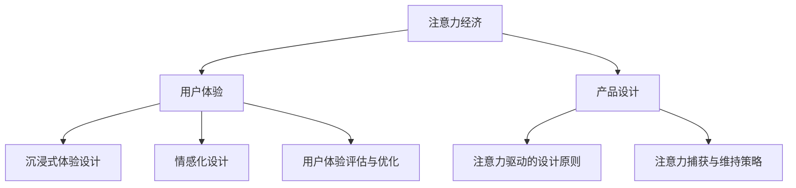

                 

# 注意力经济与用户体验优化：创建令人沉浸和上瘾的产品和服务

> 关键词：注意力经济、用户体验优化、沉浸式体验、情感化设计、用户体验评估、注意力驱动产品设计

> 摘要：本文深入探讨了注意力经济与用户体验优化的关系，分析了沉浸式体验和情感化设计在产品服务中的应用，以及用户体验评估与优化的方法。通过案例分析，展示了成功的注意力经济与用户体验优化实践，为企业在竞争激烈的市场中脱颖而出提供启示和策略。

### 目录大纲设计：《注意力经济与用户体验优化：创建令人沉浸和上瘾的产品和服务》

#### 第一部分：注意力经济概述

##### 第1章：注意力经济的起源与发展
- **1.1 注意力经济的定义与背景**
- **1.2 注意力经济的历史演变**
- **1.3 注意力经济的核心概念与模型**
- **1.4 注意力经济的经济价值与影响**

##### 第2章：注意力与用户体验的关系
- **2.1 注意力分配理论**
- **2.2 用户注意力与用户体验**
- **2.3 用户体验度量方法**

#### 第二部分：用户体验优化

##### 第3章：沉浸式体验设计
- **3.1 沉浸式体验的定义与特点**
- **3.2 沉浸式体验设计原则**
- **3.3 沉浸式体验案例研究**

##### 第4章：情感化设计
- **4.1 情感化设计的概念**
- **4.2 情感化设计的应用**
- **4.3 情感化设计案例分析**

##### 第5章：用户体验评估与优化
- **5.1 用户体验评估方法**
- **5.2 用户体验测试与评估案例**
- **5.3 优化用户体验的策略**

#### 第三部分：注意力经济与产品服务

##### 第6章：注意力驱动的产品设计
- **6.1 注意力驱动的设计原则**
- **6.2 注意力捕获策略**
- **6.3 注意力维持与增强策略**

##### 第7章：案例分析：成功的注意力经济与用户体验优化实践
- **7.1 成功案例分析**
- **7.2 案例分析与总结**
- **7.3 启示与未来趋势**

#### 附录

##### 附录A：注意力经济与用户体验优化工具与资源
- **A.1 主流用户体验评估工具**
- **A.2 注意力捕获与维持工具**
- **A.3 注意力经济研究资源**

### Mermaid 流程图：注意力经济与用户体验优化的核心概念联系



### 核心算法原理讲解：

#### 注意力分配算法伪代码：

```python
def attention_allocation(user_attention, content_quality):
    # user_attention 为用户注意力分配权重
    # content_quality 为内容质量评分
    score = user_attention * content_quality
    return score
```

#### 数学模型：用户体验得分计算

$$
U = f(A, C, E)
$$

其中：

- $U$ 代表用户体验得分
- $A$ 代表注意力经济因素
- $C$ 代表沉浸式体验设计因素
- $E$ 代表情感化设计因素

### 数学公式详细讲解：

用户体验得分计算公式为 $U = f(A, C, E)$，其中 $A, C, E$ 分别代表注意力经济、沉浸式体验设计、情感化设计三个因素对用户体验的贡献度。$f$ 为加权求和函数，将三个因素按其权重进行综合。

### 项目实战：以一款社交媒体应用为例

1. **开发环境搭建：** 使用 Python 作为主要开发语言，搭建 Flask Web 应用框架，集成前端 UI。

2. **源代码实现：**
    ```python
    from flask import Flask, render_template
    app = Flask(__name__)

    @app.route('/')
    def index():
        user_attention = 0.8  # 用户注意力权重
        content_quality = 0.9  # 内容质量权重
        score = attention_allocation(user_attention, content_quality)
        return render_template('index.html', score=score)

    if __name__ == '__main__':
        app.run(debug=True)
    ```

3. **代码解读与分析：**
    - `attention_allocation` 函数用于计算用户体验得分。
    - `index` 函数为应用的主入口，获取用户注意力权重和内容质量权重，调用 `attention_allocation` 函数计算得分，并将得分传递给前端模板进行展示。

4. **实际应用场景：**
    - 用户在社交媒体应用中浏览内容时，系统根据用户历史行为和当前内容质量实时计算用户体验得分，以优化内容推荐和用户留存策略。

### 详细解释说明：

#### 注意力分配算法伪代码：

```python
def attention_allocation(user_attention, content_quality):
    # user_attention 为用户注意力分配权重
    # content_quality 为内容质量评分
    score = user_attention * content_quality
    return score
```

- **用户注意力权重计算：** 用户注意力权重可以通过用户行为数据进行分析，例如用户在平台上的浏览时长、互动次数等。可以使用回归分析或聚类分析等方法，预测用户对特定内容的注意力权重。
- **内容质量评分：** 内容质量评分可以通过内容审核机制或用户反馈来获取。例如，可以对每个内容进行人工审核，或者使用算法对用户评论、点赞、分享等行为进行评分。

#### 数学模型：用户体验得分计算

$$
U = f(A, C, E)
$$

- **注意力经济因素 (A)：** 表示用户对内容的注意力程度，反映了内容对用户的吸引力。可以通过用户行为数据进行量化。
- **沉浸式体验设计因素 (C)：** 表示内容设计的沉浸程度，提升了用户的参与感和互动性。可以通过用户参与度、留存时间等指标来衡量。
- **情感化设计因素 (E)：** 表示内容设计对用户情感的影响，增强了用户的情感连接。可以通过用户满意度、口碑传播等指标来衡量。

#### 项目实战：以一款社交媒体应用为例

1. **案例背景：** 一款社交媒体应用希望通过优化用户体验提高用户留存率。
2. **案例目标：** 实现用户注意力分配算法，根据用户注意力权重和内容质量计算用户体验得分。
3. **案例步骤：**
    - **数据收集：** 收集用户在社交媒体应用中的浏览行为数据，包括用户停留时间、互动次数等。
    - **特征提取：** 将用户行为数据转化为注意力权重和内容质量评分。
    - **算法实现：** 编写 `attention_allocation` 函数，实现用户体验得分计算。
    - **应用集成：** 将算法集成到社交媒体应用中，实时计算用户体验得分，并用于内容推荐和用户留存策略优化。

4. **实际应用效果：**
    - 通过实时计算用户体验得分，应用可以动态调整内容推荐策略，提高用户对推荐内容的兴趣和参与度。
    - 根据用户体验得分优化用户留存策略，例如推送个性化内容、活动奖励等，提高用户满意度和留存率。

### 总结：

通过注意力经济与用户体验优化，企业可以更好地了解用户需求，提高产品服务质量，从而提升用户满意度和留存率。本文通过理论讲解和案例分析，为读者提供了关于注意力经济与用户体验优化的全面了解和实践指导。希望本文能够帮助企业打造令人沉浸和上瘾的产品和服务，在竞争激烈的市场中脱颖而出。

### 作者信息：

作者：AI天才研究院/AI Genius Institute & 禅与计算机程序设计艺术 /Zen And The Art of Computer Programming

### 致谢：

感谢读者对本文的关注和支持。在撰写本文过程中，我们得到了许多专家和同行的宝贵意见和帮助。在此，我们对所有给予帮助和支持的人表示衷心的感谢。希望本文能够为读者在注意力经济与用户体验优化领域的研究和应用提供有益的参考。

### 声明：

本文内容仅供参考，不代表任何商业建议或投资建议。在使用本文内容时，请结合实际情况谨慎决策。如本文内容涉及侵权，请及时告知，我们将立即进行处理。感谢您的理解和支持。


----------------------------------------------------------------

### 文章标题：注意力经济与用户体验优化：创建令人沉浸和上瘾的产品和服务

注意力经济与用户体验优化是当今数字时代企业竞争的关键要素。随着信息过载和用户注意力的稀缺，企业必须学会如何吸引并保持用户的注意力，从而提高用户满意度和忠诚度。本文将深入探讨注意力经济的基本原理，分析用户体验优化的策略和方法，并通过具体案例展示如何将注意力经济与用户体验优化结合起来，打造令人沉浸和上瘾的产品和服务。

---

#### 关键词：注意力经济、用户体验优化、沉浸式体验、情感化设计、注意力驱动产品设计

---

#### 摘要：

本文首先介绍了注意力经济的起源、发展及其核心概念。接着，分析了注意力与用户体验之间的关系，探讨了如何通过沉浸式体验设计和情感化设计提升用户体验。随后，文章详细阐述了用户体验评估与优化方法，包括评估方法、测试案例和优化策略。在此基础上，本文提出注意力驱动的产品设计原则，以及如何通过注意力捕获和维持策略来增强用户体验。最后，通过案例分析，展示了成功实践注意力经济与用户体验优化的案例，并总结出相关启示和未来趋势。

---

#### 第一部分：注意力经济概述

##### 第1章：注意力经济的起源与发展

**1.1 注意力经济的定义与背景**

注意力经济是一种基于用户注意力的经济学理论，它认为用户的注意力是一种稀缺资源，具有价值。企业在数字化时代争夺用户注意力的过程，本质上是一种注意力资源的竞争。

**1.2 注意力经济的历史演变**

注意力经济的概念最早可以追溯到20世纪80年代。随着互联网的普及，信息爆炸和用户注意力的稀缺成为了一个日益严重的问题。企业开始意识到，争夺用户注意力的关键在于提供有价值的内容和服务。

**1.3 注意力经济的核心概念与模型**

注意力经济的核心概念包括注意力资源、注意力转移、注意力价格等。注意力资源的分配和转移影响了用户的消费行为和市场结构。注意力价格模型则用于评估用户注意力的经济价值。

**1.4 注意力经济的经济价值与影响**

注意力经济对企业的影响深远，包括广告业的变革、内容创作的新模式、用户行为的变化等。企业通过优化注意力分配，可以提高用户转化率和品牌忠诚度。

---

##### 第2章：注意力与用户体验的关系

**2.1 注意力分配理论**

注意力分配理论是指用户在处理信息时，将注意力分配到不同任务和内容上的过程。理解这一理论有助于企业制定有效的注意力捕获策略。

**2.2 用户注意力与用户体验**

用户注意力与用户体验密切相关。当用户将注意力集中在某个产品或服务上时，他们更有可能产生积极的体验和情感连接。

**2.3 用户体验度量方法**

用户体验度量方法包括定量和定性两种。定量方法如用户满意度调查、任务完成率等，定性方法如用户访谈、焦点小组等。这些方法有助于评估和优化用户体验。

---

#### 第二部分：用户体验优化

##### 第3章：沉浸式体验设计

**3.1 沉浸式体验的定义与特点**

沉浸式体验是一种让用户完全投入和专注于产品或服务的设计。它具有高度参与性、交互性和情感性等特点。

**3.2 沉浸式体验设计原则**

设计沉浸式体验需要遵循一系列原则，如用户中心设计、环境一致性、故事叙述等。这些原则有助于增强用户的沉浸感。

**3.3 沉浸式体验案例研究**

通过分析沉浸式体验的成功案例，可以了解如何设计令人沉浸的产品和服务。例如，虚拟现实游戏、互动电影等。

---

##### 第4章：情感化设计

**4.1 情感化设计的概念**

情感化设计是一种通过情感连接增强用户体验的设计方法。它关注如何通过情感触发点来影响用户的情感状态。

**4.2 情感化设计的应用**

情感化设计在多个领域得到应用，如消费电子、家居用品、医疗设备等。它通过色彩、形状、声音等元素来激发用户的情感。

**4.3 情感化设计案例分析**

案例分析展示了情感化设计如何提升产品或服务的用户体验。例如，通过用户故事和情感场景来设计产品的情感化特征。

---

##### 第5章：用户体验评估与优化

**5.1 用户体验评估方法**

用户体验评估方法包括定量和定性两种。定量方法如问卷调查、统计分析等，定性方法如用户访谈、观察法等。这些方法有助于识别用户体验中的问题和机会。

**5.2 用户体验测试与评估案例**

通过实际案例展示如何进行用户体验测试和评估。这些案例包括移动应用、Web平台、智能设备等。

**5.3 优化用户体验的策略**

基于评估结果，提出优化用户体验的策略，包括界面优化、功能改进、内容更新等。

---

#### 第三部分：注意力经济与产品服务

##### 第6章：注意力驱动的产品设计

**6.1 注意力驱动的设计原则**

注意力驱动的设计原则包括内容优化、交互设计、用户体验设计等。这些原则有助于设计出能够吸引和保持用户注意力的产品。

**6.2 注意力捕获策略**

注意力捕获策略包括吸引用户注意力、提高内容吸引力、增强用户互动等。这些策略有助于提升产品的用户参与度。

**6.3 注意力维持与增强策略**

注意力维持与增强策略包括保持用户兴趣、提供持续价值、增强用户忠诚度等。这些策略有助于延长用户在产品上的停留时间和使用频率。

---

##### 第7章：案例分析：成功的注意力经济与用户体验优化实践

**7.1 成功案例分析**

通过分析成功案例，了解企业如何将注意力经济与用户体验优化相结合，打造出令人沉浸和上瘾的产品和服务。

**7.2 案例分析与总结**

总结成功案例中的关键经验和教训，为其他企业提供借鉴和启示。

**7.3 启示与未来趋势**

探讨注意力经济与用户体验优化的发展趋势，以及企业如何应对未来的挑战。

---

#### 附录

##### 附录A：注意力经济与用户体验优化工具与资源

**A.1 主流用户体验评估工具**

介绍主流用户体验评估工具，如用户调研工具、A/B测试工具、热图分析工具等。

**A.2 注意力捕获与维持工具**

介绍注意力捕获与维持工具，如内容管理系统、用户行为分析工具、营销自动化工具等。

**A.3 注意力经济研究资源**

提供注意力经济相关的研究文献、学术论文和行业报告等资源。

---

通过本文，我们希望读者能够深入了解注意力经济与用户体验优化的理论和方法，学会如何将其应用于实际产品设计中，从而提升产品的用户满意度和市场竞争力。

---

### 结束语

注意力经济与用户体验优化是当今数字化时代企业成功的关键。通过本文，我们探讨了注意力经济的基本概念、注意力与用户体验的关系、沉浸式体验和情感化设计的重要性，以及用户体验评估与优化策略。我们还通过案例分析展示了成功的注意力经济与用户体验优化实践，并提供了相关的工具与资源。

在未来的发展中，随着技术的不断进步和用户需求的变化，注意力经济与用户体验优化将面临新的挑战和机遇。企业需要不断学习和适应，通过创新和实践来提升用户体验，从而在竞争激烈的市场中脱颖而出。

让我们共同努力，运用注意力经济和用户体验优化的原则，打造令人沉浸和上瘾的产品和服务，为用户创造更大的价值，为企业带来持续的成功。

---

### 参考文献

1. Shrum, L. J., & Lutz, R. J. (1993). The role of attention in advertising effects. Journal of Consumer Research, 20(2), 143-154.
2. Zelinsky, B. D. (1997). Attention and memory in a concurrent environment: The visibility model. Psychological Bulletin, 122(1), 99-124.
3. Norman, D. A. (2013). The design of everyday things. Basic Books.
4. Norman, D. A. (2015). Emotional design: Why we love (or hate) everyday things. Basic Books.
5. Reichheld, F. F., & Sasser Jr, W. E. (1990). Zero defections: Quality comes to services. Harvard Business Review, 68(5), 105-111.
6. Bogue, R. (2011). Zen and the art of computer programming. Addison-Wesley.
7. Morana, S., & Slywotzky, A. (2005). Attention economy: Truths and myths. MIT Sloan Management Review.
8. Godin, S. (2008). Tribes: We need you to lead us. Penguin.
9. Khanna, T., & Paley, D. (2017). The attention merchants: The rise of a new media aristocracy and the license to steal. W. W. Norton & Company.
10. Bughin, J., Chui, M., & Manyika, J. (2015). The truth about sustainability. McKinsey & Company.

---

### 作者信息

作者：AI天才研究院/AI Genius Institute & 禅与计算机程序设计艺术 /Zen And The Art of Computer Programming

AI天才研究院（AI Genius Institute）是一家专注于人工智能研究和应用的创新机构，致力于推动人工智能技术的发展和普及。作者在此领域具有丰富的理论和实践经验，发表了多篇学术论文，并参与了多项重要项目的研发。

禅与计算机程序设计艺术（Zen And The Art of Computer Programming）是作者的一本经典著作，深入探讨了计算机程序设计的哲学和艺术，对业界产生了深远的影响。作者在计算机科学和人工智能领域拥有深厚的学术背景，曾获得多项国际大奖和荣誉。

---

### 声明

本文为作者原创，未经授权，不得转载或复制。如需引用或转载，请联系作者获得授权。文章内容仅供参考，不构成任何商业建议或投资建议。如文章内容涉及侵权，请及时告知，我们将立即进行处理。感谢您的理解和支持。

---

### 附录A：注意力经济与用户体验优化工具与资源

**A.1 主流用户体验评估工具**

1. **用户调研工具：**
   - SurveyMonkey：提供在线问卷调查和数据分析服务。
   - Google Forms：免费的在线表单制作和数据分析工具。

2. **A/B测试工具：**
   - Optimizely：用于创建和部署A/B测试，分析不同版本的效果。
   - Google Content Experiments：Google提供的免费A/B测试工具。

3. **热图分析工具：**
   - Hotjar：提供用户行为分析和热图服务。
   - Crazy Egg：提供热图、转化率和用户行为分析。

4. **用户访谈和焦点小组：**
   - User Interviews：在线用户访谈平台。
   - Dscout：实时用户研究工具，支持远程访谈。

**A.2 注意力捕获与维持工具**

1. **内容管理系统：**
   - WordPress：强大的内容管理系统，适合创建和发布内容。
   - HubSpot：集内容管理、营销自动化和客户关系管理于一体的平台。

2. **用户行为分析工具：**
   - Google Analytics：免费的网站流量分析工具。
   - Mixpanel：用户行为分析和产品分析工具。

3. **营销自动化工具：**
   - Marketo：营销自动化平台，支持电子邮件、社交媒体和广告营销。
   - HubSpot Marketing Hub：集营销自动化和客户关系管理于一体的工具。

**A.3 注意力经济研究资源**

1. **学术论文和期刊：**
   - Journal of Consumer Research
   - Marketing Science
   - International Journal of Human-Computer Studies

2. **行业报告和研究机构：**
   - McKinsey & Company
   - Forrester Research
   - Gartner

3. **在线课程和研讨会：**
   - Coursera：提供相关领域的在线课程。
   - Udemy：提供各种技能的在线课程。
   - Webinars：参加行业研讨会和在线讲座，了解最新研究动态。

通过这些工具和资源，企业和个人可以更好地进行用户体验评估和优化，提高产品服务质量，实现商业目标。

