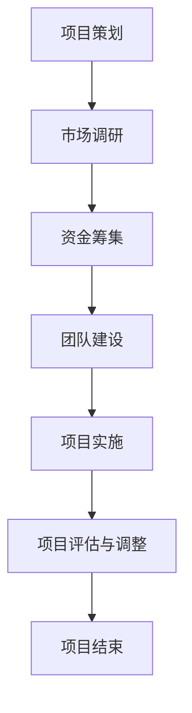

                 

### 《海洋科技创业：蓝色经济的无限可能》

#### 关键词：海洋科技，蓝色经济，创业，技术创新，政策支持，国际合作

> 摘要：本文从海洋科技创业的背景与机遇、关键领域解析、创业实践、政策支持与国际化发展、未来趋势等多个角度，深入探讨了海洋科技创业的无限可能。通过对核心概念、联系流程图的梳理，以及实际项目案例的分析，本文旨在为创业者提供具有实践指导意义的理论支持。

---

### 第一部分：海洋科技创业概述

#### 第1章：海洋科技创业的背景与机遇

**1.1 海洋科技创业的定义与范畴**

**1.1.1 海洋科技的定义**

海洋科技是指运用现代科学技术手段，对海洋进行综合性研究和利用的领域。它涵盖了海洋资源开发、海洋环境保护、海洋工程技术、海洋信息处理等多个方面。

**1.1.2 海洋科技创业的主要领域**

海洋科技创业主要包括以下几个领域：

- 海洋能源技术：如潮汐能、波浪能、海洋风能、海洋热能等。
- 海洋生物资源开发：如海洋渔业、海洋药物研发、海洋微生物资源利用等。
- 海洋矿产资源勘探与开发：如海底油气勘探、海底金属矿藏开发等。

**1.2 蓝色经济的概念与发展**

**1.2.1 蓝色经济的内涵**

蓝色经济是指以海洋资源为核心，通过科技创新和可持续利用，推动经济发展的一种模式。它强调海洋资源的合理开发和保护，实现经济、社会和环境的协调发展。

**1.2.2 蓝色经济的全球发展态势**

近年来，蓝色经济在全球范围内得到了广泛重视。许多国家纷纷制定相关政策，加大对海洋科技的研发投入，推动海洋产业的转型升级。

**1.3 海洋科技创业的机遇与挑战**

**1.3.1 政策环境与国际合作**

政策环境方面，各国政府纷纷出台支持海洋科技创业的政策措施，为创业者提供了良好的发展环境。国际合作方面，海洋科技领域的跨国合作日益紧密，共同推动蓝色经济的发展。

**1.3.2 技术创新与市场前景**

技术创新是海洋科技创业的核心驱动力。随着科技的不断发展，海洋科技创业的市场前景十分广阔，吸引了大量创业者和投资者的关注。

**1.3.3 风险与应对策略**

海洋科技创业面临诸多风险，如技术创新风险、市场风险、政策风险等。创业者需要制定相应的应对策略，降低创业风险。

**小结**

海洋科技创业具有广阔的发展前景，但同时也面临着诸多挑战。创业者需要紧跟政策趋势，抓住技术创新机遇，应对市场变化，实现蓝色经济的可持续发展。

---

### 第二部分：海洋科技关键领域解析

#### 第2章：海洋资源开发利用技术

**2.1 海洋能源技术**

**2.1.1 潮汐能和波浪能**

潮汐能和波浪能是海洋能源的重要形式。通过潮汐电站和波浪能装置，可以将这些能源转化为电能。

**2.1.2 海洋风能**

海洋风能是指利用海洋风能进行发电。与陆上风电相比，海洋风电具有更高的风速和更稳定的发电特性。

**2.1.3 海洋热能利用**

海洋热能利用是指通过海洋热能进行发电和海水淡化。目前，海洋热能利用技术主要包括地热发电和海水温差发电。

**2.2 海洋生物资源开发**

**2.2.1 海洋渔业**

海洋渔业是海洋生物资源开发的重要领域。通过现代渔业技术和装备，可以实现高效、可持续的渔业生产。

**2.2.2 海洋药物研发**

海洋药物研发是指从海洋生物中提取具有药用价值的成分，用于治疗疾病。近年来，海洋药物研发取得了显著成果。

**2.2.3 海洋微生物资源利用**

海洋微生物资源利用是指对海洋微生物进行研究和开发，以获取具有潜在应用价值的微生物资源。

**2.3 海洋矿产资源勘探与开发**

**2.3.1 海底油气勘探**

海底油气勘探是指利用地质学和地球物理学方法，对海底油气资源进行勘探和评估。

**2.3.2 海底金属矿藏开发**

海底金属矿藏开发是指对海底金属矿藏进行勘探、开采和利用。目前，海底金属矿藏主要包括钴、镍、铜等。

**2.3.3 沉积岩矿物资源开发**

沉积岩矿物资源开发是指对沉积岩中的矿物资源进行勘探、开采和利用。这些矿物资源主要包括锰、钒、磷等。

**小结**

海洋资源开发利用技术是海洋科技创业的关键领域。通过技术创新，可以进一步挖掘海洋资源的潜力，实现蓝色经济的可持续发展。

---

### 第三部分：海洋科技创业实践

#### 第3章：海洋科技创业项目策划与管理

**3.1 创业项目定位与市场调研**

**3.1.1 创业项目的市场定位**

创业项目的市场定位是指确定创业项目所面向的市场细分领域，以及项目的核心竞争力和市场价值。

**3.1.2 市场调研的方法与工具**

市场调研的方法主要包括问卷调查、访谈、焦点小组讨论等。市场调研的工具包括数据收集软件、数据分析工具等。

**3.2 创业项目资金筹集与管理**

**3.2.1 资金筹集渠道**

创业项目的资金筹集渠道包括风险投资、银行贷款、政府补贴等。

**3.2.2 资金使用计划与控制**

创业项目的资金使用计划应包括项目启动、运营、扩张等各个阶段。资金使用控制是指通过预算管理和成本控制，确保资金的有效使用。

**3.3 创业项目团队建设与组织管理**

**3.3.1 团队成员的角色与职责**

团队成员的角色与职责应根据项目需求进行合理分配，以确保项目的顺利推进。

**3.3.2 团队协作与沟通管理**

团队协作与沟通管理是创业项目成功的关键。通过建立高效的沟通机制和协作流程，可以提高团队的执行力和创新能力。

**小结**

海洋科技创业项目策划与管理是创业成功的重要保障。创业者需要明确项目定位、进行市场调研，筹集和管理资金，建设高效团队，确保项目的顺利实施。

---

#### 第4章：海洋科技创业项目案例分析

**4.1 国内外成功海洋科技创业案例分析**

**4.1.1 案例一：某海洋可再生能源公司**

某海洋可再生能源公司通过研发和运营潮汐能发电项目，成功实现了清洁能源的商业化应用。

**4.1.2 案例二：某海洋生物技术企业**

某海洋生物技术企业通过开发海洋药物，取得了显著的市场收益。

**4.1.3 案例三：某海洋矿产资源开发企业**

某海洋矿产资源开发企业通过勘探和开采海底金属矿藏，实现了企业的快速扩张。

**4.2 创业失败案例分析及教训**

**4.2.1 失败原因分析**

创业失败的原因主要包括技术创新不足、市场定位不准确、团队协作不畅等。

**4.2.2 启示与反思**

创业失败案例给创业者提供了宝贵的教训，如加强技术创新、明确市场定位、提升团队协作能力等。

**小结**

成功和失败都是创业的一部分。通过分析成功和失败的案例，创业者可以吸取经验教训，提高创业成功率。

---

### 第四部分：海洋科技创业政策支持与国际化发展

#### 第5章：海洋科技创业政策支持体系

**5.1 政策支持体系概述**

**5.1.1 国内外政策环境分析**

国内外政策环境对海洋科技创业产生了重要影响。各国政府纷纷出台支持海洋科技创业的政策措施，为创业者提供了良好的发展环境。

**5.1.2 政策支持的主要措施**

政策支持的主要措施包括资金支持、税收优惠、知识产权保护等。

**5.2 创新创业平台建设**

**5.2.1 创业孵化器与加速器**

创业孵化器与加速器为创业者提供了办公空间、培训、咨询等一站式服务，助力创业项目的成功实施。

**5.2.2 科技创新园区建设**

科技创新园区是集中展示和培育海洋科技创业项目的平台，为创业者提供了良好的发展环境。

**5.3 国际合作与竞争态势**

**5.3.1 国际合作的重要性**

国际合作是海洋科技创业的重要途径。通过国际合作，创业者可以借鉴国外先进经验，拓展国际市场。

**5.3.2 海洋科技创业的国际竞争**

海洋科技创业的国际竞争日益激烈。创业者需要具备创新能力和国际视野，才能在竞争中脱颖而出。

**小结**

政策支持体系与国际合作是海洋科技创业的重要保障。通过政策支持和国际合作，创业者可以降低创业风险，提高创业成功率。

---

### 第五部分：海洋科技创业的未来趋势

#### 第6章：海洋科技创业的未来方向与挑战

**6.1 新技术趋势分析**

**6.1.1 人工智能与海洋科技融合**

人工智能与海洋科技的融合将推动海洋科技创业向智能化、自动化方向发展。

**6.1.2 大数据在海洋科技中的应用**

大数据在海洋科技中的应用将提升海洋资源开发的效率，为创业者提供更多商业机会。

**6.1.3 新材料与海洋科技的结合**

新材料与海洋科技的结合将推动海洋工程技术的发展，为海洋资源开发利用提供新的解决方案。

**6.2 创业者面临的挑战与应对策略**

**6.2.1 技术创新挑战**

技术创新是海洋科技创业的核心驱动力。创业者需要不断进行技术创新，提高创业项目的竞争力。

**6.2.2 市场竞争压力**

市场竞争压力日益增大。创业者需要制定有效的市场竞争策略，确保在激烈的市场竞争中立于不败之地。

**6.2.3 环境与法规约束**

环境与法规约束对海洋科技创业提出了更高的要求。创业者需要遵循相关法律法规，实现可持续发展。

**6.3 蓝色经济的发展前景与创业机会**

**6.3.1 蓝色经济的主要驱动力**

蓝色经济的主要驱动力包括科技创新、政策支持、市场需求等。

**6.3.2 海洋科技创业的发展潜力**

海洋科技创业具有巨大的发展潜力。创业者可以通过技术创新和市场开拓，实现蓝色经济的可持续发展。

**小结**

海洋科技创业的未来充满机遇与挑战。创业者需要紧跟新技术趋势，应对市场竞争压力，实现蓝色经济的可持续发展。

---

### 附录

**附录A：海洋科技创业相关资源与工具**

- 海洋科技创业相关的政策文件、研究报告、学术论文等。
- 海洋科技创业所需的软件、硬件工具，如数据分析软件、海洋工程设备等。

**附录B：海洋科技创业政策文件汇编**

- 各国政府出台的海洋科技创业相关政策文件。
- 国际组织发布的海洋科技创业指导文件。

**附录C：海洋科技创业成功案例分析报告**

- 成功海洋科技创业项目的详细案例分析报告。
- 创业失败案例的深入剖析与启示。

**附录D：海洋科技创业常用术语表**

- 海洋科技创业领域常用的专业术语及其解释。

---

### 结语

海洋科技创业是推动蓝色经济发展的重要力量。本文从多个角度对海洋科技创业进行了深入探讨，旨在为创业者提供有益的参考和启示。希望读者能够在阅读本文后，对海洋科技创业有更深刻的认识，抓住蓝色经济的无限可能。

**作者：AI天才研究院/AI Genius Institute & 禅与计算机程序设计艺术 /Zen And The Art of Computer Programming**

---

### 第7章：海洋科技创业项目核心概念与联系流程图

**7.1 海洋科技创业项目流程图**

以下是海洋科技创业项目的核心概念与联系流程图：

**7.2 核心概念与联系**

- **项目策划**：明确创业项目的目标和愿景，制定项目计划和时间表。
- **市场调研**：了解市场需求和竞争状况，为项目定位提供依据。
- **资金筹集**：寻找资金来源，确保项目资金充足。
- **团队建设**：组建专业团队，明确团队成员的角色和职责。
- **项目实施**：按照项目计划执行各项工作，确保项目进度和质量。
- **项目评估与调整**：对项目进展进行评估，根据实际情况进行调整。
- **项目结束**：项目完成后进行总结和评估，为后续项目提供经验。

通过以上核心概念与联系流程图的梳理，我们可以更加清晰地理解海洋科技创业项目的整体流程和关键环节，为创业者的实践提供指导。

