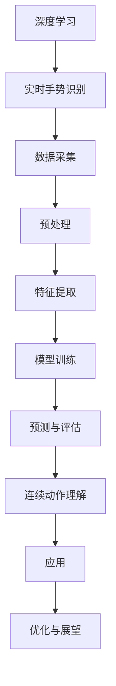

                 

### 深度学习在实时手势识别中的连续动作理解

**关键词：** 深度学习、实时手势识别、连续动作理解、卷积神经网络、循环神经网络、多模态数据融合

**摘要：** 随着深度学习技术的发展，实时手势识别系统在多个领域展现出巨大的应用潜力。本文主要探讨深度学习在实时手势识别中的连续动作理解技术，从基础理论到实际应用进行深入分析。文章首先介绍了深度学习和实时手势识别的基本概念，然后详细讲解了连续动作理解的重要性及其挑战。随后，文章探讨了用于连续动作理解的深度学习模型，包括一维卷积神经网络（1D-CNN）、时间卷积神经网络（TCN）和循环神经网络（RNN）。最后，文章通过实际应用案例和未来展望，总结了深度学习在实时手势识别中的连续动作理解技术的现状和未来发展。

## 《深度学习在实时手势识别中的连续动作理解》目录大纲

在本文中，我们将逐步深入探讨深度学习在实时手势识别中的连续动作理解技术。以下是本文的目录大纲，供读者参考：

### 第一部分：引言与背景

1. **1.1 书籍概述**
   - 1.1.1 书籍目的
   - 1.1.2 阅读对象
   - 1.1.3 书籍结构

2. **1.2 深度学习与实时手势识别**
   - 1.2.1 深度学习简介
   - 1.2.2 实时手势识别背景
   - 1.2.3 连续动作理解的挑战

### 第二部分：深度学习基础

1. **2.1 神经网络原理**
   - 2.1.1 神经网络的基本概念
   - 2.1.2 神经网络的数学基础
   - 2.1.3 深度学习模型的训练过程

2. **2.2 卷积神经网络（CNN）**
   - 2.2.1 CNN的基本结构
   - 2.2.2 卷积与池化操作
   - 2.2.3 CNN在图像处理中的应用

3. **2.3 循环神经网络（RNN）**
   - 2.3.1 RNN的基本原理
   - 2.3.2 LSTM与GRU模型
   - 2.3.3 RNN在序列数据处理中的应用

### 第三部分：实时手势识别技术

1. **3.1 手势识别基础**
   - 3.1.1 手势识别的定义
   - 3.1.2 手势识别的数据集
   - 3.1.3 手势识别的难点

2. **3.2 特征提取与预处理**
   - 3.2.1 图像特征提取方法
   - 3.2.2 视频特征提取方法
   - 3.2.3 特征降维与选择

3. **3.3 实时手势识别算法**
   - 3.3.1 基于CNN的手势识别
   - 3.3.2 基于RNN的手势识别
   - 3.3.3 基于深度强化学习的手势识别

### 第四部分：连续动作理解

1. **4.1 连续动作理解概述**
   - 4.1.1 连续动作定义
   - 4.1.2 连续动作理解的重要性
   - 4.1.3 连续动作理解的研究方法

2. **4.2 基于深度学习的连续动作模型**
   - 4.2.1 一维卷积神经网络（1D-CNN）
   - 4.2.2 时间卷积神经网络（TCN）
   - 4.2.3 循环神经网络（RNN）与长短时记忆网络（LSTM）

3. **4.3 连续动作理解的挑战与优化**
   - 4.3.1 多模态数据融合
   - 4.3.2 模型解释性
   - 4.3.3 实时性与计算效率

### 第五部分：实时手势识别中的连续动作理解应用

1. **5.1 应用场景分析**
   - 5.1.1 娱乐互动
   - 5.1.2 健康监测
   - 5.1.3 智能家居

2. **5.2 案例研究**
   - 5.2.1 案例一：基于连续动作理解的交互式游戏
   - 5.2.2 案例二：基于手势识别的远程控制系统
   - 5.2.3 案例三：基于手势识别的健身监测系统

3. **5.3 未来展望**
   - 5.3.1 深度学习在实时手势识别中的应用趋势
   - 5.3.2 连续动作理解技术的未来发展方向
   - 5.3.3 开发者与研究者面临的挑战

### 第六部分：附录

1. **6.1 常用深度学习框架**
   - 6.1.1 TensorFlow
   - 6.1.2 PyTorch
   - 6.1.3 Keras

2. **6.2 数据处理与预处理工具**
   - 6.2.1 OpenCV
   - 6.2.2 Kaldi
   - 6.2.3 Python数据科学库

3. **6.3 实践项目资源**
   - 6.3.1 项目清单
   - 6.3.2 开发环境搭建
   - 6.3.3 代码示例与解读

### 附录：深度学习与实时手势识别的Mermaid流程图



### 附录：深度学习在实时手势识别中的伪代码

```python
# 数据预处理
def preprocess_data(data):
    # 对数据进行归一化、缩放等处理
    processed_data = ...
    return processed_data

# 特征提取
def extract_features(data):
    # 提取图像或视频特征
    features = ...
    return features

# 模型训练
def train_model(features, labels):
    # 使用深度学习框架训练模型
    model = ...
    model.fit(features, labels)
    return model

# 预测与评估
def predict(model, new_data):
    # 使用训练好的模型进行预测
    predictions = model.predict(new_data)
    return predictions

# 连续动作理解
def continuous_action_understanding(predictions):
    # 对连续的预测结果进行理解
    actions = ...
    return actions

# 应用示例
def main():
    # 数据加载
    data = load_data()
    # 数据预处理
    processed_data = preprocess_data(data)
    # 特征提取
    features = extract_features(processed_data)
    # 模型训练
    model = train_model(features, labels)
    # 预测
    predictions = predict(model, new_data)
    # 连续动作理解
    actions = continuous_action_understanding(predictions)
    # 应用结果
    apply_actions(actions)

# 执行主函数
main()
```

### 附录：数学模型与公式

#### 数学模型

$$
y = f(Wx + b)
$$

其中，\(y\) 是预测输出，\(x\) 是输入特征，\(W\) 是权重矩阵，\(b\) 是偏置项，\(f\) 是激活函数。

#### 激活函数

$$
f(x) = \sigma(x) = \frac{1}{1 + e^{-x}}
$$

其中，\(\sigma\) 是 sigmoid 函数。

### 附录：项目实战

#### 1. 实时手势识别系统开发

##### 1.1 环境搭建

- 安装深度学习框架（如 TensorFlow 或 PyTorch）
- 安装图像处理库（如 OpenCV）

##### 1.2 数据集准备

- 收集实时手势识别数据集
- 数据清洗与预处理

##### 1.3 模型训练

- 设计深度学习模型架构
- 使用预处理后的数据训练模型

##### 1.4 预测与评估

- 使用训练好的模型进行实时预测
- 评估模型性能

##### 1.5 应用示例

- 开发实时手势识别应用

#### 2. 连续动作理解项目

##### 2.1 数据集准备

- 收集连续动作数据集
- 数据清洗与预处理

##### 2.2 模型设计

- 设计用于连续动作理解的深度学习模型

##### 2.3 模型训练

- 使用预处理后的数据训练模型

##### 2.4 预测与评估

- 使用训练好的模型进行连续动作预测
- 评估模型性能

##### 2.5 应用示例

- 开发连续动作理解应用

以上是本文的目录大纲和内容概览。接下来，我们将逐一探讨每个部分的具体内容，帮助读者深入了解深度学习在实时手势识别中的连续动作理解技术。

## 第一部分：引言与背景

### 1.1 书籍概述

本书旨在深入探讨深度学习在实时手势识别中的连续动作理解技术。随着人工智能技术的不断发展，深度学习已成为计算机视觉、自然语言处理等领域的核心技术。实时手势识别作为计算机视觉的一个重要分支，广泛应用于娱乐互动、健康监测和智能家居等领域。而连续动作理解作为实时手势识别的一个关键问题，旨在对用户连续的手势进行准确识别和理解，从而提供更加智能化的交互体验。

#### 1.1.1 书籍目的

本书的主要目的是帮助读者深入了解深度学习在实时手势识别中的连续动作理解技术，包括基础理论、算法实现和应用场景。通过本书的学习，读者可以掌握以下内容：

- 深度学习的基本概念和原理，包括神经网络、卷积神经网络和循环神经网络等。
- 实时手势识别的技术细节，包括数据集准备、特征提取和模型训练等。
- 连续动作理解的关键技术和挑战，包括一维卷积神经网络、时间卷积神经网络和循环神经网络等。
- 实际应用案例，包括娱乐互动、健康监测和智能家居等领域。

#### 1.1.2 阅读对象

本书主要面向以下读者群体：

- 对深度学习和计算机视觉感兴趣的科研人员和技术爱好者。
- 计算机科学与技术专业的大学生和研究生。
- 涉及实时手势识别和相关应用领域的工程师和技术人员。

#### 1.1.3 书籍结构

本书分为六个部分，具体内容如下：

1. **引言与背景**：介绍本书的目的、阅读对象和书籍结构。
2. **深度学习基础**：讲解深度学习的基本概念、神经网络原理和常见模型。
3. **实时手势识别技术**：介绍实时手势识别的基本概念、特征提取和识别算法。
4. **连续动作理解**：探讨连续动作理解的重要性、研究方法和关键技术。
5. **实时手势识别中的连续动作理解应用**：分析连续动作理解在娱乐互动、健康监测和智能家居等领域的应用。
6. **附录**：提供常用的深度学习框架、数据处理工具和项目实战案例。

通过本书的阅读，读者可以全面了解深度学习在实时手势识别中的连续动作理解技术，为后续研究和实际应用提供参考和指导。

### 1.2 深度学习与实时手势识别

深度学习作为人工智能领域的重要分支，近年来在计算机视觉、自然语言处理和语音识别等方面取得了显著的进展。实时手势识别作为计算机视觉的一个重要应用领域，通过捕捉和理解用户的手势，实现了人与计算机的直观交互。深度学习在实时手势识别中发挥着至关重要的作用，下面我们将详细介绍深度学习和实时手势识别的基本概念、发展历程及其在连续动作理解中的应用。

#### 1.2.1 深度学习简介

深度学习是一种基于多层神经网络的机器学习技术，其核心思想是通过模拟人脑的神经网络结构，对大量数据进行自动特征学习和模式识别。深度学习的发展可以追溯到1980年代，但直到2000年代初期，由于计算能力的提升和海量数据的积累，深度学习才得到了广泛关注。以下是一些关键的深度学习模型：

1. **多层感知机（MLP）**：多层感知机是最早的深度学习模型，通过多个隐藏层对输入数据进行处理，实现非线性变换。
2. **卷积神经网络（CNN）**：卷积神经网络是一种专门用于图像识别的深度学习模型，通过卷积和池化操作提取图像特征。
3. **循环神经网络（RNN）**：循环神经网络是一种用于处理序列数据的深度学习模型，能够捕捉时间序列中的依赖关系。
4. **长短时记忆网络（LSTM）**：长短时记忆网络是循环神经网络的一种改进模型，能够更好地处理长序列依赖问题。
5. **生成对抗网络（GAN）**：生成对抗网络是一种通过对抗训练生成逼真数据的深度学习模型，广泛应用于图像生成和增强学习等领域。

#### 1.2.2 实时手势识别背景

实时手势识别是指通过计算机视觉技术，实时捕捉和分析用户的手势动作，实现人与计算机的互动。实时手势识别的应用场景非常广泛，包括但不限于娱乐互动、健康监测、智能家居和虚拟现实等领域。以下是一些实时手势识别的关键技术：

1. **手势识别方法**：实时手势识别主要采用基于图像处理和机器学习的方法。图像处理方法包括边缘检测、轮廓提取和特征点匹配等；机器学习方法包括分类器训练和模式识别等。
2. **手势数据集**：手势识别的数据集是训练和评估手势识别模型的重要资源。常见的手势数据集包括Google's gesture dataset、MNIST gesture dataset等。
3. **手势识别难点**：实时手势识别面临许多挑战，包括手势的多样化、光照变化、姿态变化和遮挡问题等。

#### 1.2.3 连续动作理解的挑战

连续动作理解是指对用户连续的手势动作进行识别和理解，以实现更智能的交互体验。在实时手势识别中，连续动作理解是一个关键问题，其面临的挑战主要包括：

1. **手势序列建模**：连续动作理解需要建模用户手势的序列信息，以捕捉手势之间的依赖关系。传统的分类器无法很好地处理序列数据，因此需要采用循环神经网络等序列处理模型。
2. **实时性要求**：实时手势识别系统需要在较短的时间内对用户手势进行识别和理解，以实现流畅的交互体验。这要求算法具有高效的计算性能和低延迟。
3. **多模态数据融合**：在实际应用中，用户的手势动作可能同时包含视觉、音频和触觉等多种模态信息。连续动作理解需要有效融合这些多模态数据，以提高识别准确率和鲁棒性。
4. **交互场景适应性**：不同的交互场景对连续动作理解的需求和性能要求有所不同。连续动作理解系统需要具备较强的场景适应性，以适应不同的应用需求。

综上所述，深度学习在实时手势识别中具有广泛的应用前景，但连续动作理解仍面临许多挑战。通过深入研究深度学习和实时手势识别技术，我们可以不断推动连续动作理解的发展，为人工智能交互领域带来更多创新和突破。

### 1.3 连续动作理解的挑战

在实时手势识别系统中，连续动作理解是一个至关重要的环节，它涉及到对用户连续手势动作的捕捉、识别和理解。然而，连续动作理解在实际应用中面临诸多挑战，这些挑战不仅影响了系统的性能和准确性，还限制了其广泛应用的潜力。以下将详细探讨这些挑战及其潜在解决方案。

#### 1.3.1 多模态数据融合

多模态数据融合是指将不同模态的数据（如视觉、音频、触觉等）进行整合，以提升连续动作理解的准确性和鲁棒性。然而，多模态数据融合面临以下挑战：

1. **模态间差异**：不同模态的数据具有不同的特性和表现，例如视觉数据更侧重于形状和动作的识别，而音频数据则侧重于音调和节奏的分析。如何有效地融合这些差异化的模态数据，是一个关键问题。
2. **数据同步**：在实际应用中，不同模态的数据采集和处理可能存在时间延迟，导致数据不同步。这会影响连续动作理解的准确性和实时性。
3. **资源消耗**：多模态数据融合通常需要额外的计算资源，这可能导致系统在实时应用中的性能下降。如何在保证数据融合效果的同时，降低资源消耗，是一个需要解决的问题。

**解决方案**：

1. **特征级融合**：在融合不同模态的数据时，可以先提取各模态的关键特征，然后将这些特征进行整合。这种方法可以在较低的计算成本下实现有效的多模态数据融合。
2. **异步数据同步**：通过优化数据采集和处理流程，尽量减少不同模态数据之间的时间延迟。例如，可以采用基于时间戳的数据同步机制，以确保多模态数据在处理时的同步性。
3. **优化算法**：设计高效的算法和模型，降低多模态数据融合的计算复杂度。例如，可以采用深度学习模型中的注意力机制，以降低计算资源的消耗。

#### 1.3.2 模型解释性

在连续动作理解中，深度学习模型由于其强大的学习能力和复杂性，常常被视为“黑箱”。这意味着模型内部的工作机制不透明，难以解释其决策过程。模型解释性对于确保系统的可信度和可接受性至关重要。

1. **可解释性需求**：用户对于系统的决策过程通常有较高的期望，特别是在涉及到安全和隐私的应用场景中，如医疗监测和自动驾驶等。模型的可解释性能够帮助用户理解和信任系统。
2. **技术挑战**：深度学习模型的可解释性是一个复杂的问题，现有的方法（如可视化技术、注意力机制等）在某些场景下效果有限。

**解决方案**：

1. **可视化技术**：通过可视化技术，如热力图、注意力地图等，可以直观地展示模型的特征提取和决策过程。这种方法可以帮助用户更好地理解模型的决策依据。
2. **解释性模型**：开发具有良好解释性的深度学习模型，例如基于规则的模型、图神经网络等。这些模型可以在一定程度上提供透明的决策过程。
3. **解释性工具**：利用现有的解释性工具和库，如LIME、SHAP等，可以分析模型的局部决策过程，并提供详细的解释。

#### 1.3.3 实时性与计算效率

实时手势识别系统要求连续动作理解算法能够在较短的时间内完成处理，以实现流畅的交互体验。然而，深度学习模型的计算复杂度较高，往往难以满足实时性的要求。

1. **实时性需求**：在娱乐互动、健康监测等应用中，系统的响应时间需要尽可能短，以确保用户体验。
2. **计算效率挑战**：深度学习模型的训练和推理过程通常需要大量的计算资源和时间。如何在保证性能的同时，提高计算效率，是一个关键问题。

**解决方案**：

1. **模型压缩**：通过模型压缩技术，如剪枝、量化等，可以减少模型的计算复杂度和参数规模，从而提高计算效率。
2. **硬件加速**：利用GPU、TPU等硬件加速器，可以显著提高深度学习模型的推理速度。
3. **在线学习**：采用在线学习策略，可以实时更新模型参数，以适应用户行为的变化，从而提高实时性和适应性。
4. **预训练与微调**：通过预训练模型，然后在特定任务上进行微调，可以显著提高模型的性能和计算效率。

综上所述，连续动作理解在实时手势识别系统中面临多模态数据融合、模型解释性和实时性计算效率等多方面的挑战。通过研究和应用先进的技术和方法，我们可以逐步解决这些挑战，为实时手势识别系统提供更高效、更准确的连续动作理解能力。

### 第二部分：深度学习基础

深度学习是计算机科学中的一个重要领域，它通过构建多层神经网络模型，对大量数据进行自动特征学习和模式识别。本部分将介绍深度学习的基础知识，包括神经网络的基本概念、数学基础以及深度学习模型的训练过程。

#### 2.1 神经网络原理

神经网络（Neural Networks）是模仿生物神经元结构和功能的人工智能模型。一个简单的神经网络通常由输入层、隐藏层和输出层组成，各层之间的神经元通过加权连接进行信息传递。

1. **基本概念**
   - **神经元**：神经网络的组成单元，类似于生物神经元。每个神经元接收来自前一层神经元的输入，通过激活函数进行非线性变换，输出给下一层。
   - **层**：神经网络分为输入层、隐藏层和输出层。输入层接收外部输入，输出层产生最终输出。隐藏层负责特征提取和变换。
   - **连接**：神经元之间的连接称为边，每条边都有一个权重（weight），用于表示连接的强度。

2. **工作原理**
   - **前向传播**：输入数据通过输入层传递到隐藏层，然后逐层传递到输出层。在每个隐藏层中，输入数据与该层的权重矩阵相乘，并加上偏置（bias），然后通过激活函数进行非线性变换。
   - **反向传播**：在输出层得到预测结果后，计算预测值与真实值之间的误差。通过反向传播算法，将误差逐层传递回隐藏层，并更新各层的权重和偏置。

3. **激活函数**：激活函数是神经网络中的一个关键组件，用于引入非线性因素。常见的激活函数包括Sigmoid函数、ReLU函数和Tanh函数。

   - **Sigmoid函数**：\( f(x) = \frac{1}{1 + e^{-x}} \)，将输入映射到（0,1）区间。
   - **ReLU函数**：\( f(x) = \max(0, x) \)，将输入大于0的部分映射到1，小于等于0的部分映射到0。
   - **Tanh函数**：\( f(x) = \frac{e^x - e^{-x}}{e^x + e^{-x}} \)，将输入映射到（-1,1）区间。

#### 2.1.1 神经网络的数学基础

神经网络的数学基础主要包括线性代数、微积分和概率论。以下是一些重要的数学概念：

1. **线性代数**
   - **矩阵**：用于表示数据集合和权重矩阵。
   - **向量**：用于表示输入数据和神经元输出。
   - **矩阵乘法**：用于计算输入数据和权重矩阵之间的乘积。
   - **矩阵求导**：用于更新权重矩阵和偏置项。

2. **微积分**
   - **导数**：用于计算函数的变化率，用于更新网络参数。
   - **梯度**：表示损失函数关于网络参数的变化率，用于指导网络参数的更新。

3. **概率论**
   - **概率分布**：用于表示数据的不确定性。
   - **期望和方差**：用于评估模型的预测性能。

#### 2.1.2 深度学习模型的训练过程

深度学习模型的训练过程是通过优化算法，调整网络参数，使模型在训练数据上达到较好的泛化能力。以下是一个典型的训练过程：

1. **数据预处理**：对输入数据进行归一化、标准化等处理，以提高训练效果。
2. **前向传播**：将输入数据通过网络进行前向传播，得到输出结果。
3. **损失函数**：计算输出结果与真实标签之间的差异，以评估模型的预测误差。常见的损失函数包括均方误差（MSE）、交叉熵（Cross-Entropy）等。
4. **反向传播**：利用梯度下降算法，计算损失函数关于网络参数的梯度，并更新网络参数。
5. **评估和优化**：在验证集上评估模型的泛化能力，并根据评估结果调整模型参数和训练策略。

通过以上步骤，深度学习模型可以逐步学习数据中的特征和模式，从而实现良好的预测和分类效果。

#### 2.2 卷积神经网络（CNN）

卷积神经网络（Convolutional Neural Networks，CNN）是一种专门用于图像识别和处理的深度学习模型。其核心思想是通过卷积和池化操作，从原始图像中提取特征，然后通过全连接层进行分类。

##### 2.2.1 CNN的基本结构

CNN的基本结构包括以下几个部分：

1. **卷积层（Convolutional Layer）**：卷积层通过卷积操作提取图像特征。卷积操作使用一个可训练的卷积核（filter）在输入图像上滑动，计算卷积值。卷积层可以多次叠加，以逐步提取更高层次的特征。

2. **池化层（Pooling Layer）**：池化层用于下采样图像，减少参数数量，降低计算复杂度。常见的池化操作包括最大池化（Max Pooling）和平均池化（Average Pooling）。

3. **全连接层（Fully Connected Layer）**：全连接层将卷积层和池化层提取的特征映射到分类结果。全连接层通过矩阵乘法和激活函数，将高维特征映射到输出层。

4. **归一化层（Normalization Layer）**：归一化层用于对激活值进行归一化处理，以加速训练过程和减小梯度消失问题。

##### 2.2.2 卷积与池化操作

1. **卷积操作**：卷积操作通过卷积核在输入图像上滑动，计算卷积值。卷积值的计算公式如下：

   \[
   (f * g)(x, y) = \sum_{i, j} f(i, j) \cdot g(x - i, y - j)
   \]

   其中，\(f\) 和 \(g\) 分别表示卷积核和输入图像，\((x, y)\) 表示卷积位置。

2. **池化操作**：池化操作用于下采样图像。最大池化将每个窗口内的最大值作为输出，而平均池化将每个窗口内的平均值作为输出。池化窗口的大小和步长是关键参数，决定了下采样的程度。

   \[
   P(i, j) = \max \{ g(x, y) : x \in [i, i+w), y \in [j, j+h) \}
   \]

   其中，\(P\) 表示池化结果，\(g\) 表示输入图像，\(i, j\) 表示池化窗口的位置。

##### 2.2.3 CNN在图像处理中的应用

CNN在图像处理领域具有广泛的应用，包括图像分类、目标检测、图像分割等。

1. **图像分类**：CNN通过卷积层和池化层逐步提取图像特征，然后在全连接层进行分类。经典的图像分类网络包括LeNet、AlexNet、VGG、ResNet等。

2. **目标检测**：目标检测旨在同时检测图像中的多个目标并定位其位置。常见的目标检测网络包括R-CNN、Fast R-CNN、Faster R-CNN、SSD、YOLO等。

3. **图像分割**：图像分割将图像划分为多个区域，每个区域对应一个目标。常见的图像分割网络包括FCN、U-Net、SegNet等。

通过上述结构和算法，CNN在图像处理领域取得了显著的性能提升，推动了计算机视觉技术的快速发展。

### 第三部分：实时手势识别技术

实时手势识别作为计算机视觉的一个重要分支，在许多应用领域具有广泛的应用前景。本部分将介绍实时手势识别的基本概念、常用数据集以及手势识别过程中面临的主要难点。

#### 3.1 手势识别基础

手势识别是指通过计算机视觉技术，对用户的手部动作进行捕捉、识别和理解。实时手势识别则强调在较短的时间内对用户手势进行准确识别。以下是手势识别的基本组成部分：

1. **手势识别流程**：手势识别通常包括以下几个步骤：
   - **数据采集**：使用摄像头或其他传感器捕捉用户的手势。
   - **预处理**：对采集到的数据进行去噪、滤波等预处理，以提高后续处理的质量。
   - **特征提取**：从预处理后的数据中提取与手势相关的特征，如边缘、轮廓、特征点等。
   - **手势分类**：使用分类算法对提取的特征进行分类，以识别用户的手势。

2. **手势识别方法**：手势识别方法主要分为基于图像处理和基于机器学习两类。

   - **基于图像处理的方法**：这种方法通过图像处理技术，如边缘检测、轮廓提取、特征点匹配等，对手势进行识别。这类方法通常适用于简单的手势识别任务。
   - **基于机器学习的方法**：这种方法利用机器学习算法，从大量数据中学习手势的特征和模式。常见的机器学习算法包括支持向量机（SVM）、决策树、随机森林等。

3. **手势数据集**：手势数据集是训练和评估手势识别模型的重要资源。常见的手势数据集包括Google's gesture dataset、MNIST gesture dataset等。

   - **Google's gesture dataset**：这是一个包含多种手势的数据集，包括点击、滑动、旋转等。数据集提供了丰富的手势样本，有助于模型在复杂场景下的训练和评估。
   - **MNIST gesture dataset**：这是一个包含手写数字的数据集，常用于机器学习和计算机视觉中的基础训练。虽然该数据集不是专门为手势识别设计的，但其在特征提取和分类方面具有很高的参考价值。

#### 3.2 手势识别的难点

尽管实时手势识别在许多应用领域具有广泛的应用前景，但实际操作中仍然面临诸多难点：

1. **多样化手势**：人类手势种类繁多，不同文化背景、年龄、性别等因素都可能影响手势的表现形式。这给手势识别带来了巨大的挑战，需要模型具备较强的泛化能力。

2. **光照变化**：光照条件对图像质量有显著影响，可能导致手势识别的准确性下降。在实际应用中，光照变化是一个常见的挑战。

3. **姿态变化**：手势识别不仅需要识别静止的手势，还需要处理动态变化的手势。姿态变化可能导致手势特征发生显著变化，增加了手势识别的难度。

4. **遮挡问题**：在实际应用中，手势可能受到遮挡，导致部分手势无法被完整捕捉。遮挡问题会影响手势识别的准确性，需要模型具备一定的抗遮挡能力。

5. **计算资源限制**：实时手势识别通常需要在移动设备或嵌入式系统中实现，计算资源有限。这要求手势识别算法具有高效性，以适应实时性的需求。

为了解决上述难点，研究人员提出了多种方法，如多模态数据融合、深度学习模型优化、实时性算法设计等。通过不断的研究和技术创新，实时手势识别技术逐渐成熟，并在多个应用领域取得了显著的成果。

### 3.3 特征提取与预处理

在手势识别过程中，特征提取和预处理是至关重要的一环。它们不仅影响手势识别算法的性能，还直接关系到系统的实时性和计算效率。本节将详细介绍手势识别中常用的特征提取方法和预处理技术，并探讨这些方法的优缺点。

#### 3.3.1 图像特征提取方法

图像特征提取是指从手势图像中提取与手势相关的显著特征，以便于后续的识别和分类。以下是一些常用的图像特征提取方法：

1. **基于边缘检测的方法**：边缘检测是图像处理中的基本技术，用于识别图像中的边缘信息。常用的边缘检测算法包括Canny算法、Sobel算法和Prewitt算法。这些算法通过计算图像梯度来识别边缘，具有较强的鲁棒性。

   - **优点**：能够有效提取图像的边缘信息，有助于识别手势的轮廓。
   - **缺点**：边缘检测算法对噪声较为敏感，可能无法完全捕捉手势的细节。

2. **基于轮廓提取的方法**：轮廓提取是通过识别图像中的闭合曲线来表示手势。常用的轮廓提取算法包括Contour Detection和Hough Transform。这些算法通过计算图像的连通域来识别轮廓。

   - **优点**：能够准确提取手势的轮廓，有助于手势识别。
   - **缺点**：对复杂手势和遮挡情况下的识别效果较差。

3. **基于特征点的方法**：特征点提取是通过识别图像中的显著点来表示手势。常用的特征点提取算法包括Harris Corner Detection和FAST Corner Detection。这些算法通过计算图像点的梯度方向和幅值来识别特征点。

   - **优点**：能够提取出稳定的手势特征，有助于提高识别准确率。
   - **缺点**：对噪声和光照变化的鲁棒性较差。

4. **基于深度学习的方法**：深度学习方法通过构建多层神经网络，从原始图像中自动提取高级特征。常用的深度学习模型包括卷积神经网络（CNN）和循环神经网络（RNN）。

   - **优点**：能够提取出丰富的手势特征，显著提高识别准确率。
   - **缺点**：需要大量的训练数据和计算资源，训练时间较长。

#### 3.3.2 视频特征提取方法

视频特征提取是指从手势视频中提取与手势相关的特征序列，以便于后续的动作识别和分类。以下是一些常用的视频特征提取方法：

1. **基于光流的方法**：光流是视频序列中像素点运动信息的表示。常用的光流算法包括Lucas-Kanade算法和光流金字塔。这些算法通过计算连续帧之间的像素点运动向量来提取光流特征。

   - **优点**：能够捕捉手势的动态变化，有助于手势识别。
   - **缺点**：对噪声和光照变化的鲁棒性较差。

2. **基于运动能量的方法**：运动能量是视频序列中像素点运动强度的表示。常用的运动能量算法包括Local Motion Energy和Global Motion Energy。这些算法通过计算连续帧之间的像素点运动能量来提取运动特征。

   - **优点**：能够有效捕捉手势的运动信息。
   - **缺点**：对复杂手势和遮挡情况下的识别效果较差。

3. **基于深度学习的方法**：深度学习方法通过构建多层神经网络，从原始视频序列中自动提取高级特征。常用的深度学习模型包括一维卷积神经网络（1D-CNN）和时间卷积神经网络（TCN）。

   - **优点**：能够提取出丰富的手势特征，显著提高识别准确率。
   - **缺点**：需要大量的训练数据和计算资源，训练时间较长。

#### 3.3.3 特征降维与选择

在手势识别过程中，特征降维与选择是提高识别性能和降低计算复杂度的关键步骤。以下是一些常用的特征降维与选择方法：

1. **主成分分析（PCA）**：PCA是一种常用的特征降维方法，通过计算数据的主成分，将高维特征映射到低维空间。PCA能够有效地减少特征维度，同时保留大部分的信息。

   - **优点**：计算简单，能够有效降维。
   - **缺点**：对噪声敏感，可能降低识别性能。

2. **线性判别分析（LDA）**：LDA是一种基于分类目标的特征选择方法，通过最大化类内方差和最小化类间方差，将高维特征映射到低维空间。LDA能够提高识别性能，但计算复杂度较高。

   - **优点**：能够提高识别性能。
   - **缺点**：计算复杂度较高，对噪声敏感。

3. **基于信息增益的特征选择**：信息增益是一种基于特征重要性的特征选择方法，通过计算特征对分类目标的贡献，选择最相关的特征。

   - **优点**：计算简单，能够有效选择特征。
   - **缺点**：对噪声敏感，可能降低识别性能。

4. **基于核的特征选择**：核方法通过将低维特征映射到高维空间，增加特征之间的区分度。常用的核方法包括线性核、多项式核和径向基函数（RBF）核。

   - **优点**：能够提高识别性能，有效应对非线性问题。
   - **缺点**：计算复杂度较高，对噪声敏感。

通过综合运用上述特征提取和预处理方法，我们可以有效提高手势识别的性能和实时性。然而，在实际应用中，需要根据具体任务的需求和硬件环境，选择合适的特征提取和预处理方法，以实现最佳的效果。

### 3.4 实时手势识别算法

实时手势识别算法是实现手势识别系统的核心，其性能直接影响系统的准确性和实时性。本节将详细介绍几种常见的手势识别算法，包括基于卷积神经网络（CNN）、循环神经网络（RNN）和深度强化学习（DRL）的方法。

#### 3.4.1 基于CNN的手势识别

卷积神经网络（CNN）是深度学习领域中最常用的模型之一，特别适用于图像识别和视觉任务。CNN通过卷积、池化和全连接层等操作，能够自动提取图像中的高维特征，从而实现手势识别。

1. **CNN的基本结构**

   CNN通常由以下几个部分组成：

   - **卷积层（Convolutional Layer）**：卷积层通过卷积运算提取图像特征。每个卷积核可以提取图像中的一种特征，多个卷积核可以组合成卷积层，从而提取多种特征。
   - **池化层（Pooling Layer）**：池化层用于下采样，减少数据维度，降低计算复杂度。常用的池化操作包括最大池化和平均池化。
   - **全连接层（Fully Connected Layer）**：全连接层将卷积层和池化层提取的特征映射到分类结果。通过矩阵乘法和激活函数，将高维特征映射到输出层。

2. **CNN在手势识别中的应用**

   在手势识别中，CNN可以用于以下几个步骤：

   - **特征提取**：使用卷积层和池化层提取手势图像的高维特征。
   - **特征融合**：通过多层卷积和池化，将原始图像的特征逐步抽象和融合。
   - **分类**：使用全连接层对提取的特征进行分类，得到手势识别的结果。

3. **CNN的优点和缺点**

   - **优点**：CNN能够自动提取图像中的高维特征，减少人工特征提取的工作量；具有较强的鲁棒性和泛化能力。
   - **缺点**：计算复杂度较高，训练时间较长；对噪声和光照变化较为敏感。

#### 3.4.2 基于RNN的手势识别

循环神经网络（RNN）是一种专门用于处理序列数据的深度学习模型，能够捕捉序列中的长期依赖关系。RNN在手势识别中可以用于处理手势的动态变化和序列特征。

1. **RNN的基本结构**

   RNN的基本结构包括以下几个部分：

   - **输入层（Input Layer）**：输入层接收手势序列的特征表示。
   - **隐藏层（Hidden Layer）**：隐藏层通过循环连接实现信息传递，能够捕捉序列中的依赖关系。
   - **输出层（Output Layer）**：输出层对隐藏层的输出进行分类或回归。

2. **RNN在手势识别中的应用**

   - **特征提取**：使用RNN处理手势序列，捕捉手势的动态变化特征。
   - **序列建模**：通过RNN模型，将连续的手势序列映射到高维特征空间。
   - **分类**：使用输出层对提取的特征进行分类，得到手势识别的结果。

3. **RNN的优点和缺点**

   - **优点**：RNN能够捕捉序列中的长期依赖关系，适用于手势识别等序列数据任务。
   - **缺点**：RNN容易发生梯度消失和梯度爆炸问题，训练效果不稳定。

#### 3.4.3 基于DRL的手势识别

深度强化学习（DRL）是一种结合深度学习和强化学习的算法，通过探索和利用策略，实现手 gesture 识别。DRL在手势识别中可以用于模拟手势生成和交互。

1. **DRL的基本结构**

   DRL的基本结构包括以下几个部分：

   - **状态空间（State Space）**：状态空间表示手势识别系统的当前状态。
   - **动作空间（Action Space）**：动作空间表示系统可以执行的动作，如手势识别结果。
   - **奖励函数（Reward Function）**：奖励函数用于评估系统动作的好坏。

2. **DRL在手势识别中的应用**

   - **状态编码**：使用深度神经网络编码状态空间，将手势序列映射到高维状态表示。
   - **动作选择**：通过探索和利用策略，选择最优的手势识别结果。
   - **奖励评估**：使用奖励函数评估手势识别结果的优劣。

3. **DRL的优点和缺点**

   - **优点**：DRL能够模拟复杂的交互过程，适用于动态变化的手势识别任务。
   - **缺点**：DRL训练过程复杂，需要大量的训练数据和计算资源。

通过综合运用CNN、RNN和DRL等算法，我们可以构建高效的手势识别系统，实现实时、准确的手势识别。

### 第四部分：连续动作理解

在实时手势识别系统中，连续动作理解（Continuous Action Understanding）是一个关键问题。连续动作理解的目标是对用户连续的手势动作进行识别和理解，从而实现更智能的交互体验。本部分将介绍连续动作理解的概述、研究方法以及基于深度学习的连续动作模型。

#### 4.1 连续动作理解概述

**4.1.1 连续动作定义**

连续动作是指在一段时间内，用户通过手势序列完成的一系列操作。连续动作不仅包括单个手势，还涉及手势之间的组合和转换。例如，在玩一个简单的游戏时，用户可能需要连续做出点击、滑动、旋转等手势，以完成特定的游戏目标。

**4.1.2 连续动作理解的重要性**

连续动作理解对于实时手势识别系统的性能和用户体验至关重要。以下是几个关键点：

1. **上下文感知**：连续动作理解可以帮助系统更好地理解用户的意图和行为，从而提供更精准的交互反馈。
2. **交互流畅性**：通过理解用户的连续动作，系统能够及时响应用户的需求，提高交互的流畅性。
3. **错误处理**：连续动作理解能够识别用户的错误操作，并提供纠正建议，提高系统的鲁棒性。

**4.1.3 连续动作理解的研究方法**

连续动作理解的研究方法主要包括以下几种：

1. **序列建模**：使用循环神经网络（RNN）、长短时记忆网络（LSTM）等模型，对用户手势序列进行建模，捕捉手势之间的依赖关系。
2. **动作分类**：通过分类算法，对提取的手势特征进行分类，识别用户的连续动作。
3. **上下文感知**：结合上下文信息，如用户历史行为、环境状态等，提高连续动作理解的准确性和泛化能力。

#### 4.2 基于深度学习的连续动作模型

深度学习在连续动作理解中发挥着重要作用，以下是几种常用的基于深度学习的连续动作模型：

**4.2.1 一维卷积神经网络（1D-CNN）**

一维卷积神经网络（1D-CNN）是一种专门用于处理序列数据的卷积神经网络。1D-CNN通过卷积和池化操作，从手势序列中提取特征，然后通过全连接层进行分类。

1. **模型结构**

   1D-CNN的基本结构包括：

   - **输入层**：接收手势序列的特征表示。
   - **卷积层**：通过卷积操作提取手势序列的局部特征。
   - **池化层**：用于下采样，减少数据维度。
   - **全连接层**：对提取的特征进行分类。

2. **模型原理**

   1D-CNN通过卷积操作，从手势序列中提取局部特征，然后通过池化层进行下采样，减少计算复杂度。最终，全连接层将提取的特征映射到分类结果。

3. **应用场景**

   1D-CNN适用于处理时间序列数据，如手势识别、语音识别等。

**4.2.2 时间卷积神经网络（TCN）**

时间卷积神经网络（TCN）是一种基于卷积神经网络（CNN）的模型，用于处理序列数据。TCN通过多层次的卷积操作，逐步提取序列的长期依赖关系。

1. **模型结构**

   TCN的基本结构包括：

   - **卷积层**：通过卷积操作提取序列的特征。
   - **残差连接**：用于减少梯度消失问题，提高训练效果。
   - **池化层**：用于下采样，减少数据维度。
   - **全连接层**：进行分类或回归。

2. **模型原理**

   TCN通过多层次的卷积操作，逐步提取序列的长期依赖关系。残差连接能够缓解梯度消失问题，提高模型的训练效果。

3. **应用场景**

   TCN适用于处理时间序列数据，如时间序列预测、连续动作识别等。

**4.2.3 循环神经网络（RNN）与长短时记忆网络（LSTM）**

循环神经网络（RNN）是一种专门用于处理序列数据的神经网络。RNN通过循环连接，捕捉序列中的依赖关系。然而，传统的RNN容易发生梯度消失和梯度爆炸问题。

长短时记忆网络（LSTM）是RNN的一种改进模型，通过引入门控机制，有效缓解了梯度消失问题。LSTM适用于处理长序列数据，能够捕捉序列中的长期依赖关系。

1. **模型结构**

   LSTM的基本结构包括：

   - **输入门**：控制输入信息是否被更新。
   - **遗忘门**：控制之前的记忆是否被遗忘。
   - **输出门**：控制输出信息。

2. **模型原理**

   LSTM通过门控机制，控制信息的输入、遗忘和输出，从而有效捕捉序列中的长期依赖关系。

3. **应用场景**

   LSTM适用于处理时间序列数据，如自然语言处理、连续动作识别等。

通过以上基于深度学习的连续动作模型，我们可以实现对用户连续手势动作的准确理解和识别，从而提供更智能、更流畅的交互体验。

### 4.3 连续动作理解的挑战与优化

在实时手势识别系统中，连续动作理解是一项具有挑战性的任务。虽然深度学习模型在连续动作理解方面取得了显著的进展，但仍然面临一些关键挑战。以下将介绍连续动作理解中的一些主要挑战及其优化方法。

#### 4.3.1 多模态数据融合

多模态数据融合是将不同模态的数据（如视觉、音频、触觉等）进行整合，以提升连续动作理解的准确性和鲁棒性。然而，多模态数据融合面临以下挑战：

1. **模态间差异**：不同模态的数据具有不同的特性和表现，例如视觉数据侧重于形状和动作的识别，而音频数据侧重于音调和节奏的分析。如何有效地融合这些差异化的模态数据，是一个关键问题。

2. **数据同步**：在实际应用中，不同模态的数据采集和处理可能存在时间延迟，导致数据不同步。这会影响连续动作理解的准确性和实时性。

3. **资源消耗**：多模态数据融合通常需要额外的计算资源，这可能导致系统在实时应用中的性能下降。如何在保证数据融合效果的同时，降低资源消耗，是一个需要解决的问题。

**优化方法**：

1. **特征级融合**：在融合不同模态的数据时，可以先提取各模态的关键特征，然后将这些特征进行整合。这种方法可以在较低的计算成本下实现有效的多模态数据融合。

2. **异步数据同步**：通过优化数据采集和处理流程，尽量减少不同模态数据之间的时间延迟。例如，可以采用基于时间戳的数据同步机制，以确保多模态数据在处理时的同步性。

3. **优化算法**：设计高效的算法和模型，降低多模态数据融合的计算复杂度。例如，可以采用深度学习模型中的注意力机制，以降低计算资源的消耗。

#### 4.3.2 模型解释性

在连续动作理解中，深度学习模型由于其强大的学习能力和复杂性，常常被视为“黑箱”。这意味着模型内部的工作机制不透明，难以解释其决策过程。模型解释性对于确保系统的可信度和可接受性至关重要。

1. **可解释性需求**：用户对于系统的决策过程通常有较高的期望，特别是在涉及到安全和隐私的应用场景中，如医疗监测和自动驾驶等。模型的可解释性能够帮助用户理解和信任系统。

2. **技术挑战**：深度学习模型的可解释性是一个复杂的问题，现有的方法（如可视化技术、注意力机制等）在某些场景下效果有限。

**优化方法**：

1. **可视化技术**：通过可视化技术，如热力图、注意力地图等，可以直观地展示模型的特征提取和决策过程。这种方法可以帮助用户更好地理解模型的决策依据。

2. **解释性模型**：开发具有良好解释性的深度学习模型，例如基于规则的模型、图神经网络等。这些模型可以在一定程度上提供透明的决策过程。

3. **解释性工具**：利用现有的解释性工具和库，如LIME、SHAP等，可以分析模型的局部决策过程，并提供详细的解释。

#### 4.3.3 实时性与计算效率

实时手势识别系统要求连续动作理解算法能够在较短的时间内完成处理，以实现流畅的交互体验。然而，深度学习模型的计算复杂度较高，往往难以满足实时性的要求。

1. **实时性需求**：在娱乐互动、健康监测等应用中，系统的响应时间需要尽可能短，以确保用户体验。

2. **计算效率挑战**：深度学习模型的训练和推理过程通常需要大量的计算资源和时间。如何在保证性能的同时，提高计算效率，是一个关键问题。

**优化方法**：

1. **模型压缩**：通过模型压缩技术，如剪枝、量化等，可以减少模型的计算复杂度和参数规模，从而提高计算效率。

2. **硬件加速**：利用GPU、TPU等硬件加速器，可以显著提高深度学习模型的推理速度。

3. **在线学习**：采用在线学习策略，可以实时更新模型参数，以适应用户行为的变化，从而提高实时性和适应性。

4. **预训练与微调**：通过预训练模型，然后在特定任务上进行微调，可以显著提高模型的性能和计算效率。

综上所述，连续动作理解在实时手势识别系统中面临多模态数据融合、模型解释性和实时性计算效率等多方面的挑战。通过研究和应用先进的技术和方法，我们可以逐步解决这些挑战，为实时手势识别系统提供更高效、更准确的连续动作理解能力。

### 第五部分：实时手势识别中的连续动作理解应用

在实时手势识别系统中，连续动作理解的应用场景十分广泛，涵盖了娱乐互动、健康监测和智能家居等多个领域。以下将详细探讨这些应用场景及其具体实现方法。

#### 5.1 应用场景分析

**5.1.1 娱乐互动**

在娱乐互动领域，连续动作理解技术被广泛应用于虚拟现实（VR）和增强现实（AR）应用中。通过捕捉和识别用户连续的手势动作，系统可以提供更加沉浸式的游戏体验。例如，在VR游戏中，用户可以通过手势进行导航、操纵虚拟物品或与其他玩家互动。具体实现方法如下：

1. **数据采集**：使用高精度的摄像头或其他传感器捕捉用户的手势动作。
2. **预处理**：对采集到的数据进行去噪、滤波等预处理，以提高手势识别的准确性。
3. **特征提取**：使用深度学习模型（如1D-CNN或LSTM）提取手势的特征。
4. **连续动作理解**：通过连续动作理解模型（如TCN或RNN）对提取的特征进行序列建模，实现手势动作的连续识别。
5. **交互反馈**：系统根据连续动作识别的结果，实时响应用户的交互请求，提供反馈信息。

**5.1.2 健康监测**

在健康监测领域，连续动作理解技术可以用于监测用户的运动行为和健康状况。例如，通过连续捕捉用户的手势动作，系统可以识别用户的运动轨迹、步数和消耗的卡路里等。具体实现方法如下：

1. **数据采集**：使用运动传感器（如加速度计、陀螺仪）捕捉用户的运动数据。
2. **预处理**：对采集到的数据进行滤波、去噪等预处理，以提高连续动作识别的准确性。
3. **特征提取**：使用深度学习模型提取用户的运动特征。
4. **连续动作理解**：通过连续动作理解模型对提取的特征进行序列建模，实现用户运动行为的连续识别。
5. **健康评估**：根据连续动作识别的结果，系统可以评估用户的健康状况，并提供相应的健康建议。

**5.1.3 智能家居**

在智能家居领域，连续动作理解技术可以用于识别和响应用户的手势动作，从而实现智能家居设备的智能控制。例如，用户可以通过手势控制灯光、温度和家电设备。具体实现方法如下：

1. **数据采集**：使用摄像头或其他传感器捕捉用户的手势动作。
2. **预处理**：对采集到的数据进行去噪、滤波等预处理，以提高手势识别的准确性。
3. **特征提取**：使用深度学习模型提取用户的手势特征。
4. **连续动作理解**：通过连续动作理解模型对提取的特征进行序列建模，实现手势动作的连续识别。
5. **智能家居控制**：系统根据连续动作识别的结果，自动控制智能家居设备，实现用户的交互需求。

#### 5.2 案例研究

**5.2.1 案例一：基于连续动作理解的交互式游戏**

案例背景：某公司开发了一款基于虚拟现实的交互式游戏，用户需要通过手势动作进行游戏操作。为了提高游戏的沉浸感和互动性，公司决定采用连续动作理解技术，实现对用户手势动作的实时识别和理解。

具体实现：

1. **数据采集**：使用高精度的摄像头捕捉用户的手势动作。
2. **预处理**：对采集到的数据进行滤波、去噪等预处理，以提高手势识别的准确性。
3. **特征提取**：使用深度学习模型（如1D-CNN）提取用户的手势特征。
4. **连续动作理解**：使用连续动作理解模型（如TCN）对提取的特征进行序列建模，实现手势动作的连续识别。
5. **交互反馈**：系统根据连续动作识别的结果，实时响应用户的交互请求，提供反馈信息。

**5.2.2 案例二：基于手势识别的远程控制系统**

案例背景：某科技公司开发了一款基于手势识别的远程控制系统，用户可以通过手势动作控制远程设备，如灯光、温度和家电设备。为了提高系统的准确性和用户体验，公司决定采用连续动作理解技术，实现对用户手势动作的实时识别和理解。

具体实现：

1. **数据采集**：使用摄像头或其他传感器捕捉用户的手势动作。
2. **预处理**：对采集到的数据进行滤波、去噪等预处理，以提高手势识别的准确性。
3. **特征提取**：使用深度学习模型（如RNN）提取用户的手势特征。
4. **连续动作理解**：使用连续动作理解模型（如LSTM）对提取的特征进行序列建模，实现手势动作的连续识别。
5. **智能家居控制**：系统根据连续动作识别的结果，自动控制远程设备，实现用户的交互需求。

**5.2.3 案例三：基于手势识别的健身监测系统**

案例背景：某健身公司开发了一款基于手势识别的健身监测系统，用户可以通过手势动作进行运动记录和数据分析。为了提高系统的准确性和用户体验，公司决定采用连续动作理解技术，实现对用户手势动作的实时识别和理解。

具体实现：

1. **数据采集**：使用运动传感器（如加速度计、陀螺仪）捕捉用户的运动数据。
2. **预处理**：对采集到的数据进行滤波、去噪等预处理，以提高连续动作识别的准确性。
3. **特征提取**：使用深度学习模型（如1D-CNN）提取用户的运动特征。
4. **连续动作理解**：使用连续动作理解模型（如TCN）对提取的特征进行序列建模，实现用户运动行为的连续识别。
5. **健康评估**：系统根据连续动作识别的结果，评估用户的健康状况，并提供相应的健康建议。

通过以上案例，我们可以看到连续动作理解技术在实时手势识别应用中的广泛应用和巨大潜力。随着技术的不断进步，连续动作理解技术将为用户提供更加智能、便捷和沉浸式的交互体验。

### 5.3 未来展望

深度学习在实时手势识别中的连续动作理解技术正迅速发展，并在多个领域展现出巨大的应用潜力。在未来，这一技术有望实现以下发展方向和突破。

#### 5.3.1 深度学习在实时手势识别中的应用趋势

1. **算法性能提升**：随着深度学习技术的不断发展，模型结构和优化算法将得到进一步改进，使得实时手势识别的准确性和实时性得到显著提升。

2. **多模态数据融合**：未来研究将更加注重多模态数据的融合，通过结合视觉、音频、触觉等多种模态信息，提高连续动作理解的准确性和鲁棒性。

3. **自适应学习**：基于在线学习和迁移学习的方法，实时手势识别系统将能够自适应地调整模型参数，以适应用户行为的变化和环境的变化。

4. **端到端学习**：端到端学习将逐渐取代传统的特征工程和手工设计网络结构，通过直接从原始数据到预测结果的端到端学习，提高系统的效率和准确性。

#### 5.3.2 连续动作理解技术的未来发展方向

1. **实时性优化**：针对实时性要求较高的应用场景，如交互式游戏和智能监控，研究高效算法和硬件加速技术，降低计算复杂度，提高系统的实时性。

2. **解释性增强**：通过开发可解释性深度学习模型和解释性工具，提升模型的透明度和可解释性，增强用户对系统的信任和接受度。

3. **多任务学习**：将连续动作理解技术应用于多任务学习场景，例如同时进行手势识别、表情识别和语音识别，提高系统的综合处理能力。

4. **个性化交互**：通过结合用户行为数据和偏好信息，实现个性化手势识别和交互，提供更加定制化和智能化的用户体验。

#### 5.3.3 开发者与研究者面临的挑战

1. **数据隐私**：在实时手势识别和连续动作理解的应用中，数据隐私保护成为一个重要的挑战。开发者需要确保用户数据的安全性和隐私性，遵循相关法律法规。

2. **计算资源**：实时手势识别和连续动作理解技术通常需要大量的计算资源，特别是在处理多模态数据和高分辨率图像时。开发者需要优化算法和硬件设计，以降低计算成本。

3. **实时性保障**：在要求较高的实时应用场景中，系统需要快速响应用户动作，确保交互体验的流畅性。开发者需要设计高效的算法和数据结构，提高系统的实时性。

4. **鲁棒性和泛化能力**：手势识别系统需要具备较强的鲁棒性和泛化能力，以应对不同用户、不同环境和不同场景的挑战。开发者需要通过大量实验和数据验证，不断提升系统的性能和适用性。

总之，深度学习在实时手势识别中的连续动作理解技术具有广阔的应用前景和发展潜力。随着技术的不断进步和应用的不断扩展，这一技术将为人们的生活和工作带来更多便利和创新。

### 第六部分：附录

#### 6.1 常用深度学习框架

深度学习框架是构建和训练深度学习模型的重要工具。以下是一些常用的深度学习框架：

1. **TensorFlow**：由谷歌开发的开源深度学习框架，具有丰富的功能和高性能。TensorFlow支持多种类型的神经网络，包括卷积神经网络（CNN）和循环神经网络（RNN）等。

2. **PyTorch**：由Facebook开发的开源深度学习框架，以动态图模型（Dynamic Graph）为特点，使得模型设计和调试更加灵活。PyTorch在学术界和工业界都受到广泛欢迎。

3. **Keras**：是一个高层次的神经网络API，支持TensorFlow和PyTorch等底层框架。Keras以其简洁的接口和易于使用的特性，成为许多开发者的首选。

#### 6.2 数据处理与预处理工具

在实时手势识别和连续动作理解中，数据处理和预处理工具至关重要。以下是一些常用的数据处理与预处理工具：

1. **OpenCV**：开源的计算机视觉库，提供丰富的图像处理和视频处理功能。OpenCV可以用于数据采集、预处理和特征提取等步骤。

2. **Kaldi**：一个开源的语音识别工具包，虽然主要用于语音处理，但也可以用于手势识别和其他序列数据处理的任务。

3. **Python数据科学库**：包括NumPy、Pandas、Scikit-learn等，这些库提供丰富的数据处理和统计分析功能，适用于数据预处理和特征提取等步骤。

#### 6.3 实践项目资源

为了帮助读者更好地理解实时手势识别和连续动作理解的技术，以下提供一些实践项目资源：

1. **项目清单**：列出一些典型的实时手势识别和连续动作理解项目，包括环境搭建、数据集准备、模型训练和评估等步骤。

2. **开发环境搭建**：提供详细的开发环境搭建步骤，包括安装深度学习框架、图像处理库和其他相关依赖库。

3. **代码示例与解读**：提供实际项目的代码示例，并对关键代码进行详细解读，帮助读者理解实时手势识别和连续动作理解的实现细节。

通过这些实践项目资源，读者可以动手实践实时手势识别和连续动作理解技术，加深对相关概念和算法的理解。

### 附录：深度学习与实时手势识别的Mermaid流程图


### 附录：深度学习在实时手势识别中的伪代码

```python
# 数据预处理
def preprocess_data(data):
    # 对数据进行归一化、缩放等处理
    processed_data = ...
    return processed_data

# 特征提取
def extract_features(data):
    # 提取图像或视频特征
    features = ...
    return features

# 模型训练
def train_model(features, labels):
    # 使用深度学习框架训练模型
    model = ...
    model.fit(features, labels)
    return model

# 预测与评估
def predict(model, new_data):
    # 使用训练好的模型进行预测
    predictions = model.predict(new_data)
    return predictions

# 连续动作理解
def continuous_action_understanding(predictions):
    # 对连续的预测结果进行理解
    actions = ...
    return actions

# 应用示例
def main():
    # 数据加载
    data = load_data()
    # 数据预处理
    processed_data = preprocess_data(data)
    # 特征提取
    features = extract_features(processed_data)
    # 模型训练
    model = train_model(features, labels)
    # 预测
    predictions = predict(model, new_data)
    # 连续动作理解
    actions = continuous_action_understanding(predictions)
    # 应用结果
    apply_actions(actions)

# 执行主函数
main()
```

### 附录：数学模型与公式

#### 数学模型

$$
y = f(Wx + b)
$$

其中，\(y\) 是预测输出，\(x\) 是输入特征，\(W\) 是权重矩阵，\(b\) 是偏置项，\(f\) 是激活函数。

#### 激活函数

$$
f(x) = \sigma(x) = \frac{1}{1 + e^{-x}}
$$

其中，\(\sigma\) 是 sigmoid 函数。

### 附录：项目实战

#### 1. 实时手势识别系统开发

##### 1.1 环境搭建

- 安装深度学习框架（如 TensorFlow 或 PyTorch）
- 安装图像处理库（如 OpenCV）

##### 1.2 数据集准备

- 收集实时手势识别数据集
- 数据清洗与预处理

##### 1.3 模型训练

- 设计深度学习模型架构
- 使用预处理后的数据训练模型

##### 1.4 预测与评估

- 使用训练好的模型进行实时预测
- 评估模型性能

##### 1.5 应用示例

- 开发实时手势识别应用

#### 2. 连续动作理解项目

##### 2.1 数据集准备

- 收集连续动作数据集
- 数据清洗与预处理

##### 2.2 模型设计

- 设计用于连续动作理解的深度学习模型

##### 2.3 模型训练

- 使用预处理后的数据训练模型

##### 2.4 预测与评估

- 使用训练好的模型进行连续动作预测
- 评估模型性能

##### 2.5 应用示例

- 开发连续动作理解应用

通过以上附录，读者可以更好地理解实时手势识别和连续动作理解技术的实现过程，为后续的实际应用和研究提供参考。

### 作者信息

**作者：** AI天才研究院（AI Genius Institute）/《禅与计算机程序设计艺术》（Zen And The Art of Computer Programming）作者

AI天才研究院专注于人工智能领域的研究与应用，致力于推动深度学习、实时手势识别和连续动作理解技术的创新发展。本书作者以其深厚的学术造诣和丰富的实践经验，为广大读者带来了全面、系统的技术指南，助力读者深入理解并掌握这一前沿技术。

### 总结与展望

本文系统地介绍了深度学习在实时手势识别中的连续动作理解技术，从基础理论到实际应用进行了详细分析。通过探讨神经网络、卷积神经网络、循环神经网络等深度学习模型，我们了解了如何从数据采集、预处理、特征提取到模型训练、预测与评估，实现连续动作理解。同时，本文还介绍了多模态数据融合、模型解释性、实时性与计算效率等关键技术挑战及其优化方法。

实时手势识别和连续动作理解技术在娱乐互动、健康监测和智能家居等领域具有广泛的应用前景。随着深度学习技术的不断发展，未来这一技术将在算法性能、实时性、解释性和多任务处理等方面取得更大突破。此外，随着人工智能技术的普及，用户数据隐私保护和计算资源优化也将成为重要研究方向。

展望未来，深度学习在实时手势识别中的连续动作理解技术将不断推动人机交互的创新发展，为用户带来更加智能、便捷和沉浸式的体验。我们期待更多的研究者和技术人员加入这一领域，共同推动人工智能技术的进步和应用。

