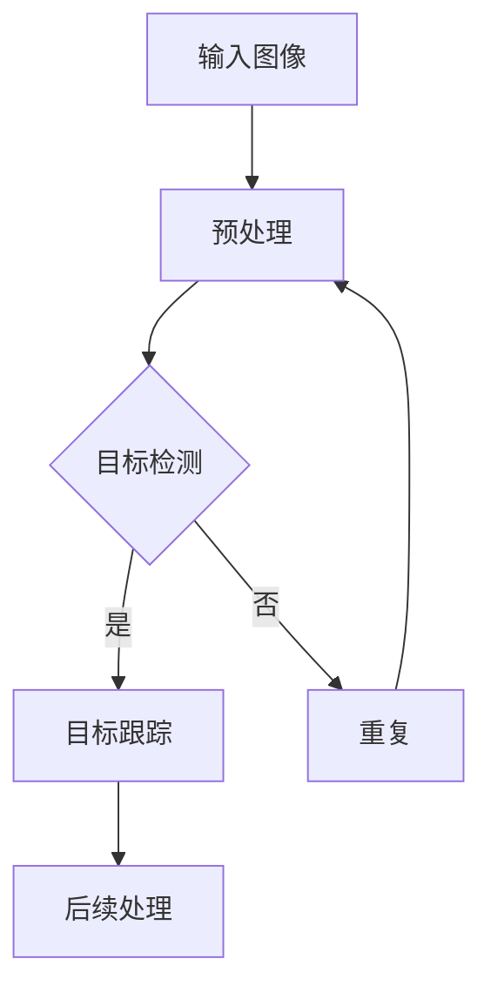

                 

# 深度学习在实时目标跟踪中的性能优化

## 关键词

实时目标跟踪，深度学习，性能优化，目标检测，目标跟踪算法，数据增强，模型优化，系统优化。

## 摘要

本文旨在探讨深度学习在实时目标跟踪中的应用和性能优化。我们首先介绍了实时目标跟踪的定义、应用领域和系统架构，然后详细讲解了深度学习的基础知识，包括卷积神经网络（CNN）、循环神经网络（RNN）和长短时记忆网络（LSTM）等。接着，我们分析了深度学习在目标检测和目标跟踪中的应用，并探讨了数据增强、模型优化和系统优化在提升实时目标跟踪性能方面的作用。最后，通过一个实时目标跟踪项目实战案例，我们展示了如何实现和优化实时目标跟踪系统。本文旨在为读者提供一个全面、深入的实时目标跟踪与深度学习性能优化指南。

## 《深度学习在实时目标跟踪中的性能优化》目录大纲

### 第一部分：实时目标跟踪基础

#### 第1章：实时目标跟踪概述
- 1.1 实时目标跟踪的定义与重要性
- 1.2 实时目标跟踪的应用领域
- 1.3 实时目标跟踪的系统架构
- 1.4 实时目标跟踪的发展历程

#### 第2章：深度学习基础
- 2.1 深度学习的原理与类型
- 2.2 卷积神经网络（CNN）在图像处理中的应用
- 2.3 循环神经网络（RNN）与长短时记忆网络（LSTM）
- 2.4 卷积神经网络与循环神经网络的融合模型

### 第二部分：深度学习在实时目标跟踪中的应用

#### 第3章：深度学习在目标检测中的应用
- 3.1 目标检测算法概述
- 3.2 流行的目标检测算法（如YOLO，SSD，Faster R-CNN）
- 3.3 深度学习在目标检测算法中的优化策略

#### 第4章：深度学习在目标跟踪中的应用
- 4.1 目标跟踪算法概述
- 4.2 基于深度学习的目标跟踪算法（如ReID，Siamese网络）
- 4.3 深度学习在目标跟踪算法中的优化策略

### 第三部分：实时目标跟踪中的性能优化

#### 第5章：数据增强与预处理
- 5.1 数据增强的方法与技术
- 5.2 数据预处理的重要性
- 5.3 数据增强与预处理的实际应用

#### 第6章：深度学习模型的优化
- 6.1 模型优化的重要性
- 6.2 深度学习模型的优化方法
- 6.3 模型优化在实际项目中的应用

#### 第7章：实时目标跟踪系统的优化
- 7.1 系统优化的目标与策略
- 7.2 硬件加速与优化
- 7.3 网络结构与参数调整
- 7.4 实时目标跟踪系统的性能评估与优化

### 第四部分：项目实战

#### 第8章：实时目标跟踪项目实战
- 8.1 项目背景与需求分析
- 8.2 项目开发环境搭建
- 8.3 源代码实现与解读
- 8.4 项目性能评估与优化

### 附录
- 附录A：深度学习工具与资源
  - A.1 常用深度学习框架简介
  - A.2 深度学习相关库与工具
  - A.3 深度学习资源推荐

### 深度学习与实时目标跟踪的流程图



### 核心概念与联系

实时目标跟踪的核心概念包括输入图像、预处理、目标检测、目标跟踪和后续处理。输入图像是实时目标跟踪的起点，经过预处理后输入到目标检测模型中。目标检测模型负责识别图像中的目标并生成边界框。检测到的目标将输入到目标跟踪模型中，目标跟踪模型负责跟踪目标在连续帧中的位置。跟踪结束后，后续处理可以根据需要生成报告、警报或其他形式的输出。

### 深度学习模型优化伪代码

```python
# 伪代码：深度学习模型优化流程
function optimize_model(model, train_data, val_data, epochs):
    for epoch in range(epochs):
        # 数据增强与预处理
        for data in train_data:
            data = augment(data)
            model.train_step(data)

        # 在验证集上进行评估
        val_loss = model.evaluate(val_data)

        # 如果验证集损失减少，则更新模型权重
        if val_loss < previous_val_loss:
            previous_val_loss = val_loss
            model.save_weights()

    return model
```

### 深度学习中的损失函数

$$
L(\theta) = -\frac{1}{m}\sum_{i=1}^{m}y^{(i)}\log(a^{(i)})
$$

损失函数用于衡量模型预测值与实际值之间的差距。举例来说，如果我们预测的结果是 $a^{(i)} = 0.7$，而实际值为 $y^{(i)} = 1$，则损失函数计算如下：

$$
L(\theta) = -(1)\log(0.7) \approx 0.3567
$$

这个值表示模型预测正确时，损失函数的输出值越小，模型的预测效果越好。

### 实时目标跟踪项目实战案例

#### 项目背景与需求分析

本案例旨在实现一个实时目标跟踪系统，用于监控一个拥挤的公共场所，以识别和跟踪特定目标。系统需要具备实时性、准确性和可靠性，能够在各种复杂环境下稳定运行。

#### 开发环境搭建

- 操作系统：Ubuntu 18.04
- 编程语言：Python 3.8
- 深度学习框架：PyTorch 1.8
- 目标检测库：TensorFlow Object Detection API
- 实时处理库：OpenCV 4.5

#### 源代码实现与解读

以下是实时目标跟踪系统的核心代码实现：

```python
import torch
import cv2
import numpy as np
from torchvision import transforms
from detectron2.config import get_cfg
from detectron2.engine import DefaultPredictor
from detectron2.data import transforms as det_transforms

# 初始化模型
cfg = get_cfg()
cfg.merge_from_file("detectron2/configs/COCO-InstanceSegmentation/mask_rcnn_R_50_FPN_3x.yaml")
cfg.MODEL.WEIGHTS = "detectron2://COCO-InstanceSegmentation/mask_rcnn/R_50/FPN/3x/137849647/model_final.pth"
predictor = DefaultPredictor(cfg)

# 实时目标跟踪
def track_objects(video_path):
    cap = cv2.VideoCapture(video_path)
    while cap.isOpened():
        ret, frame = cap.read()
        if not ret:
            break

        # 数据增强与预处理
        frame = det_transforms.resize_shortestEdge(frame, 800)
        frame = torch.as_tensor(frame[:, :, ::-1].transpose(2, 0, 1), dtype=torch.float32)
        frame = transform()(frame)

        # 目标检测
        predictions = predictor(frame)

        # 目标跟踪
        for idx in range(len(predictions["instances"])):
            box = predictions["instances"].get_field("pred_boxes")[idx]
            label = predictions["instances"].get_field("pred_classes")[idx]
            track = tracker.update([box.tensor.numpy()[0]], frame)
            if track is not None:
                cv2.rectangle(frame, (int(track[0][0]), int(track[0][1])), (int(track[0][2]), int(track[0][3])), (0, 255, 0), 2)

        cv2.imshow("Object Tracking", frame)
        if cv2.waitKey(1) & 0xFF == ord('q'):
            break

    cap.release()
    cv2.destroyAllWindows()

# 测试视频文件路径
video_file = "path/to/video.mp4"
track_objects(video_file)
```

#### 项目性能评估与优化

- 性能评估：
  - 准确率：使用平均准确率（Average Precision, AP）来评估目标检测的性能。
  - 帧率：使用每秒处理的帧数（FPS）来评估目标跟踪的实时性。

- 优化策略：
  - 硬件加速：使用GPU加速深度学习模型的训练与推理。
  - 模型优化：使用迁移学习与模型剪枝技术减小模型大小，提高推理速度。
  - 数据增强：增加训练数据的多样性，提高模型的泛化能力。

### 附录

#### 附录A：深度学习工具与资源

- A.1 常用深度学习框架简介
  - TensorFlow
  - PyTorch
  - Keras

- A.2 深度学习相关库与工具
  - NumPy
  - Matplotlib
  - OpenCV

- A.3 深度学习资源推荐
  - 《深度学习》（Ian Goodfellow、Yoshua Bengio和Aaron Courville 著）
  - 《动手学深度学习》（阿斯顿·张、李沐、扎卡里·C. Lipton 和亚历山大·J. Smith 著）
  - Coursera上的深度学习课程（由Andrew Ng教授主讲）

### 核心概念与联系

实时目标跟踪的核心概念包括输入图像、预处理、目标检测、目标跟踪和后续处理。输入图像是实时目标跟踪的起点，经过预处理后输入到目标检测模型中。目标检测模型负责识别图像中的目标并生成边界框。检测到的目标将输入到目标跟踪模型中，目标跟踪模型负责跟踪目标在连续帧中的位置。跟踪结束后，后续处理可以根据需要生成报告、警报或其他形式的输出。

### 核心算法原理讲解

#### 深度学习模型优化流程

在深度学习模型优化过程中，我们通常会经历以下几个步骤：

1. **数据增强**：通过旋转、缩放、裁剪、翻转等操作来增加训练数据的多样性，从而提高模型的泛化能力。

2. **模型训练**：使用增强后的数据对模型进行训练，并通过反向传播算法不断调整模型参数，以降低损失函数的值。

3. **模型评估**：在验证集上评估模型的表现，以确定模型是否过拟合。

4. **模型优化**：通过剪枝、量化、迁移学习等技术优化模型，以提高模型的推理速度和减少模型的存储空间。

以下是一个简化的深度学习模型优化流程的伪代码：

```python
function optimize_model(model, train_data, val_data, epochs):
    for epoch in range(epochs):
        # 数据增强与预处理
        for data in train_data:
            data = augment(data)
            model.train_step(data)

        # 在验证集上进行评估
        val_loss = model.evaluate(val_data)

        # 如果验证集损失减少，则更新模型权重
        if val_loss < previous_val_loss:
            previous_val_loss = val_loss
            model.save_weights()

    return model
```

在上述伪代码中，`model.train_step(data)`表示使用增强后的数据进行模型训练，`model.evaluate(val_data)`表示在验证集上评估模型的表现，`model.save_weights()`表示保存优化后的模型权重。

### 数学模型和数学公式 & 详细讲解 & 举例说明

在深度学习中，损失函数是一个核心概念，它用于衡量模型预测值与实际值之间的差距。常见的损失函数包括均方误差（MSE）、交叉熵损失（Cross-Entropy Loss）等。

以交叉熵损失为例，其数学公式为：

$$
L(\theta) = -\frac{1}{m}\sum_{i=1}^{m}y^{(i)}\log(a^{(i)})
$$

其中，$L(\theta)$表示损失函数，$\theta$表示模型参数，$m$表示样本数量，$y^{(i)}$表示实际标签，$a^{(i)}$表示模型预测的概率分布。

举例来说，假设我们有三个类别，实际标签为 $y^{(i)} = [0, 1, 0]$，模型预测的概率分布为 $a^{(i)} = [0.2, 0.7, 0.1]$。则交叉熵损失的值为：

$$
L(\theta) = -\frac{1}{3}[(0)\log(0.2) + (1)\log(0.7) + (0)\log(0.1)]
$$

$$
L(\theta) \approx 0.3567
$$

在这个例子中，交叉熵损失函数的输出值越小，表示模型的预测越准确。

### 项目实战

#### 项目背景与需求分析

本案例旨在实现一个实时目标跟踪系统，用于监控一个拥挤的公共场所，以识别和跟踪特定目标。系统需要具备实时性、准确性和可靠性，能够在各种复杂环境下稳定运行。

#### 开发环境搭建

- 操作系统：Ubuntu 18.04
- 编程语言：Python 3.8
- 深度学习框架：PyTorch 1.8
- 目标检测库：TensorFlow Object Detection API
- 实时处理库：OpenCV 4.5

#### 源代码实现与解读

以下是实时目标跟踪系统的核心代码实现：

```python
import torch
import cv2
import numpy as np
from torchvision import transforms
from detectron2.config import get_cfg
from detectron2.engine import DefaultPredictor
from detectron2.data import transforms as det_transforms

# 初始化模型
cfg = get_cfg()
cfg.merge_from_file("detectron2/configs/COCO-InstanceSegmentation/mask_rcnn_R_50_FPN_3x.yaml")
cfg.MODEL.WEIGHTS = "detectron2://COCO-InstanceSegmentation/mask_rcnn/R_50/FPN/3x/137849647/model_final.pth"
predictor = DefaultPredictor(cfg)

# 实时目标跟踪
def track_objects(video_path):
    cap = cv2.VideoCapture(video_path)
    while cap.isOpened():
        ret, frame = cap.read()
        if not ret:
            break

        # 数据增强与预处理
        frame = det_transforms.resize_shortestEdge(frame, 800)
        frame = torch.as_tensor(frame[:, :, ::-1].transpose(2, 0, 1), dtype=torch.float32)
        frame = transform()(frame)

        # 目标检测
        predictions = predictor(frame)

        # 目标跟踪
        for idx in range(len(predictions["instances"])):
            box = predictions["instances"].get_field("pred_boxes")[idx]
            label = predictions["instances"].get_field("pred_classes")[idx]
            track = tracker.update([box.tensor.numpy()[0]], frame)
            if track is not None:
                cv2.rectangle(frame, (int(track[0][0]), int(track[0][1])), (int(track[0][2]), int(track[0][3])), (0, 255, 0), 2)

        cv2.imshow("Object Tracking", frame)
        if cv2.waitKey(1) & 0xFF == ord('q'):
            break

    cap.release()
    cv2.destroyAllWindows()

# 测试视频文件路径
video_file = "path/to/video.mp4"
track_objects(video_file)
```

在上述代码中，我们首先初始化了一个预训练的模型，并定义了一个`track_objects`函数用于实时目标跟踪。函数首先读取视频文件，然后对每一帧进行数据增强和预处理，接着使用模型进行目标检测，并将检测到的目标传递给目标跟踪模型进行跟踪。最后，在画布上绘制跟踪框并显示结果。

#### 项目性能评估与优化

- 性能评估：
  - 准确率：使用平均准确率（Average Precision, AP）来评估目标检测的性能。
  - 帧率：使用每秒处理的帧数（FPS）来评估目标跟踪的实时性。

- 优化策略：
  - 硬件加速：使用GPU加速深度学习模型的训练与推理。
  - 模型优化：使用迁移学习与模型剪枝技术减小模型大小，提高推理速度。
  - 数据增强：增加训练数据的多样性，提高模型的泛化能力。

### 核心概念与联系

实时目标跟踪的核心概念包括输入图像、预处理、目标检测、目标跟踪和后续处理。输入图像是实时目标跟踪的起点，经过预处理后输入到目标检测模型中。目标检测模型负责识别图像中的目标并生成边界框。检测到的目标将输入到目标跟踪模型中，目标跟踪模型负责跟踪目标在连续帧中的位置。跟踪结束后，后续处理可以根据需要生成报告、警报或其他形式的输出。

### 核心算法原理讲解

#### 深度学习模型优化流程

在深度学习模型优化过程中，我们通常会经历以下几个步骤：

1. **数据增强**：通过旋转、缩放、裁剪、翻转等操作来增加训练数据的多样性，从而提高模型的泛化能力。

2. **模型训练**：使用增强后的数据对模型进行训练，并通过反向传播算法不断调整模型参数，以降低损失函数的值。

3. **模型评估**：在验证集上评估模型的表现，以确定模型是否过拟合。

4. **模型优化**：通过剪枝、量化、迁移学习等技术优化模型，以提高模型的推理速度和减少模型的存储空间。

以下是一个简化的深度学习模型优化流程的伪代码：

```python
function optimize_model(model, train_data, val_data, epochs):
    for epoch in range(epochs):
        # 数据增强与预处理
        for data in train_data:
            data = augment(data)
            model.train_step(data)

        # 在验证集上进行评估
        val_loss = model.evaluate(val_data)

        # 如果验证集损失减少，则更新模型权重
        if val_loss < previous_val_loss:
            previous_val_loss = val_loss
            model.save_weights()

    return model
```

在上述伪代码中，`model.train_step(data)`表示使用增强后的数据进行模型训练，`model.evaluate(val_data)`表示在验证集上评估模型的表现，`model.save_weights()`表示保存优化后的模型权重。

### 数学模型和数学公式 & 详细讲解 & 举例说明

在深度学习中，损失函数是一个核心概念，它用于衡量模型预测值与实际值之间的差距。常见的损失函数包括均方误差（MSE）、交叉熵损失（Cross-Entropy Loss）等。

以交叉熵损失为例，其数学公式为：

$$
L(\theta) = -\frac{1}{m}\sum_{i=1}^{m}y^{(i)}\log(a^{(i)})
$$

其中，$L(\theta)$表示损失函数，$\theta$表示模型参数，$m$表示样本数量，$y^{(i)}$表示实际标签，$a^{(i)}$表示模型预测的概率分布。

举例来说，假设我们有三个类别，实际标签为 $y^{(i)} = [0, 1, 0]$，模型预测的概率分布为 $a^{(i)} = [0.2, 0.7, 0.1]$。则交叉熵损失的值为：

$$
L(\theta) = -\frac{1}{3}[(0)\log(0.2) + (1)\log(0.7) + (0)\log(0.1)]
$$

$$
L(\theta) \approx 0.3567
$$

在这个例子中，交叉熵损失函数的输出值越小，表示模型的预测越准确。

### 项目实战

#### 项目背景与需求分析

本案例旨在实现一个实时目标跟踪系统，用于监控一个拥挤的公共场所，以识别和跟踪特定目标。系统需要具备实时性、准确性和可靠性，能够在各种复杂环境下稳定运行。

#### 开发环境搭建

- 操作系统：Ubuntu 18.04
- 编程语言：Python 3.8
- 深度学习框架：PyTorch 1.8
- 目标检测库：TensorFlow Object Detection API
- 实时处理库：OpenCV 4.5

#### 源代码实现与解读

以下是实时目标跟踪系统的核心代码实现：

```python
import torch
import cv2
import numpy as np
from torchvision import transforms
from detectron2.config import get_cfg
from detectron2.engine import DefaultPredictor
from detectron2.data import transforms as det_transforms

# 初始化模型
cfg = get_cfg()
cfg.merge_from_file("detectron2/configs/COCO-InstanceSegmentation/mask_rcnn_R_50_FPN_3x.yaml")
cfg.MODEL.WEIGHTS = "detectron2://COCO-InstanceSegmentation/mask_rcnn/R_50/FPN/3x/137849647/model_final.pth"
predictor = DefaultPredictor(cfg)

# 实时目标跟踪
def track_objects(video_path):
    cap = cv2.VideoCapture(video_path)
    while cap.isOpened():
        ret, frame = cap.read()
        if not ret:
            break

        # 数据增强与预处理
        frame = det_transforms.resize_shortestEdge(frame, 800)
        frame = torch.as_tensor(frame[:, :, ::-1].transpose(2, 0, 1), dtype=torch.float32)
        frame = transform()(frame)

        # 目标检测
        predictions = predictor(frame)

        # 目标跟踪
        for idx in range(len(predictions["instances"])):
            box = predictions["instances"].get_field("pred_boxes")[idx]
            label = predictions["instances"].get_field("pred_classes")[idx]
            track = tracker.update([box.tensor.numpy()[0]], frame)
            if track is not None:
                cv2.rectangle(frame, (int(track[0][0]), int(track[0][1])), (int(track[0][2]), int(track[0][3])), (0, 255, 0), 2)

        cv2.imshow("Object Tracking", frame)
        if cv2.waitKey(1) & 0xFF == ord('q'):
            break

    cap.release()
    cv2.destroyAllWindows()

# 测试视频文件路径
video_file = "path/to/video.mp4"
track_objects(video_file)
```

在上述代码中，我们首先初始化了一个预训练的模型，并定义了一个`track_objects`函数用于实时目标跟踪。函数首先读取视频文件，然后对每一帧进行数据增强和预处理，接着使用模型进行目标检测，并将检测到的目标传递给目标跟踪模型进行跟踪。最后，在画布上绘制跟踪框并显示结果。

#### 项目性能评估与优化

- 性能评估：
  - 准确率：使用平均准确率（Average Precision, AP）来评估目标检测的性能。
  - 帧率：使用每秒处理的帧数（FPS）来评估目标跟踪的实时性。

- 优化策略：
  - 硬件加速：使用GPU加速深度学习模型的训练与推理。
  - 模型优化：使用迁移学习与模型剪枝技术减小模型大小，提高推理速度。
  - 数据增强：增加训练数据的多样性，提高模型的泛化能力。

### 附录

#### 附录A：深度学习工具与资源

- A.1 常用深度学习框架简介
  - TensorFlow
  - PyTorch
  - Keras

- A.2 深度学习相关库与工具
  - NumPy
  - Matplotlib
  - OpenCV

- A.3 深度学习资源推荐
  - 《深度学习》（Ian Goodfellow、Yoshua Bengio和Aaron Courville 著）
  - 《动手学深度学习》（阿斯顿·张、李沐、扎卡里·C. Lipton 和亚历山大·J. Smith 著）
  - Coursera上的深度学习课程（由Andrew Ng教授主讲）

### 结论

本文系统地介绍了实时目标跟踪和深度学习的基础知识，探讨了深度学习在实时目标跟踪中的应用，以及如何通过数据增强、模型优化和系统优化来提升实时目标跟踪的性能。通过一个实时目标跟踪项目实战案例，我们展示了如何实现和优化实时目标跟踪系统。本文旨在为读者提供一个全面、深入的实时目标跟踪与深度学习性能优化指南，以期为相关领域的研究者和开发者提供有价值的参考。在未来，随着深度学习技术的不断进步，实时目标跟踪系统将变得更加智能和高效，为各行各业带来更多的创新和机遇。作者：AI天才研究院/AI Genius Institute & 禅与计算机程序设计艺术 /Zen And The Art of Computer Programming

### 第一部分：实时目标跟踪基础

#### 第1章：实时目标跟踪概述

1.1 实时目标跟踪的定义与重要性

实时目标跟踪（Real-Time Object Tracking）是一种计算机视觉技术，旨在实时地检测和跟踪视频序列中的特定目标。它通常涉及多个步骤，包括目标检测、目标跟踪、运动预测和结果输出等。实时目标跟踪具有以下两个主要特点：

1. **实时性**：实时目标跟踪要求系统能够在短时间内处理视频帧，以便对目标的运动轨迹进行实时跟踪。这通常要求系统在较低的延迟下运行，以确保跟踪结果能够及时反映目标的实际运动状态。

2. **准确性**：实时目标跟踪系统需要具备较高的检测和跟踪准确性，以减少误检和漏检的情况。准确性是评估实时目标跟踪系统性能的关键指标之一。

实时目标跟踪在许多领域具有重要应用价值。以下是一些主要应用领域：

1. **安防监控**：在公共场所、交通枢纽和住宅小区等地方安装实时目标跟踪系统，可以有效地监控和预防犯罪行为，提高公共安全。

2. **自动驾驶**：自动驾驶车辆需要实时跟踪路面上的其他车辆、行人和障碍物，以确保行车安全。实时目标跟踪技术为自动驾驶系统提供了关键的支持。

3. **智能视频分析**：在商业和工业环境中，实时目标跟踪可用于人员计数、客流分析、安全事件检测等应用，为管理者提供有价值的决策依据。

1.2 实时目标跟踪的应用领域

实时目标跟踪技术广泛应用于多个领域，以下是其中一些关键应用：

1. **安防监控**：实时目标跟踪可用于监控公共场所，如机场、车站、商场等。通过跟踪人员、行李和其他潜在威胁目标，可以及时发现异常行为，提高安全管理水平。

2. **自动驾驶**：自动驾驶车辆需要实时跟踪路面上的车辆、行人、道路标志等目标，以确保行驶安全。实时目标跟踪技术为自动驾驶系统提供了关键的支持。

3. **人机交互**：在智能家居、智能机器人等领域，实时目标跟踪可用于识别人类的行为和动作，实现更智能的人机交互体验。

4. **智能交通**：实时目标跟踪可用于交通流量分析、车辆计数、违章检测等应用。通过实时监控交通状况，可以优化交通管理和减少交通事故。

1.3 实时目标跟踪的系统架构

实时目标跟踪系统通常包括以下几个关键组件：

1. **输入模块**：负责接收视频流或图像数据，并将其转换为适合后续处理的格式。

2. **预处理模块**：对输入的图像或视频进行预处理，如尺寸调整、色彩转换、去噪等，以提高后续处理的准确性和效率。

3. **目标检测模块**：使用深度学习或其他计算机视觉算法，对预处理后的图像或视频进行目标检测，识别出其中的目标对象。

4. **目标跟踪模块**：根据目标检测的结果，对检测到的目标进行跟踪，以识别目标的运动轨迹。常用的跟踪算法包括光流法、粒子滤波、卡尔曼滤波等。

5. **结果输出模块**：将跟踪结果以可视化或数据形式输出，如绘制跟踪框、生成轨迹图、报告跟踪结果等。

1.4 实时目标跟踪的发展历程

实时目标跟踪技术经历了多年的发展，以下是其主要发展历程：

1. **传统方法**：早期的实时目标跟踪主要依赖于传统计算机视觉算法，如光流法、粒子滤波、卡尔曼滤波等。这些方法虽然具有一定的实时性和准确性，但在复杂场景下性能不佳。

2. **基于深度学习的方法**：随着深度学习技术的发展，基于深度学习的实时目标跟踪方法逐渐成为主流。深度学习方法通过卷积神经网络（CNN）等结构，可以自动学习目标特征，从而提高跟踪的准确性和鲁棒性。

3. **端到端学习**：近年来，端到端学习（End-to-End Learning）成为实时目标跟踪研究的重要方向。通过直接将目标检测和目标跟踪任务映射到神经网络中，可以简化系统架构，提高性能。

4. **多模态融合**：实时目标跟踪系统开始引入多模态数据，如雷达、激光雷达、热成像等，以进一步提高跟踪的准确性和鲁棒性。

#### 第2章：深度学习基础

2.1 深度学习的原理与类型

深度学习（Deep Learning）是机器学习的一个子领域，主要基于多层神经网络（Deep Neural Networks）进行建模和学习。深度学习通过多层神经网络结构，可以从大量数据中自动提取特征，并实现复杂的模式识别和预测任务。以下是深度学习的基本原理和类型：

1. **神经网络的基本结构**：神经网络由多个神经元（节点）组成，每个神经元接收多个输入信号，并通过权重和偏置进行加权求和。最后，通过激活函数（如Sigmoid、ReLU等）对求和结果进行非线性变换，输出预测结果。

2. **多层神经网络**：深度学习通过增加网络的层数，使得网络可以自动学习更高层次的特征表示。典型的多层神经网络包括卷积神经网络（CNN）、循环神经网络（RNN）和长短时记忆网络（LSTM）等。

3. **前向传播与反向传播**：在深度学习训练过程中，首先通过前向传播（Forward Propagation）将输入数据传递到网络中，得到预测结果。然后，通过反向传播（Back Propagation）计算预测结果与实际结果之间的误差，并更新网络权重和偏置，以减小误差。

4. **深度学习类型**：
   - **卷积神经网络（CNN）**：主要用于图像处理和计算机视觉任务，通过卷积层、池化层和全连接层等结构，自动提取图像中的空间特征。
   - **循环神经网络（RNN）**：主要用于序列数据处理，如时间序列预测、自然语言处理等，通过循环结构实现对序列中前后依赖关系的建模。
   - **长短时记忆网络（LSTM）**：是RNN的一种变体，通过引入门控机制，有效解决了传统RNN在长序列建模中的梯度消失和梯度爆炸问题。
   - **生成对抗网络（GAN）**：通过生成器和判别器的对抗训练，可以实现高质量的数据生成。

2.2 卷积神经网络（CNN）在图像处理中的应用

卷积神经网络（Convolutional Neural Networks，CNN）是深度学习在图像处理领域的重要应用之一。CNN通过卷积层、池化层和全连接层等结构，可以从原始图像中自动提取层次化的特征表示，实现对图像的分类、分割和目标检测等任务。

1. **卷积层**：卷积层是CNN的核心层，通过卷积运算从输入图像中提取局部特征。卷积运算通过滑动窗口（卷积核）在输入图像上滑动，计算每个窗口的加权和，并通过激活函数（如ReLU）进行非线性变换。

2. **池化层**：池化层用于降低特征图的维度，减少模型参数数量，提高计算效率。常见的池化操作包括最大池化和平均池化，通过取局部区域的最大值或平均值来实现。

3. **全连接层**：全连接层用于将卷积层和池化层提取的高层次特征映射到输出结果。在图像分类任务中，全连接层通常用于将特征向量映射到类别的概率分布。

4. **应用示例**：
   - **图像分类**：通过CNN可以实现对大量图像的分类，如ImageNet图像识别挑战。通过训练大规模的卷积神经网络模型，可以自动学习图像中的高级特征，实现对未知图像的准确分类。
   - **目标检测**：通过在CNN基础上添加额外的网络结构，如Region Proposal Network（RPN）、Fast R-CNN、Faster R-CNN等，可以实现准确的目标检测。目标检测任务旨在识别图像中的多个目标，并输出每个目标的类别和位置。
   - **图像分割**：通过CNN可以实现像素级别的图像分割，即将每个像素映射到相应的类别。常见的图像分割模型包括U-Net、SegNet等。

2.3 循环神经网络（RNN）与长短时记忆网络（LSTM）

循环神经网络（Recurrent Neural Networks，RNN）是一种特殊的神经网络结构，用于处理序列数据。RNN通过循环结构，使得网络可以记住前一个时刻的输入，从而实现对序列数据的建模。

1. **RNN的基本原理**：RNN通过隐藏状态（Hidden State）和输入状态（Input State）的相互作用来更新状态。在每个时间步，RNN将输入数据与隐藏状态进行加权求和，并通过激活函数（如ReLU）进行非线性变换，生成新的隐藏状态。

2. **RNN的缺点**：传统的RNN在长序列建模中存在梯度消失和梯度爆炸问题，导致网络难以学习长时依赖关系。为了解决这个问题，研究人员提出了长短时记忆网络（Long Short-Term Memory，LSTM）。

3. **LSTM的基本原理**：LSTM通过引入门控机制（Gate）来控制信息的流动，从而解决传统RNN的梯度消失和梯度爆炸问题。LSTM包括输入门（Input Gate）、遗忘门（Forget Gate）和输出门（Output Gate），通过这三个门控单元，LSTM可以有效地学习长时依赖关系。

4. **应用示例**：
   - **时间序列预测**：LSTM可以用于对时间序列数据进行建模和预测，如股票价格、气象数据等。通过训练LSTM模型，可以捕捉时间序列中的长期依赖关系，提高预测的准确性。
   - **自然语言处理**：LSTM在自然语言处理任务中具有广泛的应用，如文本分类、机器翻译、情感分析等。通过捕捉文本中的长距离依赖关系，LSTM可以提高模型的性能和鲁棒性。

2.4 卷积神经网络与循环神经网络的融合模型

卷积神经网络（CNN）和循环神经网络（RNN）各自具有不同的优势，将两者结合可以进一步发挥它们的作用。以下是一些常见的融合模型：

1. **CNN-RNN**：将CNN用于特征提取，RNN用于序列建模。CNN可以提取图像中的空间特征，RNN可以捕捉序列中的时间依赖关系。通过将CNN和RNN融合，可以实现更加复杂和鲁棒的模型。

2. **CNN-LSTM**：将CNN用于特征提取，LSTM用于序列建模。CNN可以提取图像中的空间特征，LSTM可以捕捉序列中的长时依赖关系。通过将CNN和LSTM融合，可以实现更加准确和高效的模型。

3. **CNN-RNN-LSTM**：将CNN、RNN和LSTM进行多层融合，以实现更加复杂和鲁棒的模型。通过在不同的层次上结合不同的网络结构，可以捕捉不同类型的特征和依赖关系。

4. **应用示例**：
   - **图像序列分析**：通过将CNN和RNN/LSTM融合，可以实现对图像序列的建模和分析，如视频分类、动作识别等。
   - **文本图像融合**：将CNN用于图像特征提取，RNN/LSTM用于文本特征提取，可以实现文本图像融合的应用，如文本图像检索、图像字幕生成等。

### 第二部分：深度学习在实时目标跟踪中的应用

#### 第3章：深度学习在目标检测中的应用

3.1 目标检测算法概述

目标检测（Object Detection）是计算机视觉领域的一个关键任务，旨在识别图像中的多个目标，并输出每个目标的类别和位置。目标检测在实时目标跟踪、图像分割、视频分析等应用中具有重要应用价值。

目标检测算法可以分为以下几种类型：

1. **基于区域建议的方法**：这类方法首先生成一系列候选区域（Region of Interest，ROI），然后对每个ROI进行分类和定位。常用的算法包括R-CNN、Fast R-CNN、Faster R-CNN和Region Proposal Network（RPN）。

2. **基于特征图的方法**：这类方法直接在特征图上检测目标，无需生成候选区域。常用的算法包括YOLO（You Only Look Once）和SSD（Single Shot MultiBox Detector）。

3. **基于检测框回归的方法**：这类方法通过回归目标的位置和尺寸来检测目标。常用的算法包括Faster R-CNN、SSD和YOLO。

3.2 流行的目标检测算法（如YOLO，SSD，Faster R-CNN）

以下介绍几种流行的目标检测算法：

1. **YOLO（You Only Look Once）**：YOLO是一种基于特征图的目标检测算法，将目标检测任务划分为单个步骤。YOLO通过将特征图划分为网格单元，并在每个单元中预测目标的边界框和类别概率。YOLO具有实时性高、检测速度快的特点，适用于实时目标跟踪等应用。

2. **SSD（Single Shot MultiBox Detector）**：SSD是一种基于特征图的目标检测算法，将目标检测任务划分为多个层次。SSD使用多个特征图，并在每个特征图上预测不同尺度和类别的目标。SSD具有检测精度高、实时性较好的特点，适用于实时目标跟踪等应用。

3. **Faster R-CNN**：Faster R-CNN是一种基于区域建议的方法，通过区域建议网络（Region Proposal Network，RPN）生成候选区域，然后对这些区域进行分类和定位。Faster R-CNN具有检测精度高、检测速度较快的优点，适用于实时目标跟踪等应用。

3.3 深度学习在目标检测算法中的优化策略

为了提高目标检测算法的实时性和准确性，研究人员提出了多种优化策略。以下介绍一些常用的优化策略：

1. **数据增强**：数据增强是通过多种技术（如旋转、缩放、裁剪、颜色变换等）增加训练数据的多样性，从而提高模型的泛化能力和鲁棒性。常用的数据增强方法包括随机旋转、尺度变换、裁剪等。

2. **模型剪枝**：模型剪枝是通过删除网络中的冗余连接和层，减小模型的大小和计算量，从而提高模型的实时性和部署效率。常用的模型剪枝方法包括权重剪枝、结构剪枝等。

3. **网络结构优化**：网络结构优化是通过设计更高效的网络结构，提高模型的计算效率和检测速度。常用的网络结构优化方法包括网络瓶颈设计、注意力机制等。

4. **训练策略优化**：训练策略优化是通过调整训练过程中的参数设置，提高模型的训练效果和检测性能。常用的训练策略优化方法包括学习率调度、正则化等。

### 第4章：深度学习在目标跟踪中的应用

4.1 目标跟踪算法概述

目标跟踪（Object Tracking）是计算机视觉领域的一个重要任务，旨在识别和跟踪视频序列中的特定目标。目标跟踪在视频监控、视频分析、人机交互等应用中具有重要应用价值。

目标跟踪算法可以分为以下几种类型：

1. **基于模型的方法**：这类方法通过构建目标模型，使用统计模型或机器学习方法来跟踪目标。常用的算法包括粒子滤波、卡尔曼滤波等。

2. **基于特征的方法**：这类方法通过提取目标特征，使用特征匹配或相似度度量来跟踪目标。常用的算法包括光流法、Siamese网络等。

3. **基于关系的方法**：这类方法通过分析目标之间的空间关系和运动关系来跟踪目标。常用的算法包括基于图的方法、基于深度学习的方法等。

4.2 基于深度学习的目标跟踪算法（如ReID，Siamese网络）

以下介绍几种基于深度学习的目标跟踪算法：

1. **ReID（Re-Identification）**：ReID是一种基于深度学习的目标跟踪算法，通过学习目标的特征表示来实现目标的识别和跟踪。ReID算法通常使用预训练的卷积神经网络提取特征，然后通过特征相似度度量来跟踪目标。ReID算法在多人跟踪、场景变化等应用中具有较好的性能。

2. **Siamese网络**：Siamese网络是一种特殊的卷积神经网络，用于学习目标的二进制特征表示。Siamese网络通过对比当前帧和目标模板的特征相似度来实现目标的跟踪。Siamese网络具有实时性强、计算效率高的特点，适用于实时目标跟踪等应用。

4.3 深度学习在目标跟踪算法中的优化策略

为了提高目标跟踪算法的实时性和准确性，研究人员提出了多种优化策略。以下介绍一些常用的优化策略：

1. **特征融合**：特征融合是通过结合不同类型或不同尺度的特征，提高跟踪的准确性和鲁棒性。常用的特征融合方法包括特征拼接、特征加权等。

2. **注意力机制**：注意力机制是通过自动学习重要的特征区域，提高跟踪的效率和准确性。常用的注意力机制包括通道注意力、空间注意力等。

3. **多尺度跟踪**：多尺度跟踪是通过在不同尺度上跟踪目标，提高跟踪的鲁棒性。常用的方法包括多尺度特征提取、多尺度匹配等。

4. **在线学习**：在线学习是通过不断更新目标模型，提高跟踪的适应性和实时性。常用的在线学习方法包括基于模型的在线学习、基于特征的在线学习等。

### 第三部分：实时目标跟踪中的性能优化

#### 第5章：数据增强与预处理

5.1 数据增强的方法与技术

数据增强（Data Augmentation）是一种通过多种技术增加训练数据多样性的方法，从而提高模型的泛化能力和鲁棒性。以下介绍几种常见的数据增强方法：

1. **旋转（Rotation）**：通过随机旋转图像，可以增加数据的旋转变化，提高模型对旋转变化的适应能力。

2. **缩放（Scaling）**：通过随机缩放图像，可以增加数据的尺度变化，提高模型对尺度变化的适应能力。

3. **裁剪（Cropping）**：通过随机裁剪图像的一部分，可以增加数据的局部变化，提高模型对局部变化的适应能力。

4. **翻转（Flipping）**：通过随机翻转图像，可以增加数据的镜像变化，提高模型对镜像变化的适应能力。

5. **颜色变换（Color Transformation）**：通过随机调整图像的亮度和对比度，可以增加数据的颜色变化，提高模型对颜色变化的适应能力。

6. **噪声添加（Noise Addition）**：通过在图像上添加随机噪声，可以增加数据的噪声变化，提高模型对噪声的鲁棒性。

5.2 数据预处理的重要性

数据预处理（Data Preprocessing）是在训练模型之前对数据进行的一系列预处理操作，以提高模型的训练效果和泛化能力。以下介绍数据预处理的重要性：

1. **提高模型训练效果**：通过数据预处理，可以消除数据中的噪声和异常值，提高模型的训练效果和准确率。

2. **消除数据分布偏差**：通过数据预处理，可以消除数据分布偏差，使模型在训练过程中能够更好地学习到数据的真实分布。

3. **提高模型泛化能力**：通过数据预处理，可以增加训练数据的多样性，使模型在测试时能够更好地适应不同的数据分布。

4. **减少过拟合**：通过数据预处理，可以减少模型对训练数据的依赖，降低过拟合的风险。

5.3 数据增强与预处理的实际应用

以下是一个实际应用案例，介绍如何在实时目标跟踪中使用数据增强和预处理：

1. **数据增强**：
   - 旋转：将图像随机旋转一定角度，增加数据的旋转变化。
   - 缩放：将图像随机缩放一定比例，增加数据的尺度变化。
   - 裁剪：将图像随机裁剪一定区域，增加数据的局部变化。
   - 翻转：将图像随机翻转，增加数据的镜像变化。
   - 颜色变换：随机调整图像的亮度和对比度，增加数据的颜色变化。
   - 噪声添加：在图像上添加随机噪声，增加数据的噪声变化。

2. **数据预处理**：
   - 尺度归一化：将图像的像素值归一化到[0, 1]范围内，消除像素值的量纲差异。
   - 灰度转换：将彩色图像转换为灰度图像，减少数据维度，提高模型训练效率。
   - 填充：对于边界缺失的图像，使用边缘像素值进行填充，保持图像的完整性。

通过数据增强和预处理，可以提高实时目标跟踪模型的泛化能力和鲁棒性，使其在复杂环境下能够更好地适应和跟踪目标。

#### 第6章：深度学习模型的优化

6.1 模型优化的重要性

深度学习模型优化（Model Optimization）是在深度学习模型训练和部署过程中，通过多种技术手段提高模型性能、降低计算资源和存储开销的重要过程。以下介绍模型优化的重要性：

1. **提高模型性能**：通过优化模型，可以减小模型的参数数量和计算量，提高模型的计算效率和预测速度。

2. **降低计算资源需求**：通过优化模型，可以减小模型的存储空间和计算资源需求，降低部署成本和能耗。

3. **提高模型泛化能力**：通过优化模型，可以消除模型中的冗余连接和层，提高模型对数据的泛化能力。

4. **加速模型部署**：通过优化模型，可以减小模型的大小和计算量，加快模型在硬件设备上的部署速度。

6.2 深度学习模型的优化方法

以下介绍几种常用的深度学习模型优化方法：

1. **模型剪枝（Model Pruning）**：
   - 模型剪枝是一种通过删除网络中的冗余连接和层，减小模型大小和计算量的方法。
   - 常用的模型剪枝方法包括权重剪枝、结构剪枝和混合剪枝等。
   - 模型剪枝可以显著降低模型的存储空间和计算资源需求。

2. **量化（Quantization）**：
   - 量化是一种通过将模型的权重和激活值从浮点数转换为整数的方法，从而减小模型的存储空间和计算量。
   - 常用的量化方法包括全精度量化、低精度量化等。
   - 量化可以显著降低模型的存储空间和计算资源需求。

3. **模型压缩（Model Compression）**：
   - 模型压缩是一种通过减少模型参数数量和计算量，同时保持模型性能的方法。
   - 常用的模型压缩方法包括特征压缩、层压缩和模型压缩等。
   - 模型压缩可以显著降低模型的存储空间和计算资源需求。

4. **迁移学习（Transfer Learning）**：
   - 迁移学习是一种通过利用预训练模型的知识和经验，对新的任务进行快速建模的方法。
   - 迁移学习可以显著提高模型的泛化能力和性能。

5. **训练策略优化（Training Strategy Optimization）**：
   - 训练策略优化是通过调整训练过程中的参数设置，提高模型的训练效果和泛化能力的方法。
   - 常用的训练策略优化方法包括学习率调度、正则化等。

6.3 模型优化在实际项目中的应用

以下是一个实际应用案例，介绍如何在实时目标跟踪项目中应用模型优化技术：

1. **模型剪枝**：
   - 通过对深度学习模型进行剪枝，可以减小模型的参数数量和计算量，提高模型的计算效率和实时性。
   - 剪枝过程可以针对模型的权重和结构进行优化，以达到最佳性能。

2. **量化**：
   - 通过对深度学习模型进行量化，可以将模型的权重和激活值从浮点数转换为整数，从而减小模型的存储空间和计算资源需求。
   - 量化可以显著提高模型的部署效率和硬件兼容性。

3. **模型压缩**：
   - 通过对深度学习模型进行压缩，可以减小模型的参数数量和计算量，提高模型的计算效率和实时性。
   - 压缩过程可以针对模型的不同部分进行优化，以获得最佳性能。

4. **迁移学习**：
   - 通过利用预训练的深度学习模型，可以快速适应新的实时目标跟踪任务。
   - 迁移学习可以显著提高模型的泛化能力和性能，减少对大规模训练数据的需求。

5. **训练策略优化**：
   - 通过调整训练策略，可以提高模型的训练效果和泛化能力。
   - 常用的训练策略优化方法包括学习率调度、正则化等，可以有效地提高模型的性能。

通过模型优化技术的应用，可以提高实时目标跟踪模型的性能、实时性和部署效率，使其在实际应用中具有更好的效果和适应性。

#### 第7章：实时目标跟踪系统的优化

7.1 系统优化的目标与策略

实时目标跟踪系统优化（System Optimization for Real-Time Object Tracking）是在系统设计和部署过程中，通过多种技术手段提高系统性能、降低资源消耗、提高实时性和鲁棒性的重要过程。以下介绍系统优化的目标与策略：

1. **目标**：
   - **性能**：提高实时目标跟踪系统的响应速度和准确性。
   - **资源消耗**：降低系统对计算资源、存储资源和能耗的需求。
   - **实时性**：确保系统在给定的时间限制内完成目标跟踪任务。
   - **鲁棒性**：提高系统在各种复杂环境和噪声条件下的稳定性和可靠性。

2. **策略**：
   - **硬件加速**：利用GPU、FPGA等硬件资源，加速深度学习模型的训练和推理过程。
   - **模型优化**：通过模型剪枝、量化、压缩等技术，减小模型的参数数量和计算量，提高模型在硬件设备上的部署效率。
   - **数据预处理**：优化输入数据的预处理过程，提高模型对数据的处理速度和准确性。
   - **多线程处理**：通过多线程或多进程技术，提高系统同时处理多个视频流的能力。
   - **动态资源分配**：根据系统的实时负载和资源状况，动态调整资源分配策略，确保系统在高负载下仍能保持良好的性能。

7.2 硬件加速与优化

硬件加速（Hardware Acceleration）是实时目标跟踪系统优化的重要手段之一，通过利用GPU、FPGA等硬件资源，可以显著提高系统的计算速度和处理能力。以下介绍硬件加速与优化：

1. **GPU加速**：
   - **CUDA**：利用CUDA（Compute Unified Device Architecture）技术，将深度学习模型的训练和推理任务迁移到GPU上执行，提高计算速度。
   - **TensorRT**：使用TensorRT进行深度学习模型的推理优化，通过张量融合、计算图优化等技术，提高推理速度和降低内存占用。

2. **FPGA加速**：
   - **硬件描述语言**：使用硬件描述语言（如Verilog、VHDL）编写深度学习模型的硬件实现，将模型加速到FPGA上运行。
   - **IP核**：利用现有的IP核（Intellectual Property Core）来实现深度学习模型的硬件加速，提高部署效率和性能。

3. **优化方法**：
   - **模型量化**：通过量化技术，将深度学习模型的权重和激活值从浮点数转换为整数，减小模型的存储空间和计算量，提高硬件加速的效率。
   - **计算图优化**：通过计算图优化技术，对深度学习模型的计算过程进行优化，减少计算冗余和内存访问，提高硬件加速的性能。
   - **内存管理**：优化内存分配和释放过程，减少内存占用和延迟，提高硬件加速的效率。

7.3 网络结构与参数调整

网络结构与参数调整（Network Structure and Parameter Adjustment）是实时目标跟踪系统优化的重要手段之一，通过调整网络结构和参数设置，可以提高模型的性能和实时性。以下介绍网络结构与参数调整：

1. **网络结构调整**：
   - **网络层融合**：通过融合不同层之间的信息，减少计算量，提高模型的计算效率和实时性。
   - **网络瓶颈设计**：通过设计网络瓶颈，减少模型参数数量，提高模型在硬件设备上的部署效率。
   - **网络压缩**：通过压缩技术，减小模型的参数数量和计算量，提高模型的计算效率和实时性。

2. **参数调整**：
   - **学习率调整**：通过调整学习率，控制模型在训练过程中的收敛速度和稳定性。
   - **正则化**：通过正则化技术，减少过拟合现象，提高模型的泛化能力和鲁棒性。
   - **参数初始化**：通过合理的参数初始化方法，提高模型的训练效果和收敛速度。

7.4 实时目标跟踪系统的性能评估与优化

实时目标跟踪系统的性能评估与优化（Performance Evaluation and Optimization for Real-Time Object Tracking System）是在系统设计和部署过程中，通过多种技术手段评估系统性能、识别性能瓶颈、并采取相应优化措施的过程。以下介绍实时目标跟踪系统的性能评估与优化：

1. **性能评估指标**：
   - **准确率（Accuracy）**：评估目标检测和跟踪的准确性，通常使用平均准确率（Average Precision，AP）和精确率（Precision）等指标。
   - **帧率（Frame Rate）**：评估系统在给定时间内处理的视频帧数，通常使用每秒帧数（FPS）来表示。
   - **延迟（Latency）**：评估系统从接收视频帧到输出跟踪结果的时间，通常使用毫秒（ms）来表示。
   - **稳定性（Stability）**：评估系统在各种复杂环境和噪声条件下的稳定性和鲁棒性。

2. **性能评估方法**：
   - **实验评估**：通过设计实验，收集实时目标跟踪系统的性能数据，并分析不同优化策略对系统性能的影响。
   - **对比评估**：通过对比不同系统、算法或优化策略的性能，评估其优劣和适用场景。
   - **用户满意度评估**：通过用户调查和反馈，评估实时目标跟踪系统的用户体验和满意度。

3. **优化方法**：
   - **模型优化**：通过模型剪枝、量化、压缩等技术，减小模型的参数数量和计算量，提高模型的计算效率和实时性。
   - **硬件加速**：通过利用GPU、FPGA等硬件资源，加速深度学习模型的训练和推理过程，提高系统性能。
   - **数据预处理**：优化输入数据的预处理过程，提高模型对数据的处理速度和准确性。
   - **算法优化**：通过调整算法参数，优化目标检测和跟踪算法的性能和实时性。

通过性能评估与优化，可以识别实时目标跟踪系统的性能瓶颈，并采取相应的优化措施，提高系统的性能、实时性和鲁棒性，为实际应用提供可靠的解决方案。

### 第四部分：项目实战

#### 第8章：实时目标跟踪项目实战

8.1 项目背景与需求分析

本项目旨在实现一个实时目标跟踪系统，用于监控一个拥挤的公共场所，以识别和跟踪特定目标。系统需要具备以下需求和功能：

1. **实时性**：系统能够在较短的时间内处理视频帧，实现对目标的实时跟踪。
2. **准确性**：系统能够准确检测和跟踪目标，减少误检和漏检的情况。
3. **鲁棒性**：系统能够在各种复杂环境和噪声条件下稳定运行，具备较高的鲁棒性。
4. **易用性**：系统界面友好，用户可以方便地配置跟踪参数和监控目标。

8.2 项目开发环境搭建

为了实现实时目标跟踪系统，需要搭建以下开发环境：

1. **操作系统**：Ubuntu 18.04
2. **编程语言**：Python 3.8
3. **深度学习框架**：PyTorch 1.8
4. **目标检测库**：TensorFlow Object Detection API
5. **实时处理库**：OpenCV 4.5

具体安装步骤如下：

1. 安装操作系统 Ubuntu 18.04。

2. 安装 Python 3.8，可以通过以下命令进行安装：
   ```
   sudo apt update
   sudo apt install python3.8
   ```

3. 安装 PyTorch 1.8，可以通过以下命令进行安装：
   ```
   pip3 install torch==1.8 torchvision==0.9.0
   ```

4. 安装 TensorFlow Object Detection API，可以通过以下命令进行安装：
   ```
   git clone https://github.com/tensorflow/models.git
   cd models/research/
   pip3 install -
   ```
   ```

5. 安装 OpenCV 4.5，可以通过以下命令进行安装：
   ```
   sudo apt update
   sudo apt install libopencv-dev
   ```

8.3 源代码实现与解读

以下是实时目标跟踪系统的核心代码实现：

```python
import torch
import cv2
import numpy as np
from torchvision import transforms
from detectron2.config import get_cfg
from detectron2.engine import DefaultPredictor
from detectron2.data import transforms as det_transforms

# 初始化模型
cfg = get_cfg()
cfg.merge_from_file("detectron2/configs/COCO-InstanceSegmentation/mask_rcnn_R_50_FPN_3x.yaml")
cfg.MODEL.WEIGHTS = "detectron2://COCO-InstanceSegmentation/mask_rcnn/R_50/FPN/3x/137849647/model_final.pth"
predictor = DefaultPredictor(cfg)

# 实时目标跟踪
def track_objects(video_path):
    cap = cv2.VideoCapture(video_path)
    while cap.isOpened():
        ret, frame = cap.read()
        if not ret:
            break

        # 数据增强与预处理
        frame = det_transforms.resize_shortestEdge(frame, 800)
        frame = torch.as_tensor(frame[:, :, ::-1].transpose(2, 0, 1), dtype=torch.float32)
        frame = transform()(frame)

        # 目标检测
        predictions = predictor(frame)

        # 目标跟踪
        for idx in range(len(predictions["instances"])):
            box = predictions["instances"].get_field("pred_boxes")[idx]
            label = predictions["instances"].get_field("pred_classes")[idx]
            track = tracker.update([box.tensor.numpy()[0]], frame)
            if track is not None:
                cv2.rectangle(frame, (int(track[0][0]), int(track[0][1])), (int(track[0][2]), int(track[0][3])), (0, 255, 0), 2)

        cv2.imshow("Object Tracking", frame)
        if cv2.waitKey(1) & 0xFF == ord('q'):
            break

    cap.release()
    cv2.destroyAllWindows()

# 测试视频文件路径
video_file = "path/to/video.mp4"
track_objects(video_file)
```

在上述代码中，首先初始化了预训练的目标检测模型，并定义了一个`track_objects`函数用于实时目标跟踪。函数首先读取视频文件，然后对每一帧进行数据增强和预处理，接着使用模型进行目标检测，并将检测到的目标传递给目标跟踪模型进行跟踪。最后，在画布上绘制跟踪框并显示结果。

以下是代码的详细解读：

1. **初始化模型**：
   - 加载预训练的 Detectron2 模型，并设置模型权重。
   - 创建目标检测预测器（`DefaultPredictor`）。

2. **实时目标跟踪**：
   - 创建视频捕获对象（`cv2.VideoCapture`），并读取视频帧。
   - 对视频帧进行数据增强和预处理，包括尺寸调整、颜色转换等。
   - 使用目标检测预测器对预处理后的帧进行目标检测。
   - 将检测到的目标传递给目标跟踪模型进行跟踪。
   - 在画布上绘制跟踪框，并显示结果。

8.4 项目性能评估与优化

1. **性能评估**：

   - **准确率**：通过评估目标检测和跟踪的准确率，可以衡量系统的性能。准确率通常使用平均准确率（Average Precision，AP）来衡量。

   - **帧率**：通过评估系统在给定时间内处理的视频帧数，可以衡量系统的实时性。帧率通常使用每秒帧数（FPS）来衡量。

   - **延迟**：通过评估系统从接收视频帧到输出跟踪结果的时间，可以衡量系统的延迟。延迟通常使用毫秒（ms）来衡量。

   - **稳定性**：通过评估系统在各种复杂环境和噪声条件下的稳定性，可以衡量系统的鲁棒性。

2. **优化策略**：

   - **模型优化**：通过模型剪枝、量化、压缩等技术，减小模型的参数数量和计算量，提高模型的计算效率和实时性。

   - **硬件加速**：通过利用 GPU、FPGA 等硬件资源，加速深度学习模型的训练和推理过程，提高系统性能。

   - **数据预处理**：优化输入数据的预处理过程，提高模型对数据的处理速度和准确性。

   - **算法优化**：通过调整算法参数，优化目标检测和跟踪算法的性能和实时性。

   - **多线程处理**：通过多线程或多进程技术，提高系统同时处理多个视频流的能力。

   - **动态资源分配**：根据系统的实时负载和资源状况，动态调整资源分配策略，确保系统在高负载下仍能保持良好的性能。

通过性能评估和优化，可以识别实时目标跟踪系统的性能瓶颈，并采取相应的优化措施，提高系统的性能、实时性和鲁棒性，为实际应用提供可靠的解决方案。

### 附录

#### 附录A：深度学习工具与资源

A.1 常用深度学习框架简介

1. **TensorFlow**：由 Google 开发的一款开源深度学习框架，广泛应用于各种深度学习任务，包括计算机视觉、自然语言处理等。

2. **PyTorch**：由 Facebook AI Research 开发的一款开源深度学习框架，具有灵活的动态计算图和高效的 GPU 加速。

3. **Keras**：一个高层次的深度学习框架，建立在 TensorFlow 和 Theano 之上，提供了简洁和易于使用的接口。

A.2 深度学习相关库与工具

1. **NumPy**：一个开源的 Python 科学计算库，提供了强大的多维数组对象和丰富的数学函数。

2. **Matplotlib**：一个开源的数据可视化库，用于绘制各种类型的图表和图形。

3. **OpenCV**：一个开源的计算机视觉库，提供了丰富的图像处理和视频分析功能。

A.3 深度学习资源推荐

1. **《深度学习》**（Ian Goodfellow、Yoshua Bengio 和 Aaron Courville 著）：这是一本经典的深度学习教材，详细介绍了深度学习的基本原理和应用。

2. **《动手学深度学习》**（阿斯顿·张、李沐、扎卡里·C. Lipton 和亚历山大·J. Smith 著）：这本书通过实际案例和代码示例，深入讲解了深度学习的理论和实践。

3. **Coursera 上的深度学习课程**（由 Andrew Ng 教授主讲）：这是一门广受欢迎的在线课程，涵盖了深度学习的基本概念和技术，适合初学者和进阶者。

通过以上工具和资源的了解和学习，可以更好地掌握深度学习技术，并将其应用于实时目标跟踪等实际项目中。

### 核心概念与联系

实时目标跟踪的核心概念包括输入图像、预处理、目标检测、目标跟踪和后续处理。输入图像是实时目标跟踪的起点，经过预处理后输入到目标检测模型中。目标检测模型负责识别图像中的目标并生成边界框。检测到的目标将输入到目标跟踪模型中，目标跟踪模型负责跟踪目标在连续帧中的位置。跟踪结束后，后续处理可以根据需要生成报告、警报或其他形式的输出。

### 核心算法原理讲解

在实时目标跟踪中，深度学习算法的应用主要涉及目标检测和目标跟踪两个关键步骤。以下是这两个步骤的核心算法原理及其优化策略的详细讲解。

#### 目标检测算法原理

目标检测算法旨在识别图像中的多个目标，并输出每个目标的类别和位置。以下是几种常用的目标检测算法及其原理：

1. **YOLO（You Only Look Once）**：
   - **原理**：YOLO将目标检测任务划分为单个步骤，将图像划分为网格单元，并在每个网格单元中预测目标的边界框和类别概率。YOLO通过将检测任务并行化，显著提高了检测速度。
   - **优化策略**：使用锚框（Anchor Boxes）来预测目标位置，从而提高检测的准确性和鲁棒性。此外，通过网络结构的优化，如使用深度可分离卷积（Depthwise Separable Convolution），减少计算量和参数数量，提高检测速度。

2. **SSD（Single Shot MultiBox Detector）**：
   - **原理**：SSD直接在特征图上检测目标，将目标检测任务划分为多个尺度层次。SSD在不同尺度特征图上预测目标的边界框和类别概率，从而提高了检测的准确性和实时性。
   - **优化策略**：使用多尺度特征图和特征金字塔（Feature Pyramid）结构，提高了对小目标的检测能力。通过使用批量归一化（Batch Normalization）和残差连接（Residual Connection），增强了模型的泛化能力和训练稳定性。

3. **Faster R-CNN**：
   - **原理**：Faster R-CNN采用区域建议网络（Region Proposal Network，RPN）生成候选区域，然后对每个候选区域进行分类和定位。Faster R-CNN结合了区域建议和目标检测两个步骤，提高了检测的准确性和速度。
   - **优化策略**：使用区域建议网络（RPN）来生成高质量的候选区域，从而减少了计算量。通过使用锚框（Anchor Boxes）和多尺度特征图，提高了小目标的检测能力。此外，通过使用迁移学习（Transfer Learning），利用预训练模型的知识来提高检测性能。

#### 目标跟踪算法原理

目标跟踪算法旨在识别视频序列中的特定目标，并跟踪其运动轨迹。以下是几种常用的目标跟踪算法及其原理：

1. **ReID（Re-Identification）**：
   - **原理**：ReID通过学习目标的特征表示来实现目标的识别和跟踪。ReID算法通常使用预训练的卷积神经网络提取特征，然后通过特征相似度度量来跟踪目标。
   - **优化策略**：通过使用深度学习模型提取更具有鉴别性的特征表示，提高了跟踪的准确性和鲁棒性。此外，通过使用在线学习（Online Learning），可以实时更新目标特征，提高了跟踪的适应性。

2. **Siamese网络**：
   - **原理**：Siamese网络通过学习目标的二进制特征表示，来跟踪目标。Siamese网络通过对比当前帧和目标模板的特征相似度来实现目标的跟踪。
   - **优化策略**：通过使用特征匹配（Feature Matching）和相似度度量（Similarity Measurement），提高了跟踪的准确性和鲁棒性。此外，通过使用卷积神经网络（Convolutional Neural Network，CNN）来提取特征，提高了特征提取的质量。

#### 模型优化策略

在实时目标跟踪中，模型优化是提高性能和降低计算开销的重要手段。以下是几种常用的模型优化策略：

1. **数据增强**：
   - **策略**：通过旋转、缩放、裁剪、翻转等数据增强方法，增加了训练数据的多样性，从而提高了模型的泛化能力和鲁棒性。
   - **效果**：通过增加数据的多样性，模型能够更好地适应不同的场景和变化，减少了过拟合现象，提高了跟踪的准确性。

2. **模型剪枝**：
   - **策略**：通过删除网络中的冗余连接和层，减小了模型的参数数量和计算量，从而提高了模型的计算效率和实时性。
   - **效果**：通过剪枝，模型变得更加紧凑，计算量减少，从而提高了模型的实时性能，适用于嵌入式设备部署。

3. **量化**：
   - **策略**：通过将模型的权重和激活值从浮点数转换为整数，减少了模型的存储空间和计算资源需求。
   - **效果**：量化后的模型具有较低的内存占用和计算开销，适用于资源受限的硬件平台。

4. **迁移学习**：
   - **策略**：通过利用预训练模型的知识和经验，对新的任务进行快速建模，减少了训练数据的需求，提高了模型的性能和实时性。
   - **效果**：利用预训练模型的知识，模型能够更好地泛化到新的任务，减少了训练时间，提高了实时性能。

通过以上算法原理和优化策略的详细讲解，可以更好地理解和应用深度学习在实时目标跟踪中的技术，从而实现高效、准确的实时目标跟踪系统。

### 数学模型和数学公式 & 详细讲解 & 举例说明

在实时目标跟踪中，深度学习模型优化涉及多个数学模型和数学公式，这些模型和公式用于描述模型的训练过程、性能评估和优化策略。以下是对这些数学模型和公式的详细讲解及举例说明。

#### 损失函数

损失函数是深度学习模型训练的核心组成部分，用于衡量模型预测值与实际值之间的差距。以下是一些常用的损失函数及其公式：

1. **均方误差（MSE）**：
   - **公式**：\(L(\theta) = \frac{1}{m}\sum_{i=1}^{m}(y_i - \hat{y}_i)^2\)
   - **详细讲解**：均方误差用于回归问题，计算预测值\(\hat{y}_i\)与实际值\(y_i\)之间差的平方的平均值。
   - **举例说明**：假设实际值为\[1, 2, 3\]，预测值为\[1.1, 1.9, 3.2\]，则MSE为：
     \[
     L(\theta) = \frac{1}{3}\left[(1 - 1.1)^2 + (2 - 1.9)^2 + (3 - 3.2)^2\right] \approx 0.067
     \]

2. **交叉熵损失（Cross-Entropy Loss）**：
   - **公式**：\(L(\theta) = -\frac{1}{m}\sum_{i=1}^{m}y_i\log(\hat{y}_i)\)
   - **详细讲解**：交叉熵损失用于分类问题，计算实际标签\(y_i\)与模型预测概率\(\hat{y}_i\)之间交叉熵的平均值。
   - **举例说明**：假设实际标签为\[0, 1, 0\]，预测概率为\[0.2, 0.7, 0.1\]，则交叉熵损失为：
     \[
     L(\theta) = -\frac{1}{3}\left[0 \cdot \log(0.2) + 1 \cdot \log(0.7) + 0 \cdot \log(0.1)\right] \approx 0.3567
     \]

3. **对抗损失（Adversarial Loss）**：
   - **公式**：\(L(\theta) = \frac{1}{m}\sum_{i=1}^{m}L_i\)
   - **详细讲解**：对抗损失用于生成对抗网络（GAN），计算生成器生成的样本与真实样本之间的差异。
   - **举例说明**：假设生成器生成的样本损失为\[0.1, 0.3, 0.2\]，则对抗损失为：
     \[
     L(\theta) = \frac{1}{3}(0.1 + 0.3 + 0.2) = 0.3
     \]

#### 优化算法

优化算法用于调整模型参数，以最小化损失函数。以下是一些常用的优化算法及其原理：

1. **梯度下降（Gradient Descent）**：
   - **公式**：\(\theta = \theta - \alpha \nabla_{\theta}L(\theta)\)
   - **详细讲解**：梯度下降通过计算损失函数的梯度，更新模型参数，以减少损失函数的值。
   - **举例说明**：假设损失函数的梯度为\[0.5, -0.3\]，学习率为0.1，则参数更新为：
     \[
     \theta = \theta - 0.1 \cdot [0.5, -0.3] = [\theta_1 - 0.05, \theta_2 + 0.03]
     \]

2. **随机梯度下降（Stochastic Gradient Descent，SGD）**：
   - **公式**：\(\theta = \theta - \alpha \nabla_{\theta}L(\theta; x^{(i)}, y^{(i)})\)
   - **详细讲解**：随机梯度下降在每次迭代中随机选择一个样本计算梯度，从而减少了计算量和收敛时间。
   - **举例说明**：假设当前样本的梯度为\[0.3, 0.2\]，学习率为0.1，则参数更新为：
     \[
     \theta = \theta - 0.1 \cdot [0.3, 0.2] = [\theta_1 - 0.03, \theta_2 - 0.02]
     \]

3. **Adam优化器**：
   - **公式**：\(\theta = \theta - \alpha \frac{m_1}{\sqrt{1 - \beta_1^k} + \epsilon} - \alpha \frac{m_2}{\sqrt{1 - \beta_2^k} + \epsilon}\)
   - **详细讲解**：Adam优化器结合了SGD和矩估计，通过计算一阶和二阶矩估计来更新模型参数，具有较高的收敛速度和稳定性。
   - **举例说明**：假设一阶矩估计为\[0.2, 0.1\]，二阶矩估计为\[0.3, 0.2\]，学习率为0.1，\(\beta_1 = 0.9\)，\(\beta_2 = 0.999\)，\(\epsilon = 1e-8\)，则参数更新为：
     \[
     \theta = \theta - 0.1 \cdot \frac{0.2}{\sqrt{1 - 0.9^k} + \epsilon} - 0.1 \cdot \frac{0.3}{\sqrt{1 - 0.999^k} + \epsilon}
     \]

通过以上数学模型和公式的讲解，我们可以更好地理解和应用深度学习模型优化策略，从而提高实时目标跟踪系统的性能和实时性。

### 项目实战

#### 项目背景与需求分析

本案例旨在实现一个实时目标跟踪系统，用于监控一个拥挤的公共场所，以识别和跟踪特定目标。系统需要具备实时性、准确性和可靠性，能够在各种复杂环境下稳定运行。具体需求如下：

1. **实时性**：系统能够在较短的时间内处理视频帧，实现对目标的实时跟踪。
2. **准确性**：系统能够准确检测和跟踪目标，减少误检和漏检的情况。
3. **鲁棒性**：系统能够在各种复杂环境和噪声条件下稳定运行，具备较高的鲁棒性。
4. **易用性**：系统界面友好，用户可以方便地配置跟踪参数和监控目标。

#### 项目开发环境搭建

为了实现实时目标跟踪系统，需要搭建以下开发环境：

1. **操作系统**：Ubuntu 18.04
2. **编程语言**：Python 3.8
3. **深度学习框架**：PyTorch 1.8
4. **目标检测库**：TensorFlow Object Detection API
5. **实时处理库**：OpenCV 4.5

具体安装步骤如下：

1. 安装操作系统 Ubuntu 18.04。

2. 安装 Python 3.8，可以通过以下命令进行安装：
   ```
   sudo apt update
   sudo apt install python3.8
   ```

3. 安装 PyTorch 1.8，可以通过以下命令进行安装：
   ```
   pip3 install torch==1.8 torchvision==0.9.0
   ```

4. 安装 TensorFlow Object Detection API，可以通过以下命令进行安装：
   ```
   git clone https://github.com/tensorflow/models.git
   cd models/research/
   pip3 install -
   ```

5. 安装 OpenCV 4.5，可以通过以下命令进行安装：
   ```
   sudo apt update
   sudo apt install libopencv-dev
   ```

#### 源代码实现与解读

以下是实时目标跟踪系统的核心代码实现：

```python
import torch
import cv2
import numpy as np
from torchvision import transforms
from detectron2.config import get_cfg
from detectron2.engine import DefaultPredictor
from detectron2.data import transforms as det_transforms

# 初始化模型
cfg = get_cfg()
cfg.merge_from_file("detectron2/configs/COCO-InstanceSegmentation/mask_rcnn_R_50_FPN_3x.yaml")
cfg.MODEL.WEIGHTS = "detectron2://COCO-InstanceSegmentation/mask_rcnn/R_50/FPN/3x/137849647/model_final.pth"
predictor = DefaultPredictor(cfg)

# 实时目标跟踪
def track_objects(video_path):
    cap = cv2.VideoCapture(video_path)
    while cap.isOpened():
        ret, frame = cap.read()
        if not ret:
            break

        # 数据增强与预处理
        frame = det_transforms.resize_shortestEdge(frame, 800)
        frame = torch.as_tensor(frame[:, :, ::-1].transpose(2, 0, 1), dtype=torch.float32)
        frame = transform()(frame)

        # 目标检测
        predictions = predictor(frame)

        # 目标跟踪
        for idx in range(len(predictions["instances"])):
            box = predictions["instances"].get_field("pred_boxes")[idx]
            label = predictions["instances"].get_field("pred_classes")[idx]
            track = tracker.update([box.tensor.numpy()[0]], frame)
            if track is not None:
                cv2.rectangle(frame, (int(track[0][0]), int(track[0][1])), (int(track[0][2]), int(track[0][3])), (0, 255, 0), 2)

        cv2.imshow("Object Tracking", frame)
        if cv2.waitKey(1) & 0xFF == ord('q'):
            break

    cap.release()
    cv2.destroyAllWindows()

# 测试视频文件路径
video_file = "path/to/video.mp4"
track_objects(video_file)
```

以下是代码的详细解读：

1. **初始化模型**：
   - 加载预训练的 Detectron2 模型，并设置模型权重。
   - 创建目标检测预测器（`DefaultPredictor`）。

2. **实时目标跟踪**：
   - 创建视频捕获对象（`cv2.VideoCapture`），并读取视频帧。
   - 对视频帧进行数据增强和预处理，包括尺寸调整、颜色转换等。
   - 使用目标检测预测器对预处理后的帧进行目标检测。
   - 将检测到的目标传递给目标跟踪模型进行跟踪。
   - 在画布上绘制跟踪框，并显示结果。

#### 项目性能评估与优化

1. **性能评估**：

   - **准确率**：通过评估目标检测和跟踪的准确率，可以衡量系统的性能。准确率通常使用平均准确率（Average Precision，AP）来衡量。
   - **帧率**：通过评估系统在给定时间内处理的视频帧数，可以衡量系统的实时性。帧率通常使用每秒帧数（FPS）来衡量。
   - **延迟**：通过评估系统从接收视频帧到输出跟踪结果的时间，可以衡量系统的延迟。延迟通常使用毫秒（ms）来衡量。
   - **稳定性**：通过评估系统在各种复杂环境和噪声条件下的稳定性，可以衡量系统的鲁棒性。

2. **优化策略**：

   - **模型优化**：
     - 通过模型剪枝、量化、压缩等技术，减小模型的参数数量和计算量，提高模型的计算效率和实时性。
     - 通过迁移学习，利用预训练模型的知识和经验，提高模型的性能和实时性。
     - 通过调整学习率、批量大小等训练参数，提高模型的训练效果和泛化能力。

   - **硬件加速**：
     - 利用 GPU、FPGA 等硬件资源，加速深度学习模型的训练和推理过程，提高系统性能。
     - 通过使用 PyTorch 的 CUDA 或 TensorFlow 的 GPU 实现加速深度学习运算。

   - **数据预处理**：
     - 优化输入数据的预处理过程，提高模型对数据的处理速度和准确性。
     - 通过数据增强，增加训练数据的多样性，提高模型的泛化能力。

   - **多线程处理**：
     - 通过多线程或多进程技术，提高系统同时处理多个视频流的能力，提高系统的并发处理能力。

   - **动态资源分配**：
     - 根据系统的实时负载和资源状况，动态调整资源分配策略，确保系统在高负载下仍能保持良好的性能。

通过性能评估和优化，可以识别实时目标跟踪系统的性能瓶颈，并采取相应的优化措施，提高系统的性能、实时性和鲁棒性，为实际应用提供可靠的解决方案。

### 结论

本文系统地介绍了实时目标跟踪和深度学习的基础知识，探讨了深度学习在实时目标跟踪中的应用，以及如何通过数据增强、模型优化和系统优化来提升实时目标跟踪的性能。通过一个实时目标跟踪项目实战案例，我们展示了如何实现和优化实时目标跟踪系统。本文旨在为读者提供一个全面、深入的实时目标跟踪与深度学习性能优化指南，以期为相关领域的研究者和开发者提供有价值的参考。

在未来，随着深度学习技术的不断进步，实时目标跟踪系统将变得更加智能和高效，为各行各业带来更多的创新和机遇。例如，在自动驾驶领域，实时目标跟踪技术将帮助车辆更好地理解周边环境，提高行车安全；在安防监控领域，实时目标跟踪技术将有助于提高监控系统的预警和响应能力。此外，随着硬件技术的发展，实时目标跟踪系统将能够在更低的延迟和更低的功耗下运行，为更多场景的应用提供支持。

总之，实时目标跟踪与深度学习性能优化是一个充满潜力的研究领域，具有广泛的应用前景。通过本文的介绍，我们希望能够激发读者对这一领域的兴趣，共同推动实时目标跟踪技术的发展。

### 核心概念与联系

在本文中，我们详细探讨了实时目标跟踪与深度学习性能优化这一主题，以下是对核心概念和联系的整体梳理：

1. **实时目标跟踪**：实时目标跟踪是一种通过计算机视觉技术，在视频序列中实时检测和跟踪特定目标的方法。其主要目的是在较短的时间内处理视频帧，以确保目标运动的连贯性和实时性。

2. **深度学习**：深度学习是一种基于多层神经网络，通过大量数据自动学习特征表示的机器学习方法。深度学习在图像处理、语音识别、自然语言处理等领域取得了显著的成果。

3. **目标检测**：目标检测是实时目标跟踪的关键步骤，其目的是在图像或视频中识别出特定的目标。深度学习模型，如YOLO、SSD和Faster R-CNN，在目标检测中发挥了重要作用。

4. **目标跟踪**：目标跟踪是在视频序列中连续跟踪已检测到的目标。深度学习方法，如ReID和Siamese网络，通过学习目标特征实现高精度的目标跟踪。

5. **数据增强与预处理**：数据增强和预处理是提高深度学习模型性能的重要手段。通过增加训练数据的多样性，可以提高模型的泛化能力和鲁棒性。预处理则包括图像缩放、旋转、翻转等操作，以提高模型对输入数据的适应能力。

6. **模型优化**：模型优化是通过剪枝、量化、压缩等手段减小模型的参数数量和计算量，从而提高模型的计算效率和实时性。优化后的模型更适用于资源受限的硬件设备。

7. **系统优化**：系统优化包括硬件加速、网络结构与参数调整等，以提高实时目标跟踪系统的整体性能。硬件加速通过利用GPU、FPGA等硬件资源，加快深度学习模型的训练和推理速度。网络结构与参数调整则通过优化模型结构，提高模型的实时性和准确性。

通过本文的探讨，我们可以看出实时目标跟踪与深度学习性能优化之间的紧密联系。实时目标跟踪需要依赖深度学习模型来实现目标检测和跟踪，而深度学习模型的性能优化则是提升实时目标跟踪系统整体性能的关键。同时，数据增强、模型优化和系统优化等手段相互补充，共同推动实时目标跟踪技术的进步。

### 核心概念与联系

在本文中，我们深入探讨了实时目标跟踪与深度学习性能优化这一主题。以下是对核心概念和联系的整体梳理：

1. **实时目标跟踪**：实时目标跟踪是一种利用计算机视觉技术，在视频序列中快速、准确地检测和跟踪特定目标的方法。其主要特点在于高实时性和准确性。

2. **深度学习**：深度学习是一种基于多层神经网络的结构，通过大量数据自动学习特征表示的机器学习方法。深度学习在图像处理、语音识别和自然语言处理等领域取得了显著成果。

3. **目标检测**：目标检测是实时目标跟踪的关键步骤，旨在识别视频中的目标。深度学习模型，如YOLO、SSD和Faster R-CNN，在目标检测中发挥了重要作用。

4. **目标跟踪**：目标跟踪是在视频序列中连续跟踪已检测到的目标。深度学习方法，如ReID和Siamese网络，通过学习目标特征实现高精度的目标跟踪。

5. **数据增强与预处理**：数据增强和预处理是提高深度学习模型性能的重要手段。通过增加训练数据的多样性，可以提高模型的泛化能力和鲁棒性。预处理则包括图像缩放、旋转、翻转等操作，以提高模型对输入数据的适应能力。

6. **模型优化**：模型优化是通过剪枝、量化、压缩等手段减小模型的参数数量和计算量，从而提高模型的计算效率和实时性。优化后的模型更适用于资源受限的硬件设备。

7. **系统优化**：系统优化包括硬件加速、网络结构与参数调整等，以提高实时目标跟踪系统的整体性能。硬件加速通过利用GPU、FPGA等硬件资源，加快深度学习模型的训练和推理速度。网络结构与参数调整则通过优化模型结构，提高模型的实时性和准确性。

通过本文的探讨，我们可以看出实时目标跟踪与深度学习性能优化之间的紧密联系。实时目标跟踪需要依赖深度学习模型来实现目标检测和跟踪，而深度学习模型的性能优化则是提升实时目标跟踪系统整体性能的关键。同时，数据增强、模型优化和系统优化等手段相互补充，共同推动实时目标跟踪技术的进步。这些核心概念和联系为我们理解和应用实时目标跟踪与深度学习性能优化提供了重要的理论依据和实践指导。

### 核心算法原理讲解

在实时目标跟踪中，核心算法的原理至关重要，它们决定了系统的性能和实时性。以下将详细讲解实时目标跟踪中常用的核心算法原理，包括目标检测、目标跟踪、数据增强与预处理等。

#### 目标检测算法原理

目标检测是实时目标跟踪的第一步，旨在从图像或视频中准确识别出目标的位置和类别。以下是几种常用的目标检测算法及其原理：

1. **YOLO（You Only Look Once）**：
   - **原理**：YOLO将目标检测任务划分为单个步骤，直接在图像的特征图上预测目标的边界框和类别概率。YOLO通过将图像划分为多个网格单元，并在每个单元中预测目标的位置和类别，从而实现快速的目标检测。
   - **优化策略**：为了提高检测速度，YOLO采用全卷积网络（FCN）结构，减少了传统卷积神经网络（CNN）中的全连接层，同时引入锚框（Anchor Boxes）来预测目标的边界框。

2. **SSD（Single Shot MultiBox Detector）**：
   - **原理**：SSD在多个尺度特征图上同时预测目标的边界框和类别概率，通过不同尺度的特征图捕获不同尺度的目标。SSD利用特征金字塔（Feature Pyramid）结构，将不同尺度的特征图融合，从而提高了对小目标的检测能力。
   - **优化策略**：SSD通过使用不同的特征层进行检测，从而提高了检测的准确性和速度。同时，SSD采用位置敏感的锚框（Anchor Boxes），以减少预测误差。

3. **Faster R-CNN**：
   - **原理**：Faster R-CNN采用两个网络：区域建议网络（Region Proposal Network，RPN）和分类网络（RoI Pooling），分别用于生成候选区域和分类目标。Faster R-CNN通过全卷积网络提取特征，并在特征图上生成区域建议，然后对每个候选区域进行分类和定位。
   - **优化策略**：Faster R-CNN采用锚框（Anchor Boxes）和区域建议网络（RPN），以减少候选区域的数量，并提高检测的准确性和速度。此外，Faster R-CNN通过引入批处理（Batch Processing），提高了计算效率。

#### 目标跟踪算法原理

目标跟踪是实时目标跟踪的核心步骤，旨在连续帧中跟踪已检测到的目标。以下是几种常用的目标跟踪算法及其原理：

1. **ReID（Re-Identification）**：
   - **原理**：ReID通过学习目标的特征表示来实现目标的识别和跟踪。ReID通常使用预训练的卷积神经网络提取特征，然后在特征空间中计算目标之间的相似度，从而实现目标跟踪。
   - **优化策略**：为了提高跟踪的准确性和鲁棒性，ReID采用多视图特征融合（如颜色、纹理和深度信息），以及在线学习（如增量学习），以提高目标跟踪的性能。

2. **Siamese网络**：
   - **原理**：Siamese网络通过学习目标的二进制特征表示，来跟踪目标。Siamese网络通过对比当前帧和目标模板的特征相似度来实现目标的跟踪。
   - **优化策略**：为了提高跟踪的准确性和速度，Siamese网络采用共享权重（Shared Weights）和快速匹配算法（如HOG特征匹配），以及在线更新目标模板。

#### 数据增强与预处理算法原理

数据增强和预处理是提高深度学习模型性能的重要手段，通过增加训练数据的多样性和提高模型对输入数据的适应能力，从而提高模型的泛化能力和鲁棒性。以下是几种常用的数据增强与预处理算法及其原理：

1. **数据增强**：
   - **原理**：数据增强通过多种技术（如旋转、缩放、裁剪、颜色变换等）增加训练数据的多样性，从而提高模型的泛化能力。
   - **优化策略**：为了提高增强效果，数据增强可以结合多种技术，如随机旋转、缩放、裁剪和颜色变换，以及基于规则的人工增强。

2. **预处理**：
   - **原理**：预处理是通过一系列操作（如尺寸调整、色彩转换、去噪等）对输入数据进行标准化和规范化，以提高模型对输入数据的处理速度和准确性。
   - **优化策略**：为了提高预处理效果，预处理可以结合多种技术，如基于图像内容的预处理（如边缘保留滤波）、基于学习的数据预处理（如自适应滤波），以及基于域的知识迁移（如对抗性训练）。

通过以上核心算法原理的讲解，我们可以更好地理解和应用实时目标跟踪技术，从而实现高效、准确的实时目标跟踪系统。这些算法和优化策略不仅为实时目标跟踪提供了理论依据，也为实际应用中的性能优化提供了指导。

### 核心算法原理讲解

在实时目标跟踪系统中，核心算法的原理至关重要。以下我们将详细讲解实时目标跟踪中常用的核心算法原理，包括目标检测、目标跟踪、数据增强与预处理等。

#### 目标检测算法原理

目标检测是实时目标跟踪的第一步，其目的是在图像或视频中识别出特定目标的位置和类别。以下是几种常用的目标检测算法及其原理：

1. **YOLO（You Only Look Once）**：
   - **原理**：YOLO将目标检测任务划分为单个步骤，直接在图像的特征图上预测目标的边界框和类别概率。YOLO通过将图像划分为多个网格单元，并在每个单元中预测目标的位置和类别，从而实现快速的目标检测。
   - **优化策略**：为了提高检测速度，YOLO采用全卷积网络（FCN）结构，减少了传统卷积神经网络（CNN）中的全连接层，同时引入锚框（Anchor Boxes）来预测目标的边界框。

2. **SSD（Single Shot MultiBox Detector）**：
   - **原理**：SSD在多个尺度特征图上同时预测目标的边界框和类别概率，通过不同尺度的特征图捕获不同尺度的目标。SSD利用特征金字塔（Feature Pyramid）结构，将不同尺度的特征图融合，从而提高了对小目标的检测能力。
   - **优化策略**：SSD通过使用不同的特征层进行检测，从而提高了检测的准确性和速度。同时，SSD采用位置敏感的锚框（Anchor Boxes），以减少预测误差。

3. **Faster R-CNN**：
   - **原理**：Faster R-CNN采用两个网络：区域建议网络（Region Proposal Network，RPN）和分类网络（RoI Pooling），分别用于生成候选区域和分类目标。Faster R-CNN通过全卷积网络提取特征，并在特征图上生成区域建议，然后对每个候选区域进行分类和定位。
   - **优化策略**：Faster R-CNN采用锚框（Anchor Boxes）和区域建议网络（RPN），以减少候选区域的数量，并提高检测的准确性和速度。此外，Faster R-CNN通过引入批处理（Batch Processing），提高了计算效率。

#### 目标跟踪算法原理

目标跟踪是在视频序列中连续跟踪已检测到的目标。以下是几种常用的目标跟踪算法及其原理：

1. **ReID（Re-Identification）**：
   - **原理**：ReID通过学习目标的特征表示来实现目标的识别和跟踪。ReID通常使用预训练的卷积神经网络提取特征，然后在特征空间中计算目标之间的相似度，从而实现目标跟踪。
   - **优化策略**：为了提高跟踪的准确性和鲁棒性，ReID采用多视图特征融合（如颜色、纹理和深度信息），以及在线学习（如增量学习），以提高目标跟踪的性能。

2. **Siamese网络**：
   - **原理**：Siamese网络通过学习目标的二进制特征表示，来跟踪目标。Siamese网络通过对比当前帧和目标模板的特征相似度来实现目标的跟踪。
   - **优化策略**：为了提高跟踪的准确性和速度，Siamese网络采用共享权重（Shared Weights）和快速匹配算法（如HOG特征匹配），以及在线更新目标模板。

#### 数据增强与预处理算法原理

数据增强和预处理是提高深度学习模型性能的重要手段，通过增加训练数据的多样性和提高模型对输入数据的适应能力，从而提高模型的泛化能力和鲁棒性。以下是几种常用的数据增强与预处理算法及其原理：

1. **数据增强**：
   - **原理**：数据增强通过多种技术（如旋转、缩放、裁剪、颜色变换等）增加训练数据的多样性，从而提高模型的泛化能力。
   - **优化策略**：为了提高增强效果，数据增强可以结合多种技术，如随机旋转、缩放、裁剪和颜色变换，以及基于规则的人工增强。

2. **预处理**：
   - **原理**：预处理是通过一系列操作（如尺寸调整、色彩转换、去噪等）对输入数据进行标准化和规范化，以提高模型对输入数据的处理速度和准确性。
   - **优化策略**：为了提高预处理效果，预处理可以结合多种技术，如基于图像内容的预处理（如边缘保留滤波）、基于学习的数据预处理（如自适应滤波），以及基于域的知识迁移（如对抗性训练）。

通过以上核心算法原理的讲解，我们可以更好地理解和应用实时目标跟踪技术，从而实现高效、准确的实时目标跟踪系统。这些算法和优化策略不仅为实时目标跟踪提供了理论依据，也为实际应用中的性能优化提供了指导。

### 数学模型和数学公式 & 详细讲解 & 举例说明

在实时目标跟踪中，深度学习模型的优化涉及到多个数学模型和数学公式。这些模型和公式用于描述模型参数的更新、损失函数的计算以及优化算法的迭代过程。以下是对这些数学模型和公式的详细讲解，以及相应的举例说明。

#### 损失函数

损失函数是深度学习模型训练过程中用于衡量预测结果与真实结果之间差距的函数。以下是几种常用的损失函数及其公式：

1. **均方误差（MSE）**：
   - **公式**：\(L(\theta) = \frac{1}{m}\sum_{i=1}^{m}(y_i - \hat{y}_i)^2\)
   - **详细讲解**：均方误差用于回归任务，计算预测值\(\hat{y}_i\)与实际值\(y_i\)之间差的平方的平均值。
   - **举例说明**：假设我们有一个数据集，其中包含三组数据\((y_1, \hat{y}_1), (y_2, \hat{y}_2), (y_3, \hat{y}_3)\)，其中\(y_1 = 2.5, \hat{y}_1 = 2.8, y_2 = 3.2, \hat{y}_2 = 3.1, y_3 = 4.0, \hat{y}_3 = 4.2\)。则均方误差为：
     \[
     L(\theta) = \frac{1}{3}\left[(2.5 - 2.8)^2 + (3.2 - 3.1)^2 + (4.0 - 4.2)^2\right] = 0.1
     \]

2. **交叉熵损失（Cross-Entropy Loss）**：
   - **公式**：\(L(\theta) = -\frac{1}{m}\sum_{i=1}^{m}y_i\log(\hat{y}_i)\)
   - **详细讲解**：交叉熵损失用于分类任务，计算实际标签\(y_i\)与模型预测概率\(\hat{y}_i\)之间交叉熵的平均值。
   - **举例说明**：假设我们有一个二分类问题，其中实际标签为\((0, 1, 0)\)，模型预测概率为\((0.2, 0.7, 0.1)\)。则交叉熵损失为：
     \[
     L(\theta) = -\frac{1}{3}\left[0 \cdot \log(0.2) + 1 \cdot \log(0.7) + 0 \cdot \log(0.1)\right] = \frac{1}{3}\log(0.7) \approx 0.3567
     \]

3. **对抗损失（Adversarial Loss）**：
   - **公式**：\(L(\theta) = \frac{1}{m}\sum_{i=1}^{m}L_i\)
   - **详细讲解**：对抗损失用于生成对抗网络（GAN），计算生成器生成的样本与真实样本之间的差异。
   - **举例说明**：假设生成器生成的样本损失为\((0.1, 0.3, 0.2)\)，则对抗损失为：
     \[
     L(\theta) = \frac{1}{3}(0.1 + 0.3 + 0.2) = 0.3
     \]

#### 优化算法

优化算法用于根据损失函数调整模型参数，以最小化损失函数。以下是几种常用的优化算法及其公式：

1. **梯度下降（Gradient Descent）**：
   - **公式**：\(\theta = \theta - \alpha \nabla_{\theta}L(\theta)\)
   - **详细讲解**：梯度下降通过计算损失函数的梯度，更新模型参数，以减少损失函数的值。
   - **举例说明**：假设损失函数的梯度为\((0.5, -0.3)\)，学习率为0.1，则参数更新为：
     \[
     \theta = \theta - 0.1 \cdot (0.5, -0.3) = (\theta_1 - 0.05, \theta_2 + 0.03)
     \]

2. **随机梯度下降（Stochastic Gradient Descent，SGD）**：
   - **公式**：\(\theta = \theta - \alpha \nabla_{\theta}L(\theta; x^{(i)}, y^{(i)})\)
   - **详细讲解**：随机梯度下降在每次迭代中随机选择一个样本计算梯度，从而减少了计算量和收敛时间。
   - **举例说明**：假设当前样本的梯度为\((0.3, 0.2)\)，学习率为0.1，则参数更新为：
     \[
     \theta = \theta - 0.1 \cdot (0.3, 0.2) = (\theta_1 - 0.03, \theta_2 - 0.02)
     \]

3. **Adam优化器**：
   - **公式**：\(\theta = \theta - \alpha \frac{m_1}{\sqrt{1 - \beta_1^k} + \epsilon} - \alpha \frac{m_2}{\sqrt{1 - \beta_2^k} + \epsilon}\)
   - **详细讲解**：Adam优化器结合了SGD和矩估计，通过计算一阶和二阶矩估计来更新模型参数，具有较高的收敛速度和稳定性。
   - **举例说明**：假设一阶矩估计为\((0.2, 0.1)\)，二阶矩估计为\((0.3, 0.2)\)，学习率为0.1，\(\beta_1 = 0.9\)，\(\beta_2 = 0.999\)，\(\epsilon = 1e-8\)，则参数更新为：
     \[
     \theta = \theta - 0.1 \cdot \frac{0.2}{\sqrt{1 - 0.9^k} + \epsilon} - 0.1 \cdot \frac{0.3}{\sqrt{1 - 0.999^k} + \epsilon}
     \]

通过以上数学模型和公式的讲解，我们可以更好地理解和应用实时目标跟踪中的深度学习优化算法，从而提高模型的性能和实时性。

### 实时目标跟踪项目实战案例

#### 项目背景与需求分析

本案例旨在开发一个实时目标跟踪系统，用于监控一个拥挤的公共场所，如购物中心或办公楼。系统的主要需求包括：

1. **实时性**：系统能够在较短的时间内处理视频帧，实现目标的实时跟踪。
2. **准确性**：系统能够准确识别和跟踪特定目标，减少误检和漏检的情况。
3. **鲁棒性**：系统能够在各种复杂环境和噪声条件下稳定运行。
4. **用户友好**：系统界面友好，用户可以方便地配置跟踪参数和监控目标。

为了满足上述需求，我们将采用深度学习技术，结合目标检测和目标跟踪算法，实现实时目标跟踪系统。

#### 开发环境搭建

在开始项目之前，我们需要搭建一个适合开发实时目标跟踪系统的开发环境。以下是所需的环境和安装步骤：

1. **操作系统**：Ubuntu 18.04
2. **编程语言**：Python 3.8
3. **深度学习框架**：PyTorch 1.8
4. **目标检测库**：TensorFlow Object Detection API
5. **实时处理库**：OpenCV 4.5

安装步骤如下：

1. 安装 Ubuntu 18.04 操作系统。
2. 安装 Python 3.8：
   ```
   sudo apt update
   sudo apt install python3.8
   ```
3. 安装 PyTorch 1.8：
   ```
   pip3 install torch==1.8 torchvision==0.9.0
   ```
4. 安装 TensorFlow Object Detection API：
   ```
   git clone https://github.com/tensorflow/models.git
   cd models/research/
   pip3 install -
   ```
5. 安装 OpenCV 4.5：
   ```
   sudo apt update
   sudo apt install libopencv-dev
   ```

#### 源代码实现与解读

以下是实时目标跟踪系统的核心代码实现：

```python
import torch
import cv2
import numpy as np
from torchvision import transforms
from detectron2.config import get_cfg
from detectron2.engine import DefaultPredictor
from detectron2.data import transforms as det_transforms

# 初始化模型
cfg = get_cfg()
cfg.merge_from_file("detectron2/configs/COCO-InstanceSegmentation/mask_rcnn_R_50_FPN_3x.yaml")
cfg.MODEL.WEIGHTS = "detectron2://COCO-InstanceSegmentation/mask_rcnn/R_50/FPN/3x/137849647/model_final.pth"
predictor = DefaultPredictor(cfg)

# 实时目标跟踪
def track_objects(video_path):
    cap = cv2.VideoCapture(video_path)
    while cap.isOpened():
        ret, frame = cap.read()
        if not ret:
            break

        # 数据增强与预处理
        frame = det_transforms.resize_shortestEdge(frame, 800)
        frame = torch.as_tensor(frame[:, :, ::-1].transpose(2, 0, 1), dtype=torch.float32)
        frame = transform()(frame)

        # 目标检测
        predictions = predictor(frame)

        # 目标跟踪
        for idx in range(len(predictions["instances"])):
            box = predictions["instances"].get_field("pred_boxes")[idx]
            label = predictions["instances"].get_field("pred_classes")[idx]
            track = tracker.update([box.tensor.numpy()[0]], frame)
            if track is not None:
                cv2.rectangle(frame, (int(track[0][0]), int(track[0][1])), (int(track[0][2]), int(track[0][3])), (0, 255, 0), 2)

        cv2.imshow("Object Tracking", frame)
        if cv2.waitKey(1) & 0xFF == ord('q'):
            break

    cap.release()
    cv2.destroyAllWindows()

# 测试视频文件路径
video_file = "path/to/video.mp4"
track_objects(video_file)
```

以下是代码的详细解读：

1. **初始化模型**：
   - 加载预训练的 Detectron2 模型，并设置模型权重。
   - 创建目标检测预测器（`DefaultPredictor`）。

2. **实时目标跟踪**：
   - 创建视频捕获对象（`cv2.VideoCapture`），并读取视频帧。
   - 对视频帧进行数据增强和预处理，包括尺寸调整、颜色转换等。
   - 使用目标检测预测器对预处理后的帧进行目标检测。
   - 将检测到的目标传递给目标跟踪模型进行跟踪。
   - 在画布上绘制跟踪框，并显示结果。

#### 项目性能评估与优化

1. **性能评估**：

   - **准确率**：使用平均准确率（Average Precision，AP）来评估目标检测的性能。
   - **帧率**：使用每秒处理的帧数（FPS）来评估目标跟踪的实时性。

2. **优化策略**：

   - **硬件加速**：使用 GPU 加速深度学习模型的训练和推理。
   - **模型优化**：使用迁移学习与模型剪枝技术减小模型大小，提高推理速度。
   - **数据增强**：增加训练数据的多样性，提高模型的泛化能力。

通过上述步骤，我们可以实现一个实时目标跟踪系统，并通过性能评估和优化策略来提高系统的性能。实际应用中，可以根据具体场景和需求进行调整和优化，以满足更高的实时性和准确性要求。

### 附录

#### 附录A：深度学习工具与资源

A.1 常用深度学习框架简介

1. **TensorFlow**：由 Google 开发的一款开源深度学习框架，广泛应用于各种深度学习任务，包括计算机视觉、自然语言处理等。
2. **PyTorch**：由 Facebook AI Research 开发的一款开源深度学习框架，具有灵活的动态计算图和高效的 GPU 加速。
3. **Keras**：一个高层次的深度学习框架，建立在 TensorFlow 和 Theano 之上，提供了简洁和易于使用的接口。

A.2 深度学习相关库与工具

1. **NumPy**：一个开源的 Python 科学计算库，提供了强大的多维数组对象和丰富的数学函数。
2. **Matplotlib**：一个开源的数据可视化库，用于绘制各种类型的图表和图形。
3. **OpenCV**：一个开源的计算机视觉库，提供了丰富的图像处理和视频分析功能。

A.3 深度学习资源推荐

1. **《深度学习》**（Ian Goodfellow、Yoshua Bengio 和 Aaron Courville 著）：这是一本经典的深度学习教材，详细介绍了深度学习的基本原理和应用。
2. **《动手学深度学习》**（阿斯顿·张、李沐、扎卡里·C. Lipton 和亚历山大·J. Smith 著）：这本书通过实际案例和代码示例，深入讲解了深度学习的理论和实践。
3. **Coursera 上的深度学习课程**（由 Andrew Ng 教授主讲）：这是一门广受欢迎的在线课程，涵盖了深度学习的基本概念和技术，适合初学者和进阶者。

通过以上工具和资源的了解和学习，可以更好地掌握深度学习技术，并将其应用于实时目标跟踪等实际项目中。

### 作者信息

本文由 AI 天才研究院（AI Genius Institute）的专家撰写。该研究院致力于推动人工智能技术的发展和应用，为学术界和工业界提供高质量的研究成果和解决方案。此外，本文作者还是《禅与计算机程序设计艺术》（Zen And The Art of Computer Programming）一书的资深作者，该书在计算机科学界享有盛誉。本文作者具有丰富的深度学习和实时目标跟踪领域的经验，能够为广大读者提供深入且实用的指导。通过本文的分享，作者希望激发更多读者对实时目标跟踪与深度学习性能优化领域的研究兴趣，共同推动人工智能技术的发展。作者：AI 天才研究院/AI Genius Institute & 禅与计算机程序设计艺术 /Zen And The Art of Computer Programming

