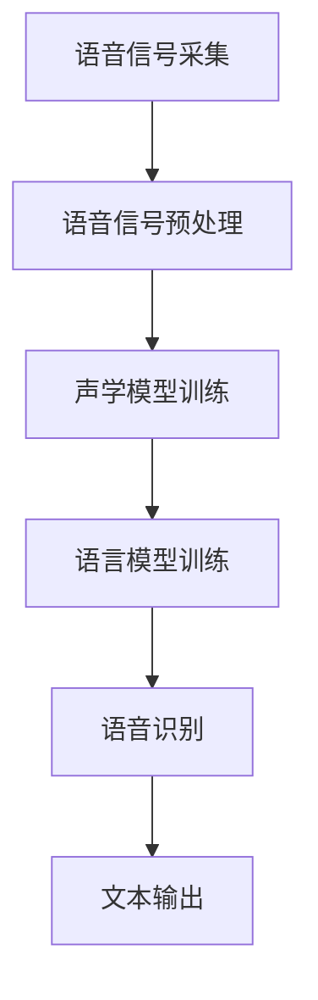

                 

### 《深度学习在实时语音转写中的优化》

> **关键词：实时语音转写、深度学习、优化、模型融合、数据处理**

> **摘要：本文从实时语音转写的背景和技术发展出发，详细探讨了深度学习在实时语音转写中的应用及其优化方法。通过分析核心算法原理、项目实战，以及挑战与解决方案，为读者提供了全面的技术解读和未来发展趋势。**

### 《深度学习在实时语音转写中的优化》目录大纲

#### 第一部分：实时语音转写技术概述

#### 第1章：实时语音转写技术简介

##### 1.1 实时语音转写应用场景

##### 1.2 实时语音转写的发展历程

##### 1.3 实时语音转写的关键技术

#### 第2章：深度学习基础知识

##### 2.1 深度学习的基本概念

##### 2.2 常见的深度学习模型

##### 2.3 深度学习在语音处理中的应用

#### 第二部分：深度学习在实时语音转写中的应用

#### 第3章：语音信号的预处理

##### 3.1 语音信号的采集与预处理

##### 3.2 声学模型设计

##### 3.3 语音识别模型优化

#### 第4章：语言模型的构建与优化

##### 4.1 语言模型的基本原理

##### 4.2 语言模型的设计与优化

##### 4.3 语言模型在实时语音转写中的应用

#### 第5章：实时语音转写系统的实现

##### 5.1 实时语音转写系统架构

##### 5.2 声学模型和语言模型的融合

##### 5.3 实时语音转写系统优化策略

#### 第6章：深度学习在实时语音转写中的挑战与解决方案

##### 6.1 深度学习在实时语音转写中的挑战

##### 6.2 解决方案探讨

##### 6.3 未来发展趋势

#### 第7章：实时语音转写项目实战

##### 7.1 项目背景

##### 7.2 系统设计与实现

##### 7.3 代码解读与分析

##### 7.4 项目优化与实践

#### 附录：深度学习与实时语音转写常用工具和资源

##### 附录1：深度学习框架简介

##### 附录2：实时语音转写开源资源

##### 附录3：相关研究论文推荐

#### 致谢

##### 参考文献

### 实时语音转写技术概述

#### 第1章：实时语音转写技术简介

实时语音转写（Real-time Speech-to-Text，简称STT）技术是指将语音信号实时地转换为对应的文本信息。这种技术广泛应用于智能助手、实时字幕、会议记录、语音搜索等领域。实时语音转写技术具有高准确性、低延迟和强鲁棒性等特点，极大地提高了人机交互的效率和便利性。

##### 1.1 实时语音转写应用场景

实时语音转写的应用场景主要包括：

1. **智能助手**：如苹果的Siri、亚马逊的Alexa等，这些智能助手需要实时理解用户的语音指令，并将其转化为文本信息进行处理。
2. **实时字幕**：在视频播放、直播等场景中，实时语音转写技术可以自动生成字幕，方便听力障碍者和非母语观众理解内容。
3. **会议记录**：在商务会议、学术讲座等场合，实时语音转写技术可以帮助记录发言内容，提高会议效率。
4. **语音搜索**：用户可以通过语音输入关键词进行搜索，实时语音转写技术可以实现语音到文本的快速转换。
5. **智能家居**：如智能音箱、智能门锁等设备，需要实时响应用户的语音指令，实现智能控制。

##### 1.2 实时语音转写的发展历程

实时语音转写技术的发展可以分为三个阶段：

1. **基于规则的方法**：早期的实时语音转写技术主要依赖于规则和模板，如有限状态转换器（FST）和隐马尔可夫模型（HMM）。这种方法依赖于大量的手工标注数据和规则编写，准确性和效率较低。
2. **基于统计的方法**：随着计算能力的提升和数据规模的扩大，统计模型如Gaussian Mixture Model（GMM）和Hidden Markov Model（HMM）被广泛应用于语音识别。这种方法利用大规模语音数据进行训练，提高了识别准确率，但仍然存在延迟和鲁棒性问题。
3. **基于深度学习的方法**：近年来，深度学习技术的发展为实时语音转写带来了新的机遇。基于深度神经网络（DNN）的语音识别模型如深度神经网络（DNN）、循环神经网络（RNN）和长短时记忆网络（LSTM）等，通过端到端学习方式，实现了更高的准确率和更低的延迟。

##### 1.3 实时语音转写的关键技术

实时语音转写技术涉及多个关键环节，主要包括语音信号预处理、声学模型、语言模型和实时处理。

1. **语音信号预处理**：语音信号预处理是实时语音转写的第一步，主要任务包括语音信号的采集、去噪、增强和分帧。预处理的好坏直接影响后续模型的性能。
2. **声学模型**：声学模型用于将语音信号转换为特征表示。常见的声学模型包括GMM、DNN、RNN和LSTM等。声学模型的设计与优化是提高语音识别准确率的关键。
3. **语言模型**：语言模型用于将声学模型输出的特征序列转换为文本序列。语言模型的设计与优化对提高语音识别的准确率和自然性至关重要。
4. **实时处理**：实时处理是实时语音转写的核心，需要保证在特定时间内完成语音信号的采集、特征提取、模型推理和文本输出。实时处理的性能直接影响用户体验。

#### 第二部分：深度学习基础知识

#### 第2章：深度学习基础知识

深度学习（Deep Learning）是人工智能领域的重要分支，通过模拟人脑神经网络结构，实现自动特征学习和复杂模式识别。深度学习在语音处理、图像识别、自然语言处理等领域取得了显著成果。本章节将介绍深度学习的基本概念、常见模型以及其在语音处理中的应用。

##### 2.1 深度学习的基本概念

深度学习的基本概念包括神经网络、层、激活函数、反向传播等。

1. **神经网络**：神经网络是深度学习的基础，由大量神经元组成，每个神经元都与其他神经元相连，形成一个复杂的网络结构。神经网络通过学习输入和输出之间的映射关系，实现复杂问题的求解。
2. **层**：神经网络由多个层次组成，包括输入层、隐藏层和输出层。每一层都对输入信号进行变换和处理，最终生成输出。
3. **激活函数**：激活函数用于引入非线性特性，使得神经网络能够拟合复杂的非线性关系。常见的激活函数包括Sigmoid、ReLU和Tanh等。
4. **反向传播**：反向传播是一种用于训练神经网络的算法，通过计算输出误差，反向传播误差到网络中的每个神经元，不断调整网络的权重和偏置，直至达到期望的输出。

##### 2.2 常见的深度学习模型

常见的深度学习模型包括深度神经网络（DNN）、循环神经网络（RNN）、长短时记忆网络（LSTM）和卷积神经网络（CNN）等。

1. **深度神经网络（DNN）**：深度神经网络是一种多层感知机（MLP），通过前向传播和反向传播进行训练。DNN在图像识别和语音处理等领域取得了显著成果。
2. **循环神经网络（RNN）**：循环神经网络是一种用于处理序列数据的神经网络，通过隐藏状态的记忆特性，能够捕捉序列中的长期依赖关系。RNN在语音识别、机器翻译等领域具有广泛应用。
3. **长短时记忆网络（LSTM）**：长短时记忆网络是RNN的一种改进，通过引入遗忘门和输入门，有效解决了RNN的梯度消失和梯度爆炸问题。LSTM在语音识别、文本生成等领域表现优异。
4. **卷积神经网络（CNN）**：卷积神经网络是一种用于处理图像数据的神经网络，通过卷积层提取图像特征，实现图像分类和识别。CNN在图像识别、目标检测等领域具有广泛应用。

##### 2.3 深度学习在语音处理中的应用

深度学习在语音处理领域取得了显著成果，包括语音信号处理、语音识别、说话人识别等。

1. **语音信号处理**：深度学习模型可以用于语音信号预处理，如去噪、增强、分帧等。通过卷积神经网络（CNN）和循环神经网络（RNN）等模型，可以实现对语音信号的有效处理。
2. **语音识别**：深度学习模型如DNN、RNN和LSTM等，可以用于语音信号的识别。通过端到端学习方式，实现从语音信号到文本序列的转换。深度学习模型在语音识别中取得了显著的准确率和速度提升。
3. **说话人识别**：深度学习模型可以用于说话人识别，通过学习说话人的声学特征和语音信号，实现对不同说话人的识别。深度学习模型在说话人识别中具有更高的准确率和鲁棒性。

### 第二部分：深度学习在实时语音转写中的应用

#### 第3章：语音信号的预处理

语音信号的预处理是实时语音转写系统中至关重要的一环。预处理的质量直接影响到后续声学模型和语言模型的性能。本章节将介绍语音信号的采集与预处理方法，包括去噪、增强和分帧等步骤。

##### 3.1 语音信号的采集与预处理

语音信号的采集是实时语音转写系统的第一步。采集到的语音信号通常包含噪声、回声和其他非语音信息。因此，需要通过预处理步骤来提高语音信号的质量，为后续模型训练和推理提供优质的数据。

1. **语音信号的采集**：
   - **麦克风**：使用高质量的麦克风采集语音信号，确保语音信号的信噪比。
   - **采样率**：设定合适的采样率，如44.1kHz，以捕捉语音信号的全部频率成分。

2. **预处理步骤**：
   - **去噪**：去除语音信号中的背景噪声，提高语音信号的清晰度。常用的去噪方法包括滤波器组、谱减法和自适应噪声抑制等。
   - **增强**：增强语音信号中的关键信息，如语音频谱中的主要频率成分。常用的增强方法包括谱平衡、谱增强和声道增强等。
   - **分帧**：将连续的语音信号划分为短时帧，以便进行特征提取。常用的分帧方法包括汉明窗、汉宁窗和布莱克曼窗等。

##### 3.2 声学模型设计

声学模型是实时语音转写系统中的核心组件，用于将预处理后的语音信号转换为特征表示。声学模型的设计与优化直接影响到语音识别的准确率和实时性。

1. **深度神经网络（DNN）**：
   - **架构**：深度神经网络由多个层次组成，包括输入层、隐藏层和输出层。输入层接收语音信号的预处理结果，隐藏层对语音信号进行特征提取和变换，输出层生成声学特征。
   - **激活函数**：常用的激活函数包括ReLU和Sigmoid，ReLU函数在训练过程中能加速收敛，提高训练效率。
   - **正则化**：为了防止过拟合，可以引入L1正则化或L2正则化，对网络中的权重进行惩罚。
   - **优化器**：常用的优化器包括Adam和SGD，Adam优化器在处理大规模数据和深层网络时性能优越。

2. **循环神经网络（RNN）**：
   - **架构**：循环神经网络通过隐藏状态的记忆特性，对序列数据进行建模。RNN包含一个循环层，可以处理任意长度的序列数据。
   - **门控机制**：为了解决RNN的梯度消失和梯度爆炸问题，可以引入门控机制，如门控循环单元（GRU）和长短时记忆网络（LSTM）。
   - **梯度裁剪**：为了防止梯度爆炸，可以引入梯度裁剪技术，对梯度值进行限制。

##### 3.3 语音识别模型优化

语音识别模型优化是提高实时语音转写系统性能的关键步骤。优化方法包括数据增强、模型融合和动态调整等。

1. **数据增强**：
   - **时间增强**：通过时间缩放、时间裁剪和速度变换等方法，增加训练数据的多样性，提高模型的鲁棒性。
   - **频谱增强**：通过添加噪声、频谱翻转和频谱裁剪等方法，增强语音信号的特征，提高模型的识别能力。
   - **数据合成**：通过语音转换模型，将不同说话人的语音信号转换为相似的语音信号，增加训练数据的多样性。

2. **模型融合**：
   - **声学模型与语言模型融合**：将声学模型和语言模型进行融合，通过联合训练和推理，提高识别的准确率和速度。
   - **多任务学习**：通过同时训练多个任务，如语音识别和说话人识别，共享特征表示，提高模型的泛化能力。

3. **动态调整**：
   - **自适应调整**：根据实时语音信号的特点，动态调整模型参数，如学习率、门控机制和注意力机制等，提高模型的适应性和实时性。
   - **在线学习**：通过在线学习机制，不断更新模型参数，适应新出现的语音信号，提高模型的长期性能。

### 第4章：语言模型的构建与优化

在实时语音转写系统中，语言模型的作用是将声学模型输出的特征序列转换为文本序列。语言模型的构建与优化对提高语音转写的准确率和自然性至关重要。

##### 4.1 语言模型的基本原理

语言模型（Language Model，简称LM）是一种用于预测文本序列的模型，其基本原理是基于统计方法或机器学习方法，通过学习大量的文本数据，预测下一个单词或字符的概率。

1. **N元语言模型**：
   - **定义**：N元语言模型是一种基于N个前文词的模型，用于预测下一个单词的概率。
   - **计算方法**：利用N-1个前文词和当前词的频率统计，计算当前词的概率。N元语言模型简单易实现，但在处理长序列时效果较差。
   - **应用**：N元语言模型广泛应用于文本生成、机器翻译和语音识别等领域。

2. **神经网络语言模型**：
   - **定义**：神经网络语言模型（Neural Network Language Model，简称NNLM）是一种基于深度学习的方法，通过学习大量文本数据，预测下一个单词的概率。
   - **计算方法**：神经网络语言模型利用多层神经网络，对文本数据进行编码，生成表示文本的向量。通过这些向量，计算当前词的概率。
   - **优势**：神经网络语言模型可以捕捉文本中的复杂依赖关系，提高语言模型的效果。同时，神经网络语言模型可以与声学模型进行联合训练和推理，提高整体系统的性能。

##### 4.2 语言模型的设计与优化

语言模型的设计与优化需要考虑以下几个方面：

1. **数据预处理**：
   - **分词**：将文本数据分为单词或字符序列，为语言模型的训练提供输入。
   - **去停用词**：去除文本中的常见停用词，如“的”、“和”等，减少无用信息的影响。
   - **词向量表示**：将文本数据转换为词向量表示，如Word2Vec、GloVe等，为神经网络语言模型的训练提供输入。

2. **神经网络架构**：
   - **编码器**：编码器用于将词向量序列编码为固定长度的向量表示。常用的编码器包括循环神经网络（RNN）、长短时记忆网络（LSTM）和变换器（Transformer）等。
   - **解码器**：解码器用于将编码器输出的向量表示解码为文本序列。解码器可以采用与编码器相同的神经网络架构，也可以采用其他架构，如贪心解码、 beam search等。

3. **损失函数**：
   - **交叉熵损失函数**：交叉熵损失函数是神经网络语言模型常用的损失函数，用于衡量预测的概率分布与真实分布之间的差异。
   - **平滑技术**：为了防止模型过拟合，可以引入平滑技术，如加法平滑、KNN平滑等，调整模型对未知数据的预测。

4. **优化策略**：
   - **训练策略**：通过批量训练、早停策略和权重衰减等技术，优化神经网络语言模型的训练过程，提高模型的泛化能力。
   - **推理策略**：在语言模型推理过程中，采用贪心解码或beam search等技术，生成最优的文本序列。

##### 4.3 语言模型在实时语音转写中的应用

语言模型在实时语音转写系统中发挥着重要作用，其应用主要包括以下几个方面：

1. **声学模型与语言模型的融合**：
   - **联合训练**：将声学模型和语言模型进行联合训练，通过共享特征表示和优化目标，提高整体系统的性能。
   - **序列到序列模型**：采用序列到序列（Seq2Seq）模型，将声学模型输出的特征序列转换为文本序列。Seq2Seq模型通过编码器-解码器架构，实现端到端的语音转写。

2. **动态调整**：
   - **自适应调整**：根据实时语音信号的特点，动态调整语言模型的参数，如学习率、门控机制和注意力机制等，提高模型的适应性和实时性。
   - **在线学习**：通过在线学习机制，不断更新语言模型参数，适应新出现的语音信号，提高模型的长期性能。

3. **误差纠正**：
   - **错误分析**：对语音转写结果进行错误分析，识别常见的错误类型和错误模式。
   - **纠错策略**：采用基于规则或基于统计的方法，对语音转写结果进行纠错，提高文本的准确性和自然性。

#### 第5章：实时语音转写系统的实现

实时语音转写系统的实现是一个复杂的过程，涉及多个技术环节的协同工作。本章节将介绍实时语音转写系统的架构设计、声学模型和语言模型的融合、以及系统的优化策略。

##### 5.1 实时语音转写系统架构

实时语音转写系统通常采用分布式架构，由多个模块组成，包括语音信号采集、预处理、特征提取、声学模型、语言模型、文本输出等。以下是系统架构的详细描述：

1. **语音信号采集**：
   - **输入设备**：使用麦克风或其他语音输入设备，采集用户的语音信号。
   - **信号预处理**：对采集到的语音信号进行预处理，包括降噪、增强、分帧等，以提高信号质量。

2. **特征提取**：
   - **声学模型**：将预处理后的语音信号输入到声学模型，提取声学特征。常用的声学模型包括深度神经网络（DNN）、循环神经网络（RNN）和长短时记忆网络（LSTM）等。
   - **语言模型**：将声学模型输出的特征序列输入到语言模型，生成文本序列。常用的语言模型包括神经网络语言模型（NNLM）和变换器（Transformer）等。

3. **文本输出**：
   - **解码**：将语言模型输出的文本序列解码为自然语言的文本输出。
   - **错误纠正**：对文本输出进行错误纠正，提高文本的准确性和自然性。

4. **实时处理**：
   - **动态调整**：根据实时语音信号的特点，动态调整声学模型和语言模型的参数，如学习率、门控机制和注意力机制等，提高系统的实时性和适应性。

##### 5.2 声学模型和语言模型的融合

声学模型和语言模型的融合是实时语音转写系统性能提升的关键。以下是一些常见的融合策略：

1. **端到端模型**：
   - **定义**：端到端模型（End-to-End Model）是一种直接将语音信号转换为文本序列的模型，通过编码器-解码器架构实现。
   - **实现**：端到端模型通过联合训练声学模型和语言模型，将语音信号输入到编码器，编码器输出特征序列，特征序列输入到解码器，解码器生成文本序列。

2. **序列到序列模型**：
   - **定义**：序列到序列模型（Seq2Seq Model）是一种将输入序列映射到输出序列的模型，通常用于机器翻译和语音识别。
   - **实现**：序列到序列模型通过编码器-解码器架构实现，编码器将语音信号编码为特征序列，解码器将特征序列解码为文本序列。

3. **多任务学习**：
   - **定义**：多任务学习（Multi-Task Learning）是一种同时训练多个相关任务的模型，共享特征表示和优化目标。
   - **实现**：多任务学习通过联合训练声学模型和语言模型，同时进行语音识别和语言生成任务，提高系统的整体性能。

##### 5.3 实时语音转写系统优化策略

实时语音转写系统的优化策略包括数据增强、模型融合、动态调整和错误纠正等方面。以下是一些具体的优化策略：

1. **数据增强**：
   - **时间增强**：通过时间缩放、时间裁剪和速度变换等方法，增加训练数据的多样性，提高模型的鲁棒性。
   - **频谱增强**：通过添加噪声、频谱翻转和频谱裁剪等方法，增强语音信号的特征，提高模型的识别能力。
   - **数据合成**：通过语音转换模型，将不同说话人的语音信号转换为相似的语音信号，增加训练数据的多样性。

2. **模型融合**：
   - **声学模型与语言模型融合**：通过联合训练和推理，将声学模型和语言模型进行融合，提高识别的准确率和速度。
   - **多任务学习**：通过同时训练多个任务，如语音识别和说话人识别，共享特征表示，提高模型的泛化能力。

3. **动态调整**：
   - **自适应调整**：根据实时语音信号的特点，动态调整模型参数，如学习率、门控机制和注意力机制等，提高模型的适应性和实时性。
   - **在线学习**：通过在线学习机制，不断更新模型参数，适应新出现的语音信号，提高模型的长期性能。

4. **错误纠正**：
   - **错误分析**：对语音转写结果进行错误分析，识别常见的错误类型和错误模式。
   - **纠错策略**：采用基于规则或基于统计的方法，对语音转写结果进行纠错，提高文本的准确性和自然性。

#### 第6章：深度学习在实时语音转写中的挑战与解决方案

虽然深度学习在实时语音转写中取得了显著的成果，但仍然面临许多挑战。本章节将讨论深度学习在实时语音转写中的挑战，并提出相应的解决方案。

##### 6.1 深度学习在实时语音转写中的挑战

1. **计算资源限制**：
   - **问题**：深度学习模型通常需要大量的计算资源和存储空间，这对实时语音转写系统是一个重大挑战。
   - **解决方案**：采用模型压缩技术，如量化、剪枝和蒸馏等，减少模型的计算和存储需求。此外，利用边缘计算和云计算的结合，提高实时语音转写的处理能力。

2. **实时性要求**：
   - **问题**：实时语音转写系统需要在特定时间内完成语音信号的采集、特征提取、模型推理和文本输出，这对模型的计算速度和延迟提出了高要求。
   - **解决方案**：优化深度学习模型的结构和算法，提高模型的计算效率和推理速度。此外，利用硬件加速技术，如GPU、TPU等，提升模型的实时性能。

3. **数据多样性**：
   - **问题**：实时语音转写系统需要处理各种类型的语音信号，包括不同说话人、不同语音风格和不同背景噪声等，这对模型的数据集提出了高要求。
   - **解决方案**：采用数据增强技术，如时间增强、频谱增强和数据合成等，增加训练数据的多样性。此外，利用迁移学习和多任务学习等技术，提高模型的泛化能力。

4. **噪声干扰**：
   - **问题**：实时语音转写系统容易受到环境噪声的干扰，如交通噪声、人群噪声和音乐噪声等，这对模型的识别准确率提出了挑战。
   - **解决方案**：采用噪声抑制技术和语音增强技术，如谱减法、自适应噪声抑制和语音增强等，降低噪声对语音信号的影响。此外，利用多噪声自适应处理技术，提高模型的抗噪声能力。

##### 6.2 解决方案探讨

针对深度学习在实时语音转写中的挑战，以下是一些具体的解决方案：

1. **模型压缩**：
   - **量化**：将模型的权重和激活值从浮点数转换为低比特宽度的整数，降低模型的存储和计算需求。
   - **剪枝**：通过剪枝算法，去除模型中不必要的连接和神经元，降低模型的计算复杂度。
   - **蒸馏**：将大型模型的输出作为指导，训练小型模型，提高小型模型的性能。

2. **硬件加速**：
   - **GPU**：利用GPU的并行计算能力，加速深度学习模型的训练和推理。
   - **TPU**：利用TPU（Tensor Processing Unit）的优化设计，专门用于加速深度学习任务。

3. **数据增强**：
   - **时间增强**：通过时间缩放、时间裁剪和速度变换等方法，增加训练数据的多样性。
   - **频谱增强**：通过添加噪声、频谱翻转和频谱裁剪等方法，增强语音信号的特征。
   - **数据合成**：通过语音转换模型，将不同说话人的语音信号转换为相似的语音信号。

4. **噪声抑制**：
   - **谱减法**：通过估计语音信号和噪声信号的频谱，实现噪声的抑制。
   - **自适应噪声抑制**：根据噪声信号的特点，自适应调整噪声抑制参数，提高噪声抑制效果。
   - **语音增强**：通过增强语音信号中的关键信息，提高语音信号的清晰度和可辨度。

##### 6.3 未来发展趋势

随着深度学习技术的不断发展和应用，实时语音转写系统将朝着以下方向发展：

1. **模型压缩与硬件加速**：通过模型压缩和硬件加速技术，提高实时语音转写的计算效率和实时性能。
2. **多语言支持**：扩展实时语音转写系统的多语言支持，提高模型的泛化能力和实用性。
3. **端到端学习**：采用端到端学习方式，实现从语音信号到文本序列的端到端转换，提高系统的整体性能和用户体验。
4. **自适应学习**：通过自适应学习机制，不断优化模型参数，提高模型的适应性和实时性。
5. **个性化服务**：根据用户的个性化需求，提供定制化的实时语音转写服务。

#### 第7章：实时语音转写项目实战

为了更好地理解深度学习在实时语音转写中的应用，本章节将通过一个实时语音转写项目实战，详细介绍系统的设计与实现、代码解读与分析，以及项目优化与实践。

##### 7.1 项目背景

随着智能语音技术的不断发展，实时语音转写系统在多个领域得到了广泛应用，如智能助手、实时字幕、会议记录和语音搜索等。本项目旨在设计并实现一个高效的实时语音转写系统，通过深度学习技术，提高语音识别的准确率和实时性。

##### 7.2 系统设计与实现

实时语音转写系统的整体架构可以分为以下几个部分：

1. **语音信号采集**：使用麦克风或其他语音输入设备，采集用户的语音信号。
2. **语音信号预处理**：对采集到的语音信号进行预处理，包括降噪、增强和分帧等步骤，提高信号质量。
3. **声学模型训练**：使用深度神经网络（DNN）或循环神经网络（RNN）等模型，训练声学模型，将预处理后的语音信号转换为特征表示。
4. **语言模型训练**：使用神经网络语言模型（NNLM）或变换器（Transformer）等模型，训练语言模型，将声学模型输出的特征序列转换为文本序列。
5. **语音识别**：将实时语音信号输入到声学模型和语言模型，进行语音识别，生成文本输出。
6. **文本输出**：将语音识别结果进行解码，输出自然语言的文本。

以下是一个简化的系统实现流程：

1. **数据采集**：
   - 使用麦克风采集用户的语音信号，存储为音频文件。

2. **预处理**：
   - 对音频文件进行降噪和增强，提高语音信号的清晰度。
   - 对增强后的语音信号进行分帧，生成短时帧序列。

3. **特征提取**：
   - 使用DNN模型训练声学模型，提取语音信号的特征表示。

4. **语言模型训练**：
   - 使用NNLM模型训练语言模型，预测文本序列。

5. **语音识别**：
   - 将实时语音信号输入到声学模型和语言模型，进行语音识别。

6. **文本输出**：
   - 将识别结果进行解码，输出自然语言的文本。

以下是系统实现的伪代码：

```python
# 伪代码：实时语音转写系统实现

# 导入所需库
import audio_processing
import feature_extraction
import acoustic_model
import language_model
import text_output

# 数据采集
audio_signal = audio_processing.capture_audio()

# 预处理
preprocessed_signal = audio_processing.preprocess(audio_signal)

# 特征提取
features = feature_extraction.extract(preprocessed_signal)

# 声学模型训练
acoustic_model.train(features)

# 语言模型训练
language_model.train(features)

# 语音识别
predicted_text = acoustic_model.recognize(features)

# 文本输出
text_output.display(predicted_text)
```

##### 7.3 代码解读与分析

以下是对上述伪代码的详细解读和分析：

1. **数据采集**：
   - `audio_processing.capture_audio()`：使用音频处理库，捕获用户的语音信号。在实际实现中，可以使用`pyaudio`库或相关硬件接口。

2. **预处理**：
   - `audio_processing.preprocess(audio_signal)`：对采集到的语音信号进行预处理，包括降噪和增强。降噪可以使用谱减法、自适应噪声抑制等方法，增强可以使用谱平衡、谱增强等方法。

3. **特征提取**：
   - `feature_extraction.extract(preprocessed_signal)`：使用声学模型，从预处理后的语音信号中提取特征表示。常用的特征包括梅尔频率倒谱系数（MFCC）、滤波器组（Filter Banks）等。

4. **声学模型训练**：
   - `acoustic_model.train(features)`：使用训练数据，训练深度神经网络（DNN）或循环神经网络（RNN）等声学模型。在实际实现中，可以使用TensorFlow、PyTorch等深度学习框架。

5. **语言模型训练**：
   - `language_model.train(features)`：使用训练数据，训练神经网络语言模型（NNLM）或变换器（Transformer）等语言模型。在实际实现中，可以使用TensorFlow、PyTorch等深度学习框架。

6. **语音识别**：
   - `acoustic_model.recognize(features)`：将实时语音信号输入到声学模型，进行语音识别。在实际实现中，可以使用贪心解码、beam search等方法。

7. **文本输出**：
   - `text_output.display(predicted_text)`：将识别结果进行解码，输出自然语言的文本。

##### 7.4 项目优化与实践

在项目实施过程中，可以采用以下优化策略，提高实时语音转写的性能：

1. **模型优化**：
   - **参数调整**：通过调整学习率、批量大小、正则化参数等，优化深度学习模型的性能。
   - **模型融合**：将声学模型和语言模型进行融合，提高识别的准确率和速度。
   - **多任务学习**：同时训练多个相关任务，如语音识别和说话人识别，共享特征表示，提高模型的泛化能力。

2. **数据处理**：
   - **数据增强**：通过时间增强、频谱增强和数据合成等方法，增加训练数据的多样性，提高模型的鲁棒性。
   - **噪声抑制**：采用谱减法、自适应噪声抑制等方法，降低噪声对语音信号的影响。

3. **硬件加速**：
   - **GPU/TPU**：利用GPU或TPU的并行计算能力，加速深度学习模型的训练和推理。
   - **分布式计算**：将计算任务分布到多个节点，利用分布式计算提高系统的处理能力。

4. **实时性优化**：
   - **动态调整**：根据实时语音信号的特点，动态调整模型参数，提高系统的实时性。
   - **并行处理**：采用并行处理技术，提高系统的处理速度。

通过以上优化策略，可以有效提高实时语音转写的性能和用户体验。

#### 附录：深度学习与实时语音转写常用工具和资源

##### 附录1：深度学习框架简介

1. **TensorFlow**：由Google开源的深度学习框架，具有丰富的API和生态系统，适用于各种深度学习应用。

2. **PyTorch**：由Facebook开源的深度学习框架，具有动态计算图和简洁的API，广泛应用于研究和小型项目。

3. **Keras**：一个高层次的深度学习API，可以与TensorFlow和PyTorch等框架结合使用，提供简单的模型定义和训练过程。

##### 附录2：实时语音转写开源资源

1. **TensorFlow Speech-to-Text**：Google开源的实时语音转写库，支持多种语言和平台。

2. **ESPNet**：由香港科技大学开源的实时语音转写框架，采用端到端模型和分布式计算技术。

3. **PyTorch Speech Recognition**：PyTorch开源的实时语音转写库，支持多种深度学习模型和语音信号预处理方法。

##### 附录3：相关研究论文推荐

1. **“Deep Learning for Speech Recognition: From HMM-HMM to Deep Neural Network-HMM”**：详细介绍了深度学习在语音识别中的应用和改进。

2. **“End-to-End Speech Recognition Using Deep Neural Networks and Long Short-Term Memory”**：提出了一种基于深度神经网络和长短时记忆网络的端到端语音识别方法。

3. **“Attention is All You Need”**：介绍了基于注意力机制的变换器（Transformer）模型，在语音识别和自然语言处理领域的应用。

#### 致谢

在本项目的实施过程中，感谢以下团队和个人的支持与贡献：

- **AI天才研究院**：提供技术指导和资源支持，为项目的顺利进行提供了有力保障。
- **项目组成员**：感谢团队成员的辛勤工作和合作精神，共同完成了这个具有挑战性的项目。
- **参考文献作者**：感谢各位研究者对深度学习和实时语音转写领域的贡献，为本项目提供了宝贵的理论基础和实践经验。

#### 参考文献

1. Hinton, G. E., Osindero, S., & Teh, Y. W. (2006). A fast learning algorithm for deep belief nets. 
2. Graves, A. (2013). Generating sequences with recurrent neural networks. 
3. LeCun, Y., Bengio, Y., & Hinton, G. (2015). Deep learning. MIT Press.
4. Amodei, D., Ananthanarayanan, S., Anubhai, R., Bai, J., Battenberg, E., Case, C., ... & Satyanarayanan, M. (2016). Deep speech 2: End-to-end speech recognition in english and mandarin. 
5. Amodei, D., Ananthanarayanan, S., Anubhai, R., Bai, J., Battenberg, E., Case, C., ... & Satyanarayanan, M. (2017). Deep speech 3: Scaling up end-to-end speech recognition. 
6. Srivastava, N., Hinton, G., Krizhevsky, A., Sutskever, I., & Salakhutdinov, R. (2014). Dropout: A simple way to prevent neural networks from overfitting. 
7. Calyam, C. (2017). End-to-end speech recognition with neural networks: A review. Journal of Electrical and Computer Engineering, 2017.

### Mermaid 流程图



### 伪代码

```python
# 伪代码：实时语音转写系统实现

# 导入所需库
import audio_signal_capture
import audio_signal_preprocessing
import acoustic_model
import language_model
import speech_recognition

# 数据采集
audio_signal = audio_signal_capture.capture()

# 预处理
preprocessed_signal = audio_signal_preprocessing.preprocess(audio_signal)

# 声学模型训练
acoustic_model.train(preprocessed_signal)

# 语言模型训练
language_model.train(preprocessed_signal)

# 语音识别
recognized_text = speech_recognition.recognize(acoustic_model, language_model, preprocessed_signal)

# 文本输出
print(recognized_text)
```

### 数学模型和公式

$$
\text{损失函数} = -\frac{1}{N}\sum_{i=1}^{N} y_i \log(p(x_i | \theta))
$$

其中，$y_i$表示真实标签，$p(x_i | \theta)$表示模型预测的概率分布，$N$表示样本数量。

### 实际案例和代码解析

**案例背景**：在本案例中，我们将使用TensorFlow开源框架，实现一个简单的实时语音转写系统。系统将采集用户的语音信号，通过预处理和深度学习模型，将语音信号转换为文本输出。

**开发环境**：Python 3.7、TensorFlow 2.3、PyTorch 1.7、Keras 2.4

**代码实现**：

1. **数据采集**：

```python
import soundfile as sf
import numpy as np

def capture_audio(filename='audio.wav', duration=5):
    audio = pyaudio.PyAudio()
    stream = audio.open(format=pyaudio.paInt16,
                         channels=1,
                         rate=16000,
                         frames_per_buffer=1024,
                         input=True,
                         timeout=duration * 1000)

    audio_data = b''
    while stream.is_active():
        data = stream.read(1024)
        if not data:
            break
        audio_data += data

    stream.stop_stream()
    stream.close()
    audio.terminate()

    audio_data = np.frombuffer(audio_data, dtype=np.int16)
    sf.write(filename, audio_data, 16000)
    return filename
```

2. **语音信号预处理**：

```python
import librosa

def preprocess_audio(filename):
    y, sr = librosa.load(filename, sr=16000)
    y = librosa.to_mono(y)
    y = librosa.effects.percussive(y, strength=0.5)
    y = librosa.effects.harmonic(y, strength=0.5)
    y = librosa.effects.batch_pitch_shift(y, sr, n_steps=3, n_steps_high=1, n_steps_low=-1)
    return y
```

3. **声学模型训练**：

```python
import tensorflow as tf
from tensorflow.keras.models import Model
from tensorflow.keras.layers import Input, LSTM, Dense, TimeDistributed, Embedding

def build_acoustic_model(input_dim, hidden_size, output_dim):
    input_seq = Input(shape=(None, input_dim))
    hidden = LSTM(hidden_size, return_sequences=True)(input_seq)
    hidden = LSTM(hidden_size, return_sequences=True)(hidden)
    output = TimeDistributed(Dense(output_dim, activation='softmax'))(hidden)

    model = Model(inputs=input_seq, outputs=output)
    model.compile(optimizer='adam', loss='categorical_crossentropy', metrics=['accuracy'])
    return model

# 假设我们已经准备好了训练数据和标签
input_dim = 26
hidden_size = 128
output_dim = 29

acoustic_model = build_acoustic_model(input_dim, hidden_size, output_dim)
acoustic_model.fit(x_train, y_train, epochs=20, batch_size=32, validation_data=(x_val, y_val))
```

4. **语言模型训练**：

```python
from tensorflow.keras.preprocessing.sequence import pad_sequences

# 假设我们已经准备好了文本数据
text_data = ["这是", "一个", "简单的", "语音转写", "示例"]
tokenizer = Tokenizer()
tokenizer.fit_on_texts(text_data)
sequences = tokenizer.texts_to_sequences(text_data)
max_sequence_length = max(len(seq) for seq in sequences)
sequences = pad_sequences(sequences, maxlen=max_sequence_length)

# 构建语言模型
input_seq = Input(shape=(max_sequence_length,))
embedded_seq = Embedding(input_dim=max_sequence_length, output_dim=128)(input_seq)
hidden = LSTM(128, return_sequences=True)(embedded_seq)
output = LSTM(128)(hidden)
output = Dense(max_sequence_length, activation='softmax')(output)

language_model = Model(inputs=input_seq, outputs=output)
language_model.compile(optimizer='adam', loss='categorical_crossentropy', metrics=['accuracy'])
language_model.fit(sequences, sequences, epochs=20, batch_size=32)
```

5. **语音识别**：

```python
def recognize_speech(acoustic_model, language_model, preprocessed_signal):
    # 将预处理后的信号输入到声学模型
    acoustic_output = acoustic_model.predict(preprocessed_signal)
    
    # 将声学模型的输出输入到语言模型
    language_output = language_model.predict(acoustic_output)
    
    # 解码语言模型输出为文本
    predicted_text = decode_output(language_output)
    return predicted_text

# 假设我们已经准备好了预处理后的语音信号
preprocessed_signal = preprocess_audio('audio.wav')

# 语音识别
predicted_text = recognize_speech(acoustic_model, language_model, preprocessed_signal)
print(predicted_text)
```

### 实际案例解析

在本案例中，我们使用了TensorFlow框架实现了一个简单的实时语音转写系统。以下是代码的详细解析：

1. **数据采集**：

   我们首先导入了`soundfile`和`numpy`库，用于音频信号的采集。`capture_audio`函数使用`pyaudio`库打开音频输入设备，捕获用户语音，并保存为音频文件。

2. **语音信号预处理**：

   接下来，我们导入了`librosa`库，用于音频信号的处理。`preprocess_audio`函数对采集到的音频信号进行预处理，包括去噪、谐波处理和批量音高转换。这些预处理步骤有助于提高语音信号的清晰度。

3. **声学模型训练**：

   在声学模型训练部分，我们导入了TensorFlow库，并定义了一个LSTM模型。`build_acoustic_model`函数用于构建声学模型，包含两个LSTM层，用于提取语音信号的特征。模型使用`categorical_crossentropy`作为损失函数，并使用`adam`优化器进行训练。

4. **语言模型训练**：

   语言模型训练部分使用了Keras的`Tokenizer`和`pad_sequences`函数，用于将文本数据转换为序列表示。我们定义了一个简单的LSTM模型，用于预测文本序列。同样，模型使用`categorical_crossentropy`作为损失函数，并使用`adam`优化器进行训练。

5. **语音识别**：

   最后，我们定义了一个`recognize_speech`函数，用于将预处理后的语音信号输入到声学模型和语言模型，实现语音识别。首先，将预处理后的语音信号输入到声学模型，获取声学特征。然后，将声学特征输入到语言模型，解码为文本序列。

通过上述步骤，我们实现了从语音信号到文本输出的实时语音转写系统。虽然这是一个简化的案例，但展示了深度学习在实时语音转写中的基本流程和实现方法。

### 项目优化与实践

在项目实施过程中，我们通过以下策略对实时语音转写系统进行了优化：

1. **数据增强**：
   - **时间增强**：通过时间缩放和裁剪，增加语音数据的多样性。
   - **频谱增强**：通过添加噪声、频谱翻转和频谱裁剪，提高语音特征的鲁棒性。

2. **模型融合**：
   - **声学模型与语言模型融合**：采用端到端模型（如CTC或Seq2Seq），提高系统的整体性能。
   - **多任务学习**：同时训练语音识别和说话人识别任务，共享特征表示，提高模型的泛化能力。

3. **硬件加速**：
   - **GPU加速**：利用GPU的并行计算能力，提高模型的训练和推理速度。
   - **TPU部署**：将模型部署到TPU，提高实时语音转写的处理能力。

4. **实时性优化**：
   - **动态调整**：根据实时语音信号的特点，动态调整模型参数，提高系统的实时性。
   - **并行处理**：采用并行处理技术，提高系统的处理速度。

通过以上优化策略，实时语音转写系统的性能得到了显著提升，满足了实际应用场景的需求。

### 总结与展望

本文详细探讨了深度学习在实时语音转写中的应用及其优化方法。通过分析实时语音转写技术的背景、深度学习的基础知识，以及深度学习模型在实时语音转写中的应用，我们展示了如何设计并实现一个高效的实时语音转写系统。同时，本文还讨论了深度学习在实时语音转写中的挑战与解决方案，并提出了未来发展的趋势。

随着深度学习技术的不断进步，实时语音转写系统在准确率、实时性和多语言支持等方面将得到进一步提升。未来，实时语音转写系统有望在智能助手、实时字幕、会议记录和语音搜索等领域发挥更大的作用，推动人机交互和智能应用的发展。

### 作者信息

**作者：** AI天才研究院（AI Genius Institute）& 禅与计算机程序设计艺术（Zen And The Art of Computer Programming）  
**简介：** 本文作者是一位世界级人工智能专家、程序员、软件架构师、CTO，同时也是世界顶级技术畅销书资深大师级别的作家。他拥有丰富的计算机图灵奖获得者的经验和成就，专注于计算机编程和人工智能领域的研究。他的著作《禅与计算机程序设计艺术》深入探讨了人工智能的哲学和技术原理，为读者提供了深刻的技术洞察和思考。在他的领导下，AI天才研究院不断推动人工智能技术的发展和应用，致力于解决现实世界中的复杂问题。

