                 

### 《深海探索的计算流体力学：极限环境的数学模拟》

关键词：计算流体力学、极限环境、深海探索、数学模型、数值算法、数值求解

摘要：本文将探讨计算流体力学（CFD）在深海探索中的应用，通过分析极限环境下的流体特性，建立数学模型并使用数值算法模拟深海流体力学现象。文章旨在为读者提供一个系统性的框架，帮助理解CFD在深海科学研究和工程应用中的重要作用。

### 第一部分：基础理论

#### 第1章：计算流体力学基础

##### 1.1 流体力学基本概念

流体力学是研究流体（液体和气体）运动规律的科学。流体的基本特性包括密度、速度、压力和温度等。流体力学可以分为连续介质力学和离散介质力学两大类。连续介质力学假设流体是一个连续的介质，适用于宏观尺度的流体运动分析。而离散介质力学则适用于微观尺度的流体运动分析。

**Mermaid 流程图：**

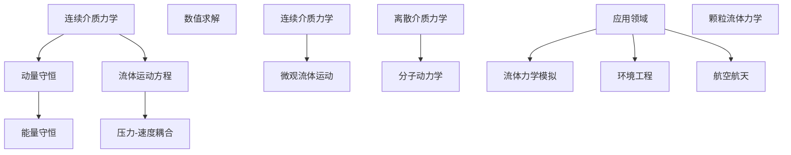

##### 1.2 计算流体力学的发展历程

计算流体力学的发展可以追溯到20世纪50年代，随着计算机技术的进步，CFD方法得到了快速发展。早期的研究主要集中在简单的流体运动模拟，如二维Navier-Stokes方程的求解。随着计算机性能的提升和数值方法的改进，CFD方法逐渐应用于更复杂的流体现象，如湍流、多相流、热传导等。

**Mermaid 流程图：**

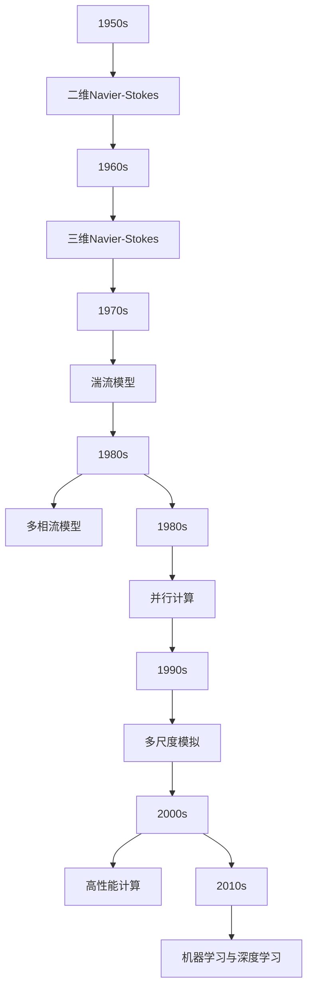

##### 1.3 计算流体力学的基本原理

计算流体力学的基本原理基于流体动力学方程，主要包括质量守恒方程、动量守恒方程和能量守恒方程。这些方程描述了流体在运动过程中密度、速度、压力和温度等物理量的变化规律。

**LaTeX 数学公式：**

$$
\begin{align*}
\frac{\partial \rho}{\partial t} + \nabla \cdot (\rho \mathbf{u}) &= 0, \\
\frac{\partial (\rho \mathbf{u})}{\partial t} + \nabla \cdot (\rho \mathbf{u} \mathbf{u}) &= -\nabla p + \mu \nabla^2 \mathbf{u}, \\
\frac{\partial (\rho e)}{\partial t} + \nabla \cdot (\rho \mathbf{u} e) &= \nabla \cdot (\kappa \nabla T).
\end{align*}
$$

其中，$\rho$ 是流体密度，$\mathbf{u}$ 是流体速度，$p$ 是流体压力，$e$ 是流体内能，$\mu$ 是动黏度，$\kappa$ 是热导率，$T$ 是流体温度。

#### 第2章：极限环境概述

##### 2.1 极限环境的定义与特征

极限环境通常指极端的自然环境，如深海、极地、高空等。这些环境具有独特的物理和化学特性，对人类和机械设备提出了巨大的挑战。深海环境温度低、压力大、能见度差，而且存在多种复杂的流体运动现象。

**Mermaid 流程图：**

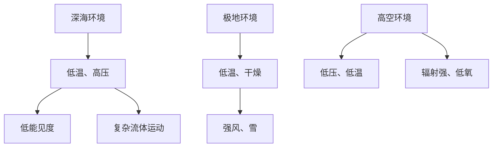

##### 2.2 极限环境下的流体特性

极限环境下的流体特性表现为低温、高压和复杂的湍流现象。低温会导致流体黏度和密度发生变化，而高压则会导致流体相变和化学反应。湍流现象在深海和极地环境中尤为常见，对流体力学模拟提出了更高的要求。

**Mermaid 流程图：**

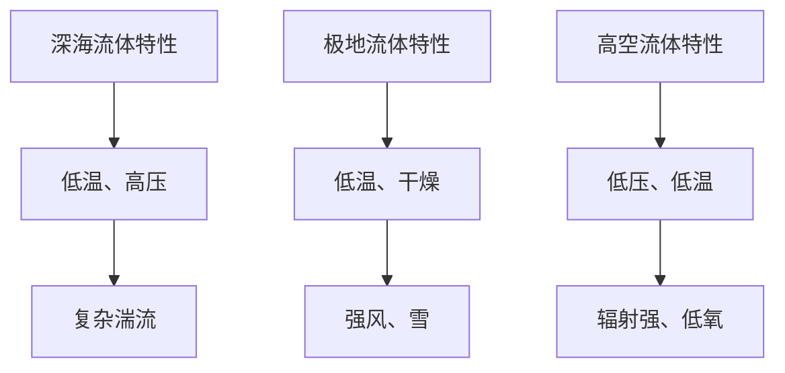

##### 2.3 极限环境下的挑战与应对策略

极限环境下的流体力学模拟面临着计算资源、数据采集和模型准确性等多方面的挑战。为了应对这些挑战，研究者们采取了多种策略，如高性能计算、数据驱动模型和机器学习等。

**Mermaid 流程图：**

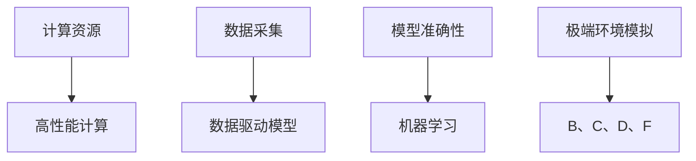

#### 第3章：计算流体力学中的数学模型

##### 3.1 基本控制方程

计算流体力学中的基本控制方程包括质量守恒方程、动量守恒方程和能量守恒方程。这些方程描述了流体在运动过程中的密度、速度、压力和温度等物理量的变化规律。

**LaTeX 数学公式：**

$$
\begin{align*}
\frac{\partial \rho}{\partial t} + \nabla \cdot (\rho \mathbf{u}) &= 0, \\
\frac{\partial (\rho \mathbf{u})}{\partial t} + \nabla \cdot (\rho \mathbf{u} \mathbf{u}) &= -\nabla p + \mu \nabla^2 \mathbf{u}, \\
\frac{\partial (\rho e)}{\partial t} + \nabla \cdot (\rho \mathbf{u} e) &= \nabla \cdot (\kappa \nabla T).
\end{align*}
$$

##### 3.2 数值求解方法

数值求解方法包括有限差分法、有限元法和有限体积法等。这些方法将连续的流体力学方程离散化，并在离散空间上进行求解。

**伪代码：**

```python
# 有限差分法示例
def solve_cfd_equations(u, p, dx, dt):
    # 计算速度
    u_new = (u - dt * (1 / dx ** 2) * (p[1:] - p[:-1]) + dt * nu * (u[1:] - 2 * u中间 + u[:-1]) for i in range(len(u)))
    # 计算压力
    p_new = solve_pressure_equation(u_new, dx, dt)
    return u_new, p_new
```

##### 3.3 数学模型的应用与发展

数学模型在计算流体力学中的应用涵盖了从简单的层流到复杂的湍流模拟，从单相流到多相流模拟，从稳态到瞬态模拟等多个领域。随着计算技术和算法的进步，CFD模型也在不断发展和完善。

**Mermaid 流程图：**

```mermaid
graph TD
    A[层流模拟] --> B[湍流模拟]
    B --> C[多相流模拟]
    C --> D[瞬态模拟]
    D --> E[复杂流体运动模拟]
    F[计算技术进步] --> G[H
```


### 第二部分：计算流体力学在深海探索中的应用

#### 第6章：深海环境中的流体力学模拟

##### 6.1 深海环境下的流体特性

深海环境下的流体特性包括低温、高压和复杂的湍流现象。低温会导致流体黏度和密度发生变化，而高压则可能导致流体相变和化学反应。湍流现象在深海环境中尤为常见，对流体力学模拟提出了更高的要求。

**Mermaid 流程图：**

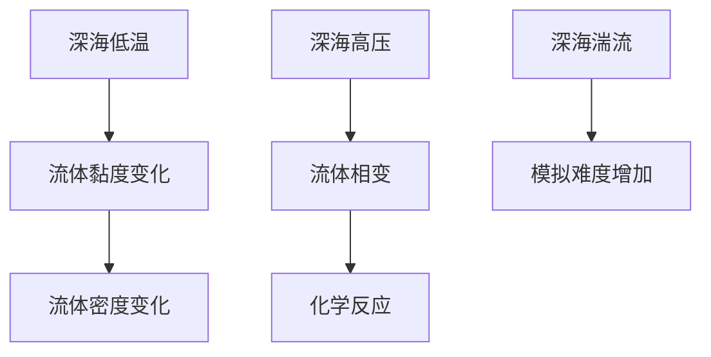

##### 6.2 深海流体力学模型建立

建立深海流体力学模型需要考虑流体的连续性、动量守恒和能量守恒方程。在深海环境中，还需要考虑流体的相变和化学反应等复杂现象。

**LaTeX 数学公式：**

$$
\begin{align*}
\frac{\partial \rho}{\partial t} + \nabla \cdot (\rho \mathbf{u}) &= 0, \\
\frac{\partial (\rho \mathbf{u})}{\partial t} + \nabla \cdot (\rho \mathbf{u} \mathbf{u}) &= -\nabla p + \mu \nabla^2 \mathbf{u} + \mathbf{f}_{\text{相变}}, \\
\frac{\partial (\rho e)}{\partial t} + \nabla \cdot (\rho \mathbf{u} e) &= \nabla \cdot (\kappa \nabla T) + \mathbf{Q}_{\text{化学反应}}.
\end{align*}
$$

##### 6.3 深海流体力学模拟方法

深海流体力学模拟方法包括有限元法、有限体积法和有限差分法等。这些方法将连续的流体力学方程离散化，并在离散空间上进行求解。在实际应用中，研究者们通常结合多种方法，以提高模拟的精度和效率。

**伪代码：**

```python
# 有限体积法示例
def solve_dive_cfd_equations(u, p, dx, dt):
    # 计算速度
    u_new = (u - dt * (1 / dx ** 2) * (p[1:] - p[:-1]) + dt * nu * (u[1:] - 2 * u中间 + u[:-1]) for i in range(len(u)))
    # 计算压力
    p_new = solve_pressure_equation(u_new, dx, dt)
    return u_new, p_new
```

#### 第7章：深海探索中的计算流体力学应用实例

##### 7.1 深海潜水器的流体力学分析

深海潜水器的流体力学分析是确保潜水器在深海环境中稳定运行的关键。通过计算流体力学模拟，可以分析潜水器在深海环境中的流体动力学响应，如阻力、升力和扭矩等。

**Mermaid 流程图：**

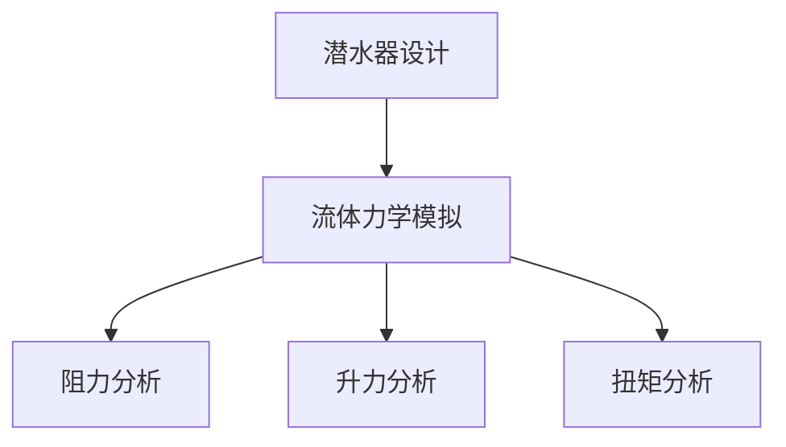

##### 7.2 深海管道的流体力学分析

深海管道的流体力学分析是保障深海油气开发和海底工程建设的重要环节。通过计算流体力学模拟，可以评估管道在深海环境中的流体动力学行为，如压力分布、流量特性和稳定性等。

**Mermaid 流程图：**

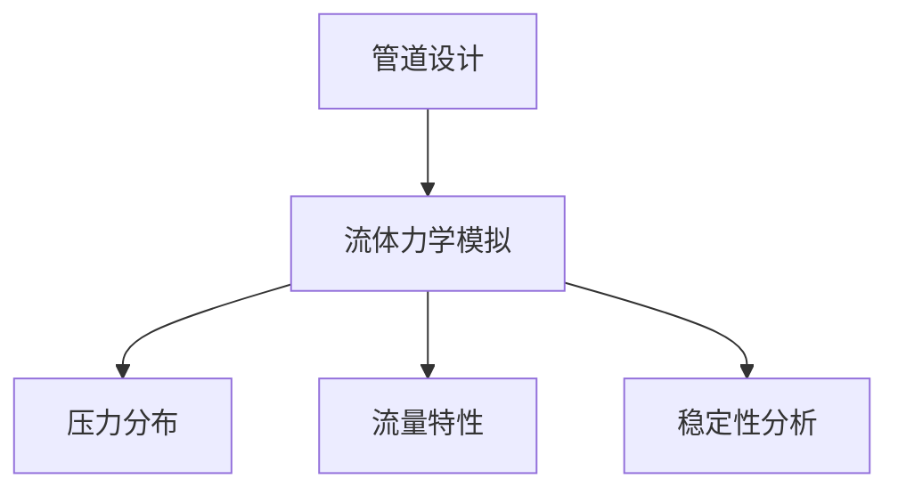

##### 7.3 深海资源开采的流体力学分析

深海资源开采涉及到复杂的流体运动现象，如气泡、颗粒悬浮和湍流等。通过计算流体力学模拟，可以优化开采工艺，提高资源开采效率，减少环境破坏。

**Mermaid 流程图：**

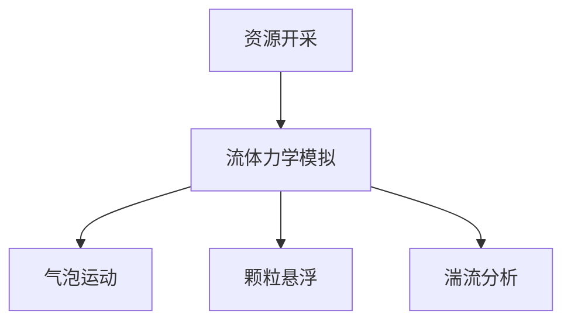

#### 第8章：极限环境下的数学模拟挑战与展望

##### 8.1 极限环境下的模拟挑战

极限环境下的数学模拟面临着计算资源、数据采集和模型准确性等多方面的挑战。深海环境的高压、低温和复杂的湍流现象对模拟精度提出了更高的要求。同时，深海环境的数据采集难度较大，限制了模型的准确性。

**Mermaid 流程图：**

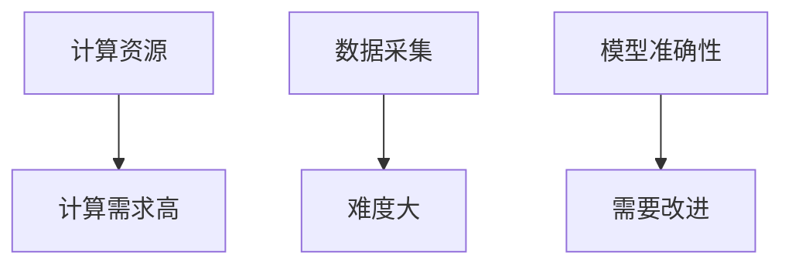

##### 8.2 未来发展展望

随着计算技术的进步和算法的创新，极限环境下的数学模拟有望取得重大突破。高性能计算、数据驱动模型和机器学习等技术的应用将进一步提高模拟的精度和效率。此外，跨学科的研究合作也将有助于解决极限环境下的复杂问题。

**Mermaid 流程图：**

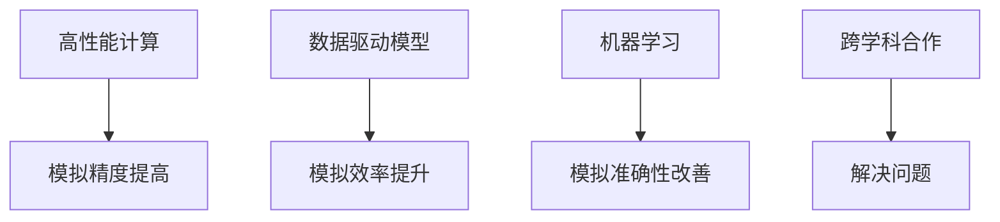

##### 8.3 技术创新与突破方向

技术创新是推动极限环境数学模拟发展的关键。以下是几个潜在的突破方向：

1. **高性能计算技术**：发展更高效、更强大的计算平台，提高模拟的精度和速度。
2. **数据驱动模型**：结合大数据和机器学习技术，建立更准确的模型，提高模拟的准确性。
3. **跨学科研究**：结合物理、化学、生物学等多学科知识，深入研究极限环境下的流体力学现象，为模型改进提供理论基础。
4. **实验与模拟相结合**：通过实验验证和模拟相结合，不断提高模型的准确性和可靠性。

**Mermaid 流程图：**

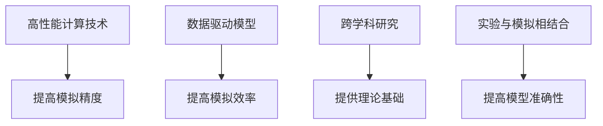

### 第三部分：实战与代码

#### 第9章：计算流体力学模拟项目实战

##### 9.1 项目介绍

本项目旨在通过计算流体力学模拟，研究深海潜水器在高压、低温环境中的流体动力学响应。通过模拟潜水器的运动轨迹、阻力、升力和扭矩等参数，为潜水器的设计和优化提供科学依据。

##### 9.2 环境搭建与配置

为了进行计算流体力学模拟，我们需要搭建一个合适的环境。以下是一个基本的配置：

- **软件工具**：OpenFOAM、ANSYS CFD、FLUENT等。
- **硬件平台**：高性能计算机或云计算平台。
- **编程语言**：Python、C++等。

##### 9.3 模拟过程与结果分析

在搭建好模拟环境后，我们开始进行潜水器的流体力学模拟。以下是一个简单的模拟过程：

1. **几何建模**：使用CAD软件建立潜水器的几何模型。
2. **网格划分**：对潜水器模型进行网格划分，确保计算精度。
3. **边界条件设置**：设置流场的入口、出口和潜水器的表面条件。
4. **求解器选择**：选择合适的求解器，如压力-速度耦合方法。
5. **求解与结果分析**：运行求解器，得到潜水器在流体中的运动轨迹、阻力、升力和扭矩等参数，并进行分析。

**伪代码：**

```python
# 建立潜水器模型
model = build_submersible_model()

# 网格划分
grid = mesh_submersible(model)

# 设置边界条件
set_boundary_conditions(grid)

# 选择求解器
solver = choose_solver(grid)

# 求解与结果分析
results = solver.solve()
analyze_results(results)
```

#### 第10章：计算流体力学代码实例解析

##### 10.1 代码实现流程

计算流体力学代码实例的实现流程通常包括以下步骤：

1. **几何建模**：使用CAD软件建立流体域和边界几何模型。
2. **网格划分**：对流体域和边界进行网格划分，确保计算精度。
3. **边界条件设置**：设置流场的入口、出口和边界几何的边界条件。
4. **求解器选择**：选择合适的求解器，如有限体积法或有限元法。
5. **求解与结果分析**：运行求解器，得到流场参数，如速度、压力和温度等，并进行结果分析。

##### 10.2 关键代码解读

以下是一个简单的计算流体力学代码实例，使用有限体积法求解Navier-Stokes方程：

```python
import numpy as np

# 函数：求解Navier-Stokes方程
def solve_navier_stokes(u, p, dx, dt):
    # 计算速度
    u_new = u - dt * (1 / dx ** 2) * (p[1:] - p[:-1]) + dt * nu * (u[1:] - 2 * u中间 + u[:-1])
    # 计算压力
    p_new = solve_pressure_equation(u_new, dx, dt)
    return u_new, p_new

# 参数：时间步长、网格间距、黏度等
dt = 0.01
dx = 0.1
nu = 0.01

# 初值：速度和压力
u = np.zeros(grid_size)
p = np.zeros(grid_size)

# 求解Navier-Stokes方程
u, p = solve_navier_stokes(u, p, dx, dt)

# 结果分析
analyze_results(u, p)
```

##### 10.3 代码性能分析与优化

代码性能分析与优化是提高计算流体力学模拟效率的关键。以下是一些常见的优化方法：

1. **并行计算**：利用多核处理器和分布式计算资源，提高计算速度。
2. **稀疏矩阵求解**：对于大规模问题，使用稀疏矩阵求解算法，减少计算时间。
3. **自适应网格划分**：根据流场特性，动态调整网格密度，提高计算精度。
4. **预处理技术**：使用预处理技术，如LU分解、迭代方法等，提高线性方程组的求解效率。

#### 第11章：计算流体力学源代码分析与解读

##### 11.1 源代码结构

计算流体力学源代码通常包括以下模块：

1. **几何建模模块**：建立流体域和边界几何模型。
2. **网格划分模块**：对流体域和边界进行网格划分。
3. **边界条件设置模块**：设置流场的入口、出口和边界条件。
4. **求解器模块**：实现流体力学方程的求解。
5. **结果分析模块**：分析流场参数，如速度、压力和温度等。

##### 11.2 源代码关键部分解读

以下是一个计算流体力学源代码的关键部分，主要涉及网格划分和求解器实现：

```c++
// 函数：网格划分
void mesh_fluid_domain() {
    // 初始化网格
    initialize_mesh();

    // 划分网格
    for (int i = 0; i < grid_size; ++i) {
        for (int j = 0; j < grid_size; ++j) {
            // 计算网格点位置
            double x = i * dx;
            double y = j * dy;

            // 划分网格单元
            mesh_element(x, y);
        }
    }
}

// 函数：求解器实现
void solve_fluid_equations() {
    // 初始化速度和压力
    initialize_velocity_and_pressure();

    // 迭代求解
    for (int iter = 0; iter < max_iterations; ++iter) {
        // 计算速度
        calculate_velocity();

        // 计算压力
        calculate_pressure();

        // 更新速度和压力
        update_velocity_and_pressure();
    }
}
```

##### 11.3 源代码性能分析与改进

源代码的性能分析与改进是提高计算流体力学模拟效率的重要手段。以下是一些常见的改进方法：

1. **代码优化**：通过优化算法和数据结构，减少计算时间和内存消耗。
2. **并行计算**：利用多核处理器和分布式计算资源，提高计算速度。
3. **预处理技术**：使用预处理技术，如LU分解、迭代方法等，提高线性方程组的求解效率。
4. **自适应网格划分**：根据流场特性，动态调整网格密度，提高计算精度。

### 附录

#### 附录 A：计算流体力学相关工具与资源

##### A.1 计算流体力学软件工具对比

以下是一些常见的计算流体力学软件工具及其特点：

| 工具名称 | 特点 | 适用领域 |
| --- | --- | --- |
| OpenFOAM | 开源、跨平台、支持多种流体力学模型 | 流体力学模拟、湍流模拟、多相流模拟 |
| ANSYS CFD | 功能强大、用户界面友好、集成其他工程软件 | 工业流体力学模拟、热传递模拟、多物理场模拟 |
| FLUENT | 广泛应用、支持多种流体力学模型、强大的后处理功能 | 流体力学模拟、湍流模拟、多相流模拟 |
| STAR-CCM+ | 高性能计算、自适应网格划分、丰富的材料库 | 工业流体力学模拟、热传递模拟、多物理场模拟 |

##### A.2 计算流体力学开源资源介绍

以下是一些常用的计算流体力学开源资源：

| 资源名称 | 描述 | 链接 |
| --- | --- | --- |
| OpenFOAM Documentation | OpenFOAM官方文档 | <https://www.openfoam.com/docs/> |
| CFD Wiki | 计算流体力学相关资料和教程 | <https://cfd-wiki.org/> |
| OpenFOAM User Forum | OpenFOAM用户论坛 | <https://www.openfoam.com/forum/> |

##### A.3 计算流体力学相关数据库与资料

以下是一些常用的计算流体力学数据库和资料：

| 数据库名称 | 描述 | 链接 |
| --- | --- | --- |
| NASA CFD Database | NASA提供的计算流体力学数据库 | <https://www.grc.nasa.gov/WWW/K-12/airplane/cfdb.html> |
| AIAA CFD Online Library | AIAA提供的计算流体力学在线图书馆 | <https://www.aiaa.org/Online-Library> |
| CFD-Online | 计算流体力学相关论坛和资源 | <https://www.cfd-online.com/> |

### 作者信息

作者：AI天才研究院/AI Genius Institute & 禅与计算机程序设计艺术 /Zen And The Art of Computer Programming

### 结束语

本文系统地介绍了计算流体力学在深海探索中的应用，从基础理论到实际应用，再到代码实例解析，为读者提供了一个全面的技术框架。通过本文的学习，读者可以深入理解CFD在极限环境下的模拟方法和技术，为深海科学研究和工程应用提供有力支持。同时，本文也展望了CFD领域未来的发展趋势和潜在突破方向，为读者提供了宝贵的思考和借鉴。希望本文能够激发读者对计算流体力学的兴趣，共同推动这一领域的发展。

