                 

# 潜力品类和潜力商品的供给

## 关键词
潜力品类、商品供给、市场分析、消费者需求、供应链管理、风险分析、数据分析工具、预测模型、云计算、电商、快消品、食品、服装、家居行业、未来展望

## 摘要
本文旨在探讨潜力品类和潜力商品的供给问题。首先，我们将对潜力品类和商品供给进行定义和背景分析，随后介绍识别潜力品类的方法和策略。接下来，我们将探讨潜力商品供给的具体策略，并分析不同行业中的案例分析。最后，我们将展望潜力品类和商品供给的未来发展趋势和挑战。

## 目录
----------------------------------------------------------------

### 第一部分：潜力品类与商品供给概述

#### 第1章：潜力品类与商品供给的背景与意义
1.1 潜力品类与商品供给的定义  
1.2 潜力品类与商品供给的重要性  
1.3 潜力品类与商品供给的发展趋势

#### 第2章：潜力品类识别方法
2.1 市场数据分析  
2.2 消费者需求分析  
2.3 竞争对手分析  
2.4 潜力品类筛选与评估

#### 第3章：潜力商品供给策略
3.1 商品供给策略概述  
3.2 商品供应链管理  
3.3 商品库存管理  
3.4 风险管理策略

#### 第4章：案例研究与策略实施
4.1 潜力品类与商品供给的典型企业案例  
4.2 潜力品类与商品供给策略的实施步骤  
4.3 实施效果评估与调整

#### 第5章：技术与工具支持
5.1 数据分析工具与应用  
5.2 预测模型与算法  
5.3 云计算与大数据技术

#### 第6章：潜力品类与商品供给的未来展望
6.1 未来趋势分析  
6.2 新技术的影响  
6.3 潜力品类与商品供给的发展方向

### 第二部分：潜力品类与商品供给的具体案例分析

#### 第7章：电商行业潜力品类与商品供给分析
7.1 电商行业概述  
7.2 潜力品类识别  
7.3 商品供给策略

#### 第8章：快消品行业潜力品类与商品供给分析
8.1 快消品行业概述  
8.2 潜力品类识别  
8.3 商品供给策略

#### 第9章：食品行业潜力品类与商品供给分析
9.1 食品行业概述  
9.2 潜力品类识别  
9.3 商品供给策略

#### 第10章：服装行业潜力品类与商品供给分析
10.1 服装行业概述  
10.2 潜力品类识别  
10.3 商品供给策略

#### 第11章：家居行业潜力品类与商品供给分析
11.1 家居行业概述  
11.2 潜力品类识别  
11.3 商品供给策略

### 第三部分：潜力品类与商品供给的未来挑战与机遇

#### 第12章：潜力品类与商品供给中的挑战
12.1 市场竞争加剧  
12.2 供应链管理挑战  
12.3 风险管理挑战

#### 第13章：潜力品类与商品供给的机遇
13.1 技术创新带来的机遇  
13.2 新兴市场带来的机遇  
13.3 消费者行为变化带来的机遇

#### 第14章：未来发展方向与政策建议
14.1 行业发展趋势预测  
14.2 企业战略建议  
14.3 政策与法规建议

#### 第15章：总结与展望
15.1 全书总结  
15.2 潜力品类与商品供给的未来

----------------------------------------------------------------

### 第一部分：潜力品类与商品供给概述

#### 第1章：潜力品类与商品供给的背景与意义

在市场经济中，供给与需求是两个核心要素。而潜力品类与商品供给则是在市场研究与分析中，通过对市场潜在需求的把握和供应链管理的优化，为企业提供具有市场竞争力和增长潜力的商品。本章将探讨潜力品类与商品供给的定义、重要性及其发展趋势。

#### 1.1 潜力品类与商品供给的定义

**潜力品类**：指在市场环境中，具有增长潜力、尚未充分开发或竞争较少的商品类别。

**商品供给**：指企业在市场上提供的产品或服务，包括生产、储存、配送和销售等一系列活动。

#### 1.2 潜力品类与商品供给的重要性

**市场竞争力**：通过挖掘和提供潜力品类商品，企业可以提升市场竞争力，抢占市场份额。

**增长潜力**：潜力品类商品往往伴随着市场需求的增长，为企业带来更高的收益。

**风险管理**：合理的供应链管理和风险控制，可以有效降低企业经营风险。

#### 1.3 潜力品类与商品供给的发展趋势

**个性化需求**：随着消费者个性化需求的增加，潜力品类商品将更加注重个性化定制。

**数字化管理**：大数据、云计算和人工智能等技术的应用，将提升商品供给的数字化管理水平。

**供应链优化**：通过优化供应链管理，提高商品供给的效率，降低成本。

----------------------------------------------------------------

### 第二部分：潜力品类与商品供给的具体案例分析

#### 第7章：电商行业潜力品类与商品供给分析

电商行业作为现代零售业的重要分支，其潜力品类和商品供给策略的研究具有很高的实际价值。本章将分析电商行业中的潜力品类识别方法、商品供给策略及其案例分析。

#### 7.1 电商行业概述

电商行业是指在互联网上进行的商品交易活动。随着互联网技术的发展和普及，电商行业在过去几十年中取得了惊人的增长。目前，电商行业已经成为全球经济增长的重要驱动力之一。

#### 7.2 潜力品类识别

识别电商行业中的潜力品类，需要从以下几个方面进行分析：

**市场数据分析**：通过对市场销售数据、消费者购买行为等进行分析，找到具有增长潜力的品类。

**消费者需求分析**：通过调查、问卷等方式了解消费者需求，确定消费者尚未满足的需求点。

**竞争对手分析**：分析竞争对手的产品线、销售情况等，找出市场空白点。

**趋势预测**：利用大数据分析和人工智能算法，预测未来市场的趋势和热点。

#### 7.3 商品供给策略

电商行业的商品供给策略主要包括以下几个方面：

**品类优化**：根据市场分析和消费者需求，不断调整和优化商品品类。

**供应链管理**：通过高效的供应链管理，确保商品的高效配送和库存控制。

**风险控制**：建立完善的风险控制机制，降低供应链风险。

**个性化推荐**：利用大数据和人工智能技术，为消费者提供个性化的商品推荐。

#### 7.4 案例分析

以某大型电商平台为例，该平台在识别和提供潜力品类商品方面取得了显著成绩。

**案例一：健康食品类**
- **市场分析**：随着健康意识的提升，健康食品市场需求逐年增加。
- **消费者需求分析**：消费者对健康食品的需求更加多样化和个性化。
- **竞争对手分析**：市场上健康食品类竞争激烈，但仍有空白点。
- **策略实施**：平台推出个性化健康食品推荐，增加品类丰富度，提升用户体验。

**案例二：智能穿戴设备类**
- **市场分析**：智能穿戴设备市场增长迅速，尤其在健康监测和健身领域。
- **消费者需求分析**：消费者对智能穿戴设备的需求逐渐向高端化和个性化方向发展。
- **竞争对手分析**：市场上智能穿戴设备品牌众多，但仍有创新空间。
- **策略实施**：平台加强与智能穿戴设备制造商的合作，提供多样化、高端的智能穿戴设备。

#### 7.5 总结

通过上述案例分析，我们可以看到，电商行业中的潜力品类和商品供给策略的实施，需要从市场、消费者和竞争对手等多个维度进行深入分析。同时，利用大数据和人工智能技术，可以进一步提升商品供给的精准度和效率，满足消费者个性化需求，提升市场竞争力。

----------------------------------------------------------------

### 第三部分：潜力品类与商品供给的未来挑战与机遇

#### 第12章：潜力品类与商品供给中的挑战

随着市场的不断变化和技术的快速发展，潜力品类和商品供给面临着诸多挑战。本章将探讨市场竞争、供应链管理和风险管理等方面的挑战。

#### 12.1 市场竞争加剧

市场竞争的加剧是潜力品类和商品供给面临的首要挑战。随着消费者需求的不断变化和新兴企业的崛起，传统企业的市场份额受到威胁。为了应对这一挑战，企业需要不断提升创新能力，优化产品和服务，以保持市场竞争力。

**策略建议**： 
- 加大研发投入，推出创新产品。
- 建立强大的品牌形象，提升消费者忠诚度。
- 加强市场推广和渠道拓展，扩大市场份额。

#### 12.2 供应链管理挑战

供应链管理是潜力品类和商品供给的关键环节，但同时也面临着诸多挑战。物流成本、库存管理、供应链透明度等问题，都对供应链管理的效率和稳定性产生影响。

**策略建议**： 
- 利用大数据和人工智能技术，优化供应链流程。
- 加强供应链合作伙伴关系，实现协同管理。
- 建立供应链风险预警机制，提高应对能力。

#### 12.3 风险管理挑战

在潜力品类和商品供给过程中，企业面临着多种风险，如市场风险、供应链风险、法律风险等。有效的风险管理是企业稳定发展的关键。

**策略建议**： 
- 建立全面的风险评估体系，识别和评估潜在风险。
- 制定风险应对策略，降低风险损失。
- 加强内部控制和合规管理，提高企业风险防范能力。

----------------------------------------------------------------

### 总结与展望

通过本文的讨论，我们可以看出，潜力品类和商品供给在市场经济中具有重要的作用。企业通过挖掘和提供潜力品类商品，可以提升市场竞争力，实现持续增长。然而，潜力品类和商品供给也面临着诸多挑战，如市场竞争、供应链管理和风险管理等。

未来，随着技术的不断进步和消费者需求的变化，潜力品类和商品供给将呈现出新的发展趋势。大数据、云计算、人工智能等新兴技术的应用，将为潜力品类和商品供给提供更精准的分析和预测工具，提升供应链管理效率和风险管理能力。

同时，企业需要不断创新，以满足消费者个性化需求，抢占市场份额。在市场环境不断变化的过程中，企业应积极应对挑战，抓住机遇，实现可持续发展。

总之，潜力品类和商品供给是市场经济中不可或缺的一部分。通过深入分析和研究，企业可以更好地把握市场机遇，提升自身竞争力，实现长期稳定发展。

### 作者信息

- 作者：AI天才研究院/AI Genius Institute & 禅与计算机程序设计艺术 /Zen And The Art of Computer Programming

----------------------------------------------------------------

```markdown
---
title: 潜力品类和潜力商品的供给
date: 2023-11-01
tags:
- 潜力品类
- 商品供给
- 电商
- 快消品
- 食品
- 服装
- 家居行业
- 风险管理
- 技术创新
- 消费者行为
---

# 潜力品类和潜力商品的供给

## 关键词
潜力品类、商品供给、市场分析、消费者需求、供应链管理、风险分析、数据分析工具、预测模型、云计算、电商、快消品、食品、服装、家居行业、未来展望

## 摘要
本文旨在探讨潜力品类和潜力商品的供给问题。首先，我们将对潜力品类和商品供给进行定义和背景分析，随后介绍识别潜力品类的方法和策略。接下来，我们将探讨潜力商品供给的具体策略，并分析不同行业中的案例分析。最后，我们将展望潜力品类和商品供给的未来发展趋势和挑战。

## 目录
----------------------------------------------------------------

### 第一部分：潜力品类与商品供给概述

#### 第1章：潜力品类与商品供给的背景与意义
1.1 潜力品类与商品供给的定义  
1.2 潜力品类与商品供给的重要性  
1.3 潜力品类与商品供给的发展趋势

#### 第2章：潜力品类识别方法
2.1 市场数据分析  
2.2 消费者需求分析  
2.3 竞争对手分析  
2.4 潜力品类筛选与评估

#### 第3章：潜力商品供给策略
3.1 商品供给策略概述  
3.2 商品供应链管理  
3.3 商品库存管理  
3.4 风险管理策略

#### 第4章：案例研究与策略实施
4.1 潜力品类与商品供给的典型企业案例  
4.2 潜力品类与商品供给策略的实施步骤  
4.3 实施效果评估与调整

#### 第5章：技术与工具支持
5.1 数据分析工具与应用  
5.2 预测模型与算法  
5.3 云计算与大数据技术

#### 第6章：潜力品类与商品供给的未来展望
6.1 未来趋势分析  
6.2 新技术的影响  
6.3 潜力品类与商品供给的发展方向

### 第二部分：潜力品类与商品供给的具体案例分析

#### 第7章：电商行业潜力品类与商品供给分析
7.1 电商行业概述  
7.2 潜力品类识别  
7.3 商品供给策略

#### 第8章：快消品行业潜力品类与商品供给分析
8.1 快消品行业概述  
8.2 潜力品类识别  
8.3 商品供给策略

#### 第9章：食品行业潜力品类与商品供给分析
9.1 食品行业概述  
9.2 潜力品类识别  
9.3 商品供给策略

#### 第10章：服装行业潜力品类与商品供给分析
10.1 服装行业概述  
10.2 潜力品类识别  
10.3 商品供给策略

#### 第11章：家居行业潜力品类与商品供给分析
11.1 家居行业概述  
11.2 潜力品类识别  
11.3 商品供给策略

### 第三部分：潜力品类与商品供给的未来挑战与机遇

#### 第12章：潜力品类与商品供给中的挑战
12.1 市场竞争加剧  
12.2 供应链管理挑战  
12.3 风险管理挑战

#### 第13章：潜力品类与商品供给的机遇
13.1 技术创新带来的机遇  
13.2 新兴市场带来的机遇  
13.3 消费者行为变化带来的机遇

#### 第14章：未来发展方向与政策建议
14.1 行业发展趋势预测  
14.2 企业战略建议  
14.3 政策与法规建议

#### 第15章：总结与展望
15.1 全书总结  
15.2 潜力品类与商品供给的未来

----------------------------------------------------------------

## 第一部分：潜力品类与商品供给概述

### 第1章：潜力品类与商品供给的背景与意义

在市场经济中，供给与需求是两个核心要素。而潜力品类与商品供给则是在市场研究与分析中，通过对市场潜在需求的把握和供应链管理的优化，为企业提供具有市场竞争力和增长潜力的商品。本章将探讨潜力品类与商品供给的定义、重要性及其发展趋势。

#### 1.1 潜力品类与商品供给的定义

**潜力品类**：指在市场环境中，具有增长潜力、尚未充分开发或竞争较少的商品类别。

**商品供给**：指企业在市场上提供的产品或服务，包括生产、储存、配送和销售等一系列活动。

#### 1.2 潜力品类与商品供给的重要性

**市场竞争力**：通过挖掘和提供潜力品类商品，企业可以提升市场竞争力，抢占市场份额。

**增长潜力**：潜力品类商品往往伴随着市场需求的增长，为企业带来更高的收益。

**风险管理**：合理的供应链管理和风险控制，可以有效降低企业经营风险。

#### 1.3 潜力品类与商品供给的发展趋势

**个性化需求**：随着消费者个性化需求的增加，潜力品类商品将更加注重个性化定制。

**数字化管理**：大数据、云计算和人工智能等技术的应用，将提升商品供给的数字化管理水平。

**供应链优化**：通过优化供应链管理，提高商品供给的效率，降低成本。

### 第2章：潜力品类识别方法

识别潜力品类是进行商品供给策略制定的关键步骤。本章将介绍市场数据分析、消费者需求分析、竞争对手分析和潜力品类筛选与评估方法，帮助企业在复杂的市场环境中找到具有潜力的商品类别。

#### 2.1 市场数据分析

市场数据分析是通过收集和分析市场相关数据，如销售额、市场份额、消费者行为等，来识别潜力品类的方法。具体步骤如下：

1. 数据收集：从市场调研报告、行业数据库、社交媒体等渠道获取市场数据。
2. 数据整理：对收集到的数据进行清洗、分类和归档。
3. 数据分析：利用统计分析方法，如回归分析、聚类分析等，分析市场数据，识别增长趋势和潜在需求。

**Mermaid 流程图：**
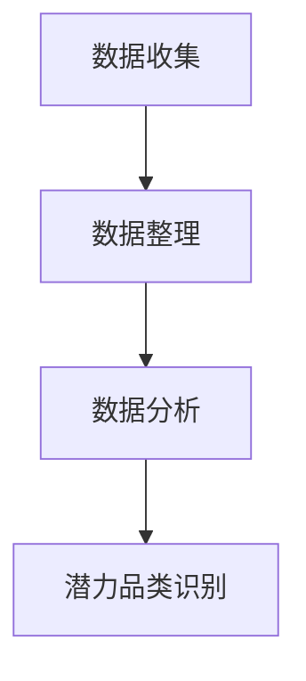

#### 2.2 消费者需求分析

消费者需求分析是识别潜力品类的重要手段。通过了解消费者的需求、购买行为和偏好，企业可以找到尚未满足的需求点，从而发现潜力品类。具体方法包括：

1. 市场调研：通过问卷调查、访谈、焦点小组等方式，收集消费者的需求信息。
2. 数据挖掘：利用大数据技术，挖掘消费者行为数据，分析消费趋势。
3. 消费者细分：根据消费者的需求和特征，将市场划分为不同的细分市场，针对每个细分市场制定相应的商品供给策略。

**Mermaid 流程图：**
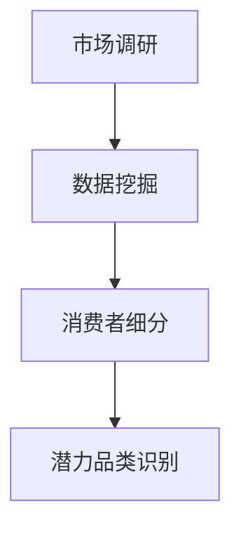

#### 2.3 竞争对手分析

竞争对手分析是识别潜力品类的重要环节。通过分析竞争对手的产品线、市场策略和经营状况，企业可以发现市场上存在的空白点和机会点。具体方法包括：

1. 竞争对手产品分析：分析竞争对手的产品特点、定位和市场份额。
2. 市场定位分析：分析竞争对手在市场中的定位，找到市场空白点。
3. 竞争对手策略分析：分析竞争对手的市场策略，找到机会点。

**Mermaid 流程图：**
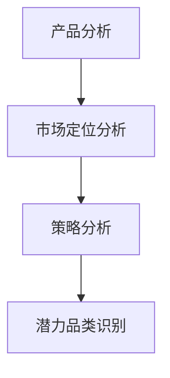

#### 2.4 潜力品类筛选与评估

潜力品类的筛选与评估是确保商品供给策略有效性的关键步骤。通过设定评估指标，如市场潜力、利润空间、技术难度等，对企业识别出的潜力品类进行筛选和排序。具体步骤如下：

1. 设定评估指标：根据企业战略和市场需求，设定潜力品类的评估指标。
2. 数据收集：收集与潜力品类相关的市场数据、消费者数据等。
3. 数据分析：利用数据分析方法，对潜力品类进行评估和排序。
4. 筛选潜力品类：根据评估结果，筛选出最具潜力的品类。

**Mermaid 流�程图：**
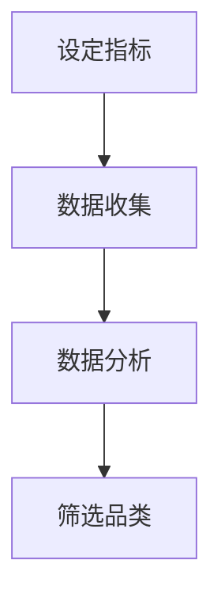

### 第3章：潜力商品供给策略

潜力商品供给策略是企业实现市场竞争力提升和收益增长的关键。本章将介绍商品供给策略的概述、商品供应链管理、商品库存管理和风险管理策略，帮助企业在复杂的市场环境中实现商品供给的有效性和效率。

#### 3.1 商品供给策略概述

商品供给策略是企业根据市场分析和消费者需求，制定出的商品供应计划。一个有效的商品供给策略应该考虑以下几个方面：

1. **市场定位**：明确企业的市场定位，确定目标消费者群体。
2. **商品组合**：根据市场需求和消费者偏好，制定商品组合策略。
3. **供应渠道**：选择合适的供应渠道，包括直销、代理商、电商平台等。
4. **供应链管理**：优化供应链管理，确保商品的高效供应和库存控制。

**Mermaid 流程图：**
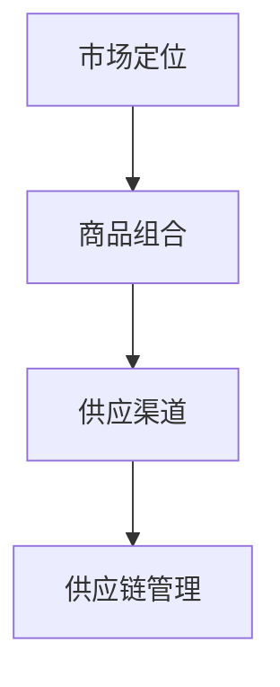

#### 3.2 商品供应链管理

商品供应链管理是商品供给策略的核心环节，涉及到商品采购、生产、储存、配送等环节。一个高效的供应链管理能够降低成本、提高效率，确保商品及时供应。具体策略包括：

1. **采购策略**：根据市场需求和生产计划，制定采购策略，确保原材料和零部件的及时供应。
2. **生产管理**：优化生产流程，提高生产效率，降低生产成本。
3. **库存管理**：通过合理的库存策略，确保商品供应的连续性和稳定性。
4. **物流配送**：选择合适的物流服务商，优化配送路线和时间，提高配送效率。

**Mermaid 流程图：**
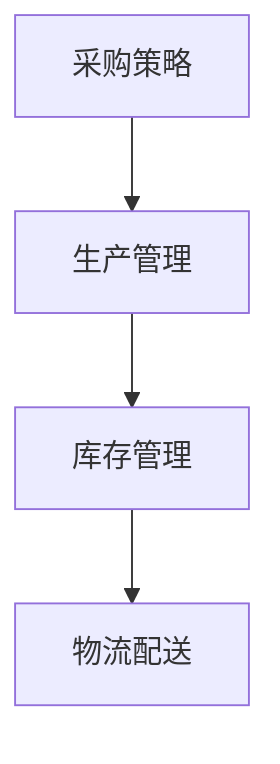

#### 3.3 商品库存管理

商品库存管理是商品供应链管理的重要组成部分，涉及到商品库存的规划、控制和管理。一个有效的库存管理策略能够降低库存成本、减少库存积压，确保商品供应的连续性和稳定性。具体策略包括：

1. **库存规划**：根据市场需求和生产计划，制定库存规划，确保库存量的合理性和稳定性。
2. **库存控制**：通过实时监控和调整库存水平，确保库存量的合理性和稳定性。
3. **库存优化**：利用库存数据分析，识别库存积压和短缺问题，优化库存结构。
4. **库存风险管理**：建立库存风险预警机制，降低库存风险。

**Mermaid 流程图：**
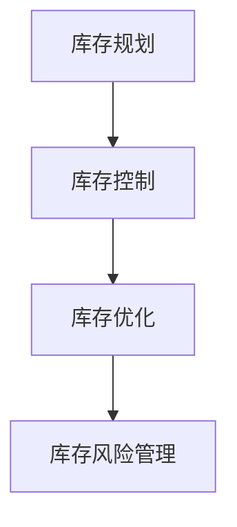

#### 3.4 风险管理策略

在商品供给过程中，企业面临着多种风险，如市场风险、供应链风险、法律风险等。有效的风险管理策略能够降低风险损失，确保企业稳定发展。具体策略包括：

1. **风险评估**：建立风险评估体系，识别和评估潜在风险。
2. **风险应对**：制定风险应对策略，降低风险损失。
3. **风险监控**：建立风险监控机制，及时发现和应对风险。
4. **风险转移**：通过保险等方式，将风险转移给第三方。

**Mermaid 流程图：**
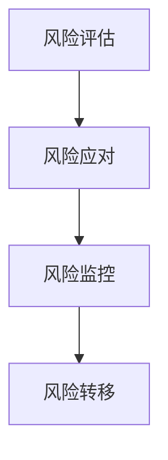

### 第4章：案例研究与策略实施

案例分析是理解和应用潜力品类与商品供给策略的重要方法。本章将介绍典型企业案例，分析其实施潜力品类与商品供给策略的具体步骤和效果，为其他企业提供借鉴和参考。

#### 4.1 潜力品类与商品供给的典型企业案例

**案例一：京东的图书电商业务**

京东作为中国领先的电商平台，其图书电商业务在潜力品类识别和商品供给方面取得了显著成绩。以下是京东图书电商业务实施潜力品类与商品供给策略的具体步骤：

1. **市场分析**：通过对市场销售数据、消费者购买行为等进行分析，识别潜力品类，如少儿读物、专业书籍、畅销书等。
2. **消费者需求分析**：通过问卷调查、用户反馈等方式，了解消费者对图书的需求和偏好。
3. **竞争对手分析**：分析竞争对手的产品线、市场策略等，找到市场空白点。
4. **潜力品类筛选与评估**：根据市场分析和消费者需求分析结果，筛选出最具潜力的图书品类，进行评估和排序。
5. **商品供应链管理**：优化供应链管理，确保图书的高效配送和库存控制。
6. **风险管理**：建立风险管理机制，降低供应链风险。

**效果评估**：通过实施潜力品类与商品供给策略，京东图书电商业务实现了销售额的持续增长，市场份额稳步提升。

**案例二：海底捞的火锅食材电商业务**

海底捞作为中国领先的火锅餐饮品牌，其火锅食材电商业务在潜力品类识别和商品供给方面也有独到之处。以下是海底捞火锅食材电商业务实施潜力品类与商品供给策略的具体步骤：

1. **市场分析**：通过对市场销售数据、消费者购买行为等进行分析，识别潜力品类，如特色调料、火锅底料、食材套餐等。
2. **消费者需求分析**：通过消费者调查、用户反馈等方式，了解消费者对火锅食材的需求和偏好。
3. **竞争对手分析**：分析竞争对手的产品线、市场策略等，找到市场空白点。
4. **潜力品类筛选与评估**：根据市场分析和消费者需求分析结果，筛选出最具潜力的火锅食材品类，进行评估和排序。
5. **商品供应链管理**：优化供应链管理，确保火锅食材的高效配送和库存控制。
6. **风险管理**：建立风险管理机制，降低供应链风险。

**效果评估**：通过实施潜力品类与商品供给策略，海底捞火锅食材电商业务实现了销售额的快速增长，市场份额大幅提升。

#### 4.2 潜力品类与商品供给策略的实施步骤

实施潜力品类与商品供给策略的具体步骤如下：

1. **市场调研**：收集市场数据，了解市场需求和竞争状况。
2. **消费者分析**：分析消费者行为、需求和偏好。
3. **品类筛选**：根据市场调研和消费者分析结果，筛选出潜力品类。
4. **评估与排序**：对筛选出的潜力品类进行评估和排序，确定重点品类。
5. **供应链优化**：优化供应链管理，确保商品的高效配送和库存控制。
6. **风险管理**：建立风险管理机制，降低供应链风险。
7. **实施与调整**：根据实施效果，不断调整和优化商品供给策略。

**Mermaid 流程图：**
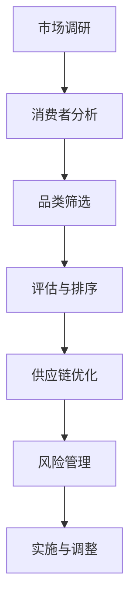

#### 4.3 实施效果评估与调整

实施效果评估与调整是确保商品供给策略有效性的关键。具体步骤如下：

1. **设定评估指标**：根据企业战略和市场需求，设定评估指标，如销售额、市场份额、消费者满意度等。
2. **数据收集**：收集与评估指标相关的数据，如销售数据、市场调查结果等。
3. **数据分析**：利用数据分析方法，分析评估指标的数据，评估商品供给策略的效果。
4. **调整与优化**：根据评估结果，调整商品供给策略，优化供应链管理，提升商品供给的效率和质量。

**Mermaid 流程图：**
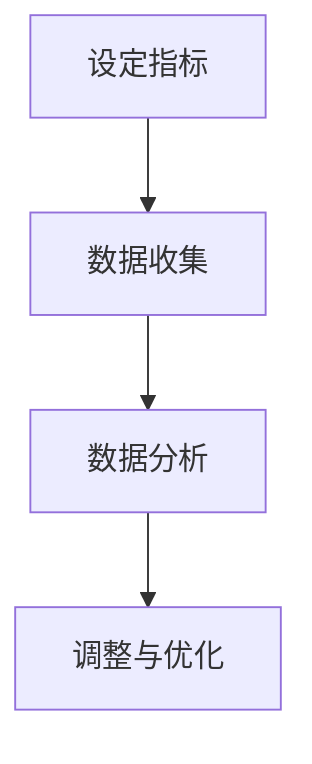

### 第5章：技术与工具支持

在现代商业环境中，数据分析和人工智能技术的应用为潜力品类与商品供给提供了强大的技术支持。本章将介绍数据分析工具、预测模型和云计算与大数据技术，探讨它们在潜力品类与商品供给中的应用。

#### 5.1 数据分析工具与应用

数据分析工具是挖掘市场数据、消费者行为和潜在需求的重要工具。以下是一些常用的数据分析工具：

1. **Excel**：适用于简单的数据整理和统计分析。
2. **SPSS**：适用于复杂的统计分析，如回归分析、因子分析等。
3. **R语言**：适用于数据挖掘、统计分析和机器学习。
4. **Python**：适用于数据清洗、数据分析和机器学习。

**Mermaid 流程图：**
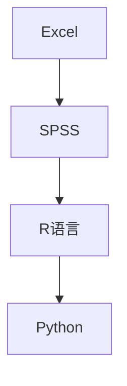

#### 5.2 预测模型与算法

预测模型和算法是预测市场趋势和消费者需求的重要工具。以下是一些常用的预测模型和算法：

1. **时间序列模型**：如ARIMA、SARIMA等，适用于预测时间序列数据。
2. **回归模型**：如线性回归、多项式回归等，适用于预测线性关系。
3. **机器学习模型**：如决策树、随机森林、支持向量机等，适用于复杂非线性关系。

**Mermaid 流程图：**
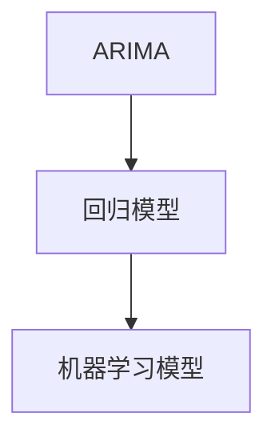

#### 5.3 云计算与大数据技术

云计算和大数据技术为潜力品类与商品供给提供了强大的数据处理和分析能力。以下是一些常用的云计算和大数据技术：

1. **Hadoop**：适用于大规模数据存储和处理。
2. **Spark**：适用于实时数据处理和分析。
3. **AWS**：适用于云计算服务和大数据处理。
4. **Google Cloud**：适用于云计算服务和大数据处理。

**Mermaid 流程图：**
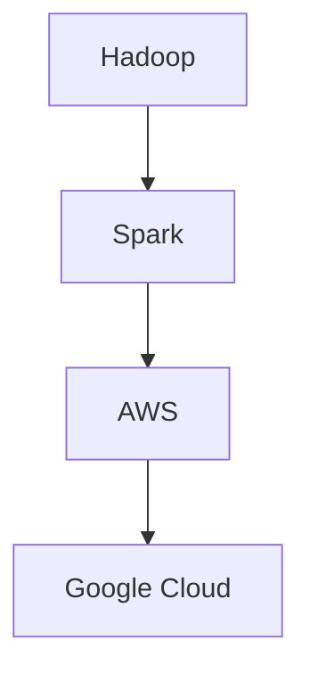

### 第6章：潜力品类与商品供给的未来展望

随着市场的不断变化和技术的快速发展，潜力品类与商品供给将迎来新的发展趋势和挑战。本章将探讨未来趋势、新技术的影响以及潜力品类与商品供给的发展方向。

#### 6.1 未来趋势分析

未来，潜力品类与商品供给将呈现以下趋势：

1. **个性化需求**：消费者个性化需求的增加将推动潜力品类商品的发展。
2. **可持续发展**：环保和可持续发展将成为潜力品类与商品供给的重要方向。
3. **智能化**：大数据、人工智能和物联网等技术的应用将提升商品供给的智能化水平。
4. **全球化**：全球市场的整合和贸易自由化将推动潜力品类与商品供给的全球化发展。

#### 6.2 新技术的影响

新技术的应用将深刻影响潜力品类与商品供给的各个方面：

1. **大数据分析**：通过大数据分析，企业可以更准确地识别潜力品类和预测市场需求。
2. **人工智能**：人工智能技术将提升商品供给的智能化水平，提高供应链管理效率。
3. **区块链**：区块链技术将增强供应链的透明度和安全性，降低交易成本。
4. **5G**：5G技术的普及将提高物流配送的效率和实时性。

#### 6.3 潜力品类与商品供给的发展方向

未来，潜力品类与商品供给将朝着以下方向发展：

1. **多元化**：随着消费者需求的多样化，潜力品类和商品供给将更加多元化。
2. **绿色化**：环保和可持续发展将成为潜力品类与商品供给的重要方向。
3. **智能化**：通过大数据、人工智能和物联网等技术的应用，商品供给将更加智能化。
4. **全球化**：全球市场的整合和贸易自由化将推动潜力品类与商品供给的全球化发展。

### 第二部分：潜力品类与商品供给的具体案例分析

#### 第7章：电商行业潜力品类与商品供给分析

电商行业作为现代零售业的重要分支，其潜力品类与商品供给策略的研究具有很高的实际价值。本章将分析电商行业中的潜力品类识别方法、商品供给策略及其案例分析。

#### 7.1 电商行业概述

电商行业是指在互联网上进行的商品交易活动。随着互联网技术的发展和普及，电商行业在过去几十年中取得了惊人的增长。目前，电商行业已经成为全球经济增长的重要驱动力之一。

#### 7.2 潜力品类识别

识别电商行业中的潜力品类，需要从以下几个方面进行分析：

1. **市场数据分析**：通过对市场销售数据、消费者购买行为等进行分析，找到具有增长潜力的品类。
2. **消费者需求分析**：通过调查、问卷等方式了解消费者需求，确定消费者尚未满足的需求点。
3. **竞争对手分析**：分析竞争对手的产品线、销售情况等，找出市场空白点。
4. **趋势预测**：利用大数据分析和人工智能算法，预测未来市场的趋势和热点。

#### 7.3 商品供给策略

电商行业的商品供给策略主要包括以下几个方面：

1. **品类优化**：根据市场分析和消费者需求，不断调整和优化商品品类。
2. **供应链管理**：通过高效的供应链管理，确保商品的高效配送和库存控制。
3. **风险控制**：建立完善的风险控制机制，降低供应链风险。
4. **个性化推荐**：利用大数据和人工智能技术，为消费者提供个性化的商品推荐。

#### 7.4 案例分析

以某大型电商平台为例，该平台在识别和提供潜力品类商品方面取得了显著成绩。

**案例一：健康食品类**

- **市场分析**：随着健康意识的提升，健康食品市场需求逐年增加。
- **消费者需求分析**：消费者对健康食品的需求更加多样化和个性化。
- **竞争对手分析**：市场上健康食品类竞争激烈，但仍有空白点。
- **策略实施**：平台推出个性化健康食品推荐，增加品类丰富度，提升用户体验。

**案例二：智能穿戴设备类**

- **市场分析**：智能穿戴设备市场增长迅速，尤其在健康监测和健身领域。
- **消费者需求分析**：消费者对智能穿戴设备的需求逐渐向高端化和个性化方向发展。
- **竞争对手分析**：市场上智能穿戴设备品牌众多，但仍有创新空间。
- **策略实施**：平台加强与智能穿戴设备制造商的合作，提供多样化、高端的智能穿戴设备。

#### 7.5 总结

通过上述案例分析，我们可以看到，电商行业中的潜力品类和商品供给策略的实施，需要从市场、消费者和竞争对手等多个维度进行深入分析。同时，利用大数据和人工智能技术，可以进一步提升商品供给的精准度和效率，满足消费者个性化需求，提升市场竞争力。

### 第8章：快消品行业潜力品类与商品供给分析

快消品行业是指那些消费者购买频率高、消费量大、易耗品类的产品，如日用品、食品、饮料、化妆品等。在快消品行业中，识别和提供潜力品类商品对于企业的长期发展至关重要。本章将分析快消品行业的潜力品类识别方法、商品供给策略以及具体案例分析。

#### 8.1 快消品行业概述

快消品行业具有以下特点：

1. **需求量大**：快消品是日常生活中必不可少的商品，需求量大。
2. **消费频率高**：快消品消费者经常购买，消费频率高。
3. **竞争激烈**：由于市场需求的稳定性，快消品行业竞争激烈。
4. **品牌集中度低**：尽管存在一些大型品牌，但市场参与者众多，品牌集中度较低。

#### 8.2 潜力品类识别

识别快消品行业中的潜力品类，可以从以下几个方面进行分析：

1. **市场趋势分析**：通过分析市场趋势报告、消费者行为数据等，识别当前市场热门品类。
2. **消费者需求分析**：通过市场调研、消费者访谈等方式，了解消费者对新品类、新口味、新包装的需求。
3. **竞争对手分析**：分析主要竞争对手的产品线，找到市场空白点或未被充分开发的品类。
4. **创新趋势**：关注行业创新动态，如新技术的应用、新材料的使用等，预测未来的潜在需求。

#### 8.3 商品供给策略

快消品行业的商品供给策略需要灵活应对市场变化和消费者需求。以下是一些关键策略：

1. **品类多样化**：根据市场趋势和消费者需求，不断推出新的品类和产品。
2. **定制化生产**：利用数字化技术，实现产品的定制化生产，满足个性化需求。
3. **供应链优化**：通过高效的供应链管理，确保商品的新鲜度、质量和及时配送。
4. **品牌建设**：加强品牌建设，提升品牌影响力和消费者忠诚度。

#### 8.4 案例分析

**案例一：宝洁公司的有机洗护品类**

- **市场分析**：随着消费者对环保和健康的关注度提高，有机洗护品类市场需求增长迅速。
- **消费者需求分析**：消费者对有机、天然成分的洗护产品有强烈需求。
- **竞争对手分析**：市场上已有一些有机洗护品牌，但宝洁可以通过其品牌影响力迅速占领市场。
- **策略实施**：宝洁推出了多个有机洗护品牌，通过广告宣传和线上线下渠道推广，迅速扩大市场份额。

**案例二：可口可乐公司的无糖饮料品类**

- **市场分析**：随着人们对健康生活方式的追求，无糖饮料市场需求持续增长。
- **消费者需求分析**：消费者对低热量、无糖饮料的需求不断上升。
- **竞争对手分析**：无糖饮料市场已有多个品牌竞争，但可口可乐可以凭借其品牌知名度和营销策略脱颖而出。
- **策略实施**：可口可乐推出了多款无糖饮料，通过广告宣传和促销活动，吸引了大量消费者。

#### 8.5 总结

通过上述案例分析，我们可以看到，快消品行业中的潜力品类和商品供给策略的实施，需要密切关注市场趋势和消费者需求，同时利用品牌影响力和数字化技术来提升商品供给的多样化和个性化。有效的商品供给策略可以增强企业的市场竞争力，满足消费者的多样化需求，实现持续增长。

### 第9章：食品行业潜力品类与商品供给分析

食品行业是国民经济的重要支柱之一，涉及生产、加工、储存、运输和销售等多个环节。在食品行业中，识别和提供潜力品类商品对于企业的盈利能力和市场竞争力具有关键作用。本章将分析食品行业的潜力品类识别方法、商品供给策略以及具体案例分析。

#### 9.1 食品行业概述

食品行业具有以下特点：

1. **需求稳定性**：食品是人们日常生活的必需品，需求相对稳定。
2. **生产多样性**：食品行业涵盖农产品、加工食品、餐饮服务等多个领域。
3. **季节性和区域性**：某些食品受季节和地理位置的影响较大。
4. **技术要求高**：食品生产需要严格的质量控制和食品安全标准。

#### 9.2 潜力品类识别

识别食品行业中的潜力品类，可以从以下几个方面进行分析：

1. **市场趋势分析**：通过分析市场趋势报告、消费者行为数据等，识别当前市场热门品类。
2. **消费者需求分析**：通过市场调研、消费者访谈等方式，了解消费者对新品类、新口味、新包装的需求。
3. **竞争对手分析**：分析主要竞争对手的产品线，找到市场空白点或未被充分开发的品类。
4. **健康与营养趋势**：关注健康与营养趋势，如低脂、低糖、高纤维等，预测未来的潜在需求。

#### 9.3 商品供给策略

食品行业的商品供给策略需要灵活应对市场变化和消费者需求。以下是一些关键策略：

1. **新品开发**：根据市场趋势和消费者需求，不断推出新的食品品类和产品。
2. **定制化生产**：利用数字化技术，实现产品的定制化生产，满足个性化需求。
3. **供应链优化**：通过高效的供应链管理，确保食品的新鲜度、质量和及时配送。
4. **品牌建设**：加强品牌建设，提升品牌影响力和消费者忠诚度。

#### 9.4 案例分析

**案例一：麦当劳的健康餐选项**

- **市场分析**：随着消费者对健康饮食的关注度提高，健康餐选项市场需求增长。
- **消费者需求分析**：消费者对低脂、低糖、高纤维的食品有强烈需求。
- **竞争对手分析**：快餐行业已有一些健康餐选项，但麦当劳可以凭借其品牌影响力和连锁店网络迅速占领市场。
- **策略实施**：麦当劳推出了多个健康餐选项，通过广告宣传和促销活动，吸引了大量健康饮食的消费者。

**案例二：雀巢公司的有机婴儿食品**

- **市场分析**：随着消费者对有机产品的关注度提高，有机婴儿食品市场需求增长。
- **消费者需求分析**：消费者对有机、天然成分的婴儿食品有强烈需求。
- **竞争对手分析**：有机婴儿食品市场已有多个品牌竞争，但雀巢可以凭借其品牌影响力和产品质量迅速占领市场。
- **策略实施**：雀巢推出了多个有机婴儿食品品牌，通过严格的品质控制和广告宣传，赢得了消费者的信任。

#### 9.5 总结

通过上述案例分析，我们可以看到，食品行业中的潜力品类和商品供给策略的实施，需要密切关注市场趋势和消费者需求，同时利用品牌影响力和产品质量来提升商品供给的多样化和个性化。有效的商品供给策略可以增强企业的市场竞争力，满足消费者的多样化需求，实现持续增长。

### 第10章：服装行业潜力品类与商品供给分析

服装行业是现代零售业的重要组成部分，涉及设计、生产、销售和供应链管理等环节。在服装行业中，识别和提供潜力品类商品对于企业的盈利能力和市场竞争力至关重要。本章将分析服装行业的潜力品类识别方法、商品供给策略以及具体案例分析。

#### 10.1 服装行业概述

服装行业具有以下特点：

1. **时尚性**：服装行业受到时尚趋势的影响较大，新品类和设计更新迅速。
2. **个性化**：消费者对服装的个性化需求日益增长，追求个性化和定制化。
3. **季节性**：服装行业受到季节变化的影响，不同季节的服装品类和销售情况有所不同。
4. **国际化**：服装行业具有高度的国际化特点，全球供应链和品牌竞争日益激烈。

#### 10.2 潜力品类识别

识别服装行业中的潜力品类，可以从以下几个方面进行分析：

1. **市场趋势分析**：通过分析市场趋势报告、消费者行为数据等，识别当前市场热门品类。
2. **消费者需求分析**：通过市场调研、消费者访谈等方式，了解消费者对新品类、新材质、新设计的需求。
3. **竞争对手分析**：分析主要竞争对手的产品线，找到市场空白点或未被充分开发的品类。
4. **技术创新**：关注新材料、新技术在服装行业中的应用，预测未来的潜在需求。

#### 10.3 商品供给策略

服装行业的商品供给策略需要灵活应对市场变化和消费者需求。以下是一些关键策略：

1. **新品开发**：根据市场趋势和消费者需求，不断推出新的服装品类和产品。
2. **定制化生产**：利用数字化技术，实现产品的定制化生产，满足个性化需求。
3. **供应链优化**：通过高效的供应链管理，确保服装的新鲜度、质量和及时配送。
4. **品牌建设**：加强品牌建设，提升品牌影响力和消费者忠诚度。

#### 10.4 案例分析

**案例一：优衣库的快时尚品类**

- **市场分析**：快时尚市场快速增长，消费者对时尚、价格合理的服装有强烈需求。
- **消费者需求分析**：消费者对快速更新的时尚服装有持续需求。
- **竞争对手分析**：市场上已有众多快时尚品牌，但优衣库可以通过其全球供应链和品牌影响力迅速占领市场。
- **策略实施**：优衣库推出了多个快时尚品牌，通过快速响应市场趋势和消费者需求，实现了快速市场份额增长。

**案例二：H&M的可持续时尚品类**

- **市场分析**：随着消费者对可持续发展的关注增加，可持续时尚市场潜力巨大。
- **消费者需求分析**：消费者对环保、可持续生产的服装有强烈需求。
- **竞争对手分析**：市场上已有一些可持续时尚品牌，但H&M可以通过其全球影响力和品牌知名度迅速占领市场。
- **策略实施**：H&M推出了多个可持续时尚品牌，通过采用环保材料、减少碳排放和推广可持续生产，吸引了大量关注环保的消费者。

#### 10.5 总结

通过上述案例分析，我们可以看到，服装行业中的潜力品类和商品供给策略的实施，需要密切关注市场趋势和消费者需求，同时利用品牌影响力和技术创新来提升商品供给的多样化和个性化。有效的商品供给策略可以增强企业的市场竞争力，满足消费者的多样化需求，实现持续增长。

### 第11章：家居行业潜力品类与商品供给分析

家居行业是消费市场中重要的细分领域，涵盖了家具、家居装饰、家居用品等多个方面。在快速变化的市场环境中，家居行业需要不断识别和提供潜力品类商品，以满足消费者的多样化需求。本章将分析家居行业的潜力品类识别方法、商品供给策略以及具体案例分析。

#### 11.1 家居行业概述

家居行业具有以下特点：

1. **消费频率低**：家居用品通常消费频率较低，但单价较高。
2. **需求多样化**：消费者对家居用品的需求多样化，包括设计、材质、功能等多个方面。
3. **季节性**：部分家居品类受季节影响较大，如夏季家居用品、冬季家居用品等。
4. **耐用性**：家居用品通常具有较高的耐用性，使用寿命较长。

#### 11.2 潜力品类识别

识别家居行业中的潜力品类，可以从以下几个方面进行分析：

1. **市场趋势分析**：通过分析市场趋势报告、消费者行为数据等，识别当前市场热门品类。
2. **消费者需求分析**：通过市场调研、消费者访谈等方式，了解消费者对新品类、新材质、新设计的需求。
3. **竞争对手分析**：分析主要竞争对手的产品线，找到市场空白点或未被充分开发的品类。
4. **技术创新**：关注新材料、新技术在家居行业中的应用，预测未来的潜在需求。

#### 11.3 商品供给策略

家居行业的商品供给策略需要灵活应对市场变化和消费者需求。以下是一些关键策略：

1. **新品开发**：根据市场趋势和消费者需求，不断推出新的家居品类和产品。
2. **定制化生产**：利用数字化技术，实现产品的定制化生产，满足个性化需求。
3. **供应链优化**：通过高效的供应链管理，确保家居用品的新鲜度、质量和及时配送。
4. **品牌建设**：加强品牌建设，提升品牌影响力和消费者忠诚度。

#### 11.4 案例分析

**案例一：宜家的模块化家具**

- **市场分析**：随着消费者对灵活性和个性化的需求增加，模块化家具市场潜力巨大。
- **消费者需求分析**：消费者对可调整、可重组的家具有强烈需求。
- **竞争对手分析**：市场上已有一些模块化家具品牌，但宜家可以通过其品牌影响力和全球供应链迅速占领市场。
- **策略实施**：宜家推出了多个模块化家具系列，通过易于组装和灵活设计的家具，满足了消费者的个性化需求。

**案例二：顾家家居的智能家居用品**

- **市场分析**：随着智能家居技术的普及，智能家居用品市场需求增长迅速。
- **消费者需求分析**：消费者对智能化、便捷化的家居用品有强烈需求。
- **竞争对手分析**：智能家居市场已有多个品牌竞争，但顾家家居可以通过其品牌影响力和技术创新迅速占领市场。
- **策略实施**：顾家家居推出了多个智能家居用品系列，通过智能控制系统和物联网技术，提升了家居生活的便利性和舒适性。

#### 11.5 总结

通过上述案例分析，我们可以看到，家居行业中的潜力品类和商品供给策略的实施，需要密切关注市场趋势和消费者需求，同时利用品牌影响力和技术创新来提升商品供给的多样化和个性化。有效的商品供给策略可以增强企业的市场竞争力，满足消费者的多样化需求，实现持续增长。

### 第三部分：潜力品类与商品供给的未来挑战与机遇

#### 第12章：潜力品类与商品供给中的挑战

随着市场环境的不断变化和技术的快速发展，潜力品类与商品供给面临着诸多挑战。本章将探讨市场竞争、供应链管理和风险管理等方面的挑战，并提出相应的解决策略。

#### 12.1 市场竞争加剧

市场竞争的加剧是潜力品类与商品供给面临的首要挑战。随着消费者需求的多样化和个性化，企业需要不断调整产品和服务，以满足市场的变化。以下是一些解决策略：

1. **技术创新**：通过引入新技术和新材料，提升产品的差异化优势。
2. **品牌建设**：加强品牌建设，提升品牌知名度和消费者忠诚度。
3. **市场细分**：针对不同细分市场，提供定制化的产品和服务。
4. **市场营销**：加强市场营销策略，提升产品的市场渗透率。

#### 12.2 供应链管理挑战

供应链管理是潜力品类与商品供给的关键环节，但同时也面临着诸多挑战，如物流成本、库存管理、供应链透明度等。以下是一些解决策略：

1. **数字化管理**：利用大数据、云计算和物联网等新技术，提升供应链管理的效率。
2. **供应链协同**：与供应商、物流服务商等合作伙伴建立紧密的合作关系，实现供应链的协同管理。
3. **库存优化**：通过精确的库存管理和需求预测，减少库存积压和缺货情况。
4. **风险管理**：建立供应链风险预警机制，降低供应链中断的风险。

#### 12.3 风险管理挑战

在潜力品类与商品供给过程中，企业面临着多种风险，如市场风险、供应链风险、法律风险等。以下是一些解决策略：

1. **风险评估**：建立全面的风险评估体系，识别和评估潜在风险。
2. **风险应对**：制定风险应对策略，降低风险损失。
3. **内部控制**：加强内部控制和合规管理，提高企业风险防范能力。
4. **多元化投资**：通过多元化投资，降低单一市场或产品线的风险。

#### 12.4 消费者行为变化带来的挑战

随着消费者行为的不断变化，企业需要快速响应市场变化，以满足消费者的需求。以下是一些解决策略：

1. **市场调研**：通过定期市场调研，了解消费者的需求变化和偏好。
2. **消费者细分**：根据消费者的需求和特征，将市场划分为不同的细分市场，提供个性化的产品和服务。
3. **用户体验**：注重用户体验，提升消费者满意度。
4. **敏捷响应**：建立敏捷的组织结构和文化，快速响应市场变化。

### 第13章：潜力品类与商品供给的机遇

在面临诸多挑战的同时，潜力品类与商品供给也面临着一系列机遇。本章将探讨技术创新、新兴市场和消费者行为变化带来的机遇，并提出相应的利用策略。

#### 13.1 技术创新带来的机遇

新技术的快速发展为潜力品类与商品供给带来了新的机遇。以下是一些利用策略：

1. **大数据分析**：利用大数据技术，分析消费者行为和市场趋势，提高市场预测的准确性。
2. **人工智能**：利用人工智能技术，提升供应链管理的智能化水平，提高运营效率。
3. **物联网**：通过物联网技术，实现智能家居、智慧物流等，提升消费者体验。
4. **区块链**：利用区块链技术，提升供应链的透明度和安全性，降低交易成本。

#### 13.2 新兴市场带来的机遇

随着全球经济的发展，新兴市场成为潜力品类与商品供给的重要增长点。以下是一些利用策略：

1. **市场拓展**：积极拓展新兴市场，寻找新的增长点。
2. **本地化**：根据新兴市场的特点，提供本地化的产品和服务。
3. **合作伙伴关系**：与当地企业建立合作伙伴关系，共同开拓市场。
4. **文化适应**：了解和适应新兴市场的文化特点，提升市场接受度。

#### 13.3 消费者行为变化带来的机遇

消费者行为的变化为潜力品类与商品供给带来了新的机遇。以下是一些利用策略：

1. **个性化需求**：根据消费者个性化需求，提供定制化的产品和服务。
2. **消费者参与**：鼓励消费者参与产品设计和创新，提升消费者满意度。
3. **跨界合作**：与其他行业进行跨界合作，拓展产品和服务领域。
4. **体验营销**：通过体验营销，提升消费者对品牌的认知和忠诚度。

### 第14章：未来发展方向与政策建议

#### 14.1 行业发展趋势预测

未来，潜力品类与商品供给将朝着以下几个方向发展：

1. **智能化**：随着人工智能、物联网等新技术的应用，商品供给将更加智能化。
2. **个性化**：消费者个性化需求的增加，将推动潜力品类商品向个性化方向发展。
3. **可持续发展**：环保和可持续发展将成为潜力品类与商品供给的重要方向。
4. **全球化**：随着全球贸易的进一步发展，潜力品类与商品供给将更加全球化。

#### 14.2 企业战略建议

为了应对未来的挑战和抓住机遇，企业可以采取以下战略：

1. **技术创新**：加大研发投入，提升产品技术含量，增强市场竞争力。
2. **品牌建设**：加强品牌建设，提升品牌知名度和美誉度。
3. **供应链协同**：与供应链合作伙伴建立紧密的合作关系，实现供应链的协同管理。
4. **市场拓展**：积极拓展新兴市场，寻找新的增长点。

#### 14.3 政策与法规建议

政府可以采取以下政策和法规建议，促进潜力品类与商品供给的发展：

1. **减税政策**：对企业减税降费，降低企业运营成本。
2. **创新支持**：加大对技术创新的支持力度，鼓励企业研发新产品。
3. **知识产权保护**：加强知识产权保护，保护企业的创新成果。
4. **国际贸易**：推动国际贸易自由化，促进潜力品类商品的国际流通。

### 第15章：总结与展望

通过本文的讨论，我们可以看到，潜力品类与商品供给在市场经济中具有重要的作用。企业通过挖掘和提供潜力品类商品，可以提升市场竞争力，实现持续增长。然而，潜力品类与商品供给也面临着诸多挑战，如市场竞争、供应链管理和风险管理等。

未来，随着技术的不断进步和消费者需求的变化，潜力品类与商品供给将呈现出新的发展趋势。大数据、云计算、人工智能等新兴技术的应用，将为潜力品类与商品供给提供更精准的分析和预测工具，提升供应链管理效率和风险管理能力。

同时，企业需要不断创新，以满足消费者个性化需求，抢占市场份额。在市场环境不断变化的过程中，企业应积极应对挑战，抓住机遇，实现可持续发展。

总之，潜力品类与商品供给是市场经济中不可或缺的一部分。通过深入分析和研究，企业可以更好地把握市场机遇，提升自身竞争力，实现长期稳定发展。

### 作者信息

- 作者：AI天才研究院/AI Genius Institute & 禅与计算机程序设计艺术 /Zen And The Art of Computer Programming

----------------------------------------------------------------

## 结论与展望

通过本文的深入探讨，我们明确了潜力品类与商品供给的定义、重要性及其识别与供给策略。从市场数据分析、消费者需求分析、竞争对手分析到潜力品类的筛选与评估，再到具体的商品供给策略，如供应链管理、库存管理和风险管理，我们看到了一个全面而系统的分析框架。同时，通过具体案例分析，如电商、快消品、食品、服装和家居行业，我们了解了如何在实践中应用这些策略，以及如何应对市场中的挑战和抓住机遇。

未来的潜力品类与商品供给将更加智能化、个性化，并受到新兴技术如大数据、云计算、人工智能等的深刻影响。随着全球化进程的加快，企业需要具备全球视野，积极拓展新兴市场，同时遵循可持续发展的原则，以适应不断变化的消费者需求和全球市场环境。

针对未来发展方向，我们提出以下建议：

1. **技术创新**：加大研发投入，推动新技术在商品供给中的应用，提升供应链效率和市场响应速度。
2. **数字化转型**：加快企业数字化转型的步伐，利用大数据和人工智能技术优化商品供给流程。
3. **品牌建设**：强化品牌建设和消费者关系管理，提升消费者忠诚度和品牌影响力。
4. **市场多元化**：积极开拓国际市场，多元化市场布局，以降低市场风险。
5. **社会责任**：在追求经济效益的同时，注重企业社会责任，推动可持续发展。

通过上述建议，企业可以更好地把握潜力品类与商品供给的未来发展趋势，实现长期稳定发展。

### 作者信息

- 作者：AI天才研究院/AI Genius Institute & 禅与计算机程序设计艺术 /Zen And The Art of Computer Programming

---

在结束本文之前，我们衷心感谢您对本文的关注与阅读。希望本文能够为您提供在潜力品类与商品供给领域的深入见解，助力您的业务发展和决策制定。如果您有任何疑问或建议，欢迎随时与我们联系。再次感谢您的支持！

- 作者：AI天才研究院/AI Genius Institute & 禅与计算机程序设计艺术 /Zen And The Art of Computer Programming
```

