                 

# 物联网（IoT）技术和各种传感器设备的集成：物联网在仓储物流中的应用

> **关键词：物联网、传感器设备、仓储物流、集成技术、应用案例**
>
> **摘要：本文将从物联网和传感器设备集成的基础知识入手，详细探讨物联网在仓储物流中的应用，包括关键技术和面临的挑战，并分析一些实际应用案例。文章旨在帮助读者全面了解物联网技术在仓储物流领域的应用潜力，以及如何通过集成传感器设备实现智能化物流管理。**

## 第一部分：物联网（IoT）技术和传感器设备集成基础

### 第1章：物联网与传感器概述

#### 1.1 物联网的基本概念与发展历程

物联网（Internet of Things，简称IoT）是指通过互联网将各种设备连接起来，实现信息交换和共享的一种网络技术。物联网的核心在于“万物互联”，即将物理世界中的各种设备、物品、环境等通过互联网进行连接，实现数据的采集、传输、处理和利用。

物联网的发展历程可以追溯到20世纪80年代，当时美国麻省理工学院的凯文·阿什顿（Kevin Ashton）首次提出了“物联网”的概念。随着通信技术、传感器技术、云计算技术的不断进步，物联网得到了快速发展。近年来，随着5G、人工智能等新技术的引入，物联网的应用场景越来越广泛，成为推动产业数字化、智能化的重要力量。

#### 1.2 传感器技术及其在物联网中的应用

传感器技术是物联网的基础，它通过感知物理世界中的各种信息，如温度、湿度、压力、速度、光强等，将非电学量转换为电学量，从而实现数据的采集和传输。

在物联网中，传感器主要用于以下几个方面：

1. **数据采集**：传感器可以实时采集环境数据，如温度、湿度、烟雾浓度等，通过物联网平台进行数据传输和处理。
2. **状态监测**：传感器可以监测设备的状态，如温度、湿度、电压等，实现设备故障预警和预防性维护。
3. **控制调节**：传感器可以反馈实时数据，通过物联网平台进行控制，实现自动调节和优化，如空调自动调节温度、灯光自动调节亮度等。

#### 1.3 物联网体系结构

物联网体系结构通常包括四个层次：感知层、传输层、平台层和应用层。

1. **感知层**：包括各种传感器和采集设备，用于采集物理世界的各种信息。
2. **传输层**：包括各种通信协议和网络设施，用于传输感知层采集的数据。
3. **平台层**：包括数据处理、存储、分析和应用等功能，是物联网的核心，实现对数据的整合和分析。
4. **应用层**：包括各种物联网应用，如智能家居、智能城市、智能物流等。

#### 1.4 物联网与传感器技术的发展趋势

物联网与传感器技术的发展趋势主要体现在以下几个方面：

1. **传感器技术**：随着新材料、新工艺的发展，传感器的性能不断提高，体积越来越小，成本越来越低，使得物联网的普及成为可能。
2. **通信技术**：5G、NB-IoT、LoRa等新通信技术的发展，提供了更高的通信速率、更低的通信成本，为物联网的传输层提供了更好的支持。
3. **数据处理与分析**：云计算、大数据、人工智能等技术的应用，使得物联网平台能够对海量数据进行实时处理和分析，提供更智能、更精准的服务。
4. **系统集成**：物联网与云计算、大数据、人工智能等技术的集成，使得物联网应用更加广泛，能够满足不同领域的需求。

### 第2章：物联网（IoT）技术基础

#### 2.1 物联网通信协议

物联网通信协议是物联网体系结构中的重要组成部分，它规定了物联网设备之间如何进行通信和数据交换。以下是一些常用的物联网通信协议：

##### 2.1.1 Z-Wave

Z-Wave是一种短距离无线通信协议，主要用于智能家居领域。它具有低功耗、低成本、高可靠性等特点，能够实现设备之间的自动控制和管理。

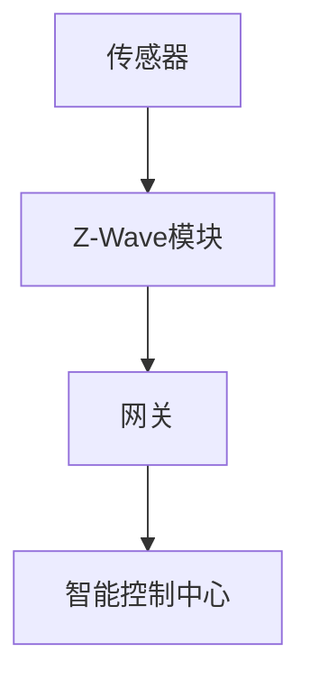

##### 2.1.2 ZigBee

ZigBee是一种低功耗、低速率的无线通信协议，适用于工业自动化、智能家居等领域。它具有高可靠性、高安全性、低延迟等特点。

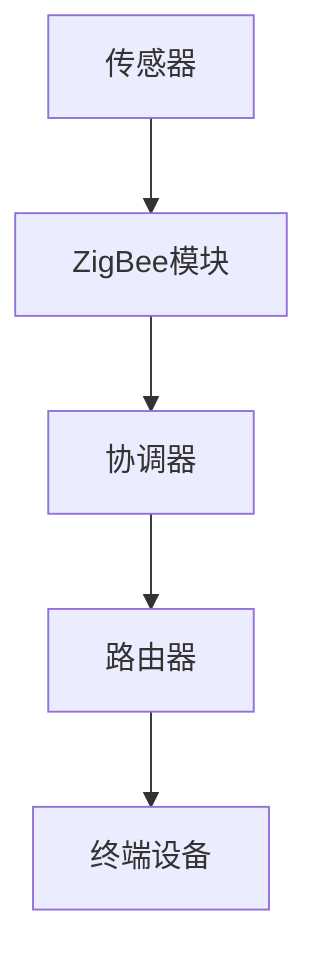

##### 2.1.3 蓝牙

蓝牙是一种短距离无线通信技术，广泛应用于智能家居、医疗保健、汽车等领域。蓝牙5.0及以上版本具有更高的通信速率和更远的通信距离，能够满足物联网设备之间的通信需求。

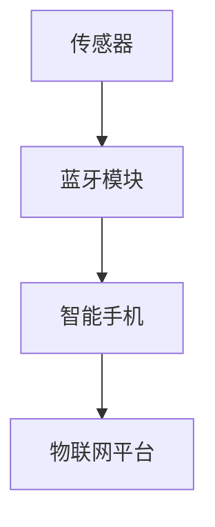

##### 2.1.4 Wi-Fi

Wi-Fi是一种广泛使用的无线通信技术，具有高速率、高带宽、远距离传输等优点，适用于智能家居、工业物联网、智能城市等领域。

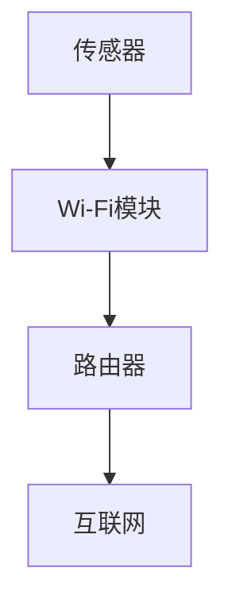

#### 2.2 物联网安全技术

物联网安全是物联网应用中至关重要的一环，涉及设备安全、数据安全、网络安全等多个方面。以下是一些常见的物联网安全技术：

##### 2.2.1 身份认证与访问控制

身份认证与访问控制是保障物联网安全的基础，通过对设备、用户进行身份认证，确保只有授权的设备才能访问物联网平台。

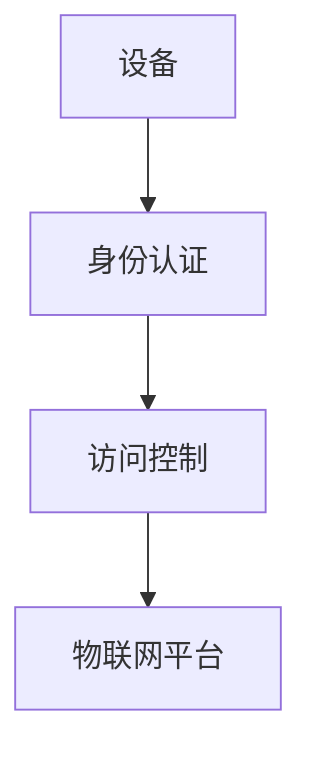

##### 2.2.2 数据加密与隐私保护

数据加密与隐私保护是保护物联网数据安全的重要手段，通过加密算法对数据进行加密，确保数据在传输过程中不被窃取和篡改。

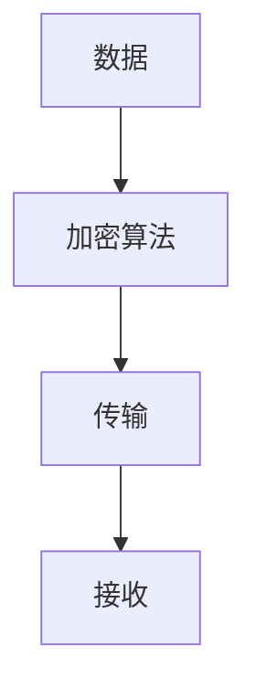

##### 2.2.3 设备安全与更新策略

设备安全与更新策略包括设备固件安全、设备更新管理等，通过对设备进行安全加固和定期更新，确保设备的稳定性和安全性。

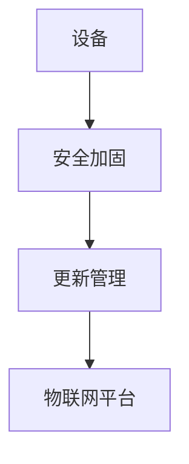

#### 2.3 物联网安全技术总结

物联网安全技术主要包括身份认证与访问控制、数据加密与隐私保护、设备安全与更新策略等方面。通过这些技术的综合应用，可以保障物联网设备的安全稳定运行，为物联网应用提供可靠保障。

### 第3章：各种传感器设备集成原理

#### 3.1 传感器原理与分类

传感器是物联网系统中不可或缺的组成部分，用于感知和采集物理世界中的各种信息。根据工作原理，传感器可以分为以下几类：

##### 3.1.1 电磁传感器

电磁传感器利用电磁感应原理，将磁场、电场等信息转换为电信号。常见的电磁传感器包括霍尔传感器、磁阻传感器、电感传感器等。

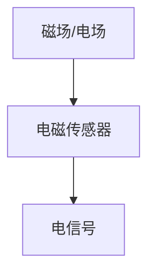

##### 3.1.2 光学传感器

光学传感器利用光学原理，将光强、颜色、距离等信息转换为电信号。常见的光学传感器包括光电传感器、红外传感器、激光传感器等。

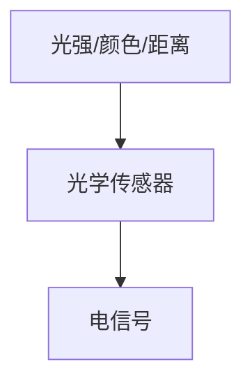

##### 3.1.3 压力传感器

压力传感器利用固体材料的弹性特性，将压力变化转换为电信号。常见的压力传感器包括弹性体压力传感器、电容式压力传感器、电阻式压力传感器等。

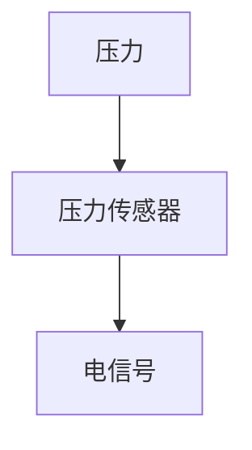

##### 3.1.4 温度传感器

温度传感器用于测量温度，常见的温度传感器包括热电偶、热电阻、热敏电阻等。

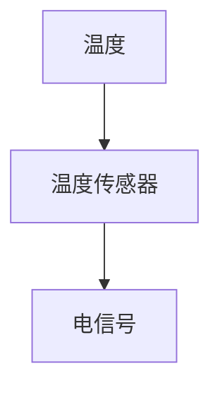

#### 3.2 传感器数据采集与处理

传感器数据采集与处理是物联网系统中的关键环节，主要包括以下方面：

##### 3.2.1 数据采集系统设计

数据采集系统设计包括传感器选型、信号调理、数据传输等环节。设计时需要考虑传感器的精度、灵敏度、稳定性等因素，以及数据传输的速率、距离、功耗等因素。

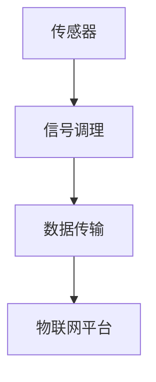

##### 3.2.2 数据预处理方法

数据预处理方法包括滤波、去噪、归一化、特征提取等，用于提高数据的质量和可靠性。

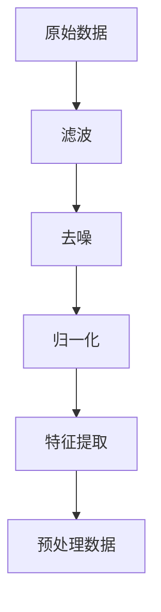

##### 3.2.3 数据融合技术

数据融合技术用于将多个传感器的数据进行整合和分析，以提高数据的准确性和可靠性。

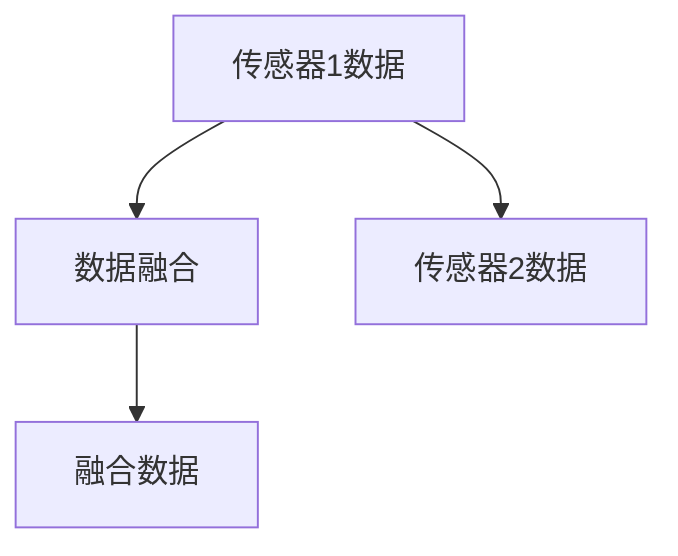

#### 3.3 传感器数据采集与处理总结

传感器数据采集与处理是物联网系统中的关键环节，通过对传感器的数据采集与处理，可以实现物理世界与数字世界的无缝连接，为物联网应用提供可靠的数据支持。

### 第4章：物联网（IoT）平台架构与开发框架

#### 4.1 物联网平台基本架构

物联网平台是物联网系统的核心，负责数据的采集、处理、存储、分析以及应用的部署。一个典型的物联网平台架构包括以下四个层次：

##### 4.1.1 设备层

设备层是物联网平台的最底层，包括各种传感器、执行器、嵌入式设备等。设备层负责数据的采集和初步处理，并将数据上传至网络层。

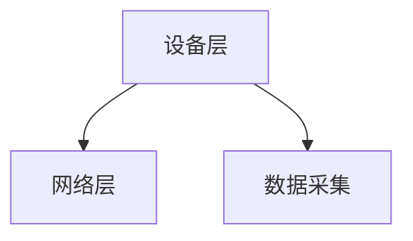

##### 4.1.2 网络层

网络层负责数据的传输，包括无线通信、有线通信、网关等。网络层将设备层采集到的数据传输到平台层，并实现设备间的互联互通。

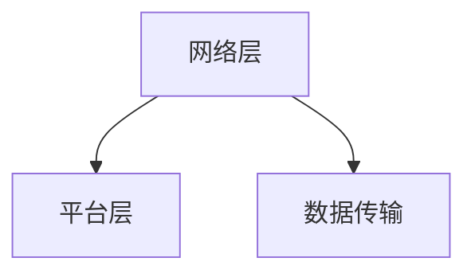

##### 4.1.3 平台层

平台层是物联网平台的核心，负责数据处理、存储、分析以及应用部署。平台层通常包括数据处理模块、存储模块、分析模块和应用部署模块。

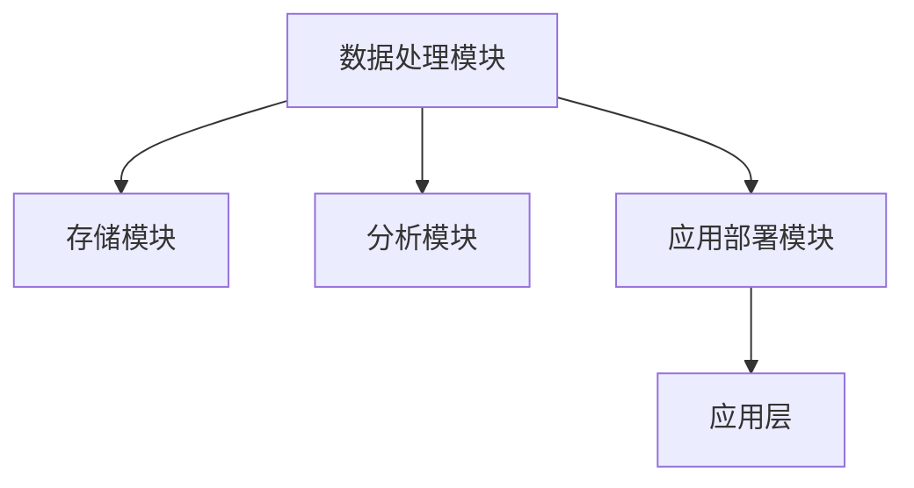

##### 4.1.4 应用层

应用层是物联网平台面向用户的一层，包括各种物联网应用，如智能家居、智能城市、智能物流等。应用层负责将物联网平台的数据和应用提供给用户。

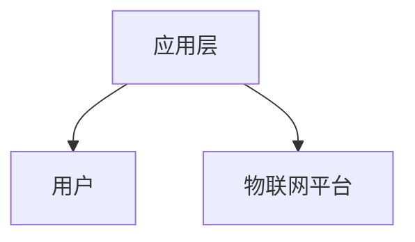

#### 4.2 开发框架与应用

物联网开发框架是构建物联网平台和应用的重要工具，它提供了一系列的库、组件和工具，帮助开发者快速搭建物联网系统。

以下是一些常用的物联网开发框架：

##### 4.2.1 物联网操作系统

物联网操作系统是物联网开发框架的核心，它提供了一种统一的平台，用于开发、部署和管理物联网设备。常见的物联网操作系统包括Windows IoT Core、Ubuntu Core、Linux IoT等。

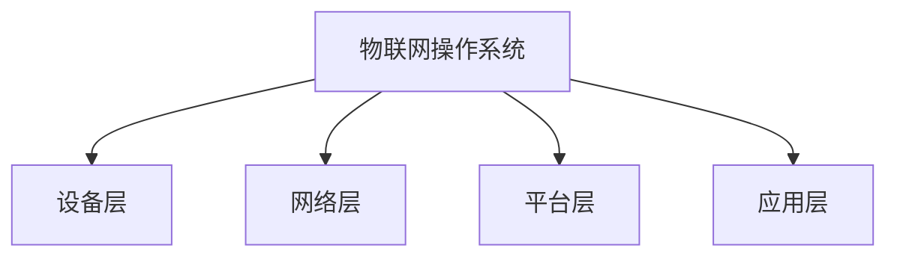

##### 4.2.2 开发工具与库

物联网开发工具和库为开发者提供了丰富的功能，如传感器驱动、通信协议、数据处理、数据存储等。常见的物联网开发工具和库包括Arduino、Node.js、Python等。

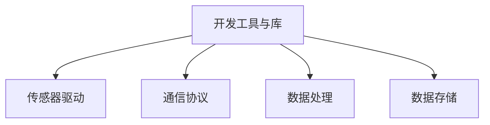

##### 4.2.3 应用场景与解决方案

物联网开发框架和应用场景紧密相关，不同的应用场景需要选择不同的开发框架和解决方案。以下是一些典型的应用场景和解决方案：

- **智能家居**：通过物联网操作系统和开发工具，实现家庭设备的智能控制和管理，如灯光控制、温度调节、家电控制等。
- **智能城市**：通过物联网平台和传感器设备，实现城市基础设施的智能化管理，如交通管理、环境监测、公共安全等。
- **智能农业**：通过传感器和物联网平台，实现农业生产的智能化管理，如土壤监测、灌溉控制、作物生长监测等。

```mermaid
graph TB
A[智能家居] --> B[物联网操作系统]
A --> C[传感器设备]
B --> D[智能控制]
E[智能城市] --> F[物联网平台]
E --> G[数据采集]
F --> H[数据分析]
I[智能农业] --> J[传感器设备]
I --> K[物联网平台]
J --> L[农业生产管理]
```

#### 4.3 物联网平台架构与开发框架总结

物联网平台架构和开发框架是构建物联网系统的基础，通过对物联网平台架构和开发框架的理解和应用，可以快速搭建物联网系统，实现各种物联网应用。

## 第二部分：物联网在仓储物流中的应用

### 第5章：物联网在仓储物流中的应用

#### 5.1 物流仓储系统概述

物流仓储系统是物流体系中的关键环节，主要负责货物的储存、管理和配送。物联网技术的应用，使得物流仓储系统更加智能化、高效化。

物流仓储系统包括以下几个部分：

1. **入库作业**：包括货物接货、验收、入库等环节。
2. **库存管理**：通过物联网传感器和系统，实现库存状态的实时监控和自动化管理。
3. **出库作业**：根据订单需求，进行货物的拣选、包装、出库等操作。
4. **配送作业**：根据订单需求，将货物配送到指定的地点。

#### 5.2 物联网技术在仓储物流中的应用

物联网技术在仓储物流中的应用主要体现在以下几个方面：

##### 5.2.1 传感器网络在仓储管理中的应用

传感器网络在仓储管理中起到了至关重要的作用，通过部署各种传感器，可以实现对仓库环境、货物状态、设备运行状态等的实时监测和管理。

- **环境监测**：通过温度、湿度传感器，监测仓库环境参数，确保货物存储条件符合要求。
- **设备监测**：通过传感器监测货架、叉车等设备的运行状态，实现设备的智能化管理。
- **货物监测**：通过RFID、传感器等，实现对货物位置的实时跟踪，提高库存管理的准确性和效率。

```mermaid
graph TB
A[仓库环境] --> B[环境传感器]
C[设备运行状态] --> D[传感器]
E[货物位置] --> F[传感器]
B --> G[物联网平台]
D --> H[物联网平台]
F --> I[物联网平台]
```

##### 5.2.2 自动识别与数据采集技术

自动识别与数据采集技术是仓储物流中的重要组成部分，通过自动识别技术，可以实现对货物的快速、准确识别，提高仓储物流的效率。

- **条码识别**：通过扫描货物上的条码，快速识别货物信息，实现自动化入库、出库等操作。
- **RFID技术**：通过RFID标签，实现对货物的远距离识别，提高仓储物流的效率。
- **图像识别**：通过图像识别技术，对货物进行分类、识别，提高库存管理的准确性。

```mermaid
graph TB
A[条码识别] --> B[条码扫描器]
C[RFID技术] --> D[RFID标签]
E[图像识别] --> F[图像识别算法]
B --> G[物联网平台]
D --> H[物联网平台]
F --> I[物联网平台]
```

##### 5.2.3 船舶追踪与配送优化

在仓储物流中，船舶追踪和配送优化是非常关键的环节。通过物联网技术，可以实现船舶位置的实时跟踪，以及配送路线的优化。

- **船舶追踪**：通过GPS传感器，实现对船舶位置的实时跟踪，提高物流运输的效率。
- **配送优化**：通过数据分析和优化算法，实现配送路线的优化，降低物流成本，提高配送效率。

```mermaid
graph TB
A[GPS传感器] --> B[船舶位置]
C[配送路线] --> D[优化算法]
B --> E[物联网平台]
D --> F[配送优化]
```

### 第6章：物联网在仓储物流中的关键技术和挑战

#### 6.1 传感器融合与数据处理

传感器融合与数据处理是物联网在仓储物流中的关键技术之一，通过将多个传感器的数据进行整合和分析，可以提高数据的准确性和可靠性。

- **传感器融合算法**：通过融合多个传感器的数据，提高数据的准确性和可靠性。常用的传感器融合算法包括卡尔曼滤波、贝叶斯滤波等。

```mermaid
graph TB
A[传感器1数据] --> B[融合算法]
A --> C[传感器2数据]
B --> D[融合数据]
```

- **数据处理框架**：通过构建数据处理框架，实现数据的实时处理和分析。常用的数据处理框架包括数据采集模块、数据处理模块、数据存储模块等。

```mermaid
graph TB
A[数据采集模块] --> B[数据处理模块]
A --> C[数据存储模块]
```

#### 6.2 安全与隐私保护

物联网在仓储物流中的应用涉及到大量的数据传输和处理，因此安全和隐私保护是至关重要的。

- **物联网安全挑战**：物联网安全挑战主要包括设备安全、数据安全、网络安全等方面。设备安全主要涉及设备的安全防护，数据安全主要涉及数据的加密和隐私保护，网络安全主要涉及网络的防护和攻击防护。
- **安全防护措施**：为了应对物联网安全挑战，可以采取以下安全防护措施：
  - 设备安全：对设备进行安全加固，防止设备被恶意攻击。
  - 数据加密：对传输的数据进行加密，确保数据在传输过程中的安全性。
  - 网络安全：加强对网络的防护，防止网络攻击和数据泄露。
- **隐私保护策略**：在物联网应用中，需要关注用户隐私保护，采取以下隐私保护策略：
  - 数据匿名化：对用户数据进行匿名化处理，确保用户隐私。
  - 数据加密：对用户数据进行加密处理，确保数据在存储和传输过程中的安全性。

```mermaid
graph TB
A[设备安全] --> B[安全加固]
A --> C[数据加密]
A --> D[网络安全]
B --> E[物联网平台]
C --> F[物联网平台]
D --> G[物联网平台]
H[数据匿名化] --> I[隐私保护]
J[数据加密] --> K[隐私保护]
```

#### 6.3 能耗优化与节能策略

物联网在仓储物流中的应用涉及到大量的传感器和设备，因此能耗优化与节能策略是至关重要的。

- **物联网设备能耗分析**：通过对物联网设备的能耗进行分析，可以找出能耗较高的环节，从而有针对性地进行优化。
- **节能技术与应用**：通过采用节能技术，如低功耗通信协议、智能功率管理、节能传感器等，可以降低物联网设备的能耗。
- **长期运行与维护**：通过对物联网设备的长期运行与维护，确保设备的稳定运行和性能，降低能耗。

```mermaid
graph TB
A[物联网设备能耗分析] --> B[节能技术]
A --> C[长期运行与维护]
B --> D[物联网平台]
C --> E[物联网平台]
```

### 第7章：物联网在仓储物流中的应用案例

#### 7.1 智能仓储系统

智能仓储系统是物联网在仓储物流中的一个重要应用案例，通过物联网技术，实现仓储管理的智能化、自动化。

- **系统架构与设计**：智能仓储系统包括感知层、传输层、平台层和应用层。感知层包括各种传感器和采集设备，传输层包括无线通信和网络设施，平台层包括数据处理、存储和分析等功能，应用层包括智能仓储管理系统、智能调度系统等。
- **关键技术与实现**：智能仓储系统采用RFID、传感器、无线通信等技术，实现对货物位置的实时跟踪、库存状态的实时监控、设备的智能管理等。
- **实际应用效果与评估**：通过智能仓储系统，可以提高仓储管理的效率，降低运营成本，提高服务质量。

```mermaid
graph TB
A[感知层] --> B[传输层]
A --> C[平台层]
A --> D[应用层]
B --> E[智能仓储管理系统]
B --> F[智能调度系统]
```

#### 7.2 智能配送系统

智能配送系统是物联网在仓储物流中的另一个重要应用案例，通过物联网技术，实现配送过程的智能化、自动化。

- **系统设计**：智能配送系统包括感知层、传输层、平台层和应用层。感知层包括各种传感器和采集设备，传输层包括无线通信和网络设施，平台层包括数据处理、存储和分析等功能，应用层包括智能配送管理系统、智能调度系统等。
- **配送优化算法**：智能配送系统采用配送优化算法，根据订单需求和交通状况，实现配送路线的优化，提高配送效率。
- **案例分析与评估**：通过智能配送系统，可以降低配送成本，提高配送效率，提高客户满意度。

```mermaid
graph TB
A[感知层] --> B[传输层]
A --> C[平台层]
A --> D[应用层]
B --> E[智能配送管理系统]
B --> F[智能调度系统]
```

### 第8章：未来发展趋势与展望

#### 8.1 物联网在仓储物流中的未来发展趋势

随着物联网技术的不断发展和应用场景的拓展，物联网在仓储物流中的应用前景十分广阔。未来物联网在仓储物流中的发展趋势主要体现在以下几个方面：

- **智能化**：物联网技术将进一步推动仓储物流的智能化，通过人工智能、大数据等技术的应用，实现仓储物流的自动化、智能化管理。
- **网络化**：物联网技术将实现仓储物流的全面连接，通过物联网平台，实现物流信息的高效传输和共享，提高物流运作效率。
- **绿色化**：物联网技术将推动仓储物流的绿色化发展，通过能耗优化、节能技术等，降低仓储物流的能耗和污染。

```mermaid
graph TB
A[智能化] --> B[物联网技术]
A --> C[网络化]
A --> D[绿色化]
```

#### 8.2 创新与突破

物联网在仓储物流中的应用将带来一系列的创新和突破，主要体现在以下几个方面：

- **新技术应用**：随着新技术的不断发展，如5G、人工智能、区块链等，物联网在仓储物流中的应用将更加丰富和多样化。
- **行业创新**：物联网技术将在仓储物流领域推动行业创新，如智能仓储系统、智能配送系统、智能物流园区等。
- **商业模式创新**：物联网技术将推动仓储物流行业的商业模式创新，如共享物流、智慧物流等。

```mermaid
graph TB
A[新技术应用] --> B[行业创新]
A --> C[商业模式创新]
```

#### 8.3 社会与经济影响

物联网在仓储物流中的应用将对社会和经济产生深远的影响：

- **社会效益**：物联网技术将提高仓储物流的效率和服务质量，降低物流成本，提高物流运作效率，为社会带来更多的便利和效益。
- **经济效益**：物联网技术将为仓储物流行业带来巨大的经济效益，推动行业的发展，创造更多的就业机会。
- **可持续发展**：物联网技术将推动仓储物流的可持续发展，通过节能、减排等手段，降低对环境的影响。

```mermaid
graph TB
A[社会效益] --> B[经济效益]
A --> C[可持续发展]
```

## 附录

### 附录A：物联网（IoT）技术和传感器设备集成资源

- **开源框架与工具**：OpenIoT、Node-RED、IoTivity等。
- **实用技术指南与手册**：《物联网技术与应用》、《物联网安全指南》等。
- **行业标准和规范**：ISO/IEC 27001、IEEE 1901.1等。
- **推荐阅读与进一步学习资源**：
  - 《物联网：概念、技术与应用》
  - 《物联网安全与隐私保护》
  - 《物联网开发实战》

## 作者信息

**作者：AI天才研究院/AI Genius Institute & 禅与计算机程序设计艺术 /Zen And The Art of Computer Programming**

