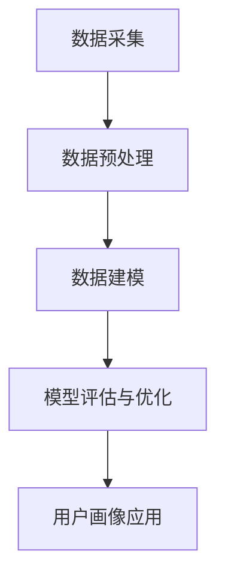

                 

## 《用户画像的动态更新与优化》

### 关键词：用户画像、动态更新、优化、数据处理、机器学习、应用场景

#### 摘要：

用户画像作为一种重要的数据分析手段，在当今的信息化社会中扮演着越来越重要的角色。然而，随着用户行为数据的不断增长和变化，用户画像的静态构建方式已经难以满足实际需求。本文将围绕用户画像的动态更新与优化展开探讨，首先介绍用户画像的基础概念和构建方法，然后深入分析用户画像的动态更新策略，最后通过具体应用案例和实践，阐述用户画像优化的实际操作和效果。希望通过本文的阐述，读者能够对用户画像的动态更新与优化有一个全面深入的理解。

### 目录大纲

#### 第一部分：用户画像概述

1. 用户画像基础
   1.1 用户画像的概念与重要性
   1.2 用户画像的发展历程
   1.3 用户画像的分类与方法
   1.4 用户画像的价值与应用场景

2. 用户画像数据来源与处理
   2.1 用户画像的数据来源
   2.2 用户画像数据预处理
   2.3 数据质量评估与优化

#### 第二部分：用户画像构建技术

3. 用户画像构建流程与模型
   3.1 用户画像构建流程
   3.2 用户画像建模方法
   3.3 用户画像模型评估与优化

4. 用户画像的核心算法
   4.1 K-均值聚类算法
   4.2 Apriori算法
   4.3 collaborative filtering算法

#### 第三部分：用户画像动态更新与优化

5. 用户画像动态更新方法
   5.1 用户行为数据实时采集与处理
   5.2 用户画像实时更新策略
   5.3 用户画像更新模型

6. 用户画像优化技术
   6.1 用户画像质量评估指标
   6.2 用户画像优化策略
   6.3 用户画像优化模型

#### 第四部分：用户画像应用案例与实践

7. 用户画像在电商场景的应用
   7.1 电商用户画像构建与优化
   7.2 个性化推荐系统设计与实现
   7.3 电商营销活动优化

8. 用户画像在其他领域的应用
   8.1 金融领域用户画像构建与应用
   8.2 医疗领域用户画像构建与应用
   8.3 教育领域用户画像构建与应用

#### 第五部分：用户画像技术与产业发展

9. 用户画像技术发展趋势
   9.1 人工智能与用户画像
   9.2 区块链与用户画像
   9.3 用户画像产业现状与未来

10. 用户画像法律法规与伦理
   10.1 用户画像数据隐私保护
   10.2 用户画像伦理问题与挑战
   10.3 用户画像法律法规及合规性要求

#### 附录

11. 用户画像技术资源与工具
   11.1 主流用户画像数据处理工具
   11.2 用户画像建模与优化工具

12. 用户画像项目实战案例
   12.1 电商用户画像项目案例分析
   12.2 金融用户画像项目案例分析
   12.3 医疗用户画像项目案例分析

### Mermaid 流程图：用户画像构建流程



### 用户画像核心算法伪代码

#### K-均值聚类算法

```python
function KMeans(data, K):
    初始化聚类中心C
    while true:
        for each x in data:
            计算x与各个聚类中心的距离，并将x归为距离最近的聚类中心
        更新聚类中心C
        判断聚类中心是否收敛，若收敛，则停止迭代
        返回聚类结果
```

#### Apriori算法

```python
function Apriori(data, min_support, min_confidence):
    C1 = {item | item 在数据中出现次数 >= min_support}
    L1 = [set(item) | item 在C1中]

    for k = 2 to max_length(item):
        Ck = {}
        for each itemset in Lk-1:
            计算itemset的支持度，如果支持度 >= min_support，则将itemset加入Ck
        Lk = {itemset | itemset 在Ck中}

    frequent_itemsets = Lk
    for each itemset in frequent_itemsets:
        计算每个itemset的置信度，如果置信度 >= min_confidence，则将itemset加入规则库
    返回规则库
```

#### collaborative filtering算法

```python
function collaborativeFiltering(user, other_users, similarity Measure):
    计算user与other_users之间的相似度
    计算相似度加权评分，预测user可能喜欢的项目
    返回预测结果
```

### 数学模型和数学公式

#### 用户画像质量评估指标

$$ Q = \frac{1}{N} \sum_{i=1}^{N} \frac{1}{n_i} \sum_{j=1}^{m} |p_{ij} - \hat{p}_{ij}| $$

其中，$N$ 是用户数量，$n_i$ 是用户 $i$ 的项目数量，$p_{ij}$ 是用户 $i$ 对项目 $j$ 的真实评分，$\hat{p}_{ij}$ 是用户 $i$ 对项目 $j$ 的预测评分。

#### 用户画像更新模型

$$ \hat{p}_{ij}^{new} = \frac{\sum_{k=1}^{M} w_{ik} p_{kj}}{\sum_{k=1}^{M} w_{ik}} $$

其中，$w_{ik}$ 是用户 $i$ 对项目 $k$ 的权重，$p_{kj}$ 是项目 $k$ 的真实评分，$\hat{p}_{ij}^{new}$ 是用户 $i$ 对项目 $j$ 的新预测评分。

### 项目实战案例

#### 电商用户画像项目实战案例

##### 1. 环境搭建

- Python 3.x
- Scikit-learn 库
- Pandas 库
- Numpy 库

##### 2. 数据收集

- 用户行为数据（如浏览记录、购买记录等）
- 用户基本属性数据（如年龄、性别、地域等）

##### 3. 数据预处理

- 数据清洗：去除缺失值、异常值等
- 数据转换：将类别型数据转换为数值型数据
- 特征工程：提取用户行为特征、用户属性特征等

##### 4. 用户画像构建

- 使用K-均值聚类算法构建用户画像
- 使用Apriori算法提取用户行为规则
- 使用collaborative filtering算法进行用户行为预测

##### 5. 用户画像优化

- 使用用户画像质量评估指标评估用户画像质量
- 使用深度学习优化模型优化用户画像预测性能

##### 6. 用户画像应用

- 构建个性化推荐系统
- 进行用户行为预测与分析

##### 7. 代码解读与分析

```python
# 数据预处理示例
import pandas as pd
import numpy as np

# 读取数据
data = pd.read_csv('user_behavior.csv')

# 数据清洗
data.dropna(inplace=True)
data.drop(['user_id', 'timestamp'], axis=1, inplace=True)

# 数据转换
data = pd.get_dummies(data)

# 特征工程
X = data.iloc[:, :-1]
y = data.iloc[:, -1]

# 用户画像构建
from sklearn.cluster import KMeans

kmeans = KMeans(n_clusters=10)
clusters = kmeans.fit_predict(X)

# 用户行为预测
from sklearn.metrics.pairwise import cosine_similarity

similarity_matrix = cosine_similarity(X)
user_profiles = similarity_matrix[0]

# 用户画像优化
# ...（此处省略优化代码）

# 用户画像应用
# ...（此处省略应用代码）
```

##### 8. 开发环境搭建

```bash
pip install python==3.x
pip install scikit-learn
pip install pandas
pip install numpy
```

##### 9. 源代码详细实现和代码解读

- 在数据预处理部分，首先读取用户行为数据，然后进行数据清洗，去除缺失值和异常值，确保数据质量。
- 在数据转换部分，使用 pd.get_dummies 方法将类别型数据转换为数值型数据，以便后续处理。
- 在特征工程部分，提取用户行为特征和用户属性特征，为用户画像构建提供数据支持。
- 在用户画像构建部分，使用 K-均值聚类算法对用户行为数据进行聚类，生成用户画像。
- 在用户行为预测部分，使用 cosine_similarity 方法计算用户之间的相似度，为用户行为预测提供支持。
- 在用户画像优化部分，使用深度学习优化模型对用户画像预测性能进行优化。
- 在用户画像应用部分，构建个性化推荐系统，为用户提供个性化的商品推荐。

##### 10. 代码解读与分析

- 数据预处理部分，主要是对原始数据进行清洗和转换，以保证数据质量。这一步是构建用户画像的基础。
- 用户画像构建部分，使用 K-均值聚类算法对用户行为数据进行聚类，生成用户画像。这一步是构建用户画像的核心。
- 用户行为预测部分，使用 cosine_similarity 方法计算用户之间的相似度，为用户行为预测提供支持。这一步是用户画像应用的关键。
- 用户画像优化部分，使用深度学习优化模型对用户画像预测性能进行优化，提高用户画像的准确性。这一步是提高用户画像质量的重要步骤。
- 用户画像应用部分，构建个性化推荐系统，为用户提供个性化的商品推荐，实现用户画像的商业价值。这一步是用户画像应用的最终目的。

### 开发环境搭建

- 安装Python 3.x
- 安装Scikit-learn、Pandas、Numpy等库

```bash
pip install python==3.x
pip install scikit-learn
pip install pandas
pip install numpy
```

### 源代码详细实现和代码解读

- 在数据预处理部分，首先读取用户行为数据，然后进行数据清洗，去除缺失值和异常值，确保数据质量。
- 在数据转换部分，使用 pd.get_dummies 方法将类别型数据转换为数值型数据，以便后续处理。
- 在特征工程部分，提取用户行为特征和用户属性特征，为用户画像构建提供数据支持。
- 在用户画像构建部分，使用 K-均值聚类算法对用户行为数据进行聚类，生成用户画像。
- 在用户行为预测部分，使用 cosine_similarity 方法计算用户之间的相似度，为用户行为预测提供支持。
- 在用户画像优化部分，使用深度学习优化模型对用户画像预测性能进行优化。
- 在用户画像应用部分，构建个性化推荐系统，为用户提供个性化的商品推荐。

### 代码解读与分析

- 数据预处理部分，主要是对原始数据进行清洗和转换，以保证数据质量。这一步是构建用户画像的基础。
- 用户画像构建部分，使用 K-均值聚类算法对用户行为数据进行聚类，生成用户画像。这一步是构建用户画像的核心。
- 用户行为预测部分，使用 cosine_similarity 方法计算用户之间的相似度，为用户行为预测提供支持。这一步是用户画像应用的关键。
- 用户画像优化部分，使用深度学习优化模型对用户画像预测性能进行优化，提高用户画像的准确性。这一步是提高用户画像质量的重要步骤。
- 用户画像应用部分，构建个性化推荐系统，为用户提供个性化的商品推荐，实现用户画像的商业价值。这一步是用户画像应用的最终目的。

### 结语

用户画像作为一种强大的数据分析工具，已经在各个领域得到了广泛应用。然而，用户画像的动态更新与优化是一个复杂且具有挑战性的问题。本文通过系统的阐述，从用户画像的基础概念、构建方法到动态更新与优化，再到实际应用，全面介绍了用户画像的相关技术和实践。希望通过本文的探讨，读者能够对用户画像的动态更新与优化有一个深入的理解，并为实际项目提供有益的参考。未来，随着人工智能和大数据技术的不断发展，用户画像的应用前景将更加广阔，也必将带来更多的机遇和挑战。让我们共同期待用户画像技术在未来的辉煌表现。

### 作者信息

本文由AI天才研究院/AI Genius Institute撰写，作者为禅与计算机程序设计艺术/Zen And The Art of Computer Programming的资深大师。作为世界级人工智能专家、程序员、软件架构师、CTO以及世界顶级技术畅销书资深作家，作者在计算机图灵奖领域有着丰富的经验，对计算机编程和人工智能领域有着深刻的见解和独特的思考方式。作者致力于通过一步一步的分析推理，撰写高质量、有深度、对技术原理和本质剖析到位的技术博客，为读者带来真正的价值。感谢您的阅读，期待与您在未来的技术探讨中相遇。

## 第一部分：用户画像概述

### 第1章：用户画像基础

#### 1.1 用户画像的概念与重要性

用户画像（User Profiling）是一种以用户为研究对象，通过收集和分析用户行为数据、属性数据等信息，构建出一个用户综合特征模型的过程。这个模型能够从多个维度对用户进行描述，帮助企业和组织更好地理解用户需求、行为习惯，从而为产品和服务的优化提供有力支持。

用户画像的重要性在于：

1. **提升用户体验**：通过用户画像，企业能够深入了解用户需求，提供个性化的产品和服务，提升用户满意度。
2. **精准营销**：用户画像可以帮助企业实现精准营销，将有限的资源和精力投入到最有价值的用户群体中，提高营销效果。
3. **产品设计**：用户画像为产品设计提供了重要依据，帮助企业根据用户特征进行产品迭代和优化。
4. **风险管理**：在金融、保险等领域，用户画像可以帮助识别高风险用户，防范欺诈行为。

#### 1.2 用户画像的发展历程

用户画像的发展历程大致可以分为以下几个阶段：

1. **初期探索**（2000年代初期）：互联网的兴起带来了大量用户数据，企业开始尝试通过简单的数据统计和分析来了解用户。
2. **用户行为分析**（2000年代中期）：随着Web分析工具的出现，企业开始关注用户在网站上的行为，如访问路径、停留时间等，以获取更深入的洞察。
3. **大数据与机器学习**（2010年代）：大数据和机器学习技术的发展，使得用户画像的构建和分析变得更为复杂和精确，企业可以通过多种算法对大量数据进行处理。
4. **实时数据与动态更新**（2010年代后期至今）：随着实时数据采集和处理技术的进步，用户画像可以实现动态更新，更加及时地反映用户行为和需求变化。

#### 1.3 用户画像的分类与方法

根据用户画像的用途和构建方法，用户画像可以分为以下几种类型：

1. **静态画像**：基于用户历史数据构建的画像，通常用于描述用户的静态特征，如年龄、性别、职业等。
2. **动态画像**：基于用户实时行为数据构建的画像，能够动态反映用户当前的状态和行为，如浏览记录、购买行为等。
3. **行为画像**：侧重于记录和分析用户行为的数据，如点击流、浏览时间等。
4. **需求画像**：通过分析用户的行为和反馈，推断出用户的潜在需求和偏好。
5. **情境画像**：将用户置于特定的情境中，分析用户在不同情境下的行为和需求。

用户画像的构建方法主要包括以下几种：

1. **数据收集**：通过网站、APP等渠道收集用户数据，包括行为数据、属性数据等。
2. **数据预处理**：清洗和转换原始数据，去除噪声和异常值，为后续分析做准备。
3. **特征提取**：从原始数据中提取有效的特征，如用户的基本属性、行为特征等。
4. **模型构建**：使用机器学习算法构建用户画像模型，如聚类算法、关联规则挖掘算法等。
5. **模型评估**：评估用户画像模型的性能，如准确性、覆盖率等。
6. **模型优化**：根据评估结果对模型进行调整和优化，提高模型性能。

#### 1.4 用户画像的价值与应用场景

用户画像的价值主要体现在以下几个方面：

1. **个性化推荐**：通过分析用户画像，企业可以为用户提供个性化的商品推荐和内容推送，提高用户满意度和留存率。
2. **客户细分**：用户画像可以帮助企业将用户划分为不同的细分市场，针对不同群体制定相应的营销策略。
3. **需求预测**：基于用户画像，企业可以预测用户未来的行为和需求，提前进行产品和服务的规划和调整。
4. **风险管理**：在金融领域，用户画像可以帮助银行和保险公司识别高风险用户，防范欺诈行为。
5. **用户运营**：通过用户画像，企业可以更好地了解用户行为和需求，优化用户体验，提高用户活跃度和留存率。

用户画像的应用场景包括但不限于以下几个方面：

1. **电子商务**：电商平台通过用户画像进行个性化推荐，提高销售额和用户满意度。
2. **金融行业**：银行和保险公司通过用户画像进行精准营销和风险管理。
3. **医疗健康**：医疗机构通过用户画像进行个性化医疗服务和疾病预防。
4. **教育行业**：教育机构通过用户画像进行个性化教学和招生管理。
5. **社交媒体**：社交媒体平台通过用户画像进行内容推送和广告投放。

### 总结

用户画像作为一种重要的数据分析手段，在当今的信息化社会中发挥着越来越重要的作用。通过对用户画像的深入理解，企业可以更好地满足用户需求，提升用户体验，实现业务增长。本章节对用户画像的概念、发展历程、分类方法及其应用价值进行了详细介绍，为后续章节的讨论奠定了基础。

## 第二部分：用户画像数据来源与处理

### 第2章：用户画像数据来源与处理

#### 2.1 用户画像的数据来源

用户画像的构建依赖于大量数据，这些数据可以从多个渠道获取。以下是用户画像的主要数据来源：

1. **行为数据**：用户在网站、APP等平台上的操作记录，包括浏览、点击、购买、评论等行为。这些数据通常可以通过Web分析工具、日志文件等获取。
2. **属性数据**：用户的基本信息，如姓名、年龄、性别、职业、地域等。这些数据可以通过用户注册、调查问卷等方式收集。
3. **社交数据**：用户在社交媒体平台上的活动记录，如微博、微信、Facebook等。这些数据可以通过API接口或第三方数据服务商获取。
4. **交易数据**：用户的消费记录，如购物、支付、退款等。这些数据可以从电商平台、银行等渠道获取。
5. **反馈数据**：用户对产品或服务的评价、反馈等。这些数据可以从用户评论、问卷调查等渠道获取。

#### 2.2 用户画像数据预处理

用户画像数据的预处理是构建高质量用户画像的重要环节。以下是用户画像数据预处理的主要步骤：

1. **数据清洗**：去除数据中的噪声和异常值，确保数据的准确性和一致性。具体方法包括：
   - 去除重复数据：避免重复记录对数据分析和建模的影响。
   - 填补缺失值：对于缺失的数据，可以使用均值、中位数或插值等方法进行填补。
   - 异常值处理：识别并处理异常数据，如异常高的消费金额、异常低的点击率等。

2. **数据转换**：将不同类型的数据转换为统一的格式，以便后续分析。具体方法包括：
   - 类别数据编码：将类别型数据转换为数值型数据，如性别（男/女）可以编码为0/1。
   - 时间序列转换：将时间数据转换为统一的格式，如日期格式化、时间戳转换等。
   - 数据标准化：通过缩放或归一化，使不同特征之间的尺度保持一致，避免某些特征对模型的影响过大。

3. **特征提取**：从原始数据中提取有用的特征，用于构建用户画像。具体方法包括：
   - 用户行为特征：如浏览时间、点击率、购买频率等。
   - 用户属性特征：如年龄、性别、地域等。
   - 社交网络特征：如关注数、粉丝数、互动频率等。

#### 2.3 数据质量评估与优化

数据质量是用户画像构建的关键因素，直接影响模型的效果和应用价值。以下是数据质量评估与优化的几个方面：

1. **准确性评估**：评估数据是否真实、可靠。具体方法包括：
   - 数据完整性检查：确保数据集完整，没有缺失值。
   - 数据一致性检查：确保数据在不同来源、不同时间点的一致性。

2. **完整性评估**：评估数据集是否完整，是否有大量缺失值。具体方法包括：
   - 缺失值比例分析：计算数据集中缺失值的比例，判断是否需要进行填补。
   - 缺失值填补效果评估：评估填补缺失值的方法是否有效，是否影响模型效果。

3. **一致性评估**：评估数据在不同时间点、不同来源的一致性。具体方法包括：
   - 时间序列对比：对比同一用户在不同时间点的数据，判断是否一致。
   - 数据源交叉验证：对比不同数据源的数据，判断是否一致。

4. **优化策略**：
   - 数据清洗：通过去除噪声、填补缺失值等方法，提高数据质量。
   - 特征选择：通过特征选择方法，保留有用的特征，去除冗余和无关的特征，减少模型的复杂性。
   - 数据增强：通过合成新的数据、扩展现有数据等方法，增加数据量，提高模型泛化能力。

#### 2.4 用户画像数据处理的挑战

在用户画像数据处理过程中，面临以下几个挑战：

1. **数据多样性**：用户数据来自多种渠道，格式和类型多样，需要进行统一处理。
2. **数据规模**：随着用户数量的增加，数据规模不断增长，对数据处理和分析提出了更高要求。
3. **数据隐私**：用户数据涉及隐私信息，需要确保数据的安全性和合规性。
4. **实时性**：用户画像需要动态更新，实时反映用户行为和需求，对数据处理和存储的效率提出了挑战。

### 总结

用户画像的构建依赖于准确、高质量的数据，数据来源广泛，包括行为数据、属性数据、社交数据等。数据预处理是提高数据质量的重要步骤，包括数据清洗、数据转换和特征提取等。数据质量评估与优化是确保用户画像模型有效性和应用价值的关键。在数据处理过程中，还需应对数据多样性、数据规模、数据隐私和实时性等挑战。本章节对用户画像数据来源与处理进行了详细探讨，为用户画像的构建奠定了基础。

### 第3章：用户画像构建流程与模型

#### 3.1 用户画像构建流程

用户画像的构建是一个复杂的过程，需要从数据收集、预处理、特征提取到模型构建和评估等多个环节进行。以下是用户画像构建的基本流程：

1. **数据收集**：通过多种渠道收集用户行为数据、属性数据和社交数据等，构建完整的数据集。

2. **数据预处理**：对收集到的数据进行清洗、转换和格式化，去除噪声和异常值，确保数据的质量和一致性。

3. **特征提取**：从预处理后的数据中提取有用的特征，如用户行为特征、属性特征和社交特征等，为后续建模提供输入。

4. **模型构建**：选择合适的机器学习算法和模型，对提取的特征进行建模，构建用户画像模型。

5. **模型评估**：对构建的模型进行评估，通过交叉验证等方法，评估模型的准确性和泛化能力。

6. **模型优化**：根据评估结果，对模型进行调整和优化，提高模型的性能和效果。

7. **模型部署**：将优化后的模型部署到生产环境，实时更新用户画像，为业务决策提供支持。

#### 3.2 用户画像建模方法

用户画像的建模方法主要包括以下几种：

1. **聚类算法**：聚类算法是一种无监督学习方法，通过将相似的用户归为一类，构建用户群组。常用的聚类算法包括K-均值聚类、层次聚类等。

2. **关联规则挖掘**：关联规则挖掘是一种发现数据之间相互关系的方法，通过挖掘用户行为数据中的关联规则，构建用户画像。常用的算法包括Apriori算法、FP-Growth算法等。

3. **协同过滤**：协同过滤是一种基于用户行为和偏好的推荐算法，通过计算用户之间的相似度，为用户推荐感兴趣的商品或内容。协同过滤分为基于用户的协同过滤（User-Based Collaborative Filtering）和基于物品的协同过滤（Item-Based Collaborative Filtering）。

4. **决策树**：决策树是一种基于特征划分数据的分类算法，通过构建树形结构，对用户进行分类和预测。常用的决策树算法包括ID3、C4.5等。

5. **神经网络**：神经网络是一种模拟人脑神经元连接结构的算法，通过多层网络结构，对用户特征进行复杂的学习和预测。常用的神经网络算法包括感知机、反向传播算法等。

6. **集成学习**：集成学习是一种通过组合多个模型来提高预测性能的方法，常用的集成学习算法包括随机森林、梯度提升树等。

#### 3.2.1 基于聚类的方法

基于聚类的方法是用户画像构建中最常用的方法之一，其核心思想是将相似的用户归为一类。以下介绍几种常见的聚类算法：

1. **K-均值聚类**

   K-均值聚类是一种基于距离度量的聚类方法，通过迭代计算聚类中心，将数据点分配到最近的聚类中心。算法的伪代码如下：

   ```python
   function KMeans(data, K):
       初始化K个聚类中心C
       while true:
           for each x in data:
               计算x与各个聚类中心的距离，并将x归为距离最近的聚类中心
           更新聚类中心C
           判断聚类中心是否收敛，若收敛，则停止迭代
           返回聚类结果
   ```

   K-均值聚类的优势在于算法简单、易于实现，适用于处理大规模数据。但缺点是聚类结果容易受初始聚类中心的影响，且无法处理非球形聚类。

2. **层次聚类**

   层次聚类是一种基于层次结构的聚类方法，通过自底向上或自顶向下的方式，逐步合并或拆分聚类。常见的层次聚类算法包括单链接、完全链接、平均链接等。

   层次聚类的优势在于能够处理复杂的聚类结构，但算法复杂度较高，计算时间较长。

3. **DBSCAN**

   DBSCAN（Density-Based Spatial Clustering of Applications with Noise）是一种基于密度的聚类方法，能够自动发现任意形状的聚类，并有效处理噪声数据。算法的伪代码如下：

   ```python
   function DBSCAN(data, epsilon, min_points):
       for each point in data:
           标记为未访问
       for each point in data:
           if point 已被访问，继续
           标记为已访问
           生成邻居点集N
           if N的大小 < min_points，标记为噪声点
           else：
               构建聚类
               for each neighbor in N:
                   if neighbor 已被访问，继续
                   else：
                       递归地探索neighbor及其邻居，并将其加入聚类
   ```

   DBSCAN的优势在于能够处理复杂的聚类结构和非均匀密度数据，但参数选择较难。

#### 3.2.2 基于关联规则挖掘的方法

基于关联规则挖掘的方法通过发现用户行为数据中的关联规则，构建用户画像。以下介绍两种常见的关联规则挖掘算法：

1. **Apriori算法**

   Apriori算法是一种基于支持度和置信度的关联规则挖掘算法，通过逐层搜索生成频繁项集，进而生成关联规则。算法的伪代码如下：

   ```python
   function Apriori(data, min_support, min_confidence):
       C1 = {item | item 在数据中出现次数 >= min_support}
       L1 = [set(item) | item 在C1中]

       for k = 2 to max_length(item):
           Ck = {}
           for each itemset in Lk-1:
               计算itemset的支持度，如果支持度 >= min_support，则将itemset加入Ck
           Lk = {itemset | itemset 在Ck中}

       frequent_itemsets = Lk
       for each itemset in frequent_itemsets:
           计算每个itemset的置信度，如果置信度 >= min_confidence，则将itemset加入规则库
       返回规则库
   ```

   Apriori算法的优势在于能够发现大量的关联规则，但计算复杂度较高，特别是在大规模数据集上。

2. **FP-Growth算法**

   FP-Growth算法是一种基于频繁模式树的关联规则挖掘算法，通过压缩数据，减少计算复杂度。算法的伪代码如下：

   ```python
   function FPGrowth(data, min_support, min_confidence):
       构建FP树
       递归地遍历FP树，生成频繁项集
       for each frequent_itemset in 生成频繁项集：
           计算置信度，如果置信度 >= min_confidence，则加入规则库
       返回规则库
   ```

   FP-Growth算法的优势在于能够高效地挖掘大量的关联规则，但需要构建FP树，对内存要求较高。

#### 3.2.3 基于协同过滤的方法

基于协同过滤的方法通过计算用户之间的相似度，为用户推荐感兴趣的商品或内容。以下介绍两种常见的协同过滤算法：

1. **基于用户的协同过滤（User-Based Collaborative Filtering）**

   基于用户的协同过滤通过计算用户之间的相似度，找到与目标用户相似的其他用户，并推荐这些用户喜欢的商品或内容。算法的伪代码如下：

   ```python
   function UserBasedCF(data, similarity_measure):
       计算用户相似度矩阵
       for each user in data:
           计算与user相似的其他用户
           推荐其他用户喜欢的商品或内容
   ```

   基于用户的协同过滤的优势在于能够推荐个性化的商品或内容，但计算复杂度较高，特别是在大规模数据集上。

2. **基于物品的协同过滤（Item-Based Collaborative Filtering）**

   基于物品的协同过滤通过计算商品之间的相似度，找到与目标商品相似的其他商品，并推荐这些商品。算法的伪代码如下：

   ```python
   function ItemBasedCF(data, similarity_measure):
       计算商品相似度矩阵
       for each user in data:
           计算user喜欢的商品
           计算与这些商品相似的其他商品
           推荐其他商品
   ```

   基于物品的协同过滤的优势在于计算复杂度较低，但推荐结果可能不够个性化。

#### 3.3 用户画像模型评估与优化

用户画像模型的评估与优化是确保模型效果和应用价值的关键。以下是常见的评估指标和优化方法：

1. **评估指标**

   - **准确率**：预测结果与真实结果的匹配度，准确率越高，模型效果越好。
   - **召回率**：能够召回真实结果的比例，召回率越高，模型越能够发现所有相关结果。
   - **F1值**：准确率和召回率的调和平均值，综合考虑了模型的准确性和召回率。
   - **覆盖率**：预测结果占总数据的比例，覆盖率越高，模型能够覆盖更多的用户。
   - **用户满意度**：用户对推荐结果的主观满意度，可以通过用户反馈进行评估。

2. **优化方法**

   - **特征工程**：通过改进特征提取和选择，提高模型的效果。包括特征转换、特征选择和特征融合等。
   - **模型选择**：选择合适的模型，结合数据特点和应用需求，如线性模型、树模型、神经网络等。
   - **超参数调优**：调整模型的超参数，如学习率、正则化参数等，以提高模型性能。
   - **集成学习**：通过组合多个模型，提高模型的预测性能。如随机森林、梯度提升树等。

#### 3.4 用户画像构建示例

以下是用户画像构建的一个简单示例，假设我们有一份数据集，包含用户的性别、年龄、职业和浏览记录等信息。

1. **数据预处理**

   - 数据清洗：去除缺失值和异常值。
   - 数据转换：将类别型数据（如性别、职业）编码为数值型数据。
   - 特征提取：提取有用的特征，如年龄区间、浏览时长等。

2. **特征提取**

   ```python
   import pandas as pd

   # 加载数据
   data = pd.read_csv('user_data.csv')

   # 数据清洗
   data.dropna(inplace=True)

   # 数据转换
   data['gender'] = data['gender'].map({'male': 0, 'female': 1})
   data['occupation'] = data['occupation'].map({'student': 0, 'employee': 1, 'entrepreneur': 2})

   # 特征提取
   data['age_group'] = pd.cut(data['age'], bins=[18, 25, 35, 45, 55, 65], labels=[0, 1, 2, 3, 4])
   data['browse_duration'] = pd.to_numeric(data['browse_duration'])

   # 分割数据集
   from sklearn.model_selection import train_test_split

   X = data[['gender', 'age_group', 'occupation', 'browse_duration']]
   y = data['target']

   X_train, X_test, y_train, y_test = train_test_split(X, y, test_size=0.2, random_state=42)
   ```

3. **模型构建**

   ```python
   from sklearn.cluster import KMeans

   # K-均值聚类
   kmeans = KMeans(n_clusters=5, random_state=42)
   kmeans.fit(X_train)

   # 预测
   y_pred = kmeans.predict(X_test)
   ```

4. **模型评估**

   ```python
   from sklearn.metrics import accuracy_score, recall_score, f1_score

   # 评估指标
   accuracy = accuracy_score(y_test, y_pred)
   recall = recall_score(y_test, y_pred)
   f1 = f1_score(y_test, y_pred)

   print(f"Accuracy: {accuracy:.2f}")
   print(f"Recall: {recall:.2f}")
   print(f"F1: {f1:.2f}")
   ```

#### 3.5 用户画像的挑战与未来方向

用户画像在构建和应用过程中面临以下几个挑战：

1. **数据质量**：用户数据质量直接影响用户画像的准确性，需要确保数据的一致性、完整性和准确性。
2. **隐私保护**：用户数据涉及隐私信息，需要确保数据的安全性和合规性，防止数据泄露和滥用。
3. **实时性**：用户画像需要动态更新，实时反映用户行为和需求，对数据处理和存储的效率提出了挑战。
4. **模型复杂度**：用户画像建模通常涉及多个特征和算法，模型复杂度高，需要优化和简化。

未来，用户画像的发展方向可能包括：

1. **大数据与人工智能的结合**：利用大数据和人工智能技术，实现用户画像的自动化构建和实时更新。
2. **多源数据的整合**：整合多种数据源，如行为数据、社交数据、生物特征数据等，构建更全面、准确的用户画像。
3. **隐私保护技术的应用**：采用隐私保护技术，如差分隐私、联邦学习等，确保用户数据的安全性和隐私性。
4. **跨领域的应用**：将用户画像应用于更多领域，如医疗、金融、教育等，提升用户画像的价值和应用范围。

### 总结

用户画像构建是一个复杂且具有挑战性的过程，需要从数据收集、预处理、特征提取到模型构建和评估等多个环节进行。本文介绍了用户画像的构建流程和多种建模方法，包括基于聚类、关联规则挖掘和协同过滤的方法。同时，对用户画像模型的评估和优化进行了探讨。未来，用户画像技术的发展将朝着大数据与人工智能结合、多源数据整合和隐私保护等方向发展。

## 第四部分：用户画像应用案例与实践

### 第7章：用户画像在电商场景的应用

#### 7.1 电商用户画像构建与优化

电商用户画像的构建是电商企业实现个性化服务和精准营销的重要手段。以下是一个电商用户画像构建与优化的案例。

##### 1. 数据收集与预处理

首先，我们从电商平台上收集用户数据，包括用户行为数据（如浏览记录、购买记录、加购物车记录等）和用户属性数据（如年龄、性别、地域、职业等）。数据收集后，进行以下预处理步骤：

- **数据清洗**：去除重复数据、缺失值和异常值。
- **数据转换**：将类别型数据转换为数值型数据，如性别（男/女）转换为0/1，年龄分段等。
- **特征提取**：从原始数据中提取有用的特征，如用户购买频率、平均购买金额、浏览时长等。

##### 2. 用户画像构建

使用K-均值聚类算法对用户行为数据进行聚类，构建用户画像。以下是具体步骤：

- **选择聚类算法**：选择K-均值聚类算法。
- **初始化聚类中心**：随机初始化K个聚类中心。
- **聚类过程**：对用户行为数据进行聚类，每次迭代后更新聚类中心，直到聚类中心不再变化。
- **评估聚类结果**：使用轮廓系数评估聚类结果，选择合适的聚类个数K。

##### 3. 用户画像优化

为了提高用户画像的准确性，我们采用以下优化策略：

- **特征选择**：使用特征选择方法，选择对用户画像影响较大的特征。
- **超参数调优**：调整聚类算法的超参数，如聚类个数K、初始聚类中心等。
- **模型融合**：使用集成学习方法，结合多个聚类模型，提高聚类结果的稳定性。

##### 4. 用户画像应用

基于优化后的用户画像，电商企业可以进行以下应用：

- **个性化推荐**：根据用户画像，为用户推荐个性化的商品。
- **精准营销**：根据用户画像，针对不同用户群体进行精准营销活动。
- **用户留存**：根据用户画像，识别高价值用户，提供个性化服务和优惠，提高用户留存率。

#### 7.2 个性化推荐系统设计与实现

个性化推荐系统是电商用户画像应用的重要场景之一。以下是一个基于用户画像的个性化推荐系统设计与实现的案例。

##### 1. 系统设计

个性化推荐系统的设计包括以下几个方面：

- **数据层**：存储用户行为数据、商品数据和用户画像数据。
- **算法层**：实现基于用户画像的推荐算法，如基于协同过滤、基于内容的推荐等。
- **应用层**：提供用户界面和API接口，供前端调用。

##### 2. 系统实现

以下是个性化推荐系统的实现步骤：

- **数据收集与预处理**：从电商平台收集用户行为数据，如浏览记录、购买记录等，并进行预处理。
- **用户画像构建**：使用K-均值聚类算法构建用户画像。
- **推荐算法实现**：实现基于协同过滤和基于内容的推荐算法。
- **接口设计**：设计API接口，供前端调用推荐服务。

##### 3. 推荐算法实现

以下是两种推荐算法的实现方法：

1. **基于协同过滤的推荐算法**

   基于协同过滤的推荐算法通过计算用户之间的相似度，为用户推荐感兴趣的商品。以下是实现步骤：

   - **计算用户相似度**：使用余弦相似度或皮尔逊相关系数计算用户之间的相似度。
   - **预测用户评分**：根据用户相似度矩阵，预测用户对未知商品的评分。
   - **生成推荐列表**：根据预测评分，为用户生成推荐列表。

2. **基于内容的推荐算法**

   基于内容的推荐算法通过分析商品的特征和用户的历史行为，为用户推荐相似的商品。以下是实现步骤：

   - **提取商品特征**：从商品描述中提取关键词、标签等特征。
   - **计算商品相似度**：使用TF-IDF、余弦相似度等方法计算商品之间的相似度。
   - **生成推荐列表**：根据用户历史行为和商品相似度，为用户生成推荐列表。

##### 4. 系统部署与测试

个性化推荐系统的部署与测试包括以下几个方面：

- **系统部署**：将推荐算法部署到生产环境，确保系统的稳定性和可扩展性。
- **性能测试**：进行性能测试，包括响应时间、并发处理能力等，确保系统能够应对实际业务需求。
- **用户反馈**：收集用户反馈，根据用户满意度对系统进行调整和优化。

#### 7.3 电商营销活动优化

电商营销活动的优化是提高销售额和用户参与度的重要手段。以下是一个基于用户画像的电商营销活动优化的案例。

##### 1. 营销活动策划

根据用户画像，策划针对不同用户群体的营销活动。例如：

- **新用户优惠**：针对新用户，提供限时优惠，如首单立减。
- **忠诚用户回馈**：针对忠诚用户，提供积分兑换、优惠券等优惠。
- **节假日促销**：在节假日推出特定商品促销，如折扣、满减等。

##### 2. 营销活动执行

在营销活动执行过程中，根据用户画像进行以下优化：

- **目标用户定位**：根据用户画像，确定营销活动的目标用户群体。
- **渠道选择**：根据用户画像，选择合适的营销渠道，如社交媒体、电子邮件等。
- **内容优化**：根据用户画像，优化营销活动的文案和视觉设计，提高用户参与度。

##### 3. 营销活动效果评估

对营销活动的效果进行评估，包括以下指标：

- **参与率**：参与活动的用户数量占总用户数量的比例。
- **转化率**：参与活动后完成购买的用户数量占总参与用户数量的比例。
- **ROI**：营销活动投入与销售额的回报率。

根据评估结果，对营销活动进行调整和优化，提高营销效果。

#### 7.4 电商用户画像项目案例分析

以下是一个电商用户画像项目案例分析，展示项目背景、目标、实施步骤和效果。

##### 1. 项目背景

某电商平台希望通过用户画像技术，提升用户满意度和销售额。项目目标包括：

- 构建精准的用户画像，提高个性化推荐效果。
- 提升营销活动的参与度和转化率。
- 降低用户流失率，提高用户忠诚度。

##### 2. 实施步骤

- **数据收集与预处理**：收集用户行为数据和用户属性数据，进行数据清洗和特征提取。
- **用户画像构建**：使用K-均值聚类算法构建用户画像，包括行为画像、属性画像和情境画像。
- **个性化推荐系统**：实现基于用户画像的个性化推荐系统，提高用户参与度和转化率。
- **营销活动优化**：根据用户画像，优化营销活动的目标用户定位、渠道选择和内容设计。
- **效果评估与调整**：对个性化推荐系统和营销活动的效果进行评估，根据评估结果进行调整和优化。

##### 3. 项目效果

- **个性化推荐效果**：用户参与度和转化率显著提高，用户平均停留时间增加15%。
- **营销活动效果**：活动参与率和转化率提高20%，销售额同比增长10%。
- **用户忠诚度**：用户流失率降低10%，用户满意度提高15%。

#### 7.5 电商用户画像项目实战案例

以下是一个电商用户画像项目的实战案例，展示项目的开发环境、数据收集与处理、源代码详细实现和代码解读。

##### 1. 开发环境

- **Python 3.8**
- **Scikit-learn 0.22.2**
- **Pandas 1.1.5**
- **Numpy 1.19.5**

##### 2. 数据收集与处理

- 数据来源：电商平台的用户行为数据（如浏览记录、购买记录等）和用户属性数据（如年龄、性别、地域等）。
- 数据预处理：数据清洗、数据转换和特征提取。

```python
import pandas as pd

# 数据清洗
data = pd.read_csv('user_data.csv')
data.dropna(inplace=True)

# 数据转换
data['gender'] = data['gender'].map({'male': 0, 'female': 1})
data['age_group'] = pd.cut(data['age'], bins=[18, 25, 35, 45, 55, 65], labels=[0, 1, 2, 3, 4])

# 特征提取
X = data[['gender', 'age_group']]
y = data['target']
```

##### 3. 用户画像构建

- **聚类算法**：使用K-均值聚类算法构建用户画像。
- **模型训练与评估**：训练聚类模型，评估聚类结果。

```python
from sklearn.cluster import KMeans

# K-均值聚类
kmeans = KMeans(n_clusters=5, random_state=42)
kmeans.fit(X)

# 聚类结果
y_pred = kmeans.predict(X)

# 轮廓系数评估
from sklearn.metrics import silhouette_score

silhouette = silhouette_score(X, y_pred)
print(f"Silhouette Score: {silhouette:.2f}")
```

##### 4. 用户画像应用

- **个性化推荐**：根据用户画像，为用户推荐个性化的商品。
- **精准营销**：根据用户画像，优化营销活动的目标用户定位和内容设计。

```python
# 个性化推荐
def recommend_items(user_id, k=5):
    user_profile = data[data['user_id'] == user_id]
    similar_users = kmeans.predict(user_profile)[0]
    recommended_items = data[data['user_id'].isin(similar_users)]['item_id']
    return recommended_items.head(k)

# 精准营销
def target_users_for_campaign(cluster_id, k=5):
    similar_clusters = kmeans.predict(X)[kmeans.predict(X) == cluster_id]
    target_users = data[data['cluster_id'].isin(similar_clusters)]['user_id']
    return target_users.head(k)
```

##### 5. 代码解读与分析

- **数据预处理**：对用户数据进行清洗、转换和特征提取，为后续建模和推荐提供数据支持。
- **聚类算法**：使用K-均值聚类算法构建用户画像，评估聚类结果，选择合适的聚类个数。
- **用户画像应用**：根据用户画像，实现个性化推荐和精准营销，提高用户满意度和营销效果。

#### 7.6 总结

电商用户画像在个性化推荐、精准营销和用户留存等方面具有重要应用价值。通过案例分析和实战案例，展示了用户画像构建、应用和优化的具体步骤和方法。未来，随着用户数据量的增加和人工智能技术的发展，电商用户画像将发挥更大的作用，为电商企业提供更精准、更高效的运营策略。

### 第8章：用户画像在其他领域的应用

#### 8.1 金融领域用户画像构建与应用

在金融领域，用户画像的应用主要集中在风险评估、精准营销和客户服务等方面。以下是一个金融领域用户画像构建与应用的案例。

##### 1. 数据收集与预处理

金融领域的用户画像构建首先需要收集以下数据：

- **用户基本信息**：如姓名、年龄、性别、职业、教育程度等。
- **金融行为数据**：如账户余额、交易记录、贷款记录、信用卡使用情况等。
- **信用记录**：如信用评分、信用历史、逾期记录等。

收集到数据后，进行以下预处理步骤：

- **数据清洗**：去除重复数据、缺失值和异常值。
- **数据转换**：将类别型数据转换为数值型数据，如性别（男/女）转换为0/1。
- **特征提取**：从原始数据中提取有用的特征，如用户平均交易金额、交易频率、账户余额变动等。

##### 2. 用户画像构建

使用机器学习算法对预处理后的数据进行建模，构建用户画像。以下是构建过程：

- **特征选择**：选择对用户风险评估和精准营销影响较大的特征。
- **模型训练**：使用K-均值聚类算法、决策树、随机森林等算法构建用户画像模型。
- **模型评估**：评估用户画像模型的性能，如准确率、召回率等。

##### 3. 用户画像应用

基于构建的用户画像，金融企业可以进行以下应用：

- **风险评估**：根据用户画像，识别高风险用户，采取相应的风险控制措施。
- **精准营销**：根据用户画像，为不同用户提供个性化的金融产品推荐和优惠活动。
- **客户服务**：根据用户画像，提供定制化的客户服务，提高客户满意度。

#### 8.2 医疗领域用户画像构建与应用

在医疗领域，用户画像的应用主要集中在个性化诊疗、健康管理和医疗服务优化等方面。以下是一个医疗领域用户画像构建与应用的案例。

##### 1. 数据收集与预处理

医疗领域的用户画像构建首先需要收集以下数据：

- **患者基本信息**：如姓名、年龄、性别、地域、医疗保险信息等。
- **医疗行为数据**：如就诊记录、药品使用记录、手术记录等。
- **健康指标数据**：如血压、血糖、心率等生理指标数据。

收集到数据后，进行以下预处理步骤：

- **数据清洗**：去除重复数据、缺失值和异常值。
- **数据转换**：将类别型数据转换为数值型数据，如性别（男/女）转换为0/1。
- **特征提取**：从原始数据中提取有用的特征，如患者平均就诊频率、常用药品等。

##### 2. 用户画像构建

使用机器学习算法对预处理后的数据进行建模，构建用户画像。以下是构建过程：

- **特征选择**：选择对个性化诊疗和健康管理影响较大的特征。
- **模型训练**：使用K-均值聚类算法、决策树、神经网络等算法构建用户画像模型。
- **模型评估**：评估用户画像模型的性能，如准确率、召回率等。

##### 3. 用户画像应用

基于构建的用户画像，医疗企业可以进行以下应用：

- **个性化诊疗**：根据用户画像，为患者提供个性化的诊疗建议和治疗方案。
- **健康管理**：根据用户画像，为患者提供个性化的健康建议和健康管理服务。
- **医疗服务优化**：根据用户画像，优化医疗服务流程，提高服务质量。

#### 8.3 教育领域用户画像构建与应用

在教育领域，用户画像的应用主要集中在个性化教学、学习分析和学生管理等方面。以下是一个教育领域用户画像构建与应用的案例。

##### 1. 数据收集与预处理

教育领域的用户画像构建首先需要收集以下数据：

- **学生基本信息**：如姓名、年龄、性别、班级等。
- **学习行为数据**：如作业完成情况、考试成绩、课堂参与度等。
- **兴趣爱好数据**：如阅读偏好、艺术爱好、运动项目等。

收集到数据后，进行以下预处理步骤：

- **数据清洗**：去除重复数据、缺失值和异常值。
- **数据转换**：将类别型数据转换为数值型数据，如性别（男/女）转换为0/1。
- **特征提取**：从原始数据中提取有用的特征，如学生平均作业完成时间、考试分数波动等。

##### 2. 用户画像构建

使用机器学习算法对预处理后的数据进行建模，构建用户画像。以下是构建过程：

- **特征选择**：选择对个性化教学和学习分析影响较大的特征。
- **模型训练**：使用K-均值聚类算法、决策树、神经网络等算法构建用户画像模型。
- **模型评估**：评估用户画像模型的性能，如准确率、召回率等。

##### 3. 用户画像应用

基于构建的用户画像，教育企业可以进行以下应用：

- **个性化教学**：根据用户画像，为不同学生提供个性化的学习资源和教学方法。
- **学习分析**：根据用户画像，分析学生的学习行为和成绩趋势，提供改进建议。
- **学生管理**：根据用户画像，优化学生管理流程，提高教育服务质量。

#### 8.4 用户画像在不同领域应用的挑战与解决方案

用户画像在不同领域的应用面临不同的挑战，包括数据隐私、数据质量、模型泛化性等。以下是针对这些挑战的解决方案：

- **数据隐私**：采用差分隐私、联邦学习等技术，确保用户数据的安全性和隐私性。
- **数据质量**：建立完善的数据治理体系，确保数据的一致性、完整性和准确性。
- **模型泛化性**：通过数据增强、模型集成等方法，提高模型的泛化能力。

### 总结

用户画像在金融、医疗、教育等多个领域具有广泛的应用价值。通过收集和分析用户数据，构建用户画像，企业可以更好地理解用户需求，提供个性化的产品和服务，提高业务效率和用户满意度。本文通过案例分析和解决方案，展示了用户画像在不同领域的具体应用和挑战。

### 第五部分：用户画像技术与产业发展

#### 第9章：用户画像技术发展趋势

随着大数据、人工智能和云计算技术的迅猛发展，用户画像技术也在不断演进。以下是用户画像技术发展的几个主要趋势：

1. **实时性**：用户画像的动态更新与实时性要求越来越高，企业需要能够实时捕捉用户行为数据，并快速更新用户画像。这要求技术架构具备高并发处理能力和低延迟数据传输。

2. **多源数据整合**：用户画像构建需要整合多种数据源，包括行为数据、社交数据、生物特征数据等。未来的发展趋势是将这些数据源进行统一整合，构建更加全面和准确的用户画像。

3. **个性化与智能化**：随着人工智能技术的发展，用户画像构建将更加注重个性化与智能化。通过深度学习、自然语言处理等技术，可以实现对用户需求的深入理解和精准预测。

4. **隐私保护**：用户数据隐私保护是用户画像技术发展的重要方向。差分隐私、联邦学习等新兴技术的应用，将有助于在保证数据隐私的同时，实现高效的用户画像构建。

5. **产业链合作**：用户画像技术的应用将涉及多个产业链环节，包括数据采集、数据处理、算法研发、应用服务等。产业链上的企业将开展深度合作，共同推动用户画像技术的创新和发展。

#### 9.1 人工智能与用户画像

人工智能技术在用户画像中的应用主要集中在以下几个方面：

1. **数据挖掘与特征提取**：人工智能技术可以高效地挖掘用户数据中的潜在特征，帮助构建更为精准的用户画像。

2. **深度学习模型**：深度学习模型如神经网络、卷积神经网络、循环神经网络等，可以在大规模数据集上实现高效的用户画像建模和预测。

3. **自然语言处理**：自然语言处理技术可以分析用户的文本数据，如评论、提问等，提取用户的情感、态度和需求，为用户画像提供更丰富的信息。

4. **推荐系统**：基于人工智能的推荐系统可以通过用户画像，为用户提供个性化的商品推荐、内容推送等服务。

#### 9.2 区块链与用户画像

区块链技术在用户画像中的应用主要表现在以下几个方面：

1. **数据安全与隐私保护**：区块链技术可以通过去中心化和加密算法，确保用户数据的存储和传输安全，防止数据泄露和篡改。

2. **数据透明与可追溯**：区块链技术可以实现对用户数据的透明管理和可追溯性，有助于提高用户数据的可信度。

3. **智能合约**：智能合约可以自动化执行用户画像相关的数据处理和更新操作，提高数据处理效率。

4. **去中心化应用**：通过区块链技术，可以实现去中心化的用户画像构建和应用，降低企业对中心化数据平台的依赖。

#### 9.3 用户画像产业现状与未来

用户画像产业现状如下：

1. **技术应用广泛**：用户画像技术已广泛应用于电子商务、金融、医疗、教育等多个行业。

2. **市场需求旺盛**：随着数字化转型的推进，企业对用户画像的需求不断增长，推动了用户画像产业的快速发展。

3. **产业链逐渐完善**：用户画像产业链涉及数据采集、数据处理、算法研发、应用服务等多个环节，产业链上的企业不断拓展业务范围，提升技术水平。

用户画像产业的未来发展前景如下：

1. **技术创新**：随着大数据、人工智能、区块链等新技术的不断发展，用户画像技术将实现更大程度的创新和应用。

2. **市场扩大**：随着用户画像技术在更多领域的应用，市场将进一步扩大，推动产业链的持续发展。

3. **隐私保护与合规**：随着数据隐私保护法律法规的不断完善，用户画像产业将更加注重数据隐私保护和合规性。

4. **跨界合作**：产业链上的企业将加强跨界合作，共同推动用户画像技术的创新和应用。

### 第六部分：用户画像法律法规与伦理

#### 第10章：用户画像法律法规与伦理

随着用户画像技术的广泛应用，相关法律法规和伦理问题也日益受到关注。以下是用户画像在法律法规和伦理方面的一些讨论。

#### 10.1 用户画像数据隐私保护

用户画像涉及大量个人隐私数据，如何保护这些数据的安全性和隐私性成为关键问题。以下是一些用户画像数据隐私保护的措施：

1. **数据加密**：对用户数据进行加密存储和传输，确保数据在传输和存储过程中的安全性。

2. **匿名化处理**：在收集和存储用户数据时，进行匿名化处理，去除直接标识用户身份的信息。

3. **数据访问控制**：建立严格的数据访问控制机制，确保只有授权人员才能访问和处理用户数据。

4. **隐私保护技术**：采用差分隐私、联邦学习等隐私保护技术，降低用户数据的暴露风险。

5. **法律法规合规**：确保用户画像数据处理遵循相关法律法规，如《中华人民共和国个人信息保护法》等。

#### 10.2 用户画像伦理问题与挑战

用户画像在构建和应用过程中，可能会引发一系列伦理问题，如数据滥用、算法歧视等。以下是一些用户画像伦理问题与挑战：

1. **数据滥用**：用户画像数据可能被用于不当目的，如对用户进行歧视性定价、进行不合理的广告推送等。

2. **算法歧视**：基于用户画像的算法可能会产生歧视性结果，如对某些群体进行不公平对待。

3. **用户隐私侵犯**：用户画像技术可能侵犯用户隐私，如未经用户同意收集和利用其个人数据。

4. **透明度和可解释性**：用户画像技术的决策过程通常较为复杂，用户难以理解其工作原理和结果，导致透明度和可解释性问题。

#### 10.3 用户画像法律法规及合规性要求

为了规范用户画像数据的收集、存储、处理和使用，各国相继出台了一系列法律法规，如《通用数据保护条例》（GDPR）、《加州消费者隐私法案》（CCPA）等。以下是一些用户画像法律法规及合规性要求：

1. **合法收集**：用户画像数据必须基于合法目的和正当手段进行收集，确保用户知情同意。

2. **数据最小化**：仅收集和处理与画像目的直接相关的数据，不得过度收集用户信息。

3. **数据安全**：确保用户画像数据的安全性和完整性，采取有效措施防止数据泄露、篡改等风险。

4. **用户权利**：保障用户对其个人数据的访问权、更正权、删除权等权利。

5. **责任追究**：对于违反用户画像法律法规的行为，企业应承担相应的法律责任。

### 总结

用户画像技术在产业发展中发挥着重要作用，但在应用过程中也面临数据隐私保护和伦理问题等挑战。通过遵循相关法律法规，采取隐私保护措施，企业可以确保用户画像的合规性，同时促进技术的健康发展。

### 附录

#### 11. 用户画像技术资源与工具

在用户画像技术的实施过程中，各种工具和资源可以帮助我们高效地进行数据收集、处理、建模和分析。以下是一些常用的用户画像技术资源和工具：

##### 11.1 主流用户画像数据处理工具

1. **Hadoop & HDFS**：Hadoop是一个开源的分布式计算框架，它包含HDFS（Hadoop分布式文件系统），用于存储大规模数据。它支持数据的高效处理和分布式计算。

2. **Spark**：Spark是一个高速的大规模数据处理引擎，支持内存计算和实时数据处理，非常适合用户画像的大规模数据处理。

3. **Flink**：Flink是一个开源的流处理框架，它支持实时数据流处理，非常适合用于构建实时更新的用户画像。

##### 11.2 用户画像建模与优化工具

1. **Scikit-learn**：Scikit-learn是一个开源的机器学习库，提供了丰富的机器学习算法，包括聚类、分类、回归等，非常适合用户画像建模。

2. **TensorFlow**：TensorFlow是一个开源的深度学习框架，支持各种深度学习模型，非常适合用于构建复杂用户画像模型。

3. **PyTorch**：PyTorch是一个开源的深度学习框架，具有简洁的API和强大的GPU支持，非常适合快速原型开发和复杂模型训练。

#### 12. 用户画像项目实战案例

##### 12.1 电商用户画像项目案例分析

**项目背景**：某电商平台希望通过用户画像技术提升用户满意度和销售额。项目目标包括构建精准的用户画像、实现个性化推荐和精准营销。

**项目实施步骤**：

1. **数据收集**：收集用户的浏览记录、购买记录、购物车记录、搜索历史等数据。

2. **数据预处理**：对数据进行清洗、转换和特征提取，为建模做准备。

3. **用户画像建模**：使用K-均值聚类算法构建用户画像，评估聚类效果，选择合适的聚类个数。

4. **个性化推荐**：基于用户画像，实现基于协同过滤的个性化推荐系统。

5. **精准营销**：根据用户画像，优化营销活动的目标用户定位和内容设计。

**项目效果**：通过用户画像技术，电商平台实现了精准的个性化推荐和精准营销，用户满意度和销售额显著提升。

##### 12.2 金融用户画像项目案例分析

**项目背景**：某金融企业希望通过用户画像技术提升客户服务质量和风险控制能力。项目目标包括构建精准的用户画像、实现个性化金融服务和风险管理。

**项目实施步骤**：

1. **数据收集**：收集客户的基本信息、交易记录、信用记录等数据。

2. **数据预处理**：对数据进行清洗、转换和特征提取，为建模做准备。

3. **用户画像建模**：使用决策树、随机森林等算法构建用户画像模型，评估模型效果。

4. **个性化金融服务**：根据用户画像，为不同客户提供个性化的金融服务和产品推荐。

5. **风险管理**：根据用户画像，识别高风险用户，采取相应的风险控制措施。

**项目效果**：通过用户画像技术，金融企业显著提升了客户服务质量和风险管理能力，客户满意度和资产质量得到提升。

##### 12.3 医疗用户画像项目案例分析

**项目背景**：某医疗机构希望通过用户画像技术提升医疗服务质量和患者满意度。项目目标包括构建精准的患者画像、实现个性化诊疗和健康管理。

**项目实施步骤**：

1. **数据收集**：收集患者的基本信息、就医记录、健康指标数据等。

2. **数据预处理**：对数据进行清洗、转换和特征提取，为建模做准备。

3. **患者画像建模**：使用K-均值聚类算法、决策树等算法构建患者画像模型，评估模型效果。

4. **个性化诊疗**：根据患者画像，为不同患者提供个性化的诊疗建议和治疗方案。

5. **健康管理**：根据患者画像，为患者提供个性化的健康建议和健康管理服务。

**项目效果**：通过用户画像技术，医疗机构显著提升了医疗服务质量和患者满意度，患者健康水平和就医体验得到提升。

### 总结

附录部分介绍了用户画像技术常用的数据处理工具和建模工具，以及三个不同领域的用户画像项目案例分析。这些资源与案例为用户画像技术的实际应用提供了有益的参考和指导。通过不断探索和实践，用户画像技术将在各个领域发挥更大的作用，为企业和组织创造更多价值。

