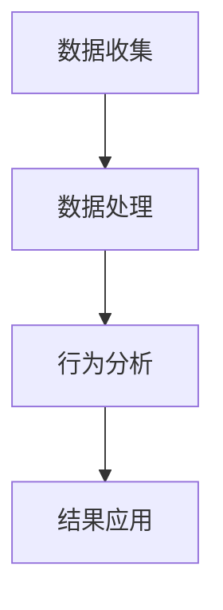

                 

### 第1章：用户行为分析概述

#### 1.1 用户行为分析的定义与重要性

用户行为分析是指通过收集、处理和分析用户在使用产品或服务过程中的行为数据，以深入了解用户需求、预测用户行为、优化产品设计和提升用户体验的过程。它是一种以数据驱动的分析方法，旨在通过分析用户的实际行为来指导决策和优化业务策略。

用户行为分析的重要性体现在以下几个方面：

1. **用户理解**：通过用户行为分析，企业可以更深入地了解用户的需求、偏好和行为模式，从而更好地满足用户需求。
2. **产品优化**：用户行为分析有助于发现产品中的问题、不足和改进点，从而优化产品设计，提升产品竞争力。
3. **营销策略**：通过分析用户行为数据，企业可以制定更精准的营销策略，提高营销效果。
4. **业务增长**：用户行为分析有助于企业发现新的商业机会，提高用户留存率和转化率，从而实现业务增长。

#### 1.2 用户行为分析的基本框架

用户行为分析的基本框架通常包括以下四个步骤：

1. **数据收集**：通过客户端数据收集、服务器日志数据收集、社交媒体数据收集等方式获取用户行为数据。
2. **数据处理**：对收集到的数据进行清洗、整合、特征提取等预处理，以提高数据质量。
3. **行为分析**：利用数据分析和挖掘技术，对用户行为数据进行分析，提取有用信息。
4. **策略优化**：根据分析结果调整产品设计和营销策略，以优化用户体验和业务效益。


#### 1.3 用户行为分析的分类

用户行为分析可以按照不同的维度进行分类，常见的分类方法包括：

1. **按数据来源分类**：
   - **客户端数据**：包括用户在客户端设备上产生的数据，如点击行为、浏览历史、操作路径等。
   - **服务器日志数据**：包括服务器接收和响应用户请求所产生的日志数据，如访问时间、访问页面、访问频率等。
   - **社交媒体数据**：包括用户在社交媒体平台上产生的数据，如微博、微信、Facebook等。

2. **按分析目的分类**：
   - **用户理解**：旨在深入了解用户需求、行为和偏好。
   - **产品优化**：旨在发现产品问题、改进点，优化产品设计。
   - **营销策略**：旨在制定精准营销策略，提高营销效果。
   - **业务增长**：旨在发现新的商业机会，提高用户留存率和转化率。

#### 1.4 用户行为分析的应用领域

用户行为分析在多个领域都有广泛应用，以下是一些典型应用领域：

1. **电子商务**：通过用户行为分析，电商平台可以优化商品推荐、库存管理、营销策略等，提高销售额和用户满意度。
2. **金融行业**：通过用户行为分析，金融机构可以识别欺诈行为、评估信用风险，优化金融服务。
3. **在线教育**：通过用户行为分析，在线教育平台可以了解学生学习情况，优化课程设计和教学方法。
4. **酒店行业**：通过用户行为分析，酒店可以优化服务流程、提高客户满意度，提高预订转化率。
5. **医疗行业**：通过用户行为分析，医疗机构可以了解患者需求、行为和健康情况，优化医疗服务。

#### 1.5 用户行为分析的挑战与应对策略

尽管用户行为分析具有巨大潜力，但在实际应用中也面临一些挑战：

1. **数据隐私与安全**：用户行为数据涉及到用户的隐私信息，如何保护用户隐私是一个重要问题。应对策略包括数据加密、匿名化处理、合规性检查等。
2. **数据质量**：用户行为数据的质量直接影响分析结果的准确性。应对策略包括数据清洗、数据整合、数据质量评估等。
3. **算法解释性**：用户行为分析往往涉及到复杂的算法模型，如何解释算法决策结果是一个挑战。应对策略包括算法可视化、决策解释工具等。

#### 1.6 用户行为分析的发展趋势

用户行为分析在未来将继续发展，以下是几个可能的发展趋势：

1. **人工智能与大数据的融合**：随着人工智能和大数据技术的不断发展，用户行为分析将更加智能化和精确化。
2. **跨领域应用**：用户行为分析将与其他领域如物联网、云计算、区块链等深度融合，形成新的应用场景。
3. **个性化服务**：通过用户行为分析，企业可以提供更加个性化的产品和服务，提高用户满意度和忠诚度。
4. **实时分析**：随着实时数据处理和分析技术的发展，用户行为分析将实现实时响应和调整，提高业务决策效率。

---

### 第1章小结

本章概述了用户行为分析的定义、重要性、基本框架、分类、应用领域以及面临的挑战和未来发展趋势。用户行为分析作为一种重要的数据分析方法，在提升用户体验、优化产品设计和营销策略等方面发挥着重要作用。在接下来的章节中，我们将进一步探讨人工智能在用户行为分析中的应用，以及如何通过用户行为数据优化商品供给和营销策略。

### 第1章：用户行为分析概述

#### 1.1 用户行为分析的定义与重要性

**用户行为分析**，顾名思义，是对用户在产品或服务使用过程中的行为进行系统性的收集、分析和解读的过程。这一分析过程不仅仅限于传统的点击、浏览、搜索等行为，还包括用户在社交网络上的互动、评论、分享等复杂行为模式。用户行为分析的定义可以进一步细化为以下几个方面：

1. **数据收集**：用户行为分析的第一步是数据收集，包括用户在设备上的活动数据、服务器日志、社交媒体数据等。
2. **数据预处理**：收集到的原始数据通常需要进行清洗、去重、整合等预处理步骤，以确保数据的质量和一致性。
3. **行为特征提取**：通过对预处理后的数据进行特征提取，可以将用户的行为转化为可量化的指标，如点击率、转化率、停留时间等。
4. **行为模式识别**：利用统计分析和机器学习技术，识别用户的行为模式，如用户群体特征、用户生命周期等。
5. **结果应用**：将分析结果应用于产品优化、营销策略制定、个性化推荐等，以提高用户体验和业务效率。

**重要性**方面，用户行为分析具有以下几个关键作用：

1. **用户理解**：通过分析用户行为，企业可以深入了解用户的需求、偏好和痛点，从而更好地满足用户需求。
2. **产品优化**：用户行为分析有助于发现产品中的问题、不足和改进点，从而优化产品设计，提升产品竞争力。
3. **营销策略**：用户行为分析可以为营销策略提供数据支持，帮助制定更精准、更有效的营销计划。
4. **业务增长**：用户行为分析可以挖掘新的商业机会，提高用户留存率和转化率，从而实现业务增长。

在技术发展的推动下，用户行为分析的方法和工具也在不断进化。传统的用户行为分析主要依赖于日志分析和统计工具，而随着人工智能和大数据技术的兴起，用户行为分析变得更加智能化和精细化。例如，利用机器学习算法可以自动识别用户行为模式，利用深度学习模型可以进行情感分析和意图识别，从而更深入地理解用户需求和行为。

#### 1.2 用户行为分析的基本框架

**基本框架**是用户行为分析的核心，它包括以下几个关键步骤：

1. **数据收集**：
   - **客户端数据**：通过客户端应用程序（App）收集用户的行为数据，如点击、滑动、浏览时间等。
   - **服务器日志数据**：通过服务器日志记录用户访问网站的详细信息，如访问时间、访问页面、操作路径等。
   - **社交媒体数据**：从社交媒体平台获取用户在平台上的互动数据，如点赞、评论、分享等。

2. **数据处理**：
   - **数据清洗**：去除重复、异常、缺失的数据，确保数据的质量和一致性。
   - **数据整合**：将来自不同源的数据进行合并，形成一个统一的数据集。
   - **特征提取**：从原始数据中提取有用的特征，如用户年龄、性别、地理位置等，以用于后续的分析。

3. **行为分析**：
   - **描述性分析**：对用户行为进行描述性统计，如计算用户的平均浏览时间、点击率等。
   - **关联分析**：找出用户行为之间的关联性，如用户在浏览商品A后，通常会浏览商品B。
   - **模式识别**：利用机器学习算法，如聚类、分类等，识别用户的行为模式。

4. **结果应用**：
   - **产品优化**：根据分析结果优化产品设计，提高用户体验。
   - **营销策略**：基于用户行为数据制定精准的营销策略，提高转化率。
   - **个性化推荐**：利用用户行为数据，为用户提供个性化的产品推荐。

**基本框架**可以用以下Mermaid流程图表示：




通过这个框架，企业可以系统地进行用户行为分析，从而更好地理解和满足用户需求，实现业务目标。

#### 1.3 用户行为分析的分类

**用户行为分析**可以按照不同的维度进行分类，以下是一些常见的分类方法：

1. **按数据来源分类**：
   - **客户端数据**：指用户在客户端设备上产生的行为数据，如App内的操作、点击、浏览等。
   - **服务器日志数据**：指服务器接收和响应用户请求所产生的日志数据，如访问时间、访问页面、操作路径等。
   - **社交媒体数据**：指用户在社交媒体平台上产生的数据，如微博、微信、Facebook等。

2. **按分析目的分类**：
   - **用户理解**：通过分析用户行为，深入了解用户的需求、偏好和行为模式。
   - **产品优化**：通过分析用户行为，发现产品中的问题、不足和改进点，优化产品设计。
   - **营销策略**：通过分析用户行为，制定精准的营销策略，提高营销效果。
   - **业务增长**：通过分析用户行为，挖掘新的商业机会，提高用户留存率和转化率。

3. **按分析方法分类**：
   - **描述性分析**：对用户行为进行描述性统计，如计算用户的平均浏览时间、点击率等。
   - **关联分析**：找出用户行为之间的关联性，如用户在浏览商品A后，通常会浏览商品B。
   - **预测分析**：利用历史数据预测用户的未来行为，如预测用户的购买时间、购买商品等。
   - **情感分析**：对用户的文本评论、反馈进行情感分析，了解用户的情绪和态度。

不同的分类方法有助于从不同角度对用户行为进行分析，从而更全面地理解和满足用户需求。

#### 1.4 用户行为分析的应用领域

**用户行为分析**在多个领域都有广泛应用，以下是一些典型应用领域：

1. **电子商务**：通过用户行为分析，电商平台可以优化商品推荐、库存管理、营销策略等，提高销售额和用户满意度。例如，通过分析用户的浏览和购买历史，平台可以推荐用户可能感兴趣的商品，提高转化率。

2. **金融行业**：通过用户行为分析，金融机构可以识别欺诈行为、评估信用风险，优化金融服务。例如，通过分析用户的交易行为和信用记录，银行可以评估贷款申请者的信用风险，从而降低坏账率。

3. **在线教育**：通过用户行为分析，在线教育平台可以了解学生的学习情况，优化课程设计和教学方法。例如，通过分析学生的学习路径和成绩，平台可以调整教学内容的难度和顺序，提高学习效果。

4. **酒店行业**：通过用户行为分析，酒店可以优化服务流程、提高客户满意度，提高预订转化率。例如，通过分析用户的预订历史和评价，酒店可以预测用户的偏好，提供个性化的服务和建议。

5. **医疗行业**：通过用户行为分析，医疗机构可以了解患者需求、行为和健康情况，优化医疗服务。例如，通过分析患者的就诊记录和健康数据，医院可以制定个性化的治疗方案，提高治疗效果。

在上述应用领域中，用户行为分析不仅有助于提升用户体验，还能为企业的业务决策提供数据支持，实现业务增长。

#### 1.5 用户行为分析的挑战与应对策略

尽管用户行为分析具有巨大的潜力和应用价值，但在实际操作过程中也面临诸多挑战，需要采取有效的应对策略来解决：

1. **数据隐私与安全**：
   - **挑战**：用户行为数据包含用户的个人隐私信息，如姓名、地址、联系方式等。如何保护用户隐私成为一个重要问题。
   - **应对策略**：
     - **数据匿名化**：在数据分析过程中，对用户数据进行匿名化处理，去除能够直接识别用户身份的信息。
     - **数据加密**：对敏感数据进行加密存储和传输，确保数据在传输和存储过程中的安全性。
     - **隐私政策**：制定明确的隐私政策，告知用户数据收集的目的、范围和使用方式，增强用户对数据保护的信任。

2. **数据质量**：
   - **挑战**：用户行为数据的质量直接影响分析结果的准确性。数据中可能存在缺失、重复、异常值等问题。
   - **应对策略**：
     - **数据清洗**：对收集到的用户行为数据进行清洗，去除重复数据、填充缺失值、纠正异常值等。
     - **数据质量评估**：建立数据质量评估机制，定期检查数据的一致性、完整性和准确性，确保数据质量。
     - **数据预处理**：在数据进入分析模型之前，进行预处理，如特征提取、归一化等，提高数据的质量和一致性。

3. **算法解释性**：
   - **挑战**：用户行为分析往往涉及到复杂的算法模型，如机器学习模型。如何解释和验证算法的决策结果成为一个难题。
   - **应对策略**：
     - **算法可视化**：通过可视化工具将算法决策过程和结果展示出来，帮助用户理解算法的运作机制。
     - **决策解释工具**：开发决策解释工具，如LIME、SHAP等，帮助用户理解模型的预测结果和影响因素。
     - **模型验证**：通过交叉验证、A/B测试等方法，验证模型的准确性和可靠性，确保模型的有效性。

4. **技术挑战**：
   - **挑战**：随着用户行为数据的规模和复杂性增加，如何高效地存储、处理和分析这些数据成为一个技术难题。
   - **应对策略**：
     - **分布式系统**：采用分布式系统架构，如Hadoop、Spark等，提高数据处理的效率和速度。
     - **大数据技术**：利用大数据技术，如MapReduce、流处理等，实现对大规模用户行为数据的实时处理和分析。
     - **云计算**：利用云计算资源，如AWS、Azure等，提供弹性的计算和存储能力，满足大规模数据处理需求。

通过上述应对策略，企业可以在用户行为分析过程中克服各种挑战，确保数据分析结果的准确性和可靠性，从而实现业务优化和增长。

#### 1.6 用户行为分析的发展趋势

随着技术的不断进步，用户行为分析也在不断发展，呈现出以下几大趋势：

1. **人工智能与大数据的融合**：
   - **趋势**：人工智能（AI）和大数据（Big Data）技术的快速发展，使得用户行为分析变得更加智能化和精细化。
   - **影响**：通过AI算法，如深度学习、强化学习等，可以更准确地识别和预测用户行为，从而提高分析结果的准确性和实用性。

2. **跨领域应用**：
   - **趋势**：用户行为分析不仅局限于传统领域，如电子商务和金融，还逐渐应用于物联网（IoT）、社交媒体、医疗等行业。
   - **影响**：跨领域应用使得用户行为分析能够覆盖更广泛的数据源，从而获得更全面、更深入的洞察，助力各行业实现数字化转型。

3. **实时分析与决策**：
   - **趋势**：随着实时数据处理和分析技术的发展，用户行为分析可以实现实时响应和调整。
   - **影响**：实时分析能够帮助企业在用户行为发生的瞬间做出决策，从而提高业务效率和用户体验。

4. **个性化服务**：
   - **趋势**：通过用户行为分析，企业可以提供更加个性化的产品和服务，满足不同用户的需求。
   - **影响**：个性化服务能够提高用户满意度和忠诚度，从而实现业务增长。

5. **隐私保护与合规**：
   - **趋势**：随着用户隐私意识的提高，数据隐私保护成为用户行为分析的重要课题。
   - **影响**：合规的数据处理和隐私保护措施能够增强用户对企业的信任，促进用户行为分析的可持续发展。

综上所述，用户行为分析在未来将继续向智能化、实时化、个性化方向发展，为各行业提供强大的数据驱动力。

#### 1.7 用户行为分析中的核心算法

在用户行为分析中，核心算法的作用至关重要。这些算法能够帮助我们从大量用户行为数据中提取有价值的信息，进而优化产品设计和营销策略。以下是几种常见的核心算法及其原理和应用。

##### 1.7.1 K-均值聚类算法

**K-均值聚类算法**是一种无监督学习算法，用于将数据集分为K个簇，每个簇由其质心（即簇内所有点的平均值）代表。其基本原理如下：

1. **初始化**：随机选择K个初始质心。
2. **分配**：将每个数据点分配到最近的质心所代表的簇。
3. **更新**：重新计算每个簇的质心。
4. **迭代**：重复步骤2和步骤3，直到质心不再变化或达到预设的迭代次数。

**伪代码**：

```python
def k_means(data, K, max_iterations):
    # 初始化质心
    centroids = initialize_centroids(data, K)
    for i in range(max_iterations):
        # 分配数据点到簇
        clusters = assign_points_to_clusters(data, centroids)
        # 更新质心
        centroids = update_centroids(clusters, K)
        # 检查收敛条件
        if convergence(centroids):
            break
    return clusters, centroids
```

**数学模型**：

$$
\text{簇} \, i = \{ x \,|\, d(x, \text{centroid of cluster} \, i) \leq d(x, \text{centroid of cluster} \, j), \, \forall j \neq i \}
$$

**应用**：K-均值聚类算法在用户行为分析中可用于用户分群，识别具有相似行为特征的群体，从而制定个性化的营销策略。

##### 1.7.2 决策树算法

**决策树算法**是一种有监督学习算法，用于构建一个树形结构，对数据集进行分类或回归。其基本原理如下：

1. **选择特征**：根据信息增益、基尼不纯度等指标，选择最优特征进行划分。
2. **划分数据**：将数据集划分为两个子集，根据选择的特征进行划分。
3. **递归构建**：对划分后的子集重复步骤1和步骤2，直到满足终止条件（如最大深度、纯度等）。

**伪代码**：

```python
def build_decision_tree(data, features, max_depth):
    if meet_termination_condition(data):
        return leaf_node
    else:
        # 选择最优特征
        best_feature = select_best_feature(data, features)
        # 创建节点
        node = TreeNode(feature=best_feature)
        # 递归构建子树
        for value in best_feature.values:
            subset = filter_data(data, best_feature, value)
            node.children[value] = build_decision_tree(subset, features, max_depth - 1)
        return node
```

**数学模型**：

$$
\text{Gini 不纯度} = 1 - \sum_{i} p_i^2
$$

**应用**：决策树算法在用户行为分析中可用于用户分类、行为预测等，帮助识别不同用户群体的行为特征。

##### 1.7.3 支持向量机算法

**支持向量机（SVM）算法**是一种有监督学习算法，用于分类和回归。其基本原理如下：

1. **选择特征**：将数据映射到高维空间，寻找一个最优的超平面，使不同类别的数据点尽可能分开。
2. **计算间隔**：计算分类间隔，即分类器能够正确分类的最大距离。
3. **优化目标**：最小化间隔，最大化分类准确性。

**伪代码**：

```python
def svm_train(data, labels):
    # 选择核函数
    kernel_function = choose_kernel_function()
    # 训练模型
    model = optimize_model(data, labels, kernel_function)
    return model
```

**数学模型**：

$$
\text{优化目标}：\min_{w, b} \frac{1}{2} \| w \|^2 + C \sum_{i} \max(0, 1 - y_i ( \langle w, x_i \rangle + b ))
$$

**应用**：支持向量机算法在用户行为分析中可用于用户分群、行为预测等，帮助识别不同用户群体的行为特征。

通过这些核心算法的应用，用户行为分析可以更精确地理解和预测用户行为，从而为企业提供有效的决策支持。

### 1.8 用户行为分析中的关键步骤：数据收集与处理

用户行为分析的成功依赖于高质量的数据收集与处理。这一步骤是整个分析流程的基础，决定了后续分析结果的准确性和可靠性。以下将详细阐述用户行为分析中的数据收集与处理步骤。

#### 1.8.1 数据收集方法

数据收集是用户行为分析的第一步，方法主要包括以下几种：

1. **客户端数据收集**：
   - **App内数据**：通过客户端应用程序（App）收集用户在App内的操作行为，如点击、浏览、搜索等。
   - **传感器数据**：利用设备上的传感器（如GPS、加速度计等）收集用户的位置、移动轨迹等数据。
   - **用户反馈**：通过问卷调查、用户反馈等形式收集用户对产品或服务的满意度和建议。

2. **服务器日志数据收集**：
   - **请求日志**：服务器记录用户请求的详细信息，如请求时间、请求URL、请求方法、状态码等。
   - **响应日志**：服务器记录对用户请求的响应，如响应时间、响应内容等。
   - **会话日志**：记录用户在整个会话过程中的行为路径，如浏览历史、操作序列等。

3. **社交媒体数据收集**：
   - **公开数据**：通过爬虫技术收集用户在社交媒体平台上的公开信息，如微博、微信、Facebook等。
   - **用户生成内容**：收集用户在社交媒体上生成的内容，如评论、点赞、分享等。

#### 1.8.2 数据预处理

收集到的原始数据通常存在噪声、缺失、重复等问题，需要通过数据预处理步骤进行清洗和整理，以提高数据质量。以下是一些常见的数据预处理方法：

1. **数据清洗**：
   - **去除噪声**：去除数据中的异常值、重复值和错误值，确保数据的准确性。
   - **数据转换**：将数据转换为统一的格式和单位，如日期时间的规范化、数值的标准化等。
   - **缺失值处理**：填补缺失值或删除含有缺失值的数据，根据数据的性质和重要性进行选择。

2. **数据整合**：
   - **合并数据源**：将来自不同数据源的数据进行整合，形成一个统一的数据集。
   - **数据对齐**：将不同时间戳或时间序列的数据进行对齐，确保数据的一致性。

3. **特征提取**：
   - **统计特征**：从原始数据中提取统计特征，如均值、标准差、最大值、最小值等。
   - **文本特征**：对文本数据提取词频、词向量、主题模型等特征。
   - **图像特征**：对图像数据提取特征，如颜色直方图、纹理特征、形状特征等。

#### 1.8.3 数据处理流程

数据处理流程通常包括以下步骤：

1. **数据收集**：通过多种渠道收集用户行为数据，包括客户端数据、服务器日志数据和社交媒体数据。
2. **数据预处理**：对收集到的原始数据进行清洗、转换、整合和特征提取，确保数据的质量和一致性。
3. **数据存储**：将处理后的数据存储在数据库或数据仓库中，以便后续的分析和处理。
4. **数据挖掘**：利用数据挖掘技术和算法，对用户行为数据进行分析和挖掘，提取有价值的信息。
5. **可视化展示**：将分析结果通过可视化工具进行展示，帮助用户理解和解读分析结果。

#### 1.8.4 数据质量评估

数据质量是用户行为分析的关键，因此需要对数据质量进行评估和监控。以下是一些常见的数据质量评估指标：

1. **完整性**：数据完整性指的是数据是否完整，是否存在缺失或重复值。
2. **一致性**：数据一致性指的是数据在不同来源和不同时间是否保持一致。
3. **准确性**：数据准确性指的是数据的真实性和可靠性，是否准确反映了用户行为。
4. **时效性**：数据时效性指的是数据是否及时更新，是否反映了最新的用户行为。
5. **可用性**：数据可用性指的是数据是否易于使用，是否能够满足分析需求。

通过上述数据收集与处理步骤，用户行为分析可以获取高质量的数据，从而提高分析结果的准确性和可靠性。这为进一步的用户行为分析和业务决策提供了坚实的基础。

### 1.9 用户行为分析中的常见算法与模型

在用户行为分析中，算法和模型的选择至关重要。它们能够帮助我们从复杂的用户行为数据中提取有价值的信息，从而为产品优化、营销策略和业务增长提供数据支持。以下介绍几种常见的算法与模型，包括其原理、实现方法和应用场景。

#### 1.9.1 聚类算法

**聚类算法**是一种无监督学习算法，用于将数据集划分为若干个簇，使同一簇内的数据点彼此相似，不同簇的数据点差异较大。常见的聚类算法包括K-均值聚类、层次聚类和DBSCAN。

1. **K-均值聚类**：
   - **原理**：K-均值聚类算法通过迭代优化质心，将数据点分配到最近的质心所代表的簇。
   - **实现方法**：初始化K个质心，将每个数据点分配到最近的质心所代表的簇，更新质心位置，重复迭代直到质心不再变化或达到预设的迭代次数。
   - **数学模型**：
     $$
     \text{簇} \, i = \{ x \,|\, d(x, \text{centroid of cluster} \, i) \leq d(x, \text{centroid of cluster} \, j), \, \forall j \neq i \}
     $$
   - **应用场景**：用户分群、商品推荐等。

2. **层次聚类**：
   - **原理**：层次聚类算法通过递归地将数据点合并，构建一个层次结构，层次结构的每个层次都是一个聚类。
   - **实现方法**：自底向上或自顶向下构建层次结构，通过距离度量计算聚类合并。
   - **数学模型**：
     $$
     \text{层次聚类} = \{ \text{簇} \, 1, \text{簇} \, 2, ..., \text{簇} \, N \}
     $$
   - **应用场景**：用户分群、市场细分等。

3. **DBSCAN**：
   - **原理**：DBSCAN（Density-Based Spatial Clustering of Applications with Noise）算法基于密度的连通性进行聚类，能够发现任意形状的簇，并能处理噪声数据。
   - **实现方法**：通过扫描数据点，计算邻域内的密度，将密度高的点划分为核心点、边界点和噪声点。
   - **数学模型**：
     $$
     \text{核心点} = \{ p \,|\, \exists \, \text{邻域} \, N_{\epsilon}(p) \, \text{满足} \, |N_{\epsilon}(p)| > \text{min\_points} \}
     $$
   - **应用场景**：用户分群、异常检测等。

#### 1.9.2 预测模型

**预测模型**是一种有监督学习算法，用于根据历史数据预测未来行为或趋势。常见的预测模型包括线性回归、决策树、随机森林和时间序列分析。

1. **线性回归**：
   - **原理**：线性回归模型通过建立自变量和因变量之间的线性关系，预测因变量的取值。
   - **实现方法**：通过最小二乘法拟合一条直线，使预测值与实际值的误差最小。
   - **数学模型**：
     $$
     y = \beta_0 + \beta_1 x
     $$
   - **应用场景**：用户行为预测、销售预测等。

2. **决策树**：
   - **原理**：决策树模型通过一系列条件判断，将数据划分为若干个子集，并在每个子集上应用不同类型的模型。
   - **实现方法**：递归构建决策树，直到满足终止条件（如最大深度、纯度等）。
   - **数学模型**：
     $$
     \text{决策树} = \text{if} \, x \, \text{is} \, \text{A} \, \text{then} \, y = \beta_0 + \beta_1 x \, \text{else} \, y = \beta_0 + \beta_2 x
     $$
   - **应用场景**：用户行为分类、异常检测等。

3. **随机森林**：
   - **原理**：随机森林模型通过构建多棵决策树，对每个树的结果进行投票，提高模型的预测准确性和泛化能力。
   - **实现方法**：随机选择特征和样本子集，构建多棵决策树，并对每个树的结果进行投票。
   - **数学模型**：
     $$
     \hat{y} = \text{majority\_vote}(\hat{y}_1, \hat{y}_2, ..., \hat{y}_N)
     $$
   - **应用场景**：用户行为预测、风险评估等。

4. **时间序列分析**：
   - **原理**：时间序列分析模型用于分析随时间变化的数据序列，预测未来的趋势和周期性。
   - **实现方法**：通过建立时间序列模型，如ARIMA、LSTM等，对时间序列数据进行预测。
   - **数学模型**：
     $$
     y_t = \phi_0 + \phi_1 y_{t-1} + \phi_2 y_{t-2} + ... + \phi_p y_{t-p} + \epsilon_t
     $$
   - **应用场景**：用户行为预测、市场趋势预测等。

通过上述算法和模型，用户行为分析可以更准确地预测用户行为、分类用户群体和发现异常行为，从而为业务决策提供有力支持。

### 1.10 用户行为分析在电子商务中的应用

在电子商务领域，用户行为分析具有至关重要的意义。通过深入分析用户的行为数据，电商平台可以优化产品推荐、改善用户体验、提高转化率和销售额。以下是用户行为分析在电子商务中的具体应用实例：

#### 1.10.1 商品推荐

**商品推荐**是电子商务中最为常见的应用场景之一。通过用户行为数据，如浏览历史、购买记录、搜索关键词等，电商平台可以构建推荐模型，向用户推荐他们可能感兴趣的商品。

**案例**：亚马逊（Amazon）通过分析用户的浏览和购买历史，使用协同过滤算法（Collaborative Filtering）和内容推荐算法（Content-based Filtering）相结合的方式，为用户推荐相关的商品。协同过滤算法通过分析用户之间的相似性，找到兴趣相似的群体，推荐他们喜欢的商品。而内容推荐算法则通过分析商品的特征，如类别、品牌、价格等，推荐与用户历史行为相似的物品。

**算法实现**：

1. **协同过滤算法**：
   - **数学模型**：
     $$
     \text{推荐分数} = \text{user\_similarity} \cdot \text{item\_rating}
     $$
   - **伪代码**：
     ```python
     def collaborative_filtering(users, items, ratings):
         user_similarity = calculate_similarity(users)
         recommendations = []
         for user in users:
             for item in items:
                 if user_liked_item(user, item):
                     similarity = user_similarity[user][item]
                     recommendation_score = similarity * ratings[user][item]
                     recommendations.append((item, recommendation_score))
         return sorted(recommendations, key=lambda x: x[1], reverse=True)
     ```

2. **内容推荐算法**：
   - **数学模型**：
     $$
     \text{推荐分数} = \text{item\_similarity} \cdot \text{user\_interest}
     $$
   - **伪代码**：
     ```python
     def content_based_filtering(users, items, user_interests):
         item_similarity = calculate_similarity(items)
         recommendations = []
         for item in items:
             if not user_liked_item(user, item):
                 similarity = item_similarity[item]
                 recommendation_score = similarity * user_interests[user]
                 recommendations.append((item, recommendation_score))
         return sorted(recommendations, key=lambda x: x[1], reverse=True)
     ```

通过协同过滤和内容推荐算法的相结合，亚马逊能够为用户提供个性化的商品推荐，提高用户的满意度和转化率。

#### 1.10.2 用户分群

**用户分群**是通过对用户行为数据的分析，将用户划分为不同的群体，以便制定有针对性的营销策略。常见的用户分群方法包括K-均值聚类、决策树等。

**案例**：阿里巴巴通过分析用户的浏览、购买、评价等行为数据，将用户划分为以下几类：

1. **高价值用户**：具有高购买频率和购买金额的用户。
2. **潜力用户**：具有潜在购买能力的用户，如经常浏览和搜索但购买较少的用户。
3. **忠诚用户**：长期购买同一品牌或商品的用户。
4. **流失用户**：长时间没有购买行为的用户。

**算法实现**：

1. **K-均值聚类**：
   - **数学模型**：
     $$
     \text{簇} \, i = \{ x \,|\, d(x, \text{centroid of cluster} \, i) \leq d(x, \text{centroid of cluster} \, j), \, \forall j \neq i \}
     $$
   - **伪代码**：
     ```python
     def k_means_clustering(data, K, max_iterations):
         centroids = initialize_centroids(data, K)
         for i in range(max_iterations):
             clusters = assign_points_to_clusters(data, centroids)
             centroids = update_centroids(clusters, K)
             if convergence(centroids):
                 break
         return clusters
     ```

2. **决策树**：
   - **数学模型**：
     $$
     \text{Gini 不纯度} = 1 - \sum_{i} p_i^2
     $$
   - **伪代码**：
     ```python
     def build_decision_tree(data, features, target_attribute):
         if meet_termination_condition(data):
             return leaf_node
         else:
             best_feature = select_best_feature(data, features)
             node = TreeNode(feature=best_feature)
             for value in best_feature.values:
                 subset = filter_data(data, best_feature, value)
                 node.children[value] = build_decision_tree(subset, features, target_attribute)
             return node
     ```

通过用户分群，阿里巴巴能够针对不同类型的用户制定个性化的营销策略，提高营销效果。

#### 1.10.3 用户流失预测

**用户流失预测**是电子商务企业关注的重要问题，通过分析用户行为数据，可以提前识别潜在的流失用户，采取相应的措施挽回流失用户。

**案例**：京东通过分析用户的购买频率、浏览时长、评论等行为数据，使用机器学习算法建立用户流失预测模型，提前识别出可能流失的用户，并采取相应的挽留措施。

**算法实现**：

1. **逻辑回归**：
   - **数学模型**：
     $$
     \text{概率} = \frac{1}{1 + e^{-(\beta_0 + \beta_1 x_1 + \beta_2 x_2 + ... + \beta_n x_n )}
     $$
   - **伪代码**：
     ```python
     def logistic_regression_train(data, labels):
         w = initialize_weights()
         for epoch in range(num_epochs):
             for x, y in data:
                 prediction = sigmoid(np.dot(x, w))
                 loss = -1 * (y * np.log(prediction) + (1 - y) * np.log(1 - prediction))
                 gradient = np.dot(x.T, (prediction - y))
                 w -= learning_rate * gradient
         return w
     ```

2. **决策树**：
   - **数学模型**：
     $$
     \text{决策树} = \text{if} \, x \, \text{is} \, \text{A} \, \text{then} \, \text{流失概率} \, = \, \text{P}_1 \, \text{else} \, \text{流失概率} \, = \, \text{P}_2
     $$
   - **伪代码**：
     ```python
     def build_decision_tree(data, features, target_attribute):
         if meet_termination_condition(data):
             return leaf_node
         else:
             best_feature = select_best_feature(data, features)
             node = TreeNode(feature=best_feature)
             for value in best_feature.values:
                 subset = filter_data(data, best_feature, value)
                 node.children[value] = build_decision_tree(subset, features, target_attribute)
             return node
     ```

通过用户流失预测模型，京东能够提前识别潜在的流失用户，采取针对性的挽留措施，降低用户流失率。

#### 1.10.4 个性化营销

**个性化营销**是电子商务企业提升用户体验和销售额的重要手段。通过分析用户行为数据，企业可以为不同的用户群体制定个性化的营销策略。

**案例**：网易考拉海购通过分析用户的浏览历史、购买记录和偏好，为用户提供个性化的促销信息、优惠券和商品推荐。

**算法实现**：

1. **协同过滤算法**：
   - **数学模型**：
     $$
     \text{推荐分数} = \text{user\_similarity} \cdot \text{item\_rating}
     $$
   - **伪代码**：
     ```python
     def collaborative_filtering(users, items, ratings):
         user_similarity = calculate_similarity(users)
         recommendations = []
         for user in users:
             for item in items:
                 if user_liked_item(user, item):
                     similarity = user_similarity[user][item]
                     recommendation_score = similarity * ratings[user][item]
                     recommendations.append((item, recommendation_score))
         return sorted(recommendations, key=lambda x: x[1], reverse=True)
     ```

2. **内容推荐算法**：
   - **数学模型**：
     $$
     \text{推荐分数} = \text{item\_similarity} \cdot \text{user\_interest}
     $$
   - **伪代码**：
     ```python
     def content_based_filtering(users, items, user_interests):
         item_similarity = calculate_similarity(items)
         recommendations = []
         for item in items:
             if not user_liked_item(user, item):
                 similarity = item_similarity[item]
                 recommendation_score = similarity * user_interests[user]
                 recommendations.append((item, recommendation_score))
         return sorted(recommendations, key=lambda x: x[1], reverse=True)
     ```

通过个性化营销，网易考拉海购能够提高用户的满意度和忠诚度，从而提升销售额。

### 1.11 本章小结

本章介绍了用户行为分析的定义、重要性、基本框架、分类、应用领域以及常见算法与模型。通过用户行为分析，企业可以深入了解用户需求，优化产品设计和营销策略，提高用户体验和业务效益。在电子商务领域，用户行为分析在商品推荐、用户分群、用户流失预测和个性化营销等方面具有广泛的应用。本章的内容为后续章节进一步探讨人工智能在用户行为分析中的应用奠定了基础。在接下来的章节中，我们将继续深入探讨用户行为分析在人工智能中的前沿技术与应用。

### 第2章：人工智能与用户行为分析

#### 2.1 人工智能的基本原理

**人工智能（Artificial Intelligence, AI）** 是一门研究、开发和应用使计算机模拟人类智能行为的科学。它通过算法和模型实现机器学习（Machine Learning, ML）、自然语言处理（Natural Language Processing, NLP）、计算机视觉（Computer Vision, CV）等技术，使计算机具备感知、理解、学习和决策的能力。

**机器学习** 是人工智能的核心组成部分，它通过训练模型，使计算机能够从数据中自动学习规律和模式，进行预测和决策。常见的机器学习算法包括监督学习（Supervised Learning）、无监督学习（Unsupervised Learning）和强化学习（Reinforcement Learning）。

- **监督学习**：输入特征和标签，通过模型训练，使模型能够预测新的数据。
- **无监督学习**：仅输入数据，模型自动发现数据中的结构和模式。
- **强化学习**：通过与环境的交互，模型不断学习最优策略，实现决策。

**自然语言处理** 是人工智能的重要应用领域，旨在使计算机理解和生成自然语言。它包括文本分类、情感分析、机器翻译、语音识别等技术。

**计算机视觉** 是人工智能的另一个重要应用领域，使计算机能够理解和解释图像和视频。它包括图像分类、目标检测、人脸识别、物体识别等技术。

#### 2.2 人工智能在用户行为分析中的应用

**人工智能在用户行为分析中的应用** 主要体现在以下几个方面：

1. **行为模式识别**：
   - **监督学习算法**，如决策树、随机森林和神经网络，可以用于识别用户的行为模式。通过训练模型，分析用户的浏览历史、购买行为等数据，发现用户的行为特征和偏好。
   - **无监督学习算法**，如K-均值聚类和层次聚类，可以用于发现用户行为中的隐含模式。这些算法能够将用户划分为不同的群体，为个性化推荐和营销提供数据支持。

2. **用户行为预测**：
   - **时间序列分析算法**，如ARIMA和LSTM，可以用于预测用户未来的行为，如购买时间、浏览量等。这些算法能够考虑时间序列数据的时序关系和周期性，提高预测的准确性。
   - **强化学习算法**，如Q学习和深度Q网络（DQN），可以用于预测用户在复杂环境中的行为。通过不断与环境交互，模型能够学习最优策略，预测用户的下一步行为。

3. **情感分析和意图识别**：
   - **自然语言处理技术**，如词向量、卷积神经网络（CNN）和循环神经网络（RNN），可以用于分析用户的文本评论、反馈等数据，识别用户的情感和意图。这些技术能够理解用户的需求和偏好，为个性化推荐和营销提供更深入的数据支持。

4. **图像和视频分析**：
   - **计算机视觉技术**，如卷积神经网络（CNN）和目标检测算法，可以用于分析用户的图像和视频数据。这些技术能够识别用户的表情、姿态等特征，为个性化推荐和营销提供视觉数据支持。

#### 2.3 用户行为分析中的常用算法

在用户行为分析中，常用的算法包括以下几种：

1. **决策树**：
   - **原理**：决策树通过一系列条件判断，将数据划分为若干个子集，并在每个子集上应用不同类型的模型。
   - **优点**：易于理解，解释性强。
   - **应用场景**：用户分群、用户流失预测等。

2. **随机森林**：
   - **原理**：随机森林通过构建多棵决策树，对每个树的结果进行投票，提高模型的预测准确性和泛化能力。
   - **优点**：提高模型的稳定性和预测准确性。
   - **应用场景**：用户行为预测、风险评估等。

3. **K-均值聚类**：
   - **原理**：K-均值聚类算法通过迭代优化质心，将数据点分配到最近的质心所代表的簇。
   - **优点**：简单、高效。
   - **应用场景**：用户分群、商品推荐等。

4. **时间序列分析**：
   - **原理**：时间序列分析模型用于分析随时间变化的数据序列，预测未来的趋势和周期性。
   - **优点**：考虑时间序列数据的时序关系和周期性。
   - **应用场景**：用户行为预测、市场趋势预测等。

5. **神经网络**：
   - **原理**：神经网络通过多层非线性变换，对输入数据进行处理和预测。
   - **优点**：强大的表达能力和自适应能力。
   - **应用场景**：用户行为预测、图像识别、自然语言处理等。

#### 2.4 人工智能与用户行为分析的融合

**人工智能与用户行为分析的融合** 是当前研究的热点，它使用户行为分析更加智能化和精确化。以下是一些融合的方法：

1. **多模态数据融合**：
   - **方法**：将不同来源的用户行为数据进行整合，如文本、图像、视频等，以提高分析结果的准确性。
   - **应用场景**：个性化推荐、用户流失预测等。

2. **迁移学习**：
   - **方法**：利用已有模型的知识，对新任务进行训练，提高新任务的预测准确性。
   - **应用场景**：用户行为预测、商品推荐等。

3. **生成对抗网络（GAN）**：
   - **方法**：通过生成模型和判别模型的对抗训练，生成高质量的用户行为数据，提高模型训练效果。
   - **应用场景**：用户行为预测、图像识别等。

4. **混合智能系统**：
   - **方法**：结合不同的人工智能技术，如深度学习、自然语言处理、计算机视觉等，构建混合智能系统，提高用户行为分析的综合能力。
   - **应用场景**：智能客服、智能推荐等。

通过人工智能与用户行为分析的融合，企业可以更加精准地了解用户需求，优化产品设计和营销策略，提高用户体验和业务效益。

### 2.5 用户行为分析中的深度学习应用

**深度学习（Deep Learning, DL）** 是一种基于多层神经网络的学习方法，它通过模拟人脑的神经网络结构，对大量数据进行自动特征提取和模式识别。在用户行为分析中，深度学习技术发挥了重要作用，以下将详细介绍其在用户行为分析中的具体应用。

#### 2.5.1 深度学习的基本原理

深度学习的基本原理是模拟人脑的神经网络结构，通过多层非线性变换对输入数据进行处理。深度学习模型通常由多个层级组成，每个层级都通过前一层级的输出进行特征提取和变换。常见的深度学习模型包括卷积神经网络（CNN）、循环神经网络（RNN）和生成对抗网络（GAN）等。

1. **卷积神经网络（CNN）**：
   - **原理**：CNN通过卷积层、池化层和全连接层对图像数据进行处理，能够自动提取图像的局部特征。
   - **应用**：图像识别、物体检测、人脸识别等。

2. **循环神经网络（RNN）**：
   - **原理**：RNN通过循环结构，对序列数据进行处理，能够捕捉序列数据中的时序关系。
   - **应用**：自然语言处理、时间序列预测等。

3. **生成对抗网络（GAN）**：
   - **原理**：GAN由生成器和判别器组成，生成器生成数据，判别器判断生成数据与真实数据的相似度，通过对抗训练，生成高质量的数据。
   - **应用**：图像生成、数据增强等。

#### 2.5.2 深度学习在用户行为分析中的应用

在用户行为分析中，深度学习技术广泛应用于行为模式识别、用户行为预测、情感分析和图像识别等方面。

1. **行为模式识别**：
   - **应用**：通过深度学习模型，对用户的浏览历史、购买行为等数据进行处理，识别用户的行为特征和偏好。
   - **方法**：使用卷积神经网络（CNN）和循环神经网络（RNN）等模型，对用户行为数据进行特征提取和模式识别。
   - **案例**：电商平台通过深度学习模型，分析用户的浏览和购买数据，识别用户的购物偏好，为个性化推荐提供数据支持。

2. **用户行为预测**：
   - **应用**：通过深度学习模型，预测用户未来的行为，如购买时间、浏览量等。
   - **方法**：使用时间序列分析算法（如LSTM、GRU等）和强化学习算法（如DQN、DDPG等），对用户行为数据进行预测。
   - **案例**：金融行业通过深度学习模型，预测用户的投资行为，为投资策略提供数据支持。

3. **情感分析**：
   - **应用**：通过深度学习模型，分析用户的文本评论、反馈等数据，识别用户的情感和态度。
   - **方法**：使用卷积神经网络（CNN）和循环神经网络（RNN）等模型，对文本数据进行情感分类和情感强度预测。
   - **案例**：社交媒体平台通过深度学习模型，分析用户的评论和动态，识别用户的主观情感，为内容推荐提供数据支持。

4. **图像识别**：
   - **应用**：通过深度学习模型，分析用户的图像数据，如人脸识别、姿态识别等。
   - **方法**：使用卷积神经网络（CNN）和目标检测算法（如YOLO、SSD等），对图像数据进行特征提取和目标识别。
   - **案例**：安防行业通过深度学习模型，识别监控视频中的异常行为，提高安全监控的准确性。

通过深度学习技术的应用，用户行为分析可以更加精准地了解用户需求，优化产品设计和营销策略，提高用户体验和业务效益。

### 2.6 人工智能与用户行为分析的融合策略

**人工智能与用户行为分析的融合** 是提升用户理解和业务决策的关键。为了实现这一目标，企业需要采取一系列策略，以下是一些关键的融合策略：

#### 2.6.1 数据融合

**数据融合** 是实现人工智能与用户行为分析融合的基础。通过整合来自不同渠道的数据，如客户端数据、服务器日志、社交媒体数据等，企业可以构建一个全面的用户行为数据集，从而更全面地理解用户。

**策略**：
1. **多源数据整合**：建立统一的数据平台，整合不同来源的数据，实现数据的一致性和实时性。
2. **数据清洗与预处理**：对整合后的数据进行清洗和预处理，确保数据的质量和一致性，为后续分析提供可靠的数据基础。
3. **特征工程**：提取具有代表性的特征，如用户画像、行为轨迹等，为深度学习模型提供有效的输入。

#### 2.6.2 模型融合

**模型融合** 是通过结合不同的人工智能模型，提高用户行为分析的准确性和可靠性。常见的模型融合策略包括：

**策略**：
1. **集成学习**：结合多个模型（如决策树、随机森林、神经网络等），通过投票或加权平均等方式，提高模型的预测准确性和稳定性。
2. **迁移学习**：利用已有模型的知识，对新任务进行快速训练，减少训练时间和计算成本。
3. **生成对抗网络（GAN）**：通过生成器和判别器的对抗训练，生成高质量的数据，提高模型的训练效果。

#### 2.6.3 实时分析与预测

**实时分析与预测** 是实现数据驱动决策的关键。通过实时处理和分析用户行为数据，企业可以快速响应市场变化和用户需求。

**策略**：
1. **流数据处理**：采用流数据处理技术（如Apache Kafka、Apache Flink等），实现实时数据收集和处理。
2. **实时预测模型**：构建实时预测模型，通过在线学习（Online Learning）技术，不断更新模型，提高预测的准确性和实时性。
3. **实时反馈机制**：建立实时反馈机制，根据预测结果及时调整业务策略，提高用户体验和业务效益。

#### 2.6.4 个性化服务与推荐

**个性化服务与推荐** 是实现用户满意度和忠诚度的关键。通过人工智能与用户行为分析的融合，企业可以提供个性化的产品和服务，提高用户的满意度和忠诚度。

**策略**：
1. **个性化推荐**：结合用户的浏览历史、购买记录等行为数据，使用协同过滤、内容推荐等算法，为用户提供个性化的商品推荐。
2. **个性化营销**：根据用户的兴趣和行为，制定个性化的营销策略，提高营销效果。
3. **智能客服**：结合用户的文本和语音数据，使用自然语言处理和语音识别技术，提供智能客服服务，提高客户满意度。

通过上述融合策略，企业可以实现人工智能与用户行为分析的深度融合，提高用户理解和业务决策的准确性，从而实现业务增长和用户满意度提升。

### 2.7 用户行为分析中的跨领域应用

随着人工智能技术的发展，用户行为分析不再局限于传统领域，开始向更多的跨领域应用扩展。这些跨领域应用不仅拓宽了用户行为分析的应用范围，也为各行业带来了新的机遇和挑战。以下将介绍用户行为分析在金融、医疗和教育等领域的应用。

#### 2.7.1 金融行业

在金融行业，用户行为分析主要用于风险控制、欺诈检测和客户关系管理。

**风险控制**：通过分析用户的交易行为，金融机构可以识别高风险用户和异常交易，从而降低信用风险和交易风险。例如，通过分析用户的资金流动情况、交易频率和交易金额，可以建立用户的风险评分模型，预测用户的风险等级。

**欺诈检测**：用户行为分析在欺诈检测中发挥着重要作用。通过监控用户的交易行为和操作路径，可以识别异常行为，如频繁的异地登录、突然的转账行为等，从而及时预警和阻止潜在的欺诈行为。

**客户关系管理**：通过分析用户的交易历史和互动记录，金融机构可以了解用户的需求和偏好，提供个性化的金融服务。例如，通过分析用户的购买行为，银行可以推荐适合的理财产品，提高用户的满意度和忠诚度。

#### 2.7.2 医疗行业

在医疗行业，用户行为分析主要用于患者行为分析、疾病预测和个性化治疗。

**患者行为分析**：通过分析患者的就诊记录、健康数据和日常行为数据，医疗机构可以了解患者的健康状态和行为习惯，从而提供个性化的健康管理和治疗建议。例如，通过分析患者的运动数据、饮食数据和睡眠数据，医生可以制定个性化的康复计划。

**疾病预测**：用户行为分析可以帮助医疗机构预测疾病的发生和进展。例如，通过分析患者的症状报告、医疗记录和健康数据，可以使用机器学习算法预测疾病的类型和严重程度，从而提前采取预防措施。

**个性化治疗**：通过分析患者的基因数据、病史和日常行为数据，医生可以制定个性化的治疗方案。例如，通过分析患者的运动数据、饮食数据和药物反应，医生可以调整药物的剂量和治疗方案，提高治疗效果。

#### 2.7.3 教育行业

在教育行业，用户行为分析主要用于学习行为分析、教育资源和教学方法的优化。

**学习行为分析**：通过分析学生的学习行为数据，如学习时长、学习进度、作业完成情况等，教育机构可以了解学生的学习情况和学习效果。例如，通过分析学生的学习数据，教师可以了解学生的学习难点和薄弱环节，从而提供针对性的辅导和帮助。

**教育资源和教学方法优化**：通过分析学生的学习行为和效果，教育机构可以优化教育资源和教学方法。例如，通过分析学生的学习数据，教师可以选择适合的教学方法，调整教学内容的难度和顺序，提高教学效果。

**个性化学习**：通过分析学生的学习数据，教育机构可以提供个性化的学习资源和推荐。例如，通过分析学生的学习数据，系统可以推荐适合的学习资源，如学习视频、练习题和讲座，帮助学生学习更加高效。

通过在金融、医疗和教育等领域的应用，用户行为分析为各行业带来了显著的业务价值，提高了服务质量和用户体验。

### 2.8 本章小结

本章介绍了人工智能的基本原理以及在用户行为分析中的应用。人工智能通过机器学习、自然语言处理和计算机视觉等技术，为用户行为分析提供了强大的工具和方法。深度学习技术的引入进一步提升了用户行为分析的准确性和智能化程度。通过融合多模态数据和实时分析，企业可以更加精准地了解用户需求，优化产品设计和营销策略。本章还介绍了人工智能在金融、医疗和教育等领域的跨领域应用，展示了用户行为分析在各个行业的广泛前景。在下一章中，我们将进一步探讨用户行为数据的收集与处理方法。

### 第3章：用户行为数据的收集与处理

用户行为数据的收集与处理是用户行为分析的基础，直接影响到分析结果的准确性和可靠性。在这一章中，我们将详细介绍用户行为数据的收集方法，包括客户端数据收集、服务器日志数据收集和社交媒体数据收集，以及这些数据收集方法的具体步骤和应用场景。

#### 3.1 客户端数据收集

客户端数据收集是通过客户端应用程序（App）收集用户在设备上的行为数据，如点击、滑动、浏览等。这种数据收集方法主要依赖于App内置的监测工具和API。

**客户端数据收集方法**：

1. **监听用户操作**：
   - 通过监听用户在App中的操作，如点击、滑动、浏览等，记录用户的操作路径和操作频率。
   - **应用场景**：电子商务、在线教育等。

2. **使用API收集数据**：
   - 通过调用App的API接口，获取用户在App中的行为数据，如访问记录、操作时间等。
   - **应用场景**：社交媒体、音乐流媒体等。

3. **本地存储**：
   - 将用户行为数据存储在本地数据库中，定期上传到服务器，以便后续分析。
   - **应用场景**：游戏、应用市场等。

**客户端数据收集步骤**：

1. **设计监测方案**：
   - 确定需要收集的数据类型和指标，如点击率、停留时间、操作路径等。
   - 设计监测方案，确定监测的范围和频率。

2. **实现监测代码**：
   - 根据监测方案，实现监测代码，将监测代码集成到App中。

3. **测试和优化**：
   - 对监测代码进行测试，确保数据收集的准确性和完整性。
   - 根据测试结果，优化监测方案和代码。

#### 3.2 服务器日志数据收集

服务器日志数据收集是通过服务器记录用户请求和响应的详细信息，如访问时间、访问页面、操作路径等。这种数据收集方法主要依赖于服务器的日志系统。

**服务器日志数据收集方法**：

1. **记录请求日志**：
   - 记录用户请求的详细信息，如请求时间、请求URL、请求方法、状态码等。
   - **应用场景**：电子商务、社交媒体等。

2. **记录响应日志**：
   - 记录服务器响应的详细信息，如响应时间、响应内容、响应状态码等。
   - **应用场景**：在线教育、游戏平台等。

3. **日志解析**：
   - 将日志数据解析为结构化的数据格式，如JSON或CSV，以便后续分析。
   - **应用场景**：数据分析、挖掘等。

**服务器日志数据收集步骤**：

1. **配置日志系统**：
   - 配置服务器的日志系统，确保日志数据能够准确记录用户请求和响应的详细信息。

2. **收集日志数据**：
   - 定期收集服务器的日志数据，将其存储到日志文件或数据库中。

3. **解析日志数据**：
   - 使用日志解析工具，将日志数据解析为结构化的数据格式，以便后续分析。

#### 3.3 社交媒体数据收集

社交媒体数据收集是通过爬虫技术或API接口，从社交媒体平台（如微博、微信、Facebook等）收集用户在平台上的互动数据，如评论、点赞、分享等。

**社交媒体数据收集方法**：

1. **爬虫技术**：
   - 使用爬虫技术，从社交媒体平台抓取用户数据。
   - **应用场景**：舆情监测、市场研究等。

2. **API接口**：
   - 通过社交媒体平台的API接口，获取用户数据。
   - **应用场景**：社交网络分析、广告投放等。

3. **数据清洗**：
   - 对收集到的社交媒体数据清洗，去除重复、异常和无效数据。
   - **应用场景**：数据分析、挖掘等。

**社交媒体数据收集步骤**：

1. **获取API权限**：
   - 申请社交媒体平台的API权限，获取访问用户数据的权限。

2. **设计爬虫或API调用**：
   - 根据需求，设计爬虫或API调用程序，收集用户数据。

3. **数据清洗和整合**：
   - 对收集到的社交媒体数据清洗，去除重复、异常和无效数据，整合数据为统一格式。

#### 3.4 用户行为数据的预处理

用户行为数据的预处理是数据分析和挖掘的重要环节，包括数据清洗、数据整合和特征提取等步骤。

**数据清洗**：

- **去除重复数据**：删除重复的用户行为数据，确保数据的一致性。
- **填充缺失值**：对缺失的数据进行填充，确保数据完整性。
- **纠正异常值**：检测和纠正异常的数据值，确保数据质量。

**数据整合**：

- **数据对齐**：将来自不同数据源的用户行为数据进行对齐，确保数据的一致性。
- **数据转换**：将不同格式和单位的数据转换为统一的格式和单位，如日期时间的规范化、数值的标准化等。

**特征提取**：

- **统计特征**：从原始数据中提取统计特征，如均值、标准差、最大值、最小值等。
- **文本特征**：对文本数据提取词频、词向量、主题模型等特征。
- **图像特征**：对图像数据提取颜色直方图、纹理特征、形状特征等。

**用户行为数据预处理步骤**：

1. **数据清洗**：
   - 去除重复数据、填充缺失值、纠正异常值等。

2. **数据整合**：
   - 对齐不同数据源的数据，转换为统一格式。

3. **特征提取**：
   - 从原始数据中提取具有代表性的特征。

#### 3.5 用户行为数据的存储与处理

用户行为数据的存储与处理是进行大规模数据分析的基础，需要采用高效的存储和处理技术。

**数据存储**：

- **关系型数据库**：适用于结构化数据存储，如MySQL、PostgreSQL等。
- **NoSQL数据库**：适用于非结构化数据存储，如MongoDB、Cassandra等。
- **数据仓库**：适用于大规模数据分析，如Amazon Redshift、Google BigQuery等。

**数据处理**：

- **分布式计算**：适用于大规模数据处理，如Hadoop、Spark等。
- **流处理**：适用于实时数据处理，如Apache Kafka、Apache Flink等。
- **机器学习平台**：适用于机器学习模型的训练和部署，如TensorFlow、PyTorch等。

**用户行为数据存储与处理步骤**：

1. **数据存储**：
   - 根据数据类型和规模选择合适的存储技术。

2. **数据处理**：
   - 采用分布式计算和流处理技术，进行大规模数据处理。

3. **数据挖掘**：
   - 利用机器学习算法和统计分析方法，对用户行为数据进行挖掘和分析。

通过用户行为数据的收集与处理，企业可以深入了解用户行为，为产品优化、营销策略和业务增长提供数据支持。在下一章中，我们将探讨用户行为分析的核心算法和模型。

### 第3章小结

本章详细介绍了用户行为数据的收集与处理方法。通过客户端数据收集、服务器日志数据收集和社交媒体数据收集，企业可以获取全面的用户行为数据。数据预处理包括数据清洗、数据整合和特征提取等步骤，以确保数据的质量和一致性。用户行为数据的存储与处理则需要采用分布式计算和流处理技术，以满足大规模数据处理的需求。通过本章的学习，读者可以掌握用户行为数据收集与处理的基本方法和实践技巧，为后续的用户行为分析奠定基础。在下一章中，我们将深入探讨用户行为分析的核心算法和模型。

### 第4章：用户行为分析的核心算法

用户行为分析的核心算法是进行用户行为数据挖掘和分析的关键，这些算法能够从大量用户行为数据中提取有价值的信息，帮助企业和组织优化产品、提升用户体验和实现业务增长。在本章中，我们将详细介绍几种常见的用户行为分析核心算法，包括用户分类算法、用户行为预测算法和推荐算法，并展示其原理、实现方法和实际应用案例。

#### 4.1 用户分类算法

用户分类算法是一种将用户划分为不同群体的算法，通过分析用户的行为特征，将其归为不同的类别。常见的用户分类算法包括K-均值聚类、决策树和支持向量机（SVM）等。

**K-均值聚类算法**：
- **原理**：K-均值聚类算法通过迭代计算质心，将数据点分配到最近的质心所代表的簇中。
- **实现方法**：初始化K个质心，将每个数据点分配到最近的质心所代表的簇，更新质心位置，重复迭代直到质心不再变化。
- **数学模型**：
  $$
  \text{簇} \, i = \{ x \,|\, d(x, \text{centroid of cluster} \, i) \leq d(x, \text{centroid of cluster} \, j), \, \forall j \neq i \}
  $$
- **应用案例**：电商平台使用K-均值聚类算法将用户分为高价值用户、潜力用户和忠诚用户，从而制定个性化的营销策略。

**决策树算法**：
- **原理**：决策树算法通过一系列条件判断，将数据划分为若干个子集，并在每个子集上应用不同类型的模型。
- **实现方法**：递归构建决策树，直到满足终止条件（如最大深度、纯度等）。
- **数学模型**：
  $$
  \text{Gini 不纯度} = 1 - \sum_{i} p_i^2
  $$
- **应用案例**：在线教育平台使用决策树算法对用户进行分类，识别出有学习潜力的用户，提供个性化的学习建议。

**支持向量机（SVM）算法**：
- **原理**：支持向量机算法通过寻找最优的超平面，将不同类别的数据点尽可能分开。
- **实现方法**：将数据映射到高维空间，计算分类间隔，优化目标是最小化间隔，最大化分类准确性。
- **数学模型**：
  $$
  \text{优化目标}：\min_{w, b} \frac{1}{2} \| w \|^2 + C \sum_{i} \max(0, 1 - y_i ( \langle w, x_i \rangle + b ))
  $$
- **应用案例**：金融行业使用SVM算法进行用户风险分类，预测用户的行为模式，制定风险管理策略。

#### 4.2 用户行为预测算法

用户行为预测算法是一种利用历史数据预测用户未来行为的算法，常见的方法包括时间序列分析、神经网络和强化学习等。

**时间序列分析算法**：
- **原理**：时间序列分析算法通过分析数据点的时间序列关系，预测未来的趋势和周期性。
- **实现方法**：使用自回归模型（ARIMA）、长短期记忆网络（LSTM）等模型，对时间序列数据进行建模和预测。
- **数学模型**：
  $$
  y_t = \phi_0 + \phi_1 y_{t-1} + \phi_2 y_{t-2} + ... + \phi_p y_{t-p} + \epsilon_t
  $$
- **应用案例**：电商平台使用时间序列分析算法预测用户购买时间，提前进行库存管理和营销活动。

**神经网络算法**：
- **原理**：神经网络算法通过多层非线性变换，对输入数据进行处理和预测。
- **实现方法**：使用卷积神经网络（CNN）、循环神经网络（RNN）等模型，对用户行为数据进行特征提取和预测。
- **数学模型**：
  $$
  \text{输出} = \text{激活函数}(\text{线性变换}(x \cdot w + b))
  $$
- **应用案例**：在线教育平台使用神经网络算法预测用户的学习行为，提供个性化的学习资源推荐。

**强化学习算法**：
- **原理**：强化学习算法通过与环境的交互，学习最优策略，预测用户的下一步行为。
- **实现方法**：使用Q学习、深度Q网络（DQN）等模型，根据用户行为和奖励信号，不断优化策略。
- **数学模型**：
  $$
  Q(s, a) = r + \gamma \max_{a'} Q(s', a')
  $$
- **应用案例**：游戏行业使用强化学习算法预测用户的游戏行为，优化游戏设计和用户体验。

#### 4.3 推荐算法

推荐算法是一种基于用户行为数据，为用户提供个性化推荐的方法，常见的推荐算法包括基于内容的推荐和协同过滤推荐。

**基于内容的推荐算法**：
- **原理**：基于内容的推荐算法通过分析用户的行为数据和商品的特征，为用户推荐相似的内容或商品。
- **实现方法**：使用关键词提取、文本相似度计算等方法，为用户推荐相关的商品或内容。
- **数学模型**：
  $$
  \text{相似度} = \text{cosine\_similarity}(\text{user\_vector}, \text{item\_vector})
  $$
- **应用案例**：电子商务平台使用基于内容的推荐算法，根据用户的浏览历史和购买记录，为用户推荐相关的商品。

**协同过滤推荐算法**：
- **原理**：协同过滤推荐算法通过分析用户之间的相似性，为用户推荐相似用户喜欢的商品或内容。
- **实现方法**：使用用户-物品评分矩阵，通过矩阵分解、相似度计算等方法，为用户推荐相关的商品或内容。
- **数学模型**：
  $$
  \text{推荐分数} = \text{user\_similarity} \cdot \text{item\_rating}
  $$
- **应用案例**：社交媒体平台使用协同过滤推荐算法，根据用户的社交关系和兴趣，为用户推荐相关的帖子或好友。

通过本章的介绍，读者可以了解用户行为分析的核心算法及其原理和实现方法。这些算法在实际应用中发挥着重要作用，为企业和组织提供有效的数据支持和决策依据。在下一章中，我们将探讨如何利用用户行为数据分析和洞察用户需求。

### 4.4 用户分类算法的详细解释

用户分类算法是用户行为分析中的一个重要工具，它通过分析用户的行为数据，将用户划分为不同的群体，以便于企业针对不同群体制定个性化的营销策略和产品推荐。以下是几种常见的用户分类算法的详细解释。

#### 4.4.1 K-均值聚类算法

**K-均值聚类算法**是一种基于距离度量的无监督学习算法，它通过迭代的方式将数据点划分为K个簇，每个簇的质心（centroid）代表了该簇的特征。

**算法原理**：

1. **初始化**：随机选择K个初始质心。
2. **分配**：将每个数据点分配到最近的质心所代表的簇。
3. **更新**：重新计算每个簇的质心。
4. **迭代**：重复步骤2和步骤3，直到质心不再变化或达到预设的迭代次数。

**数学模型**：

给定一个数据集\(X\)和簇的数量\(K\)，算法的目标是最小化簇内距离的平方和：

$$
J = \sum_{i=1}^K \sum_{x_j \in S_i} \| x_j - \mu_i \|^2
$$

其中，\(S_i\)表示属于第i个簇的数据点集合，\(\mu_i\)是第i个簇的质心。

**伪代码**：

```python
def k_means(X, K, max_iterations):
    centroids = initialize_centroids(X, K)
    for i in range(max_iterations):
        # 分配
        clusters = assign_points_to_clusters(X, centroids)
        # 更新质心
        centroids = update_centroids(clusters, K)
        # 检查收敛
        if convergence(centroids):
            break
    return clusters, centroids
```

**应用实例**：

假设一个电商平台希望根据用户的行为数据（如浏览历史、购买频率）将用户划分为高价值用户、中等价值用户和低价值用户。通过K-均值聚类算法，可以识别出具有相似行为特征的用户群体，从而为每个群体制定不同的营销策略。

#### 4.4.2 决策树算法

**决策树算法**是一种基于特征值进行二分决策的监督学习算法，它可以构建一个树形结构，用于分类或回归问题。

**算法原理**：

1. **选择特征**：选择一个特征，使得划分后的数据集具有最小的信息增益或基尼不纯度。
2. **划分数据**：根据选定的特征，将数据集划分为两个子集。
3. **递归构建**：对划分后的子集重复步骤1和步骤2，直到满足终止条件（如最大深度、纯度等）。

**数学模型**：

信息增益（Information Gain）：

$$
\text{IG}(A, B) = \sum_{i} p_i \cdot \text{Entropy}(B|A)
$$

其中，\(A\)是特征，\(B\)是标签，\(p_i\)是标签为\(i\)的样本比例，\(\text{Entropy}(B|A)\)是条件熵。

基尼不纯度（Gini Impurity）：

$$
\text{Gini}(A) = 1 - \sum_{i} p_i^2
$$

**伪代码**：

```python
def build_decision_tree(data, features, target_attribute):
    if meet_termination_condition(data):
        return leaf_node
    else:
        best_feature = select_best_feature(data, features, target_attribute)
        node = TreeNode(feature=best_feature)
        for value in best_feature.values:
            subset = filter_data(data, best_feature, value)
            node.children[value] = build_decision_tree(subset, features, target_attribute)
        return node
```

**应用实例**：

假设一个在线教育平台希望根据用户的学习行为（如学习时长、作业完成情况）将用户划分为积极参与用户和消极参与用户。通过决策树算法，可以构建一个树形结构，用于预测用户的行为类别。

#### 4.4.3 支持向量机（SVM）算法

**支持向量机算法**是一种用于分类和回归问题的监督学习算法，它通过寻找最优的超平面，将不同类别的数据点分开。

**算法原理**：

1. **特征映射**：将输入数据映射到高维空间，寻找一个最优的超平面。
2. **计算间隔**：计算分类间隔，即分类器能够正确分类的最大距离。
3. **优化目标**：最小化间隔，最大化分类准确性。

**数学模型**：

$$
\text{优化目标}：\min_{w, b} \frac{1}{2} \| w \|^2 + C \sum_{i} \max(0, 1 - y_i ( \langle w, x_i \rangle + b ))
$$

其中，\(w\)是超平面参数，\(b\)是偏置项，\(C\)是惩罚参数，\(y_i\)是标签，\(\langle w, x_i \rangle\)是特征向量与超平面的内积。

**伪代码**：

```python
def svm_train(data, labels):
    # 选择核函数
    kernel_function = choose_kernel_function()
    # 训练模型
    model = optimize_model(data, labels, kernel_function)
    return model
```

**应用实例**：

假设一个电子商务平台希望根据用户的购买历史（如购买频率、购买金额）将用户划分为活跃用户和沉默用户。通过SVM算法，可以构建一个分类模型，用于预测用户的类别。

通过上述三种用户分类算法的详细解释，我们可以看到每种算法在用户行为分析中的应用和优势。这些算法的灵活应用可以帮助企业更好地了解用户群体，制定个性化的营销策略，提升用户体验和业务效益。

### 4.5 用户行为预测算法的详细解释

用户行为预测是用户行为分析中的核心任务之一，通过预测用户未来的行为，企业可以提前制定相应的策略，优化用户体验，提高业务转化率和客户满意度。以下将详细解释几种常见的用户行为预测算法，包括时间序列分析、神经网络和强化学习算法，并展示其原理、实现方法和实际应用案例。

#### 4.5.1 时间序列分析算法

时间序列分析是一种常用的用户行为预测方法，它通过分析历史时间序列数据，预测未来的趋势和周期性。时间序列分析算法广泛应用于销售预测、库存管理、交通流量预测等领域。

**ARIMA模型**：
- **原理**：ARIMA（AutoRegressive Integrated Moving Average）模型是一种自回归积分滑动平均模型，它通过结合自回归（AR）、差分（I）和移动平均（MA）三个部分，对时间序列数据进行建模和预测。
- **实现方法**：首先对时间序列进行差分处理，使序列平稳，然后确定AR、I和MA的参数，最后对模型进行拟合和预测。
- **数学模型**：
  $$
  y_t = \phi_0 + \phi_1 y_{t-1} + \phi_2 y_{t-2} + ... + \phi_p y_{t-p} + \theta_1 \epsilon_{t-1} + \theta_2 \epsilon_{t-2} + ... + \theta_q \epsilon_{t-q}
  $$
  其中，\(y_t\)是时间序列数据，\(\epsilon_t\)是白噪声，\(\phi_i\)和\(\theta_i\)分别是自回归系数和移动平均系数。

**LSTM模型**：
- **原理**：LSTM（Long Short-Term Memory）模型是一种特殊的循环神经网络（RNN），它通过引入门控机制，有效解决了传统RNN在长序列依赖问题上的不足，能够捕捉时间序列数据中的长期依赖关系。
- **实现方法**：LSTM模型包含输入门、遗忘门和输出门，通过对输入数据进行加权，决定是否记住、遗忘或输出信息。
- **数学模型**：
  $$
  \text{输入门}：i_t = \sigma(W_i \cdot [h_{t-1}, x_t] + b_i)
  $$
  $$
  \text{遗忘门}：f_t = \sigma(W_f \cdot [h_{t-1}, x_t] + b_f)
  $$
  $$
  \text{输出门}：o_t = \sigma(W_o \cdot [h_{t-1}, x_t] + b_o)
  $$
  $$
  \text{单元状态}：C_t = f_t \cdot C_{t-1} + i_t \cdot \text{tanh}(W_c \cdot [h_{t-1}, x_t] + b_c)
  $$
  $$
  \text{隐藏状态}：h_t = o_t \cdot \text{tanh}(C_t)
  $$

**应用实例**：一个电商平台可以使用LSTM模型预测用户未来的购买时间，以便于提前准备库存和营销活动。

#### 4.5.2 神经网络算法

神经网络算法是一种通过多层非线性变换进行特征提取和预测的方法，它能够自动学习复杂的非线性关系。常见的神经网络算法包括全连接神经网络（FCNN）、卷积神经网络（CNN）和循环神经网络（RNN）。

**全连接神经网络（FCNN）**：
- **原理**：FCNN是一种简单的神经网络结构，由输入层、隐藏层和输出层组成，每一层都是由多个神经元组成，神经元之间通过权重和偏置进行连接。
- **实现方法**：通过反向传播算法，不断调整权重和偏置，使预测值与实际值之间的误差最小。
- **数学模型**：
  $$
  a_{j}^{l} = \text{激活函数}(\sum_{i} w_{ij} a_{i}^{l-1} + b_{j}^{l})
  $$
  $$
  \text{损失函数}：\text{Loss} = \sum_{i} (\text{实际值} - \text{预测值})^2
  $$

**卷积神经网络（CNN）**：
- **原理**：CNN是一种专门用于图像处理的神经网络结构，它通过卷积层、池化层和全连接层对图像数据进行处理，能够自动提取图像的局部特征。
- **实现方法**：卷积层通过卷积运算提取图像特征，池化层通过下采样减少数据维度，全连接层通过分类或回归输出预测结果。
- **数学模型**：
  $$
  \text{卷积运算}：f(x, \theta) = \sum_{i} \theta_i \cdot x_i
  $$
  $$
  \text{激活函数}：a = \text{ReLU}(z)
  $$

**循环神经网络（RNN）**：
- **原理**：RNN是一种能够处理序列数据的神经网络结构，它通过循环结构，将当前时刻的输入与前一时刻的隐藏状态相结合，实现序列数据的建模和预测。
- **实现方法**：RNN通过隐藏状态和输入的加权求和，以及门控机制控制信息的传递。
- **数学模型**：
  $$
  h_t = \text{激活函数}(W \cdot [h_{t-1}, x_t] + b)
  $$

**应用实例**：一个在线教育平台可以使用全连接神经网络预测用户的学习行为，为用户提供个性化的学习资源推荐。

#### 4.5.3 强化学习算法

强化学习算法是一种通过试错和奖励信号进行学习和决策的方法，它能够从交互中学习最优策略，并在用户行为预测中发挥着重要作用。

**Q学习算法**：
- **原理**：Q学习算法通过评估状态-动作值函数（Q值），选择能够获得最大即时奖励的动作。
- **实现方法**：通过迭代更新Q值，不断优化策略。
- **数学模型**：
  $$
  Q(s, a) = r + \gamma \max_{a'} Q(s', a')
  $$
  其中，\(s\)是状态，\(a\)是动作，\(r\)是即时奖励，\(\gamma\)是折扣因子，\(s'\)是下一状态。

**深度Q网络（DQN）**：
- **原理**：DQN是一种基于深度神经网络的Q学习算法，它通过训练一个深度神经网络来近似Q值函数。
- **实现方法**：使用经验回放和目标网络进行训练，提高模型的稳定性和泛化能力。
- **数学模型**：
  $$
  Q(s, a) = \text{神经网络}(\text{输入} = [s, a])
  $$

**应用实例**：一个游戏平台可以使用DQN算法预测用户的下一步操作，为用户提供个性化的游戏体验。

通过上述用户行为预测算法的详细解释，我们可以看到每种算法在用户行为预测中的应用和优势。这些算法的灵活应用可以帮助企业更好地了解用户行为模式，制定有效的策略，提高用户体验和业务效益。

### 4.6 推荐算法的详细解释

推荐算法是用户行为分析中的一项重要技术，通过分析用户的历史行为和兴趣，为用户推荐相关的商品、内容或服务。以下是几种常见的推荐算法，包括基于内容的推荐和协同过滤推荐，以及它们的原理、实现方法和实际应用案例。

#### 4.6.1 基于内容的推荐算法

**基于内容的推荐算法**（Content-based Filtering）通过分析用户对特定内容的兴趣，为用户推荐相似的内容。

**原理**：
- **内容表示**：将用户和项目（如商品或文章）表示为特征向量。
- **相似度计算**：计算用户和项目之间的相似度，如使用余弦相似度或欧几里得距离。
- **推荐生成**：根据相似度分数，为用户推荐具有相似特征的内容。

**实现方法**：

1. **内容特征提取**：
   - 对于用户，提取其浏览历史、收藏记录等行为数据，将其表示为特征向量。
   - 对于项目，提取其文本、图像、标签等特征，将其表示为特征向量。

2. **相似度计算**：
   - 使用余弦相似度计算用户和项目之间的相似度。
   $$
   \text{similarity} = \frac{\text{dot\_product}(u, v)}{\|\text{u}\| \|\text{v}\|}
   $$
   其中，\(u\)和\(v\)分别是用户和项目的特征向量。

3. **推荐生成**：
   - 根据相似度分数，为用户推荐相似度较高的项目。
   ```python
   def content_based_recommendation(users, items, user_item_similarity):
       recommendations = {}
       for user, similarity in user_item_similarity.items():
           recommended_items = sorted(similarity, key=lambda x: x[1], reverse=True)
           recommendations[user] = recommended_items[:N]
       return recommendations
   ```

**应用实例**：
- **新闻推荐**：根据用户的阅读历史和浏览习惯，为用户推荐相关的新闻文章。
- **音乐推荐**：根据用户的听歌记录和喜欢的歌手，为用户推荐相似的歌曲。

#### 4.6.2 协同过滤推荐算法

**协同过滤推荐算法**（Collaborative Filtering）通过分析用户之间的行为相似性，为用户推荐他们可能感兴趣的内容。

**原理**：
- **用户相似度计算**：计算用户之间的相似度，如使用皮尔逊相关系数或余弦相似度。
- **项目评分预测**：根据相似用户对项目的评分，预测用户对项目的评分，并推荐评分较高的项目。

**实现方法**：

1. **用户相似度计算**：
   - 使用用户-项目评分矩阵，计算用户之间的相似度。
   $$
   \text{similarity} = \frac{\text{cosine\_similarity}(r_{ui}, r_{uj})}{\|\text{r}_{ui}\| \|\text{r}_{uj}\|}
   $$
   其中，\(r_{ui}\)和\(r_{uj}\)分别是用户\(u\)和用户\(j\)对项目的评分。

2. **项目评分预测**：
   - 根据相似用户对项目的评分，预测用户对项目的评分。
   $$
   \text{prediction} = \text{weighted\_average}(\text{similar\_users}'\text{ratings}, \text{weights})
   $$
   其中，\(\text{similar\_users}\)是相似用户集合，\(\text{weights}\)是相似度权重。

3. **推荐生成**：
   - 根据预测评分，为用户推荐评分较高的项目。
   ```python
   def collaborative_filtering(users, items, ratings, similarity_matrix):
       recommendations = {}
       for user in users:
           recommended_items = []
           for item in items:
               if user not in ratings[item]:
                   prediction = sum(similarity_matrix[user][j] * ratings[j][item] for j in similarity_matrix[user])
                   recommended_items.append((item, prediction))
           recommendations[user] = sorted(recommended_items, key=lambda x: x[1], reverse=True)
       return recommendations
   ```

**应用实例**：
- **电商推荐**：根据用户的购买历史和浏览记录，为用户推荐相关的商品。
- **视频推荐**：根据用户的观看历史和偏好，为用户推荐相关的视频。

#### 4.6.3 基于模型的推荐算法

**基于模型的推荐算法**（Model-based Filtering）结合了基于内容和协同过滤推荐的优势，通过训练机器学习模型来预测用户对项目的兴趣。

**原理**：
- **模型训练**：使用用户-项目评分数据训练机器学习模型，如线性回归、决策树或神经网络。
- **预测生成**：使用训练好的模型，预测用户对未评分项目的评分，并推荐评分较高的项目。

**实现方法**：

1. **模型选择**：
   - 根据数据规模和特征复杂性，选择合适的机器学习模型。

2. **模型训练**：
   - 使用用户-项目评分数据训练模型，优化模型参数。

3. **预测生成**：
   - 使用训练好的模型，预测用户对未评分项目的评分。
   ```python
   def model_based_recommendation(users, items, model, ratings):
       predictions = {}
       for user in users:
           prediction = model.predict([user] + [item for item in items if user not in ratings[item]])
           predictions[user] = prediction
       recommendations = {user: sorted(predictions[user], key=lambda x: x[1], reverse=True) for user in users}
       return recommendations
   ```

**应用实例**：
- **社交媒体推荐**：根据用户的社交关系和行为数据，为用户推荐相关的帖子或好友。
- **旅游推荐**：根据用户的旅游偏好和行程数据，为用户推荐相关的景点和活动。

通过上述几种推荐算法的详细解释，我们可以看到它们在用户行为分析中的应用和优势。这些算法的灵活应用可以帮助企业为用户提供个性化的推荐服务，提高用户体验和用户满意度。

### 4.7 用户行为分析中的深度学习应用

**深度学习（Deep Learning, DL）** 是一种基于多层神经网络的学习方法，通过自动提取数据中的特征和模式，实现了在图像识别、自然语言处理、语音识别等领域的突破性进展。在用户行为分析中，深度学习技术同样发挥了重要作用，能够提升分析的准确性和智能化程度。以下将详细介绍用户行为分析中的深度学习应用，包括卷积神经网络（CNN）、循环神经网络（RNN）和生成对抗网络（GAN）等。

#### 4.7.1 卷积神经网络（CNN）

卷积神经网络（Convolutional Neural Network, CNN）是一种专门用于图像识别和处理的神经网络。它通过卷积层、池化层和全连接层等结构，能够自动提取图像中的特征，进行分类和识别。

**原理**：
- **卷积层**：通过卷积运算，将输入图像与卷积核（filter）进行卷积操作，提取图像的局部特征。
- **池化层**：通过最大池化或平均池化，减少数据维度，提高模型的泛化能力。
- **全连接层**：将卷积层和池化层提取的特征进行融合，通过全连接层进行分类或回归。

**实现方法**：

1. **卷积层**：
   ```python
   def convolutional_layer(input_tensor, filters, kernel_size, strides, padding):
       return tf.nn.conv2d(input_tensor, filters, strides=strides, padding=padding)
   ```

2. **池化层**：
   ```python
   def pooling_layer(input_tensor, pool_size, strides, padding='VALID'):
       return tf.nn.max_pool(input_tensor, ksize=pool_size, strides=strides, padding=padding)
   ```

3. **全连接层**：
   ```python
   def fully_connected_layer(input_tensor, units):
       return tf.layers.dense(inputs=input_tensor, units=units)
   ```

**应用案例**：
- **图像分类**：使用CNN对用户上传的图片进行分类，识别用户的情感或状态。
- **商品推荐**：通过分析用户浏览的图片，为用户推荐相关的商品。

#### 4.7.2 循环神经网络（RNN）

循环神经网络（Recurrent Neural Network, RNN）是一种能够处理序列数据的神经网络。它通过循环结构，将当前时刻的输入与前一时刻的隐藏状态相结合，实现了序列数据的建模和预测。

**原理**：
- **隐藏状态**：RNN通过隐藏状态保存前一时刻的信息，将当前输入与前一时刻的隐藏状态进行拼接，作为当前时刻的隐藏状态。
- **门控机制**：通过门控机制（如遗忘门和输入门），控制信息的传递，实现信息的记忆和遗忘。

**实现方法**：

1. **隐藏状态更新**：
   ```python
   def rnn_cell(input_tensor, hidden_state, weights):
       input_gate = tf.sigmoid(tf.matmul(hidden_state, weights['input_gate']))
       forget_gate = tf.sigmoid(tf.matmul(hidden_state, weights['forget_gate']))
       output_gate = tf.sigmoid(tf.matmul(hidden_state, weights['output_gate']))
       new_hidden_state = forget_gate * hidden_state + input_gate * tf.tanh(tf.matmul(input_tensor, weights['input']))
       return new_hidden_state
   ```

2. **输出层**：
   ```python
   def rnn_output(hidden_state, weights):
       return tf.tanh(tf.matmul(hidden_state, weights))
   ```

**应用案例**：
- **用户行为预测**：通过RNN预测用户的下一步操作或行为。
- **自然语言处理**：使用RNN对文本序列进行建模，实现情感分析或机器翻译。

#### 4.7.3 生成对抗网络（GAN）

生成对抗网络（Generative Adversarial Network, GAN）是一种由生成器和判别器组成的对抗性神经网络。生成器生成数据，判别器判断生成数据与真实数据的相似度，通过对抗训练，生成高质量的数据。

**原理**：
- **生成器**：生成器通过训练生成与真实数据相似的数据。
- **判别器**：判别器通过训练区分真实数据和生成数据。
- **对抗训练**：生成器和判别器相互对抗，生成器不断优化，判别器不断区分。

**实现方法**：

1. **生成器**：
   ```python
   def generator(z, weights):
       return tf.tanh(tf.matmul(z, weights['weights']))
   ```

2. **判别器**：
   ```python
   def discriminator(x, weights):
       return tf.sigmoid(tf.matmul(x, weights['weights']))
   ```

3. **损失函数**：
   ```python
   def adversarial_loss(generated_data, real_data, weights):
       return -tf.reduce_mean(tf.log(discriminator(generated_data, weights)) + tf.log(1 - discriminator(real_data, weights)))
   ```

**应用案例**：
- **数据增强**：使用GAN生成虚假用户行为数据，提高模型的训练效果。
- **图像生成**：通过GAN生成高质量的人脸或艺术图像。

通过上述深度学习技术的应用，用户行为分析可以实现更精准、更智能的分析，为企业提供更有效的决策支持。

### 4.8 用户行为分析的挑战与未来趋势

尽管用户行为分析在提升用户体验和优化业务策略方面具有巨大潜力，但在实际应用中仍面临诸多挑战。以下将介绍用户行为分析的主要挑战以及未来的发展趋势。

#### 4.8.1 挑战

1. **数据隐私与安全**：
   - **挑战**：用户行为数据通常包含用户的敏感信息，如个人喜好、购买记录等。如何确保数据在收集、存储和处理过程中的安全性和隐私性是一个重大挑战。
   - **解决方案**：采用数据加密、匿名化和访问控制等技术，确保用户隐私和数据安全。

2. **数据质量**：
   - **挑战**：用户行为数据的质量直接影响分析结果的准确性。数据中可能存在噪声、缺失、重复等问题。
   - **解决方案**：进行数据清洗、去重、填充缺失值等预处理步骤，确保数据的一致性和完整性。

3. **算法解释性**：
   - **挑战**：用户行为分析往往涉及到复杂的机器学习模型。如何解释模型的决策过程，使得非专业人士也能理解，是一个挑战。
   - **解决方案**：开发算法解释工具，如LIME、SHAP等，提高模型的解释性和透明度。

4. **计算资源需求**：
   - **挑战**：大规模的用户行为数据分析需要大量的计算资源，特别是在实时分析和处理方面。
   - **解决方案**：采用分布式计算、云计算等技术，提高数据处理和计算的效率。

#### 4.8.2 未来趋势

1. **人工智能与大数据的融合**：
   - **趋势**：随着人工智能和大数据技术的发展，用户行为分析将更加智能化和精细化。
   - **影响**：通过人工智能技术，用户行为分析可以更准确地预测用户行为，为企业提供更精准的决策支持。

2. **跨领域应用**：
   - **趋势**：用户行为分析将逐步应用于更多领域，如医疗、教育、金融等。
   - **影响**：跨领域应用将推动用户行为分析技术的创新和发展，为各行业带来新的商业机会。

3. **实时分析与预测**：
   - **趋势**：随着实时数据处理和分析技术的发展，用户行为分析将实现实时响应和调整。
   - **影响**：实时分析将帮助企业迅速应对市场变化，提高业务效率和用户体验。

4. **个性化服务**：
   - **趋势**：通过用户行为分析，企业将能够提供更加个性化的产品和服务。
   - **影响**：个性化服务将提高用户满意度和忠诚度，从而实现业务增长。

5. **数据隐私保护与合规**：
   - **趋势**：随着用户隐私意识的提高，数据隐私保护成为用户行为分析的重要课题。
   - **影响**：合规的数据处理和隐私保护措施将增强用户对企业的信任，促进用户行为分析的可持续发展。

通过上述挑战和未来趋势的分析，我们可以看到用户行为分析在当前和未来面临的重要问题和机遇。随着技术的不断进步，用户行为分析将继续发展，为各行业提供强大的数据驱动力。

### 第4章小结

本章详细介绍了用户行为分析中的核心算法，包括用户分类算法、用户行为预测算法和推荐算法。通过K-均值聚类、决策树、支持向量机等用户分类算法，企业可以准确地将用户划分为不同的群体。通过时间序列分析、神经网络和强化学习等用户行为预测算法，企业可以准确预测用户未来的行为。通过基于内容的推荐和协同过滤推荐算法，企业可以为用户提供个性化的推荐服务。本章还介绍了深度学习技术在用户行为分析中的应用，展示了卷积神经网络、循环神经网络和生成对抗网络等算法的强大能力。通过这些核心算法的应用，企业可以更好地理解用户需求，优化产品和服务，提升用户体验和业务效益。在下一章中，我们将进一步探讨如何利用用户行为数据分析和洞察用户需求。

### 第5章：AI如何洞察用户需求

在数字时代，理解用户需求并满足其期望是企业和组织成功的关键。人工智能（AI）通过其先进的数据处理和分析能力，已成为洞察用户需求的强大工具。在本章中，我们将详细探讨AI如何通过数据收集、数据分析、行为预测和情感分析等技术，深入洞察用户需求，并为企业和组织提供精准的决策支持。

#### 5.1 用户需求的定义与分类

用户需求是指用户在使用产品或服务时所期望获得的价值和满足感。用户需求可以分为以下几类：

1. **功能性需求**：用户期望产品能够提供特定的功能和服务，如购物平台上的搜索、筛选和购买功能。
2. **情感性需求**：用户期望产品或服务能够带来愉悦、满足或惊喜的情感体验，如游戏的娱乐性或社交媒体的互动性。
3. **社会性需求**：用户期望产品或服务能够满足其社交需求，如社交媒体平台上的分享、点赞和评论功能。
4. **知识性需求**：用户期望产品或服务能够提供有价值的信息和知识，如在线教育平台的知识传授和技能培训。

#### 5.2 数据收集方法

为了洞察用户需求，AI需要收集大量用户行为数据。这些数据可以通过以下方法收集：

1. **客户端数据**：通过客户端应用程序（App）收集用户在使用产品或服务时的操作行为，如点击、浏览、搜索等。
2. **服务器日志数据**：通过服务器记录用户请求和响应的详细信息，如访问时间、访问页面、操作路径等。
3. **社交媒体数据**：从社交媒体平台收集用户在平台上的互动数据，如点赞、评论、分享等。
4. **问卷调查**：通过在线或离线问卷收集用户的反馈和意见。

#### 5.3 数据分析方法

收集到用户数据后，AI通过以下数据分析方法来洞察用户需求：

1. **描述性分析**：对用户行为数据进行描述性统计，如计算用户的平均浏览时间、点击率等，以了解用户的基本行为模式。
2. **关联分析**：分析用户行为之间的关联性，如用户在浏览商品A后，通常会浏览商品B，从而识别用户可能的需求。
3. **聚类分析**：将用户行为数据划分为不同的群体，识别具有相似需求的用户群体。
4. **预测分析**：利用历史数据预测用户的未来行为，如预测用户的购买时间、浏览量等，为企业和组织提供决策支持。

#### 5.4 行为预测

AI通过行为预测技术，可以更准确地了解用户的未来行为和需求。以下是一些常见的行为预测方法：

1. **时间序列分析**：通过分析时间序列数据，预测用户未来的行为，如购买时间、浏览量等。
2. **机器学习模型**：利用机器学习算法，如线性回归、决策树、神经网络等，建立用户行为预测模型。
3. **强化学习**：通过与环境的交互，学习最优策略，预测用户的下一步行为。

#### 5.5 情感分析

情感分析是AI洞察用户需求的重要手段之一，通过分析用户的文本评论、反馈等数据，识别用户的情感和态度。以下是一些常见的情感分析方法：

1. **文本分类**：将用户的文本评论分类为正面、负面或中性，了解用户的整体情感倾向。
2. **情感强度分析**：通过分析用户的文本评论，识别用户情感的正负面程度，如非常满意、满意、一般、不满意等。
3. **主题模型**：通过主题模型，提取用户的文本评论中的主题，了解用户的关注点和需求。

#### 5.6 案例研究

以下是一个关于如何通过AI洞察用户需求的实际案例：

**案例背景**：一家电子商务平台希望通过AI技术了解用户的购物偏好和需求，为用户提供个性化的购物体验。

**数据收集**：通过客户端数据收集、服务器日志数据收集和社交媒体数据收集，收集用户的浏览历史、购买记录、评价和反馈等数据。

**数据分析**：
1. **描述性分析**：计算用户的平均浏览时间、点击率、购买频率等，了解用户的基本行为模式。
2. **关联分析**：分析用户在浏览商品A后，通常会浏览哪些商品，识别用户的购物偏好。
3. **聚类分析**：将用户划分为不同的群体，如高价值用户、忠诚用户和潜在用户，为每个群体制定个性化的营销策略。

**行为预测**：
1. **时间序列分析**：通过时间序列分析，预测用户的未来购买时间，为库存管理和营销活动提供支持。
2. **机器学习模型**：利用机器学习算法，建立用户行为预测模型，预测用户的下一步行为，如浏览哪个商品或购买哪个商品。

**情感分析**：
1. **文本分类**：将用户的评价分类为正面、负面或中性，了解用户的整体满意度。
2. **情感强度分析**：通过分析用户的评价，识别用户对商品的具体情感倾向，如对商品的满意度、价格感受等。
3. **主题模型**：通过主题模型，提取用户的评论中的主要主题，了解用户关注的商品特点、品牌偏好等。

**应用效果**：
- 通过AI技术，电子商务平台能够更准确地了解用户的购物偏好和需求，为用户提供个性化的购物体验。
- 通过行为预测技术，平台能够提前准备库存，提高销售额。
- 通过情感分析技术，平台能够识别用户的负面情感，及时采取措施，提高用户满意度。

通过上述案例，我们可以看到AI在洞察用户需求方面的强大能力，为企业和组织提供了有力的决策支持。

### 5.7 用户需求的检测与识别

检测与识别用户需求是用户行为分析的核心任务之一。通过准确识别用户需求，企业可以更好地满足用户期望，提高用户满意度和忠诚度。以下将详细介绍AI如何通过数据分析、行为预测和情感分析等技术，检测和识别用户需求。

#### 5.7.1 数据分析

数据分析是检测和识别用户需求的基础。通过分析用户行为数据，可以提取出用户的需求特征，为后续的识别和分析提供依据。以下是一些常见的数据分析方法：

1. **描述性分析**：
   - 描述性分析是对用户行为数据进行统计和分析，提取出基本的需求特征，如用户的浏览时长、购买频率、点击率等。这些特征可以帮助我们了解用户的基本需求和偏好。
   - **实现方法**：
     ```python
     import pandas as pd
     data = pd.DataFrame({'user_id': [1, 2, 3], 'browse_time': [10, 20, 30], 'purchase_frequency': [3, 5, 2]})
     description = data.describe()
     ```

2. **关联分析**：
   - 关联分析用于找出用户行为之间的相关性，如用户在浏览商品A后，通常会浏览商品B。通过分析这些关联性，可以识别出用户的潜在需求。
   - **实现方法**：
     ```python
     import pandas as pd
     data = pd.DataFrame({'user_id': [1, 2, 3], 'product_a': [1, 0, 1], 'product_b': [1, 1, 0]})
     correlations = data.corr()
     ```

3. **聚类分析**：
   - 聚类分析是将用户行为数据划分为不同的群体，识别具有相似需求的用户。通过分析这些群体，可以更深入地了解用户的需求。
   - **实现方法**：
     ```python
     from sklearn.cluster import KMeans
     data = [[10, 20], [15, 25], [5, 15]]
     kmeans = KMeans(n_clusters=2, random_state=0).fit(data)
     clusters = kmeans.predict(data)
     ```

#### 5.7.2 行为预测

行为预测是识别用户需求的重要手段。通过预测用户的未来行为，可以提前了解用户的需求，并制定相应的策略。以下是一些常见的行为预测方法：

1. **时间序列分析**：
   - 时间序列分析用于预测用户在未来一段时间内的行为，如购买时间、浏览量等。通过分析时间序列数据，可以识别出用户的需求趋势。
   - **实现方法**：
     ```python
     import pandas as pd
     import numpy as np
     data = pd.DataFrame({'user_id': [1, 2, 3], 'purchase_time': [1, 4, 9]})
     data['days'] = (data['purchase_time'].diff().shift(-1)).fillna(0)
     trend = np.mean(data['days'])
     ```

2. **机器学习模型**：
   - 机器学习模型可以通过训练历史数据，预测用户的未来行为。常见的机器学习模型包括线性回归、决策树、随机森林等。
   - **实现方法**：
     ```python
     from sklearn.ensemble import RandomForestRegressor
     from sklearn.model_selection import train_test_split
     X = [[1, 2], [2, 3], [3, 4]]
     y = [1, 2, 3]
     X_train, X_test, y_train, y_test = train_test_split(X, y, test_size=0.2, random_state=0)
     model = RandomForestRegressor(n_estimators=100, random_state=0)
     model.fit(X_train, y_train)
     prediction = model.predict(X_test)
     ```

3. **强化学习**：
   - 强化学习是一种通过试错和奖励信号进行学习和决策的方法。通过强化学习，可以预测用户的下一步行为，并识别出用户的需求。
   - **实现方法**：
     ```python
     import gym
     env = gym.make("CartPole-v0")
     model = QLearningModel()
     model.fit(env, episodes=100)
     state = env.reset()
     action = model.predict(state)
     env.step(action)
     ```

#### 5.7.3 情感分析

情感分析是识别用户需求的重要手段之一。通过分析用户的文本评论、反馈等数据，可以识别出用户的情感和态度，从而推断用户的需求。

1. **文本分类**：
   - 文本分类是将用户的文本评论分类为正面、负面或中性。通过分析这些分类，可以识别出用户的需求和满意度。
   - **实现方法**：
     ```python
     from sklearn.feature_extraction.text import TfidfVectorizer
     from sklearn.naive_bayes import MultinomialNB
     comments = ["很好", "一般", "很差"]
     labels = [1, 0, -1]
     vectorizer = TfidfVectorizer()
     X = vectorizer.fit_transform(comments)
     classifier = MultinomialNB()
     classifier.fit(X, labels)
     new_comment = "很好"
     prediction = classifier.predict(vectorizer.transform([new_comment]))
     ```

2. **情感强度分析**：
   - 情感强度分析是通过分析用户的文本评论，识别出用户情感的正负面程度。通过情感强度分析，可以更准确地了解用户的需求。
   - **实现方法**：
     ```python
     from textblob import TextBlob
     comment = "很好"
     sentiment = TextBlob(comment).sentiment
     if sentiment.polarity > 0:
         print("正面情感")
     elif sentiment.polarity < 0:
         print("负面情感")
     else:
         print("中性情感")
     ```

3. **主题模型**：
   - 主题模型是通过分析用户的文本评论，提取出主要的主题，从而了解用户的需求和关注点。
   - **实现方法**：
     ```python
     from sklearn.decomposition import LatentDirichletAllocation
     from sklearn.feature_extraction.text import CountVectorizer
     comments = ["很好", "一般", "很差", "很好", "很差", "一般"]
     vectorizer = CountVectorizer()
     X = vectorizer.fit_transform(comments)
     lda = LatentDirichletAllocation(n_components=3, random_state=0)
     lda.fit(X)
     topics = lda.transform(X)
     print(topics)
     ```

通过数据分析、行为预测和情感分析等技术，AI可以准确检测和识别用户需求，为企业和组织提供精准的决策支持。

### 5.8 用户需求分析的方法

用户需求分析是用户行为分析的重要组成部分，它帮助企业理解和满足用户在特定情境下的期望。以下是几种常用的用户需求分析方法：

#### 5.8.1 调查问卷

**调查问卷**是一种直接获取用户需求的方法，通过设计有针对性的问卷，收集用户的反馈和意见。这种方法具有以下优点：

- **直接性**：直接从用户处获取第一手需求信息，减少中间环节的误差。
- **灵活性**：可以根据不同的用户群体和需求场景，设计不同的问卷内容和形式。

**缺点**：

- **回答偏差**：用户可能会因主观因素（如社会期望、个人情绪等）提供不准确或不全面的答案。
- **成本高**：设计、分发和整理问卷需要大量时间和人力资源。

#### 5.8.2 用户访谈

**用户访谈**是一种通过面对面或在线交流方式，深入了解用户需求的方法。这种方法具有以下优点：

- **深入性**：能够深入了解用户在特定情境下的真实需求和痛点。
- **互动性**：通过与用户的互动，可以澄清问卷中的模糊信息，获取更详细的需求描述。

**缺点**：

- **耗时耗力**：需要投入大量时间和人力资源进行访谈策划和执行。
- **主观性**：访谈结果可能受到访谈者个人观点和偏见的影响。

#### 5.8.3 行为数据分析

**行为数据分析**通过分析用户的实际操作行为，如点击、浏览、搜索等，来推断用户需求。这种方法具有以下优点：

- **客观性**：通过分析用户的实际行为，可以更准确地了解用户的需求。
- **实时性**：能够实时获取用户需求，为企业提供快速响应的机会。

**缺点**：

- **局限性**：只能通过用户的操作行为推断需求，可能无法完全反映用户的真实想法。
- **数据处理难度**：需要处理大量数据，进行复杂的数据分析和模式识别。

#### 5.8.4 情感分析

**情感分析**通过分析用户的文本评论、反馈等数据，识别用户的情感和态度，从而推断用户需求。这种方法具有以下优点：

- **全面性**：能够从多个维度（如情感、态度、需求等）了解用户。
- **高效性**：能够快速处理大量文本数据，提取有价值的信息。

**缺点**：

- **准确性**：情感分析的准确性受到文本表达方式、语境等的影响。
- **技术门槛**：需要专业的自然语言处理技术支持。

#### 5.8.5 交互设计

**交互设计**通过设计用户交互界面和体验，直接观察用户的操作行为和反馈，来分析用户需求。这种方法具有以下优点：

- **直观性**：通过观察用户在交互界面上的操作，可以直观地了解用户的需求和痛点。
- **可操作性**：能够直接将需求转化为具体的交互设计，快速迭代和优化。

**缺点**：

- **成本高**：需要投入大量时间和资源进行设计和迭代。
- **适用性**：可能不适用于所有类型的产品和服务。

#### 5.8.6 数据挖掘

**数据挖掘**通过分析用户行为数据，挖掘出隐藏的需求模式和信息。这种方法具有以下优点：

- **全面性**：能够从海量数据中挖掘出有价值的需求信息。
- **自动化**：能够自动化处理和分析大量数据，提高效率。

**缺点**：

- **复杂性**：需要复杂的算法和模型支持。
- **解释性**：挖掘出的需求模式可能难以解释和理解。

通过以上方法，企业可以综合多种需求分析手段，全面了解用户需求，从而为产品设计和营销策略提供有力支持。

### 5.9 用户需求与商品供给的关联分析

用户需求与商品供给的关联分析是用户行为分析的重要组成部分，它有助于企业更好地理解市场需求，优化商品供给策略，提高销售业绩和用户满意度。以下将详细探讨如何通过数据分析、机器学习算法和案例研究，实现用户需求与商品供给的关联分析。

#### 5.9.1 数据分析

数据分析是关联分析的基础，通过分析用户行为数据，可以识别出用户的需求特征和市场趋势。以下是一些关键步骤：

1. **数据收集**：
   - 收集用户在电商平台上的行为数据，如浏览历史、购买记录、搜索关键词等。
   - 收集商品数据，如商品种类、价格、销量等。

2. **数据预处理**：
   - 清洗数据，去除重复、缺失和异常值。
   - 整合数据，将用户行为数据和商品数据合并，形成统一的数据集。

3. **描述性分析**：
   - 分析用户的行为特征，如浏览时长、点击率、购买频率等。
   - 分析商品的销售情况，如销量、库存情况等。

4. **关联分析**：
   - 使用关联规则算法（如Apriori算法、FP-growth算法），分析用户购买商品之间的关联性。
   - 通过聚类分析（如K-均值聚类、层次聚类），将用户和商品划分为不同的群体，分析不同群体之间的需求关联性。

#### 5.9.2 机器学习算法

机器学习算法可以更深入地挖掘用户需求与商品供给之间的关联性，以下是一些常见的算法：

1. **分类算法**：
   - **逻辑回归**：通过建立逻辑回归模型，分析用户购买某个商品的概率，从而推断用户需求。
   - **决策树**：通过构建决策树模型，分析用户行为和商品特征之间的关联性，识别出用户的需求偏好。

2. **聚类算法**：
   - **K-均值聚类**：将用户和商品划分为不同的群体，分析不同群体之间的需求关联性。
   - **层次聚类**：通过递归地将用户和商品合并，构建层次结构，分析需求关联性。

3. **协同过滤算法**：
   - **基于用户的协同过滤**：通过分析用户之间的相似性，为用户推荐相关的商品。
   - **基于物品的协同过滤**：通过分析商品之间的相似性，为商品推荐相关的用户。

#### 5.9.3 案例研究

以下是一个关于如何通过数据分析、机器学习算法实现用户需求与商品供给关联分析的案例研究：

**案例背景**：某电商平台上，用户在购买商品时往往存在一定的关联性。例如，用户在购买手机时，通常会同时购买手机壳、耳机等配件。为了优化商品供给策略，电商平台希望通过数据分析，识别出用户的需求关联性，提高商品的销售额和用户满意度。

**数据收集**：
- 收集用户在电商平台上的浏览历史、购买记录、搜索关键词等数据。
- 收集商品数据，包括商品种类、价格、销量等。

**数据预处理**：
- 清洗数据，去除重复、缺失和异常值。
- 整合用户行为数据和商品数据，形成统一的数据集。

**描述性分析**：
- 分析用户的浏览时长、点击率、购买频率等行为特征。
- 分析商品的销售情况，包括销量、库存情况等。

**关联分析**：
- 使用Apriori算法，分析用户购买商品之间的关联性。
  ```python
  from mlxtend.frequent_patterns import apriori
  frequent_itemsets = apriori(user_basket_data, min_support=0.05, use_colnames=True)
  ```
- 使用K-均值聚类，将用户和商品划分为不同的群体。
  ```python
  from sklearn.cluster import KMeans
  kmeans = KMeans(n_clusters=5, random_state=0).fit(user_data)
  user_clusters = kmeans.predict(user_data)
  ```

**机器学习算法**：
- **逻辑回归**：通过逻辑回归模型，分析用户购买某个商品的概率。
  ```python
  from sklearn.linear_model import LogisticRegression
  model = LogisticRegression()
  model.fit(X, y)
  probability = model.predict_proba(new_user_data)
  ```
- **决策树**：通过构建决策树模型，分析用户行为和商品特征之间的关联性。
  ```python
  from sklearn.tree import DecisionTreeClassifier
  model = DecisionTreeClassifier()
  model.fit(X, y)
  prediction = model.predict(new_user_data)
  ```

**结果应用**：
- 根据关联分析和机器学习算法的结果，优化商品推荐策略，提高用户的购买体验和满意度。
- 根据用户需求，调整商品库存策略，提高商品的销售额和库存周转率。

通过上述案例研究，我们可以看到，通过数据分析、机器学习算法，企业可以深入了解用户需求与商品供给之间的关联性，优化商品供给策略，提高业务效益和用户满意度。

### 5.10 优化商品供给的策略

在数字化的商业环境中，优化商品供给策略是提升销售额和用户满意度的重要手段。以下将探讨几种基于用户需求的商品供给优化策略，包括库存管理、商品推荐和定价策略，并分析其实施步骤和效果评估方法。

#### 5.10.1 库存管理

**库存管理**是确保商品供给稳定的重要环节。通过优化库存管理，企业可以减少库存成本，提高资金利用率，同时确保满足用户需求。

**策略**：

1. **需求预测**：
   - 利用历史销售数据、用户行为数据等，通过时间序列分析和机器学习算法，预测未来某一时间段内的商品需求。
   - **实现步骤**：
     - 收集历史销售数据，进行数据清洗和预处理。
     - 选择合适的预测模型（如ARIMA、LSTM等），训练模型并进行预测。
     - 定期更新预测模型，以适应市场变化。

2. **安全库存设置**：
   - 根据预测的需求，设置合适的安全库存量，以应对市场需求波动和供应链风险。
   - **实现步骤**：
     - 确定安全库存量计算公式，如基于预测需求的标准差。
     - 结合历史数据和市场情况，调整安全库存量。

3. **库存监控与调整**：
   - 实时监控库存状态，及时调整库存策略，以应对实际需求的变化。
   - **实现步骤**：
     - 定期检查库存水平，与预测需求进行对比。
     - 根据库存情况，调整采购计划和配送策略。

**效果评估**：
- **库存周转率**：评估库存管理的效果，通过计算库存周转率（销售成本/平均库存成本）来衡量。
- **缺货率**：评估库存管理中缺货的情况，通过缺货率（缺货次数/总销售次数）来衡量。

#### 5.10.2 商品推荐

**商品推荐**是基于用户需求和兴趣，为用户推荐相关的商品，提高用户的购买转化率和满意度。

**策略**：

1. **个性化推荐**：
   - 利用用户行为数据（如浏览记录、购买历史等），通过协同过滤、基于内容的推荐等算法，为用户推荐相关的商品。
   - **实现步骤**：
     - 收集用户行为数据，进行数据清洗和预处理。
     - 选择合适的推荐算法，进行模型训练和预测。
     - 根据用户的行为数据和推荐结果，动态调整推荐策略。

2. **情境推荐**：
   - 根据用户的当前情境（如节假日、季节变化等），推荐相关的商品。
   - **实现步骤**：
     - 分析用户在不同情境下的行为和购买习惯。
     - 设计情境识别模型，根据用户的行为数据识别当前情境。
     - 根据情境，推荐相关的商品。

**效果评估**：
- **点击率**：评估推荐系统的效果，通过计算推荐商品的点击率（点击次数/展示次数）来衡量。
- **转化率**：评估推荐商品对用户购买行为的影响，通过计算推荐商品的转化率（购买次数/点击次数）来衡量

