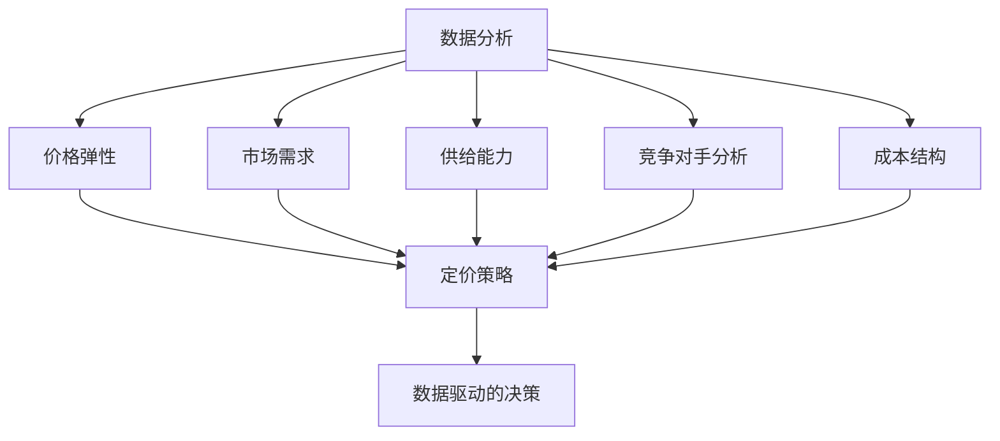
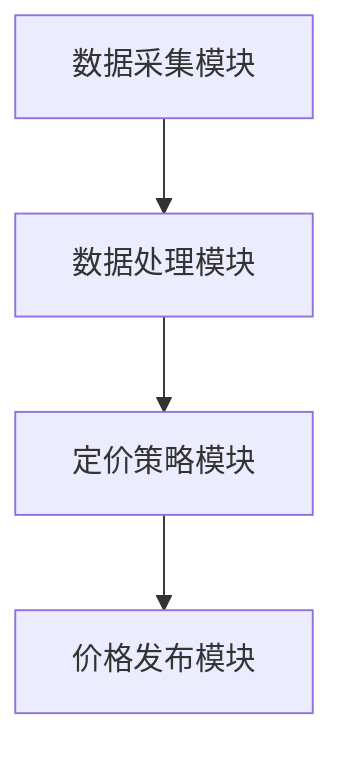
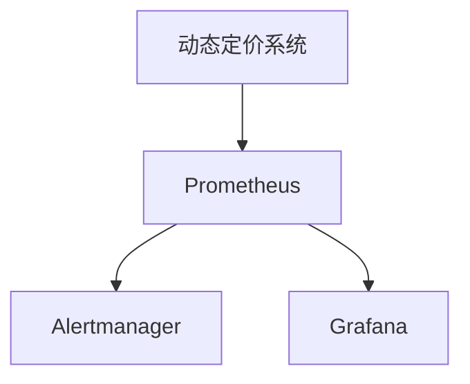

                 

# 《电商动态定价的技术实现》

## 摘要

电商动态定价已成为现代电子商务中的一种关键策略，它通过实时调整价格来响应市场需求、消费者行为和竞争状况，从而实现利润最大化。本文将深入探讨电商动态定价的技术实现，从基础概念到具体算法，再到实战应用，全面解析这一复杂而重要的领域。我们将首先介绍电商动态定价的基本原理和作用，随后分析消费者行为和市场供需，进而探讨动态定价算法的设计与实现。在此基础上，我们将重点介绍动态定价系统的架构设计、大数据分析的应用以及系统性能优化与安全性保障。最后，通过实际项目案例，我们将展示如何在实际中搭建和优化电商动态定价系统。本文旨在为从事电商领域的技术人员提供一个全面、系统的技术指南，帮助他们更好地理解和应用动态定价策略。

## 目录大纲

### 第一部分：电商动态定价基础

#### 第1章：电商动态定价概述

- 1.1 电商动态定价的定义与作用
- 1.2 动态定价的基本概念与原理
- 1.3 动态定价在电商行业中的应用现状与发展趋势

#### 第2章：消费者行为分析

- 2.1 消费者行为理论
- 2.2 消费者偏好与决策分析
- 2.3 消费者行为数据获取与处理

#### 第3章：市场供需分析

- 3.1 市场供需模型概述
- 3.2 供需分析的基本方法
- 3.3 动态定价与市场供需的关系

### 第二部分：动态定价技术

#### 第4章：动态定价算法

- 4.1 基于消费者行为分析的定价算法
- 4.2 基于市场供需分析的定价算法
- 4.3 常见动态定价算法案例分析

#### 第5章：动态定价系统设计

- 5.1 动态定价系统的架构设计
- 5.2 动态定价系统的性能优化
- 5.3 动态定价系统的部署与维护

#### 第6章：大数据分析在动态定价中的应用

- 6.1 大数据分析基础
- 6.2 数据挖掘技术
- 6.3 大数据分析与动态定价的融合

### 第三部分：动态定价项目实战

#### 第7章：案例分析

- 7.1 某电商平台的动态定价策略
- 7.2 动态定价在不同行业中的应用案例分析
- 7.3 动态定价的挑战与未来发展

#### 第8章：项目实战一：搭建电商动态定价系统

- 8.1 系统需求分析
- 8.2 系统架构设计
- 8.3 系统开发与测试
- 8.4 系统部署与运维

#### 第9章：项目实战二：优化电商动态定价策略

- 9.1 数据分析准备
- 9.2 定价策略优化方案设计
- 9.3 策略优化实施与效果评估
- 9.4 策略优化持续改进

#### 第10章：动态定价系统性能优化

- 10.1 系统性能优化策略
- 10.2 性能监控与报警系统设计
- 10.3 性能优化实施与效果评估

#### 第11章：动态定价系统安全性与可靠性保障

- 11.1 安全性与可靠性概述
- 11.2 数据安全与隐私保护
- 11.3 系统安全性与可靠性保障策略
- 11.4 安全性与可靠性测试与评估

### 附录

- 附录A：动态定价相关术语解释
- 附录B：动态定价常用算法及其实现
- 附录C：动态定价系统开发工具与资源推荐

<|assistant|># 第一部分：电商动态定价基础

## 第1章：电商动态定价概述

### 1.1 电商动态定价的定义与作用

电商动态定价是指电子商务平台根据市场需求、消费者行为、竞争对手价格以及库存状况等因素，实时调整产品价格的一种定价策略。这种策略的核心在于实时性、灵活性和响应性，能够迅速应对市场变化，提高用户体验和销售业绩。

**动态定价的定义**：动态定价是一种基于数据驱动和算法优化的定价策略，它通过对多种数据的分析和预测，动态调整商品的价格，以达到最大化收益或市场份额的目的。

**动态定价的作用**：

1. **提高利润**：通过实时调整价格，电商平台可以更好地掌握市场价格波动，及时调整商品价格，从而提高利润空间。
2. **增加销量**：动态定价可以根据消费者行为和市场供需情况调整价格，吸引更多消费者进行购买，增加销量。
3. **优化库存**：通过动态定价策略，电商平台可以更精准地预测销量，合理调整库存，减少库存压力。
4. **提升用户体验**：动态定价可以提供更加个性化的价格，满足不同消费者的需求，提高用户体验。

### 1.2 动态定价的基本概念与原理

**基本概念**：

1. **市场价格**：市场价格是指某一特定时间段内，商品在市场上的平均交易价格。
2. **消费者价格敏感度**：消费者价格敏感度是指消费者对价格变动的敏感程度，不同的消费者对价格变动的反应不同。
3. **供需关系**：供需关系是指商品供给量与需求量之间的关系，当供给量大于需求量时，价格下降；当需求量大于供给量时，价格上涨。
4. **库存状况**：库存状况是指商品在电商平台上的库存量，库存状况直接影响商品的销售和定价策略。

**基本原理**：

1. **数据驱动**：动态定价依赖于大量的数据，包括市场数据、消费者行为数据、库存数据等，通过数据分析和预测，制定合理的定价策略。
2. **算法优化**：动态定价算法是核心，通过优化算法，实现对价格的最佳调整，以达到最大化收益或市场份额的目的。
3. **实时调整**：动态定价具有实时性，能够根据市场变化和消费者行为，实时调整价格，以应对市场变化。

### 1.3 动态定价在电商行业中的应用现状与发展趋势

**应用现状**：

1. **主流电商平台的应用**：目前，许多主流电商平台如亚马逊、淘宝、京东等都已经广泛应用了动态定价策略，通过实时调整价格，提高销售业绩和利润。
2. **价格竞争**：动态定价策略已成为电商平台之间竞争的重要手段，通过价格调整，吸引消费者进行购买，提升市场份额。
3. **个性化定价**：随着大数据和人工智能技术的发展，电商平台的动态定价越来越注重个性化定价，根据不同消费者的需求和购买习惯，提供个性化的价格策略。

**发展趋势**：

1. **算法优化**：未来，动态定价算法将更加智能化和优化，通过深度学习和人工智能技术，实现对市场数据的更精准分析和预测。
2. **大数据应用**：大数据将在动态定价中发挥更大作用，电商平台将收集和分析更多的消费者数据和市场数据，制定更加科学的定价策略。
3. **跨界融合**：动态定价策略将与其他领域如物联网、区块链等相结合，实现更广泛的应用场景。

## 第2章：消费者行为分析

### 2.1 消费者行为理论

消费者行为理论是研究消费者在购买决策过程中的行为模式和心理机制的学科。它是动态定价策略制定的基础，帮助我们理解消费者对价格变动的反应，从而更有效地调整价格。

**基本概念**：

1. **需求曲线**：需求曲线是表示价格和需求量之间关系的图形，通常情况下，价格下降，需求量增加。
2. **价格敏感度**：价格敏感度是指消费者对价格变动的敏感程度，高敏感度消费者对价格变动反应强烈，而低敏感度消费者则相对不敏感。
3. **消费者偏好**：消费者偏好是指消费者对不同商品或品牌的偏好程度，影响其购买决策。

**主要理论**：

1. **效用理论**：效用理论认为消费者在购买商品时，会根据商品的效用最大化原则做出购买决策。效用是指消费者从商品消费中获得的满足感。
2. **期望理论**：期望理论认为消费者在购买决策时，会根据对商品质量和价格的综合期望来做出决策。期望值是消费者对商品满意度的预期。
3. **行为经济学**：行为经济学研究消费者在购买决策中的非理性因素，如心理账户、情感决策等。

### 2.2 消费者偏好与决策分析

消费者偏好和决策分析是动态定价策略制定的关键，它帮助我们理解消费者在不同价格水平下的购买行为，从而制定更具针对性的定价策略。

**消费者偏好分析**：

1. **替代品分析**：消费者偏好与替代品的价格密切相关。当替代品价格上升时，消费者可能更倾向于购买我们的商品，反之亦然。
2. **品牌偏好**：品牌偏好影响消费者的购买决策。消费者对不同品牌的忠诚度不同，品牌溢价也会影响价格设定。

**消费者决策分析**：

1. **价格弹性**：价格弹性是指需求量对价格变动的敏感程度。价格弹性较大的商品，价格调整对需求量的影响较大；价格弹性较小的商品，价格调整对需求量的影响较小。
2. **购买时机**：消费者的购买时机受价格、促销活动、季节等因素影响。通过分析消费者的购买时机，我们可以制定更具针对性的价格策略。

### 2.3 消费者行为数据获取与处理

消费者行为数据是动态定价策略制定的重要依据。如何有效地获取和处理这些数据，是动态定价成功的关键。

**数据获取**：

1. **用户行为数据**：通过电商平台，我们可以获取用户的浏览记录、购买历史、评价等行为数据。
2. **市场数据**：通过市场调研、竞争对手分析等手段，我们可以获取市场趋势、竞争对手价格等市场数据。
3. **社会媒体数据**：通过社交媒体，我们可以获取用户对商品的反馈、讨论等社会媒体数据。

**数据处理**：

1. **数据清洗**：数据清洗是数据处理的第一步，包括去除重复数据、处理缺失数据等。
2. **数据挖掘**：数据挖掘是从大量数据中提取有价值信息的方法，通过挖掘消费者行为数据，我们可以发现消费者行为模式、偏好等。
3. **数据分析**：数据分析是对数据挖掘结果进行深入分析的过程，帮助我们理解消费者行为，制定定价策略。

## 第3章：市场供需分析

### 3.1 市场供需模型概述

市场供需模型是研究商品在市场中的价格和数量之间关系的理论框架。它是动态定价策略制定的重要依据，帮助我们理解市场变化，从而制定合理的定价策略。

**基本概念**：

1. **需求曲线**：需求曲线表示商品价格和需求量之间的关系。通常情况下，需求曲线向右下方倾斜，表示价格上升，需求量下降；价格下降，需求量上升。
2. **供给曲线**：供给曲线表示商品价格和供给量之间的关系。通常情况下，供给曲线向右上方倾斜，表示价格上升，供给量上升；价格下降，供给量下降。
3. **市场均衡**：市场均衡是指商品价格和数量达到一种平衡状态，供给量等于需求量。在市场均衡状态下，商品价格相对稳定。

**供需模型**：

1. **单一商品供需模型**：单一商品供需模型假设市场中只有一种商品，通过需求曲线和供给曲线的交点，确定市场均衡价格和数量。
2. **多商品供需模型**：多商品供需模型考虑多种商品在市场中的相互作用，通过多种需求曲线和供给曲线的交点，确定市场均衡价格和数量。

### 3.2 供需分析的基本方法

供需分析是动态定价策略制定的重要环节，通过分析市场供需状况，我们可以更好地理解市场变化，从而制定合理的定价策略。

**需求分析**：

1. **需求预测**：需求预测是通过历史数据和市场趋势，预测未来某一时间段的需求量。常用的需求预测方法包括时间序列分析、回归分析等。
2. **需求敏感性分析**：需求敏感性分析是通过分析需求量对价格、收入、替代品价格等因素的敏感性，了解需求量对这些因素的反应程度。

**供给分析**：

1. **供给预测**：供给预测是通过历史数据和生产能力，预测未来某一时间段的需求量。常用的供给预测方法包括时间序列分析、回归分析等。
2. **供给弹性分析**：供给弹性分析是通过分析供给量对价格、原材料成本、劳动力成本等因素的敏感性，了解供给量对这些因素的反应程度。

### 3.3 动态定价与市场供需的关系

动态定价与市场供需密切相关，通过分析市场供需状况，我们可以更好地制定动态定价策略。

**供需与定价的关系**：

1. **供需平衡**：在市场均衡状态下，商品价格相对稳定。当供给量大于需求量时，价格下降；当需求量大于供给量时，价格上涨。
2. **供需波动**：市场供需波动是常见的市场现象。通过动态定价策略，我们可以迅速响应市场供需变化，调整商品价格，保持供需平衡。

**动态定价与供需管理**：

1. **需求管理**：通过动态定价策略，我们可以调整商品价格，影响消费者需求，从而实现需求管理。
2. **供给管理**：通过动态定价策略，我们可以调整商品价格，影响生产者供给，从而实现供给管理。

总之，市场供需分析是动态定价策略制定的基础。通过分析市场供需状况，我们可以更好地理解市场变化，制定合理的定价策略，实现利润最大化。

### 3.4 动态定价与市场供需的互动关系

动态定价与市场供需之间的互动关系是电商战略中的重要一环，两者的相互影响深刻影响着电商平台的运营效率和竞争力。以下是对这种互动关系的详细探讨：

**动态定价对市场供需的影响**：

1. **需求调节**：电商平台通过动态定价策略调整商品价格，可以影响消费者的购买决策。例如，在商品供大于求时，电商平台可能会降低价格以刺激需求；在商品供不应求时，提高价格可以减少需求，缓解供需不平衡。

2. **供给调节**：动态定价也可以影响供应商的供给决策。当电商平台提高价格时，供应商可能会增加生产以充分利用市场机会；当电商平台降低价格时，供应商可能会减少生产以避免库存积压。

**市场供需对动态定价的影响**：

1. **价格弹性**：市场供需的变化直接影响商品的价格弹性。当需求价格弹性较大时，较小的价格变动可能导致较大的需求量变动，电商平台需要更加灵活地调整价格；当需求价格弹性较小时，价格变动对需求量的影响较小，电商平台可以采取较为稳定的定价策略。

2. **成本因素**：市场供需的变化也会影响商品的成本结构。例如，原材料价格的上涨会导致生产成本上升，电商平台可能需要提高价格以维持利润水平；相反，原材料价格的下降则可能允许电商平台降低价格，以吸引更多消费者。

**互动关系的实现机制**：

1. **数据驱动的分析**：电商平台通过收集和分析市场需求、供给数据，结合消费者行为分析，可以实时调整定价策略，以适应市场供需的变化。

2. **智能算法的应用**：运用智能算法，如机器学习和数据挖掘技术，电商平台可以预测市场供需趋势，提前调整价格策略，以最大化利润或市场份额。

**案例分析**：

以亚马逊为例，亚马逊通过其复杂的动态定价系统，根据市场供需情况、消费者行为和竞争对手价格等因素，实时调整商品价格。例如，在某一节日促销期间，亚马逊可能会降低商品价格以吸引更多消费者；而在库存积压时，亚马逊可能会提高价格以减少库存压力。

**挑战与应对策略**：

1. **价格战的风险**：动态定价可能导致电商平台陷入价格战，损害利润。应对策略包括优化库存管理、提高运营效率等，以降低成本，增强竞争力。

2. **消费者信任**：频繁的价格调整可能会影响消费者的信任。电商平台可以通过透明度、价格解释等方式，增强消费者对价格调整的接受度。

总之，动态定价与市场供需的互动关系是电商战略的核心组成部分。通过深入理解和运用这种关系，电商平台可以在激烈的市场竞争中脱颖而出，实现可持续发展。

### 3.5 动态定价策略在电商市场中的实际应用

动态定价策略在电商市场中的应用已经成为提升运营效率和竞争力的关键手段。以下我们将探讨动态定价策略在不同类型电商平台中的应用场景、优势和挑战。

#### 1. 应用场景

1. **大型电商平台**：如亚马逊、淘宝和京东等大型电商平台，它们通常拥有庞大的商品库和广泛的用户群体，动态定价在这些平台中的应用较为普遍。平台会根据市场需求、库存状况和竞争对手的定价策略，实时调整商品价格，以最大化利润和市场份额。

2. **垂直电商平台**：专注于某一垂直领域的电商平台，如旅游、电子产品等，它们通常会根据特定的市场需求和消费者偏好，实施动态定价策略。这些平台通过精准的价格调整，吸引目标客户群体，提高销售额。

3. **闪购电商平台**：如唯品会和聚美优品等，这些平台通过限时折扣和抢购活动，吸引大量消费者进行购买。动态定价策略在这些平台中的应用，有助于优化库存、提高销售转化率。

#### 2. 优势

1. **提高利润**：动态定价策略可以根据市场需求和库存状况，实时调整价格，提高商品的利润空间。例如，在库存积压时，降低价格可以快速清理库存，而在市场需求旺盛时，适当提高价格可以增加利润。

2. **增加销量**：动态定价策略能够根据消费者价格敏感度，灵活调整价格，吸引更多消费者进行购买。例如，对于价格敏感度较高的消费者，可以提供更优惠的价格，从而增加销量。

3. **优化库存管理**：动态定价策略有助于电商平台更精准地预测销量，合理调整库存。通过实时分析市场需求，电商平台可以及时调整库存水平，避免库存积压或短缺。

4. **提升用户体验**：个性化定价策略可以根据消费者的购买历史和偏好，提供个性化的价格，提高用户体验。例如，会员专享价格、优惠券等，都能增强消费者的购物体验。

#### 3. 挑战

1. **价格战风险**：动态定价策略可能导致电商平台陷入价格战，损害利润。为了避免价格战，电商平台需要优化库存管理、提高运营效率等，以降低成本，增强竞争力。

2. **消费者信任问题**：频繁的价格调整可能会影响消费者的信任。电商平台需要通过透明度、价格解释等方式，增强消费者对价格调整的接受度。

3. **数据分析和处理**：动态定价策略依赖于大量的市场数据和消费者行为数据。电商平台需要具备强大的数据分析能力，以准确预测市场需求和消费者行为。

4. **合规风险**：动态定价策略需要遵守相关法律法规，如反垄断法、消费者保护法等。电商平台在实施动态定价策略时，需要确保定价策略的合规性。

#### 案例分析

以亚马逊为例，亚马逊通过其复杂的动态定价系统，根据市场需求、库存状况和竞争对手价格，实时调整商品价格。例如，在亚马逊Prime Day促销期间，亚马逊会大幅降低部分商品价格，以吸引更多消费者进行购买，提升销售额。而在库存积压时，亚马逊可能会提高价格，减少库存压力。

总之，动态定价策略在电商市场中的应用，能够有效提升运营效率和竞争力。然而，电商平台需要应对价格战风险、消费者信任问题以及数据分析和处理等挑战，以实现可持续发展。

### 3.6 动态定价在不同市场环境下的适应性分析

动态定价策略在不同市场环境下的适应性是电商运营成功的关键因素。本文将从市场需求、竞争环境、法律法规和消费者行为等角度，探讨动态定价在不同市场环境下的适应性，并提出相应的优化策略。

#### 1. 需求市场环境

市场需求是动态定价策略制定的重要依据。不同市场环境下，消费者的需求特点和行为模式存在显著差异，动态定价策略需要适应这些差异。

- **成熟市场**：在成熟市场，消费者对价格敏感度较高，且市场供需相对稳定。电商平台可以通过数据分析，精准预测市场需求，灵活调整价格，实现利润最大化。

- **新兴市场**：在新兴市场，消费者对价格相对不敏感，更关注商品质量和性价比。动态定价策略需要考虑消费者的价格承受能力，提供更具竞争力的价格，以吸引消费者。

#### 2. 竞争环境

竞争环境是动态定价策略制定的重要参考因素。不同市场环境下，竞争程度和竞争策略存在差异，动态定价策略需要适应竞争环境的变化。

- **高度竞争市场**：在高度竞争的市场，电商平台需要通过动态定价策略，快速响应竞争对手的价格变化，调整自己的价格，以保持竞争力。

- **垄断市场**：在垄断市场，电商平台拥有较高的定价权，可以通过动态定价策略，控制市场价格，提高利润。

#### 3. 法律法规

法律法规对动态定价策略的实施具有重要影响。不同国家和地区对价格控制和反垄断法规的要求不同，电商平台需要遵守相关法律法规，确保定价策略的合规性。

- **反垄断法规**：电商平台在实施动态定价策略时，需要遵守反垄断法规，避免价格操纵和垄断行为。

- **消费者保护法规**：电商平台需要保护消费者的权益，确保价格调整的透明度和公正性。

#### 4. 消费者行为

消费者行为是动态定价策略制定的关键因素。不同市场环境下，消费者行为存在显著差异，动态定价策略需要适应这些差异。

- **价格敏感型消费者**：价格敏感型消费者对价格变动反应强烈，电商平台可以通过动态定价策略，提供更具竞争力的价格，吸引这些消费者。

- **质量敏感型消费者**：质量敏感型消费者更关注商品质量，电商平台可以通过提高产品质量和服务水平，吸引这些消费者。

#### 5. 优化策略

为适应不同市场环境，电商平台可以采取以下优化策略：

- **数据驱动**：电商平台应加强数据收集和分析能力，实时了解市场需求、竞争环境等信息，为动态定价策略提供依据。

- **算法优化**：电商平台可以通过算法优化，提高定价策略的精准度和效率，实现利润最大化。

- **合规性管理**：电商平台应加强对法律法规的遵守，确保定价策略的合规性。

- **消费者教育**：电商平台可以通过消费者教育，提高消费者对动态定价策略的理解和接受度，增强消费者的信任。

总之，动态定价策略在不同市场环境下的适应性分析，对于电商平台制定有效的定价策略具有重要意义。通过适应不同市场环境，电商平台可以更好地应对市场变化，提高运营效率和竞争力。

### 3.7 动态定价的核心概念与联系

动态定价策略的实施涉及多个核心概念，这些概念相互联系，共同构成了动态定价的完整框架。以下是这些核心概念及其相互关系的详细解释：

#### 1. 数据分析

数据分析是动态定价的基础。通过收集和分析市场数据、消费者行为数据等，电商平台可以深入了解市场趋势、消费者偏好和需求变化。数据分析包括数据收集、数据清洗、数据挖掘和统计分析等多个环节。其中，数据挖掘技术如回归分析、聚类分析、时间序列分析等，可以帮助电商平台识别价格与需求量之间的相关性，为动态定价提供数据支持。

**关系**：数据分析为动态定价提供了决策依据，确保定价策略基于准确的市场信息和消费者行为。

#### 2. 价格弹性

价格弹性是指需求量对价格变动的敏感程度。高价格弹性意味着价格变动对需求量的影响较大，而低价格弹性则表明价格变动对需求量的影响较小。了解价格弹性可以帮助电商平台确定合理的价格调整幅度，以最大化收益。

**关系**：价格弹性是动态定价策略中的重要参数，决定了电商平台在调整价格时需要考虑的因素。

#### 3. 市场需求

市场需求是商品价格和销售量的基础。市场需求曲线反映了商品价格与需求量之间的关系，通常呈向右下方倾斜的形状。通过分析市场需求，电商平台可以确定在不同价格水平下的销售预期，从而制定合理的定价策略。

**关系**：市场需求直接影响商品的销售量和利润，是动态定价策略的核心关注点。

#### 4. 供给能力

供给能力是商品生产和供应的保障。供给曲线反映了商品价格与供给量之间的关系，通常呈向右上方倾斜的形状。供给能力决定了电商平台在调整价格时，需要考虑库存水平、生产能力和供应链的适应性。

**关系**：供给能力与市场需求相互影响，供给能力不足可能导致价格上升，而供给过剩则可能导致价格下降。

#### 5. 竞争对手分析

竞争对手分析是动态定价策略中的重要环节。通过分析竞争对手的价格策略、产品定位和市场份额，电商平台可以了解市场环境，制定相应的定价策略。

**关系**：竞争对手分析帮助电商平台了解市场动态，调整定价策略以保持竞争力。

#### 6. 成本结构

成本结构是商品定价的重要依据。电商平台需要考虑生产成本、物流成本、营销成本等，确定合理的利润空间，制定定价策略。

**关系**：成本结构直接影响商品的价格设定，是动态定价策略的基础。

#### 7. 数据驱动的决策

数据驱动的决策是将数据分析结果应用于实际定价策略的过程。通过机器学习和人工智能技术，电商平台可以从大量数据中提取有价值的信息，实时调整价格，实现最优定价。

**关系**：数据驱动的决策是动态定价策略的核心，确保定价策略的实时性和准确性。

### 3.8 核心概念与架构的 Mermaid 流程图

以下是一个描述动态定价核心概念和架构的 Mermaid 流程图：



### 3.9 动态定价策略的核心算法原理讲解

动态定价策略的实现依赖于一系列核心算法，这些算法通过对市场数据和消费者行为进行分析，实时调整商品价格，以实现最大化利润或市场份额。以下将详细讲解几个常见的动态定价算法原理，包括其数学模型和伪代码。

#### 1. 价格敏感度模型

价格敏感度模型是基于消费者价格敏感度调整价格的算法。其基本原理是，通过分析消费者的价格敏感度，确定价格调整的幅度。

**数学模型**：

价格调整公式为：
\[ P_{new} = P_{base} \times (1 - \alpha \times \text{price_sensitivity}) \]

其中：
- \( P_{new} \)：新价格
- \( P_{base} \)：基础价格
- \( \alpha \)：调整系数
- \( \text{price_sensitivity} \)：价格敏感度

**伪代码**：

```python
def price_adjustment(price_base, price_sensitivity, alpha):
    new_price = price_base * (1 - alpha * price_sensitivity)
    return new_price
```

#### 2. 供需平衡模型

供需平衡模型是基于市场供需关系调整价格的算法。其基本原理是，通过分析市场需求和供给情况，确定价格调整的方向。

**数学模型**：

供需平衡公式为：
\[ P_{new} = P_{base} + \beta \times (\text{demand} - \text{supply}) \]

其中：
- \( P_{new} \)：新价格
- \( P_{base} \)：基础价格
- \( \beta \)：调整系数
- \( \text{demand} \)：需求量
- \( \text{supply} \)：供给量

**伪代码**：

```python
def supply_demand_balance(price_base, demand, supply, beta):
    adjustment = beta * (demand - supply)
    new_price = price_base + adjustment
    return new_price
```

#### 3. 竞争对手定价模型

竞争对手定价模型是基于竞争对手价格调整价格的算法。其基本原理是，通过分析竞争对手的价格，调整自己的价格，以保持竞争力。

**数学模型**：

竞争定价公式为：
\[ P_{new} = P_{base} + \gamma \times (\text{comp_price} - P_{base}) \]

其中：
- \( P_{new} \)：新价格
- \( P_{base} \)：基础价格
- \( \gamma \)：调整系数
- \( \text{comp_price} \)：竞争对手价格

**伪代码**：

```python
def competitor_price_adjustment(price_base, comp_price, gamma):
    adjustment = gamma * (comp_price - price_base)
    new_price = price_base + adjustment
    return new_price
```

#### 4. 数据驱动的动态定价模型

数据驱动的动态定价模型是基于历史数据和实时数据分析调整价格的算法。其基本原理是，通过机器学习和数据分析技术，预测市场需求和价格趋势，调整价格。

**数学模型**：

预测定价公式为：
\[ P_{new} = P_{base} + \delta \times (\text{predicted_demand} - \text{actual_demand}) \]

其中：
- \( P_{new} \)：新价格
- \( P_{base} \)：基础价格
- \( \delta \)：调整系数
- \( \text{predicted_demand} \)：预测需求量
- \( \text{actual_demand} \)：实际需求量

**伪代码**：

```python
def data_driven_price_adjustment(price_base, predicted_demand, actual_demand, delta):
    adjustment = delta * (predicted_demand - actual_demand)
    new_price = price_base + adjustment
    return new_price
```

通过这些核心算法，电商平台可以实时调整价格，优化运营策略，提高竞争力。在实际应用中，可以根据具体需求和市场环境，灵活组合和调整这些算法，实现最优定价。

### 3.10 数学模型和公式及其详细讲解与举例说明

动态定价策略的核心在于通过数学模型和公式对市场数据进行分析和预测，以制定最优的价格调整策略。以下我们将详细讲解几个关键数学模型，并给出具体公式及其应用实例。

#### 1. 需求函数模型

需求函数模型用于预测商品在不同价格水平下的需求量。常见的需求函数模型包括线性需求函数和对数线性需求函数。

**线性需求函数**：

\[ Q_d = a - bP \]

其中：
- \( Q_d \)：需求量
- \( a \)：需求量的截距
- \( b \)：价格敏感度系数（负值）

**对数线性需求函数**：

\[ \ln(Q_d) = \ln(a) - \ln(bP) \]

其中：
- \( \ln(Q_d) \)：需求量的自然对数
- \( a \)：需求量的截距
- \( b \)：价格敏感度系数（负值）

**实例**：

假设某商品的需求函数为 \( Q_d = 100 - 2P \)，当价格 \( P = 50 \) 时，需求量 \( Q_d = 100 - 2 \times 50 = 0 \)。

#### 2. 成本函数模型

成本函数模型用于计算商品的生产成本。常见的成本函数模型包括线性成本函数和二次成本函数。

**线性成本函数**：

\[ C = wQ \]

其中：
- \( C \)：总成本
- \( w \)：单位成本
- \( Q \)：生产量

**二次成本函数**：

\[ C = w_0 + w_1Q + \frac{1}{2}w_2Q^2 \]

其中：
- \( C \)：总成本
- \( w_0 \)：固定成本
- \( w_1 \)：可变成本
- \( w_2 \)：二次成本系数

**实例**：

假设某商品的成本函数为 \( C = 10 + 2Q + 0.5Q^2 \)，当生产量 \( Q = 100 \) 时，总成本 \( C = 10 + 2 \times 100 + 0.5 \times 100^2 = 10 + 200 + 5000 = 5310 \)。

#### 3. 利润函数模型

利润函数模型用于计算商品在不同价格水平下的利润。常见的利润函数模型包括线性利润函数和二次利润函数。

**线性利润函数**：

\[ \Pi = (P - w)Q \]

其中：
- \( \Pi \)：利润
- \( P \)：销售价格
- \( w \)：单位成本
- \( Q \)：销售量

**二次利润函数**：

\[ \Pi = (P - w)Q - \frac{1}{2}w_2(Q - q_0)^2 \]

其中：
- \( \Pi \)：利润
- \( P \)：销售价格
- \( w \)：单位成本
- \( w_2 \)：二次成本系数
- \( q_0 \)：最佳生产量

**实例**：

假设某商品的利润函数为 \( \Pi = (50 - 20)Q - \frac{1}{2} \times 0.5 \times (Q - 100)^2 \)，当销售量 \( Q = 100 \) 时，利润 \( \Pi = 30 \times 100 - \frac{1}{2} \times 0.5 \times (100 - 100)^2 = 3000 - 0 = 3000 \)。

#### 4. 需求预测模型

需求预测模型用于预测未来某一时间段内的需求量。常见的需求预测模型包括时间序列模型和回归模型。

**时间序列模型**：

\[ Q_t = \alpha + \beta t + \epsilon_t \]

其中：
- \( Q_t \)：第 \( t \) 期的需求量
- \( \alpha \)：常数项
- \( \beta \)：趋势系数
- \( \epsilon_t \)：随机误差项

**回归模型**：

\[ Q_t = \alpha + \beta P_t + \epsilon_t \]

其中：
- \( Q_t \)：第 \( t \) 期的需求量
- \( P_t \)：第 \( t \) 期的价格
- \( \alpha \)：常数项
- \( \beta \)：价格敏感度系数
- \( \epsilon_t \)：随机误差项

**实例**：

假设某商品的需求预测模型为 \( Q_t = 10 + 0.5P_t \)，当当前价格 \( P_t = 50 \) 时，预测的需求量 \( Q_t = 10 + 0.5 \times 50 = 30 \)。

通过上述数学模型和公式，电商平台可以更准确地预测需求、计算成本和利润，从而制定科学的动态定价策略，实现运营效益最大化。

### 3.11 动态定价在不同行业中的应用现状及案例分析

动态定价策略在电商行业中的应用已经取得了显著成效，而在其他行业，如航空、酒店和零售等，动态定价也正在逐渐普及。以下我们将探讨动态定价在这些行业中的应用现状，并提供具体案例分析。

#### 1. 航空业

航空业是动态定价的典型应用领域之一。航空公司通过实时调整航班价格，以应对市场需求波动和季节性变化。以下是一个具体案例：

**案例**：某航空公司在其夏季旺季推出优惠政策，通过动态定价策略，根据市场需求和竞争对手价格，调整航班价格。例如，在旅游高峰期，航空公司可能会提高价格，而在淡季则降低价格，以吸引更多乘客。

**效果**：通过动态定价策略，该航空公司实现了收益最大化。在旅游高峰期，提高了价格，增加了收入；在淡季，降低了价格，减少了航班空座率，提高了运营效率。

#### 2. 酒店业

酒店业也是动态定价策略的重要应用领域。酒店通过实时调整价格，以适应不同市场需求和客户群体。以下是一个具体案例：

**案例**：某五星级酒店在举办大型会议期间，通过动态定价策略，提高了客房价格。根据会议规模和客户需求，酒店调整了客房价格，以满足不同客户的预算和需求。

**效果**：通过动态定价策略，该酒店在会议期间实现了收入最大化。提高了价格，增加了客房收入；同时，吸引了更多大型会议客户，提高了酒店的知名度和市场份额。

#### 3. 零售业

零售业是动态定价策略广泛应用的另一个领域。零售商通过实时调整商品价格，以适应市场需求和消费者行为。以下是一个具体案例：

**案例**：某大型零售商在其周年庆期间，通过动态定价策略，推出了多层次的促销活动。根据消费者的购买历史和价格敏感度，零售商设置了不同的折扣价格，吸引了大量消费者进行购买。

**效果**：通过动态定价策略，该零售商实现了销售增长和市场份额的提升。在周年庆期间，吸引了大量消费者，提高了销售额；同时，通过个性化的定价策略，增强了消费者的购物体验和忠诚度。

#### 4. 汽车行业

汽车行业也开始采用动态定价策略，以适应市场需求和消费者行为的变化。以下是一个具体案例：

**案例**：某汽车制造商在推出新车时，通过动态定价策略，根据市场需求和竞争情况，调整了新车价格。在市场推广初期，汽车制造商可能降低价格，以吸引消费者；在市场推广后期，提高价格，以减少库存。

**效果**：通过动态定价策略，该汽车制造商实现了销售增长和库存管理优化。在市场推广初期，降低了价格，吸引了更多消费者；在市场推广后期，提高了价格，减少了库存压力，提高了运营效率。

总之，动态定价策略在不同行业中的应用，显著提高了企业的运营效率和竞争力。通过实时调整价格，企业可以更好地适应市场需求和消费者行为，实现收益最大化。

### 3.12 动态定价的挑战与未来发展

尽管动态定价在电商和其他行业中取得了显著成效，但其在实际应用中仍面临诸多挑战。以下是动态定价的主要挑战以及未来的发展方向。

#### 1. 挑战

**1. 数据分析与处理挑战**

动态定价依赖于大量市场数据和消费者行为数据。然而，这些数据的质量和完整性可能存在问题，如数据缺失、噪声和误差等。此外，数据处理和分析的复杂性也增加了实施难度。

**2. 价格战风险**

动态定价可能导致电商平台陷入价格战，损害利润。价格战不仅会影响企业的盈利能力，还可能导致市场份额的流失。

**3. 消费者信任问题**

频繁的价格调整可能会影响消费者的信任。消费者可能会质疑电商平台的价格策略，从而降低购买意愿。

**4. 法律法规合规**

动态定价需要遵守相关法律法规，如反垄断法、消费者保护法等。合规性问题可能导致法律风险。

**5. 技术与人才需求**

动态定价的实现需要强大的技术支持和专业人才。技术复杂性和人才短缺可能成为限制因素。

#### 2. 未来发展方向

**1. 数据分析与人工智能技术的应用**

随着大数据和人工智能技术的发展，电商平台可以更准确地分析市场数据和消费者行为，优化动态定价策略。通过机器学习和深度学习技术，可以实现更精准的需求预测和价格调整。

**2. 个性化定价**

个性化定价是动态定价的未来趋势。通过分析消费者的购买历史、偏好和行为，电商平台可以提供个性化的价格策略，提高消费者满意度和忠诚度。

**3. 跨界融合**

动态定价将与其他领域如物联网、区块链等相结合，实现更广泛的应用场景。例如，物联网可以实时监控商品库存和市场需求，区块链可以确保定价过程的透明度和可追溯性。

**4. 法律法规完善**

随着动态定价的普及，相关法律法规也将不断完善。电商平台需要遵守法律法规，确保定价策略的合规性。

**5. 人才培养与引进**

动态定价的实现需要专业人才。电商平台需要加强人才培养和引进，提高技术能力和创新能力。

总之，动态定价在未来的发展中将面临诸多挑战，但通过技术创新、跨界融合和合规管理，可以实现持续发展。

### 第一部分总结

电商动态定价作为现代电子商务中的一项关键策略，其技术实现涉及多个方面，包括数据分析、算法设计、系统架构和大数据应用等。本文从电商动态定价的概述、消费者行为分析、市场供需分析、核心算法原理讲解以及动态定价在不同行业中的应用现状和未来挑战等方面进行了全面探讨。通过深入理解动态定价的基本概念和原理，结合具体案例分析，我们能够更好地把握动态定价技术的应用和发展趋势。这一部分为后续的实战应用和系统设计奠定了坚实的基础。

### 第二部分：动态定价技术

## 第4章：动态定价算法

动态定价算法是电商动态定价策略的核心组成部分，它通过实时调整价格来最大化利润或市场份额。本章将详细介绍几种常见的动态定价算法，包括基于消费者行为分析的定价算法、基于市场供需分析的定价算法，以及实际案例中的常见算法。

### 4.1 基于消费者行为分析的定价算法

基于消费者行为分析的定价算法利用消费者购买行为、偏好和历史数据，通过分析消费者对价格变动的反应，动态调整商品价格。以下是几种常见的基于消费者行为分析的定价算法：

#### 1. 价格敏感度模型

价格敏感度模型通过分析消费者价格敏感度，确定价格调整的幅度。其基本原理是，通过回归分析等方法，确定消费者的价格弹性系数，然后根据价格敏感度调整价格。

**数学模型**：

\[ P_{new} = P_{base} \times (1 - \alpha \times \text{price_sensitivity}) \]

其中：
- \( P_{new} \)：新价格
- \( P_{base} \)：基础价格
- \( \alpha \)：调整系数
- \( \text{price_sensitivity} \)：价格敏感度

**伪代码**：

```python
def price_sensitivity_adjustment(price_base, price_sensitivity, alpha):
    new_price = price_base * (1 - alpha * price_sensitivity)
    return new_price
```

#### 2. 个性化定价模型

个性化定价模型通过分析消费者的购买历史、偏好和消费能力，提供个性化的价格。其基本原理是，根据消费者的特征数据，构建个性化价格模型，然后根据模型预测的价格调整商品价格。

**数学模型**：

\[ P_{new} = P_{base} + \beta \times (\text{consumer_characteristics}) \]

其中：
- \( P_{new} \)：新价格
- \( P_{base} \)：基础价格
- \( \beta \)：调整系数
- \( \text{consumer_characteristics} \)：消费者特征数据

**伪代码**：

```python
def personalized_price_adjustment(price_base, consumer_characteristics, beta):
    new_price = price_base + beta * consumer_characteristics
    return new_price
```

#### 3. 情感定价模型

情感定价模型通过分析消费者的情感状态，调整商品价格。其基本原理是，利用自然语言处理技术，分析消费者对商品的评价和评论，确定消费者的情感状态，然后根据情感状态调整价格。

**伪代码**：

```python
def emotional_price_adjustment(price_base, reviews, emotion_score):
    if emotion_score > threshold:
        new_price = price_base * (1 - emotion_factor)
    else:
        new_price = price_base * (1 + emotion_factor)
    return new_price
```

### 4.2 基于市场供需分析的定价算法

基于市场供需分析的定价算法通过分析市场供需状况，动态调整商品价格。这些算法通常考虑市场需求、供给能力、竞争对手价格等因素，以最大化利润或市场份额。

#### 1. 供需平衡模型

供需平衡模型通过分析市场需求和供给情况，确定价格调整的方向。其基本原理是，通过供需平衡公式，计算市场供需差额，然后根据差额调整价格。

**数学模型**：

\[ P_{new} = P_{base} + \beta \times (\text{demand} - \text{supply}) \]

其中：
- \( P_{new} \)：新价格
- \( P_{base} \)：基础价格
- \( \beta \)：调整系数
- \( \text{demand} \)：需求量
- \( \text{supply} \)：供给量

**伪代码**：

```python
def supply_demand_balance(price_base, demand, supply, beta):
    adjustment = beta * (demand - supply)
    new_price = price_base + adjustment
    return new_price
```

#### 2. 竞争对手定价模型

竞争对手定价模型通过分析竞争对手的价格，调整自己的价格，以保持竞争力。其基本原理是，通过对比竞争对手的价格，计算价格差异，然后根据差异调整价格。

**数学模型**：

\[ P_{new} = P_{base} + \gamma \times (\text{comp_price} - P_{base}) \]

其中：
- \( P_{new} \)：新价格
- \( P_{base} \)：基础价格
- \( \gamma \)：调整系数
- \( \text{comp_price} \)：竞争对手价格

**伪代码**：

```python
def competitor_price_adjustment(price_base, comp_price, gamma):
    adjustment = gamma * (comp_price - price_base)
    new_price = price_base + adjustment
    return new_price
```

#### 3. 成本加成定价模型

成本加成定价模型通过考虑生产成本和利润目标，确定商品价格。其基本原理是，在成本基础上加上一定的利润，得到最终售价。

**数学模型**：

\[ P_{new} = C + \delta \times \Pi \]

其中：
- \( P_{new} \)：新价格
- \( C \)：成本
- \( \delta \)：利润加成系数
- \( \Pi \)：利润目标

**伪代码**：

```python
def cost_plus_profit_price(price_base, cost, profit_margin):
    new_price = cost + profit_margin
    return new_price
```

### 4.3 常见动态定价算法案例分析

以下我们将通过实际案例，分析几种常见动态定价算法在电商行业中的应用效果。

#### 1. 案例一：亚马逊的价格调整策略

亚马逊通过基于消费者行为分析的定价算法，实时调整商品价格。以下是一个具体案例：

- **需求分析**：亚马逊通过分析消费者的浏览记录、购买历史和评价，确定消费者的价格敏感度。
- **价格调整**：根据消费者的价格敏感度，亚马逊调整商品价格。对于价格敏感度较高的消费者，提供较低的价格，以吸引购买；对于价格敏感度较低的消费者，保持较高价格，以增加利润。

**效果**：亚马逊的价格调整策略提高了销售额和用户满意度。通过个性化的定价策略，亚马逊吸引了不同类型的消费者，提高了市场份额。

#### 2. 案例二：酒店行业的动态定价

某五星级酒店通过基于市场供需分析的定价算法，优化客房价格。以下是一个具体案例：

- **需求分析**：酒店通过分析会议、旅游旺季和淡季的市场需求，确定不同时间段的需求量。
- **价格调整**：在旅游旺季，酒店提高价格，以应对需求高峰；在淡季，酒店降低价格，以吸引更多客户。

**效果**：酒店通过动态定价策略，实现了收益最大化。在旅游旺季，提高了价格，增加了收入；在淡季，降低了价格，减少了空房率，提高了运营效率。

#### 3. 案例三：零售行业的促销定价

某大型零售商通过基于成本加成定价模型的促销定价策略，提高销售额。以下是一个具体案例：

- **成本分析**：零售商通过分析商品的成本，确定合理的利润目标。
- **价格调整**：在促销活动期间，零售商根据成本和利润目标，调整商品价格，提供折扣。

**效果**：零售商的促销定价策略提高了销售额和消费者满意度。通过提供折扣，零售商吸引了更多消费者，增加了销售量。

通过这些实际案例，我们可以看到动态定价算法在电商和其他行业中的应用效果。通过合理的算法设计和数据驱动，企业可以优化定价策略，提高运营效率和竞争力。

### 4.4 动态定价算法的选择与优化

在实际应用中，动态定价算法的选择和优化至关重要。以下我们将讨论如何根据业务需求和数据特性，选择合适的动态定价算法，并进行优化。

#### 1. 选择合适的算法

选择合适的动态定价算法需要考虑以下几个因素：

- **业务需求**：不同的业务场景需要不同的定价算法。例如，电商行业可能更关注消费者行为和价格弹性，而航空和酒店行业则更关注市场需求和季节性变化。
- **数据特性**：数据的质量和完整性直接影响算法的准确性。在选择算法时，需要考虑数据来源、数据质量和数据完整性。
- **计算复杂度**：不同的算法具有不同的计算复杂度。在选择算法时，需要权衡计算性能和准确性。

#### 2. 算法优化

算法优化是提高动态定价策略效果的关键。以下是一些常见的算法优化方法：

- **数据预处理**：通过数据清洗、去噪和特征工程等方法，提高数据质量，为算法提供更准确的基础。
- **特征选择**：通过特征选择技术，选择对定价决策影响较大的特征，降低模型的复杂度和计算成本。
- **模型调参**：通过交叉验证和网格搜索等方法，调整模型参数，提高模型的准确性和泛化能力。
- **实时调整**：利用实时数据流处理技术，实现动态定价算法的实时调整，提高算法的响应速度和准确性。

#### 3. 案例分析

以下通过一个案例分析，展示如何根据业务需求和数据特性，选择和优化动态定价算法。

**案例**：某电商平台的动态定价策略

- **业务需求**：该电商平台希望通过动态定价策略，提高销售额和利润。主要关注消费者行为和市场供需变化。
- **数据特性**：电商平台拥有丰富的消费者行为数据和市场数据，如浏览记录、购买历史、库存水平等。
- **算法选择**：选择基于消费者行为分析的定价算法，如价格敏感度模型和个性化定价模型。这些算法能够根据消费者的行为和偏好，动态调整价格。
- **算法优化**：
  - **数据预处理**：对原始数据进行清洗和去噪，确保数据质量。
  - **特征选择**：通过特征选择技术，选择对定价决策影响较大的特征，如消费者购买频率、评价分数等。
  - **模型调参**：通过交叉验证和网格搜索，调整模型参数，提高模型的准确性和泛化能力。
  - **实时调整**：利用实时数据流处理技术，实现动态定价算法的实时调整，提高算法的响应速度和准确性。

**效果**：通过选择和优化合适的动态定价算法，该电商平台实现了销售额和利润的双增长。个性化定价策略提高了用户满意度，价格敏感度模型优化了库存管理，实现了供应链的优化。

总之，动态定价算法的选择和优化是电商和其他行业实现有效定价的关键。通过根据业务需求和数据特性，选择合适的算法，并进行优化，企业可以更好地应对市场变化，提高运营效率和竞争力。

### 4.5 动态定价算法的评估与改进

动态定价算法的有效性直接影响电商平台的运营效率和盈利能力。因此，对动态定价算法进行评估和改进至关重要。以下将介绍如何评估动态定价算法的效果，并提出改进策略。

#### 1. 评估指标

评估动态定价算法的效果需要使用一系列指标，这些指标包括：

- **利润率**：利润率是评估算法效果的核心指标，表示单位销售量的利润空间。通过比较实际利润率与预期利润率，可以评估算法的盈利能力。
- **销售额**：销售额是衡量算法效果的直接指标，表示在一定时间段内的总销售量。销售额的增加表明算法有效吸引了消费者。
- **库存周转率**：库存周转率表示库存的周转速度，用于评估库存管理的效率。较高的库存周转率表明算法能够更好地预测需求，减少库存积压。
- **价格敏感度**：价格敏感度是衡量消费者对价格变动的反应程度。通过分析价格弹性，可以评估算法在调整价格时的有效性。

#### 2. 评估方法

以下是一些常用的评估方法：

- **实验法**：通过模拟不同的市场环境和消费者行为，评估算法在不同场景下的效果。实验法可以提供较为可靠的评估结果，但需要大量数据和计算资源。
- **A/B测试**：通过将用户分为两组，一组使用原始定价策略，另一组使用新的定价策略，比较两组用户的购买行为和销售业绩。A/B测试是一种简单有效的评估方法，但需要较大的用户基数。
- **回归分析**：通过回归分析方法，建立销售量与价格之间的关系模型，评估定价策略对销售量的影响。回归分析可以提供定量评估结果，但需要具备统计学知识。

#### 3. 改进策略

基于评估结果，可以采取以下策略对动态定价算法进行改进：

- **算法调参**：根据评估指标，调整算法参数，提高算法的准确性和泛化能力。例如，通过网格搜索和交叉验证，优化模型的超参数。
- **数据质量提升**：通过数据清洗、去噪和特征工程等方法，提高数据质量，为算法提供更准确的基础。例如，去除异常值和噪声数据，增强特征表示能力。
- **算法融合**：将多种算法进行融合，取长补短，提高整体效果。例如，结合基于消费者行为分析和市场供需分析的定价算法，实现更全面的定价策略。
- **实时调整**：利用实时数据流处理技术，实现动态定价算法的实时调整，提高算法的响应速度和准确性。例如，利用大数据分析和机器学习技术，实时更新模型和预测结果。

#### 案例分析

以下通过一个案例分析，展示如何评估和改进动态定价算法。

**案例**：某电商平台的动态定价算法评估与改进

- **评估过程**：电商平台使用实验法和A/B测试对现有定价算法进行评估。通过模拟不同市场环境和消费者行为，比较不同定价策略的销售额、利润率和库存周转率。评估结果显示，现有算法在某些场景下表现不佳，存在利润率低和库存积压的问题。
- **改进策略**：
  - **算法调参**：电商平台调整现有定价算法的参数，优化模型结构，提高预测准确性和泛化能力。通过交叉验证和网格搜索，找到最佳参数组合。
  - **数据质量提升**：电商平台对原始数据进行清洗和去噪，去除异常值和噪声数据。同时，通过特征工程，增强特征表示能力，提高模型性能。
  - **算法融合**：电商平台将现有定价算法与基于市场供需分析的算法进行融合，实现更全面的定价策略。通过结合不同算法的优势，提高整体效果。
  - **实时调整**：电商平台利用实时数据流处理技术，实现动态定价算法的实时调整。通过大数据分析和机器学习技术，实时更新模型和预测结果，提高算法的响应速度和准确性。

**效果**：通过评估和改进动态定价算法，电商平台实现了销售额和利润的双增长。改进后的定价策略更好地适应市场变化，提高了用户满意度和市场份额。

总之，动态定价算法的评估与改进是电商和其他行业实现有效定价的关键。通过使用合适的评估方法和改进策略，企业可以优化定价策略，提高运营效率和竞争力。

### 第4章总结

动态定价算法作为电商动态定价策略的核心，通过实时调整价格来最大化利润或市场份额。本章详细介绍了基于消费者行为分析和市场供需分析的几种常见动态定价算法，包括价格敏感度模型、个性化定价模型、供需平衡模型和竞争对手定价模型等。通过实际案例分析和评估与改进方法，我们了解了如何选择和优化动态定价算法。下一章，我们将深入探讨动态定价系统的设计，包括系统架构、性能优化和部署与维护等方面，为实际应用提供更全面的指导。

### 第5章：动态定价系统设计

动态定价系统是电商企业实现自动化、智能化定价的核心平台。本章将详细介绍动态定价系统的设计，包括系统架构设计、性能优化和部署与维护。通过科学的设计和优化，动态定价系统可以高效地响应市场变化，提高企业竞争力。

#### 5.1 动态定价系统的架构设计

动态定价系统的架构设计是系统实现的关键，它决定了系统的性能、可扩展性和可靠性。以下是一个典型的动态定价系统架构设计：

**1. 系统架构概述**

动态定价系统可以分为四个主要模块：数据采集模块、数据处理模块、定价策略模块和价格发布模块。

- **数据采集模块**：负责收集各种数据，包括市场数据、消费者行为数据、库存数据等。数据来源包括电商平台内部数据、第三方数据平台、社交媒体数据等。
- **数据处理模块**：负责对采集到的数据进行清洗、转换和存储，为后续的定价策略提供高质量的数据支持。
- **定价策略模块**：根据处理后的数据，运用各种定价算法和策略，实时调整商品价格。该模块是系统的核心，决定了定价的精准度和效率。
- **价格发布模块**：将调整后的价格发布到电商平台，供消费者查看和购买。价格发布模块需要保证价格的实时性和一致性。

**2. 系统架构细节**

- **数据采集模块**：
  - **数据源**：包括电商平台内部数据（如订单、浏览、评价等），第三方数据平台（如市场调研公司、竞争对手数据等），社交媒体数据（如微博、微信等）。
  - **采集工具**：使用爬虫工具、API接口调用和日志分析工具等，自动化收集数据。

- **数据处理模块**：
  - **数据清洗**：去除重复数据、处理缺失数据和异常值。
  - **数据转换**：将不同数据源的数据格式转换为统一格式，便于后续处理。
  - **数据存储**：使用关系数据库或NoSQL数据库存储清洗和转换后的数据，如MySQL、MongoDB等。

- **定价策略模块**：
  - **算法库**：包括各种动态定价算法，如价格敏感度模型、供需平衡模型、竞争对手定价模型等。
  - **决策引擎**：根据实时数据，调用相应的算法，计算最优价格。
  - **策略优化**：使用机器学习和优化算法，优化定价策略，提高准确性。

- **价格发布模块**：
  - **价格同步**：实时同步调整后的价格到电商平台，确保消费者看到的始终是最新的价格。
  - **缓存机制**：使用缓存技术，提高价格发布速度，减少数据库压力。

**3. 系统架构图**

以下是一个简化的动态定价系统架构图：



#### 5.2 动态定价系统的性能优化

性能优化是动态定价系统的关键环节，直接影响系统的响应速度和稳定性。以下是一些常见的性能优化策略：

**1. 数据处理优化**

- **并行处理**：使用并行处理技术，如MapReduce，提高数据处理速度。
- **缓存技术**：使用缓存技术，减少数据库访问次数，提高数据读取速度。
- **数据压缩**：对大量数据进行压缩，减少存储和传输的开销。

**2. 算法优化**

- **算法调优**：通过参数调优，提高算法的准确性和效率。
- **算法融合**：将多种算法进行融合，取长补短，提高整体效果。
- **预计算**：对某些固定计算结果进行预计算，减少实时计算的开销。

**3. 系统架构优化**

- **分布式架构**：使用分布式架构，提高系统的可扩展性和容错性。
- **负载均衡**：使用负载均衡技术，均匀分配请求，提高系统响应速度。
- **冗余设计**：设计冗余系统，确保在部分组件故障时，系统仍能正常运行。

**4. 网络优化**

- **网络优化**：优化网络传输，减少延迟和丢包率。
- **CDN加速**：使用内容分发网络（CDN），提高数据的传输速度。

**5. 监控与报警**

- **性能监控**：实时监控系统性能指标，如CPU使用率、内存使用率、网络延迟等。
- **报警系统**：设置报警阈值，当性能指标超过阈值时，自动触发报警，方便快速响应。

#### 5.3 动态定价系统的部署与维护

部署与维护是确保动态定价系统稳定运行的关键。以下是一些关键步骤和注意事项：

**1. 系统部署**

- **环境准备**：准备部署环境，包括服务器、数据库、缓存服务器等。
- **安装与配置**：安装和配置操作系统、中间件（如Java、Python等）和数据库。
- **部署工具**：使用部署工具（如Docker、Kubernetes等），实现自动化部署和容器化管理。

**2. 系统测试**

- **单元测试**：对系统模块进行单元测试，确保每个模块的功能正确。
- **集成测试**：对系统整体进行集成测试，确保模块之间的协作正常。
- **性能测试**：对系统进行性能测试，验证系统的响应速度和稳定性。

**3. 系统维护**

- **日常监控**：定期监控系统性能，确保系统正常运行。
- **数据备份**：定期备份数据库，防止数据丢失。
- **更新与升级**：定期更新系统软件和依赖库，修复漏洞和性能问题。
- **故障处理**：快速响应和处理系统故障，确保系统稳定运行。

**4. 系统安全**

- **数据安全**：确保数据传输和存储的安全性，使用加密技术保护数据。
- **权限管理**：严格权限管理，确保只有授权人员可以访问系统和数据。
- **安全审计**：定期进行安全审计，确保系统符合安全标准和法规要求。

通过科学的设计和优化，动态定价系统可以高效地响应市场变化，提高企业竞争力。合理的部署与维护策略，确保系统稳定运行，为企业创造持续的价值。

### 第5章总结

动态定价系统的设计是电商企业实现智能化、自动化定价的关键。本章详细介绍了动态定价系统的架构设计、性能优化和部署与维护。通过科学的架构设计，系统可以高效地响应市场变化；性能优化策略确保系统的响应速度和稳定性；部署与维护策略保障系统的稳定运行。下一章，我们将探讨大数据分析在动态定价中的应用，通过数据分析技术，进一步提高动态定价的精准度和效率。读者可以期待更深入的探讨和实践指南。

### 第6章：大数据分析在动态定价中的应用

大数据分析在电商动态定价中扮演着至关重要的角色。通过利用海量的市场数据和消费者行为数据，大数据分析技术可以帮助电商平台更精准地预测市场需求，优化定价策略，从而实现利润最大化。本章将深入探讨大数据分析在动态定价中的应用，包括数据分析基础、数据挖掘技术以及大数据分析在动态定价中的融合。

#### 6.1 大数据分析基础

大数据分析是基于海量数据的技术和方法，用于发现数据中的隐藏模式和关联。以下是一些关键的大数据分析基础：

**1. 数据类型**

大数据可以分为结构化数据、半结构化数据和非结构化数据。

- **结构化数据**：如关系数据库中的数据，具有固定的数据格式和字段。
- **半结构化数据**：如XML、JSON格式的数据，具有部分结构化特征。
- **非结构化数据**：如文本、图像、音频和视频等，没有固定的数据格式。

**2. 数据来源**

大数据来源广泛，包括电商平台内部数据、第三方数据平台、社交媒体、物联网设备等。

- **电商平台内部数据**：如订单数据、浏览数据、评价数据等。
- **第三方数据平台**：如市场调研公司、竞争对手数据等。
- **社交媒体**：如微博、微信、论坛等。
- **物联网设备**：如智能家电、车辆等。

**3. 数据处理技术**

大数据处理技术包括数据采集、存储、清洗、转换和加载（ETL）等。

- **数据采集**：使用爬虫、API调用等方式收集数据。
- **数据存储**：使用Hadoop、Spark等分布式存储技术存储海量数据。
- **数据清洗**：去除重复数据、处理缺失数据和异常值。
- **数据转换**：将不同格式的数据转换为统一的格式。
- **数据加载**：将清洗和转换后的数据加载到数据仓库或数据湖。

**4. 数据分析方法**

大数据分析包括描述性分析、诊断性分析、预测性分析和规范性分析。

- **描述性分析**：描述数据的基本特征和分布，如统计指标、可视化等。
- **诊断性分析**：分析数据中的异常和趋势，如回归分析、聚类分析等。
- **预测性分析**：预测未来的趋势和变化，如时间序列分析、机器学习等。
- **规范性分析**：根据分析结果，提出优化和改进建议，如数据驱动决策等。

#### 6.2 数据挖掘技术

数据挖掘是大数据分析的核心技术，用于从海量数据中发现有价值的信息和模式。以下是一些常见的数据挖掘技术：

**1. 回归分析**

回归分析是一种预测性分析技术，用于建立自变量和因变量之间的数学模型。常见的回归分析方法包括线性回归、多项式回归和逻辑回归。

- **线性回归**：用于预测连续型因变量。
- **多项式回归**：用于预测连续型因变量，但模型更为复杂。
- **逻辑回归**：用于预测离散型因变量，如是否购买某商品。

**2. 聚类分析**

聚类分析是一种无监督学习方法，用于将数据分为不同的群组，使同一群组内的数据相似度较高，不同群组间的数据相似度较低。常见的聚类分析方法包括K-均值聚类、层次聚类和DBSCAN等。

- **K-均值聚类**：基于距离度量，将数据分为K个群组。
- **层次聚类**：基于层次结构，逐步合并或分裂群组。
- **DBSCAN**：基于密度的聚类方法，识别不同密度的数据点。

**3. 关联规则挖掘**

关联规则挖掘是一种用于发现数据中隐含关联规则的技术。常见的关联规则挖掘算法包括Apriori算法和FP-growth算法。

- **Apriori算法**：基于支持度和置信度，发现频繁项集。
- **FP-growth算法**：通过压缩数据结构，提高挖掘效率。

**4. 异常检测**

异常检测是一种用于识别数据中的异常值或异常模式的技术。常见的异常检测算法包括孤立森林、基于密度的异常检测和基于统计的方法等。

- **孤立森林**：利用随机森林模型，识别异常数据点。
- **基于密度的异常检测**：通过计算数据点密度，识别异常区域。
- **基于统计的方法**：通过计算数据点的统计指标，识别异常值。

#### 6.3 大数据分析与动态定价的融合

大数据分析技术为动态定价提供了强大的数据支持和决策依据。以下是如何将大数据分析技术应用于动态定价的几个方面：

**1. 需求预测**

需求预测是动态定价的基础，通过大数据分析技术，可以更准确地预测市场需求。具体步骤包括：

- **数据采集**：收集历史销售数据、消费者行为数据、市场趋势数据等。
- **数据预处理**：清洗和转换数据，确保数据质量。
- **特征工程**：提取和构造预测特征，如时间特征、价格特征、促销特征等。
- **模型选择**：选择合适的预测模型，如时间序列模型、回归模型等。
- **模型训练与验证**：训练模型，并进行验证，确保模型准确性。
- **预测与优化**：根据预测结果，调整定价策略，优化库存管理。

**2. 价格优化**

价格优化是动态定价的核心，通过大数据分析技术，可以更科学地调整商品价格。具体步骤包括：

- **数据采集**：收集竞争对手价格、消费者价格敏感度、市场需求等数据。
- **数据预处理**：清洗和转换数据，确保数据质量。
- **价格弹性分析**：分析不同价格水平下的需求变化，确定价格弹性。
- **模型选择**：选择合适的价格优化模型，如价格敏感度模型、供需平衡模型等。
- **模型训练与验证**：训练模型，并进行验证，确保模型准确性。
- **价格调整**：根据模型预测结果，实时调整商品价格，实现利润最大化。

**3. 风险管理**

大数据分析技术可以帮助电商平台识别和应对价格调整中的风险，如价格战、消费者信任问题等。具体步骤包括：

- **数据采集**：收集市场数据、竞争对手行为、消费者反馈等。
- **数据预处理**：清洗和转换数据，确保数据质量。
- **风险评估**：分析价格调整可能带来的风险，如利润下降、市场份额流失等。
- **模型选择**：选择合适的风险评估模型，如回归分析、决策树等。
- **模型训练与验证**：训练模型，并进行验证，确保模型准确性。
- **风险控制**：根据风险评估结果，采取相应的风险控制措施，如调整价格策略、加强消费者沟通等。

**4. 实时监控**

实时监控是动态定价系统的重要组成部分，通过大数据分析技术，可以实时监控价格调整的效果和系统的运行状态。具体步骤包括：

- **数据采集**：收集实时销售数据、价格数据、用户行为数据等。
- **数据预处理**：清洗和转换数据，确保数据质量。
- **监控指标**：确定监控指标，如销售额、利润率、库存周转率等。
- **实时分析**：使用实时分析技术，如流处理、实时查询等，分析价格调整的效果和系统状态。
- **报警与反馈**：设置报警阈值，当指标超过阈值时，自动触发报警，并反馈给相关人员。

通过大数据分析技术与动态定价的融合，电商平台可以实现更精准、更高效的定价策略，提高运营效率和竞争力。

### 第6章总结

大数据分析在动态定价中发挥着至关重要的作用，通过深入挖掘市场数据和消费者行为，大数据分析技术帮助电商平台更精准地预测市场需求，优化定价策略，提高运营效率。本章详细介绍了大数据分析的基础、数据挖掘技术以及大数据分析在动态定价中的应用。读者可以期待下一章，我们将通过实际案例分析，进一步探讨动态定价策略在不同电商平台中的应用效果，并提供优化和改进的实战指南。

### 第7章：案例分析

在实际应用中，电商动态定价策略的成功实施需要充分考虑市场需求、消费者行为、技术实现等多方面因素。本章将深入分析几个具有代表性的电商平台的动态定价策略，探讨其成功经验和挑战，并提供优化建议。

#### 7.1 某电商平台的动态定价策略

**案例背景**：某大型电商平台，如亚马逊，在全球范围内拥有广泛的用户基础和丰富的商品种类。为了提高竞争力，亚马逊实施了一套先进的动态定价策略。

**定价策略**：

1. **价格敏感度分析**：亚马逊通过分析消费者的购买历史和评价，确定消费者的价格敏感度。对于价格敏感度较高的商品，亚马逊采用价格下浮策略，以吸引更多消费者。

2. **市场供需分析**：亚马逊通过实时监控市场需求和库存状况，调整商品价格。在市场需求旺盛时，亚马逊提高价格，以控制销量；在市场需求低迷时，亚马逊降低价格，刺激消费。

3. **竞争对手分析**：亚马逊定期收集竞争对手的价格数据，结合自身利润目标，动态调整价格。通过保持价格优势，亚马逊吸引了大量消费者。

**成功经验**：

1. **数据驱动**：亚马逊利用大数据和人工智能技术，对市场数据和消费者行为进行深入分析，制定科学合理的定价策略。

2. **实时调整**：亚马逊的动态定价系统能够实时调整价格，快速响应市场变化，提高市场竞争力。

3. **个性化定价**：亚马逊通过个性化定价，满足不同消费者的需求，提高了用户满意度和忠诚度。

**挑战**：

1. **价格战风险**：频繁的价格调整可能导致竞争对手的激烈反击，引发价格战，损害利润。

2. **消费者信任问题**：消费者可能对频繁的价格调整产生质疑，影响购买意愿。

3. **技术实现难度**：构建和维护动态定价系统需要大量的技术资源和专业人才。

**优化建议**：

1. **优化定价算法**：通过不断优化定价算法，提高预测准确性和价格调整的灵活性。

2. **增强透明度**：提高价格调整的透明度，向消费者解释价格变动的合理性，增强消费者信任。

3. **多渠道整合**：整合线上线下渠道，实现价格的一致性和统一性。

#### 7.2 某垂直电商平台的动态定价策略

**案例背景**：某垂直电商平台，如唯品会，专注于服装和化妆品等细分市场。为了在竞争激烈的市场中脱颖而出，唯品会实施了一套独特的动态定价策略。

**定价策略**：

1. **限时折扣**：唯品会通过限时折扣和抢购活动，吸引消费者进行购买。在特定时间段内，提供大幅折扣，刺激消费。

2. **会员定价**：唯品会设立会员制度，为会员提供专属价格，增强会员忠诚度。

3. **市场供需分析**：唯品会通过实时监控市场需求和库存状况，动态调整商品价格。在库存积压时，降低价格以清理库存；在市场需求旺盛时，提高价格以增加利润。

**成功经验**：

1. **灵活的策略**：唯品会的动态定价策略灵活多变，能够快速适应市场需求变化。

2. **会员经济**：通过会员制度，唯品会建立了稳定的用户群体，提高了用户粘性。

3. **品牌效应**：唯品会通过品牌建设和营销活动，提升了品牌知名度和美誉度。

**挑战**：

1. **库存管理**：动态定价策略对库存管理提出了更高的要求，需要准确预测市场需求。

2. **竞争压力**：垂直电商市场竞争激烈，唯品会需要不断创新定价策略，以保持竞争优势。

3. **技术挑战**：构建和维护动态定价系统需要强大的技术支持，对企业的IT基础设施提出了较高要求。

**优化建议**：

1. **优化库存管理**：通过大数据分析和人工智能技术，提高库存预测的准确性，优化库存水平。

2. **多元化营销**：结合线上线下渠道，开展多元化营销活动，吸引更多消费者。

3. **技术升级**：不断升级技术系统，提高数据处理和算法优化能力，实现更高效的定价策略。

#### 7.3 动态定价在不同行业中的应用案例分析

**案例背景**：除了电商行业，动态定价策略在其他行业，如航空、酒店和零售等，也有广泛应用。以下分别分析这些行业中的动态定价策略。

**航空行业**：

**定价策略**：

1. **季节性定价**：航空公司根据不同季节和旅游高峰期，动态调整航班价格。

2. **需求预测**：航空公司利用大数据分析，预测市场需求和预订情况，调整航班价格。

3. **促销活动**：航空公司通过促销活动，如早鸟优惠、团体优惠等，吸引消费者。

**成功经验**：

1. **需求预测**：通过大数据分析，航空公司能够更准确地预测市场需求，制定合理的定价策略。

2. **促销活动**：有效的促销活动提高了乘客数量，增加了收入。

3. **优化成本**：通过动态定价策略，航空公司能够更好地控制成本，提高运营效率。

**挑战**：

1. **价格波动**：航空市场的价格波动较大，需要实时调整价格。

2. **竞争压力**：航空市场竞争激烈，价格战风险较高。

3. **政策合规**：航空公司的定价策略需要遵守相关法律法规。

**优化建议**：

1. **优化价格模型**：通过机器学习和人工智能技术，优化价格预测模型，提高定价准确性。

2. **多元化策略**：结合多种定价策略，如灵活票价、套餐服务等，满足不同消费者的需求。

3. **合规管理**：确保定价策略的合规性，遵守相关法律法规。

**酒店行业**：

**定价策略**：

1. **季节性定价**：酒店根据旅游季节和市场需求，动态调整房间价格。

2. **会员定价**：酒店设立会员制度，为会员提供专属价格。

3. **促销活动**：酒店通过促销活动，如提前预订优惠、周末优惠等，吸引消费者。

**成功经验**：

1. **会员制度**：通过会员制度，酒店建立了稳定的客户群体，提高了客户忠诚度。

2. **需求预测**：通过大数据分析，酒店能够更准确地预测市场需求，优化定价策略。

3. **成本控制**：通过动态定价策略，酒店能够更好地控制成本，提高盈利能力。

**挑战**：

1. **库存管理**：动态定价策略对库存管理提出了较高要求，需要准确预测市场需求。

2. **价格竞争**：酒店市场竞争激烈，需要不断创新定价策略。

3. **服务质量**：动态定价可能会影响消费者的服务质量体验。

**优化建议**：

1. **优化库存管理**：通过大数据分析和人工智能技术，提高库存预测的准确性，优化库存水平。

2. **提升服务质量**：确保服务质量不受动态定价策略影响，提高消费者满意度。

3. **个性化定价**：结合大数据分析，提供个性化的定价策略，满足不同消费者的需求。

**零售行业**：

**定价策略**：

1. **促销定价**：零售商通过促销活动，如打折、捆绑销售等，吸引消费者。

2. **个性化定价**：零售商根据消费者的购买历史和偏好，提供个性化的价格。

3. **市场供需分析**：零售商通过实时监控市场需求和库存状况，动态调整商品价格。

**成功经验**：

1. **促销定价**：有效的促销活动提高了消费者的购买意愿，增加了销售额。

2. **个性化定价**：通过个性化定价，零售商能够提高用户满意度和忠诚度。

3. **市场供需分析**：通过动态定价策略，零售商能够更好地应对市场变化，提高库存管理效率。

**挑战**：

1. **价格战**：零售市场竞争激烈，价格战风险较高。

2. **消费者信任**：频繁的价格调整可能会影响消费者的信任。

3. **技术实现**：构建和维护动态定价系统需要大量的技术资源和专业人才。

**优化建议**：

1. **优化促销策略**：结合大数据分析，制定更有效的促销策略，提高消费者参与度。

2. **增强消费者信任**：提高价格调整的透明度，向消费者解释价格变动的合理性，增强消费者信任。

3. **技术升级**：不断升级技术系统，提高数据处理和算法优化能力，实现更高效的定价策略。

通过以上案例分析，我们可以看到动态定价策略在不同行业中的应用效果和挑战。通过科学合理的定价策略，电商平台和其他行业企业可以更好地应对市场变化，提高运营效率和竞争力。

### 7.4 动态定价的挑战与未来发展

尽管动态定价在电商和其他行业中取得了显著成效，但其在实际应用中仍面临诸多挑战。以下是动态定价的主要挑战以及未来的发展方向。

#### 1. 挑战

**1. 数据分析与处理挑战**

动态定价依赖于大量市场数据和消费者行为数据。然而，这些数据的质量和完整性可能存在问题，如数据缺失、噪声和误差等。此外，数据处理和分析的复杂性也增加了实施难度。

**2. 价格战风险**

动态定价可能导致电商平台陷入价格战，损害利润。价格战不仅会影响企业的盈利能力，还可能导致市场份额的流失。

**3. 消费者信任问题**

频繁的价格调整可能会影响消费者的信任。消费者可能会质疑电商平台的价格策略，从而降低购买意愿。

**4. 法律法规合规**

动态定价需要遵守相关法律法规，如反垄断法、消费者保护法等。合规性问题可能导致法律风险。

**5. 技术与人才需求**

动态定价的实现需要强大的技术支持和专业人才。技术复杂性和人才短缺可能成为限制因素。

#### 2. 未来发展方向

**1. 数据分析与人工智能技术的应用**

随着大数据和人工智能技术的发展，电商平台可以更准确地分析市场数据和消费者行为，优化动态定价策略。通过机器学习和深度学习技术，可以实现更精准的需求预测和价格调整。

**2. 个性化定价**

个性化定价是动态定价的未来趋势。通过分析消费者的购买历史、偏好和行为，电商平台可以提供个性化的价格策略，提高消费者满意度和忠诚度。

**3. 跨界融合**

动态定价将与其他领域如物联网、区块链等相结合，实现更广泛的应用场景。例如，物联网可以实时监控商品库存和市场需求，区块链可以确保定价过程的透明度和可追溯性。

**4. 法律法规完善**

随着动态定价的普及，相关法律法规也将不断完善。电商平台需要遵守法律法规，确保定价策略的合规性。

**5. 人才培养与引进**

动态定价的实现需要专业人才。电商平台需要加强人才培养和引进，提高技术能力和创新能力。

总之，动态定价在未来的发展中将面临诸多挑战，但通过技术创新、跨界融合和合规管理，可以实现持续发展。

### 第7章总结

案例分析是理解和应用动态定价策略的重要环节。本章通过分析不同电商平台的动态定价策略，探讨了其成功经验和挑战，并提供了优化建议。通过这些案例，我们可以看到动态定价策略在应对市场变化、提高运营效率和竞争力方面的显著作用。下一章，我们将通过两个实战项目，详细展示如何搭建和优化电商动态定价系统，为读者提供实际操作指南。

### 第8章：项目实战一：搭建电商动态定价系统

电商动态定价系统是实现自动化、智能化定价的核心平台，对于提升运营效率和竞争力具有重要意义。本章节将详细介绍如何从需求分析、系统架构设计、开发与测试，到系统部署与运维，搭建一个高效的电商动态定价系统。

#### 8.1 系统需求分析

在进行系统设计之前，首先需要进行详细的系统需求分析。系统需求分析包括功能需求、性能需求、安全需求等。

**1. 功能需求**

- **数据采集模块**：实时采集市场数据、消费者行为数据、库存数据等。
- **数据处理模块**：清洗、转换和存储采集到的数据，为定价策略提供高质量的数据支持。
- **定价策略模块**：根据数据处理结果，运用多种定价算法动态调整商品价格。
- **价格发布模块**：将调整后的价格实时发布到电商平台，供消费者查看和购买。
- **监控模块**：实时监控系统性能和定价效果，提供报警和反馈机制。

**2. 性能需求**

- **数据处理能力**：系统能够处理海量数据，保证数据处理的高效性和实时性。
- **响应速度**：系统对价格调整的响应时间要短，确保消费者能够及时看到最新的价格。
- **稳定性**：系统在高并发情况下仍能稳定运行，避免因系统故障导致价格异常。

**3. 安全需求**

- **数据安全**：确保数据在采集、传输和存储过程中的安全性，防止数据泄露。
- **权限管理**：严格控制系统访问权限，确保只有授权人员可以访问系统和数据。
- **隐私保护**：保护消费者的隐私信息，遵守相关法律法规。

#### 8.2 系统架构设计

系统架构设计是搭建电商动态定价系统的关键环节。以下是一个典型的电商动态定价系统架构设计：

**1. 系统架构概述**

电商动态定价系统可以分为四个主要模块：数据采集模块、数据处理模块、定价策略模块和价格发布模块。

- **数据采集模块**：负责收集各种数据，包括市场数据、消费者行为数据、库存数据等。数据来源包括电商平台内部数据、第三方数据平台、社交媒体数据等。
- **数据处理模块**：负责对采集到的数据进行清洗、转换和存储，为后续的定价策略提供高质量的数据支持。
- **定价策略模块**：根据处理后的数据，运用各种定价算法和策略，实时调整商品价格。该模块是系统的核心，决定了定价的精准度和效率。
- **价格发布模块**：将调整后的价格发布到电商平台，供消费者查看和购买。价格发布模块需要保证价格的实时性和一致性。

**2. 系统架构细节**

- **数据采集模块**：
  - **数据源**：包括电商平台内部数据（如订单、浏览、评价等），第三方数据平台（如市场调研公司、竞争对手数据等），社交媒体数据（如微博、微信等）。
  - **采集工具**：使用爬虫工具、API接口调用和日志分析工具等，自动化收集数据。

- **数据处理模块**：
  - **数据清洗**：去除重复数据、处理缺失数据和异常值。
  - **数据转换**：将不同数据源的数据格式转换为统一格式，便于后续处理。
  - **数据存储**：使用关系数据库或NoSQL数据库存储清洗和转换后的数据，如MySQL、MongoDB等。

- **定价策略模块**：
  - **算法库**：包括各种动态定价算法，如价格敏感度模型、供需平衡模型、竞争对手定价模型等。
  - **决策引擎**：根据实时数据，调用相应的算法，计算最优价格。
  - **策略优化**：使用机器学习和优化算法，优化定价策略，提高准确性。

- **价格发布模块**：
  - **价格同步**：实时同步调整后的价格到电商平台，确保消费者看到的始终是最新的价格。
  - **缓存机制**：使用缓存技术，提高价格发布速度，减少数据库压力。

**3. 系统架构图**

以下是一个简化的电商动态定价系统架构图：


#### 8.3 系统开发与测试

系统开发与测试是确保动态定价系统质量和功能实现的关键步骤。

**1. 系统开发**

- **数据采集模块**：使用Python、Java等编程语言，开发数据采集工具，自动化收集电商平台内部数据、第三方数据和社交媒体数据。
- **数据处理模块**：使用Hadoop、Spark等大数据处理框架，实现数据清洗、转换和存储。
- **定价策略模块**：实现各种动态定价算法，如价格敏感度模型、供需平衡模型、竞争对手定价模型等，并集成到决策引擎中。
- **价格发布模块**：使用API接口，将调整后的价格实时发布到电商平台。

**2. 系统测试**

- **单元测试**：对系统模块进行单元测试，确保每个模块的功能正确。
- **集成测试**：对系统整体进行集成测试，确保模块之间的协作正常。
- **性能测试**：对系统进行性能测试，验证系统的响应速度和稳定性。
- **安全测试**：测试系统的安全性，确保数据安全和用户隐私保护。

#### 8.4 系统部署与运维

系统部署与运维是确保动态定价系统稳定运行的关键环节。

**1. 系统部署**

- **环境准备**：准备部署环境，包括服务器、数据库、缓存服务器等。
- **安装与配置**：安装操作系统、中间件（如Java、Python等）和数据库。
- **部署工具**：使用Docker、Kubernetes等部署工具，实现自动化部署和容器化管理。

**2. 系统运维**

- **日常监控**：实时监控系统性能指标，如CPU使用率、内存使用率、网络延迟等。
- **数据备份**：定期备份数据库，防止数据丢失。
- **更新与升级**：定期更新系统软件和依赖库，修复漏洞和性能问题。
- **故障处理**：快速响应和处理系统故障，确保系统稳定运行。

通过上述步骤，我们可以搭建一个高效的电商动态定价系统，实现自动化、智能化的定价策略，提高企业的运营效率和竞争力。

### 第8章总结

通过本章的详细讲解，我们了解了如何从需求分析、系统架构设计、开发与测试，到系统部署与运维，搭建一个高效的电商动态定价系统。通过合理的系统设计和严格的实施步骤，电商平台可以实现实时、精准的定价，提高运营效率和竞争力。下一章，我们将继续探讨如何优化电商动态定价策略，以进一步提升系统的性能和效益。

### 第9章：项目实战二：优化电商动态定价策略

电商动态定价策略的优化是提高企业盈利能力和市场竞争力的重要手段。在本章中，我们将通过一个实际案例，详细讲解如何优化电商动态定价策略，包括数据分析准备、策略优化方案设计、策略优化实施与效果评估，以及策略优化的持续改进。

#### 9.1 数据分析准备

数据分析是优化动态定价策略的基础。为了确保数据分析的有效性，我们需要进行以下准备工作：

**1. 数据收集**

- **历史销售数据**：收集过去一段时间内商品的销售数据，包括销售额、销售量等。
- **消费者行为数据**：收集消费者的浏览记录、搜索历史、购买偏好等数据。
- **市场数据**：收集市场趋势、竞争对手价格、行业动态等数据。
- **外部数据**：通过第三方数据平台或公开数据，收集人口统计数据、经济数据等。

**2. 数据清洗**

- **数据去重**：去除重复的数据记录，确保数据的唯一性。
- **缺失值处理**：对于缺失的数据，可以采用插值法、均值填补等方法进行处理。
- **异常值检测**：识别和处理异常值，确保数据的准确性和一致性。

**3. 数据整合**

- **数据转换**：将不同数据源的数据转换为统一的格式，如CSV、JSON等。
- **数据存储**：将清洗和整合后的数据存储到数据仓库或数据湖中，便于后续分析。

#### 9.2 策略优化方案设计

在数据分析完成后，我们需要设计一个具体的策略优化方案，以指导实际优化工作。以下是一个典型的策略优化方案设计步骤：

**1. 确定优化目标**

- **利润最大化**：通过调整价格，实现最大化的利润。
- **市场份额提升**：通过价格策略，提高市场占有率。
- **库存优化**：通过合理的定价策略，减少库存积压。

**2. 选择优化算法**

- **价格敏感度模型**：通过分析消费者对价格变动的反应，调整价格。
- **供需平衡模型**：通过分析市场需求和供给，调整价格。
- **竞争对手定价模型**：通过分析竞争对手的价格，调整自己的价格。

**3. 设计优化流程**

- **数据预处理**：对收集到的数据进行清洗和转换。
- **特征工程**：提取和分析影响定价的关键特征。
- **模型训练**：选择合适的模型，对数据进行训练。
- **模型评估**：评估模型的准确性，选择最佳模型。
- **策略调整**：根据模型预测结果，调整定价策略。

**4. 制定实施方案**

- **短期优化策略**：根据市场变化，快速调整价格。
- **长期优化策略**：通过数据分析和预测，制定长期的价格策略。

#### 9.3 策略优化实施与效果评估

策略优化方案设计完成后，我们需要将其付诸实施，并对优化效果进行评估。以下是一个策略优化实施的步骤和效果评估方法：

**1. 实施步骤**

- **环境准备**：搭建优化实验环境，包括服务器、数据库等。
- **数据加载**：将清洗和转换后的数据加载到实验环境中。
- **模型训练**：在实验环境中训练优化模型。
- **策略调整**：根据模型预测结果，调整实际商品价格。
- **系统部署**：将优化后的策略部署到生产环境，实时调整商品价格。

**2. 效果评估方法**

- **销售额评估**：通过比较优化前后的销售额，评估策略的盈利效果。
- **利润率评估**：通过比较优化前后的利润率，评估策略的盈利能力。
- **库存周转率评估**：通过比较优化前后的库存周转率，评估策略对库存管理的改善。
- **用户满意度评估**：通过用户反馈和评分，评估策略对用户满意度的影响。

**3. 优化效果示例**

假设某电商平台的动态定价策略优化前后的各项指标如下：

- **销售额**：优化前为100万元，优化后为120万元。
- **利润率**：优化前为10%，优化后为12%。
- **库存周转率**：优化前为4次，优化后为6次。
- **用户满意度**：优化前为80分，优化后为90分。

通过这些数据，我们可以看出优化后的动态定价策略在销售额、利润率、库存周转率和用户满意度等方面均有显著提升。

#### 9.4 策略优化的持续改进

动态定价策略的优化是一个持续的过程，需要不断进行改进和优化。以下是一些策略优化的持续改进方法：

**1. 数据更新与清洗**

- **定期更新数据**：定期收集和分析新的数据，更新数据仓库，确保数据的时效性。
- **持续数据清洗**：持续进行数据清洗和去噪，确保数据的质量。

**2. 算法迭代**

- **模型迭代**：根据新的数据和业务需求，不断迭代和优化模型。
- **算法改进**：结合新的技术和方法，持续改进定价算法。

**3. 策略调整**

- **短期调整**：根据市场变化，及时调整定价策略。
- **长期规划**：结合长期数据分析和预测，制定合理的定价策略。

**4. 用户反馈**

- **收集用户反馈**：通过用户调查和评分，了解用户对定价策略的满意度。
- **反馈机制**：建立反馈机制，根据用户反馈调整定价策略。

通过持续的改进和优化，电商平台可以不断提高动态定价策略的有效性，实现长期稳定的发展。

### 第9章总结

通过本章的实际案例，我们详细讲解了如何进行电商动态定价策略的优化，包括数据分析准备、策略优化方案设计、策略优化实施与效果评估，以及策略优化的持续改进。通过这些步骤，电商平台可以不断提高定价策略的有效性，实现盈利能力的提升和市场竞争力。下一章，我们将探讨动态定价系统的性能优化，通过优化技术，进一步提升系统的性能和用户体验。

### 第10章：动态定价系统性能优化

动态定价系统作为电商平台的核心系统，其性能直接影响到用户体验和业务效率。本章将详细介绍动态定价系统性能优化的策略、性能监控与报警系统的设计，以及性能优化实施与效果评估。

#### 10.1 系统性能优化策略

为了提高动态定价系统的性能，我们需要从多个方面进行优化，包括数据存储与处理、算法优化、系统架构优化等。

**1. 数据存储与处理优化**

- **分布式存储**：使用分布式存储技术，如Hadoop HDFS，将数据分布存储在不同的节点上，提高数据存储和访问的速度。
- **批量处理**：采用批量处理技术，如MapReduce，将数据处理任务分解为多个子任务，并行执行，提高数据处理效率。
- **缓存机制**：使用缓存技术，如Redis，缓存常用数据和计算结果，减少数据库访问次数，提高数据读取速度。

**2. 算法优化**

- **算法调优**：根据实际情况，调整定价算法的参数，提高算法的准确性和效率。
- **算法融合**：结合多种算法，如价格敏感度模型和供需平衡模型，取长补短，提高整体效果。
- **预计算**：对某些固定计算结果进行预计算，如价格弹性分析，减少实时计算的开销。

**3. 系统架构优化**

- **分布式架构**：采用分布式架构，如Kubernetes，提高系统的可扩展性和容错性。
- **负载均衡**：使用负载均衡技术，如Nginx，均匀分配请求到不同的服务器，提高系统响应速度。
- **冗余设计**：设计冗余系统，如备用服务器和备份数据库，确保在部分组件故障时，系统仍能正常运行。

#### 10.2 性能监控与报警系统设计

性能监控与报警系统是确保动态定价系统稳定运行的关键。以下是一个典型的性能监控与报警系统设计：

**1. 监控指标**

- **CPU与内存使用率**：监控服务器CPU和内存的使用情况，防止系统过载。
- **磁盘I/O与网络延迟**：监控磁盘I/O操作和网络延迟，确保数据传输的稳定性。
- **数据库性能**：监控数据库查询速度和响应时间，防止数据库瓶颈。
- **应用性能**：监控动态定价系统内部各模块的性能指标，如数据处理速度、算法运行时间等。

**2. 报警机制**

- **阈值设置**：根据监控指标，设置合理的报警阈值，如CPU使用率超过80%时报警。
- **报警通知**：通过邮件、短信、微信等方式，及时通知相关人员，确保快速响应。
- **日志记录**：记录监控数据和报警信息，便于后续分析和处理。

**3. 监控工具**

- **Prometheus**：用于数据采集和监控。
- **Grafana**：用于监控数据可视化。
- **Alertmanager**：用于报警通知。

**4. 系统架构**

以下是一个简化的性能监控与报警系统架构图：



#### 10.3 性能优化实施与效果评估

性能优化实施是提高系统性能的关键步骤。以下是一个典型的性能优化实施与效果评估过程：

**1. 性能优化实施**

- **环境搭建**：搭建性能优化实验环境，包括服务器、数据库等。
- **测试场景**：设计多种测试场景，如高并发访问、大量数据处理等。
- **优化措施**：根据测试结果，采取相应的优化措施，如调整算法参数、优化数据库查询等。
- **测试验证**：对优化后的系统进行性能测试，验证优化效果。

**2. 效果评估方法**

- **基准测试**：使用基准测试工具，如Apache JMeter，模拟真实场景，评估系统性能。
- **负载测试**：在高并发环境下，评估系统的响应速度和稳定性。
- **压力测试**：通过逐渐增加负载，评估系统的性能极限。

**3. 评估指标**

- **响应时间**：系统处理请求的平均响应时间。
- **并发处理能力**：系统可以同时处理的最大并发请求数。
- **吞吐量**：单位时间内系统处理的请求数量。
- **资源利用率**：CPU、内存、磁盘和网络等资源的利用率。

**4. 优化效果示例**

假设某电商平台在优化前后的性能指标如下：

- **响应时间**：优化前为2秒，优化后为1秒。
- **并发处理能力**：优化前为1000，优化后为2000。
- **吞吐量**：优化前为5000，优化后为10000。
- **资源利用率**：CPU使用率从80%降低到50%。

通过这些数据，我们可以看出性能优化措施显著提高了系统的响应速度和稳定性，提升了用户体验和业务效率。

### 第10章总结

动态定价系统的性能优化是确保系统稳定运行和高效服务的重要环节。本章详细介绍了性能优化策略、性能监控与报警系统设计，以及性能优化实施与效果评估。通过合理的优化措施和有效的监控手段，电商平台可以显著提升系统性能，提高用户体验和业务效率。下一章，我们将探讨动态定价系统的安全性与可靠性保障，确保系统在复杂环境中稳定、安全地运行。

### 第11章：动态定价系统安全性与可靠性保障

动态定价系统在电商平台中发挥着至关重要的作用，其安全性与可靠性直接关系到企业的运营效率和用户满意度。本章将详细介绍动态定价系统的安全性与可靠性保障，包括安全性与可靠性概述、数据安全与隐私保护、系统安全性与可靠性保障策略以及安全性与可靠性测试与评估。

#### 11.1 安全性与可靠性概述

动态定价系统的安全性与可靠性是确保系统稳定、安全运行的关键。以下是对安全性和可靠性的一些基本概述：

**1. 安全性**

- **数据安全**：确保数据在采集、传输和存储过程中的安全性，防止数据泄露、篡改和丢失。
- **系统安全**：确保系统的完整性、可用性和抗攻击能力，防止恶意攻击、入侵和故障。
- **用户安全**：确保用户的隐私信息得到保护，防止非法访问和滥用。

**2. 可靠性**

- **系统稳定性**：确保系统在高并发、高负载情况下仍能稳定运行，避免系统崩溃和故障。
- **数据准确性**：确保系统采集、处理和存储的数据准确无误，防止数据错误和丢失。
- **故障恢复**：确保系统在发生故障时能够快速恢复，减少系统停机时间。

#### 11.2 数据安全与隐私保护

数据安全与隐私保护是动态定价系统安全性的重要组成部分。以下是一些关键措施：

**1. 数据加密**

- **传输加密**：在数据传输过程中使用加密技术，如SSL/TLS，确保数据在传输过程中的安全性。
- **存储加密**：对存储在数据库或文件系统中的数据进行加密，防止未授权访问。

**2. 访问控制**

- **身份验证**：通过身份验证机制，如用户名和密码、双因素认证等，确保只有授权用户可以访问系统和数据。
- **权限管理**：根据用户角色和权限，严格控制用户对系统和数据的访问权限，防止越权操作。

**3. 数据备份**

- **定期备份**：定期备份数据库和文件系统，确保在数据丢失或损坏时可以快速恢复。
- **异地备份**：将备份数据存储在异地，以防本地发生灾害或故障导致数据丢失。

**4. 隐私保护**

- **数据脱敏**：对敏感数据进行脱敏处理，如将身份证号、电话号码等敏感信息进行加密或掩码处理。
- **合规性审查**：确保数据收集和处理过程符合相关法律法规，如《通用数据保护条例》（GDPR）。

#### 11.3 系统安全性与可靠性保障策略

系统安全性与可靠性保障需要从多个方面进行设计和实施。以下是一些关键策略：

**1. 安全防护**

- **防火墙**：部署防火墙，防止外部恶意攻击。
- **入侵检测系统（IDS）**：部署入侵检测系统，实时监控网络流量和系统日志，及时发现和响应入侵行为。
- **安全审计**：定期进行安全审计，检查系统配置和操作记录，确保系统符合安全要求。

**2. 高可用性**

- **负载均衡**：使用负载均衡技术，如Nginx或HAProxy，均匀分配请求到不同的服务器，确保系统在高并发情况下仍能稳定运行。
- **故障转移**：部署故障转移机制，如使用Keepalived或HotStandby，确保在部分组件或服务器故障时，系统能够自动切换到备用组件或服务器。

**3. 备份与恢复**

- **定期备份**：定期备份系统和数据，确保在发生故障时可以快速恢复。
- **备份验证**：定期验证备份数据的完整性和可用性，确保备份数据在需要时能够成功恢复。

**4. 数据中心安全**

- **物理安全**：确保数据中心的物理安全，如门禁控制、监控系统和火灾报警等。
- **网络隔离**：通过VLAN或防火墙隔离内部网络和外部网络，防止外部网络攻击。

#### 11.4 安全性与可靠性测试与评估

安全性与可靠性测试与评估是确保动态定价系统在复杂环境中稳定运行的重要环节。以下是一些常用的测试和评估方法：

**1. 安全测试**

- **渗透测试**：模拟攻击者的行为，测试系统的安全漏洞和弱点。
- **漏洞扫描**：使用漏洞扫描工具，自动检测系统中的安全漏洞。
- **安全审计**：定期进行安全审计，检查系统配置和操作记录，确保系统符合安全要求。

**2. 可靠性测试**

- **压力测试**：模拟高并发、高负载环境，测试系统的响应速度和稳定性。
- **故障注入**：通过模拟故障，测试系统的故障恢复能力和容错性。
- **可用性测试**：在模拟的真实使用场景中，测试系统的可用性和用户体验。

**3. 评估指标**

- **安全性**：包括漏洞数量、渗透测试成功率等。
- **可靠性**：包括系统崩溃次数、故障恢复时间、数据丢失率等。
- **用户体验**：包括系统响应时间、页面加载速度、故障报警及时性等。

通过安全性与可靠性测试与评估，我们可以及时发现和解决系统中的潜在问题，确保动态定价系统的安全性与可靠性。

### 第11章总结

动态定价系统的安全性与可靠性保障是确保系统稳定、安全运行的重要环节。本章详细介绍了数据安全与隐私保护、系统安全性与可靠性保障策略以及安全性与可靠性测试与评估。通过合理的策略和有效的测试，电商平台可以确保动态定价系统在复杂环境中稳定、安全地运行，提高用户满意度和业务效率。下一章，我们将总结全文，重申核心观点，并展望动态定价技术的未来发展方向。

### 全文总结

电商动态定价技术作为现代电子商务的核心竞争力之一，其重要性日益凸显。本文从电商动态定价的基础理论、消费者行为分析、市场供需分析、动态定价算法设计、系统架构与性能优化，到实际应用案例和安全性可靠性保障，全面系统地阐述了电商动态定价的技术实现。以下是对全文核心观点的总结和回顾。

**核心观点回顾**

1. **电商动态定价概述**：电商动态定价是通过实时调整商品价格，响应市场需求、消费者行为和竞争状况，实现利润最大化的定价策略。其核心在于实时性、灵活性和响应性。

2. **消费者行为分析**：理解消费者行为对于制定有效的动态定价策略至关重要。通过分析消费者偏好、价格敏感度和购买行为，可以更精准地调整价格。

3. **市场供需分析**：动态定价需要综合考虑市场供需关系。供需分析帮助电商平台制定合理的定价策略，确保市场平衡。

4. **动态定价算法**：多种动态定价算法，如价格敏感度模型、供需平衡模型、竞争对手定价模型，各自适用于不同的场景。算法优化和组合能够提高定价策略的准确性。

5. **系统架构设计**：动态定价系统的设计需要考虑数据采集、处理、定价策略和价格发布等模块。合理的系统架构和性能优化能够提高系统的效率和稳定性。

6. **大数据分析应用**：大数据分析技术为动态定价提供了强大的数据支持和决策依据。通过需求预测、价格优化和风险管理，大数据分析技术显著提升了动态定价的效果。

7. **实际应用案例**：通过分析亚马逊、唯品会等电商平台的案例，展示了动态定价策略在不同市场环境下的应用效果和挑战。

8. **安全性可靠性保障**：确保动态定价系统的安全性和可靠性是关键。通过数据安全与隐私保护、系统安全性与可靠性保障策略，以及测试与评估，保障系统的稳定运行。

**未来发展方向**

动态定价技术的未来发展将受到以下几个方向的影响：

1. **人工智能与机器学习**：随着人工智能和机器学习技术的发展，动态定价算法将更加智能化和优化，实现更精准的预测和调整。

2. **大数据与云计算**：大数据和云计算的结合将进一步提升动态定价的数据处理和分析能力，为企业提供更全面的数据支持。

3. **个性化定价**：个性化定价将成为未来的趋势，通过更深入地分析消费者行为和市场数据，提供更个性化的价格策略。

4. **合规与法律**：随着动态定价的普及，相关法律法规也将不断完善，企业需要遵守相关法规，确保定价策略的合规性。

5. **跨界融合**：动态定价技术将与其他领域如物联网、区块链等相结合，创造更多创新应用场景。

总之，电商动态定价技术不仅是电商平台提升竞争力的重要手段，也是未来电子商务发展的重要方向。通过不断优化和创新，电商动态定价技术将为企业和消费者带来更多价值。

### 附录

#### 附录A：动态定价相关术语解释

- **动态定价**：指电子商务平台根据市场需求、消费者行为、竞争对手价格等因素，实时调整商品价格的一种定价策略。
- **价格敏感度**：指消费者对价格变动的敏感程度，高敏感度消费者对价格变动反应强烈，低敏感度消费者则相对不敏感。
- **需求曲线**：表示商品价格和需求量之间关系的图形，通常情况下，价格上升，需求量下降；价格下降，需求量上升。
- **供给曲线**：表示商品价格和供给量之间关系的图形，通常情况下，价格上升，供给量上升；价格下降，供给量下降。
- **供需平衡**：指商品价格和数量达到一种平衡状态，供给量等于需求量。
- **价格弹性**：指需求量对价格变动的敏感程度，价格弹性较大的商品，价格变动对需求量的影响较大；价格弹性较小的商品，价格变动对需求量的影响较小。
- **个性化定价**：指根据消费者的购买历史、偏好和行为，提供个性化的价格策略。

#### 附录B：动态定价常用算法及其实现

- **价格敏感度模型**：
  \[ P_{new} = P_{base} \times (1 - \alpha \times \text{price_sensitivity}) \]
  伪代码：
  ```python
  def price_sensitivity_adjustment(price_base, price_sensitivity, alpha):
      new_price = price_base * (1 - alpha * price_sensitivity)
      return new_price
  ```

- **供需平衡模型**：
  \[ P_{new} = P_{base} + \beta \times (\text{demand} - \text{supply}) \]
  伪代码：
  ```python
  def supply_demand_balance(price_base, demand, supply, beta):
      adjustment = beta * (demand - supply)
      new_price = price_base + adjustment
      return new_price
  ```

- **竞争对手定价模型**：
  \[ P_{new} = P_{base} + \gamma \times (\text{comp_price} - P_{base}) \]
  伪代码：
  ```python
  def competitor_price_adjustment(price_base, comp_price, gamma):
      adjustment = gamma * (comp_price - price_base)
      new_price = price_base + adjustment
      return new_price
  ```

- **数据驱动的动态定价模型**：
  \[ P_{new} = P_{base} + \delta \times (\text{predicted_demand} - \text{actual_demand}) \]
  伪代码：
  ```python
  def data_driven_price_adjustment(price_base, predicted_demand, actual_demand, delta):
      adjustment = delta * (predicted_demand - actual_demand)
      new_price = price_base + adjustment
      return new_price
  ```

#### 附录C：动态定价系统开发工具与资源推荐

- **数据分析工具**：
  - **Python**：广泛用于数据处理和数据分析，拥有丰富的库，如Pandas、NumPy等。
  - **R**：专门用于统计分析，具有强大的数据可视化功能。
  - **SQL**：用于数据库查询和管理，常见的数据库管理系统有MySQL、PostgreSQL等。

- **数据存储与处理工具**：
  - **Hadoop**：分布式数据处理框架，适用于大数据处理。
  - **Spark**：基于内存的分布式数据处理框架，提供高性能的数据处理能力。
  - **Flink**：实时数据处理框架，适用于流处理和批处理。

- **动态定价算法库**：
  - **scikit-learn**：Python中的机器学习库，提供多种机器学习和数据分析工具。
  - **TensorFlow**：Google开发的深度学习框架，适用于复杂的机器学习任务。
  - **PyTorch**：开源的深度学习框架，易于实现和调试。

- **系统架构与部署工具**：
  - **Docker**：容器化技术，用于构建、部署和运行应用程序。
  - **Kubernetes**：容器编排工具，用于自动化部署和管理容器化应用。
  - **Kafka**：分布式消息队列系统，用于实时数据流处理。

- **监控与报警工具**：
  - **Prometheus**：开源监控系统，用于收集和存储指标数据。
  - **Grafana**：开源监控仪表板，用于可视化监控数据。
  - **Alertmanager**：开源报警管理工具，用于发送报警通知。

这些工具和资源为电商动态定价系统的开发提供了全面的支持，帮助企业和开发者实现高效的动态定价策略。通过合理选择和利用这些工具，企业可以更好地应对市场变化，提高竞争力。

