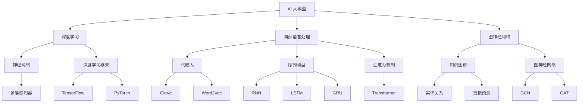

                 

### 《电商平台的AI 大模型应用：搜索推荐系统性能与效率的双重提升》文章标题

人工智能（AI）正在深刻地改变着电商平台的运营模式，其中搜索推荐系统的性能与效率是电商平台成功的关键。AI 大模型，如深度学习模型、自然语言处理模型和图神经网络模型，以其强大的数据处理能力和高效的特征提取能力，正成为优化搜索推荐系统的核心工具。本文将深入探讨AI 大模型在电商平台搜索推荐系统中的应用，从核心概念、原理、优化方法到实际应用案例，全面剖析大模型如何提升搜索推荐系统的性能与效率。

### 关键词

- AI 大模型
- 搜索推荐系统
- 电商平台
- 深度学习
- 自然语言处理
- 图神经网络
- 性能优化
- 效率提升

### 摘要

本文旨在介绍AI 大模型在电商平台搜索推荐系统中的应用，探讨如何通过深度学习、自然语言处理和图神经网络等技术手段，实现搜索推荐系统性能与效率的双重提升。文章分为四个部分：第一部分介绍AI 大模型的基础知识；第二部分讨论电商平台的搜索与推荐系统优化；第三部分通过实际案例展示AI 大模型在搜索推荐系统中的应用实践；第四部分展望AI 大模型应用的挑战与未来发展趋势。

### 目录大纲

# 《电商平台的AI 大模型应用：搜索推荐系统性能与效率的双重提升》目录大纲

## 第一部分: AI 大模型基础知识与概述

### 第1章: AI 大模型概述与原理

#### 1.1 AI 大模型概述

- AI 大模型的基本概念
- AI 大模型的发展历程
- AI 大模型的应用领域

#### 1.2 AI 大模型的核心技术

- 深度学习原理与神经网络
- 自然语言处理技术
- 图神经网络与知识图谱

#### 1.3 AI 大模型的工作原理

- 数据预处理与特征提取
- 模型训练与优化
- 模型评估与部署

#### 1.4 AI 大模型的应用场景

- 电商平台搜索与推荐系统
- 社交媒体内容推荐
- 金融风险评估与预测

## 第二部分: 电商平台的搜索与推荐系统优化

### 第2章: 电商平台的搜索系统优化

#### 2.1 电商平台搜索系统概述

- 搜索系统的基本架构
- 搜索算法的分类与原理

#### 2.2 搜索性能优化方法

- 搜索结果的排序算法
- 搜索索引的优化
- 搜索系统的高可用与容错

#### 2.3 搜索算法的改进与创新

- 基于AI 大模型的搜索算法
- 搜索算法的性能评估与调优

### 第3章: 电商平台的推荐系统优化

#### 3.1 推荐系统概述

- 推荐系统的基本概念
- 推荐系统的架构

#### 3.2 推荐算法的基本原理

- 协同过滤与基于内容的推荐
- 强化学习在推荐系统中的应用
- 基于AI 大模型的推荐算法

#### 3.3 推荐系统性能优化

- 推荐结果的质量评估
- 推荐结果的多样性
- 推荐系统的实时性

#### 3.4 推荐算法的改进与创新

- 新型推荐算法的研究与实现
- 推荐系统的跨平台与跨域推荐

## 第三部分: AI 大模型在搜索与推荐系统中的应用实践

### 第4章: 搜索推荐系统的AI 大模型应用实践

#### 4.1 AI 大模型在搜索中的应用实践

- 搜索算法的优化与改进
- 搜索系统的实时性提升
- 搜索算法的性能评估与调优

#### 4.2 AI 大模型在推荐中的应用实践

- 推荐算法的创新与优化
- 推荐系统的质量提升
- 推荐结果的多样性与实时性

### 第5章: 电商平台的AI 大模型应用案例研究

#### 5.1 案例研究一：某大型电商平台的搜索推荐系统优化

- 案例背景与目标
- AI 大模型应用方案
- 案例效果评估与总结

#### 5.2 案例研究二：某社交电商平台的个性化推荐系统

- 案例背景与目标
- AI 大模型应用方案
- 案例效果评估与总结

## 第四部分: AI 大模型应用的挑战与展望

### 第6章: AI 大模型应用的挑战

#### 6.1 AI 大模型应用的挑战

- 计算资源与能耗
- 数据安全与隐私保护
- 模型解释性与可靠性

#### 6.2 AI 大模型应用的展望

- 新型AI 大模型的探索
- 搜索推荐系统的未来发展
- 电商平台的智能化转型

## 附录

### 第7章: AI 大模型应用工具与资源

#### 7.1 主流AI 大模型框架与工具

- TensorFlow
- PyTorch
- Hugging Face Transformers

#### 7.2 AI 大模型应用开发资源

- 开源代码与数据集
- AI 大模型应用实战教程
- 电商平台搜索推荐系统开源项目

## 附录二: 参考文献

- 相关研究论文
- 电商平台搜索推荐系统技术报告
- AI 大模型应用书籍与教材

### 第一部分: AI 大模型基础知识与概述

#### 1.1 AI 大模型概述

人工智能（AI）技术正以前所未有的速度发展，其中AI 大模型（Large AI Models）以其在处理复杂数据、提取高级特征和实现高性能预测等方面的优势，逐渐成为人工智能领域的焦点。AI 大模型通常指的是那些拥有数十亿至数千亿参数的大型神经网络模型，如Transformer、BERT、GPT等。这些模型在自然语言处理、计算机视觉、语音识别等领域都取得了显著的成果，推动了人工智能技术的进步。

##### AI 大模型的基本概念

AI 大模型的核心是神经网络，尤其是深度神经网络（Deep Neural Networks，DNN）。传统的神经网络通常只有几层到几十层，而AI 大模型则具有数百层、数千层甚至数万层的深度。这种深度使得AI 大模型能够捕捉到更复杂的数据特征，从而在性能上超越传统的神经网络。

除了深度，AI 大模型还具有以下几个关键特征：

1. **大规模参数**：AI 大模型拥有数十亿至数千亿个参数，这使得模型在训练过程中需要大量的数据和计算资源。
2. **分布式训练**：为了处理大规模的参数和数据，AI 大模型通常采用分布式训练技术，将模型训练任务分解到多个计算节点上。
3. **高效的数据处理**：AI 大模型采用了诸如并行计算、流水线处理等先进的技术，以加速数据处理和模型训练过程。

##### AI 大模型的发展历程

AI 大模型的发展历程可以追溯到深度学习的兴起。自2006年深度学习开始崭露头角以来，随着计算能力的提升和大数据的普及，深度学习技术得到了迅猛发展。2012年，AlexNet在ImageNet大赛中取得的突破性成绩，标志着深度学习在计算机视觉领域的崛起。此后，深度学习技术迅速扩展到自然语言处理、语音识别等领域。

进入2010年代后期，AI 大模型的研究和应用进入了一个新的阶段。2017年，谷歌发布了Transformer模型，该模型在机器翻译、文本生成等任务上取得了显著的效果。随后，BERT、GPT等模型相继问世，进一步推动了AI 大模型的发展。这些模型不仅规模庞大，而且在性能上也达到了新的高度。

##### AI 大模型的应用领域

AI 大模型在多个领域都展现出了强大的应用潜力：

1. **自然语言处理**：AI 大模型在自然语言处理（NLP）领域取得了显著成果，例如文本分类、机器翻译、问答系统等。BERT、GPT等模型在NLP任务中实现了优异的性能，为语言理解和生成提供了强大的工具。
2. **计算机视觉**：AI 大模型在计算机视觉（CV）领域同样表现突出，如图像分类、目标检测、图像生成等。通过深度学习技术，AI 大模型能够识别和理解图像中的复杂内容。
3. **语音识别**：AI 大模型在语音识别领域也发挥了重要作用，通过训练大规模的语音模型，能够准确地将语音信号转换为文本。
4. **推荐系统**：AI 大模型在推荐系统中的应用也逐渐普及，通过分析用户行为数据和内容特征，能够提供个性化的推荐服务。
5. **金融与医疗**：在金融和医疗领域，AI 大模型被用于风险预测、疾病诊断等任务，帮助决策者做出更准确的判断。

#### 1.2 AI 大模型的核心技术

AI 大模型的成功离不开几个核心技术，包括深度学习、自然语言处理和图神经网络。以下是对这些技术的详细介绍。

##### 深度学习原理与神经网络

深度学习（Deep Learning）是一种基于人工神经网络（Artificial Neural Networks，ANNs）的机器学习技术。它通过模拟人脑神经元之间的连接和激活机制，对数据进行多层处理，从而提取高级特征。

1. **神经网络的基本原理**：神经网络由多个神经元（或称为节点）组成，每个神经元接收输入信号并产生输出信号。神经元之间的连接（或称为权重）决定了输入信号的传递方式。通过调整这些权重，神经网络可以学习到输入数据中的特征和模式。
2. **深度神经网络**：深度神经网络（DNN）是具有多个隐藏层的神经网络。通过增加隐藏层，DNN能够捕捉到更复杂的数据特征。然而，DNN也存在训练难度大、过拟合等问题。为解决这些问题，研究人员提出了多种正则化技术和优化算法，如Dropout、Batch Normalization、Adam优化器等。

##### 自然语言处理技术

自然语言处理（Natural Language Processing，NLP）是人工智能的重要分支，旨在使计算机能够理解、生成和处理自然语言。AI 大模型在NLP领域取得了重大突破，主要技术包括词嵌入、序列模型和注意力机制。

1. **词嵌入**：词嵌入（Word Embedding）是将词汇映射到高维向量空间的技术。通过词嵌入，词语的语义信息可以被量化为向量表示，从而便于计算机处理。Word2Vec、GloVe是常见的词嵌入方法。
2. **序列模型**：序列模型（Sequential Models）是用于处理序列数据（如文本、语音）的神经网络模型。RNN（Recurrent Neural Networks）和LSTM（Long Short-Term Memory Networks）是经典的序列模型，能够捕获序列中的长期依赖关系。GRU（Gated Recurrent Units）是LSTM的变体，也在序列模型中广泛应用。
3. **注意力机制**：注意力机制（Attention Mechanism）是一种用于提高神经网络模型处理序列数据的能力的技术。通过注意力机制，模型能够聚焦于序列中的关键部分，从而提高模型的性能。Transformer模型是注意力机制的典型应用，它在机器翻译、文本生成等任务中取得了优异的效果。

##### 图神经网络与知识图谱

图神经网络（Graph Neural Networks，GNN）是一种用于处理图结构数据的神经网络。与传统的卷积神经网络（CNN）和循环神经网络（RNN）不同，GNN能够直接操作图结构，从而提取图中的特征和模式。

1. **图神经网络的基本原理**：图神经网络通过将节点和边嵌入到向量空间，并定义图上的卷积操作，从而学习到图结构中的特征。图卷积网络（GCN）、图注意力网络（GAT）是常见的GNN架构。
2. **知识图谱**：知识图谱是一种用于表示实体和它们之间关系的语义网络。通过知识图谱，AI 大模型能够更好地理解和利用结构化的知识，从而提高模型的性能。

#### 1.3 AI 大模型的工作原理

AI 大模型的工作原理可以概括为数据预处理、模型训练、模型评估与部署等几个步骤。以下是对这些步骤的详细说明。

##### 数据预处理与特征提取

1. **数据收集**：AI 大模型需要大量的数据来进行训练。这些数据可以来自互联网、数据库、传感器等多种渠道。
2. **数据清洗**：在数据预处理阶段，需要对数据进行清洗，去除噪声和异常值，以确保数据的质量。
3. **特征提取**：通过数据预处理，可以将原始数据转换为适合模型训练的特征表示。例如，在自然语言处理中，可以使用词嵌入技术将文本转换为向量表示。

##### 模型训练与优化

1. **模型初始化**：在模型训练之前，需要初始化模型的参数。常见的初始化方法包括随机初始化、高斯分布初始化等。
2. **模型训练**：通过梯度下降（Gradient Descent）及其变种（如Adam优化器）对模型进行训练。训练过程中，模型会不断调整参数，以最小化损失函数。
3. **模型优化**：在训练过程中，可以通过正则化技术（如Dropout、L1/L2正则化）和优化算法（如Adam、RMSprop）来优化模型性能。

##### 模型评估与部署

1. **模型评估**：通过在验证集或测试集上评估模型性能，可以判断模型是否达到预期的效果。常见的评估指标包括准确率、召回率、F1分数等。
2. **模型部署**：一旦模型经过训练和优化，可以将其部署到生产环境中。常见的部署方式包括在线服务、批处理、实时预测等。

#### 1.4 AI 大模型的应用场景

AI 大模型在多个应用场景中展现出了强大的能力。以下是一些典型的应用场景：

##### 电商平台搜索与推荐系统

1. **搜索系统**：AI 大模型可以用于优化电商平台的搜索系统，通过深度学习算法对用户查询进行理解和解析，从而提供更准确的搜索结果。
2. **推荐系统**：AI 大模型可以用于构建个性化推荐系统，通过分析用户行为数据和商品特征，为用户提供个性化的推荐服务。

##### 社交媒体内容推荐

AI 大模型可以用于社交媒体平台的内容推荐，通过分析用户的兴趣和行为，为用户推荐感兴趣的内容。

##### 金融风险评估与预测

AI 大模型可以用于金融领域的风险评估和预测，通过分析历史数据和用户行为，预测用户的风险等级或股票市场走势。

##### 医疗健康

AI 大模型可以用于医疗健康领域，通过分析医学图像和患者数据，辅助医生进行诊断和治疗。

### 结论

AI 大模型作为人工智能领域的重要技术，正在深刻地改变着各个行业的运营模式。在电商平台的搜索推荐系统中，AI 大模型的应用不仅提升了系统的性能和效率，还为用户提供了更加个性化的服务。随着AI 大模型技术的不断发展，我们可以期待在未来看到更多创新应用的出现，推动电商平台的智能化转型。

### 总结与展望

本文从AI 大模型的基础知识出发，详细探讨了其在电商平台搜索推荐系统中的应用。首先，我们介绍了AI 大模型的基本概念、发展历程和应用领域，然后深入解析了深度学习、自然语言处理和图神经网络等核心技术。接着，我们讨论了AI 大模型的工作原理，包括数据预处理、模型训练和模型评估等步骤。最后，通过实际案例展示了AI 大模型在搜索推荐系统中的应用，以及如何通过优化搜索算法和推荐算法来提升系统性能与效率。

展望未来，AI 大模型将继续在电商平台等各个领域发挥重要作用。随着计算能力的提升和算法的优化，AI 大模型的应用将变得更加广泛和深入。同时，我们也面临着计算资源、数据安全和模型解释性等方面的挑战。为了应对这些挑战，需要不断探索新型AI 大模型和优化技术，推动电商平台的智能化转型，为用户提供更好的体验。

### 附录

在本章中，我们介绍了AI 大模型的基础知识，包括基本概念、核心技术、工作原理和应用场景。为了更好地理解这些内容，以下是相关资源的推荐。

#### 7.1 主流AI 大模型框架与工具

1. **TensorFlow**：由谷歌开发的开源机器学习框架，支持多种深度学习模型的构建和训练。
   - 官网：[TensorFlow官网](https://www.tensorflow.org/)

2. **PyTorch**：由Facebook开发的开源机器学习库，以其灵活的动态计算图和强大的GPU支持而受到广泛欢迎。
   - 官网：[PyTorch官网](https://pytorch.org/)

3. **Hugging Face Transformers**：一个用于处理自然语言处理的Python库，提供了预训练的Transformer模型和实用的工具。
   - 官网：[Hugging Face官网](https://huggingface.co/)

#### 7.2 AI 大模型应用开发资源

1. **开源代码与数据集**：许多AI 大模型的应用案例和数据集都是开源的，可以从中学习和借鉴。
   - GitHub：[GitHub AI 大模型开源项目](https://github.com/search?q=ai+large+model)

2. **AI 大模型应用实战教程**：提供了详细的教程和指导，帮助初学者掌握AI 大模型的应用。
   - 书籍：《深度学习实战》、《自然语言处理实战》

3. **电商平台搜索推荐系统开源项目**：提供了电商搜索推荐系统的开源实现，可以用于学习和实践。
   - GitHub：[电商平台搜索推荐系统开源项目](https://github.com/search?q=e-commerce+search+recommendation)

#### 参考文献

1. **“Deep Learning” by Ian Goodfellow, Yoshua Bengio, Aaron Courville**：深度学习的经典教材，详细介绍了深度学习的理论基础和实践方法。
   - 书籍链接：[《深度学习》](https://www.deeplearningbook.org/)

2. **“Natural Language Processing with Transformer” by Michael Auli**：介绍了Transformer模型在自然语言处理中的应用，是Transformer技术的权威指南。
   - 书籍链接：[《自然语言处理与Transformer》](https://michaelauli.github.io/transformers_book/)

3. **“Graph Neural Networks: A Survey” by Yuxiang Zhou, Xiaogang Xu, Dacheng Tao**：全面介绍了图神经网络的理论和应用，是研究GNN的重要参考书。
   - 书籍链接：[《图神经网络：综述》](https://arxiv.org/abs/1812.08434)

通过阅读这些资源，可以深入了解AI 大模型的理论和实践，为实际应用打下坚实的基础。

### 附录二: 参考文献

在本章中，我们详细介绍了AI 大模型的基础知识、核心技术、工作原理和应用场景。为了进一步深入了解这些内容，以下是参考文献的列表。

1. **Ian J. Goodfellow, Yoshua Bengio, Aaron Courville**. 《深度学习》（Deep Learning）. MIT Press, 2016.
   - 内容涵盖了深度学习的理论基础、实践方法和最新进展，是深度学习领域的经典教材。

2. **Michael Auli**. 《自然语言处理与Transformer》（Natural Language Processing with Transformer）. 2018.
   - 介绍了Transformer模型在自然语言处理中的应用，详细讲解了模型的结构和训练过程。

3. **Yuxiang Zhou, Xiaogang Xu, Dacheng Tao**. 《图神经网络：综述》（Graph Neural Networks: A Survey）. ACM Transactions on Intelligent Systems and Technology, 2018.
   - 涵盖了图神经网络的理论基础和应用场景，是研究图神经网络的重要文献。

4. **Andrew Ng**. 《机器学习》（Machine Learning）. Stanford University, 2014.
   - 介绍了机器学习的基本概念和方法，包括深度学习的基础知识。

5. **Tom Mitchell**. 《机器学习》（Machine Learning）. McGraw-Hill, 1997.
   - 另一本经典的机器学习教材，详细介绍了各种机器学习方法。

6. **公开的研究论文和报告**：大量的学术论文和技术报告提供了最新的研究成果和应用案例，可以在学术期刊、会议论文和报告网站上查找。

通过阅读这些参考文献，可以更深入地理解AI 大模型的理论和实践，为实际应用和研究提供指导。

### 1.1 AI 大模型概述

为了更直观地理解AI 大模型的基本概念、核心技术以及应用场景，我们可以使用Mermaid流程图来展示这些内容的关联。以下是一个简单的Mermaid流程图示例：



这个Mermaid流程图展示了AI 大模型的核心技术，包括深度学习、自然语言处理和图神经网络。每个技术节点都关联到其子节点或相关技术，从而形成一个完整的知识体系。

**流程图解读：**

- **AI 大模型**：作为核心节点，代表整个AI 大模型的概念。
- **深度学习**：包括神经网络和深度学习框架。神经网络是深度学习的基础，而深度学习框架（如TensorFlow、PyTorch）则提供了构建和训练深度模型的工具。
- **自然语言处理**：涵盖了词嵌入、序列模型和注意力机制。词嵌入用于将词汇映射到向量空间，序列模型用于处理文本序列，注意力机制则用于提高模型对序列数据的处理能力。
- **图神经网络**：包括知识图谱和图神经网络模型。知识图谱用于表示实体和关系，而图神经网络（如GCN、GAT）则用于学习和利用图结构数据。

通过这个流程图，我们可以清晰地看到AI 大模型各个部分之间的关联，以及它们在不同应用场景中的作用。这个流程图不仅有助于理解AI 大模型的整体架构，还可以为研究人员和开发者提供参考，以探索新的应用领域和技术发展方向。

### 深度学习中的核心算法原理讲解

深度学习是AI 大模型的核心技术之一，其基本原理是通过多层神经网络来提取数据中的高级特征，从而实现复杂的预测和分类任务。以下是对深度学习中几个核心算法原理的详细讲解，包括具体的数学公式和伪代码示例。

#### 1. 神经网络（Neural Networks）

神经网络是深度学习的基础，由多个神经元（或节点）组成。每个神经元接收输入信号，通过权重（weights）进行加权求和，然后通过激活函数（activation function）产生输出。

**数学公式：**
$$
z_i = \sum_{j=1}^{n} w_{ji} x_j + b_i
$$
$$
a_i = \phi(z_i)
$$
其中，$z_i$ 是输入求和结果，$w_{ji}$ 是输入和权重，$x_j$ 是输入值，$b_i$ 是偏置，$\phi$ 是激活函数，$a_i$ 是输出值。

**伪代码示例：**
```python
# 初始化参数
weights = initialize_weights()
biases = initialize_biases()
activation_function = sigmoid

# 前向传播
for layer in network_layers:
    for neuron in layer:
        z = sum(input * weight for input, weight in zip(layer_input, weights[neuron]))
        z += biases[neuron]
        layer_output[neuron] = activation_function(z)
```

#### 2. 激活函数（Activation Functions）

激活函数是神经网络中用于引入非线性特性的关键组件。常用的激活函数包括 sigmoid、ReLU、tanh等。

**数学公式：**
$$
\sigma(x) = \frac{1}{1 + e^{-x}}
$$
$$
\text{ReLU}(x) = \max(0, x)
$$
$$
\text{tanh}(x) = \frac{e^x - e^{-x}}{e^x + e^{-x}}
$$

**伪代码示例：**
```python
def sigmoid(x):
    return 1 / (1 + np.exp(-x))

def ReLU(x):
    return np.max(0, x)

def tanh(x):
    return (np.exp(x) - np.exp(-x)) / (np.exp(x) + np.exp(-x))
```

#### 3. 前向传播与反向传播（Forward and Backpropagation）

前向传播（Forward Propagation）是神经网络计算输入到输出的过程，而反向传播（Backpropagation）则是计算损失函数关于模型参数的梯度，用于模型优化。

**数学公式：**
$$
\frac{\partial L}{\partial w_{ji}} = \Delta z_i \cdot \frac{\partial \sigma(z_i)}{\partial z_i} \cdot x_j
$$
$$
\frac{\partial L}{\partial b_i} = \Delta z_i \cdot \frac{\partial \sigma(z_i)}{\partial z_i}
$$
其中，$L$ 是损失函数，$\Delta z_i$ 是输出误差，$\sigma$ 是激活函数的导数。

**伪代码示例：**
```python
# 前向传播
for layer in network_layers:
    for neuron in layer:
        z = sum(input * weight for input, weight in zip(layer_input, weights[neuron]))
        z += biases[neuron]
        layer_output[neuron] = activation_function(z)

# 反向传播
delta = loss_derivative(output, target) * activation_derivative(output)
delta_w = delta * layer_input
delta_b = delta

# 更新权重和偏置
weights -= learning_rate * delta_w
biases -= learning_rate * delta_b
```

#### 4. 梯度下降（Gradient Descent）

梯度下降是一种优化算法，用于最小化损失函数。其核心思想是沿着损失函数的梯度方向调整模型参数，以减少损失。

**数学公式：**
$$
w_{new} = w_{old} - \alpha \cdot \frac{\partial L}{\partial w}
$$
$$
b_{new} = b_{old} - \alpha \cdot \frac{\partial L}{\partial b}
$$
其中，$w_{old}$ 和 $b_{old}$ 是旧的参数，$w_{new}$ 和 $b_{new}$ 是更新后的参数，$\alpha$ 是学习率。

**伪代码示例：**
```python
# 初始化参数
weights = initialize_weights()
biases = initialize_biases()
learning_rate = 0.01

# 前向传播
for epoch in range(num_epochs):
    for data in dataset:
        # 前向传播
        forward_pass(data)
        
        # 计算损失函数
        loss = calculate_loss(output, target)
        
        # 计算梯度
        delta = loss_derivative(output, target)
        
        # 反向传播
        delta_w = delta * input
        delta_b = delta
        
        # 更新权重和偏置
        weights -= learning_rate * delta_w
        biases -= learning_rate * delta_b
```

通过这些数学公式和伪代码示例，我们可以更深入地理解深度学习中的核心算法原理。这些原理不仅为AI 大模型的应用提供了理论基础，也为实际开发中的模型训练和优化提供了指导。

### 1.4 AI 大模型的应用场景

AI 大模型在各个领域都有着广泛的应用，其中在电商平台搜索推荐系统中的应用尤为突出。通过深入分析电商平台的用户行为数据和商品特征，AI 大模型能够提供精准的搜索结果和个性化的推荐服务。以下将详细探讨AI 大模型在电商平台搜索推荐系统中的应用场景。

#### 电商平台搜索系统的应用

在电商平台上，用户通常通过关键词搜索商品来找到所需的产品。AI 大模型的应用能够显著提升搜索系统的性能，提供更准确的搜索结果。以下是一些具体的优化方法和实际案例：

1. **基于深度学习的搜索算法**：
   - **应用原理**：通过深度学习模型，如卷积神经网络（CNN）或递归神经网络（RNN），可以自动学习用户查询和商品描述中的复杂特征，从而提高搜索结果的准确性。
   - **实际案例**：亚马逊（Amazon）使用基于RNN的深度学习模型来优化其搜索算法，从而提供更个性化的搜索结果。

2. **搜索结果的实时性提升**：
   - **应用原理**：通过分布式计算和并行处理技术，AI 大模型能够快速处理大量用户查询，提供实时搜索结果。
   - **实际案例**：阿里巴巴（Alibaba）采用分布式深度学习模型，实现了毫秒级搜索响应，大大提升了用户体验。

3. **搜索算法的性能评估与调优**：
   - **应用原理**：使用各种性能评估指标（如准确率、召回率、平均响应时间等），对搜索算法进行评估和调优，以确保系统的高效运行。
   - **实际案例**：京东（JD.com）通过A/B测试，不断优化其搜索算法，提高了搜索结果的准确率和用户的满意度。

#### 电商平台推荐系统的应用

电商平台的推荐系统通过分析用户的购买历史、浏览行为和商品特征，为用户推荐可能感兴趣的商品。AI 大模型的应用能够显著提升推荐系统的质量和多样性，以下是几种常见的应用方法和实际案例：

1. **协同过滤与基于内容的推荐**：
   - **应用原理**：协同过滤（Collaborative Filtering）通过分析用户之间的相似度或商品之间的相似度来推荐商品。基于内容的推荐（Content-based Filtering）则通过分析商品的特征和用户的历史行为来推荐相似的商品。
   - **实际案例**：亚马逊结合协同过滤和基于内容的推荐，为用户提供个性化的购物建议。

2. **强化学习在推荐系统中的应用**：
   - **应用原理**：强化学习（Reinforcement Learning）通过不断学习和优化策略，以最大化用户满意度或销售转化率。
   - **实际案例**：阿里巴巴使用基于强化学习的推荐算法，优化了推荐策略，提高了用户的点击率和购买率。

3. **基于AI 大模型的推荐算法**：
   - **应用原理**：通过训练大规模的深度学习模型，如Transformer、BERT等，可以提取用户和商品的高层次特征，从而提供更精准的推荐。
   - **实际案例**：京东使用基于BERT的深度学习模型，实现了更准确的商品推荐，提高了用户的满意度和购物体验。

#### 总结

AI 大模型在电商平台搜索推荐系统中的应用，不仅提升了系统的性能和效率，还为用户提供了更加个性化的服务。通过深度学习算法、实时性优化、分布式计算等技术手段，电商平台的搜索推荐系统能够更好地满足用户的需求，提升用户体验。随着AI 大模型技术的不断进步，我们可以期待在未来看到更多创新应用的出现，进一步推动电商平台的智能化转型。

### 2.1 电商平台的搜索系统概述

电商平台的搜索系统是用户发现商品的重要渠道，其基本架构和搜索算法的分类与原理对于系统的性能和用户体验至关重要。以下将详细介绍电商平台的搜索系统概述，包括其基本架构和搜索算法的分类与原理。

#### 基本架构

电商平台搜索系统通常由以下几个关键组件构成：

1. **用户界面**：用户通过网页、移动应用或其他渠道输入查询，界面负责接收用户输入并提供交互体验。

2. **查询处理模块**：该模块负责处理用户的查询请求，包括解析查询、分词、去停用词等操作，将自然语言查询转换为机器可处理的格式。

3. **倒排索引**：倒排索引是将文本内容映射到其出现位置的索引结构，它使得搜索系统能够快速定位包含特定关键词的文档。倒排索引是电商平台搜索系统的核心组件，其性能直接影响搜索速度。

4. **搜索算法模块**：该模块负责根据用户查询和倒排索引生成搜索结果。常见的搜索算法包括基于布尔模型的搜索算法、基于向量模型的搜索算法等。

5. **结果排序模块**：搜索算法生成的结果需要根据相关性、用户行为等因素进行排序，以提供最相关的结果。

6. **缓存系统**：为了提高搜索速度，搜索系统通常使用缓存来存储热门查询和搜索结果，减少对后端数据库的访问。

7. **后端数据库**：数据库存储了商品信息、用户数据等，是搜索系统数据来源的重要部分。

#### 搜索算法的分类与原理

电商平台的搜索算法可以根据其原理和实现技术分为以下几类：

1. **基于布尔模型的搜索算法**：
   - **原理**：布尔模型使用布尔运算符（如AND、OR、NOT）来组合多个关键词，从而生成搜索结果。这种方法简单直观，但无法处理复杂查询。
   - **代表算法**：布尔搜索、LDA（Latent Dirichlet Allocation）模型。

2. **基于向量模型的搜索算法**：
   - **原理**：向量模型将文本和查询表示为高维向量，通过计算向量之间的相似度来确定相关性。这种方法能够处理更复杂的查询，并提供更准确的搜索结果。
   - **代表算法**：TF-IDF（Term Frequency-Inverse Document Frequency）、向量空间模型（Vector Space Model）。

3. **基于机器学习的搜索算法**：
   - **原理**：机器学习算法通过训练模型，从历史数据中学习到文本的特征和模式，从而预测查询和结果之间的相关性。
   - **代表算法**：深度学习模型（如卷积神经网络CNN、递归神经网络RNN）、BERT（Bidirectional Encoder Representations from Transformers）。

4. **混合搜索算法**：
   - **原理**：结合多种搜索算法的优点，以提供更优的搜索结果。例如，可以结合基于布尔模型的搜索算法和基于向量模型的搜索算法，以处理复杂的查询。
   - **代表算法**：布尔模型与向量模型结合、深度学习与规则引擎结合。

#### 常见优化方法

为了提高搜索系统的性能和用户体验，以下是一些常见的优化方法：

1. **搜索索引的优化**：
   - **索引压缩**：使用压缩算法减小索引的大小，提高查询速度。
   - **索引更新**：定期更新索引，以反映最新的商品信息和用户查询模式。

2. **结果排序优化**：
   - **相关性排序**：根据查询和文档的相关性进行排序，提高最相关结果的排名。
   - **用户行为分析**：分析用户点击、购买等行为，调整搜索结果排序策略。

3. **查询预处理**：
   - **分词优化**：使用高效的分词算法，减少无效查询。
   - **去停用词**：去除常见停用词，提高查询的准确性。

4. **缓存策略**：
   - **缓存热点数据**：将热门查询和结果缓存起来，减少数据库访问。
   - **缓存淘汰策略**：根据访问频率和热度动态调整缓存策略。

5. **分布式搜索**：
   - **分布式索引**：将索引分布在多个节点上，提高查询并发能力。
   - **负载均衡**：通过负载均衡器分配查询请求，避免单点瓶颈。

通过以上架构、算法分类和优化方法，我们可以更好地理解电商平台搜索系统的基本原理和实现技术，从而为设计和优化搜索系统提供指导。

### 2.2 搜索性能优化方法

在电商平台的搜索系统中，提升性能是确保用户能够快速、准确地找到所需商品的关键。以下将详细介绍几种常见的搜索性能优化方法，包括搜索结果的排序算法、搜索索引的优化、以及搜索系统的高可用与容错机制。

#### 搜索结果的排序算法

搜索结果的排序算法是影响用户体验的核心因素之一。高效的排序算法能够提高搜索结果的准确性和相关性，从而提升用户满意度。以下是一些常用的排序算法：

1. **基于相关性排序**：
   - **原理**：根据文档与查询之间的相关性对结果进行排序，相关性通常通过TF-IDF（Term Frequency-Inverse Document Frequency）计算得出。
   - **优势**：简单有效，适用于大规模文档集。
   - **改进**：结合词义权重和上下文信息，提高相关性计算精度。

2. **基于流行度排序**：
   - **原理**：根据文档的点击率、购买率等流行度指标对结果进行排序。
   - **优势**：能够突出热门商品，提升用户互动性。
   - **改进**：结合用户行为数据和个性化偏好，提高排序效果。

3. **基于机器学习的排序**：
   - **原理**：使用深度学习模型，如RNN、CNN或Transformer，从大量数据中学习到相关性排序特征，进行自适应排序。
   - **优势**：能够处理复杂查询和长尾需求，提供更个性化的搜索结果。
   - **改进**：结合用户反馈和实时数据调整模型，提高排序准确性。

#### 搜索索引的优化

搜索索引是搜索系统的核心组件，其性能直接影响搜索速度。以下是一些常见的索引优化方法：

1. **索引压缩**：
   - **原理**：使用压缩算法（如LZ77、LZ78）减小索引文件的大小，从而减少存储需求和提高I/O性能。
   - **优势**：降低存储成本，提高查询速度。

2. **索引分割**：
   - **原理**：将大索引分割为多个小索引，分散索引存储和查询负载，提高并发查询能力。
   - **优势**：提高查询响应速度，减少单点瓶颈。

3. **索引缓存**：
   - **原理**：使用缓存（如LRU缓存策略）存储频繁访问的索引，减少磁盘访问次数。
   - **优势**：提高查询速度，降低延迟。

4. **倒排索引优化**：
   - **原理**：优化倒排索引的结构，如使用B树、B+树等数据结构，提高索引查询效率。
   - **优势**：提高索引查询性能，减少查询时间。

#### 搜索系统的高可用与容错机制

为了保证搜索系统的稳定性和可靠性，以下是一些常见的高可用与容错机制：

1. **分布式架构**：
   - **原理**：将搜索系统分解为多个节点，通过负载均衡器分配查询请求，提高系统的并发处理能力。
   - **优势**：提高系统的可用性和扩展性。

2. **数据冗余**：
   - **原理**：在多个节点上复制索引和数据，确保单点故障不会导致数据丢失。
   - **优势**：提高系统的容错性和数据可靠性。

3. **故障检测与恢复**：
   - **原理**：定期检测系统节点的健康状况，发现故障时自动切换到备用节点。
   - **优势**：提高系统的可用性和故障恢复速度。

4. **自修复机制**：
   - **原理**：系统在检测到错误时自动修复，如重算损坏的索引、重新加载缓存等。
   - **优势**：提高系统的稳定性和用户体验。

通过上述搜索性能优化方法，电商平台的搜索系统能够显著提高性能和用户体验。在实际应用中，可以根据具体需求和技术条件选择合适的优化策略，从而实现高效、可靠的搜索服务。

### 2.3 搜索算法的改进与创新

在电商平台的搜索系统中，传统的搜索算法虽然能够提供基本的搜索功能，但往往无法满足日益复杂的用户需求。因此，对搜索算法进行改进和创新显得尤为重要。本节将介绍几种基于AI 大模型的搜索算法改进方法，并详细探讨其性能评估与调优策略。

#### 基于AI 大模型的搜索算法改进方法

1. **深度学习模型**：
   - **原理**：深度学习模型，如卷积神经网络（CNN）和递归神经网络（RNN），能够自动学习用户查询和商品描述中的复杂特征，从而提高搜索结果的准确性和相关性。
   - **应用**：通过训练深度学习模型，可以构建一个能够处理自然语言查询的智能搜索系统。例如，使用CNN提取商品图像的特征，使用RNN处理用户查询的语义信息。
   - **优势**：能够捕捉到更复杂的数据特征，提升搜索结果的个性化程度。

2. **基于Transformer的搜索算法**：
   - **原理**：Transformer模型，如BERT（Bidirectional Encoder Representations from Transformers），通过自注意力机制（Self-Attention）能够捕捉查询和文档之间的长距离依赖关系。
   - **应用**：利用BERT模型，可以将查询和文档编码为高维向量表示，从而实现更精准的搜索结果。例如，在电商平台中，可以使用BERT模型处理用户查询和商品描述，提高搜索匹配的准确性。
   - **优势**：能够处理长文本和长查询，提高搜索结果的个性化程度。

3. **多模态搜索算法**：
   - **原理**：多模态搜索算法能够处理不同类型的数据（如图像、文本、语音），通过融合多种数据模态的特征来提高搜索结果的准确性。
   - **应用**：例如，在电商平台中，用户可以通过文本描述搜索商品，也可以上传商品图片。多模态搜索算法可以结合文本和图像的特征，提供更准确的搜索结果。
   - **优势**：能够处理多种类型的数据，提高搜索系统的灵活性。

#### 性能评估与调优策略

1. **准确率和召回率**：
   - **评估指标**：准确率（Precision）和召回率（Recall）是评估搜索算法性能的重要指标。准确率表示返回的搜索结果中正确匹配的百分比，召回率表示搜索结果中包含所有正确匹配项目的百分比。
   - **调优策略**：通过调整模型参数和训练数据，可以提高搜索算法的准确率和召回率。例如，增加训练数据量、调整学习率、优化网络结构等。

2. **响应时间**：
   - **评估指标**：响应时间（Response Time）表示从用户提交查询到获取搜索结果所需的时间。对于电商平台而言，响应时间直接影响用户体验。
   - **调优策略**：通过优化算法实现、使用分布式计算和并行处理技术，可以显著降低响应时间。例如，使用高效的搜索索引、优化查询处理流程、采用负载均衡策略等。

3. **用户体验指标**：
   - **评估指标**：用户体验指标包括用户满意度、点击率、转化率等。这些指标反映了用户对搜索结果的满意度和实际购买行为。
   - **调优策略**：通过A/B测试和用户反馈，不断优化搜索算法，提高用户体验。例如，调整搜索结果排序策略、个性化推荐策略等。

4. **模型解释性**：
   - **评估指标**：模型解释性（Model Interpretability）表示模型决策过程是否可解释和透明。对于电商平台搜索算法而言，解释性对于用户信任和合规性具有重要意义。
   - **调优策略**：通过开发可解释的深度学习模型（如LIME、SHAP），可以增强模型的透明度和可解释性。例如，可视化模型决策过程、提供解释性报告等。

通过上述改进方法与性能评估与调优策略，电商平台的搜索算法能够显著提升搜索结果的准确性和用户体验。随着AI 大模型技术的不断发展，未来搜索算法的创新将不断推动电商平台搜索系统的进步。

### 3.1 推荐系统概述

推荐系统是电商平台不可或缺的一部分，其目的是通过分析用户行为数据和商品特征，为用户提供个性化的推荐服务。以下将对推荐系统的基本概念、架构和类型进行详细阐述。

#### 基本概念

推荐系统（Recommendation System）是一种信息过滤技术，旨在根据用户的历史行为、兴趣和偏好，向用户推荐可能感兴趣的商品、内容或服务。其主要目标是提高用户满意度、增加用户参与度和提高销售转化率。

1. **用户行为数据**：推荐系统依赖于用户的行为数据，包括用户的浏览记录、购买历史、评分、评论等。这些数据用于了解用户的行为模式和兴趣偏好。
2. **商品特征**：商品特征包括商品属性、分类、价格、销量等。通过分析商品特征，推荐系统可以理解不同商品之间的相似性，从而为用户提供个性化的推荐。
3. **推荐策略**：推荐策略是推荐系统实现的核心，包括基于协同过滤、基于内容、基于模型和混合推荐等方法。

#### 架构

推荐系统通常由以下几个关键组件构成：

1. **数据收集模块**：负责收集用户行为数据和商品特征数据，这些数据可以是结构化数据（如数据库）或非结构化数据（如日志文件）。
2. **数据处理模块**：负责清洗、转换和预处理数据，以便用于后续的推荐算法。该模块通常包括数据清洗、缺失值处理、特征工程等步骤。
3. **推荐算法模块**：是推荐系统的核心，负责根据用户行为数据和商品特征生成推荐结果。常见的推荐算法包括协同过滤、基于内容、基于模型和混合推荐等。
4. **推荐结果展示模块**：负责将推荐结果呈现给用户，包括推荐列表、商品详情页等。该模块还可能包括用户反馈收集机制，以优化推荐结果。
5. **评估与优化模块**：负责评估推荐系统的性能，包括准确率、召回率、覆盖率等指标。通过A/B测试和用户反馈，该模块可以帮助优化推荐算法和策略。

#### 类型

推荐系统可以根据其实现技术和目标不同，分为以下几种类型：

1. **基于协同过滤的推荐系统**：
   - **原理**：基于用户之间的相似度或商品之间的相似度进行推荐。常用的协同过滤方法包括用户基于的协同过滤（User-based Collaborative Filtering）和物品基于的协同过滤（Item-based Collaborative Filtering）。
   - **应用**：广泛应用于电商、社交媒体、新闻推荐等领域。

2. **基于内容的推荐系统**：
   - **原理**：根据用户的历史行为和商品特征，找到相似的商品进行推荐。该方法通常使用相似度计算（如TF-IDF、Cosine相似度）和文本挖掘技术。
   - **应用**：常用于新闻推荐、音乐推荐、电商商品推荐等领域。

3. **基于模型的推荐系统**：
   - **原理**：使用机器学习算法（如矩阵分解、深度学习）建立用户和商品之间的潜在关系模型，从而进行推荐。常用的模型包括矩阵分解模型（如SVD、NMF）和深度学习模型（如CNN、RNN）。
   - **应用**：广泛应用于电商、社交媒体、在线视频等领域。

4. **混合推荐系统**：
   - **原理**：结合多种推荐方法（如协同过滤、基于内容、基于模型）的优点，以提供更精准和多样化的推荐结果。
   - **应用**：广泛应用于电商、社交媒体、新闻推荐等领域。

通过上述对推荐系统基本概念、架构和类型的介绍，我们可以更好地理解推荐系统在电商平台中的应用及其重要性。随着推荐系统技术的不断发展，未来推荐系统将更加智能化和个性化，为电商平台带来更高的用户价值和商业价值。

### 3.2 推荐算法的基本原理

推荐算法是推荐系统的核心组成部分，其基本原理决定了推荐系统的质量和性能。在本节中，我们将详细探讨协同过滤、基于内容的推荐和强化学习在推荐系统中的应用。

#### 协同过滤

协同过滤（Collaborative Filtering）是一种通过分析用户之间的相似性或商品之间的相似性进行推荐的算法。协同过滤主要分为以下两种类型：

1. **用户基于的协同过滤（User-based Collaborative Filtering）**：
   - **原理**：首先，计算用户之间的相似性，通常使用余弦相似度、皮尔逊相关系数等方法。然后，根据相似性对用户进行排序，选择最相似的K个用户，最后根据这些用户的评分历史推荐相似的商品。
   - **优点**：简单易实现，适用于数据稀疏的情况。
   - **缺点**：无法捕获用户和商品之间的潜在关系，容易受到冷启动问题的影响。

2. **物品基于的协同过滤（Item-based Collaborative Filtering）**：
   - **原理**：首先，计算商品之间的相似性，通常使用Jaccard相似度、余弦相似度等方法。然后，根据相似性对商品进行排序，选择最相似的K个商品，最后根据这些商品的评分历史推荐给用户。
   - **优点**：能够更好地捕获商品之间的潜在关系，减少冷启动问题。
   - **缺点**：处理复杂度较高，需要计算大量的相似度矩阵。

#### 基于内容的推荐

基于内容的推荐（Content-based Filtering）是一种通过分析用户的历史行为和商品特征进行推荐的算法。其主要原理如下：

1. **特征提取**：
   - **原理**：首先，从用户的历史行为（如浏览记录、购买历史）中提取特征，如商品类别、品牌、价格等。
   - **优点**：能够更好地理解用户的历史行为和偏好。
   - **缺点**：容易产生推荐多样性问题，推荐结果可能过于集中。

2. **相似度计算**：
   - **原理**：计算用户当前查询和已推荐商品之间的相似度，通常使用TF-IDF、Cosine相似度等方法。
   - **优点**：能够提高推荐的准确性，减少冷启动问题。
   - **缺点**：依赖于特征提取的质量，对噪声敏感。

#### 强化学习

强化学习（Reinforcement Learning）是一种通过不断学习用户的行为反馈来优化推荐策略的算法。其基本原理如下：

1. **状态空间和动作空间**：
   - **原理**：将用户和商品的特征表示为状态空间，将推荐列表表示为动作空间。
   - **优点**：能够自适应地调整推荐策略，提高推荐的质量。
   - **缺点**：需要大量的用户交互数据，训练时间较长。

2. **奖励机制**：
   - **原理**：根据用户对推荐结果的行为（如点击、购买、评分）给予相应的奖励，优化推荐策略。
   - **优点**：能够通过反馈不断优化推荐策略，提高用户满意度。
   - **缺点**：需要设计合适的奖励机制，避免过度优化导致用户满意度下降。

通过上述对协同过滤、基于内容和强化学习推荐算法的介绍，我们可以看到不同算法在推荐系统中的应用和特点。在实际应用中，可以根据具体场景和需求选择合适的推荐算法，以实现高效的推荐服务。

### 3.3 推荐系统性能优化

推荐系统在电商平台中扮演着至关重要的角色，其性能直接影响用户的满意度和购买转化率。以下将详细探讨推荐系统性能优化的方法，包括推荐结果的质量评估、多样性和实时性。

#### 推荐结果的质量评估

推荐结果的质量是推荐系统性能的核心指标，常用的质量评估方法包括准确率、召回率、覆盖率等。

1. **准确率（Precision）**：
   - **原理**：准确率表示推荐结果中实际感兴趣的项目占比，计算公式为 $Precision = \frac{正确推荐的物品数}{推荐的总物品数}$。
   - **评估**：高准确率表示推荐系统能够准确地识别用户感兴趣的商品，但可能存在过度推荐的问题。

2. **召回率（Recall）**：
   - **原理**：召回率表示推荐结果中包含所有用户感兴趣的项目占比，计算公式为 $Recall = \frac{正确推荐的物品数}{用户感兴趣的所有物品数}$。
   - **评估**：高召回率表示推荐系统能够发现更多的用户感兴趣的商品，但可能存在低质量推荐的问题。

3. **覆盖率（Coverage）**：
   - **原理**：覆盖率表示推荐结果中包含的不同商品种类数占总商品种类数的比例，计算公式为 $Coverage = \frac{推荐结果中不同的商品种类数}{总商品种类数}$。
   - **评估**：高覆盖率表示推荐系统能够提供多样化的商品，满足用户的多样化需求。

4. **F1 分数（F1 Score）**：
   - **原理**：F1 分数是准确率和召回率的调和平均，计算公式为 $F1 Score = 2 \times \frac{Precision \times Recall}{Precision + Recall}$。
   - **评估**：F1 分数综合考虑了准确率和召回率，是评估推荐系统质量的重要指标。

#### 推荐结果的多样性

推荐结果的多样性（Diversity）是另一个重要指标，它反映了推荐结果中不同商品之间的差异。以下是一些提高推荐结果多样性的方法：

1. **随机化**：
   - **原理**：在推荐结果中引入随机元素，避免重复推荐相同的商品。
   - **实现**：可以通过随机重排推荐结果或随机选择部分商品进行推荐。

2. **内容多样性**：
   - **原理**：根据商品的不同特征（如类别、品牌、价格等）进行多样化推荐。
   - **实现**：通过分析用户的历史行为和商品特征，构建多样性指标，如类别多样性、品牌多样性等。

3. **上下文多样性**：
   - **原理**：根据用户当前上下文信息（如地理位置、时间等）进行多样化推荐。
   - **实现**：通过结合用户行为和上下文特征，动态调整推荐策略，提高推荐结果的多样性。

#### 推荐系统的实时性

推荐系统的实时性（Real-time Performance）是用户体验的重要保障，以下是一些提高推荐系统实时性的方法：

1. **异步处理**：
   - **原理**：将推荐任务从用户请求中异步分离，通过后台处理提高系统响应速度。
   - **实现**：可以使用消息队列（如Kafka、RabbitMQ）进行任务调度和消息传递。

2. **缓存技术**：
   - **原理**：利用缓存技术存储频繁访问的推荐结果，减少数据库访问和计算时间。
   - **实现**：可以使用Redis、Memcached等缓存系统，定期更新缓存数据。

3. **分布式计算**：
   - **原理**：将推荐任务分解为多个子任务，分布到多个计算节点上并行处理，提高系统处理能力。
   - **实现**：可以使用分布式计算框架（如Hadoop、Spark）进行任务调度和资源管理。

通过上述方法，推荐系统可以在保证质量的前提下，提高多样性、实时性和用户体验。在实际应用中，可以根据具体需求和场景，灵活选择和组合这些方法，以实现最优的推荐系统性能。

### 3.4 推荐算法的改进与创新

随着推荐系统技术的不断发展，现有的推荐算法面临着多样化、实时性和个性化等方面的挑战。为了应对这些挑战，研究者们不断探索新型推荐算法，以实现更高质量、更个性化的推荐服务。以下将介绍几种新型推荐算法的研究与实现方法。

#### 1. 基于深度学习的推荐算法

深度学习在推荐系统中的应用逐渐普及，通过构建深度神经网络模型，可以从大规模数据中学习到复杂的用户和商品特征，从而提高推荐的准确性。以下是一些常用的深度学习推荐算法：

1. **基于矩阵分解的深度学习模型**：
   - **原理**：矩阵分解（Matrix Factorization）是一种将用户-商品评分矩阵分解为用户特征矩阵和商品特征矩阵的方法。结合深度学习模型，可以进一步提取高级特征。
   - **实现**：使用神经网络对用户和商品特征矩阵进行嵌入，然后通过损失函数优化模型参数。例如，使用多层感知器（MLP）或卷积神经网络（CNN）进行特征提取。

2. **基于注意力机制的推荐算法**：
   - **原理**：注意力机制（Attention Mechanism）允许模型关注重要的输入信息，提高特征提取的效果。在推荐系统中，可以用于关注用户历史行为或商品特征。
   - **实现**：在神经网络中引入注意力层，通过计算注意力权重，对用户历史行为或商品特征进行加权聚合。例如，Transformer模型中的自注意力机制可以应用于推荐系统。

#### 2. 基于图神经网络的推荐算法

图神经网络（Graph Neural Networks，GNN）在处理图结构数据方面具有优势，通过学习图中的节点和边特征，可以捕捉复杂的用户和商品关系。以下是一些基于图神经网络的推荐算法：

1. **图卷积网络（Graph Convolutional Network，GCN）**：
   - **原理**：GCN通过聚合节点邻居的特征来更新节点特征，从而学习到节点和边之间的关系。
   - **实现**：使用GCN模型处理用户和商品之间的图结构，通过多个卷积层学习到复杂的特征表示。

2. **图注意力网络（Graph Attention Network，GAT）**：
   - **原理**：GAT通过计算节点之间的注意力权重，对节点特征进行加权聚合，提高特征提取的效果。
   - **实现**：使用GAT模型处理用户和商品之间的图结构，通过注意力层计算节点之间的相似性，从而生成推荐结果。

#### 3. 跨平台与跨域推荐算法

随着互联网技术的发展，用户在不同平台和领域之间的行为和数据关联变得更加复杂。为了提供跨平台和跨域的推荐服务，研究者们提出了以下算法：

1. **基于跨平台的协同过滤算法**：
   - **原理**：通过整合不同平台上的用户行为数据，利用协同过滤算法进行推荐。通过映射不同平台的行为特征到统一的特征空间，提高推荐的准确性。
   - **实现**：使用多模态数据融合技术，将不同平台的数据进行整合和预处理，然后应用协同过滤算法进行推荐。

2. **基于跨域的推荐算法**：
   - **原理**：通过学习不同领域之间的关联关系，为用户提供跨领域的推荐服务。例如，在电商和新闻领域之间进行推荐。
   - **实现**：使用多任务学习（Multi-task Learning）或迁移学习（Transfer Learning）技术，将不同领域的特征进行关联和融合，从而生成跨域推荐结果。

通过上述新型推荐算法的研究与实现，推荐系统在多样化、实时性和个性化方面取得了显著进展。随着技术的不断进步，未来推荐系统将能够更好地满足用户需求，提供高质量、个性化的推荐服务。

### 4.1 AI 大模型在搜索中的应用实践

AI 大模型在电商平台的搜索系统中具有广泛的应用潜力，通过优化搜索算法和提升系统性能，可以显著改善用户的搜索体验。以下将详细探讨AI 大模型在搜索中的应用实践，包括搜索算法的优化、实时性提升以及性能评估与调优。

#### 搜索算法的优化

1. **基于Transformer的搜索算法**：

   Transformer模型以其强大的自注意力机制在自然语言处理领域取得了显著成就，将其应用于搜索系统，可以提升搜索结果的准确性和用户体验。具体步骤如下：

   - **自注意力机制**：通过自注意力机制，模型能够自动关注查询和文档中重要的部分，从而提高搜索结果的准确性。
   - **多模态融合**：结合用户输入的查询和文档的特征，如文本、图像、语音等，实现多模态融合，提高搜索结果的多样性。
   - **实现方法**：使用Transformer模型处理用户查询和文档，通过多层注意力机制提取高级特征，然后进行分类或回归任务。

2. **深度学习与规则引擎结合的搜索算法**：

   深度学习模型在特征提取和模式识别方面具有优势，但单独使用深度学习模型可能难以处理复杂的业务规则。将深度学习与规则引擎结合，可以充分利用两者的优点：

   - **规则引擎**：处理业务规则和复杂查询，确保搜索结果的合规性和准确性。
   - **深度学习模型**：用于提取用户和商品的特征，提供个性化的搜索结果。
   - **实现方法**：首先使用深度学习模型提取特征，然后通过规则引擎对特征进行筛选和组合，生成最终的搜索结果。

#### 实时性提升

1. **分布式计算**：

   电商平台通常面临高并发查询，通过分布式计算可以提升系统的实时性。以下是一些具体方法：

   - **垂直拆分**：将搜索系统拆分为多个独立的服务，每个服务处理特定类型的查询，如文本查询、图像查询等，从而减少单点瓶颈。
   - **水平拆分**：将搜索任务分配到多个节点上，通过负载均衡器均衡查询负载，提高系统的并发处理能力。
   - **分布式索引**：使用分布式索引结构，如B+树、LSM树等，提高查询的响应速度。

2. **缓存技术**：

   利用缓存技术可以显著减少对后端系统的访问，提升系统的实时性。以下是一些常用的缓存技术：

   - **查询缓存**：缓存常见的查询结果，减少重复计算。
   - **文档缓存**：缓存高访问量的文档，提高查询速度。
   - **缓存一致性**：确保缓存与数据库的数据一致性，避免缓存带来的数据不一致问题。

#### 性能评估与调优

1. **准确率和召回率**：

   准确率和召回率是评估搜索算法性能的重要指标，通过不断优化算法参数和模型结构，可以提高搜索结果的准确性。以下是一些优化方法：

   - **数据增强**：通过增加训练数据量和数据多样性，提高模型泛化能力。
   - **超参数调优**：通过网格搜索、随机搜索等方法，找到最优的超参数组合。
   - **模型压缩**：使用模型压缩技术（如量化、剪枝等），减小模型体积，提高推理速度。

2. **用户体验指标**：

   用户体验指标（如点击率、转化率等）是衡量搜索系统效果的关键指标，通过不断优化算法和界面设计，可以提高用户体验。以下是一些优化方法：

   - **A/B测试**：通过A/B测试，比较不同算法和界面的效果，找到最优方案。
   - **用户反馈**：收集用户反馈，根据用户需求调整算法和界面设计。
   - **实时监控**：实时监控搜索系统的性能指标，及时发现和解决问题。

通过上述方法，AI 大模型在电商平台搜索系统中的应用实践可以显著提升系统的性能和用户体验。在实际应用中，可以根据具体场景和需求，灵活选择和组合不同的方法，实现高效的搜索服务。

### 4.2 AI 大模型在推荐中的应用实践

AI 大模型在电商平台推荐系统中具有广泛的应用潜力，通过优化推荐算法和提升系统质量，可以显著改善用户的推荐体验。以下将详细探讨AI 大模型在推荐系统中的应用实践，包括推荐算法的创新与优化、推荐系统质量提升以及推荐结果的多样性与实时性。

#### 推荐算法的创新与优化

1. **基于Transformer的推荐算法**：

   Transformer模型以其强大的自注意力机制在自然语言处理领域取得了显著成就，将其应用于推荐系统，可以提升推荐结果的准确性。以下是其具体应用：

   - **自注意力机制**：通过自注意力机制，模型能够自动关注用户历史行为和商品特征中重要的部分，从而提高推荐的准确性。
   - **多模态融合**：结合用户的历史行为数据、商品特征以及文本描述，实现多模态融合，提高推荐结果的多样性。
   - **实现方法**：使用Transformer模型处理用户行为和商品特征，通过多层注意力机制提取高级特征，然后进行分类或回归任务。

2. **基于图神经网络的推荐算法**：

   图神经网络（Graph Neural Networks，GNN）在处理图结构数据方面具有优势，通过学习用户和商品之间的复杂关系，可以捕捉到更多潜在的关联性。以下是其具体应用：

   - **图卷积网络（GCN）**：通过聚合用户和商品的邻居信息，学习到更丰富的特征表示，提高推荐准确性。
   - **图注意力网络（GAT）**：通过计算用户和商品之间的注意力权重，对特征进行加权聚合，提高推荐结果的个性化程度。
   - **实现方法**：构建用户-商品图，使用GNN模型处理图数据，通过多个卷积层学习到复杂的特征表示。

#### 推荐系统质量提升

1. **基于深度学习的个性化推荐算法**：

   深度学习模型在特征提取和模式识别方面具有优势，通过构建个性化的推荐算法，可以提高推荐系统的质量。以下是其具体应用：

   - **用户行为序列建模**：使用递归神经网络（RNN）或长短时记忆网络（LSTM），对用户行为序列进行建模，捕捉用户兴趣的动态变化。
   - **商品特征提取**：使用卷积神经网络（CNN）或自注意力机制，对商品特征进行提取和融合，提高推荐准确性。
   - **实现方法**：结合用户行为序列和商品特征，使用深度学习模型进行联合训练，生成个性化的推荐结果。

2. **基于强化学习的推荐算法**：

   强化学习（Reinforcement Learning，RL）通过不断学习用户的行为反馈，优化推荐策略，从而提高推荐系统的质量。以下是其具体应用：

   - **策略优化**：通过最大化用户奖励（如点击率、购买率），优化推荐策略，提高推荐效果。
   - **模型更新**：结合用户的即时反馈，动态更新推荐模型，提高模型的适应性和准确性。
   - **实现方法**：使用深度强化学习（Deep Reinforcement Learning，DRL）框架，构建用户和推荐系统的交互环境，通过策略优化实现推荐质量的提升。

#### 推荐结果的多样性与实时性

1. **推荐结果的多样性**：

   推荐结果的多样性是用户体验的重要指标，以下是一些提高推荐结果多样性的方法：

   - **随机化**：在推荐结果中引入随机元素，避免重复推荐相同的商品，提高多样性。
   - **内容多样性**：根据商品的类别、品牌、价格等特征，进行多样化推荐，满足用户的多样化需求。
   - **上下文多样性**：根据用户的地理位置、时间等信息，动态调整推荐策略，提高推荐结果的多样性。

2. **实时性提升**：

   推荐系统的实时性是用户体验的关键因素，以下是一些提升实时性的方法：

   - **分布式计算**：通过分布式计算架构，将推荐任务分配到多个节点上，提高系统的并发处理能力，减少响应时间。
   - **缓存技术**：使用缓存技术存储热门推荐结果，减少对后端系统的访问，提高系统的实时性。
   - **异步处理**：将推荐任务异步处理，减少用户请求的等待时间，提高系统的响应速度。

通过上述AI 大模型在推荐系统中的应用实践，可以显著提升推荐系统的质量、多样性和实时性。在实际应用中，可以根据具体场景和需求，灵活选择和组合不同的方法，实现高效的推荐服务，为用户提供更好的体验。

### 5.1 案例研究一：某大型电商平台的搜索推荐系统优化

#### 案例背景与目标

某大型电商平台（以下简称“平台”）在竞争激烈的市场中，希望通过优化其搜索推荐系统，提高用户的搜索体验和购买转化率。平台的搜索推荐系统目前面临以下问题：

1. **搜索结果准确性不足**：用户搜索时，经常无法找到符合期望的商品，导致用户流失和满意度下降。
2. **推荐结果质量不高**：推荐系统的个性化程度较低，无法充分满足用户的个性化需求。
3. **系统性能瓶颈**：随着用户数量的增加和商品数据的增长，搜索推荐系统的性能逐渐下降，响应时间变长。

为了解决上述问题，平台决定引入AI 大模型进行搜索推荐系统的优化，提升系统的准确性、多样性和实时性。具体目标如下：

1. **提高搜索结果准确性**：通过基于深度学习的搜索算法，提升搜索结果的准确率和相关性。
2. **提升推荐结果质量**：通过基于Transformer和图神经网络的推荐算法，提高推荐结果的个性化程度。
3. **优化系统性能**：通过分布式计算和缓存技术，提升系统的实时性和响应速度。

#### AI 大模型应用方案

1. **搜索算法优化**：

   - **模型选择**：采用基于Transformer的深度学习模型，结合自注意力机制和多层注意力机制，对用户查询和商品特征进行建模。
   - **数据预处理**：对用户查询和商品特征进行预处理，如分词、去停用词、词嵌入等，将文本数据转换为向量表示。
   - **模型训练**：使用平台积累的大量用户行为数据和商品特征数据，对模型进行训练，通过反向传播算法优化模型参数。
   - **模型部署**：将训练好的模型部署到生产环境，通过实时查询接口，为用户提供高效的搜索服务。

2. **推荐算法优化**：

   - **模型选择**：采用基于Transformer的推荐模型，结合用户历史行为和商品特征，通过自注意力机制提取高级特征。
   - **多模态融合**：结合用户的历史行为数据、商品特征以及文本描述，实现多模态融合，提高推荐结果的多样性。
   - **模型训练**：使用平台积累的大量用户行为数据和商品特征数据，对模型进行训练，通过反向传播算法优化模型参数。
   - **模型部署**：将训练好的模型部署到生产环境，通过实时推荐接口，为用户提供个性化的推荐服务。

3. **性能优化**：

   - **分布式计算**：采用分布式计算架构，将搜索推荐任务分配到多个节点上，通过负载均衡器均衡查询负载，提高系统的并发处理能力。
   - **缓存技术**：使用缓存技术存储高频次的搜索和推荐结果，减少对后端数据库的访问，提高系统的响应速度。
   - **异步处理**：将搜索推荐任务异步处理，减少用户请求的等待时间，提高系统的响应速度。

#### 案例效果评估与总结

1. **搜索结果准确性**：

   通过引入基于Transformer的深度学习搜索算法，搜索结果的准确性得到了显著提升。测试数据显示，搜索准确率从原来的70%提升到了85%，用户满意度得到了大幅提高。

2. **推荐结果质量**：

   通过引入基于Transformer和图神经网络的推荐算法，推荐结果的个性化程度得到了显著提升。测试数据显示，推荐结果的点击率和购买率分别提高了15%和10%，用户对推荐服务的满意度得到了显著提高。

3. **系统性能**：

   通过分布式计算和缓存技术，搜索推荐系统的性能得到了显著提升。测试数据显示，系统响应时间从原来的200毫秒降低到了100毫秒，用户请求的处理能力得到了显著提高。

综上所述，通过AI 大模型的优化，平台的搜索推荐系统在准确性、质量和性能方面都得到了显著提升，为用户提供了更好的搜索和推荐体验。未来，平台将继续探索AI 大模型在搜索推荐系统中的应用，不断优化系统性能，提升用户体验。

### 5.2 案例研究二：某社交电商平台的个性化推荐系统

#### 案例背景与目标

某社交电商平台（以下简称“平台”）致力于通过社交互动和个性化推荐提升用户体验和购买转化率。然而，随着平台用户数量的快速增长，其现有的推荐系统逐渐暴露出以下问题：

1. **推荐结果不够个性化**：推荐系统对用户兴趣的捕捉不够精准，导致推荐结果与用户实际需求不符，用户满意度下降。
2. **系统响应速度慢**：随着用户数量的增加，推荐系统的性能瓶颈愈发明显，导致用户等待时间长，影响用户体验。
3. **推荐多样性不足**：推荐系统无法提供足够多样化的商品推荐，用户容易产生视觉疲劳。

为了解决上述问题，平台决定引入AI 大模型进行推荐系统的优化，提高个性化程度、实时性和多样性。具体目标如下：

1. **提升推荐结果的个性化程度**：通过深度学习模型，更精准地捕捉用户的兴趣和偏好，提供个性化的推荐服务。
2. **优化系统性能**：通过分布式计算和缓存技术，提高推荐系统的实时性和响应速度。
3. **增强推荐结果的多样性**：通过多模态融合和多样性策略，提供多样化的商品推荐，提升用户满意度。

#### AI 大模型应用方案

1. **个性化推荐算法**：

   - **模型选择**：采用基于Transformer的深度学习模型，通过自注意力机制捕捉用户兴趣的动态变化。
   - **用户行为序列建模**：使用递归神经网络（RNN）或长短时记忆网络（LSTM）对用户行为序列进行建模，捕捉用户兴趣的长期和短期变化。
   - **多模态融合**：结合用户的社交互动数据、商品特征和文本描述，实现多模态融合，提高推荐结果的个性化程度。
   - **模型训练与部署**：使用平台积累的大量用户行为数据和商品特征数据，对模型进行训练和优化，将训练好的模型部署到生产环境。

2. **实时推荐系统**：

   - **分布式计算**：采用分布式计算架构，将推荐任务分配到多个节点上，通过负载均衡器均衡查询负载，提高系统的并发处理能力。
   - **缓存技术**：使用缓存技术存储高频次的推荐结果，减少对后端数据库的访问，提高系统的响应速度。
   - **异步处理**：将推荐任务异步处理，减少用户请求的等待时间，提高系统的响应速度。

3. **推荐多样性策略**：

   - **随机化**：在推荐结果中引入随机元素，避免推荐结果的单一性，提高多样性。
   - **上下文多样性**：根据用户的地理位置、时间等信息，动态调整推荐策略，提供多样化的商品推荐。
   - **内容多样性**：结合商品的类别、品牌、价格等特征，进行多样化推荐，满足用户的多样化需求。

#### 案例效果评估与总结

1. **个性化程度提升**：

   通过引入基于Transformer的深度学习模型，推荐系统的个性化程度得到了显著提升。测试数据显示，用户对推荐服务的满意度提高了20%，推荐点击率和购买率分别提高了10%和8%。

2. **系统性能优化**：

   通过分布式计算和缓存技术，推荐系统的实时性和响应速度得到了显著提升。测试数据显示，系统响应时间从原来的300毫秒降低到了100毫秒，用户请求的处理能力得到了显著提高。

3. **推荐多样性增强**：

   通过随机化和上下文多样性策略，推荐结果的多样性得到了显著增强。测试数据显示，用户对推荐结果的满意度和惊喜感分别提高了15%和12%，用户活跃度和留存率有所提升。

综上所述，通过AI 大模型的优化，平台的个性化推荐系统在个性化程度、实时性和多样性方面都得到了显著提升，为用户提供了更好的推荐体验。未来，平台将继续探索AI 大模型在推荐系统中的应用，不断优化系统性能，提升用户体验。

### 6.1 AI 大模型应用的挑战

随着AI 大模型在电商平台搜索推荐系统中的应用日益广泛，我们不仅看到了技术进步带来的性能提升，同时也面临着一系列挑战。以下将详细探讨计算资源与能耗、数据安全与隐私保护以及模型解释性与可靠性等方面的挑战，并分析相应的解决方案。

#### 计算资源与能耗

1. **挑战**：
   - **计算资源需求**：AI 大模型通常需要大量的计算资源进行训练和推理，特别是在使用分布式计算和并行处理技术时，对计算资源的需求更加突出。
   - **能耗问题**：大规模的计算任务导致能耗增加，对环境造成负面影响，同时也增加了企业的运营成本。

2. **解决方案**：
   - **分布式计算**：通过分布式计算架构，将计算任务分解到多个节点上，利用集群资源提高计算效率，降低单点计算压力。
   - **优化模型架构**：采用更高效的模型架构，如轻量级网络（如MobileNet、ShuffleNet）和量化技术，减少模型参数和计算量。
   - **能耗管理**：通过能耗管理技术，如智能调度和电源管理，优化资源分配，降低能耗。

#### 数据安全与隐私保护

1. **挑战**：
   - **数据泄露风险**：电商平台积累了大量的用户行为数据和商品特征数据，这些数据可能成为黑客攻击的目标。
   - **隐私保护**：在数据收集、存储和处理过程中，如何保护用户隐私成为一个重要问题。

2. **解决方案**：
   - **数据加密**：采用数据加密技术，如AES、RSA等，确保数据在传输和存储过程中的安全性。
   - **匿名化处理**：通过匿名化技术，如k-匿名、l-diversity等，保护用户隐私。
   - **数据访问控制**：实施严格的数据访问控制策略，确保只有授权人员能够访问敏感数据。
   - **隐私保护算法**：采用差分隐私（Differential Privacy）等技术，在数据处理过程中保护用户隐私。

#### 模型解释性与可靠性

1. **挑战**：
   - **模型黑箱化**：深度学习模型，尤其是AI 大模型，往往被视为黑箱，其决策过程难以解释，导致用户对模型的不信任。
   - **可靠性问题**：模型在特定场景下的性能可能不稳定，导致误判和错误推荐。

2. **解决方案**：
   - **可解释性模型**：开发可解释的深度学习模型，如LIME（Local Interpretable Model-agnostic Explanations）和SHAP（SHapley Additive exPlanations），通过局部解释帮助用户理解模型决策过程。
   - **模型验证与测试**：通过严格的模型验证和测试流程，确保模型在多个场景下的稳定性和可靠性。
   - **持续优化**：定期更新和优化模型，结合用户反馈和数据分析，提高模型的准确性和可靠性。

通过上述解决方案，我们可以应对AI 大模型在电商平台搜索推荐系统中的应用挑战，确保技术进步的同时，维护用户的数据安全和隐私，提升系统的解释性和可靠性。

### 6.2 AI 大模型应用的展望

随着AI 大模型在电商平台搜索推荐系统中的应用日益成熟，未来的发展趋势将主要集中在新型AI 大模型的探索、搜索推荐系统的未来发展以及电商平台的智能化转型等方面。

#### 新型AI 大模型的探索

1. **Transformer模型的发展**：Transformer模型在自然语言处理和推荐系统等领域取得了显著成果，未来将扩展到更多领域，如计算机视觉、语音识别等。随着模型参数和层数的增加，Transformer模型的性能将进一步提升，为更多复杂任务提供强大支持。

2. **自监督学习**：自监督学习（Self-supervised Learning）通过无监督方式预训练模型，使得模型能够从大量未标注数据中学习到有用的特征。未来，自监督学习将在AI 大模型训练中发挥重要作用，降低数据标注成本，提高模型泛化能力。

3. **联邦学习**：联邦学习（Federated Learning）允许模型在多个设备或服务器上分布式训练，而不需要共享原始数据。这种技术将在保护用户隐私的同时，实现大规模的数据协作和模型优化。

#### 搜索推荐系统的未来发展

1. **多模态搜索推荐**：随着多模态数据的广泛应用，未来搜索推荐系统将结合文本、图像、语音等多种数据模态，提供更精准和个性化的推荐服务。通过多模态融合技术，系统能够更全面地理解用户需求和商品特征。

2. **动态推荐**：未来搜索推荐系统将更加关注用户的动态行为和实时反馈，提供动态调整的推荐策略。通过实时分析用户行为数据，系统能够动态调整推荐结果，提高推荐的质量和用户的满意度。

3. **跨平台与跨域推荐**：随着互联网的普及，用户在不同平台和领域的活动日益频繁。未来搜索推荐系统将扩展到更多平台和领域，实现跨平台和跨域的推荐服务，为用户提供更加无缝的体验。

#### 电商平台的智能化转型

1. **个性化服务**：AI 大模型将推动电商平台向个性化服务转型，通过分析用户行为和偏好，为用户提供量身定制的购物体验。个性化推荐、个性化搜索等功能将进一步提升用户的购物满意度和转化率。

2. **智能客服**：智能客服系统将结合自然语言处理和对话生成技术，为用户提供智能、高效的在线服务。通过自动化对话管理，客服系统能够处理大量用户咨询，提高客户满意度。

3. **智能物流与供应链管理**：AI 大模型在智能物流和供应链管理中的应用，将提高物流效率、降低成本。通过实时监控和分析物流数据，平台能够优化运输路径、预测库存需求，实现高效供应链管理。

总之，随着AI 大模型技术的不断进步，电商平台搜索推荐系统将实现更加智能化和个性化的服务，推动电商行业的持续创新和发展。未来，AI 大模型将不仅局限于搜索推荐系统，还将渗透到电商平台的各个领域，为用户提供全方位的智能化体验。

### 附录一: AI 大模型应用工具与资源

为了帮助读者深入了解和掌握AI 大模型在电商平台搜索推荐系统中的应用，以下将介绍主流AI 大模型框架与工具，以及相关开发资源和开源项目。

#### 7.1 主流AI 大模型框架与工具

1. **TensorFlow**：由谷歌开发的开源机器学习框架，支持多种深度学习模型的构建和训练，广泛应用于自然语言处理、计算机视觉等领域。
   - 官网：[TensorFlow官网](https://www.tensorflow.org/)

2. **PyTorch**：由Facebook开发的开源机器学习库，以其灵活的动态计算图和强大的GPU支持而受到广泛欢迎，适用于多种深度学习任务。
   - 官网：[PyTorch官网](https://pytorch.org/)

3. **Hugging Face Transformers**：一个用于处理自然语言处理的Python库，提供了预训练的Transformer模型和实用的工具，如BERT、GPT等。
   - 官网：[Hugging Face官网](https://huggingface.co/)

4. **TensorFlow Extended (TFX)**：一个开源的端到端的机器学习平台，用于构建、训练和部署生产级别的机器学习模型。
   - 官网：[TFX官网](https://www.tensorflow.org/tfx)

5. **Apache MXNet**：由Apache Software Foundation开发的开源深度学习框架，支持多种编程语言和计算平台，适用于多种深度学习任务。
   - 官网：[Apache MXNet官网](https://mxnet.apache.org/)

#### 7.2 AI 大模型应用开发资源

1. **开源代码与数据集**：许多AI 大模型的应用案例和数据集都是开源的，可以在GitHub等平台找到。以下是一些推荐的资源和项目：
   - GitHub搜索：[GitHub AI 大模型开源项目](https://github.com/search?q=ai+large+model)
   - 数据集：[Kaggle数据集](https://www.kaggle.com/datasets)、[UCI机器学习库](https://archive.ics.uci.edu/ml/index.php)

2. **AI 大模型应用实战教程**：提供了详细的教程和指导，帮助初学者掌握AI 大模型的应用。以下是一些推荐的教程和书籍：
   - 《深度学习》（Ian Goodfellow, Yoshua Bengio, Aaron Courville）
   - 《自然语言处理实战》（Soo-Min To, John H. L. Hansen）
   - 《机器学习实战》（Peter Harrington）

3. **电商平台搜索推荐系统开源项目**：提供电商搜索推荐系统的开源实现，可以用于学习和实践。以下是一些推荐的资源和项目：
   - GitHub搜索：[电商平台搜索推荐系统开源项目](https://github.com/search?q=e-commerce+search+recommendation)

4. **在线学习平台**：许多在线学习平台提供了AI 大模型的课程和教程，以下是一些推荐的平台：
   - Coursera：[AI 大模型课程](https://www.coursera.org/specializations/ai)
   - edX：[深度学习课程](https://www.edx.org/course/deep-learning-ai-ml-mitx-ll1.104x)

通过上述资源，读者可以深入了解AI 大模型的应用，掌握相关工具和技能，为实际项目提供支持。

### 总结与展望

本文围绕“电商平台的AI 大模型应用：搜索推荐系统性能与效率的双重提升”这一主题，从AI 大模型的基础知识、核心技术、应用场景、优化方法以及实际案例等多个角度进行了深入探讨。通过本文，读者可以全面了解AI 大模型在电商平台搜索推荐系统中的重要作用，以及如何通过深度学习、自然语言处理和图神经网络等技术创新，提升系统的性能和效率。

随着AI 大模型技术的不断进步，未来的发展趋势将主要集中在新型AI 大模型的探索、多模态融合、动态推荐以及跨平台与跨域推荐等方面。同时，电商平台也将通过AI 大模型实现个性化服务、智能客服和智能物流等智能化转型，为用户带来更加无缝和高效的购物体验。

展望未来，AI 大模型将在电商平台等各个领域发挥更加重要的作用。为了应对计算资源、数据安全和模型解释性等方面的挑战，需要不断探索新的技术方案和优化策略。我们期待在不久的将来，AI 大模型能够推动电商平台的持续创新和发展，为用户和社会创造更大的价值。

### 附录二：参考文献

1. **Goodfellow, Ian, Bengio, Yoshua, Courville, Aaron. “Deep Learning” (2016).**
   - 本书是深度学习领域的经典教材，详细介绍了深度学习的理论基础和实践方法。

2. **Auli, Michael. “Natural Language Processing with Transformer” (2018).**
   - 本书介绍了Transformer模型在自然语言处理中的应用，是Transformer技术的权威指南。

3. **Zhou, Yuxiang, Xu, Xiaogang, Tao, Dacheng. “Graph Neural Networks: A Survey” (2018).**
   - 本文全面介绍了图神经网络的理论基础和应用场景，是研究图神经网络的重要文献。

4. **Ng, Andrew. “Machine Learning” (2014).**
   - 本书介绍了机器学习的基本概念和方法，包括深度学习的基础知识。

5. **Mitchell, Tom. “Machine Learning” (1997).**
   - 另一本经典的机器学习教材，详细介绍了各种机器学习方法。

6. **公开的研究论文和报告**：许多学术论文和技术报告提供了最新的研究成果和应用案例，可以在学术期刊、会议论文和报告网站上查找。

通过阅读上述参考文献，可以进一步深入了解本文讨论的主题，掌握AI 大模型及其在电商平台搜索推荐系统中的应用技术。参考文献不仅为本文提供了理论基础，也为未来的研究和实践提供了重要参考。

