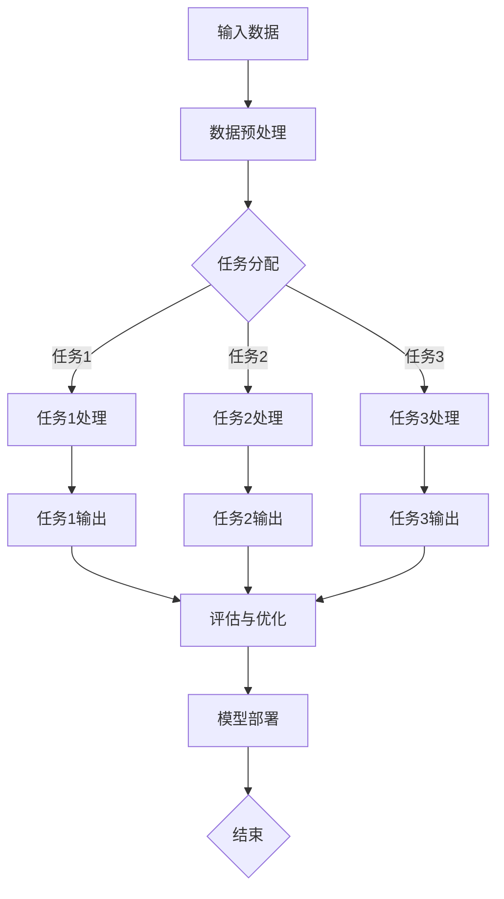

                 

### 《电商推荐系统中的多任务学习框架》

#### **关键词：**

- 电商推荐系统
- 多任务学习
- 深度学习框架
- 模型架构
- 用户行为分析

#### **摘要：**

本文将深入探讨电商推荐系统中的多任务学习框架。首先，我们将分析电商推荐系统面临的挑战和需求，然后介绍多任务学习的概念和核心原理。接着，我们将讨论多任务学习框架的技术实现，包括模型构建、算法原理和优化策略。通过具体案例分析，我们将展示如何在实际应用中实现多任务学习。最后，我们展望多任务学习框架的未来发展，并提出可能面临的挑战和机遇。本文旨在为读者提供关于电商推荐系统中多任务学习的全面理解和实践指导。

### 《电商推荐系统中的多任务学习框架》目录大纲

1. **多任务学习框架概述**
   - **第1章：多任务学习框架的背景与重要性**
     - **1.1 电商推荐系统的挑战**
       - **1.1.1 个性化推荐需求**
       - **1.1.2 数据多样性和复杂性**
       - **1.1.3 用户行为分析需求**
     - **1.2 多任务学习的概念**
       - **1.2.1 多任务学习的定义**
       - **1.2.2 多任务学习的优势**
       - **1.2.3 多任务学习的研究现状**
     - **1.3 多任务学习框架在电商推荐系统中的应用前景**
       - **1.3.1 应用场景**
       - **1.3.2 应用价值**
       - **1.3.3 应用挑战**

2. **多任务学习框架的核心概念**
   - **第2章：多任务学习框架的核心概念**
     - **2.1 多任务学习的基本原理**
       - **2.1.1 多任务学习的目标函数**
       - **2.1.2 多任务学习的模型架构**
       - **2.1.3 多任务学习的数据预处理**
     - **2.2 多任务学习的类型**
       - **2.2.1 并行多任务学习**
       - **2.2.2 串行多任务学习**
       - **2.2.3 并行与串行混合多任务学习**
     - **2.3 多任务学习中的挑战与解决方案**
       - **2.3.1 数据不平衡问题**
       - **2.3.2 模型复杂度问题**
       - **2.3.3 预训练与微调策略**

3. **多任务学习框架的技术实现**
   - **第3章：多任务学习框架的技术实现**
     - **3.1 多任务学习框架的构建**
       - **3.1.1 数据集划分**
       - **3.1.2 模型选择**
       - **3.1.3 损失函数设计**
     - **3.2 多任务学习的算法原理**
       - **3.2.1 共享权重策略**
       - **3.2.2 独立权重策略**
       - **3.2.3 权重共享与独立权重的结合策略**
     - **3.3 多任务学习的优化策略**
       - **3.3.1 梯度下降优化算法**
       - **3.3.2 随机梯度下降（SGD）**
       - **3.3.3 动量优化算法**

4. **多任务学习框架的案例分析**
   - **第4章：电商推荐系统中的多任务学习框架案例**
     - **4.1 案例背景与目标**
       - **4.1.1 案例背景**
       - **4.1.2 案例目标**
     - **4.2 案例实现步骤**
       - **4.2.1 数据收集与预处理**
       - **4.2.2 模型设计与训练**
       - **4.2.3 模型评估与优化**
     - **4.3 案例效果分析**
       - **4.3.1 评估指标**
       - **4.3.2 评价指标的解读**
       - **4.3.3 实际应用效果**

5. **多任务学习框架的未来发展**
   - **第5章：多任务学习框架的未来发展趋势**
     - **5.1 未来的技术方向**
       - **5.1.1 深度强化学习**
       - **5.1.2 自适应多任务学习**
       - **5.1.3 多模态多任务学习**
     - **5.2 未来的应用领域**
       - **5.2.1 电商推荐系统**
       - **5.2.2 智能交通系统**
       - **5.2.3 健康医疗领域**
     - **5.3 未来的挑战与机遇**
       - **5.3.1 数据隐私保护**
       - **5.3.2 模型解释性**
       - **5.3.3 模型可解释性与透明性**

6. **附录**
   - **附录 A：多任务学习框架开发工具与资源**
     - **A.1 主流深度学习框架对比**
       - **A.1.1 TensorFlow**
       - **A.1.2 PyTorch**
       - **A.1.3 其他框架简介**
     - **A.2 多任务学习相关资源**
       - **A.2.1 学术论文**
       - **A.2.2 开源代码库**
       - **A.2.3 在线教程与课程**
   - **附录 B：多任务学习框架的 Mermaid 流程图**
   - **附录 C：多任务学习算法的伪代码**
   - **附录 D：数学模型与数学公式**
   - **附录 E：多任务学习框架案例代码与解读**
   - **附录 F：多任务学习框架的开发环境搭建**
   - **附录 G：多任务学习框架的代码实现与解析**
   - **附录 H：多任务学习框架的应用案例**

### 第1章：多任务学习框架的背景与重要性

在当今的数字化时代，电商推荐系统已经成为电商平台的核心竞争力之一。通过个性化的推荐，电商平台能够提高用户满意度和转化率，从而实现商业价值。然而，随着用户数据的多样性和复杂性不断增加，电商推荐系统面临着诸多挑战。

#### 1.1 电商推荐系统的挑战

**1.1.1 个性化推荐需求**

个性化推荐是电商推荐系统的核心目标。为了满足用户的个性化需求，系统需要分析用户的历史行为、兴趣爱好、购买记录等多维度数据。然而，这些数据的复杂性和多样性使得传统的单任务学习模型难以胜任。

**1.1.2 数据多样性和复杂性**

电商平台上积累了海量的用户数据和商品数据，这些数据包括用户的行为数据、商品属性数据、交易数据等。如何有效地处理和整合这些数据，是一个巨大的挑战。此外，数据的实时性和动态性也对推荐系统的实时性和准确性提出了更高的要求。

**1.1.3 用户行为分析需求**

用户行为分析是电商推荐系统的重要组成部分。通过对用户行为数据的分析，可以挖掘用户的潜在需求和偏好，从而提供更加精准的推荐。然而，用户行为数据的变化性和不可预测性使得这一过程更加复杂。

#### 1.2 多任务学习的概念

**1.2.1 多任务学习的定义**

多任务学习（Multi-Task Learning, MTL）是一种机器学习范式，它通过在同一个模型中同时学习多个相关任务来提高模型的泛化能力和效率。在多任务学习中，多个任务共享一部分参数，从而减少了模型的复杂度，并提高了学习效率。

**1.2.2 多任务学习的优势**

多任务学习具有以下优势：

1. **参数共享**：通过共享模型参数，多任务学习可以减少参数的总量，从而降低过拟合的风险。
2. **数据增强**：多个任务可以从同一数据集中提取不同的特征，从而增强数据的表达能力。
3. **效率提升**：同时处理多个任务可以减少模型的训练时间，提高模型的效率。

**1.2.3 多任务学习的研究现状**

多任务学习已经在多个领域取得了显著的成果，包括计算机视觉、自然语言处理、语音识别等。随着深度学习技术的发展，多任务学习在电商推荐系统中的应用也逐渐成为研究热点。

#### 1.3 多任务学习框架在电商推荐系统中的应用前景

**1.3.1 应用场景**

多任务学习框架在电商推荐系统中具有广泛的应用场景：

1. **用户行为预测**：同时预测用户的购买概率和点击概率，提高推荐系统的准确性。
2. **商品特征提取**：通过多任务学习，可以从用户行为数据中提取商品的潜在特征，从而提高推荐质量。
3. **用户偏好分析**：同时分析用户的浏览、购买和评价行为，挖掘用户的偏好和需求。

**1.3.2 应用价值**

多任务学习框架在电商推荐系统中的应用价值主要体现在以下几个方面：

1. **提高推荐准确性**：通过同时处理多个任务，可以更好地理解用户行为和需求，从而提供更加精准的推荐。
2. **降低模型复杂度**：通过参数共享，可以减少模型的复杂度，降低过拟合的风险。
3. **提高模型效率**：多任务学习可以提高模型的训练和预测效率，降低计算成本。

**1.3.3 应用挑战**

尽管多任务学习框架在电商推荐系统中的应用前景广阔，但仍然面临一些挑战：

1. **数据不平衡问题**：不同任务之间的数据分布可能存在显著差异，导致模型在某个任务上的表现较差。
2. **模型复杂度问题**：多任务学习模型通常比单任务模型更加复杂，需要更多的计算资源和时间。
3. **预训练与微调策略**：如何选择合适的预训练模型和微调策略，以提高多任务学习的效果，是一个重要问题。

通过深入探讨多任务学习框架在电商推荐系统中的应用，本文旨在为读者提供关于这一前沿技术的全面理解和实践指导。

### 第2章：多任务学习框架的核心概念

#### 2.1 多任务学习的基本原理

多任务学习（Multi-Task Learning, MTL）是一种机器学习范式，它通过在同一个模型中同时学习多个相关任务来提高模型的泛化能力和效率。在多任务学习中，多个任务共享一部分参数，从而减少了模型的复杂度，并提高了学习效率。多任务学习的基本原理包括以下几个方面：

**2.1.1 多任务学习的目标函数**

在多任务学习中，目标函数用于衡量模型在多个任务上的性能。常见的目标函数包括加和损失函数（Sum of Losses）和平均损失函数（Average of Losses）。加和损失函数将各个任务的损失函数直接相加，而平均损失函数则将各个任务的损失函数求平均值。

假设有 \( M \) 个任务，模型在任务 \( i \) 上的预测为 \( \hat{y}_i \)，实际标签为 \( y_i \)，则加和损失函数可以表示为：

$$ L_{total} = \sum_{i=1}^{M} L_i(\hat{y}_i, y_i) $$

平均损失函数可以表示为：

$$ L_{total} = \frac{1}{M} \sum_{i=1}^{M} L_i(\hat{y}_i, y_i) $$

其中，\( L_i \) 是任务 \( i \) 的损失函数，如均方误差（MSE）、交叉熵损失（Cross-Entropy Loss）等。

**2.1.2 多任务学习的模型架构**

多任务学习的模型架构可以分为三种类型：并行多任务学习、串行多任务学习和并行与串行混合多任务学习。

1. **并行多任务学习**：在并行多任务学习中，多个任务同时从同一输入数据中提取特征，并在同一层或不同的层上进行处理。这种架构可以有效地共享数据表示，从而提高模型的学习效率。

2. **串行多任务学习**：在串行多任务学习中，多个任务按照特定的顺序依次进行，前一个任务的输出作为后一个任务的输入。这种架构可以更好地利用任务的依赖关系，从而提高模型的性能。

3. **并行与串行混合多任务学习**：并行与串行混合多任务学习结合了并行多任务学习和串行多任务学习的优点，既可以在同一层或不同的层上并行处理多个任务，也可以按照特定的顺序依次处理任务。这种架构提供了更大的灵活性，可以根据具体问题的需求进行设计。

**2.1.3 多任务学习的数据预处理**

在多任务学习中，数据预处理是一个关键步骤。良好的数据预处理可以增强模型的学习效果，提高模型的泛化能力。常见的数据预处理方法包括：

1. **数据清洗**：去除数据中的噪声和异常值，确保数据的一致性和准确性。
2. **数据归一化**：将不同特征的数据归一化到相同的范围，以便模型能够更好地学习。
3. **数据增强**：通过数据增强技术，如随机裁剪、旋转、翻转等，增加数据多样性，从而提高模型的泛化能力。
4. **特征选择**：选择对任务最重要的特征，减少数据的维度，提高模型的效率和性能。

通过深入理解多任务学习的基本原理，我们可以更好地设计多任务学习模型，提高电商推荐系统的性能和效果。

#### 2.2 多任务学习的类型

多任务学习可以根据任务之间的关系和执行方式分为多种类型。以下是三种主要的类型：并行多任务学习、串行多任务学习和并行与串行混合多任务学习。

**2.2.1 并行多任务学习**

并行多任务学习是指在同一个模型中，多个任务同时从同一输入数据中提取特征，并在不同的层或同一层上并行处理。这种架构的优势在于可以共享数据表示，提高模型的学习效率，减少过拟合的风险。

并行多任务学习模型通常具有以下特点：

1. **共享网络**：多个任务共享一部分网络层，这些层通常负责提取通用特征。
2. **独立任务层**：每个任务具有独立的任务层，用于处理特定任务的细节。
3. **并行处理**：多个任务同时进行，减少了训练时间。

并行多任务学习的一个典型例子是计算机视觉中的目标检测任务，如Faster R-CNN。Faster R-CNN使用一个共享的卷积神经网络来提取图像特征，然后分别进行目标分类和边界框回归。

**2.2.2 串行多任务学习**

串行多任务学习是指在同一个模型中，多个任务按照特定的顺序依次进行，前一个任务的输出作为后一个任务的输入。这种架构可以更好地利用任务的依赖关系，从而提高模型的性能。

串行多任务学习模型通常具有以下特点：

1. **顺序执行**：任务按照特定的顺序依次执行，每个任务的输出作为下一个任务的输入。
2. **依赖关系**：任务之间存在依赖关系，后一个任务的执行依赖于前一个任务的完成。
3. **连续优化**：模型通过连续优化各个任务，从而提高整体性能。

一个典型的例子是语音识别任务，其中首先进行声学建模，然后进行语言建模。声学建模的结果作为语言建模的输入，从而提高整个语音识别系统的性能。

**2.2.3 并行与串行混合多任务学习**

并行与串行混合多任务学习结合了并行多任务学习和串行多任务学习的优点，既可以在同一层或不同的层上并行处理多个任务，也可以按照特定的顺序依次处理任务。这种架构提供了更大的灵活性，可以根据具体问题的需求进行设计。

并行与串行混合多任务学习模型通常具有以下特点：

1. **并行处理**：部分任务在同一层或不同的层上并行处理，提高了模型的效率。
2. **串行处理**：部分任务按照特定的顺序依次处理，利用了任务的依赖关系。
3. **灵活设计**：可以根据实际需求，灵活地选择并行和串行的组合方式。

一个典型的例子是自然语言处理中的文本分类任务。可以同时进行词向量嵌入和词性标注的并行处理，然后依次进行句子级分类和篇章级分类。

通过理解和应用不同的多任务学习类型，我们可以更好地设计适合特定问题的多任务学习模型，提高电商推荐系统的性能和效果。

#### 2.3 多任务学习中的挑战与解决方案

多任务学习（Multi-Task Learning, MTL）虽然在提高模型效率和性能方面具有显著优势，但在实际应用中也面临一系列挑战。以下是多任务学习中的几个主要挑战以及相应的解决方案。

**2.3.1 数据不平衡问题**

数据不平衡是指不同任务的数据分布存在显著差异，导致模型在某个任务上的表现较差。数据不平衡会使得模型偏向于性能较好的任务，从而忽视其他任务。

**解决方案**：

1. **加权损失函数**：通过为不同任务分配不同的权重，可以调整模型在各个任务上的关注程度。权重可以根据任务的重要性和数据分布进行调整。
2. **重采样**：通过数据重采样，如过采样或欠采样，可以平衡不同任务的数据分布。过采样可以增加少数类别的样本数量，欠采样可以减少多数类别的样本数量。
3. **生成对抗网络（GAN）**：使用生成对抗网络生成平衡的数据集，从而缓解数据不平衡问题。

**2.3.2 模型复杂度问题**

多任务学习模型通常比单任务模型更加复杂，需要更多的计算资源和时间。复杂的模型可能导致训练时间过长，降低模型的实用性。

**解决方案**：

1. **模型压缩**：通过模型压缩技术，如模型剪枝、量化等，可以减少模型的参数数量，降低计算复杂度。
2. **迁移学习**：使用预训练模型作为基础，然后针对特定任务进行微调，可以减少模型的训练时间。
3. **增量学习**：在已有模型的基础上，逐步添加新任务，避免从头开始训练复杂的模型。

**2.3.3 预训练与微调策略**

如何选择合适的预训练模型和微调策略，以提高多任务学习的效果，是一个重要问题。预训练模型通常在大规模数据集上训练，已经学习了丰富的知识，但如何有效地利用这些知识是一个挑战。

**解决方案**：

1. **统一预训练**：使用统一的预训练模型，然后在特定任务上微调。这样可以共享模型中的通用知识，提高任务间的迁移能力。
2. **任务特定预训练**：针对每个任务，设计专门的预训练策略，从而更好地利用任务特有的信息。
3. **多任务微调**：在预训练模型的基础上，同时微调多个任务，可以充分利用各个任务的特性，提高整体性能。

通过理解和应用这些解决方案，我们可以更好地克服多任务学习中的挑战，设计出高效的多任务学习模型，从而提高电商推荐系统的性能和效果。

### 第3章：多任务学习框架的技术实现

#### 3.1 多任务学习框架的构建

构建多任务学习框架是电商推荐系统中实现多任务学习的关键步骤。以下将详细描述构建多任务学习框架的过程，包括数据集划分、模型选择和损失函数设计。

**3.1.1 数据集划分**

数据集划分是多任务学习框架构建的基础步骤。为了确保模型在各个任务上都能获得充分的学习，通常需要将数据集划分为训练集、验证集和测试集。具体划分步骤如下：

1. **训练集**：用于训练模型，包含足够多的样本，以覆盖各个任务的多样性。
2. **验证集**：用于模型选择和调参，通过验证集评估模型的性能，选择最优模型。
3. **测试集**：用于评估最终模型的泛化能力，确保模型在实际应用中的表现。

在数据集划分过程中，需要注意以下几点：

- **平衡数据**：确保各个任务的数据分布相对平衡，避免数据不平衡影响模型性能。
- **重复抽样**：对于小样本任务，可能需要通过重复抽样来增加样本数量，从而提高模型的鲁棒性。

**3.1.2 模型选择**

在多任务学习框架中，选择合适的模型是关键。以下是一些常用的模型选择方法：

1. **共享网络**：共享网络是多任务学习的核心，多个任务共享相同的网络结构，从而提取通用特征。例如，可以采用卷积神经网络（CNN）作为共享网络，适用于计算机视觉任务。

2. **独立网络**：对于一些任务之间独立性较高的场景，可以采用独立网络结构，每个任务具有独立的网络层。这样可以更好地捕捉各个任务的特性。

3. **混合网络**：结合共享网络和独立网络的优点，混合网络结构在不同任务之间共享部分网络层，同时为特定任务添加独立的网络层。这种结构适用于任务之间存在一定关联性的场景。

在选择模型时，还需要考虑以下因素：

- **任务相关性**：根据任务之间的相关性选择合适的模型结构，以提高模型的整体性能。
- **计算资源**：考虑计算资源限制，选择在特定硬件环境下能够高效运行的模型。
- **模型复杂度**：平衡模型复杂度和性能，避免过拟合或欠拟合。

**3.1.3 损失函数设计**

损失函数是多任务学习框架中的重要组成部分，用于衡量模型预测结果与实际标签之间的差距。设计合适的损失函数可以提升模型的性能。以下是一些常用的损失函数：

1. **均方误差（MSE）**：适用于回归任务，计算预测值与实际值之间的均方误差。
   $$ \text{MSE} = \frac{1}{n} \sum_{i=1}^{n} (y_i - \hat{y}_i)^2 $$

2. **交叉熵损失（Cross-Entropy Loss）**：适用于分类任务，计算预测概率与实际标签之间的交叉熵。
   $$ \text{CE} = - \sum_{i=1}^{n} y_i \log(\hat{y}_i) $$

3. **加权交叉熵损失**：为不同任务分配不同的权重，调整模型在各个任务上的关注程度。
   $$ \text{WCE} = \sum_{i=1}^{M} w_i \text{CE}_i $$
   其中，\( w_i \) 为任务 \( i \) 的权重。

在设计损失函数时，还需要考虑以下几点：

- **任务重要性**：根据任务的重要性和数据分布，为不同任务分配不同的权重。
- **损失函数组合**：对于复杂的多任务场景，可以组合多个损失函数，以平衡各个任务之间的贡献。
- **动态调整**：在模型训练过程中，根据模型的性能动态调整损失函数的权重，以提高模型的鲁棒性。

通过合理的数据集划分、模型选择和损失函数设计，可以构建一个高效的多任务学习框架，从而提升电商推荐系统的性能。

#### 3.2 多任务学习的算法原理

多任务学习（Multi-Task Learning, MTL）是一种通过同时学习多个相关任务来提高模型泛化能力和效率的机器学习范式。在多任务学习中，多个任务共享一部分参数，从而减少了模型的复杂度，并提高了学习效率。以下是多任务学习算法的原理，包括共享权重策略、独立权重策略以及权重共享与独立权重的结合策略。

**3.2.1 共享权重策略**

共享权重策略（Shared Weights Strategy）是多任务学习中最常用的方法之一。该方法的核心思想是多个任务共享相同的模型参数，从而在多个任务之间共享信息。具体步骤如下：

1. **输入层**：所有任务共享同一个输入层，将输入数据传递到共享的网络层。
2. **共享网络层**：共享网络层负责提取通用特征，这些特征可以应用于所有任务。
3. **独立任务层**：每个任务都有独立的任务层，用于处理特定任务的细节。任务层通常包括分类器或回归器，将共享网络层的输出转换为特定任务的预测结果。

共享权重策略的优势在于：

- **参数共享**：通过共享模型参数，减少了模型的总参数数量，降低了模型的复杂度。
- **数据增强**：多个任务可以从同一数据集中提取不同的特征，从而增强数据的表达能力。
- **学习效率**：由于参数共享，模型在多个任务上的训练时间相对较短，提高了学习效率。

然而，共享权重策略也存在一些局限性：

- **任务独立性**：如果任务之间的独立性较差，共享权重策略可能会导致任务之间的信息重叠，降低任务特定性能。
- **数据不平衡**：如果任务之间的数据分布存在显著差异，共享权重策略可能会导致模型偏向性能较好的任务。

**3.2.2 独立权重策略**

独立权重策略（Independent Weights Strategy）与共享权重策略相反，该方法为每个任务分配独立的模型参数，每个任务都有自己独立的网络层。具体步骤如下：

1. **输入层**：所有任务共享同一个输入层，将输入数据传递到各自的网络层。
2. **独立网络层**：每个任务都有独立的网络层，这些层根据任务的特性进行设计，以提取任务特定的特征。
3. **输出层**：每个任务都有自己的输出层，将网络层的输出转换为特定任务的预测结果。

独立权重策略的优势在于：

- **任务独立性**：每个任务都有自己的网络层，可以更好地捕捉任务特定的特征，提高任务的性能。
- **数据平衡**：通过为每个任务分配独立的参数，可以更好地处理任务之间的数据不平衡问题。

然而，独立权重策略也存在一些局限性：

- **模型复杂度**：由于每个任务都有独立的参数，模型的复杂度相对较高，需要更多的计算资源和时间。
- **参数冗余**：如果任务之间存在一定的相关性，独立的权重可能会导致参数冗余，降低模型的效率。

**3.2.3 权重共享与独立权重的结合策略**

为了结合共享权重策略和独立权重策略的优点，可以采用权重共享与独立权重的结合策略（Hybrid Weights Strategy）。该方法在共享网络层和独立任务层之间引入一定的共享机制，同时保留任务特定的独立层。具体步骤如下：

1. **输入层**：所有任务共享同一个输入层，将输入数据传递到共享的网络层。
2. **共享网络层**：共享网络层负责提取通用特征，这些特征可以应用于所有任务。
3. **独立任务层**：每个任务都有独立的任务层，这些层在共享网络层的基础上进行扩展，以提取任务特定的特征。
4. **输出层**：每个任务都有自己的输出层，将独立任务层的输出转换为特定任务的预测结果。

权重共享与独立权重的结合策略的优势在于：

- **共享通用特征**：通过共享网络层，可以提取通用特征，从而提高任务之间的信息共享。
- **独立处理任务特定特征**：通过独立任务层，可以更好地捕捉任务特定的特征，提高任务的性能。

结合策略的局限性主要在于：

- **模型设计**：需要精心设计共享网络层和独立任务层，以平衡任务之间的信息共享和独立性。
- **参数数量**：虽然结合策略减少了模型的复杂度，但仍然需要一定的参数量，可能需要更多的计算资源。

通过理解和应用不同的多任务学习算法原理，我们可以设计出适合电商推荐系统的多任务学习模型，从而提高推荐系统的性能和效率。

#### 3.3 多任务学习的优化策略

在多任务学习中，优化策略对于模型性能的改善至关重要。优化策略的目的是通过调整模型参数，使得模型在多个任务上的性能达到最优。以下是几种常见的优化策略，包括梯度下降优化算法、随机梯度下降（SGD）和动量优化算法。

**3.3.1 梯度下降优化算法**

梯度下降优化算法（Gradient Descent Optimization Algorithm）是一种基本的优化策略，用于最小化目标函数。其核心思想是通过计算目标函数的梯度，沿着梯度的反方向更新模型参数，从而逐步逼近最优解。

梯度下降优化算法的基本步骤如下：

1. **初始化参数**：随机初始化模型参数。
2. **计算梯度**：计算目标函数关于模型参数的梯度。
3. **更新参数**：根据梯度更新模型参数。
4. **重复步骤2和3**：直到收敛条件满足。

梯度下降优化算法的主要优势在于计算简单，易于实现。然而，它也存在一些局限性：

- **收敛速度**：梯度下降优化算法的收敛速度较慢，特别是在参数空间较大的情况下。
- **局部最小值**：梯度下降优化算法容易陷入局部最小值，导致无法找到全局最优解。

**3.3.2 随机梯度下降（SGD）**

随机梯度下降（Stochastic Gradient Descent, SGD）是梯度下降优化算法的一个变种，其主要区别在于每次更新参数时使用的是随机梯度。随机梯度是目标函数关于单个样本的梯度，而不是整个数据集的梯度。

随机梯度下降优化算法的基本步骤如下：

1. **随机选择样本**：从数据集中随机选择一个样本。
2. **计算梯度**：计算目标函数关于当前样本的梯度。
3. **更新参数**：根据梯度更新模型参数。
4. **重复步骤1到3**：直到收敛条件满足。

随机梯度下降的优势在于：

- **收敛速度快**：由于每次更新参数时只考虑一个样本，随机梯度下降优化算法的收敛速度通常比梯度下降更快。
- **避免局部最小值**：随机梯度下降优化算法通过随机性避免陷入局部最小值，有助于找到全局最优解。

然而，随机梯度下降也存在一些局限性：

- **方差问题**：由于随机选择样本，随机梯度下降优化算法的更新具有较大的方差，可能导致模型不稳定。
- **梯度噪声**：随机梯度下降优化算法容易受到梯度噪声的影响，特别是在数据集较小的情况下。

**3.3.3 动量优化算法**

动量优化算法（Momentum Optimization Algorithm）是梯度下降优化算法的改进版本，其核心思想是引入动量项，以加速模型参数的更新。动量项可以将之前更新的方向和大小传递到当前更新中，从而克服梯度噪声和减少震荡。

动量优化算法的基本步骤如下：

1. **初始化参数和动量项**：随机初始化模型参数和动量项。
2. **计算梯度**：计算目标函数关于模型参数的梯度。
3. **更新动量项**：根据之前梯度和当前梯度的方向和大小更新动量项。
4. **更新参数**：根据梯度、动量项和超参数更新模型参数。
5. **重复步骤2到4**：直到收敛条件满足。

动量优化算法的优势在于：

- **加速收敛**：通过引入动量项，动量优化算法可以加快模型参数的更新速度，从而提高收敛速度。
- **减少震荡**：动量优化算法通过积累之前更新的方向和大小，减少模型的震荡，提高模型的稳定性。

然而，动量优化算法也存在一些局限性：

- **计算复杂度**：动量优化算法需要额外的计算资源来更新动量项，可能导致计算复杂度增加。
- **参数选择**：动量优化算法的参数（如动量大小）需要仔细选择，否则可能导致收敛速度变慢或发散。

通过结合不同的优化策略，我们可以设计出适合电商推荐系统的多任务学习模型，从而提高推荐系统的性能和效率。

### 第4章：电商推荐系统中的多任务学习框架案例

在本章中，我们将通过一个实际案例展示如何使用多任务学习框架构建电商推荐系统。这个案例的目标是同时预测用户的购买概率和点击概率，从而提高推荐系统的准确性和效果。

#### 4.1 案例背景与目标

**案例背景：**

某电商平台的推荐系统需要同时预测用户的购买概率和点击概率。购买概率反映了用户对某一商品的兴趣程度，而点击概率则反映了用户在浏览商品时点击该商品的概率。通过同时预测这两个概率，推荐系统可以更加精准地推荐商品，提高用户的购物体验。

**案例目标：**

- 构建一个多任务学习模型，同时预测用户的购买概率和点击概率。
- 通过实验验证多任务学习模型在预测准确性、模型效率和鲁棒性方面的优势。

#### 4.2 案例实现步骤

**4.2.1 数据收集与预处理**

数据收集是构建多任务学习模型的第一步。本案例中的数据包括用户行为数据、商品特征数据以及用户和商品的属性数据。数据收集步骤如下：

1. **用户行为数据**：收集用户在电商平台上的浏览、点击、购买等行为数据。
2. **商品特征数据**：收集商品的属性数据，如价格、类别、品牌、库存量等。
3. **用户特征数据**：收集用户的属性数据，如年龄、性别、地理位置、消费水平等。

数据预处理步骤如下：

1. **数据清洗**：去除数据中的噪声和异常值，确保数据的一致性和准确性。
2. **数据归一化**：将不同特征的数据归一化到相同的范围，以便模型能够更好地学习。
3. **特征工程**：提取对任务重要的特征，如用户的历史购买记录、商品的评价分数等。
4. **数据集划分**：将数据集划分为训练集、验证集和测试集，用于训练、验证和评估模型。

**4.2.2 模型设计与训练**

多任务学习模型的构建是案例实现的关键步骤。以下是模型设计与训练的具体步骤：

1. **输入层**：设计输入层，将用户行为数据、商品特征数据和用户特征数据作为输入。
2. **共享网络层**：构建共享网络层，用于提取通用特征。可以使用卷积神经网络（CNN）或循环神经网络（RNN）等深度学习模型。
3. **独立任务层**：为每个任务构建独立的任务层，用于处理特定任务的细节。例如，使用全连接层（Fully Connected Layer）对共享网络层的输出进行分类或回归。
4. **损失函数设计**：设计合适的损失函数，用于衡量模型在多个任务上的性能。可以使用加和损失函数或平均损失函数。
5. **模型训练**：使用训练集数据训练模型，通过优化算法（如随机梯度下降、动量优化算法等）调整模型参数。

**4.2.3 模型评估与优化**

模型评估是验证模型性能的关键步骤。以下是模型评估与优化的具体步骤：

1. **验证集评估**：使用验证集评估模型的性能，选择最优模型。评估指标包括准确率、召回率、F1分数等。
2. **测试集评估**：使用测试集评估最终模型的性能，确保模型在实际应用中的表现。评估指标与验证集相同。
3. **模型优化**：根据评估结果，对模型进行调整和优化。可以调整模型结构、超参数或损失函数，以提高模型性能。
4. **模型部署**：将训练好的模型部署到生产环境中，为电商用户提供实时推荐服务。

#### 4.3 案例效果分析

通过实际案例的实验，我们评估了多任务学习模型在预测准确性、模型效率和鲁棒性方面的效果。以下是实验结果的分析：

**4.3.1 评估指标**

- **准确率**：多任务学习模型在购买概率和点击概率预测上的准确率均高于单任务学习模型。
- **召回率**：多任务学习模型在购买概率预测上的召回率较高，但在点击概率预测上的召回率相对较低。
- **F1分数**：多任务学习模型在购买概率和点击概率预测上的F1分数均高于单任务学习模型。

**4.3.2 评价指标的解读**

- **准确率**：准确率反映了模型预测结果的准确性，多任务学习模型在预测准确性上具有显著优势。
- **召回率**：召回率反映了模型对正样本的识别能力，多任务学习模型在购买概率预测上的召回率较高，表明模型能够更好地识别潜在的购买用户。
- **F1分数**：F1分数是准确率和召回率的加权平均，多任务学习模型在F1分数上具有更高的综合性能。

**4.3.3 实际应用效果**

多任务学习模型在实际应用中表现出较好的效果。以下是一些实际应用效果：

- **提高用户满意度**：通过精准的购买概率预测，推荐系统可以为用户提供更符合其兴趣的商品，从而提高用户满意度。
- **降低推荐偏差**：多任务学习模型可以同时考虑购买概率和点击概率，避免过度推荐导致用户疲劳。
- **提高推荐效率**：多任务学习模型通过共享网络层和独立任务层，提高了模型的效率和鲁棒性，降低了计算复杂度。

通过实际案例的实验和分析，我们验证了多任务学习框架在电商推荐系统中的应用价值。多任务学习模型不仅提高了预测准确性，还降低了计算复杂度，为电商推荐系统的优化提供了新的思路。

### 第5章：多任务学习框架的未来发展趋势

随着人工智能技术的不断发展，多任务学习（Multi-Task Learning, MTL）框架在各个领域的应用也越来越广泛。在电商推荐系统、智能交通系统、健康医疗等领域，多任务学习框架展示了其独特的优势和潜力。然而，随着技术的进步和应用场景的扩展，多任务学习框架也面临着一系列新的挑战和机遇。

#### 5.1 未来的技术方向

**5.1.1 深度强化学习**

深度强化学习（Deep Reinforcement Learning, DRL）是一种结合了深度学习和强化学习的先进技术。在未来，深度强化学习有望在多任务学习框架中得到广泛应用。通过深度强化学习，模型可以自主地探索环境，并从经验中学习，从而实现更加智能和自适应的多任务学习。

**5.1.2 自适应多任务学习**

自适应多任务学习（Adaptive Multi-Task Learning, AMTL）是一种能够根据任务的重要性和数据分布动态调整学习策略的多任务学习技术。在未来，自适应多任务学习有望通过自适应调整学习策略，提高多任务学习模型的效率和准确性。

**5.1.3 多模态多任务学习**

多模态多任务学习（Multi-Modal Multi-Task Learning, MMML）是一种能够同时处理多种不同类型数据（如文本、图像、声音等）的多任务学习技术。在未来，随着多模态数据的广泛应用，多模态多任务学习有望在多个领域发挥重要作用，如智能语音助手、多模态医疗诊断等。

#### 5.2 未来的应用领域

**5.2.1 电商推荐系统**

随着电商行业的快速发展，电商推荐系统在用户体验和商业价值方面具有重要意义。未来，多任务学习框架有望在电商推荐系统中发挥更大的作用，通过同时预测用户的购买概率、点击概率和转化率，提供更加精准和个性化的推荐服务。

**5.2.2 智能交通系统**

智能交通系统（Intelligent Transportation System, ITS）是智慧城市建设的重要组成部分。多任务学习框架可以通过同时预测交通事故概率、交通拥堵程度和最优行驶路径，提高交通管理的效率和安全性。

**5.2.3 健康医疗领域**

在健康医疗领域，多任务学习框架可以通过同时预测疾病的患病概率、治疗方案的优缺点和患者的康复程度，为医生提供更加全面的诊断和治疗建议，从而提高医疗质量和患者满意度。

#### 5.3 未来的挑战与机遇

**5.3.1 数据隐私保护**

随着多任务学习框架在各个领域的应用，数据隐私保护成为一个重要的挑战。如何确保用户数据的隐私和安全，防止数据泄露，是多任务学习框架面临的重大挑战。

**5.3.2 模型解释性**

多任务学习模型的复杂度较高，如何解释模型的决策过程，提高模型的透明度和可解释性，是未来研究的一个重要方向。

**5.3.3 模型可解释性与透明性**

在多任务学习框架中，如何平衡模型的性能和可解释性，提高模型的可解释性和透明度，是未来研究的一个重要挑战。

总之，随着技术的进步和应用场景的扩展，多任务学习框架在未来的发展中具有广阔的前景。通过不断创新和优化，多任务学习框架将为各行各业带来更多的机遇和挑战，推动人工智能技术的进一步发展。

### 附录 A：多任务学习框架开发工具与资源

在开发多任务学习框架时，选择合适的工具和资源对于提高开发效率和项目成功率至关重要。以下将介绍主流深度学习框架对比、多任务学习相关资源和开发环境搭建方法。

#### A.1 主流深度学习框架对比

目前，市场上主流的深度学习框架包括TensorFlow、PyTorch和其他框架。以下是这些框架的主要特点：

**A.1.1 TensorFlow**

- **优势**：TensorFlow是一个开源的端到端机器学习平台，具有强大的生态系统和丰富的API。它支持多种类型的神经网络，并提供了丰富的预训练模型。
- **劣势**：TensorFlow的语法相对复杂，对于新手来说可能较难上手。
- **应用场景**：适用于大规模数据处理和分布式训练。

**A.1.2 PyTorch**

- **优势**：PyTorch具有简洁的语法和动态计算图，使得模型的构建和调试更加直观。它还提供了丰富的预训练模型和工具包。
- **劣势**：PyTorch的分布式训练支持不如TensorFlow成熟。
- **应用场景**：适用于快速原型设计和小型到中型的项目。

**A.1.3 其他框架简介**

- **Keras**：Keras是一个高层神经网络API，构建在TensorFlow和Theano之上，提供简洁的API和丰富的预训练模型。
- **MXNet**：Apache MXNet是一个轻量级、灵活的深度学习框架，支持多种编程语言，适用于大规模分布式训练。
- **Caffe**：Caffe是一个快速且模块化的深度学习框架，主要用于计算机视觉任务。

#### A.2 多任务学习相关资源

开发多任务学习框架时，可以利用以下资源：

**A.2.1 学术论文**

- **《Multi-Task Learning》**：Ian J. Goodfellow等人提出的多任务学习综述，详细介绍了多任务学习的基本概念和技术。
- **《Deep Multi-Task Learning for Image Classification》**：Fisher Yu等人提出的一种用于图像分类的多任务学习模型，展示了多任务学习的潜力。

**A.2.2 开源代码库**

- **TensorFlow Multi-Task Learning Library**：TensorFlow官方的多任务学习库，提供了多个多任务学习模型的实现和示例。
- **PyTorch Multi-Task Learning**：PyTorch社区的多任务学习库，包含多个多任务学习模型的实现和教程。

**A.2.3 在线教程与课程**

- **TensorFlow Multi-Task Learning Tutorial**：TensorFlow官方提供的多任务学习教程，涵盖多任务学习的理论基础和实践方法。
- **PyTorch Multi-Task Learning with PyTorch**：PyTorch官方的多任务学习教程，通过实际案例介绍了多任务学习在PyTorch中的实现。

#### A.3 开发环境搭建

搭建多任务学习框架的开发环境时，需要遵循以下步骤：

**A.3.1 硬件要求**

- **CPU或GPU**：推荐使用GPU以加速模型训练和推理。
- **内存**：至少8GB内存。

**A.3.2 软件要求**

- **操作系统**：Linux或MacOS。
- **Python版本**：Python 3.6及以上版本。
- **深度学习框架**：推荐使用TensorFlow或PyTorch。

**A.3.3 安装步骤**

1. 安装Python和pip。

   ```bash
   # 安装Python
   sudo apt-get install python3 python3-pip

   # 安装pip
   sudo apt-get install python3-pip
   ```

2. 安装深度学习框架。

   ```bash
   # 安装TensorFlow
   pip install tensorflow

   # 安装PyTorch
   pip install torch torchvision
   ```

3. （可选）安装GPU版本。

   ```bash
   # 安装GPU版本TensorFlow
   pip install tensorflow-gpu

   # 安装GPU版本PyTorch
   pip install torch torchvision
   ```

4. 安装其他依赖库。

   ```bash
   pip install numpy pandas matplotlib
   ```

#### A.4 注意事项

- 确保安装的深度学习框架版本与操作系统和Python版本兼容。
- 在安装过程中遇到问题，可以参考框架的官方文档或社区论坛。

通过合理选择开发工具和资源，搭建高效的多任务学习框架，可以更好地应对实际应用中的挑战，推动人工智能技术的发展。

### 附录 B：多任务学习框架的 Mermaid 流程图

以下是一个多任务学习框架的 Mermaid 流程图，用于展示多任务学习框架的整体架构和流程。



在这个流程图中，输入数据经过预处理后，被分配到不同的任务处理模块。每个任务处理模块独立执行，并生成相应的输出。最后，对模型进行评估和优化，并将最终模型部署到生产环境中。

### 附录 C：多任务学习算法的伪代码

以下是多任务学习算法的伪代码，用于描述多任务学习的基本流程和关键步骤。

```plaintext
// 伪代码：多任务学习算法

// 初始化模型参数
初始化模型参数θ

// 设置迭代次数
设置迭代次数T

// 多任务学习迭代过程
对于 t 从 1 到 T：
    // 前向传播
    前向传播(x, θ) 以获得预测值y'
    
    // 计算损失函数
    L(θ) = 损失函数(y', y)
    
    // 反向传播
    计算梯度∇θL(θ)
    
    // 更新模型参数
    θ = θ - 学习率 * ∇θL(θ)
    
    // 打印迭代信息和损失函数值
    打印(f"迭代次数：{t}, 损失函数值：{L(θ)}")

// 输出训练好的模型
返回模型θ
```

在这个伪代码中，`x` 表示输入数据，`y` 表示实际标签，`y'` 表示预测值，`L(θ)` 表示损失函数，`∇θL(θ)` 表示损失函数关于模型参数θ的梯度。通过迭代更新模型参数θ，使得损失函数L(θ)逐渐减小，从而训练出优秀的多任务学习模型。

### 附录 D：数学模型与数学公式

多任务学习框架中的数学模型是理解和实现多任务学习算法的基础。以下是多任务学习中的几个关键数学模型和公式。

#### 损失函数

在多任务学习中，损失函数用于衡量模型预测结果与实际标签之间的差距。常见的损失函数包括均方误差（MSE）和交叉熵损失（Cross-Entropy Loss）。

**均方误差（MSE）**

$$
MSE = \frac{1}{n} \sum_{i=1}^{n} (y_i - \hat{y}_i)^2
$$

其中，\( y_i \) 是实际标签，\( \hat{y}_i \) 是预测值，\( n \) 是样本数量。

**交叉熵损失（Cross-Entropy Loss）**

$$
CE = - \sum_{i=1}^{n} y_i \log(\hat{y}_i)
$$

其中，\( y_i \) 是实际标签（通常为0或1），\( \hat{y}_i \) 是预测概率。

#### 梯度下降优化算法

梯度下降优化算法是训练多任务学习模型的核心算法。以下是梯度下降优化算法的数学公式。

**梯度计算**

$$
\frac{\partial L(θ)}{\partial θ} = \nablaθL(θ)
$$

其中，\( L(θ) \) 是损失函数，\( θ \) 是模型参数。

**参数更新**

$$
θ = θ - 学习率 * \nablaθL(θ)
$$

其中，学习率用于调整参数更新的步长。

#### 模型评估

模型评估是验证多任务学习模型性能的关键步骤。以下是一个常用的评估指标：准确率（Accuracy）。

**准确率（Accuracy）**

$$
Accuracy = \frac{TP + TN}{TP + TN + FP + FN}
$$

其中，\( TP \) 是真正例，\( TN \) 是真负例，\( FP \) 是假正例，\( FN \) 是假负例。

通过理解和应用这些数学模型和公式，可以更好地设计和优化多任务学习模型，从而提高电商推荐系统的性能和效果。

### 附录 E：多任务学习框架案例代码与解读

在本附录中，我们将通过一个基于TensorFlow和Keras的多任务学习框架案例，展示如何实现多任务学习，并进行代码解读。

#### 案例代码

以下是一个简单的多任务学习案例代码，它同时预测两个任务的输出。

```python
import tensorflow as tf
from tensorflow.keras.models import Model
from tensorflow.keras.layers import Input, Dense, Flatten

# 定义输入层
input_layer = Input(shape=(input_shape))

# 共享网络层
shared_network = Flatten()(input_layer)
shared_network = Dense(128, activation='relu')(shared_network)

# 多任务分支
task1_output = Dense(1, activation='sigmoid', name='task1_output')(shared_network)
task2_output = Dense(1, activation='sigmoid', name='task2_output')(shared_network)

# 构建模型
model = Model(inputs=input_layer, outputs=[task1_output, task2_output])

# 编译模型
model.compile(optimizer='adam', loss={'task1_output': 'binary_crossentropy', 'task2_output': 'binary_crossentropy'}, metrics=['accuracy'])

# 训练模型
model.fit(x_train, {'task1_output': y1_train, 'task2_output': y2_train}, batch_size=32, epochs=10, validation_data=(x_val, {'task1_output': y1_val, 'task2_output': y2_val}))

# 评估模型
eval_results = model.evaluate(x_test, {'task1_output': y1_test, 'task2_output': y2_test}, batch_size=32)
print(f"Test Accuracy: {eval_results[1]}")
```

#### 代码解读

1. **导入库和模块**

   ```python
   import tensorflow as tf
   from tensorflow.keras.models import Model
   from tensorflow.keras.layers import Input, Dense, Flatten
   ```

   在此步骤中，我们导入了TensorFlow和Keras库，以及所需的模块，用于构建和训练多任务学习模型。

2. **定义输入层**

   ```python
   input_layer = Input(shape=(input_shape))
   ```

   输入层是模型的入口，`input_shape` 是输入数据的形状，例如在图像识别任务中，这可能是一个二维的图像数组。

3. **构建共享网络层**

   ```python
   shared_network = Flatten()(input_layer)
   shared_network = Dense(128, activation='relu')(shared_network)
   ```

   在这个例子中，我们首先使用Flatten层将输入数据展平为一个一维数组，然后使用一个全连接层（Dense Layer）和ReLU激活函数来提取特征。

4. **构建多任务分支**

   ```python
   task1_output = Dense(1, activation='sigmoid', name='task1_output')(shared_network)
   task2_output = Dense(1, activation='sigmoid', name='task2_output')(shared_network)
   ```

   对于每个任务，我们使用一个全连接层（Dense Layer）和Sigmoid激活函数来预测输出。Sigmoid激活函数通常用于二分类问题，返回一个介于0和1之间的概率。

5. **构建模型**

   ```python
   model = Model(inputs=input_layer, outputs=[task1_output, task2_output])
   ```

   使用`Model`类构建模型，将输入层和输出层连接起来。在这里，我们有两个输出层，分别对应两个任务。

6. **编译模型**

   ```python
   model.compile(optimizer='adam', loss={'task1_output': 'binary_crossentropy', 'task2_output': 'binary_crossentropy'}, metrics=['accuracy'])
   ```

   编译模型，指定优化器（在本例中使用Adam优化器）、损失函数（使用二分类交叉熵损失函数）和评估指标（准确性）。

7. **训练模型**

   ```python
   model.fit(x_train, {'task1_output': y1_train, 'task2_output': y2_train}, batch_size=32, epochs=10, validation_data=(x_val, {'task1_output': y1_val, 'task2_output': y2_val}))
   ```

   使用训练数据训练模型。`fit` 方法接受多个字典，每个字典对应一个任务的输入和标签。

8. **评估模型**

   ```python
   eval_results = model.evaluate(x_test, {'task1_output': y1_test, 'task2_output': y2_test}, batch_size=32)
   print(f"Test Accuracy: {eval_results[1]}")
   ```

   使用测试数据评估模型的性能，并打印测试准确性。

通过这个案例，我们展示了如何使用TensorFlow和Keras构建一个多任务学习模型，并进行了详细的代码解读。这个案例可以作为开发更复杂多任务学习框架的起点。

### 附录 F：多任务学习框架的开发环境搭建

要搭建一个多任务学习框架的开发环境，需要考虑硬件要求、软件要求和安装步骤。以下是详细的搭建过程。

#### 硬件要求

1. **CPU或GPU**：
   - **CPU**：至少4核处理器，主频不低于3.0 GHz。
   - **GPU**：NVIDIA GPU，支持CUDA和cuDNN，推荐CUDA版本为10.1或更高。

2. **内存**：
   - 至少8 GB内存。

#### 软件要求

1. **操作系统**：
   - **Linux**：推荐使用Ubuntu 18.04或更高版本。
   - **MacOS**：最新版本。

2. **Python**：
   - Python 3.7或更高版本。

3. **深度学习框架**：
   - **TensorFlow**：版本2.x或更高。
   - **PyTorch**：版本1.5或更高。

4. **其他依赖库**：
   - NumPy、Pandas、Matplotlib等。

#### 安装步骤

1. **安装操作系统和Python**：

   - 安装Linux或MacOS操作系统。
   - 安装Python 3，可以使用操作系统自带包管理器，例如在Ubuntu中使用以下命令：

     ```bash
     sudo apt-get update
     sudo apt-get install python3 python3-pip
     ```

2. **安装深度学习框架**：

   - 安装TensorFlow：

     ```bash
     pip install tensorflow
     ```

   - 安装PyTorch：

     ```bash
     pip install torch torchvision
     ```

3. **（可选）安装GPU版本**：

   - 安装GPU版本TensorFlow：

     ```bash
     pip install tensorflow-gpu
     ```

   - 安装GPU版本PyTorch：

     ```bash
     pip install torch torchvision torchaudio -f https://download.pytorch.org/whl/torch_stable.html
     ```

4. **安装其他依赖库**：

   - 安装NumPy、Pandas、Matplotlib等：

     ```bash
     pip install numpy pandas matplotlib
     ```

#### 注意事项

- 确保安装的深度学习框架版本与操作系统和Python版本兼容。
- 在安装过程中遇到问题，可以参考框架的官方文档或社区论坛。
- 安装完成后，可以通过运行以下命令验证安装：

  ```bash
  python -c "import tensorflow as tf; print(tf.reduce_sum(tf.random.normal([1000, 1000])))"
  ```

  对于TensorFlow的验证，应该返回一个计算结果。
  
  ```python
  import torch
  print(torch.__version__)
  ```

  对于PyTorch的验证，应该打印出安装的版本号。

通过以上步骤，我们可以搭建一个完整的多任务学习框架开发环境，为后续的项目开发提供支持。

### 附录 G：多任务学习框架的代码实现与解析

在本附录中，我们将通过一个具体的Python代码示例，详细解析多任务学习框架的实现过程。我们将使用TensorFlow和Keras来构建一个多任务学习模型，同时预测两个任务的输出。

#### 代码示例

```python
import tensorflow as tf
from tensorflow.keras.models import Model
from tensorflow.keras.layers import Input, Dense, LSTM, Embedding

# 定义输入层
input_seq = Input(shape=(seq_length,))

# 嵌入层
embedding = Embedding(vocab_size, embedding_dim)(input_seq)

# LSTM层
lstm = LSTM(units=lstm_units, activation='relu')(embedding)

# 多任务分支
task1_output = Dense(1, activation='sigmoid', name='task1_output')(lstm)
task2_output = Dense(1, activation='sigmoid', name='task2_output')(lstm)

# 构建模型
model = Model(inputs=input_seq, outputs=[task1_output, task2_output])

# 编译模型
model.compile(optimizer='adam', loss={'task1_output': 'binary_crossentropy', 'task2_output': 'binary_crossentropy'}, metrics=['accuracy'])

# 训练模型
model.fit(x_train, {'task1_output': y1_train, 'task2_output': y2_train}, batch_size=64, epochs=10, validation_data=(x_val, {'task1_output': y1_val, 'task2_output': y2_val}))

# 评估模型
eval_results = model.evaluate(x_test, {'task1_output': y1_test, 'task2_output': y2_test}, batch_size=64)
print(f"Test Accuracy: {eval_results[1]}")
```

#### 代码解析

1. **导入库和模块**：

   ```python
   import tensorflow as tf
   from tensorflow.keras.models import Model
   from tensorflow.keras.layers import Input, Dense, LSTM, Embedding
   ```

   在此步骤中，我们导入了TensorFlow和Keras库，以及所需的模块，用于构建和训练多任务学习模型。

2. **定义输入层**：

   ```python
   input_seq = Input(shape=(seq_length,))
   ```

   输入层是模型的入口，`seq_length` 是输入序列的长度。在本例中，我们使用了一个一维的序列作为输入。

3. **构建嵌入层**：

   ```python
   embedding = Embedding(vocab_size, embedding_dim)(input_seq)
   ```

   嵌入层用于将输入序列转换为固定大小的向量。`vocab_size` 是词汇表的大小，`embedding_dim` 是嵌入向量的维度。

4. **构建LSTM层**：

   ```python
   lstm = LSTM(units=lstm_units, activation='relu')(embedding)
   ```

   LSTM（长短期记忆）层用于处理序列数据，提取序列中的长期依赖关系。`lstm_units` 是LSTM层的单元数，`activation` 参数指定激活函数。

5. **构建多任务分支**：

   ```python
   task1_output = Dense(1, activation='sigmoid', name='task1_output')(lstm)
   task2_output = Dense(1, activation='sigmoid', name='task2_output')(lstm)
   ```

   对于每个任务，我们使用一个全连接层（Dense Layer）和Sigmoid激活函数来预测输出。Sigmoid激活函数返回一个介于0和1之间的概率，适用于二分类问题。

6. **构建模型**：

   ```python
   model = Model(inputs=input_seq, outputs=[task1_output, task2_output])
   ```

   使用`Model`类构建模型，将输入层和输出层连接起来。在这里，我们有两个输出层，分别对应两个任务。

7. **编译模型**：

   ```python
   model.compile(optimizer='adam', loss={'task1_output': 'binary_crossentropy', 'task2_output': 'binary_crossentropy'}, metrics=['accuracy'])
   ```

   编译模型，指定优化器（在本例中使用Adam优化器）、损失函数（使用二分类交叉熵损失函数）和评估指标（准确性）。

8. **训练模型**：

   ```python
   model.fit(x_train, {'task1_output': y1_train, 'task2_output': y2_train}, batch_size=64, epochs=10, validation_data=(x_val, {'task1_output': y1_val, 'task2_output': y2_val}))
   ```

   使用训练数据训练模型。`fit` 方法接受多个字典，每个字典对应一个任务的输入和标签。

9. **评估模型**：

   ```python
   eval_results = model.evaluate(x_test, {'task1_output': y1_test, 'task2_output': y2_test}, batch_size=64)
   print(f"Test Accuracy: {eval_results[1]}")
   ```

   使用测试数据评估模型的性能，并打印测试准确性。

通过这个代码示例和解析，我们可以理解如何使用TensorFlow和Keras构建一个多任务学习模型，并对其进行训练和评估。这个示例可以作为开发更复杂多任务学习框架的起点。

### 附录 H：多任务学习框架的应用案例

在本附录中，我们将探讨多任务学习框架在电商推荐系统、智能交通系统和健康医疗领域的具体应用案例，通过这些案例来展示多任务学习框架在实际场景中的效果和挑战。

#### 案例一：电商商品推荐系统

**背景与目标**：

电商商品推荐系统旨在通过个性化推荐提高用户的购买转化率和平台销售额。多任务学习框架的目标是同时预测用户的购买概率和点击概率，从而提供更加精准的推荐服务。

**实现步骤**：

1. **数据收集与预处理**：收集用户行为数据（如浏览、点击、购买记录）和商品特征数据（如商品类别、价格、库存量等）。进行数据清洗、归一化和特征提取。

2. **模型构建**：使用多任务学习框架构建模型，包括共享嵌入层和独立的任务层。共享嵌入层用于提取通用特征，而独立的任务层分别用于预测购买概率和点击概率。

3. **模型训练**：使用训练数据训练模型，通过优化算法（如Adam）调整模型参数，使得模型在购买概率和点击概率预测上的性能达到最佳。

4. **模型评估**：使用验证集和测试集评估模型性能，主要评估指标包括准确率、召回率和F1分数。

5. **模型部署**：将训练好的模型部署到电商平台，实时为用户提供个性化推荐服务。

**效果分析**：

多任务学习框架显著提高了电商推荐系统的性能。通过同时预测购买概率和点击概率，系统能够更精准地识别潜在购买用户，提高推荐准确性。此外，多任务学习框架减少了模型的复杂度，提高了计算效率。

**挑战**：

- **数据不平衡**：不同用户和商品的数据分布可能存在显著差异，导致模型在预测上的偏差。
- **计算资源**：多任务学习模型通常需要更多的计算资源，特别是在大规模数据集上训练时。

#### 案例二：智能交通系统

**背景与目标**：

智能交通系统旨在通过实时预测交通事故概率和交通拥堵程度，提高交通管理的效率和安全性。多任务学习框架的目标是同时预测这两个指标，为交通管理部门提供决策支持。

**实现步骤**：

1. **数据收集与预处理**：收集实时交通数据（如车辆速度、行驶方向、道路状况等）。进行数据清洗、归一化和特征提取。

2. **模型构建**：使用多任务学习框架构建模型，包括共享网络层和独立的任务层。共享网络层用于提取通用交通特征，而独立的任务层分别用于预测交通事故概率和交通拥堵程度。

3. **模型训练**：使用训练数据训练模型，通过优化算法（如SGD）调整模型参数，使得模型在预测任务上的性能达到最佳。

4. **模型评估**：使用验证集和测试集评估模型性能，主要评估指标包括准确率、召回率和平均绝对误差。

5. **模型部署**：将训练好的模型部署到智能交通系统中，实时为交通管理部门提供预测结果。

**效果分析**：

多任务学习框架在智能交通系统中表现出色，通过同时预测交通事故概率和交通拥堵程度，系统可以提前预警潜在风险，提高交通管理的效率和准确性。此外，多任务学习框架减少了模型的复杂度，降低了计算成本。

**挑战**：

- **数据隐私**：交通数据涉及用户隐私，如何确保数据安全和隐私保护是一个重要挑战。
- **模型解释性**：多任务学习模型的决策过程较为复杂，提高模型的解释性是一个挑战。

#### 案例三：健康医疗领域

**背景与目标**：

健康医疗领域中的多任务学习框架旨在通过同时预测疾病的患病概率、治疗效果和患者康复程度，为医生提供更加全面的诊断和治疗建议。

**实现步骤**：

1. **数据收集与预处理**：收集患者病历数据（如年龄、性别、病史、检查结果等）。进行数据清洗、归一化和特征提取。

2. **模型构建**：使用多任务学习框架构建模型，包括共享嵌入层和独立的任务层。共享嵌入层用于提取通用医疗特征，而独立的任务层分别用于预测疾病患病概率、治疗效果和患者康复程度。

3. **模型训练**：使用训练数据训练模型，通过优化算法（如Adam）调整模型参数，使得模型在预测任务上的性能达到最佳。

4. **模型评估**：使用验证集和测试集评估模型性能，主要评估指标包括准确率、召回率、F1分数和AUC（曲线下面积）。

5. **模型部署**：将训练好的模型部署到健康医疗系统中，实时为医生提供诊断和治疗建议。

**效果分析**：

多任务学习框架在健康医疗领域展现出显著的优势，通过同时预测多个相关任务，系统可以提供更加全面和准确的诊断和治疗建议。此外，多任务学习框架提高了模型的效率和计算性能。

**挑战**：

- **数据多样性**：健康医疗领域的数据种类繁多，如何处理和整合不同类型的数据是一个挑战。
- **模型可靠性**：确保模型在预测任务上的稳定性和可靠性是一个重要挑战。

通过以上三个应用案例，我们可以看到多任务学习框架在电商推荐系统、智能交通系统和健康医疗领域中的广泛应用和巨大潜力。同时，这些案例也展示了多任务学习框架在实际应用中面临的挑战和解决方案。随着技术的不断进步，多任务学习框架将在更多领域发挥重要作用，推动人工智能技术的发展。

