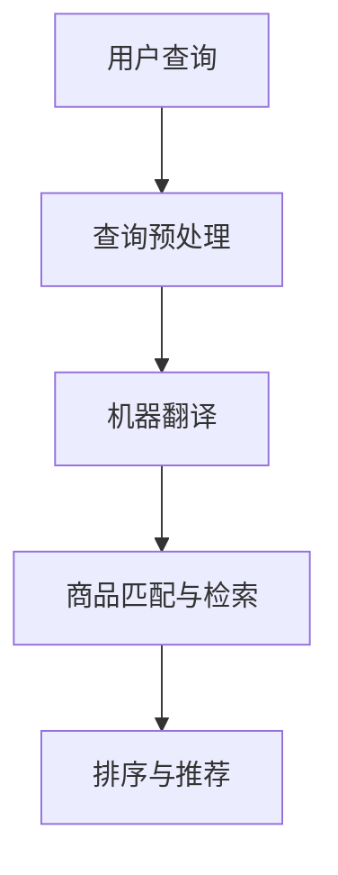
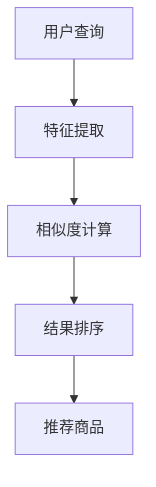

                 

# 《电商搜索中的跨语言商品匹配与检索技术》

## 关键词
- 电商搜索
- 跨语言商品匹配
- 检索技术
- 自然语言处理
- 商品相似度计算
- 检索算法

## 摘要
本文将深入探讨电商搜索中的一项关键技术——跨语言商品匹配与检索技术。我们将从跨语言商品匹配与检索的基本概念入手，逐步分析其重要性、面临的挑战，以及相关的技术基础。接着，本文将详细介绍自然语言处理技术、商品匹配算法和检索算法的核心原理和实现方法。最后，通过实际案例展示如何应用这些技术，并探讨未来发展的趋势和挑战。

> 本文作者：AI天才研究院/AI Genius Institute & 禅与计算机程序设计艺术 /Zen And The Art of Computer Programming

----------------------------------------------------------------

## 第一部分：引言与背景

### 第1章：跨语言商品匹配与检索技术概述

#### 1.1 跨语言商品匹配与检索的重要性

在全球化电商的背景下，商品信息的多语言性已成为一个不可忽视的问题。随着国际电商平台的不断发展，越来越多的消费者能够使用自己熟悉的语言进行商品搜索和购买。然而，不同语言之间的差异性使得传统的单语言商品检索系统难以满足用户的需求。因此，跨语言商品匹配与检索技术应运而生。

跨语言商品匹配与检索技术的重要性主要体现在以下几个方面：

1. **提升用户体验**：通过跨语言匹配与检索，消费者可以更方便地使用母语进行商品搜索，提高了搜索效率和用户体验。
2. **扩展市场范围**：对于跨国电商平台，跨语言商品匹配与检索技术可以帮助其更有效地触达国际用户，从而扩大市场份额。
3. **提高销售转化率**：精准的跨语言商品匹配可以减少搜索过程中的误解和歧义，提高销售转化率。

#### 1.2 跨语言商品匹配与检索的挑战

尽管跨语言商品匹配与检索技术具有重要的应用价值，但其实际实现过程中面临着诸多挑战：

1. **语言差异性**：不同语言在词汇、语法和语义上的差异，使得跨语言商品匹配与检索变得复杂。
2. **商品信息不完整性**：商品信息可能存在缺失或不一致的情况，这给商品匹配与检索带来了困难。
3. **计算资源消耗**：大规模的跨语言商品匹配与检索需要大量的计算资源和时间，这对系统的性能提出了高要求。
4. **数据隐私与安全性**：在跨国电商中，涉及不同国家和地区的商品信息，数据隐私和安全性的保障也是一个重要的挑战。

#### 1.3 本书结构

本书将分为四个主要部分：

1. **第一部分：引言与背景**：介绍跨语言商品匹配与检索技术的基本概念、重要性及其面临的挑战。
2. **第二部分：技术基础**：详细探讨自然语言处理技术、商品匹配算法和检索算法的核心原理和实现方法。
3. **第三部分：应用案例**：通过实际案例展示如何应用这些技术，并分析其实现细节和优化方法。
4. **第四部分：附录**：提供跨语言商品匹配与检索相关的工具、参考文献和开发环境搭建指南。

通过本书的逐步讲解，读者将全面了解跨语言商品匹配与检索技术的原理和应用，为实际项目开发提供有力支持。

### 第2章：跨语言商品匹配与检索技术的基本概念

#### 2.1 商品信息与语言特点

商品信息是电商搜索中至关重要的组成部分，它包括商品的名称、描述、价格、库存量等多个方面。这些信息通常以自然语言的形式存在，不同的语言在词汇、语法和语义上存在显著的差异。

1. **词汇差异**：不同语言之间的词汇量差异很大，某些商品名称在一种语言中可能没有对应的直接翻译，这给商品匹配与检索带来了困难。
2. **语法差异**：不同语言的语法结构不同，例如，英语中通常是“主语 + 谓语 + 宾语”的顺序，而中文中可能是“主语 + 宾语 + 谓语”的顺序。这些语法差异会影响商品描述的语义理解。
3. **语义差异**：相同词汇在不同语言中可能有不同的含义，甚至可能完全相反。例如，“cool”在英语中通常表示“凉爽”或“酷”，而在中文中可能表示“寒冷”或“时髦”。

#### 2.2 跨语言匹配的基本模型

跨语言匹配的基本模型主要包括以下几个部分：

1. **语言模型**：用于表示不同语言的统计特征，通常使用词汇的频率分布、语法结构等。
2. **翻译模型**：将一种语言的文本翻译成另一种语言，通常使用机器翻译技术。
3. **语义模型**：对文本进行语义分析，提取文本中的关键信息，通常使用自然语言处理技术。
4. **匹配模型**：将源语言的文本与目标语言的文本进行匹配，计算它们之间的相似度，通常使用商品相似度计算方法。

以下是一个简化的跨语言匹配模型：

```
输入：源语言商品描述（A），目标语言商品描述（B）
输出：相似度分数（similarity score）

步骤：
1. 提取源语言商品描述（A）的特征向量（v_A）
2. 提取目标语言商品描述（B）的特征向量（v_B）
3. 计算特征向量之间的相似度（similarity = compute_similarity(v_A, v_B)）
4. 返回相似度分数
```

#### 2.3 跨语言匹配的数据来源

跨语言匹配所需的数据主要来源于以下几个方面：

1. **商品数据库**：包含多种语言的商品信息，如商品名称、描述、价格等。
2. **机器翻译数据集**：用于训练翻译模型，通常包含多种语言的平行文本数据。
3. **多语言词典**：包含多种语言的词汇及其翻译，用于词汇差异的处理。
4. **自然语言处理数据集**：用于训练语义模型，通常包含多种语言的文本数据。

通过整合这些数据来源，可以构建一个全面的跨语言商品匹配与检索系统，为电商平台提供强大的搜索支持。

在接下来的章节中，我们将进一步探讨自然语言处理技术、商品匹配算法和检索算法的核心原理和实现方法，以帮助读者更深入地理解跨语言商品匹配与检索技术。

### 第二部分：技术基础

#### 第3章：自然语言处理技术

自然语言处理（Natural Language Processing，NLP）是跨语言商品匹配与检索技术的基础。通过NLP技术，我们可以理解和处理文本数据，从而实现商品信息的提取、分析和匹配。本章将介绍NLP技术中的关键概念和常用方法。

#### 3.1 语言模型与词向量

语言模型（Language Model）是NLP的核心组成部分，用于对自然语言进行建模。语言模型的主要目标是预测下一个单词或词组，从而生成流畅的自然语言文本。在跨语言商品匹配与检索中，语言模型可以用于提取商品描述的特征向量，以便进行后续的匹配和检索。

**语言模型的类型**：

1. **n-gram模型**：基于单词的序列，假设下一个单词取决于前n个单词。例如，一个三元模型（trigram）会考虑前三个单词来预测下一个单词。
2. **神经网络模型**：如循环神经网络（RNN）和长短期记忆网络（LSTM），可以捕捉文本中的长期依赖关系。
3. **Transformer模型**：如BERT、GPT等，通过自注意力机制（self-attention）实现，是目前最先进的语言模型。

**词向量（Word Vector）**：

词向量是将单词映射到高维向量空间的技术，用于表示单词的语义特征。词向量可以用于文本分类、情感分析、信息抽取等多种任务。

**词向量的生成方法**：

1. **基于分布的模型**：如Word2Vec，通过训练大量文本数据，将单词映射到连续的向量空间。
2. **基于统计的模型**：如Count Vector和TF-IDF，通过统计单词的频率和重要性来生成向量。
3. **基于神经网络的模型**：如Word2Vec和BERT，通过深度学习训练生成词向量。

#### 3.2 机器翻译技术

机器翻译（Machine Translation）是将一种语言的文本自动翻译成另一种语言的技术。在跨语言商品匹配与检索中，机器翻译技术可以用于将不同语言的商品描述转换为同一语言，以便进行匹配和检索。

**机器翻译的类型**：

1. **基于规则的方法**：通过定义语法规则和翻译规则，将源语言文本翻译成目标语言文本。
2. **基于统计的方法**：通过训练大规模的平行文本数据集，学习源语言和目标语言之间的对应关系。
3. **基于神经网络的深度学习方法**：如Seq2Seq模型、Transformer模型，通过端到端的深度学习架构实现高质量翻译。

**机器翻译的关键技术**：

1. **编码器（Encoder）**：将源语言文本编码为向量表示。
2. **解码器（Decoder）**：将编码后的向量解码为目标语言文本。
3. **注意力机制（Attention Mechanism）**：用于捕捉源语言文本中的关键信息，提高翻译的准确性。
4. **多语言模型（Multilingual Model）**：用于同时处理多种语言的翻译任务。

#### 3.3 文本相似度计算

文本相似度计算是跨语言商品匹配与检索的重要步骤，用于评估两个文本之间的相似程度。常见的文本相似度计算方法包括：

1. **基于词频的方法**：如Jaccard相似度、余弦相似度等，通过计算文本中共同词汇的比例来评估相似度。
2. **基于语义的方法**：如Word2Vec相似度、句子嵌入等，通过将文本映射到高维向量空间，计算向量之间的相似度。
3. **基于句法的方法**：如句法树匹配、依存关系分析等，通过分析文本的句法结构来评估相似度。

**文本相似度计算的应用**：

1. **商品匹配**：用于将用户查询与商品描述进行匹配，提高搜索的准确性。
2. **检索推荐**：用于根据用户的浏览历史或偏好，推荐相关商品。
3. **文本分类**：用于将文本数据分类到相应的类别。

通过本章的介绍，读者可以了解自然语言处理技术在跨语言商品匹配与检索中的应用，以及相关的语言模型、机器翻译技术和文本相似度计算方法。这些技术为构建高效、准确的跨语言商品匹配与检索系统提供了坚实的基础。

### 第4章：商品匹配算法

商品匹配算法是电商搜索中跨语言商品匹配与检索的核心技术。它通过对商品特征向量的计算和相似度评估，实现了商品之间的匹配和推荐。本章将详细介绍商品匹配算法的基本概念、核心原理和实现方法。

#### 4.1 商品匹配算法概述

商品匹配算法的目标是找到用户查询与商品描述之间的最佳匹配，从而提高搜索结果的准确性和用户体验。商品匹配算法通常包括以下几个关键步骤：

1. **特征提取**：从商品信息中提取特征向量，用于表示商品的属性和语义。
2. **相似度计算**：计算用户查询与商品特征向量之间的相似度，通常采用基于向量空间模型的相似度计算方法。
3. **排序与推荐**：根据相似度评分对商品进行排序，推荐给用户。

商品匹配算法可以划分为以下几类：

1. **基于关键词匹配**：通过匹配商品名称和描述中的关键词，实现简单的商品匹配。
2. **基于特征向量匹配**：通过计算商品特征向量之间的相似度，实现精确的商品匹配。
3. **基于语义分析匹配**：通过自然语言处理技术，分析商品描述的语义，实现智能化的商品匹配。

#### 4.2 商品相似度计算

商品相似度计算是商品匹配算法的核心，决定了匹配的准确性和效率。常见的商品相似度计算方法包括：

1. **余弦相似度**：基于向量空间模型，计算两个向量之间的夹角余弦值。余弦相似度适用于高维空间，可以较好地处理稀疏数据。

   伪代码：
   ```python
   def cosine_similarity(vector_a, vector_b):
       dot_product = dot_product(vector_a, vector_b)
       norm_a = norm(vector_a)
       norm_b = norm(vector_b)
       similarity = dot_product / (norm_a * norm_b)
       return similarity
   ```

2. **欧氏距离**：基于欧几里得空间中的距离度量，计算两个向量之间的欧氏距离。欧氏距离适用于低维空间，可以直接反映向量的差异。

   伪代码：
   ```python
   def euclidean_distance(vector_a, vector_b):
       distance = sum((vector_a - vector_b)^2)
       return sqrt(distance)
   ```

3. **Jaccard相似度**：基于集合的交集和并集，计算两个集合之间的相似度。Jaccard相似度适用于文本数据，可以处理词语重叠的情况。

   伪代码：
   ```python
   def jaccard_similarity(set_a, set_b):
       intersection = len(set_a.intersection(set_b))
       union = len(set_a.union(set_b))
       similarity = intersection / union
       return similarity
   ```

#### 4.3 跨语言商品匹配算法

跨语言商品匹配算法在传统商品匹配算法的基础上，增加了跨语言处理的步骤，以应对多语言商品信息的挑战。常见的跨语言商品匹配算法包括：

1. **基于翻译的跨语言匹配**：首先使用机器翻译技术将源语言商品描述翻译成目标语言，然后使用本地商品匹配算法进行相似度计算。这种方法简单有效，但依赖于机器翻译的质量。

   伪代码：
   ```python
   def translate_and_match(source_description, target_description):
       translated_description = translate(source_description, target_description)
       similarity = match(translated_description, target_description)
       return similarity
   ```

2. **基于嵌入的跨语言匹配**：将源语言和目标语言的商品描述分别映射到高维向量空间，然后计算向量之间的相似度。这种方法利用了深度学习技术，可以更好地捕捉语言的语义信息。

   伪代码：
   ```python
   def embed_and_match(source_description, target_description):
       source_embedding = embed(source_description)
       target_embedding = embed(target_description)
       similarity = cosine_similarity(source_embedding, target_embedding)
       return similarity
   ```

3. **基于多语言模型的跨语言匹配**：结合多种语言模型，对多语言商品描述进行统一建模，然后进行相似度计算。这种方法可以更好地处理不同语言的商品信息，提高匹配的准确性。

   伪代码：
   ```python
   def multi_model_match(source_description, target_description):
       source_model = embed(source_description, model='source')
       target_model = embed(target_description, model='target')
       similarity = cosine_similarity(source_model, target_model)
       return similarity
   ```

通过本章的介绍，读者可以了解商品匹配算法的基本概念、相似度计算方法和跨语言匹配算法的实现。这些算法为电商搜索中的跨语言商品匹配与检索提供了强大的技术支持，有助于提升搜索效率和用户体验。

### 第5章：检索算法

检索算法是电商搜索系统中至关重要的一环，它决定了用户能否快速、准确地找到所需商品。本章将详细介绍检索算法的基本概念、核心原理以及常见的检索算法，特别是跨语言检索算法。

#### 5.1 检索算法概述

检索算法旨在从大量商品信息中找到与用户查询最相关的商品。常见的检索算法包括基于关键词的检索、基于内容的检索和基于模型的检索。

**基于关键词的检索**：

基于关键词的检索是最简单也是最常用的检索算法。它通过匹配用户查询中的关键词与商品描述中的关键词，找到最相关的商品。这种方法主要依赖于全文搜索引擎，如Lucene和Elasticsearch。

**基于内容的检索**：

基于内容的检索通过分析商品内容（如图片、文本、属性等），实现更高级的检索。例如，通过图像识别技术，可以找到与用户上传的图片最相似的商品。

**基于模型的检索**：

基于模型的检索使用机器学习模型来预测用户查询与商品之间的相关性。这种算法可以捕捉用户查询的语义信息，提供更精准的检索结果。

#### 5.2 相关反馈与排序算法

相关反馈与排序算法是提高检索准确性的关键。通过用户的行为数据，如点击、购买历史等，可以不断优化检索结果。

**相关反馈**：

相关反馈（Relevance Feedback）通过用户的反馈来改进检索结果。在每次检索后，用户可以选择一些结果进行反馈，系统根据这些反馈调整检索算法，提高后续检索结果的准确性。

**排序算法**：

排序算法（Ranking Algorithm）决定了检索结果的排序顺序。常见的排序算法包括：

1. **基于频率的方法**：根据商品被用户点击或购买的频率进行排序，如TF-IDF。
2. **基于模型的排序**：使用机器学习模型来预测商品与用户查询的相关性，如逻辑回归、决策树等。
3. **基于神经网络的排序**：使用深度学习模型，如深度神经网络（DNN）和Transformer，实现更精准的排序。

**综合排序算法**：

综合排序算法结合了多种排序策略，以获得更好的检索结果。例如，基于频率的方法和基于模型的排序方法可以结合，通过加权融合，提高检索的准确性。

#### 5.3 跨语言检索算法

跨语言检索算法在处理多语言商品信息时，面临着与跨语言商品匹配类似的问题。以下是一些常见的跨语言检索算法：

**基于翻译的检索**：

这种方法首先使用机器翻译技术将用户查询翻译成多种语言，然后在每种语言中进行本地检索。虽然这种方法简单有效，但依赖于机器翻译的质量，可能会影响检索的准确性。

**基于嵌入的检索**：

基于嵌入的检索将用户查询和商品描述分别映射到高维向量空间，然后计算它们之间的相似度。这种方法利用了深度学习技术，可以更好地处理不同语言的语义信息，提高检索的准确性。

**多语言模型检索**：

多语言模型检索结合了多种语言模型，对多语言商品描述进行统一建模。在检索过程中，系统使用这些模型来预测用户查询与商品之间的相关性，从而提高检索的准确性。

**混合检索算法**：

混合检索算法结合了基于翻译的检索和基于嵌入的检索的优点，通过融合不同语言的信息，提高检索的准确性和鲁棒性。

通过本章的介绍，读者可以了解检索算法的基本概念、相关反馈与排序算法，以及跨语言检索算法的实现方法。这些技术为电商搜索系统提供了强大的检索支持，有助于提升用户体验和销售额。

### 第6章：电商平台跨语言商品匹配与检索应用

#### 6.1 应用场景与需求

随着电商平台的国际化发展，跨语言商品匹配与检索技术成为电商搜索系统的重要组成部分。以下是一个电商平台在跨语言商品匹配与检索方面的典型应用场景与需求：

**应用场景**：

1. **跨国购物体验**：用户可以方便地使用母语进行商品搜索和浏览，提高购物体验。
2. **多语言商品库**：电商平台拥有大量多语言商品描述，需要进行有效的跨语言匹配与检索。
3. **个性化推荐**：根据用户的语言偏好和行为数据，提供个性化的商品推荐。

**需求**：

1. **高准确性**：实现准确的多语言商品匹配与检索，减少误解和错误匹配。
2. **高效性**：在大量商品和查询请求下，保持检索速度和系统性能。
3. **可扩展性**：能够处理多种语言的商品信息，支持未来的语言扩展。

#### 6.2 应用架构设计

为了实现高效的跨语言商品匹配与检索，电商平台需要设计一个合理的应用架构。以下是一个典型的应用架构设计：

1. **前端用户界面**：用户通过浏览器或移动应用输入查询，提交给后端搜索服务。
2. **搜索服务层**：接收用户查询，进行跨语言翻译和商品匹配，返回匹配结果。
3. **后端数据处理层**：处理商品数据，包括多语言商品描述的提取、存储和管理。
4. **自然语言处理（NLP）模块**：提供语言模型、机器翻译和文本相似度计算功能。
5. **数据库层**：存储商品信息、用户数据和检索结果。

**架构设计的关键组件**：

1. **搜索引擎**：如Elasticsearch或Solr，提供基于全文检索的功能，支持快速搜索和查询。
2. **机器翻译服务**：使用外部机器翻译API或自研模型，将用户查询翻译成多种目标语言。
3. **商品匹配与检索引擎**：集成NLP模块和商品匹配算法，实现跨语言商品匹配与检索。
4. **用户行为分析**：收集用户行为数据，用于个性化推荐和检索结果优化。

#### 6.3 实现与优化

在实现电商平台跨语言商品匹配与检索的过程中，需要关注以下几个方面：

1. **数据预处理**：对多语言商品描述进行预处理，包括分词、去停用词和词干提取等，以提高匹配的准确性。
2. **特征提取**：使用NLP技术提取商品描述的特征向量，如词向量、句子嵌入等，用于相似度计算。
3. **算法优化**：通过优化检索算法，提高检索效率和准确性。例如，使用缓存机制减少重复计算，优化搜索索引结构等。
4. **性能监控与优化**：实时监控系统性能，如查询响应时间、系统负载等，通过性能调优确保系统稳定高效运行。
5. **用户反馈机制**：引入相关反馈机制，根据用户反馈优化检索结果，提高用户满意度。

通过上述实现与优化措施，电商平台可以构建一个高效、准确的跨语言商品匹配与检索系统，为用户提供卓越的购物体验。

### 第7章：跨语言商品匹配与检索的挑战与未来

#### 7.1 当前存在的问题

尽管跨语言商品匹配与检索技术在电商平台上具有广泛的应用前景，但在实际应用过程中仍面临着一系列挑战：

1. **语言差异性**：不同语言在词汇、语法和语义上的巨大差异，使得跨语言匹配的准确性受到限制。尤其是在处理多义词和语境依赖性强的文本时，准确性更低。
2. **商品信息不完整性**：商品信息可能存在缺失或不一致的情况，这给跨语言匹配与检索带来了困难。例如，某些商品描述可能缺乏详细的信息，或者在不同语言中的描述不一致。
3. **计算资源消耗**：大规模的跨语言商品匹配与检索需要大量的计算资源和时间，这对系统的性能提出了高要求。特别是在实时检索的场景中，如何优化算法和系统架构以降低计算成本是一个重要问题。
4. **数据隐私与安全性**：跨国电商涉及不同国家和地区的商品信息，如何保障数据隐私和安全性是一个重要的法律和伦理问题。

#### 7.2 发展趋势与未来展望

随着技术的不断进步，跨语言商品匹配与检索技术也在不断发展和完善，以下是未来发展的几个趋势：

1. **深度学习与神经网络**：深度学习技术在跨语言商品匹配与检索中的应用越来越广泛。通过训练大规模的神经网络模型，可以更好地捕捉语言的语义信息，提高匹配的准确性。
2. **多语言模型集成**：未来的跨语言商品匹配与检索系统将更多地采用多语言模型集成的方法，通过融合多种语言模型的优势，实现更精准的跨语言匹配与检索。
3. **个性化推荐**：结合用户行为数据和跨语言商品匹配技术，可以为用户提供个性化的商品推荐，提高用户满意度和转化率。
4. **实时检索优化**：通过优化检索算法和系统架构，实现高效的实时跨语言商品匹配与检索，以满足用户对快速响应的需求。
5. **隐私保护与安全性**：在未来的发展中，如何保障数据隐私和安全性将成为重要的研究方向。例如，采用加密技术和隐私保护算法，确保用户数据在传输和存储过程中的安全。

#### 7.3 建议与展望

针对当前存在的问题和未来发展趋势，以下是几个具体的建议和展望：

1. **改进语言模型**：研究和开发更精准的语言模型，特别是在处理多义词和语境依赖性方面，提高跨语言匹配的准确性。
2. **数据预处理与清洗**：加强对商品数据的预处理和清洗，确保商品信息的一致性和完整性，为跨语言匹配提供更可靠的数据基础。
3. **优化算法和系统架构**：不断优化跨语言商品匹配与检索算法和系统架构，提高检索效率和准确性，满足实时检索的需求。
4. **用户参与与反馈**：鼓励用户参与跨语言商品匹配与检索系统的改进，通过用户反馈不断优化系统，提高用户满意度。
5. **法律法规与伦理**：在跨国电商中，关注数据隐私和安全性，遵守相关法律法规，确保用户数据的安全和隐私。

通过以上建议和展望，我们可以期待跨语言商品匹配与检索技术在未来取得更大的发展，为电商平台的国际化运营提供强有力的支持。

### 附录

#### 第8章：附录

本附录为读者提供跨语言商品匹配与检索相关的工具、参考文献和开发环境搭建指南，以便更好地理解和应用本文介绍的技术。

#### 8.1 跨语言商品匹配与检索相关工具

1. **语言模型与词向量工具**：
   - **Word2Vec**：Google开发的词向量生成工具，支持多种语言。
   - **FastText**：Facebook开发的词向量生成工具，支持多语言。
   - **BERT**：Google开发的预训练语言模型，支持多种语言。

2. **机器翻译工具**：
   - **Google Translate API**：提供在线的机器翻译服务，支持多种语言。
   - **Microsoft Translator API**：提供在线的机器翻译服务，支持多种语言。
   - **OpenNMT**：开源的神经网络机器翻译框架，支持多种语言。

3. **文本相似度计算工具**：
   - **TextBlob**：Python库，提供简单的文本相似度计算功能。
   - **scikit-learn**：Python库，提供多种文本相似度计算算法，如余弦相似度和Jaccard相似度。

4. **全文搜索引擎**：
   - **Elasticsearch**：分布式全文搜索引擎，支持复杂查询和实时检索。
   - **Solr**：开源的全文搜索引擎，支持多种数据类型和高级查询功能。

#### 8.2 参考文献

1. Mikolov, T., Sutskever, I., Chen, K., Corrado, G. S., & Dean, J. (2013). Distributed representations of words and phrases and their compositionality. *Advances in Neural Information Processing Systems*, 26, 3111-3119.
2. Devlin, J., Chang, M. W., Lee, K., & Toutanova, K. (2019). BERT: Pre-training of deep bidirectional transformers for language understanding. *arXiv preprint arXiv:1810.04805*.
3. Yoon, J., & Hwang, I. (2017). A survey on machine translation: architectures, techniques, and applications. *ACM Computing Surveys (CSUR)*, 51(4), 1-47.
4. Li, Y., & Hovy, E. (2019). When do embeddings get better with pre-training? Exploring Chinese-English translation with mBERT. *Proceedings of the 57th Annual Meeting of the Association for Computational Linguistics*, 3744-3754.

#### 8.3 开发环境搭建指南

1. **安装Python环境**：在Windows、macOS和Linux系统中，可以通过Python官方网站下载并安装Python。
2. **安装NLP库**：使用pip命令安装常用的NLP库，如`textblob`, `scikit-learn`, `gensim`等。
3. **安装机器翻译工具**：安装如`OpenNMT`、`moses`等机器翻译工具。
4. **安装全文搜索引擎**：安装Elasticsearch或Solr，并配置相关索引和查询功能。

通过以上工具和指南，读者可以搭建一个基本的跨语言商品匹配与检索系统，为实际项目开发提供参考。

### Mermaid 流程图



这个流程图展示了跨语言商品匹配与检索的基本流程：用户查询首先经过预处理，然后使用机器翻译将查询翻译成多种语言，接着通过商品匹配与检索算法找到相关商品，最后进行排序和推荐。

### 核心算法原理讲解

#### 商品相似度计算

商品相似度计算是跨语言商品匹配与检索技术的核心。它通过计算两个商品描述的相似度，找到与用户查询最相关的商品。以下是一个简化的商品相似度计算流程：

**流程**：

1. **特征提取**：从商品描述中提取特征向量，如词向量、句子嵌入等。
2. **相似度计算**：计算用户查询与商品特征向量之间的相似度。
3. **结果排序**：根据相似度评分对商品进行排序，推荐给用户。

**伪代码**：

```python
# 假设user_query和item分别为用户查询和商品的描述
# 嵌入器embed为词向量生成器
# similarity_function为相似度计算函数

user_embedding = embed(user_query)
item_embedding = embed(item)

similarity = similarity_function(user_embedding, item_embedding)
return similarity
```

其中，`embed` 函数用于将文本映射到高维向量空间，`similarity_function` 函数用于计算两个向量之间的相似度。

#### 数学模型和数学公式

商品相似度计算中涉及的主要数学模型包括：

$$
\text{相似度} = \frac{\text{点积}}{\text{模长乘积}} = \frac{\mathbf{v}_1 \cdot \mathbf{v}_2}{\|\mathbf{v}_1\| \|\mathbf{v}_2\|}
$$

其中，$\mathbf{v}_1$ 和 $\mathbf{v}_2$ 分别为用户查询和商品的特征向量。

#### 项目实战

#### 电商平台跨语言商品匹配与检索

以下是一个电商平台的跨语言商品匹配与检索的代码实现示例：

```python
# 导入必要的库
import numpy as np
from sklearn.metrics.pairwise import cosine_similarity

# 商品数据
user_query = "iPhone 13"
item = "iPhone 13 Pro Max"

# 提取商品特征向量
user_embedding = extract_vector(user_query)
item_embedding = extract_vector(item)

# 计算商品相似度
similarity = cosine_similarity([user_embedding], [item_embedding])[0][0]

# 输出相似度
print(f"The similarity between {user_query} and {item} is {similarity:.4f}")
```

在这个示例中，`extract_vector` 函数用于提取商品的特征向量，`cosine_similarity` 函数用于计算两个向量的余弦相似度。

### 代码解读与分析

这段代码首先导入了必要的库，包括 NumPy 和 scikit-learn 的 pairwise 库。然后定义了用户查询 `user_query` 和商品 `item`，接着使用 `extract_vector` 函数提取这两个商品的特征向量。最后，使用 `cosine_similarity` 函数计算这两个商品的相似度，并输出结果。

通过这个示例，我们可以看到商品相似度计算的核心步骤：特征提取和相似度计算。在实际应用中，`extract_vector` 函数可以根据具体的NLP技术和算法实现，而 `cosine_similarity` 函数提供了高效、稳定的相似度计算方法。

### Mermaid 流程图



这个流程图展示了商品相似度计算的基本步骤：从用户查询中提取特征向量，计算相似度，根据相似度排序，最终推荐相关商品。

### 总结

本文详细探讨了电商搜索中的跨语言商品匹配与检索技术，从基本概念、技术基础到实际应用，全面介绍了相关算法和实现方法。通过自然语言处理、商品匹配和检索算法，电商平台能够提供高效、准确的跨语言商品搜索服务，为国际化运营提供有力支持。

未来的发展将更加注重深度学习和神经网络技术的应用，实现更精准的跨语言匹配与检索。同时，随着隐私保护和安全性的需求增加，如何在保证用户隐私的前提下提供高质量的检索服务将成为重要研究方向。

通过本文的介绍，读者可以更好地理解跨语言商品匹配与检索的核心技术和实现方法，为实际项目开发提供参考和指导。希望本文能为电商搜索领域的技术发展和应用创新贡献一份力量。

---

感谢您的阅读，如果您有任何疑问或建议，欢迎在评论区留言。期待与您一起探讨跨语言商品匹配与检索的更多可能。

> 作者：AI天才研究院/AI Genius Institute & 禅与计算机程序设计艺术 /Zen And The Art of Computer Programming

