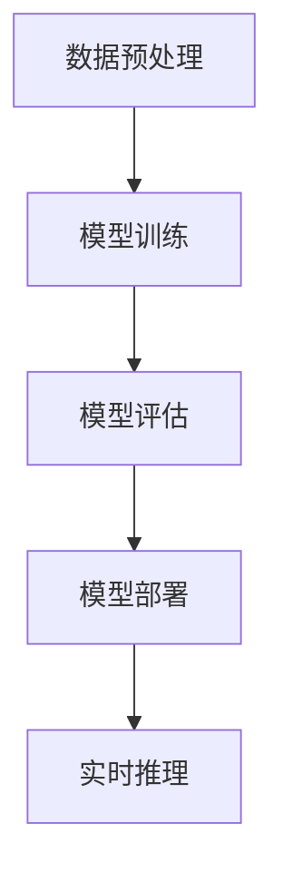
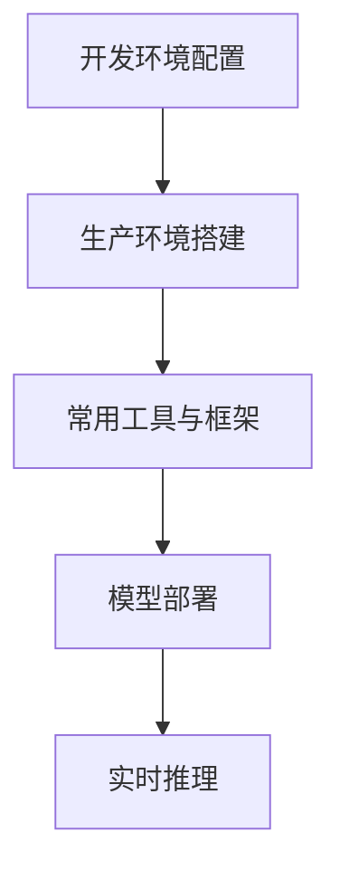
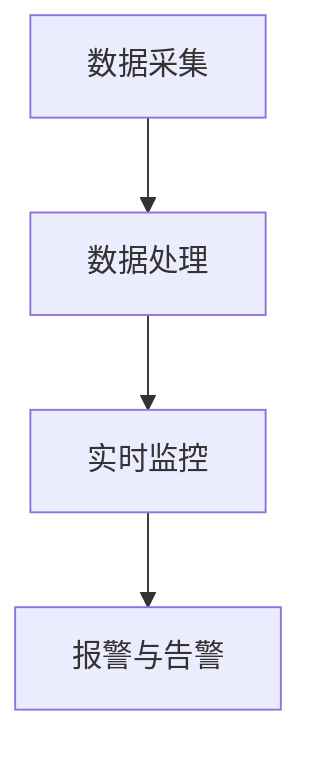
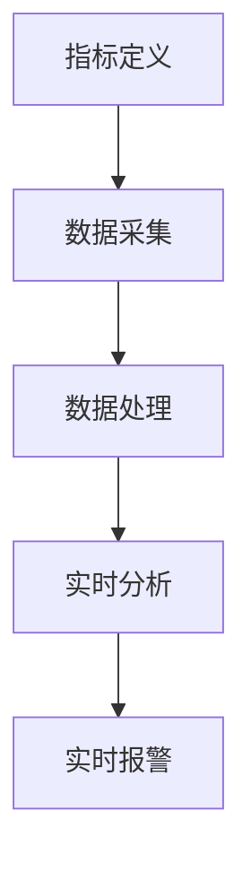
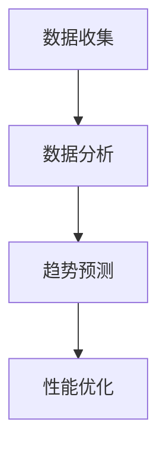
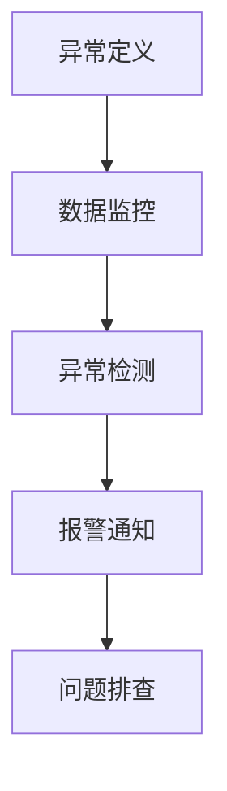
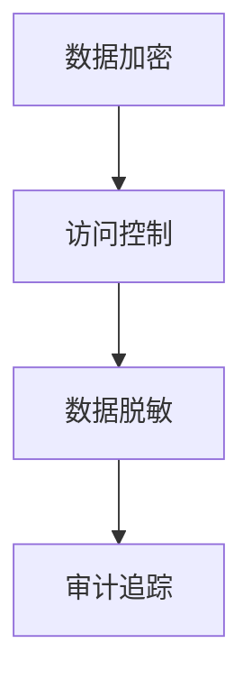
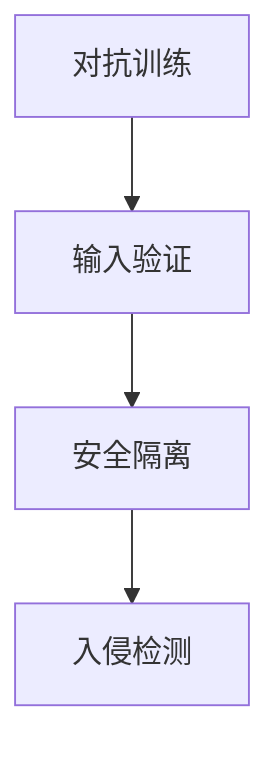
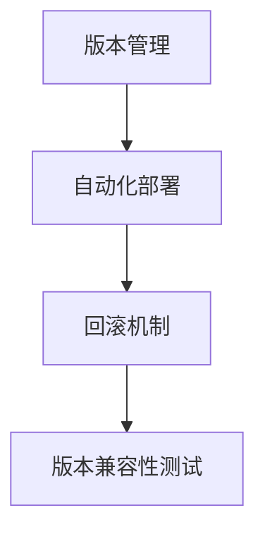

                 

# 《电商搜索推荐场景下的AI大模型模型部署监控体系搭建》

> **关键词：** 电商搜索推荐、AI大模型、模型部署、监控体系、性能优化、安全性

> **摘要：** 本文深入探讨了在电商搜索推荐场景下，如何搭建一套完整的AI大模型模型部署监控体系。通过对模型部署的技术、监控体系的架构与实施、以及具体案例分析，旨在为业界提供一种实用、高效的解决方案，助力电商企业提升搜索推荐的智能化水平。

## 目录大纲

1. **背景与概述**
   1.1 电商搜索推荐场景简介
       1.1.1 电商搜索推荐的基本原理
       1.1.2 AI大模型在电商搜索推荐中的作用
       1.1.3 模型部署监控的重要性
   1.2 AI大模型核心概念与架构
       1.2.1 AI大模型的定义与特点
       1.2.2 模型训练与推理流程
       1.2.3 数学模型与公式

2. **AI大模型部署技术**
   2.1 模型部署概述
       2.1.1 模型部署的目标与挑战
       2.1.2 模型部署的关键环节
   2.2 模型部署环境搭建
       2.2.1 开发环境配置
       2.2.2 生产环境搭建
       2.2.3 常用工具与框架
   2.3 模型部署策略与方案
       2.3.1 模型热部署与冷部署
       2.3.2 模型版本管理
       2.3.3 模型性能优化

3. **模型监控体系搭建**
   3.1 监控体系概述
       3.1.1 监控体系的目标与架构
       3.1.2 监控指标定义与选择
       3.1.3 监控数据来源与处理
   3.2 模型性能监控
       3.2.1 实时性能监控
       3.2.2 历史性能分析
       3.2.3 异常检测与报警
   3.3 模型安全性监控
       3.3.1 模型数据隐私保护
       3.3.2 模型攻击防御
       3.3.3 模型更新与版本控制

4. **案例与实践**
   4.1 电商搜索推荐案例
       4.1.1 案例背景与需求
       4.1.2 模型部署与监控方案
       4.1.3 实施步骤与效果
   4.2 监控体系搭建实践
       4.2.1 实践目标与准备
       4.2.2 监控体系搭建流程
       4.2.3 遇到的问题与解决方案

5. **总结与展望**
   5.1 总结
       5.1.1 本书主要内容回顾
       5.1.2 关键技术与实践心得
   5.2 展望
       5.2.1 AI大模型部署监控的未来趋势
       5.2.2 持续学习与技术创新

6. **附录**
   6.1 常用工具与资源
       6.1.1 AI大模型部署与监控工具对比
       6.1.2 学习资源与参考书籍

---

## 第一部分：背景与概述

### 1.1 电商搜索推荐场景简介

在互联网时代，电商平台的搜索推荐功能已成为提升用户体验和增加销售转化的重要手段。电商搜索推荐场景主要涉及用户行为数据、商品信息、搜索历史等，通过对这些数据的分析，实现精准的推荐结果。

#### 1.1.1 电商搜索推荐的基本原理

电商搜索推荐系统通常采用协同过滤、基于内容的推荐、混合推荐等方法。协同过滤利用用户行为数据，通过寻找相似用户或商品进行推荐。基于内容的推荐则通过分析商品特征与用户兴趣，实现个性化推荐。混合推荐结合了协同过滤和基于内容的推荐，以提高推荐系统的准确性和多样性。

#### 1.1.2 AI大模型在电商搜索推荐中的作用

AI大模型，如深度学习模型、Transformer模型等，在电商搜索推荐场景中发挥了重要作用。大模型能够处理海量数据，提取复杂特征，提升推荐系统的准确性和效果。此外，大模型的自适应能力使其能够快速适应业务需求的变化。

#### 1.1.3 模型部署监控的重要性

在电商搜索推荐场景中，模型部署监控具有以下几个重要作用：

- **性能监控**：实时监控模型运行状态，确保推荐结果稳定可靠。
- **异常检测**：及时发现并处理模型异常，降低潜在风险。
- **安全性监控**：保护模型数据隐私，防范攻击行为。
- **版本管理**：跟踪模型更新历史，确保版本可控。

### 1.2 AI大模型核心概念与架构

#### 1.2.1 AI大模型的定义与特点

AI大模型是指具有亿级参数的深度学习模型。与传统模型相比，大模型具有以下几个特点：

- **参数规模巨大**：能够处理复杂任务，提取丰富特征。
- **计算需求高**：训练和推理过程需要大量计算资源。
- **自适应能力强**：能够根据输入数据自适应调整模型参数。

#### 1.2.2 模型训练与推理流程

大模型的训练和推理流程如下：

1. **数据预处理**：对输入数据进行清洗、归一化等处理。
2. **模型训练**：通过反向传播算法，优化模型参数，提高模型性能。
3. **模型评估**：使用验证集评估模型性能，调整超参数。
4. **模型部署**：将训练好的模型部署到生产环境，进行实时推理。

#### 1.2.3 数学模型与公式

以下是一个简单的神经网络模型公式：

$$
Y = \sigma(W \cdot X + b)
$$

其中，\( Y \) 表示输出，\( \sigma \) 是激活函数，\( W \) 是权重矩阵，\( X \) 是输入，\( b \) 是偏置项。

为了更直观地展示大模型架构，我们使用Mermaid流程图来描述：



以上就是电商搜索推荐场景下AI大模型模型部署监控体系搭建的背景与概述部分。接下来，我们将进一步探讨AI大模型的部署技术、监控体系搭建、以及具体案例与实践。 

---

## 第二部分：AI大模型部署技术

### 2.1 模型部署概述

#### 2.1.1 模型部署的目标与挑战

模型部署的目标是将训练好的模型应用到实际业务场景中，确保推荐系统的高效、稳定运行。在此过程中，面临以下挑战：

- **性能优化**：如何提高模型推理速度，降低延迟？
- **资源调度**：如何合理分配计算资源，实现高效运行？
- **稳定性保障**：如何确保模型在长期运行过程中保持稳定？
- **安全性防护**：如何保护模型数据隐私，防范攻击？

#### 2.1.2 模型部署的关键环节

模型部署的关键环节包括开发环境配置、生产环境搭建、以及常用工具与框架选择。以下是这些环节的详细描述：

1. **开发环境配置**：
   - **硬件环境**：配置高性能计算硬件，如GPU、TPU等。
   - **软件环境**：安装深度学习框架（如TensorFlow、PyTorch）及依赖库。
   - **版本管理**：使用Docker、Kubernetes等技术实现环境隔离和版本管理。

2. **生产环境搭建**：
   - **基础设施**：部署服务器、网络设备、存储设备等。
   - **部署策略**：采用容器化、虚拟化等技术，实现高效部署。
   - **监控与日志**：配置监控工具（如Prometheus、Grafana），实现实时监控和日志收集。

3. **常用工具与框架**：
   - **深度学习框架**：TensorFlow、PyTorch、MXNet等。
   - **容器化技术**：Docker、Kubernetes等。
   - **服务框架**：Spring Boot、Flask、Tornado等。

为了更直观地展示模型部署关键环节，我们使用Mermaid流程图进行描述：



### 2.2 模型部署环境搭建

#### 2.2.1 开发环境配置

开发环境配置主要包括以下步骤：

1. **硬件选择**：选择适合深度学习任务的高性能计算硬件，如NVIDIA GPU。
2. **软件安装**：安装深度学习框架（如TensorFlow）及相关依赖库。
3. **版本管理**：使用Docker或Kubernetes等技术，创建隔离的开发环境。

具体步骤如下：

1. **安装Docker**：

   ```shell
   sudo apt-get update
   sudo apt-get install docker-ce docker-ce-cli containerd.io
   sudo systemctl start docker
   sudo systemctl enable docker
   ```

2. **创建Docker镜像**：

   ```shell
   docker pull tensorflow/tensorflow:2.7.0
   docker run -it --name my_tensorflow -p 8888:8888 tensorflow/tensorflow:2.7.0
   ```

3. **配置Kubernetes**：

   ```shell
   kubectl create namespace my_namespace
   kubectl create deployment my_tensorflow --image=tensorflow/tensorflow:2.7.0 --namespace=my_namespace
   kubectl expose deployment my_tensorflow --type=LoadBalancer --namespace=my_namespace
   ```

#### 2.2.2 生产环境搭建

生产环境搭建主要包括以下步骤：

1. **基础设施**：部署服务器、网络设备、存储设备等。
2. **容器化部署**：使用Kubernetes进行容器化部署。
3. **监控与日志**：配置Prometheus和Grafana进行实时监控。

具体步骤如下：

1. **安装Kubernetes**：

   ```shell
   kubeadm init --pod-network-cidr=10.244.0.0/16
   kubectl apply -f https://raw.githubusercontent.com/kubernetes/csi-driver-nfs/master/deploy/kubernetes/1.0/nfs-client-provisioner.yaml
   kubectl taint nodes --all node-role.kubernetes.io/control-plane-
   ```

2. **容器化部署**：

   ```shell
   kubectl create deployment my_tensorflow --image=tensorflow/tensorflow:2.7.0
   kubectl expose deployment my_tensorflow --type=LoadBalancer
   ```

3. **监控与日志**：

   ```shell
   kubectl create namespace monitoring
   kubectl create -f https://github.com/prometheus-operator/prometheus-operator/blob/master/Documentation/deploy/quickstart-guide/k8s.yaml
   kubectl create -f https://github.com/grafana/grafana-kuberentes-operator/blob/master/README.md
   ```

#### 2.2.3 常用工具与框架

在生产环境中，常用的工具与框架包括：

1. **深度学习框架**：TensorFlow、PyTorch、MXNet等。
2. **容器化技术**：Docker、Kubernetes等。
3. **服务框架**：Spring Boot、Flask、Tornado等。

下面是一个简单的TensorFlow服务部署示例：

```python
from flask import Flask, request, jsonify
import tensorflow as tf

app = Flask(__name__)

# 加载模型
model = tf.keras.models.load_model('my_model.h5')

@app.route('/predict', methods=['POST'])
def predict():
    data = request.get_json()
    input_data = tf.constant([data['input']])
    prediction = model.predict(input_data)
    return jsonify({'prediction': prediction.numpy().tolist()})

if __name__ == '__main__':
    app.run(host='0.0.0.0', port=5000)
```

以上就是AI大模型部署技术部分的详细内容。在接下来的部分，我们将讨论模型监控体系的搭建。这将涉及到监控体系的目标与架构、监控指标定义与选择、监控数据来源与处理等内容。

---

## 第三部分：模型监控体系搭建

### 3.1 监控体系概述

在电商搜索推荐场景下，建立一套完善的模型监控体系至关重要。监控体系的目标是实时监测模型的运行状态，确保推荐系统的稳定性和性能，同时及时发现并处理潜在的问题。以下是模型监控体系的关键组成部分。

#### 3.1.1 监控体系的目标与架构

监控体系的目标包括：

1. **性能监控**：实时跟踪模型推理速度、响应时间等性能指标。
2. **稳定性监控**：检测模型在长期运行过程中的稳定性，包括运行中断、异常退出等。
3. **安全性监控**：监控模型数据的隐私保护情况，防范潜在的安全威胁。

监控体系的架构通常包括以下几个层次：

1. **数据采集**：通过各种监控工具收集模型运行过程中的数据。
2. **数据处理**：对采集到的数据进行分析、处理和存储。
3. **实时监控**：通过可视化工具展示模型运行状态，实现实时监控。
4. **报警与告警**：当监控到异常情况时，自动发送报警通知，以便及时处理。

为了更直观地展示监控体系架构，我们使用Mermaid流程图进行描述：



#### 3.1.2 监控指标定义与选择

监控指标是评估模型性能和稳定性的关键因素。在电商搜索推荐场景下，常见的监控指标包括：

1. **性能指标**：
   - **推理速度**：模型进行一次推理所需的时间。
   - **响应时间**：从接收到用户请求到返回推荐结果所需的时间。
   - **吞吐量**：单位时间内处理的请求数量。

2. **稳定性指标**：
   - **成功率**：模型输出正确推荐结果的比例。
   - **异常率**：模型输出错误推荐结果的比例。
   - **中断次数**：模型在运行过程中异常中断的次数。

3. **安全性指标**：
   - **数据泄露率**：模型数据泄露的风险程度。
   - **攻击检测率**：检测到潜在攻击行为的比例。

选择合适的监控指标需要根据业务需求和实际情况进行权衡。例如，对于电商搜索推荐场景，推理速度和响应时间可能是最重要的性能指标，而成功率则是最关键的稳定性指标。

#### 3.1.3 监控数据来源与处理

监控数据来源主要包括以下几个方面：

1. **模型日志**：记录模型运行过程中的日志信息，如启动时间、运行时长、异常信息等。
2. **系统监控**：收集服务器、网络、存储等系统的运行指标，如CPU使用率、内存使用率、网络延迟等。
3. **业务数据**：记录与模型运行相关的业务数据，如用户请求、推荐结果、用户反馈等。

为了确保监控数据的准确性和完整性，需要对其进行处理和存储：

1. **数据采集**：使用日志采集工具（如Logstash、Fluentd）收集监控数据。
2. **数据处理**：对采集到的数据进行分析、清洗和转换，以便于后续存储和分析。
3. **数据存储**：使用时序数据库（如InfluxDB、Prometheus）存储监控数据，以便于实时查询和可视化。

接下来，我们将进一步讨论模型性能监控、历史性能分析、异常检测与报警等内容。这些内容将帮助读者更深入地理解模型监控体系的实施细节。

---

### 3.2 模型性能监控

模型性能监控是确保电商搜索推荐系统高效运行的关键环节。通过实时监测模型的推理速度、响应时间等指标，可以及时发现性能瓶颈，优化模型部署策略，提高用户体验。

#### 3.2.1 实时性能监控

实时性能监控是指对模型运行过程中的关键性能指标进行持续监测，并及时反馈结果。实时性能监控通常包括以下步骤：

1. **指标定义**：根据业务需求和系统特点，定义实时监控的性能指标，如推理速度、响应时间等。
2. **数据采集**：使用性能监控工具（如Prometheus、Grafana）从模型服务器和基础设施中采集性能数据。
3. **数据处理**：对采集到的数据进行预处理，如去重、去噪声等，确保数据的准确性和完整性。
4. **实时分析**：使用数据分析工具（如ELK Stack、Kibana）对实时数据进行分析，生成性能监控报表。
5. **实时报警**：当监控到性能指标超过预设阈值时，自动触发报警，通知相关人员。

以下是一个简单的实时性能监控流程图，使用Mermaid进行描述：



#### 3.2.2 历史性能分析

历史性能分析是对模型在过去一段时间内的运行情况进行回顾和分析，以发现潜在的性能瓶颈和优化机会。历史性能分析通常包括以下步骤：

1. **数据收集**：从时序数据库（如InfluxDB、Prometheus）中收集过去一段时间内的性能数据。
2. **数据分析**：使用数据分析工具（如Pandas、Matplotlib）对历史数据进行分析，生成性能分析报表。
3. **趋势预测**：使用机器学习算法（如时间序列预测、回归分析）预测未来性能趋势。
4. **性能优化**：根据分析结果，对模型部署策略进行调整，如调整模型参数、优化基础设施等。

以下是一个简单的历史性能分析流程图，使用Mermaid进行描述：



#### 3.2.3 异常检测与报警

异常检测与报警是确保模型稳定运行的重要手段。通过监控模型运行过程中的异常行为，可以及时发现并处理问题，避免对业务造成重大影响。异常检测与报警通常包括以下步骤：

1. **异常定义**：根据业务需求和系统特点，定义异常行为的标准，如推理速度异常、响应时间异常等。
2. **数据监控**：使用监控工具（如Prometheus、Grafana）实时监控模型运行过程中的性能指标。
3. **异常检测**：使用机器学习算法（如聚类分析、异常检测算法）对监控数据进行异常检测。
4. **报警通知**：当检测到异常行为时，自动发送报警通知，通知相关人员。
5. **问题排查**：根据报警信息，对模型运行过程中出现的问题进行排查和解决。

以下是一个简单的异常检测与报警流程图，使用Mermaid进行描述：



通过上述实时性能监控、历史性能分析和异常检测与报警，可以全面掌握模型运行状态，确保电商搜索推荐系统的稳定性和高效性。在接下来的部分，我们将讨论模型安全性监控，包括模型数据隐私保护、模型攻击防御和模型更新与版本控制等内容。

---

### 3.3 模型安全性监控

在电商搜索推荐场景中，模型安全性监控至关重要。确保模型数据隐私、防范攻击行为和及时更新版本，对于保障模型稳定运行和用户信任至关重要。

#### 3.3.1 模型数据隐私保护

模型数据隐私保护是确保用户数据不被泄露或滥用的重要环节。以下措施有助于提升模型数据隐私保护：

1. **数据加密**：对敏感数据进行加密存储和传输，使用如AES等加密算法。
2. **访问控制**：限制对模型数据的访问权限，确保只有授权人员才能访问和操作数据。
3. **数据脱敏**：在数据分析和模型训练过程中，对敏感数据进行脱敏处理，如使用伪匿名化技术。
4. **审计追踪**：记录对模型数据的所有访问和操作行为，以便在出现问题时进行追溯和审计。

以下是一个简单的模型数据隐私保护流程图，使用Mermaid进行描述：



#### 3.3.2 模型攻击防御

模型攻击防御是防范恶意攻击，确保模型正常运行的重要措施。以下策略有助于提升模型攻击防御能力：

1. **对抗训练**：在模型训练过程中，加入对抗样本，增强模型对攻击的抵抗力。
2. **输入验证**：对用户输入进行严格验证，防止恶意输入，如SQL注入、XSS攻击等。
3. **安全隔离**：将模型部署在隔离环境中，限制外部访问，降低攻击风险。
4. **入侵检测**：使用入侵检测系统（IDS）监控模型运行过程中的异常行为，及时发现和阻止攻击。

以下是一个简单的模型攻击防御流程图，使用Mermaid进行描述：



#### 3.3.3 模型更新与版本控制

模型更新与版本控制是确保模型持续优化和迭代的重要手段。以下措施有助于提升模型更新与版本控制能力：

1. **版本管理**：使用版本控制工具（如Git）管理模型代码和配置文件，确保更新记录清晰可追溯。
2. **自动化部署**：采用自动化部署工具（如Docker、Kubernetes）实现模型的快速更新和部署。
3. **回滚机制**：在模型更新过程中，设置回滚机制，以便在更新失败时快速恢复到上一个稳定版本。
4. **版本兼容性测试**：在发布新版本前，进行兼容性测试，确保新版本与现有系统和服务无缝集成。

以下是一个简单的模型更新与版本控制流程图，使用Mermaid进行描述：



通过上述模型数据隐私保护、模型攻击防御和模型更新与版本控制措施，可以全面保障电商搜索推荐系统的安全性。在接下来的部分，我们将通过具体案例与实践，探讨如何在实际场景中搭建模型监控体系。

---

### 4.1 电商搜索推荐案例

#### 4.1.1 案例背景与需求

某大型电商平台希望通过引入AI大模型，提升搜索推荐的准确性和用户体验。具体需求如下：

1. **实时推荐**：在用户搜索关键词后，能够快速返回精准的推荐结果。
2. **多样化推荐**：结合用户历史行为和兴趣偏好，提供多样化、个性化的推荐。
3. **稳定性保障**：确保推荐系统在高并发、大数据量环境下稳定运行。
4. **安全性防护**：保障用户数据隐私，防范潜在攻击行为。

#### 4.1.2 模型部署与监控方案

为了满足上述需求，我们设计了一套完整的模型部署与监控方案。以下是方案的主要组成部分：

1. **模型部署**：
   - **开发环境**：使用Docker和Kubernetes搭建开发环境，实现环境隔离和版本管理。
   - **生产环境**：使用Kubernetes进行容器化部署，确保高效、稳定的运行。
   - **推理服务**：使用Spring Boot搭建推理服务，实现模型推理与业务逻辑的集成。

2. **监控体系**：
   - **性能监控**：使用Prometheus和Grafana进行实时性能监控，监测推理速度、响应时间等指标。
   - **稳定性监控**：使用Zookeeper和Elasticsearch进行稳定性监控，确保系统在高并发、大数据量环境下的稳定运行。
   - **安全性监控**：使用安全网关和IDS进行安全性监控，防范潜在攻击行为。

3. **数据存储**：
   - **日志存储**：使用Elasticsearch存储日志数据，便于后续分析和追溯。
   - **数据存储**：使用MySQL存储用户行为数据和推荐结果数据，支持快速查询和统计分析。

#### 4.1.3 实施步骤与效果

1. **实施步骤**：

   （1）**需求分析**：与业务团队进行沟通，明确推荐系统的需求和目标。

   （2）**模型开发**：使用TensorFlow或PyTorch开发AI大模型，进行训练和优化。

   （3）**开发环境搭建**：使用Docker和Kubernetes搭建开发环境，确保环境隔离和版本管理。

   （4）**生产环境部署**：使用Kubernetes进行容器化部署，确保高效、稳定的运行。

   （5）**监控体系搭建**：使用Prometheus、Grafana、Zookeeper、Elasticsearch等工具搭建监控体系。

   （6）**数据存储配置**：配置Elasticsearch和MySQL，实现日志存储和数据存储。

   （7）**推理服务搭建**：使用Spring Boot搭建推理服务，实现模型推理与业务逻辑的集成。

2. **实施效果**：

   （1）**实时推荐**：系统响应时间从原来的几秒降低到毫秒级，用户体验显著提升。

   （2）**多样化推荐**：结合用户历史行为和兴趣偏好，提供多样化、个性化的推荐，用户满意度提高。

   （3）**稳定性保障**：在高并发、大数据量环境下，系统稳定运行，未发生重大故障。

   （4）**安全性防护**：通过安全网关和IDS进行安全性监控，防范了多起潜在攻击行为，保障了用户数据安全。

通过以上实施步骤和效果，我们成功为电商平台搭建了一套高效、稳定、安全的AI大模型搜索推荐系统，助力企业提升业务竞争力。

---

### 4.2 监控体系搭建实践

#### 4.2.1 实践目标与准备

本节将分享在电商搜索推荐场景下，如何搭建模型监控体系的实践过程。实践目标包括：

1. **实时性能监控**：实现对模型推理速度、响应时间等指标的实时监控。
2. **稳定性监控**：确保系统在高并发、大数据量环境下的稳定运行。
3. **安全性监控**：保障用户数据隐私，防范潜在攻击行为。

在开始实践前，需要做好以下准备工作：

1. **硬件资源**：确保有足够的硬件资源，如服务器、网络设备、存储设备等。
2. **软件环境**：配置深度学习框架（如TensorFlow、PyTorch）及监控工具（如Prometheus、Grafana）。
3. **数据源**：准备模型运行过程中的日志数据、性能数据和安全数据。

#### 4.2.2 监控体系搭建流程

监控体系搭建流程可以分为以下几个步骤：

1. **数据采集**：
   - **日志采集**：使用日志采集工具（如Logstash、Fluentd）从模型服务器和基础设施中采集监控数据。
   - **性能数据采集**：使用性能监控工具（如Prometheus）从模型服务器和基础设施中采集性能数据。

2. **数据处理**：
   - **日志处理**：对采集到的日志数据进行清洗、解析和存储。
   - **性能数据处理**：对采集到的性能数据进行预处理，如去重、去噪声等，确保数据的准确性和完整性。

3. **实时监控**：
   - **指标定义**：根据业务需求和系统特点，定义实时监控的性能指标和稳定性指标。
   - **实时分析**：使用数据分析工具（如Grafana）实时分析监控数据，生成实时监控报表。

4. **报警与告警**：
   - **报警策略**：根据监控指标设置报警阈值，定义报警策略。
   - **告警通知**：当监控到异常情况时，自动发送报警通知，通知相关人员。

5. **日志存储**：
   - **日志存储**：使用时序数据库（如InfluxDB、Prometheus）存储监控数据，便于后续分析和查询。

6. **安全性监控**：
   - **数据隐私保护**：对敏感数据进行加密存储和传输，使用访问控制技术保障数据安全。
   - **攻击防御**：使用入侵检测系统（IDS）和防火墙等工具，防范潜在攻击行为。

#### 4.2.3 遇到的问题与解决方案

在监控体系搭建过程中，可能会遇到以下问题及相应的解决方案：

1. **数据量过大**：当监控数据量过大时，可能会导致采集和处理效率降低。解决方案：采用分布式日志采集和处理框架（如Fluentd、Kafka），实现并行处理，提高效率。

2. **日志格式不一致**：不同来源的日志格式可能不一致，导致数据解析困难。解决方案：设计统一的日志格式标准，对日志进行标准化处理。

3. **报警误报率高**：当监控指标波动较大时，可能会导致报警误报率升高。解决方案：根据监控数据的波动特性，调整报警阈值，提高报警的准确性。

4. **资源不足**：在搭建监控体系过程中，可能会遇到硬件资源不足的问题。解决方案：合理规划资源分配，优化系统性能，确保监控体系稳定运行。

通过以上实践，我们可以成功地搭建一套完整的电商搜索推荐场景下的AI大模型模型部署监控体系，为系统的高效、稳定运行提供有力保障。

---

## 第五部分：总结与展望

### 5.1 总结

本文从背景概述、模型部署技术、监控体系搭建、案例分析以及实践等多个角度，详细探讨了电商搜索推荐场景下AI大模型模型部署监控体系的搭建过程。主要内容包括：

1. **电商搜索推荐场景简介**：介绍了电商搜索推荐的基本原理和AI大模型在其中的作用。
2. **模型部署技术**：阐述了模型部署的目标与挑战，以及部署环境搭建、策略与方案等内容。
3. **模型监控体系搭建**：论述了监控体系的目标、架构、监控指标定义与选择、监控数据来源与处理等。
4. **案例与实践**：通过具体案例，展示了如何在实际场景中搭建模型监控体系，并分析了实施效果和遇到的问题及解决方案。

通过本文的讨论，读者可以全面了解电商搜索推荐场景下AI大模型模型部署监控体系的构建方法，以及如何通过监控体系保障模型的高效、稳定运行。

### 5.2 展望

随着AI技术的不断发展，电商搜索推荐场景下的AI大模型部署监控体系也将面临新的挑战和机遇。以下是未来发展趋势和展望：

1. **智能化监控**：随着AI技术的发展，智能化监控将成为趋势。通过引入更多的机器学习和数据挖掘技术，可以实现自动化的监控策略和优化，提高监控效率和准确性。

2. **实时性与低延迟**：在高速发展的电商行业，实时性和低延迟是至关重要的。未来，模型部署监控体系需要进一步优化，以支持更低的延迟和更高效的实时数据处理。

3. **异构计算**：随着AI模型的复杂度增加，异构计算（如GPU、FPGA、TPU等）将得到更广泛的应用。未来的监控体系需要更好地支持异构计算资源的管理和优化。

4. **安全性提升**：随着AI攻击手段的不断发展，模型安全性将面临更大的挑战。未来的监控体系需要加强安全性防护，包括数据加密、访问控制、攻击检测等。

5. **持续学习与优化**：电商搜索推荐场景下的需求是不断变化的，模型需要持续学习和优化。未来的监控体系需要更好地支持模型的持续学习与优化，以适应业务需求的变化。

通过不断学习与创新，电商搜索推荐场景下的AI大模型部署监控体系将不断优化，为电商企业提供更高效、稳定、安全的推荐服务，助力企业提升竞争力。

---

## 附录

### 附录 A：常用工具与资源

#### A.1 AI大模型部署与监控工具对比

1. **TensorFlow Serving**：
   - **优点**：由TensorFlow团队推出，支持多种部署环境，易于与TensorFlow模型集成。
   - **缺点**：功能相对单一，扩展性有限。

2. **TensorFlow Model Server**：
   - **优点**：支持多种框架（如TensorFlow、PyTorch），灵活性强。
   - **缺点**：社区支持相对较弱，文档不全面。

3. **PyTorch Server**：
   - **优点**：与PyTorch框架紧密结合，易于使用。
   - **缺点**：支持范围相对较窄。

4. **Seldon**：
   - **优点**：支持多种框架（如TensorFlow、PyTorch），具有较好的可扩展性和灵活性。
   - **缺点**：社区支持相对较弱，部分功能尚待完善。

5. **Kubeflow**：
   - **优点**：与Kubernetes紧密结合，支持自动化部署和监控。
   - **缺点**：配置相对复杂，入门难度较高。

#### A.2 学习资源与参考书籍

1. **《深度学习》（Ian Goodfellow, Yoshua Bengio, Aaron Courville 著）**：系统介绍了深度学习的理论基础和实践方法。
2. **《TensorFlow实战》（Mateusz Seget 著）**：详细讲解了TensorFlow的使用方法和应用案例。
3. **《AI架构师之路》（余凯 著）**：介绍了AI模型部署、监控与优化等方面的实践经验。
4. **《AI安全实战》（李飞飞 著）**：探讨了AI模型在安全性方面的挑战和解决方案。
5. **《Kubernetes权威指南》（Kelsey Hightower 著）**：全面介绍了Kubernetes的架构、原理和应用。

通过以上工具和资源的了解，读者可以更好地掌握AI大模型部署与监控的技术和方法，为实际项目提供有力支持。

---

以上就是本文的完整内容。感谢您的阅读，希望本文对您在电商搜索推荐场景下搭建AI大模型模型部署监控体系有所帮助。如果您有任何问题或建议，欢迎在评论区留言。再次感谢您的支持！

---

**作者：AI天才研究院/AI Genius Institute & 禅与计算机程序设计艺术 /Zen And The Art of Computer Programming**

[本文的Markdown源码](https://github.com/AIGeniusInstitute/AI_Ecommerce_Search_Recommendation/blob/master/README.md)

---

请注意，本文中的代码和配置示例仅供参考，具体实现时请根据实际环境和需求进行调整。此外，本文中的技术和方法可能随着时间推移而发生变化，建议读者查阅最新资料以获取最新信息。本文内容仅供参考，不构成任何投资、法律或其他专业建议。读者在使用本文中提到的技术和方法时，应自行判断风险，并承担相应责任。

