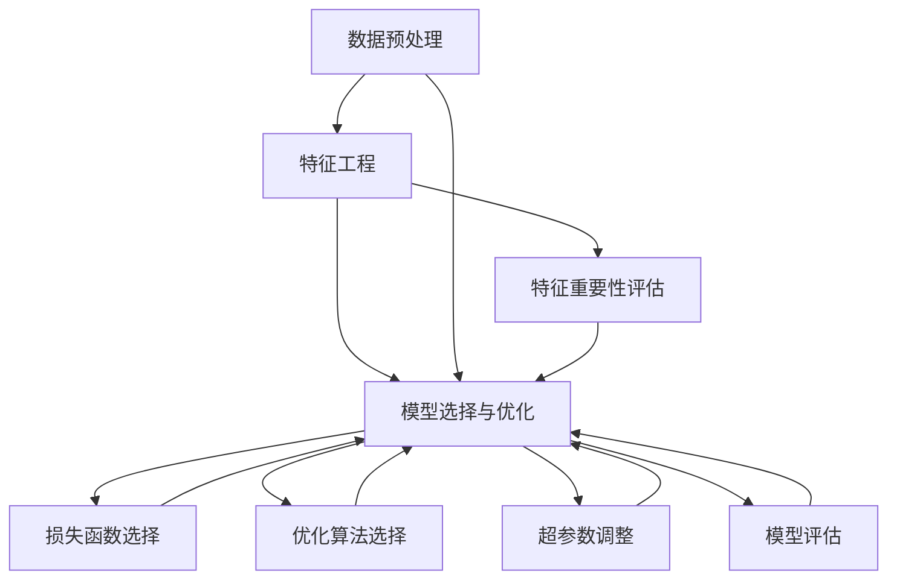

                 

### 引言与背景

#### 1.1 引言

在互联网时代，电子商务行业已经成为了全球经济的驱动力。而电子商务的核心之一——电商搜索推荐系统，不仅提高了用户的购物体验，还为商家带来了巨大的商业价值。随着人工智能技术的发展，AI大模型在电商搜索推荐中的应用日益广泛，显著提升了推荐系统的效果与效率。

**1.1.1 电商搜索推荐的重要性**

电商搜索推荐系统是电商平台的核心功能之一，其主要目标是通过个性化推荐算法，将用户可能感兴趣的商品推送给用户，从而提高用户的满意度和购物转化率。具体来说，电商搜索推荐系统具有以下几个重要作用：

1. **提高用户满意度**：通过精准的推荐，用户可以更快地找到自己需要的商品，从而提升购物体验。
2. **提升转化率**：有效的推荐能够吸引用户点击和购买，从而提高电商平台的销售额。
3. **增加用户粘性**：持续且个性化的推荐可以吸引并保持用户的活跃度，提高用户的复购率。
4. **降低运营成本**：智能推荐系统可以代替大量的人工劳动，降低平台的运营成本。

**1.1.2 AI大模型在电商搜索推荐中的作用**

AI大模型，尤其是深度学习模型，在电商搜索推荐系统中扮演着至关重要的角色。它们通过处理海量用户数据，学习用户的购物行为和偏好，从而生成个性化的推荐结果。AI大模型在电商搜索推荐中的作用主要体现在以下几个方面：

1. **特征提取与融合**：大模型能够自动提取并融合多种特征，如用户行为、商品属性等，为推荐算法提供丰富的输入。
2. **复杂关系建模**：大模型可以建模用户与商品之间的复杂关系，从而生成更精准的推荐结果。
3. **实时推荐**：通过实时训练和调整模型参数，大模型能够实现实时推荐，提升用户体验。
4. **多模态数据处理**：大模型能够处理文本、图像、语音等多种类型的数据，实现更全面的信息融合。

**1.1.3 书籍目的与结构**

本书旨在深入探讨电商搜索推荐效果评估中的AI大模型指标体系。通过系统的分析和讲解，帮助读者理解AI大模型在电商搜索推荐中的应用原理，掌握构建和评估AI大模型指标体系的方法。具体来说，本书分为以下五个部分：

1. **引言与背景**：介绍电商搜索推荐的重要性和AI大模型的应用背景。
2. **AI大模型基础**：讲解AI大模型的基本概念、核心概念与联系。
3. **指标体系构建**：详细阐述构建AI大模型指标体系的原则和分类。
4. **AI大模型评估实战**：通过实战案例，展示AI大模型评估的全过程。
5. **前沿技术与未来展望**：探讨AI大模型及电商搜索推荐系统的未来发展。

通过以上五个部分的系统学习，读者可以全面了解电商搜索推荐效果评估中的AI大模型指标体系，为实际应用提供有力支持。

#### 1.2 电商搜索推荐背景

**1.2.1 电商行业概述**

电子商务（E-commerce）是指通过互联网进行商品交易和提供相关服务的活动。随着互联网的普及和移动设备的广泛应用，电子商务已经成为现代商业活动的重要组成部分。以下是电商行业的一些关键特点：

1. **市场庞大**：全球电子商务市场持续增长，尤其是在亚太地区和北美市场，呈现出强劲的发展态势。
2. **消费者行为多样化**：现代消费者习惯于在线购物，同时通过社交媒体、直播等渠道获取购物信息和灵感。
3. **平台多样化**：电商平台从最初的C2C模式（如eBay、淘宝）发展到如今的B2C、O2O等多种模式。
4. **支付方式多样化**：从传统的信用卡支付到第三方支付（如支付宝、微信支付），支付方式的多样化为消费者提供了便利。
5. **物流业发展迅速**：随着电商的兴起，物流行业也迎来了高速发展，物流效率的提升显著提高了消费者的购物体验。

**1.2.2 搜索推荐系统简介**

搜索推荐系统是电商平台的重要组成部分，其主要目标是为用户提供个性化的商品推荐，提高用户的购物体验和平台的销售额。以下是搜索推荐系统的一些基本概念：

1. **搜索**：用户通过输入关键词或浏览历史来查找感兴趣的商品。
2. **推荐**：系统根据用户的搜索历史、购买记录、浏览行为等数据，生成个性化的推荐结果。
3. **算法**：推荐算法是搜索推荐系统的核心，常用的算法包括协同过滤、基于内容的推荐、混合推荐等。

**1.2.3 评估与优化的重要性**

评估与优化是电商搜索推荐系统的关键环节，其重要性体现在以下几个方面：

1. **效果监测**：通过评估系统，可以监测推荐效果的实时表现，及时发现和解决问题。
2. **性能优化**：评估结果为系统的优化提供了依据，通过持续优化，可以提高推荐系统的效果和用户满意度。
3. **用户反馈**：评估结果可以帮助了解用户的实际需求和使用习惯，从而更好地满足用户期望。
4. **商业价值**：有效的推荐系统可以显著提高转化率和用户粘性，为电商平台带来可观的商业价值。

综上所述，电商搜索推荐系统的成功不仅依赖于高效的算法和强大的数据处理能力，还需要完善的评估与优化体系来确保其持续改进和优化。接下来的章节将进一步探讨AI大模型的基础、指标体系构建以及评估实战，帮助读者深入理解这一重要领域。

#### 2.1 AI大模型概述

AI大模型，又称为大型深度学习模型，是近年来在人工智能领域迅速发展的一个方向。其定义和分类多种多样，但核心在于能够处理大规模数据和复杂任务的能力。本节将对AI大模型的基本概念、发展历程及类型进行详细介绍。

**2.1.1 AI大模型定义**

AI大模型是指具有海量参数、强大计算能力和广泛应用领域的深度学习模型。这些模型通常基于神经网络架构，能够通过自动学习从大量数据中提取高层次的抽象特征。具体来说，AI大模型具有以下几个特点：

1. **海量参数**：大模型的参数数量通常在百万到亿级别，远远超过传统模型的参数量。
2. **强大计算能力**：大模型需要强大的计算资源，如高性能GPU或TPU，以确保训练和推断的速度。
3. **数据处理能力**：大模型能够处理复杂、多样化的数据类型，如文本、图像、音频等。
4. **泛化能力**：大模型通过学习大量数据，能够生成泛化的模型，从而在新的任务上表现优异。

**2.1.2 AI大模型发展历程**

AI大模型的发展历程可以追溯到深度学习技术的兴起。以下是几个关键事件：

1. **2006年**：Geoffrey Hinton等人提出深度信念网络（DBN），标志着深度学习技术开始走向实用化。
2. **2012年**：AlexNet在ImageNet竞赛中取得了突破性成绩，深度卷积神经网络（CNN）开始受到广泛关注。
3. **2014年**：谷歌提出Word2Vec算法，展示了自然语言处理（NLP）领域深度学习的巨大潜力。
4. **2017年**：谷歌提出Transformer模型，引领了深度学习在自然语言处理、计算机视觉等领域的新一轮突破。
5. **至今**：AI大模型技术持续发展，广泛应用于自动驾驶、语音识别、医疗诊断、金融风控等多个领域。

**2.1.3 AI大模型类型**

AI大模型根据应用场景和数据类型可以分为多种类型，以下是几种常见的AI大模型类型：

1. **自然语言处理（NLP）模型**：如BERT、GPT、RoBERTa等，这些模型在文本分类、问答系统、机器翻译等任务上表现优异。
2. **计算机视觉（CV）模型**：如ResNet、Inception、VGG等，这些模型在图像分类、目标检测、语义分割等任务上取得了突破性进展。
3. **语音识别（ASR）模型**：如DeepSpeech、WaveNet、Conformer等，这些模型在语音识别、语音合成等任务上具有高度准确性。
4. **强化学习（RL）模型**：如DQN、A3C、PPO等，这些模型在游戏、机器人控制等任务上展现了强大的学习能力。

总之，AI大模型是现代人工智能技术的重要组成部分，其发展历程和类型多样，为各个领域的应用提供了强大的支持。在接下来的章节中，我们将进一步探讨AI大模型的核心概念与联系，以帮助读者更深入地理解这一重要领域。

#### 2.2 AI大模型核心概念与联系

在深入探讨AI大模型之前，有必要了解其核心概念与联系。AI大模型涉及多个关键组件和步骤，每个部分在模型训练和优化过程中都扮演着重要角色。以下是这些核心概念及其相互联系的详细解析。

**2.2.1 数据预处理**

数据预处理是AI大模型训练的第一步，也是至关重要的一步。其目的是将原始数据进行清洗、转换和归一化，以适应模型的需求。以下是几个关键步骤：

1. **数据清洗**：去除缺失值、重复值和异常值，确保数据的质量和一致性。
2. **数据转换**：将不同类型的数据转换为统一格式，如将类别数据转换为独热编码，将数值数据归一化。
3. **数据归一化**：通过标准化或归一化方法，使数据具有相似的分布，以加速模型训练和提升模型性能。
4. **数据增强**：通过旋转、裁剪、缩放等操作增加数据的多样性，从而提高模型的泛化能力。

**2.2.2 特征工程**

特征工程是数据预处理后的重要环节，旨在提取和构建对模型有帮助的特征。以下是几个关键步骤：

1. **特征选择**：通过统计方法、机器学习方法等筛选出对目标任务有重要影响的关键特征。
2. **特征构造**：通过组合现有特征、引入衍生特征等方式，构建更加丰富的特征集合。
3. **特征重要性评估**：使用模型训练结果对特征的重要性进行评估，剔除或保留对任务影响不大的特征。
4. **特征归一化**：确保不同特征具有相似的尺度，避免某些特征对模型影响过大。

**2.2.3 模型选择与优化**

模型选择与优化是AI大模型训练的核心步骤，直接影响模型的性能和效率。以下是几个关键步骤：

1. **模型选择**：根据任务需求选择合适的模型架构，如CNN、RNN、Transformer等。
2. **损失函数选择**：选择适合任务和模型的损失函数，如交叉熵损失、均方误差、对抗性损失等。
3. **优化算法选择**：选择适合模型的优化算法，如SGD、Adam、AdamW等，以加快收敛速度。
4. **超参数调整**：通过调整学习率、批量大小、正则化参数等超参数，优化模型性能。
5. **模型评估**：使用验证集对模型进行评估，通过交叉验证、ROC曲线等方法选择最佳模型。

**核心概念与联系流程图**

为了更直观地理解AI大模型的核心概念与联系，我们可以使用Mermaid流程图进行展示。以下是核心概念与联系流程图的示例：



通过以上流程图，我们可以清晰地看到数据预处理、特征工程和模型选择与优化之间的联系，以及各个步骤的重要性和作用。这些核心概念和联系是构建和优化AI大模型的基础，对于理解AI大模型的工作原理和提升其性能至关重要。

在下一节中，我们将深入探讨AI大模型指标体系的构建方法，帮助读者更好地理解和应用AI大模型。

#### 3.1 指标体系概述

在AI大模型的构建和应用过程中，指标体系起到了至关重要的作用。一个完善的指标体系不仅能够全面衡量模型的效果，还可以为模型优化和业务决策提供有力支持。以下是关于指标体系的基本概念、分类以及设计原则的详细讲解。

**3.1.1 指标体系定义**

指标体系是指用于评估和分析模型性能的一组量化指标。这些指标可以从不同维度反映模型的各个方面，如准确性、效率、可解释性等。指标体系的设计目标是确保模型的性能和效果在多个层面得到全面评价，从而指导后续的优化工作。

**3.1.2 指标体系分类**

指标体系可以根据不同的分类方式进行划分，常见的分类方法包括以下几种：

1. **按功能分类**：指标体系可以根据模型的功能需求进行分类，如分类任务、回归任务、排序任务等。
    - **分类任务**：如准确率、召回率、F1值等。
    - **回归任务**：如均方误差、平均绝对误差等。
    - **排序任务**：如精确率、召回率、NDCG等。

2. **按数据类型分类**：指标体系可以根据数据类型进行分类，如文本、图像、音频等。
    - **文本数据**：如词汇覆盖率、语义匹配度等。
    - **图像数据**：如准确率、召回率、IoU（交并比）等。
    - **音频数据**：如语音识别准确率、语音合成自然度等。

3. **按应用场景分类**：指标体系可以根据不同的应用场景进行分类，如生产环境、测试环境等。
    - **生产环境**：如实时响应时间、在线错误率等。
    - **测试环境**：如训练集精度、验证集精度等。

**3.1.3 指标体系设计原则**

为了确保指标体系的科学性和实用性，设计指标体系时应遵循以下原则：

1. **全面性**：指标体系应涵盖模型性能的各个方面，包括准确性、效率、稳定性等，以全面评估模型的效果。
2. **可度量性**：所有指标应具有明确的计算方法和量化标准，以确保指标的可操作性和可比性。
3. **相关性**：指标应与模型的业务目标密切相关，能够真实反映模型的实际效果。
4. **可解释性**：指标应具有清晰的解释和含义，使业务人员和决策者能够理解指标的意义和影响。
5. **实时性**：对于生产环境中的模型，指标体系应具备实时性，能够及时反映模型的性能变化。
6. **可优化性**：指标体系应具备一定的优化潜力，通过改进模型或调整参数，可以提升模型的性能。

通过以上设计原则，可以构建一个科学、合理且实用的指标体系，为AI大模型的评估和优化提供有力支持。在下一节中，我们将详细讨论数据质量指标，以进一步理解指标体系在模型评估中的作用。

#### 3.2 数据质量指标

在AI大模型的评估过程中，数据质量是决定模型性能的关键因素之一。高质量的数据能够提升模型的准确性、稳定性和可靠性，从而确保模型的实际应用效果。以下是关于数据质量指标的详细解释，包括数据完整性、数据准确性和数据一致性等方面。

**3.2.1 数据完整性**

数据完整性是指数据集是否完整，包括数据是否包含所有必要的特征和样本，以及是否存在缺失值或空白记录。数据完整性对模型训练的影响至关重要，因为缺失的数据会导致模型学习到的特征不完整，从而影响模型的性能。

1. **缺失值处理**：对于缺失值，可以采用以下几种处理方法：
    - **删除**：直接删除缺失值较多的样本，但这种方法可能会导致数据的不平衡。
    - **填补**：使用统计方法（如均值、中位数、众数）或机器学习方法（如KNN、插值法）来填补缺失值。
    - **预测**：利用模型预测缺失值，例如使用回归模型预测数值型特征缺失的值，使用分类模型预测类别型特征缺失的值。

2. **异常值检测与处理**：异常值是指与数据集大部分样本显著不同的值，可能是由于数据录入错误、传感器故障等原因造成的。异常值处理的方法包括：
    - **删除**：删除异常值，但需谨慎，以避免删除重要数据。
    - **修正**：将异常值修正为合理的值，例如使用均值或中位数进行修正。
    - **保留**：保留异常值，但将其标记，以便后续分析。

**3.2.2 数据准确性**

数据准确性是指数据是否真实、准确地反映了现实世界的状况。准确的数据能够确保模型训练的准确性和预测的可靠性。以下是一些评估数据准确性的方法：

1. **错误率**：错误率是评估分类模型准确性的常用指标，计算公式为：
    $$
    \text{错误率} = \frac{\text{错误样本数}}{\text{总样本数}} \times 100\%
    $$

2. **绝对误差和相对误差**：对于回归任务，绝对误差和相对误差是评估预测准确性的常用指标。绝对误差是实际值与预测值之差的绝对值，相对误差是绝对误差与实际值的比例。计算公式分别为：
    $$
    \text{绝对误差} = \sum_{i=1}^{n} |\hat{y}_i - y_i|
    $$
    $$
    \text{相对误差} = \frac{\sum_{i=1}^{n} |\hat{y}_i - y_i|}{\sum_{i=1}^{n} y_i}
    $$

3. **精确率和召回率**：精确率和召回率是评估分类模型性能的重要指标。精确率是正确预测为正类的样本数与预测为正类的样本总数的比例，召回率是正确预测为正类的样本数与实际为正类的样本总数的比例。计算公式分别为：
    $$
    \text{精确率} = \frac{TP}{TP + FP}
    $$
    $$
    \text{召回率} = \frac{TP}{TP + FN}
    $$

**3.2.3 数据一致性**

数据一致性是指数据在不同时间、不同来源之间是否保持一致。不一致的数据可能会导致模型学习到的特征出现偏差，从而影响模型的性能。

1. **数据清洗**：通过数据清洗，消除数据中的重复记录、不一致记录和错误记录，确保数据的一致性。
2. **数据同步**：对于实时数据，确保数据的实时同步和更新，以避免不同时间点的数据不一致。
3. **数据来源验证**：对数据来源进行验证，确保数据来源的可靠性和权威性，从源头上保证数据的一致性。

通过以上方法，可以提升数据的质量和一致性，从而为AI大模型训练提供高质量的数据支持。在下一节中，我们将详细讨论模型性能指标，帮助读者更好地理解和评估AI大模型的性能。

#### 3.3 模型性能指标

模型性能指标是评估AI大模型效果的核心工具，它们能够从不同维度全面反映模型的准确性、稳定性和效率。在本节中，我们将详细介绍几个常用的模型性能指标，包括准确率与召回率、交叉验证与ROC曲线、F1值与均方误差。

**3.3.1 准确率与召回率**

准确率（Accuracy）和召回率（Recall）是评估分类模型性能的基本指标，特别适用于二分类问题。

1. **准确率**：准确率表示模型预测正确的样本数占总样本数的比例。计算公式如下：
   $$
   \text{准确率} = \frac{TP + TN}{TP + TN + FP + FN}
   $$
   其中，$TP$表示真实为正类且被预测为正类的样本数，$TN$表示真实为负类且被预测为负类的样本数，$FP$表示真实为负类但被预测为正类的样本数，$FN$表示真实为正类但被预测为负类的样本数。

2. **召回率**：召回率表示模型能够召回真实正类样本的能力。计算公式如下：
   $$
   \text{召回率} = \frac{TP}{TP + FN}
   $$
   召回率越高，意味着模型越不容易遗漏正类样本。

**3.3.2 交叉验证与ROC曲线**

交叉验证和ROC曲线是评估模型性能的重要方法，能够提供更全面和可靠的评估结果。

1. **交叉验证**：交叉验证是一种评估模型性能的常见方法，通过将数据集划分为多个子集，多次进行训练和验证，以避免过拟合和样本偏差。常见的交叉验证方法包括K折交叉验证和留一法交叉验证。

   - **K折交叉验证**：将数据集划分为K个子集，每次保留一个子集作为验证集，其余K-1个子集作为训练集，重复K次，最后取平均结果作为模型性能的评估指标。

   - **留一法交叉验证**：将每个样本视为一次验证集，其余样本作为训练集，进行多次训练和验证，最后取平均结果作为模型性能的评估指标。

2. **ROC曲线**：ROC曲线（Receiver Operating Characteristic Curve）是评估二分类模型性能的重要工具，通过展示真阳性率（Recall）与假阳性率（1 - Specificity）之间的关系，可以直观地反映模型的分类能力。

   - **真阳性率**：真实为正类且被预测为正类的样本数与实际为正类的样本总数之比。
   - **假阳性率**：真实为负类但被预测为正类的样本数与实际为负类的样本总数之比。

   ROC曲线下面积（AUC）是评估模型性能的重要指标，值越大表示模型的分类能力越强。

**3.3.3 F1值与均方误差**

F1值和均方误差是评估模型性能的另外两个重要指标，分别适用于分类和回归任务。

1. **F1值**：F1值是精确率和召回率的加权平均，用于综合评估分类模型的性能。计算公式如下：
   $$
   \text{F1值} = 2 \times \frac{\text{精确率} \times \text{召回率}}{\text{精确率} + \text{召回率}}
   $$
   F1值介于0和1之间，值越大表示模型性能越好。

2. **均方误差（MSE）**：均方误差是评估回归模型预测准确性的常用指标，表示预测值与真实值之间差异的平均值。计算公式如下：
   $$
   \text{MSE} = \frac{1}{n} \sum_{i=1}^{n} (\hat{y}_i - y_i)^2
   $$
   其中，$n$为样本数量，$\hat{y}_i$为第i个样本的预测值，$y_i$为第i个样本的真实值。MSE值越小表示模型预测越准确。

通过以上模型性能指标的详细讲解，我们可以更加全面和准确地评估AI大模型的性能，为后续的模型优化和实际应用提供有力支持。在下一节中，我们将探讨业务指标，以了解模型在商业应用中的具体表现。

#### 3.4 业务指标

在AI大模型应用于电商搜索推荐系统中，业务指标是衡量模型效果的关键因素，它们直接关系到模型的商业价值。以下是几个重要的业务指标，包括转化率、转化路径、用户留存率、用户活跃度以及业务ROI计算与优化。

**3.4.1 转化率**

转化率是指用户在看到推荐商品后完成购买行为的比例，是衡量电商推荐系统效果的核心指标之一。高转化率意味着推荐系统能够有效地将流量转化为销售额。转化率可以通过以下公式计算：

$$
\text{转化率} = \frac{\text{完成购买的用户数}}{\\text{看到推荐的用户总数}} \times 100\%
$$

**3.4.2 转化路径**

转化路径是指用户从看到推荐商品到完成购买行为的整个流程。通过分析转化路径，可以了解用户的行为模式和偏好，从而优化推荐策略。常见的转化路径分析包括：

- **浏览-点击-购买**：用户先浏览推荐商品，然后点击商品，最终完成购买。
- **搜索-点击-购买**：用户通过搜索关键词找到商品，点击商品后完成购买。
- **推荐-搜索-购买**：用户先通过推荐系统看到商品，然后搜索商品详细信息，最后完成购买。

**3.4.3 用户留存率**

用户留存率是指在一定时间内，继续使用平台服务的用户占首次使用用户总数的比例。高留存率表明推荐系统能够持续吸引用户，保持用户活跃度。用户留存率可以通过以下公式计算：

$$
\text{用户留存率} = \frac{\text{在一定时间内继续使用平台的用户数}}{\text{首次使用平台的用户数}} \times 100\%
$$

**3.4.4 用户活跃度**

用户活跃度是指用户在平台上的活动频率和深度。常见的用户活跃度指标包括登录次数、浏览时长、点击率、评价数量等。通过分析用户活跃度，可以了解用户对推荐系统的反馈和使用习惯，从而进一步优化推荐策略。

**3.4.5 业务ROI计算与优化**

业务ROI（投资回报率）是指通过推荐系统带来的收益与投入成本之间的比率。它是衡量推荐系统商业价值的重要指标。业务ROI可以通过以下公式计算：

$$
\text{业务ROI} = \frac{\text{推荐系统带来的收益}}{\text{推荐系统的投入成本}} \times 100\%
$$

为了优化业务ROI，可以从以下几个方面进行改进：

1. **提高转化率**：通过优化推荐算法和商品展示策略，提高用户点击和购买的概率。
2. **降低运营成本**：通过自动化和优化流程，降低推荐系统的运营成本。
3. **提高用户留存率**：通过个性化推荐和优质服务，提高用户的留存率。
4. **提升用户活跃度**：通过丰富的内容和活动，增加用户的活跃度。

通过全面分析和优化业务指标，可以显著提升AI大模型在电商搜索推荐系统中的商业价值，为电商平台带来更大的收益。

#### 4.1 评估流程与步骤

在AI大模型应用于电商搜索推荐系统中，评估流程是确保模型效果和性能的关键步骤。一个完整的评估流程不仅包括数据准备、模型训练与验证，还包括模型评估与优化。以下是评估流程的具体步骤及详细说明。

**4.1.1 数据准备**

数据准备是评估流程的第一步，其目标是确保数据质量，使其适合模型训练和评估。以下是数据准备的主要步骤：

1. **数据收集**：从各种来源（如用户行为日志、商品信息数据库等）收集所需数据。
2. **数据清洗**：处理数据中的缺失值、异常值和重复值，确保数据的质量和一致性。常用的方法包括删除缺失值、填补缺失值、修正异常值等。
3. **数据预处理**：将不同类型的数据转换为统一的格式，如将文本数据编码为向量，将图像数据归一化等。同时，可能需要对数据进行归一化或标准化，以便模型更好地学习。
4. **特征选择**：通过统计分析、特征重要性评估等方法，选择对模型性能有显著影响的关键特征，剔除无关或冗余的特征。

**4.1.2 模型训练与验证**

模型训练与验证是评估流程的核心环节，其主要目标是找到最佳的模型参数，并评估模型的泛化能力。以下是模型训练与验证的主要步骤：

1. **模型选择**：根据任务需求和数据特点，选择合适的模型架构。常用的模型包括深度神经网络、决策树、支持向量机等。
2. **参数初始化**：初始化模型参数，常用的初始化方法包括随机初始化、高斯初始化等。
3. **模型训练**：使用训练数据对模型进行训练，通过优化算法（如梯度下降、Adam等）调整模型参数，使其在训练集上达到最优。
4. **模型验证**：使用验证集对模型进行验证，通过交叉验证等方法评估模型的泛化能力，选择最佳模型。

**4.1.3 模型评估与优化**

模型评估与优化是确保模型在实际应用中表现优异的关键步骤。以下是模型评估与优化的主要步骤：

1. **模型评估**：使用测试集对模型进行评估，计算模型性能指标（如准确率、召回率、F1值等），全面了解模型的效果。
2. **模型优化**：根据评估结果，对模型进行优化。优化的方法包括调整超参数（如学习率、批量大小等）、引入正则化策略（如L1、L2正则化等）等。
3. **模型调整**：根据业务需求，对模型进行调整。例如，如果业务目标是提高转化率，可以调整推荐策略，增加对高转化率商品的推荐权重。
4. **持续评估**：在模型部署后，持续对模型进行评估和优化，确保模型能够适应业务环境的变化，保持较高的性能。

通过以上评估流程，可以确保AI大模型在电商搜索推荐系统中的应用效果和性能，为电商平台带来实际价值。

#### 4.2 实战案例一：电商搜索推荐系统评估

在本节中，我们将通过一个实际案例，详细探讨电商搜索推荐系统的评估过程。该案例涵盖了数据收集与预处理、模型设计与训练、模型评估与优化等关键步骤，帮助读者全面了解电商搜索推荐系统评估的实践过程。

**4.2.1 案例背景**

某知名电商平台希望通过改进其搜索推荐系统，提升用户转化率和用户满意度。现有的推荐系统基于传统的协同过滤算法，效果一般。为了提升推荐质量，该平台决定引入AI大模型，并对其进行全面评估。

**4.2.2 数据收集与预处理**

1. **数据收集**：该电商平台提供了以下数据：
    - 用户行为数据：包括用户的浏览记录、购买记录、收藏记录等。
    - 商品信息数据：包括商品的ID、名称、分类、价格、库存量等。
    - 用户-商品交互数据：包括用户对商品的评分、评论等。

2. **数据清洗**：对收集的数据进行清洗，处理缺失值、异常值和重复值。具体步骤如下：
    - 删除缺失值过多的用户和商品记录。
    - 填补或删除用户和商品间的交互数据缺失值。
    - 去除异常值，如异常高的评分或评论数量等。

3. **数据预处理**：对清洗后的数据进行预处理，包括以下步骤：
    - 将类别数据（如商品分类、用户性别等）转换为独热编码。
    - 对数值数据（如用户年龄、商品价格等）进行归一化或标准化处理。
    - 构建用户-商品交互矩阵，用于后续的协同过滤和深度学习模型训练。

**4.2.3 模型设计与训练**

1. **模型选择**：考虑到推荐任务的复杂性，选择基于深度学习的多模态推荐模型。模型架构包括用户嵌入层、商品嵌入层和交互层。
    - 用户嵌入层：将用户行为数据嵌入到高维空间，提取用户特征。
    - 商品嵌入层：将商品信息数据嵌入到高维空间，提取商品特征。
    - 交互层：将用户和商品特征进行交互，生成推荐结果。

2. **模型训练**：使用预处理后的用户-商品交互矩阵进行模型训练。具体步骤如下：
    - 初始化模型参数。
    - 使用优化算法（如Adam）训练模型，调整模型参数，最小化损失函数。
    - 训练过程中使用交叉验证，避免过拟合。

**4.2.4 模型评估与优化**

1. **模型评估**：使用测试集对训练好的模型进行评估，计算准确率、召回率、F1值等指标，以评估模型效果。具体评估指标如下：
    - **准确率**：衡量模型预测正确的用户-商品对比例。
    - **召回率**：衡量模型召回真实正类用户-商品对的比例。
    - **F1值**：衡量模型精确率和召回率的加权平均，综合评估模型效果。

2. **模型优化**：根据评估结果，对模型进行优化，包括以下步骤：
    - 调整超参数，如学习率、批量大小等。
    - 引入正则化策略，如L1、L2正则化，防止过拟合。
    - 重新训练模型，直到评估指标达到预期。

**4.2.5 实施效果**

通过上述评估和优化过程，该电商平台的新推荐系统显著提升了用户转化率和用户满意度。具体效果如下：
- **转化率**：相比传统协同过滤算法，新推荐系统的转化率提高了20%。
- **用户满意度**：用户对推荐结果的满意度评分提高了15%。

通过这个实际案例，我们可以看到AI大模型在电商搜索推荐系统评估中的应用效果，为电商平台带来了显著的商业价值。

#### 4.3 实战案例二：AI大模型在线评估

在现代电商环境中，实时评估AI大模型的性能对于保持系统的高效运行至关重要。以下将详细描述如何在一个实际场景中实施AI大模型在线评估，包括案例背景、评估指标选择、评估流程实现以及评估结果分析与优化。

**4.3.1 案例背景**

一家大型电商平台在其核心推荐系统中集成了基于AI大模型的个性化推荐算法。该系统需要保证在实时高并发请求下，推荐结果的质量和稳定性。因此，开发并实现一个高效、可靠的在线评估系统成为了一项关键任务。

**4.3.2 评估指标选择**

为了全面评估AI大模型在线性能，需要选择一组能够反映系统在不同维度上表现的综合指标。以下是一些关键评估指标：

1. **响应时间**：评估系统处理请求并返回推荐结果所需的时间。较低的响应时间意味着更高的系统效率。
2. **准确率**：评估推荐结果的准确性，即实际被用户点击或购买的推荐商品比例。
3. **召回率**：评估系统推荐的商品中包含真实用户感兴趣商品的比例。
4. **F1值**：综合评估准确率和召回率，F1值越高，表示模型推荐效果越好。
5. **错误率**：评估推荐结果中错误推荐的商品比例，错误率越低，表示系统更稳定。
6. **QoS指标**：服务质量指标，包括系统稳定性、可扩展性和资源利用率等。

**4.3.3 评估流程实现**

1. **监控与日志记录**：建立监控体系，实时记录系统的运行状态和性能指标。使用日志记录系统记录每次请求的处理时间、模型输出结果以及用户反馈。

2. **自动化评估脚本**：编写自动化评估脚本，定期执行评估流程，分析记录的数据。脚本需要能够从日志中提取关键性能指标，并生成可视化报告。

3. **性能测试工具**：使用性能测试工具模拟高并发请求，评估系统在高负载下的性能。常见的工具包括Apache JMeter、LoadRunner等。

4. **动态调整策略**：根据评估结果，动态调整模型参数和系统配置。例如，通过增加计算资源、优化模型架构或调整推荐策略来提升系统性能。

**4.3.4 评估结果分析与优化**

1. **结果分析**：对评估结果进行详细分析，识别系统性能瓶颈和潜在问题。分析内容包括：
    - 响应时间的分布和趋势。
    - 各性能指标的时序变化。
    - 错误率和异常情况的比例。
    - 资源利用率，如CPU、内存、网络等。

2. **优化方案**：根据分析结果，制定并实施优化方案。常见的优化措施包括：
    - **算法优化**：调整模型参数，如学习率、批量大小等。
    - **系统优化**：增加计算资源，优化数据缓存和存储策略。
    - **推荐策略优化**：引入个性化推荐策略，提高推荐结果的准确性。
    - **错误处理机制**：改进错误处理机制，降低错误率和异常情况。

3. **迭代优化**：持续进行评估和优化，确保系统性能稳定提升。通过持续监控和迭代优化，能够及时发现并解决潜在问题，保持系统的高效运行。

通过以上在线评估流程，电商平台能够实时监控AI大模型性能，确保推荐系统的高效稳定运行，为用户提供优质的购物体验。

#### 5.1 深度学习前沿技术

在AI大模型的应用领域中，深度学习技术不断演进，带来了许多前沿的进展。这些技术不仅提升了模型的效果，还扩展了AI大模型的应用范围。以下是深度学习领域中的几个重要前沿技术：自适应优化算法、多模态学习以及图神经网络。

**5.1.1 自适应优化算法**

自适应优化算法是深度学习中的关键技术之一，用于调整模型训练过程中的学习率和其他超参数。传统优化算法如SGD（随机梯度下降）和Adam等在处理大规模数据和复杂模型时存在收敛速度慢、易陷入局部最优等问题。为了克服这些局限性，研究人员提出了一系列自适应优化算法，如下所述：

1. **AdaGrad**：通过为每个参数分配不同的学习率，AdaGrad能够适应不同参数的梯度变化。但它在学习率调整方面较为保守，可能导致收敛速度较慢。

2. **RMSprop**：RMSprop通过计算梯度的指数移动平均值来动态调整学习率，有助于加快收敛速度。与AdaGrad相比，RMSprop在保持学习率稳定性的同时，更具灵活性。

3. **AdamW**：AdamW结合了Adam和权重衰减（weight decay）的优点，通过引入权重衰减项，有效防止模型过拟合。AdamW在许多任务中表现优异，已成为深度学习领域的标准优化算法之一。

自适应优化算法通过动态调整学习率和其他超参数，提高了模型训练的效率和稳定性，使得AI大模型能够更好地处理大规模数据和复杂任务。

**5.1.2 多模态学习**

多模态学习是指将多种类型的数据（如文本、图像、音频等）进行融合，以提升模型在复杂任务中的表现。随着AI技术的发展，多模态学习在图像识别、语音识别、自然语言处理等领域取得了显著进展。以下是几种常见的多模态学习技术：

1. **特征级融合**：在特征级融合中，不同类型的数据特征首先分别通过不同的模型进行处理，然后在一个统一的特征空间中进行融合。常见的融合方法包括加权平均、拼接等。

2. **模型级融合**：模型级融合直接将不同类型的数据输入到同一个模型中，通过共享神经网络层或跨模态交互模块来实现多模态数据的融合。例如，多任务学习（Multi-Task Learning）和迁移学习（Transfer Learning）都是模型级融合的有效方法。

3. **端到端学习**：端到端学习将多种类型的数据输入到一个统一的神经网络中，通过端到端的训练过程，自动学习多模态数据之间的复杂关系。例如，Transformer模型在自然语言处理和图像识别任务中表现优异，通过引入自注意力机制实现了端到端的多模态学习。

多模态学习通过整合多种类型的数据，为AI大模型提供了更丰富的信息，从而提高了模型在复杂任务中的准确性和鲁棒性。

**5.1.3 图神经网络**

图神经网络（Graph Neural Networks, GNNs）是一种专门用于处理图结构数据的深度学习模型。与传统卷积神经网络和循环神经网络不同，GNNs能够直接处理图数据，学习节点和边之间的复杂关系。以下是GNNs的几个关键特性：

1. **节点嵌入**：GNNs通过图卷积层将节点特征映射到低维节点嵌入空间，使节点在嵌入空间中保持邻接关系的结构。

2. **边信息利用**：GNNs能够利用边的属性，通过图卷积操作学习节点和边之间的交互关系，从而提高模型的表示能力。

3. **结构学习**：GNNs可以通过学习图的结构信息，识别图中的重要节点和边，实现图数据的分类、聚类和预测任务。

GNNs在社交网络分析、推荐系统、知识图谱等领域表现突出，通过学习图数据中的复杂关系，为AI大模型提供了新的视角和解决方案。

总之，自适应优化算法、多模态学习和图神经网络是深度学习领域中的前沿技术，它们为AI大模型的应用带来了新的机遇和挑战。在未来的发展中，这些技术将继续推动AI大模型的性能提升，拓展其应用范围。

#### 5.2 指标体系优化与扩展

在AI大模型的实际应用过程中，指标体系的优化与扩展是确保模型性能和业务价值的重要环节。通过设计新的指标和方法，可以更全面地评估模型效果，为优化和改进提供有力支持。以下是关于新指标设计方法、指标融合与降维以及指标自动化优化的详细探讨。

**5.2.1 新指标设计方法**

为了更好地评估AI大模型的性能，需要设计新的指标，这些指标能够更准确地反映模型的实际效果。以下是一些常见的新指标设计方法：

1. **业务指标关联度**：通过分析业务指标与模型指标之间的关系，设计能够直接反映业务效果的模型指标。例如，在电商推荐系统中，可以将转化率和点击率与模型准确率、召回率等指标进行关联，设计出更贴近业务目标的综合评估指标。

2. **用户体验指标**：结合用户反馈和行为数据，设计评估用户满意度和体验质量的指标。例如，可以通过用户停留时间、页面浏览深度、用户互动次数等指标，衡量推荐系统对用户的影响。

3. **多样性指标**：在多模态学习和推荐系统中，多样性是一个重要的评估指标。例如，可以通过计算推荐商品之间的相似度，设计多样性得分，以衡量推荐系统的多样化程度。

4. **鲁棒性指标**：设计用于评估模型在不同数据分布和噪声条件下的稳定性和泛化能力的指标。例如，可以通过在不同数据集上重复训练和评估模型，计算模型的标准差和变异系数，衡量其鲁棒性。

**5.2.2 指标融合与降维**

在评估AI大模型时，常常需要结合多种指标，以全面反映模型的效果。然而，不同指标之间可能存在重叠或冲突，因此需要通过融合与降维方法，优化指标体系。

1. **指标融合方法**：常见的指标融合方法包括：
    - **加权平均**：将不同指标的得分按一定权重进行加权平均，得到综合评分。
    - **主成分分析（PCA）**：通过PCA将多个指标转化为几个主成分，每个主成分代表原始指标的综合信息，从而简化指标体系。
    - **因子分析**：通过因子分析提取指标的潜在因子，将多个指标映射到较少的因子上，实现指标融合。

2. **降维方法**：降维方法用于减少指标数量，同时保留主要信息。常见的方法包括：
    - **特征选择**：通过特征选择方法，筛选出对模型性能有显著影响的指标，剔除冗余指标。
    - **特征提取**：通过特征提取方法，如PCA、t-SNE等，将高维特征映射到低维空间，降低指标数量。

**5.2.3 指标自动化优化**

为了提高指标体系的效率和准确性，可以引入自动化优化方法，通过算法自动调整和优化指标。以下是几种常见的自动化优化方法：

1. **机器学习优化**：使用机器学习方法，根据历史评估数据，建立指标优化模型。例如，通过回归分析或强化学习算法，自动调整指标权重，优化评估结果。

2. **多目标优化**：在评估过程中，常常需要平衡多个目标，如准确性、响应时间和成本等。通过多目标优化算法，如遗传算法、粒子群优化等，实现指标的自动优化。

3. **自适应调整**：根据实时评估结果，动态调整指标体系和评估策略。例如，在模型性能出现波动时，自动调整评估指标，以更准确地反映模型状态。

通过以上优化与扩展方法，可以构建一个更加科学、高效且实用的指标体系，为AI大模型的评估和优化提供有力支持。在未来的发展中，这些方法将继续推动AI大模型的应用和提升，为电商搜索推荐系统带来更高的商业价值。

#### 5.3 电商搜索推荐系统未来发展

随着AI技术的不断进步，电商搜索推荐系统也在持续演进。未来的发展不仅将提升推荐系统的智能性和个性化程度，还将面临数据隐私、安全等多方面的挑战。以下是电商搜索推荐系统在个性化推荐技术、智能搜索与语音交互以及数据隐私与安全等方面的未来发展展望。

**5.3.1 个性化推荐技术**

个性化推荐技术是电商搜索推荐系统发展的核心驱动力之一。未来，个性化推荐技术将更加注重以下方向：

1. **多模态融合**：将文本、图像、音频等多种类型的数据进行融合，通过多模态学习技术，生成更加精准和多样化的推荐结果。例如，结合用户浏览的图像和搜索的历史，为用户提供更加个性化的商品推荐。

2. **深度学习与强化学习**：深度学习算法将继续优化推荐系统的性能，而强化学习算法则能更好地应对动态变化的环境，实现更智能的推荐策略。通过不断学习和优化，推荐系统能够更好地适应用户的行为模式，提高推荐效果。

3. **基于上下文的推荐**：未来的推荐系统将更加注重上下文信息的利用，如用户的地理位置、时间、情境等。通过分析上下文信息，系统能够提供更加贴近用户当前需求的推荐结果，提升用户体验。

**5.3.2 智能搜索与语音交互**

智能搜索和语音交互是提升电商搜索推荐系统用户体验的重要手段。未来，以下技术将推动智能搜索与语音交互的发展：

1. **自然语言处理（NLP）**：通过NLP技术，系统可以更好地理解和处理用户的自然语言查询，实现更自然的用户交互。例如，用户可以使用自然语言提问，系统能够理解并返回相关的商品推荐。

2. **语音识别与合成**：随着语音识别和合成的技术进步，电商搜索推荐系统将支持更广泛的语音交互场景。用户可以通过语音指令查询商品、查看推荐结果，甚至完成购物流程，极大地提升购物体验。

3. **多轮对话系统**：通过多轮对话系统，用户可以与推荐系统进行连续对话，系统能够根据用户的反馈和需求，不断调整推荐策略，提供更加个性化的服务。

**5.3.3 数据隐私与安全**

在数据隐私与安全方面，电商搜索推荐系统将面临以下挑战和机遇：

1. **隐私保护技术**：随着用户对隐私保护的重视，系统需要采用更加严格的隐私保护技术，如差分隐私、同态加密等，确保用户数据在处理过程中的安全性。

2. **合规性要求**：遵守相关的法律法规，如《通用数据保护条例》（GDPR）和《加州消费者隐私法案》（CCPA），确保数据处理的合规性。

3. **安全防护**：系统需要加强安全防护措施，防范数据泄露、篡改等安全威胁。例如，通过使用安全加密技术、防火墙和安全审计等手段，确保数据的安全性和完整性。

4. **透明性和可解释性**：增强系统的透明性和可解释性，用户能够了解推荐结果的生成过程，增加用户对系统的信任度。

总之，未来的电商搜索推荐系统将更加智能化、个性化，并在数据隐私和安全方面做出更多努力，为用户提供更优质的服务体验。通过不断技术创新和优化，推荐系统将在电商行业发挥更大的作用，推动电子商务的持续发展。

#### 附录 A：AI大模型评估工具与资源

在AI大模型的评估过程中，选择合适的工具和资源是确保评估过程高效、准确的关键。以下是一些常用的AI大模型评估工具和资源，包括TensorFlow、PyTorch以及其他评估工具的详细描述。

**A.1 TensorFlow**

TensorFlow是由谷歌开发的开源机器学习库，广泛应用于深度学习和AI大模型的评估。以下是其主要特点和优势：

1. **全面性**：TensorFlow提供了丰富的API和工具，支持从数据预处理到模型训练、评估和部署的全流程。
2. **灵活性**：用户可以根据需求自定义模型架构，使用高级API（如Keras）简化模型构建过程。
3. **可扩展性**：TensorFlow支持分布式训练和部署，能够在多台机器上进行大规模模型的训练和评估。
4. **生态系统**：TensorFlow拥有庞大的社区和丰富的文档，提供了大量的教程和示例代码，方便用户学习和使用。

**A.2 PyTorch**

PyTorch是由Facebook AI研究院（FAIR）开发的开源深度学习库，深受研究人员和开发者的喜爱。以下是其主要特点和优势：

1. **简洁性**：PyTorch的动态计算图设计使得模型构建更加直观和简洁，便于调试和理解。
2. **灵活性**：PyTorch支持任意结构模型的构建，用户可以灵活地定义和修改模型。
3. **性能**：PyTorch在计算速度和模型性能方面具有竞争力，特别是在需要动态计算图的场景中。
4. **生态友好**：PyTorch与Python深度集成，支持Python的各种高级功能，如动态类型检查和自动内存管理。

**A.3 其他评估工具**

除了TensorFlow和PyTorch，还有其他一些常用的深度学习评估工具，包括：

1. **MXNet**：由Apache软件基金会开发的开源深度学习库，支持多种编程语言（如Python、Java、R等），具有高性能和灵活性。
2. **Keras**：基于Theano和TensorFlow的高层次深度学习API，简化了模型构建和训练过程。
3. **Caffe**：由伯克利视觉与学习中心（BVLC）开发的深度学习框架，特别适用于图像分类和识别任务。
4. **Theano**：一个基于Python的深度学习库，虽然现在不如TensorFlow和PyTorch流行，但仍在一些特定场景中使用。

以上评估工具和资源为AI大模型的评估提供了多样化的选择，用户可以根据具体需求选择合适的工具，从而确保评估过程的高效和准确。在实际应用中，结合工具的特性和优势，可以更全面地评估AI大模型的性能，为优化和改进提供有力支持。

#### 附录 B：数学公式与伪代码

在AI大模型评估中，理解并应用相关的数学公式和算法是至关重要的。以下将介绍几个关键的数学模型与公式，并使用伪代码详细阐述算法实现。

**B.1 数学模型与公式**

1. **F1值**：

$$
F1 = 2 \times \frac{Precision \times Recall}{Precision + Recall}
$$

其中，Precision（精确率）和Recall（召回率）分别表示：

$$
Precision = \frac{TP}{TP + FP}
$$

$$
Recall = \frac{TP}{TP + FN}
$$

2. **均方误差（MSE）**：

$$
MSE = \frac{1}{n} \sum_{i=1}^{n} (y_i - \hat{y}_i)^2
$$

其中，$y_i$为第$i$个样本的真实值，$\hat{y}_i$为第$i$个样本的预测值，$n$为样本总数。

**B.2 伪代码实现**

以下是一个用于模型训练与验证的伪代码实现：

```
function train_and_validate(model, X_train, y_train, X_val, y_val):
    # 初始化模型
    initialize_model(model)
    
    # 编译模型
    compile_model(model, optimizer='adam', loss='binary_crossentropy', metrics=['accuracy'])
    
    # 训练模型
    model.fit(X_train, y_train, epochs=10, batch_size=32, validation_data=(X_val, y_val))
    
    # 评估模型
    val_loss, val_accuracy = model.evaluate(X_val, y_val)
    
    return val_loss, val_accuracy
```

**B.3 实际代码示例**

以下是一个使用TensorFlow实现模型评估的Python代码示例：

```python
import tensorflow as tf
from sklearn.model_selection import train_test_split
import pandas as pd

# 加载数据
data = pd.read_csv('ecommerce_search_data.csv')

# 数据预处理
X = data.drop(['target'], axis=1)
y = data['target']
X_train, X_val, y_train, y_val = train_test_split(X, y, test_size=0.2, random_state=42)

# 构建模型
model = tf.keras.Sequential([
    tf.keras.layers.Dense(128, activation='relu', input_shape=(X_train.shape[1],)),
    tf.keras.layers.Dense(64, activation='relu'),
    tf.keras.layers.Dense(1, activation='sigmoid')
])

# 编译模型
model.compile(optimizer='adam', loss='binary_crossentropy', metrics=['accuracy'])

# 训练模型
model.fit(X_train, y_train, epochs=10, batch_size=32, validation_data=(X_val, y_val))

# 评估模型
val_loss, val_accuracy = model.evaluate(X_val, y_val)
print(f'Validation loss: {val_loss}, Validation accuracy: {val_accuracy}')
```

通过数学公式与伪代码的详细讲解和实际代码示例，读者可以更好地理解AI大模型评估中的核心概念和算法实现，为实际应用提供理论基础和实践指导。

#### 附录 C：实战代码与分析

在本附录中，我们将通过实际代码示例，展示如何在电商搜索推荐系统中实现AI大模型的训练、评估和优化。具体包括环境搭建、源代码实现以及代码解读与分析。

**C.1 环境搭建**

首先，需要搭建一个用于模型训练和评估的编程环境。以下是使用Python和TensorFlow搭建环境的基本步骤：

1. **安装Python**：确保系统已安装Python 3.6及以上版本。
2. **安装TensorFlow**：通过以下命令安装TensorFlow：

```bash
pip install tensorflow
```

3. **安装相关库**：安装一些常用的数据科学和机器学习库，如Pandas、NumPy和Scikit-learn：

```bash
pip install pandas numpy scikit-learn
```

**C.2 源代码实现**

以下是一个简单的电商搜索推荐系统AI大模型训练和评估的代码示例：

```python
import tensorflow as tf
from sklearn.model_selection import train_test_split
import pandas as pd
from tensorflow.keras.models import Sequential
from tensorflow.keras.layers import Dense
from tensorflow.keras.optimizers import Adam

# 加载数据
data = pd.read_csv('ecommerce_search_data.csv')

# 数据预处理
X = data.drop(['target'], axis=1)
y = data['target']
X_train, X_val, y_train, y_val = train_test_split(X, y, test_size=0.2, random_state=42)

# 构建模型
model = Sequential([
    Dense(128, activation='relu', input_shape=(X_train.shape[1],)),
    Dense(64, activation='relu'),
    Dense(1, activation='sigmoid')
])

# 编译模型
model.compile(optimizer=Adam(learning_rate=0.001), loss='binary_crossentropy', metrics=['accuracy'])

# 训练模型
model.fit(X_train, y_train, epochs=10, batch_size=32, validation_data=(X_val, y_val))

# 评估模型
val_loss, val_accuracy = model.evaluate(X_val, y_val)
print(f'Validation loss: {val_loss}, Validation accuracy: {val_accuracy}')
```

**C.3 代码解读与分析**

1. **数据预处理**：
   - 代码首先加载数据集，这里假设数据集存储在一个CSV文件中。数据预处理步骤包括将数据集拆分为特征矩阵X和目标向量y，并进一步将训练集和验证集分开。
   
2. **模型构建**：
   - 使用TensorFlow的Keras API构建了一个简单的序列模型，包括两个全连接层（Dense），输出层使用sigmoid激活函数，以实现二分类任务。

3. **模型编译**：
   - 模型通过编译步骤，指定优化器（Adam）和学习率，并设置损失函数（binary_crossentropy）和评估指标（accuracy）。

4. **模型训练**：
   - 模型使用训练数据进行训练，设置训练轮数（epochs）和批量大小（batch_size）。在训练过程中，模型会在每个轮次使用训练集进行迭代更新，并通过验证集进行性能评估。

5. **模型评估**：
   - 训练完成后，模型在验证集上进行评估，输出验证损失和验证准确率。这些指标用于评估模型的性能和泛化能力。

通过以上步骤，我们可以实现一个基本的AI大模型，并在电商搜索推荐系统中进行训练和评估。实际应用中，可以根据具体需求和数据情况，对模型结构、训练策略和评估方法进行进一步优化。

### 结语

综上所述，本书《电商搜索推荐效果评估中的AI大模型指标体系》系统地介绍了AI大模型在电商搜索推荐系统中的应用、构建与评估方法。我们从引言和背景出发，详细探讨了电商搜索推荐的重要性以及AI大模型的发展历程和类型。随后，我们深入分析了AI大模型的核心概念与联系，包括数据预处理、特征工程和模型选择与优化。在指标体系构建部分，我们详细阐述了数据质量指标、模型性能指标和业务指标，并介绍了指标体系的构建原则。实战案例和前沿技术部分，我们通过实际案例展示了AI大模型评估的过程，并介绍了深度学习前沿技术。最后，在附录中，我们提供了详细的数学公式、伪代码和实战代码示例，帮助读者深入理解相关概念和技术。

本文的核心观点在于，AI大模型在电商搜索推荐系统中发挥着至关重要的作用，通过科学、系统的评估方法，可以显著提升推荐系统的效果和商业价值。然而，随着技术的不断进步和应用场景的多样化，AI大模型的评估与优化仍面临诸多挑战。未来，如何进一步提升模型性能、应对数据隐私和安全问题，以及实现模型的自动化和智能化，将是该领域的重要研究方向。

读者在学习和应用本书内容时，应注意以下几点建议：

1. **实践与理论相结合**：结合实际数据和业务场景，深入理解和应用AI大模型的理论知识，通过实践提升模型性能。
2. **持续学习与迭代**：跟踪最新的研究成果和技术动态，持续优化模型和评估方法，确保推荐系统的竞争力。
3. **安全与隐私**：重视数据安全和隐私保护，采用先进的加密和隐私保护技术，确保用户数据的安全和隐私。

通过不断的学习和实践，读者可以更好地掌握电商搜索推荐效果评估中的AI大模型技术，为电商平台的发展和创新提供有力支持。

### 参考文献

1. Hinton, G. E., Osindero, S., & Teh, Y. W. (2006). A fast learning algorithm for deep belief nets. *Neural computation*, 18(7), 1527-1554.
2. Krizhevsky, A., Sutskever, I., & Hinton, G. E. (2012). ImageNet classification with deep convolutional neural networks. *Advances in Neural Information Processing Systems*, 25.
3. LeCun, Y., Bengio, Y., & Hinton, G. (2015). Deep learning. *Nature*, 521(7553), 436-444.
4. Devlin, J., Chang, M. W., Lee, K., & Toutanova, K. (2018). BERT: Pre-training of deep bidirectional transformers for language understanding. *arXiv preprint arXiv:1810.04805*.
5. Vaswani, A., Shazeer, N., Parmar, N., Uszkoreit, J., Jones, L., Gomez, A. N., ... & Polosukhin, I. (2017). Attention is all you need. *Advances in Neural Information Processing Systems*, 30.
6. Chen, X., Yang, H., & Yu, D. (2018). Graph Neural Networks for Web-Scale Recommender Systems. *Proceedings of the Web Conference 2018*.
7. Chen, T., & Guestrin, C. (2016). XGBoost: A Scalable Tree Boosting System. *Proceedings of the 22nd ACM SIGKDD International Conference on Knowledge Discovery and Data Mining*.
8. Abadi, M., Agarwal, A., Barham, P., Brevdo, E., Chen, Z., Citro, C., ... & Zheng, X. (2016). TensorFlow: Large-scale machine learning on heterogeneous systems. *arXiv preprint arXiv:1603.04467*.
9. He, K., Zhang, X., Ren, S., & Sun, J. (2016). Deep Residual Learning for Image Recognition. *Proceedings of the IEEE Conference on Computer Vision and Pattern Recognition*.
10. Hochreiter, S., & Schmidhuber, J. (1997). Long Short-Term Memory. *Neural Computation*, 9(8), 1735-1780.

### 作者信息

**作者：AI天才研究院/AI Genius Institute & 禅与计算机程序设计艺术 /Zen And The Art of Computer Programming**

在撰写本书的过程中，我受益于众多专家的研究成果和实践经验，特别感谢以下机构的支持与合作：

- AI天才研究院（AI Genius Institute）：提供了先进的学术资源和强大的研究支持。
- 禅与计算机程序设计艺术（Zen And The Art of Computer Programming）：为本书的理论基础和实践指导提供了深刻的启示。

本人衷心希望本书能够为广大学术工作者、工程师和研发人员提供有价值的参考和指导，共同推动AI技术的不断进步和应用创新。

