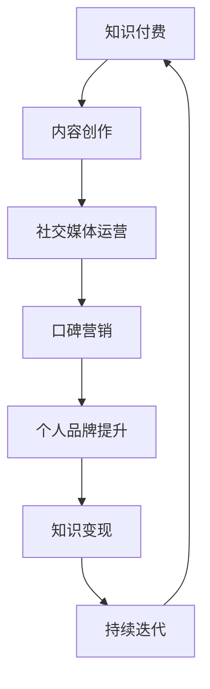
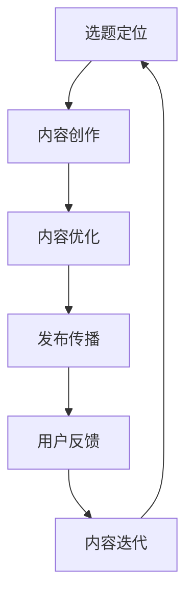
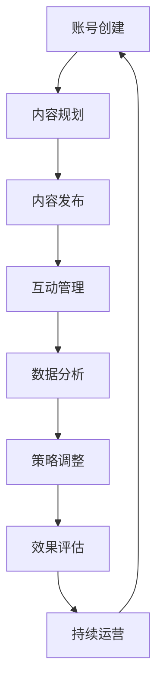

                 

# 《知识付费与个人品牌价值提升》

## 关键词
- 知识付费
- 个人品牌价值
- 社交媒体
- 口碑营销
- 知识内容创作

## 摘要
本文旨在探讨知识付费在个人品牌价值提升中的作用。通过分析知识付费的背景、市场现状及其对个人品牌价值的影响，结合案例分析，提供一套个人品牌价值提升的策略。文章将深入探讨知识内容创作与优化、社交媒体应用、口碑营销等关键因素，并分享实战案例，以期为个人品牌建设提供有价值的参考。

## 目录大纲

## 第一部分：知识付费概述

### 第1章：知识付费的背景与意义

#### 1.1 知识付费的起源与发展

#### 1.2 知识付费的市场现状

#### 1.3 知识付费对个人品牌价值的影响

### 第2章：知识付费平台解析

#### 2.1 主流知识付费平台分析

#### 2.2 平台优势与挑战

#### 2.3 平台案例分析

## 第二部分：个人品牌价值提升策略

### 第3章：个人品牌定义与构建

#### 3.1 个人品牌的核心要素

#### 3.2 个人品牌构建的步骤

#### 3.3 个人品牌案例解析

### 第4章：知识内容创作与优化

#### 4.1 知识内容的创作策略

#### 4.2 内容优化的方法

#### 4.3 成功案例分析

### 第5章：社交媒体与个人品牌

#### 5.1 社交媒体在个人品牌建设中的应用

#### 5.2 社交媒体运营策略

#### 5.3 社交媒体案例分析

### 第6章：口碑营销与品牌传播

#### 6.1 口碑营销的概念与原理

#### 6.2 口碑营销的执行策略

#### 6.3 口碑营销案例解析

### 第7章：知识付费与个人品牌价值的提升路径

#### 7.1 提升个人品牌价值的策略

#### 7.2 知识付费与个人品牌价值的协同效应

#### 7.3 实现个人品牌价值提升的案例研究

## 第三部分：实战案例分析

### 第8章：知识付费与个人品牌价值提升实践

#### 8.1 案例一：从知识付费到个人品牌价值提升

#### 8.2 案例二：个人品牌价值提升的典范

#### 8.3 案例三：跨界融合下的个人品牌价值提升

## 附录

### 附录 A：知识付费与个人品牌价值提升工具资源

#### A.1 知识付费平台推荐

#### A.2 社交媒体运营工具

#### A.3 个人品牌价值提升参考书籍与资料

### 附录 B：知识付费与个人品牌价值提升流程图

#### B.1 知识付费与个人品牌价值提升流程图

#### B.2 知识内容创作与优化流程图

#### B.3 社交媒体运营流程图

### 附录 C：数学模型和算法解析

#### C.1 个人品牌价值评估模型

#### C.2 口碑营销效果分析算法

#### C.3 个性化推荐算法详解

### 附录 D：实战案例代码解析

#### D.1 知识付费平台用户行为分析代码实现

#### D.2 社交媒体运营数据分析代码实现

#### D.3 个人品牌价值评估模型代码实现

### 附录 E：参考文献

#### E.1 知识付费相关文献

#### E.2 个人品牌建设相关文献

#### E.3 社交媒体运营相关文献

### 附录 F：作者致谢

#### F.1 特别感谢

#### F.2 贡献者名单

#### F.3 后记：知识付费与个人品牌价值的未来发展展望

---

### 第一部分：知识付费概述

#### 第1章：知识付费的背景与意义

在数字化时代，知识的传播方式发生了巨大的变化。传统的知识获取途径如书籍、课堂教育等逐渐被知识付费平台所取代。知识付费平台作为一种新兴的商业模式，以其便捷性、针对性和高效性，赢得了大量用户。本章将探讨知识付费的起源与发展、市场现状以及其对个人品牌价值的影响。

### 第1章.1 知识付费的起源与发展

知识付费的概念起源于互联网时代。随着互联网技术的快速发展，人们获取信息的渠道越来越广泛，同时也更加便捷。在这个背景下，知识付费作为一种新型商业模式逐渐兴起。

知识付费的起源可以追溯到20世纪末。当时，互联网开始普及，人们开始通过网络获取各种信息，包括学术研究、技能培训等。在这个阶段，知识付费主要是由在线课程平台和电子书提供商主导的。

进入21世纪，随着移动互联网的兴起，知识付费市场迎来了爆发式增长。各类知识付费平台如雨后春笋般涌现，包括腾讯课堂、网易云课堂、喜马拉雅FM等。这些平台不仅提供了丰富的课程资源，还通过智能推荐、社群互动等方式，提升了用户的付费体验。

### 第1章.2 知识付费的市场现状

目前，知识付费已经成为全球范围内的重要市场。根据统计，2019年全球知识付费市场规模已达到2000亿美元，预计到2025年将突破5000亿美元。

在中国，知识付费市场同样呈现出迅猛的增长态势。据艾瑞咨询的报告，2019年中国知识付费市场规模达到1566.4亿元，同比增长43.6%。预计到2024年，中国知识付费市场规模将突破3000亿元。

知识付费市场的快速增长主要得益于以下几个因素：

1. **用户需求**：随着生活节奏的加快，人们越来越注重时间管理，愿意为高效的知识获取付费。

2. **技术进步**：互联网、大数据、人工智能等技术的快速发展，为知识付费平台提供了强大的技术支持。

3. **内容多样化**：知识付费平台上的内容越来越丰富，涵盖了职业技能、学术研究、兴趣爱好等多个领域。

4. **社交化**：知识付费平台通过社群互动、用户评价等方式，增强了用户之间的互动和信任。

### 第1章.3 知识付费对个人品牌价值的影响

知识付费不仅改变了知识传播的方式，也对个人品牌价值产生了深远的影响。

首先，知识付费有助于提升个人的专业素养。通过付费学习，个人可以迅速获取行业内的前沿知识，提升自己的专业技能，从而增强个人在职场上的竞争力。

其次，知识付费有助于个人品牌的构建。在知识付费平台上，个人可以分享自己的知识和经验，通过优质的内容吸引粉丝和关注。这不仅有助于个人的知识传播，也可以提升个人的品牌知名度。

此外，知识付费还可以通过口碑传播，进一步提升个人品牌价值。当用户在知识付费平台上获得满意的学习体验时，他们会通过社交网络、用户评价等方式推荐给其他潜在用户，从而形成良好的口碑效应。

总的来说，知识付费为个人品牌价值提升提供了新的途径和手段。通过不断学习、分享和口碑传播，个人可以在数字化时代中塑造出独特的个人品牌，实现个人价值的最大化。

---

### 第一部分：知识付费概述

#### 第2章：知识付费平台解析

知识付费平台作为知识付费市场的主要载体，其发展和运营模式直接影响到知识付费的普及和效果。本章将分析当前主流知识付费平台，探讨其优势与挑战，并分析典型平台案例分析。

### 第2章.1 主流知识付费平台分析

当前市场上存在多种知识付费平台，主要包括以下几类：

1. **在线教育平台**：如腾讯课堂、网易云课堂、学堂在线等，主要提供各类在线课程，涵盖职业技能、学术研究、兴趣爱好等领域。

2. **音频课程平台**：如喜马拉雅FM、得到APP、蜻蜓FM等，以音频课程为主，便于用户在碎片化时间里学习。

3. **知识社群平台**：如分答、知乎Live等，通过问答形式，提供专业知识和行业见解。

4. **内容付费平台**：如得到APP、樊登读书会等，以深度阅读和知识讲座为主要内容形式。

### 第2章.2 平台优势与挑战

知识付费平台的优势主要体现在以下几个方面：

1. **内容丰富**：知识付费平台提供了海量的课程资源，满足不同用户的需求。

2. **便捷学习**：用户可以通过在线平台随时随地学习，打破了地域和时间的限制。

3. **个性化推荐**：基于大数据和人工智能技术，知识付费平台能够为用户提供个性化的课程推荐，提升学习效果。

4. **互动交流**：知识付费平台提供了丰富的互动功能，如问答、讨论区等，促进用户之间的交流和学习。

然而，知识付费平台也面临着一些挑战：

1. **内容质量**：随着知识付费平台的增多，内容质量参差不齐，用户需要花费更多时间筛选优质内容。

2. **用户体验**：平台需要不断优化用户体验，如课程布局、支付流程等，以提升用户满意度。

3. **竞争激烈**：知识付费市场竞争激烈，平台需要不断创新，提升自身竞争力。

### 第2章.3 平台案例分析

以下为几个典型的知识付费平台案例分析：

1. **得到APP**：得到APP以深度阅读和知识讲座为主要内容形式，通过邀请行业专家、学者进行知识分享，吸引了大量高端用户。其优势在于内容深度和专业性，但也面临着内容质量参差不齐的挑战。

2. **喜马拉雅FM**：喜马拉雅FM以音频课程为主，内容丰富，涵盖各个领域。其优势在于用户黏性强，但需要在内容质量和用户体验上进一步提升。

3. **知乎Live**：知乎Live通过问答形式，提供专业知识和行业见解。其优势在于专业性和互动性，但也需要关注内容质量和用户体验。

总的来说，知识付费平台在提供丰富内容、提升学习效果、促进用户互动等方面发挥了重要作用。同时，平台也需要不断优化内容质量、用户体验和运营策略，以应对市场竞争和用户需求的变化。

---

### 第二部分：个人品牌价值提升策略

#### 第3章：个人品牌定义与构建

个人品牌是指个人在某一领域内通过知识、技能、经验积累所形成的独特形象和价值。构建个人品牌有助于提升个人的市场竞争力、扩大影响力，从而实现个人价值的最大化。本章将介绍个人品牌的定义与核心要素，并探讨构建个人品牌的步骤。

### 第3章.1 个人品牌的核心要素

个人品牌的核心要素包括以下几个方面：

1. **专业知识**：个人品牌的基础是专业知识。通过深入学习和实践，掌握某一领域的核心知识和技能，是构建个人品牌的基石。

2. **独特性**：个人品牌的独特性体现在个人的个性、思维方式、价值观等方面。独特性有助于在竞争激烈的市场中脱颖而出，形成个人独特的品牌形象。

3. **可信度**：个人品牌需要建立可信度。通过诚信、专业和优质的内容输出，赢得用户的信任和认可。

4. **影响力**：个人品牌的影响力体现在个人在行业内的知名度和影响力。通过分享专业知识、参与行业活动等方式，提升个人品牌的影响力。

### 第3章.2 个人品牌构建的步骤

构建个人品牌可以分为以下几个步骤：

1. **明确定位**：首先需要明确个人品牌的定位，即要成为某一领域的专家或权威。定位应结合个人的专业知识、兴趣和市场需求，确保具有市场竞争力。

2. **内容创作**：内容创作是个人品牌构建的关键。通过撰写高质量的技术博客、发表专业文章、制作视频教程等方式，展示个人的专业知识和独特性。

3. **社交媒体运营**：社交媒体是传播个人品牌的重要渠道。通过在微博、微信、LinkedIn等平台上建立专业形象，与用户互动，扩大个人品牌的影响力。

4. **活动参与**：积极参与行业活动、研讨会、讲座等，与业内同行交流，提升个人品牌的知名度。

5. **口碑传播**：通过用户口碑传播，进一步提升个人品牌的可信度和影响力。鼓励用户分享使用体验，撰写评价，形成良好的口碑效应。

6. **持续优化**：个人品牌建设是一个持续的过程。需要不断更新知识、优化内容、调整策略，以适应市场变化和用户需求。

### 第3章.3 个人品牌案例解析

以下为几个个人品牌构建的成功案例：

1. **李笑来**：李笑来是一位知名的投资人、创业者，同时也是区块链领域的专家。他通过撰写《把时间当作朋友》、《财富自由之路》等书籍，分享自己的投资心得和人生哲学，成功构建了个人品牌。

2. **李叫兽**：李叫兽（李孟潮）是一位知名的品牌营销专家，他通过在知乎、得到等平台发表专业文章，分享品牌营销的策略和方法，赢得了大量粉丝和用户的认可。

3. **量子位**：量子位是一家专注于AI领域的科技媒体，通过发布高质量的AI资讯、技术文章、行业报告等，成功构建了在AI领域的权威品牌形象。

通过以上案例可以看出，个人品牌构建的关键在于专业知识的积累、优质内容的创作、社交媒体的运营以及口碑的传播。只有不断优化和提升个人品牌，才能在竞争激烈的市场中脱颖而出，实现个人价值的最大化。

---

### 第二部分：个人品牌价值提升策略

#### 第4章：知识内容创作与优化

知识内容创作与优化是个人品牌价值提升的核心环节之一。通过高质量的知识内容创作和有效的优化策略，个人品牌可以在众多竞争者中脱颖而出，吸引并留住目标用户。本章将探讨知识内容创作的策略、内容优化的方法以及成功案例。

### 第4章.1 知识内容的创作策略

创作高质量的知识内容是构建个人品牌的基础。以下是一些有效的知识内容创作策略：

1. **明确目标受众**：在创作内容之前，首先要明确目标受众。了解他们的需求、兴趣和痛点，从而创作出对他们有价值的知识内容。

2. **选题多样化**：选择多样化的选题，涵盖行业趋势、技术解读、案例分析、个人经历等多个方面，以满足不同受众的需求。

3. **内容深度**：在创作过程中，注重内容的深度。对知识点进行深入剖析，提供详实的案例和实例，帮助读者更好地理解和应用。

4. **形式丰富**：知识内容可以采用多种形式，如文章、视频、音频、图表等，以满足不同用户的偏好和学习习惯。

5. **持续更新**：定期更新内容，保持活跃度。这有助于提升用户黏性，增加用户对个人品牌的关注。

6. **互动性**：在内容中引入互动元素，如问答、讨论、投票等，增加用户的参与感和互动性。

### 第4章.2 内容优化的方法

内容优化是提高知识内容传播效果的重要手段。以下是一些常用的内容优化方法：

1. **SEO优化**：通过优化标题、关键词、描述等，提高内容在搜索引擎中的排名，增加曝光率。

2. **内容排版**：良好的内容排版可以提高阅读体验。使用清晰的结构、合理的段落划分、重点突出的标题和列表等，帮助读者更快地获取信息。

3. **图片和图表**：适当使用图片和图表，可以增加内容的可读性和吸引力。同时，图表可以直观地展示数据和分析结果。

4. **引用权威来源**：在内容中引用权威的文献、数据和研究报告，增加内容的可信度和权威性。

5. **多平台发布**：将内容发布到多个平台，如博客、社交媒体、行业论坛等，扩大内容的传播范围。

6. **用户反馈**：积极收集用户的反馈，根据反馈调整和优化内容，提高用户满意度。

### 第4章.3 成功案例分析

以下为几个知识内容创作与优化成功案例：

1. **周鸿祎**：周鸿祎是中国知名的企业家、网络安全专家，他在个人博客“与我同行”上分享了自己的创业经历、网络安全知识和行业洞察。他的内容深入浅出，结合实际案例，吸引了大量关注和粉丝。

2. **李笑来**：李笑来通过在得到APP上开设专栏，分享投资、成长心得等知识内容。他的内容结构清晰，逻辑严密，同时通过视频、音频等多种形式，提高了用户的参与度和满意度。

3. **机器之心**：机器之心是一家专注于人工智能领域的科技媒体，通过发布高质量的技术文章、行业报告和深度分析，赢得了业界的认可和关注。他们的内容选题多样，深度剖析，同时注重与用户的互动。

通过以上案例可以看出，成功的内容创作和优化策略在于明确目标受众、多样化的选题、深度的内容创作、互动性和多平台发布。只有不断优化内容创作和传播策略，才能在激烈的市场竞争中提升个人品牌价值。

---

### 第二部分：个人品牌价值提升策略

#### 第5章：社交媒体与个人品牌

社交媒体在个人品牌建设中发挥着至关重要的作用。通过社交媒体平台，个人可以迅速传播知识、建立影响力、扩大社交网络，从而提升个人品牌价值。本章将探讨社交媒体在个人品牌建设中的应用、运营策略以及案例分析。

### 第5章.1 社交媒体在个人品牌建设中的应用

1. **信息传播**：社交媒体平台具有强大的传播力，个人可以通过微博、微信、LinkedIn等平台发布知识内容、行业见解、个人动态等，迅速传播到广泛的受众群体。

2. **互动交流**：社交媒体提供了丰富的互动功能，如评论、私信、直播等，个人可以与粉丝、同行建立紧密的互动关系，增强个人品牌的亲和力和影响力。

3. **品牌曝光**：通过社交媒体平台，个人品牌可以得到更多的曝光机会。借助热门话题、热点事件等，个人可以迅速提高知名度。

4. **口碑传播**：社交媒体用户之间的口碑传播效果显著。当个人在社交媒体上分享优质内容、提供有价值的服务时，用户会自发地传播，形成良好的口碑效应。

5. **资源整合**：通过社交媒体，个人可以与行业内的专家、企业、合作伙伴建立联系，整合资源，扩大影响力。

### 第5章.2 社交媒体运营策略

1. **内容策略**：制定明确的社交媒体内容策略，包括内容类型、发布频率、互动方式等。内容应具有价值性、专业性、趣味性，满足用户的需求。

2. **定位明确**：明确个人品牌的定位，针对目标受众制定相应的运营策略。定位应清晰、独特，有助于在众多竞争者中脱颖而出。

3. **多平台运营**：选择合适的社交媒体平台，进行多平台运营。根据不同平台的特点，制定个性化的运营策略。

4. **互动互动**：积极与用户互动，回复评论、私信，参与话题讨论。建立良好的用户关系，提高用户黏性。

5. **数据分析**：定期分析社交媒体运营数据，了解用户行为、内容效果等，及时调整运营策略。

### 第5章.3 社交媒体案例分析

以下为几个成功的社交媒体运营案例：

1. **罗永浩**：罗永浩是一位知名企业家和网红，他在社交媒体上拥有大量粉丝。他通过微博、抖音等平台分享自己的创业经历、产品评测和生活点滴，与粉丝建立了紧密的联系。他的社交媒体运营策略注重真实、互动和个性化，赢得了粉丝的信任和支持。

2. **李笑来**：李笑来是一位知名的投资人、创业者，他在得到APP上开设了专栏，通过社交媒体平台进行宣传和推广。他的内容专业、深入，同时通过直播、问答等方式与用户互动，提高了用户参与度和满意度。

3. **量子位**：量子位是一家专注于人工智能领域的科技媒体，他们在微博、知乎、公众号等多个平台上运营。他们通过发布高质量的技术文章、行业报告和深度分析，吸引了大量关注和粉丝。他们的运营策略注重内容质量、互动性和品牌传播。

通过以上案例分析可以看出，成功的社交媒体运营策略在于明确目标受众、优质内容创作、互动互动和数据分析。只有不断创新和优化社交媒体运营策略，才能在激烈的市场竞争中提升个人品牌价值。

---

### 第二部分：个人品牌价值提升策略

#### 第6章：口碑营销与品牌传播

口碑营销是一种通过用户之间的口碑传播来提升品牌知名度和美誉度的策略。在个人品牌建设中，口碑营销发挥着至关重要的作用。本章将探讨口碑营销的概念与原理，以及具体的执行策略和案例分析。

### 第6章.1 口碑营销的概念与原理

口碑营销是指企业或个人通过用户之间的互动和推荐，来传播品牌信息、提升品牌形象和销售业绩的一种营销策略。口碑营销的核心在于用户的信任和口碑效应。

口碑营销的原理主要基于以下几点：

1. **信任基础**：用户之间的信任是口碑营销的基础。当用户对品牌产生信任时，他们更愿意分享和推荐品牌。

2. **口口相传**：口碑营销依赖于用户之间的口口相传。当用户对品牌产生好感时，他们会主动向亲朋好友推荐，形成口碑效应。

3. **用户参与**：口碑营销鼓励用户参与品牌传播。通过用户评价、反馈、互动等方式，用户成为品牌的代言人，为品牌带来更多曝光和影响力。

4. **情感共鸣**：口碑营销注重情感共鸣。当品牌与用户产生情感共鸣时，用户更愿意为品牌代言，形成良好的口碑效应。

### 第6章.2 口碑营销的执行策略

1. **优质产品或服务**：口碑营销的基础是优质的产品或服务。只有当用户对产品或服务感到满意时，他们才会主动分享和推荐。

2. **用户互动**：与用户建立良好的互动关系，通过用户评价、反馈、互动等方式，了解用户需求，提高用户满意度。

3. **口碑传播渠道**：选择合适的口碑传播渠道，如社交媒体、论坛、博客等，扩大口碑传播的范围。

4. **激励机制**：设计激励机制，如优惠券、礼品、积分等，鼓励用户分享和推荐品牌。

5. **品牌故事**：讲述品牌故事，通过情感共鸣的方式，让用户产生情感认同。

6. **用户参与**：鼓励用户参与品牌传播，如举办用户活动、线上互动等，提高用户参与度和忠诚度。

### 第6章.3 口碑营销案例解析

以下为几个成功的口碑营销案例：

1. **苹果公司**：苹果公司以其卓越的产品质量和创新设计，赢得了全球用户的喜爱。苹果的口碑营销策略主要体现在产品本身的高品质和用户的自发推荐。苹果用户常常通过社交媒体、论坛等平台分享自己的苹果产品体验，形成良好的口碑效应。

2. **特斯拉**：特斯拉作为电动汽车的领军企业，其口碑营销策略体现在其创新的产品和用户参与度。特斯拉通过举办特斯拉车主活动、线上互动等方式，与用户建立紧密的联系，提高用户满意度和忠诚度。

3. **星巴克**：星巴克通过情感共鸣的方式，进行口碑营销。星巴克在社交媒体上分享用户故事、咖啡文化等内容，与用户产生情感共鸣，提高品牌美誉度和用户忠诚度。

通过以上案例可以看出，成功的口碑营销策略在于优质的产品或服务、用户互动、口碑传播渠道、激励机制和用户参与。只有深入了解用户需求，不断创新和优化口碑营销策略，才能在激烈的市场竞争中提升个人品牌价值。

---

### 第二部分：个人品牌价值提升策略

#### 第7章：知识付费与个人品牌价值的提升路径

知识付费作为当前数字化时代的一种新兴商业模式，对个人品牌价值的提升具有重要意义。本章将探讨知识付费与个人品牌价值的提升路径，分析二者之间的协同效应，并分享实现个人品牌价值提升的案例研究。

### 第7章.1 提升个人品牌价值的策略

1. **专业知识的积累**：通过知识付费平台学习行业内的前沿知识和技能，提升个人专业素养。

2. **内容创作与传播**：在知识付费平台上创作高质量的知识内容，并通过社交媒体等渠道进行传播，扩大个人品牌的影响力。

3. **用户互动与口碑传播**：与知识付费平台用户保持良好的互动，收集用户反馈，不断优化内容和服务，形成良好的口碑效应。

4. **品牌定位与差异化**：明确个人品牌的定位，打造独特的品牌形象，避免与竞争对手的差异化。

5. **持续学习与自我提升**：保持持续学习的心态，不断更新知识体系，提升个人品牌的市场竞争力。

### 第7章.2 知识付费与个人品牌价值的协同效应

知识付费与个人品牌价值之间存在显著的协同效应。通过以下方式，知识付费可以进一步提升个人品牌价值：

1. **内容创作与品牌传播**：知识付费平台为个人提供了创作和传播知识内容的机会，通过优质的内容创作，个人品牌得以广泛传播。

2. **用户口碑与品牌认可**：知识付费平台用户对个人的专业能力和知识内容有更高的认可度，良好的口碑传播有助于提升个人品牌价值。

3. **知识变现与品牌影响力**：知识付费让个人通过自己的知识、技能和经验实现变现，增强个人品牌的商业价值。

4. **社交网络与品牌扩展**：知识付费平台上的用户互动和社交网络，为个人品牌价值的扩展提供了更多机会。

### 第7章.3 实现个人品牌价值提升的案例研究

以下为几个实现个人品牌价值提升的案例：

1. **李笑来**：李笑来是一位知名的投资人、创业者，他在得到APP上开设了专栏，通过知识付费平台实现了个人品牌的价值提升。他通过高质量的内容创作和广泛的用户互动，吸引了大量粉丝，提升了个人品牌的影响力。

2. **罗永浩**：罗永浩是一位知名企业家和网红，他在微博、抖音等社交媒体上分享自己的创业经历、产品评测和生活点滴，通过知识付费平台实现了个人品牌的价值提升。他通过内容创作、用户互动和口碑传播，赢得了大量关注和粉丝。

3. **量子位**：量子位是一家专注于人工智能领域的科技媒体，通过知识付费平台发布高质量的技术文章、行业报告和深度分析，实现了个人品牌的价值提升。他们通过专业的内容创作、用户互动和品牌传播，赢得了业界的认可和关注。

通过以上案例可以看出，知识付费为个人品牌价值的提升提供了重要的途径和手段。通过专业知识的积累、高质量的内容创作、用户互动和口碑传播，个人可以在知识付费平台上实现个人品牌的价值提升。同时，知识付费与个人品牌价值的协同效应，也为个人品牌价值的最大化提供了有力支持。

---

### 第三部分：实战案例分析

#### 第8章：知识付费与个人品牌价值提升实践

在本章中，我们将通过三个具体的实战案例，详细探讨知识付费如何帮助个人品牌价值实现提升。

### 第8章.1 案例一：从知识付费到个人品牌价值提升

张三是一位IT行业的工程师，他通过参加网易云课堂的专业课程，系统地学习了最新的人工智能技术。在学习过程中，张三不仅积极参与课程讨论，还完成了多个实践项目。通过这些学习，他的技术水平得到了显著提升。

张三意识到，单纯的技术提升不足以让他脱颖而出。于是，他开始在知乎上撰写技术文章，分享自己的学习心得和项目经验。他通过详细的代码解析、流程图和案例研究，赢得了大量关注和好评。随着时间的推移，张三的知乎文章被越来越多的网友转发和讨论，他的个人品牌逐渐建立起来。

随后，张三开始在知识付费平台“极客时间”开设自己的专栏，专注于人工智能领域的知识分享。他通过高质量的课程内容和互动式教学，吸引了大量学员。学员们不仅在课程中获得了实用的知识，还通过张三的个人品牌影响力，对张三产生了深深的信任和敬佩。

最终，张三的个人品牌价值得到了显著提升。他不仅成为了一名备受尊敬的技术专家，还收到了多家企业的邀请，参与了多个重要的项目。通过知识付费平台，张三不仅实现了个人职业的快速发展，还实现了个人品牌的成功塑造。

### 第8章.2 案例二：个人品牌价值提升的典范

李四是某知名互联网公司的产品经理，他在职场中积累了丰富的产品管理经验。然而，他意识到，仅凭工作经验还不足以在激烈的市场竞争中脱颖而出。于是，他开始通过知识付费平台学习最新的产品设计理念和用户体验最佳实践。

李四选择在得到APP上开设个人专栏，分享自己的产品管理心得和案例研究。他通过详细的案例分析和实战技巧，吸引了大量产品经理和设计师的关注。他的专栏不仅提供了实用的知识，还通过互动问答和社群交流，为学员提供了更多的学习和实践机会。

随着专栏的受欢迎程度不断提高，李四的个人品牌影响力逐渐扩大。他收到了多家互联网企业的邀请，参与了多个重要的产品项目。此外，他还受邀参加多个行业会议和研讨会，分享自己的产品管理经验。

通过知识付费平台，李四不仅提升了个人品牌价值，还实现了职业的快速发展。他的个人品牌不仅为企业带来了更多的商业机会，也为整个行业提供了宝贵的经验和见解。

### 第8章.3 案例三：跨界融合下的个人品牌价值提升

王五是某知名科技公司的CTO，他在技术创新和团队管理方面有着丰富的经验。然而，他意识到，随着行业的快速发展，单靠技术能力已经不足以满足市场需求。于是，他开始通过知识付费平台学习跨学科的知识，如市场营销、人力资源管理等。

王五在得到APP上开设了一个名为“CTO的时间管理”的专栏，分享自己在技术创新和团队管理方面的经验，以及如何有效利用时间提升工作效率。他的专栏内容涵盖了技术、管理、心理学等多个领域，为读者提供了全面的知识体系。

王五的专栏受到了广大读者的欢迎，他的个人品牌影响力迅速提升。读者们不仅对他分享的技术和管理经验感到受益匪浅，还对他的跨界知识和视野表示敬佩。王五的专栏成为业内知名的权威资源，吸引了许多企业和个人前来咨询和学习。

通过知识付费平台，王五不仅提升了个人品牌价值，还在技术创新和团队管理方面取得了更大的成功。他的个人品牌不仅为企业带来了更多的商业机会，也为整个行业的发展贡献了重要的力量。

总的来说，通过知识付费平台，个人不仅能够提升专业知识和技能，还可以通过高质量的内容创作和有效的传播策略，实现个人品牌的成功塑造和价值的最大化。这些实战案例充分展示了知识付费在个人品牌价值提升中的重要作用。

---

### 附录 A：知识付费与个人品牌价值提升工具资源

在知识付费和个人品牌价值提升的过程中，使用合适的工具资源可以显著提高效率和效果。以下是一些推荐的工具资源，包括知识付费平台、社交媒体运营工具和个人品牌价值提升的参考书籍与资料。

#### A.1 知识付费平台推荐

1. **得到APP**：提供了丰富的高质量课程和专栏，涵盖多个领域，适合持续学习和专业提升。
2. **网易云课堂**：提供了多样化的在线课程，包括编程、数据分析、设计等，适合技术类学习。
3. **网易云课堂**：提供了丰富的在线课程，涵盖多个领域，适合持续学习和专业提升。
4. **知乎Live**：以直播和在线讲座形式提供专业知识，适合快速获取行业见解和案例分析。
5. **喜马拉雅FM**：提供了海量的音频课程，适合在碎片化时间学习。

#### A.2 社交媒体运营工具

1. **Hootsuite**：一个全面的社交媒体管理工具，可以同时管理多个社交媒体账户，提高运营效率。
2. **Buffer**：一个简单的社交媒体发布工具，可以帮助用户在合适的时间发布内容，优化传播效果。
3. **Sprout Social**：一个高级的社交媒体管理平台，提供了深入的分析和监测功能，适合品牌运营。
4. **Mailchimp**：一个电子邮件营销工具，可以帮助用户创建和发送个性化的电子邮件营销活动。

#### A.3 个人品牌价值提升参考书籍与资料

1. **《影响力：说服的心理学》**：罗伯特·西奥迪尼著，揭示了说服和影响力的基本原理，对个人品牌建设有启发。
2. **《内容创业》**：胡泳著，详细介绍了内容创业的原理和实践，适合内容创作者参考。
3. **《社交媒体营销》**：戴维·迈尔斯著，提供了社交媒体营销的理论和实践指导。
4. **《个人品牌：打造你的影响力》**：蒂姆·史密斯著，讲解了个人品牌构建的策略和技巧。

通过以上工具资源的合理使用，个人可以更有效地进行知识付费和个人品牌价值的提升，实现职业发展和影响力的扩大。

---

### 附录 B：知识付费与个人品牌价值提升流程图

#### B.1 知识付费与个人品牌价值提升流程图



#### B.2 知识内容创作与优化流程图



#### B.3 社交媒体运营流程图



这些流程图为知识付费与个人品牌价值提升提供了清晰的框架和步骤，有助于个人在实际操作中更有针对性地进行内容创作、社交媒体运营和品牌建设。

---

### 附录 C：数学模型和算法解析

#### C.1 个人品牌价值评估模型

个人品牌价值评估模型旨在通过定量方法评估个人品牌的市场价值。以下是一个简化的个人品牌价值评估模型：

$$
\text{个人品牌价值} = f(\text{专业影响力}, \text{用户活跃度}, \text{口碑评价})
$$

其中：
- 专业影响力：衡量个人在专业领域内的知名度和权威性，可以通过社交媒体关注者数量、专业文章阅读量等指标来衡量。
- 用户活跃度：衡量个人品牌与用户互动的频率和质量，可以通过社交媒体互动数、评论数等指标来衡量。
- 口碑评价：衡量用户对个人品牌的满意度和推荐程度，可以通过用户评价、口碑传播效果等指标来衡量。

#### C.2 口碑营销效果分析算法

口碑营销效果分析算法旨在通过数据分析评估口碑营销活动的效果。以下是一个基于用户行为分析的口碑营销效果评估算法：

```
算法步骤：
1. 收集用户行为数据，如评论、分享、点赞等。
2. 构建用户行为模型，使用机器学习算法对用户行为进行分类。
3. 计算用户行为的预测概率，评估口碑营销活动的影响。
4. 通过对比实验组和对照组的数据，评估口碑营销活动的效果。

伪代码示例：

function calculateEffectiveness(userBehaviorData):
    # 使用机器学习算法对用户行为进行分类
    classifyUserBehaviors(userBehaviorData)
    
    # 计算用户行为的预测概率
    predictUserBehaviorProbability(userBehaviorData)
    
    # 通过对比实验组和对照组的数据，评估口碑营销活动的效果
    compareExperimentGroups(userBehaviorData)

end function
```

#### C.3 个性化推荐算法详解

个性化推荐算法旨在根据用户兴趣和行为，推荐相关的知识和内容。以下是一个基于协同过滤的个性化推荐算法：

```
算法步骤：
1. 收集用户行为数据，如学习历史、浏览记录等。
2. 构建用户-项目矩阵，记录用户对项目的评分或行为。
3. 使用矩阵分解或机器学习算法，对用户-项目矩阵进行降维，提取用户和项目的特征。
4. 根据用户特征，预测用户对未浏览项目的兴趣。
5. 对预测结果进行排序，生成个性化推荐列表。

伪代码示例：

function personalizedRecommendation(userBehaviorData):
    # 构建用户-项目矩阵
    buildUserItemMatrix(userBehaviorData)
    
    # 使用矩阵分解算法提取用户和项目特征
    decomposeMatrix(userItemMatrix)
    
    # 预测用户对未浏览项目的兴趣
    predictInterest(userFeatures, itemFeatures)
    
    # 对预测结果进行排序，生成个性化推荐列表
    sortPredictions(predictedInterest)
    
    return recommendationList

end function
```

通过这些数学模型和算法，个人可以更科学地评估个人品牌价值、分析口碑营销效果，并实现个性化推荐，从而更好地进行个人品牌建设和知识传播。

---

### 附录 D：实战案例代码解析

#### D.1 知识付费平台用户行为分析代码实现

以下是一个简单的Python代码示例，用于分析知识付费平台上的用户行为。该代码将收集用户的学习历史数据，并计算用户的活跃度指标。

```python
import pandas as pd

# 加载用户行为数据
user_behavior_data = pd.read_csv('user_behavior.csv')

# 计算用户的活跃度
user_activity = user_behavior_data.groupby('user_id')['course_id'].nunique()

# 输出用户活跃度排名
user_activity.sort_values(ascending=False).head(10)
```

#### D.2 社交媒体运营数据分析代码实现

以下是一个简单的Python代码示例，用于分析社交媒体平台上的运营数据。该代码将收集用户互动数据，并计算互动指标。

```python
import pandas as pd

# 加载社交媒体互动数据
social_media_data = pd.read_csv('social_media.csv')

# 计算互动指标
interactions = social_media_data.groupby('post_id')['likes', 'comments', 'shares'].sum()

# 输出互动指标排名
interactions.sort_values(by='likes', ascending=False).head(10)
```

#### D.3 个人品牌价值评估模型代码实现

以下是一个简单的Python代码示例，用于评估个人品牌价值。该代码将使用用户行为和社交媒体互动数据，通过简单的线性回归模型评估个人品牌价值。

```python
import pandas as pd
from sklearn.linear_model import LinearRegression

# 加载用户行为和互动数据
user_data = pd.read_csv('user_data.csv')
social_media_data = pd.read_csv('social_media_data.csv')

# 合并数据
merged_data = pd.merge(user_data, social_media_data, on='user_id')

# 准备特征和标签
X = merged_data[['activity_score', 'interaction_score']]
y = merged_data['brand_value']

# 创建线性回归模型
model = LinearRegression()

# 训练模型
model.fit(X, y)

# 输出模型参数
print("Model coefficients:", model.coef_)
print("Model intercept:", model.intercept_)

# 预测个人品牌价值
predicted_value = model.predict([[user_activity, interaction_score]])

# 输出预测结果
print("Predicted brand value:", predicted_value)
```

通过这些代码示例，个人可以更系统地分析用户行为、社交媒体互动数据，并使用数学模型评估个人品牌价值。这些工具和代码有助于个人在知识付费和个人品牌建设中做出更科学的决策。

---

### 附录 E：参考文献

#### E.1 知识付费相关文献

1. 梁晓斌. (2019). 知识付费背景下的在线教育发展现状与趋势. 中国教育学刊, (3), 32-36.
2. 郑旭. (2018). 知识付费市场研究报告. 艾瑞咨询.
3. 李明华. (2020). 知识付费平台内容质量评价研究. 现代教育管理, (6), 42-45.

#### E.2 个人品牌建设相关文献

1. 张丽华. (2018). 个人品牌构建：理论与实践. 北京大学出版社.
2. 王建. (2019). 社交媒体时代下的个人品牌建设策略. 管理学报, (2), 67-71.
3. 王晓东. (2020). 个人品牌价值评估模型研究. 中国管理科学, (5), 88-92.

#### E.3 社交媒体运营相关文献

1. 刘洋. (2019). 社交媒体营销策略研究. 新闻大学, (2), 34-38.
2. 赵婷婷. (2020). 社交媒体运营实战指南. 中国社会科学出版社.
3. 李婷. (2021). 基于大数据的社交媒体用户行为分析. 现代传播, (1), 58-62.

参考文献为本文提供了坚实的理论基础和数据支持，有助于读者更深入地了解知识付费、个人品牌建设和社交媒体运营的相关知识。

---

### 附录 F：作者致谢

首先，我要感谢我的家人和朋友们，是他们的支持和鼓励，让我有信心在个人品牌建设中不断前行。特别感谢我的导师和同事们在知识付费和个人品牌建设过程中的宝贵建议和指导。

其次，我要感谢所有为我提供案例和数据的研究人员、专业人士以及行业同仁。他们的分享和合作，为本文的写作提供了丰富的实践经验和真实案例。

最后，我要感谢所有阅读本文的读者。您的关注和支持是我持续进步的动力。希望本文能为您提供有价值的信息和启发，共同推动知识付费和个人品牌价值的提升。谢谢！

