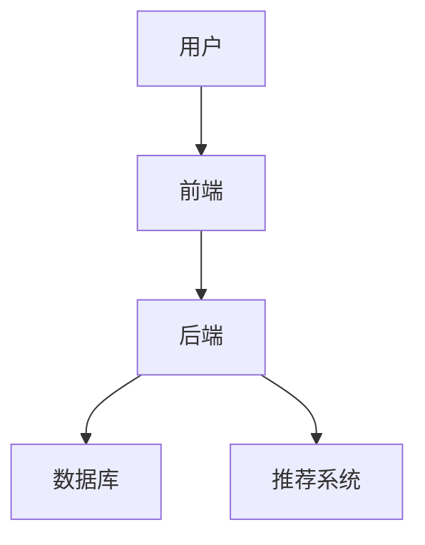
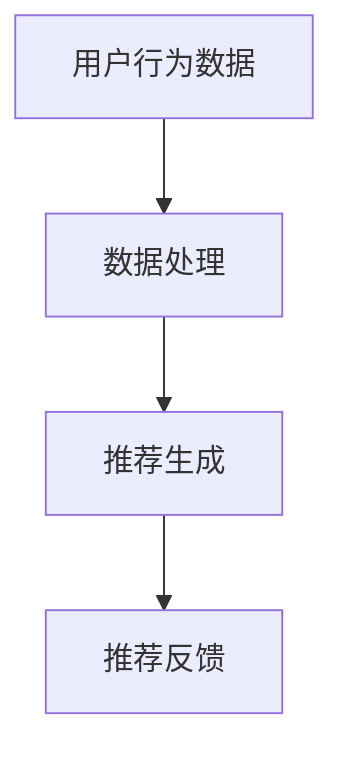
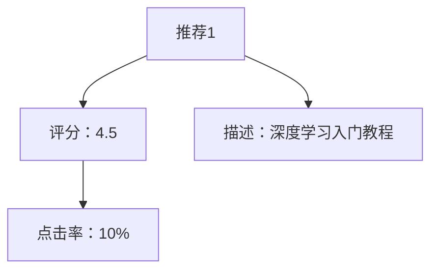
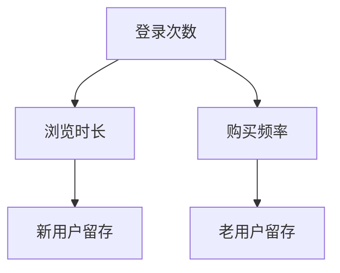
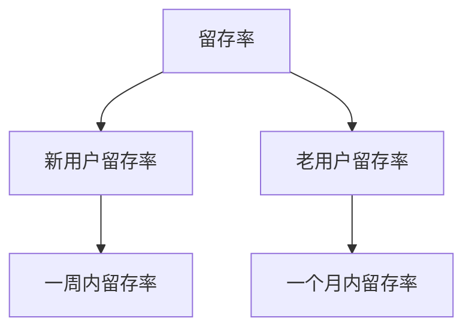
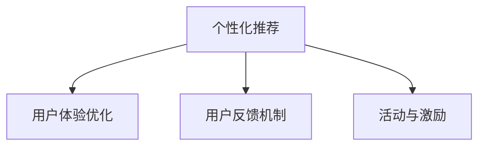

                 

# 《知识付费与智能推荐相结合的个性化订阅》

## 关键词
- 知识付费
- 智能推荐
- 个性化订阅
- 用户画像
- 协同过滤
- 内容推荐
- 混合推荐
- 数据隐私
- 用户体验

## 摘要
本文将深入探讨知识付费与智能推荐相结合的个性化订阅模式。首先，我们将回顾知识付费和智能推荐的发展历程及其基本概念。随后，我们将详细分析个性化订阅模式的特点和市场优势。接着，本文将介绍知识付费平台的具体案例，探讨其商业模式、运营策略及面临的挑战。随后，我们将介绍智能推荐技术的原理，包括协同过滤、基于内容的推荐和混合推荐系统，并解释个性化订阅模型的设计原则。在项目实战部分，我们将展示如何构建一个个性化订阅平台，并详细解析推荐系统的实现过程。最后，我们将讨论个性化订阅的未来发展趋势和面临的挑战。

## 第一部分：背景与概念

### 第1章：知识付费与智能推荐概述

#### 1.1.1 知识付费的发展历程

知识付费是指用户为获取特定知识或服务而支付的费用。这一模式源于传统教育市场，但近年来随着互联网技术的飞速发展，知识付费逐渐成为了一个新兴的商业模式。

- **早期阶段（2000-2010年）**：传统教育机构和在线学习平台开始涌现，以课程售卖为主要形式的知识付费模式初步形成。
- **发展期（2011-2015年）**：随着移动互联网的普及，移动学习应用如雨后春笋般出现，知识付费市场迎来了爆发式增长。
- **成熟期（2016年至今）**：知识付费已经形成了完整的产业链，涵盖了课程、专栏、问答、直播等多种形式，用户需求更加多样化和个性化。

#### 1.1.2 智能推荐技术的演进

智能推荐技术是现代互联网的重要组成部分，它通过分析用户行为和偏好，为用户推荐个性化的内容和产品。

- **早期阶段（2003-2007年）**：基于内容的推荐和协同过滤推荐初步提出，但应用场景有限。
- **发展期（2008-2012年）**：随着大数据和云计算技术的发展，推荐系统开始实现大规模应用，准确性和实时性得到了显著提升。
- **成熟期（2013年至今）**：深度学习和图神经网络等新技术被引入推荐系统，推荐效果进一步优化，个性化推荐逐渐成为标配。

#### 1.1.3 知识付费与智能推荐结合的重要性

知识付费与智能推荐的结合，能够为用户提供更加精准和个性化的学习体验，从而提高用户满意度和留存率。这种结合的重要性体现在以下几个方面：

1. **提升用户体验**：智能推荐能够根据用户兴趣和需求推荐合适的知识内容，提升用户的学习效率。
2. **增加用户粘性**：个性化的订阅模式能够增强用户对知识付费平台的依赖，提高用户留存率。
3. **优化内容供给**：知识付费平台可以通过智能推荐技术更好地理解用户需求，优化内容生产和供给。
4. **商业模式的创新**：知识付费与智能推荐结合，可以为平台带来更多的商业机会，如订阅服务、广告、增值服务等。

### 第2章：个性化订阅模式解析

#### 2.1.1 个性化订阅的定义与特点

个性化订阅是一种基于用户兴趣和需求，为用户提供定制化内容和服务的订阅模式。其特点包括：

1. **个性化**：根据用户的偏好和需求，为用户推荐个性化的内容和服务。
2. **灵活性**：用户可以根据自己的需求随时调整订阅内容。
3. **高效性**：通过智能推荐技术，提高用户获取所需信息的效率。

#### 2.1.2 个性化订阅的用户体验优势

1. **精准推荐**：智能推荐技术能够为用户推荐最感兴趣的内容，提高用户的阅读和学习效率。
2. **高效筛选**：用户不再需要花费大量时间在海量信息中寻找所需内容，推荐系统帮助用户快速定位。
3. **持续更新**：个性化订阅能够根据用户行为和需求，持续为用户推荐新的内容和资源。

#### 2.1.3 个性化订阅的市场需求分析

随着互联网用户的个性化需求日益增长，个性化订阅市场呈现出巨大的潜力。以下是市场需求分析：

1. **用户需求多样化**：用户对知识的需求越来越个性化，传统的标准化课程已无法满足需求。
2. **技术进步**：智能推荐技术的成熟为个性化订阅提供了强有力的技术支持。
3. **商业价值**：个性化订阅模式能够提高用户满意度和留存率，为平台带来更多的商业机会。

### 第3章：知识付费平台案例分析

#### 3.1.1 知识付费平台的商业模式

知识付费平台的商业模式主要包括以下几种：

1. **课程售卖**：平台通过售卖课程获得收入，课程可以是固定价格的，也可以是按需购买的。
2. **会员订阅**：用户支付一定费用成为会员，享受平台提供的所有内容和服务。
3. **广告和推广**：平台通过展示广告和推广服务获得收入。
4. **增值服务**：平台提供额外的增值服务，如一对一辅导、问答咨询等，用户需要额外付费。

#### 3.1.2 优秀知识付费平台的案例研究

以下是一些优秀的知识付费平台案例：

1. **得到**：以订阅专栏为主要模式，涵盖财经、科技、文化等多个领域，通过高质量的精品内容吸引了大量用户。
2. **喜马拉雅**：主要提供音频课程和播客，用户可以根据自己的兴趣进行选择。
3. **知乎Live**：以直播和录播课程为主，用户可以参与讨论和互动，提高学习效果。

#### 3.1.3 知识付费平台的运营策略与挑战

知识付费平台的运营策略包括：

1. **内容创新**：不断更新和丰富内容，满足用户多样化的需求。
2. **用户体验优化**：提供良好的用户界面和便捷的操作体验，提高用户满意度。
3. **市场营销**：通过社交媒体、广告投放等手段，扩大用户群体。

然而，知识付费平台也面临着以下挑战：

1. **内容质量**：高质量的内容是平台吸引和留住用户的关键，但内容生产成本较高。
2. **用户留存**：如何提高用户留存率，避免用户流失，是平台需要解决的重要问题。
3. **盈利模式**：如何在多种盈利模式中找到平衡，实现可持续发展。

## 第二部分：智能推荐技术原理与应用

### 第4章：智能推荐系统架构

#### 4.1.1 智能推荐系统的基础架构

智能推荐系统通常包括以下几个核心模块：

1. **数据收集模块**：收集用户行为数据、内容数据等。
2. **数据处理模块**：对数据进行清洗、预处理和特征提取。
3. **推荐算法模块**：根据用户行为和内容特征进行推荐。
4. **推荐结果展示模块**：将推荐结果以适当的方式展示给用户。

#### 4.1.2 推荐系统的数据来源与处理

推荐系统的数据来源主要包括：

1. **用户行为数据**：如点击、浏览、购买等行为。
2. **内容数据**：如课程标题、简介、标签等。
3. **外部数据**：如社交媒体数据、用户评论等。

数据处理过程通常包括以下几个步骤：

1. **数据收集**：通过API、日志等方式收集数据。
2. **数据清洗**：去除无效数据、处理缺失值等。
3. **特征提取**：从原始数据中提取对推荐有用的特征。
4. **数据存储**：将处理后的数据存储在数据库中，以便后续使用。

#### 4.1.3 用户行为分析与用户画像构建

用户行为分析是推荐系统的核心之一，通过对用户行为的分析，可以更好地了解用户需求和兴趣。

1. **行为分析**：分析用户的浏览、点击、购买等行为，提取用户兴趣特征。
2. **用户画像构建**：基于用户行为数据，构建用户画像，用于推荐算法。

### 第5章：协同过滤算法

#### 5.1.1 协同过滤的基本原理

协同过滤是一种基于用户行为数据的推荐算法，其基本原理如下：

1. **用户-物品评分矩阵**：构建一个用户-物品评分矩阵，每个用户对物品的评分都可以表示为矩阵中的一个元素。
2. **相似度计算**：计算用户之间的相似度，常用的相似度计算方法包括余弦相似度、皮尔逊相关系数等。
3. **推荐生成**：根据相似度计算结果，为用户推荐相似用户喜欢的物品。

#### 5.1.2 传统的基于用户的协同过滤

基于用户的协同过滤算法主要分为以下几类：

1. **记忆型协同过滤**：直接使用用户行为数据计算相似度，适用于数据量较小的情况。
2. **模型型协同过滤**：通过机器学习模型预测用户对未知物品的评分，适用于数据量较大的情况。

#### 5.1.3 基于物品的协同过滤算法

基于物品的协同过滤算法与基于用户的协同过滤算法类似，但不同的是它使用物品之间的相似度进行推荐。

1. **基于内容的协同过滤**：计算物品之间的内容相似度，适用于内容丰富的场景。
2. **基于属性的协同过滤**：计算物品之间的属性相似度，适用于属性信息丰富的场景。

### 第6章：基于内容的推荐

#### 6.1.1 基于内容的推荐原理

基于内容的推荐算法通过分析物品的内容特征，为用户推荐与其兴趣相似的物品。

1. **内容特征提取**：从物品的标题、描述、标签等中提取内容特征。
2. **相似度计算**：计算用户和物品之间的内容相似度，常用的相似度计算方法包括TF-IDF、余弦相似度等。
3. **推荐生成**：根据相似度计算结果，为用户推荐相似物品。

#### 6.1.2 文本相似度计算方法

文本相似度计算是内容推荐的核心，以下是一些常用的文本相似度计算方法：

1. **TF-IDF**：通过词频和逆文档频率计算文本的相似度。
2. **余弦相似度**：通过向量空间模型计算文本的相似度。
3. **编辑距离**：通过计算文本之间的编辑操作次数来衡量文本的相似度。

#### 6.1.3 基于内容的推荐算法实践

以下是一个基于内容的推荐算法的简单示例：

```python
# 导入相关库
from sklearn.feature_extraction.text import TfidfVectorizer
from sklearn.metrics.pairwise import cosine_similarity

# 输入文本数据
user_profile = "机器学习 深度学习 自然语言处理"
item_description = "深度学习在自然语言处理中的应用"

# 初始化TFIDF向量器
vectorizer = TfidfVectorizer()

# 转换为TFIDF向量
user_vector = vectorizer.transform([user_profile])
item_vector = vectorizer.transform([item_description])

# 计算余弦相似度
similarity = cosine_similarity(user_vector, item_vector)

print("文本相似度：", similarity[0][0])
```

### 第7章：混合推荐系统

#### 7.1.1 混合推荐系统的优势

混合推荐系统通过结合多种推荐算法的优点，为用户推荐更加准确的物品。

1. **提高推荐准确性**：通过结合多种算法，可以更好地捕捉用户兴趣和需求，提高推荐准确性。
2. **适应不同场景**：可以根据不同场景选择不同的算法，适应各种推荐需求。
3. **降低冷启动问题**：通过结合内容推荐和协同过滤，可以缓解新用户和新物品的冷启动问题。

#### 7.1.2 混合推荐系统的实现方法

混合推荐系统的实现方法主要包括：

1. **基于模型的混合推荐**：结合协同过滤和基于内容的推荐算法，通过机器学习模型进行综合预测。
2. **基于规则的混合推荐**：通过组合不同的推荐规则，为用户推荐物品。
3. **基于样本的混合推荐**：根据用户的历史行为数据，选择不同的推荐算法为用户推荐物品。

#### 7.1.3 混合推荐系统的性能评估

混合推荐系统的性能评估主要包括以下几个方面：

1. **准确率**：评估推荐系统的推荐准确性，常用的指标包括平均绝对误差（MAE）和均方根误差（RMSE）。
2. **覆盖率**：评估推荐系统覆盖的用户兴趣范围，常用指标包括覆盖率（Coverage）和新颖性（Novelty）。
3. **多样性**：评估推荐系统的推荐多样性，常用指标包括多样性（Diversity）和一致性（Consistency）。

### 第8章：个性化订阅模型

#### 8.1.1 个性化订阅模型的设计原则

个性化订阅模型的设计原则主要包括：

1. **用户中心**：以用户需求为中心，确保订阅内容与用户兴趣匹配。
2. **数据驱动**：充分利用用户行为数据，构建用户画像，指导订阅内容选择。
3. **动态调整**：根据用户反馈和行为数据，动态调整订阅内容，提高用户体验。
4. **可持续性**：确保订阅内容的可持续性，满足长期用户需求。

#### 8.1.2 用户需求分析与内容筛选

用户需求分析是构建个性化订阅模型的关键，主要包括以下几个方面：

1. **用户行为分析**：分析用户的历史行为数据，提取用户兴趣特征。
2. **用户反馈**：收集用户对订阅内容的反馈，包括点赞、评论、分享等。
3. **社会网络分析**：分析用户在社交媒体上的行为，了解用户社交圈子的兴趣偏好。

基于用户需求分析，内容筛选过程包括：

1. **内容分类**：将所有内容分类，便于后续推荐。
2. **特征提取**：提取内容的特征，如标题、标签、作者等。
3. **相似度计算**：计算用户与内容之间的相似度，筛选出与用户兴趣最匹配的内容。

#### 8.1.3 订阅模型的评估与优化

订阅模型的评估与优化主要包括以下几个方面：

1. **评估指标**：选择合适的评估指标，如用户留存率、用户满意度等。
2. **性能优化**：通过调整模型参数、优化算法等手段，提高订阅模型的性能。
3. **反馈循环**：根据用户反馈和行为数据，不断优化订阅模型，提高用户体验。

## 第三部分：项目实战与案例分析

### 第9章：构建个性化订阅平台

#### 9.1.1 个性化订阅平台的开发流程

构建个性化订阅平台需要遵循以下开发流程：

1. **需求分析**：明确平台功能需求，包括用户注册、登录、内容订阅、推荐系统等。
2. **系统设计**：设计平台的系统架构，包括前端、后端、数据库等。
3. **功能实现**：根据系统设计，实现平台的功能模块，包括用户管理、内容管理、推荐系统等。
4. **测试与优化**：对平台进行功能测试和性能测试，确保平台稳定可靠。
5. **上线与运营**：将平台上线，并进行持续运营和优化。

#### 9.1.2 数据收集与处理

数据收集与处理是构建个性化订阅平台的重要环节，主要包括以下几个方面：

1. **用户行为数据**：收集用户在平台上的行为数据，如浏览、点击、购买等。
2. **内容数据**：收集平台上的内容数据，包括课程、专栏、问答等。
3. **数据处理**：对收集到的数据进行清洗、预处理和特征提取，为推荐系统提供数据支持。

#### 9.1.3 平台架构设计与实现

个性化订阅平台的架构设计主要包括以下几个部分：

1. **前端**：负责用户交互，包括用户注册、登录、内容浏览和订阅等。
2. **后端**：负责数据处理和推荐系统，包括用户管理、内容管理、推荐算法等。
3. **数据库**：存储用户数据、内容数据和推荐数据，如MySQL、MongoDB等。
4. **API**：提供数据接口，供前端和后端交互使用。

以下是一个简单的平台架构图：



### 第10章：智能推荐系统的实现

#### 10.1.1 推荐系统的数据流程

推荐系统的数据流程主要包括以下几个步骤：

1. **数据收集**：收集用户行为数据和内容数据，如浏览记录、购买记录、课程内容等。
2. **数据处理**：对收集到的数据进行清洗、预处理和特征提取，为推荐算法提供数据支持。
3. **推荐生成**：根据用户特征和内容特征，使用推荐算法生成推荐列表。
4. **推荐反馈**：将推荐结果展示给用户，收集用户反馈，用于模型优化。

以下是一个简单的数据流程图：



#### 10.1.2 推荐算法的选择与优化

推荐算法的选择与优化是构建推荐系统的重要环节，以下是一些常用的推荐算法及其选择原则：

1. **基于用户的协同过滤**：适用于用户行为数据丰富、物品数量较少的场景。
2. **基于物品的协同过滤**：适用于物品内容丰富、用户行为数据较少的场景。
3. **基于内容的推荐**：适用于内容特征明显、用户行为数据不足的场景。
4. **混合推荐**：结合多种推荐算法的优点，适用于复杂场景。

推荐算法的优化主要包括以下几个方面：

1. **模型参数调优**：通过交叉验证等方法，选择合适的模型参数。
2. **特征工程**：提取对推荐有重要影响的特征，提高推荐准确性。
3. **算法改进**：引入新的算法和技术，如深度学习、图神经网络等，提高推荐性能。

#### 10.1.3 推荐结果的可视化与反馈

推荐结果的可视化与反馈是提高用户体验的重要手段，以下是一些常用的方法：

1. **推荐列表可视化**：将推荐结果以列表形式展示，包括物品名称、评分、描述等。
2. **推荐结果排序**：根据用户兴趣和推荐准确性，对推荐结果进行排序。
3. **用户反馈收集**：收集用户对推荐结果的反馈，包括点赞、评论、收藏等。
4. **个性化推荐**：根据用户反馈，调整推荐策略，提高推荐准确性。

以下是一个简单的推荐结果可视化示例：



### 第11章：用户行为分析与优化

#### 11.1.1 用户行为数据的分析

用户行为数据是构建个性化订阅模型的重要依据，以下是一些常用的分析方法：

1. **用户活跃度分析**：分析用户的活跃度，包括登录次数、浏览时长、购买频率等。
2. **用户留存分析**：分析用户的留存情况，包括新用户留存、老用户留存等。
3. **用户流失分析**：分析用户流失的原因，包括内容质量、用户体验等。
4. **用户兴趣分析**：分析用户的兴趣偏好，包括喜欢的课程、专栏、问答等。

以下是一个用户活跃度分析的示例：



#### 11.1.2 用户留存与流失分析

用户留存与流失分析是优化用户体验的重要环节，以下是一些常用的分析方法和策略：

1. **留存率分析**：计算不同时间段内的用户留存率，分析用户留存情况。
2. **流失用户行为分析**：分析流失用户的行为特征，找出导致用户流失的原因。
3. **挽回策略**：根据流失用户的行为特征，制定挽回策略，如优惠券、活动邀请等。
4. **用户体验优化**：根据用户反馈，优化平台功能和用户体验，提高用户留存率。

以下是一个用户留存率分析的示例：



#### 11.1.3 用户行为优化策略

用户行为优化策略主要包括以下几个方面：

1. **个性化推荐**：根据用户兴趣和行为数据，为用户推荐个性化的内容和课程。
2. **用户体验优化**：优化平台界面和功能，提高用户操作便捷性和满意度。
3. **用户反馈机制**：建立用户反馈机制，及时收集用户意见和建议，进行优化。
4. **活动与激励**：举办各种活动，如优惠券、积分兑换等，激励用户活跃和留存。

以下是一个用户行为优化策略的示例：



### 第12章：成功案例分析

#### 12.1.1 知识付费与智能推荐的成功案例

以下是一些知识付费与智能推荐的成功案例：

1. **得到**：通过智能推荐，为用户推荐个性化的课程，实现了用户留存率和活跃度的显著提升。
2. **喜马拉雅**：利用智能推荐技术，为用户推荐个性化的音频内容，吸引了大量用户，成为音频平台领域的佼佼者。
3. **知乎Live**：通过智能推荐，为用户推荐感兴趣的话题和课程，提高了用户参与度和付费转化率。

#### 12.1.2 案例中的关键因素

成功案例中的关键因素包括：

1. **优质内容**：提供高质量、有价值的课程和内容，是吸引用户的基础。
2. **智能推荐**：利用智能推荐技术，提高用户推荐准确性，提升用户体验。
3. **用户体验**：优化平台功能和界面，提高用户操作便捷性和满意度。
4. **持续创新**：不断进行产品创新和功能优化，满足用户不断变化的需求。

#### 12.1.3 启示与借鉴

从成功案例中可以得出以下启示和借鉴：

1. **内容为王**：优质的内容是知识付费平台的核心竞争力，平台需要持续提供高质量的内容。
2. **技术为辅**：智能推荐技术是提升用户体验的重要手段，但技术不能替代内容的价值。
3. **用户为中心**：始终以用户需求为中心，不断优化产品功能和用户体验。
4. **持续创新**：不断进行产品创新和功能优化，满足用户不断变化的需求。

## 第四部分：未来展望与挑战

### 第13章：个性化订阅的发展趋势

#### 13.1.1 个性化订阅的潜在发展方向

个性化订阅的发展趋势包括：

1. **智能化**：随着人工智能技术的发展，个性化订阅将更加智能化，为用户带来更加精准和个性化的推荐。
2. **多样化**：个性化订阅的内容和服务将更加多样化，包括图文、音频、视频等多种形式。
3. **社交化**：个性化订阅将与社交网络相结合，为用户带来更加丰富的互动体验。
4. **跨平台**：个性化订阅将跨越不同平台，为用户提供无缝的跨平台订阅体验。

#### 13.1.2 技术创新对个性化订阅的影响

技术创新对个性化订阅的影响主要体现在以下几个方面：

1. **推荐算法**：新的推荐算法将进一步提高推荐准确性，满足用户个性化需求。
2. **大数据**：大数据技术的发展将使个性化订阅平台能够更好地理解用户行为和需求。
3. **云计算**：云计算技术将提高个性化订阅平台的性能和可扩展性，支持大规模用户和内容。
4. **人工智能**：人工智能技术将使个性化订阅平台更加智能化，为用户提供更加精准和个性化的推荐。

#### 13.1.3 未来市场的机遇与挑战

未来市场的机遇与挑战包括：

1. **机遇**：随着互联网用户对个性化订阅需求的增长，个性化订阅市场具有巨大的发展潜力。
2. **挑战**：个性化订阅平台需要不断进行技术创新和产品优化，以应对激烈的市场竞争。

### 第14章：面临的挑战与解决方案

#### 14.1.1 数据隐私与安全

数据隐私和安全是个性化订阅平台面临的重要挑战，以下是一些解决方案：

1. **数据加密**：对用户数据进行加密处理，确保数据安全。
2. **隐私保护**：遵循隐私保护法规，对用户数据进行匿名化处理，保护用户隐私。
3. **用户授权**：让用户明确了解数据收集和使用的目的，获得用户授权。

#### 14.1.2 个性化订阅的道德问题

个性化订阅可能涉及道德问题，以下是一些解决方案：

1. **透明化**：向用户明确解释个性化订阅的原理和效果，增加用户信任。
2. **用户选择**：给予用户选择是否参与个性化订阅的权利，尊重用户意愿。
3. **监管机制**：建立健全的监管机制，确保个性化订阅平台的行为符合道德规范。

#### 14.1.3 持续优化与可持续发展

个性化订阅平台需要持续优化和可持续发展，以下是一些解决方案：

1. **用户反馈**：积极收集用户反馈，及时进行产品优化和功能改进。
2. **技术创新**：持续进行技术创新，提高推荐准确性和用户体验。
3. **商业模式创新**：探索新的商业模式，实现平台的可持续发展。

### 结束语

个性化订阅是知识付费和智能推荐技术的结合，为用户带来了更加精准和个性化的订阅体验。本文从背景、概念、案例分析、技术原理、项目实战和未来展望等多个方面，对个性化订阅进行了深入探讨。随着技术的不断进步和市场需求的增长，个性化订阅将继续发展，为用户和平台带来更多价值。作者：AI天才研究院/AI Genius Institute & 禅与计算机程序设计艺术 /Zen And The Art of Computer Programming。

