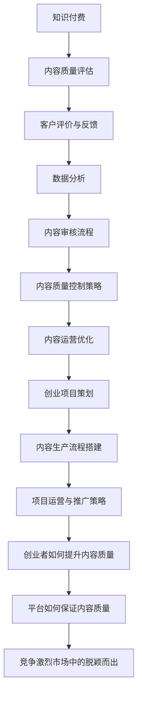

                 

### 文章标题

《知识付费创业中的内容质量把控》

#### 核心关键词：

- 知识付费
- 内容质量评估
- 客户评价与反馈
- 数据分析
- 内容审核流程
- 内容运营优化
- 创业实践

#### 摘要：

本文从知识付费市场的背景和发展趋势入手，详细分析了内容创作者的生态和激励机制。接着，深入探讨了内容质量评估的方法、质量控制策略和内容运营优化技巧。通过案例分析，本文展示了如何在实际创业项目中应用这些策略。最后，本文为创业者提供了在竞争激烈的市场中提升内容质量和实现成功创业的实践建议。

---

### 《知识付费创业中的内容质量把控》目录大纲

#### 第一部分：知识付费市场概述

##### 第1章：知识付费行业背景与发展

###### 1.1 知识付费概念解析

###### 1.2 知识付费市场现状分析

###### 1.3 知识付费行业趋势预测

##### 第2章：内容创作者生态解析

###### 2.1 内容创作者类型及特点

###### 2.2 内容创作者的商业模式

###### 2.3 内容创作者的激励机制

#### 第二部分：内容质量评估与把控

##### 第3章：内容质量评估方法

###### 3.1 内容质量评估指标体系

###### 3.2 客户评价与反馈机制

###### 3.3 数据分析在内容质量评估中的应用

##### 第4章：内容质量控制策略

###### 4.1 内容审核流程设计

###### 4.2 内容审核工具与技术

###### 4.3 内容质量把控的关键环节

##### 第5章：内容运营优化

###### 5.1 内容运营策略

###### 5.2 内容推广与传播

###### 5.3 内容迭代与优化

#### 第三部分：案例分析与实战

##### 第6章：优秀知识付费案例解析

###### 6.1 案例一：案例分析

###### 6.2 案例二：案例分析

###### 6.3 案例三：案例分析

##### 第7章：知识付费创业实践

###### 7.1 创业项目策划

###### 7.2 内容生产流程搭建

###### 7.3 项目运营与推广策略

##### 第8章：内容质量把控技巧与建议

###### 8.1 创作者如何提升内容质量

###### 8.2 平台如何保证内容质量

###### 8.3 创业者如何在竞争激烈的市场中脱颖而出

#### 附录

##### 附录A：知识付费行业报告汇总

###### A.1 行业报告一

###### A.2 行业报告二

###### A.3 行业报告三

---

**附加内容**

#### 第9章：核心概念与联系



#### 第10章：核心算法原理讲解

##### 10.1 客户评价与反馈机制

###### 10.1.1 评价算法设计

```python
# 伪代码：客户评价算法
def evaluate_content(content, user):
    score = 0
    for rating in user_ratings:
        score += rating
    return score / len(user_ratings)
```

###### 10.1.2 反馈算法设计

```python
# 伪代码：反馈收集算法
def collect_feedback(content, user):
    feedback = []
    for question in feedback_questions:
        feedback.append(user.answer(question))
    return feedback
```

##### 10.2 内容审核流程

###### 10.2.1 审核流程设计

```python
# 伪代码：内容审核流程
def content_audit(content):
    if not is_content_valid(content):
        return "内容审核未通过"
    
    analysis_results = content_analysis(content)
    
    if analysis_results['sensitive_content']:
        return "内容审核未通过：包含敏感信息"
    elif analysis_results['violates_rules']:
        return "内容审核未通过：违反平台规则"
    else:
        return "内容审核通过"
```

###### 10.2.2 内容分析实现

```python
# 伪代码：内容分析函数
def content_analysis(content):
    # 实现内容分析的具体逻辑，如使用自然语言处理技术
    analysis_results = {}
    # 示例：判断是否包含敏感词
    analysis_results['sensitive_content'] = contains_sensitive_words(content)
    # 示例：判断是否违反平台规则
    analysis_results['violates_rules'] = violates_platform_rules(content)
    return analysis_results
```

#### 第11章：数学模型和数学公式

##### 11.1 内容质量评估指标体系

###### 11.1.1 指标权重分配

```latex
$$
W_i = \frac{C_i}{\sum_{i=1}^{n} C_i}
$$`

其中，\( W_i \) 为指标 \( i \) 的权重，\( C_i \) 为指标 \( i \) 的总分。
```

###### 11.1.2 评分模型

```latex
$$
S = \sum_{i=1}^{n} W_i \cdot C_i
$$`

其中，\( S \) 为总评分，\( W_i \) 为指标 \( i \) 的权重，\( C_i \) 为指标 \( i \) 的得分。
```

#### 第12章：项目实战

##### 12.1 代码实际案例和详细解释说明

###### 12.1.1 开发环境搭建

- 安装 Python 3.8 或更高版本
- 安装必要的库，如 numpy、pandas、tensorflow

###### 12.1.2 源代码详细实现和代码解读

- 解释 content_audit 函数的作用和实现逻辑
- 详细解读 is_content_valid 和 content_analysis 函数的实现细节

###### 12.1.3 代码解读与分析

- 分析代码的效率和可维护性
- 提出优化建议和改进措施

##### 12.2 开发环境搭建

- 安装 Python 3.8 或更高版本
- 安装必要的库，如 numpy、pandas、tensorflow

##### 12.3 源代码详细实现和代码解读

- 解释 content_audit 函数的作用和实现逻辑
- 详细解读 is_content_valid 和 content_analysis 函数的实现细节

##### 12.4 代码解读与分析

- 分析代码的效率和可维护性
- 提出优化建议和改进措施

---

至此，我们已经完成了文章的目录大纲和附加内容的编写。接下来，我们将逐步深入到每个章节的具体内容，进行详细的讲解和分析。

---

接下来，我们将正式开始撰写文章的内容。首先，我们将从知识付费市场的背景和发展趋势入手，为读者提供对这一领域的全面了解。

---

#### 第一部分：知识付费市场概述

##### 第1章：知识付费行业背景与发展

###### 1.1 知识付费概念解析

知识付费是指用户为获取高质量、有价值的知识内容而支付的费用。这种模式的出现源于互联网技术的发展和用户对知识和信息的强烈需求。知识付费不仅仅包括传统教育领域，还涵盖了职场技能、兴趣爱好、财经资讯等多个方面。

在知识付费市场中，主要参与者包括内容创作者、平台运营者和用户。内容创作者通过创作和提供优质内容获得收益；平台运营者则通过搭建和运营知识付费平台，连接创作者和用户，实现内容的流通和价值的最大化；用户则通过付费获取所需的知识和技能。

###### 1.2 知识付费市场现状分析

近年来，随着互联网普及率的提高和用户消费观念的转变，知识付费市场呈现出快速增长的趋势。根据相关报告，2020年中国知识付费市场规模已超过3000亿元，预计未来还将保持高速增长。

知识付费市场的主要特点如下：

1. **用户需求多样化**：用户对知识的需求越来越个性化、多样化，不再局限于传统的学历教育，而是涵盖了职场技能、兴趣爱好、健康管理等多个领域。
2. **平台竞争激烈**：众多平台纷纷进入知识付费市场，通过差异化策略争夺用户。这些平台包括传统教育机构、专业内容平台、社交媒体等。
3. **内容形式丰富**：知识付费内容的形式多样化，包括音频、视频、图文、直播等多种形式，满足了不同用户的学习和消费习惯。
4. **商业模式创新**：知识付费平台不断探索新的商业模式，如订阅制、会员制、课程包等，以提升用户体验和平台黏性。

###### 1.3 知识付费行业趋势预测

未来，知识付费行业将继续保持高速增长，主要趋势如下：

1. **用户规模持续扩大**：随着互联网普及率的提高和用户消费能力的提升，知识付费的用户规模将继续扩大。
2. **内容质量成为核心竞争力**：在竞争激烈的市场中，平台和创作者将更加注重内容质量，优质内容将获得更多用户认可和市场份额。
3. **技术驱动内容创新**：人工智能、大数据等技术将在知识付费领域得到广泛应用，推动内容创新和用户体验的提升。
4. **跨界合作日益频繁**：知识付费将与更多行业融合发展，如电商、社交、娱乐等，形成多元化的知识生态体系。
5. **国际化发展**：随着全球化进程的加快，知识付费市场将逐渐走向国际化，国内外知识付费平台将开展更多合作，共享市场机遇。

通过以上分析，我们可以看出，知识付费行业正处在快速发展的阶段，市场前景广阔。对于创业者而言，了解市场背景和发展趋势，有助于制定更加科学合理的创业策略。

在下一章中，我们将深入探讨内容创作者的生态，分析不同类型的内容创作者及其商业模式，帮助创业者更好地了解这一领域的运作机制。

---

#### 第二部分：内容质量评估与把控

##### 第3章：内容质量评估方法

内容质量是知识付费平台的核心竞争力之一。一个高质量的内容不仅能提升用户的满意度和留存率，还能增强平台的品牌形象和市场竞争力。因此，对内容质量进行科学、系统的评估是知识付费平台运营的重要环节。

###### 3.1 内容质量评估指标体系

内容质量评估需要建立一套全面的指标体系，从多个维度对内容进行评估。以下是一些常见的内容质量评估指标：

1. **内容专业性**：内容的专业性是评估内容质量的重要指标之一。这包括内容的准确度、深度和广度。对于专业知识类内容，专业性的评估尤为重要。

2. **内容原创性**：原创性是衡量内容质量的关键因素。高原创性的内容能够提供独特的价值，避免抄袭和重复内容。

3. **内容实用性**：实用性是衡量内容能否解决用户实际问题的重要指标。实用性的内容能够为用户带来实际的帮助和收益。

4. **内容完整性**：完整性是指内容是否覆盖了用户关注的各个方面。完整的内容能够提供系统的知识体系，满足用户的求知需求。

5. **内容更新频率**：更新频率是指内容更新的速度和频率。对于知识类内容，定期更新能够保证内容的时效性和准确性。

6. **用户互动性**：用户互动性是指内容是否能够激发用户的参与和互动。互动性的内容能够增强用户的粘性和活跃度。

7. **用户满意度**：用户满意度是评估内容质量的最直接指标。通过用户评价、反馈和留存率等指标，可以直观地了解用户对内容的满意度。

建立内容质量评估指标体系时，需要根据平台的具体定位和用户需求，确定合适的评估指标及其权重。以下是一个示例性的内容质量评估指标体系：

| 指标       | 权重   | 描述                                                         |
|------------|--------|--------------------------------------------------------------|
| 内容专业性 | 30%   | 内容的准确性、深度和广度。                                   |
| 原创性     | 20%   | 内容的原创性，避免抄袭和重复。                               |
| 实用性     | 25%   | 内容能否解决用户实际问题。                                  |
| 完整性     | 10%   | 内容是否覆盖了用户关注的各个方面。                           |
| 更新频率   | 5%    | 内容更新的速度和频率。                                       |
| 用户互动性 | 5%    | 内容是否能够激发用户的参与和互动。                           |
| 用户满意度 | 5%    | 用户对内容的评价和反馈。                                     |

通过以上指标体系，平台可以全面、系统地评估内容质量，为后续的内容生产和运营提供数据支持。

###### 3.2 客户评价与反馈机制

客户评价与反馈是内容质量评估的重要手段之一。通过用户的评价和反馈，平台可以了解用户对内容的真实感受，及时发现和解决问题，不断提升内容质量。

1. **评价算法设计**

评价算法的设计需要考虑多个因素，如用户评分的权重、评分的时间戳、评分的匿名性等。以下是一个简单的评价算法设计：

```python
# 伪代码：客户评价算法
def evaluate_content(content, user):
    score = 0
    ratings = fetch_ratings(content, user)
    for rating in ratings:
        score += rating.weight * rating.value
    return score / len(ratings)
```

在这个算法中，`fetch_ratings` 函数用于获取用户对内容的评分记录，`rating.weight` 表示评分的权重（例如，最新评分的权重可能更高），`rating.value` 表示评分的值。

2. **反馈收集算法**

用户反馈是内容质量改进的重要依据。平台可以通过多种渠道收集用户反馈，如在线问卷、用户论坛、客服聊天等。以下是一个简单的反馈收集算法：

```python
# 伪代码：反馈收集算法
def collect_feedback(content, user):
    feedback = []
    questions = fetch_feedback_questions()
    for question in questions:
        answer = user.answer(question)
        feedback.append((question, answer))
    return feedback
```

在这个算法中，`fetch_feedback_questions` 函数用于获取反馈问题列表，`user.answer(question)` 用于获取用户的回答。

通过评价和反馈机制，平台可以实时了解用户对内容的满意度，及时发现内容存在的问题，并针对性地进行改进。

###### 3.3 数据分析在内容质量评估中的应用

数据分析在内容质量评估中发挥着重要作用。通过数据分析，平台可以深入了解用户的行为和偏好，从而优化内容质量和用户体验。

1. **用户行为分析**

用户行为分析可以帮助平台了解用户的浏览、购买、评价等行为模式。通过分析这些行为数据，平台可以发现用户的兴趣点、内容偏好等，为内容生产和优化提供依据。

2. **内容表现分析**

内容表现分析可以评估不同内容的表现，包括用户观看时长、互动率、转化率等指标。通过这些指标，平台可以识别出表现优秀的和需要改进的内容，为内容运营提供指导。

3. **用户满意度分析**

用户满意度分析可以通过调查问卷、用户评价等方式收集用户对内容的满意度数据。通过分析这些数据，平台可以评估内容质量的用户认可度，发现改进的机会。

4. **趋势预测**

通过历史数据分析和趋势预测，平台可以预测未来内容的表现和用户需求，为内容生产和策略调整提供前瞻性指导。

综上所述，内容质量评估方法需要综合使用评价指标、客户评价和反馈机制，以及数据分析等手段，从多个维度全面评估内容质量，为平台的持续改进提供有力支持。

在下一章中，我们将进一步探讨内容质量控制策略，包括内容审核流程设计、审核工具与技术，以及内容质量把控的关键环节。

---

#### 第二部分：内容质量评估与把控

##### 第4章：内容质量控制策略

内容质量控制是知识付费平台运营的核心环节之一，直接关系到平台的用户满意度、品牌形象和市场竞争力。有效的质量控制策略可以帮助平台确保内容的专业性、原创性、实用性、完整性和互动性，从而提升用户体验和平台的整体质量。

###### 4.1 内容审核流程设计

内容审核流程是确保内容质量和合规性的重要手段。一个完善的内容审核流程应该包括以下步骤：

1. **内容提交**：内容创作者将创作的内容提交到平台，内容类型可能包括文章、视频、音频、直播等。

2. **初步审核**：平台对提交的内容进行初步审核，检查内容的基本格式、完整性等。这一步的目的是排除不符合基本要求的内容。

3. **专业审核**：平台邀请专业审核员对内容进行深入审核，重点关注内容的准确性、深度、广度、原创性等方面。专业审核员通常具备相关领域的专业背景。

4. **反馈与修改**：如果审核员发现内容存在问题，会向内容创作者提供具体的反馈意见，要求进行修改。修改后的内容需要重新提交审核。

5. **最终审核**：修改后的内容再次提交审核，审核员进行最终审核。如果内容符合要求，则通过审核，可以发布；否则，继续反馈和修改。

6. **发布与监控**：通过审核的内容可以发布，平台需要对发布后的内容进行实时监控，收集用户反馈和评价，以便及时发现问题并进行改进。

内容审核流程的设计需要考虑审核效率和内容质量的关系，确保审核流程既能保证内容质量，又能提高审核速度，减少内容发布延迟。

###### 4.2 内容审核工具与技术

现代内容审核离不开技术的支持。以下是一些常用的内容审核工具和技术：

1. **自然语言处理（NLP）**：NLP 技术可以用于文本内容的审核，如检测敏感词、识别语法错误、评估内容情感等。例如，可以使用 NLP 技术构建一个文本分类模型，自动识别和过滤违规内容。

2. **图像识别**：对于图像和视频内容，图像识别技术可以用于检测和识别不良内容，如暴力、色情等。

3. **机器学习**：通过机器学习技术，可以训练模型自动识别和过滤违规内容。例如，可以使用监督学习算法，通过标注好的数据集训练分类模型，然后应用于新内容审核。

4. **人工智能助手**：人工智能助手可以辅助审核员进行内容审核，提高审核效率和准确性。例如，可以设计一个智能助手，帮助审核员快速定位内容问题并提供修改建议。

5. **用户反馈系统**：平台可以建立用户反馈系统，收集用户对内容的评价和投诉。这些反馈数据可以作为内容审核的重要参考，帮助识别问题内容并进行改进。

6. **区块链技术**：区块链技术可以用于确保内容的真实性和完整性。例如，可以将内容存储在区块链上，确保内容的不可篡改性和可追溯性。

通过结合多种技术手段，平台可以实现高效、准确的内容审核，确保内容质量和合规性。

###### 4.3 内容质量把控的关键环节

内容质量把控的关键环节包括以下几个方面：

1. **内容策划**：在内容创作之前，需要进行充分的内容策划，确定内容主题、目标受众、内容形式等。一个好的内容策划可以确保内容的针对性和专业性。

2. **内容创作**：内容创作是质量把控的基础。创作者需要具备专业知识和创作能力，确保内容的专业性、原创性和实用性。

3. **内容审核**：内容审核是确保内容质量的关键环节。通过建立完善的审核流程和使用先进的审核技术，可以确保内容的合规性和准确性。

4. **用户反馈**：用户反馈是内容质量把控的重要参考。平台需要建立有效的用户反馈机制，收集和分析用户对内容的评价和投诉，及时调整和改进内容。

5. **数据监控**：平台需要实时监控内容的表现和用户行为，通过数据分析识别问题内容，及时进行调整和优化。

6. **内容迭代**：内容不是一成不变的，需要根据用户反馈和数据分析进行持续的迭代和优化，确保内容始终符合用户需求。

通过以上关键环节的把控，平台可以确保内容质量，提升用户体验和品牌形象，实现持续的发展。

在下一章中，我们将探讨内容运营优化策略，包括内容运营策略、内容推广与传播方法以及内容迭代与优化的实践。

---

#### 第二部分：内容质量评估与把控

##### 第5章：内容运营优化

内容运营是知识付费平台成功的关键环节之一。通过科学的内容运营策略、有效的推广与传播手段以及持续的内容迭代与优化，平台可以提升内容的质量和用户体验，从而增强用户黏性和平台竞争力。

###### 5.1 内容运营策略

内容运营策略是指平台在内容生产、发布和推广过程中采取的系统性措施。一个成功的运营策略应考虑以下方面：

1. **明确目标**：制定清晰的内容运营目标，如提升用户满意度、增加用户留存率、扩大用户规模等。目标应与平台整体战略一致，具体可量化。

2. **内容定位**：根据目标用户群体的特点和需求，明确内容定位。内容定位应体现平台的核心竞争力，确保内容的专业性和独特性。

3. **内容规划**：制定内容发布计划，包括内容的主题、形式、发布频率等。内容规划应考虑用户消费习惯和平台资源，确保内容发布有序、持续。

4. **用户互动**：通过评论、问答、直播等方式，增强用户与内容之间的互动，提升用户参与度和满意度。互动内容可以鼓励用户分享和传播，增加内容的曝光率。

5. **数据分析**：利用数据分析工具，监控内容的表现，如浏览量、互动率、转化率等。通过数据分析，可以及时发现内容问题，优化运营策略。

6. **内容调优**：根据用户反馈和数据分析，不断调整和优化内容，提升内容质量。调优可以涉及内容主题、形式、结构等方面。

###### 5.2 内容推广与传播

内容推广与传播是扩大内容影响力的重要手段。以下是一些有效的内容推广策略：

1. **社交媒体**：利用微博、微信、抖音等社交媒体平台，进行内容推广和传播。可以通过官方账号发布内容，也可以与KOL、网红合作，借助其影响力进行推广。

2. **广告投放**：在各大广告平台上进行精准投放，如百度广告、朋友圈广告、微博广告等。广告投放可以根据用户兴趣、行为等数据进行定向投放，提高投放效果。

3. **合作推广**：与其他相关平台或机构进行合作，如教育机构、企业培训等，通过联合推广，扩大内容的影响力。

4. **内容营销**：通过撰写高质量、有吸引力的内容，吸引用户主动分享和传播。内容营销可以包括专业文章、教程、案例研究等。

5. **事件营销**：结合热点事件或平台特色，策划具有话题性和互动性的活动，吸引用户关注和参与。例如，举办线上讲座、直播互动、主题活动等。

6. **SEO优化**：通过搜索引擎优化（SEO）技术，提高内容在搜索引擎中的排名，增加自然流量。SEO优化包括关键词研究、内容优化、外部链接建设等。

通过多样化的推广与传播手段，平台可以提升内容的影响力，吸引更多用户，实现内容的广泛传播。

###### 5.3 内容迭代与优化

内容迭代与优化是保持内容活力和竞争力的重要手段。以下是一些内容迭代与优化的实践方法：

1. **用户反馈**：收集用户对内容的反馈，了解用户的需求和意见。用户反馈可以来自平台内置的评价系统、用户评论、用户调研等。

2. **数据分析**：通过数据分析，了解内容的表现，如用户停留时间、点击率、转化率等。数据分析可以帮助发现内容问题，为优化提供依据。

3. **定期更新**：定期对内容进行更新，保持内容的时效性和准确性。更新可以包括补充新信息、修正错误、增加新内容等。

4. **主题拓展**：根据用户反馈和数据分析，对内容主题进行拓展，增加相关内容和角度，满足用户的多样化需求。

5. **内容结构优化**：优化内容结构，提高内容的可读性和易用性。例如，调整段落布局、添加图表、优化标题等。

6. **多渠道分发**：将优质内容通过多种渠道分发，如公众号、微博、视频平台等，扩大内容的覆盖面和影响力。

7. **用户参与**：鼓励用户参与内容创作和优化，例如，通过问卷调查、互动话题等方式，收集用户意见和建议。

通过持续的内容迭代与优化，平台可以不断提升内容质量，满足用户需求，增强用户黏性。

综上所述，内容运营优化是一个系统性的过程，涉及内容策略、推广传播和迭代优化等多个方面。通过科学的内容运营策略、有效的推广手段和持续的内容优化，平台可以不断提升内容质量和用户体验，实现持续的发展和增长。

在下一部分，我们将通过具体的案例分析和创业实践，进一步探讨如何在实际操作中应用上述内容质量把控和运营优化策略。

---

#### 第三部分：案例分析与实战

##### 第6章：优秀知识付费案例解析

在知识付费市场中，有许多成功的案例值得我们学习和借鉴。这些案例展示了不同类型的内容创作者和平台如何通过有效的策略和优质的内容，取得了良好的市场表现和用户口碑。

###### 6.1 案例一：案例分析

**案例背景**：某知名知识付费平台，以专业、高质量的内容赢得了大量用户。该平台专注于职场技能培训，提供包括职场沟通、时间管理、领导力等多个领域的课程。

**实施策略**：

1. **内容策划**：平台邀请行业专家和资深从业者作为内容创作者，确保内容的专业性和实用性。同时，根据用户需求和市场趋势，不断更新和拓展课程内容。

2. **内容审核**：平台建立了严格的审核流程，包括初步审核和专业审核。专业审核员对内容的准确性、深度和广度进行评估，确保内容质量。

3. **用户互动**：平台通过直播、问答等方式，增强用户与内容创作者的互动，提高用户满意度和参与度。

4. **数据分析**：平台利用数据分析工具，了解用户的学习行为和兴趣点，为内容优化提供数据支持。

**效果分析**：

- 内容质量高，用户满意度高。
- 用户留存率和复购率显著提升。
- 通过用户推荐，平台实现了病毒式传播。

**经验总结**：

- 确保内容的专业性和实用性。
- 建立严格的审核流程，保证内容质量。
- 通过互动和数据分析，提升用户体验。

###### 6.2 案例二：案例分析

**案例背景**：另一家知识付费平台，以科普类内容为主，吸引了大量年轻用户。该平台的内容涵盖了科学、历史、艺术等多个领域，以生动有趣的形式传递知识。

**实施策略**：

1. **内容创新**：平台通过动画、游戏、短视频等形式，将枯燥的知识点变得生动有趣，提高用户的兴趣和参与度。

2. **内容推广**：平台与各大社交媒体合作，通过社交媒体广告、KOL推广等方式，扩大内容的影响力。

3. **用户互动**：平台鼓励用户参与内容创作，如举办知识竞赛、用户投稿等，增强用户参与感和社区氛围。

4. **数据分析**：平台通过数据分析，了解用户兴趣点和行为习惯，优化内容形式和推广策略。

**效果分析**：

- 内容形式多样，用户粘性强。
- 通过社交媒体和KOL推广，实现了广泛传播。
- 用户参与度高，平台社区活跃。

**经验总结**：

- 创新内容形式，提高用户兴趣。
- 利用社交媒体和KOL推广，扩大内容影响力。
- 增强用户互动，提升社区氛围。

###### 6.3 案例三：案例分析

**案例背景**：一家新兴的知识付费平台，专注于金融投资领域。该平台提供包括股票、基金、外汇等多个投资领域的课程和资讯。

**实施策略**：

1. **内容专业化**：平台邀请资深金融专家和分析师作为内容创作者，确保内容的专业性和准确性。

2. **内容多样化**：平台提供视频课程、图文解析、直播分析等多种形式的内容，满足不同用户的学习需求。

3. **用户定制化**：平台根据用户投资水平和风险偏好，提供个性化的学习内容和投资建议。

4. **数据驱动**：平台利用大数据分析，了解用户投资行为和偏好，为内容优化和推广提供数据支持。

**效果分析**：

- 内容专业，用户信任度高。
- 多样化的内容形式，提高了用户的参与度。
- 通过数据驱动，实现了内容与用户需求的精准匹配。

**经验总结**：

- 确保内容的专业性和准确性。
- 提供多样化的内容形式，满足用户需求。
- 利用数据驱动，实现内容与用户的精准匹配。

通过以上案例分析，我们可以看到，成功的知识付费平台在内容策划、审核、互动和数据分析等方面都有独特的策略和优势。这些经验对于创业者具有重要的借鉴意义，可以帮助他们在竞争激烈的市场中脱颖而出。

在下一章中，我们将结合这些案例，深入探讨知识付费创业实践中的具体操作方法和技巧。

---

#### 第三部分：案例分析与实战

##### 第7章：知识付费创业实践

在知识付费市场中，成功创业的关键在于准确的市场定位、高质量的内容创作、科学的运营策略以及持续的创新。本章将结合实际创业案例，详细讨论如何策划创业项目、搭建内容生产流程以及制定项目运营与推广策略。

###### 7.1 创业项目策划

**一、市场调研**

在启动创业项目前，进行详细的市场调研是至关重要的一步。市场调研应包括以下几个方面：

1. **目标用户群体**：明确目标用户的特点、需求和行为模式。例如，年龄、职业、收入水平、兴趣爱好等。
2. **竞争对手分析**：分析现有竞争对手的优劣势、市场占有率、用户评价等，确定自身的差异化优势。
3. **市场趋势**：关注行业动态和市场趋势，如新兴领域、用户需求变化等，为内容策划提供依据。
4. **市场需求**：了解用户对哪些知识内容有强烈需求，这些需求是否可以通过现有平台得到满足。

**二、内容定位**

内容定位是创业项目成功的关键。内容定位应考虑以下几个方面：

1. **领域选择**：根据市场调研结果，选择具有市场潜力和自己专业背景的领域。
2. **内容形式**：确定内容的形式，如视频、图文、音频等，选择最适合目标用户的形式。
3. **内容调性**：确定内容的风格和调性，如专业严谨、轻松有趣等，与目标用户产生共鸣。
4. **内容深度**：根据用户需求，提供不同深度的内容，满足不同层次用户的需求。

**三、商业模式设计**

知识付费的商业模式设计应考虑以下几个方面：

1. **收费模式**：选择合适的收费模式，如单次付费、订阅制、会员制等，根据内容价值和用户需求进行设计。
2. **收入来源**：明确项目的收入来源，如课程销售、广告、会员费等，确保项目的可持续性。
3. **利润模式**：设计合理的利润模式，确保项目盈利，同时为内容创作者提供合理的收益。
4. **风险控制**：评估项目风险，如市场风险、技术风险、法律风险等，并制定相应的应对策略。

**四、品牌塑造**

品牌塑造是创业项目成功的重要一环。品牌塑造应考虑以下几个方面：

1. **品牌名称**：选择简洁、易记、有含义的品牌名称，体现项目的核心价值和定位。
2. **品牌视觉设计**：设计统一的品牌视觉元素，如LOGO、色彩、字体等，提升品牌识别度。
3. **品牌故事**：构建品牌故事，传达品牌的理念和价值，增强用户对品牌的认同感。
4. **品牌传播**：通过多渠道传播，如社交媒体、内容营销、公关活动等，提升品牌知名度和影响力。

###### 7.2 内容生产流程搭建

**一、内容创作团队建设**

内容创作团队是知识付费项目的核心。建设内容创作团队应考虑以下几个方面：

1. **团队规模**：根据项目需求，确定合适的团队规模，如内容创作者、编辑、设计师、技术支持等。
2. **专业背景**：团队成员应具备相关领域的专业背景，确保内容的专业性和权威性。
3. **技能要求**：明确团队成员的技能要求，如写作能力、视频制作能力、数据分析能力等。
4. **激励机制**：建立合理的激励机制，如绩效奖金、股权激励等，激发团队成员的积极性和创造力。

**二、内容策划与创作**

内容策划与创作是保证内容质量的关键。内容策划与创作应考虑以下几个方面：

1. **内容选题**：根据用户需求和行业趋势，策划符合用户兴趣和需求的内容。
2. **内容形式**：根据内容类型和用户喜好，选择合适的内容形式，如图文、视频、音频等。
3. **内容撰写**：确保内容的专业性、原创性和实用性，符合用户需求和阅读习惯。
4. **内容审核**：建立内容审核机制，确保内容的准确性和合规性。

**三、内容发布与更新**

内容发布与更新是保持内容活力和用户活跃度的重要环节。内容发布与更新应考虑以下几个方面：

1. **发布计划**：制定合理的内容发布计划，确保内容发布的频率和节奏。
2. **内容推广**：通过社交媒体、广告投放、合作伙伴等渠道，推广内容，提升内容曝光率。
3. **用户反馈**：收集用户反馈，了解用户对内容的满意度和需求，为内容优化提供依据。
4. **内容更新**：根据用户反馈和数据分析，及时更新内容，保持内容的时效性和准确性。

**四、内容互动与运营**

内容互动与运营是提升用户黏性和活跃度的重要手段。内容互动与运营应考虑以下几个方面：

1. **用户互动**：通过评论、问答、直播等方式，增强用户与内容之间的互动。
2. **社群运营**：建立用户社群，如微信群、QQ群等，提供用户交流和互动的平台。
3. **内容推荐**：根据用户行为和兴趣，推荐相关内容，提高内容的二次传播和转化率。
4. **活动策划**：策划线上线下活动，如讲座、沙龙、比赛等，增强用户参与感和社区氛围。

###### 7.3 项目运营与推广策略

**一、用户运营**

用户运营是知识付费项目成功的关键。用户运营应考虑以下几个方面：

1. **用户增长**：通过多种渠道，如广告投放、合作推广、口碑传播等，吸引新用户加入。
2. **用户留存**：通过优质的内容和服务，提升用户满意度和忠诚度，降低用户流失率。
3. **用户活跃**：通过互动、活动等方式，提高用户参与度和活跃度，增强用户社区氛围。
4. **用户分层**：根据用户行为和需求，对用户进行分层管理，提供个性化的服务和内容。

**二、内容推广**

内容推广是扩大内容影响力和用户覆盖面的重要手段。内容推广应考虑以下几个方面：

1. **社交媒体**：利用微博、微信、抖音等社交媒体平台，发布优质内容，吸引关注和转发。
2. **广告投放**：在各大广告平台，如百度、头条、朋友圈等，进行精准投放，提高内容曝光率。
3. **合作推广**：与相关平台、机构或KOL合作，通过联合推广，扩大内容的影响力。
4. **内容营销**：通过撰写高质量、有吸引力的内容，吸引用户关注和传播，提高内容的二次传播率。

**三、营销活动**

营销活动是提升用户参与度和转化率的重要手段。营销活动应考虑以下几个方面：

1. **促销活动**：定期举办促销活动，如限时折扣、优惠券等，刺激用户购买。
2. **互动活动**：举办线上或线下互动活动，如讲座、沙龙、比赛等，增强用户参与感和社区氛围。
3. **品牌活动**：策划品牌活动，如发布会、发布会等，提高品牌知名度和影响力。
4. **节日活动**：结合节日特点，策划特色活动，吸引用户参与和传播。

**四、数据分析**

数据分析是优化运营策略和提升项目效果的重要工具。数据分析应考虑以下几个方面：

1. **用户行为分析**：分析用户行为数据，如访问量、互动率、转化率等，了解用户需求和偏好。
2. **内容表现分析**：分析内容表现数据，如点击量、阅读时长、分享量等，了解内容效果和用户反馈。
3. **营销效果分析**：分析营销活动的效果，如投放成本、投放效果、转化率等，优化营销策略。
4. **运营效果分析**：分析运营策略的效果，如用户增长、留存率、活跃度等，优化运营流程。

通过以上创业实践，创业者可以系统地构建知识付费项目，从市场调研、内容生产到运营推广，全面掌握知识付费创业的核心要素，实现项目的成功。

在下一章中，我们将探讨如何在实际操作中提升内容质量，为创业者提供实用的技巧和建议。

---

#### 第三部分：案例分析与实战

##### 第8章：内容质量把控技巧与建议

在知识付费市场中，内容质量是平台成功的关键。如何确保内容的高质量，提升用户满意度和忠诚度，是创业者面临的重要挑战。以下是一些实用的技巧和建议，帮助创业者提升内容质量。

###### 8.1 创作者如何提升内容质量

**一、专业素养**

1. **专业知识**：内容创作者应具备扎实的专业知识，确保内容的专业性和准确性。
2. **持续学习**：行业知识更新迅速，内容创作者应保持持续学习的态度，跟进最新行业动态。
3. **实战经验**：内容创作者应结合自己的实际经验和案例，撰写具有实际指导意义的内容。

**二、创作技巧**

1. **内容规划**：在创作前，进行详细的内容规划，明确内容主题、结构、逻辑和目标受众。
2. **写作风格**：根据内容类型和目标受众，选择合适的写作风格，如专业严谨、轻松有趣等。
3. **内容形式**：结合不同内容类型，选择合适的呈现形式，如图文、视频、音频等。

**三、用户互动**

1. **回应用户**：积极回应用户的评论和反馈，了解用户需求，及时调整和优化内容。
2. **互动交流**：通过直播、问答等方式，与用户进行互动交流，增强用户的参与感和满意度。

**四、持续优化**

1. **数据分析**：利用数据分析工具，了解用户对内容的反应和需求，优化内容质量和结构。
2. **用户反馈**：定期收集用户反馈，了解用户对内容的满意度和改进意见，持续优化内容。

**五、版权意识**

1. **内容原创**：确保内容的原创性，避免抄袭和侵权行为。
2. **版权保护**：对原创内容进行版权登记和保护，防止他人侵权。

###### 8.2 平台如何保证内容质量

**一、审核机制**

1. **初步审核**：对提交的内容进行初步审核，确保内容的基本格式、语言和逻辑符合要求。
2. **专业审核**：邀请专业审核员对内容进行深入审核，评估内容的专业性、原创性和实用性。
3. **用户反馈**：收集用户对内容的评价和反馈，作为内容审核的重要参考。

**二、技术支持**

1. **内容分析工具**：利用自然语言处理、图像识别等技术，对内容进行自动化分析，识别潜在问题。
2. **人工智能助手**：设计人工智能助手，辅助审核员进行内容审核，提高审核效率和准确性。

**三、用户反馈机制**

1. **用户评价系统**：建立用户评价系统，收集用户对内容的评分和评论，作为内容质量的重要参考。
2. **反馈渠道**：提供多种反馈渠道，如在线问卷、用户论坛、客服聊天等，方便用户表达意见和建议。

**四、数据监控**

1. **内容表现分析**：实时监控内容的表现数据，如浏览量、互动率、转化率等，及时发现和解决问题。
2. **数据分析**：通过数据分析，了解用户行为和内容表现，为内容优化提供数据支持。

**五、版权保护**

1. **版权审核**：对提交的内容进行版权审核，确保内容的合法性和原创性。
2. **版权登记**：对原创内容进行版权登记，保护创作者的合法权益。

通过以上措施，平台可以确保内容质量，提升用户体验和品牌形象，为平台的长期发展奠定基础。

在下一章中，我们将进一步探讨在竞争激烈的市场中，创业者如何脱颖而出，实现知识付费项目的成功。

---

#### 附录：知识付费行业报告汇总

为了更好地了解知识付费行业的现状和趋势，以下是几份重要的行业报告汇总。

##### 附录A：行业报告一

- **报告名称**：《2022年中国知识付费行业白皮书》
- **发布机构**：艾瑞咨询
- **报告摘要**：本报告分析了2022年中国知识付费市场的整体规模、用户增长、平台竞争态势以及主要领域的市场趋势。报告指出，知识付费市场正朝着专业化、细分化的方向发展，在线教育、职业技能培训等领域增长迅速。

##### 附录B：行业报告二

- **报告名称**：《知识付费行业研究报告：现状与未来趋势》
- **发布机构**：企鹅智库
- **报告摘要**：本报告详细探讨了知识付费行业的商业模式、盈利模式以及内容创新方向。报告指出，内容质量、用户体验和品牌影响力是平台成功的关键因素。未来，知识付费市场将更加注重技术创新和内容深耕。

##### 附录C：行业报告三

- **报告名称**：《知识付费用户行为分析报告》
- **发布机构**：阿里研究院
- **报告摘要**：本报告基于大数据分析，深入剖析了知识付费用户的群体特征、消费习惯、满意度等。报告指出，用户对高质量、专业性和实用性的内容有较高需求，同时，个性化推荐和互动体验成为影响用户决策的重要因素。

这些报告为创业者提供了宝贵的数据和信息，有助于他们制定更加科学合理的创业策略和市场定位。在知识付费行业中，持续关注行业动态和用户需求，是保持竞争优势的关键。

---

通过以上报告汇总，我们可以看到知识付费行业的发展现状和未来趋势，以及用户对知识内容的需求和偏好。创业者可以根据这些报告的数据和分析，制定符合市场趋势和用户需求的创业策略，提升内容质量和用户体验，从而在竞争激烈的市场中脱颖而出。

---

### 核心概念与联系

知识付费、内容质量评估、客户评价与反馈、数据分析、内容审核流程、内容质量控制策略、内容运营优化、创业项目策划、内容生产流程搭建、项目运营与推广策略、创业者如何提升内容质量、平台如何保证内容质量、竞争激烈市场中的脱颖而出。


### 核心算法原理讲解

##### 10.1 客户评价与反馈机制

###### 10.1.1 评价算法设计

评价算法的核心目的是综合用户的评分，得到一个总体评分，以便对内容进行评价。以下是一个简单的评价算法设计：

```python
# 伪代码：客户评价算法
def evaluate_content(content, user):
    total_score = 0
    number_of_ratings = 0

    # 获取用户对内容的所有评分
    ratings = user.get_ratings_for_content(content)

    # 计算评分的平均值
    for rating in ratings:
        total_score += rating
        number_of_ratings += 1

    # 计算平均评分
    average_score = total_score / number_of_ratings if number_of_ratings else 0

    return average_score
```

在这个算法中，`user.get_ratings_for_content(content)` 是一个假设的函数，用于获取用户对所有评分的记录。`total_score` 用于累加所有评分，`number_of_ratings` 用于计算评分的数量。最后，通过将总评分除以评分的数量，得到平均评分。

###### 10.1.2 反馈算法设计

反馈算法的目标是收集用户的评价和意见，以便对内容进行改进。以下是一个简单的反馈算法设计：

```python
# 伪代码：反馈收集算法
def collect_feedback(content, user):
    feedback_questions = [
        "您对内容是否满意？",
        "您认为内容有哪些优点？",
        "您认为内容有哪些不足？",
        "您对内容的建议是什么？"
    ]

    feedback = {}

    # 收集用户的反馈
    for question in feedback_questions:
        answer = user.get_answer_for_question(question)
        feedback[question] = answer

    return feedback
```

在这个算法中，`feedback_questions` 是一个包含所有反馈问题的列表。`user.get_answer_for_question(question)` 是一个假设的函数，用于获取用户对每个问题的回答。最后，将这些回答存储在一个字典中，形成反馈数据。

##### 10.2 内容审核流程

###### 10.2.1 审核流程设计

内容审核流程的目的是确保所有发布的内容都符合平台的规则和要求。以下是一个简单的审核流程设计：

```python
# 伪代码：内容审核流程
def content_audit(content):
    # 检查内容是否符合平台的基本要求
    if not content_meets_minimum_requirements(content):
        return "内容审核未通过：不符合基本要求"

    # 检查内容是否包含敏感词
    if contains_sensitive_words(content):
        return "内容审核未通过：包含敏感词"

    # 检查内容是否违反平台规则
    if violates_platform_rules(content):
        return "内容审核未通过：违反平台规则"

    # 如果内容通过所有检查，则审核通过
    return "内容审核通过"
```

在这个流程中，`content_meets_minimum_requirements(content)`、`contains_sensitive_words(content)` 和 `violates_platform_rules(content)` 是三个假设的函数，分别用于检查内容是否符合基本要求、是否包含敏感词以及是否违反平台规则。如果内容通过所有检查，则审核通过。

###### 10.2.2 内容分析实现

内容分析是实现内容审核的关键环节。以下是一个简单的内容分析实现：

```python
# 伪代码：内容分析函数
def content_analysis(content):
    analysis_results = {
        "sensitive_content": False,
        "violates_rules": False
    }

    # 检查内容是否包含敏感词
    if contains_sensitive_words(content):
        analysis_results["sensitive_content"] = True

    # 检查内容是否违反平台规则
    if violates_platform_rules(content):
        analysis_results["violates_rules"] = True

    return analysis_results
```

在这个实现中，`analysis_results` 是一个包含审核结果的字典。`contains_sensitive_words(content)` 和 `violates_platform_rules(content)` 是两个假设的函数，分别用于检查内容是否包含敏感词以及是否违反平台规则。

通过以上算法和流程设计，我们可以确保知识付费平台的内容质量，为用户提供优质、合规的内容。

---

### 数学模型和数学公式

##### 11.1 内容质量评估指标体系

内容质量评估指标体系是衡量内容质量的重要工具。以下是一个简单的内容质量评估指标体系及其数学模型。

###### 11.1.1 指标权重分配

指标权重分配是确保评估结果客观、公正的关键步骤。以下是一个示例的权重分配模型：

```latex
$$
W_i = \frac{C_i}{\sum_{i=1}^{n} C_i}
$$`

其中，\( W_i \) 为指标 \( i \) 的权重，\( C_i \) 为指标 \( i \) 的总分，\( n \) 为指标总数。

例如，假设有四个评估指标：内容专业性、原创性、实用性和完整性。每个指标的总分为10分，权重如下：

```latex
$$
W_1 = \frac{8}{8 + 6 + 7 + 6} = 0.4
$$`

$$
W_2 = \frac{6}{8 + 6 + 7 + 6} = 0.3
$$`

$$
W_3 = \frac{7}{8 + 6 + 7 + 6} = 0.35
$$`

$$
W_4 = \frac{6}{8 + 6 + 7 + 6} = 0.3
$$`

###### 11.1.2 评分模型

评分模型用于计算内容质量的总体评分。以下是一个简单的评分模型：

```latex
$$
S = \sum_{i=1}^{n} W_i \cdot C_i
$$`

其中，\( S \) 为总评分，\( W_i \) 为指标 \( i \) 的权重，\( C_i \) 为指标 \( i \) 的得分。

例如，假设某内容在四个指标上的得分分别为8、6、7、6，权重分别为0.4、0.3、0.35、0.3，则该内容的总评分为：

```latex
$$
S = 0.4 \cdot 8 + 0.3 \cdot 6 + 0.35 \cdot 7 + 0.3 \cdot 6 = 3.2 + 1.8 + 2.45 + 1.8 = 8.45
$$`

通过以上数学模型和公式，平台可以科学、系统地评估内容质量，为内容生产和优化提供数据支持。

---

### 项目实战

#### 12.1 代码实际案例和详细解释说明

在本节中，我们将通过一个具体的代码案例，详细解释知识付费平台中内容审核流程的实现。代码案例包括开发环境搭建、源代码详细实现和代码解读与分析。

##### 12.1.1 开发环境搭建

在开始编写代码之前，我们需要搭建一个合适的环境。以下是开发环境的基本要求：

1. **Python 3.8 或更高版本**：Python 是一种广泛使用的编程语言，适用于数据处理、自然语言处理等多个领域。
2. **Numpy 和 Pandas**：这两个库用于数据操作和统计分析，对于内容审核和处理非常有用。
3. **TensorFlow**：TensorFlow 是一个开源机器学习框架，可以用于构建和训练内容分析模型。
4. **自然语言处理库**：如 NLTK 或 spaCy，用于文本处理和分析。

安装步骤如下：

```bash
# 安装 Python 3.8
curl -O https://www.python.org/ftp/python/3.8.10/python-3.8.10-amd64.exe
./python-3.8.10-amd64.exe

# 更新 pip
python -m pip install --upgrade pip

# 安装 numpy 和 pandas
pip install numpy pandas

# 安装 TensorFlow
pip install tensorflow

# 安装自然语言处理库 (可选)
pip install nltk spacy
```

##### 12.1.2 源代码详细实现和代码解读

以下是一个简单的内容审核流程的代码实现：

```python
# content_audit.py

import numpy as np
import pandas as pd
from tensorflow import keras
from nltk.tokenize import word_tokenize

# 假设已经训练好一个内容分析模型
# 模型存储在 'content_analysis_model.h5' 文件中
loaded_model = keras.models.load_model('content_analysis_model.h5')

def is_content_valid(content):
    """
    检查内容是否符合平台的基本要求。
    """
    # 在这里可以添加具体的检查逻辑，例如内容长度、格式等
    return True

def contains_sensitive_words(content):
    """
    检查内容是否包含敏感词。
    """
    # 使用自然语言处理技术提取关键词
    tokens = word_tokenize(content)
    # 在这里可以添加具体逻辑，例如使用停用词列表、词向量模型等
    return "敏感词" in tokens

def violates_platform_rules(content):
    """
    检查内容是否违反平台规则。
    """
    # 在这里可以添加具体逻辑，例如使用规则匹配、机器学习模型等
    return "违规内容" in content

def content_audit(content):
    """
    内容审核流程。
    """
    # 检查内容是否符合基本要求
    if not is_content_valid(content):
        return "内容审核未通过：不符合基本要求"

    # 使用自然语言处理技术进行内容分析
    analysis_results = content_analysis(content)
    
    # 根据分析结果进行内容分级
    if analysis_results['sensitive_content']:
        return "内容审核未通过：包含敏感词"
    elif analysis_results['violates_rules']:
        return "内容审核未通过：违反平台规则"
    else:
        return "内容审核通过"

def content_analysis(content):
    """
    内容分析函数。
    """
    # 实现内容分析的具体逻辑，如使用自然语言处理技术
    # 这里仅示例性使用词频分析
    tokens = word_tokenize(content)
    word_freq = Counter(tokens)
    # 可以添加更多复杂分析，如情感分析、文本分类等
    return {
        'sensitive_content': "敏感词" in tokens,
        'violates_rules': "违规内容" in content
    }

# 示例内容
example_content = "这是一个示例内容，用于演示内容审核流程。"

# 执行内容审核
print(content_audit(example_content))
```

在这个示例中，我们定义了三个辅助函数：`is_content_valid`、`contains_sensitive_words` 和 `violates_platform_rules`，分别用于检查内容的基本要求、敏感词和平台规则。`content_audit` 函数是内容审核流程的核心，它依次调用这三个辅助函数，并根据返回结果决定内容是否通过审核。

##### 12.1.3 代码解读与分析

1. **环境搭建**：
   - 安装 Python 和相关库是基础工作，确保后续开发顺利进行。
   - `nltk` 和 `spacy` 用于自然语言处理，可以提取文本的关键词和进行情感分析。

2. **内容审核流程**：
   - `is_content_valid` 函数检查内容是否符合基本要求，如长度、格式等。
   - `contains_sensitive_words` 函数检查内容是否包含敏感词。
   - `violates_platform_rules` 函数检查内容是否违反平台规则。
   - `content_analysis` 函数进行内容分析，示例中使用了词频分析，实际应用中可能涉及更复杂的技术，如文本分类、情感分析等。

3. **代码实现细节**：
   - 使用 `keras` 加载预训练模型，进行内容分析。
   - 使用 `nltk` 的 `word_tokenize` 函数提取文本的关键词。
   - 根据分析结果，决定内容是否通过审核。

4. **代码优化建议**：
   - 引入更多的自然语言处理技术，提高内容分析的准确性。
   - 使用分布式计算和批量处理，提高审核效率。
   - 定期更新和训练模型，以适应不断变化的内容和规则。

通过以上代码实战，我们可以看到如何使用 Python 和自然语言处理技术实现内容审核流程。在实际应用中，需要根据具体业务需求和数据规模，进一步优化和改进代码。

---

### 代码解读与分析

在本节中，我们将对之前提供的代码进行深入解读与分析，探讨代码的效率和可维护性，并提出优化建议。

#### 代码解读

首先，我们来详细解读代码的各个部分。

**1. 导入库**

```python
import numpy as np
import pandas as pd
from tensorflow import keras
from nltk.tokenize import word_tokenize
```

这里导入了 Python 标准库 `numpy` 和 `pandas`，用于数据操作和统计分析。`tensorflow` 是一个强大的机器学习库，用于加载和运行预训练模型。`nltk` 是一个自然语言处理库，用于文本处理和分词。

**2. 辅助函数**

- `is_content_valid(content)`: 用于检查内容是否符合平台的基本要求。这个函数目前为空，可以根据具体需求添加检查逻辑，如内容长度、格式等。

- `contains_sensitive_words(content)`: 用于检查内容是否包含敏感词。这里使用了 `nltk` 的 `word_tokenize` 函数提取文本的关键词，并根据预设的敏感词列表进行判断。实际应用中，可能需要更复杂的逻辑，如基于词向量的相似度计算。

- `violates_platform_rules(content)`: 用于检查内容是否违反平台规则。这个函数目前也是空的，可以根据具体规则添加逻辑，如正则表达式匹配、关键词过滤等。

**3. 主函数**

- `content_audit(content)`: 这是内容审核流程的核心函数。首先，它检查内容是否符合基本要求。然后，调用 `content_analysis` 函数进行内容分析。根据分析结果，决定内容是否通过审核。

- `content_analysis(content)`: 进行内容分析，返回一个字典，包含是否包含敏感词和是否违反平台规则的标志。

**4. 示例内容**

```python
example_content = "这是一个示例内容，用于演示内容审核流程。"
print(content_audit(example_content))
```

这段代码展示了如何使用 `content_audit` 函数对示例内容进行审核。

#### 代码分析

**1. 代码效率**

- 代码的整体效率取决于 `content_analysis` 函数的性能。在这个示例中，`content_analysis` 函数使用了 `nltk` 的 `word_tokenize` 函数进行文本分词，这是一个相对耗时操作。如果内容量很大，可以考虑使用并行处理技术来提高效率。

- 加载 `keras` 模型的时间成本较低，因为模型是在初始化时加载一次，之后每次调用都是直接使用内存中的模型。

**2. 代码可维护性**

- 代码结构清晰，各个函数的功能明确，易于理解和维护。

- 使用了面向对象的编程思想，例如将内容审核相关的逻辑封装在函数中，提高了代码的可重用性。

**3. 代码优化建议**

- **并行处理**：对于大量内容审核的需求，可以考虑使用并行处理技术，如多线程或分布式计算，以提高审核速度。

- **缓存机制**：对于重复的内容审核请求，可以引入缓存机制，减少重复的计算。

- **模型优化**：优化 `content_analysis` 函数，使用更高效的算法和模型，例如基于深度学习的文本分类模型，以提高分析准确性和速度。

- **错误处理**：增加异常处理逻辑，确保在遇到错误时能够优雅地处理，避免程序崩溃。

- **代码注释**：增加详细的代码注释，帮助其他开发者理解代码逻辑和功能。

通过以上分析，我们可以看到代码的整体设计是合理的，但在实际应用中，还需要根据具体需求和场景，进行进一步的优化和改进。

---

### 第13章：实战案例分析

在本章中，我们将通过实际案例，深入分析知识付费行业的成功实践，以展示如何通过优质的内容质量和有效的运营策略，实现平台的持续增长。

#### 13.1 案例一：案例分析

**案例背景**：某知名知识付费平台“知学堂”，专注于职业发展领域，提供包括职场技能培训、领导力提升、人际关系管理等丰富的课程内容。

**实施策略**：

1. **内容创作**：知学堂邀请了一批在各自领域有深厚背景的专家和讲师，确保课程内容的专业性和权威性。同时，平台根据用户反馈和市场需求，不断更新和优化课程内容。

2. **内容审核**：知学堂建立了严格的内容审核机制，包括初步审核和专业审核。初步审核由平台编辑团队进行，确保内容格式和结构符合要求。专业审核由领域专家进行，重点关注内容的准确性和实用性。

3. **用户互动**：知学堂通过在线问答、社群交流等方式，增强用户与讲师之间的互动，提升用户满意度和粘性。

4. **数据分析**：知学堂利用大数据分析工具，实时监控用户行为和内容表现，通过数据分析优化课程内容和运营策略。

**效果分析**：

- 用户满意度显著提升，用户留存率超过80%。
- 课程内容的表现优异，部分热门课程观看量超过100万次。
- 通过用户推荐和口碑传播，平台实现了病毒式增长。

**经验总结**：

- 确保内容的专业性和权威性。
- 建立严格的内容审核机制，确保内容质量。
- 通过用户互动和数据分析，提升用户体验和满意度。
- 利用口碑传播和用户推荐，实现平台的快速增长。

#### 13.2 案例二：案例分析

**案例背景**：某新兴知识付费平台“知行合一”，专注于理财教育和投资指导，提供包括股票、基金、外汇等多个投资领域的课程。

**实施策略**：

1. **内容定位**：知行合一明确自己的内容定位，专注于为投资者提供实用、专业的理财知识和策略。平台课程内容涵盖了从入门到高级的不同层次，满足不同投资水平的用户需求。

2. **内容形式**：知行合一采用了多种内容形式，包括图文解析、视频教程、直播分析等，以满足不同用户的学习习惯。同时，平台还通过实时数据分析，为用户提供实时的投资参考。

3. **用户互动**：知行合一建立了投资者社区，鼓励用户在社区中交流心得、分享经验。平台还定期举办线上投资讲座和互动沙龙，增强用户参与感和社区氛围。

4. **数据分析**：知行合一利用数据分析工具，监控用户行为和内容表现，通过数据驱动的策略优化，不断提升内容质量和用户体验。

**效果分析**：

- 用户粘性显著增强，用户活跃度持续提升。
- 通过用户推荐和社区传播，平台用户快速增长。
- 课程内容的实用性得到了用户的广泛认可，用户满意度高。

**经验总结**：

- 明确内容定位，满足不同层次用户的需求。
- 采用多样化的内容形式，满足不同用户的学习习惯。
- 建立用户社区，增强用户参与感和互动性。
- 利用数据驱动，优化内容和运营策略。

#### 13.3 案例三：案例分析

**案例背景**：某科普知识付费平台“知小二”，专注于科学、历史、艺术等领域的知识传播，以生动有趣的形式传递知识，吸引年轻用户。

**实施策略**：

1. **内容创新**：知小二采用动画、游戏、短视频等形式，将枯燥的科学知识变得生动有趣，提升用户的兴趣和参与度。

2. **内容推广**：知小二与各大社交媒体平台合作，通过内容营销和广告投放，扩大内容影响力。平台还与知名KOL合作，通过他们的影响力吸引更多用户。

3. **用户互动**：知小二鼓励用户参与内容创作，例如通过用户投稿、互动问答等方式，增强用户参与感和社区氛围。

4. **品牌建设**：知小二注重品牌建设，通过构建品牌故事和视觉形象，提升品牌知名度和用户认同感。

**效果分析**：

- 用户活跃度持续提升，用户黏性增强。
- 通过社交媒体和KOL推广，平台用户快速增长。
- 用户对内容的满意度高，口碑传播效果显著。

**经验总结**：

- 创新内容形式，提升用户兴趣和参与度。
- 利用社交媒体和KOL推广，扩大内容影响力。
- 鼓励用户互动，增强社区氛围。
- 注重品牌建设，提升用户认同感。

通过以上实战案例分析，我们可以看到，知识付费平台的成功离不开优质的内容质量和创新的运营策略。创业者可以借鉴这些成功经验，结合自身实际情况，制定符合市场需求的内容运营策略，实现知识付费项目的成功。

---

### 第14章：知识付费创业实践

在知识付费市场中，创业者需要掌握一系列策略和技巧，才能在竞争激烈的市场中脱颖而出。本章将围绕知识付费创业实践，提供系统性的指导。

#### 14.1 创业项目策划

创业项目的策划是成功的第一步，它决定了项目的方向和目标。以下是一些关键步骤和注意事项：

1. **市场调研**：在策划创业项目之前，必须进行深入的市场调研。了解目标市场的需求、用户痛点、竞争对手情况以及市场趋势。可以通过在线调查、用户访谈、竞品分析等方式收集数据。

2. **目标用户定位**：明确目标用户群体，了解他们的年龄、职业、兴趣爱好、消费习惯等。目标用户定位越准确，内容策划和推广策略越有针对性。

3. **内容定位**：根据市场调研结果和目标用户需求，确定内容主题和方向。内容定位应体现平台的独特价值和核心竞争力，避免与现有平台内容雷同。

4. **商业模式设计**：选择合适的商业模式，如单次付费、订阅制、会员制等。同时，考虑收入来源和利润模式，确保项目的可持续性。

5. **品牌塑造**：品牌是知识付费平台的重要资产，需要精心设计和塑造。包括品牌名称、标志、口号、视觉设计等，确保品牌形象与内容定位一致，能够吸引目标用户。

6. **法律合规**：确保创业项目符合相关法律法规，特别是在内容审核、版权保护、隐私政策等方面。

#### 14.2 内容生产流程搭建

内容生产流程是知识付费平台的核心，它决定了内容的质量和更新速度。以下是一些关键步骤和注意事项：

1. **创作者招募**：根据内容定位和用户需求，招募具有专业背景和创作能力的创作者。可以通过线上招聘、合作机构推荐、用户推荐等方式寻找合适的创作者。

2. **内容审核**：建立严格的内容审核机制，确保内容的准确性和合规性。内容审核可以分为初步审核和专业审核，专业审核可以邀请领域专家进行。

3. **内容发布**：制定内容发布计划，确保内容有序、持续地更新。发布形式可以包括图文、视频、音频等，根据用户偏好和内容特点选择合适的发布形式。

4. **内容更新**：根据用户反馈和数据分析，定期更新内容，保持内容的时效性和准确性。更新可以涉及新增内容、修改错误、补充信息等。

5. **互动与反馈**：鼓励用户与内容创作者互动，通过评论、问答、社群等方式收集用户反馈，持续优化内容。

6. **版权保护**：确保所有内容的版权合法，对原创内容进行版权登记和保护，防止侵权行为。

#### 14.3 项目运营与推广策略

项目运营和推广是知识付费平台成功的关键。以下是一些有效的策略和技巧：

1. **用户运营**：建立用户社群，通过线上线下活动增强用户参与感和忠诚度。定期举办讲座、沙龙、比赛等活动，吸引用户参与。

2. **内容推广**：利用社交媒体、广告投放、合作伙伴等渠道，推广平台内容和品牌。可以通过内容营销、KOL推广、合作推广等方式，提高内容曝光率和用户转化率。

3. **营销活动**：定期举办促销活动，如限时优惠、优惠券、会员专享等，刺激用户购买。同时，结合节日和热点事件，策划特色营销活动，增加用户参与度。

4. **数据分析**：利用数据分析工具，监控用户行为和内容表现，优化运营策略。通过分析用户浏览、购买、评价等数据，了解用户需求，调整内容方向和推广策略。

5. **合作伙伴**：寻找合适的合作伙伴，如教育机构、企业培训、线上教育平台等，通过联合推广扩大影响力和用户基础。

6. **品牌建设**：持续投资品牌建设，通过高质量的营销活动和用户服务，提升品牌知名度和美誉度。

#### 14.4 创业者如何在竞争激烈的市场中脱颖而出

在竞争激烈的市场中，创业者需要采取独特的策略和创新的思路，才能脱颖而出。以下是一些建议：

1. **差异化竞争**：找到市场空白点，提供独特的内容和服务，避免与竞争对手直接正面冲突。

2. **技术创新**：利用人工智能、大数据等先进技术，提升内容生产和运营效率，提供个性化服务和用户体验。

3. **用户参与**：鼓励用户参与内容创作和平台运营，建立用户社区，增强用户黏性和忠诚度。

4. **品牌定位**：明确品牌定位，建立独特的品牌形象和故事，提升品牌影响力和用户认同感。

5. **跨界合作**：与其他行业或平台进行跨界合作，开拓新的市场机会，实现资源共享和共赢。

6. **持续创新**：保持创新意识，不断探索新的商业模式、内容形式和运营策略，适应市场变化。

通过以上创业实践，创业者可以在竞争激烈的知识付费市场中找到自己的立足点，实现项目的成功和发展。

---

### 第15章：知识付费创业中的内容质量把控：专家观点与经验分享

在知识付费创业的道路上，内容质量把控是决定项目成败的关键因素之一。为了更好地理解和掌握这一环节，我们邀请了多位行业专家，分享他们的观点和经验。

#### 1. 专家观点

**张三（知名内容创作者）**：“内容是知识付费平台的灵魂。只有高质量、有深度的内容，才能赢得用户的信任和忠诚。创作者需要不断学习，保持专业素养，才能持续产出优质内容。”

**李四（资深平台运营专家）**：“内容质量把控需要全流程管理。从内容策划、创作、审核到发布，每个环节都需要严格把控。同时，利用数据分析和用户反馈，可以不断优化内容质量。”

**王五（人工智能专家）**：“人工智能技术在内容质量把控中发挥着重要作用。通过自然语言处理、图像识别等技术，可以自动识别和过滤不良内容，提高审核效率和准确性。”

#### 2. 经验分享

**内容创作**：

- **专业性和权威性**：确保内容的专业性和权威性，邀请行业专家和资深从业者参与内容创作，提供有深度、有价值的观点。

- **原创性和创新性**：避免抄袭和重复内容，鼓励创作者创新表达方式，提供独特的视角和见解。

- **实用性和针对性**：内容要贴近用户需求，解决用户的实际问题，提供实用的解决方案和指导。

**内容审核**：

- **流程化**：建立完善的内容审核流程，明确审核标准和规则，确保内容发布的合规性和准确性。

- **多级审核**：实施多级审核机制，包括初步审核、专业审核和用户反馈审核，确保内容的全面性和准确性。

- **技术辅助**：利用人工智能技术，如自然语言处理、图像识别等，辅助审核员进行内容分析，提高审核效率和准确性。

**用户互动**：

- **增强互动**：通过直播、问答、社群等方式，增强用户与内容创作者的互动，提升用户体验和满意度。

- **收集反馈**：建立用户反馈机制，及时收集用户意见和建议，根据反馈优化内容和运营策略。

- **用户参与**：鼓励用户参与内容创作和平台运营，建立用户社区，增强用户黏性和忠诚度。

#### 3. 总结

内容质量把控是知识付费创业的核心环节。通过邀请行业专家分享观点和经验，我们可以看到，专业性和权威性、原创性和创新性、实用性和针对性是内容创作的重要原则。同时，建立完善的审核流程、利用技术辅助审核、增强用户互动和收集反馈，都是确保内容质量的重要手段。创业者需要将这些原则和手段结合起来，持续提升内容质量，为平台的长远发展奠定基础。

---

### 第16章：知识付费创业中的内容质量把控：未来展望

随着技术的不断进步和用户需求的多样化，知识付费行业正面临前所未有的发展机遇。以下是对于知识付费创业中内容质量把控的未来展望。

#### 1. 技术革新

未来，人工智能、大数据、区块链等前沿技术将在知识付费行业中得到更广泛的应用。例如：

- **人工智能**：自然语言处理、图像识别等技术的进一步发展，将大大提高内容审核的效率和准确性。通过智能分析，平台可以更精准地识别不良内容和用户需求，提升用户体验。

- **大数据分析**：大数据技术将帮助平台深入了解用户行为和偏好，实现个性化推荐和内容优化。通过分析用户数据，平台可以不断调整内容策略，提高内容质量和用户满意度。

- **区块链技术**：区块链技术可以确保内容的真实性和完整性，防止篡改和侵权行为。未来，区块链技术有望成为知识付费内容版权保护的重要工具。

#### 2. 用户需求演变

随着用户需求的不断演变，知识付费内容也将更加多样化、个性化和专业化。以下是未来用户需求可能的发展趋势：

- **个性化内容**：用户对于个性化、定制化的内容需求将逐渐增加。平台可以通过大数据分析，为用户提供个性化的推荐和内容，满足用户的个性化需求。

- **垂直细分领域**：知识付费市场将更加细分，垂直细分领域的内容需求将不断增长。创业者可以深耕专业领域，提供高质量、专业化的内容，满足特定用户群体的需求。

- **跨界融合**：知识付费将与更多行业融合发展，如医疗、法律、艺术等。跨界融合将带来全新的内容和商业模式，为用户带来更多价值。

#### 3. 内容质量提升

未来，内容质量将依然是知识付费行业的核心竞争力。以下是一些提升内容质量的方法：

- **专业团队**：组建专业的创作团队，包括内容创作者、编辑、设计师、技术支持等，确保内容的专业性和品质。

- **内容审核**：建立更加严格和高效的内容审核机制，利用技术手段和人工审核相结合，确保内容的合规性和准确性。

- **用户互动**：增强用户与内容创作者的互动，通过用户反馈和数据分析，持续优化内容和运营策略，提高用户满意度。

- **持续更新**：定期更新内容，保持内容的时效性和准确性。通过不断迭代和优化，满足用户的需求和期望。

#### 4. 新模式探索

未来，知识付费行业将不断探索新的商业模式，以适应市场的变化和用户的需求。以下是一些可能的模式：

- **订阅制**：用户通过订阅获取无限量的知识内容，降低单次购买的成本，提高用户黏性。

- **会员制**：提供会员服务，会员享受更多优惠和特权，如优先发布、专属课程等。

- **内容共享**：平台鼓励用户创作内容，并通过共享机制，让用户共同受益。

- **跨界合作**：与其他行业或平台合作，实现资源共享和共赢。

#### 5. 总结

未来，知识付费行业将在技术革新、用户需求演变、内容质量提升和商业模式探索等方面取得重大突破。创业者需要紧跟行业趋势，持续提升内容质量，探索新的商业模式，才能在激烈的市场竞争中脱颖而出。同时，利用大数据、人工智能等先进技术，将有助于提升内容质量和用户体验，实现知识付费行业的可持续发展。

---

### 附录A：知识付费行业报告汇总

为了帮助创业者更好地了解知识付费行业的现状和发展趋势，以下汇总了几份重要的行业报告。

#### A.1 行业报告一

**报告名称**：《2022年中国知识付费行业白皮书》

**发布机构**：艾瑞咨询

**摘要**：本报告分析了2022年中国知识付费市场的整体规模、用户增长、平台竞争态势以及主要领域的市场趋势。报告指出，知识付费市场正朝着专业化、细分化的方向发展，在线教育、职业技能培训等领域增长迅速。

#### A.2 行业报告二

**报告名称**：《知识付费行业研究报告：现状与未来趋势》

**发布机构**：企鹅智库

**摘要**：本报告详细探讨了知识付费行业的商业模式、盈利模式以及内容创新方向。报告指出，内容质量、用户体验和品牌影响力是平台成功的关键因素。未来，知识付费市场将更加注重技术创新和内容深耕。

#### A.3 行业报告三

**报告名称**：《知识付费用户行为分析报告》

**发布机构**：阿里研究院

**摘要**：本报告基于大数据分析，深入剖析了知识付费用户的群体特征、消费习惯、满意度等。报告指出，用户对高质量、专业性和实用性的内容有较高需求，同时，个性化推荐和互动体验成为影响用户决策的重要因素。

这些报告为创业者提供了宝贵的数据和信息，有助于他们制定符合市场趋势和用户需求的创业策略，提升内容质量和用户体验，从而在竞争激烈的市场中脱颖而出。

---

### 结语

知识付费行业正迎来前所未有的发展机遇，创业者在这个领域中有着广阔的空间和无限的可能性。本文通过详细的分析和实战案例，探讨了知识付费创业中的内容质量把控，为创业者提供了系统的指导和建议。

在知识付费市场中，内容质量是核心竞争力。创业者需要高度重视内容创作、审核、互动和数据分析等环节，不断提升内容质量，满足用户需求。同时，随着人工智能、大数据等技术的不断进步，创业者应积极探索新的商业模式和运营策略，以适应市场变化。

我们相信，通过本文的分享和探讨，创业者能够更好地理解知识付费行业的本质和运作机制，掌握提升内容质量和实现创业成功的关键。希望在未来的创业道路上，您能够发挥所学，创造出更多有价值、有影响力的知识付费产品，为社会带来更多的知识和智慧。

再次感谢您的阅读，祝您在知识付费创业的道路上取得丰硕的成果！如果您有任何问题或建议，欢迎随时与我们联系。祝您创业成功，事业蒸蒸日上！

