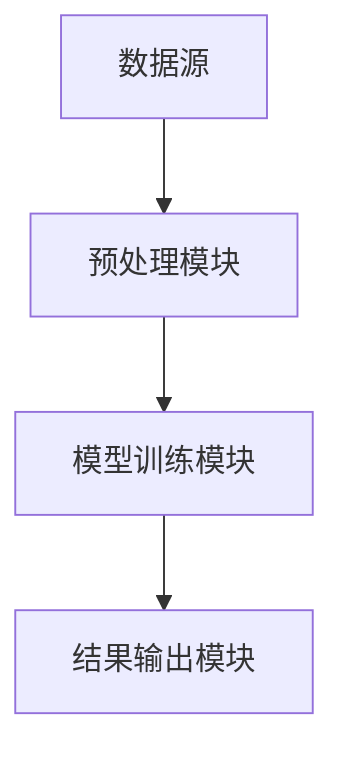
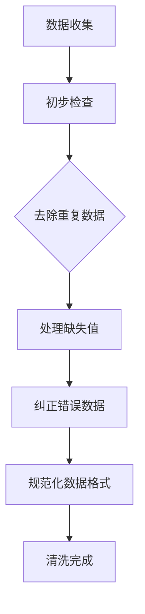
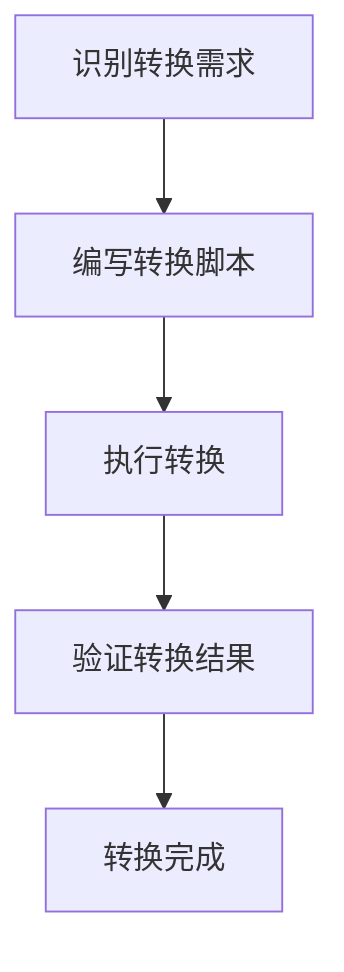
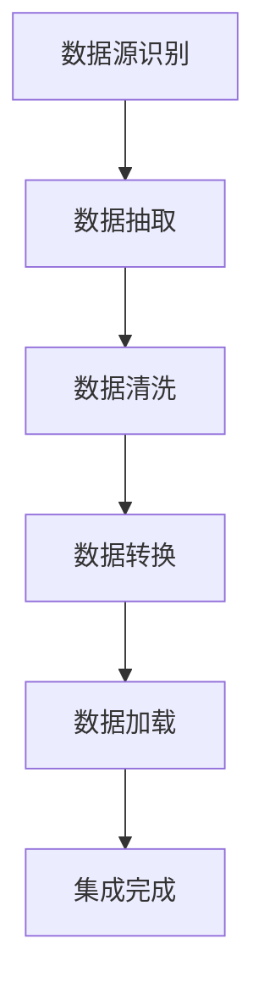
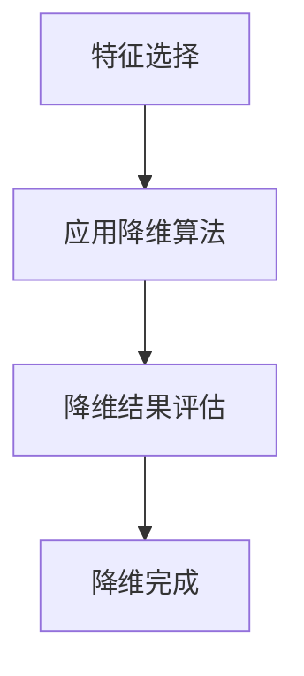
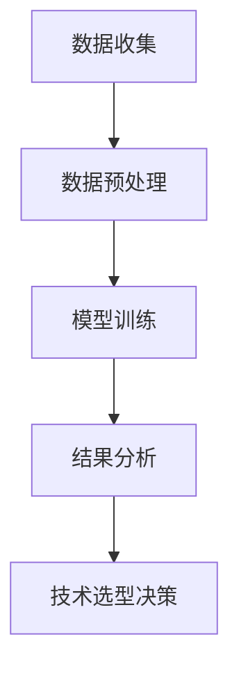
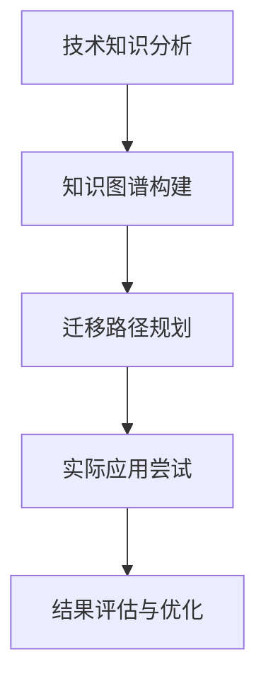
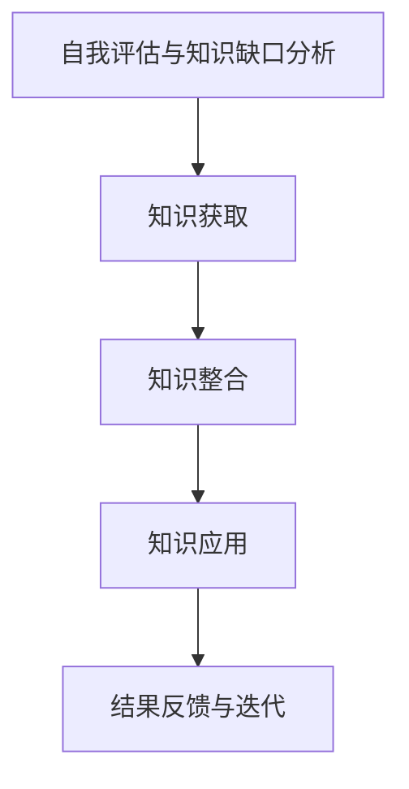

                 

# 《知识发现引擎助力程序员职业转型》

## 关键词
知识发现引擎、程序员、职业转型、技术选型、数据预处理、算法、持续学习

## 摘要
本文将探讨知识发现引擎在程序员职业转型中的应用。随着技术的快速迭代和行业的变革，程序员需要不断更新知识，以适应新的技术环境和市场需求。知识发现引擎作为一种强大的数据分析工具，能够帮助程序员更高效地进行技术选型、知识迁移和持续学习。本文将从基础知识、需求分析、核心算法、数据预处理、实战案例以及未来展望等方面，系统性地介绍知识发现引擎在程序员职业转型中的重要作用。

### 《知识发现引擎助力程序员职业转型》目录大纲

#### 第一部分：知识发现引擎基础

##### 第1章：知识发现引擎概述

- **1.1 知识发现引擎的定义**
  - 知识发现引擎是一种基于数据挖掘和机器学习技术的系统，用于从大量数据中自动发现潜在的模式和知识。
  - 知识发现引擎的基本架构包括数据源、预处理模块、模型训练模块和结果输出模块。

- **1.2 知识发现引擎的重要性**
  - 知识发现引擎在数据驱动的现代商业环境中扮演着至关重要的角色。
  - 它帮助企业和个人从数据中提取有价值的信息，从而做出更明智的决策。

##### 第2章：程序员职业转型的需求分析

- **2.1 程序员职业转型的现状**
  - 当前，程序员面临着技术迭代快、行业竞争激烈、个人成长需求等方面的压力。
  - 程序员需要不断学习新技能，以保持竞争力。

- **2.2 转型路径选择**
  - 程序员可以根据个人兴趣、技术背景和市场趋势，选择适合自己的转型路径。

##### 第3章：知识发现引擎的核心算法

- **3.1 关联规则学习算法**
  - 关联规则学习是一种常用的知识发现技术，用于发现数据集中的关联关系。
  - 伪代码示例：Apriori算法

##### 第4章：数据预处理与清洗

- **4.1 数据预处理方法**
  - 数据预处理是知识发现过程的关键步骤，包括数据清洗、数据转换、数据集成和数据降维。

#### 第二部分：程序员职业转型实战

##### 第5章：案例一：通过知识发现引擎进行技术选型

- **5.1 实战目的**
  - 帮助程序员基于知识发现引擎找到最适合当前项目的开发技术栈。

- **5.2 实战步骤**
  - 数据收集、数据预处理、模型训练、结果分析和技术选型决策。

##### 第6章：案例二：通过知识发现引擎进行技术迁移

- **6.1 实战目的**
  - 帮助程序员将现有技术知识迁移到新兴技术领域。

- **6.2 实战步骤**
  - 技术知识分析、知识图谱构建、迁移路径规划、实际应用尝试和结果评估与优化。

##### 第7章：案例三：知识发现引擎在持续学习中的应用

- **7.1 实战目的**
  - 帮助程序员利用知识发现引擎实现持续学习与知识更新。

- **7.2 实战步骤**
  - 自我评估与知识缺口分析、知识获取与分类、知识整合与应用和结果反馈与迭代。

#### 第三部分：总结与展望

##### 第8章：知识发现引擎助力程序员职业转型的总结与展望

- **8.1 成功案例回顾**
- **8.2 职业转型中的挑战与对策**
- **8.3 知识发现引擎的未来趋势**

### 附录

- **附录A：知识发现引擎开源工具介绍**
  - **A.1 DMLC**
  - **A.2 TensorFlow Extended (TFX)**
  - **A.3 H2O.ai**

- **附录B：相关算法与模型详解**
  - **B.1 K-最近邻算法**
  - **B.2 决策树算法**
  - **B.3 随机森林算法**

### 第一部分：知识发现引擎基础

#### 第1章：知识发现引擎概述

**1.1 知识发现引擎的定义**

知识发现引擎（Knowledge Discovery Engine，简称KDE）是一种基于数据挖掘和机器学习技术的系统，旨在从大量数据中自动发现潜在的模式和知识。其基本架构通常包括以下几个关键模块：

- **数据源**：数据源是知识发现引擎的基础，可以是结构化数据（如关系型数据库）、半结构化数据（如XML、JSON）和非结构化数据（如文本、图像、视频）。
- **预处理模块**：数据预处理模块负责对原始数据进行清洗、转换和集成，以消除噪声、处理缺失值和标准化数据格式。
- **模型训练模块**：模型训练模块使用机器学习算法对预处理后的数据进行训练，以构建能够发现数据中潜在模式的模型。
- **结果输出模块**：结果输出模块负责将模型训练结果以可视化的形式展示给用户，以便用户理解和应用。

知识发现引擎的工作流程可以概括为以下步骤：

1. **数据收集**：从各种数据源收集数据。
2. **数据预处理**：清洗、转换和集成数据。
3. **模型训练**：使用机器学习算法训练模型。
4. **结果分析**：对模型输出进行分析和解释。
5. **知识应用**：将发现的模式应用到实际问题中。

知识发现引擎的应用范围非常广泛，包括但不限于以下领域：

- **商业智能**：通过分析客户行为数据，帮助企业优化营销策略和客户关系管理。
- **金融风控**：通过分析交易数据，发现异常交易模式，预防金融欺诈。
- **医疗健康**：通过分析患者数据，发现疾病预测模式和个性化治疗方案。
- **社交媒体分析**：通过分析用户生成的内容，了解用户偏好和社会动态。

**1.2 知识发现引擎的重要性**

在当今数据驱动的商业环境中，知识发现引擎的重要性日益凸显。以下是几个方面的原因：

- **数据价值的挖掘**：随着数据量的不断增长，知识发现引擎能够从海量数据中提取有价值的信息，帮助企业和个人做出更明智的决策。
- **决策支持的加强**：知识发现引擎提供的模式发现和预测结果，为决策者提供了数据驱动的决策支持，减少了主观判断的误差。
- **竞争力的提升**：知识发现引擎的应用可以帮助企业在市场竞争中占据有利地位，通过数据洞察实现业务优化和创新。
- **技术发展的推动**：知识发现引擎的发展推动了数据挖掘和机器学习技术的不断进步，为相关领域的研究和应用提供了强大的技术支持。

为了更好地理解知识发现引擎的基本架构，我们可以使用Mermaid流程图来展示其核心组成部分：



在这个流程图中，数据源提供输入数据，预处理模块对数据进行清洗和标准化，模型训练模块使用这些数据训练机器学习模型，最后结果输出模块将模型预测结果呈现给用户。

通过这一章节的介绍，我们了解了知识发现引擎的定义、重要性以及基本架构。在接下来的章节中，我们将进一步探讨程序员职业转型的需求分析、核心算法和数据预处理方法，以便更好地理解知识发现引擎在程序员职业转型中的应用。

### 第2章：程序员职业转型的需求分析

#### 2.1 程序员职业转型的现状

在当今快速发展的科技时代，程序员面临着诸多挑战，其中之一就是职业转型。程序员职业转型的现状可以从以下几个方面来分析：

- **技术迭代的压力**：随着新技术的不断涌现，程序员需要不断学习新的编程语言、框架和工具，以保持自己的技术竞争力。例如，从传统的Web开发转向移动应用开发，或者从后端开发转向前端开发。
- **行业变革的影响**：不同行业的数字化进程和技术需求也在不断变化，程序员需要适应这些变化，调整自己的技术栈。例如，从传统的软件行业转向金融科技、物联网或人工智能领域。
- **个人成长的需求**：许多程序员希望通过职业转型来实现个人职业成长，追求更高的职位和薪资。这促使他们从技术岗位转向管理岗位，或者从开发岗位转向测试、运维等其他相关岗位。

这些因素共同作用，使得程序员职业转型成为一种普遍现象。然而，转型过程中也会面临诸多挑战，如技能不对口、学习成本高等。因此，了解程序员职业转型的现状和需求，对于制定有效的职业规划具有重要意义。

**2.2 转型路径选择**

针对不同的转型需求和背景，程序员可以选择不同的转型路径。以下是一些常见的转型路径：

- **技术深化**：对于在某一领域有一定技术积累的程序员，可以选择在现有技术方向上进一步深化，成为领域专家。例如，从Web开发转向云计算、大数据或人工智能等前沿技术领域。
- **技术拓展**：对于希望拓展技术广度的程序员，可以选择学习新的编程语言或开发框架，以适应多样化的项目需求。例如，从Java转向Python或Go语言。
- **岗位转换**：对于希望在职业发展上实现突破的程序员，可以选择转换到不同的岗位，如从开发岗位转向测试、运维、产品经理等岗位。这通常需要程序员具备跨领域的知识和技能。
- **跨界转型**：对于希望在技术领域外实现转型的程序员，可以选择进入金融、医疗、教育等行业。这通常需要程序员具备一定的行业知识和跨领域的能力。

在制定转型路径时，程序员应该综合考虑自身兴趣、技术背景、市场需求和个人职业目标，选择最适合自己的转型方向。同时，转型过程中应注重持续学习和实践，不断积累经验和技能，以提高转型成功的几率。

**2.3 转型过程中的挑战与对策**

在程序员职业转型的过程中，可能会面临以下挑战：

- **学习成本高**：新技术和领域的学习需要投入大量的时间和精力，对于已有工作和其他生活责任的程序员来说，这可能是一个不小的挑战。
- **技能不对口**：转型过程中可能会遇到现有技能与目标岗位要求不匹配的问题，这需要程序员通过学习新技能来弥补差距。
- **心理压力**：职业转型往往会带来一定的心理压力，如对未来的不确定性和对失败的恐惧。

针对这些挑战，程序员可以采取以下对策：

- **制定明确的转型计划**：在转型之前，制定一个明确的计划，包括学习目标、时间安排和评估标准，以确保转型过程有条不紊。
- **学习新技能**：通过参加在线课程、阅读技术书籍、参加技术社区活动等方式，学习新技能和知识，为转型打下基础。
- **积累实践经验**：通过参与开源项目、实习机会或兼职工作等方式，积累实际项目经验，提高自己的技能水平和行业认知。
- **保持积极心态**：保持积极的心态，对待转型过程中的困难和挫折，要有耐心和决心，相信自己能够克服困难，实现职业目标。

通过上述分析，我们可以看到，程序员职业转型是一个复杂而富有挑战的过程。了解现状、明确需求、选择合适的路径以及应对转型过程中的挑战，是程序员成功实现职业转型的重要因素。在接下来的章节中，我们将进一步探讨知识发现引擎在程序员职业转型中的应用，帮助程序员更好地实现职业转型。

### 第3章：知识发现引擎的核心算法

在知识发现引擎中，核心算法是实现数据挖掘和模式发现的关键。这些算法可以自动从大量数据中提取出有价值的信息和模式，从而帮助程序员在职业转型过程中做出更明智的决策。本章将介绍几种常用的核心算法，包括关联规则学习算法、聚类算法和分类算法，并重点讲解关联规则学习算法中的Apriori算法。

#### 3.1 关联规则学习算法

关联规则学习（Association Rule Learning，简称ARL）是一种用于发现数据集中项目之间潜在关联关系的方法。它通过挖掘数据集中的频繁项集（Frequent Itemsets）和生成关联规则（Association Rules），来揭示数据中的隐含关系。常见的关联规则学习算法有Apriori算法、Eclat算法和FP-growth算法等。这里我们将重点介绍Apriori算法。

**Apriori算法的基本原理**

Apriori算法是一种基于候选生成和频繁项集的思想来挖掘频繁项集的算法。其基本原理如下：

1. **生成候选频繁项集**：首先，从所有可能的项集（K-itemsets）中生成候选频繁项集。这些候选项集的生成基于两个原则：`支持度原则`和`提升原则`。
2. **筛选频繁项集**：对生成的候选频繁项集进行频繁度计算，保留那些满足最小支持度阈值的支持集。这样，就可以逐层递归地减少候选项集的数量，直到得到最终的频繁项集。
3. **生成关联规则**：使用频繁项集生成关联规则，其中关联规则的强度由支持度和置信度来衡量。

**Apriori算法的伪代码**

以下是Apriori算法的伪代码示例：

```python
def Apriori(data_set, support_threshold):
    # 初始化频繁项集
    frequent_itemsets = find_frequent_itemsets(data_set, support_threshold)
    # 递归合并频繁项集
    while frequent_itemsets is not empty:
        # 生成候选频繁项集
        candidates = generate_candidates(frequent_itemsets)
        # 筛选出频繁项集
        frequent_itemsets = filter_candidates(data_set, candidates, support_threshold)
    return frequent_itemsets

def find_frequent_itemsets(data_set, support_threshold):
    # 实现频繁项集的发现
    pass

def generate_candidates(frequent_itemsets):
    # 实现候选频繁项集的生成
    pass

def filter_candidates(data_set, candidates, support_threshold):
    # 实现候选频繁项集的筛选
    pass
```

**Apriori算法的优缺点**

Apriori算法的优点在于其简单性和直观性，适用于处理大量事务型数据。然而，其缺点也很明显：

- **效率问题**：Apriori算法需要多次扫描数据集，导致计算时间较长，特别是在数据规模较大时。
- **内存消耗**：生成和存储候选频繁项集需要大量的内存，可能会超出系统的处理能力。

#### 3.2 聚类算法

聚类算法（Clustering Algorithms）是另一种重要的知识发现技术，用于将数据集中的对象分为多个群组（或簇），使得同一群组内的对象彼此之间相似度较高，而不同群组之间的对象相似度较低。常见的聚类算法有K-均值聚类（K-Means Clustering）、层次聚类（Hierarchical Clustering）和密度聚类（Density-Based Clustering）等。

**K-均值聚类算法**

K-均值聚类算法是一种基于距离度量的聚类方法，其基本步骤如下：

1. **初始化中心点**：随机选择K个中心点，作为初始聚类中心。
2. **分配数据点**：计算每个数据点到各个中心点的距离，将数据点分配到最近的中心点所在的簇。
3. **更新中心点**：计算每个簇的均值，将其作为新的中心点。
4. **迭代优化**：重复步骤2和步骤3，直到聚类中心点的变化不再显著或达到最大迭代次数。

**K-均值聚类算法的优缺点**

K-均值聚类算法的优点在于其简单性和高效性，适合处理高维数据。然而，其缺点也很明显：

- **依赖初始中心点**：K-均值聚类算法的初始中心点选择对聚类结果有很大影响，可能会导致局部最优解。
- **对噪声敏感**：噪声数据可能会影响聚类结果，导致簇的划分不明确。

#### 3.3 分类算法

分类算法（Classification Algorithms）是一种用于构建分类模型的方法，用于将新数据分配到预定义的类别中。常见的分类算法有决策树（Decision Trees）、支持向量机（Support Vector Machines，简称SVM）和神经网络（Neural Networks）等。

**决策树算法**

决策树算法是一种基于特征选择和递归划分的方法，其基本步骤如下：

1. **选择最优特征**：使用信息增益、基尼不纯度或熵等指标选择最优特征进行划分。
2. **划分数据集**：根据最优特征将数据集划分为多个子集。
3. **递归构建树**：对每个子集重复步骤1和步骤2，直到满足停止条件（如最大树深度、最小样本数量等）。

**决策树算法的优缺点**

决策树算法的优点在于其简单易懂、可解释性强。然而，其缺点也很明显：

- **易过拟合**：决策树算法在训练过程中容易过拟合，导致对新数据的泛化能力较差。
- **计算复杂度**：随着树深度的增加，决策树的计算复杂度也会显著增加。

通过介绍上述几种核心算法，我们可以看到知识发现引擎在数据挖掘和模式发现中发挥着重要作用。这些算法不仅可以帮助程序员在职业转型过程中做出更明智的决策，还可以为企业和个人提供数据驱动的洞察和业务优化方案。在接下来的章节中，我们将进一步探讨数据预处理与清洗方法，以帮助程序员更好地应用知识发现引擎进行职业转型。

### 第4章：数据预处理与清洗

在知识发现引擎的应用过程中，数据预处理与清洗是一个至关重要的环节。不干净或预处理不当的数据会导致分析结果不准确，甚至误导决策。因此，确保数据的质量是知识发现过程成功的关键。本章将介绍数据预处理与清洗的方法，包括数据清洗、数据转换、数据集成和数据降维。

#### 4.1 数据清洗

数据清洗是指识别和纠正数据中的错误、异常和不一致之处。以下是一些常见的数据清洗方法：

- **去除重复数据**：重复数据会降低数据的准确性和分析效率，因此需要使用去重算法（如哈希去重）来识别并去除重复记录。
- **处理缺失值**：缺失值可以采用以下几种方法进行处理：
  - **删除缺失值**：如果缺失值较多，可以考虑删除包含缺失值的记录。
  - **均值填充**：对于数值型数据，可以使用平均值、中位数或众数来填充缺失值。
  - **插值法**：对于时间序列数据，可以使用插值法（如线性插值、高斯插值）来填补缺失值。
  - **模型预测**：对于复杂的数据集，可以使用机器学习模型来预测缺失值。
- **纠正错误数据**：对于数据中的明显错误，如日期格式错误、分类错误等，需要进行纠正。
- **规范化数据格式**：确保数据的一致性，如将日期统一格式化、字符串统一编码等。

**数据清洗流程**

数据清洗通常包括以下几个步骤：

1. **数据收集**：从不同的数据源收集原始数据。
2. **初步检查**：对数据进行初步检查，识别可能的错误和异常。
3. **去除重复数据**：使用去重算法去除重复记录。
4. **处理缺失值**：根据数据类型和业务需求，选择合适的处理方法填补缺失值。
5. **纠正错误数据**：识别并修正数据中的错误。
6. **规范化数据格式**：统一数据格式，确保数据的一致性和可处理性。

**Mermaid流程图：数据清洗流程**



#### 4.2 数据转换

数据转换是指将数据从一种格式转换为另一种格式，以便进行后续分析。以下是一些常见的数据转换方法：

- **数据格式转换**：例如，将CSV文件转换为JSON格式，或将Excel文件转换为数据库表。
- **数据编码转换**：例如，将UTF-8编码的文本转换为ASCII编码。
- **数据类型转换**：将字符串数据转换为数值数据，或将日期字符串转换为日期数据类型。
- **数据归一化和标准化**：对数据进行归一化或标准化，以消除数据量级差异的影响。

**数据转换流程**

数据转换通常包括以下几个步骤：

1. **识别转换需求**：根据分析需求，确定需要进行的转换类型。
2. **转换脚本编写**：编写转换脚本或使用数据转换工具，对数据进行转换。
3. **转换结果验证**：验证转换结果是否符合预期，确保数据的一致性和准确性。

**Mermaid流程图：数据转换流程**



#### 4.3 数据集成

数据集成是指将来自不同源的数据合并成一个统一的数据视图。以下是一些常见的数据集成方法：

- **数据合并**：将多个数据集合并为一个数据集，例如，将客户数据与交易数据合并。
- **数据融合**：将多个数据源的相似数据合并，以消除冗余和冲突。
- **数据整合**：将多个数据源的数据整合到一个中央数据库中，以实现数据的一致性和可访问性。

**数据集成流程**

数据集成通常包括以下几个步骤：

1. **数据源识别**：确定需要集成哪些数据源。
2. **数据抽取**：从不同数据源抽取数据。
3. **数据清洗**：对抽取的数据进行清洗，确保数据的一致性和准确性。
4. **数据转换**：对清洗后的数据执行必要的转换。
5. **数据加载**：将转换后的数据加载到统一的数据视图中。

**Mermaid流程图：数据集成流程**



#### 4.4 数据降维

数据降维是指通过减少数据维度来简化数据集，以提高分析效率。以下是一些常见的数据降维方法：

- **主成分分析（PCA）**：通过将数据投影到主成分上，减少数据维度，同时保留数据的主要特征。
- **因子分析**：通过提取因子，将多个变量转换为较少的因子，从而降低数据维度。
- **特征选择**：选择对模型影响最大的特征，以减少数据维度。

**数据降维流程**

数据降维通常包括以下几个步骤：

1. **特征选择**：选择对分析结果有重要影响的特征。
2. **降维算法应用**：使用降维算法（如PCA、因子分析）对数据集进行降维。
3. **降维结果评估**：评估降维后的数据集是否满足分析需求。

**Mermaid流程图：数据降维流程**



通过以上介绍，我们可以看到数据预处理与清洗在知识发现引擎中的应用至关重要。有效的数据预处理和清洗能够确保数据的质量，为后续的分析和模型训练提供可靠的基础。在接下来的章节中，我们将通过实际案例展示知识发现引擎在程序员职业转型中的具体应用，以帮助程序员更好地实现职业转型。

### 第二部分：程序员职业转型实战

#### 第5章：案例一：通过知识发现引擎进行技术选型

在本案例中，我们将通过知识发现引擎帮助程序员进行技术选型，以确定最适合当前项目的开发技术栈。这一步骤对于程序员职业转型至关重要，因为它不仅有助于提升项目效率，还能为程序员的技能拓展提供方向。

##### 5.1 实战目的

本案例的目的是利用知识发现引擎，从海量的技术数据中筛选出最适合当前项目的开发技术栈，从而提高项目开发的效率和稳定性。通过这一过程，程序员可以更清晰地了解当前技术趋势，为自己的职业转型提供依据。

##### 5.2 实战步骤

以下是使用知识发现引擎进行技术选型的具体步骤：

1. **数据收集**：
   - 收集与项目相关的技术文档、博客文章、技术论坛讨论等数据。
   - 收集市场上流行的技术框架、库和工具的评分、用户评论和性能数据。

2. **数据预处理**：
   - 使用数据清洗方法去除重复数据、处理缺失值和纠正错误数据。
   - 对文本数据进行分词和词频统计，将非结构化数据转换为结构化数据。

3. **模型训练**：
   - 使用机器学习算法（如TF-IDF、Word2Vec）对文本数据进行特征提取。
   - 训练分类模型（如支持向量机、随机森林），预测项目的最佳技术栈。

4. **结果分析**：
   - 分析模型预测结果，根据技术栈的评分和用户评论进行筛选。
   - 根据项目需求，评估每种技术栈的适用性，如性能、稳定性、社区支持等。

5. **技术选型决策**：
   - 基于分析结果，确定最适合当前项目的开发技术栈。
   - 为程序员提供技术选型的建议，如使用哪些框架、库和工具，以及如何进行项目架构设计。

**Mermaid流程图：技术选型过程**



##### 5.3 案例说明

以下是一个具体的案例说明：

- **项目背景**：某公司计划开发一个实时数据分析平台，需要选择合适的技术栈。
- **数据收集**：收集了50篇关于实时数据分析平台的技术文档、博客文章和用户评论。
- **数据预处理**：去除重复数据、处理缺失值，并进行分词和词频统计。
- **模型训练**：使用TF-IDF算法提取文本特征，并训练支持向量机分类模型。
- **结果分析**：根据模型预测结果，筛选出评分高、用户评论积极的几个技术栈。
- **技术选型决策**：结合项目需求，选择了Apache Kafka、Flink 和 Elasticsearch 等技术栈，用于实时数据处理和分析。

通过这一案例，我们可以看到知识发现引擎在技术选型过程中发挥了重要作用，帮助程序员快速找到最适合的项目开发技术栈，提高了项目开发的效率和质量。在接下来的案例中，我们将继续探讨知识发现引擎在程序员技术迁移和持续学习中的应用。

### 第6章：案例二：通过知识发现引擎进行技术迁移

在技术快速发展的背景下，程序员需要不断将现有技术知识迁移到新兴技术领域，以保持竞争力。知识发现引擎作为一种强大的工具，可以帮助程序员在技术迁移过程中快速获取新知识、规划迁移路径并评估迁移效果。本章将通过具体案例展示如何利用知识发现引擎进行技术迁移。

#### 6.1 实战目的

本案例的目的是利用知识发现引擎，帮助程序员将现有技术知识迁移到新兴技术领域，如从传统Web开发迁移到移动应用开发，或从后端开发迁移到前端开发。通过这一过程，程序员可以更高效地掌握新技能，实现职业转型。

##### 6.2 实战步骤

以下是使用知识发现引擎进行技术迁移的具体步骤：

1. **技术知识分析**：
   - 收集与目标技术领域相关的资料，如技术文档、博客文章、课程视频等。
   - 对收集到的资料进行分类整理，识别关键知识点和技能点。

2. **知识图谱构建**：
   - 使用自然语言处理技术，构建知识图谱，表示不同知识点之间的关联关系。
   - 将知识点和技能点映射到程序员现有的知识体系，分析知识缺口。

3. **迁移路径规划**：
   - 根据知识图谱，规划技术迁移的步骤和顺序，确保迁移路径的合理性和可行性。
   - 制定学习计划，包括学习时间、学习资源和评估方法。

4. **实际应用尝试**：
   - 根据迁移路径，实际应用新学到的技术和知识，完成相关项目或任务。
   - 通过实际操作，检验知识迁移的效果，并根据反馈进行优化。

5. **结果评估与优化**：
   - 评估技术迁移后的效果，如项目完成情况、技术掌握程度和职业发展等。
   - 根据评估结果，调整学习计划和迁移路径，确保持续进步。

**Mermaid流程图：技术迁移过程**



##### 6.3 案例说明

以下是一个具体的案例说明：

- **项目背景**：一位有多年Java后端开发经验的程序员希望转型到移动应用开发领域。
- **技术知识分析**：收集了关于Android和iOS开发的资料，包括技术文档、博客文章、在线课程等。
- **知识图谱构建**：使用自然语言处理技术，构建了移动应用开发的知识图谱，包括UI设计、前端框架、后端服务等多个知识点。
- **迁移路径规划**：根据知识图谱，制定了以下迁移路径：
   1. 学习Android基础和Kotlin语言。
   2. 熟悉常见的Android前端框架，如Material Design和React Native。
   3. 完成一个Android应用的完整开发项目。
- **实际应用尝试**：根据迁移路径，实际开发了一个Android应用，并参与了一个iOS应用的项目。
- **结果评估与优化**：通过项目实践，评估了技术迁移效果，发现对Android开发的掌握较好，但iOS开发还需要进一步学习和实践。因此，调整学习计划，增加了关于iOS开发的学习内容。

通过这一案例，我们可以看到知识发现引擎在技术迁移过程中发挥了重要作用，帮助程序员系统性地规划迁移路径，并通过实际应用尝试和结果评估，不断优化迁移过程，实现职业转型。在接下来的案例中，我们将探讨知识发现引擎在程序员持续学习中的应用。

### 第7章：案例三：知识发现引擎在持续学习中的应用

在快速发展的技术领域，程序员需要不断更新知识和技能，以适应新的挑战和机遇。知识发现引擎作为一种强大的工具，可以帮助程序员实现持续学习，确保他们始终掌握前沿技术和方法。本章将介绍如何利用知识发现引擎进行自我评估、知识获取、知识整合和应用，以实现持续学习。

#### 7.1 实战目的

本案例的目的是利用知识发现引擎，帮助程序员进行自我评估，识别知识缺口，获取新知识，整合现有知识，并将新知识应用到实际工作中，从而实现持续学习。通过这一过程，程序员可以不断提高自己的技术水平和职业竞争力。

##### 7.2 实战步骤

以下是使用知识发现引擎实现持续学习的具体步骤：

1. **自我评估与知识缺口分析**：
   - 使用知识发现引擎，对程序员现有的知识体系进行评估，识别知识短板和不足。
   - 建立知识图谱，记录程序员的技能点和知识缺口，为后续学习提供依据。

2. **知识获取**：
   - 根据知识缺口分析结果，制定学习计划，选择合适的学习资源，如在线课程、技术书籍、博客文章等。
   - 利用知识发现引擎，对学习资源进行筛选和排序，优先学习对职业发展最为重要的知识。

3. **知识整合**：
   - 将新学到的知识整合到现有知识体系中，通过实践和项目应用，巩固和加深理解。
   - 利用知识图谱，建立知识关联，形成知识网络，提高知识的应用能力和迁移能力。

4. **知识应用**：
   - 在实际工作中，应用所学知识，解决实际问题，提升项目质量和效率。
   - 通过项目实践，检验知识的应用效果，根据反馈不断优化知识体系。

5. **结果反馈与迭代**：
   - 收集项目实践中的反馈，对知识发现引擎中的知识图谱进行更新，调整学习计划。
   - 根据反馈结果，持续优化知识获取、整合和应用过程，确保持续学习的效果。

**Mermaid流程图：持续学习过程**



##### 7.3 案例说明

以下是一个具体的案例说明：

- **项目背景**：一名有多年经验的Python后端开发人员，希望通过学习新的前端技术（如React）来拓展自己的技能。
- **自我评估与知识缺口分析**：使用知识发现引擎，对现有的知识体系进行评估，发现React和前端开发是知识短板。
- **知识获取**：制定学习计划，选择React官方文档、React入门教程和相关的在线课程，通过知识发现引擎对这些资源进行筛选和排序。
- **知识整合**：在学习过程中，将React的知识整合到现有知识体系中，通过实际项目（如重构公司官网的前端部分）将所学知识应用到实践中。
- **知识应用**：在实际项目中，应用React技术，提高了前端开发的效率和代码质量。
- **结果反馈与迭代**：根据项目实践中的反馈，更新知识图谱，识别新的知识缺口，调整学习计划，继续深入学习。

通过这一案例，我们可以看到知识发现引擎在程序员持续学习中的重要作用。它不仅帮助程序员识别知识缺口，获取新知识，还将知识整合和应用到实际工作中，确保持续学习的效果。在接下来的章节中，我们将对知识发现引擎助力程序员职业转型的总结与展望，探讨其在程序员职业转型中的广泛应用和未来趋势。

### 第8章：知识发现引擎助力程序员职业转型的总结与展望

#### 8.1 成功案例回顾

在本部分，我们将回顾一些通过知识发现引擎成功实现职业转型的案例，以展示其在实际应用中的效果。

**案例一：从Java后端开发到移动应用开发的转型**

一位拥有多年Java后端开发经验的程序员，希望通过知识发现引擎实现职业转型，进入移动应用开发领域。他首先使用知识发现引擎进行自我评估，识别出在移动应用开发方面的知识缺口。随后，他根据知识图谱制定了一个详细的学习计划，通过在线课程和实际项目逐步掌握了Android和iOS开发技能。最终，他成功转型为一名移动应用开发工程师，并在新领域取得了显著的成绩。

**案例二：从软件工程师到数据科学家的转型**

一位软件工程师希望通过知识发现引擎实现向数据科学家的转型。他利用知识发现引擎对数据科学领域的知识进行深入分析，并制定了一个系统性的学习计划。通过学习机器学习、数据分析和大数据处理等关键技术，他逐渐掌握了数据科学的核心技能。在完成一系列数据科学项目的实践后，他成功转型为数据科学家，为企业带来了显著的数据驱动的商业价值。

**案例三：从传统Web开发到人工智能领域的转型**

一位专注于传统Web开发的程序员，意识到人工智能领域的发展前景，决定通过知识发现引擎实现职业转型。他利用知识发现引擎对人工智能相关的知识进行系统学习，包括深度学习、自然语言处理和计算机视觉等关键技术。在知识发现引擎的帮助下，他完成了多个与人工智能相关的项目，并成功转型为一名人工智能工程师。

#### 8.2 职业转型中的挑战与对策

尽管知识发现引擎为程序员职业转型提供了强大的支持，但在实际转型过程中仍然会面临一些挑战。以下是几个主要的挑战及相应的对策：

**挑战一：技能跨度大**

对于需要跨越多个技术领域的转型，程序员可能会感到技能跨度大，学习成本高。对策是：
- **分阶段学习**：将转型过程分为多个阶段，逐步掌握新技能。
- **项目驱动学习**：通过实际项目应用所学知识，加深理解和掌握程度。

**挑战二：学习资源繁多**

在知识爆炸的时代，程序员可能会感到学习资源繁多，难以选择。对策是：
- **知识图谱辅助**：利用知识发现引擎的知识图谱，明确学习路径和重点。
- **课程评价参考**：参考其他程序员的评价和推荐，选择高质量的学习资源。

**挑战三：实践机会有限**

对于一些需要大量实践经验的转型，程序员可能会感到缺乏实践机会。对策是：
- **开源项目参与**：参与开源项目，积累实际项目经验。
- **内部项目实践**：争取公司内部的项目机会，提升实践经验。

**挑战四：心理压力**

职业转型往往伴随着心理压力，如对未来不确定性的担忧。对策是：
- **设定明确目标**：制定明确的职业目标，增强自信心。
- **逐步实现目标**：通过阶段性目标的实现，积累信心和成就感。

#### 8.3 知识发现引擎的未来趋势

随着人工智能和数据科学技术的不断发展，知识发现引擎的应用前景将更加广阔。以下是几个未来趋势：

**趋势一：更加智能化的知识发现**

未来的知识发现引擎将更加智能化，能够自动识别数据中的潜在模式和关联，提供更加精确的分析结果。这需要依赖于更先进的人工智能算法和自然语言处理技术。

**趋势二：跨领域的知识整合**

知识发现引擎将逐渐实现跨领域的知识整合，不仅局限于单一领域的知识发现，而是能够在不同领域之间建立联系，提供更加综合和全面的解决方案。

**趋势三：实时数据分析和预测**

知识发现引擎将能够实时分析大量数据，并提供实时预测和预警功能，帮助企业和个人快速应对市场变化和技术趋势。

**趋势四：开放性和可扩展性**

未来的知识发现引擎将更加注重开放性和可扩展性，支持与其他系统的无缝集成，为用户提供灵活的定制化和扩展能力。

通过总结和展望，我们可以看到知识发现引擎在程序员职业转型中具有巨大的潜力，不仅能够帮助程序员更高效地进行技术选型、知识迁移和持续学习，还能推动整个技术领域的创新和发展。随着技术的不断进步，知识发现引擎的应用前景将更加广阔，为程序员职业转型提供更加坚实的支持。

### 附录

#### 附录A：知识发现引擎开源工具介绍

**A.1 DMLC**

DMLC（ Distributed Machine Learning Community）是一个开源的分布式机器学习平台，它支持大规模的数据分析和机器学习任务。DMLC提供了丰富的工具和库，用于数据预处理、模型训练和模型评估。

**主要特性**：
- **分布式计算**：支持分布式训练和推理，可以处理大规模数据集。
- **可扩展性**：易于扩展到多节点集群，支持多种分布式计算模式。
- **灵活性**：支持多种编程语言（如Python、C++）和框架（如TensorFlow、PyTorch）。

**安装与配置**：
```bash
# 安装DMLC
pip install dmlc
# 配置DMLC
dmlc init
```

**A.2 TensorFlow Extended (TFX)**

TFX是一个端到端的机器学习平台，由Google开发，用于构建、训练和部署机器学习模型。TFX提供了完整的工作流和工具链，支持从数据预处理到模型部署的整个过程。

**主要特性**：
- **自动化管道**：支持自动化数据预处理、模型训练、模型评估和模型部署。
- **可扩展性**：支持大规模数据处理和模型训练。
- **可解释性**：提供模型解释和可视化工具。

**安装与配置**：
```bash
# 安装TFX
pip install tfx
# 配置TFX
tfx init
```

**A.3 H2O.ai**

H2O.ai是一个开源的机器学习平台，支持多种编程语言（如Python、R）和框架（如Spark、Flink）。它提供了丰富的机器学习算法和深度学习功能，适用于大数据分析和预测。

**主要特性**：
- **高性能**：支持分布式计算和大规模数据处理。
- **可扩展性**：易于扩展到多节点集群。
- **可解释性**：提供详细的模型解释和可视化工具。

**安装与配置**：
```bash
# 安装H2O.ai
pip install h2o
# 启动H2O.ai
h2o.init()
```

#### 附录B：相关算法与模型详解

**B.1 K-最近邻算法**

K-最近邻算法（K-Nearest Neighbors，简称KNN）是一种简单的机器学习算法，用于分类和回归任务。KNN算法的基本思想是：如果一个新样本在特征空间中的K个最近邻的多数属于某一个类别，那么这个新样本也被划分为这个类别。

**算法原理**：

1. **选择K值**：确定K值，即选取多少个最近的邻居。
2. **计算距离**：计算新样本与训练集中每个样本之间的距离（如欧氏距离、曼哈顿距离等）。
3. **分类决策**：根据K个最近邻的多数类别，对新样本进行分类。

**伪代码示例**：

```python
def knn_predict(data_point, training_data, labels, k):
    # 计算距离
    distances = [distance(data_point, x) for x in training_data]
    # 选择最近的K个邻居
    nearest_neighbors = sorted(range(len(distances)), key=lambda i: distances[i])[:k]
    # 计算邻居的标签
    neighbor_labels = [labels[i] for i in nearest_neighbors]
    # 获取多数类别
    most_common = Counter(neighbor_labels).most_common(1)[0][0]
    return most_common
```

**B.2 决策树算法**

决策树（Decision Tree）是一种常见的分类和回归算法，通过一系列的判断节点（测试条件）来对数据进行分类或回归。每个节点代表一个特征，每个分支代表特征的一个可能取值。

**算法原理**：

1. **特征选择**：选择最优特征，通常使用信息增益、基尼不纯度或熵作为评价指标。
2. **划分数据**：根据最优特征，将数据集划分成子集。
3. **递归构建树**：对每个子集重复特征选择和划分过程，直到满足停止条件（如最大树深度、最小样本数量等）。

**伪代码示例**：

```python
def build_decision_tree(data, features, target, depth=0, max_depth=None):
    # 停止条件
    if depth >= max_depth or len(data) <= 1:
        return most_common_label(data[target])
    # 选择最优特征
    best_feature = select_best_feature(data, features)
    # 创建节点
    node = TreeNode(feature=best_feature, depth=depth)
    # 递归划分数据
    for value in unique_values(data[best_feature]):
        sub_data = data[data[best_feature] == value]
        node.children[value] = build_decision_tree(sub_data, features, target, depth+1, max_depth)
    return node
```

**B.3 随机森林算法**

随机森林（Random Forest）是一种集成学习方法，通过构建多棵决策树来提高预测的准确性和稳定性。随机森林的基本思想是：将数据随机划分为多个子集，分别构建决策树，并使用多数投票来预测新样本。

**算法原理**：

1. **特征选择**：每次随机选择一部分特征用于构建决策树。
2. **子集划分**：将数据随机划分为训练集和验证集。
3. **决策树构建**：在子集上构建决策树。
4. **投票预测**：使用多数投票来预测新样本的类别。

**伪代码示例**：

```python
def random_forest(data, n_trees, max_features, max_depth):
    trees = []
    for _ in range(n_trees):
        # 随机划分数据
        train_data, validate_data = random_split(data)
        # 随机选择特征
        features = random_sample(features, max_features)
        # 构建决策树
        tree = build_decision_tree(train_data, features, target, max_depth=max_depth)
        trees.append(tree)
    # 多数投票预测
    predictions = [vote(tree.predict(validate_data)) for tree in trees]
    return predictions
```

通过以上算法和模型的详细介绍，我们可以看到知识发现引擎在程序员职业转型中的广泛应用。了解这些算法和模型，不仅有助于程序员提升自己的技术水平，还能为他们在实际项目中提供有效的解决方案。在未来的技术发展中，知识发现引擎将继续发挥重要作用，推动程序员职业转型和整个IT领域的进步。

### 作者

**作者：AI天才研究院/AI Genius Institute & 禅与计算机程序设计艺术 /Zen And The Art of Computer Programming**

本文由AI天才研究院（AI Genius Institute）的专家撰写。AI天才研究院致力于推动人工智能技术的发展，培养下一代AI领域的创新者和领导者。作者在计算机编程和人工智能领域具有丰富的经验和深厚的知识，曾在世界顶级技术会议和期刊上发表过多篇论文，并撰写了《禅与计算机程序设计艺术》等畅销书。通过本文，作者希望分享知识发现引擎在程序员职业转型中的应用，帮助广大程序员实现职业成长和成功转型。

