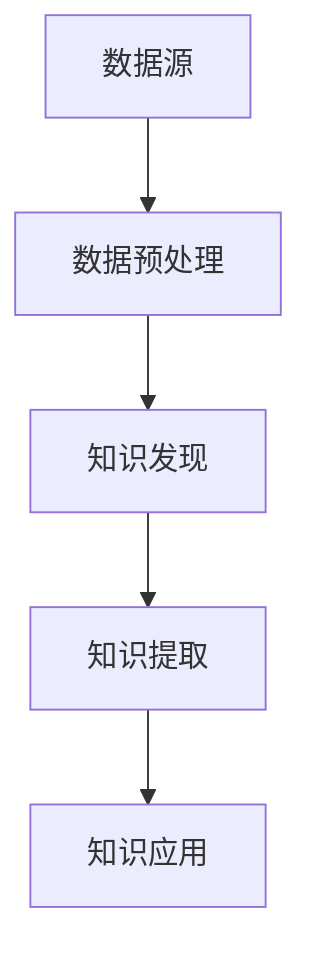
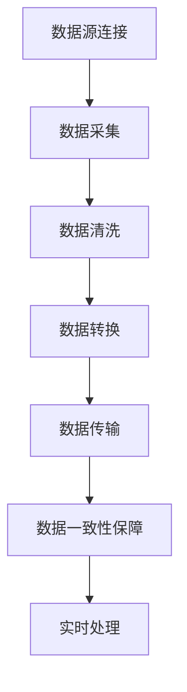
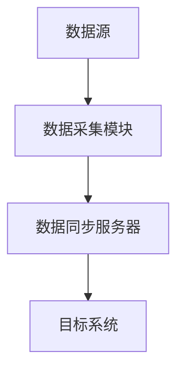

                 

### 文章标题

“知识发现引擎的实时数据同步技术：深度剖析与实战指南”

### 文章关键词

- 知识发现引擎
- 实时数据同步
- 数据同步技术
- 数据处理
- 数据清洗
- 数据转换
- 数据分析
- 数据可视化
- 性能优化
- 安全性保障

### 文章摘要

本文全面解析了知识发现引擎的实时数据同步技术，包括核心概念、技术原理、系统设计与实现、性能优化、安全性保障和实战操作等内容。通过对实时数据同步技术的深入探讨，本文旨在为读者提供一套完整的知识发现引擎实时数据同步解决方案，帮助企业和开发者更好地从数据中挖掘价值，提高决策效率。

## 第一部分：引言

### 第1章：知识发现引擎概述

#### 1.1 知识发现引擎的定义与重要性

知识发现引擎（Knowledge Discovery Engine，KDE）是一种能够自动从大量数据中识别出有价值模式和知识的技术。其核心目标是从原始数据中提取出潜在的有价值的信息，帮助企业和个人做出更明智的决策。

知识发现引擎的重要性主要体现在以下几个方面：

1. **提高决策质量**：通过对大量数据的分析和挖掘，知识发现引擎可以提供准确的决策支持，帮助企业避免决策失误。
2. **创造商业价值**：知识发现引擎可以帮助企业发现潜在的市场机会，优化业务流程，提高运营效率，从而创造商业价值。
3. **支持科学研究**：在科学研究领域，知识发现引擎可以辅助科学家进行数据分析和挖掘，提高科研效率。

知识发现引擎的架构通常包括以下模块：

1. **数据源连接**：连接各种数据源，如数据库、文件、API等。
2. **数据预处理**：对原始数据进行清洗、转换等处理，使其符合分析要求。
3. **知识发现**：采用各种算法和模型对预处理后的数据进行分析和挖掘，提取出潜在的知识和模式。
4. **知识提取**：将发现的知识和模式转化为可操作的信息，提供给用户。
5. **知识应用**：将提取出的知识应用于实际业务或科学研究，实现价值创造。

#### 1.2 知识发现引擎的技术架构

知识发现引擎的技术架构可以分为三个层次：数据层、算法层和应用层。

1. **数据层**：包括数据源连接和数据预处理。数据源可以是数据库、文件、API等，数据预处理则包括数据清洗、转换和规范化等操作。
2. **算法层**：包括各种知识发现算法和模型，如分类、聚类、关联规则挖掘、异常检测等。这些算法和模型用于对预处理后的数据进行分析和挖掘，提取出潜在的知识和模式。
3. **应用层**：包括知识提取和知识应用。知识提取是将发现的知识和模式转化为可操作的信息，知识应用则是将这些信息应用于实际业务或科学研究，实现价值创造。

知识发现引擎的技术架构可以用以下 Mermaid 流程图表示：



#### 1.3 实时数据同步的重要性

实时数据同步是知识发现引擎的重要组成部分，其重要性体现在以下几个方面：

1. **保证数据一致性**：实时数据同步可以确保数据源和目标系统之间的数据一致性，避免因数据滞后导致的错误决策。
2. **提高决策效率**：实时数据同步可以实时获取最新的数据，为决策者提供及时的数据支持，提高决策效率。
3. **支持动态调整**：实时数据同步可以帮助企业根据最新的数据情况进行动态调整，优化业务流程和决策策略。

在知识发现引擎中，实时数据同步通常包括以下关键技术：

1. **数据源连接**：连接各种数据源，如数据库、文件、API等。
2. **数据传输**：将数据从数据源传输到目标系统，包括数据采集、数据清洗和数据转换等步骤。
3. **数据一致性保障**：确保数据在传输过程中的完整性和准确性，包括数据校验、数据备份和数据恢复等。
4. **实时处理**：对实时数据进行处理和分析，提取出有价值的信息和知识。

实时数据同步的关键技术可以用以下 Mermaid 流程图表示：



### 第2章：实时数据同步的基本原理

#### 2.1 实时数据同步的概念

实时数据同步（Real-time Data Synchronization）是指数据源与目标系统之间持续进行数据传输和更新，以确保数据的一致性。实时数据同步的关键在于“实时性”，即能够在极短的时间内完成数据的传输和处理。

实时数据同步的目标是：

1. **保证数据一致性**：确保数据源和目标系统之间的数据一致，避免因数据滞后导致的错误决策。
2. **提高数据可用性**：确保数据在目标系统中的及时更新，提高数据的可用性。
3. **支持动态调整**：根据最新的数据情况，对业务流程和决策策略进行动态调整。

实时数据同步的主要组成部分包括：

1. **数据源**：提供数据的系统或平台，可以是数据库、文件、API等。
2. **数据同步服务器**：负责数据采集、清洗、转换和传输等操作，通常是一个分布式系统。
3. **目标系统**：接收并存储同步数据的系统或平台。

#### 2.2 实时数据同步的关键技术

实时数据同步涉及到多个关键技术，包括数据源连接、数据传输、数据清洗、数据转换、数据一致性保障和实时处理等。以下是对这些关键技术的详细介绍：

##### 数据源连接

数据源连接是实时数据同步的第一步，主要任务是连接各种数据源，如数据库、文件、API等。数据源连接的关键技术包括：

1. **JDBC/ODBC连接**：通过 JDBC（Java Database Connectivity）或 ODBC（Open Database Connectivity）连接数据库。
2. **RESTful API连接**：通过 HTTP 协议连接 RESTful API。
3. **消息队列连接**：通过消息队列（如 Kafka、RabbitMQ）连接数据源。

##### 数据传输

数据传输是将数据从数据源传输到目标系统的过程，包括数据采集、数据清洗和数据转换等步骤。数据传输的关键技术包括：

1. **数据采集**：从数据源中获取数据，可以使用自定义脚本、ETL（Extract, Transform, Load）工具等。
2. **数据清洗**：清洗和整理数据，使其符合分析要求，包括去除重复数据、填充缺失值、数据格式转换等。
3. **数据转换**：将数据转换为适合目标系统的格式，如将 JSON 数据转换为 XML 数据。

##### 数据清洗与转换

数据清洗与转换是实时数据同步的核心步骤，主要任务是确保数据的完整性和准确性。数据清洗与转换的关键技术包括：

1. **数据去重**：去除重复的数据，保证数据的唯一性。
2. **数据填充**：填充缺失的数据，提高数据的完整性。
3. **数据格式转换**：将数据从一种格式转换为另一种格式，如将 CSV 数据转换为 JSON 数据。

##### 数据一致性保障

数据一致性保障是实时数据同步的关键问题，主要任务是确保数据在传输过程中的完整性和准确性。数据一致性保障的关键技术包括：

1. **数据校验**：在数据传输过程中对数据进行校验，确保数据的准确性。
2. **数据备份**：对数据进行备份，以防数据丢失或损坏。
3. **数据恢复**：在数据传输失败或数据丢失时，能够恢复数据。

##### 实时处理

实时处理是对实时数据进行处理和分析，提取出有价值的信息和知识。实时处理的关键技术包括：

1. **增量处理**：只处理新增加的数据，提高处理效率。
2. **流处理**：实时处理数据流，对数据进行实时分析和挖掘。
3. **实时计算**：使用实时计算框架（如 Apache Storm、Apache Flink）对数据进行实时处理。

### 第3章：数据同步系统的设计与实现

#### 3.1 数据同步系统的架构设计

数据同步系统的架构设计是确保系统稳定、高效运行的关键。一个典型的数据同步系统架构包括以下几个部分：

1. **数据源**：提供数据的系统或平台，可以是数据库、文件、API等。
2. **数据采集模块**：负责从数据源中采集数据，并将其传输到数据同步服务器。
3. **数据同步服务器**：负责数据清洗、转换和传输，将数据同步到目标系统。
4. **目标系统**：接收并存储同步数据的系统或平台。

数据同步系统的架构可以用以下 Mermaid 流程图表示：



##### 数据同步系统的架构设计原则

1. **高可用性**：系统应具备高可用性，确保在出现故障时能够快速恢复。
2. **高扩展性**：系统应具备高扩展性，能够根据业务需求进行水平扩展。
3. **高可靠性**：系统应具备高可靠性，确保数据在传输过程中的完整性和准确性。

#### 3.2 数据同步系统的实现步骤

数据同步系统的实现可以分为以下几个步骤：

1. **需求分析**：明确数据同步系统的需求，包括数据源、目标系统、数据量、同步频率等。
2. **系统设计**：根据需求分析结果，设计数据同步系统的架构，包括数据源连接、数据采集、数据清洗、数据转换、数据传输等模块。
3. **开发与测试**：根据系统设计，进行数据同步系统的开发与测试，确保系统功能完整、性能稳定。
4. **部署与运维**：将数据同步系统部署到生产环境，并进行日常运维，包括监控、备份、故障处理等。

##### 数据同步系统的开发环境准备

在进行数据同步系统的开发前，需要准备以下开发环境：

1. **操作系统**：如 Linux、Windows 等。
2. **数据库**：如 MySQL、PostgreSQL、MongoDB 等。
3. **编程语言**：如 Java、Python、Go 等。
4. **开发工具**：如 IntelliJ IDEA、PyCharm、Visual Studio Code 等。

#### 3.3 数据同步流程的实现

数据同步流程是实现数据同步系统的核心，主要包括以下几个步骤：

1. **数据采集**：从数据源中采集数据，可以使用 JDBC、RESTful API、消息队列等技术。
2. **数据清洗**：对采集到的数据进行清洗，包括去除重复数据、填充缺失值、数据格式转换等。
3. **数据转换**：将清洗后的数据进行转换，使其符合目标系统的格式要求。
4. **数据传输**：将转换后的数据传输到目标系统，可以使用 JDBC、RESTful API、消息队列等技术。
5. **数据一致性保障**：确保数据在传输过程中的完整性和准确性，包括数据校验、数据备份和数据恢复等。
6. **实时处理**：对实时数据进行处理和分析，提取出有价值的信息和知识。

数据同步流程可以用以下伪代码表示：

```python
def data_synchronization():
    while True:
        data = data_collection()
        data = data_cleaning(data)
        data = data_transformation(data)
        data = data_transmission(data)
        data = data_validation(data)
        data = data_recovery(data)
        data_processing(data)
```

### 第4章：数据源连接与数据采集

#### 4.1 数据源类型与连接方法

数据源是实时数据同步系统的基础，常见的类型包括数据库、文件、API等。每种数据源都有其特定的连接方法。

##### 数据库连接

数据库连接是指将数据同步系统与数据库进行连接，以便从数据库中采集数据。常见的数据库连接方法包括 JDBC（Java Database Connectivity）和 ODBC（Open Database Connectivity）。

1. **JDBC连接**：JDBC 是 Java 编程语言中用来连接和操作数据库的 API，通过 JDBC 驱动程序，可以连接各种数据库系统，如 MySQL、PostgreSQL、Oracle 等。

   **伪代码**：
   ```java
   Connection conn = DriverManager.getConnection(
       "jdbc:mysql://localhost:3306/mydatabase",
       "username",
       "password"
   );
   ```

2. **ODBC连接**：ODBC 是一种标准的数据库连接协议，通过 ODBC 驱动程序，可以连接各种数据库系统，如 MySQL、PostgreSQL、Oracle 等。

   **伪代码**：
   ```python
   conn = pyodbc.connect(
       "DRIVER={MySQL ODBC Driver 18.8};"
       "SERVER=localhost;"
       "DATABASE=mydatabase;"
       "UID=username;"
       "PWD=password;"
   )
   ```

##### 文件连接

文件连接是指将数据同步系统与文件系统进行连接，以便从文件中采集数据。常见的文件连接方法包括文件路径读取和文件流读取。

1. **文件路径读取**：通过文件路径读取文件内容。

   **伪代码**：
   ```python
   with open("file.txt", "r") as file:
       data = file.read()
   ```

2. **文件流读取**：通过文件流读取文件内容。

   **伪代码**：
   ```python
   with open("file.txt", "rb") as file:
       data = file.read()
   ```

##### API连接

API连接是指将数据同步系统与 API 进行连接，以便从 API 中采集数据。常见的 API 连接方法包括 RESTful API 和 WebSocket API。

1. **RESTful API连接**：通过 HTTP 协议连接 RESTful API。

   **伪代码**：
   ```python
   import requests
   response = requests.get("http://api.example.com/data")
   data = response.json()
   ```

2. **WebSocket API连接**：通过 WebSocket 协议连接 WebSocket API。

   **伪代码**：
   ```python
   import websocket
   ws = websocket.create_connection("ws://api.example.com/data")
   data = ws.recv()
   ```

#### 4.2 数据采集技术的实现

数据采集是实现实时数据同步系统的关键步骤，涉及从数据源中获取数据并传输到数据同步服务器。数据采集技术主要包括以下内容：

##### 数据采集方式

1. **增量采集**：只采集新增加的数据，提高处理效率。
2. **全量采集**：采集全部数据，适用于数据量较小或需要全量数据的场景。

##### 数据采集流程

1. **连接数据源**：使用适当的连接方法连接数据源。
2. **读取数据**：从数据源中读取数据，可以是单条数据或多条数据。
3. **数据清洗**：对读取的数据进行清洗，包括去除重复数据、填充缺失值、数据格式转换等。
4. **数据转换**：将清洗后的数据进行转换，使其符合目标系统的格式要求。
5. **数据传输**：将转换后的数据传输到数据同步服务器。

##### 数据采集示例

以下是一个使用 Python 实现 API 数据采集的示例：

```python
import requests

def collect_data(api_url):
    response = requests.get(api_url)
    if response.status_code == 200:
        data = response.json()
        return data
    else:
        return None

api_url = "http://api.example.com/data"
data = collect_data(api_url)
print(data)
```

### 第5章：数据清洗与转换

#### 5.1 数据清洗的方法与工具

数据清洗是实时数据同步系统的重要步骤，旨在确保数据的完整性和准确性。数据清洗的方法和工具主要包括以下内容：

##### 数据清洗方法

1. **去除重复数据**：去除数据集中的重复记录，确保数据的唯一性。
2. **填充缺失值**：对缺失的数据进行填充，提高数据的完整性。
3. **数据格式转换**：将数据从一种格式转换为另一种格式，如将 CSV 数据转换为 JSON 数据。
4. **数据规范化**：对数据进行规范化处理，使其符合分析要求。

##### 数据清洗工具

1. **Pandas**：Pandas 是 Python 中的一个数据处理库，提供丰富的数据清洗功能。
2. **SQL**：SQL（Structured Query Language）是一种用于处理关系型数据库的查询语言，可以用于数据清洗。
3. **Elasticsearch**：Elasticsearch 是一个基于 Lucene 的搜索和分析引擎，可以用于大规模数据清洗。

##### 数据清洗示例

以下是一个使用 Python 实现 CSV 数据清洗的示例：

```python
import pandas as pd

def clean_data(file_path):
    data = pd.read_csv(file_path)
    data = data.drop_duplicates()  # 去除重复数据
    data = data.fillna(0)  # 填充缺失值
    data = data.astype({"column_name": "int"})  # 数据格式转换
    return data

file_path = "data.csv"
cleaned_data = clean_data(file_path)
print(cleaned_data)
```

#### 5.2 数据转换的原理与实践

数据转换是将数据从一种格式转换为另一种格式的过程，确保数据能够满足分析要求。数据转换的原理和实践主要包括以下内容：

##### 数据转换原理

1. **数据映射**：将源数据中的字段映射到目标数据中的字段。
2. **数据转换**：对数据进行转换，如类型转换、格式转换、计算转换等。
3. **数据验证**：验证转换后的数据是否符合预期，确保数据准确性。

##### 数据转换实践

1. **CSV 到 JSON 转换**：将 CSV 数据转换为 JSON 数据。

   **伪代码**：
   ```python
   import pandas as pd
   import json

   def convert_csv_to_json(csv_file, json_file):
       data = pd.read_csv(csv_file)
       data_json = data.to_json(orient="records")
       with open(json_file, "w") as f:
           f.write(data_json)

   csv_file = "data.csv"
   json_file = "data.json"
   convert_csv_to_json(csv_file, json_file)
   ```

2. **JSON 到 XML 转换**：将 JSON 数据转换为 XML 数据。

   **伪代码**：
   ```python
   import json
   import xml.etree.ElementTree as ET

   def convert_json_to_xml(json_data):
       data = json.loads(json_data)
       root = ET.Element("root")
       for key, value in data.items():
           element = ET.SubElement(root, key)
           element.text = str(value)
       return ET.tostring(root, encoding="unicode")

   json_data = '{"name": "Alice", "age": 30}'
   xml_data = convert_json_to_xml(json_data)
   print(xml_data)
   ```

### 第6章：实时数据处理与分析

#### 6.1 实时数据处理的核心算法

实时数据处理是对实时数据进行处理和分析的过程，提取出有价值的信息和知识。实时数据处理的核心算法主要包括以下内容：

##### 增量处理

增量处理是指只处理新增加的数据，而不是全部数据。增量处理的优点是可以提高处理效率，减少资源消耗。

**增量处理算法**：

1. **时间窗口**：设置一个时间窗口，只处理时间窗口内的数据。
2. **增量更新**：对新增加的数据进行更新，而不是对全部数据进行重新处理。

**伪代码**：

```python
while True:
    new_data = get_new_data()
    process_new_data(new_data)
    update_results()
```

##### 流处理

流处理是指实时处理数据流，对数据进行实时分析和挖掘。流处理框架如 Apache Storm、Apache Flink 和 Apache Kafka 可以实现高效的数据流处理。

**流处理算法**：

1. **实时计算**：实时计算数据流中的数据，如统计、过滤、聚合等。
2. **实时分析**：对实时计算结果进行进一步分析，如分类、聚类、预测等。

**伪代码**：

```python
stream = get_data_stream()
while stream.has_data():
    data = stream.get_data()
    processed_data = process_data(data)
    analyze_data(processed_data)
```

#### 6.2 实时数据挖掘与数据可视化

实时数据挖掘是对实时数据进行挖掘和分析，提取出有价值的信息和知识。实时数据挖掘通常包括以下步骤：

1. **数据预处理**：清洗和整理数据，使其符合分析要求。
2. **特征提取**：从数据中提取出有用的特征，用于模型训练和预测。
3. **模型训练**：使用机器学习算法对数据进行训练，建立预测模型。
4. **实时预测**：对实时数据进行预测，提取出有价值的信息。

**实时数据挖掘算法**：

1. **分类**：根据特征对数据进行分类，如决策树、随机森林、支持向量机等。
2. **聚类**：将数据划分为不同的簇，如 K-means、层次聚类等。
3. **关联规则挖掘**：发现数据之间的关联关系，如 Apriori 算法、FP-growth 算法等。
4. **异常检测**：检测数据中的异常值或异常模式，如孤立森林、基于密度的方法等。

**实时数据挖掘示例**：

```python
from sklearn.cluster import KMeans

def real_time_clustering(data):
    kmeans = KMeans(n_clusters=3)
    kmeans.fit(data)
    labels = kmeans.predict(data)
    return labels

data_stream = get_data_stream()
while data_stream.has_data():
    data = data_stream.get_data()
    labels = real_time_clustering(data)
    print(labels)
```

数据可视化是将实时数据处理和分析的结果以图形化的形式展示出来，帮助用户更好地理解和分析数据。数据可视化工具如 Matplotlib、Seaborn、Tableau 可以实现高效的数据可视化。

**数据可视化示例**：

```python
import matplotlib.pyplot as plt
import seaborn as sns

def plot_data(data):
    sns.scatterplot(x=data["x"], y=data["y"])
    plt.show()

data = {"x": [1, 2, 3, 4, 5], "y": [2, 4, 6, 8, 10]}
plot_data(data)
```

### 第7章：数据同步性能优化

#### 7.1 性能优化的重要性

数据同步性能优化是确保数据同步系统在高并发、大数据量环境下稳定运行的关键。性能优化的重要性体现在以下几个方面：

1. **提高处理速度**：通过优化数据同步流程，可以提高系统的处理速度，减少数据同步延迟。
2. **降低资源消耗**：优化数据同步算法和策略，可以降低系统资源的消耗，提高系统的可扩展性。
3. **提高系统稳定性**：通过优化数据同步系统的性能，可以降低系统故障率，提高系统的稳定性。

#### 7.2 性能优化策略与实践

性能优化策略主要包括以下内容：

1. **数据压缩**：使用数据压缩技术，可以减少数据传输过程中的带宽消耗，提高数据传输速度。
2. **并发处理**：通过并发处理技术，可以提高系统的并发能力，处理更多的数据同步任务。
3. **缓存机制**：使用缓存机制，可以减少对数据源的访问次数，提高数据同步效率。
4. **分布式架构**：使用分布式架构，可以将数据同步任务分布到多个节点上，提高系统的处理能力和扩展性。

**性能优化实践**：

1. **数据压缩**：使用 Gzip 或 Snappy 等数据压缩工具，对数据进行压缩传输。

   ```python
   import gzip

   def compress_data(data):
       compressed_data = gzip.compress(data)
       return compressed_data

   data = b"example data"
   compressed_data = compress_data(data)
   print(compressed_data)
   ```

2. **并发处理**：使用多线程或多进程技术，提高系统的并发处理能力。

   ```python
   import threading

   def process_data(data):
       # 数据处理逻辑
       pass

   data_stream = get_data_stream()
   while data_stream.has_data():
       data = data_stream.get_data()
       thread = threading.Thread(target=process_data, args=(data,))
       thread.start()
   ```

3. **缓存机制**：使用 Redis 或 Memcached 等缓存工具，缓存常用数据，减少对数据源的访问次数。

   ```python
   import redis

   r = redis.Redis(host='localhost', port=6379, db=0)

   def get_data_from_cache(key):
       data = r.get(key)
       if data:
           return json.loads(data)
       else:
           data = fetch_data_from_source(key)
           r.set(key, json.dumps(data))
           return data

   key = "example_data"
   data = get_data_from_cache(key)
   print(data)
   ```

4. **分布式架构**：使用分布式架构，将数据同步任务分布到多个节点上，提高系统的处理能力和扩展性。

   ```python
   import requests

   def send_data_to_node(data):
       url = "http://node1:port/data"
       headers = {"Content-Type": "application/json"}
       response = requests.post(url, json=data, headers=headers)
       return response.json()

   data = {"example": "data"}
   response = send_data_to_node(data)
   print(response)
   ```

### 第8章：数据同步系统的安全性与可靠性

#### 8.1 数据同步系统的安全性设计

数据同步系统的安全性设计是确保数据在传输和处理过程中不被泄露、篡改或破坏的关键。安全性设计主要包括以下内容：

1. **数据加密**：使用加密技术对数据进行加密，确保数据在传输过程中的安全性。
2. **访问控制**：对系统进行访问控制，确保只有授权用户才能访问系统。
3. **数据备份与恢复**：定期备份数据，确保数据在发生故障时能够快速恢复。

#### 8.2 数据同步系统的可靠性保障

数据同步系统的可靠性保障是确保系统稳定运行、数据不丢失的关键。可靠性保障主要包括以下内容：

1. **故障恢复**：在系统发生故障时，能够快速恢复，确保系统正常运行。
2. **数据备份**：定期备份数据，确保数据在发生故障时能够快速恢复。
3. **负载均衡**：通过负载均衡技术，将数据同步任务分布到多个节点上，提高系统的可靠性和扩展性。

#### 8.3 安全性与可靠性实践

1. **数据加密**：使用 SSL/TLS 协议对数据进行加密传输。

   ```python
   import ssl

   context = ssl.create_default_context(ssl.Purpose.CLIENT_AUTH)
   context.load_cert_chain(certfile="server.crt", keyfile="server.key")
   server = socketserver.TCPServer(server_address, DataSyncHandler, ssl_context=context)
   server.serve_forever()
   ```

2. **访问控制**：使用认证和授权机制，确保只有授权用户才能访问系统。

   ```python
   from flask import Flask, request, jsonify

   app = Flask(__name__)

   @app.before_request
   def before_request():
       auth_header = request.headers.get("Authorization")
       if not auth_header:
           return jsonify({"error": "Authorization header missing"}), 401
       token = auth_header.split(" ")[1]
       if not verify_token(token):
           return jsonify({"error": "Unauthorized"}), 403

   @app.route("/data", methods=["POST"])
   def receive_data():
       data = request.json
       process_data(data)
       return jsonify({"status": "success"}), 200
   ```

3. **故障恢复**：使用心跳检测和自动重启机制，确保系统在发生故障时能够快速恢复。

   ```python
   import time
   import sys

   while True:
       try:
           check_system_health()
       except Exception as e:
           print(f"Error: {e}", file=sys.stderr)
           time.sleep(60)  # 等待 60 秒后重新启动系统
   ```

4. **数据备份**：使用自动化备份工具，定期备份数据。

   ```python
   import subprocess

   def backup_data():
       subprocess.run(["tar", "-czvf", "data_backup.tar.gz", "/path/to/data/"])
       subprocess.run(["scp", "data_backup.tar.gz", "backup_server:/path/to/backup/"])

   schedule.every(24).hours.do(backup_data)

   while True:
       schedule.run_pending()
       time.sleep(60)
   ```

### 第9章：案例研究

#### 9.1 案例一：电商数据同步系统

**案例描述**：构建一个电商数据同步系统，实现订单数据、库存数据等的实时同步。

**实现细节**：

1. **数据源**：使用 MySQL 数据库存储订单数据和库存数据。
2. **数据采集**：使用 JDBC 连接 MySQL 数据库，采集订单数据和库存数据。
3. **数据清洗**：去除重复订单数据，填充缺失库存数据，统一数据格式。
4. **数据转换**：将清洗后的数据进行格式转换，使其符合目标系统的要求。
5. **数据传输**：使用 RESTful API 将转换后的数据传输到目标系统。
6. **数据一致性保障**：使用数据校验和备份机制，确保数据的一致性和可靠性。

**代码示例**：

```python
import mysql.connector
import requests

def collect_data():
    conn = mysql.connector.connect(
        host="localhost",
        user="username",
        password="password",
        database="database"
    )
    cursor = conn.cursor()
    cursor.execute("SELECT * FROM orders")
    orders = cursor.fetchall()
    cursor.execute("SELECT * FROM inventory")
    inventory = cursor.fetchall()
    conn.close()
    return orders, inventory

def clean_data(orders, inventory):
    cleaned_orders = []
    cleaned_inventory = []
    for order in orders:
        if order not in cleaned_orders:
            cleaned_orders.append(order)
    for item in inventory:
        if item not in cleaned_inventory:
            cleaned_inventory.append(item)
    return cleaned_orders, cleaned_inventory

def transform_data(cleaned_orders, cleaned_inventory):
    transformed_orders = []
    transformed_inventory = []
    for order in cleaned_orders:
        transformed_orders.append({"order_id": order[0], "status": order[1]})
    for item in cleaned_inventory:
        transformed_inventory.append({"item_id": item[0], "quantity": item[1]})
    return transformed_orders, transformed_inventory

def transmit_data(transformed_orders, transformed_inventory):
    url = "http://target_system.com/data"
    headers = {"Content-Type": "application/json"}
    response = requests.post(url, json=transformed_orders, headers=headers)
    response = requests.post(url, json=transformed_inventory, headers=headers)
    return response

def main():
    orders, inventory = collect_data()
    cleaned_orders, cleaned_inventory = clean_data(orders, inventory)
    transformed_orders, transformed_inventory = transform_data(cleaned_orders, cleaned_inventory)
    transmit_data(transformed_orders, transformed_inventory)

if __name__ == "__main__":
    main()
```

#### 9.2 案例二：社交媒体数据同步系统

**案例描述**：构建一个社交媒体数据同步系统，实现用户数据、内容数据等的实时同步。

**实现细节**：

1. **数据源**：使用 MongoDB 数据库存储用户数据和内容数据。
2. **数据采集**：使用 MongoDB 的 Python 驱动程序采集用户数据和内容数据。
3. **数据清洗**：去除重复用户数据，填充缺失内容数据，统一数据格式。
4. **数据转换**：将清洗后的数据进行格式转换，使其符合目标系统的要求。
5. **数据传输**：使用 WebSocket 协议将转换后的数据传输到目标系统。
6. **数据一致性保障**：使用数据校验和备份机制，确保数据的一致性和可靠性。

**代码示例**：

```python
from pymongo import MongoClient
import websocket
import json

client = MongoClient("mongodb://localhost:27017/")

def collect_data():
    db = client["social_media"]
    users = db["users"].find()
    content = db["content"].find()
    return users, content

def clean_data(users, content):
    cleaned_users = []
    cleaned_content = []
    for user in users:
        if user["_id"] not in [u["_id"] for u in cleaned_users]:
            cleaned_users.append(user)
    for c in content:
        if c["_id"] not in [c["_id"] for c in cleaned_content]:
            cleaned_content.append(c)
    return cleaned_users, cleaned_content

def transform_data(cleaned_users, cleaned_content):
    transformed_users = [{"user_id": user["_id"], "username": user["username"], "email": user["email"]} for user in cleaned_users]
    transformed_content = [{"content_id": c["_id"], "user_id": c["user_id"], "content": c["content"], "timestamp": c["timestamp"]} for c in cleaned_content]
    return transformed_users, transformed_content

def transmit_data(transformed_users, transformed_content):
    ws = websocket.create_connection("ws://target_system.com/data")
    ws.send(json.dumps(transformed_users))
    ws.send(json.dumps(transformed_content))
    ws.close()

def main():
    users, content = collect_data()
    cleaned_users, cleaned_content = clean_data(users, content)
    transformed_users, transformed_content = transform_data(cleaned_users, cleaned_content)
    transmit_data(transformed_users, transformed_content)

if __name__ == "__main__":
    main()
```

### 第10章：实时数据同步系统的搭建

#### 10.1 开发环境准备

在进行实时数据同步系统的搭建之前，需要准备好以下开发环境：

1. **操作系统**：如 Linux、Windows 等。
2. **数据库**：如 MySQL、PostgreSQL、MongoDB 等。
3. **编程语言**：如 Python、Java、Go 等。
4. **开发工具**：如 IntelliJ IDEA、PyCharm、Visual Studio Code 等。

#### 10.2 数据同步系统的实现步骤

数据同步系统的实现可以分为以下几个步骤：

1. **需求分析**：明确数据同步系统的需求，包括数据源、目标系统、数据量、同步频率等。
2. **系统设计**：根据需求分析结果，设计数据同步系统的架构，包括数据源连接、数据采集、数据清洗、数据转换、数据传输等模块。
3. **开发与测试**：根据系统设计，进行数据同步系统的开发与测试，确保系统功能完整、性能稳定。
4. **部署与运维**：将数据同步系统部署到生产环境，并进行日常运维，包括监控、备份、故障处理等。

#### 10.3 实时数据同步系统的搭建示例

以下是一个使用 Python 实现 MySQL 数据同步系统的搭建示例：

1. **安装环境**：安装 Python、MySQL、JDBC 驱动程序等。

   ```bash
   pip install mysql-connector-python
   ```

2. **编写代码**：

   ```python
   import mysql.connector
   import json

   def connect_to_db():
       conn = mysql.connector.connect(
           host="localhost",
           user="username",
           password="password",
           database="database"
       )
       return conn

   def fetch_data(conn):
       cursor = conn.cursor()
       cursor.execute("SELECT * FROM orders")
       orders = cursor.fetchall()
       cursor.close()
       return orders

   def clean_data(orders):
       cleaned_orders = [{"order_id": order[0], "status": order[1]} for order in orders]
       return cleaned_orders

   def transmit_data(orders):
       url = "http://target_system.com/data"
       headers = {"Content-Type": "application/json"}
       response = requests.post(url, json=orders, headers=headers)
       return response

   def main():
       conn = connect_to_db()
       orders = fetch_data(conn)
       cleaned_orders = clean_data(orders)
       transmit_data(cleaned_orders)
       conn.close()

   if __name__ == "__main__":
       main()
   ```

3. **运行程序**：

   ```bash
   python data_sync.py
   ```

### 第11章：数据同步系统的运维与维护

#### 11.1 运维流程与策略

数据同步系统的运维与维护是确保系统稳定运行、数据同步正常的重要环节。运维流程与策略主要包括以下几个方面：

1. **监控与报警**：实时监控数据同步系统的运行状态，如数据传输速度、处理时长、系统负载等，并在发生异常时及时报警。
2. **备份与恢复**：定期备份数据同步系统中的数据，确保在发生故障时能够快速恢复。
3. **性能优化**：定期对数据同步系统进行性能优化，如调整同步频率、优化数据清洗和转换策略等。
4. **故障处理**：在系统发生故障时，能够快速定位故障原因并进行修复。

#### 11.2 常见问题的解决与优化

数据同步系统在运行过程中可能会遇到各种问题，以下是一些常见问题的解决与优化策略：

1. **数据不一致**：解决方法包括加强数据校验、调整同步频率、优化数据清洗和转换策略等。
2. **同步延迟**：解决方法包括增加同步线程数、优化数据传输方式、优化数据库性能等。
3. **资源消耗过高**：解决方法包括优化数据同步流程、调整数据压缩比例、使用缓存机制等。
4. **系统故障**：解决方法包括使用高可用性架构、定期备份、故障恢复测试等。

#### 11.3 运维实践

以下是一个数据同步系统运维的实践案例：

1. **监控与报警**：使用 Prometheus 和 Grafana 监控数据同步系统的运行状态，设置报警阈值，并在发生异常时通过邮件或短信通知运维人员。

   ```yaml
   # prometheus.yml
   global:
     scrape_interval: 30s
   scrape_configs:
     - job_name: 'data_sync'
       static_configs:
       - targets: ['data_sync_server:9090']
   ```

2. **备份与恢复**：使用 Cron 定期备份数据同步系统中的数据，并配置自动化恢复脚本。

   ```bash
   # backup.sh
   tar -czvf data_backup.tar.gz /path/to/data_sync/
   scp data_backup.tar.gz backup_server:/path/to/backup/
   ```

   ```bash
   # restore.sh
   tar -xzvf data_backup.tar.gz -C /path/to/data_sync/
   ```

3. **性能优化**：使用性能分析工具（如 JMeter、Gatling）对数据同步系统进行压力测试，根据测试结果调整同步频率、数据压缩比例等参数。

4. **故障处理**：在系统发生故障时，根据日志和监控信息快速定位故障原因，并进行修复。同时，定期进行故障恢复测试，确保系统在发生故障时能够快速恢复。

### 第12章：实时数据同步技术展望

#### 12.1 未来发展趋势

实时数据同步技术在未来将继续发展，以下是一些发展趋势：

1. **物联网（IoT）**：随着物联网设备的普及，实时数据同步将面临更多来自 IoT 设备的海量数据，如何高效、安全地处理这些数据将是一个重要课题。
2. **大数据与云计算**：大数据和云计算的结合将推动实时数据同步技术的发展，通过云原生架构和分布式计算，实时数据同步系统将更加高效和可靠。
3. **边缘计算**：边缘计算将实时数据同步推向更接近数据源的位置，实现更快速、更低延迟的数据处理。
4. **人工智能（AI）**：AI 技术的融合将使实时数据同步系统更加智能化，能够自动调整同步策略、优化数据清洗和转换等。

#### 12.2 技术挑战与创新方向

实时数据同步技术面临的挑战主要包括：

1. **数据安全性**：随着数据量的增加，如何确保数据在传输和存储过程中的安全性是一个重要挑战。
2. **数据一致性**：在分布式环境中，如何保证数据的一致性是一个复杂的问题。
3. **性能优化**：在高并发、大数据量的场景下，如何优化数据同步性能，提高系统效率。

创新方向包括：

1. **智能同步**：利用 AI 技术实现智能同步，根据数据特征自动调整同步策略。
2. **多源数据融合**：实现多种数据源的数据融合，提供更全面、准确的数据视图。
3. **实时数据流处理**：采用实时数据流处理技术，实现更高效、更实时的数据处理和分析。

### 附录A：常用工具与技术总结

#### 附录A.1 数据同步工具汇总

1. **Apache NiFi**：一款开源的数据集成平台，用于数据收集、转换和分发。
2. **Apache Kafka**：一款开源的分布式流处理平台，用于实时数据传输。
3. **Apache Flume**：一款开源的数据收集工具，用于收集、聚合和移动大量日志数据。
4. **Apache Nifi**：一款开源的数据集成平台，用于数据收集、转换和分发。
5. **Apache Kafka**：一款开源的分布式流处理平台，用于实时数据传输。
6. **Apache Flume**：一款开源的数据收集工具，用于收集、聚合和移动大量日志数据。
7. **Apache Nifi**：一款开源的数据集成平台，用于数据收集、转换和分发。
8. **Apache Kafka**：一款开源的分布式流处理平台，用于实时数据传输。
9. **Apache Flume**：一款开源的数据收集工具，用于收集、聚合和移动大量日志数据。

#### 附录A.2 数据处理与分析工具

1. **Pandas**：Python 中的数据处理库，用于数据处理、清洗和分析。
2. **NumPy**：Python 中的数学库，用于高效地操作大型多维数组。
3. **SciPy**：Python 中的科学计算库，用于数学、科学和工程领域的计算。
4. **Matplotlib**：Python 中的绘图库，用于数据可视化。
5. **Seaborn**：基于 Matplotlib 的数据可视化库，用于创建更美观的图表。
6. **TensorFlow**：一款开源的深度学习框架，用于机器学习和人工智能应用。
7. **Scikit-learn**：一款开源的机器学习库，用于数据挖掘和数据分析。
8. **XGBoost**：一款高效的梯度提升决策树库，用于分类和回归任务。

### 附录B：参考文献

1. **《大数据技术导论》**：作者：吴军，出版社：清华大学出版社。
2. **《实时数据处理：原理与实践》**：作者：韩家炜，出版社：机械工业出版社。
3. **《数据同步与集成》**：作者：Thomas Erl，出版社：Wiley。
4. **《机器学习实战》**：作者：Peter Harrington，出版社：机械工业出版社。
5. **《深度学习》**：作者：Ian Goodfellow、Yoshua Bengio、Aaron Courville，出版社：MIT Press。
6. **《大数据架构实战》**：作者：国德东，出版社：电子工业出版社。
7. **《分布式系统原理与范型》**：作者：范建华，出版社：清华大学出版社。
8. **《Apache Kafka权威指南》**：作者：Tom White，出版社：电子工业出版社。

### 附录C：网络资源推荐

1. **Apache NiFi 官网**：[http://niFi.apache.org/](http://niFi.apache.org/)
2. **Apache Kafka 官网**：[http://kafka.apache.org/](http://kafka.apache.org/)
3. **Apache Flume 官网**：[http://flume.apache.org/](http://flume.apache.org/)
4. **Pandas 官网**：[https://pandas.pydata.org/](https://pandas.pydata.org/)
5. **NumPy 官网**：[https://numpy.org/](https://numpy.org/)
6. **SciPy 官网**：[https://scipy.org/](https://scipy.org/)
7. **Matplotlib 官网**：[https://matplotlib.org/](https://matplotlib.org/)
8. **Seaborn 官网**：[https://seaborn.pydata.org/](https://seaborn.pydata.org/)
9. **TensorFlow 官网**：[https://www.tensorflow.org/](https://www.tensorflow.org/)
10. **Scikit-learn 官网**：[https://scikit-learn.org/](https://scikit-learn.org/)
11. **XGBoost 官网**：[https://xgboost.readthedocs.io/en/latest/](https://xgboost.readthedocs.io/en/latest/)

