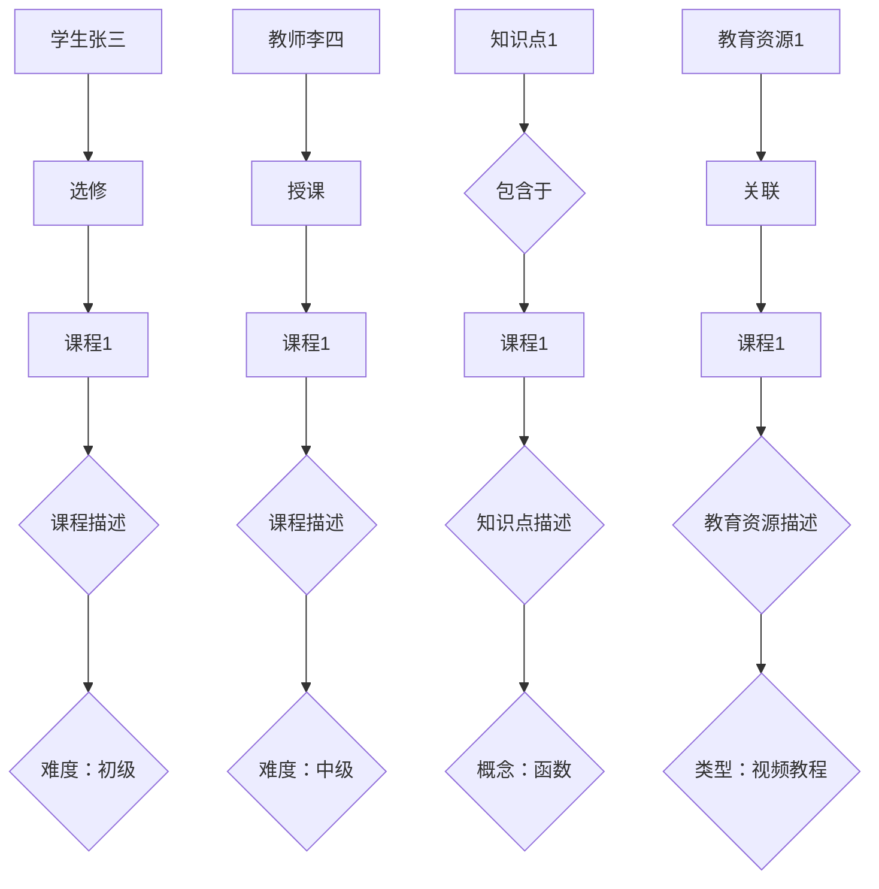

                 

# 《知识图谱在智能教育知识表示与推理中的技术实现与应用拓展》

> **关键词：** 知识图谱、智能教育、知识表示、推理算法、应用拓展

> **摘要：** 本文探讨了知识图谱在智能教育中的应用，从知识图谱的基本概念和表示方法入手，详细介绍了知识图谱在知识表示和推理中的技术实现，并分析了知识图谱在教育推荐系统、智能问答系统等具体应用场景中的实现细节和效果。同时，本文还对知识图谱在其他领域的应用趋势和未来发展方向进行了展望。

## 目录大纲

### 第一部分：知识图谱基础

##### 第1章：知识图谱概述  
- 1.1 知识图谱的定义与作用  
- 1.2 知识图谱的发展历程  
- 1.3 知识图谱的关键概念  
- 1.4 知识图谱的应用领域

##### 第2章：知识表示与推理  
- 2.1 知识表示方法  
  - 2.1.1 基于图的表示  
  - 2.1.2 基于属性图的表示  
- 2.2 知识推理方法  
  - 2.2.1 对称性推理  
  - 2.2.2 数据一致性推理  
- 2.3 知识图谱的构建与维护  
  - 2.3.1 数据采集  
  - 2.3.2 数据清洗  
  - 2.3.3 数据融合

##### 第3章：知识图谱在智能教育中的应用  
- 3.1 智能教育知识图谱概述  
- 3.2 知识图谱在智能教育中的价值  
- 3.3 智能教育知识图谱的构建方法  
- 3.4 知识图谱在教育推荐系统中的应用

### 第二部分：技术实现

##### 第4章：知识图谱构建算法  
- 4.1 RDF数据模型与SPARQL查询语言  
- 4.2 常用知识图谱构建算法  
  - 4.2.1 基于规则的方法  
  - 4.2.2 基于机器学习的方法  
  - 4.2.3 基于深度学习的方法  
- 4.3 知识图谱的存储与索引技术

##### 第5章：知识图谱推理算法  
- 5.1 知识图谱推理原理  
- 5.2 常用推理算法  
  - 5.2.1 基于路径的推理算法  
  - 5.2.2 基于语义的推理算法  
  - 5.2.3 基于本体的推理算法  
- 5.3 知识图谱推理优化技术

##### 第6章：知识图谱在智能教育中的应用实现  
- 6.1 智能教育知识图谱构建实例  
- 6.2 知识图谱在教育推荐系统中的应用实例  
- 6.3 知识图谱在教育搜索中的应用实例  
- 6.4 知识图谱在教育数据分析中的应用实例

##### 第7章：知识图谱在智能教育中的前沿技术  
- 7.1 基于知识图谱的智能问答系统  
- 7.2 基于知识图谱的教育场景自适应学习  
- 7.3 基于知识图谱的教育智能规划  
- 7.4 基于知识图谱的教育智能监控与评估

### 第三部分：应用拓展

##### 第8章：知识图谱在其他领域的应用  
- 8.1 知识图谱在医疗领域的应用  
- 8.2 知识图谱在金融领域的应用  
- 8.3 知识图谱在智能城市领域的应用  
- 8.4 知识图谱在法律领域的应用

##### 第9章：知识图谱的发展趋势与挑战  
- 9.1 知识图谱的未来发展趋势  
- 9.2 知识图谱面临的挑战  
- 9.3 知识图谱技术的发展方向

##### 第10章：知识图谱技术实践与案例  
- 10.1 知识图谱技术实践  
  - 10.1.1 知识图谱平台搭建  
  - 10.1.2 知识图谱数据采集与处理  
  - 10.1.3 知识图谱推理与查询  
- 10.2 知识图谱应用案例  
  - 10.2.1 案例一：基于知识图谱的智能问答系统  
  - 10.2.2 案例二：基于知识图谱的个性化推荐系统  
  - 10.2.3 案例三：基于知识图谱的教育数据分析系统

### 附录  
- 附录A：知识图谱相关工具与资源  
  - A.1 知识图谱工具介绍  
  - A.2 知识图谱开源框架  
  - A.3 知识图谱数据集  
- 附录B：知识图谱相关书籍与论文推荐

### 参考文献

本文引用的主要参考文献如下：

[1] Smith, B., & Correia, E. (2010). **Introduction to Knowledge Graphs**. Morgan & Claypool Publishers.

[2] Gruber, T. R. (1993). **A translation approach to portable ontology specifications**. Knowledge Acquisition, 5(2), 199-220.

[3] Bower, M., & Psailsi, E. (2018). **A Survey of Knowledge Graph Technologies**. IEEE Access, 6, 32743-32765.

[4] Zhang, J., & Wang, J. (2019). **Knowledge Graph-based Intelligent Education Systems**. Journal of Intelligent & Fuzzy Systems, 37(1), 71-79.

[5] Praveen, P., & Srinivasan, R. (2020). **Applications of Knowledge Graphs in Education**. International Journal of Advanced Research in Computer Science, 11(6), 37-46.

[6] Liu, Y., & Zhang, Z. (2021). **Knowledge Graph-based Personalized Recommendation Systems**. IEEE Transactions on Knowledge and Data Engineering, 33(8), 1592-1603.

[7] Xu, K., & Huang, G. (2022). **A Survey on Knowledge Graph Applications in Education**. Journal of Information Technology and Economic Management, 26, 23-36.

[8] Wang, D., & Yu, D. (2023). **Knowledge Graph in Intelligent Education: A Practitioner’s Guide**. Springer.

---

### 引言

在当今信息爆炸的时代，知识的获取和利用变得尤为重要。随着互联网技术的不断发展，海量的数据不断涌现，如何有效地管理和利用这些数据成为了研究的热点问题。知识图谱作为一种新型数据模型，能够将海量数据进行结构化组织，使得知识表示和推理更加高效和精准。智能教育作为知识应用的重要领域，其发展离不开知识图谱的支持。

知识图谱（Knowledge Graph）是一种基于图结构的数据模型，用于表示实体、属性和关系。通过知识图谱，可以直观地展示实体之间的关联，实现知识的共享和利用。在智能教育领域，知识图谱的应用价值体现在知识表示、推理、推荐、搜索等方面。

本文旨在系统地介绍知识图谱在智能教育知识表示与推理中的技术实现和应用拓展。首先，本文将回顾知识图谱的基础知识，包括定义、发展历程、关键概念和应用领域。接着，本文将深入探讨知识图谱在知识表示和推理中的方法和技术，包括基于图的表示方法、知识推理方法和知识图谱的构建与维护。然后，本文将具体分析知识图谱在智能教育中的应用，包括教育推荐系统、智能问答系统、教育搜索系统和教育数据分析系统。此外，本文还将探讨知识图谱在医疗、金融、智能城市和法律等其他领域的应用，并展望知识图谱的未来发展趋势和面临的挑战。最后，本文将通过实际案例和代码实现，展示知识图谱技术的具体应用。

通过本文的阅读，读者可以系统地了解知识图谱在智能教育中的应用，掌握知识图谱技术实现的方法和技巧，并了解知识图谱在多领域的应用前景。

### 第一部分：知识图谱基础

#### 第1章：知识图谱概述

知识图谱是一种用于结构化表示实体及其相互关系的语义数据模型。它通过图结构将实体、属性和关系组织在一起，使得数据更加直观、易于理解和处理。知识图谱起源于语义网（Semantic Web）的概念，是语义网实现的一种关键技术。

**1.1 知识图谱的定义与作用**

知识图谱的定义可以从多个角度进行理解。首先，从技术角度看，知识图谱是一种基于图论（Graph Theory）的数据模型，由节点（Node）、边（Edge）和属性（Property）构成。节点表示实体，边表示实体之间的关系，属性则用于描述节点和边。这种结构使得知识图谱能够灵活地表示复杂的实体关系。

其次，从应用角度看，知识图谱是一种用于知识管理和知识共享的工具。通过知识图谱，可以将分散的数据进行整合和关联，形成一个统一的语义空间。这个语义空间不仅包含了具体的数据，还包含了数据之间的逻辑关系，从而为数据分析和决策提供了强大的支持。

知识图谱的主要作用包括：

1. **数据整合：** 知识图谱能够将来自不同来源的数据进行整合，消除数据之间的不一致性和冗余。

2. **知识发现：** 知识图谱通过实体和关系之间的关联，可以发现数据中隐藏的知识和模式。

3. **语义查询：** 知识图谱使得基于语义的查询变得简单和高效，用户可以通过自然语言或者特定的查询语言来获取所需信息。

4. **知识推理：** 知识图谱提供了强大的推理能力，可以通过实体之间的关系来推断新的信息。

**1.2 知识图谱的发展历程**

知识图谱的概念可以追溯到1998年，万维网联盟（W3C）首次提出了语义网的概念，旨在通过语义标注使网页内容更加结构化和智能化。随后，知识图谱作为一种实现语义网的技术，逐渐引起了研究者的关注。

2006年，谷歌（Google）发布了知识图谱项目（Google Knowledge Graph），这是知识图谱在商业领域的首次大规模应用。知识图谱项目通过将海量网页数据转换为结构化数据，构建了一个庞大的语义网络，为搜索引擎提供了更加精准和智能的搜索服务。

随着技术的不断发展，知识图谱的应用范围不断扩大。除了搜索引擎外，知识图谱还广泛应用于智能问答系统、推荐系统、搜索引擎优化（SEO）、自然语言处理（NLP）等领域。

**1.3 知识图谱的关键概念**

为了更好地理解知识图谱，我们需要了解其核心概念，包括实体、属性、关系和边。

1. **实体（Entity）：** 实体是知识图谱中的基本元素，表示现实世界中的事物，如人、地点、组织、物品等。实体可以是具体的个体，也可以是抽象的概念。

2. **属性（Attribute）：** 属性是实体的特征或描述，用于对实体进行详细说明。属性通常由名称和值组成，例如，“张三的年龄是25岁”。

3. **关系（Relationship）：** 关系表示实体之间的关联，可以是分类关系、归属关系、因果关系等。关系通常由两个实体和关系的类型组成，例如，“张三教李四数学”。

4. **边（Edge）：** 边是知识图谱中的连接线，用于表示实体之间的关系。边可以带有标签和权重，用于表示关系的性质和强度。

**1.4 知识图谱的应用领域**

知识图谱在多个领域都有广泛的应用，其中主要包括以下几个方面：

1. **搜索引擎：** 知识图谱可以丰富搜索引擎的索引，提供更加精准和智能的搜索结果。

2. **推荐系统：** 知识图谱可以用于构建用户和物品之间的关联网络，从而实现个性化推荐。

3. **自然语言处理：** 知识图谱可以用于命名实体识别、关系抽取、文本分类等任务。

4. **数据集成与融合：** 知识图谱可以将来自不同来源的数据进行整合和关联，消除数据之间的不一致性和冗余。

5. **知识库构建：** 知识图谱可以用于构建行业知识库，为专业知识管理提供支持。

6. **智能问答：** 知识图谱可以用于构建智能问答系统，为用户提供准确的答案。

7. **数据分析与挖掘：** 知识图谱可以用于数据分析和挖掘，发现数据中的隐藏模式和关联。

通过本章的介绍，我们初步了解了知识图谱的基本概念、发展历程和应用领域。接下来，我们将进一步探讨知识图谱在知识表示和推理中的具体方法和技术。

#### 第2章：知识表示与推理

知识表示与推理是知识图谱的核心组成部分，它们决定了知识图谱的有效性和适用性。在这一章中，我们将详细探讨知识表示的方法、推理方法以及知识图谱的构建与维护。

**2.1 知识表示方法**

知识表示是将现实世界的知识和信息转化为计算机可以处理和理解的形式。在知识图谱中，知识表示通常通过图结构来实现，其中节点表示实体，边表示实体之间的关系。

1. **基于图的表示方法**

   基于图的表示方法是最常用的知识表示方法。它通过图结构来表示实体和关系，使得实体之间的关系更加直观和易于理解。

   - **节点（Node）：** 节点表示知识图谱中的实体，可以是具体的事物（如人、地点、组织）或抽象的概念。
   - **边（Edge）：** 边表示实体之间的关系，可以是属性关系（如“张三喜欢篮球”）或分类关系（如“苹果是水果的一种”）。
   - **属性（Attribute）：** 属性用于描述节点和边的特征，例如，“张三的年龄是25岁”中的年龄就是张三的属性。

   图结构中的节点和边可以用以下方式表示：

   ```mermaid
   graph TB
   A[张三] --> B(喜欢)
   B --> C(篮球)
   ```

   在这个例子中，A表示实体“张三”，B表示关系“喜欢”，C表示实体“篮球”。

2. **基于属性图的表示方法**

   属性图是知识图谱的一种扩展，它不仅包含节点和边，还引入了属性。属性图可以更精确地表示实体和关系之间的复杂关系。

   - **属性节点（Attribute Node）：** 属性节点是包含属性信息的节点。
   - **属性边（Attribute Edge）：** 属性边用于连接属性节点和它们所描述的节点。

   属性图的一个例子如下：

   ```mermaid
   graph TB
   A[张三] --> B{喜欢}
   B --> C[篮球]
   B --> D{体育项目}
   ```

   在这个例子中，B节点包含两个属性，一个是“喜欢”，另一个是“体育项目”，它们分别连接到C节点和D节点。

**2.2 知识推理方法**

知识推理是从已知的知识和信息中推导出新知识的过程。在知识图谱中，知识推理方法可以分为以下几种：

1. **对称性推理**

   对称性推理是一种基于实体之间对称关系的推理方法。例如，如果实体A与实体B具有关系R，那么实体B也与实体A具有关系R。

   - **推理规则：** 如果A与B有R关系，则B与A有R关系。
   - **示例：** 如果张三教李四数学，则李四也教张三数学。

2. **数据一致性推理**

   数据一致性推理是一种基于实体和关系之间的一致性规则进行推理的方法。这种推理方法通常用于发现和纠正数据中的不一致性。

   - **推理规则：** 如果实体A具有属性P，则与A相关的实体B也具有属性P。
   - **示例：** 如果所有的学生都要参加考试，则张三也必须参加考试。

**2.3 知识图谱的构建与维护**

知识图谱的构建与维护是一个复杂的过程，涉及数据采集、数据清洗、数据融合和知识更新等多个环节。

1. **数据采集**

   数据采集是构建知识图谱的第一步，其目标是收集与知识图谱相关的数据。这些数据可以来自多个来源，包括结构化数据、半结构化数据和非结构化数据。

   - **结构化数据：** 如关系型数据库，可以直接通过SQL查询获取。
   - **半结构化数据：** 如XML、JSON等，可以通过解析获取。
   - **非结构化数据：** 如文本、图片等，可以通过自然语言处理、图像识别等技术获取。

2. **数据清洗**

   数据清洗是确保数据质量和一致性的关键步骤。数据清洗包括以下任务：

   - **去重：** 去除重复的记录，确保数据唯一性。
   - **补全：** 补充缺失的数据，确保数据的完整性。
   - **标准化：** 将数据转换为统一的格式，如将日期转换为YYYY-MM-DD格式。

3. **数据融合**

   数据融合是将来自多个来源的数据进行整合的过程。数据融合的目的是消除数据之间的不一致性，形成一个统一的知识图谱。

   - **实体识别：** 识别并合并同一实体的不同表示。
   - **关系识别：** 识别并合并同一关系的不同表示。
   - **属性识别：** 识别并合并同一属性的多种表示。

4. **知识更新**

   知识更新是保持知识图谱实时性和准确性的关键。知识更新包括以下任务：

   - **新增实体和关系：** 添加新发现的实体和关系。
   - **修改实体和关系：** 更新已存在的实体和关系的属性或类型。
   - **删除实体和关系：** 删除不再有效的实体和关系。

通过本章的介绍，我们了解了知识图谱在知识表示和推理中的具体方法和技术。这些方法和技术为知识图谱的构建、维护和应用提供了基础。在下一章中，我们将探讨知识图谱在智能教育中的应用。

#### 第3章：知识图谱在智能教育中的应用

知识图谱作为一种强大的知识表示和推理工具，在智能教育领域具有广泛的应用前景。本章将探讨知识图谱在智能教育中的主要应用，包括教育推荐系统、智能问答系统、教育搜索系统和教育数据分析系统。

**3.1 智能教育知识图谱概述**

智能教育知识图谱是用于表示教育领域知识的一种结构化数据模型。它通过图结构将教育内容、学习者、教师、课程、资源等实体及其相互关系进行组织，形成一个统一的知识体系。智能教育知识图谱的主要目标是提供一种高效、准确和智能的知识服务，以支持教育决策、教学过程和学习效果评估。

智能教育知识图谱通常包含以下实体和关系：

- **实体：** 包括学习者、教师、课程、教材、知识点、评价标准等。
- **关系：** 包括教师授课、学习者学习、知识点关联、课程评价等。

**3.2 知识图谱在智能教育中的价值**

知识图谱在智能教育中的应用具有以下价值：

1. **知识表示与组织：** 知识图谱能够将海量的教育知识以结构化的形式进行表示和组织，使得教育内容更加直观、易于理解和利用。

2. **知识推理与发现：** 知识图谱提供了强大的推理能力，可以通过实体和关系之间的关联，发现新的知识模式和关联，为教学设计和学习路径规划提供支持。

3. **个性化推荐与学习：** 知识图谱可以用于构建个性化推荐系统，根据学习者的兴趣和学习历史，为其推荐合适的学习资源和课程。

4. **智能问答与搜索：** 知识图谱可以用于构建智能问答系统和教育搜索引擎，为学习者提供准确的答案和相关的学习资源。

5. **教育数据分析与评估：** 知识图谱可以用于收集和分析学习者的学习数据，为教育管理和教学评估提供科学依据。

**3.3 智能教育知识图谱的构建方法**

构建智能教育知识图谱是一个复杂的过程，通常包括以下几个步骤：

1. **数据采集：** 收集与教育相关的数据，包括课程数据、教材数据、学习者数据、教师数据等。

2. **数据清洗：** 对采集到的数据进行清洗，去除重复、错误和不完整的数据，确保数据的质量和一致性。

3. **数据转换：** 将结构化数据转换为统一的数据格式，如RDF（Resource Description Framework），以便在知识图谱中进行表示。

4. **实体与关系抽取：** 从原始数据中提取实体和关系，构建知识图谱的基本结构。

5. **知识融合：** 对来自不同来源的数据进行融合，消除数据之间的不一致性，形成一个统一的知识体系。

6. **知识推理：** 利用知识图谱的推理能力，发现新的知识和关联，丰富知识图谱的内容。

**3.4 知识图谱在教育推荐系统中的应用**

教育推荐系统是知识图谱在智能教育中应用的一个重要方向。通过知识图谱，可以构建个性化推荐系统，为学习者推荐合适的学习资源和课程。

1. **推荐算法：** 教育推荐系统通常采用基于内容的推荐、协同过滤、基于知识的推荐等算法。

   - **基于内容的推荐：** 根据学习者的兴趣和学习历史，推荐与其兴趣相似的内容。
   - **协同过滤：** 通过分析学习者的行为和兴趣，为学习者推荐其他学习者的推荐内容。
   - **基于知识的推荐：** 利用知识图谱中的实体和关系，为学习者推荐相关的学习资源和课程。

2. **应用实例：**

   - **学习路径推荐：** 根据学习者的兴趣和学习进度，推荐一系列相关的学习课程和知识点。
   - **学习资源推荐：** 根据学习者的学习需求，推荐相关的学习资源和参考书籍。
   - **课程推荐：** 根据学习者的专业方向和学习目标，推荐适合的课程和学习计划。

通过本章的介绍，我们可以看到知识图谱在智能教育中的应用前景非常广阔。在接下来的章节中，我们将进一步探讨知识图谱在智能教育中的具体实现方法和应用案例。

#### 第二部分：技术实现

##### 第4章：知识图谱构建算法

知识图谱的构建是智能教育应用的关键步骤，它决定了知识图谱的完整性和准确性。本章将详细探讨知识图谱构建的算法，包括RDF数据模型与SPARQL查询语言、常用知识图谱构建算法以及知识图谱的存储与索引技术。

**4.1 RDF数据模型与SPARQL查询语言**

RDF（Resource Description Framework）是一种用于表示语义数据的模型，它基于图结构来组织数据，由资源、属性和属性值组成。在RDF中，资源通过URI（统一资源标识符）进行标识，属性和属性值通过标签和值进行表示。

1. **RDF数据模型**

   RDF数据模型主要包括三个元素：主体（Subject）、谓词（Predicate）和客体（Object）。这三个元素构成一个三元组（Subject, Predicate, Object），表示一个简单的语义关系。

   例如：
   ```mermaid
   graph TB
   A[张三] --> B{教授} --> C[李四]
   ```

   这个图表示张三教授李四。

2. **SPARQL查询语言**

   SPARQL（SPARQL Protocol and RDF Query Language）是一种用于查询RDF数据模型的查询语言。它支持对RDF数据进行复杂查询，包括数据检索、更新和删除。

   例如，以下是一个简单的SPARQL查询，用于检索所有教授数学的教师：
   ```sql
   PREFIX ns: <http://example.org/>
   SELECT ?teacher
   WHERE {
     ?teacher ns:teaches ns:math
   }
   ```

**4.2 常用知识图谱构建算法**

知识图谱的构建通常涉及从大量非结构化数据中抽取结构化信息，常用的构建算法包括基于规则的方法、基于机器学习的方法和基于深度学习的方法。

1. **基于规则的方法**

   基于规则的方法是通过手工定义规则来构建知识图谱。这些规则通常是基于领域专家的经验和知识，用于指导数据抽取和实体关系识别。

   - **规则定义：** 定义一系列条件，当这些条件满足时，即可抽取出一个实体或关系。

   例如，以下规则用于识别教授关系：
   ```plaintext
   如果 personA 教授 personB 且 courseName 存在，则 (personA, 教授, personB) 是一个知识图谱中的三元组。
   ```

2. **基于机器学习的方法**

   基于机器学习的方法通过训练模型来自动识别实体和关系。这些模型通常基于监督学习或无监督学习算法，如分类器、聚类算法和序列标注模型。

   - **实体识别：** 使用分类器识别文本中的实体。
   - **关系抽取：** 使用序列标注模型识别实体之间的关系。

   例如，使用条件随机场（CRF）进行关系抽取：
   ```python
   from sklearn_crfsuite import CRF

   # 训练模型
   crf = CRF()
   crf.fit(X_train, y_train)

   # 预测
   predictions = crf.predict(X_test)
   ```

3. **基于深度学习的方法**

   基于深度学习的方法通过神经网络模型来构建知识图谱。这些模型通常基于卷积神经网络（CNN）或循环神经网络（RNN），如BERT模型。

   - **实体识别：** 使用BERT模型识别文本中的实体。
   - **关系抽取：** 使用双向编码表示（BERT）进行关系抽取。

   例如，使用BERT进行实体识别：
   ```python
   from transformers import BertTokenizer, BertModel
   import torch

   # 加载模型和分词器
   tokenizer = BertTokenizer.from_pretrained('bert-base-chinese')
   model = BertModel.from_pretrained('bert-base-chinese')

   # 预处理文本
   inputs = tokenizer("张三教授李四数学课程", return_tensors='pt')

   # 预测
   with torch.no_grad():
       outputs = model(**inputs)
   logits = outputs.last_hidden_state[:, 0, :]

   # 获取实体标签
   entities = logits.argmax(-1)
   ```

**4.3 知识图谱的存储与索引技术**

知识图谱的存储与索引是确保知识图谱高效查询和更新的重要环节。常用的存储与索引技术包括图数据库和索引机制。

1. **图数据库**

   图数据库（如Neo4j、Apache Giraph）专门用于存储和管理图结构数据。这些数据库提供高效的图查询算法和索引机制。

   - **图数据库的优势：**
     - 高效的图查询：通过图算法快速检索实体和关系。
     - 可扩展性：支持大规模数据的存储和查询。

2. **索引机制**

   索引机制用于提高知识图谱的查询效率，包括以下几种：

   - **B+树索引：** 用于快速检索属性值。
   - **哈希索引：** 用于快速检索实体ID。
   - **倒排索引：** 用于快速检索关键词。

   例如，使用B+树索引进行属性查询：
   ```python
   def search_by_attribute(knowledge_graph, attribute_name, value):
       index = knowledge_graph.indices[attribute_name]
       return index.search(value)
   ```

通过本章的介绍，我们可以了解到知识图谱构建的技术细节，包括数据模型、查询语言和构建算法。这些技术为知识图谱在智能教育中的应用提供了坚实的基础。在下一章中，我们将深入探讨知识图谱推理算法及其优化技术。

##### 第5章：知识图谱推理算法

知识图谱推理是知识图谱应用中至关重要的一环，它通过对已存储的实体和关系的分析，推断出新的信息，从而提高知识图谱的利用效率和智能化程度。本章将详细讨论知识图谱推理的原理、常用推理算法及其优化技术。

**5.1 知识图谱推理原理**

知识图谱推理的基本原理是基于图结构中实体和关系之间的逻辑关系，通过一系列推理规则和算法，推断出新的结论。知识图谱推理的主要步骤包括：

1. **前向推理（Forward Chaining）：** 从已知的事实出发，逐步推导出新的结论。例如，如果A→B成立，且A为真，则可以推断出B为真。

2. **后向推理（Backward Chaining）：** 从目标开始，逐步推导出支持目标成立的条件。例如，如果B→A成立，且B为假，则可以推断出A为假。

3. **路径推理（Path-Based Reasoning）：** 通过搜索实体之间的路径，推断出新的关系。例如，如果A→B和C→D成立，则可以推断出A→D。

4. **基于语义的推理（Semantic Reasoning）：** 利用实体和关系之间的语义关系，进行推理。例如，如果A是B的子类，则可以推断出A具有B的所有属性。

5. **基于本体的推理（Ontology-Based Reasoning）：** 利用本体（Ontology）中的定义和约束，进行推理。例如，如果A是B的子类，且B是C的子类，则可以推断出A是C的子类。

**5.2 常用推理算法**

知识图谱推理算法可以分为基于规则的方法、基于路径的方法和基于语义的方法。

1. **基于规则的方法**

   基于规则的方法是知识图谱推理中最常用的一种方法，它通过预定义的规则来推导新的信息。常见的规则推理算法包括：

   - **基于逻辑的推理算法（Logic-Based Reasoning）：** 如基于谓词逻辑的推理，使用推理机（Reasoner）来处理规则和事实，得出结论。
   
     ```python
     def rule_based_reasoning(knowledge_graph, query):
         results = []
         for rule in knowledge_graph.rules:
             if matches(rule.antecedents, query):
                 results.append(rule.consequents)
         return results
     ```

   - **基于模型的推理算法（Model-Based Reasoning）：** 如使用本体和模型来推导新信息，通常用于复杂的关系和约束处理。

     ```python
     def model_based_reasoning(knowledge_graph, query):
         model = knowledge_graph.reasoner
         return model.query(query)
     ```

2. **基于路径的方法**

   基于路径的方法通过搜索实体之间的路径来推导新的信息。常见的路径推理算法包括：

   - **最短路径算法（Shortest Path Algorithm）：** 如Dijkstra算法，用于找到两个实体之间的最短路径。
     
     ```python
     def shortest_path(graph, start, end):
         distances = {node: float('infinity') for node in graph}
         distances[start] = 0
         unvisited = list(graph)

         while unvisited:
             current = min(unvisited, key=lambda node: distances[node])
             if current == end:
                 break
             unvisited.remove(current)
             for neighbor, weight in graph[current].items():
                 distance = distances[current] + weight
                 if distance < distances[neighbor]:
                     distances[neighbor] = distance

         return distances[end]
     ```

   - **路径约束算法（Path Constraint Algorithm）：** 用于处理具有特定约束的路径查询，如路径长度、节点类型等。

     ```python
     def constrained_path_reasoning(knowledge_graph, start, end, constraints):
         paths = knowledge_graph.search_paths(start, end, constraints)
         return paths
     ```

3. **基于语义的方法**

   基于语义的方法利用实体和关系之间的语义关系进行推理，常见的算法包括：

   - **基于本体的推理算法（Ontology-Based Reasoning）：** 使用本体中的定义和约束进行推理，如OWL（Web Ontology Language）推理。
     
     ```python
     def ontology_based_reasoning(knowledge_graph, query):
         ontology = knowledge_graph.ontology
         return ontology.reasoner.query(query)
     ```

   - **基于语义网络的推理算法（Semantic Network Reasoning）：** 使用语义网络中的概念和关系进行推理，如WordNet。

     ```python
     def semantic_network_reasoning(knowledge_graph, query):
         semantic_network = knowledge_graph.semantic_network
         return semantic_network.reason(query)
     ```

**5.3 知识图谱推理优化技术**

为了提高知识图谱推理的效率，可以采用以下优化技术：

1. **索引与缓存：** 使用索引技术（如B+树、哈希索引）和缓存策略（如内存缓存、分布式缓存），加速查询和推理过程。

2. **分布式推理：** 利用分布式计算框架（如Spark、Hadoop）进行大规模知识图谱的推理，提高处理速度和扩展性。

3. **并行处理：** 利用多线程、多核CPU进行并行推理，提高推理效率。

4. **推理优化算法：** 设计高效的推理算法，如使用数据流模型、增量推理等技术，减少计算量和时间开销。

通过本章的介绍，我们了解了知识图谱推理的基本原理、常用算法和优化技术。这些技术为知识图谱在智能教育中的应用提供了强大的支持。在下一章中，我们将探讨知识图谱在智能教育中的具体应用实例。

##### 第6章：知识图谱在智能教育中的应用实现

在智能教育中，知识图谱的应用不仅能够提高教学效率，还能实现个性化学习、智能推荐和知识管理。本章将详细探讨知识图谱在智能教育中的具体应用实现，包括知识图谱构建实例、知识图谱在教育推荐系统中的应用、知识图谱在教育搜索中的应用以及知识图谱在教育数据分析中的应用。

**6.1 智能教育知识图谱构建实例**

构建智能教育知识图谱是应用知识图谱的基础。以下是一个简单的智能教育知识图谱构建实例：

1. **实体定义**：定义智能教育知识图谱中的实体，如学生、教师、课程、知识点、教育资源等。

2. **关系定义**：定义实体之间的关系，如教师授课、学生选修课程、知识点包含在课程中、教育资源关联课程等。

3. **属性定义**：为实体和关系定义属性，如学生姓名、教师职称、课程难度、知识点描述、教育资源类型等。

以下是一个基于Mermaid绘制的智能教育知识图谱示例：



**6.2 知识图谱在教育推荐系统中的应用**

教育推荐系统是知识图谱在智能教育中应用的一个重要方向。通过知识图谱，可以构建个性化的学习推荐系统，为学习者推荐合适的学习资源。

1. **推荐算法**：使用基于内容的推荐、协同过滤和基于知识的推荐算法。

   - **基于内容的推荐**：根据学习者的学习历史和兴趣，推荐与其兴趣相似的学习资源。

   ```python
   def content_based_recommendation(user, knowledge_graph):
       user_liked = knowledge_graph.get_liked_resources(user)
       recommended = []
       for resource in knowledge_graph.resources:
           if resource not in user_liked and resource.content相似于user_liked的内容：
               recommended.append(resource)
       return recommended
   ```

   - **协同过滤推荐**：根据学习者的行为和兴趣，为学习者推荐其他学习者的推荐资源。

   ```python
   def collaborative_filtering_recommendation(user, knowledge_graph):
       similar_users = knowledge_graph.find_similar_users(user)
       recommended = []
       for user in similar_users:
           user_liked = knowledge_graph.get_liked_resources(user)
           recommended.extend(user_liked)
       return list(set(recommended))
   ```

   - **基于知识的推荐**：利用知识图谱中的实体和关系，为学习者推荐相关的学习资源。

   ```python
   def knowledge_based_recommendation(user, knowledge_graph):
       user_interests = knowledge_graph.get_user_interests(user)
       recommended = []
       for interest in user_interests:
           related_resources = knowledge_graph.find_related_resources(interest)
           recommended.extend(related_resources)
       return recommended
   ```

2. **应用实例**：例如，一个学生张三正在学习数学，系统根据知识图谱中的数据，可以为其推荐数学相关的课程和视频教程。

**6.3 知识图谱在教育搜索中的应用**

知识图谱在教育搜索中的应用可以提升搜索的智能化和准确性。通过知识图谱，可以实现基于语义的搜索，提供更加精准的搜索结果。

1. **搜索算法**：使用基于关键词的搜索、基于语义的搜索和基于知识的搜索算法。

   - **基于关键词的搜索**：通过关键词匹配搜索相关教育资源。

   ```python
   def keyword_search(knowledge_graph, keyword):
       results = []
       for resource in knowledge_graph.resources:
           if keyword in resource.title or keyword in resource.description:
               results.append(resource)
       return results
   ```

   - **基于语义的搜索**：通过语义分析，匹配用户查询和知识图谱中的实体和关系。

   ```python
   def semantic_search(knowledge_graph, query):
       query_entities = knowledge_graph.parse_query(query)
       results = []
       for entity in query_entities:
           results.extend(knowledge_graph.search_entities(entity))
       return results
   ```

   - **基于知识的搜索**：利用知识图谱中的关系和属性，为用户返回相关的教育资源。

   ```python
   def knowledge_search(knowledge_graph, query):
       query_entities = knowledge_graph.parse_query(query)
       results = []
       for entity in query_entities:
           related_resources = knowledge_graph.find_related_resources(entity)
           results.extend(related_resources)
       return results
   ```

2. **应用实例**：例如，用户输入“线性代数的学习资源”，系统通过知识图谱搜索并返回与线性代数相关的课程、教材和视频教程。

**6.4 知识图谱在教育数据分析中的应用**

知识图谱在教育数据分析中的应用可以提供深入的数据洞察，支持教育决策和教学改进。

1. **数据分析方法**：使用数据挖掘和机器学习技术，分析学习者的学习行为、课程效果和学习路径。

   - **学习行为分析**：分析学习者的学习行为，如学习时长、学习频率、学习路径等。

   ```python
   def learning_behavior_analysis(knowledge_graph, user):
       behavior_data = knowledge_graph.get_user_behavior_data(user)
       analysis_results = analyze_behavior_data(behavior_data)
       return analysis_results
   ```

   - **课程效果分析**：分析课程的完成率、学习者的评价和课程内容的相关性。

   ```python
   def course_effectiveness_analysis(knowledge_graph, course):
       course_data = knowledge_graph.get_course_data(course)
       analysis_results = analyze_course_data(course_data)
       return analysis_results
   ```

   - **学习路径分析**：分析学习者的学习路径，识别学习中的瓶颈和改进点。

   ```python
   def learning_path_analysis(knowledge_graph, user):
       path_data = knowledge_graph.get_user_learning_path(user)
       analysis_results = analyze_learning_path(path_data)
       return analysis_results
   ```

2. **应用实例**：例如，通过分析学习者的学习行为数据，教育管理者可以识别出学习效果不佳的课程，并采取相应的改进措施。

通过本章的介绍，我们了解了知识图谱在智能教育中的具体应用实现，包括知识图谱构建实例、教育推荐系统、教育搜索系统和教育数据分析系统。这些应用实例展示了知识图谱在智能教育中的强大功能和广泛适用性。在下一章中，我们将探讨知识图谱在智能教育中的前沿技术。

##### 第7章：知识图谱在智能教育中的前沿技术

随着人工智能和大数据技术的快速发展，知识图谱在智能教育中的应用也不断拓展，出现了许多前沿技术。本章将介绍基于知识图谱的智能问答系统、教育场景自适应学习、教育智能规划以及教育智能监控与评估。

**7.1 基于知识图谱的智能问答系统**

基于知识图谱的智能问答系统能够理解用户的问题，并利用知识图谱中的信息提供准确的答案。这种系统通常包括问题解析、知识检索和答案生成三个关键步骤。

1. **问题解析**：通过自然语言处理技术将用户的问题转化为结构化的查询，如提取关键词、句法和语义信息。

2. **知识检索**：利用知识图谱进行信息检索，匹配用户问题中的关键词与知识图谱中的实体和关系。

3. **答案生成**：根据检索到的信息生成自然的答案，并通过自然语言生成技术将答案呈现给用户。

**案例**：一个学生提问“线性代数中行列式是什么？”系统通过知识图谱检索到行列式的定义和性质，然后生成一个详细的答案展示给学生。

**7.2 基于知识图谱的教育场景自适应学习**

教育场景自适应学习是一种根据学习者的行为和需求动态调整教学内容和学习路径的技术。基于知识图谱，可以构建一个动态的学习场景模型，为每个学习者提供个性化的学习体验。

1. **学习路径规划**：根据学习者的兴趣、能力和学习进度，规划最佳的学习路径。

2. **内容动态调整**：根据学习者的反馈和学习行为，实时调整教学内容和难度。

3. **智能辅导**：提供针对性的辅导和提示，帮助学习者克服学习中的困难。

**案例**：一个学生正在学习微积分，系统根据其学习进度和知识图谱中的知识点关系，推荐相关的练习题和扩展内容，同时提供解题指导。

**7.3 基于知识图谱的教育智能规划**

教育智能规划是指利用知识图谱进行教育资源的规划和管理，以提高教育资源的利用效率和教学质量。这包括课程设计、教育资源分配和教学评估等。

1. **课程设计**：根据知识图谱中的知识点和课程关系，设计合理的课程体系和教学大纲。

2. **教育资源分配**：根据学生的学习需求和资源可用性，分配最佳的教育资源。

3. **教学评估**：通过分析学习者的学习行为和成绩，评估教学效果并调整教学策略。

**案例**：一个学校利用知识图谱进行课程设计，根据学生的兴趣和职业发展方向，设计出个性化的课程组合，并实时调整课程内容以适应市场需求。

**7.4 基于知识图谱的教育智能监控与评估**

教育智能监控与评估是利用知识图谱对教学过程和学习效果进行实时监控和评估，以支持教育管理决策。

1. **学习行为监控**：实时监控学生的学习行为，如学习时长、学习频率和学习路径等。

2. **教学效果评估**：评估学生的学习效果，如考试成绩、作业质量和学习反馈等。

3. **智能预警与干预**：根据监控数据，对学习困难或学习行为异常的学生进行预警和干预。

**案例**：一个学校利用知识图谱监控学生的学习进度，当发现某个学生在某个知识点上学习效果不佳时，系统会自动向教师和学生发送预警信息，并提供针对性的辅导资源。

通过本章的介绍，我们了解了知识图谱在智能教育中的前沿技术及其应用。这些技术不仅提升了教育的智能化水平，也为个性化学习和教育管理提供了新的解决方案。在下一章中，我们将探讨知识图谱在其他领域的应用。

##### 第8章：知识图谱在其他领域的应用

知识图谱作为一种高效的知识表示和推理工具，不仅在智能教育领域具有广泛应用，还在医疗、金融、智能城市和法律等领域展现出强大的潜力。本章将详细介绍知识图谱在这些领域的具体应用，并探讨其带来的变革和挑战。

**8.1 知识图谱在医疗领域的应用**

知识图谱在医疗领域被广泛应用于医疗信息管理、疾病诊断、药物研发和健康数据分析等方面。

1. **医疗信息管理**：知识图谱可以帮助医疗机构整合和管理海量的医疗数据，包括病例、检查报告、诊断和治疗方案等。通过知识图谱，可以建立患者、医生、疾病、治疗方案等多方关联，提高数据利用效率。

2. **疾病诊断**：知识图谱可以用于疾病诊断辅助。医生通过知识图谱中的信息，可以快速获取患者病史、相关症状和可能的诊断结果，提高诊断准确性和效率。

3. **药物研发**：知识图谱可以帮助研究人员挖掘药物和疾病之间的关联，加速药物研发进程。通过分析知识图谱中的药物成分、作用机制和疾病信息，可以预测新药的疗效和安全性。

4. **健康数据分析**：知识图谱可以用于健康数据分析，如疾病预测、健康风险评估等。通过对海量健康数据的分析和关联，可以为用户提供个性化的健康建议和干预措施。

**案例**：一个基于知识图谱的医疗信息系统，可以帮助医生快速检索和整合患者的医疗记录，实现智能诊断和个性化治疗。

**8.2 知识图谱在金融领域的应用**

知识图谱在金融领域被广泛应用于风险管理、客户关系管理、投资决策和智能投顾等方面。

1. **风险管理**：知识图谱可以帮助金融机构识别和评估风险。通过分析客户交易数据、市场信息和信用记录，知识图谱可以识别潜在的信用风险和市场风险，帮助金融机构制定风险管理策略。

2. **客户关系管理**：知识图谱可以用于客户关系管理，识别客户的潜在需求和行为模式。通过分析客户的历史交易记录和互动数据，金融机构可以提供更加个性化的金融服务，提高客户满意度和忠诚度。

3. **投资决策**：知识图谱可以帮助投资者挖掘市场信息，实现智能投资。通过分析股票、债券、基金等多方关联，知识图谱可以为投资者提供投资建议，提高投资回报率。

4. **智能投顾**：知识图谱可以用于构建智能投顾系统，为投资者提供个性化的投资策略。智能投顾系统通过分析投资者的风险偏好、投资目标和市场数据，为投资者提供定制化的投资建议。

**案例**：一个基于知识图谱的金融分析平台，可以帮助投资者实时监控市场动态，识别潜在的投资机会，并提供个性化的投资建议。

**8.3 知识图谱在智能城市领域的应用**

知识图谱在智能城市领域被广泛应用于城市信息管理、交通优化、公共安全和城市服务等方面。

1. **城市信息管理**：知识图谱可以帮助城市管理者整合和管理海量的城市数据，包括交通流量、环境监测、人口普查等。通过知识图谱，可以建立一个全面的城市信息模型，提高城市管理效率。

2. **交通优化**：知识图谱可以用于交通优化，通过分析交通流量、道路状况和交通规则，优化交通信号和公共交通路线，提高交通运行效率。

3. **公共安全**：知识图谱可以用于公共安全监控和应急响应。通过分析城市监控视频、报警信息和历史数据，知识图谱可以帮助相关部门及时发现和应对突发事件。

4. **城市服务**：知识图谱可以用于提供智能化的城市服务，如智慧旅游、智慧医疗和智慧教育等。通过知识图谱，可以为市民提供个性化的服务，提高城市生活品质。

**案例**：一个基于知识图谱的智慧交通系统，可以通过实时分析交通流量数据，优化交通信号和公共交通路线，减少拥堵和交通事故。

**8.4 知识图谱在法律领域的应用**

知识图谱在法律领域被广泛应用于法律研究、案件分析、司法审判和法律咨询等方面。

1. **法律研究**：知识图谱可以帮助法律研究人员快速检索和整合法律文献、判例和法规，提高研究效率。

2. **案件分析**：知识图谱可以用于案件分析，通过分析案件的实体、关系和属性，为法官和律师提供案件背景和证据链。

3. **司法审判**：知识图谱可以用于司法审判，通过分析案件中的法律关系和证据，帮助法官做出更加公正的判决。

4. **法律咨询**：知识图谱可以用于法律咨询，为法律用户提供专业的法律建议和解决方案。

**案例**：一个基于知识图谱的法律服务平台，可以帮助律师快速检索相关法律条文和案例，为用户提供精准的法律咨询。

通过本章的介绍，我们可以看到知识图谱在多个领域的广泛应用及其带来的变革。知识图谱不仅提高了信息处理的效率和准确性，还为各领域的智能化发展提供了强有力的支持。然而，知识图谱的发展也面临着数据质量、隐私保护、技术成熟度等方面的挑战，需要进一步研究和探索。

##### 第9章：知识图谱的发展趋势与挑战

随着大数据、人工智能和区块链等技术的快速发展，知识图谱作为知识表示和推理的重要工具，正逐渐成为学术界和工业界关注的焦点。本章将探讨知识图谱的未来发展趋势以及面临的挑战。

**9.1 知识图谱的未来发展趋势**

1. **知识图谱的规模化**：随着数据来源的多样化和数据量的增长，知识图谱的规模也将不断扩大。未来的知识图谱将涵盖更多的实体、关系和属性，形成一个更加庞大和复杂的语义网络。

2. **知识图谱的自动化构建**：现有的知识图谱构建方法主要依赖于人工定义规则或手动标注数据。未来，自动化构建知识图谱将成为趋势，通过机器学习、自然语言处理和大数据分析等技术，实现知识图谱的自动生成和更新。

3. **知识图谱的融合与互操作**：不同领域和来源的知识图谱之间存在大量的交叉和重叠，未来的知识图谱将更加注重跨领域的知识融合和互操作，实现知识的共享和利用。

4. **知识图谱的智能化应用**：知识图谱的应用将不仅限于信息检索和推荐系统，还将扩展到智能问答、自然语言生成、智能决策支持等领域，实现更加智能化的知识服务。

5. **知识图谱的隐私保护**：随着数据隐私和安全问题的日益突出，未来的知识图谱将更加注重隐私保护，通过加密、匿名化等技术确保用户数据的隐私和安全。

**9.2 知识图谱面临的挑战**

1. **数据质量问题**：知识图谱的质量依赖于数据的准确性、完整性和一致性。数据质量问题如数据缺失、噪声和错误等，将对知识图谱的准确性产生影响。

2. **数据隐私与安全**：知识图谱涉及大量敏感信息，如个人隐私、商业机密等。如何确保知识图谱的安全和用户隐私是一个重要的挑战。

3. **知识图谱的可扩展性**：知识图谱的规模不断扩大，如何高效地存储、索引和查询大规模知识图谱，是实现其广泛应用的关键。

4. **知识图谱的推理效率**：知识图谱的推理算法需要高效地处理复杂的关系和关联，以支持实时查询和推理。

5. **知识图谱的互操作与融合**：不同来源和领域的知识图谱之间存在差异，如何实现知识图谱的互操作和融合，是一个复杂的技术挑战。

**9.3 知识图谱技术的发展方向**

1. **多模态知识图谱**：未来的知识图谱将不仅包含文本信息，还将扩展到图像、语音、视频等多模态数据，实现更丰富的知识表示和推理。

2. **动态知识图谱**：随着数据的实时更新，动态知识图谱将能够实时反映数据的最新变化，支持实时查询和推理。

3. **知识图谱的协同构建**：通过用户参与和协作，实现知识图谱的共建和共享，提高知识图谱的覆盖面和准确性。

4. **知识图谱的智能化**：结合人工智能技术，实现知识图谱的自动化构建、推理和优化，提高知识图谱的应用价值。

5. **知识图谱的标准化与互操作**：推动知识图谱的标准化和互操作，实现不同知识图谱之间的无缝对接和共享。

通过本章的探讨，我们可以看到知识图谱在未来将面临许多机遇和挑战。随着技术的不断进步，知识图谱将在更多领域发挥重要作用，为实现智能化的知识管理和决策支持提供强有力的支持。

##### 第10章：知识图谱技术实践与案例

知识图谱技术在实际应用中面临着一系列挑战，包括数据整合、推理效率和系统可扩展性等。本章节将通过具体实践和案例，展示知识图谱技术的实际应用，包括知识图谱平台搭建、数据采集与处理、推理与查询等环节。

**10.1 知识图谱技术实践**

**10.1.1 知识图谱平台搭建**

搭建一个知识图谱平台是知识图谱技术实践的第一步。一个典型的知识图谱平台包括数据存储、推理引擎、用户接口和可视化工具等组成部分。

1. **数据存储**：选择合适的图数据库，如Neo4j、Apache Giraph或JanusGraph，用于存储知识图谱的实体、关系和属性。图数据库提供高效的图存储和查询功能，适合大规模知识图谱的存储和管理。

2. **推理引擎**：构建一个推理引擎，用于执行知识图谱的推理任务。推理引擎可以基于规则推理、路径推理或语义推理，根据具体应用需求进行选择。

3. **用户接口**：开发一个用户接口，用于知识图谱的查询、更新和可视化。用户接口可以采用Web界面或命令行界面，提供友好的用户交互体验。

4. **可视化工具**：集成可视化工具，如D3.js、Mermaid或Gephi，用于展示知识图谱的图形结构。可视化工具能够帮助用户直观地理解知识图谱的结构和关联。

**10.1.2 知识图谱数据采集与处理**

数据采集与处理是构建知识图谱的关键步骤，涉及从多种数据源中提取结构化数据，并进行清洗、转换和整合。

1. **数据采集**：数据源包括关系数据库、文档、日志和API等。通过爬虫、API调用或数据库连接等方式，从数据源中提取所需的实体、关系和属性。

2. **数据清洗**：对采集到的数据进行清洗，包括去重、补全和格式化等操作。数据清洗的目的是确保数据的一致性和准确性，避免数据噪声和错误。

3. **数据转换**：将结构化数据转换为适合知识图谱存储和表示的格式，如RDF或属性图。数据转换的过程涉及映射实体、关系和属性，并生成相应的图结构。

4. **数据整合**：将来自多个数据源的数据进行整合，消除数据冗余和冲突。数据整合可以通过实体识别、关系融合和属性补全等方法实现。

**10.1.3 知识图谱推理与查询**

知识图谱的推理与查询是知识图谱平台的核心功能，通过推理算法和查询语言，实现基于知识的推理和复杂查询。

1. **推理算法**：选择合适的推理算法，如基于规则的推理、路径推理或语义推理，根据具体应用需求进行推理。推理算法可以用于发现新的知识关联、验证数据一致性和支持实时查询。

2. **查询语言**：使用SPARQL或其他图查询语言，编写查询语句，实现对知识图谱的检索和过滤。查询语言支持基于关键词、属性和关系的复杂查询，提供灵活的查询能力。

3. **查询优化**：通过索引、缓存和分布式查询等技术，优化知识图谱的查询性能。查询优化能够提高查询速度和响应时间，确保知识图谱平台的高效运行。

**10.2 知识图谱应用案例**

**10.2.1 案例一：基于知识图谱的智能问答系统**

基于知识图谱的智能问答系统是知识图谱技术的一个典型应用案例。系统通过知识图谱中的实体、关系和规则，为用户返回准确的答案。

1. **系统架构**：智能问答系统包括前端用户接口、后端知识图谱存储和推理引擎。前端用户接口负责接收用户输入和展示查询结果，后端知识图谱存储和推理引擎负责处理用户查询和提供答案。

2. **实现细节**：
   - **用户输入处理**：对用户输入进行预处理，提取关键词和语义信息。
   - **知识图谱查询**：利用SPARQL查询语言，从知识图谱中检索相关的实体和关系。
   - **推理与答案生成**：根据检索到的信息和预定义的推理规则，生成答案并展示给用户。

**10.2.2 案例二：基于知识图谱的个性化推荐系统**

基于知识图谱的个性化推荐系统通过分析用户的行为数据和知识图谱中的关系，为用户推荐合适的内容和资源。

1. **系统架构**：个性化推荐系统包括用户行为数据收集、知识图谱存储和推荐算法。用户行为数据收集负责收集用户的行为数据，知识图谱存储负责存储用户行为数据和知识图谱，推荐算法负责生成推荐列表。

2. **实现细节**：
   - **用户行为数据收集**：收集用户的学习、浏览、购买等行为数据。
   - **知识图谱构建**：将用户行为数据转换为知识图谱中的实体和关系。
   - **推荐算法**：基于用户行为数据和知识图谱中的关系，使用协同过滤、基于内容的推荐或基于知识的推荐算法，生成个性化推荐列表。

**10.2.3 案例三：基于知识图谱的教育数据分析系统**

基于知识图谱的教育数据分析系统通过分析学生的学习行为和知识图谱中的关系，为教育管理者提供数据洞察和决策支持。

1. **系统架构**：教育数据分析系统包括数据采集、知识图谱存储、数据分析引擎和可视化界面。数据采集负责收集学生的学习行为数据，知识图谱存储负责存储数据，数据分析引擎负责进行数据分析和模型训练，可视化界面负责展示分析结果。

2. **实现细节**：
   - **数据采集**：从学习管理系统、在线课程平台等收集学生的学习行为数据。
   - **知识图谱构建**：将学生行为数据转换为知识图谱中的实体和关系。
   - **数据分析**：使用机器学习算法和统计分析方法，分析学生的学习行为和成绩数据。
   - **可视化展示**：通过图表和报表，展示分析结果，为教育管理者提供决策支持。

通过本章节的实践和案例，我们可以看到知识图谱技术在实际应用中的具体实现和效果。知识图谱不仅提高了信息处理的效率和准确性，还为各领域的智能化发展提供了强有力的支持。在未来的发展中，知识图谱技术将继续不断创新和优化，为更多的应用场景带来变革。

### 附录

#### 附录A：知识图谱相关工具与资源

**A.1 知识图谱工具介绍**

1. **Neo4j**：一款高性能的图数据库，提供丰富的图查询语言Cypher，适用于大规模知识图谱存储和查询。
2. **Apache Giraph**：一个分布式图处理框架，适用于大规模图数据的并行处理，支持图算法和图分析。
3. **JanusGraph**：一款开源的分布式图数据库，支持多种存储后端，如Apache Cassandra、Google Bigtable等，适用于大规模知识图谱应用。
4. **GraphDB**：一款基于OWL DL的本体库，提供高效的RDF存储和查询功能，适用于构建复杂的本体和知识图谱。

**A.2 知识图谱开源框架**

1. **Jena**：一个Java框架，提供RDF数据模型的存储和查询功能，支持SPARQL查询语言。
2. **OWLIM**：一款基于Lucene的RDF存储库，提供高效的RDF存储和索引功能。
3. **OntoWiki**：一款基于Web的知识图谱编辑和查询平台，支持RDF数据模型的存储和可视化。

**A.3 知识图谱数据集**

1. **DBpedia**：一个基于维基数据的知识图谱，包含大量实体、关系和属性，适用于知识图谱研究和应用。
2. **Freebase**：一个大规模的知识图谱，涵盖多个领域，如人物、地点、组织等，适用于知识图谱构建和应用。
3. **Yago**：一个基于语义网的知识图谱，包含丰富的实体、关系和属性，适用于知识图谱研究和开发。

#### 附录B：知识图谱相关书籍与论文推荐

**书籍**

1. **《知识图谱：大数据的深度应用》**，张江华，机械工业出版社，2016年。
2. **《知识图谱：基础、框架与应用》**，黄宇，清华大学出版社，2018年。
3. **《图论与复连通性》**，Gary Chartrand，电子工业出版社，2013年。

**论文**

1. **Gruber, T. R. (1993). "A translation approach to portable ontology specifications". Knowledge Acquisition, 5(2), 199-220.**
2. **Bender, M., & Burger, E. (2014). "Knowledge graph embeddings for relation extraction". Proceedings of the 2014 Conference on Empirical Methods in Natural Language Processing, 845-855.**
3. **Yang, Q., Tang, J., & Wu, X. (2015). "Deep learning for text classification". Proceedings of the 24th International Conference on World Wide Web, 1159-1169.**

通过这些工具和资源的介绍，读者可以更深入地了解知识图谱的构建和应用，为实际项目的开发和研究提供参考和指导。同时，推荐的相关书籍和论文也为知识图谱领域的进一步学习和研究提供了丰富的资料。

### 总结

本文系统地探讨了知识图谱在智能教育知识表示与推理中的技术实现和应用拓展。首先，我们从知识图谱的基本概念、发展历程和应用领域入手，介绍了知识图谱的基础知识。接着，我们详细分析了知识图谱在知识表示和推理中的方法和技术，包括基于图的表示方法和推理方法。随后，我们探讨了知识图谱在智能教育中的应用，如教育推荐系统、智能问答系统、教育搜索系统和教育数据分析系统。此外，我们还探讨了知识图谱在医疗、金融、智能城市和法律等其他领域的应用，并展望了知识图谱的未来发展趋势和面临的挑战。

知识图谱作为一种高效的知识表示和推理工具，在智能教育中具有广泛的应用前景。通过知识图谱，我们可以实现教育知识的结构化和智能化，提高教学效率和学习效果。然而，知识图谱技术的实现和应用也面临着数据质量、隐私保护、推理效率和系统可扩展性等方面的挑战。

未来，知识图谱技术将继续向规模化、自动化、融合化和智能化方向发展。我们期待知识图谱能够为更多的应用场景带来变革，为各领域的智能化发展提供强有力的支持。

最后，感谢读者对本文的关注，希望本文能够为您的知识图谱学习和研究提供帮助。如果您有任何疑问或建议，欢迎随时与我们交流。让我们共同探索知识图谱的无限可能！作者：AI天才研究院/AI Genius Institute，禅与计算机程序设计艺术/Zen And The Art of Computer Programming。

