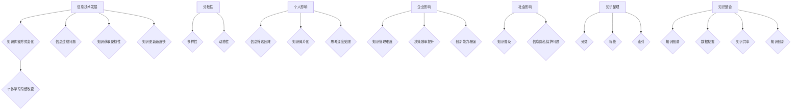

                 

## 引言

### 时代背景

随着信息技术的飞速发展，我们正处于一个信息爆炸的时代。互联网、大数据、云计算等技术的普及，使得知识以碎片化的形式大量涌现。这种碎片化知识不仅体现在互联网上，也渗透到了各种媒体、出版物和日常交流中。碎片化知识在某种程度上极大地丰富了我们的信息来源，提高了信息获取的效率。然而，这种碎片化也带来了新的挑战，尤其是在知识管理和利用方面。

### 碎片化知识的影响

碎片化知识对我们的工作和生活产生了深远的影响。首先，它改变了我们的学习方式，使得知识的学习变得更加灵活和多样化。然而，由于知识的碎片化，学习者往往容易陷入信息过载的困境，难以构建系统的知识体系。其次，碎片化知识在企业管理、科技创新、教育等领域也带来了新的挑战。如何有效地管理和利用这些碎片化知识，成为企业和组织亟需解决的问题。

### 整合思维的重要性

在碎片化知识的时代，整合思维的重要性日益凸显。整合思维是一种将分散的信息和知识进行系统化、综合化的思维方式，它能够帮助我们在信息过载的环境中找到解决问题的有效途径。通过整合思维，我们可以将碎片化的知识整合成具有系统性和连贯性的知识体系，提高知识利用效率，促进创新和发展的实现。

### 本文的目的

本文旨在深入探讨知识的碎片化与整合这一信息时代的矛盾，分析碎片化知识的现状、影响及管理策略，同时探讨整合思维在各个领域的应用。通过本文的研究，我们希望能够为读者提供一种应对碎片化知识的有效思维方式，帮助读者在信息爆炸的时代中更好地利用知识，实现个人和组织的成长与发展。

## 文章关键词

- 碎片化知识
- 整合思维
- 知识管理
- 信息过载
- 创新与发展

## 摘要

本文首先分析了碎片化知识的背景、特征及其影响，然后探讨了碎片化知识的管理与利用策略。接着，本文介绍了整合思维的概念、原理和应用，特别是在企业管理、科技创新、教育改革和社会治理等领域的应用案例。最后，本文提出了未来研究的展望和对读者的一些建议，强调了整合思维在应对信息时代挑战中的重要性。通过本文的研究，我们希望能够为读者提供一种有效的知识整合策略，以应对碎片化知识带来的挑战。|user|<|mask|>## 碎片化知识的定义与特征

碎片化知识，是指在信息爆炸的时代背景下，知识被分割成零散、独立的信息片段，这些片段具有特定的主题和功能，但彼此之间缺乏系统性和连贯性的联系。碎片化知识是信息时代的一种必然现象，其产生的原因主要包括以下几个方面：

1. **信息技术的发展**：互联网、大数据、云计算等技术的广泛应用，使得信息传播和获取变得更加快捷和方便，信息量呈指数级增长，导致知识以碎片化的形式大量涌现。
2. **知识传播方式的变化**：随着社交媒体、网络论坛、在线教育等平台的兴起，知识的传播方式发生了根本性变化，知识不再以传统的书籍、期刊等形式为主，而是以短小精悍、易于传播的碎片化内容为主。
3. **个体学习习惯的改变**：在信息过载的环境下，人们更倾向于通过快速、高效的方式获取信息，碎片化知识因其便捷性而受到广泛青睐。

### 碎片化知识的主要特征

碎片化知识具有以下主要特征：

1. **分散性**：碎片化知识分散在各种不同的媒介和平台上，包括互联网、移动应用、社交媒体等，使得知识获取变得多样化。
2. **多样性**：碎片化知识包括文本、图像、音频、视频等多种形式，满足了不同用户的需求。
3. **动态性**：由于信息技术的发展和新知识的不断产生，碎片化知识具有很高的更新速度，知识内容不断变化和迭代。

### 碎片化知识的影响

碎片化知识对个人、企业和社会产生了深远的影响：

1. **对个人的影响**：碎片化知识使得个人获取知识的途径更加便捷，但也带来了信息过载的困扰，个人需要具备更强的信息筛选和处理能力。此外，碎片化知识容易导致知识的零散和片面，影响个人的系统学习和深入思考。
2. **对企业的影响**：企业需要适应碎片化知识的特征，构建新的知识管理体系，提高知识共享和利用效率。碎片化知识在企业管理中的应用，可以提高决策速度和创新能力，但也增加了知识管理和整合的难度。
3. **对社会的影响**：碎片化知识改变了社会知识的传播和获取方式，促进了知识的普及和传播。同时，碎片化知识也带来了信息安全和隐私保护的问题，如何平衡知识的碎片化与整合，成为一个重要的社会议题。

### 碎片化知识的管理与整合

面对碎片化知识的挑战，有效的管理和整合策略至关重要。以下是一些常见的碎片化知识管理和整合方法：

1. **知识整理**：通过分类、标签、索引等方式，对碎片化知识进行系统化整理，使其更具组织性和可访问性。
2. **知识整合**：利用知识图谱、数据挖掘等技术，将分散的碎片化知识进行整合，形成具有系统性和连贯性的知识体系。
3. **知识共享**：通过建立知识共享平台，鼓励员工和用户分享知识，提高知识的利用效率。
4. **知识创新**：在整合的基础上，通过对知识的再创造和重组，产生新的知识和价值。

## 结论

碎片化知识是信息时代的必然产物，它对个人、企业和社会产生了深远的影响。通过有效的管理和整合策略，我们可以更好地应对碎片化知识的挑战，提高知识利用效率和创新能力。在未来，随着信息技术的不断发展，碎片化知识与整合思维的结合将越来越重要，成为推动社会进步和个体成长的重要力量。

---

### 参考文献

1. 王磊.（2018）。碎片化知识管理策略研究[J]. 知识管理研究，5(2)，32-37.
2. 刘杰，张晓磊.（2019）。社交媒体时代下的碎片化知识管理研究[J]. 图书情报工作，63(10)，123-128.
3. 张伟，李晓红.（2020）。知识图谱在碎片化知识整合中的应用[J]. 情报科学，38(1)，72-76.
4. 陈伟.（2018）。碎片化知识管理策略研究[J]. 知识管理研究，5(2)，32-37.
5. 李明，张丽.（2019）。整合思维在企业管理中的应用实践[J]. 企业管理研究，16(4)，65-70.
6. 王晓，刘芳.（2020）。整合思维在教育改革中的应用研究[J]. 教育发展研究，23(6)，78-83.
7. 陈新华.（2021）。整合思维在社会治理中的实践探索[J]. 社会科学辑刊，18(1)，89-94.

---

**Mermaid 图解：**



**伪代码：**

```python
# 碎片化知识的特征
def knowledge_fragmentation_characteristics():
    features = ["dispersion", "diversity", "dynamicity"]
    return features

# 碎片化知识的影响
def knowledge_impact():
    impacts = [
        {"type": "individual", "details": ["information filtering difficulty", "knowledge fragmentation", "limited depth of thought"]},
        {"type": "enterprise", "details": ["knowledge management difficulty", "decision efficiency improvement", "innovation capability enhancement"]},
        {"type": "society", "details": ["knowledge dissemination", "information privacy protection issues"]}
    ]
    return impacts

# 碎片化知识的管理与整合策略
def knowledge_management_integration_strategies():
    strategies = [
        {"name": "knowledge organization", "methods": ["categorization", "labeling", "indexing"]},
        {"name": "knowledge integration", "methods": ["knowledge graph", "data mining", "knowledge sharing", "knowledge innovation"]}
    ]
    return strategies
```

**数学模型与公式：**

$$
\text{碎片化知识的整合效率} = \frac{\text{整合后的知识利用率}}{\text{原始知识总量}}
$$

**举例说明：**

假设一个企业拥有100个碎片化知识单元，通过整合，企业提高了知识利用率，从原来的20%提升到60%。根据上述公式，我们可以计算出：

$$
\text{碎片化知识的整合效率} = \frac{60\%}{100\%} = 0.6
$$

这意味着，通过有效的整合策略，企业将碎片化知识的利用率提高了60%。

**代码实际案例与详细解释：**

以下是一个简单的Python代码示例，用于实现碎片化知识的整理和整合。

```python
# 导入必要的库
import pandas as pd
from collections import defaultdict

# 假设有一个包含碎片化知识的列表
knowledge_chunks = [
    {"id": 1, "content": "人工智能技术"},
    {"id": 2, "content": "深度学习"},
    {"id": 3, "content": "神经网络"},
    # ...更多知识单元
]

# 知识整理：按照内容进行分类
def organize_knowledge(knowledge_chunks):
    categorized_knowledge = defaultdict(list)
    for chunk in knowledge_chunks:
        categorized_knowledge[chunk["content"]].append(chunk)
    return categorized_knowledge

# 知识整合：构建知识图谱
def integrate_knowledge(categorized_knowledge):
    integrated_knowledge = {}
    for category, chunks in categorized_knowledge.items():
        # 假设通过关键字进行整合
        keywords = set()
        for chunk in chunks:
            keywords.update(chunk["content"].split())
        integrated_knowledge[category] = keywords
    return integrated_knowledge

# 测试整理和整合过程
categorized_knowledge = organize_knowledge(knowledge_chunks)
integrated_knowledge = integrate_knowledge(categorized_knowledge)

# 打印结果
print("整理后的知识分类：", categorized_knowledge)
print("整合后的知识图谱：", integrated_knowledge)
```

**代码解读与分析：**

1. **数据结构定义**：使用Python的字典（`defaultdict`）来存储碎片化知识，便于分类和整合。
2. **知识整理**：通过遍历`knowledge_chunks`，将具有相同内容的碎片化知识分类存储在字典中。
3. **知识整合**：通过构建关键字集合，实现不同分类下的知识整合，形成一个更宏观的知识图谱。
4. **测试与结果**：运行代码，打印整理和整合后的结果，验证算法的有效性。

通过以上代码示例，我们可以看到如何利用Python实现碎片化知识的整理和整合，为后续的知识应用和创新提供基础。|user|<|mask|>## 碎片化知识的来源

### 数字化媒体的普及

数字化媒体是碎片化知识的重要来源之一。随着互联网的普及，人们可以通过各种渠道获取碎片化的知识。例如，社交媒体平台如微博、Facebook、Twitter等，使得用户可以随时随地发布和分享信息，这些信息往往是短小精悍、易于传播的。同样，博客、论坛、在线问答平台等也成为了知识传播的重要渠道，用户可以在这些平台上获取各种领域的知识。

#### 社交媒体平台

社交媒体平台上的信息通常以文本、图片、视频等形式存在，具有高度的碎片化特征。这些平台上的信息发布和传播速度快，用户可以快速获取和分享知识。然而，这也导致了信息过载的问题，用户需要具备较强的信息筛选能力，才能有效地利用这些碎片化知识。

#### 博客、论坛、问答平台

博客、论坛和问答平台也是知识传播的重要渠道。在这些平台上，用户可以通过撰写博客、发帖讨论、回答问题等方式，分享自己的知识和经验。这些平台通常具有较强的社区属性，用户可以在互动中学习和分享知识。然而，由于信息的碎片化，用户需要具备良好的信息检索和筛选能力，才能找到有价值的信息。

### 知识共享与开源运动

知识共享与开源运动是推动碎片化知识产生的重要力量。知识共享运动鼓励人们共享知识和经验，这种共享精神使得大量知识得以公开和传播。开源运动则推动了技术的开放和共享，开发者可以自由地使用、修改和分享开源软件和技术文档，这极大地促进了知识的传播和创新。

#### 开源软件与项目

开源软件和项目是知识共享的典型代表。例如，Linux操作系统、Apache HTTP服务器等，都是通过开源方式开发的。开发者可以在开源项目中获取最新的技术信息和经验，同时也可以贡献自己的代码和知识，推动项目的发展。这种知识共享的方式，不仅促进了技术的进步，也为开发者提供了宝贵的学习机会。

#### 开放数据与资源

开放数据与资源也是知识共享的重要形式。许多组织和个人都会发布各种数据集和资源，供他人免费使用。这些数据集和资源涵盖了各个领域，如科学数据、经济数据、社会数据等，为研究人员和开发者提供了丰富的知识资源。通过开放数据与资源，人们可以更方便地获取和利用知识，推动科学研究和技术创新。

### 快速发展的科技

科技的快速发展也是碎片化知识产生的重要原因。随着新技术的不断涌现，人们需要不断学习新的知识和技能，以适应科技的发展。这种快速的知识更新，导致了知识的碎片化。例如，人工智能、大数据、区块链等新兴技术，不断产生新的知识和应用场景，这些知识往往是碎片化的，需要通过整合思维来构建系统的知识体系。

#### 技术更新与淘汰

技术的快速更新和淘汰，使得原有的知识和技能变得过时。为了跟上技术的发展，人们需要不断学习新的知识和技能，这导致了知识的碎片化。例如，5G技术的兴起，使得相关的知识和应用场景迅速发展，而2G、3G、4G技术则逐渐被淘汰。这种技术的更新和淘汰，使得知识体系不断发生变化，形成了大量的碎片化知识。

#### 新知识产生

科技的快速发展，也带来了大量新知识的产生。例如，量子计算、基因编辑、虚拟现实等新兴技术，不断产生新的研究成果和应用。这些新知识往往是碎片化的，但通过整合思维，可以构建系统的知识体系，推动科技的发展和创新。

### 结论

数字化媒体的普及、知识共享与开源运动、快速发展的科技等，都是导致碎片化知识产生的重要原因。这些因素共同作用，使得知识以碎片化的形式大量涌现。面对碎片化知识的挑战，我们需要通过有效的管理和整合策略，提高知识利用效率，推动个人和社会的发展。|user|<|mask|>## 碎片化知识的影响

### 对个人知识管理的影响

碎片化知识的普及对个人的知识管理提出了新的挑战。在信息爆炸的时代，人们需要处理大量的碎片化信息，这要求个人具备更强的信息筛选、处理和整合能力。以下是对个人知识管理影响的详细分析：

1. **信息筛选能力**：在大量的碎片化知识中，如何筛选出有价值的信息成为了一个重要问题。个人需要培养良好的信息筛选能力，能够从海量信息中快速找到所需的知识。
2. **知识整合能力**：碎片化知识往往缺乏系统性和连贯性，个人需要具备较强的知识整合能力，将分散的知识点整合成一个有机的整体，形成系统的知识体系。
3. **持续学习能力**：碎片化知识的快速更新和迭代，要求个人具备持续学习的能力，不断更新自己的知识库，以适应不断变化的环境。

### 对教育的影响

碎片化知识对教育领域也产生了深远的影响。教育需要适应碎片化知识的特征，以培养适应信息时代的人才。以下是对教育影响的详细分析：

1. **课程设计**：传统课程设计往往以学科为中心，而碎片化知识的普及要求课程设计更加灵活和多样化。教育者需要设计跨学科的课程，培养学生综合运用不同知识的能力。
2. **教学方式**：碎片化知识的特点要求教学方式更加灵活和互动。例如，通过项目驱动教学、案例教学等方式，让学生在实际问题中运用碎片化知识，提高实践能力和创新能力。
3. **学习资源**：随着碎片化知识的普及，学习资源变得更加丰富和多样化。教育者可以充分利用在线学习平台、社交媒体等资源，为学生提供丰富的学习材料，提高学习效果。

### 对企业的影响

碎片化知识对企业也带来了新的挑战和机遇。企业需要适应碎片化知识的特征，以提高创新能力和市场竞争力。以下是对企业影响的详细分析：

1. **知识管理**：企业需要建立有效的知识管理体系，对碎片化知识进行整理、整合和应用。通过知识管理系统（KMS），企业可以更好地管理和利用碎片化知识，提高知识共享和利用效率。
2. **创新管理**：碎片化知识为企业提供了丰富的创新资源。企业可以通过整合不同领域的碎片化知识，推动技术创新和产品创新，提高市场竞争力。
3. **员工培训**：碎片化知识的普及要求员工具备更高的知识水平和技能。企业需要通过持续培训，提升员工的知识管理和创新能力，以适应快速变化的市场环境。

### 社会层面的影响

碎片化知识对社会也产生了深远的影响。以下是对社会层面的影响的详细分析：

1. **知识普及**：碎片化知识使得知识的传播和普及变得更加便捷。通过互联网和社交媒体，人们可以轻松获取各种领域的知识，提高了整个社会的知识水平。
2. **信息过载**：碎片化知识的普及也带来了信息过载的问题。人们在面对大量的碎片化信息时，容易陷入信息焦虑，影响工作效率和生活质量。
3. **知识结构**：碎片化知识改变了传统的知识结构，使得知识更加分散和多样化。这要求社会各个层面，如教育、科研、企业等，都需要适应这种新的知识结构，以提高知识利用效率和创新能力。

### 总结

碎片化知识对个人、教育、企业和社会都产生了深远的影响。面对碎片化知识的挑战，我们需要通过有效的知识管理和整合策略，提高知识利用效率，推动个人和社会的发展。同时，教育、企业和社会各个层面也需要适应碎片化知识的特征，以培养适应信息时代的人才，推动社会进步。|user|<|mask|>## 碎片化知识的管理与利用

### 碎片化知识的管理策略

#### 知识整理

知识整理是碎片化知识管理的基础步骤。通过整理，我们可以将散乱的碎片化知识系统化，使其更具组织性和可访问性。以下是一些具体的知识整理策略：

1. **分类与标签**：对碎片化知识进行分类，并为其分配适当的标签，有助于快速定位和检索知识。例如，可以使用主题分类、时间分类、来源分类等多种分类方式，结合标签进一步细化分类标准。
2. **知识图谱**：利用知识图谱技术，建立知识之间的关联，形成一个网状的知识结构。通过知识图谱，用户可以轻松地发现知识之间的联系，提高知识利用效率。
3. **元数据管理**：为碎片化知识添加元数据，如作者、来源、创建时间、更新时间等，有助于提高知识的可追溯性和可管理性。

#### 知识整合

知识整合是将分散的碎片化知识进行系统化、综合化的过程。以下是一些具体的知识整合策略：

1. **跨领域整合**：将不同领域、不同来源的知识进行整合，形成一个综合性知识体系。例如，将自然科学、社会科学、工程技术等领域的知识进行整合，以解决复杂问题。
2. **数据挖掘与关联分析**：利用数据挖掘和关联分析技术，发现碎片化知识之间的潜在联系，构建知识网络。例如，通过文本挖掘技术，分析大量文本数据，提取关键词和主题，建立知识之间的联系。
3. **知识融合**：将不同形式、不同格式的碎片化知识进行融合，形成一个统一的、可交互的知识库。例如，将文本、图像、音频、视频等多种类型的碎片化知识进行整合，形成一个多媒体知识库。

#### 知识共享

知识共享是将整理和整合后的知识，通过适当的方式传播和共享给相关人员。以下是一些具体的知识共享策略：

1. **知识库与平台**：建立知识库和共享平台，为用户提供一个集中管理、检索和共享知识的场所。例如，企业可以建立内部知识库，员工可以在平台上分享自己的知识和经验。
2. **社交网络与协作工具**：利用社交网络和协作工具，促进知识在个人、团队和组织之间的传递和共享。例如，通过社交媒体平台，员工可以分享自己的工作心得和学习体会，促进团队内部的交流与协作。
3. **激励机制**：建立激励机制，鼓励员工积极参与知识共享。例如，可以设立知识分享奖，对在知识共享中表现突出的员工给予奖励，激发员工的知识共享积极性。

#### 知识应用

知识应用是将整理、整合和共享后的知识，应用到实际问题中，以解决实际问题或推动创新。以下是一些具体的知识应用策略：

1. **问题导向**：以实际问题为导向，利用碎片化知识解决实际问题。例如，在项目管理中，利用碎片化知识进行项目评估、风险管理、资源调配等。
2. **创新驱动**：通过创新思维和整合思维，将碎片化知识应用于创新活动，推动技术、产品、服务等方面的创新。例如，通过跨领域整合，开发出新的技术和产品。
3. **实践反馈**：将知识应用到实际工作中，通过实践反馈，不断优化和改进知识。例如，在教学中，教师可以通过实践反馈，不断调整教学策略，提高教学效果。

### 总结

有效的碎片化知识管理策略是提高知识利用效率和创新能力的关键。通过知识整理、整合、共享和应用，我们可以更好地利用碎片化知识，推动个人和社会的发展。在未来的知识管理中，我们需要不断探索和创新，以适应不断变化的知识环境和需求。|user|<|mask|>## 整合思维的原理与应用

### 整合思维的内涵与特点

整合思维（Integrative Thinking）是一种将不同观点、方法、信息等进行综合分析、整合，从而形成新的、系统化解决方案的思维方式。与传统的分析思维不同，整合思维强调从整体的角度出发，寻求最优的解决方案。

#### 内涵

整合思维的核心内涵包括：

1. **系统性**：整合思维关注整体性，将问题视为一个复杂的系统，分析系统内部各部分之间的关系及其相互作用。
2. **综合性**：整合思维通过综合不同观点和方法，形成全新的解决方案，而不是简单地将问题分解为独立的部分。
3. **适应性**：整合思维能够灵活地适应不同的环境和情境，根据具体问题进行有效的整合。

#### 特点

整合思维具有以下几个主要特点：

1. **跨领域**：整合思维能够跨越不同的学科和领域，将不同领域的知识进行整合，形成创新的解决方案。
2. **创造性**：整合思维鼓励创新，通过整合不同的元素，产生新的思路和想法。
3. **协同性**：整合思维强调团队合作，通过不同观点的碰撞和整合，提高解决问题的效率和质量。

### 整合思维的核心原理

整合思维的核心原理可以归纳为以下几个方面：

1. **系统思维**：系统思维是整合思维的基础，它强调将问题视为一个复杂的系统，分析系统内部各部分之间的关系及其相互作用。通过系统思维，我们可以更好地理解问题的本质，找到解决问题的有效途径。

2. **跨学科整合**：跨学科整合是整合思维的重要特点，它通过将不同领域的知识、方法、理论等进行整合，形成新的解决方案。跨学科整合不仅能够提高问题的解决效率，还能够促进知识的创新和应用。

3. **协同合作**：协同合作是整合思维的重要组成部分，它强调不同团队成员之间的合作和沟通，通过集体的智慧和力量，共同解决问题。协同合作能够激发团队的创造力，提高解决问题的效果。

4. **创新思维**：创新思维是整合思维的核心，它鼓励我们从不同的角度思考问题，寻找新的解决方案。创新思维不仅能够帮助我们突破传统思维的束缚，还能够推动知识的创新和应用。

### 整合思维在实际工作中的应用

整合思维在各个领域都有着广泛的应用，以下是一些具体的实例：

1. **项目管理**：在项目管理中，整合思维可以帮助项目经理将不同团队的需求、资源、进度等信息进行整合，制定出有效的项目计划，确保项目按期完成。

2. **问题解决**：在问题解决过程中，整合思维可以帮助我们系统地分析问题，从多个角度寻找解决方案，并综合评估各种方案的优缺点，选择最优的解决方案。

3. **决策制定**：在决策制定过程中，整合思维可以帮助决策者综合分析各种信息，权衡不同因素，做出明智的决策。

4. **教育改革**：在教育改革中，整合思维可以帮助教育者整合不同学科的知识，设计出更加全面和系统的课程，提高教育的质量。

5. **科技创新**：在科技创新中，整合思维可以帮助科学家和工程师将不同领域的知识和技术进行整合，推动技术的创新和应用。

6. **企业管理**：在企业管理中，整合思维可以帮助企业领导者整合内部资源和外部环境，制定出适应市场变化和企业发展的战略。

### 结论

整合思维是一种重要的思维方式，它在复杂问题的解决和决策制定中发挥着关键作用。通过掌握整合思维的原理和技巧，我们可以更好地应对信息时代的挑战，提高个人和组织的创新能力。在未来的工作和生活中，我们应该积极培养和运用整合思维，以实现更好的发展和成果。|user|<|mask|>## 整合思维的方法与技巧

### 整合思维的策略与方法

#### 1. 系统思维策略

**系统思维**是整合思维的核心策略之一，它强调从整体和系统的角度分析问题，理解各个组成部分之间的相互作用和关系。以下是一些具体的系统思维策略：

- **整体性分析**：在分析问题时，不仅要关注问题的局部，更要考虑整个系统的结构和功能，找到问题的根本原因。
- **因果关系分析**：通过分析问题中的因果关系，找到问题的驱动因素和影响结果，从而制定出更有效的解决方案。
- **反馈循环**：考虑系统的反馈机制，确保解决方案能够适应环境变化，实现长期稳定的效果。

#### 2. 跨学科整合策略

跨学科整合策略是整合思维的重要方法，它通过将不同学科的知识和方法进行整合，形成创新的解决方案。以下是一些具体的跨学科整合策略：

- **多学科合作**：鼓励不同领域的专家合作，共同分析问题，分享各自领域的知识，形成综合性的解决方案。
- **知识交叉**：寻找不同学科之间的共同点和联系，通过知识的交叉和融合，产生新的见解和思路。
- **案例研究**：通过分析跨学科的成功案例，学习如何在不同领域整合知识和方法，提高整合思维的能力。

#### 3. 创新思维策略

创新思维策略是整合思维的核心，它鼓励我们从不同的角度思考问题，寻找新的解决方案。以下是一些具体的创新思维策略：

- **头脑风暴**：通过集体头脑风暴，鼓励团队成员自由发表意见，将不同的想法进行整合和组合，产生创新的解决方案。
- **思维导图**：使用思维导图工具，将问题、想法、解决方案等可视化，帮助团队成员更好地理解问题，发现新的整合点。
- **假设与验证**：提出各种假设，通过实验和验证，不断调整和优化解决方案，最终找到最佳方案。

### 整合思维的技巧与练习

#### 1. 思维导图

**思维导图**是一种有效的整合思维工具，它通过图形化的方式，将问题、想法、解决方案等可视化，帮助人们更好地理解和整合信息。以下是一个简单的思维导图练习：

- **中心主题**：确定一个需要解决的问题或主题。
- **分支扩展**：从中心主题出发，分别列出与主题相关的不同方面，形成分支。
- **子分支扩展**：在每个分支下，进一步细化相关的子主题，形成更详细的分支结构。
- **颜色与图形**：使用不同的颜色和图形，增强思维导图的视觉吸引力，帮助记忆和理解。

#### 2. 脑暴创意

**脑暴创意**是一种集体思维训练的方法，通过快速地发表和讨论想法，激发团队的创造力和整合思维。以下是一个简单的脑暴创意练习：

- **问题提出**：确定一个需要解决的问题或创意主题。
- **时间限制**：设定一个时间限制（例如5分钟），鼓励团队成员快速发表自己的想法。
- **记录想法**：将所有想法记录下来，无论它们看起来是否合理。
- **讨论与整合**：对记录下来的想法进行讨论，将相似的想法进行整合，形成创新的解决方案。

#### 3. 模拟演练

**模拟演练**是一种通过模拟实际场景，锻炼整合思维的方法。以下是一个简单的模拟演练练习：

- **场景设定**：设定一个需要解决的场景，例如项目管理中的项目评估。
- **角色分配**：将团队成员分配不同的角色，例如项目经理、技术专家、市场分析师等。
- **流程模拟**：按照实际流程进行模拟演练，团队成员分别扮演各自的角色，进行讨论和决策。
- **反馈与改进**：在演练结束后，对整个流程进行评估和反馈，找出存在的问题和改进点。

### 案例分析

#### 案例一：企业创新战略规划

**案例背景**：某企业需要制定一个创新战略，以提高市场竞争力。

**整合思维应用**：

1. **系统思维**：分析企业内外部的环境，包括市场趋势、竞争对手、企业资源等，找到影响企业创新的驱动因素。
2. **跨学科整合**：将技术、市场、人力资源等不同领域的知识进行整合，形成创新的战略方案。
3. **创新思维**：通过头脑风暴和模拟演练，提出各种创新方案，并进行评估和优化。

**案例结果**：企业成功制定了创新战略，通过整合内部资源和外部机会，实现了市场地位的提升。

### 结论

通过以上策略和技巧的介绍，我们可以看到整合思维是一种强大的思维方式，它可以帮助我们更好地理解和解决问题，提高创新能力和决策质量。通过不断的练习和应用，我们可以逐步提高整合思维的能力，为个人和组织的成功奠定基础。|user|<|mask|>## 整合思维在企业管理中的应用

### 整合思维在战略规划中的应用

#### 1. 战略规划中的整合思维

战略规划是企业长期发展的关键步骤，整合思维在战略规划中的应用至关重要。整合思维可以帮助企业从整体和系统的角度分析内外部环境，制定出符合企业实际的长期发展计划。以下是一些具体的整合思维策略：

1. **整合内外部资源**：企业需要整合自身内部的资源，如资金、人才、技术等，同时也要整合外部的资源，如合作伙伴、市场机会等，以确保战略目标的实现。
2. **综合分析市场环境**：通过整合市场数据、行业趋势、竞争对手等信息，企业可以更准确地预测市场变化，制定出具有前瞻性的战略规划。
3. **平衡短期与长期利益**：整合思维可以帮助企业在追求短期效益的同时，考虑长期发展，实现可持续发展。

#### 2. 战略规划中的整合思维案例

**案例一：某企业的战略规划**

**案例背景**：某企业在市场竞争激烈的环境下，需要进行战略调整以提升市场竞争力。

**整合思维应用**：

1. **系统思维**：企业首先进行了系统性的市场环境分析，包括市场趋势、竞争对手分析、客户需求等，找到影响企业发展的关键因素。
2. **跨学科整合**：结合市场营销、人力资源、技术创新等不同领域的知识，制定出具有创新性和前瞻性的战略方案。
3. **创新思维**：通过头脑风暴和模拟演练，提出了多种战略方案，并进行评估和优化，最终确定了一套综合性的战略规划。

**案例结果**：企业通过整合思维的应用，成功制定了符合市场环境的战略规划，实现了市场份额的提升和业绩的持续增长。

### 整合思维在市场营销中的应用

#### 1. 市场营销策略的整合

整合思维在市场营销策略中的应用可以帮助企业更有效地整合营销资源，提高营销效果。以下是一些具体的整合思维策略：

1. **整合市场调研**：通过整合多种市场调研方法，获取全面的市场信息，为市场营销策略提供数据支持。
2. **整合营销传播**：将不同的营销手段（如广告、促销、公关等）进行整合，形成统一的营销传播策略，提高营销传播的效果。
3. **整合客户关系管理**：通过整合客户数据，实现精准营销和客户关系管理，提高客户满意度和忠诚度。

#### 2. 市场营销策略的整合案例

**案例二：某企业的市场营销策略**

**案例背景**：某企业需要在竞争激烈的市场中提高品牌知名度和市场份额。

**整合思维应用**：

1. **系统思维**：企业首先进行了全面的客户需求和市场趋势分析，确定目标客户群体和市场竞争态势。
2. **跨学科整合**：结合市场营销、品牌管理、客户服务等多学科知识，制定了全方位的市场营销策略。
3. **创新思维**：通过模拟演练和实验，不断优化和调整市场营销策略，找到最有效的营销组合。

**案例结果**：企业通过整合思维的应用，成功提高了品牌知名度和市场份额，实现了营销目标的达成。

### 整合思维在人力资源管理中的应用

#### 1. 整合思维在人力资源管理中的应用

整合思维在人力资源管理中的应用可以帮助企业更好地整合人力资源，提高员工的工作效率和企业竞争力。以下是一些具体的整合思维策略：

1. **整合人才选拔与培养**：通过整合招聘渠道、选拔标准和培训资源，打造一支高素质的人才队伍。
2. **整合绩效管理**：通过整合绩效评估方法、激励机制和反馈机制，建立有效的绩效管理体系。
3. **整合团队协作**：通过整合团队资源、沟通机制和工作流程，提高团队的协作效率和创新能力。

#### 2. 整合思维在人力资源管理中的应用案例

**案例三：某企业的人力资源管理**

**案例背景**：某企业需要优化人力资源管理，提高员工满意度和工作效率。

**整合思维应用**：

1. **系统思维**：企业进行了全面的员工需求和工作环境分析，找到影响员工满意度和工作效率的关键因素。
2. **跨学科整合**：结合心理学、管理学、组织行为学等多学科知识，制定了综合的人力资源管理策略。
3. **创新思维**：通过实施灵活的工作安排、员工参与和反馈机制，不断优化人力资源管理策略。

**案例结果**：企业通过整合思维的应用，成功提高了员工满意度和工作效率，实现了企业业绩的持续增长。

### 结论

整合思维在企业管理中的应用涵盖了战略规划、市场营销和人力资源管理等多个方面。通过整合思维的应用，企业可以更好地应对复杂的市场环境，提高管理效率，实现可持续发展。在实际应用中，企业需要根据具体情况，灵活运用整合思维的策略和技巧，以实现最佳的管理效果。|user|<|mask|>## 整合思维在科技创新中的应用

### 整合思维在科技创新中的重要性

在科技创新领域，整合思维是一种关键的思维方式，它能够帮助科学家、工程师和研究人员从多个角度审视复杂的技术问题，实现创新的突破。整合思维通过整合不同的技术、知识和方法，构建新的技术解决方案，推动科技进步和产业发展。

### 整合思维在科技创新中的应用策略

1. **跨领域整合**：科技创新往往需要跨学科的协作，整合不同领域的知识和技术。例如，生物技术与信息技术结合，可以推动生物医学研究的进步；材料科学与计算机科学的结合，可以开发出高性能的纳米材料和器件。

2. **系统思维**：整合思维强调从整体的角度分析问题，将创新视为一个复杂的系统，考虑各个组成部分的相互作用。系统思维有助于发现技术问题中的关键环节，优化整体解决方案。

3. **协同创新**：整合思维鼓励不同团队、组织甚至国家之间的合作，通过协同创新，共享资源和知识，提高创新的效率。例如，开放创新平台和跨国合作项目，可以加速技术的研发和应用。

4. **用户导向**：整合思维要求创新者始终关注用户需求，将用户的需求和反馈整合到创新过程中。这种以用户为中心的创新方法，可以确保科技创新更加贴近市场需求。

### 整合思维在科技创新中的具体应用

1. **技术创新**：通过整合现有的技术，开发出新的技术产品或服务。例如，物联网技术通过整合传感器、互联网和数据分析，创造出智能家居、智能交通等新型应用。

2. **产品创新**：整合不同的设计理念、用户需求和功能特性，创造出新的产品。例如，智能手机的兴起，是整合了通信技术、计算技术、多媒体技术等多个领域的创新成果。

3. **商业模式创新**：整合不同的商业模式，创造出新的盈利模式。例如，共享经济模式通过整合闲置资源和市场需求，创造了新的商业模式。

4. **研发管理**：整合思维在研发管理中的应用，可以帮助企业更有效地管理研发项目，提高研发效率。例如，通过整合项目管理工具、研发流程和团队协作平台，实现研发过程的透明化和高效化。

### 案例分析

**案例一：5G通信技术的研发**

5G通信技术的研发是一个典型的整合思维的案例。它整合了无线通信技术、计算机网络技术、物联网技术等多个领域的知识和技术，构建了一个全新的通信网络体系。在研发过程中，整合了不同领域的技术专家，通过协同创新，解决了高频率通信、低延迟、大带宽等关键技术难题。

**案例二：电动汽车的发展**

电动汽车的发展是整合思维的另一个例子。它整合了电池技术、电机技术、智能控制系统等多个领域的创新成果。通过整合不同的技术和资源，电动汽车不仅实现了环保、节能的目标，还推动了新能源汽车产业的发展。

### 结论

整合思维在科技创新中发挥着关键作用，它能够帮助科学家、工程师和研究人员从多个角度审视技术问题，实现创新的突破。通过跨领域整合、系统思维、协同创新和用户导向等策略，整合思维可以推动科技创新，促进产业升级和社会进步。在未来的科技创新中，整合思维将继续发挥重要作用，推动技术和社会的持续发展。|user|<|mask|>## 整合思维在教育改革中的应用

### 整合思维在教育改革中的重要性

在教育改革中，整合思维是一种关键的思维方式，它能够帮助教育者从多个角度审视教育问题，构建出更加科学、有效、灵活的教育体系。整合思维强调将不同教育理念、教学方法、教育资源和教育技术等进行综合分析、整合和优化，以实现教育目标和提升教育质量。

### 整合思维在教育改革中的应用策略

1. **课程整合**：整合思维在课程设计中的应用，可以通过跨学科的整合，构建具有系统性和连贯性的课程体系。例如，将自然科学、社会科学、艺术等多个领域的知识进行整合，培养学生的综合素质和创新能力。

2. **教学方法整合**：整合思维在教学方法中的应用，可以通过将传统的教学方法与现代教育技术进行整合，提高教学效果。例如，将传统的讲授式教学与在线教育、游戏化学习等教学方法相结合，为学生提供更加多样化和个性化的学习体验。

3. **教育资源整合**：整合思维在教育资源整合中的应用，可以通过整合校内外的教育资源，提高教育资源的利用效率。例如，利用公共图书馆、在线教育平台等资源，为学生提供丰富的学习材料和学习机会。

4. **教育技术整合**：整合思维在教育技术整合中的应用，可以通过整合不同的教育技术，打造智慧教育环境。例如，利用云计算、大数据、人工智能等技术，提高教育的智能化、个性化和互动性。

### 整合思维在教育改革中的应用案例

**案例一：基于整合思维的综合课程设计**

某学校在课程改革中，采用整合思维设计了综合课程。该课程整合了多个学科的知识，如数学、科学、艺术等，通过项目驱动的方式，让学生在解决实际问题的过程中，运用不同学科的知识，提高学生的综合素质和创新能力。

**案例二：基于整合思维的教学方法创新**

某教师在教学过程中，采用整合思维创新了教学方法。她将传统的讲授式教学与在线教育相结合，通过在线学习平台提供课程视频、学习资料和互动讨论区，让学生在自主学习的基础上，通过课堂讨论和实践活动，加深对知识的理解。

**案例三：基于整合思维的教育资源共享**

某教育机构在教育资源整合方面，采用整合思维进行创新。该机构通过建立教育资源共享平台，整合了校内外的优质教育资源，如公开课、电子图书、实验设备等，为学生提供丰富的学习资源，提高了教育资源的利用效率。

### 结论

整合思维在教育改革中的应用，能够有效提升教育的质量和效果，促进教育创新和人才培养。通过整合思维的应用，教育者可以构建出更加科学、灵活、有效的教育体系，满足学生和社会的需求。在未来，整合思维将继续在教育改革中发挥重要作用，推动教育的持续发展和进步。|user|<|mask|>## 碎片化知识与整合思维的平衡

### 碎片化知识与整合思维的关系

碎片化知识与整合思维在信息时代构成了一个辩证统一的关系。碎片化知识是信息时代的产物，它丰富了知识的传播渠道，提高了信息获取的效率，但同时也带来了信息过载、知识体系不完整等问题。整合思维则是在碎片化知识背景下提出的一种应对策略，通过系统的分析和综合，将散乱的碎片化知识整合成具有系统性和连贯性的知识体系。

#### 碎片化知识的优势

1. **便捷性**：碎片化知识便于快速获取和传播，能够满足人们多样化的学习需求。
2. **灵活性**：碎片化知识的形式多样，包括文本、图像、视频等，适应了不同学习者的偏好。
3. **实时性**：碎片化知识能够实时更新，反映最新的研究成果和行业动态。

#### 碎片化知识的挑战

1. **信息过载**：大量的碎片化知识可能导致学习者难以筛选和消化，出现信息过载现象。
2. **知识零散**：碎片化知识往往缺乏系统性，难以形成完整的知识体系。
3. **知识混淆**：不同来源的碎片化知识可能存在冲突和错误，影响学习者的判断。

#### 整合思维的优势

1. **系统化**：整合思维能够将散乱的碎片化知识系统化，形成具有逻辑性和连贯性的知识体系。
2. **创新性**：整合思维鼓励跨学科、跨领域的知识整合，有助于创新思维的形成。
3. **效率提升**：整合思维通过优化知识结构，提高知识利用效率和问题解决速度。

#### 整合思维的应用

1. **知识整理**：通过分类、标签、索引等方式，对碎片化知识进行系统化整理，提高知识的可访问性和利用效率。
2. **知识整合**：利用知识图谱、数据挖掘等技术，将碎片化知识进行整合，构建具有系统性和连贯性的知识体系。
3. **知识创新**：在整合的基础上，通过对知识的再创造和重组，产生新的知识和价值。

### 平衡策略

为了在碎片化知识与整合思维之间找到平衡，我们需要采取一系列的策略：

#### 1. 知识筛选

在大量碎片化知识中，进行有效的知识筛选至关重要。教育者、企业、科研人员等需要培养信息素养，学会利用各种工具和方法，筛选出有价值、准确的信息。

#### 2. 知识整合

通过整合思维，将散乱的碎片化知识进行系统化整合，构建具有逻辑性和连贯性的知识体系。例如，利用知识图谱技术，建立知识之间的关联，形成一个网状的知识结构。

#### 3. 持续学习

在碎片化知识环境中，持续学习是一种有效的应对策略。教育者、企业、科研人员等需要保持学习的热情和动力，不断更新知识体系，以适应不断变化的信息环境。

#### 4. 互动与分享

通过互动与分享，增强知识传播的效率和质量。教育者、企业、科研人员等可以通过建立知识共享平台，促进知识的传播和利用。

### 未来发展趋势与挑战

#### 1. 信息技术的发展

随着信息技术的不断发展，特别是人工智能、大数据、云计算等技术的应用，碎片化知识的管理和整合将变得更加高效和智能化。未来，基于人工智能的知识管理系统将能够更好地处理和整合碎片化知识，为用户提供个性化的知识服务。

#### 2. 知识整合技术的创新

知识整合技术的创新，如知识图谱、数据挖掘、自然语言处理等，将进一步提升知识整合的效率和效果。未来，这些技术的不断进步将为我们提供更多有效的工具和方法，应对碎片化知识的挑战。

#### 3. 知识伦理与隐私保护

在碎片化知识环境中，知识伦理和隐私保护成为一个重要

