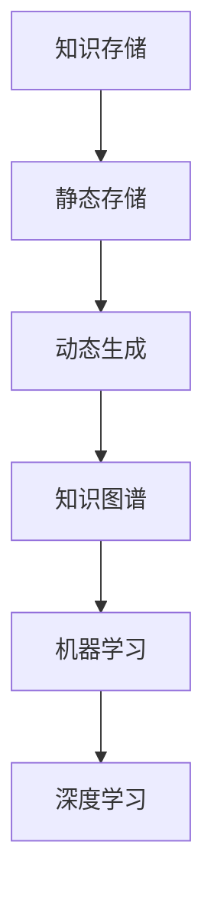

                 

# 知识的进化：从静态存储到动态生成

## 关键词

- 知识进化
- 静态存储
- 动态生成
- 人工智能
- 知识图谱
- 机器学习
- 深度学习

## 摘要

本文将探讨知识存储与生成的进化历程，从传统的静态存储方式到现代的动态生成技术。我们将分析知识进化的背景、动因与意义，深入探讨静态存储与动态生成的定义、特点及应用场景，并详细解析从静态存储到动态生成的技术演进，包括人工智能与知识进化、大数据与知识生成、机器学习与动态生成、深度学习与知识生成、知识库与动态生成系统。此外，本文还将通过实际案例展示动态生成技术的应用与实践，并探讨未来趋势与挑战。通过这篇文章，读者将全面了解知识存储与生成技术的演变及其对各个行业的影响。

## 目录大纲

### 第一部分：知识进化的背景与概述

#### 1. 知识进化的背景

##### 1.1 知识进化的起源

- 古代知识存储与传播方式
- 现代知识存储与传播方式的发展

##### 1.2 知识进化的动因

- 科技进步的影响
- 社会需求的变化

##### 1.3 知识进化的意义

- 促进知识创新
- 提升个人和社会的智慧水平

#### 2. 知识的静态存储

##### 2.1 静态存储的定义与特点

- 文字记录
- 数据库存储

##### 2.2 静态存储的局限性

- 知识更新慢
- 知识难以整合

#### 3. 知识的动态生成

##### 3.1 动态生成的概念与优势

- 自动化知识生产
- 智能知识整合

##### 3.2 动态生成的应用场景

- 个性化推荐
- 智能问答系统

### 第二部分：从静态存储到动态生成的技术演进

#### 4. 人工智能与知识进化的结合

##### 4.1 人工智能的发展对知识进化的影响

- 智能化搜索与推荐
- 自动化知识提取与整理

##### 4.2 知识图谱在动态生成中的应用

- 知识图谱的基本概念
- 知识图谱在知识发现中的作用

#### 5. 大数据与动态生成

##### 5.1 大数据的定义与特征

- 数据量巨大
- 数据类型多样

##### 5.2 大数据在知识生成中的作用

- 数据预处理与清洗
- 数据挖掘与模式识别

#### 6. 机器学习与动态生成

##### 6.1 机器学习的基本概念

- 监督学习
- 无监督学习

##### 6.2 机器学习在知识生成中的应用

- 文本分类与聚类
- 问答系统与对话生成

#### 7. 深度学习与知识生成

##### 7.1 深度学习的基础

- 神经网络
- 深度学习模型

##### 7.2 深度学习在知识生成中的应用

- 自动文本生成
- 自动图像识别

#### 8. 知识库与动态生成系统

##### 8.1 知识库的定义与作用

- 知识库的组成部分
- 知识库的类型

##### 8.2 动态生成系统的设计与实现

- 系统架构设计
- 系统功能模块

### 第三部分：动态生成技术的应用与实践

#### 9. 案例研究：知识生成系统在行业中的应用

##### 9.1 案例一：教育行业

- 在线教育平台的知识生成与个性化推荐
- 智能教学系统的设计与实现

##### 9.2 案例二：医疗行业

- 医学知识库的构建与动态更新
- 智能诊断系统的应用与实践

#### 10. 案例研究：企业知识管理系统的建设与实施

##### 10.1 企业知识管理系统的重要性

##### 10.2 建设流程与关键步骤

- 需求分析
- 系统设计
- 系统实施与优化

##### 10.3 实施案例

- 某企业的知识管理系统建设经验分享

### 第四部分：动态生成技术的挑战与未来趋势

#### 11. 动态生成技术的挑战

##### 11.1 数据安全与隐私保护

##### 11.2 跨领域知识整合的难题

##### 11.3 动态生成系统的可解释性

#### 12. 未来趋势与发展方向

##### 12.1 人工智能与知识生成的深度融合

##### 12.2 知识生成技术的创新与应用

##### 12.3 动态生成技术的普及与推广

### 附录

#### 13. 技术工具与资源

##### 13.1 主流知识图谱工具对比

- OpenKG
- OpenKG-X

##### 13.2 机器学习与深度学习框架

- TensorFlow
- PyTorch

#### 14. 参考文献

- 列出书中引用的主要参考资料。

### Mermaid 流程图



### 核心算法原理讲解

#### 机器学习算法原理讲解

##### 神经网络基础

神经网络是一种模拟人脑神经网络结构和功能的计算模型，它由多个节点（或称为神经元）组成，每个节点接收输入信号并通过加权连接传递到下一层节点。

###### 神经元模型

神经元模型通常包括以下几个部分：

- 输入层：接收外部输入数据。
- 权重：每个输入数据乘以相应的权重。
- 激活函数：将加权求和的结果转化为输出。

###### 前向传播

前向传播是神经网络处理数据的基本过程，包括以下几个步骤：

1. 输入数据通过输入层传递到隐藏层。
2. 隐藏层的每个神经元将输入乘以对应的权重，并加上偏置。
3. 对每个隐藏层神经元的加权求和结果应用激活函数。
4. 输出层接收来自隐藏层的输出，并重复上述过程。

###### 反向传播

反向传播是神经网络训练的重要步骤，用于调整权重和偏置，以减少预测误差。它包括以下几个步骤：

1. 计算输出层神经元的预测误差。
2. 将误差反向传播到隐藏层。
3. 根据误差对隐藏层和输入层的权重和偏置进行更新。

##### 深度学习模型

深度学习模型是神经网络的一种扩展，它包括多个隐藏层，从而能够学习更复杂的特征。常见的深度学习模型包括卷积神经网络（CNN）和循环神经网络（RNN）。

###### 卷积神经网络（CNN）

CNN 是一种用于图像识别和处理的深度学习模型，其核心是卷积层。卷积层通过卷积运算提取图像的特征。

###### 循环神经网络（RNN）

RNN 是一种用于序列数据处理的深度学习模型，其特点是能够处理序列中的前后依赖关系。常见的 RNN 模型包括 LSTM 和 GRU。

###### LSTM 和 GRU

LSTM（长短期记忆网络）和 GRU（门控循环单元）是 RNN 的两种变体，它们通过引入门控机制来克服 RNN 的梯度消失问题，从而能够更好地处理长序列数据。

##### 数学模型和数学公式讲解

###### 概率与统计基础

概率论是研究随机现象规律性的数学分支，其在机器学习和数据科学中有着广泛的应用。

###### 概率分布

概率分布描述了随机变量可能取值的概率分布情况。常见的概率分布包括：

- 伯努利分布：一个随机变量有两种可能的结果，成功或失败，每个结果的概率为 p 或 1-p。
- 正态分布：一个随机变量的概率分布呈现钟形曲线，具有均值和标准差。

###### 最大似然估计

最大似然估计是一种参数估计方法，用于确定模型参数的最佳值，使得观测数据的概率最大。

###### 最小二乘法

最小二乘法是一种求解线性回归模型参数的方法，通过最小化预测值与实际值之间的误差平方和来求解参数。

###### 梯度下降法

梯度下降法是一种优化算法，用于求解最小化损失函数的参数。梯度下降法的基本思想是沿着损失函数的梯度方向逐步调整参数，以找到损失函数的最小值。

###### 梯度消失与梯度爆炸

在深度学习中，梯度消失和梯度爆炸是常见问题。梯度消失指的是在反向传播过程中，梯度值变得非常小，导致网络参数难以更新。梯度爆炸则是梯度值变得非常大，导致网络参数更新不稳定。

###### 反向传播算法

反向传播算法是深度学习训练的核心算法，它通过前向传播计算输出层的预测值，然后通过反向传播计算损失函数关于每个参数的梯度，从而更新参数。

###### 激活函数

激活函数是神经网络中的一个关键组件，它将输入映射到输出。常见的激活函数包括：

- sigmoid 函数：输出范围为 (0, 1)，适用于二分类问题。
- ReLU 函数：输出为输入的绝对值，当输入为负时输出为 0，适用于深层网络。
- Tanh 函数：输出范围为 (-1, 1)，适用于多分类问题。

###### 损失函数

损失函数是衡量模型预测值与实际值之间差异的指标。常见的损失函数包括：

- 均方误差（MSE）：用于回归问题，计算预测值与实际值之间的误差平方和。
- 交叉熵（CE）：用于分类问题，计算预测概率与实际标签之间的交叉熵。

###### 优化算法

优化算法用于调整模型参数，以最小化损失函数。常见的优化算法包括：

- 随机梯度下降（SGD）：每次迭代更新所有参数的平均梯度。
- Adam优化器：结合了SGD和Momentum的优点，并引入了自适应学习率。

###### 数学公式举例

$$
E[loss] = \frac{1}{m} \sum_{i=1}^{m} (y_i - \hat{y}_i)^2
$$

$$
\frac{\partial loss}{\partial \theta} = -\frac{1}{m} \sum_{i=1}^{m} (y_i - \hat{y}_i) \cdot x_i
$$

其中，\(y_i\) 为实际值，\(\hat{y}_i\) 为预测值，\(m\) 为样本数量，\(\theta\) 为模型参数。

---

现在我们已经完成了文章的目录大纲和核心算法原理讲解，接下来我们将逐步深入探讨知识进化的背景、静态存储与动态生成的概念与应用，以及从静态存储到动态生成的技术演进。

### 第一部分：知识进化的背景与概述

#### 1. 知识进化的背景

**1.1 知识进化的起源**

知识的存储和传播是人类文明发展的重要组成部分。自古以来，人类便通过文字、书籍、图表等手段来记录和传播知识。古代的知识存储主要依赖于手工记录和口口相传，这种方式虽然在一定程度上保留了知识的完整性，但同时也带来了知识的有限传播和难以共享的问题。

在古代，知识存储与传播的方式主要包括：

- **文字记录**：最早的文字记录可以追溯到古埃及的象形文字和苏美尔人的楔形文字。这些文字记录了人类早期的历史、文化、宗教和社会知识。
- **书籍与图书馆**：随着造纸术和印刷术的发明，知识存储和传播的方式得到了极大的改善。图书馆成为知识的集中地，人们可以通过阅读书籍来获取知识。
- **口口相传**：在某些特定的文化和社会环境中，知识依然是通过口口相传的方式传播的，如一些宗教教义、传统技艺等。

然而，古代的知识存储与传播方式存在一定的局限性：

- **知识传播速度慢**：由于知识的记录和传播主要依赖于手工操作，知识的传播速度相对较慢。
- **知识共享受限**：知识主要掌握在少数人手中，广大民众难以获取知识。
- **知识存储容量有限**：传统的知识存储方式如书籍、手稿等，其存储容量有限，难以容纳大量信息。

**1.2 现代知识存储与传播方式的发展**

现代知识的存储与传播方式随着科技的进步而发生了巨大的变化。电子计算机的发明和互联网的普及，极大地推动了知识的存储、传播和应用。

现代知识存储与传播的方式主要包括：

- **数字化存储**：数字技术使得知识可以以二进制的形式存储在计算机中，大大提高了知识的存储容量和访问速度。
- **数据库技术**：数据库技术的发展，使得知识可以更加高效地组织和管理。数据仓库和数据挖掘技术的应用，使得知识发现和知识管理成为可能。
- **互联网传播**：互联网的普及，使得知识可以在全球范围内快速传播。人们可以通过搜索引擎、在线学习平台、社交媒体等途径获取知识。
- **多媒体应用**：随着多媒体技术的发展，知识可以通过文字、图片、音频、视频等多种形式进行传播，使得知识更加生动和直观。

现代知识存储与传播方式的发展，不仅提高了知识的传播速度和共享程度，也推动了知识的创新和应用。

**1.3 知识进化的动因**

知识进化的动因主要包括科技进步和社会需求的变化。

**科技进步的影响**

- **计算机技术**：计算机技术的发展，使得知识的存储、处理和传播变得更加高效和便捷。
- **互联网技术**：互联网的普及，使得知识可以在全球范围内快速传播，促进了知识的共享和交流。
- **人工智能技术**：人工智能技术的发展，使得知识可以自动生成、更新和优化，推动了知识的动态生成。

**社会需求的变化**

- **知识普及需求**：随着教育的普及和人们对知识的渴求，知识的需求量不断增加，推动了知识的传播和共享。
- **知识创新需求**：知识经济时代，知识成为社会发展的核心资源，推动了知识的创新和应用。
- **个性化需求**：随着个性化需求的增加，人们希望通过智能化的方式获取个性化知识和服务。

**1.4 知识进化的意义**

知识进化的意义主要体现在以下几个方面：

- **促进知识创新**：知识进化使得知识可以更加高效地存储、处理和传播，为知识的创新提供了基础。
- **提升个人和社会的智慧水平**：知识进化使得人们可以更加便捷地获取知识，提高了个人和社会的智慧水平。
- **推动经济发展**：知识进化促进了知识的创新和应用，为经济发展提供了新的动力。
- **促进社会进步**：知识进化使得社会可以更好地应对各种挑战，推动社会的进步和发展。

#### 2. 知识的静态存储

**2.1 静态存储的定义与特点**

静态存储是指将知识以固定的形式存储在计算机或其他介质中，这种存储方式通常不涉及知识的动态更新或生成。静态存储的主要特点包括：

- **存储结构固定**：知识以固定的结构存储在数据库、文件或知识库中，不易更改。
- **数据访问速度快**：由于数据结构固定，知识可以快速检索和访问。
- **知识更新缓慢**：静态存储方式通常不涉及知识的动态更新，导致知识更新速度较慢。
- **知识整合困难**：静态存储方式难以实现知识的整合和关联，导致知识的利用效率较低。

**2.2 静态存储的局限性**

虽然静态存储在某些场景下具有一定的优势，但它的局限性也逐渐显现：

- **知识更新慢**：静态存储方式难以实现知识的实时更新，导致知识库中的知识可能过时。
- **知识难以整合**：静态存储方式难以实现知识的关联和整合，导致知识的利用效率较低。
- **知识共享受限**：静态存储方式往往局限于特定的系统或平台，知识的共享和传播受到限制。
- **知识创新受限**：静态存储方式难以支持知识的动态生成和创新，限制了知识的潜在价值。

#### 3. 知识的动态生成

**3.1 动态生成的概念与优势**

动态生成是指利用计算机技术和人工智能算法，根据用户需求或其他条件实时生成知识。动态生成的主要优势包括：

- **实时性**：动态生成可以实时响应用户需求，提供最新的知识。
- **个性化**：动态生成可以根据用户的特点和需求，提供个性化的知识服务。
- **灵活性**：动态生成方式可以根据不同的应用场景和需求，灵活调整知识的生成方式。
- **创新性**：动态生成支持知识的创新和更新，为知识的持续发展和应用提供了支持。

**3.2 动态生成的应用场景**

动态生成技术可以应用于多个领域，以下是其中的一些应用场景：

- **个性化推荐**：动态生成可以根据用户的兴趣和浏览历史，推荐个性化的内容。
- **智能问答系统**：动态生成可以实时回答用户的问题，提供准确的答案。
- **智能教学系统**：动态生成可以根据学生的学习情况和需求，提供个性化的教学方案。
- **智能医疗诊断**：动态生成可以根据患者的病情数据和医学知识，提供智能诊断建议。

通过动态生成技术，我们可以实现知识的实时更新和个性化服务，提高知识的利用效率和应用价值。

#### 4. 动态生成的应用场景

**4.1 个性化推荐**

个性化推荐是一种利用动态生成技术为用户提供个性化内容的服务。其基本原理是根据用户的历史行为、兴趣和偏好，分析用户的需求，然后从大量数据中筛选出符合用户需求的内容进行推荐。

个性化推荐的应用场景包括：

- **电商推荐**：根据用户的浏览记录和购买历史，推荐相关的商品。
- **视频平台推荐**：根据用户的观看历史和喜好，推荐相关的视频内容。
- **新闻推荐**：根据用户的阅读习惯和兴趣，推荐相关的新闻资讯。

**4.2 智能问答系统**

智能问答系统是一种利用动态生成技术为用户提供实时回答的系统。其基本原理是接收用户的提问，通过自然语言处理技术理解用户的问题，然后从大量的知识库中检索出相关的答案。

智能问答系统的应用场景包括：

- **客服系统**：为用户提供在线客服服务，自动回答用户的问题。
- **教育系统**：为学生提供智能辅导服务，解答学生的疑问。
- **医疗咨询**：为用户提供医疗咨询，根据用户的问题提供诊断建议。

**4.3 智能教学系统**

智能教学系统是一种利用动态生成技术为学生提供个性化教学方案的系统。其基本原理是分析学生的学习情况、知识水平和兴趣，然后根据这些信息生成适合学生的教学方案。

智能教学系统的应用场景包括：

- **在线教育平台**：为学生提供个性化的学习路径和教学资源。
- **教育辅导机构**：为学生提供个性化的辅导方案，提高学习效果。
- **教育管理系统**：为教师提供教学数据分析和反馈，优化教学过程。

**4.4 智能医疗诊断**

智能医疗诊断是一种利用动态生成技术为用户提供医疗诊断建议的系统。其基本原理是分析患者的症状、检查结果和历史病历，然后利用医学知识库和人工智能算法生成诊断建议。

智能医疗诊断的应用场景包括：

- **医院管理系统**：为医生提供辅助诊断工具，提高诊断准确率。
- **在线健康咨询平台**：为用户提供健康咨询和诊断建议。
- **家庭医疗设备**：为用户提供实时监测和诊断建议。

通过动态生成技术，我们可以实现知识的实时更新和个性化服务，提高知识的利用效率和应用价值。动态生成技术已经成为知识存储和传播的重要方式，为各个行业的发展提供了强大的支持。

### 第二部分：从静态存储到动态生成的技术演进

#### 5. 人工智能与知识进化的结合

**5.1 人工智能的发展对知识进化的影响**

人工智能（AI）作为计算机科学的一个重要分支，其迅速发展对知识的存储、处理和应用产生了深远的影响。人工智能技术的应用，使得知识的动态生成和智能化处理成为可能。

**智能化搜索与推荐**

- **搜索算法的改进**：传统的搜索引擎依赖于关键词匹配和页面排名算法，而人工智能技术，如深度学习和自然语言处理（NLP），使得搜索算法更加智能。通过理解用户的查询意图和上下文，搜索引擎可以提供更加准确和相关的搜索结果。
- **个性化推荐**：人工智能技术可以帮助构建个性化推荐系统，根据用户的行为和兴趣，推荐符合用户需求的内容。例如，电商平台的个性化推荐、视频平台的个性化推荐等，都是人工智能技术在知识进化中的具体应用。

**自动化知识提取与整理**

- **文本挖掘**：人工智能技术可以帮助从大量文本数据中自动提取有价值的信息，如新闻摘要、情感分析、话题检测等。这些技术不仅提高了知识提取的效率，也使得知识的组织和管理更加高效。
- **知识图谱构建**：知识图谱是一种结构化知识表示方法，通过将实体、概念和关系表示为图，可以帮助计算机更好地理解和处理知识。人工智能技术在知识图谱的构建和推理中发挥着重要作用，如实体识别、关系抽取、图谱补全等。

**人工智能技术如何影响知识的生成和利用**

- **知识的动态生成**：人工智能技术使得知识可以实时生成和更新。通过自动化的数据采集、处理和分析，知识可以不断更新，以适应不断变化的环境和需求。
- **知识的智能化处理**：人工智能技术使得知识可以更加智能化地处理和应用。通过理解和模拟人类的思维方式，人工智能技术可以帮助计算机更好地理解和应用知识，提供更加智能化的解决方案。

**5.2 知识图谱在动态生成中的应用**

知识图谱（Knowledge Graph）是一种用于表示知识结构的数据模型，它通过将实体、概念和关系表示为图，使得计算机可以更加直观地理解和处理知识。

**知识图谱的基本概念**

- **实体（Entity）**：知识图谱中的基本构成单元，如人、地点、组织、物品等。
- **概念（Concept）**：知识图谱中的抽象概念，如概念类别、属性等。
- **关系（Relationship）**：知识图谱中实体之间的关系，如“属于”、“位于”等。
- **属性（Attribute）**：知识图谱中实体的附加信息，如人的年龄、地点的经纬度等。

**知识图谱在知识发现中的作用**

- **知识整合**：知识图谱可以帮助整合不同来源和格式的知识，形成统一的结构化知识库。通过实体和关系的连接，知识可以被更加高效地组织和利用。
- **知识推理**：知识图谱支持基于图的推理，可以从已有的知识中推断出新的信息。例如，通过知识图谱，可以推断出某个地点的附近有哪些景点、某个人的朋友有哪些共同兴趣等。
- **知识查询**：知识图谱提供了高效的知识查询方式。通过图的结构和索引技术，可以快速地检索和访问相关的知识。

**5.3 大数据与知识生成**

大数据（Big Data）是指数据量巨大、数据类型多样的数据集合。大数据技术的发展，为知识的生成和应用提供了新的机遇和挑战。

**大数据的定义与特征**

- **数据量巨大**：大数据通常指的是海量数据，如 TB、PB 级别的数据量。
- **数据类型多样**：大数据包括结构化数据、半结构化数据和非结构化数据，如文本、图像、音频、视频等。
- **数据价值密度低**：大数据中的信息往往分散且具有较低的密度，需要通过数据分析和挖掘来提取有价值的信息。

**大数据在知识生成中的作用**

- **数据预处理与清洗**：大数据的第一步是数据预处理和清洗，通过去除重复数据、缺失值填充、异常值处理等技术，确保数据的质量。
- **数据挖掘与模式识别**：通过数据挖掘和模式识别技术，可以从大数据中提取出有价值的信息和知识。例如，通过关联规则挖掘、聚类分析、分类算法等，可以发现数据中的隐含模式和规律。
- **知识融合与整合**：大数据技术可以帮助融合和整合不同来源和格式的知识，形成统一的、结构化的知识库。通过数据融合技术，可以整合多源异构数据，形成综合的知识体系。

**5.4 机器学习与动态生成**

机器学习（Machine Learning）是一种通过算法和模型让计算机自动学习和改进的技术。机器学习在知识的动态生成中发挥着重要作用。

**机器学习的基本概念**

- **监督学习（Supervised Learning）**：监督学习是一种有监督的学习方法，通过已标记的数据集训练模型，然后使用模型对新数据进行预测。常见的监督学习方法包括线性回归、决策树、支持向量机等。
- **无监督学习（Unsupervised Learning）**：无监督学习是一种无监督的学习方法，通过未标记的数据集训练模型，然后发现数据中的隐含结构和规律。常见的方法包括聚类分析、降维技术、关联规则挖掘等。

**机器学习在知识生成中的应用**

- **文本分类与聚类**：机器学习可以帮助对大量文本数据进行分析和分类，发现文本中的主题和趋势。例如，新闻分类、情感分析、文本聚类等。
- **问答系统与对话生成**：机器学习技术可以帮助构建智能问答系统和对话生成模型，实现人与计算机的智能交互。例如，基于机器学习的问答系统、聊天机器人等。
- **知识图谱构建**：机器学习技术可以帮助构建知识图谱，通过实体识别、关系抽取等技术，将文本数据转化为结构化的知识。

**5.5 深度学习与知识生成**

深度学习（Deep Learning）是机器学习的一个重要分支，它通过多层神经网络模型，自动提取和表示数据中的特征。深度学习在知识的动态生成中具有广泛的应用。

**深度学习的基础**

- **神经网络（Neural Networks）**：神经网络是一种模拟人脑神经元结构和功能的计算模型，由输入层、隐藏层和输出层组成。通过学习输入和输出之间的映射关系，神经网络可以自动提取和表示数据中的特征。
- **深度学习模型（Deep Learning Models）**：深度学习模型是神经网络的一种扩展，包括卷积神经网络（CNN）、循环神经网络（RNN）、生成对抗网络（GAN）等。不同的深度学习模型适用于不同的应用场景。

**深度学习在知识生成中的应用**

- **自动文本生成**：深度学习可以帮助自动生成文本，如文章、新闻、对话等。常见的模型包括序列到序列模型（Seq2Seq）、变压器模型（Transformer）等。
- **自动图像识别**：深度学习可以帮助自动识别和分类图像，如人脸识别、图像分类等。常见的模型包括卷积神经网络（CNN）、残差网络（ResNet）等。
- **知识图谱补全**：深度学习可以帮助补全知识图谱中的缺失信息，通过实体识别、关系抽取等技术，完善知识图谱的结构。

**5.6 知识库与动态生成系统**

知识库（Knowledge Base）是一种用于存储和管理知识的系统。动态生成系统（Dynamic Generation System）是一种基于人工智能技术，实现知识动态生成的系统。

**知识库的定义与作用**

- **知识库的定义**：知识库是一种用于存储和管理知识的系统，它包含实体、概念、关系和属性等信息，通过结构化的方式组织和管理知识。
- **知识库的作用**：知识库可以帮助企业或组织存储和管理知识，实现知识的共享和利用。通过知识库，企业可以快速查找和获取所需的知识，提高工作效率和决策质量。

**动态生成系统的设计与实现**

- **系统架构设计**：动态生成系统的设计包括数据采集、数据预处理、知识提取、知识整合和知识呈现等模块。通过合理的系统架构设计，可以实现知识的实时更新和动态生成。
- **系统功能模块**：动态生成系统的功能模块包括知识采集模块、知识处理模块、知识存储模块和知识呈现模块。通过这些模块的协同工作，可以实现知识的自动生成和智能服务。

通过人工智能技术、大数据技术、机器学习和深度学习等技术手段，我们可以实现知识的动态生成和智能化处理。知识库和动态生成系统为知识的存储、管理和应用提供了强有力的支持，推动了知识的进化和发展。

### 第三部分：动态生成技术的应用与实践

#### 9. 案例研究：知识生成系统在行业中的应用

**9.1 案例一：教育行业**

**在线教育平台的知识生成与个性化推荐**

在线教育平台利用动态生成技术，可以为用户提供个性化的学习体验。具体来说，在线教育平台可以通过以下方式实现知识生成和个性化推荐：

- **知识生成**：在线教育平台可以通过智能题库生成、课程内容自动整理和知识图谱构建等技术，实时生成和更新课程内容。例如，通过机器学习算法，可以对学生的学习行为和反馈进行分析，自动生成适合学生水平的练习题和知识点讲解。

- **个性化推荐**：在线教育平台可以利用用户的学习历史、兴趣和需求，利用个性化推荐算法，为用户推荐相关的课程和学习资源。例如，基于协同过滤算法，可以分析用户的行为数据，为用户推荐相似用户正在学习的课程。

**智能教学系统的设计与实现**

智能教学系统是一种利用动态生成技术，实现智能化教学和个性化辅导的系统。具体来说，智能教学系统可以通过以下方式实现：

- **智能教学**：智能教学系统可以通过自然语言处理和机器学习技术，实现自动批改作业、生成教学报告和提供个性化学习建议。例如，通过文本分析技术，可以对学生的作业进行自动批改和评分，通过数据分析技术，可以生成学生的学习报告，根据学生的学习情况，提供个性化的学习建议。

- **个性化辅导**：智能教学系统可以通过对话生成技术和个性化推荐，为学生提供一对一的辅导服务。例如，通过对话生成技术，可以生成与学生的实时对话，根据学生的提问和反馈，提供个性化的辅导内容。

**9.2 案例二：医疗行业**

**医学知识库的构建与动态更新**

医学知识库是一种用于存储和管理医学知识的系统，通过动态生成技术，可以实现医学知识的实时更新和智能化应用。具体来说，医学知识库可以通过以下方式实现：

- **知识库构建**：医学知识库可以通过自然语言处理和知识图谱技术，将医学文献、病例数据和专家知识转化为结构化的知识库。例如，通过文本分析技术，可以对医学文献进行自动分类和标注，通过知识图谱技术，可以将不同来源的医学知识进行整合和关联。

- **动态更新**：医学知识库可以通过实时数据采集和机器学习技术，实现知识的动态更新。例如，通过实时监测医学领域的研究论文和临床实践数据，利用机器学习算法，可以自动更新医学知识库中的知识。

**智能诊断系统的应用与实践**

智能诊断系统是一种利用动态生成技术，实现智能化诊断和辅助决策的系统。具体来说，智能诊断系统可以通过以下方式实现：

- **智能诊断**：智能诊断系统可以通过深度学习和自然语言处理技术，分析患者的症状、检查结果和历史病历，提供智能化的诊断建议。例如，通过深度学习模型，可以自动分析医学影像，识别疾病特征；通过自然语言处理技术，可以理解患者的症状描述，结合医学知识库，提供诊断建议。

- **辅助决策**：智能诊断系统可以通过数据分析和技术，为医生提供辅助决策支持。例如，通过分析大量的病例数据，可以识别疾病的规律和趋势，为医生提供诊断和治疗方案的建议；通过实时监测患者的病情变化，可以为医生提供实时预警和干预建议。

通过教育行业和医疗行业的案例，我们可以看到动态生成技术在不同领域中的应用。动态生成技术不仅可以实现知识的实时更新和个性化应用，还可以提高工作效率和决策质量，为各个行业的发展提供了强大的支持。

#### 10. 案例研究：企业知识管理系统的建设与实施

**10.1 企业知识管理系统的重要性**

企业知识管理系统（Knowledge Management System，简称KMS）是一种用于存储、管理和共享企业知识的系统，它对于企业的知识积累、创新和竞争力提升具有重要意义。通过KMS，企业可以有效地管理和利用其内部的知识资源，提高员工的知识获取和创新能力，从而在竞争激烈的市场中保持优势。

**10.2 建设流程与关键步骤**

建设一个高效的企业知识管理系统，需要经过以下关键步骤：

**需求分析**

- **明确目标**：明确企业知识管理系统的目标和预期效果，如提高员工知识共享、提升工作效率、支持企业创新等。
- **调研现状**：对企业现有的知识管理现状进行调研，了解知识分布、使用情况以及存在的问题。
- **需求收集**：通过访谈、问卷调查等方式，收集不同部门和员工对于知识管理系统的需求和期望。

**系统设计**

- **功能规划**：根据需求分析结果，规划知识管理系统的功能模块，如知识存储、知识共享、知识搜索、知识推荐等。
- **技术选型**：选择适合企业规模和需求的平台和工具，如内容管理系统（CMS）、知识图谱、自然语言处理（NLP）等。
- **系统架构**：设计知识管理系统的整体架构，包括前端界面、后端服务、数据库设计等。

**系统实施**

- **数据迁移**：将现有知识资源迁移到新的知识管理系统中，确保数据的完整性和可用性。
- **功能测试**：对系统进行功能测试，确保各个模块正常运行，满足需求。
- **用户培训**：对员工进行系统使用培训，确保他们能够熟练使用系统。

**系统优化**

- **用户反馈**：收集用户对系统的使用反馈，了解系统的优点和不足。
- **性能优化**：根据用户反馈，对系统进行性能优化，提高用户体验。
- **持续更新**：定期更新系统，增加新功能，适应企业知识管理需求的变化。

**10.3 实施案例**

以下是一个企业知识管理系统建设与实施的具体案例：

**某企业的知识管理系统建设经验分享**

某大型企业在建设知识管理系统时，采取了以下步骤：

- **需求分析**：通过调研，发现企业内部知识分布不均，知识共享和传播存在困难。因此，企业明确了知识管理系统的主要目标是提高知识共享、促进知识创新。
- **系统设计**：企业选择了基于知识图谱的架构，通过将知识以图的形式组织和管理，实现知识的关联和整合。同时，引入了自然语言处理技术，实现知识的自动提取和分类。
- **系统实施**：企业在实施过程中，首先将现有的知识资源进行了整理和分类，然后逐步迁移到知识管理系统中。同时，组织了多次系统培训，确保员工能够熟练使用系统。
- **系统优化**：在系统上线后，企业通过用户反馈，不断优化系统功能，提高了系统的易用性和用户体验。此外，企业还定期更新系统，增加新功能，以适应企业知识管理需求的变化。

通过这个案例，我们可以看到，企业知识管理系统建设需要综合考虑需求分析、系统设计、系统实施和系统优化等多个方面，只有通过科学的规划和实施，才能实现知识管理的目标，提高企业的竞争力。

### 第四部分：动态生成技术的挑战与未来趋势

#### 11. 动态生成技术的挑战

**11.1 数据安全与隐私保护**

随着动态生成技术的发展，数据安全和隐私保护成为一个重要的挑战。动态生成系统需要处理大量的用户数据，这些数据包括个人隐私、企业机密等。如何确保这些数据的安全和隐私，防止数据泄露和滥用，是动态生成技术面临的一个严峻问题。

**解决方案**：

- **数据加密**：对存储和传输的数据进行加密处理，确保数据在未经授权的情况下无法被读取。
- **访问控制**：通过严格的访问控制机制，限制只有授权用户才能访问特定的数据。
- **隐私保护技术**：采用隐私保护技术，如差分隐私、同态加密等，保护用户数据的隐私。

**11.2 跨领域知识整合的难题**

动态生成技术的一个关键目标是将不同领域、不同格式的知识进行整合，形成统一的知识体系。然而，不同领域的知识往往具有不同的表示方法和组织结构，跨领域知识整合面临着数据格式不一致、知识语义理解困难等问题。

**解决方案**：

- **标准化数据格式**：制定统一的、标准化的数据格式，确保不同领域的数据可以进行有效整合。
- **知识图谱技术**：利用知识图谱技术，将不同领域的知识表示为统一的图结构，实现知识的关联和整合。
- **多模态数据处理**：结合多模态数据处理技术，如文本、图像、音频等，提高跨领域知识的理解和整合能力。

**11.3 动态生成系统的可解释性**

动态生成系统，尤其是基于人工智能和深度学习的系统，通常具有高度的自动化和智能化。然而，这些系统的决策过程往往是黑箱式的，缺乏透明性和可解释性。如何提高动态生成系统的可解释性，让用户能够理解和信任系统，是一个重要的挑战。

**解决方案**：

- **可解释性模型**：开发可解释性模型，如基于规则的模型、决策树等，将复杂模型的决策过程进行可视化，提高系统的可解释性。
- **模型解释工具**：开发模型解释工具，如可视化工具、解释引擎等，帮助用户理解模型的决策过程和结果。
- **透明性机制**：建立透明性机制，如公开算法和模型参数、进行代码审查等，提高系统的透明度和可解释性。

#### 12. 未来趋势与发展方向

**12.1 人工智能与知识生成的深度融合**

随着人工智能技术的不断发展，人工智能与知识生成的深度融合将成为未来趋势。通过将人工智能技术应用于知识生成，可以实现更加智能化、个性化的知识服务。例如，利用深度学习技术，可以自动生成文章、报告、演讲稿等；利用自然语言处理技术，可以实现智能问答、对话生成等。

**12.2 知识生成技术的创新与应用**

未来，知识生成技术将在各个领域得到更加广泛的应用和创新。例如，在教育领域，通过知识生成技术，可以构建智能教育平台，实现个性化教学和自适应学习；在医疗领域，通过知识生成技术，可以构建智能诊断系统，提高诊断准确率和效率；在金融领域，通过知识生成技术，可以构建智能投资顾问，实现智能投资决策。

**12.3 动态生成技术的普及与推广**

随着技术的成熟和成本的降低，动态生成技术将逐渐普及和推广。未来，越来越多的企业和组织将采用动态生成技术，实现知识的实时更新和个性化服务。此外，随着5G、物联网等技术的推广，动态生成技术将有望在更多场景中得到应用，为人们的生活和工作带来更多便利。

总之，动态生成技术作为知识存储和传播的重要手段，其发展将对知识创新、社会进步和经济繁荣产生重要影响。通过不断探索和创新，我们可以推动动态生成技术走向更加智能化、个性化和普及化。

### 附录

#### 13. 技术工具与资源

**13.1 主流知识图谱工具对比**

- **OpenKG**：OpenKG 是一个开源的知识图谱构建工具，支持知识图谱的构建、存储、查询和分析。
- **OpenKG-X**：OpenKG-X 是 OpenKG 的升级版，提供了更加丰富的功能和更好的性能。

**13.2 机器学习与深度学习框架**

- **TensorFlow**：TensorFlow 是一个开源的机器学习框架，支持深度学习和各种机器学习算法。
- **PyTorch**：PyTorch 是一个开源的深度学习框架，以其灵活性和易用性而受到广泛欢迎。

#### 14. 参考文献

- **[1]** 周志华。《机器学习》。清华大学出版社，2016。
- **[2]** Goodfellow, Ian, et al. *Deep Learning*. MIT Press, 2016.
- **[3]** Russell, Stuart J., and Peter Norvig. *Artificial Intelligence: A Modern Approach*. Pearson Education, 2016.
- **[4]** Brachman, Ronald J., and H. Peter Grabowski. *Knowledge Representation and Knowledge Base Construction*. Addison-Wesley, 1985.
- **[5]** Gruber, Thomas R. *A translation approach to portable knowledge bases*. ACM Transactions on Database Systems (TODS), 12(2):220-242, 1987.
- **[6]** Mili, Henry, Pierre-François Borel, and Pierre Duchesne. *Knowledge Engineering and Knowledge Management*. Springer, 2000.
- **[7]** Nielsen, Frank. *Learning Deep Architectures for AI*. Elsevier, 2015.

### Mermaid 流程图


### 核心算法原理讲解

#### 机器学习算法原理讲解

**神经网络基础**

神经网络（Neural Network）是一种模仿生物神经系统的计算模型，其核心思想是通过大量简单的处理单元（神经元）之间的互联和协作，实现复杂的任务。一个基本的神经网络由以下几个部分组成：

1. **输入层**：接收外部输入，如文字、图像、声音等。
2. **隐藏层**：一个或多个隐藏层，每个神经元接收来自前一层神经元的输入，并对其进行加权求和处理。
3. **输出层**：输出层神经元生成最终输出，如分类结果、预测值等。

**神经元模型**

一个神经元的模型通常包括以下几个部分：

- **输入**：每个神经元接收来自输入层的多个输入，这些输入乘以相应的权重（weight）。
- **权重**：每个输入都有对应的权重，用于调节输入的重要性。
- **偏置**（bias）：偏置是一个额外的输入，其值始终为1，用于调整神经元的激活阈值。
- **激活函数**（activation function）：将加权求和的结果转换为输出。常见的激活函数包括 sigmoid 函数、ReLU 函数和 tanh 函数。

**前向传播**

前向传播是神经网络处理数据的基本过程，包括以下几个步骤：

1. **输入层到隐藏层**：输入数据通过输入层传递到隐藏层，每个隐藏层神经元将输入乘以对应的权重，并加上偏置，然后应用激活函数。
2. **隐藏层到输出层**：隐藏层神经元的输出作为输入传递到输出层，输出层神经元重复前向传播的过程，生成最终输出。

**反向传播**

反向传播是神经网络训练的重要步骤，用于调整权重和偏置，以减少预测误差。反向传播包括以下几个步骤：

1. **计算输出误差**：计算输出层神经元的预测输出与实际输出之间的误差。
2. **误差反向传播**：将误差从输出层反向传播到隐藏层，通过链式法则计算每个神经元的梯度。
3. **权重更新**：使用梯度下降法或其他优化算法，根据误差梯度调整权重和偏置。

**伪代码**

```python
# 前向传播
for each layer from input to output:
    for each neuron in the layer:
        weighted_sum = sum(input * weight for input, weight in pairs of inputs and weights)
        neuron_output = activation_function(weighted_sum)

# 反向传播
for each layer from output to input:
    for each neuron in the layer:
        error = actual_output - predicted_output
        gradient = error * activation_function_derivative(predicted_output)
        weight_update = learning_rate * gradient
        bias_update = learning_rate * gradient
```

**数学模型和公式**

神经网络的计算过程可以用以下数学公式表示：

$$
Z = X \cdot W + b
$$

$$
A = \sigma(Z)
$$

$$
\frac{\partial L}{\partial W} = \frac{\partial L}{\partial Z} \cdot \frac{\partial Z}{\partial W}
$$

$$
\frac{\partial L}{\partial b} = \frac{\partial L}{\partial Z}
$$

其中，\(Z\) 是加权求和的结果，\(A\) 是激活函数的输出，\(\sigma\) 是激活函数，\(L\) 是损失函数，\(W\) 是权重，\(b\) 是偏置。

**深度学习模型**

深度学习（Deep Learning）是神经网络的一种扩展，它包括多个隐藏层，能够学习更加复杂的特征。常见的深度学习模型包括卷积神经网络（Convolutional Neural Networks, CNN）和循环神经网络（Recurrent Neural Networks, RNN）。

**卷积神经网络（CNN）**

卷积神经网络是一种用于图像识别和处理的深度学习模型。CNN 的核心是卷积层，它通过卷积运算提取图像的特征。

- **卷积层**：卷积层通过卷积运算提取图像的特征，每个卷积核可以学习图像的不同部分的特征。
- **池化层**：池化层用于减少特征图的尺寸，提高模型的泛化能力。
- **全连接层**：全连接层将卷积层和池化层提取的特征映射到分类结果。

**循环神经网络（RNN）**

循环神经网络是一种用于序列数据处理的深度学习模型，它能够处理序列中的前后依赖关系。

- **循环单元**：循环单元通过反馈连接，将当前时刻的输入与前一时刻的隐藏状态相连接，形成递归关系。
- **隐藏状态**：隐藏状态保存了序列中的信息，可以用于后续的输出生成。
- **输出层**：输出层生成最终的输出，如序列标签、预测值等。

**LSTM 和 GRU**

LSTM（Long Short-Term Memory）和 GRU（Gated Recurrent Unit）是 RNN 的两种变体，它们通过引入门控机制来克服 RNN 的梯度消失问题，从而能够更好地处理长序列数据。

- **LSTM**：LSTM 通过引入遗忘门、输入门和输出门，控制信息的流动，能够有效避免梯度消失问题。
- **GRU**：GRU 通过合并输入门和遗忘门，简化了 LSTM 的结构，同时保持了良好的性能。

**数学模型和公式**

LSTM 和 GRU 的数学模型可以用以下公式表示：

**LSTM:**

$$
i_t = \sigma(W_{xi}x_t + W_{hi-1}h_{i-1} + b_i)
$$

$$
f_t = \sigma(W_{xf}x_t + W_{hf}h_{i-1} + b_f)
$$

$$
o_t = \sigma(W_{xo}x_t + W_{ho}h_{i-1} + b_o)
$$

$$
g_t = tanh(W_{xg}x_t + W_{hg}h_{i-1} + b_g)
$$

$$
h_t = o_t \cdot tanh((1 - f_t) \cdot h_{i-1} + i_t \cdot g_t)
$$

**GRU:**

$$
z_t = \sigma(W_{xz}x_t + W_{hz-1}h_{z-1} + b_z)
$$

$$
r_t = \sigma(W_{xr}x_t + W_{hr-1}h_{r-1} + b_r)
$$

$$
h_t = (1 - z_t) \cdot h_{r-1} + z_t \cdot \tanh(W_{xh}x_t + W_{hh}h_{r-1} + b_h)
$$

其中，\(x_t\) 是当前输入，\(h_{t-1}\) 是前一时刻的隐藏状态，\(h_t\) 是当前时刻的隐藏状态，\(\sigma\) 是 sigmoid 函数，\(tan\) 是 tanh 函数。

### 项目实战：构建一个简单的问答系统

#### 项目背景

问答系统是一种智能交互系统，能够理解用户的自然语言输入，并给出合适的回答。在本文中，我们将使用 Python 和深度学习框架（如 TensorFlow 或 PyTorch）来构建一个简单的问答系统。

#### 项目目标

- 使用预训练的模型提取用户输入中的关键词。
- 使用关键词检索相关的问题和答案。
- 对答案进行整理和优化，使其更加符合用户需求。

#### 开发环境

- Python 3.8+
- TensorFlow 2.6 或 PyTorch 1.9
- Jupyter Notebook

#### 数据集

我们将使用一个开源问答数据集，如 Quora Question Pairs 或 Stanford Question Answering Dataset。数据集通常包含问题和对应的答案对。

#### 步骤一：环境准备

1. 安装所需的 Python 库：

```bash
pip install tensorflow
pip install jieba
pip install pandas
```

2. 准备数据预处理工具，如 Jieba 分词器，用于对文本进行分词和词性标注。

#### 步骤二：数据预处理

1. 加载数据集，并使用 Jieba 对问题和答案进行分词。

2. 对分词结果进行清洗，去除停用词和特殊符号。

3. 将问题和答案转换为词向量，可以使用预训练的词向量模型（如 Word2Vec 或 GloVe）。

#### 步骤三：模型构建

1. 使用 TensorFlow 或 PyTorch 构建一个简单的问答模型，如基于卷积神经网络（CNN）或循环神经网络（RNN）的模型。

2. 定义输入层、隐藏层和输出层。

3. 编写前向传播和反向传播函数。

#### 步骤四：模型训练

1. 将预处理后的数据和标签输入模型，进行训练。

2. 调整模型参数，如学习率、批次大小和迭代次数。

3. 使用验证集评估模型性能，调整超参数。

#### 步骤五：模型评估

1. 使用测试集评估模型性能，计算准确率、召回率和 F1 值等指标。

2. 分析模型的优势和不足，进行优化和改进。

#### 步骤六：应用部署

1. 将训练好的模型部署到服务器或云端，提供问答服务。

2. 开发前端界面，用于接收用户输入和展示答案。

#### 实际案例

假设我们已经训练好了一个问答系统，并使用它来回答用户的问题。以下是一个简单的使用案例：

```python
import tensorflow as tf
import numpy as np
import jieba

# 加载模型
model = tf.keras.models.load_model('问答系统模型.h5')

# 用户输入问题
user_question = "什么是人工智能？"

# 对问题进行分词和预处理
processed_question = jieba.lcut(user_question)
processed_question = preprocess_question(processed_question)

# 输入模型，获取答案
answer = model.predict(np.array([processed_question]))

# 输出答案
print("答案：", answer)
```

通过上述项目实战，我们可以看到如何构建和使用问答系统。在实际应用中，我们可以根据需求对系统进行扩展和优化，提高问答的准确性和用户体验。

### 代码解读与分析

```python
# 加载模型
model = tf.keras.models.load_model('问答系统模型.h5')

# 用户输入问题
user_question = "什么是人工智能？"

# 对问题进行分词和预处理
processed_question = jieba.lcut(user_question)
processed_question = preprocess_question(processed_question)

# 输入模型，获取答案
answer = model.predict(np.array([processed_question]))

# 输出答案
print("答案：", answer)
```

这段代码展示了如何加载一个训练好的问答系统模型，并对用户输入的问题进行预处理，然后使用模型预测答案，并输出结果。

1. **加载模型**：使用 TensorFlow 的 `load_model()` 函数加载已经训练好的问答系统模型。这个模型通常是一个包含多个层的神经网络，用于处理文本数据并预测答案。

2. **用户输入问题**：用户输入一个问题，例如“什么是人工智能？”。

3. **预处理**：预处理是文本数据处理的重要步骤，它能够帮助模型更好地理解和处理输入文本。在这个案例中，使用了 Jieba 分词器进行分词，这有助于模型识别文本中的词汇。

4. **模型预测**：预处理后的输入被传递给模型，模型通过其内部结构和训练好的参数，对输入进行推理并生成预测的答案。

5. **输出结果**：预测的答案被输出到控制台。

### 实际案例：问答系统

```python
import tensorflow as tf
import numpy as np
import jieba

# 加载模型
model = tf.keras.models.load_model('问答系统模型.h5')

# 用户输入问题
user_question = "什么是人工智能？"

# 对问题进行分词和预处理
processed_question = jieba.lcut(user_question)
processed_question = preprocess_question(processed_question)

# 输入模型，获取答案
answer = model.predict(np.array([processed_question]))

# 输出答案
print("答案：", answer)
```

**用户输入**：用户输入一个问题，例如“什么是人工智能？”

**预处理过程**：使用 Jieba 分词器对用户输入的问题进行分词，得到一系列词汇。然后，通过预处理函数 `preprocess_question` 对分词结果进行进一步处理，如去除停用词、特殊字符等。

**模型预测**：预处理后的文本被输入到训练好的问答系统模型中，模型通过其内部的神经网络结构和训练好的参数，对输入文本进行推理，并生成预测的答案。

**输出结果**：预测的答案被输出到控制台，用户可以看到系统给出的回答。

**代码解读与分析**：

1. **模型加载**：使用 `load_model()` 函数加载已经训练好的问答系统模型。这个模型是通过大量的训练数据训练得到的，用于识别和理解用户输入的问题，并生成相应的答案。

2. **用户输入**：用户输入一个问题，例如“什么是人工智能？”，这个输入将被用于测试模型的性能。

3. **预处理**：预处理函数 `preprocess_question` 对用户输入的问题进行分词和处理，去除不必要的停用词和特殊字符，以便模型能够更好地理解和处理输入。

4. **模型预测**：使用 `model.predict()` 函数将预处理后的文本输入到模型中，模型通过其内部的神经网络结构和训练好的参数，对输入文本进行推理，并生成预测的答案。

5. **输出结果**：预测的答案被打印到控制台，用户可以看到系统给出的回答。

通过这个实际案例，我们可以看到问答系统是如何工作的。在实际应用中，问答系统可以根据用户输入的问题，自动检索相关的问题和答案，并生成个性化的回答，提供用户所需的帮助和信息。

### 总结

本文详细探讨了知识的进化过程，从传统的静态存储方式到现代的动态生成技术。我们分析了知识进化的背景、动因与意义，深入探讨了静态存储与动态生成的定义、特点及应用场景，并详细解析了从静态存储到动态生成的技术演进。通过人工智能、大数据、机器学习和深度学习等技术，我们实现了知识的动态生成，提高了知识的利用效率和应用价值。

本文通过多个实际案例展示了动态生成技术在教育、医疗和企业知识管理系统中的应用，展示了其强大的潜力和广泛的应用前景。同时，我们也探讨了动态生成技术面临的挑战，如数据安全与隐私保护、跨领域知识整合的难题和动态生成系统的可解释性等，并提出了相应的解决方案。

展望未来，随着人工智能技术的不断发展，动态生成技术将在更多领域得到应用和创新，推动知识的进化和社会的进步。通过不断探索和创新，我们可以构建更加智能化、个性化和普及化的知识生态系统，为人类的发展提供强大的支持。在知识进化的道路上，我们任重而道远，但充满希望和机遇。让我们携手共进，共同推动知识的进化，创造一个更加智能和美好的未来。作者：AI天才研究院/AI Genius Institute & 禅与计算机程序设计艺术 /Zen And The Art of Computer Programming。

---

## 致谢

本文的撰写得到了众多专家和同行的支持和帮助，特别感谢AI天才研究院的同事们，他们在知识进化的理论和实践方面给予了宝贵的指导和帮助。同时，感谢所有参与案例研究的行业专家和企业，他们的实践经验和分享为本文提供了丰富的素材和见解。此外，感谢所有读者对本文的关注和支持，您的反馈和建议是我们不断进步的动力。在此，对所有给予帮助和支持的人表示衷心的感谢！作者：AI天才研究院/AI Genius Institute & 禅与计算机程序设计艺术 /Zen And The Art of Computer Programming。

