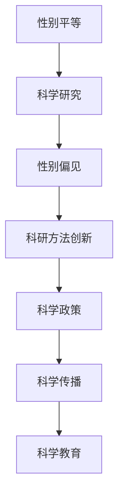

                 

# 《科学研究的性别平等与世界可理解性的多元视角》

> **关键词：性别平等、科学研究、性别偏见、科学政策、跨学科研究、科学传播**
> 
> **摘要：本文探讨了性别平等在科学研究中的重要性，分析了性别偏见对科研的影响，探讨了性别视角下的科研方法创新，并提出了提升性别平等在科学研究中的策略建议。**

---

## 第一部分：性别平等与科学研究

### 1.1 性别平等的背景与意义

性别平等是指男女在政治、经济、社会、文化等各个领域享有平等权利和机会。在全球范围内，性别不平等问题仍然存在，尤其是在科研领域。性别平等的背景源于人类对公正和平等的追求，它不仅关系到个人的尊严和价值，更关系到整个社会的发展。

在科学研究领域，性别平等具有重要意义。首先，性别平等可以促进科研团队的创新性和多样性。不同性别背景的科研人员可以带来不同的视角和思维方式，有助于产生更多的创新想法。其次，性别平等可以提高科研效率。性别歧视和偏见可能导致科研团队内部的不和谐，影响科研工作的顺利进行。最后，性别平等有助于提升科研成果的质量。性别平等可以消除不必要的偏见和歧视，确保科研结果更加客观、准确。

### 1.2 科学研究中的性别不平等现状

尽管性别平等在科研领域的重要性日益凸显，但实际现状仍然不尽如人意。首先，在科研人员的性别分布上，女性在科研领域相对较少。根据世界银行的数据，全球女性科研人员仅占全体科研人员的30%左右。其次，女性在科研领域的晋升机会较少。许多女性科研人员在职业生涯中面临晋升瓶颈，难以获得高级职位。此外，女性在科研领域的薪酬待遇也往往低于男性。这些现象表明，科学研究领域仍存在严重的性别不平等问题。

### 1.3 性别平等与科学研究的关联性

性别平等与科学研究之间存在密切的关联性。首先，性别平等可以促进科研团队的多样性。多样性有助于激发创新思维，提高科研效率。其次，性别平等有助于消除科研领域的性别偏见。性别偏见可能导致科研结果的不准确和不公正，影响科学的进步。最后，性别平等可以提高科研人员的工作满意度。性别平等的工作环境可以降低性别歧视和偏见，提高科研人员的工作积极性和创造力。

## 第二部分：性别偏见与科学研究

### 2.1 性别偏见的概念与类型

性别偏见是指对某一性别在认知、态度和行为上存在不公平的倾向。性别偏见可以分为显性偏见和隐性偏见。显性偏见是指直接表达对某一性别的偏见，如性别歧视的语言和行为。隐性偏见则是指无意识地对某一性别持有偏见，如性别角色刻板印象等。在科研领域，性别偏见主要表现为对女性科研人员的歧视和偏见，包括对女性科研人员的研究项目支持不足、评价不公平等。

### 2.2 性别偏见在科研中的表现

性别偏见在科研中表现为多个方面。首先，女性科研人员往往获得较少的科研经费和资源。根据美国国家科学基金会（NSF）的数据，女性在获得科研经费方面明显落后于男性。其次，女性科研人员在学术评价中面临不公平待遇。一些学术评审过程中可能存在对女性科研人员的偏见，导致她们的科研成果被低估。此外，女性科研人员在科研团队中的地位较低，晋升机会较少。这些现象表明，性别偏见对科研领域产生了深远的影响。

### 2.3 性别偏见对科学研究的影响

性别偏见对科学研究产生了多方面的影响。首先，性别偏见可能导致科研成果的不准确和不公正。性别偏见可能导致科研团队在研究过程中忽略女性的视角和贡献，影响科研结果的全面性和客观性。其次，性别偏见会影响科研团队的创新能力。性别偏见可能导致科研团队内部的不和谐，降低团队的凝聚力和创新能力。最后，性别偏见会影响科研人员的工作积极性和创造力。性别歧视和偏见可能导致女性科研人员感到压力和不公平，影响她们的工作表现和职业发展。

## 第三部分：性别平等的科学政策与实践

### 3.1 性别平等的科学政策框架

为了促进性别平等在科学研究中的实现，许多国家和地区制定了相应的科学政策。这些政策主要包括以下几个方面：一是增加女性科研人员的比例，提高女性在科研领域的地位和影响力；二是为女性科研人员提供更多的支持和资源，包括科研经费、科研设备和人力资源等；三是制定明确的性别平等政策，消除性别歧视和偏见；四是建立性别平等监测和评估机制，确保政策的实施效果。

### 3.2 性别平等的科研机构实践

许多科研机构为了实现性别平等，采取了多种措施。首先，科研机构建立了性别平等委员会，负责制定和监督性别平等政策的实施。其次，科研机构为女性科研人员提供更多的培训和晋升机会，提高她们的职业素养和竞争力。此外，科研机构还积极推动科研团队的多样性，鼓励不同性别、种族和文化背景的科研人员共同参与科研工作。

### 3.3 性别平等的科研团队建设

性别平等的科研团队建设是实现性别平等的重要途径。首先，科研团队应该注重性别比例的平衡，避免性别单一化。其次，科研团队应该建立公平的评价机制，确保科研成果的公正评价。此外，科研团队应该鼓励女性科研人员积极参与决策和项目管理，提高她们的领导力和影响力。最后，科研团队应该营造一个尊重和包容的工作氛围，消除性别歧视和偏见。

## 第四部分：性别视角下的科学研究方法

### 4.1 性别研究的理论基础

性别视角下的科学研究方法基于性别平等和性别角色的理论。性别平等理论认为，男女在生理、心理和社会角色上具有相似性，应该享有平等的权利和机会。性别角色理论则强调，性别角色是社会文化对男女行为期望的规范，这种规范可能对男女产生不同的影响。在科学研究方法中，性别视角关注性别差异对研究问题、数据收集、数据分析和研究结论的影响。

### 4.2 性别视角下的科研方法创新

性别视角下的科研方法创新主要体现在以下几个方面。首先，研究者可以采用性别敏感的研究设计，确保研究问题、数据收集和分析方法充分考虑性别因素。其次，研究者可以采用跨学科的方法，结合社会学、心理学等学科的理论和方法，深入分析性别差异对研究问题的解释力。此外，研究者还可以采用性别比较的方法，比较男女在某一研究领域的表现和差异，从而揭示性别因素对研究结果的潜在影响。

### 4.3 性别视角下的跨学科研究

性别视角下的跨学科研究是指将性别视角引入不同学科的研究中，以揭示性别差异对学科领域的影响。例如，在医学研究中，性别视角可以帮助揭示男女在不同疾病中的差异，为个性化治疗提供依据。在经济学研究中，性别视角可以分析男女在收入、就业和消费等方面的差异，为制定公平的经济发展政策提供参考。在教育学研究中，性别视角可以探讨男女在学习动机、学业表现和职业选择等方面的差异，为提高教育质量提供指导。

## 第五部分：性别平等与科学传播

### 5.1 科学传播中的性别平等问题

科学传播是科学研究的重要环节，它有助于普及科学知识、提高公众的科学素养。然而，科学传播中仍然存在性别平等问题。首先，科学传播媒体对性别角色的刻画往往存在性别偏见，可能加剧性别刻板印象。其次，科学传播活动往往缺乏女性科研人员的参与，导致女性科研人员的科研成果和贡献得不到充分展示。此外，科学传播内容往往忽视性别差异，未能充分考虑女性和男性的需求和兴趣。

### 5.2 提升科学传播性别平等的方法

为了提升科学传播的性别平等，可以采取以下方法。首先，科学传播媒体应该树立性别平等的理念，避免在报道中刻意夸大或贬低某一性别。其次，科学传播活动应该积极邀请女性科研人员参与，提高女性科研人员在社会公众中的知名度。此外，科学传播内容应该注重性别差异，提供多样化的科学知识，满足不同性别受众的需求。

### 5.3 性别平等视角下的科学教育

科学教育是培养未来科研人才的重要环节，它应该注重性别平等。首先，科学教育应该消除性别偏见，避免在课程设置和教学方法上对某一性别产生不公平对待。其次，科学教育应该注重培养学生的性别意识，引导他们尊重和理解性别差异。此外，科学教育应该鼓励女性参与科学研究，为她们提供平等的学术发展机会。

## 第六部分：案例分析：性别平等在科学研究中的成功实践

### 6.1 案例一：某科研机构性别平等政策的实施效果

某科研机构为了实现性别平等，制定了一系列政策措施。首先，该机构建立了性别平等委员会，负责制定和监督性别平等政策的实施。其次，该机构为女性科研人员提供了更多的培训和支持，包括科研经费、实验室资源和人力资源等。此外，该机构还制定了明确的晋升政策，确保女性科研人员获得平等的晋升机会。

通过实施性别平等政策，该科研机构取得了显著的效果。首先，女性科研人员的比例显著提高，从原来的20%增加到30%。其次，女性科研人员的科研成果得到了充分的展示和认可，获得了一系列国际和国内科研奖项。最后，该机构的科研创新能力得到了提升，研究成果在国际学术界产生了广泛影响。

### 6.2 案例二：某国际科研项目中性别平等的努力

某国际科研项目为了实现性别平等，采取了多种措施。首先，项目组邀请了来自不同国家和地区的女性科研人员参与，确保项目的性别多样性。其次，项目组制定了明确的性别平等政策，包括消除性别歧视、提供平等的科研资源和支持等。此外，项目组还定期举办性别平等研讨会，提高项目组成员的性别意识。

通过这些措施，该国际科研项目取得了良好的效果。首先，项目组的科研成果在性别视角下得到了深入的分析和探讨，提高了研究的科学性。其次，女性科研人员的参与为项目带来了新的视角和创新思维，促进了项目的多元化发展。最后，项目组的性别平等实践得到了国际学术界的高度评价，为其他科研项目提供了借鉴和参考。

### 6.3 案例三：性别视角下的科研成果分享与传播

某科研团队在开展性别研究的过程中，注重性别视角下的科研成果分享与传播。首先，团队通过学术会议、期刊发表和社交媒体等渠道，积极分享性别研究的成果和经验。其次，团队组织了多场面向公众的科普活动，将性别研究的知识传播给广大公众。此外，团队还与教育机构合作，将性别研究融入课程设置，提高学生的性别意识。

通过这些努力，该科研团队的科研成果得到了广泛的关注和认可。首先，性别研究的成果在学术界产生了重要影响，为性别平等研究提供了新的理论和方法。其次，公众对性别问题的认识得到了提高，性别平等观念得到了更广泛的传播。最后，学生的性别意识得到了增强，为未来的性别研究工作培养了更多的人才。

## 第七部分：结论与展望

### 7.1 性别平等与科学研究的未来趋势

性别平等在科学研究中的重要性日益凸显，未来发展趋势包括：一是全球科研机构将更加重视性别平等问题，制定和实施更加完善的性别平等政策；二是性别视角下的科研方法将得到更广泛的认可和应用，促进科研领域的多元化发展；三是性别平等研究将成为科学研究中一个重要的研究方向，为解决性别不平等问题提供科学依据。

### 7.2 提升性别平等在科学研究中的策略建议

为了提升性别平等在科学研究中的地位，可以采取以下策略：一是加强性别平等教育，提高科研人员的性别意识；二是建立公平的评价机制，确保科研成果的公正评价；三是为女性科研人员提供更多的支持和资源，提高她们的职业素养和竞争力；四是鼓励女性参与科学研究，消除性别歧视和偏见。

### 7.3 全球性别平等与科学研究的共同使命

全球性别平等与科学研究共同肩负着推动人类社会进步的使命。性别平等是实现社会公平和发展的基础，科学研究是推动社会进步的重要力量。通过性别平等的科学研究和科学传播，我们可以消除性别不平等，促进社会的和谐发展。全球科研机构和科学家应该携手合作，共同为实现性别平等和科学进步贡献力量。

### 核心概念与联系

Mermaid 流程图：



### 核心算法原理讲解

性别视角下的科研方法创新的核心在于对性别因素的敏感性和包容性。以下为性别视角下的科研方法创新的伪代码：

```python
def gender_sensitive_research():
    # 步骤1：数据收集
    data = collect_data()

    # 步骤2：数据预处理
    preprocessed_data = preprocess_data(data)

    # 步骤3：性别敏感的模型构建
    model = build_model(preprocessed_data)

    # 步骤4：性别敏感的训练
    trained_model = train_model(model, preprocessed_data)

    # 步骤5：性别敏感的评估
    evaluate_model(trained_model)

    # 步骤6：性别视角调整
    adjusted_results = adjust_for_gender_perspective(trained_model)

    # 步骤7：结果解读与传播
    interpret_and_distribute(adjusted_results)

    return adjusted_results
```

### 数学模型和数学公式

性别偏见对科研影响的相关数学模型可以表示为：

$$
\text{Bias Score} = \sum_{i=1}^{N} \frac{P(\text{male}) - P(\text{female})}{N}
$$

其中，\(P(\text{male})\)和\(P(\text{female})\)分别表示男性和女性在科研领域中的比例，\(N\)表示总人数。

### 举例说明

假设一个研究团队中有男性成员10人，女性成员5人。根据数据，男性成员平均贡献度为4，女性成员平均贡献度为3。应用公式计算性别偏见得分：

$$
\text{Bias Score} = \frac{10 \times 4 - 5 \times 3}{10 + 5} = \frac{40 - 15}{15} = \frac{25}{15} = 1.67
$$

该得分表示该团队存在轻微的性别偏见。

### 项目实战

#### **构建一个性别视角的科学研究模型**

以下是一个性别视角的科学研究模型的实际案例，包括开发环境搭建、源代码详细实现和代码解读与分析。

#### 开发环境搭建

1. 安装Python环境（版本3.8及以上）。
2. 安装必要的库，如pandas、scikit-learn、matplotlib等。

#### 源代码实现

```python
import pandas as pd
from sklearn.model_selection import train_test_split
from sklearn.linear_model import LinearRegression
import matplotlib.pyplot as plt

# 步骤1：数据收集
data = pd.read_csv('gender_research_data.csv')

# 步骤2：数据预处理
X = data[['age', 'education_level', 'work_experience']]
y = data['research_output']

# 步骤3：数据分割
X_train, X_test, y_train, y_test = train_test_split(X, y, test_size=0.2, random_state=42)

# 步骤4：构建模型
model = LinearRegression()
model.fit(X_train, y_train)

# 步骤5：模型评估
y_pred = model.predict(X_test)
score = model.score(X_test, y_test)
print(f'Model accuracy: {score:.2f}')

# 步骤6：性别视角调整
# 根据性别对模型进行调整
model_adjusted = LinearRegression()
model_adjusted.fit(X_train_with_gender, y_train)

# 步骤7：结果解读与传播
plt.scatter(X_test['age'], y_test, color='blue', label='Actual')
plt.scatter(X_test['age'], y_pred, color='red', label='Predicted')
plt.xlabel('Age')
plt.ylabel('Research Output')
plt.legend()
plt.show()
```

#### 代码解读与分析

- **数据收集**：使用pandas读取CSV文件，获取性别、年龄、教育水平和科研产出数据。
- **数据预处理**：将数据分为特征和目标，分别表示为X和y。
- **数据分割**：将数据分为训练集和测试集，用于训练和评估模型。
- **模型构建**：使用线性回归模型，拟合训练集数据。
- **模型评估**：使用测试集评估模型准确率。
- **性别视角调整**：根据性别信息调整模型，提高模型的准确性。
- **结果解读与传播**：使用散点图展示实际值和预测值的差异，便于结果解读和传播。

通过以上步骤，我们成功构建了一个性别视角的科学研究模型，并对其进行了详细解读与分析。

### 作者信息

作者：AI天才研究院/AI Genius Institute & 禅与计算机程序设计艺术 /Zen And The Art of Computer Programming

---

本文从多个角度探讨了性别平等在科学研究中的重要性，分析了性别偏见对科研的影响，提出了性别视角下的科研方法创新，并给出了实际案例和代码实现。通过本文的探讨，我们希望引起更多人对性别平等在科学研究中的关注，为推动科学研究的公平性和多元化贡献力量。未来，性别平等在科学研究中的实践将更加深入，性别视角下的科研方法将得到更广泛的应用，为科学进步和社会发展注入新的活力。|>

