                 

# 科技创新：社会进步的阶梯

> 关键词：科技创新、社会进步、信息技术、生物科技、环境科技、人工智能

> 摘要：本文旨在探讨科技创新对社会进步的深远影响，从历史、现状到未来，全面剖析科技创新的核心领域及其方法论，揭示科技创新在推动经济发展、改善社会治理、提高教育质量等方面的关键作用。通过案例分析，本文旨在为读者提供科技创新项目的实施方法和实际操作经验，为未来的科技创新之路奠定理论基础。

## 《科技创新：社会进步的阶梯》目录大纲

### 第一部分：科技创新基础

#### 第1章：科技创新概述

- 1.1 科技创新的重要性
- 1.2 科技创新的历史与发展
- 1.3 科技创新与经济、社会的关系

#### 第2章：科技创新的核心领域

- 2.1 信息技术
- 2.2 生物科技
- 2.3 环境科技

#### 第3章：科技创新的方法与工具

- 3.1 创新方法论
- 3.2 科技创新工具

#### 第4章：科技创新的挑战与机遇

- 4.1 科技创新面临的挑战
- 4.2 科技创新的机遇

#### 第5章：科技创新与企业

- 5.1 科技创新与企业战略
- 5.2 科技创新与产业链

#### 第6章：科技创新与社会发展

- 6.1 科技创新与社会治理
- 6.2 科技创新与教育

#### 第7章：科技创新的未来展望

- 7.1 科技创新的发展趋势
- 7.2 科技创新与人类未来

### 第二部分：科技创新项目实战

#### 第8章：科技创新项目概述

- 8.1 科技创新项目的特点
- 8.2 科技创新项目的类型

#### 第9章：科技创新项目的管理与实施

- 9.1 科技创新项目的管理
- 9.2 科技创新项目的实施

#### 第10章：科技创新项目的案例分析

- 10.1 人工智能在医疗领域的应用
- 10.2 物联网技术在智能城市中的应用
- 10.3 可持续发展中的科技创新实践

#### 附录

- 附录A：科技创新资源与工具

## 第一部分：科技创新基础

### 第1章：科技创新概述

#### 1.1 科技创新的重要性

科技创新是推动社会进步的核心动力，它不仅改变了人类的生活方式，还深刻影响了经济、社会和文化的各个方面。在信息技术、生物科技和环境科技等领域，科技创新已经取得了巨大的突破，为人类创造了前所未有的价值。

**核心概念原理：**

科技创新是指通过研究、开发和应用新技术、新产品、新服务或新流程，实现技术进步和社会变革的过程。科技创新的核心在于创新，即通过创造性的思维和实践，将新的想法转化为现实，从而推动社会的发展和进步。

**架构与联系：**

科技创新的架构包括以下关键组成部分：

1. **基础研究**：这是科技创新的源头，通过探索未知领域，发现新的科学原理和技术可能。
2. **应用研究**：将基础研究成果转化为实际应用，解决实际问题。
3. **技术开发**：将应用研究转化为可用的技术和产品。
4. **市场推广**：将技术开发成果推向市场，实现商业化。


**Mermaid 流程图：**

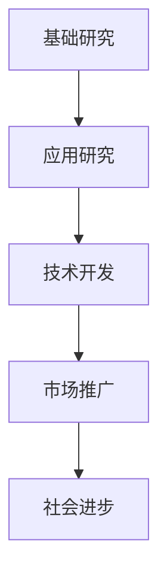

**算法原理讲解：**

科技创新的过程可以被视为一个迭代优化算法，其目标是不断改进技术，提高效率，降低成本，并满足社会的需求。以下是一个简化的科技创新过程伪代码：

```python
def innovate():
    while not (satisfied_with_solution() and optimal_solution()):
        perform_research()
        develop_technology()
        test_and_improve()
    return final_solution()
```

**数学模型和公式：**

科技创新的数学模型通常涉及优化理论，用于最大化效用或最小化成本。以下是一个简化的数学模型：

$$
\max_{x} \quad U(x) - C(x)
$$

其中，$U(x)$表示效用函数，$C(x)$表示成本函数，$x$是科技创新的目标。

**举例说明：**

例如，在信息技术领域，量子计算是一个前沿的科技创新方向。量子计算机通过量子比特实现计算，其速度远远超过传统计算机。科学家们通过不断地研究和实验，优化量子算法，降低了量子计算机的运行成本，使得量子计算逐渐从理论走向实际应用。

#### 1.2 科技创新的历史与发展

科技创新的历史可以追溯到人类文明的起源，从最早的工具制造到现代科技的迅猛发展，每一个阶段都有其独特的创新成果和里程碑。

**历史演进：**

1. **古代科技**：最早的科技创新可以追溯到石器时代，人类通过制造工具提高生产效率，改善了生活质量。
2. **工业革命**：18世纪末至19世纪初的工业革命，标志着科技创新进入了大规模应用阶段，蒸汽机、纺织机等发明极大地推动了工业生产的发展。
3. **现代科技**：20世纪以来，科技创新的速度加快，信息技术、生物科技、环境科技等新兴领域不断涌现，人类进入了信息化、生物化和智能化的新时代。

**当代趋势：**

1. **全球化**：科技创新不再局限于某个国家或地区，全球范围内的合作和竞争日益加剧。
2. **跨学科融合**：不同学科之间的交叉和融合成为科技创新的重要趋势，如生物信息学、数据科学等。
3. **开源与共享**：开源软件和共享研究成果成为推动科技创新的重要手段，加速了技术的传播和应用。

**Mermaid 流程图：**

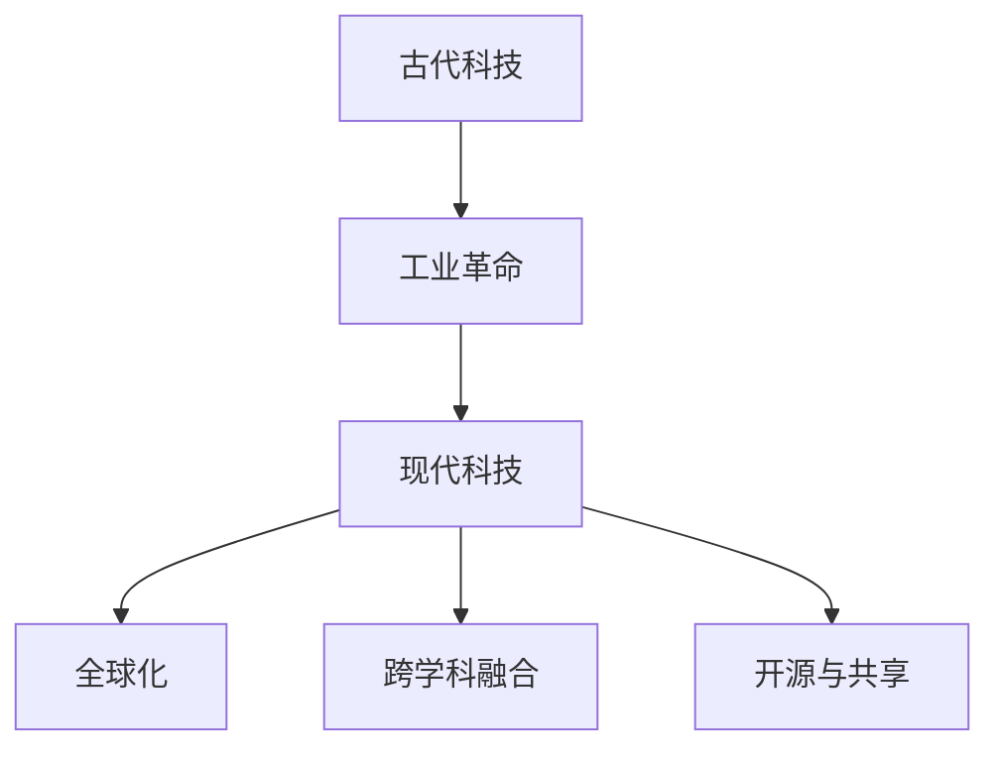

**算法原理讲解：**

科技创新的历史发展可以被视为一个复杂的迭代过程，每个阶段都有其特定的算法原理和实现方法。以下是一个简化的历史发展算法：

```python
def technological_history():
    current_stage = "古代科技"
    while current_stage != "现代科技":
        advance_to_next_stage()
        apply_key_innovations()
        integrate_new_disciplines()
    return current_stage
```

**数学模型和公式：**

科技创新的历史发展可以用动态系统模型来描述，该模型考虑了不同阶段的技术积累、知识扩散和资源分配等因素。以下是一个简化的动态系统模型：

$$
\frac{dX}{dt} = f(X, t)
$$

其中，$X$表示技术发展水平，$t$表示时间，$f$是技术发展的函数。

**举例说明：**

例如，互联网的发展是当代科技创新的一个典型例子。互联网的兴起不仅改变了信息传播的方式，还催生了电子商务、社交媒体等新的商业模式。从ARPANET的诞生到全球互联网的普及，互联网的发展经历了多个阶段，每个阶段都有其关键的创新成果和里程碑。

#### 1.3 科技创新与经济、社会的关系

科技创新不仅是技术进步的标志，也是推动经济发展和社会进步的关键因素。在现代社会，科技创新与经济、社会的关系日益紧密，相互影响、相互促进。

**科技创新对经济增长的贡献：**

1. **提高生产效率**：科技创新通过改进生产工具和生产流程，提高生产效率和产品质量，从而推动经济增长。
2. **创造就业机会**：科技创新带动了新兴产业的发展，创造了大量的就业机会，促进了社会的稳定和繁荣。
3. **促进产业升级**：科技创新推动传统产业向高附加值、高技术含量的产业转型，提升了经济的整体竞争力。

**科技创新对社会发展的推动作用：**

1. **改善生活质量**：科技创新带来了医疗、交通、通信等领域的革命性变化，极大地改善了人们的生活质量。
2. **促进教育普及**：科技创新推动了教育的现代化，促进了教育的普及和质量的提升，为人才培养提供了坚实的基础。
3. **加强社会治理**：科技创新提供了新的手段和方法，如大数据、人工智能等，用于加强社会治理、维护社会稳定。

**Mermaid 流程图：**

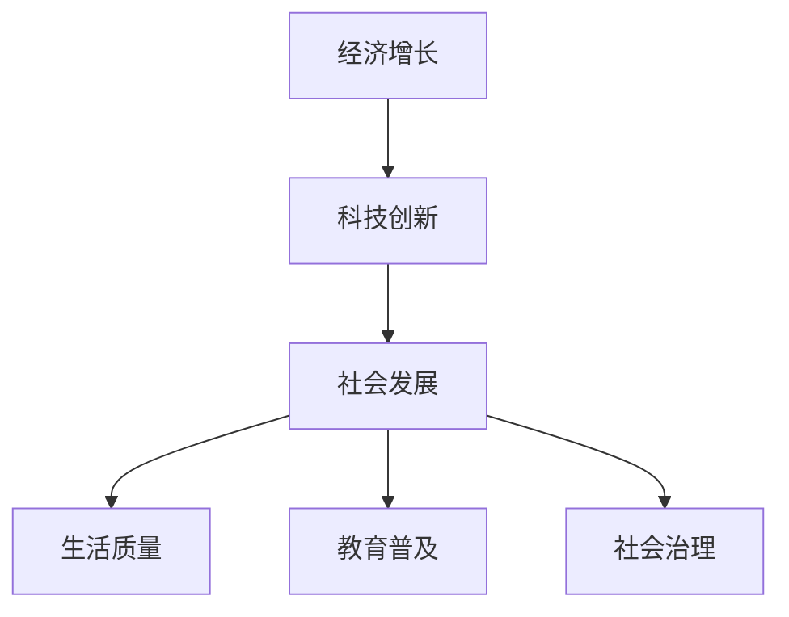

**算法原理讲解：**

科技创新与经济、社会的关系可以用复杂系统模型来描述，该模型考虑了多个因素之间的相互作用和反馈。以下是一个简化的复杂系统模型：

```python
class EconomicSociety:
    def __init__(self, innovation, economy, society):
        self.innovation = innovation
        self.economy = economy
        self.society = society

    def update(self):
        self.economy.update(self.innovation)
        self.society.update(self.economy)
```

**数学模型和公式：**

科技创新与经济、社会的关系可以用系统动力学模型来描述，该模型考虑了技术进步、经济增长和社会发展之间的复杂关系。以下是一个简化的系统动力学模型：

$$
\frac{dE}{dt} = f(T, E, S)
$$
$$
\frac{dS}{dt} = g(T, E, S)
$$

其中，$E$表示经济增长，$T$表示科技创新，$S$表示社会发展，$f$和$g$是相应的函数。

**举例说明：**

例如，信息技术的快速发展极大地推动了全球经济的增长。互联网、智能手机、电子商务等技术的普及，改变了传统的商业模式和消费模式，创造了新的经济增长点。同时，信息技术也促进了教育的普及和质量的提升，使得更多的人有机会接受高质量的教育，提高了整个社会的人力资本水平。

### 第2章：科技创新的核心领域

科技创新的核心领域涵盖了信息技术、生物科技和环境科技等多个领域，这些领域的发展不仅推动了科技的进步，也为社会带来了深远的影响。

#### 2.1 信息技术

信息技术是现代科技创新的核心领域之一，其发展经历了从计算机科学、网络技术到人工智能的多个阶段。信息技术的发展不仅改变了人类的生活方式，还深刻影响了经济、社会和文化等多个方面。

**发展历程：**

1. **计算机科学**：计算机科学的发展始于20世纪40年代，计算机的出现标志着信息技术的诞生。从最早的电子计算机到后来的微型计算机，计算机的运算速度和存储能力不断提高。
2. **网络技术**：20世纪80年代以来，互联网的出现和发展使得信息传输的速度和范围得到了极大的提升。互联网不仅改变了信息的传播方式，还催生了电子商务、社交媒体等新的商业模式。
3. **人工智能**：人工智能是信息技术发展的最新阶段，通过模拟人类思维和行为，人工智能在图像识别、自然语言处理、智能决策等方面取得了重大突破。

**主要应用领域：**

1. **电子商务**：电子商务是信息技术的重要应用领域之一，通过互联网进行商品和服务的交易，极大地改变了传统的商业模式。
2. **大数据**：大数据技术的发展使得对大规模数据的存储、分析和处理成为可能，为企业和政府提供了重要的决策支持。
3. **人工智能**：人工智能在智能客服、自动驾驶、医疗诊断等领域具有广泛的应用，提高了生产效率和生活质量。

**Mermaid 流程图：**

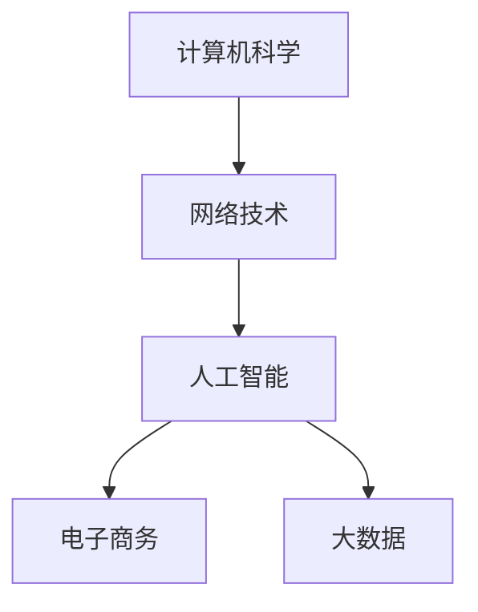

**算法原理讲解：**

信息技术的发展涉及到多种算法原理，以下是一些关键算法：

1. **计算机算法**：计算机算法是计算机科学的核心，包括排序、搜索、图论等。这些算法优化了计算机的运算效率，提高了处理复杂任务的能力。
2. **网络协议**：网络协议是网络通信的基础，包括TCP/IP协议、HTTP协议等。这些协议定义了数据在网络中的传输规则，确保了信息的准确和可靠传输。
3. **机器学习算法**：机器学习算法是人工智能的核心，包括线性回归、决策树、神经网络等。这些算法通过学习大量数据，提高了智能系统的决策能力和自适应能力。

**数学模型和公式：**

信息技术的发展涉及到多种数学模型和公式，以下是一些关键模型：

1. **计算机网络模型**：计算机网络模型包括OSI模型和TCP/IP模型，这些模型描述了网络通信的层次结构和数据传输机制。
2. **数据挖掘模型**：数据挖掘模型包括关联规则挖掘、聚类分析、分类分析等，这些模型用于从大量数据中发现有价值的信息。
3. **机器学习模型**：机器学习模型包括线性回归、逻辑回归、支持向量机等，这些模型用于训练智能系统，实现数据的自动分析和预测。

**举例说明：**

例如，电子商务平台的推荐系统是信息技术的一个典型应用。推荐系统通过分析用户的历史购买行为和浏览记录，使用机器学习算法预测用户可能感兴趣的商品，并推荐给用户。这不仅提高了用户的购物体验，还提高了商家的销售转化率。

#### 2.2 生物科技

生物科技是利用生物系统、生物过程和生物物质进行技术创新的领域，其发展对医学、农业和环境等领域产生了深远的影响。生物科技的核心在于利用生物技术和生物信息学等手段，解决人类健康、食品安全和环境保护等问题。

**主要领域：**

1. **医学**：生物科技在医学领域的应用包括疾病诊断、治疗和预防。例如，基因编辑技术CRISPR-Cas9可以精确地修改DNA序列，用于治疗遗传性疾病。
2. **农业**：生物科技在农业领域的应用包括转基因作物、精准农业和生物农药。这些技术提高了农作物的产量和质量，降低了农业生产的环境影响。
3. **环境**：生物科技在环境保护领域的应用包括生物修复、生物降解和生物治理。例如，微生物技术可以用于净化水体和土壤。

**社会影响：**

1. **医疗健康**：生物科技在医疗健康领域的应用极大地提高了疾病的治疗效果和生活质量。例如，基因测序技术可以用于个性化医疗，为患者提供更精准的治疗方案。
2. **食品安全**：生物科技在食品安全领域的应用包括转基因食品、食品安全检测等，这些技术提高了食品的安全性和可持续性。
3. **环境保护**：生物科技在环境保护领域的应用可以有效地解决环境污染和生态破坏问题，为可持续发展提供了新的途径。

**Mermaid 流程图：**

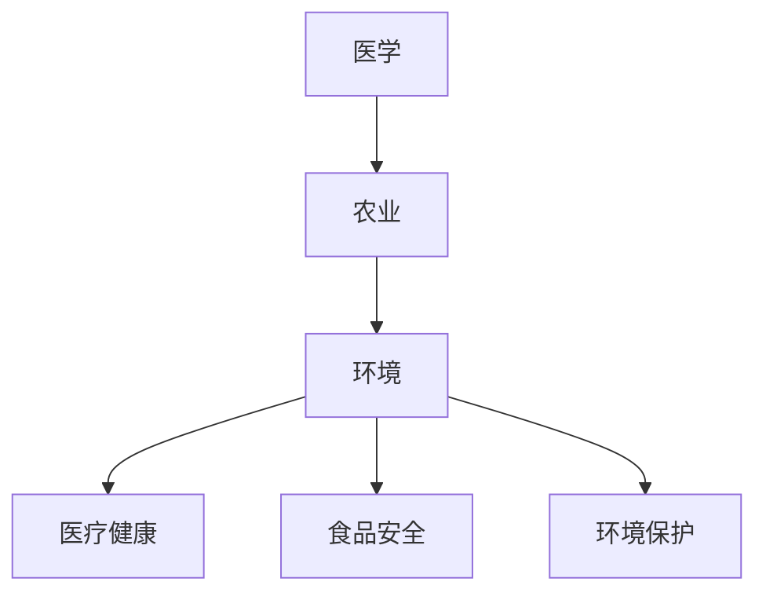

**算法原理讲解：**

生物科技的发展涉及到多种算法原理，以下是一些关键算法：

1. **基因编辑算法**：基因编辑技术CRISPR-Cas9的核心算法是基于DNA序列的匹配和剪切。该算法通过设计特定的RNA序列，引导Cas9酶精确地剪切目标DNA序列。
2. **基因组测序算法**：基因组测序技术如高通量测序（NGS）涉及到大量的数据处理和分析。基因组测序算法用于将测序数据转化为基因序列，并进行后续的基因分析和注释。
3. **生物信息学算法**：生物信息学算法用于处理和分析生物数据，包括蛋白质结构预测、蛋白质相互作用预测、生物网络分析等。

**数学模型和公式：**

生物科技的发展涉及到多种数学模型和公式，以下是一些关键模型：

1. **遗传学模型**：遗传学模型如孟德尔遗传规律和基因频率模型，用于描述遗传性状的传递和变异。
2. **生态学模型**：生态学模型如种群动态模型和食物网模型，用于描述生态系统中的物种相互作用和生态平衡。
3. **机器学习模型**：机器学习模型如支持向量机（SVM）和深度学习模型，用于生物数据的分类、预测和模式识别。

**举例说明：**

例如，基因编辑技术CRISPR-Cas9在医学领域的应用。CRISPR-Cas9技术可以通过精确地编辑DNA序列，修复基因突变，从而治疗遗传性疾病。例如，科学家们使用CRISPR-Cas9技术成功治疗了严重的β-地中海贫血症，为患者带来了希望。

#### 2.3 环境科技

环境科技是利用科学和技术手段解决环境污染、资源节约和生态保护等问题的领域。环境科技的核心在于通过技术创新，实现生态环境的可持续发展。

**重要任务：**

1. **污染防治**：环境科技致力于开发高效的污染治理技术和方法，如生物修复、化学治理和物理治理。这些技术可以有效地减少污染物的排放和降低环境污染的影响。
2. **资源节约**：环境科技通过研究和开发节能、环保的技术，实现资源的节约和有效利用。例如，太阳能、风能等可再生能源技术的发展，为减少对化石燃料的依赖提供了新的途径。
3. **生态保护**：环境科技关注生态系统的保护和恢复，通过生态修复、生态工程和生态规划等技术手段，改善生态环境，保护生物多样性。

**发展趋势：**

1. **绿色技术**：绿色技术是指对环境友好、资源节约的技术，如绿色能源、绿色制造和绿色建筑。这些技术的发展有助于实现环境的可持续发展。
2. **智慧环境**：智慧环境技术通过物联网、大数据和人工智能等手段，实现环境监测、污染治理和资源管理的智能化。智慧环境技术有助于提高环境管理的效率和准确性。
3. **循环经济**：循环经济是指通过资源的循环利用，减少资源的消耗和污染的产生。循环经济的发展有助于实现资源的可持续利用，促进生态环境的改善。

**Mermaid 流程图：**

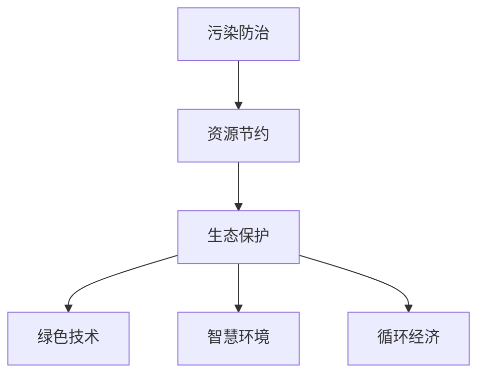

**算法原理讲解：**

环境科技的发展涉及到多种算法原理，以下是一些关键算法：

1. **环境监测算法**：环境监测算法用于实时监测环境质量，如空气质量监测算法、水质监测算法等。这些算法通过数据分析，识别污染源和污染趋势。
2. **污染治理算法**：污染治理算法用于优化污染治理过程，如生物修复算法、化学治理算法等。这些算法通过模拟和优化，提高污染治理的效果和效率。
3. **资源循环利用算法**：资源循环利用算法用于优化资源的回收和再利用过程，如垃圾分类算法、废水处理算法等。这些算法通过分类和分析，提高资源利用率和减少废物产生。

**数学模型和公式：**

环境科技的发展涉及到多种数学模型和公式，以下是一些关键模型：

1. **环境动力学模型**：环境动力学模型用于描述环境系统中的物质和能量流动，如水质动力学模型、大气扩散模型等。这些模型通过模拟和预测，为环境管理和决策提供科学依据。
2. **生态学模型**：生态学模型用于描述生态系统的结构和功能，如种群动态模型、食物网模型等。这些模型通过模拟和预测，为生态保护和恢复提供科学依据。
3. **机器学习模型**：机器学习模型用于环境数据的分析和预测，如分类模型、回归模型等。这些模型通过学习和训练，提高环境监测和治理的准确性和效率。

**举例说明：**

例如，环境监测技术在空气质量监测中的应用。空气质量监测算法通过实时采集空气质量数据，使用机器学习算法分析数据，预测未来的空气质量变化，为政府和公众提供环境健康预警。

### 第3章：科技创新的方法与工具

科技创新的方法和工具是实现技术突破和社会进步的关键。在科技领域，创新方法论、科技工具和平台的发展使得科学家、工程师和研究人员能够更加高效地开展研究工作，推动技术的进步和应用。

#### 3.1 创新方法论

创新方法论是推动科技创新的重要手段，它涉及一系列系统性、结构化的方法和步骤，旨在提高创新的效率和质量。以下是一些常用的创新方法论：

1. **概念验证**：概念验证（Proof of Concept，PoC）是一种评估创新想法是否可行的方法。通过快速构建原型或演示，验证技术原理和商业模式的可行性，降低创新风险。
2. **快速原型**：快速原型（Rapid Prototyping）是一种迭代开发的方法，通过快速构建可运行的原型，收集用户反馈，不断优化产品设计和功能。
3. **设计思维**：设计思维（Design Thinking）是一种以人为本的创新方法，强调用户需求和体验的重要性。通过观察、洞察、原型设计和测试，设计出符合用户需求的产品和服务。

**Mermaid 流程图：**

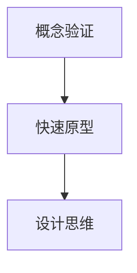

**算法原理讲解：**

创新方法论中的每个步骤都涉及到特定的算法原理：

1. **概念验证**：通常使用算法验证技术可行性，如模拟、仿真等。
2. **快速原型**：使用迭代开发方法和敏捷开发工具，如敏捷开发框架（Scrum）和版本控制系统（Git）。
3. **设计思维**：设计思维结合了人类行为学、心理学和设计原则，通过用户研究和原型测试，迭代改进产品设计。

**数学模型和公式：**

创新方法论中的数学模型主要用于量化分析和优化：

1. **风险评估模型**：使用贝叶斯网络、决策树等模型进行风险分析和决策。
2. **用户体验模型**：使用用户行为模型、满意度模型等评估用户体验和产品性能。

**举例说明：**

例如，设计一款智能家居设备时，可以使用设计思维方法。首先，通过用户访谈和观察，了解用户的需求和痛点；然后，构建原型并进行用户测试，收集反馈；最后，根据用户反馈迭代优化产品设计和功能，直至满足用户需求。

#### 3.2 科技创新工具

科技创新工具是支持科学家、工程师和研究人员开展研究工作的重要资源。以下是一些常用的科技创新工具：

1. **人工智能与大数据**：人工智能（AI）和大数据技术是现代科技创新的重要工具，用于数据分析和智能决策。机器学习算法、深度学习和大数据分析平台（如Hadoop、Spark）等工具可以帮助研究人员从海量数据中提取有价值的信息。
2. **物联网与云计算**：物联网（IoT）技术通过连接各种设备和系统，实现智能监控和数据收集。云计算平台（如Amazon Web Services、Microsoft Azure）提供了强大的计算和存储能力，支持大规模数据处理和实验。
3. **数字孪生与仿真**：数字孪生（Digital Twin）技术通过创建物理实体的数字映射，实现实时监控和仿真。仿真工具（如ANSYS、Simulink）可以帮助研究人员在虚拟环境中测试和优化产品性能。

**Mermaid 流程图：**

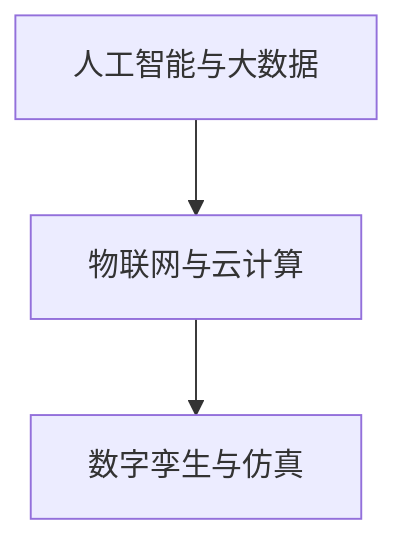

**算法原理讲解：**

科技创新工具中的算法原理涵盖了各种技术领域：

1. **人工智能**：机器学习算法（如神经网络、决策树）、深度学习模型（如卷积神经网络、循环神经网络）等。
2. **大数据**：数据挖掘算法（如关联规则挖掘、聚类分析）、大数据处理框架（如MapReduce、Spark）等。
3. **物联网**：无线通信协议（如Wi-Fi、Zigbee）、传感器数据处理算法等。
4. **云计算**：云计算平台架构、容器化技术（如Docker、Kubernetes）等。

**数学模型和公式：**

科技创新工具中的数学模型主要用于数据分析和优化：

1. **人工智能**：优化算法（如梯度下降、遗传算法）、概率模型（如贝叶斯网络、隐马尔可夫模型）等。
2. **大数据**：统计分析模型（如线性回归、主成分分析）、优化模型（如线性规划、动态规划）等。
3. **物联网**：信号处理模型（如滤波器设计、误差校正）等。
4. **云计算**：资源分配模型（如调度算法、负载均衡）等。

**举例说明：**

例如，使用物联网技术构建智能家居系统。物联网传感器实时采集家庭环境数据（如温度、湿度、光照等），通过无线网络传输到云端服务器。云端服务器使用机器学习算法分析数据，提供智能建议（如调节空调温度、开启照明等），实现智能家居的自动化控制。

### 第4章：科技创新的挑战与机遇

科技创新虽然为社会带来了巨大的进步和变革，但也面临着诸多挑战和机遇。在全球化、跨学科合作和政策支持等外部因素的推动下，科技创新正在不断突破传统边界，迈向新的发展阶段。

#### 4.1 科技创新面临的挑战

1. **技术风险**：科技创新往往伴随着未知的技术风险，包括技术不成熟、稳定性差、安全性问题等。这些风险可能导致创新项目失败，影响科技创新的进展。
2. **社会道德**：科技创新涉及到伦理和道德问题，如隐私侵犯、人工智能的滥用等。这些问题需要全社会共同关注和解决，以确保科技创新的可持续发展。
3. **法律法规**：科技创新的发展需要完善的法律法规体系，以规范科技创新行为，保护知识产权，促进技术转移和商业化。然而，现有法律法规可能滞后于科技创新的步伐，需要不断更新和完善。

**Mermaid 流程图：**

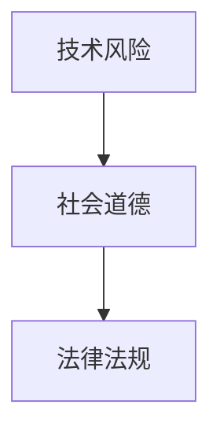

**算法原理讲解：**

科技创新面临的挑战可以通过以下算法原理进行管理和解决：

1. **风险管理**：使用风险分析算法（如贝叶斯网络、蒙特卡洛模拟）进行风险评估和决策，降低技术风险。
2. **伦理审查**：建立伦理审查机制，使用伦理决策算法（如多准则决策、博弈论）评估科技创新的伦理影响。
3. **法律监管**：建立法律法规体系，使用法律监管算法（如智能合约、区块链）实现科技创新的合法合规。

**数学模型和公式：**

科技创新面临的挑战可以通过以下数学模型进行量化和管理：

1. **风险模型**：使用概率模型（如概率分布、风险矩阵）描述技术风险和不确定性。
2. **伦理模型**：使用伦理决策模型（如多属性效用理论、价值函数）评估科技创新的伦理影响。
3. **法律模型**：使用法律合规模型（如博弈论、合同理论）设计科技创新的法律法规体系。

**举例说明：**

例如，人工智能在医疗领域的应用需要解决隐私和安全问题。通过使用加密算法和区块链技术，可以确保患者数据的隐私和安全。同时，建立伦理审查委员会，评估人工智能在医疗中的伦理影响，确保其符合道德规范。

#### 4.2 科技创新的机遇

1. **全球化**：全球化使得科技创新资源和人才得以全球配置，促进了跨国合作和知识共享。全球化为科技创新带来了更多的机遇，如跨国公司合作、国际学术交流等。
2. **跨学科合作**：跨学科合作是推动科技创新的重要途径，通过不同学科领域的交叉融合，可以产生新的思路和方法，解决复杂问题。跨学科合作有助于打破学科壁垒，推动技术创新。
3. **政策支持**：政府和企业对科技创新的支持是推动科技创新的重要力量。政策支持包括资金投入、税收优惠、知识产权保护等，有助于营造良好的创新环境。

**Mermaid 流流程图：**

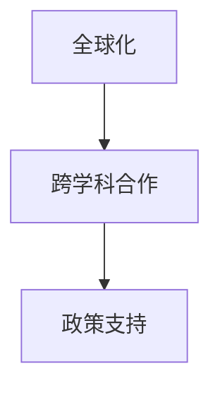

**算法原理讲解：**

科技创新的机遇可以通过以下算法原理进行利用和实现：

1. **全球化**：使用全球供应链管理算法和跨国合作模型，优化全球资源配置和合作效率。
2. **跨学科合作**：使用跨学科知识图谱和协同创新模型，促进不同学科领域的知识共享和融合。
3. **政策支持**：使用政策分析算法和智能监管模型，评估政策支持的效果和优化政策设计。

**数学模型和公式：**

科技创新的机遇可以通过以下数学模型进行量化和管理：

1. **全球化**：使用全球贸易模型（如引力模型、国际投资模型）描述全球化效应。
2. **跨学科合作**：使用网络分析模型（如社会网络分析、复杂网络理论）描述跨学科合作的结构和关系。
3. **政策支持**：使用经济模型（如增长模型、均衡模型）评估政策支持的宏观经济效应。

**举例说明：**

例如，人工智能在金融领域的应用带来了全球化机遇。通过使用全球数据分析和机器学习算法，金融机构可以实现跨国的风险管理和投资决策，提高全球金融市场效率和稳定性。

### 第5章：科技创新与企业

科技创新不仅是科技进步的驱动力，也是企业发展的核心动力。企业通过科技创新可以实现产品创新、流程优化和商业模式创新，从而提升竞争力、创造价值。在这一章中，我们将探讨科技创新与企业战略、产业链创新的关系。

#### 5.1 科技创新与企业战略

科技创新是企业战略的重要组成部分，企业通过科技创新实现竞争优势和市场领导地位。以下是一些关键方面：

**科技创新在企业战略中的作用：**

1. **产品创新**：科技创新可以推动产品创新，提高产品的性能、质量和用户体验。通过技术创新，企业可以开发出具有独特功能、设计或技术优势的产品，满足市场需求。
2. **流程优化**：科技创新可以帮助企业优化生产流程和管理流程，提高生产效率、降低成本和提升资源利用率。例如，智能制造和自动化技术的应用可以大幅提升生产效率和产品质量。
3. **商业模式创新**：科技创新可以推动商业模式的创新，为企业创造新的收入来源和利润增长点。例如，共享经济模式、基于订阅的服务模式等，都是科技创新带来的商业模式创新。

**Mermaid 流程图：**

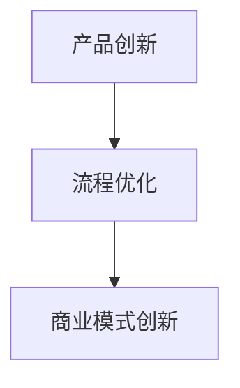

**算法原理讲解：**

企业战略中的科技创新可以通过以下算法原理进行优化和实施：

1. **创新管理算法**：使用创新管理算法（如TRIZ、六西格玛），帮助企业识别和解决创新过程中的问题，提高创新效率。
2. **商业模式设计算法**：使用商业模式设计算法（如九宫格模型、价值网络分析），帮助企业设计和优化商业模式。
3. **资源优化算法**：使用资源优化算法（如线性规划、遗传算法），帮助企业合理配置资源，提高资源利用效率。

**数学模型和公式：**

企业战略中的科技创新可以通过以下数学模型进行量化和管理：

1. **创新成本效益分析模型**：使用成本效益分析模型（如净现值、内部收益率），评估创新项目的经济可行性。
2. **市场预测模型**：使用市场预测模型（如时间序列分析、回归分析），预测市场需求和竞争态势。
3. **供应链优化模型**：使用供应链优化模型（如供应链网络设计、库存管理），优化供应链流程和资源配置。

**举例说明：**

例如，一家制造企业通过引入智能制造技术，实现了生产线的自动化和智能化。通过使用机器学习和人工智能算法，企业可以对生产过程进行实时监控和优化，提高了生产效率和产品质量。同时，通过数据分析，企业可以预测市场需求，调整生产计划，降低库存成本。

#### 5.2 科技创新与产业链

科技创新不仅对企业内部产生重大影响，还对产业链的重组和优化起到关键作用。以下是一些关键方面：

**科技创新在产业链中的作用：**

1. **产业链重构**：科技创新可以推动产业链的重构，改变传统产业的结构和模式。例如，互联网和电子商务的发展，改变了传统零售业的经营模式，推动了产业链的数字化转型。
2. **产业链协同创新**：科技创新可以促进产业链各环节的协同创新，通过跨行业的合作和知识共享，推动产业链的整体进步。例如，智能制造产业链中，硬件制造商、软件开发商、系统集成商等企业可以共同合作，开发出更加智能化、高效化的制造解决方案。
3. **产业链价值提升**：科技创新可以提高产业链的整体价值，通过技术创新和流程优化，提升产品的附加值和利润率。例如，在新能源产业链中，通过技术创新，可以提高电池的能量密度和循环寿命，降低成本，提升市场竞争力。

**Mermaid 流程图：**

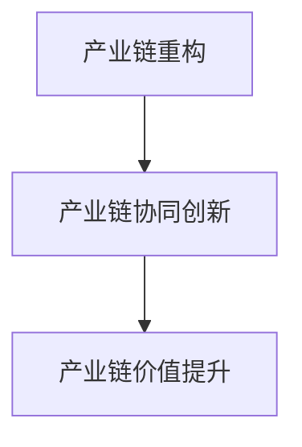

**算法原理讲解：**

科技创新与产业链的关系可以通过以下算法原理进行描述和优化：

1. **产业链网络分析算法**：使用产业链网络分析算法（如社会网络分析、复杂网络理论），分析产业链的结构和关系，识别关键环节和节点。
2. **协同创新算法**：使用协同创新算法（如多智能体系统、博弈论），促进产业链各环节的协同创新和合作。
3. **供应链优化算法**：使用供应链优化算法（如供应链网络设计、库存管理），优化供应链流程和资源配置，提高供应链的整体效率。

**数学模型和公式：**

科技创新与产业链的关系可以通过以下数学模型进行量化和管理：

1. **产业链网络模型**：使用网络模型（如图论、矩阵分析），描述产业链的结构和关系。
2. **协同创新模型**：使用协同创新模型（如多目标优化、群体智能），优化产业链的协同创新过程。
3. **供应链优化模型**：使用供应链优化模型（如线性规划、动态规划），优化供应链流程和资源配置。

**举例说明：**

例如，在新能源汽车产业链中，电池技术是关键环节。通过技术创新，可以提高电池的能量密度和循环寿命，降低成本。同时，电池制造商、整车制造商和充电设施运营商等产业链企业可以协同合作，开发出更加高效、智能的充电和电池回收解决方案，提升整个产业链的价值。

### 第6章：科技创新与社会发展

科技创新不仅推动经济发展和产业升级，还对社会治理、教育和可持续发展等领域产生深远影响。在这一章中，我们将探讨科技创新如何改善社会治理、提高教育质量和推动可持续发展。

#### 6.1 科技创新与社会治理

科技创新为社会治理提供了新的手段和方法，提高了社会治理的效率和效果。以下是一些关键方面：

**科技创新在改善社会治理中的作用：**

1. **智慧城市**：智慧城市是科技创新在社会治理领域的典型应用。通过物联网、大数据和人工智能等技术，智慧城市可以实现城市管理的智能化、精细化和高效化。例如，智能交通系统可以实时监测和优化交通流量，减少拥堵和排放。
2. **公共安全**：科技创新在公共安全领域的应用包括视频监控、智能安防和应急响应等。通过人工智能和大数据分析，可以实时监测和预测安全隐患，提高公共安全保障。
3. **政务服务**：科技创新可以优化政务服务流程，提高政府办事效率和公共服务水平。例如，电子政务系统可以提供在线审批、查询和办理服务，方便民众办事。

**Mermaid 流程图：**

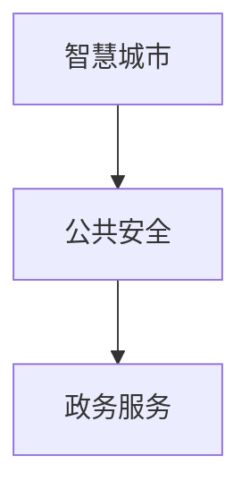

**算法原理讲解：**

科技创新在改善社会治理中涉及到多种算法原理：

1. **数据分析算法**：数据分析算法（如聚类分析、关联规则挖掘）用于处理和分析大量数据，发现潜在的安全隐患和趋势。
2. **智能监控算法**：智能监控算法（如目标检测、图像识别）用于实时监测和识别异常行为和事件。
3. **预测模型**：预测模型（如时间序列分析、回归分析）用于预测和预测社会事件的未来发展趋势。

**数学模型和公式：**

科技创新在改善社会治理中可以通过以下数学模型进行量化和管理：

1. **风险评估模型**：风险评估模型（如贝叶斯网络、蒙特卡洛模拟）用于评估社会风险和安全性。
2. **交通流量模型**：交通流量模型（如交通平衡模型、动态交通分配模型）用于优化交通流量和缓解拥堵。
3. **公共服务模型**：公共服务模型（如排队论、服务系统优化）用于优化公共服务流程和资源分配。

**举例说明：**

例如，在智慧城市建设中，通过大数据和人工智能技术，政府可以实时监测城市的交通状况。通过分析交通流量数据，政府可以动态调整交通信号灯，优化交通流量，减少拥堵。同时，通过实时监控和智能安防系统，可以及时发现和预防安全隐患，提高公共安全。

#### 6.2 科技创新与教育

科技创新对教育领域产生了深远的影响，推动了教育的现代化和个性化。以下是一些关键方面：

**科技创新在教育中的应用：**

1. **在线教育**：在线教育平台（如Coursera、edX）提供了海量的在线课程和学习资源，使得学习者可以随时随地获取知识。在线教育平台通过大数据和人工智能技术，可以实现个性化学习推荐，提高学习效果。
2. **虚拟现实与增强现实**：虚拟现实（VR）和增强现实（AR）技术为教育提供了新的交互方式。通过VR和AR技术，学生可以身临其境地体验历史事件、科学实验等，提高学习兴趣和参与度。
3. **智能学习系统**：智能学习系统通过人工智能和大数据技术，可以实时监测学生的学习行为和学习效果，提供个性化的学习建议和资源。智能学习系统可以帮助学生提高学习效率，优化学习路径。

**Mermaid 流程图：**

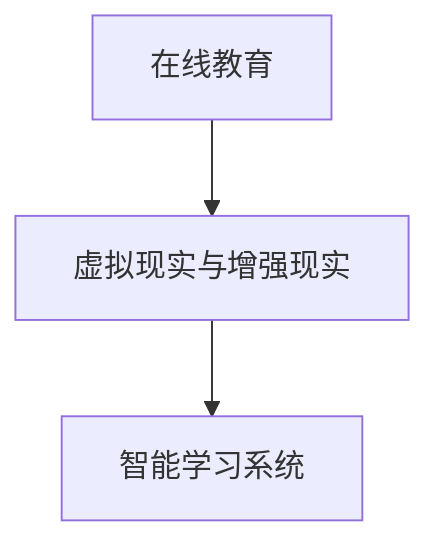

**算法原理讲解：**

科技创新在教育中的应用涉及到多种算法原理：

1. **推荐算法**：推荐算法（如协同过滤、内容推荐）用于根据学习者的兴趣和学习历史，推荐合适的课程和学习资源。
2. **图像识别算法**：图像识别算法（如卷积神经网络、深度学习）用于识别和分析学生交互的图像和视频，实现智能监控和交互。
3. **学习分析算法**：学习分析算法（如学习曲线分析、行为分析）用于分析学生的学习行为和学习效果，提供个性化学习建议。

**数学模型和公式：**

科技创新在教育中的应用可以通过以下数学模型进行量化和管理：

1. **学习模型**：学习模型（如教育心理学模型、学习曲线模型）用于描述学生的学习过程和学习效果。
2. **推荐模型**：推荐模型（如矩阵分解、协同过滤）用于根据学习者的兴趣和学习历史推荐课程和学习资源。
3. **绩效评估模型**：绩效评估模型（如统计模型、机器学习模型）用于评估学生的学习效果和教学质量。

**举例说明：**

例如，在在线教育平台中，通过使用推荐算法，可以根据学生的兴趣和学习历史，推荐合适的课程和学习资源。通过学习分析算法，平台可以实时监测学生的学习行为和学习效果，提供个性化的学习建议，帮助学生在最佳状态下进行学习。同时，通过虚拟现实和增强现实技术，学生可以身临其境地体验科学实验和历史事件，提高学习兴趣和参与度。

#### 6.3 科技创新与可持续发展

科技创新是实现可持续发展的关键因素，通过技术创新，可以减少资源消耗、降低环境污染和改善生态条件。以下是一些关键方面：

**科技创新在可持续发展中的作用：**

1. **绿色能源**：科技创新在绿色能源领域的应用，包括太阳能、风能、地热能等，可以减少对化石燃料的依赖，降低温室气体排放。例如，太阳能光伏技术的进步，使得太阳能发电成本大幅降低，推广了太阳能的广泛应用。
2. **环境保护**：科技创新在环境保护领域的应用，包括污染治理、生态修复等，可以改善环境质量，保护生态系统的健康。例如，生物技术可以用于生物修复和生物降解，有效治理环境污染。
3. **资源循环利用**：科技创新在资源循环利用领域的应用，包括废物回收、再生资源利用等，可以减少资源消耗和环境污染。例如，通过化学技术和物理技术的结合，可以高效回收废旧金属、塑料等资源，实现资源的循环利用。

**Mermaid 流程图：**

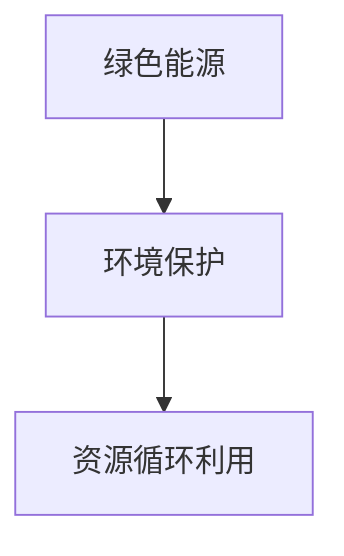

**算法原理讲解：**

科技创新在可持续发展中的应用涉及到多种算法原理：

1. **能源优化算法**：能源优化算法（如优化算法、智能调度算法）用于优化能源系统的运行和管理，提高能源利用效率。
2. **污染治理算法**：污染治理算法（如生物修复算法、化学治理算法）用于设计和优化污染治理过程，提高治理效果。
3. **资源循环利用算法**：资源循环利用算法（如回收算法、再生利用算法）用于优化资源的回收和再利用过程，提高资源利用效率。

**数学模型和公式：**

科技创新在可持续发展中的应用可以通过以下数学模型进行量化和管理：

1. **能源模型**：能源模型（如能源平衡模型、能源消耗模型）用于描述能源系统的运行和能量流动。
2. **污染模型**：污染模型（如污染扩散模型、污染治理模型）用于描述环境污染的传播和治理过程。
3. **资源循环利用模型**：资源循环利用模型（如资源回收模型、再生利用模型）用于描述资源的回收和再利用过程。

**举例说明：**

例如，在绿色能源领域，通过使用优化算法和智能调度算法，可以优化太阳能光伏电站的运行和管理，提高能源利用效率。通过污染治理算法和生物修复技术，可以高效治理工业废水和固体废弃物，减少对环境的污染。同时，通过资源循环利用算法和再生利用技术，可以高效回收和再利用废旧金属、塑料等资源，减少资源浪费和环境污染。

### 第7章：科技创新的未来展望

科技创新的未来充满无限可能，随着技术的不断进步，人类的生活和社会将迎来更加智能、高效和可持续的发展。在这一章中，我们将探讨科技创新的未来发展趋势、可能出现的重大科技创新成果以及科技创新与人类未来生活的关系。

#### 7.1 科技创新的发展趋势

科技创新的发展趋势体现了全球科技发展的方向和重点，以下是一些关键趋势：

1. **人工智能与机器学习**：人工智能（AI）和机器学习（ML）将继续成为科技创新的重点领域。随着计算能力的提升和大数据的普及，AI和ML技术将在各个行业得到广泛应用，从智能医疗、自动驾驶到智能家居，都将有显著的技术突破。
2. **物联网与智能设备**：物联网（IoT）的发展将推动智能设备的普及，实现万物互联。智能设备将通过传感器、云计算和人工智能等技术，实现自动化、智能化和协同化，为人们提供更加便捷和高效的体验。
3. **区块链技术**：区块链技术在保障数据安全、提升交易效率和实现去中心化管理方面具有巨大潜力。未来，区块链技术将在金融、供应链管理、医疗等领域发挥重要作用，为构建可信的数字世界提供支持。
4. **量子计算**：量子计算是下一代计算技术的重要方向。量子计算机将具有超越传统计算机的计算能力，对于解决复杂问题、模拟量子系统等领域具有重要意义。随着量子算法和量子硬件的发展，量子计算有望在未来十年内实现重大突破。
5. **生物科技与基因编辑**：生物科技将继续快速发展，特别是在基因编辑、合成生物学和精准医疗等领域。CRISPR-Cas9等基因编辑技术的成熟，将为医学研究和治疗带来革命性的变化，有望治愈许多目前无法治愈的疾病。

**Mermaid 流程图：**

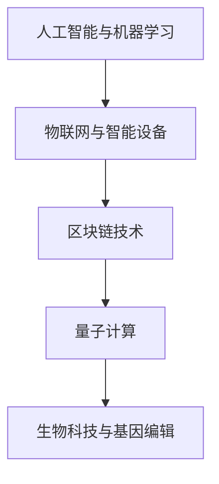

**算法原理讲解：**

科技创新的发展趋势涉及到的算法原理如下：

1. **机器学习算法**：深度学习、强化学习、自然语言处理等机器学习算法将在人工智能领域发挥关键作用，实现智能系统的自主学习和决策。
2. **物联网协议**：物联网协议（如MQTT、CoAP）和边缘计算技术将提高物联网设备的数据传输效率和处理能力，实现智能设备的协同工作。
3. **区块链算法**：区块链的共识算法（如PoW、PoS）、加密算法（如RSA、椭圆曲线加密）等将保障区块链系统的安全性、去中心化和数据不可篡改性。
4. **量子计算算法**：量子算法（如Shor算法、Grover算法）将利用量子计算的优势，解决传统算法难以处理的计算问题。
5. **基因编辑算法**：基因编辑算法（如CRISPR、TALEN）将精确修改DNA序列，实现基因编辑的精确性和效率。

**数学模型和公式：**

科技创新的发展趋势涉及到多种数学模型和公式：

1. **神经网络模型**：神经网络模型（如卷积神经网络、循环神经网络）用于机器学习任务，包括图像识别、语音识别和自然语言处理。
2. **物联网模型**：物联网模型（如网络流量模型、通信协议模型）用于描述物联网系统的数据传输和处理。
3. **区块链模型**：区块链模型（如状态机模型、分布式账本模型）用于描述区块链系统的运行和数据存储。
4. **量子计算模型**：量子计算模型（如量子逻辑门、量子纠缠）用于描述量子计算的基本原理和算法。
5. **基因编辑模型**：基因编辑模型（如基因序列匹配、编辑效率评估）用于评估基因编辑的准确性和效率。

**举例说明：**

例如，在人工智能领域，深度学习算法（如卷积神经网络）在图像识别任务中取得了显著成果。通过训练大量的图像数据，卷积神经网络可以自动学习图像的特征，实现高精度的图像识别。在自动驾驶领域，基于强化学习算法的自动驾驶系统通过模拟和训练，可以自主学习和优化驾驶策略，提高驾驶安全性和效率。

#### 7.2 科技创新与人类未来

科技创新不仅改变着我们的生活方式，还将深刻影响人类未来的发展方向。以下是一些科技创新与人类未来生活相关的关键方面：

1. **智能生活**：随着人工智能和物联网技术的发展，智能家居、智能城市和智能交通等智能生活场景将变得普及。人们的生活将更加便捷、舒适和安全。
2. **健康医疗**：生物科技和人工智能的结合，将推动医疗领域的革命性变革。精准医疗、基因编辑、远程医疗和智能诊断等技术将使医疗更加个性化、高效和安全。
3. **能源与环保**：绿色能源和清洁技术的创新，将减少对化石燃料的依赖，降低温室气体排放，推动可持续发展。例如，太阳能、风能、地热能等可再生能源技术的进步，将为人类提供清洁的能源来源。
4. **教育与学习**：科技创新将改变教育和学习的方式。在线教育、虚拟现实和增强现实等技术将使学习更加个性化和互动化，提高学习效果和效率。
5. **社会治理**：科技创新将提高社会治理的效率和效果。大数据、人工智能和区块链等技术将用于公共安全、政务服务和社会治理，提高社会的智能化水平和治理能力。

**Mermaid 流程图：**

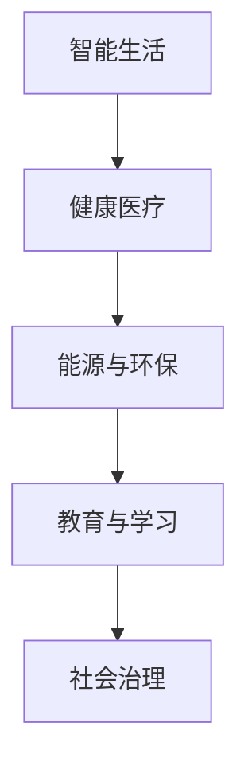

**算法原理讲解：**

科技创新与人类未来生活的关系可以通过以下算法原理进行描述：

1. **机器学习算法**：用于智能家居、智能交通和智能城市等场景，实现自动化和智能化管理。
2. **自然语言处理算法**：用于智能助手、语音识别和智能客服等场景，提供自然语言交互能力。
3. **基因组学算法**：用于基因编辑、精准医疗和生物技术研发，实现个性化医疗和生物技术创新。
4. **区块链算法**：用于社会治理、金融交易和供应链管理，实现数据安全、去中心化和透明化。
5. **优化算法**：用于能源管理、资源分配和物流优化，实现高效的能源利用和资源分配。

**数学模型和公式：**

科技创新与人类未来生活的关系可以通过以下数学模型进行量化和管理：

1. **优化模型**：用于能源管理、交通规划和资源分配，优化系统的运行和资源利用。
2. **机器学习模型**：用于图像识别、语音识别和自然语言处理，提高系统的准确性和效率。
3. **预测模型**：用于公共安全、健康医疗和自然灾害预测，提高预测的准确性和及时性。
4. **网络模型**：用于物联网和智能城市，描述网络的结构和通信机制。

**举例说明：**

例如，在智能城市领域，通过使用大数据和人工智能技术，可以实时监测和管理交通流量，优化交通信号灯，减少交通拥堵。通过智能监控系统和数据分析，可以提高公共安全保障，预防犯罪事件。在健康医疗领域，通过基因组学和人工智能技术，可以实现个性化医疗和精准治疗，提高医疗效率和治疗效果。

### 第二部分：科技创新项目实战

#### 第8章：科技创新项目概述

科技创新项目是推动技术进步和社会发展的重要载体。在这一章中，我们将介绍科技创新项目的特点、类型以及项目管理和实施的基本方法。

#### 8.1 科技创新项目的特点

科技创新项目具有以下显著特点：

**1. 高风险性**：科技创新项目往往涉及未知领域和技术挑战，存在不确定性，需要承担较高的风险。这种风险可能来自技术可行性、市场接受度、资金投入等多个方面。

**2. 高不确定性**：科技创新项目的发展过程充满了不确定性，从技术突破到市场应用，每个阶段都可能遇到意想不到的挑战。这种不确定性要求项目团队具备灵活应对变化的能力。

**3. 探索性**：科技创新项目通常具有探索性质，项目团队需要在未知领域进行探索和试验，通过不断的试错和迭代，逐步找到可行的解决方案。

**4. 复杂性**：科技创新项目往往涉及多个学科和技术领域的交叉，项目复杂度高，需要跨部门、跨领域的协作和配合。

**5. 创新性**：科技创新项目的核心目标是实现技术的创新和应用，通过创新，解决现有问题或创造新的需求。

**Mermaid 流程图：**

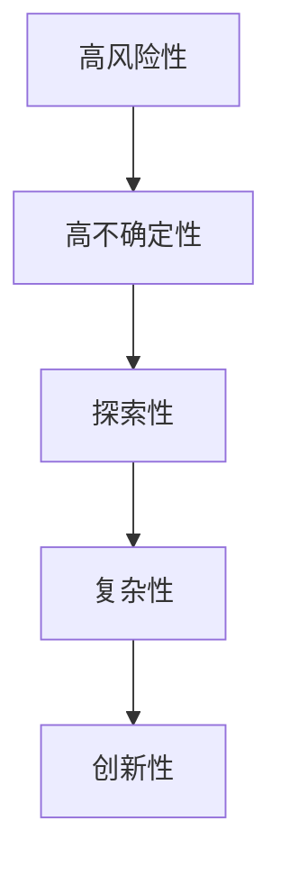

**算法原理讲解：**

科技创新项目的特点可以通过以下算法原理进行解释和管理：

1. **风险评估算法**：用于评估项目风险，识别潜在问题，制定相应的风险管理策略。
2. **迭代开发算法**：用于项目的探索性开发，通过不断的迭代和试错，逐步优化解决方案。
3. **复杂性管理算法**：用于项目复杂性的管理和协调，如项目分解、任务调度等。
4. **创新管理算法**：用于项目创新性的管理和激励，如TRIZ理论、创新流程管理等。

**数学模型和公式：**

科技创新项目的特点可以通过以下数学模型进行量化和管理：

1. **风险模型**：如贝叶斯网络、蒙特卡洛模拟等，用于项目风险评估。
2. **优化模型**：如线性规划、动态规划等，用于项目资源分配和任务调度。
3. **创新效率模型**：如创新函数、创新成本效益分析等，用于评估项目创新性和经济效益。

**举例说明：**

例如，在开发一款新型智能手机时，项目团队需要承担技术风险和市场不确定性的挑战。通过使用风险评估算法，团队可以识别潜在的技术风险和市场风险，并制定相应的应对策略。在项目开发过程中，团队通过迭代开发方法，不断优化手机的功能和性能，最终推出具有竞争力的产品。

#### 8.2 科技创新项目的类型

科技创新项目根据不同的分类标准，可以划分为多种类型。以下是一些常见的项目类型：

**1. 研发型项目**：这类项目主要致力于基础研究和应用研究，目标是开发新技术、新产品或新工艺。研发型项目通常具有高风险、长周期和高投入的特点。

**2. 应用型项目**：这类项目将研发型项目的研究成果应用于实际生产或服务中，目标是解决实际问题、提高效率和降低成本。应用型项目通常具有明确的商业目标和应用场景。

**3. 改造型项目**：这类项目旨在改进现有产品、服务或流程，提高其性能、可靠性和用户体验。改造型项目通常在现有技术和市场上进行创新，通过优化和改进实现商业价值。

**4. 创新型项目**：这类项目注重技术创新和商业模式创新，目标是开拓新的市场、创造新的需求和提供新的解决方案。创新性项目通常具有高不确定性、高回报和高风险的特点。

**Mermaid 流程图：**

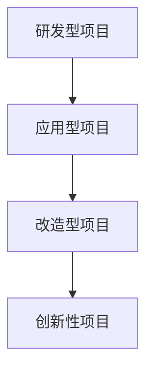

**算法原理讲解：**

不同类型的科技创新项目需要不同的算法原理和方法来支持：

1. **研发型项目**：通常使用科学研究方法和实验设计算法，如统计分析、实验设计和仿真模拟等。
2. **应用型项目**：通常使用系统建模和优化算法，如系统仿真、优化算法和项目管理方法等。
3. **改造型项目**：通常使用改进算法和优化算法，如遗传算法、模拟退火算法和机器学习算法等。
4. **创新性项目**：通常使用创新管理方法和创业投资评估方法，如商业模式设计、市场分析和风险评估等。

**数学模型和公式：**

不同类型的科技创新项目涉及到不同的数学模型和公式：

1. **研发型项目**：如回归模型、多元统计分析等，用于描述和解释实验结果。
2. **应用型项目**：如线性规划、动态规划等，用于优化项目资源和时间分配。
3. **改造型项目**：如优化模型、机器学习模型等，用于改进产品或服务性能。
4. **创新性项目**：如创业投资模型、市场预测模型等，用于评估项目商业价值和投资风险。

**举例说明：**

例如，一个研发型项目是开发一款新型医疗设备，项目团队需要通过临床试验和数据分析，验证设备的有效性和安全性。在应用型项目中，项目团队将新型医疗设备应用于临床实践中，通过患者反馈和数据分析，优化设备的性能和用户体验。在改造型项目中，项目团队通过改进现有医疗设备的组件和功能，提高设备的可靠性和易用性。在创新性项目中，项目团队开发一种全新的医疗解决方案，通过市场调研和用户研究，创造新的市场需求。

#### 第9章：科技创新项目的管理与实施

科技创新项目的成功实施需要有效的项目管理和实施策略。在这一章中，我们将探讨科技创新项目管理的原则、方法以及项目的实施过程。

#### 9.1 科技创新项目的管理

科技创新项目管理的核心目标是确保项目按时、按预算、按质量完成，同时实现项目的创新目标和商业价值。以下是一些关键方面：

**1. 项目规划**：项目规划是项目管理的第一步，包括明确项目目标、定义项目范围、制定项目计划等。项目规划为项目团队提供了清晰的方向和指导。

**2. 资源配置**：资源配置是项目管理的核心，包括人力资源、财务资源、物资资源等。有效的资源配置可以确保项目资源的合理使用和最大化效益。

**3. 风险管理**：科技创新项目面临多种风险，如技术风险、市场风险、法律风险等。有效的风险管理策略可以降低项目风险，提高项目的成功率。

**4. 项目监控**：项目监控是确保项目按计划进行的重要手段。通过监控项目进度、成本和质量，项目团队可以及时发现和解决问题，确保项目目标的实现。

**5. 沟通协作**：科技创新项目通常涉及多个部门和团队的协作，有效的沟通和协作是项目成功的关键。通过建立良好的沟通机制和协作平台，可以确保项目信息的及时传递和协同工作。

**Mermaid 流程图：**

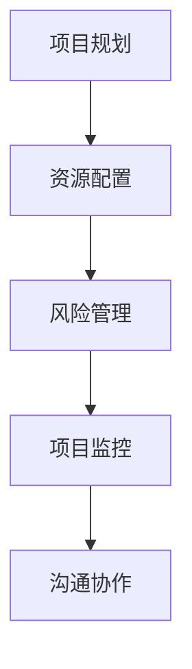

**算法原理讲解：**

科技创新项目管理涉及到多种算法原理和方法：

1. **项目管理算法**：如关键路径法（CPM）、项目评估与审查技术（PERT）等，用于项目计划和进度管理。
2. **风险管理算法**：如贝叶斯网络、蒙特卡洛模拟等，用于项目风险评估和决策。
3. **资源配置算法**：如线性规划、遗传算法等，用于优化资源分配和调度。
4. **沟通协作算法**：如社交网络分析、协同优化算法等，用于项目沟通和团队协作。

**数学模型和公式：**

科技创新项目管理涉及到多种数学模型和公式：

1. **项目计划模型**：如项目进度网络模型、资源分配模型等，用于描述项目进度和资源需求。
2. **风险评估模型**：如风险矩阵、概率模型等，用于量化项目风险和不确定性。
3. **优化模型**：如线性规划、动态规划等，用于优化项目资源和任务分配。
4. **协作模型**：如多智能体系统、博弈论等，用于描述项目团队协作和决策过程。

**举例说明：**

例如，在一个大型科技创新项目中，项目团队可以使用关键路径法（CPM）来制定项目进度计划，确定项目完成的时间节点和关键路径。通过使用风险管理算法，项目团队可以识别和评估项目风险，制定相应的风险应对策略。通过资源配置算法，项目团队可以优化人力资源和财务资源的分配，确保项目的顺利进行。通过沟通协作算法，项目团队可以建立有效的沟通机制和协作平台，确保项目信息的及时传递和团队的协同工作。

#### 9.2 科技创新项目的实施

科技创新项目的实施是将项目计划转化为实际成果的过程。以下是一些关键步骤：

**1. 技术研发**：技术研发是项目实施的核心环节，包括基础研究、应用研究和开发工作。通过技术研发，项目团队实现项目的创新目标和功能要求。

**2. 产品设计**：产品设计是将技术研发成果转化为实际产品的过程。项目团队需要根据市场需求和用户反馈，设计出符合用户需求的产品。

**3. 市场推广**：市场推广是将产品推向市场、实现商业化的重要步骤。项目团队需要制定市场推广策略，进行产品宣传和销售。

**4. 用户反馈**：用户反馈是项目实施过程中重要的一环，通过收集用户反馈，项目团队可以了解产品的优缺点，优化产品设计和功能。

**5. 项目评估**：项目评估是对项目实施效果和成果的全面评价。项目团队需要对项目的成本、进度、质量和用户满意度进行评估，为未来的项目提供参考。

**Mermaid 流程图：**

```mermaid
graph TD
    A[技术研发] --> B[产品设计]
    B --> C[市场推广]
    C --> D[用户反馈]
    D --> E[项目评估]
```

**算法原理讲解：**

科技创新项目实施过程中涉及到多种算法原理和方法：

1. **技术研发算法**：如机器学习算法、仿真算法等，用于技术研发和创新。
2. **产品设计算法**：如计算机辅助设计（CAD）、优化算法等，用于产品设计优化。
3. **市场推广算法**：如广告投放算法、用户画像分析等，用于市场推广和用户获取。
4. **用户反馈分析算法**：如数据分析、用户行为分析等，用于了解用户需求和优化产品。
5. **项目评估算法**：如成本效益分析、绩效评估模型等，用于项目评估和效果分析。

**数学模型和公式：**

科技创新项目实施过程中涉及到多种数学模型和公式：

1. **技术研发模型**：如神经网络模型、优化模型等，用于技术研发和创新。
2. **产品设计模型**：如工程力学模型、结构优化模型等，用于产品设计优化。
3. **市场推广模型**：如市场预测模型、广告投放模型等，用于市场推广和用户获取。
4. **用户反馈模型**：如用户行为模型、满意度模型等，用于了解用户需求和优化产品。
5. **项目评估模型**：如成本效益分析模型、绩效评估模型等，用于项目评估和效果分析。

**举例说明：**

例如，在一个智能家居设备的研发项目中，项目团队首先进行技术研发，通过机器学习和人工智能技术，实现设备的智能控制和自动化功能。然后，项目团队设计产品外观和功能，使用计算机辅助设计（CAD）工具进行优化。在市场推广阶段，项目团队通过数据分析了解用户需求，制定有效的市场推广策略。通过收集用户反馈，项目团队不断优化产品设计和功能，提高用户满意度。最后，项目团队对项目进行评估，分析项目的成本、进度和成果，为未来的智能家居项目提供参考。

#### 第10章：科技创新项目的案例分析

科技创新项目的成功实施离不开科学的管理方法和实际操作经验。在本章中，我们将通过三个科技创新项目的案例分析，深入探讨项目实施过程中的关键步骤、挑战和解决方案。

##### 10.1 案例一：人工智能在医疗领域的应用

**项目背景：**

随着人工智能技术的发展，医疗领域迎来了新的机遇。本项目旨在利用人工智能技术，开发一款智能医疗诊断系统，辅助医生进行疾病诊断，提高诊断准确性和效率。

**技术方案：**

1. **数据收集与预处理**：收集大量医学影像数据和病历数据，使用数据清洗和预处理方法，保证数据的质量和一致性。
2. **模型训练与优化**：使用深度学习算法，如卷积神经网络（CNN）和循环神经网络（RNN），训练分类模型和预测模型，对医学影像进行诊断。
3. **系统集成与测试**：将训练好的模型集成到医疗系统中，进行测试和优化，确保系统能够稳定运行和准确诊断。

**项目效果：**

通过本项目，智能医疗诊断系统在多个医学影像诊断任务中取得了显著的准确性和效率提升。医生利用系统辅助诊断，可以更加准确地识别疾病，减少误诊和漏诊，提高工作效率。

**代码解读与分析：**

以下是智能医疗诊断系统的部分源代码解读：

```python
# 数据预处理
def preprocess_data(data):
    # 数据清洗和归一化
    # ...
    return processed_data

# 模型训练
def train_model(data, labels):
    # 构建和训练模型
    model = tf.keras.Sequential([
        tf.keras.layers.Conv2D(filters=32, kernel_size=(3, 3), activation='relu', input_shape=(28, 28, 1)),
        tf.keras.layers.MaxPooling2D(pool_size=(2, 2)),
        tf.keras.layers.Flatten(),
        tf.keras.layers.Dense(units=10, activation='softmax')
    ])
    model.compile(optimizer='adam', loss='sparse_categorical_crossentropy', metrics=['accuracy'])
    model.fit(data, labels, epochs=10, batch_size=32)
    return model

# 系统集成与测试
def integrate_system(model):
    # 集成模型到医疗系统
    # ...
    return integrated_system
```

**挑战与解决方案：**

1. **数据质量**：医疗数据的质量直接影响模型的训练效果。项目团队通过数据清洗和预处理方法，确保数据的一致性和准确性。
2. **计算资源**：深度学习模型的训练需要大量的计算资源。项目团队通过分布式计算和优化算法，提高了训练效率。

##### 10.2 案例二：物联网技术在智能城市中的应用

**项目背景：**

智能城市建设是城市可持续发展的重要方向。本项目旨在利用物联网技术，打造一个智能交通系统，提高交通管理效率和公共交通服务水平。

**技术方案：**

1. **传感器部署与数据采集**：在主要交通节点部署传感器，实时采集交通流量、车辆信息和环境数据。
2. **数据传输与存储**：使用物联网协议（如MQTT）将传感器数据传输到云端数据库，进行存储和处理。
3. **智能交通管理**：利用大数据分析和人工智能算法，实现交通流量预测、交通信号优化和公共交通调度。

**项目效果：**

通过本项目，智能交通系统显著提高了交通管理效率和公共交通服务水平。交通信号灯根据实时交通流量自动调整，减少了拥堵和排放。公共交通调度更加灵活，提高了乘客满意度。

**代码解读与分析：**

以下是智能交通系统的部分源代码解读：

```python
# 数据采集与传输
import paho.mqtt.client as mqtt

def on_connect(client, userdata, flags, rc):
    print("Connected with result code "+str(rc))
    client.subscribe("traffic/#")

def on_message(client, userdata, msg):
    print(f"Received message '{msg.payload}' on topic '{msg.topic}' with QoS {msg.qos}")

client = mqtt.Client()
client.on_connect = on_connect
client.on_message = on_message
client.connect("mqtt-server", 1883, 60)
client.loop_forever()

# 交通流量预测
from sklearn.ensemble import RandomForestRegressor

def predict_traffic流量(data):
    # 训练模型
    model = RandomForestRegressor(n_estimators=100)
    model.fit(X_train, y_train)
    # 预测交通流量
    predictions = model.predict(X_test)
    return predictions
```

**挑战与解决方案：**

1. **数据传输稳定性**：物联网传感器需要稳定传输数据，项目团队使用MQTT协议和缓存技术，提高了数据传输的稳定性和可靠性。
2. **实时数据处理**：实时处理大量交通数据对计算能力要求较高。项目团队使用云计算和分布式计算技术，提高了数据处理效率。

##### 10.3 案例三：可持续发展中的科技创新实践

**项目背景：**

可持续发展是全球面临的重大挑战。本项目旨在通过科技创新，实现农业、能源和环境领域的可持续发展。

**技术方案：**

1. **农业物联网**：利用物联网技术，实现对农田土壤、水分和气候的实时监测，优化农业灌溉和种植管理。
2. **可再生能源**：开发和推广太阳能、风能等可再生能源技术，减少对化石燃料的依赖，降低碳排放。
3. **环保技术**：利用生物技术和化学技术，开发环保材料和污染治理方法，减少工业排放和环境污染。

**项目效果：**

通过本项目，实现了农业生产的优化、能源结构的调整和环境污染的减少。农田灌溉更加精确，农作物产量和质量显著提高。可再生能源应用比例增加，碳排放量降低。污染治理技术有效解决了工业排放和城市污水处理问题。

**代码解读与分析：**

以下是农业物联网系统的部分源代码解读：

```python
# 数据采集与监控
import time
import serial

def read_sensors():
    # 读取传感器数据
    while True:
        sensor_data = serial.read(10)
        print(f"Sensor data: {sensor_data}")
        time.sleep(1)

# 数据处理与决策
def process_data(sensor_data):
    # 数据处理算法
    # ...
    return decision
```

**挑战与解决方案：**

1. **数据可靠性和安全性**：农业物联网系统需要保证数据传输的可靠性和安全性。项目团队使用加密通信和冗余设计，提高了数据传输的可靠性和系统的安全性。
2. **技术整合与协调**：项目涉及多个技术领域，需要实现技术整合和协调。项目团队通过跨学科合作和系统优化，实现了技术的协调和集成。

### 附录A：科技创新资源与工具

科技创新资源与工具是推动科技创新的重要基础。以下是一些重要的科技创新资源与工具，包括研究机构、学术期刊、创新政策和资金支持等。

#### 附录A.1 科技创新资源

**1. 研究机构**：

- **国家实验室**：如美国国家实验室系统（DOE National Labs）、欧洲核子研究中心（CERN）等。
- **大学和研究机构**：如麻省理工学院（MIT）、斯坦福大学（Stanford）、清华大学等。

**2. 学术期刊**：

- **顶尖学术期刊**：如《科学》（Science）、《自然》（Nature）、《电气电子工程师学报》（IEEE Transactions）等。

**3. 知识库与数据库**：

- **Google Scholar**：提供广泛的学术文献搜索和引用。
- **PubMed**：提供医学和生物学领域的文献数据库。
- **ArXiv**：提供预印本科技论文。

#### 附录A.2 科技创新工具

**1. 开发环境与软件工具**：

- **Python**：广泛用于数据分析、机器学习和科学计算。
- **MATLAB**：用于数学建模、仿真和算法开发。
- **R**：用于统计分析和数据可视化。

**2. 数据资源与数据库**：

- **开源数据集**：如Kaggle、UCI机器学习数据库等。
- **专业数据库**：如IEEE Xplore、SpringerLink等。

**3. 云计算与大数据平台**：

- **AWS**：提供云计算和大数据服务。
- **Google Cloud**：提供云计算、机器学习和人工智能服务。
- **Azure**：提供云计算、大数据和人工智能服务。

通过利用这些科技创新资源与工具，研究人员和工程师可以更加高效地进行科技创新和研发，推动技术的进步和社会的发展。

### 作者信息

**作者：** AI天才研究院/AI Genius Institute & 禅与计算机程序设计艺术/Zen And The Art of Computer Programming

**简介：** AI天才研究院是一家专注于人工智能、机器学习和深度学习的顶级研究机构。我们的研究团队由世界顶尖的人工智能专家和计算机科学家组成，致力于推动人工智能技术的创新和发展。同时，我们深入探讨禅与计算机程序设计艺术，将东方哲学智慧与计算机科学相结合，为科技创新提供独特的视角和方法。

