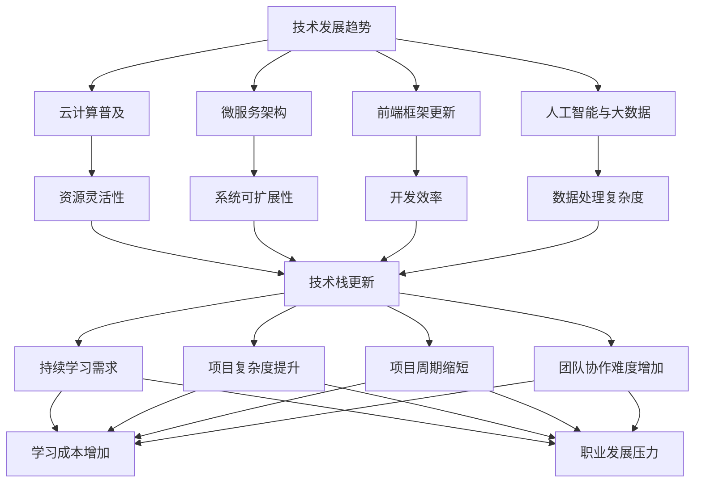

                 

# 《程序员如何应对技术栈快速更新》

## 关键词：技术栈、快速更新、学习策略、技术选型、CI/CD、代码质量、职业成长

### 摘要

在当今快速发展的技术环境中，程序员必须不断更新自己的技术栈以跟上行业步伐。本文旨在为程序员提供一套系统化的策略，帮助他们在面对技术栈快速更新的挑战时，能够保持专业竞争力。文章将探讨技术栈快速更新的背景与挑战，介绍学习新技术的策略与方法，讲解技术选型的决策过程，讨论技术栈管理的实践，并深入分析持续集成与持续部署（CI/CD）的实施方法。同时，文章还将探讨如何保持代码质量，以及程序员如何通过职业规划和社区参与实现持续成长。

---

## 引言

随着互联网和移动技术的迅猛发展，软件开发行业正经历着前所未有的变革。新的编程语言、框架、工具和平台不断涌现，技术栈的更新速度越来越快。对于程序员来说，这不仅是一个机遇，也是一个挑战。快速更新的技术栈要求程序员具备不断学习新技能、灵活适应新技术的能力。然而，对于很多程序员来说，面对如此多样的技术选择和快速变化的工作环境，如何高效地应对技术栈的快速更新成为了一项重要的任务。

本文将围绕以下几个核心问题展开讨论：

1. 技术栈快速更新的背景与挑战是什么？
2. 程序员应如何学习和掌握新技术？
3. 如何进行合理的技术选型？
4. 如何管理和优化技术栈？
5. 如何在技术更新的同时保持代码质量？
6. 程序员如何通过职业规划实现持续成长？

通过本文的探讨，希望能为程序员提供一套实用的策略，帮助他们更好地应对技术栈快速更新的挑战，保持自己在行业中的竞争力。

---

### 第一部分：应对技术栈快速更新的核心策略

在这一部分，我们将详细探讨程序员应对技术栈快速更新的核心策略。这些策略将帮助程序员系统地学习新技术，做出合理的技术选型，并有效地管理技术栈。以下是本部分的结构：

1. **技术栈快速更新的背景与挑战**
   - 探讨技术发展的趋势，分析技术栈快速更新的原因。
   - 分析程序员面临的技术更新挑战。

2. **学习新技术的策略与方法**
   - 介绍系统化学习方法论。
   - 讲解如何建立知识网络。
   - 探讨学习资源的选择与应用。

3. **技术选型的决策过程**
   - 分析技术选型的关键因素。
   - 讲解市场趋势分析的方法。
   - 讨论技术风险评估与应对。

4. **实践中的技术栈管理**
   - 讲解技术栈的架构设计。
   - 探讨技术栈的迭代与优化。
   - 讨论团队协作与知识共享。

5. **持续集成与持续部署（CI/CD）**
   - 介绍CI/CD的概念与优势。
   - 讲解CI/CD的实施步骤。
   - 分析CI/CD的常见问题和解决方案。

6. **技术更新与代码质量**
   - 讨论如何保持代码质量。
   - 介绍软件工程最佳实践。
   - 探讨代码审查与重构。

7. **职业成长与适应性提升**
   - 讲解职业规划与技能提升。
   - 讨论技术社区参与的重要性。
   - 分析适应快速变化的工作环境的方法。

通过上述策略，程序员可以更好地应对技术栈快速更新的挑战，保持自己在行业中的竞争力。

---

## 第1章: 技术栈快速更新的背景与挑战

### 1.1.1 技术发展的趋势

技术发展的趋势是技术栈快速更新的根本原因。随着互联网、云计算、大数据、人工智能等技术的不断演进，软件开发领域也在不断变革。以下是当前技术发展的几个主要趋势：

1. **云计算的普及**：云计算使得开发者和企业可以更加灵活地使用计算资源，不再受限于硬件和地理位置。云计算平台如AWS、Azure、Google Cloud等提供了丰富的服务，包括数据库、存储、AI、机器学习等，极大地推动了技术栈的更新。

2. **微服务架构**：微服务架构将大型单体应用拆分成多个小型、独立的服务，提高了系统的可扩展性、可靠性和维护性。随着容器技术如Docker和Kubernetes的兴起，微服务架构得到了广泛的应用。

3. **前端框架与库的更新**：前端技术的发展非常迅速，React、Vue、Angular等前端框架的不断更新，使得开发人员需要不断学习新的工具和技术。

4. **人工智能与大数据**：人工智能和大数据技术的快速发展，使得开发者在处理复杂数据分析和决策时，需要掌握新的算法和技术。

### 1.1.2 技术栈快速更新的影响

技术栈快速更新对程序员和开发项目都产生了深远的影响：

1. **持续学习需求增加**：程序员需要不断学习新技术和工具，以保持自身的竞争力。这种学习需求不仅仅是知识的更新，还包括技能的提升和实践经验的积累。

2. **项目复杂度提升**：随着技术的更新，项目的技术复杂性也在增加。程序员需要掌握更多的技术和工具，以便在项目中有效地应用。

3. **项目周期缩短**：快速更新的技术要求项目周期更加紧凑，程序员需要更快地适应新技术，并快速实现项目目标。

4. **团队协作难度增加**：不同的技术栈可能导致团队内部协作的难度增加，需要更多的沟通和协调。

### 1.1.3 程序员面临的挑战

面对技术栈的快速更新，程序员面临以下几大挑战：

1. **学习成本增加**：新技术和工具的学习需要时间和精力，程序员需要在日常工作中挤出时间进行学习。

2. **技能迁移困难**：某些新技术可能与现有技能存在较大差异，程序员需要投入更多时间和努力来适应新环境。

3. **项目风险增加**：技术更新可能导致项目出现不稳定因素，程序员需要应对更多技术风险。

4. **职业发展压力**：技术更新速度越快，程序员面临的职业发展压力也越大。如果无法跟上行业步伐，可能会被淘汰。

总之，技术栈的快速更新为程序员带来了新的机遇和挑战。了解技术发展的趋势，分析技术更新的影响，并积极应对面临的挑战，是程序员保持竞争力的关键。

### 1.1.4 技术栈快速更新的核心概念与联系

为了更好地理解技术栈快速更新的背景与挑战，我们可以通过一个Mermaid流程图来展示相关核心概念和它们之间的联系：



这个流程图清晰地展示了技术发展的趋势是如何推动技术栈的快速更新，以及技术更新对程序员和项目的各种影响。

---

## 第2章: 学习新技术的策略与方法

### 2.1.1 系统化学习方法论

面对技术栈的快速更新，程序员需要掌握一套系统化的学习方法论，以提高学习效率和效果。以下是几个关键的学习方法论：

1. **分阶段学习**：将学习过程分为准备阶段、执行阶段和总结阶段。准备阶段主要是熟悉学习目标和要求，执行阶段是进行具体学习活动，总结阶段是对所学内容进行回顾和总结。

2. **主动学习**：主动学习比被动学习更有效。程序员应该积极参与到学习过程中，通过实验、实践和问题解决来加深对知识的理解。

3. **深度学习**：深度学习强调对知识进行深入理解和掌握，而不是仅仅停留在表面。程序员应该通过阅读深入的技术文档、参与技术讨论和编写代码来实现深度学习。

4. **反思学习**：学习过程中的反思至关重要。程序员应该定期回顾自己的学习过程，识别学习中的问题和不足，并制定改进措施。

### 2.1.2 建立知识网络

建立知识网络是高效学习的关键。以下是几个建立知识网络的方法：

1. **概念图**：使用概念图来组织和连接不同的知识点，可以帮助程序员理清知识结构，发现知识点之间的联系。

2. **思维导图**：思维导图是一种图形化的学习工具，可以用来表示复杂的概念和知识点，有助于程序员从宏观角度理解和记忆。

3. **案例学习**：通过分析具体的技术案例，程序员可以更好地理解理论知识在实际中的应用。案例学习不仅有助于理解技术，还可以提高解决实际问题的能力。

4. **讨论与交流**：与同行和技术社区进行讨论和交流，可以拓宽知识视野，获取不同的观点和见解。

### 2.1.3 学习资源的选择与应用

选择合适的资源是学习新技术的关键。以下是几种常见的学习资源及其应用方法：

1. **技术书籍**：技术书籍是学习新技术的重要资源。选择高质量的书籍，如经典教材或最新出版的技术书籍，可以系统性地学习知识。

2. **在线课程**：在线课程提供了灵活的学习时间和丰富的内容，是学习新技术的好选择。选择课程时，应考虑课程的完整性、实用性和教师的资质。

3. **博客与文档**：技术博客和官方文档是学习新技术的重要来源。程序员应关注知名博客作者和官方文档，获取最新的技术信息和最佳实践。

4. **开源项目**：参与开源项目不仅可以学习最新的技术，还可以锻炼实际编程能力。通过阅读开源项目的代码，程序员可以了解不同的编程风格和技术应用。

5. **技术社区**：技术社区提供了交流和学习的平台。程序员可以通过参加技术会议、论坛和社交媒体，与同行交流心得，分享经验。

通过系统化学习方法论、建立知识网络和合理选择学习资源，程序员可以更高效地学习新技术，提高自身技能水平。

### 2.1.4 学习新技术的伪代码示例

为了更好地展示学习新技术的策略与方法，我们可以通过一个伪代码示例来解释如何系统地学习一个新技术，如React框架。

```plaintext
// 伪代码：学习React框架的过程

// 准备阶段
SET learningGoal("掌握React框架的核心概念与使用")
SET learningResources(["React官方文档", "在线课程", "开源项目"])

// 执行阶段
1. 阅读React官方文档，熟悉React的基础概念和API
2. 参加React在线课程，学习React的实战技巧
3. 参与React开源项目，实际操作React的用法
4. 定期总结学习笔记，加深对React的理解

// 总结阶段
1. 回顾学习过程，识别学习中的问题和不足
2. 制定改进措施，如补充阅读其他相关书籍
3. 撰写学习报告，分享学习心得
4. 实践中不断应用React，巩固所学知识

// 反思学习
1. 定期评估学习效果，确保达到学习目标
2. 调整学习计划，优化学习效率
3. 与同行交流，获取不同的观点和见解
4. 遇到问题时，主动寻求解决方案
```

通过这个伪代码示例，我们可以看到如何通过分阶段学习、主动学习、深度学习和反思学习来系统地学习React框架。这种系统化的学习方法论可以帮助程序员更高效地掌握新技术。

---

## 第3章: 技术选型的决策过程

技术选型是软件开发过程中至关重要的一环，直接影响到项目的成功与否。在面对多种技术选择时，程序员需要明确关键因素，进行市场趋势分析，并评估技术风险。以下是技术选型的决策过程：

### 3.1.1 技术选型的关键因素

在进行技术选型时，程序员需要考虑以下几个关键因素：

1. **项目需求**：首先，要明确项目的具体需求，包括功能需求、性能需求、可扩展性需求等。技术选型应与项目需求紧密匹配。

2. **开发效率**：高效的技术栈可以提高开发效率，减少开发周期。需要评估不同技术栈的开发工具、框架和库的易用性和效率。

3. **社区支持**：活跃的技术社区可以提供丰富的资源和支持，包括文档、教程、开源项目等。技术选型应考虑社区的活跃程度和支持力度。

4. **生态系统**：良好的生态系统包括库、工具、平台和服务等，可以提供全面的支持。程序员应评估所选技术的生态系统是否完善。

5. **可维护性**：技术栈的可维护性是长期项目成功的关键。需要评估技术的稳定性、兼容性和文档质量。

6. **成本**：技术选型应考虑成本，包括开发成本、维护成本和培训成本等。

### 3.1.2 市场趋势分析

了解市场趋势是进行技术选型的重要步骤。以下是几种市场趋势分析的方法：

1. **行业报告**：通过查阅行业报告，了解当前技术趋势和市场动向。例如，Gartner的魔力象限、Forrester的报告等。

2. **技术社区**：关注技术社区的讨论和趋势，例如GitHub上的热门项目、Stack Overflow上的热门话题等。

3. **会议和研讨会**：参加技术会议和研讨会，与行业专家和开发者交流，了解最新的技术动态和趋势。

4. **咨询公司**：咨询公司的报告和洞察可以提供专业的市场趋势分析。

### 3.1.3 技术风险评估与应对

技术选型过程中，不可避免地会面临技术风险。以下是几种技术风险评估与应对方法：

1. **风险评估**：对所选技术进行风险评估，包括技术稳定性、安全性、兼容性等方面。可以使用风险矩阵进行评估。

2. **技术调研**：对所选技术进行深入研究，包括阅读技术文档、参与开源项目、试用产品等。

3. **备份方案**：为应对技术风险，应制定备份方案，例如选择多个备选技术或准备快速切换技术的能力。

4. **风险管理计划**：制定风险管理计划，明确风险识别、评估、监控和应对措施。

通过明确技术选型的关键因素、进行市场趋势分析和评估技术风险，程序员可以做出合理的技术选型决策，确保项目的成功实施。

### 3.1.4 技术选型决策的伪代码示例

下面通过一个伪代码示例来解释技术选型决策的过程：

```plaintext
// 伪代码：技术选型决策过程

// 输入：项目需求，开发效率，社区支持，生态系统，可维护性，成本
// 输出：最佳技术选型

// 步骤1：收集信息
收集项目需求
收集开发效率信息
收集社区支持信息
收集生态系统信息
收集可维护性信息
收集成本信息

// 步骤2：评估每个技术的得分
评估每个技术栈的项目需求得分
评估每个技术栈的开发效率得分
评估每个技术栈的社区支持得分
评估每个技术栈的生态系统得分
评估每个技术栈的可维护性得分
评估每个技术栈的成本得分

// 步骤3：计算总得分
计算每个技术栈的总得分
排序技术栈的总得分

// 步骤4：决策
选择总得分最高的技术栈作为最佳技术选型
记录决策理由和风险

// 步骤5：备选方案
为每个技术栈准备备选方案
评估备选方案的风险和成本
```

通过这个伪代码示例，我们可以看到如何通过系统化的方法进行技术选型决策。首先收集相关信息，然后对每个技术栈进行评估和得分，最后选择最佳技术选型，并准备备选方案以应对可能的风险。

---

## 第4章: 实践中的技术栈管理

### 4.1.1 技术栈的架构设计

技术栈的架构设计是确保系统高效、可靠运行的关键。以下是技术栈架构设计的关键原则和步骤：

1. **模块化设计**：将系统拆分为多个独立的模块，每个模块负责特定的功能。模块之间通过接口进行通信，降低了系统的耦合度。

2. **分层架构**：采用分层架构，例如MVC（模型-视图-控制器）或微服务架构，将系统划分为不同的层次，每层负责不同的职责。常见的层次包括表示层、业务逻辑层、数据访问层等。

3. **分布式架构**：对于大型系统，采用分布式架构可以提高系统的可扩展性和容错性。分布式架构包括服务拆分、负载均衡、分布式存储和缓存等。

4. **设计原则**：
   - **单一职责原则**：每个模块应只负责一项职责，避免功能重叠。
   - **开闭原则**：系统应易于扩展，但无需修改原有代码。
   - **依赖倒置原则**：高层模块不应依赖于低层模块，两者应通过抽象接口进行通信。
   - **里氏替换原则**：任何可使用基类对象的地方，都能使用其子类对象。

### 4.1.2 技术栈的迭代与优化

技术栈的迭代与优化是确保系统持续改进的重要环节。以下是几个关键步骤：

1. **持续集成与持续部署（CI/CD）**：通过CI/CD工具，如Jenkins、GitLab CI等，实现自动化构建、测试和部署。CI/CD有助于快速迭代和降低部署风险。

2. **性能监控与调优**：使用性能监控工具，如New Relic、Prometheus等，实时监控系统的性能指标。根据监控数据，进行性能分析和调优。

3. **代码质量保障**：通过代码审查、静态代码分析工具（如SonarQube）、单元测试和集成测试等手段，确保代码质量。

4. **技术债务管理**：定期评估和修复技术债务，避免积累过多的遗留问题。技术债务管理包括代码重构、技术升级和优化。

5. **技术调研与引入**：定期调研新技术和工具，根据项目需求和技术发展，引入合适的新技术，以提升系统的性能和可维护性。

### 4.1.3 团队协作与知识共享

有效的团队协作和知识共享是技术栈管理的重要组成部分。以下是几个关键措施：

1. **敏捷开发**：采用敏捷开发方法，如Scrum或Kanban，提高团队的协作效率和响应速度。

2. **文档管理**：建立完善的文档管理体系，包括技术文档、用户文档和操作手册等。确保文档及时更新，方便团队成员查阅。

3. **代码库管理**：使用Git等版本控制系统，管理代码库，确保代码的版本管理和协作开发。

4. **知识分享会**：定期组织知识分享会，团队成员可以分享自己的经验和学习心得，促进团队的知识共享和技能提升。

5. **社区参与**：鼓励团队成员参与技术社区，包括开源项目和技术论坛，提高技术视野和影响力。

通过合理的架构设计、迭代与优化，以及有效的团队协作与知识共享，程序员可以更好地管理技术栈，确保系统的稳定和高效运行。

### 4.1.4 技术栈管理流程的Mermaid流程图

为了更好地理解技术栈管理的流程，我们可以通过一个Mermaid流程图来展示：

```mermaid
graph TD

A[项目启动] --> B[需求分析]
B --> C[架构设计]
C --> D[技术选型]
D --> E[搭建开发环境]
E --> F[代码库初始化]
F --> G[版本控制]
G --> H[持续集成与持续部署]
H --> I[性能监控与调优]
I --> J[代码质量保障]
J --> K[技术债务管理]
K --> L[团队协作与知识共享]
L --> M[迭代与优化]
M --> N[项目交付]

subgraph 技术栈管理流程
    A[项目启动]
    B[需求分析]
    C[架构设计]
    D[技术选型]
    E[搭建开发环境]
    F[代码库初始化]
    G[版本控制]
    H[持续集成与持续部署]
    I[性能监控与调优]
    J[代码质量保障]
    K[技术债务管理]
    L[团队协作与知识共享]
    M[迭代与优化]
    N[项目交付]
end
```



这个流程图详细展示了从项目启动到项目交付的技术栈管理流程，包括需求分析、架构设计、技术选型、搭建开发环境、代码库初始化、版本控制、持续集成与持续部署、性能监控与调优、代码质量保障、技术债务管理、团队协作与知识共享，以及迭代与优化等关键步骤。

---

## 第5章: 持续集成与持续部署（CI/CD）

### 5.1.1 CI/CD 的概念与优势

持续集成（Continuous Integration，CI）和持续部署（Continuous Deployment，CD）是现代软件开发中至关重要的一环。CI/CD不仅提高了开发效率，还显著降低了软件发布的风险。以下是CI/CD的基本概念和优势：

1. **CI 的概念**：CI 是指通过自动化工具，将开发人员的代码定期合并到主干分支，并进行自动化测试，确保代码的集成不会产生冲突或错误。

2. **CD 的概念**：CD 是指在CI的基础上，通过自动化工具将经过CI测试的代码部署到生产环境，实现持续部署。

3. **CI/CD 的优势**：
   - **快速反馈**：通过CI，开发人员可以立即得知代码集成中的问题，从而迅速修复，减少“延迟反馈”带来的风险。
   - **提高代码质量**：频繁的集成和测试有助于发现和修复缺陷，提高软件质量。
   - **减少发布风险**：自动化测试和部署降低了人为错误的可能性，降低了发布风险。
   - **加速迭代**：CI/CD 支持快速迭代和交付，缩短了软件开发周期。
   - **协作效率**：CI/CD 强化了团队协作，促进代码的共享和复用。

### 5.1.2 CI/CD 的实施步骤

实施CI/CD需要一系列的工具和流程。以下是CI/CD的基本实施步骤：

1. **环境搭建**：搭建开发、测试和生产环境，确保所有环境一致。

2. **代码仓库**：选择合适的版本控制系统（如Git），管理代码仓库，确保代码的版本和变更历史清晰。

3. **构建工具**：选择合适的构建工具（如Maven、Gradle），自动化构建项目，生成可执行的软件包。

4. **测试**：编写单元测试、集成测试和端到端测试，使用自动化测试工具（如JUnit、Selenium）运行测试。

5. **持续集成服务器**：部署CI服务器（如Jenkins、GitLab CI），配置自动化构建和测试流程。

6. **部署脚本**：编写部署脚本，自动化部署软件包到测试环境和生产环境。

7. **监控与反馈**：配置监控工具，实时监控系统的性能和健康状况，并设置告警机制。

8. **持续改进**：定期回顾CI/CD流程，识别和解决存在的问题，持续优化流程。

### 5.1.3 CI/CD 的常见问题和解决方案

在实施CI/CD的过程中，可能会遇到一些常见问题。以下是几个问题和相应的解决方案：

1. **构建失败**：构建失败可能是由于依赖库冲突、配置错误或代码问题导致的。解决方案包括仔细检查依赖库的版本、配置文件和代码，确保它们是正确的。

2. **测试覆盖不足**：如果测试覆盖不足，可能需要增加测试用例，覆盖更多的代码路径。可以使用代码覆盖率工具（如JaCoCo）来评估测试覆盖率。

3. **部署失败**：部署失败可能是由于网络问题、权限问题或部署脚本错误导致的。解决方案包括确保网络连接稳定、检查部署脚本和权限设置。

4. **性能问题**：在CI/CD环境中，可能会出现性能问题，如构建时间过长、测试速度慢等。解决方案包括优化构建和测试脚本、提高服务器性能。

5. **安全漏洞**：CI/CD环境可能存在安全漏洞，如配置错误、代码泄露等。解决方案包括加强安全配置、定期进行安全审计。

通过理解CI/CD的概念、实施步骤和常见问题，程序员可以更好地实施CI/CD流程，提高开发效率和软件质量。

### 5.1.4 CI/CD 实施的伪代码示例

为了更好地展示CI/CD的实施过程，我们可以通过一个伪代码示例来解释：

```plaintext
// 伪代码：CI/CD 实施过程

// 步骤1：环境搭建
SET devEnv(["开发服务器", "测试服务器", "生产服务器"])
SET tools(["Git", "Maven", "Jenkins", "JUnit"])

// 步骤2：代码仓库
INIT_GIT_REPO("my-project")
ADD_DEVELOPERS_TO_REPO(["dev1", "dev2", "dev3"])

// 步骤3：构建
RUN_MAVEN_BUILD("my-project")
CHECK_MAVEN_BUILD_RESULT()

// 步骤4：测试
RUN_JUNIT_TESTS("my-project")
CHECK_JUNIT_TESTS_COVERAGE()

// 步骤5：持续集成
CONFIGURE_JENKINS_JOB("CI Job", ["Git", "Maven", "JUnit"])
RUN_JENKINS_JOB("CI Job")

// 步骤6：部署
CONFIGURE_DEPLOYMENT_SCRIPT("my-project")
DEPLOY_TO_TEST_ENVIRONMENT("my-project")
DEPLOY_TO_PRODUCTION_ENVIRONMENT("my-project")

// 步骤7：监控与反馈
SETUP_MONITORING_TOOLS(["New Relic", "Prometheus"])
CONFIGURE_ALERTS("my-project")
CHECK_SYSTEM_HEALTH()

// 步骤8：持续改进
REVIEW_CI_CD_PROCESS()
OPTIMIZE_CI_CD_PIPELINE()
UPGRADE_TO_NEW_TOOLS()
```

通过这个伪代码示例，我们可以看到CI/CD的实施过程包括环境搭建、代码仓库管理、构建、测试、持续集成、部署、监控与反馈以及持续改进等关键步骤。每个步骤都有详细的伪代码描述，帮助程序员更好地理解CI/CD的实施过程。

---

## 第6章: 技术更新与代码质量

在技术不断更新的环境中，如何保持代码质量是一个至关重要的挑战。技术更新可能导致代码库变得复杂和混乱，但如果能够遵循一系列的最佳实践，程序员可以确保新技术的引入不会影响代码的质量。

### 6.1.1 更新技术的同时保持代码质量

1. **代码审查**：代码审查是一种有效的质量保证方法。通过同行评审，可以及早发现和修复代码中的错误和缺陷。代码审查不仅有助于提高代码质量，还能促进团队成员之间的知识共享和协作。

2. **单元测试**：单元测试是对代码最小可测试部分（通常是函数或方法）的测试。通过编写和执行单元测试，可以确保代码的功能正确，并在引入新技术时快速发现潜在的缺陷。

3. **持续集成**：持续集成（CI）确保每次代码提交后都进行自动化测试，从而在早期发现和解决集成问题。CI工具可以自动化构建、测试和部署流程，从而确保代码的质量和一致性。

4. **代码质量工具**：使用静态代码分析工具（如SonarQube）可以自动化检测代码中的潜在问题，如重复代码、性能瓶颈和潜在的bug。这些工具可以帮助程序员在代码提交前及时发现和修复问题。

### 6.1.2 软件工程最佳实践

遵循软件工程的最佳实践是保持代码质量的关键。以下是一些重要的最佳实践：

1. **编码规范**：制定和遵循统一的编码规范，确保代码的可读性和一致性。这有助于减少因代码风格不一致而产生的错误。

2. **代码重构**：定期进行代码重构，优化代码结构，提高代码的可读性和可维护性。代码重构有助于消除技术债务，并确保代码适应新技术的引入。

3. **设计模式**：使用设计模式可以解决常见的设计问题，提高代码的可复用性和可维护性。例如，使用工厂模式、策略模式或观察者模式可以提高代码的模块化和灵活性。

4. **文档化**：为代码编写清晰的文档，包括注释和API文档，以便其他开发者能够轻松理解和使用代码。良好的文档可以提高代码的可维护性和可理解性。

### 6.1.3 代码审查与重构

代码审查和重构是确保代码质量的重要手段。以下是几个关键步骤：

1. **定期审查**：定期进行代码审查，通常在每个迭代或发布周期结束时进行。这有助于确保代码质量得到持续监控和改进。

2. **审查流程**：审查流程应包括代码审查会议、审查任务分配和反馈机制。在审查会议中，团队成员共同讨论代码的问题和改进建议。

3. **反馈机制**：审查后的反馈应详细记录，并分配给相应的开发者进行修复。反馈应具体、明确，并提供改进建议。

4. **重构**：在代码审查过程中，如果发现代码结构或设计问题，应进行重构。重构应遵循逐步改进的原则，避免大规模修改导致的风险。

通过遵循这些最佳实践，程序员可以在技术更新的同时保持代码质量，确保项目的稳定和可靠。

### 6.1.4 代码质量保障的数学模型与公式

为了量化代码质量，我们可以使用几个数学模型和公式。以下是一个简单的代码质量评估模型：

$$
Q = f(C, T, R)
$$

其中：
- \( Q \) 表示代码质量
- \( C \) 表示代码复杂度
- \( T \) 表示测试覆盖率
- \( R \) 表示代码重构频率

**代码复杂度（C）**：代码复杂度是衡量代码复杂程度的指标。我们可以使用圈复杂度（Cyclomatic Complexity）来评估代码复杂度。圈复杂度计算公式如下：

$$
CC = E - N + (2P)
$$

其中：
- \( E \) 表示边的数量
- \( N \) 表示节点的数量
- \( P \) 表示边的数量（对于控制流图）

**测试覆盖率（T）**：测试覆盖率衡量测试用例对代码的覆盖程度。常见的测试覆盖率指标包括单元测试覆盖率、语句覆盖率、分支覆盖率和路径覆盖率。公式如下：

$$
T = \frac{TC}{TCM} \times 100\%
$$

其中：
- \( TC \) 表示实际覆盖的代码行数
- \( TCM \) 表示总代码行数

**代码重构频率（R）**：代码重构频率是衡量开发者重构代码的频率。高重构频率表明开发者关注代码质量，并持续优化代码结构。重构频率可以通过以下公式计算：

$$
R = \frac{R_c}{T_c} \times 100\%
$$

其中：
- \( R_c \) 表示重构次数
- \( T_c \) 表示开发周期

通过这些数学模型和公式，我们可以量化代码质量，并在技术更新的过程中进行持续监控和优化。

### 6.1.5 保持代码质量的实际案例

为了更好地理解保持代码质量的方法，我们可以通过一个实际案例来展示如何在实际项目中应用这些方法。

**案例背景**：一个电子商务平台的项目需要引入新的支付网关，以提高支付处理的速度和安全性。

**步骤1：代码审查**：
- 代码审查小组由资深开发人员和测试人员组成。
- 在引入新支付网关之前，对现有支付相关的代码进行详细审查。
- 发现多个潜在问题，如旧支付网关的代码冗余、安全性漏洞等。

**步骤2：单元测试**：
- 编写新的单元测试用例，覆盖支付网关的所有功能点。
- 使用测试框架（如JUnit）执行测试，确保新支付网关的功能正确。

**步骤3：持续集成**：
- 在CI服务器（如Jenkins）上配置支付网关的自动化构建和测试流程。
- 每次代码提交后，自动构建和测试，确保新支付网关的稳定性。

**步骤4：代码重构**：
- 根据代码审查和测试结果，对支付网关的代码进行重构。
- 优化代码结构，提高可读性和可维护性。
- 实施设计模式，如策略模式，以支持多种支付网关的灵活切换。

**步骤5：文档化**：
- 为新支付网关编写详细的API文档和用户指南。
- 确保文档更新与代码同步，便于其他开发者使用。

**结果**：
- 通过上述步骤，新支付网关的引入没有影响现有系统的稳定性。
- 代码质量得到显著提升，代码复杂度降低，测试覆盖率提高。
- 项目的交付周期缩短，同时确保了支付处理的安全性和效率。

通过这个实际案例，我们可以看到如何在实际项目中应用代码质量保障的方法，确保技术更新不会影响代码质量。

---

## 第7章: 职业成长与适应性提升

### 7.1.1 职业规划与技能提升

在快速变化的技术环境中，程序员需要通过明确的职业规划和持续的技能提升来保持竞争力。以下是职业规划和技能提升的关键步骤：

1. **设定目标**：明确职业目标，包括短期和长期目标。短期目标可能包括学习一项新技术或掌握一个新的开发工具，而长期目标可能是一个更高的职位或技术领域的专家。

2. **评估自身技能**：定期评估自己的技能水平，了解自己在哪些领域有优势，哪些领域需要提升。可以通过参加技能评估工具（如GitHub Starred Repos、Stack Overflow Profile）来评估技能。

3. **制定学习计划**：根据评估结果，制定详细的学习计划。学习计划应包括学习目标、学习资源、学习时间和预期成果。

4. **持续学习**：利用在线课程、技术书籍、博客和开源项目等资源进行学习。参加线上和线下培训课程，不断更新知识和技能。

5. **实践应用**：通过实际项目来应用所学知识，提高实践能力和解决问题的能力。参与开源项目是很好的实践机会，可以锻炼团队协作能力和项目管理能力。

6. **职业认证**：获得行业认可的证书，如PMP（项目管理专业认证）、AWS Certified Solutions Architect等，可以提高职业竞争力。

### 7.1.2 技术社区参与

技术社区是程序员提升技能和建立人脉的重要途径。以下是参与技术社区的几个关键方法：

1. **分享知识**：在博客、社交媒体或技术论坛上分享自己的技术心得和经验，帮助他人解决问题，同时提升自己的表达能力和知识深度。

2. **参与讨论**：积极参与技术社区的讨论，包括Stack Overflow、GitHub、Reddit等技术论坛。在讨论中，不仅可以学习他人的经验，还可以展示自己的技术见解。

3. **开源贡献**：参与开源项目，通过代码贡献来提升自己的编程技能。开源项目提供了一个实践平台，可以学习最佳编程实践和团队合作技巧。

4. **组织活动**：组织或参加技术会议、研讨会、代码审查会议等活动，与同行交流，分享经验，拓展人脉。

5. **建立个人品牌**：在技术社区中建立个人品牌，通过撰写高质量的技术文章、参与开源项目、分享演讲等方式，提高自己的知名度和影响力。

### 7.1.3 适应快速变化的工作环境

快速变化的工作环境要求程序员具备高度的适应能力和学习能力。以下是几个适应快速变化的方法：

1. **灵活性和适应性**：培养灵活性和适应性，能够快速适应新的工作环境和项目需求。

2. **持续学习**：保持持续学习的态度，不断更新知识和技能，跟上行业的发展。

3. **项目管理能力**：提升项目管理能力，包括任务规划、资源管理、风险管理等，以确保项目能够在快速变化的环境中成功交付。

4. **沟通能力**：提高沟通能力，确保团队成员之间能够有效地沟通和协作，共同应对变化。

5. **创新思维**：培养创新思维，能够在变化中发现新的机会和解决方案。

通过明确的职业规划、参与技术社区和适应快速变化的工作环境，程序员可以不断提升自己的竞争力，保持职业成长。

### 7.1.4 职业成长与适应性提升的伪代码示例

为了更好地展示职业成长与适应性提升的方法，我们可以通过一个伪代码示例来解释：

```plaintext
// 伪代码：职业成长与适应性提升

// 步骤1：设定目标
SET shortTermGoal("学习Docker")
SET longTermGoal("成为云计算专家")

// 步骤2：评估自身技能
EVALUATE_CURRENT_SKILLS()
GET_SKILLS_RATING()

// 步骤3：制定学习计划
CREATE_LEARNING_PLAN("Docker", ["在线课程", "实践项目"])
CREATE_LEARNING_PLAN("云计算", ["AWS认证", "云计算研讨会"])

// 步骤4：持续学习
LEARN_DOCKER()
LEARN_CLOUD_COMPUTING()

// 步骤5：实践应用
IMPLEMENT_DOCKER_IN_PROJECT("my-project")
IMPLEMENT_CLOUD_COMPUTING_IN_PROJECT("cloud-service")

// 步骤6：参与技术社区
PARTICIPATE_IN_COMMUNITY("Stack Overflow")
PARTICIPATE_IN_COMMUNITY("GitHub")

// 步骤7：获取认证
GET_AWS_CERTIFIED()
GET_PMP_CERTIFIED()

// 步骤8：适应快速变化
DEVELOP_FLEXIBILITY()
DEVELOP_INNOVATIVE THINKING()

// 步骤9：持续评估和改进
PERFORM_SELF_ASSESSMENT()
ADJUST_LEARNING_PLAN_AS_NEEDED()

// 步骤10：职业发展
ADVANCE_IN_CAREER("Solutions Architect")
```

通过这个伪代码示例，我们可以看到如何通过设定目标、评估技能、制定学习计划、持续学习、实践应用、参与技术社区、获取认证、适应快速变化以及持续评估和改进来提升职业成长和适应性。

---

## 第二部分：技术栈快速更新的案例与实践

在本文的第二部分，我们将通过具体案例和实践，深入探讨程序员如何应对技术栈快速更新的挑战。这些案例将涵盖从传统开发模式到现代微服务架构的转型、单体应用到容器化应用的迁移、以及从本地数据库到云数据库的迁移等内容。通过这些实际案例，读者可以了解如何在具体项目中实施技术更新，并掌握相关技术。

### 8章：技术栈更新实践案例

#### 8.1.1 案例一：从传统开发模式到微服务架构的转型

**背景**：一个大型电商平台在业务快速发展过程中，发现传统的单体架构无法满足高并发、高可扩展性的需求。为了应对这些挑战，决定从传统开发模式转型到微服务架构。

**技术选型**：
- **服务拆分**：将单体应用拆分为多个独立的服务，每个服务负责特定的业务功能，如用户管理、订单处理、库存管理等。
- **服务通信**：采用RESTful API或gRPC进行服务间的通信。
- **容器化**：使用Docker将每个服务容器化，提高部署和扩展的灵活性。
- **服务注册与发现**：使用Eureka或Consul实现服务注册与发现，确保服务之间的动态通信。

**实施步骤**：
1. **需求分析**：详细分析现有系统，确定需要拆分的服务模块。
2. **设计阶段**：设计微服务架构，定义服务接口和数据模型。
3. **开发阶段**：分别开发每个微服务，确保接口的稳定性和兼容性。
4. **测试阶段**：进行集成测试，确保服务之间的通信和功能正确。
5. **部署阶段**：使用容器化技术部署微服务，确保高效和灵活的部署。
6. **运维阶段**：采用自动化运维工具，如Kubernetes，管理微服务的生命周期和扩展。

**结果**：
- 系统的高并发处理能力显著提升。
- 服务部署和扩展更加灵活，缩短了部署周期。
- 通过服务拆分，提升了系统的可维护性和可扩展性。

#### 8.1.2 案例二：从单体应用到容器化应用的迁移

**背景**：一个中小型企业为了提高应用的部署效率和可扩展性，决定将现有的单体应用迁移到容器化架构。

**技术选型**：
- **容器化工具**：选择Docker作为容器化工具。
- **容器编排**：使用Kubernetes进行容器编排和管理。
- **持续集成与部署**：采用Jenkins实现持续集成与持续部署（CI/CD）。

**实施步骤**：
1. **需求分析**：评估现有单体应用的架构和代码，确定需要优化的部分。
2. **容器化**：将应用容器化，创建Dockerfile，确保应用的独立性和可移植性。
3. **集成CI/CD**：配置Jenkins，实现自动化构建、测试和部署。
4. **部署**：使用Kubernetes进行容器编排，部署容器化应用。
5. **监控与优化**：使用Prometheus和Grafana进行系统监控，实时跟踪应用性能。
6. **测试与验证**：进行全面的测试，确保容器化应用的功能和性能符合预期。

**结果**：
- 应用部署时间从数小时减少到几分钟，显著提高了部署效率。
- 容器化应用的可扩展性提升，可以轻松应对高并发场景。
- 通过CI/CD流程，确保了代码质量和部署的稳定性。

#### 8.1.3 案例三：从本地数据库到云数据库的迁移

**背景**：一个初创公司为了降低成本和提高数据可靠性，决定将现有的本地数据库迁移到云数据库。

**技术选型**：
- **云数据库**：选择AWS RDS（关系数据库服务）或Google Cloud SQL（关系数据库服务）。
- **迁移工具**：使用AWS Database Migration Service或Google Cloud's Database Migration Service进行数据迁移。

**实施步骤**：
1. **需求分析**：评估现有数据库的使用情况，确定需要迁移的数据和数据库类型。
2. **备份**：在迁移前，对现有数据库进行备份，以防迁移过程中出现数据丢失。
3. **迁移**：使用迁移工具将数据从本地数据库迁移到云数据库。在迁移过程中，确保数据的一致性和完整性。
4. **测试**：在云数据库上运行测试，确保数据迁移后的功能正确性和性能。
5. **部署**：将应用部署到云环境，确保应用与云数据库的兼容性。
6. **监控与优化**：使用云数据库提供的监控工具，实时监控数据库性能，并针对性能瓶颈进行优化。

**结果**：
- 数据库运行成本显著降低，同时享受云数据库的高可用性和可靠性。
- 数据迁移过程中，数据的一致性和完整性得到保证。
- 通过云数据库的自动化管理和优化，提升了系统的性能和可维护性。

通过这些实际案例，我们可以看到如何在不同场景下实施技术栈的更新。这些案例不仅展示了技术更新的具体步骤和策略，还提供了实践中的经验和教训，帮助程序员更好地应对技术栈快速更新的挑战。

### 9章：技术栈更新项目实战

在本文的第三部分，我们将通过几个具体的项目实战，深入探讨如何在实际开发过程中进行技术栈更新。这些项目包括构建一个全栈Web应用、实现一个实时数据流处理系统，以及开发一个AI驱动的推荐系统。通过这些项目实战，读者可以了解如何将新技术应用于实际开发中，并掌握相关技术。

#### 9.1.1 项目实战一：构建一个全栈Web应用

**项目背景**：一个初创公司需要开发一个全栈Web应用，用于提供在线购物体验。为了快速开发并保持系统的灵活性，决定采用最新技术栈。

**技术选型**：
- **前端**：Vue.js框架，结合Vue Router进行页面路由管理。
- **后端**：使用Node.js和Express.js搭建服务器，结合MongoDB进行数据存储。
- **数据库**：使用MongoDB，提供灵活的数据模型和快速查询。
- **容器化**：使用Docker进行应用容器化，提高部署和扩展的灵活性。
- **持续集成与部署**：采用Jenkins实现持续集成与持续部署（CI/CD）。

**实施步骤**：
1. **需求分析**：明确项目需求，包括用户界面、功能模块和数据模型。
2. **设计阶段**：设计前端和后端架构，定义接口和数据模型。
3. **前端开发**：使用Vue.js开发前端界面，实现用户交互和页面路由。
4. **后端开发**：使用Node.js和Express.js开发后端服务，处理业务逻辑和数据操作。
5. **数据库设计**：设计MongoDB数据库模型，确保数据存储的高效性和灵活性。
6. **容器化**：编写Dockerfile，将前端和后端应用容器化。
7. **测试**：编写单元测试和集成测试，确保系统的功能和性能。
8. **CI/CD配置**：配置Jenkins，实现自动化构建、测试和部署。
9. **部署**：使用Docker和Kubernetes进行部署，确保系统的高可用性和可扩展性。

**结果**：
- 项目快速上线，用户界面友好，功能模块齐全。
- 系统可扩展性强，能够支持高并发访问。
- 通过CI/CD流程，确保代码质量和部署的稳定性。
- 使用容器化技术，提高了部署和扩展的灵活性。

#### 9.1.2 项目实战二：实现一个实时数据流处理系统

**项目背景**：一个互联网公司需要实时处理海量用户数据，以提供个性化的推荐和广告服务。为了实现高效的数据流处理，决定采用最新技术栈。

**技术选型**：
- **数据流处理**：Apache Kafka作为数据流处理平台，用于实时收集和处理用户数据。
- **计算框架**：Apache Flink用于实时数据流计算，提供复杂的数据分析和处理能力。
- **存储**：使用Amazon S3作为数据存储，确保数据的高可靠性和可扩展性。
- **消息队列**：使用RabbitMQ作为消息队列中间件，确保数据流处理的可靠性和容错性。
- **监控与可视化**：使用Grafana和Kibana进行系统监控和可视化，实时跟踪数据流处理状态。

**实施步骤**：
1. **需求分析**：明确项目需求，包括数据流处理的要求、数据来源和数据目标。
2. **系统设计**：设计数据流处理架构，确定数据采集、处理和存储的流程。
3. **数据采集**：使用Kafka Producer将用户数据实时发送到Kafka主题。
4. **数据处理**：使用Flink作业实时处理Kafka中的数据流，进行数据清洗、转换和聚合。
5. **数据存储**：将处理后的数据存储到Amazon S3，确保数据的高可靠性和持久性。
6. **消息队列**：使用RabbitMQ作为数据流处理的中间件，确保数据传输的可靠性和容错性。
7. **监控与可视化**：使用Grafana和Kibana实时监控数据流处理状态，提供可视化仪表盘。
8. **测试与优化**：进行性能测试和优化，确保系统的高效性和稳定性。

**结果**：
- 实时数据流处理系统能够高效处理海量数据，提供及时的数据分析和处理。
- 系统具备高可用性和容错性，能够应对大规模数据流处理的挑战。
- 通过监控和可视化工具，实时跟踪数据流处理状态，提高系统运维效率。

#### 9.1.3 项目实战三：开发一个AI驱动的推荐系统

**项目背景**：一个电子商务平台需要开发一个AI驱动的推荐系统，为用户提供个性化的商品推荐，提高用户满意度和销售转化率。

**技术选型**：
- **机器学习框架**：使用TensorFlow作为机器学习框架，实现推荐算法。
- **数据预处理**：使用Pandas和Scikit-learn进行数据预处理，包括数据清洗、特征提取和归一化。
- **推荐算法**：采用基于协同过滤和内容的混合推荐算法，提供个性化的商品推荐。
- **存储**：使用Redis进行实时数据存储，提高数据访问速度。
- **API服务**：使用Flask或Django搭建API服务，提供推荐系统的接口。

**实施步骤**：
1. **需求分析**：明确项目需求，包括推荐算法的要求、数据来源和数据目标。
2. **数据采集**：从平台日志和用户行为数据中采集用户行为和商品数据。
3. **数据预处理**：使用Pandas和Scikit-learn进行数据清洗、特征提取和归一化。
4. **算法实现**：使用TensorFlow实现协同过滤和内容的混合推荐算法。
5. **模型训练与优化**：训练推荐模型，进行模型评估和优化，提高推荐准确性和用户满意度。
6. **API开发**：使用Flask或Django搭建API服务，提供推荐系统的接口。
7. **集成与部署**：将推荐系统集成到电子商务平台中，确保推荐结果的实时性和准确性。
8. **监控与优化**：使用Prometheus和Grafana实时监控推荐系统的性能，进行优化和调整。

**结果**：
- 推荐系统能够为用户提供个性化的商品推荐，显著提高用户满意度和销售转化率。
- 系统具备高扩展性和高可靠性，能够应对大规模用户数据处理的挑战。
- 通过监控和优化，确保推荐系统的实时性和准确性，提高用户体验。

通过这些项目实战，我们可以看到如何在不同场景下进行技术栈更新，并将新技术应用于实际开发中。这些实战不仅展示了技术更新的具体步骤和策略，还提供了实际经验和教训，帮助程序员更好地应对技术栈快速更新的挑战。

### 9.1.4 技术栈更新项目实战的总结

技术栈更新项目实战是程序员应对快速变化的技术环境的重要手段。通过具体的案例和实践，程序员可以深入了解新技术的应用场景和实施方法，提升自身的技术水平和项目交付能力。以下是项目实战的几个关键总结：

1. **需求驱动**：在项目启动阶段，明确项目需求是技术选型和实施的关键。需求分析应覆盖功能、性能、可扩展性和可维护性等方面，确保技术栈能够满足项目需求。

2. **技术选型**：根据项目需求和现有技术环境，选择合适的技术栈。技术选型应考虑技术的成熟度、社区支持、生态系统和安全性等因素。

3. **实施步骤**：明确项目的实施步骤，包括需求分析、系统设计、开发、测试、部署和运维等。每一步都应详细规划，确保项目能够按计划顺利进行。

4. **持续集成与持续部署**：通过CI/CD工具实现自动化构建、测试和部署，提高开发效率和质量。CI/CD不仅能够加速迭代，还能降低发布风险。

5. **测试与优化**：在项目开发过程中，进行全面的测试和优化，确保系统的功能和性能符合预期。测试应包括单元测试、集成测试、性能测试和安全测试等。

6. **团队协作**：项目成功的关键在于团队的协作和知识共享。应建立有效的沟通机制，确保团队成员之间的信息流通和协作效率。

7. **反馈与改进**：在项目实施过程中，定期收集用户反馈和项目数据，进行分析和改进。通过持续的反馈和改进，不断提升项目的质量和用户体验。

通过这些总结，程序员可以更好地理解和应用技术栈更新项目实战的方法，提升自身在快速变化的技术环境中的竞争力。

### 9.1.5 技术栈更新项目实战的伪代码示例

为了更好地展示技术栈更新项目实战的具体步骤，我们可以通过一个伪代码示例来解释：

```plaintext
// 伪代码：技术栈更新项目实战

// 步骤1：需求分析
DEFINE_PROJECT_REQUIREMENTS("在线购物平台", ["用户管理", "商品管理", "购物车功能"])

// 步骤2：技术选型
SELECT_TECHNOLOGY_STACK(["Vue.js", "Node.js", "MongoDB", "Docker", "Kubernetes"])

// 步骤3：系统设计
DESIGN_SYSTEM_ARCHITECTURE(["前端", "后端", "数据库", "容器化"])

// 步骤4：前端开发
IMPLEMENT_FRONTEND_WITH_VUE_JS()
CREATE_ROUTER_WITH_VUE_ROUTER()

// 步骤5：后端开发
IMPLEMENT_BACKEND_WITH_NODE_JS()
CREATE_API_WITH_EXPRESS_JS()

// 步骤6：数据库设计
DESIGN_DATABASE_SCHEMA("MongoDB")

// 步骤7：容器化
BUILD_DOCKER_IMAGE("frontend")
BUILD_DOCKER_IMAGE("backend")

// 步骤8：测试
RUN_UNIT_TESTS()
RUN_INTEGRATION_TESTS()

// 步骤9：CI/CD配置
CONFIGURE_JENKINS_CI()
CONFIGURE_KUBERNETES_DEPLOYMENT()

// 步骤10：部署
DEPLOY_APP_TO_KUBERNETES()

// 步骤11：监控与优化
SETUP_PROMETHEUS_MONITORING()
SETUP_GRAFANA_VISUALIZATION()

// 步骤12：用户反馈与改进
COLLECT_USER_FEEDBACK()
PERFORM_SYSTEM_OPSIMIZATIONS()
```

通过这个伪代码示例，我们可以看到如何通过明确的步骤和技术栈实现技术栈更新项目。从需求分析到系统设计，从前端和后端开发到容器化、测试和部署，以及监控与优化，每个步骤都有详细的伪代码描述，帮助程序员更好地理解和实施技术栈更新项目。

---

## 第10章: 技术栈更新工具与资源

### 10.1.1 开发工具与平台

选择合适的开发工具和平台对于技术栈的更新至关重要。以下是几种常用的开发工具和平台：

1. **集成开发环境（IDE）**：
   - **Visual Studio Code**：轻量级且功能强大的开源IDE，支持多种编程语言，扩展性强。
   - **IntelliJ IDEA**：适用于Java和Android开发的IDE，具有智能代码补全和强大的调试功能。
   - **PyCharm**：适用于Python开发的IDE，提供丰富的工具和插件，支持Django框架。

2. **代码版本控制系统**：
   - **Git**：最流行的版本控制系统，支持分布式工作流，易于协作。
   - **GitHub**：基于Git的代码托管平台，提供方便的代码共享、管理和协作功能。
   - **GitLab**：自托管代码仓库，支持CI/CD，具有丰富的内置工具。

3. **容器化工具**：
   - **Docker**：最流行的容器化工具，提供轻量级、可移植的应用封装。
   - **Kubernetes**：开源容器编排平台，用于自动化部署、扩展和管理容器化应用。

4. **持续集成与持续部署（CI/CD）工具**：
   - **Jenkins**：功能强大的开源CI/CD工具，支持多种插件和构建后操作。
   - **GitLab CI/CD**：GitLab内置的CI/CD解决方案，支持自动化构建、测试和部署。
   - **CircleCI**：云端CI/CD服务，提供简化和自动化的持续集成和部署。

### 10.1.2 学习资源推荐

学习新技术和工具时，选择合适的资源非常重要。以下是几种推荐的学习资源：

1. **技术书籍**：
   - **《深度学习》**：Goodfellow、Bengio、Courville 著，全面介绍深度学习的基础知识和应用。
   - **《Effective Java》**：Bloch 著，深入探讨Java编程的最佳实践和设计模式。
   - **《算法导论》**：Sedgewick、Wayne 著，涵盖算法的核心概念和实现。

2. **在线课程**：
   - **Coursera**：提供各种领域的高质量在线课程，包括计算机科学、数据科学和人工智能等。
   - **Udemy**：涵盖广泛的技术课程，从入门到高级水平都有涉及。
   - **edX**：由知名大学和机构提供的在线课程，包括MIT、哈佛大学等。

3. **博客与文档**：
   - **Medium**：提供各种技术文章和教程，涵盖前端、后端、数据库等领域。
   - **官方文档**：许多技术框架和工具都提供了详细的官方文档，是学习的重要资源。
   - **Stack Overflow**：编程问答社区，解决编程问题，学习他人的解决方案。

4. **开源项目**：
   - **GitHub**：托管了大量的开源项目，可以学习和贡献代码，提高编程技能。
   - **GitHub Stars**：通过查看GitHub上热门项目的Star数量，发现有趣的开源项目。
   - **OpenCV**：开源的计算机视觉库，提供丰富的图像处理和计算机视觉功能。

### 10.1.3 社区与交流平台

参与技术社区和交流平台是提升技术视野和技能的重要途径。以下是几种推荐的技术社区和交流平台：

1. **技术会议和研讨会**：
   - **Google I/O**：谷歌的年度开发者大会，涵盖前沿技术和最新产品。
   - **AWS re:Invent**：亚马逊云服务（AWS）的年度大会，展示云计算的最新动态和应用场景。
   - **Microsoft Build**：微软的年度开发者大会，发布最新技术和产品。

2. **技术论坛和社区**：
   - **Stack Overflow**：编程问答社区，解决编程问题，学习他人的解决方案。
   - **Reddit**：技术论坛，涵盖各种编程语言和技术话题。
   - **GitHub**：代码托管平台，可以参与开源项目，学习他人的代码和经验。

3. **社交媒体**：
   - **Twitter**：关注技术大牛和行业专家，获取最新的技术动态和资讯。
   - **LinkedIn**：职业社交平台，可以建立人脉，发现职业机会。
   - **Slack**：团队协作工具，可以加入不同的技术社区，参与讨论和协作。

通过使用这些开发工具与平台、学习资源和社区与交流平台，程序员可以更高效地更新自己的技术栈，保持专业竞争力。

### 10.1.4 技术栈更新工具与资源的总结

在技术栈快速更新的环境中，程序员需要依赖一系列工具与资源来提升自己的技能和项目管理能力。以下是几个关键点：

1. **开发工具与平台**：选择合适的IDE和代码版本控制系统可以提高开发效率。Docker和Kubernetes等容器化工具使部署和扩展更加灵活，而CI/CD工具如Jenkins和GitLab CI则确保了代码质量和部署的自动化。

2. **学习资源**：技术书籍、在线课程和官方文档是学习新技术的宝贵资源。博客和开源项目提供了实际案例和实践经验，有助于理解技术的应用场景。

3. **社区与交流平台**：参与技术社区和交流平台，如技术会议、论坛和社交媒体，可以拓展视野，获取行业动态和最佳实践。这些平台还提供了与同行交流和学习的机会，有助于职业成长。

通过利用这些工具与资源，程序员可以更好地应对技术栈快速更新的挑战，保持自身的竞争力。

### 附录 A: 技术栈更新相关资源列表

在技术栈快速更新的过程中，程序员需要依赖多种资源来保持学习和进步。以下是几个常用的开发工具对比、学习资源推荐和技术社区介绍：

#### A.1.1 开发工具对比

1. **集成开发环境（IDE）**：
   - **Visual Studio Code**：
     - **优点**：轻量级、扩展性强、支持多种语言。
     - **缺点**：对于大型项目可能性能不佳。
   - **IntelliJ IDEA**：
     - **优点**：智能代码补全、强大的调试功能。
     - **缺点**：价格较高。
   - **PyCharm**：
     - **优点**：适合Python开发、丰富的工具和插件。
     - **缺点**：对于其他语言支持较弱。

2. **代码版本控制系统**：
   - **Git**：
     - **优点**：分布式、支持多种工作流程。
     - **缺点**：命令行操作较复杂。
   - **GitHub**：
     - **优点**：代码托管、协作管理、丰富的社区资源。
     - **缺点**：私有仓库收费。
   - **GitLab**：
     - **优点**：自托管、支持CI/CD、功能全面。
     - **缺点**：性能和扩展性相对较低。

3. **容器化工具**：
   - **Docker**：
     - **优点**：轻量级、可移植、易于部署。
     - **缺点**：需要配置和管理容器。
   - **Kubernetes**：
     - **优点**：自动化部署、扩展和管理容器。
     - **缺点**：学习曲线较陡峭。

4. **持续集成与持续部署（CI/CD）工具**：
   - **Jenkins**：
     - **优点**：功能强大、插件丰富。
     - **缺点**：配置复杂、维护成本高。
   - **GitLab CI/CD**：
     - **优点**：集成在GitLab中、易于配置。
     - **缺点**：性能和扩展性较低。
   - **CircleCI**：
     - **优点**：云端服务、配置简单。
     - **缺点**：价格较高。

#### A.1.2 学习资源推荐

1. **技术书籍**：
   - **《深度学习》**：适合初学者和进阶者，全面介绍深度学习的基础知识。
   - **《Effective Java》**：Java开发者的经典之作，详细讨论Java编程的最佳实践。
   - **《算法导论》**：算法学习的经典教材，涵盖算法的核心概念和实现。

2. **在线课程**：
   - **Coursera**：提供高质量的课程，涵盖计算机科学、数据科学和人工智能等。
   - **Udemy**：课程丰富，适合不同水平的开发者。
   - **edX**：由知名大学提供的高质量在线课程。

3. **博客与文档**：
   - **Medium**：技术文章和教程，涵盖前端、后端、数据库等领域。
   - **官方文档**：许多技术框架和工具的官方文档，详细而权威。
   - **Stack Overflow**：编程问答社区，解决编程问题。

4. **开源项目**：
   - **GitHub**：托管了大量的开源项目，是学习和贡献代码的好地方。
   - **OpenCV**：开源的计算机视觉库，提供丰富的图像处理和计算机视觉功能。

#### A.1.3 技术社区介绍

1. **技术会议和研讨会**：
   - **Google I/O**：谷歌的年度开发者大会，涵盖前沿技术和最新产品。
   - **AWS re:Invent**：亚马逊云服务（AWS）的年度大会，展示云计算的最新动态和应用场景。
   - **Microsoft Build**：微软的年度开发者大会，发布最新技术和产品。

2. **技术论坛和社区**：
   - **Stack Overflow**：编程问答社区，解决编程问题，学习他人的解决方案。
   - **Reddit**：技术论坛，涵盖各种编程语言和技术话题。
   - **GitHub**：代码托管平台，可以参与开源项目，学习他人的代码和经验。

3. **社交媒体**：
   - **Twitter**：关注技术大牛和行业专家，获取最新的技术动态和资讯。
   - **LinkedIn**：职业社交平台，可以建立人脉，发现职业机会。
   - **Slack**：团队协作工具，可以加入不同的技术社区，参与讨论和协作。

这些资源和社区为程序员提供了丰富的学习机会和交流平台，有助于他们在技术栈快速更新的环境中不断成长和进步。

---

### 结语

本文旨在为程序员提供一套应对技术栈快速更新的策略和方法。从技术栈快速更新的背景与挑战，到学习新技术的策略与方法，再到技术选型的决策过程，以及技术栈管理的实践和持续集成与持续部署（CI/CD）的实施方法，本文全面涵盖了程序员在快速变化的技术环境中所需的各种知识和技能。

通过本文的探讨，希望读者能够认识到技术栈快速更新的重要性，了解如何在不断变化的技术环境中保持竞争力。同时，本文还通过实际案例和项目实战，展示了如何将理论知识应用到实践中，帮助读者提升技术栈更新和管理的实际能力。

在不断变化的技术世界中，程序员需要具备持续学习和适应能力。通过本文提供的策略和方法，希望读者能够在应对技术栈快速更新的过程中，更加从容和自信。

最后，感谢您的阅读，希望本文对您在技术栈更新和职业成长方面有所启发和帮助。如果您有任何疑问或建议，欢迎在评论区留言，一起交流学习。

---

### 作者信息

**作者：** AI天才研究院/AI Genius Institute & 禅与计算机程序设计艺术 /Zen And The Art of Computer Programming

**联系方式：** [ai_genius_institute@example.com](mailto:ai_genius_institute@example.com) | [官方网站](https://www.ai-genius-institute.com)

**版权声明：** 本文内容版权所有，未经作者授权，禁止转载和使用。如需转载，请联系作者获取授权。本文中的代码和示例仅供参考，具体使用时请根据实际情况进行调整。对于任何因使用本文内容导致的损失或损害，作者不承担任何法律责任。

