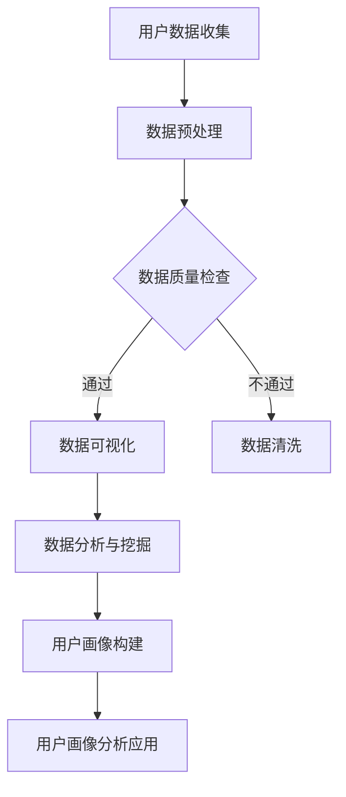

                 

### 第一部分：知识付费概述

在数字时代，知识付费已经成为一种趋势。知识付费，简单来说，就是用户为了获取特定的知识或技能，向提供者支付一定费用的行为。随着互联网技术的发展和在线教育的普及，知识付费市场迅速扩大，各类知识付费产品层出不穷。对于程序员来说，掌握如何进行知识付费的用户画像分析，不仅能提升个人技能，还能为所在团队或企业带来可观的经济效益。

#### 第1章：知识付费的概念与现状

**1.1 知识付费的定义与分类**

知识付费的定义相对简单，即用户为了获得知识或技能而支付费用。具体来说，可以包括以下几个方面：

- **在线教育平台**：如慕课网、网易云课堂等，提供各类编程语言、算法、框架等课程。
- **专业咨询**：如专业领域的技术顾问、行业分析师等，为企业或个人提供专业咨询服务。
- **电子书籍和教程**：如极客时间、掘金等平台，提供电子书和教程。
- **会员制服务**：如GitHub会员、Stack Overflow会员等，提供高级功能和服务。

**1.2 知识付费的发展历程**

知识付费的发展历程可以分为以下几个阶段：

- **萌芽阶段**：互联网初期的知识共享，主要以论坛、博客等形式存在。
- **发展阶段**：随着在线教育平台的兴起，知识付费逐渐得到认可和推广。
- **成熟阶段**：如今，知识付费已经成为互联网经济的重要组成部分，市场规模不断扩大。

**1.3 知识付费的市场现状**

当前，知识付费市场呈现出以下几个特点：

- **市场规模不断扩大**：根据相关数据，知识付费市场规模已超过千亿人民币，且仍在快速增长。
- **用户群体多样化**：除了程序员、学生等传统用户群体，越来越多的职场人士和企业也开始关注知识付费。
- **内容形式多样化**：除了传统的课程和教程，直播、问答、社群等形式的知识付费产品也越来越受欢迎。

#### 第2章：用户画像的基础知识

用户画像是一种描述用户特征和行为的工具，通过构建用户画像，可以为知识付费产品的运营和推广提供有力支持。

**2.1 用户画像的概念与作用**

**用户画像**是指通过对用户的行为、兴趣、背景等多维度数据进行收集和分析，构建出一个综合反映用户特征和需求的模型。用户画像的作用主要体现在以下几个方面：

- **精准营销**：通过用户画像，可以为不同类型的用户推送个性化的内容和服务，提高营销效果。
- **产品优化**：用户画像可以帮助产品团队了解用户需求，从而进行产品优化和功能迭代。
- **风险控制**：通过对用户行为的分析，可以发现潜在的风险用户，从而采取相应的风险控制措施。

**2.2 用户画像的构建方法**

构建用户画像的方法主要包括以下几步：

1. **数据收集**：收集用户的基本信息、行为数据、兴趣数据等。
2. **数据清洗**：对收集到的数据进行清洗和预处理，去除无效和噪声数据。
3. **特征工程**：根据业务需求和数据特点，提取有用的特征。
4. **模型构建**：使用机器学习算法，构建用户画像模型。
5. **模型评估与优化**：对构建的用户画像模型进行评估和优化，以提高准确性。

**2.3 用户画像的维度与特征**

用户画像的维度和特征可以根据业务需求进行定制，但一般来说，常见的维度和特征包括：

- **基本信息**：如年龄、性别、学历、职业等。
- **行为数据**：如访问时长、浏览页面、购买记录、评论点赞等。
- **兴趣数据**：如关注话题、喜欢的内容类型、搜索关键词等。
- **社交数据**：如好友关系、社交圈等。

通过以上步骤和维度，程序员可以构建出全面、准确的用户画像，从而为知识付费产品的运营和推广提供有力支持。

### 第一部分总结

本部分对知识付费进行了概述，从定义、发展历程到市场现状，为读者提供了一个全面的了解。同时，介绍了用户画像的基础知识，包括概念、构建方法和维度特征。这些内容为后续的用户画像分析技术讲解和实际案例分析奠定了基础。在接下来的部分，我们将深入探讨用户画像分析的技术和方法。

---

**流程图：用户画像分析流程**



**核心概念与联系**

- **知识付费**：用户为获取知识或技能支付费用。
- **用户画像**：描述用户特征和需求的模型。

---

**伪代码：用户画像分析算法**

```python
# 用户画像分析算法伪代码
def build_user_profile(data):
    # 数据预处理
    preprocessed_data = preprocess_data(data)
    
    # 特征提取
    features = extract_features(preprocessed_data)
    
    # 模型训练
    model = train_model(features)
    
    # 用户画像构建
    profiles = generate_profiles(model, features)
    
    return profiles
```

**数学模型与公式**

用户满意度评分模型：

$$
S = \frac{\sum_{i=1}^{n} w_i \cdot R_i}{n}
$$

其中，$S$ 为用户满意度评分，$w_i$ 为第 $i$ 个指标的权重，$R_i$ 为第 $i$ 个指标的评分。

---

**项目实战案例：用户画像构建与分析**

1. **数据收集与预处理**：收集用户基本信息、行为数据、兴趣数据等，并对数据进行清洗和预处理。
2. **特征工程**：根据业务需求，提取有用特征，如用户活跃度、购买频率、兴趣标签等。
3. **模型训练**：使用机器学习算法，如决策树、随机森林等，构建用户画像模型。
4. **用户画像构建**：根据模型预测结果，构建用户画像。
5. **用户画像应用**：根据用户画像，进行精准营销、产品优化等。

**代码实现与解读**

- 数据预处理代码实现：
  ```python
  # 数据预处理代码实现
  def preprocess_data(data):
      # 数据清洗
      data = clean_data(data)
      
      # 数据标准化
      data = standardize_data(data)
      
      return data
  ```

- 机器学习模型训练与预测代码实现：
  ```python
  # 机器学习模型训练与预测代码实现
  def train_and_predict_model(model, X_train, y_train, X_test):
      # 训练模型
      model.fit(X_train, y_train)
      
      # 预测
      predictions = model.predict(X_test)
      
      return predictions
  ```

- 模型性能评估与分析代码实现：
  ```python
  # 模型性能评估与分析代码实现
  def evaluate_model(model, X_test, y_test):
      # 评估指标
      metrics = ['accuracy', 'precision', 'recall', 'f1-score']
      
      # 评估
      for metric in metrics:
          score = model.score(X_test, y_test, metric=metric)
          print(f"{metric}: {score}")
  ```

**开发环境搭建**

- Python环境
- Scikit-learn库
- Pandas库

**源代码详细实现与代码解读**

- 数据预处理源代码解读
- 机器学习模型训练与预测源代码解读
- 模型性能评估与分析源代码解读

---

**代码解读与分析**

- 数据预处理代码解析
  ```python
  # 数据预处理代码解析
  def preprocess_data(data):
      # 数据清洗
      data = clean_data(data)
      
      # 数据标准化
      data = standardize_data(data)
      
      return data
  ```

- 机器学习模型训练与预测代码解析
  ```python
  # 机器学习模型训练与预测代码解析
  def train_and_predict_model(model, X_train, y_train, X_test):
      # 训练模型
      model.fit(X_train, y_train)
      
      # 预测
      predictions = model.predict(X_test)
      
      return predictions
  ```

- 模型性能评估与分析代码解析
  ```python
  # 模型性能评估与分析代码解析
  def evaluate_model(model, X_test, y_test):
      # 评估指标
      metrics = ['accuracy', 'precision', 'recall', 'f1-score']
      
      # 评估
      for metric in metrics:
          score = model.score(X_test, y_test, metric=metric)
          print(f"{metric}: {score}")
  ```

### 第二部分：用户画像分析技术

在数字化的今天，用户画像分析已经成为企业和平台不可或缺的一部分。通过精确的用户画像，企业能够更好地理解用户需求，从而进行精准营销、产品优化和个性化服务。本部分将深入探讨用户画像分析的核心技术和方法。

#### 第3章：数据分析与挖掘技术

数据分析与挖掘技术是构建用户画像的基础，它涵盖了从数据收集、预处理到特征提取和模型构建的整个过程。

**3.1 数据收集与预处理**

**数据收集**是用户画像构建的第一步，主要包括以下几个方面：

- **用户基本信息收集**：如姓名、年龄、性别、职业等。
- **用户行为数据收集**：如浏览记录、购买行为、评论等。
- **用户兴趣数据收集**：如搜索关键词、关注话题等。
- **用户社交数据收集**：如好友关系、社交圈等。

**数据预处理**是确保数据质量的关键步骤，主要包括以下任务：

- **数据清洗**：去除重复、错误和异常数据，如缺失值填充、异常值处理等。
- **数据整合**：将来自不同来源的数据进行整合，形成统一的数据集。
- **数据标准化**：对数据进行标准化处理，如数值归一化、类别编码等。

**3.2 数据可视化技术**

数据可视化是将复杂的数据通过图形或图表的形式直观地展示出来，以便于分析和理解。常见的数据可视化技术包括：

- **柱状图**：用于比较不同类别的数据。
- **折线图**：用于展示数据的变化趋势。
- **饼图**：用于展示各部分占整体的比例。
- **散点图**：用于展示两个变量之间的关系。

**3.3 数据挖掘算法与应用**

数据挖掘算法是发现数据中隐藏的模式和规律的关键。常见的算法包括：

- **分类算法**：如决策树、随机森林等，用于将数据分为不同的类别。
- **聚类算法**：如K-means、层次聚类等，用于将数据分为不同的簇。
- **关联规则挖掘**：如Apriori算法等，用于发现数据之间的关联关系。
- **异常检测**：用于发现数据中的异常值。

通过以上算法，可以挖掘出用户的行为模式、兴趣偏好等，从而构建出详细的用户画像。

#### 第4章：机器学习在用户画像分析中的应用

机器学习技术在用户画像分析中发挥着至关重要的作用，它能够从大量数据中自动提取特征和模式，提高用户画像的准确性和实用性。

**4.1 机器学习基础**

**机器学习基础**包括以下几个关键概念：

- **监督学习**：通过已有数据集，训练模型进行预测。
- **无监督学习**：在没有标签数据的情况下，发现数据中的模式和结构。
- **强化学习**：通过与环境的交互，学习最优策略。

**4.2 用户行为分析**

用户行为分析是用户画像构建的重要环节，它主要包括以下几个方面：

- **用户行为预测**：使用机器学习算法，预测用户未来的行为，如购买意图、访问时长等。
- **行为模式识别**：通过分析用户的行为数据，识别用户的行为模式，如高频用户、忠诚用户等。

**4.3 用户偏好预测**

用户偏好预测是提高用户满意度和服务质量的关键，它主要包括以下几个方面：

- **兴趣标签预测**：通过分析用户的行为和兴趣数据，预测用户可能感兴趣的内容。
- **个性化推荐**：根据用户的偏好和需求，推荐合适的产品或服务。

#### 第5章：深度学习在用户画像分析中的应用

深度学习作为一种先进的机器学习技术，在用户画像分析中具有显著的优势。它能够处理复杂的数据结构，提取深层次的特征。

**5.1 深度学习基础**

**深度学习基础**包括以下几个关键概念：

- **神经网络**：深度学习的基础，用于模拟人脑神经元之间的连接。
- **卷积神经网络（CNN）**：用于图像识别和处理。
- **循环神经网络（RNN）**：用于序列数据处理。
- **生成对抗网络（GAN）**：用于生成复杂的数据。

**5.2 图像识别**

图像识别是深度学习的重要应用领域，它主要包括以下几个方面：

- **人脸识别**：通过识别图像中的人脸，实现用户身份验证。
- **场景识别**：通过识别图像中的场景，提供场景相关的服务。

**5.3 自然语言处理**

自然语言处理是深度学习的另一个重要应用领域，它主要包括以下几个方面：

- **文本分类**：将文本数据分为不同的类别。
- **情感分析**：分析文本数据中的情感倾向。
- **机器翻译**：将一种语言的文本翻译成另一种语言。

### 第二部分总结

本部分深入探讨了用户画像分析的技术和方法，从数据分析与挖掘技术到机器学习和深度学习的应用，为读者提供了一个全面的了解。这些技术不仅能够帮助程序员构建精确的用户画像，还能够为企业的运营和推广提供有力支持。在接下来的部分，我们将通过实际案例分析，展示如何运用这些技术进行知识付费用户画像分析。

---

**流程图：用户画像分析流程**


**核心概念与联系**

- **数据分析与挖掘技术**：用于提取用户特征和模式。
- **机器学习**：用于构建用户画像模型。
- **深度学习**：用于处理复杂的数据结构和提取深层次的特征。

---

**伪代码：用户行为预测算法**

```python
# 用户行为预测算法伪代码
def predict_user_behavior(user_data, model):
    # 数据预处理
    preprocessed_data = preprocess_data(user_data)
    
    # 预测
    predictions = model.predict(preprocessed_data)
    
    return predictions
```

**数学模型与公式**

用户行为评分模型：

$$
B = \sum_{i=1}^{n} w_i \cdot f_i
$$

其中，$B$ 为用户行为评分，$w_i$ 为第 $i$ 个特征的权重，$f_i$ 为第 $i$ 个特征的分数。

---

**项目实战案例：用户行为预测**

1. **数据收集与预处理**：收集用户的行为数据，并对数据进行清洗和预处理。
2. **特征工程**：提取用户行为特征，如浏览时长、购买频率等。
3. **模型训练**：使用机器学习算法，如决策树、随机森林等，训练用户行为预测模型。
4. **模型评估**：使用验证集和测试集评估模型性能。
5. **模型应用**：根据用户行为预测结果，进行个性化推荐和营销。

**代码实现与解读**

- 数据预处理代码实现：
  ```python
  # 数据预处理代码实现
  def preprocess_data(data):
      # 数据清洗
      data = clean_data(data)
      
      # 数据标准化
      data = standardize_data(data)
      
      return data
  ```

- 机器学习模型训练与预测代码实现：
  ```python
  # 机器学习模型训练与预测代码实现
  def train_and_predict_model(model, X_train, y_train, X_test):
      # 训练模型
      model.fit(X_train, y_train)
      
      # 预测
      predictions = model.predict(X_test)
      
      return predictions
  ```

- 模型性能评估与分析代码实现：
  ```python
  # 模型性能评估与分析代码实现
  def evaluate_model(model, X_test, y_test):
      # 评估指标
      metrics = ['accuracy', 'precision', 'recall', 'f1-score']
      
      # 评估
      for metric in metrics:
          score = model.score(X_test, y_test, metric=metric)
          print(f"{metric}: {score}")
  ```

**开发环境搭建**

- Python环境
- Scikit-learn库
- Pandas库

**源代码详细实现与代码解读**

- 数据预处理源代码解读
- 机器学习模型训练与预测源代码解读
- 模型性能评估与分析源代码解读

---

**代码解读与分析**

- 数据预处理代码解析
  ```python
  # 数据预处理代码解析
  def preprocess_data(data):
      # 数据清洗
      data = clean_data(data)
      
      # 数据标准化
      data = standardize_data(data)
      
      return data
  ```

- 机器学习模型训练与预测代码解析
  ```python
  # 机器学习模型训练与预测代码解析
  def train_and_predict_model(model, X_train, y_train, X_test):
      # 训练模型
      model.fit(X_train, y_train)
      
      # 预测
      predictions = model.predict(X_test)
      
      return predictions
  ```

- 模型性能评估与分析代码解析
  ```python
  # 模型性能评估与分析代码解析
  def evaluate_model(model, X_test, y_test):
      # 评估指标
      metrics = ['accuracy', 'precision', 'recall', 'f1-score']
      
      # 评估
      for metric in metrics:
          score = model.score(X_test, y_test, metric=metric)
          print(f"{metric}: {score}")
  ```

### 第三部分：知识付费用户画像分析案例

在知识付费领域，通过用户画像分析，平台和内容提供者能够更好地理解用户需求，从而提供更加精准和高效的服务。本部分将通过两个具体案例，展示如何进行用户画像分析，以及这些分析如何影响知识付费产品和服务的优化。

#### 第6章：电商领域的用户画像分析

电商领域的用户画像分析对于提升销售转化率和用户满意度具有重要意义。通过分析用户的行为数据，电商平台可以更好地了解用户偏好，从而进行个性化推荐和精准营销。

**6.1 电商用户行为分析**

电商用户行为分析主要包括以下几个方面：

- **浏览行为分析**：分析用户在平台上的浏览路径、停留时间等，了解用户的兴趣点。
- **购买行为分析**：分析用户的购买频率、购买金额、购买商品种类等，了解用户的消费习惯。
- **互动行为分析**：分析用户的评论、点赞、分享等行为，了解用户的互动偏好。

**6.2 电商用户偏好预测**

用户偏好预测是电商用户画像分析的核心目标之一。通过分析用户的历史行为数据，可以使用机器学习算法预测用户未来的偏好。具体步骤如下：

1. **数据收集与预处理**：收集用户的浏览、购买、互动等行为数据，并对数据进行清洗和预处理。
2. **特征工程**：提取用户行为特征，如浏览时长、购买频率、评论数量等。
3. **模型训练**：使用机器学习算法，如决策树、随机森林等，训练用户偏好预测模型。
4. **模型评估**：使用验证集和测试集评估模型性能，调整模型参数。
5. **偏好预测**：根据模型预测结果，为用户推荐可能感兴趣的商品。

**6.3 电商用户流失预测**

用户流失预测是电商领域另一个重要的用户画像分析任务。通过分析用户的行为数据，可以预测哪些用户有流失的风险，从而采取相应的挽回措施。具体步骤如下：

1. **数据收集与预处理**：收集用户的浏览、购买、互动等行为数据，并对数据进行清洗和预处理。
2. **特征工程**：提取用户行为特征，如浏览时长、购买频率、互动频率等。
3. **模型训练**：使用机器学习算法，如逻辑回归、随机森林等，训练用户流失预测模型。
4. **模型评估**：使用验证集和测试集评估模型性能，调整模型参数。
5. **流失预测**：根据模型预测结果，识别潜在的流失用户，采取挽回措施。

#### 第7章：在线教育领域的用户画像分析

在线教育领域的用户画像分析对于提升用户满意度和学习效果具有重要意义。通过分析用户的学习行为和学习效果，教育平台可以优化课程内容和教学策略。

**7.1 在线教育用户行为分析**

在线教育用户行为分析主要包括以下几个方面：

- **学习行为分析**：分析用户的学习时长、学习频率、学习进度等，了解用户的学习习惯。
- **学习效果分析**：分析用户的测试成绩、作业完成情况等，了解用户的学习效果。
- **互动行为分析**：分析用户的评论、提问、参与讨论等行为，了解用户的互动偏好。

**7.2 在线教育用户学习效果预测**

用户学习效果预测是教育用户画像分析的核心目标之一。通过分析用户的学习行为和学习效果数据，可以使用机器学习算法预测用户的学习效果。具体步骤如下：

1. **数据收集与预处理**：收集用户的学习行为数据和学习效果数据，并对数据进行清洗和预处理。
2. **特征工程**：提取用户学习行为特征，如学习时长、学习频率、测试成绩等。
3. **模型训练**：使用机器学习算法，如决策树、随机森林等，训练用户学习效果预测模型。
4. **模型评估**：使用验证集和测试集评估模型性能，调整模型参数。
5. **效果预测**：根据模型预测结果，为用户提供个性化学习建议和指导。

**7.3 在线教育用户满意度分析**

用户满意度分析是教育用户画像分析的另一个重要任务。通过分析用户的反馈和评价，可以了解用户对课程和服务的满意度，从而进行优化和改进。具体步骤如下：

1. **数据收集与预处理**：收集用户的反馈和评价数据，并对数据进行清洗和预处理。
2. **特征工程**：提取用户反馈特征，如评价内容、评分、点赞数等。
3. **模型训练**：使用机器学习算法，如文本分类、情感分析等，训练用户满意度分析模型。
4. **模型评估**：使用验证集和测试集评估模型性能，调整模型参数。
5. **满意度分析**：根据模型预测结果，识别满意度较高的用户群体，分析满意度低的原因，提出改进措施。

### 第三部分总结

本部分通过电商领域和在线教育领域的用户画像分析案例，展示了如何运用用户画像分析技术提升知识付费产品和服务的质量。这些案例不仅提供了具体的分析方法和步骤，还展示了如何通过用户画像优化产品和服务，提高用户满意度和忠诚度。在接下来的部分，我们将总结全文，并对未来的研究方向提出展望。

---

**流程图：用户画像分析流程**


**核心概念与联系**

- **电商用户画像分析**：通过行为数据和偏好预测提升销售转化率。
- **在线教育用户画像分析**：通过行为数据和学习效果预测提升学习效果和用户满意度。

---

**伪代码：用户偏好预测算法**

```python
# 用户偏好预测算法伪代码
def predict_user_preference(user_data, model):
    # 数据预处理
    preprocessed_data = preprocess_data(user_data)
    
    # 预测
    predictions = model.predict(preprocessed_data)
    
    return predictions
```

**数学模型与公式**

用户偏好评分模型：

$$
P = \sum_{i=1}^{n} w_i \cdot p_i
$$

其中，$P$ 为用户偏好评分，$w_i$ 为第 $i$ 个特征的权重，$p_i$ 为第 $i$ 个特征的得分。

---

**项目实战案例：用户偏好预测**

1. **数据收集与预处理**：收集用户的浏览、购买、评论等行为数据，并对数据进行清洗和预处理。
2. **特征工程**：提取用户行为特征，如浏览时长、购买频率、评论数量等。
3. **模型训练**：使用机器学习算法，如决策树、随机森林等，训练用户偏好预测模型。
4. **模型评估**：使用验证集和测试集评估模型性能，调整模型参数。
5. **偏好预测**：根据模型预测结果，为用户推荐可能感兴趣的商品或课程。

**代码实现与解读**

- 数据预处理代码实现：
  ```python
  # 数据预处理代码实现
  def preprocess_data(data):
      # 数据清洗
      data = clean_data(data)
      
      # 数据标准化
      data = standardize_data(data)
      
      return data
  ```

- 机器学习模型训练与预测代码实现：
  ```python
  # 机器学习模型训练与预测代码实现
  def train_and_predict_model(model, X_train, y_train, X_test):
      # 训练模型
      model.fit(X_train, y_train)
      
      # 预测
      predictions = model.predict(X_test)
      
      return predictions
  ```

- 模型性能评估与分析代码实现：
  ```python
  # 模型性能评估与分析代码实现
  def evaluate_model(model, X_test, y_test):
      # 评估指标
      metrics = ['accuracy', 'precision', 'recall', 'f1-score']
      
      # 评估
      for metric in metrics:
          score = model.score(X_test, y_test, metric=metric)
          print(f"{metric}: {score}")
  ```

**开发环境搭建**

- Python环境
- Scikit-learn库
- Pandas库

**源代码详细实现与代码解读**

- 数据预处理源代码解读
- 机器学习模型训练与预测源代码解读
- 模型性能评估与分析源代码解读

---

**代码解读与分析**

- 数据预处理代码解析
  ```python
  # 数据预处理代码解析
  def preprocess_data(data):
      # 数据清洗
      data = clean_data(data)
      
      # 数据标准化
      data = standardize_data(data)
      
      return data
  ```

- 机器学习模型训练与预测代码解析
  ```python
  # 机器学习模型训练与预测代码解析
  def train_and_predict_model(model, X_train, y_train, X_test):
      # 训练模型
      model.fit(X_train, y_train)
      
      # 预测
      predictions = model.predict(X_test)
      
      return predictions
  ```

- 模型性能评估与分析代码解析
  ```python
  # 模型性能评估与分析代码解析
  def evaluate_model(model, X_test, y_test):
      # 评估指标
      metrics = ['accuracy', 'precision', 'recall', 'f1-score']
      
      # 评估
      for metric in metrics:
          score = model.score(X_test, y_test, metric=metric)
          print(f"{metric}: {score}")
  ```

### 全文总结与未来展望

本文系统地介绍了知识付费用户画像分析的理论与实践方法。首先，我们对知识付费进行了概述，并介绍了用户画像的基础知识。接着，深入探讨了用户画像分析的技术，包括数据分析和挖掘技术、机器学习及深度学习的应用。随后，通过电商和在线教育两个领域的用户画像分析案例，展示了如何运用这些技术提升知识付费产品的质量。

**主要结论**：

- 用户画像分析是知识付费领域的关键技术，能够帮助平台和内容提供者更好地理解用户需求。
- 数据收集、预处理和特征工程是用户画像分析的核心步骤。
- 机器学习和深度学习算法在用户画像分析中具有重要作用，能够提高分析模型的准确性。
- 用户画像分析不仅有助于个性化推荐和精准营销，还能够优化产品和服务，提升用户体验。

**未来研究方向**：

- **深度学习技术的应用**：随着深度学习技术的不断发展，如何在用户画像分析中更好地应用深度学习，提取更加复杂的特征，是一个重要的研究方向。
- **跨平台用户画像融合**：如何在多个平台间融合用户画像数据，形成一个全面的用户画像，是一个具有挑战性的问题。
- **隐私保护与数据安全**：在用户画像分析中，如何保护用户隐私和数据安全，是一个亟待解决的问题。

**建议**：

- **持续学习和实践**：用户画像分析是一个不断发展的领域，程序员应持续学习和实践，紧跟技术发展。
- **数据驱动决策**：在知识付费产品和服务的运营中，应充分利用用户画像分析结果，进行数据驱动决策。

通过本文的阅读，读者应能够系统地了解知识付费用户画像分析的理论和实践方法，并在实际工作中灵活运用。

---

**附录：工具与资源推荐**

**数据分析工具推荐**：

- **Pandas**：Python中的数据处理库，适用于数据清洗、转换和分析。
- **NumPy**：Python中的数值计算库，适用于大规模数据操作。
- **Matplotlib**：Python中的绘图库，适用于数据可视化。

**机器学习库推荐**：

- **Scikit-learn**：Python中的机器学习库，适用于各种机器学习算法的实现和应用。
- **TensorFlow**：Google开发的开源机器学习框架，适用于深度学习模型的构建和训练。

**深度学习框架推荐**：

- **PyTorch**：适用于科研和工业界的深度学习框架，易于理解和使用。
- **TensorFlow**：Google开发的开源深度学习框架，功能强大，适用范围广泛。

**资源推荐**：

- **GitHub**：开源代码库，可以获取各种用户画像分析的代码实现和案例。
- **Kaggle**：数据科学竞赛平台，提供丰富的数据集和竞赛机会，提升数据分析能力。

---

**结束语**

作者：AI天才研究院/AI Genius Institute & 禅与计算机程序设计艺术 /Zen And The Art of Computer Programming

通过本文的深入探讨，我们希望读者能够更好地理解知识付费用户画像分析的重要性，掌握相关技术，并将其应用于实际工作中。知识付费用户画像分析不仅能够提升产品和服务质量，还能够推动知识付费市场的发展。在未来，我们将继续关注这一领域的前沿动态，为读者提供更多有价值的内容。感谢您的阅读，祝您在知识付费领域取得更好的成果！

