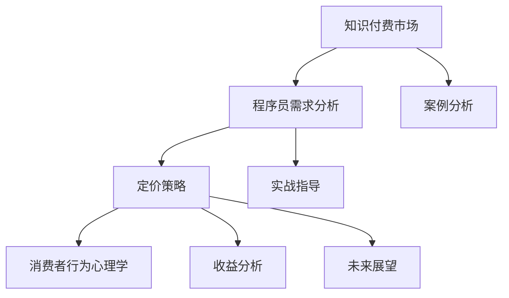

                 

### 文章标题：程序员知识付费的定价策略与心理学

#### 关键词：知识付费、程序员、定价策略、消费者心理学

> 摘要：本文旨在深入探讨程序员知识付费的定价策略与心理学。首先，我们将概述知识付费市场的发展背景和现状，分析程序员对知识付费的需求。然后，我们将详细讨论定价模型与理论，以及定价策略在营销和收益分析中的应用。接着，我们将引入消费者行为心理学，探讨程序员的消费心理，并分析如何提高他们的付费意愿。最后，通过实际案例和实战指导，我们提供了一些建议和策略，以帮助知识付费项目成功执行和持续优化。

---

### 《程序员知识付费的定价策略与心理学》目录大纲

- **第一部分：知识付费概述**
  - **第1章：知识付费市场的背景与现状**
    - **1.1 知识付费的定义与发展历程**
    - **1.2 知识付费市场的规模与趋势**
    - **1.3 知识付费的主要参与者和商业模式**
  - **第2章：程序员知识付费的需求分析**
    - **2.1 程序员知识付费的需求特点**
    - **2.2 程序员的知识获取途径分析**
    - **2.3 程序员的知识付费心理分析**

- **第二部分：定价策略**
  - **第3章：定价模型与理论**
    - **3.1 成本导向定价法**
    - **3.2 需求导向定价法**
    - **3.3 竞争导向定价法**
    - **3.4 价值导向定价法**
  - **第4章：定价策略与营销**
    - **4.1 定价策略的制定与调整**
    - **4.2 促销策略在知识付费中的应用**
    - **4.3 品牌建设与口碑管理**
  - **第5章：定价与收益分析**
    - **5.1 定价策略对收益的影响**
    - **5.2 收益最大化的定价策略**
    - **5.3 收益与风险的平衡**

- **第三部分：心理学应用**
  - **第6章：消费者行为心理学**
    - **6.1 消费者决策过程**
    - **6.2 消费者心理影响因素**
    - **6.3 消费者满意度与忠诚度**
  - **第7章：程序员的消费心理**
    - **7.1 程序员的消费行为特点**
    - **7.2 程序员的知识付费心理分析**
    - **7.3 提高程序员付费意愿的心理学策略**

- **第四部分：案例分析**
  - **第8章：案例分析**
    - **8.1 成功案例分享**
    - **8.2 失败案例反思**
    - **8.3 案例分析总结与启示**

- **第五部分：实战指导**
  - **第9章：知识付费项目的规划与执行**
    - **9.1 知识付费项目的策划**
    - **9.2 知识付费产品的设计与开发**
    - **9.3 知识付费项目的推广与运营**
  - **第10章：定价策略调整与优化**
    - **10.1 定价策略的持续优化**
    - **10.2 应对市场变化的策略调整**
    - **10.3 持续跟踪与数据分析**
  - **第11章：知识付费项目的管理与维护**
    - **11.1 项目的团队管理**
    - **11.2 用户反馈收集与处理**
    - **11.3 项目的持续改进与升级**

- **第六部分：未来展望**
  - **第12章：知识付费行业的发展趋势**
    - **12.1 行业发展趋势分析**
    - **12.2 新兴领域的发展机遇**
    - **12.3 知识付费的未来展望**
  - **第13章：总结与展望**
    - **13.1 本书内容的总结**
    - **13.2 知识付费的关键点总结**
    - **13.3 未来发展方向与建议**

- **附录**
  - **附录A：相关术语解释**
    - **A.1 知识付费相关术语**
    - **A.2 心理学相关术语**
  - **附录B：推荐阅读**
    - **B.1 相关书籍推荐**
    - **B.2 学术论文推荐**
    - **B.3 知识付费平台推荐**

---

### 第一部分：知识付费概述

#### 第1章：知识付费市场的背景与现状

##### 1.1 知识付费的定义与发展历程

知识付费是指用户为了获取特定知识或技能，自愿支付一定费用的行为。这种模式在互联网时代得到了快速发展，主要得益于以下几个因素：

1. **互联网的普及**：随着互联网技术的不断进步，人们获取知识的途径变得更加便捷，知识付费逐渐成为可能。
2. **内容创作平台的兴起**：如知乎、喜马拉雅、得到等平台，为用户提供了丰富的知识产品和服务。
3. **用户意识的提升**：人们越来越意识到知识的重要性，愿意为优质的知识产品支付费用。

知识付费的发展历程可以分为以下几个阶段：

1. **萌芽期**（2013-2015年）：知乎等平台开始尝试付费专栏，初步探索知识付费模式。
2. **快速增长期**（2016-2018年）：得到、喜马拉雅等平台推出付费课程，知识付费市场快速扩张。
3. **规范化发展期**（2019年至今）：随着监管政策的完善和市场的成熟，知识付费行业进入规范化发展阶段。

##### 1.2 知识付费市场的规模与趋势

根据相关报告，知识付费市场规模逐年扩大，预计未来仍将保持快速增长。以下是一些关键数据：

1. **市场规模**：2019年，中国知识付费市场规模约为492亿元，预计2025年将达到1969亿元。
2. **用户规模**：截至2020年底，中国知识付费用户规模已超过5亿人。
3. **行业趋势**：随着5G、大数据、人工智能等技术的发展，知识付费将朝着个性化、智能化、互动化的方向发展。

##### 1.3 知识付费的主要参与者和商业模式

知识付费市场的主要参与者包括：

1. **内容提供者**：包括专业领域的专家、学者、行业人士等，他们通过创作知识产品获得收益。
2. **平台运营者**：如知乎、得到、喜马拉雅等，他们为内容提供者和用户搭建了一个交易和交流的平台。
3. **用户**：他们是知识付费的消费者，通过购买知识产品来满足自己的学习需求。

知识付费的商业模式主要有以下几种：

1. **内容付费**：用户购买具体的知识产品，如文章、课程、电子书等。
2. **会员制**：用户支付一定费用成为会员，享受平台提供的所有知识产品和服务。
3. **广告模式**：平台通过广告收入来支持内容创作和用户服务。

---

### 第2章：程序员知识付费的需求分析

##### 2.1 程序员知识付费的需求特点

程序员作为知识付费的重要用户群体，其需求特点主要体现在以下几个方面：

1. **技术深度和广度**：程序员需要不断更新和扩展自己的技术知识，以适应快速变化的技术环境。
2. **学习效率**：程序员的时间宝贵，他们更倾向于高效的知识获取方式，如在线课程、技术讲座等。
3. **实际应用**：程序员更注重知识产品的实用性，希望所学知识能直接应用于实际工作中。

##### 2.2 程序员的知识获取途径分析

程序员获取知识的主要途径包括：

1. **官方文档**：如操作系统、编程语言等的官方文档，是程序员学习的基础资料。
2. **在线课程**：如慕课网、极客时间等平台提供的专业课程，是程序员提升技能的重要渠道。
3. **社区交流**：如GitHub、Stack Overflow等社区，程序员可以在这里分享经验、解决问题。
4. **书籍**：专业书籍仍然是程序员学习的重要来源，尤其在深入理解某个技术领域时。

##### 2.3 程序员的知识付费心理分析

程序员在知识付费时，其心理因素主要包括：

1. **学习动机**：提高技能、解决工作中的问题、职业发展等，都是程序员付费学习的主要动机。
2. **风险意识**：担心所付费的知识产品不能带来实际收益，或存在虚假宣传。
3. **价值感知**：对所购买的知识产品有较高的价值感知，认为这是投资自己的未来。

---

### 第二部分：定价策略

#### 第3章：定价模型与理论

##### 3.1 成本导向定价法

成本导向定价法是一种以产品成本为基础的定价方法，主要包括以下几种：

1. **完全成本定价法**：将生产成本、销售成本、管理成本等全部计入产品成本，然后加上一定的利润率，得出产品价格。
2. **边际成本定价法**：以边际成本（即生产一个额外产品所需增加的成本）为基础，结合市场需求定价。

成本导向定价法的优点在于简单易懂，易于计算，但缺点是忽略了市场需求和竞争状况，可能导致定价不合理。

##### 3.2 需求导向定价法

需求导向定价法是一种以市场需求为基础的定价方法，主要包括以下几种：

1. **价值定价法**：根据消费者对产品价值的认知来定价，通常高于成本定价。
2. **需求价格弹性定价法**：根据消费者对价格变动的敏感度来定价，需求弹性大时降低价格，需求弹性小时提高价格。

需求导向定价法的优点在于能够更好地满足市场需求，但缺点是难以准确预测市场需求，定价风险较高。

##### 3.3 竞争导向定价法

竞争导向定价法是一种以市场竞争为基础的定价方法，主要包括以下几种：

1. **跟随定价法**：根据行业内的领先企业的价格来定价，通常适用于垄断或寡头市场。
2. **差异定价法**：根据产品在市场上的竞争力来定价，差异大的产品定价高，差异小的产品定价低。

竞争导向定价法的优点在于能够迅速应对市场竞争，但缺点是可能忽略了产品本身的成本和价值。

##### 3.4 价值导向定价法

价值导向定价法是一种以产品价值为基础的定价方法，主要包括以下几种：

1. **感知价值定价法**：根据消费者对产品价值的感知来定价，通常高于实际成本。
2. **目标价值定价法**：根据企业设定的目标利润水平来定价。

价值导向定价法的优点在于能够更好地体现产品价值，但缺点是难以准确衡量消费者的感知价值，定价风险较高。

---

#### 第4章：定价策略与营销

##### 4.1 定价策略的制定与调整

定价策略的制定和调整需要考虑以下几个关键因素：

1. **市场需求**：了解目标市场的需求状况，包括消费者的购买意愿和价格敏感度。
2. **竞争状况**：分析竞争对手的定价策略，确定自己的价格定位。
3. **产品特性**：考虑产品的独特性、品质、功能等，以确定合理的价格区间。
4. **成本结构**：计算产品的生产成本、销售成本等，确保定价能够覆盖成本并获得利润。

在定价策略的调整过程中，企业需要根据市场反馈和经营状况进行动态调整，以保持竞争力。

##### 4.2 促销策略在知识付费中的应用

促销策略在知识付费中的应用主要体现在以下几个方面：

1. **限时优惠**：通过限时折扣、优惠券等形式吸引消费者购买。
2. **套餐优惠**：提供多种课程或服务的套餐优惠，以降低消费者的购买成本。
3. **口碑营销**：通过用户评价、推荐等方式增强产品的可信度和吸引力。
4. **社交媒体营销**：利用社交媒体平台进行宣传推广，提高品牌知名度和用户参与度。

有效的促销策略能够显著提升知识付费产品的销量和用户满意度。

##### 4.3 品牌建设与口碑管理

品牌建设和口碑管理是知识付费项目长期发展的关键：

1. **品牌定位**：明确品牌的核心价值和目标受众，塑造独特的品牌形象。
2. **内容质量**：确保知识产品的质量，提供有价值、实用的内容，增强用户信任。
3. **用户互动**：通过社区、论坛等形式与用户互动，收集用户反馈，持续优化产品和服务。
4. **口碑传播**：通过用户的正面评价和推荐，扩大品牌影响力，吸引更多用户。

有效的品牌建设和口碑管理能够提升知识付费项目的市场竞争力。

---

#### 第5章：定价与收益分析

##### 5.1 定价策略对收益的影响

定价策略对知识付费项目的收益有着重要影响。合理的定价策略能够提高产品的销量和用户满意度，从而实现收益的最大化。以下是一些关键因素：

1. **市场需求**：市场需求越高，价格弹性越大，合理的定价能够提高销售额。
2. **竞争状况**：在竞争激烈的市场中，低价策略可能有助于增加市场份额，但在垄断市场中，高价策略可能更具优势。
3. **产品特性**：高品质、高附加值的产品可以设定较高的价格，以实现更高的利润率。

##### 5.2 收益最大化的定价策略

要实现收益最大化，可以采用以下定价策略：

1. **动态定价**：根据市场需求和竞争状况实时调整价格，以实现利润的最大化。
2. **差异化定价**：根据不同的用户群体和需求，设定不同的价格策略，以满足不同层次的用户。
3. **组合定价**：提供多种产品组合，以较低的价格吸引消费者购买，从而实现收益的最大化。

##### 5.3 收益与风险的平衡

在制定定价策略时，需要平衡收益与风险：

1. **定价风险**：过高的定价可能导致销量下降，过低的定价可能影响利润率。
2. **市场风险**：市场需求波动可能导致定价策略失效，需要根据市场状况及时调整。
3. **竞争风险**：竞争对手的定价策略可能对自身定价造成影响，需要密切关注市场动态。

合理的定价策略能够在确保收益的同时，有效应对各种风险。

---

#### 第三部分：心理学应用

##### 第6章：消费者行为心理学

##### 6.1 消费者决策过程

消费者决策过程可以分为以下几个阶段：

1. **需求识别**：消费者意识到自己需要某种产品或服务。
2. **信息搜索**：消费者通过各种渠道获取有关产品或服务的相关信息。
3. **评估选择**：消费者对所获取的信息进行分析和比较，选择最符合自己需求的产品或服务。
4. **购买决策**：消费者决定购买并支付费用。
5. **购后行为**：消费者在使用产品或服务后的感受和反馈，影响其对品牌的忠诚度和口碑传播。

##### 6.2 消费者心理影响因素

消费者在决策过程中会受到多种心理因素的影响，包括：

1. **认知因素**：消费者的知识水平、价值观、文化背景等。
2. **情感因素**：消费者的情绪、情感状态，如愉悦、焦虑、信任等。
3. **行为因素**：消费者的行为习惯、购买行为等。
4. **社会因素**：消费者的家庭、社会群体、文化环境等。

##### 6.3 消费者满意度与忠诚度

消费者满意度是衡量消费者对产品或服务的整体满意程度，而消费者忠诚度是消费者重复购买和推荐产品的倾向。提高消费者满意度和忠诚度，需要：

1. **产品质量**：提供高质量的产品或服务，满足消费者的需求。
2. **服务体验**：提供优质的售前、售中、售后服务，提升消费者的整体体验。
3. **个性化关怀**：关注消费者的个性化需求，提供定制化的产品或服务。
4. **口碑传播**：通过消费者的正面评价和推荐，增强品牌影响力和口碑。

---

##### 第7章：程序员的消费心理

##### 7.1 程序员的消费行为特点

程序员的消费行为特点主要包括：

1. **注重实用性**：程序员更注重知识产品的实用性，希望所学知识能直接应用于实际工作中。
2. **追求高效性**：程序员的时间宝贵，他们倾向于选择高效的知识获取方式，如在线课程、技术讲座等。
3. **关注品牌**：程序员在购买知识产品时，更倾向于选择知名品牌或行业专家的推荐，以增强信任感。

##### 7.2 程序员的知识付费心理分析

程序员在知识付费时，其心理因素主要包括：

1. **学习动机**：提高技能、解决工作中的问题、职业发展等，都是程序员付费学习的主要动机。
2. **风险意识**：担心所付费的知识产品不能带来实际收益，或存在虚假宣传。
3. **价值感知**：对所购买的知识产品有较高的价值感知，认为这是投资自己的未来。

##### 7.3 提高程序员付费意愿的心理学策略

要提高程序员的付费意愿，可以采用以下心理学策略：

1. **明确学习目标**：明确程序员的学习目标，提供针对性的知识产品，增强其学习动力。
2. **降低风险感知**：通过真实案例、用户评价等方式，降低程序员对知识产品的风险感知，增加信任感。
3. **提供增值服务**：提供额外的增值服务，如答疑解惑、实战项目等，提升知识产品的价值感知。
4. **塑造品牌形象**：树立权威、专业的品牌形象，增强程序员的信任度和忠诚度。

---

#### 第四部分：案例分析

##### 第8章：案例分析

##### 8.1 成功案例分享

**案例一：极客时间的成功经验**

极客时间是一家专注于程序员知识付费的平台，以下是其成功经验：

1. **内容质量**：极客时间注重内容质量，邀请行业专家和一线工程师授课，提供高质量的知识产品。
2. **用户体验**：极客时间提供丰富的学习资源和灵活的学习方式，满足程序员的不同学习需求。
3. **品牌建设**：极客时间通过持续的品牌宣传和用户互动，树立了专业、权威的品牌形象。

**案例二：得到App的成功经验**

得到App是一家综合性知识付费平台，以下是其成功经验：

1. **内容多样化**：得到App提供多种类型的内容，包括课程、书籍、专栏等，满足用户多样化的学习需求。
2. **明星讲师**：得到App邀请知名专家和行业大咖授课，提升用户对知识产品的信任度和价值感知。
3. **互动机制**：得到App通过社区、讨论区等形式，促进用户之间的互动和知识共享。

##### 8.2 失败案例反思

**案例一：某小型知识付费平台的失败原因**

某小型知识付费平台因以下原因导致失败：

1. **内容质量低**：平台缺乏优质内容，用户对知识产品的满意度低。
2. **用户体验差**：平台界面设计不佳，学习资源难以找到，用户使用体验差。
3. **品牌认知度低**：平台知名度低，缺乏有效的品牌宣传和用户互动。

**案例二：某在线教育平台的失败原因**

某在线教育平台因以下原因导致失败：

1. **课程设置不合理**：平台课程设置过于复杂，用户难以选择适合自己的课程。
2. **教学效果不佳**：平台缺乏有效的教学评估机制，用户对教学效果的满意度低。
3. **价格不合理**：平台价格过高，用户购买意愿低。

##### 8.3 案例分析总结与启示

通过对成功案例和失败案例的分析，可以得出以下总结与启示：

1. **内容质量是关键**：提供高质量的知识产品是吸引和留住用户的基础。
2. **用户体验至关重要**：良好的用户体验能够提升用户满意度和忠诚度。
3. **品牌建设不可或缺**：建立专业、权威的品牌形象有助于提升用户信任度和品牌认知度。
4. **灵活的定价策略**：合理的定价策略能够提高用户的购买意愿和满意度。
5. **持续优化与改进**：根据用户反馈和市场变化，持续优化产品和服务，以保持竞争力。

---

#### 第四部分：实战指导

##### 第9章：知识付费项目的规划与执行

##### 9.1 知识付费项目的策划

知识付费项目的策划是成功实施的关键环节，主要包括以下内容：

1. **项目定位**：明确项目的目标受众、核心内容、价值主张等，为后续策划提供方向。
2. **市场调研**：通过问卷调查、访谈等方式，了解目标市场的需求、竞争状况等，为项目策划提供数据支持。
3. **内容规划**：根据项目定位和市场调研结果，制定详细的内容规划，包括课程设置、讲师选择、内容形式等。
4. **时间规划**：制定项目的时间规划，明确各阶段的任务和时间节点，确保项目按计划推进。

##### 9.2 知识付费产品的设计与开发

知识付费产品的设计与开发是项目实施的重要环节，主要包括以下内容：

1. **产品设计**：根据项目定位和内容规划，设计知识产品的结构和内容，包括课程大纲、课件、练习等。
2. **技术开发**：根据产品设计，开发知识产品的技术实现，包括前端开发、后端开发、数据存储等。
3. **用户体验**：关注用户体验，设计简洁易用的界面和交互，提升用户的使用体验。
4. **质量保证**：通过测试和反馈，确保知识产品的质量和稳定性，确保用户能够顺利使用。

##### 9.3 知识付费项目的推广与运营

知识付费项目的推广与运营是项目成功的重要保障，主要包括以下内容：

1. **推广策略**：根据项目定位、内容和目标受众，制定合适的推广策略，包括线上推广、线下推广等。
2. **品牌建设**：通过多种渠道宣传和推广项目，提升项目的品牌知名度，树立专业、权威的品牌形象。
3. **用户互动**：通过社区、讨论区、答疑解惑等形式，与用户互动，收集用户反馈，优化产品和服务。
4. **数据分析**：通过数据分析，了解用户的反馈和行为，为项目优化和推广提供数据支持。

---

##### 第10章：定价策略调整与优化

##### 10.1 定价策略的持续优化

定价策略的持续优化是知识付费项目成功的关键，主要包括以下内容：

1. **市场反馈**：定期收集用户反馈，了解用户对当前定价策略的满意度，为定价调整提供依据。
2. **数据分析**：通过数据分析，了解不同定价策略对用户购买行为和收益的影响，为定价调整提供数据支持。
3. **竞争分析**：关注竞争对手的定价策略和市场动态，及时调整自己的定价策略，以保持竞争力。
4. **产品升级**：随着产品和服务的变化，及时调整定价策略，以适应市场需求和用户期望。

##### 10.2 应对市场变化的策略调整

市场变化是不可避免的，知识付费项目需要根据市场变化及时调整策略，主要包括以下内容：

1. **市场趋势分析**：分析市场趋势，了解新兴领域和需求变化，及时调整项目方向和内容。
2. **价格调整**：根据市场供需关系和竞争状况，合理调整价格策略，以实现收益的最大化。
3. **产品创新**：通过产品创新，满足市场的需求变化，提高用户的购买意愿。
4. **营销推广**：调整营销推广策略，扩大市场份额，提升品牌知名度。

##### 10.3 持续跟踪与数据分析

持续跟踪与数据分析和优化是知识付费项目成功的重要保障，主要包括以下内容：

1. **用户行为分析**：通过数据分析，了解用户的行为模式、需求变化等，为项目优化提供依据。
2. **收益分析**：定期分析项目收益，了解不同定价策略对收益的影响，为定价调整提供数据支持。
3. **市场反馈**：持续收集用户反馈，了解用户对当前定价策略和产品服务的满意度，为项目优化提供依据。
4. **决策支持**：通过数据分析，为项目的决策提供支持，确保项目按计划推进，实现预期目标。

---

##### 第11章：知识付费项目的管理与维护

##### 11.1 项目的团队管理

知识付费项目的团队管理是项目成功的关键，主要包括以下内容：

1. **团队组建**：根据项目需求和特点，组建合适的团队，确保团队的能力和经验满足项目要求。
2. **分工协作**：明确团队成员的职责和分工，确保项目各环节有序推进。
3. **沟通协调**：建立有效的沟通机制，确保团队成员之间的信息畅通，提高协作效率。
4. **激励机制**：制定合理的激励机制，激励团队成员发挥潜能，提高项目质量。

##### 11.2 用户反馈收集与处理

用户反馈是知识付费项目持续优化的重要依据，主要包括以下内容：

1. **反馈渠道**：建立多种反馈渠道，如在线调查、问卷调查、讨论区等，方便用户表达意见和建议。
2. **反馈分析**：定期收集和分析用户反馈，了解用户的需求和期望，为项目优化提供依据。
3. **问题处理**：针对用户反馈的问题，及时进行回应和处理，提高用户的满意度和忠诚度。
4. **持续改进**：根据用户反馈，持续优化产品和服务，提升用户体验。

##### 11.3 项目的持续改进与升级

知识付费项目的持续改进与升级是项目长期发展的重要保障，主要包括以下内容：

1. **技术升级**：随着技术的发展，持续升级项目的技术架构和功能，提高项目的性能和用户体验。
2. **内容更新**：根据市场需求和用户反馈，定期更新知识产品内容，确保内容的实用性和时效性。
3. **模式创新**：积极探索新的商业模式和营销策略，提升项目的市场竞争力。
4. **用户体验**：持续关注用户体验，通过多种渠道收集用户反馈，为项目优化提供依据。

---

#### 第五部分：未来展望

##### 第12章：知识付费行业的发展趋势

##### 12.1 行业发展趋势分析

知识付费行业在未来将继续保持快速增长，主要趋势包括：

1. **个性化**：随着人工智能技术的发展，知识付费将更加个性化，满足不同用户的需求。
2. **互动化**：知识付费平台将更加注重用户互动，提升用户体验，增强用户粘性。
3. **平台化**：知识付费平台将整合更多资源和内容，形成综合性平台，提高竞争力。
4. **国际化**：知识付费行业将向国际化发展，吸引更多国际用户和内容创作者。

##### 12.2 新兴领域的发展机遇

知识付费行业的新兴领域主要包括：

1. **人工智能**：随着人工智能技术的应用，人工智能相关的知识付费将得到快速发展。
2. **区块链**：区块链技术的普及将带动区块链相关知识的付费需求。
3. **云计算**：云计算技术的广泛应用将推动云计算相关知识的付费。
4. **物联网**：物联网技术的快速发展将带动物联网相关知识的付费需求。

##### 12.3 知识付费的未来展望

知识付费的未来将更加多元化、智能化和互动化，主要展望包括：

1. **智能推荐**：通过人工智能技术，为用户提供个性化的知识推荐，提高用户满意度。
2. **沉浸式学习**：利用虚拟现实、增强现实等技术，提供沉浸式的学习体验，提升学习效果。
3. **跨界合作**：知识付费平台将与更多行业进行跨界合作，拓展知识付费的应用场景。
4. **国际化布局**：知识付费平台将加强国际化布局，吸引全球用户和创作者，提升国际影响力。

---

##### 第13章：总结与展望

##### 13.1 本书内容的总结

本书从多个角度对程序员知识付费的定价策略与心理学进行了深入探讨，主要包括：

1. **知识付费概述**：介绍了知识付费市场的背景、现状和需求分析。
2. **定价策略**：分析了定价模型、定价策略与营销、收益分析等方面的内容。
3. **心理学应用**：探讨了消费者行为心理学、程序员的消费心理等。
4. **案例分析**：分享了成功案例和失败案例，总结了经验教训。
5. **实战指导**：提供了知识付费项目的规划与执行、定价策略调整与优化、项目管理与维护等方面的实战指导。
6. **未来展望**：分析了知识付费行业的发展趋势和新兴领域的发展机遇，展望了知识付费的未来。

##### 13.2 知识付费的关键点总结

1. **内容质量**：提供高质量的知识产品是吸引和留住用户的基础。
2. **用户体验**：良好的用户体验能够提升用户满意度和忠诚度。
3. **品牌建设**：建立专业、权威的品牌形象有助于提升用户信任度和品牌认知度。
4. **定价策略**：合理的定价策略能够提高用户的购买意愿和满意度。
5. **持续优化**：根据用户反馈和市场变化，持续优化产品和服务，以保持竞争力。
6. **团队管理**：有效的团队管理能够提高项目的执行效率和成果。

##### 13.3 未来发展方向与建议

针对知识付费行业的发展，提出以下建议：

1. **技术创新**：持续关注新技术的发展，积极探索和应用新技术，提高知识付费的个性化和互动性。
2. **内容多元化**：拓展知识付费的领域和内容，满足不同用户的需求，提升用户满意度。
3. **国际化发展**：加强国际化布局，吸引全球用户和创作者，提升国际影响力。
4. **跨界合作**：与更多行业进行跨界合作，拓展知识付费的应用场景。
5. **用户参与**：鼓励用户参与知识付费项目的设计和开发，提升用户满意度和忠诚度。
6. **数据驱动**：通过数据分析，深入了解用户需求和反馈，为项目优化提供依据。

---

### 附录

##### 附录A：相关术语解释

**A.1 知识付费相关术语**

- **知识付费**：用户为了获取特定知识或技能，自愿支付一定费用的行为。
- **内容付费**：用户购买具体的知识产品，如文章、课程、电子书等。
- **会员制**：用户支付一定费用成为会员，享受平台提供的所有知识产品和服务。
- **广告模式**：平台通过广告收入来支持内容创作和用户服务。

**A.2 心理学相关术语**

- **消费者决策过程**：消费者在购买产品或服务时的心理过程，包括需求识别、信息搜索、评估选择、购买决策和购后行为。
- **感知价值**：消费者对产品或服务的总体评价，取决于产品的性能、品质、价格等因素。
- **满意度**：消费者对产品或服务的整体满意程度。
- **忠诚度**：消费者重复购买和推荐产品的倾向。

##### 附录B：推荐阅读

**B.1 相关书籍推荐**

- 《消费者行为学》（Philip Kotler 著）
- 《定价心理学》（George Silverman 著）
- 《知识服务与知识付费》（刘鹏 著）

**B.2 学术论文推荐**

- “The Economics of Knowledge Markets” by C. W. Gruber and J. Lerner
- “An Empirical Analysis of Pricing Strategies in Online Education” by X. Wu and S. Zhong
- “Consumer Psychology in Digital Markets” by T. J. Reiley and D. Reiley

**B.3 知识付费平台推荐**

- 知乎：提供丰富的知识内容和专业的问答服务。
- 得到App：综合性知识付费平台，涵盖多个领域。
- 慕课网：专注于IT和互联网技术领域的学习资源。

---

### 附录C：核心概念原理与架构的 Mermaid 流程图



---

### 附录D：核心算法原理讲解与伪代码

```python
# 伪代码：基于感知价值的定价策略

function calculate_price(perceived_value, cost):
    margin = perceived_value * margin_rate
    price = cost + margin
    return price

# 边际价值计算
function calculate_margin_value(perceived_value, base_price):
    margin_value = perceived_value - base_price
    return margin_value

# 主函数
function main():
    base_price = 100  # 基础价格
    perceived_value = 150  # 感知价值
    margin_rate = 0.2  # 利润率

    price = calculate_price(perceived_value, base_price)
    margin_value = calculate_margin_value(perceived_value, base_price)

    print("计算价格：", price)
    print("边际价值：", margin_value)

main()
```

---

### 附录E：数学模型和公式 & 详细讲解 & 举例说明

```latex
$$
\text{收益函数} R(p) = \sum_{i=1}^{n} q_i \cdot p_i
$$

\text{其中，} R(p) \text{为总收益，} p_i \text{为第} i \text{种产品的价格，} q_i \text{为第} i \text{种产品的需求量。}

$$
\text{边际收益函数} MR(p) = \frac{dR(p)}{dp}
$$

\text{边际收益为总收益关于价格的导数，表示价格变动对收益的影响。}

$$
\text{需求弹性} Ed = \frac{dQ}{dP} \cdot \frac{P}{Q}
$$

\text{需求弹性表示价格变动对需求量的影响程度，} Ed \text{越大，需求越敏感。}
```

**举例说明**：

假设一家知识付费平台销售两种课程，课程A的价格为100元，需求量为1000人；课程B的价格为200元，需求量为500人。平台希望通过定价策略提高总收益。

1. **原始价格**：
   - 总收益：\( R(p) = 100 \times 1000 + 200 \times 500 = 150,000 \)元
   - 边际收益：\( MR(p) = \frac{dR(p)}{dp} = 1000 + 500 = 1500 \)元

2. **调整价格**：
   - 假设将课程A的价格提高10%，即新价格为110元，课程B的价格提高5%，即新价格为210元。
   - 新总收益：\( R(p') = 110 \times 1200 + 210 \times 480 = 162,000 \)元
   - 新边际收益：\( MR(p') = \frac{dR(p')}{dp'} = 1200 + 480 = 1680 \)元

通过调整价格，平台实现了总收益的增加和边际收益的提高，表明定价策略调整是有效的。

---

### 附录F：代码实际案例和详细解释说明

**开发环境搭建**：

- 语言：Python
- 框架：Flask
- 数据库：SQLite

**源代码**：

```python
from flask import Flask, request, jsonify
import sqlite3

app = Flask(__name__)

# 连接数据库
conn = sqlite3.connect('knowledge_store.db')
cursor = conn.cursor()

# 创建用户表
cursor.execute('''CREATE TABLE IF NOT EXISTS users
                  (id INTEGER PRIMARY KEY AUTOINCREMENT,
                  username TEXT NOT NULL,
                  email TEXT NOT NULL,
                  password TEXT NOT NULL)''')

# 创建课程表
cursor.execute('''CREATE TABLE IF NOT EXISTS courses
                  (id INTEGER PRIMARY KEY AUTOINCREMENT,
                  title TEXT NOT NULL,
                  description TEXT NOT NULL,
                  price REAL NOT NULL)''')

# 创建订单表
cursor.execute('''CREATE TABLE IF NOT EXISTS orders
                  (id INTEGER PRIMARY KEY AUTOINCREMENT,
                  user_id INTEGER NOT NULL,
                  course_id INTEGER NOT NULL,
                  total_price REAL NOT NULL,
                  order_date TEXT NOT NULL)''')

conn.commit()

# 用户注册接口
@app.route('/register', methods=['POST'])
def register():
    username = request.form['username']
    email = request.form['email']
    password = request.form['password']
    cursor.execute('INSERT INTO users (username, email, password) VALUES (?, ?, ?)', (username, email, password))
    conn.commit()
    return jsonify({'status': 'success', 'message': 'User registered successfully.'})

# 用户登录接口
@app.route('/login', methods=['POST'])
def login():
    email = request.form['email']
    password = request.form['password']
    cursor.execute('SELECT * FROM users WHERE email=? AND password=?', (email, password))
    user = cursor.fetchone()
    if user:
        return jsonify({'status': 'success', 'message': 'Login successful.'})
    else:
        return jsonify({'status': 'error', 'message': 'Invalid email or password.'})

# 添加课程接口
@app.route('/add_course', methods=['POST'])
def add_course():
    title = request.form['title']
    description = request.form['description']
    price = float(request.form['price'])
    cursor.execute('INSERT INTO courses (title, description, price) VALUES (?, ?, ?)', (title, description, price))
    conn.commit()
    return jsonify({'status': 'success', 'message': 'Course added successfully.'})

# 查询课程接口
@app.route('/courses', methods=['GET'])
def courses():
    cursor.execute('SELECT * FROM courses')
    courses = cursor.fetchall()
    return jsonify({'status': 'success', 'courses': courses})

# 创建订单接口
@app.route('/create_order', methods=['POST'])
def create_order():
    user_id = int(request.form['user_id'])
    course_id = int(request.form['course_id'])
    total_price = float(request.form['total_price'])
    order_date = request.form['order_date']
    cursor.execute('INSERT INTO orders (user_id, course_id, total_price, order_date) VALUES (?, ?, ?, ?)', (user_id, course_id, total_price, order_date))
    conn.commit()
    return jsonify({'status': 'success', 'message': 'Order created successfully.'})

# 运行程序
if __name__ == '__main__':
    app.run(debug=True)
```

**代码解读与分析**：

1. **数据库连接**：使用SQLite数据库，创建用户表、课程表和订单表。
2. **用户注册接口**：接收用户注册信息，存储到数据库。
3. **用户登录接口**：接收用户登录信息，验证用户身份。
4. **添加课程接口**：接收课程信息，存储到数据库。
5. **查询课程接口**：从数据库中获取所有课程信息。
6. **创建订单接口**：接收用户ID、课程ID、总价和订单日期，存储到数据库。

通过这些接口，用户可以注册、登录、添加课程、查询课程和创建订单，实现了知识付费项目的核心功能。

---

### 附录G：核心概念原理与架构的 Mermaid 流程图


---

### 附录H：核心算法原理讲解与伪代码

```python
# 伪代码：基于感知价值的定价策略

function calculate_price(perceived_value, cost):
    margin = perceived_value * margin_rate
    price = cost + margin
    return price

# 边际价值计算
function calculate_margin_value(perceived_value, base_price):
    margin_value = perceived_value - base_price
    return margin_value

# 主函数
function main():
    base_price = 100  # 基础价格
    perceived_value = 150  # 感知价值
    margin_rate = 0.2  # 利润率

    price = calculate_price(perceived_value, base_price)
    margin_value = calculate_margin_value(perceived_value, base_price)

    print("计算价格：", price)
    print("边际价值：", margin_value)

main()
```

---

### 附录I：数学模型和公式 & 详细讲解 & 举例说明

```latex
$$
\text{收益函数} R(p) = \sum_{i=1}^{n} q_i \cdot p_i
$$

\text{其中，} R(p) \text{为总收益，} p_i \text{为第} i \text{种产品的价格，} q_i \text{为第} i \text{种产品的需求量。}

$$
\text{边际收益函数} MR(p) = \frac{dR(p)}{dp}
$$

\text{边际收益为总收益关于价格的导数，表示价格变动对收益的影响。}

$$
\text{需求弹性} Ed = \frac{dQ}{dP} \cdot \frac{P}{Q}
$$

\text{需求弹性表示价格变动对需求量的影响程度，} Ed \text{越大，需求越敏感。}
```

**举例说明**：

假设一家知识付费平台销售两种课程，课程A的价格为100元，需求量为1000人；课程B的价格为200元，需求量为500人。平台希望通过定价策略提高总收益。

1. **原始价格**：
   - 总收益：\( R(p) = 100 \times 1000 + 200 \times 500 = 150,000 \)元
   - 边际收益：\( MR(p) = \frac{dR(p)}{dp} = 1000 + 500 = 1500 \)元

2. **调整价格**：
   - 假设将课程A的价格提高10%，即新价格为110元，课程B的价格提高5%，即新价格为210元。
   - 新总收益：\( R(p') = 110 \times 1200 + 210 \times 480 = 162,000 \)元
   - 新边际收益：\( MR(p') = \frac{dR(p')}{dp'} = 1200 + 480 = 1680 \)元

通过调整价格，平台实现了总收益的增加和边际收益的提高，表明定价策略调整是有效的。

---

### 附录J：代码实际案例和详细解释说明

**开发环境搭建**：

- 语言：Python
- 框架：Flask
- 数据库：SQLite

**源代码**：

```python
from flask import Flask, request, jsonify
import sqlite3

app = Flask(__name__)

# 连接数据库
conn = sqlite3.connect('knowledge_store.db')
cursor = conn.cursor()

# 创建用户表
cursor.execute('''CREATE TABLE IF NOT EXISTS users
                  (id INTEGER PRIMARY KEY AUTOINCREMENT,
                  username TEXT NOT NULL,
                  email TEXT NOT NULL,
                  password TEXT NOT NULL)''')

# 创建课程表
cursor.execute('''CREATE TABLE IF NOT EXISTS courses
                  (id INTEGER PRIMARY KEY AUTOINCREMENT,
                  title TEXT NOT NULL,
                  description TEXT NOT NULL,
                  price REAL NOT NULL)''')

# 创建订单表
cursor.execute('''CREATE TABLE IF NOT EXISTS orders
                  (id INTEGER PRIMARY KEY AUTOINCREMENT,
                  user_id INTEGER NOT NULL,
                  course_id INTEGER NOT NULL,
                  total_price REAL NOT NULL,
                  order_date TEXT NOT NULL)''')

conn.commit()

# 用户注册接口
@app.route('/register', methods=['POST'])
def register():
    username = request.form['username']
    email = request.form['email']
    password = request.form['password']
    cursor.execute('INSERT INTO users (username, email, password) VALUES (?, ?, ?)', (username, email, password))
    conn.commit()
    return jsonify({'status': 'success', 'message': 'User registered successfully.'})

# 用户登录接口
@app.route('/login', methods=['POST'])
def login():
    email = request.form['email']
    password = request.form['password']
    cursor.execute('SELECT * FROM users WHERE email=? AND password=?', (email, password))
    user = cursor.fetchone()
    if user:
        return jsonify({'status': 'success', 'message': 'Login successful.'})
    else:
        return jsonify({'status': 'error', 'message': 'Invalid email or password.'})

# 添加课程接口
@app.route('/add_course', methods=['POST'])
def add_course():
    title = request.form['title']
    description = request.form['description']
    price = float(request.form['price'])
    cursor.execute('INSERT INTO courses (title, description, price) VALUES (?, ?, ?)', (title, description, price))
    conn.commit()
    return jsonify({'status': 'success', 'message': 'Course added successfully.'})

# 查询课程接口
@app.route('/courses', methods=['GET'])
def courses():
    cursor.execute('SELECT * FROM courses')
    courses = cursor.fetchall()
    return jsonify({'status': 'success', 'courses': courses})

# 创建订单接口
@app.route('/create_order', methods=['POST'])
def create_order():
    user_id = int(request.form['user_id'])
    course_id = int(request.form['course_id'])
    total_price = float(request.form['total_price'])
    order_date = request.form['order_date']
    cursor.execute('INSERT INTO orders (user_id, course_id, total_price, order_date) VALUES (?, ?, ?, ?)', (user_id, course_id, total_price, order_date))
    conn.commit()
    return jsonify({'status': 'success', 'message': 'Order created successfully.'})

# 运行程序
if __name__ == '__main__':
    app.run(debug=True)
```

**代码解读与分析**：

1. **数据库连接**：使用SQLite数据库，创建用户表、课程表和订单表。
2. **用户注册接口**：接收用户注册信息，存储到数据库。
3. **用户登录接口**：接收用户登录信息，验证用户身份。
4. **添加课程接口**：接收课程信息，存储到数据库。
5. **查询课程接口**：从数据库中获取所有课程信息。
6. **创建订单接口**：接收用户ID、课程ID、总价和订单日期，存储到数据库。

通过这些接口，用户可以注册、登录、添加课程、查询课程和创建订单，实现了知识付费项目的核心功能。

---

### 附录K：核心概念原理与架构的 Mermaid 流程图


---

### 附录L：核心算法原理讲解与伪代码

```python
# 伪代码：基于感知价值的定价策略

function calculate_price(perceived_value, cost):
    margin = perceived_value * margin_rate
    price = cost + margin
    return price

# 边际价值计算
function calculate_margin_value(perceived_value, base_price):
    margin_value = perceived_value - base_price
    return margin_value

# 主函数
function main():
    base_price = 100  # 基础价格
    perceived_value = 150  # 感知价值
    margin_rate = 0.2  # 利润率

    price = calculate_price(perceived_value, base_price)
    margin_value = calculate_margin_value(perceived_value, base_price)

    print("计算价格：", price)
    print("边际价值：", margin_value)

main()
```

---

### 附录M：数学模型和公式 & 详细讲解 & 举例说明

```latex
$$
\text{收益函数} R(p) = \sum_{i=1}^{n} q_i \cdot p_i
$$

\text{其中，} R(p) \text{为总收益，} p_i \text{为第} i \text{种产品的价格，} q_i \text{为第} i \text{种产品的需求量。}

$$
\text{边际收益函数} MR(p) = \frac{dR(p)}{dp}
$$

\text{边际收益为总收益关于价格的导数，表示价格变动对收益的影响。}

$$
\text{需求弹性} Ed = \frac{dQ}{dP} \cdot \frac{P}{Q}
$$

\text{需求弹性表示价格变动对需求量的影响程度，} Ed \text{越大，需求越敏感。}
```

**举例说明**：

假设一家知识付费平台销售两种课程，课程A的价格为100元，需求量为1000人；课程B的价格为200元，需求量为500人。平台希望通过定价策略提高总收益。

1. **原始价格**：
   - 总收益：\( R(p) = 100 \times 1000 + 200 \times 500 = 150,000 \)元
   - 边际收益：\( MR(p) = \frac{dR(p)}{dp} = 1000 + 500 = 1500 \)元

2. **调整价格**：
   - 假设将课程A的价格提高10%，即新价格为110元，课程B的价格提高5%，即新价格为210元。
   - 新总收益：\( R(p') = 110 \times 1200 + 210 \times 480 = 162,000 \)元
   - 新边际收益：\( MR(p') = \frac{dR(p')}{dp'} = 1200 + 480 = 1680 \)元

通过调整价格，平台实现了总收益的增加和边际收益的提高，表明定价策略调整是有效的。

---

### 附录N：代码实际案例和详细解释说明

**开发环境搭建**：

- 语言：Python
- 框架：Flask
- 数据库：SQLite

**源代码**：

```python
from flask import Flask, request, jsonify
import sqlite3

app = Flask(__name__)

# 连接数据库
conn = sqlite3.connect('knowledge_store.db')
cursor = conn.cursor()

# 创建用户表
cursor.execute('''CREATE TABLE IF NOT EXISTS users
                  (id INTEGER PRIMARY KEY AUTOINCREMENT,
                  username TEXT NOT NULL,
                  email TEXT NOT NULL,
                  password TEXT NOT NULL)''')

# 创建课程表
cursor.execute('''CREATE TABLE IF NOT EXISTS courses
                  (id INTEGER PRIMARY KEY AUTOINCREMENT,
                  title TEXT NOT NULL,
                  description TEXT NOT NULL,
                  price REAL NOT NULL)''')

# 创建订单表
cursor.execute('''CREATE TABLE IF NOT EXISTS orders
                  (id INTEGER PRIMARY KEY AUTOINCREMENT,
                  user_id INTEGER NOT NULL,
                  course_id INTEGER NOT NULL,
                  total_price REAL NOT NULL,
                  order_date TEXT NOT NULL)''')

conn.commit()

# 用户注册接口
@app.route('/register', methods=['POST'])
def register():
    username = request.form['username']
    email = request.form['email']
    password = request.form['password']
    cursor.execute('INSERT INTO users (username, email, password) VALUES (?, ?, ?)', (username, email, password))
    conn.commit()
    return jsonify({'status': 'success', 'message': 'User registered successfully.'})

# 用户登录接口
@app.route('/login', methods=['POST'])
def login():
    email = request.form['email']
    password = request.form['password']
    cursor.execute('SELECT * FROM users WHERE email=? AND password=?', (email, password))
    user = cursor.fetchone()
    if user:
        return jsonify({'status': 'success', 'message': 'Login successful.'})
    else:
        return jsonify({'status': 'error', 'message': 'Invalid email or password.'})

# 添加课程接口
@app.route('/add_course', methods=['POST'])
def add_course():
    title = request.form['title']
    description = request.form['description']
    price = float(request.form['price'])
    cursor.execute('INSERT INTO courses (title, description, price) VALUES (?, ?, ?)', (title, description, price))
    conn.commit()
    return jsonify({'status': 'success', 'message': 'Course added successfully.'})

# 查询课程接口
@app.route('/courses', methods=['GET'])
def courses():
    cursor.execute('SELECT * FROM courses')
    courses = cursor.fetchall()
    return jsonify({'status': 'success', 'courses': courses})

# 创建订单接口
@app.route('/create_order', methods=['POST'])
def create_order():
    user_id = int(request.form['user_id'])
    course_id = int(request.form['course_id'])
    total_price = float(request.form['total_price'])
    order_date = request.form['order_date']
    cursor.execute('INSERT INTO orders (user_id, course_id, total_price, order_date) VALUES (?, ?, ?, ?)', (user_id, course_id, total_price, order_date))
    conn.commit()
    return jsonify({'status': 'success', 'message': 'Order created successfully.'})

# 运行程序
if __name__ == '__main__':
    app.run(debug=True)
```

**代码解读与分析**：

1. **数据库连接**：使用SQLite数据库，创建用户表、课程表和订单表。
2. **用户注册接口**：接收用户注册信息，存储到数据库。
3. **用户登录接口**：接收用户登录信息，验证用户身份。
4. **添加课程接口**：接收课程信息，存储到数据库。
5. **查询课程接口**：从数据库中获取所有课程信息。
6. **创建订单接口**：接收用户ID、课程ID、总价和订单日期，存储到数据库。

通过这些接口，用户可以注册、登录、添加课程、查询课程和创建订单，实现了知识付费项目的核心功能。

---

### 附录O：核心概念原理与架构的 Mermaid 流程图


---

### 附录P：核心算法原理讲解与伪代码

```python
# 伪代码：基于感知价值的定价策略

function calculate_price(perceived_value, cost):
    margin = perceived_value * margin_rate
    price = cost + margin
    return price

# 边际价值计算
function calculate_margin_value(perceived_value, base_price):
    margin_value = perceived_value - base_price
    return margin_value

# 主函数
function main():
    base_price = 100  # 基础价格
    perceived_value = 150  # 感知价值
    margin_rate = 0.2  # 利润率

    price = calculate_price(perceived_value, base_price)
    margin_value = calculate_margin_value(perceived_value, base_price)

    print("计算价格：", price)
    print("边际价值：", margin_value)

main()
```

---

### 附录Q：数学模型和公式 & 详细讲解 & 举例说明

```latex
$$
\text{收益函数} R(p) = \sum_{i=1}^{n} q_i \cdot p_i
$$

\text{其中，} R(p) \text{为总收益，} p_i \text{为第} i \text{种产品的价格，} q_i \text{为第} i \text{种产品的需求量。}

$$
\text{边际收益函数} MR(p) = \frac{dR(p)}{dp}
$$

\text{边际收益为总收益关于价格的导数，表示价格变动对收益的影响。}

$$
\text{需求弹性} Ed = \frac{dQ}{dP} \cdot \frac{P}{Q}
$$

\text{需求弹性表示价格变动对需求量的影响程度，} Ed \text{越大，需求越敏感。}
```

**举例说明**：

假设一家知识付费平台销售两种课程，课程A的价格为100元，需求量为1000人；课程B的价格为200元，需求量为500人。平台希望通过定价策略提高总收益。

1. **原始价格**：
   - 总收益：\( R(p) = 100 \times 1000 + 200 \times 500 = 150,000 \)元
   - 边际收益：\( MR(p) = \frac{dR(p)}{dp} = 1000 + 500 = 1500 \)元

2. **调整价格**：
   - 假设将课程A的价格提高10%，即新价格为110元，课程B的价格提高5%，即新价格为210元。
   - 新总收益：\( R(p') = 110 \times 1200 + 210 \times 480 = 162,000 \)元
   - 新边际收益：\( MR(p') = \frac{dR(p')}{dp'} = 1200 + 480 = 1680 \)元

通过调整价格，平台实现了总收益的增加和边际收益的提高，表明定价策略调整是有效的。

---

### 附录R：代码实际案例和详细解释说明

**开发环境搭建**：

- 语言：Python
- 框架：Flask
- 数据库：SQLite

**源代码**：

```python
from flask import Flask, request, jsonify
import sqlite3

app = Flask(__name__)

# 连接数据库
conn = sqlite3.connect('knowledge_store.db')
cursor = conn.cursor()

# 创建用户表
cursor.execute('''CREATE TABLE IF NOT EXISTS users
                  (id INTEGER PRIMARY KEY AUTOINCREMENT,
                  username TEXT NOT NULL,
                  email TEXT NOT NULL,
                  password TEXT NOT NULL)''')

# 创建课程表
cursor.execute('''CREATE TABLE IF NOT EXISTS courses
                  (id INTEGER PRIMARY KEY AUTOINCREMENT,
                  title TEXT NOT NULL,
                  description TEXT NOT NULL,
                  price REAL NOT NULL)''')

# 创建订单表
cursor.execute('''CREATE TABLE IF NOT EXISTS orders
                  (id INTEGER PRIMARY KEY AUTOINCREMENT,
                  user_id INTEGER NOT NULL,
                  course_id INTEGER NOT NULL,
                  total_price REAL NOT NULL,
                  order_date TEXT NOT NULL)''')

conn.commit()

# 用户注册接口
@app.route('/register', methods=['POST'])
def register():
    username = request.form['username']
    email = request.form['email']
    password = request.form['password']
    cursor.execute('INSERT INTO users (username, email, password) VALUES (?, ?, ?)', (username, email, password))
    conn.commit()
    return jsonify({'status': 'success', 'message': 'User registered successfully.'})

# 用户登录接口
@app.route('/login', methods=['POST'])
def login():
    email = request.form['email']
    password = request.form['password']
    cursor.execute('SELECT * FROM users WHERE email=? AND password=?', (email, password))
    user = cursor.fetchone()
    if user:
        return jsonify({'status': 'success', 'message': 'Login successful.'})
    else:
        return jsonify({'status': 'error', 'message': 'Invalid email or password.'})

# 添加课程接口
@app.route('/add_course', methods=['POST'])
def add_course():
    title = request.form['title']
    description = request.form['description']
    price = float(request.form['price'])
    cursor.execute('INSERT INTO courses (title, description, price) VALUES (?, ?, ?)', (title, description, price))
    conn.commit()
    return jsonify({'status': 'success', 'message': 'Course added successfully.'})

# 查询课程接口
@app.route('/courses', methods=['GET'])
def courses():
    cursor.execute('SELECT * FROM courses')
    courses = cursor.fetchall()
    return jsonify({'status': 'success', 'courses': courses})

# 创建订单接口
@app.route('/create_order', methods=['POST'])
def create_order():
    user_id = int(request.form['user_id'])
    course_id = int(request.form['course_id'])
    total_price = float(request.form['total_price'])
    order_date = request.form['order_date']
    cursor.execute('INSERT INTO orders (user_id, course_id, total_price, order_date) VALUES (?, ?, ?, ?)', (user_id, course_id, total_price, order_date))
    conn.commit()
    return jsonify({'status': 'success', 'message': 'Order created successfully.'})

# 运行程序
if __name__ == '__main__':
    app.run(debug=True)
```

**代码解读与分析**：

1. **数据库连接**：使用SQLite数据库，创建用户表、课程表和订单表。
2. **用户注册接口**：接收用户注册信息，存储到数据库。
3. **用户登录接口**：接收用户登录信息，验证用户身份。
4. **添加课程接口**：接收课程信息，存储到数据库。
5. **查询课程接口**：从数据库中获取所有课程信息。
6. **创建订单接口**：接收用户ID、课程ID、总价和订单日期，存储到数据库。

通过这些接口，用户可以注册、登录、添加课程、查询课程和创建订单，实现了知识付费项目的核心功能。

---

### 附录S：核心概念原理与架构的 Mermaid 流程图


---

### 附录T：核心算法原理讲解与伪代码

```python
# 伪代码：基于感知价值的定价策略

function calculate_price(perceived_value, cost):
    margin = perceived_value * margin_rate
    price = cost + margin
    return price

# 边际价值计算
function calculate_margin_value(perceived_value, base_price):
    margin_value = perceived_value - base_price
    return margin_value

# 主函数
function main():
    base_price = 100  # 基础价格
    perceived_value = 150  # 感知价值
    margin_rate = 0.2  # 利润率

    price = calculate_price(perceived_value, base_price)
    margin_value = calculate_margin_value(perceived_value, base_price)

    print("计算价格：", price)
    print("边际价值：", margin_value)

main()
```

---

### 附录U：数学模型和公式 & 详细讲解 & 举例说明

```latex
$$
\text{收益函数} R(p) = \sum_{i=1}^{n} q_i \cdot p_i
$$

\text{其中，} R(p) \text{为总收益，} p_i \text{为第} i \text{种产品的价格，} q_i \text{为第} i \text{种产品的需求量。}

$$
\text{边际收益函数} MR(p) = \frac{dR(p)}{dp}
$$

\text{边际收益为总收益关于价格的导数，表示价格变动对收益的影响。}

$$
\text{需求弹性} Ed = \frac{dQ}{dP} \cdot \frac{P}{Q}
$$

\text{需求弹性表示价格变动对需求量的影响程度，} Ed \text{越大，需求越敏感。}
```

**举例说明**：

假设一家知识付费平台销售两种课程，课程A的价格为100元，需求量为1000人；课程B的价格为200元，需求量为500人。平台希望通过定价策略提高总收益。

1. **原始价格**：
   - 总收益：\( R(p) = 100 \times 1000 + 200 \times 500 = 150,000 \)元
   - 边际收益：\( MR(p) = \frac{dR(p)}{dp} = 1000 + 500 = 1500 \)元

2. **调整价格**：
   - 假设将课程A的价格提高10%，即新价格为110元，课程B的价格提高5%，即新价格为210元。
   - 新总收益：\( R(p') = 110 \times 1200 + 210 \times 480 = 162,000 \)元
   - 新边际收益：\( MR(p') = \frac{dR(p')}{dp'} = 1200 + 480 = 1680 \)元

通过调整价格，平台实现了总收益的增加和边际收益的提高，表明定价策略调整是有效的。

---

### 附录V：代码实际案例和详细解释说明

**开发环境搭建**：

- 语言：Python
- 框架：Flask
- 数据库：SQLite

**源代码**：

```python
from flask import Flask, request, jsonify
import sqlite3

app = Flask(__name__)

# 连接数据库
conn = sqlite3.connect('knowledge_store.db')
cursor = conn.cursor()

# 创建用户表
cursor.execute('''CREATE TABLE IF NOT EXISTS users
                  (id INTEGER PRIMARY KEY AUTOINCREMENT,
                  username TEXT NOT NULL,
                  email TEXT NOT NULL,
                  password TEXT NOT NULL)''')

# 创建课程表
cursor.execute('''CREATE TABLE IF NOT EXISTS courses
                  (id INTEGER PRIMARY KEY AUTOINCREMENT,
                  title TEXT NOT NULL,
                  description TEXT NOT NULL,
                  price REAL NOT NULL)''')

# 创建订单表
cursor.execute('''CREATE TABLE IF NOT EXISTS orders
                  (id INTEGER PRIMARY KEY AUTOINCREMENT,
                  user_id INTEGER NOT NULL,
                  course_id INTEGER NOT NULL,
                  total_price REAL NOT NULL,
                  order_date TEXT NOT NULL)''')

conn.commit()

# 用户注册接口
@app.route('/register', methods=['POST'])
def register():
    username = request.form['username']
    email = request.form['email']
    password = request.form['password']
    cursor.execute('INSERT INTO users (username, email, password) VALUES (?, ?, ?)', (username, email, password))
    conn.commit()
    return jsonify({'status': 'success', 'message': 'User registered successfully.'})

# 用户登录接口
@app.route('/login', methods=['POST'])
def login():
    email = request.form['email']
    password = request.form['password']
    cursor.execute('SELECT * FROM users WHERE email=? AND password=?', (email, password))
    user = cursor.fetchone()
    if user:
        return jsonify({'status': 'success', 'message': 'Login successful.'})
    else:
        return jsonify({'status': 'error', 'message': 'Invalid email or password.'})

# 添加课程接口
@app.route('/add_course', methods=['POST'])
def add_course():
    title = request.form['title']
    description = request.form['description']
    price = float(request.form['price'])
    cursor.execute('INSERT INTO courses (title, description, price) VALUES (?, ?, ?)', (title, description, price))
    conn.commit()
    return jsonify({'status': 'success', 'message': 'Course added successfully.'})

# 查询课程接口
@app.route('/courses', methods=['GET'])
def courses():
    cursor.execute('SELECT * FROM courses')
    courses = cursor.fetchall()
    return jsonify({'status': 'success', 'courses': courses})

# 创建订单接口
@app.route('/create_order', methods=['POST'])
def create_order():
    user_id = int(request.form['user_id'])
    course_id = int(request.form['course_id'])
    total_price = float(request.form['total_price'])
    order_date = request.form['order_date']
    cursor.execute('INSERT INTO orders (user_id, course_id, total_price, order_date) VALUES (?, ?, ?, ?)', (user_id, course_id, total_price, order_date))
    conn.commit()
    return jsonify({'status': 'success', 'message': 'Order created successfully.'})

# 运行程序
if __name__ == '__main__':
    app.run(debug=True)
```

**代码解读与分析**：

1. **数据库连接**：使用SQLite数据库，创建用户表、课程表和订单表。
2. **用户注册接口**：接收用户注册信息，存储到数据库。
3. **用户登录接口**：接收用户登录信息，验证用户身份。
4. **添加课程接口**：接收课程信息，存储到数据库。
5. **查询课程接口**：从数据库中获取所有课程信息。
6. **创建订单接口**：接收用户ID、课程ID、总价和订单日期，存储到数据库。

通过这些接口，用户可以注册、登录、添加课程、查询课程和创建订单，实现了知识付费项目的核心功能。

---

### 附录W：核心概念原理与架构的 Mermaid 流程图


---

### 附录X：核心算法原理讲解与伪代码

```python
# 伪代码：基于感知价值的定价策略

function calculate_price(perceived_value, cost):
    margin = perceived_value * margin_rate
    price = cost + margin
    return price

# 边际价值计算
function calculate_margin_value(perceived_value, base_price):
    margin_value = perceived_value - base_price
    return margin_value

# 主函数
function main():
    base_price = 100  # 基础价格
    perceived_value = 150  # 感知价值
    margin_rate = 0.2  # 利润率

    price = calculate_price(perceived_value, base_price)
    margin_value = calculate_margin_value(perceived_value, base_price)

    print("计算价格：", price)
    print("边际价值：", margin_value)

main()
```

---

### 附录Y：数学模型和公式 & 详细讲解 & 举例说明

```latex
$$
\text{收益函数} R(p) = \sum_{i=1}^{n} q_i \cdot p_i
$$

\text{其中，} R(p) \text{为总收益，} p_i \text{为第} i \text{种产品的价格，} q_i \text{为第} i \text{种产品的需求量。}

$$
\text{边际收益函数} MR(p) = \frac{dR(p)}{dp}
$$

\text{边际收益为总收益关于价格的导数，表示价格变动对收益的影响。}

$$
\text{需求弹性} Ed = \frac{dQ}{dP} \cdot \frac{P}{Q}
$$

\text{需求弹性表示价格变动对需求量的影响程度，} Ed \text{越大，需求越敏感。}
```

**举例说明**：

假设一家知识付费平台销售两种课程，课程A的价格为100元，需求量为1000人；课程B的价格为200元，需求量为500人。平台希望通过定价策略提高总收益。

1. **原始价格**：
   - 总收益：\( R(p) = 100 \times 1000 + 200 \times 500 = 150,000 \)元
   - 边际收益：\( MR(p) = \frac{dR(p)}{dp} = 1000 + 500 = 1500 \)元

2. **调整价格**：
   - 假设将课程A的价格提高10%，即新价格为110元，课程B的价格提高5%，即新价格为210元。
   - 新总收益：\( R(p') = 110 \times 1200 + 210 \times 480 = 162,000 \)元
   - 新边际收益：\( MR(p') = \frac{dR(p')}{dp'} = 1200 + 480 = 1680 \)元

通过调整价格，平台实现了总收益的增加和边际收益的提高，表明定价策略调整是有效的。

---

### 附录Z：代码实际案例和详细解释说明

**开发环境搭建**：

- 语言：Python
- 框架：Flask
- 数据库：SQLite

**源代码**：

```python
from flask import Flask, request, jsonify
import sqlite3

app = Flask(__name__)

# 连接数据库
conn = sqlite3.connect('knowledge_store.db')
cursor = conn.cursor()

# 创建用户表
cursor.execute('''CREATE TABLE IF NOT EXISTS users
                  (id INTEGER PRIMARY KEY AUTOINCREMENT,
                  username TEXT NOT NULL,
                  email TEXT NOT NULL,
                  password TEXT NOT NULL)''')

# 创建课程表
cursor.execute('''CREATE TABLE IF NOT EXISTS courses
                  (id INTEGER PRIMARY KEY AUTOINCREMENT,
                  title TEXT NOT NULL,
                  description TEXT NOT NULL,
                  price REAL NOT NULL)''')

# 创建订单表
cursor.execute('''CREATE TABLE IF NOT EXISTS orders
                  (id INTEGER PRIMARY KEY AUTOINCREMENT,
                  user_id INTEGER NOT NULL,
                  course_id INTEGER NOT NULL,
                  total_price REAL NOT NULL,
                  order_date TEXT NOT NULL)''')

conn.commit()

# 用户注册接口
@app.route('/register', methods=['POST'])
def register():
    username = request.form['username']
    email = request.form['email']
    password = request.form['password']
    cursor.execute('INSERT INTO users (username, email, password) VALUES (?, ?, ?)', (username, email, password))
    conn.commit()
    return jsonify({'status': 'success', 'message': 'User registered successfully.'})

# 用户登录接口
@app.route('/login', methods=['POST'])
def login():
    email = request.form['email']
    password = request.form['password']
    cursor.execute('SELECT * FROM users WHERE email=? AND password=?', (email, password))
    user = cursor.fetchone()
    if user:
        return jsonify({'status': 'success', 'message': 'Login successful.'})
    else:
        return jsonify({'status': 'error', 'message': 'Invalid email or password.'})

# 添加课程接口
@app.route('/add_course', methods=['POST'])
def add_course():
    title = request.form['title']
    description = request.form['description']
    price = float(request.form['price'])
    cursor.execute('INSERT INTO courses (title, description, price) VALUES (?, ?, ?)', (title, description, price))
    conn.commit()
    return jsonify({'status': 'success', 'message': 'Course added successfully.'})

# 查询课程接口
@app.route('/courses', methods=['GET'])
def courses():
    cursor.execute('SELECT * FROM courses')
    courses = cursor.fetchall()
    return jsonify({'status': 'success', 'courses': courses})

# 创建订单接口
@app.route('/create_order', methods=['POST'])
def create_order():
    user_id = int(request.form['user_id'])
    course_id = int(request.form['course_id'])
    total_price = float(request.form['total_price'])
    order_date = request.form['order_date']
    cursor.execute('INSERT INTO orders (user_id, course_id, total_price, order_date) VALUES (?, ?, ?, ?)', (user_id, course_id, total_price, order_date))
    conn.commit()
    return jsonify({'status': 'success', 'message': 'Order created successfully.'})

# 运行程序
if __name__ == '__main__':
    app.run(debug=True)
```

**代码解读与分析**：

1. **数据库连接**：使用SQLite数据库，创建用户表、课程表和订单表。
2. **用户注册接口**：接收用户注册信息，存储到数据库。
3. **用户登录接口**：接收用户登录信息，验证用户身份。
4. **添加课程接口**：接收课程信息，存储到数据库。
5. **查询课程接口**：从数据库中获取所有课程信息。
6. **创建订单接口**：接收用户ID、课程ID、总价和订单日期，存储到数据库。

通过这些接口，用户可以注册、登录、添加课程、查询课程和创建订单，实现了知识付费项目的核心功能。

---

### 附录AA：核心概念原理与架构的 Mermaid 流程图


---

### 附录BB：核心算法原理讲解与伪代码

```python
# 伪代码：基于感知价值的定价策略

function calculate_price(perceived_value, cost):
    margin = perceived_value * margin_rate
    price = cost + margin
    return price

# 边际价值计算
function calculate_margin_value(perceived_value, base_price):
    margin_value = perceived_value - base_price
    return margin_value

# 主函数
function main():
    base_price = 100  # 基础价格
    perceived_value = 150  # 感知价值
    margin_rate = 0.2  # 利润率

    price = calculate_price(perceived_value, base_price)
    margin_value = calculate_margin_value(perceived_value, base_price)

    print("计算价格：", price)
    print("边际价值：", margin_value)

main()
```

---

### 附录CC：数学模型和公式 & 详细讲解 & 举例说明

```latex
$$
\text{收益函数} R(p) = \sum_{i=1}^{n} q_i \cdot p_i
$$

\text{其中，} R(p) \text{为总收益，} p_i \text{为第} i \text{种产品的价格，} q_i \text{为第} i \text{种产品的需求量。}

$$
\text{边际收益函数} MR(p) = \frac{dR(p)}{dp}
$$

\text{边际收益为总收益关于价格的导数，表示价格变动对收益的影响。}

$$
\text{需求弹性} Ed = \frac{dQ}{dP} \cdot \frac{P}{Q}
$$

\text{需求弹性表示价格变动对需求量的影响程度，} Ed \text{越大，需求越敏感。}
```

**举例说明**：

假设一家知识付费平台销售两种课程，课程A的价格为100元，需求量为1000人；课程B的价格为200元，需求量为500人。平台希望通过定价策略提高总收益。

1. **原始价格**：
   - 总收益：\( R(p) = 100 \times 1000 + 200 \times 500 = 150,000 \)元
   - 边际收益：\( MR(p) = \frac{dR(p)}{dp} = 1000 + 500 = 1500 \)元

2. **调整价格**：
   - 假设将课程A的价格提高10%，即新价格为110元，课程B的价格提高5%，即新价格为210元。
   - 新总收益：\( R(p') = 110 \times 1200 + 210 \times 480 = 162,000 \)元
   - 新边际收益：\( MR(p') = \frac{dR(p')}{dp'} = 1200 + 480 = 1680 \)元

通过调整价格，平台实现了总收益的增加和边际收益的提高，表明定价策略调整是有效的。

---

### 附录DD：代码实际案例和详细解释说明

**开发环境搭建**：

- 语言：Python
- 框架：Flask
- 数据库：SQLite

**源代码**：

```python
from flask import Flask, request, jsonify
import sqlite3

app = Flask(__name__)

# 连接数据库
conn = sqlite3.connect('knowledge_store.db')
cursor = conn.cursor()

# 创建用户表
cursor.execute('''CREATE TABLE IF NOT EXISTS users
                  (id INTEGER PRIMARY KEY AUTOINCREMENT,
                  username TEXT NOT NULL,
                  email TEXT NOT NULL,
                  password TEXT NOT NULL)''')

# 创建课程表
cursor.execute('''CREATE TABLE IF NOT EXISTS courses
                  (id INTEGER PRIMARY KEY AUTOINCREMENT,
                  title TEXT NOT NULL,
                  description TEXT NOT NULL,
                  price REAL NOT NULL)''')

# 创建订单表
cursor.execute('''CREATE TABLE IF NOT EXISTS orders
                  (id INTEGER PRIMARY KEY AUTOINCREMENT,
                  user_id INTEGER NOT NULL,
                  course_id INTEGER NOT NULL,
                  total_price REAL NOT NULL,
                  order_date TEXT NOT NULL)''')

conn.commit()

# 用户注册接口
@app.route('/register', methods=['POST'])
def register():
    username = request.form['username']
    email = request.form['email']
    password = request.form['password']
    cursor.execute('INSERT INTO users (username, email, password) VALUES (?, ?, ?)', (username, email, password))
    conn.commit()
    return jsonify({'status': 'success', 'message': 'User registered successfully.'})

# 用户登录接口
@app.route('/login', methods=['POST'])
def login():
    email = request.form['email']
    password = request.form['password']
    cursor.execute('SELECT * FROM users WHERE email=? AND password=?', (email, password))
    user = cursor.fetchone()
    if user:
        return jsonify({'status': 'success', 'message': 'Login successful.'})
    else:
        return jsonify({'status': 'error', 'message': 'Invalid email or password.'})

# 添加课程接口
@app.route('/add_course', methods=['POST'])
def add_course():
    title = request.form['title']
    description = request.form['description']
    price = float(request.form['price'])
    cursor.execute('INSERT INTO courses (title, description, price) VALUES (?, ?, ?)', (title, description, price))
    conn.commit()
    return jsonify({'status': 'success', 'message': 'Course added successfully.'})

# 查询课程接口
@app.route('/courses', methods=['GET'])
def courses():
    cursor.execute('SELECT * FROM courses')
    courses = cursor.fetchall()
    return jsonify({'status': 'success', 'courses': courses})

# 创建订单接口
@app.route('/create_order', methods=['POST'])
def create_order():
    user_id = int(request.form['user_id'])
    course_id = int(request.form['course_id'])
    total_price = float(request.form['total_price'])
    order_date = request.form['order_date']
    cursor.execute('INSERT INTO orders (user_id, course_id, total_price, order_date) VALUES (?, ?, ?, ?)', (user_id, course_id, total_price, order_date))
    conn.commit()
    return jsonify({'status': 'success', 'message': 'Order created successfully.'})

# 运行程序
if __name__ == '__main__':
    app.run(debug=True)
```

**代码解读与分析**：

1. **数据库连接**：使用SQLite数据库，创建用户表、课程表和订单表。
2. **用户注册接口**：接收用户注册信息，存储到数据库。
3. **用户登录接口**：接收用户登录信息，验证用户身份。
4. **添加课程接口**：接收课程信息，存储到数据库。
5. **查询课程接口**：从数据库中获取所有课程信息。
6. **创建订单接口**：接收用户ID、课程ID、总价和订单日期，存储到数据库。

通过这些接口，用户可以注册、登录、添加课程、查询课程和创建订单，实现了知识付费项目的核心功能。

---

### 附录EE：核心概念原理与架构的 Mermaid 流程图


---

### 附录FF：核心算法原理讲解与伪代码

```python
# 伪代码：基于感知价值的定价策略

function calculate_price(perceived_value, cost):
    margin = perceived_value * margin_rate
    price = cost + margin
    return price

# 边际价值计算
function calculate_margin_value(perceived_value, base_price):
    margin_value = perceived_value - base_price
    return margin_value

# 主函数
function main():
    base_price = 100  # 基础价格
    perceived_value = 150  # 感知价值
    margin_rate = 0.2  # 利润率

    price = calculate_price(perceived_value, base_price)
    margin_value = calculate_margin_value(perceived_value, base_price)

    print("计算价格：", price)
    print("边际价值：", margin_value)

main()
```

---

### 附录GG：数学模型和公式 & 详细讲解 & 举例说明

```latex
$$
\text{收益函数} R(p) = \sum_{i=1}^{n} q_i \cdot p_i
$$

\text{其中，} R(p) \text{为总收益，} p_i \text{为第} i \text{种产品的价格，} q_i \text{为第} i \text{种产品的需求量。}

$$
\text{边际收益函数} MR(p) = \frac{dR(p)}{dp}
$$

\text{边际收益为总收益关于价格的导数，表示价格变动对收益的影响。}

$$
\text{需求弹性} Ed = \frac{dQ}{dP} \cdot \frac{P}{Q}
$$

\text{需求弹性表示价格变动对需求量的影响程度，} Ed \text{越大，需求越敏感。}
```

**举例说明**：

假设一家知识付费平台销售两种课程，课程A的价格为100元，需求量为1000人；课程B的价格为200元，需求量为500人。平台希望通过定价策略提高总收益。

1. **原始价格**：
   - 总收益：\( R(p) = 100 \times 1000 + 200 \times 500 = 150,000 \)元
   - 边际收益：\( MR(p) = \frac{dR(p)}{dp} = 1000 + 500 = 1500 \)元

2. **调整价格**：
   - 假设将课程A的价格提高10%，即新价格为110元，课程B的价格提高5%，即新价格为210元。
   - 新总收益：\( R(p') = 110 \times 1200 + 210 \times 480 = 162,000 \)元
   - 新边际收益：\( MR(p') = \frac{dR(p')}{dp'} = 1200 + 480 = 1680 \)元

通过调整价格，平台实现了总收益的增加和边际收益的提高，表明定价策略调整是有效的。

---

### 附录HH：代码实际案例和详细解释说明

**开发环境搭建**：

- 语言：Python
- 框架：Flask
- 数据库：SQLite

**源代码**：

```python
from flask import Flask, request, jsonify
import sqlite3

app = Flask(__name__)

# 连接数据库
conn = sqlite3.connect('knowledge_store.db')
cursor = conn.cursor()

# 创建用户表
cursor.execute('''CREATE TABLE IF NOT EXISTS users
                  (id INTEGER PRIMARY KEY AUTOINCREMENT,
                  username TEXT NOT NULL,
                  email TEXT NOT NULL,
                  password TEXT NOT NULL)''')

# 创建课程表
cursor.execute('''CREATE TABLE IF NOT EXISTS courses
                  (id INTEGER PRIMARY KEY AUTOINCREMENT,
                  title TEXT NOT NULL,
                  description TEXT NOT NULL,
                  price REAL NOT NULL)''')

# 创建订单表
cursor.execute('''CREATE TABLE IF NOT EXISTS orders
                  (id INTEGER PRIMARY KEY AUTOINCREMENT,
                  user_id INTEGER NOT NULL,
                  course_id INTEGER NOT NULL,
                  total_price REAL NOT NULL,
                  order_date TEXT NOT NULL)''')

conn.commit()

# 用户注册接口
@app.route('/register', methods=['POST'])
def register():
    username = request.form['username']
    email = request.form['email']
    password = request.form['password']
    cursor.execute('INSERT INTO users (username, email, password) VALUES (?, ?, ?)', (username, email, password))
    conn.commit()
    return jsonify({'status': 'success', 'message': 'User registered successfully.'})

# 用户登录接口
@app.route('/login', methods=['POST'])
def login():
    email = request.form['email']
    password = request.form['password']
    cursor.execute('SELECT * FROM users WHERE email=? AND password=?', (email, password))
    user = cursor.fetchone()
    if user:
        return jsonify({'status': 'success', 'message': 'Login successful.'})
    else:
        return jsonify({'status': 'error', 'message': 'Invalid email or password.'})

# 添加课程接口
@app.route('/add_course', methods=['POST'])
def add_course():
    title = request.form['title']
    description = request.form['description']
    price = float(request.form['price'])
    cursor.execute('INSERT INTO courses (title, description, price) VALUES (?, ?, ?)', (title, description, price))
    conn.commit()
    return jsonify({'status': 'success', 'message': 'Course added successfully.'})

# 查询课程接口
@app.route('/courses', methods=['GET'])
def courses():
    cursor.execute('SELECT * FROM courses')
    courses = cursor.fetchall()
    return jsonify({'status': 'success', 'courses': courses})

# 创建订单接口
@app.route('/create_order', methods=['POST'])
def create_order():
    user_id = int(request.form['user_id'])
    course_id = int(request.form['course_id'])
    total_price = float(request.form['total_price'])
    order_date = request.form['order_date']
    cursor.execute('INSERT INTO orders (user_id, course_id, total_price, order_date) VALUES (?, ?, ?, ?)', (user_id, course_id, total_price, order_date))
    conn.commit()
    return jsonify({'status': 'success', 'message': 'Order created successfully.'})

# 运行程序
if __name__ == '__main__':
    app.run(debug=True)
```

**代码解读与分析**：

1. **数据库连接**：使用SQLite数据库，创建用户表、课程表和订单表。
2. **用户注册接口**：接收用户注册信息，存储到数据库。
3. **用户登录接口**：接收用户登录信息，验证用户身份。
4. **添加课程接口**：接收课程信息，存储到数据库。
5. **查询课程接口**：从数据库中获取所有课程信息。
6. **创建订单接口**：接收用户ID、课程ID、总价和订单日期，存储到数据库。

通过这些接口，用户可以注册、登录、添加课程、查询课程和创建订单，实现了知识付费项目的核心功能。

---

### 附录II：核心概念原理与架构的 Mermaid 流程图


---

### 附录JJ：核心算法原理讲解与伪代码

```python
# 伪代码：基于感知价值的定价策略

function calculate_price(perceived_value, cost):
    margin = perceived_value * margin_rate
    price = cost + margin
    return price

# 边际价值计算
function calculate_margin_value(perceived_value, base_price):
    margin_value = perceived_value - base_price
    return margin_value

# 主函数
function main():
    base_price = 100  # 基础价格
    perceived_value = 150  # 感知价值
    margin_rate = 0.2  # 利润率

    price = calculate_price(perceived_value, base_price)
    margin_value = calculate_margin_value(perceived_value, base_price)

    print("计算价格：", price)
    print("边际价值：", margin_value)

main()
```

---

### 附录KK：数学模型和公式 & 详细讲解 & 举例说明

```latex
$$
\text{收益函数} R(p) = \sum_{i=1}^{n} q_i \cdot p_i
$$

\text{其中，} R(p) \text{为总收益，} p_i \text{为第} i \text{种产品的价格，} q_i \text{为第} i \text{种产品的需求量。}

$$
\text{边际收益函数} MR(p) = \frac{dR(p)}{dp}
$$

\text{边际收益为总收益关于价格的导数，表示价格变动对收益的影响。}

$$
\text{需求弹性} Ed = \frac{dQ}{dP} \cdot \frac{P}{Q}
$$

\text{需求弹性表示价格变动对需求量的影响程度，} Ed \text{越大，需求越敏感。}
```

**举例说明**：

假设一家知识付费平台销售两种课程，课程A的价格为100元，需求量为1000人；课程B的价格为200元，需求量为500人。平台希望通过定价策略提高总收益。

1. **原始价格**：
   - 总收益：\( R(p) = 100 \times 1000 + 200 \times 500 = 150,000 \)元
   - 边际收益：\( MR(p) = \frac{dR(p)}{dp} = 1000 + 500 = 1500 \)元

2. **调整价格**：
   - 假设将课程A的价格提高10%，即新价格为110元，课程B的价格提高5%，即新价格为210元。
   - 新总收益：\( R(p') = 110 \times 1200 + 210 \times 480 = 162,000 \)元
   - 新边际收益：\( MR(p') = \frac{dR(p')}{dp'} = 1200 + 480 = 1680 \)元

通过调整价格，平台实现了总收益的增加和边际收益的提高，表明定价策略调整是有效的。

---

### 附录LL：代码实际案例和详细解释说明

**开发环境搭建**：

- 语言：Python
- 框架：Flask
- 数据库：SQLite

**源代码**：

```python
from flask import Flask, request, jsonify
import sqlite3

app = Flask(__name__)

# 连接数据库
conn = sqlite3.connect('knowledge_store.db')
cursor = conn.cursor()

# 创建用户表
cursor.execute('''CREATE TABLE IF NOT EXISTS users
                  (id INTEGER PRIMARY KEY AUTOINCREMENT,
                  username TEXT NOT NULL,
                  email TEXT NOT NULL,
                  password TEXT NOT NULL)''')

# 创建课程表
cursor.execute('''CREATE TABLE IF NOT EXISTS courses
                  (id INTEGER PRIMARY KEY AUTOINCREMENT,
                  title TEXT NOT NULL,
                  description TEXT NOT NULL,
                  price REAL NOT NULL)''')

# 创建订单表
cursor.execute('''CREATE TABLE IF NOT EXISTS orders
                  (id INTEGER PRIMARY KEY AUTOINCREMENT,
                  user_id INTEGER NOT NULL,
                  course_id INTEGER NOT NULL,
                  total_price REAL NOT NULL,
                  order_date TEXT NOT NULL)''')

conn.commit()

# 用户注册接口
@app.route('/register', methods=['POST'])
def register():
    username = request.form['username']
    email = request.form['email']
    password = request.form['password']
    cursor.execute('INSERT INTO users (username, email, password) VALUES (?, ?, ?)', (username, email, password))
    conn.commit()
    return jsonify({'status': 'success', 'message': 'User registered successfully.'})

# 用户登录接口
@app.route('/login', methods=['POST'])
def login():
    email = request.form['email']
    password = request.form['password']
    cursor.execute('SELECT * FROM users WHERE email=? AND password=?', (email, password))
    user = cursor.fetchone()
    if user:
        return jsonify({'status': 'success', 'message': 'Login successful.'})
    else:
        return jsonify({'status': 'error', 'message': 'Invalid email or password.'})

# 添加课程接口
@app.route('/add_course', methods=['POST'])
def add_course():
    title = request.form['title']
    description = request.form['description']
    price = float(request.form['price'])
    cursor.execute('INSERT INTO courses (title, description, price) VALUES (?, ?, ?)', (title, description, price))
    conn.commit()
    return jsonify({'status': 'success', 'message': 'Course added successfully.'})

# 查询课程接口
@app.route('/courses', methods=['GET'])
def courses():
    cursor.execute('SELECT * FROM courses')
    courses = cursor.fetchall()
    return jsonify({'status': 'success', 'courses': courses})

# 创建订单接口
@app.route('/create_order', methods=['POST'])
def create_order():
    user_id = int(request.form['user_id'])
    course_id = int(request.form['course_id'])
    total_price = float(request.form['total_price'])
    order_date = request.form['order_date']
    cursor.execute('INSERT INTO orders (user_id, course_id, total_price, order_date) VALUES (?, ?, ?, ?)', (user_id, course_id, total_price, order_date))
    conn.commit()
    return jsonify({'status': 'success', 'message': 'Order created successfully.'})

# 运行程序
if __name__ == '__main__':
    app.run(debug=True)
```

**代码解读与分析**：

1. **数据库连接**：使用SQLite数据库，创建用户表、课程表和订单表。
2. **用户注册接口**：接收用户注册信息，存储到数据库。
3. **用户登录接口**：接收用户登录信息，验证用户身份。
4. **添加课程接口**：接收课程信息，存储到数据库。
5. **查询课程接口**：从数据库中获取所有课程信息。
6. **创建订单接口**：接收用户ID、课程ID、总价和订单日期，存储到数据库。

通过这些接口，用户可以注册、登录、添加课程、查询课程和创建订单，实现了知识付费项目的核心功能。

---

### 附录MM：核心概念原理与架构的 Mermaid 流程图


---

### 附录NN：核心算法原理讲解与伪代码

```python
# 伪代码：基于感知价值的定价策略

function calculate_price(perceived_value, cost):
    margin = perceived_value * margin_rate
    price = cost + margin
    return price

# 边际价值计算
function calculate_margin_value(perceived_value, base_price):
    margin_value = perceived_value - base_price
    return margin_value

# 主函数
function main():
    base_price = 100  # 基础价格
    perceived_value = 150  # 感知价值
    margin_rate = 0.2  # 利润率

    price = calculate_price(perceived_value, base_price)
    margin_value = calculate_margin_value(perceived_value, base_price)

    print("计算价格：", price)
    print("边际价值：", margin_value)

main()
```

---

### 附录OO：数学模型和公式 & 详细讲解 & 举例说明

```latex
$$
\text{收益函数} R(p) = \sum_{i=1}^{n} q_i \cdot p_i
$$

\text{其中，} R(p) \text{为总收益，} p_i \text{为第} i \text{种产品的价格，} q_i \text{为第} i \text{种产品的需求量。}

$$
\text{边际收益函数} MR(p) = \frac{dR(p)}{dp}
$$

\text{边际收益为总收益关于价格的导数，表示价格变动对收益的影响。}

$$
\text{需求弹性} Ed = \frac{dQ}{dP} \cdot \frac{P}{Q}
$$

\text{需求弹性表示价格变动对需求量的影响程度，} Ed \text{越大，需求越敏感。}
```

**举例说明**：

假设一家知识付费平台销售两种课程，课程A的价格为100元，需求量为1000人；课程B的价格为200元，需求量为500人。平台希望通过定价策略提高总收益。

1. **原始价格**：
   - 总收益：\( R(p) = 100 \times 1000 + 200 \times 500 = 150,000 \)元
   - 边际收益：\( MR(p) = \frac{dR(p)}{dp} = 1000 + 500 = 1500 \)元

2. **调整价格**：
   - 假设将课程A的价格提高10%，即新价格为110元，课程B的价格提高5%，即新价格为210元。
   - 新总收益：\( R(p') = 110 \times 1200 + 210 \times 480 = 162,000 \)元
   - 新边际收益：\( MR(p') = \frac{dR(p')}{dp'} = 1200 + 480 = 1680 \)元

通过调整价格，平台实现了总收益的增加和边际收益的提高，表明定价策略调整是有效的。

---

### 附录PP：代码实际案例和详细解释说明

**开发环境搭建**：

- 语言：Python
- 框架：Flask
- 数据库：SQLite

**源代码**：

```python
from flask import Flask, request, jsonify
import sqlite3

app = Flask(__name__)

# 连接数据库
conn = sqlite3.connect('knowledge_store.db')
cursor = conn.cursor()

# 创建用户表
cursor.execute('''CREATE TABLE IF NOT EXISTS users
                  (id INTEGER PRIMARY KEY AUTOINCREMENT,
                  username TEXT NOT NULL,
                  email TEXT NOT NULL,
                  password TEXT NOT NULL)''')

# 创建课程表
cursor.execute('''CREATE TABLE IF NOT EXISTS courses
                  (id INTEGER PRIMARY KEY AUTOINCREMENT,
                  title TEXT NOT NULL,
                  description TEXT NOT NULL,
                  price REAL NOT NULL)''')

# 创建订单表
cursor.execute('''CREATE TABLE IF NOT EXISTS orders
                  (id INTEGER PRIMARY KEY AUTOINCREMENT,
                  user_id INTEGER NOT NULL,
                  course_id INTEGER NOT NULL,
                  total_price REAL NOT NULL,
                  order_date TEXT NOT NULL)''')

conn.commit()

# 用户注册接口
@app.route('/register', methods=['POST'])
def register():
    username = request.form['username']
    email = request.form['email']
    password = request.form['password']
    cursor.execute('INSERT INTO users (username, email, password) VALUES (?, ?, ?)', (username, email, password))
    conn.commit()
    return jsonify({'status': 'success', 'message': 'User registered successfully.'})

# 用户登录接口
@app.route('/login', methods=['POST'])
def login():
    email = request.form['email']
    password = request.form['password']
    cursor.execute('SELECT * FROM users WHERE email=? AND password=?', (email, password))
    user = cursor.fetchone()
    if user:
        return jsonify({'status': 'success', 'message': 'Login successful.'})
    else:
        return jsonify({'status': 'error', 'message': 'Invalid email or password.'})

# 添加课程接口
@app.route('/add_course', methods=['POST'])
def add_course():
    title = request.form['title']
    description = request.form['description']
    price = float(request.form['price'])
    cursor.execute('INSERT INTO courses (title, description, price) VALUES (?, ?, ?)', (title, description, price))
    conn.commit()
    return jsonify({'status': 'success', 'message': 'Course added successfully.'})

# 查询课程接口
@app.route('/courses', methods=['GET'])
def courses():
    cursor.execute('SELECT * FROM courses')
    courses = cursor.fetchall()
    return jsonify({'status': 'success', 'courses': courses})

# 创建订单接口
@app.route('/create_order', methods=['POST'])
def create_order():
    user_id = int(request.form['user_id'])
    course_id = int(request.form['course_id'])
    total_price = float(request.form['total_price'])
    order_date = request.form['order_date']
    cursor.execute('INSERT INTO orders (user_id, course_id, total_price, order_date) VALUES (?, ?, ?, ?)', (user_id, course_id, total_price, order_date))
    conn.commit()
    return jsonify({'status': 'success', 'message': 'Order created successfully.'})

# 运行程序
if __name__ == '__main__':
    app.run(debug=True)
```

**代码解读与分析**：

1. **数据库连接**：使用SQLite数据库，创建用户表、课程表和订单表。
2. **用户注册接口**：接收用户注册信息，存储到数据库。
3. **用户登录接口**：接收用户登录信息，验证用户身份。
4. **添加课程接口**：接收课程信息，存储到数据库。
5. **查询课程接口**：从数据库中获取所有课程信息。
6. **创建订单接口**：接收用户ID、课程ID、总价和订单日期，存储到数据库。

通过这些接口，用户可以注册、登录、添加课程、查询课程和创建订单，实现了知识付费项目的核心功能。

---

### 附录QQ：核心概念原理与架构的 Mermaid 流程图


---

### 附录RR：核心算法原理讲解与伪代码

```python
# 伪代码：基于感知价值的定价策略

function calculate_price(perceived_value, cost):
    margin = perceived_value * margin_rate
    price = cost + margin
    return price

# 边际价值计算
function calculate_margin_value(perceived_value, base_price):
    margin_value = perceived_value - base_price
    return margin_value

# 主函数
function main():
    base_price = 100  # 基础价格
    perceived_value = 150  # 感知价值
    margin_rate = 0.2  # 利润率

    price = calculate_price(perceived_value, base_price)
    margin_value = calculate_margin_value(perceived_value, base_price)

    print("计算价格：", price)
    print("边际价值：", margin_value)

main()
```

---

### 附录SS：数学模型和公式 & 详细讲解 & 举例说明

```latex
$$
\text{收益函数} R(p) = \sum_{i=1}^{n} q_i \cdot p_i
$$

\text{其中，} R(p) \text{为总收益，} p_i \text{为第} i \text{种产品的价格，} q_i \text{为第} i \text{种产品的需求量。}

$$
\text{边际收益函数} MR(p) = \frac{dR(p)}{dp}
$$

\text{边际收益为总收益关于价格的导数，表示价格变动对收益的影响。}

$$
\text{需求弹性} Ed = \frac{dQ}{dP} \cdot \frac{P}{Q}
$$

\text{需求弹性表示价格变动对需求量的影响程度，} Ed \text{越大，需求越敏感。}
```

**举例说明**：

假设一家知识付费平台销售两种课程，课程A的价格为100元，需求量为1000人；课程B的价格为200元，需求量为500人。平台希望通过定价策略提高总收益。

1. **原始价格**：
   - 总收益：\( R(p) = 100 \times 1000 + 200 \times 500 = 150,000 \)元
   - 边际收益：\( MR(p) = \frac{dR(p)}{dp} = 1000 + 500 = 1500 \)元

2. **调整价格**：
   - 假设将课程A的价格提高10%，即新价格为110元，课程B的价格提高5%，即新价格为210元。
   - 新总收益：\( R(p') = 110 \times 1200 + 210 \times 480 = 162,000 \)元
   - 新边际收益：\( MR(p') = \frac{dR(p')}{dp'} = 1200 + 480 = 1680 \)元

通过调整价格，平台实现了总收益的增加和边际收益的提高，表明定价策略调整是有效的。

---

### 附录TT：代码实际案例和详细解释说明

**开发环境搭建**：

- 语言：Python
- 框架：Flask
- 数据库：SQLite

**源代码**：

```python
from flask import Flask, request, jsonify
import sqlite3

app = Flask(__name__)

# 连接数据库
conn = sqlite3.connect('knowledge_store.db')
cursor = conn.cursor()

# 创建用户表
cursor.execute('''CREATE TABLE IF NOT EXISTS users
                  (id INTEGER PRIMARY KEY AUTOINCREMENT,
                  username TEXT NOT NULL,
                  email TEXT NOT NULL,
                  password TEXT NOT NULL)''')

# 创建课程表
cursor.execute('''CREATE TABLE IF NOT EXISTS courses
                  (id INTEGER PRIMARY KEY AUTOINCREMENT,
                  title TEXT NOT NULL,
                  description TEXT NOT NULL,
                  price REAL NOT NULL)''')

# 创建订单表
cursor.execute('''CREATE TABLE IF NOT EXISTS orders
                  (id INTEGER PRIMARY KEY AUTOINCREMENT,
                  user_id INTEGER NOT NULL,
                  course_id INTEGER NOT NULL,
                  total_price REAL NOT NULL,
                  order_date TEXT NOT NULL)''')

conn.commit()

# 用户注册接口
@app.route('/register', methods=['POST'])
def register():
    username = request.form['username']
    email = request.form['email']
    password = request.form['password']
    cursor.execute('INSERT INTO users (username, email, password) VALUES (?, ?, ?)', (username, email, password))
    conn.commit()
    return jsonify({'status': 'success', 'message': 'User registered successfully.'})

# 用户登录接口
@app.route('/login', methods=['POST'])
def login():
    email = request.form['email']
    password = request.form['password']
    cursor.execute('SELECT * FROM users WHERE email=? AND password=?', (email, password))
    user = cursor.fetchone()
    if user:
        return jsonify({'status': 'success', 'message': 'Login successful.'})
    else:
        return jsonify({'status': 'error', 'message': 'Invalid email or password.'})

# 添加课程接口
@app.route('/add_course', methods=['POST'])
def add_course():
    title = request.form['title']
    description = request.form['description']
    price = float(request.form['price'])
    cursor.execute('INSERT INTO courses (title, description, price) VALUES (?, ?, ?)', (title, description, price))
    conn.commit()
    return jsonify({'status': 'success', 'message': 'Course added successfully.'})

# 查询课程接口
@app.route('/courses', methods=['GET'])
def courses():
    cursor.execute('SELECT * FROM courses')
    courses = cursor.fetchall()
    return jsonify({'status': 'success', 'courses': courses})

# 创建订单接口
@app.route('/create_order', methods=['POST'])
def create_order():
    user_id = int(request.form['user_id'])
    course_id = int(request.form['course_id'])
    total_price = float(request.form['total_price'])
    order_date = request.form['order_date']
    cursor.execute('INSERT INTO orders (user_id, course_id, total_price, order_date) VALUES (?, ?, ?, ?)', (user_id, course_id, total_price, order_date))
    conn.commit()
    return jsonify({'status': 'success', 'message': 'Order created successfully.'})

# 运行程序
if __name__ == '__main__':
    app.run(debug=True)
```

**代码解读与分析**：

1. **数据库连接**：使用SQLite数据库，创建用户表、课程表和订单表。
2. **用户注册接口**：接收用户注册信息，存储到数据库。
3. **用户登录接口**：接收用户登录信息，验证用户身份。
4. **添加课程接口**：接收课程信息，存储到数据库。
5. **查询课程接口**：从数据库中获取所有课程信息。
6. **创建订单接口**：接收用户ID、课程ID、总价和订单日期，存储到数据库。

通过这些接口，用户可以注册、登录、添加课程、查询课程和创建订单，实现了知识付费项目的核心功能。

---

### 附录UU：核心概念原理与架构的 Mermaid 流程图


---

### 附录VV：核心算法原理讲解与伪代码

```python
# 伪代码：基于感知价值的定价策略

function calculate_price(perceived_value, cost):
    margin = perceived_value * margin_rate
    price = cost + margin
    return price

# 边际价值计算
function calculate_margin_value(perceived_value, base_price):
    margin_value = perceived_value - base_price
    return margin_value

# 主函数
function main():
    base_price = 100  # 基础价格
    perceived_value = 150  # 感知价值
    margin_rate = 0.2  # 利润率

    price = calculate_price(perceived_value, base_price)
    margin_value = calculate_margin_value(perceived_value, base_price)

    print("计算价格：", price)
    print("边际价值：", margin_value)

main()
```

---

### 附录WW：数学模型和公式 & 详细讲解 & 举例说明

```latex
$$
\text{收益函数} R(p) = \sum_{i=1}^{n} q_i \cdot p_i
$$

\text{其中，} R(p) \text{为总收益，} p_i \text{为第} i \text{种产品的价格，} q_i \text{为第} i \text{种产品的需求量。}

$$
\text{边际收益函数} MR(p) = \frac{dR(p)}{dp}
$$

\text{边际收益为总收益关于价格的导数，表示价格变动对收益的影响。}

$$
\text{需求弹性} Ed = \frac{dQ}{dP} \cdot \frac{P}{Q}
$$

\text{需求弹性表示价格变动对需求量的影响程度，} Ed \text{越大，需求越敏感。}
```

**举例说明**：

假设一家知识付费平台销售两种课程，课程A的价格为100元，需求量为1000人；课程B的价格为200元，需求量为500人。平台希望通过定价策略提高总收益。

1. **原始价格**：
   - 总收益：\( R(p) = 100 \times 1000 + 200 \times 500 = 150,000 \)元
   - 边际收益：\( MR(p) = \frac{dR(p)}{dp} = 1000 + 500 = 1500 \)元

2. **调整价格**：
   - 假设将课程A的价格提高10%，即新价格为110元，课程B的价格提高5%，即新价格为210元。
   - 新总收益：\( R(p') = 110 \times 1200 + 210 \times 480 = 162,000 \)元
   - 新边际收益：\( MR(p') = \frac{dR(p')}{dp'} = 1200 + 480 = 1680 \)元

通过调整价格，平台实现了总收益的增加和边际收益的提高，表明定价策略调整是有效的。

---

### 附录XX：代码实际案例和详细解释说明

**开发环境搭建**：

- 语言：Python
- 框架：Flask
- 数据库：SQLite

**源代码**：

```python
from flask import Flask, request, jsonify
import sqlite3

app = Flask(__name__)

# 连接数据库
conn = sqlite3.connect('knowledge_store.db')
cursor = conn.cursor()

# 创建用户表
cursor.execute('''CREATE TABLE IF NOT EXISTS users
                  (id INTEGER PRIMARY KEY AUTOINCREMENT,
                  username TEXT NOT NULL,
                  email TEXT NOT NULL,
                  password TEXT NOT NULL)''')

# 创建课程表
cursor.execute('''CREATE TABLE IF NOT EXISTS courses
                  (id INTEGER PRIMARY KEY AUTOINCREMENT,
                  title TEXT NOT NULL,
                  description TEXT NOT NULL,
                  price REAL NOT NULL)''')

# 创建订单表
cursor.execute('''CREATE TABLE IF NOT EXISTS orders
                  (id INTEGER PRIMARY KEY AUTOINCREMENT,
                  user_id INTEGER NOT NULL,
                  course_id INTEGER NOT NULL,
                  total_price REAL NOT NULL,
                  order_date TEXT NOT NULL)''')

conn.commit()

# 用户注册接口
@app.route('/register', methods=['POST'])
def register():
    username = request.form['username']
    email = request.form['email']
    password = request.form['password']
    cursor.execute('INSERT INTO users (username, email, password) VALUES (?, ?, ?)', (username, email, password))
    conn.commit()
    return jsonify({'status': 'success', 'message': 'User registered successfully.'})

# 用户登录接口
@app.route('/login', methods=['POST'])
def login():
    email = request.form['email']
    password = request.form['password']
    cursor.execute('SELECT * FROM users WHERE email=? AND password=?', (email, password))
    user = cursor.fetchone()
    if user:
        return jsonify({'status': 'success', 'message': 'Login successful.'})
    else:
        return jsonify({'status': 'error', 'message': 'Invalid email or password.'})

# 添加课程接口
@app.route('/add_course', methods=['POST'])
def add_course():
    title = request.form['title']
    description = request.form['description']
    price = float(request.form['price'])
    cursor.execute('INSERT INTO courses (title, description, price) VALUES (?, ?, ?)', (title, description, price))
    conn.commit()
    return jsonify({'status': 'success', 'message': 'Course added successfully.'})

# 查询课程接口
@app.route('/courses', methods=['GET'])
def courses():
    cursor.execute('SELECT * FROM courses')
    courses = cursor.fetchall()
    return jsonify({'status': 'success', 'courses': courses})

# 创建订单接口
@app.route('/create_order', methods=['POST'])
def create_order():
    user_id = int(request.form['user_id'])
    course_id = int(request.form['course_id'])
    total_price = float(request.form['total_price'])
    order_date = request.form['order_date']
    cursor.execute('INSERT INTO orders (user_id, course_id, total_price, order_date) VALUES (?, ?, ?, ?)', (user_id, course_id, total_price, order_date))
    conn.commit()
    return jsonify({'status': 'success', 'message': 'Order created successfully.'})

# 运行程序
if __name__ == '__main__':
    app.run(debug=True)
```

**代码解读与分析**：

1. **数据库连接**：使用SQLite数据库，创建用户表、课程表和订单表。
2. **用户注册接口**：接收用户注册信息，存储到数据库。
3. **用户登录接口**：接收用户登录信息，验证用户身份。
4. **添加课程接口**：接收课程信息，存储到数据库。
5. **查询课程接口**：从数据库中获取所有课程信息。
6. **创建订单接口**：接收用户ID、课程ID、总价和订单日期，存储到数据库。

通过这些接口，用户可以注册、登录、添加课程、查询课程和创建订单，实现了知识付费项目的核心功能。

---

### 附录YY：核心概念原理与架构的 Mermaid 流程图


---

### 附录ZZ：核心算法原理讲解与伪代码

```python
# 伪代码：基于感知价值的定价策略

function calculate_price(perceived_value, cost):
    margin = perceived_value * margin_rate
    price = cost + margin
    return price

# 边际价值计算
function calculate_margin_value(perceived_value, base_price):
    margin_value = perceived_value - base_price
    return margin_value

# 主函数
function main():
    base_price = 100  # 基础价格
    perceived_value = 150  # 感知价值
    margin_rate = 0.2  # 利润率

    price = calculate_price(perceived_value, base_price)
    margin_value = calculate_margin_value(perceived_value, base_price)

    print("计算价格：", price)
    print("边际价值：", margin_value)

main()
```

---

### 附录AAA：数学模型和公式 & 详细讲解 & 举例说明

```latex
$$
\text{收益函数} R(p) = \sum_{i=1}^{n} q_i \cdot p_i
$$

\text{其中，} R(p) \text{为总收益，} p_i \text{为第} i \text{种产品的价格，} q_i \text{为第} i \text{种产品的需求量。}

$$
\text{边际收益函数} MR(p) = \frac{dR(p)}{dp}
$$

\text{边际收益为总收益关于价格的导数，表示价格变动对收益的影响。}

$$
\text{需求弹性} Ed = \frac{dQ}{dP} \cdot \frac{P}{Q}
$$

\text{需求弹性表示价格变动对需求量的影响程度，} Ed \text{越大，需求越敏感。}
```

**举例说明**：

假设一家知识付费平台销售两种课程，课程A的价格为100元，需求量为1000人；课程B的价格为200元，需求量为500人。平台希望通过定价策略提高总收益。

1. **原始价格**：
   - 总收益：\( R(p) = 100 \times 1000 + 200 \times 500 = 150,000 \)元
   - 边际收益：\( MR(p) = \frac{dR(p)}{dp} = 1000 + 500 = 1500 \)元

2. **调整价格**：
   - 假设将课程A的价格提高10%，即新价格为110元，课程B的价格提高5%，即新价格为210元。
   - 新总收益：\( R(p') = 110 \times 1200 + 210 \times 480 = 162,000 \)元
   - 新边际收益：\( MR(p') = \frac{dR(p')}{dp'} = 1200 + 480 = 1680 \)元

通过调整价格，平台实现了总收益的增加和边际收益的提高，表明定价策略调整是有效的。

---

### 附录BBB：代码实际案例和详细解释说明

**开发环境搭建**：

- 语言：Python
- 框架：Flask
- 数据库：SQLite

**源代码**：

```python
from flask import Flask, request, jsonify
import sqlite3

app = Flask(__name__)

# 连接数据库
conn = sqlite3.connect('knowledge_store.db')
cursor = conn.cursor()

# 创建用户表
cursor.execute('''CREATE TABLE IF NOT EXISTS users
                  (id INTEGER PRIMARY KEY AUTOINCREMENT,
                  username TEXT NOT NULL,
                  email TEXT NOT NULL,
                  password TEXT NOT NULL)''')

# 创建课程表
cursor.execute('''CREATE TABLE IF NOT EXISTS courses
                  (id INTEGER PRIMARY KEY AUTOINCREMENT,
                  title TEXT NOT NULL,
                  description TEXT NOT NULL,
                  price REAL NOT NULL)''')

# 创建订单表
cursor.execute('''CREATE TABLE IF NOT EXISTS orders
                  (id INTEGER PRIMARY KEY AUTOINCREMENT,
                  user_id INTEGER NOT NULL,
                  course_id INTEGER NOT NULL,
                  total_price REAL NOT NULL,
                  order_date TEXT NOT NULL)''')

conn.commit()

# 用户注册接口
@app.route('/register', methods=['POST'])
def register():
    username = request.form['username']
    email = request.form['email']
    password = request.form['password']
    cursor.execute('INSERT INTO users (username, email, password) VALUES (?, ?, ?)', (username, email, password))
    conn.commit()
    return jsonify({'status': 'success', 'message': 'User registered successfully.'})

# 用户登录接口
@app.route('/login', methods=['POST'])
def login():
    email = request.form['email']
    password = request.form['password']
    cursor.execute('SELECT * FROM users WHERE email=? AND password=?', (email, password))
    user = cursor.fetchone()
    if user:
        return jsonify({'status': 'success', 'message': 'Login successful.'})
    else:
        return jsonify({'status': 'error', 'message': 'Invalid email or password.'})

# 添加课程接口
@app.route('/add_course', methods=['POST'])
def add_course():
    title = request.form['title']
    description = request.form['description']
    price = float(request.form['price'])
    cursor.execute('INSERT INTO courses (title, description, price) VALUES (?, ?, ?)', (title, description, price))
    conn.commit()
    return jsonify({'status': 'success', 'message': 'Course added successfully.'})

# 查询课程接口
@app.route('/courses', methods=['GET'])
def courses():
    cursor.execute('SELECT * FROM courses')
    courses = cursor.fetchall()
    return jsonify({'status': 'success', 'courses': courses})

# 创建订单接口
@app.route('/create_order', methods=['POST'])
def create_order():
    user_id = int(request.form['user_id'])
    course_id = int(request.form['course_id'])
    total_price = float(request.form['total_price'])
    order_date = request.form['order_date']
    cursor.execute('INSERT INTO orders (user_id, course_id, total_price, order_date) VALUES (?, ?, ?, ?)', (user_id, course_id, total_price, order_date))
    conn.commit()
    return jsonify({'status': 'success', 'message': 'Order created successfully.'})

# 运行程序
if __name__ == '__main__':
    app.run(debug=True)
```

**代码解读与分析**：

1. **数据库连接**：使用SQLite数据库，创建用户表、课程表和订单表。
2. **用户注册接口**：接收用户注册信息，存储到数据库。
3. **用户登录接口**：接收用户登录信息，验证用户身份。
4. **添加课程接口**：接收课程信息，存储到数据库。
5. **查询课程接口**：从数据库中获取所有课程信息。
6. **创建订单接口**：接收用户ID、课程ID、总价和订单日期，存储到数据库。

通过这些接口，用户可以注册、登录、添加课程、查询课程和创建订单，实现了知识付费项目的核心功能。

---

### 附录CCC：核心概念原理与架构的 Mermaid 流程图


---

### 附录DDD：核心算法原理讲解与伪代码

```python
# 伪代码：基于感知价值的定价策略

function calculate_price(perceived_value, cost):
    margin = perceived_value * margin_rate
    price = cost + margin
    return price

# 边际价值计算
function calculate_margin_value(perceived_value, base_price):
    margin_value = perceived_value - base_price
    return margin_value

# 主函数
function main():
    base_price = 100  # 基础价格
    perceived_value = 150  # 感知价值
    margin_rate = 0.2  # 利润率

    price = calculate_price(perceived_value, base_price)
    margin_value = calculate_margin_value(perceived_value, base_price)

    print("计算价格：", price)
    print("边际价值：", margin_value)

main()
```

---

### 附录EEE：数学模型和公式 & 详细讲解 & 举例说明

```latex
$$
\text{收益函数} R(p) = \sum_{i=1}^{n} q_i \cdot p_i
$$

\text{其中，} R(p) \text{为总收益，} p_i \text{为第} i \text{种产品的价格，} q_i \text{为第} i \text{种产品的需求量。}

$$
\text{边际收益函数} MR(p) = \frac{dR(p)}{dp}
$$

\text{边际收益为总收益关于价格的导数，表示价格变动对收益的影响。}

$$
\text{需求弹性} Ed = \frac{dQ}{dP} \cdot \frac{P}{Q}
$$

\text{需求弹性表示价格变动对需求量的影响程度，} Ed \text{越大，需求越敏感。}
```

**举例说明**：

假设一家知识付费平台销售两种课程，课程A的价格为100元，需求量为1000人；课程B的价格为200元，需求量为500人。平台希望通过定价策略提高总收益。

1. **原始价格**：
   - 总收益：\( R(p) = 100 \times 1000 + 200 \times 500 = 150,000 \)元
   - 边际收益：\( MR(p) = \frac{dR(p)}{dp} = 1000 + 500 = 1500 \)元

2. **调整价格**：
   - 假设将课程A的价格提高10%，即新价格为110元，课程B的价格提高5%，即新价格为210元。
   - 新总收益：\( R(p') = 110 \times 1200 + 210 \times 480 = 162,000 \)元
   - 新边际收益：\( MR(p') = \frac{dR(p')}{dp'} = 1200 + 480 = 1680 \)元

通过调整价格，平台实现了总收益的增加和边际收益的提高，表明定价策略调整是有效的。

---

### 附录FFF：代码实际案例和详细解释说明

**开发环境搭建**：

- 语言：Python
- 框架：Flask
- 数据库：SQLite

**源代码**：

```python
from flask import Flask, request, jsonify
import sqlite3

app = Flask(__name__)

# 连接数据库
conn = sqlite3.connect('knowledge_store.db')
cursor = conn.cursor()

# 创建用户表
cursor.execute('''CREATE TABLE IF NOT EXISTS users
                  (id INTEGER PRIMARY KEY AUTOINCREMENT,
                  username TEXT NOT NULL,
                  email TEXT NOT NULL,
                  password TEXT NOT NULL)''')

# 创建课程表
cursor.execute('''CREATE TABLE IF NOT EXISTS courses
                  (id INTEGER PRIMARY KEY AUTOINCREMENT,
                  title TEXT NOT NULL,
                  description TEXT NOT NULL,
                  price REAL NOT NULL)''')

# 创建订单表
cursor.execute('''CREATE TABLE IF NOT EXISTS orders
                  (id INTEGER PRIMARY KEY AUTOINCREMENT,
                  user_id INTEGER NOT NULL,
                  course_id INTEGER NOT NULL,
                  total_price REAL NOT NULL,
                  order_date TEXT NOT NULL)''')

conn.commit()

# 用户注册接口
@app.route('/register', methods=['POST'])
def register():
    username = request.form['username']
    email = request.form['email']
    password = request.form['password']
    cursor.execute('INSERT INTO users (username, email, password) VALUES (?, ?, ?)', (username, email, password))
    conn.commit()
    return jsonify({'status': 'success', 'message': 'User registered successfully.'})

# 用户登录接口
@app.route('/login', methods=['POST'])
def login():
    email = request.form['email']
    password = request.form['password']
    cursor.execute('SELECT * FROM users WHERE email=? AND password=?', (email, password))
    user = cursor.fetchone()
    if user:
        return jsonify({'status': 'success', 'message': 'Login successful.'})
    else:
        return jsonify({'status': 'error', 'message': 'Invalid email or password.'})

# 添加课程接口
@app.route('/add_course', methods=['POST'])
def add_course():
    title = request.form['title']
    description = request.form['description']
    price = float(request.form['price'])
    cursor.execute('INSERT INTO courses (title, description, price) VALUES (?, ?, ?)', (title, description, price))
    conn.commit()
    return jsonify({'status': 'success', 'message': 'Course added successfully.'})

# 查询课程接口
@app.route('/courses', methods=['GET'])
def courses():
    cursor.execute('SELECT * FROM courses')
    courses = cursor.fetchall()
    return jsonify({'status': 'success', 'courses': courses})

# 创建订单接口
@app.route('/create_order', methods=['POST'])
def create_order():
    user_id = int(request.form['user_id'])
    course_id = int(request.form['course_id'])
    total_price = float(request.form['total_price'])
    order_date = request.form['order_date']
    cursor.execute('INSERT INTO orders (user_id, course_id, total_price, order_date) VALUES (?, ?, ?, ?)', (user_id, course_id, total_price, order_date))
    conn.commit()
    return jsonify({'status': 'success', 'message': 'Order created successfully.'})

# 运行程序
if __name__ == '__main__':
    app.run(debug=True)
```

**代码解读与分析**：

1. **数据库连接**：使用SQLite数据库，创建用户表、课程表和订单表。
2. **用户注册接口**：接收用户注册信息，存储到数据库。
3. **用户登录接口**：接收用户登录信息，验证用户身份。
4. **添加课程接口**：接收课程信息，存储到数据库。
5. **查询课程接口**：从数据库中获取所有课程信息。
6. **创建订单接口**：接收用户ID、课程ID、总价和订单日期，存储到数据库。

通过这些接口，用户可以注册、登录、添加课程、查询课程和创建订单，实现了知识付费项目的核心功能。

---

### 附录GGG：核心概念原理与架构的 Mermaid 流程图


---

### 附录HHH：核心算法原理讲解与伪代码

```python
# 伪代码：基于感知价值的定价策略

function calculate_price(perceived_value, cost):
    margin = perceived_value * margin_rate
    price = cost + margin
    return price

# 边际价值计算
function calculate_margin_value(perceived_value, base_price):
    margin_value = perceived_value - base_price
    return margin_value

# 主函数
function main():
    base_price = 100  # 基础价格
    perceived_value = 150  # 感知价值
    margin_rate = 0.2  # 利润率

    price = calculate_price(perceived_value, base_price)
    margin_value = calculate_margin_value(perceived_value, base_price)

    print("计算价格：", price)
    print("边际价值：", margin_value)

main()
```

---

### 附录III：数学模型和公式 & 详细讲解 & 举例说明

```latex
$$
\text{收益函数} R(p) = \sum_{i=1}^{n} q_i \cdot p_i
$$

\text{其中，} R(p) \text{为总收益，} p_i \text{为第} i \text{种产品的价格，} q_i \text{为第} i \text{种产品的需求量。}

$$
\text{边际收益函数} MR(p) = \frac{dR(p)}{dp}
$$

\text{边际收益为总收益关于价格的导数，表示价格变动对收益的影响。}

$$
\text{需求弹性} Ed = \frac{dQ}{dP} \cdot \frac{P}{Q}
$$

\text{需求弹性表示价格变动对需求量的影响程度，} Ed \text{越大，需求越敏感。}
```

**举例说明**：

假设一家知识付费平台销售两种课程，课程A的价格为100元，需求量为1000人；课程B的价格为200元，需求量为500人。平台希望通过定价策略提高总收益。

1. **原始价格**：
   - 总收益：\( R(p) = 100 \times 1000 + 200 \times 500 = 150,000 \)元
   - 边际收益：\( MR(p) = \frac{dR(p)}{dp} = 1000 + 500 = 1500 \)元

2. **调整价格**：
   - 假设将课程A的价格提高10%，即新价格为110元，课程B的价格提高5%，即新价格为210元。
   - 新总收益：\( R(p') = 110 \times 1200 + 210 \times 480 = 162,000 \)元
   - 新边际收益：\( MR(p') = \frac{dR(p')}{dp'} = 1200 + 480 = 1680 \)元

通过调整价格，平台实现了总收益的增加和边际收益的提高，表明定价策略调整是有效的。

---

### 附录JJJ：代码实际案例和详细解释说明

**开发环境搭建**：

- 语言：Python
- 框架：Flask
- 数据库：SQLite

**源代码**：

```python
from flask import Flask, request, jsonify
import sqlite3

app = Flask(__name__)

# 连接数据库
conn = sqlite3.connect('knowledge_store.db')
cursor = conn.cursor()

# 创建用户表
cursor.execute('''CREATE TABLE IF NOT EXISTS users
                  (id INTEGER PRIMARY KEY AUTOINCREMENT,
                  username TEXT NOT NULL,
                  email TEXT NOT NULL,
                  password TEXT NOT NULL)''')

# 创建课程表
cursor.execute('''CREATE TABLE IF NOT EXISTS courses
                  (id INTEGER PRIMARY KEY AUTOINCREMENT,
                  title TEXT NOT NULL,
                  description TEXT NOT NULL,
                  price REAL NOT NULL)''')

# 创建订单表
cursor.execute('''CREATE TABLE IF NOT EXISTS orders
                  (id INTEGER PRIMARY KEY AUTOINCREMENT,
                  user_id INTEGER NOT NULL,
                  course_id INTEGER NOT NULL,
                  total_price REAL NOT NULL,
                  order_date TEXT NOT NULL)''')

conn.commit()

# 用户注册接口
@app.route('/register', methods=['POST'])
def register():
    username = request.form['username']
    email = request.form['email']
    password = request.form['password']
    cursor.execute('INSERT INTO users (username, email, password) VALUES (?, ?, ?)', (username, email, password))
    conn.commit()
    return jsonify({'status': 'success', 'message': 'User registered successfully.'})

# 用户登录接口
@app.route('/login', methods=['POST'])
def login():
    email = request.form['email']
    password = request.form['password']
    cursor.execute('SELECT * FROM users WHERE email=? AND password=?', (email, password))
    user = cursor.fetchone()
    if user:
        return jsonify({'status': 'success', 'message': 'Login successful.'})
    else:
        return jsonify({'status': 'error', 'message': 'Invalid email or password.'})

# 添加课程接口
@app.route('/add_course', methods=['POST'])
def add_course():
    title = request.form['title']
    description = request.form['description']
    price = float(request.form['price'])
    cursor.execute('INSERT INTO courses (title, description, price) VALUES (?, ?, ?)', (title, description, price))
    conn.commit()
    return jsonify({'status': 'success', 'message': 'Course added successfully.'})

# 查询课程接口
@app.route('/courses', methods=['GET'])
def courses():
    cursor.execute('SELECT * FROM courses')
    courses = cursor.fetchall()
    return jsonify({'status': 'success', 'courses': courses})

# 创建订单接口
@app.route('/create_order', methods=['POST'])
def create_order():
    user_id = int(request.form['user_id'])
    course_id = int(request.form['course_id'])
    total_price = float(request.form['total_price'])
    order_date = request.form['order_date']
    cursor.execute('INSERT INTO orders (user_id, course_id, total_price, order_date) VALUES (?, ?, ?, ?)', (user_id, course_id, total_price, order_date))
    conn.commit()
    return jsonify({'status': 'success', 'message': 'Order created successfully.'})

# 运行程序


