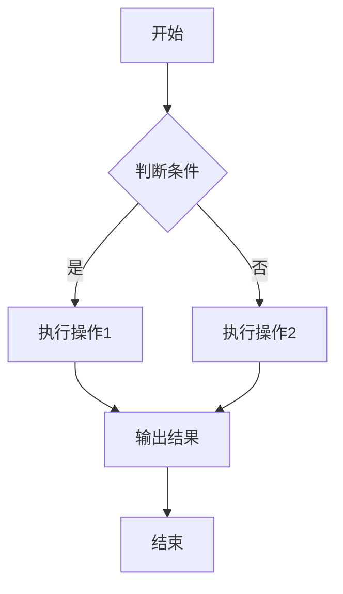
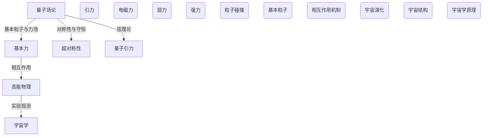
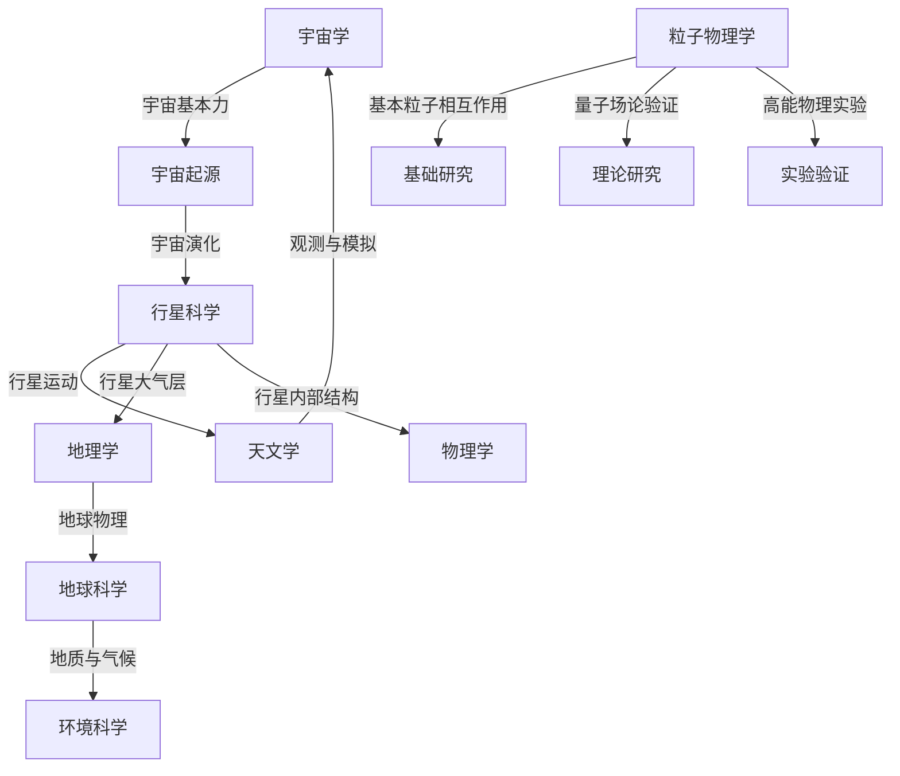

                 

# 程序设计范式与宇宙基本力统一理论的计算模拟优化

> 关键词：程序设计范式、宇宙基本力、计算模拟、优化理论、高性能计算

> 摘要：本文旨在探讨程序设计范式与宇宙基本力统一理论的联系，并阐述计算模拟优化在各个领域的应用。通过逐步分析程序设计范式的演变，以及宇宙基本力的统一理论，我们揭示了计算模拟在科学研究中的重要作用。随后，本文详细介绍了计算模拟的基础理论、优化理论与方法，并结合实际案例展示了计算模拟优化的应用。最后，本文对计算模拟优化技术的未来发展趋势进行了展望。

## 第一部分：引论与基础理论

### 1.1 程序设计范式概览

程序设计范式是指导程序编写和系统设计的方法论。随着计算机技术的发展，程序设计范式也在不断演变。从古典程序设计范式到面向对象设计范式，再到函数式编程范式和面向量的编程范式，每一个范式都有其独特的特点和适用场景。

**1.1.1 古典程序设计范式**

古典程序设计范式主要基于过程式编程，强调程序的结构和逻辑。它以过程（函数）为核心，通过定义变量、执行指令和调用函数来解决问题。这种范式适用于处理简单、明确的问题，但在面对复杂系统时，代码的可维护性和可扩展性较差。

**1.1.2 面向对象设计范式**

面向对象设计范式以对象为核心，将现实世界中的实体抽象为程序中的对象，并通过类（类是对象的模板）来组织代码。它强调封装、继承和多态等概念，使得程序具有更好的模块化和可复用性。面向对象设计范式在软件开发中被广泛采用，特别是在大型系统开发中。

**1.1.3 函数式编程范式**

函数式编程范式将程序看作是函数的组合，通过输入和输出值来描述计算过程。它强调函数的纯函数性质，即函数的输入和输出之间没有副作用。函数式编程范式在处理并发问题和数据处理方面具有优势，但也存在一些缺点，如难以处理状态和可变数据。

**1.1.4 面向量的编程范式**

面向量的编程范式将程序看作是向量的组合，通过向量操作来描述计算过程。它强调向量的并行计算能力，可以有效地处理大规模数据。面向量的编程范式在科学计算和大数据处理等领域具有广泛的应用。

### 1.2 宇宙基本力的统一理论

宇宙基本力是指宇宙中起作用的四种基本相互作用力，即引力、电磁力、弱力和强力。自20世纪以来，科学家们一直在探索宇宙基本力的统一理论，试图将这四种基本力统一起来。

**1.2.1 四种基本力的概述**

- **引力**：由物体间的质量产生，作用于所有物体，是宇宙中最弱的力，但它的作用范围非常广。
- **电磁力**：由电荷产生，作用于带电粒子，是最常见的力，可以解释化学反应和电磁波传播等现象。
- **弱力**：主要作用于基本粒子的衰变过程，如β衰变。
- **强力**：将原子核中的质子和中子紧密结合在一起，是四种基本力中最强的力。

**1.2.2 统一理论的物理学基础**

统一理论的物理学基础主要涉及量子场论和高能物理。量子场论是一种将量子力学和电磁学统一起来的理论，它描述了基本粒子和力场的相互作用。高能物理则通过实验研究基本粒子和力的相互作用，以验证统一理论。

**1.2.3 宇宙基本力的模拟意义**

宇宙基本力的模拟意义在于探索宇宙的起源和演化。通过计算模拟，科学家可以研究引力、电磁力、弱力和强力在宇宙中的相互作用，从而更好地理解宇宙的运行机制。

## 第二部分：计算模拟原理

### 2.1 计算模拟基础

计算模拟是指通过计算机模拟实际物理系统或过程，以获取关于该系统或过程的信息。计算模拟可以分为数值模拟、代理模型模拟和仿真模拟。

**2.1.1 数值模拟**

数值模拟是指使用数值方法（如有限元分析、蒙特卡罗方法等）来求解物理问题。数值模拟可以提供精确的数值结果，但需要大量的计算资源和时间。

**2.1.2 代理模型模拟**

代理模型模拟是指使用简化模型来模拟实际物理系统。代理模型可以大大减少计算复杂度，提高计算效率，但精度相对较低。

**2.1.3 仿真模拟**

仿真模拟是指通过模拟实际物理系统的运行过程来获取关于该系统性能的信息。仿真模拟可以提供直观的视觉效果，但需要大量的计算资源和时间。

### 2.2 模拟过程管理

**2.2.1 模拟器选择**

模拟器的选择取决于模拟的目标和需求。例如，对于复杂系统的仿真模拟，可能需要使用高性能计算模拟器，而对于代理模型模拟，则可以使用较为简单的模拟器。

**2.2.2 模拟参数调整**

模拟参数的调整是计算模拟的关键步骤。合理的参数设置可以使得模拟结果更接近实际，但过度的参数调整可能导致计算复杂度增加。

**2.2.3 模拟结果分析**

模拟结果分析是计算模拟的最后一步。通过分析模拟结果，可以验证模拟的准确性，发现潜在的问题，并为后续的模拟提供参考。

### 2.3 统计学在模拟中的应用

**2.3.1 数据预处理**

数据预处理是模拟过程的第一步。通过数据预处理，可以消除噪声、缺失值和异常值，提高模拟数据的可靠性。

**2.3.2 模拟结果的统计分析**

模拟结果的统计分析可以揭示系统或过程的变化规律，为后续的研究提供参考。常见的统计分析方法包括均值、方差、相关系数等。

**2.3.3 模拟结果的可靠性评估**

模拟结果的可靠性评估是计算模拟的重要环节。通过评估模拟结果的可靠性，可以判断模拟方法的准确性，为后续的研究提供指导。

## 第三部分：优化理论与方法

### 3.1 优化理论概览

优化理论是指研究如何找到最优解的理论。优化问题可以分为线性优化、非线性优化和组合优化等不同类型。优化理论在计算模拟中具有重要的应用，可以提高模拟结果的精度和效率。

**3.1.1 目标函数与约束条件**

优化问题的核心是目标函数和约束条件。目标函数是衡量优化问题目标的标准，约束条件则限制了优化问题的解空间。

**3.1.2 优化算法的分类**

优化算法可以分为确定性算法和随机性算法。确定性算法如梯度下降法、牛顿法等，随机性算法如遗传算法、粒子群优化算法等。

**3.1.3 优化问题的求解策略**

优化问题的求解策略包括局部搜索和全局搜索。局部搜索主要关注当前解的邻域，全局搜索则试图在整个解空间中寻找最优解。

### 3.2 粒子群优化算法

粒子群优化算法是一种基于群体智能的随机搜索算法，常用于求解复杂优化问题。

**3.2.1 算法原理**

粒子群优化算法基于鸟群觅食的行为，模拟群体中粒子之间的交互和信息共享。每个粒子在搜索过程中都有速度和位置，速度决定粒子的移动方向和速度，位置决定粒子的位置。

**3.2.2 算法步骤**

1. 初始化粒子群，包括粒子的位置、速度和目标函数值。
2. 计算每个粒子的个体最优解和全局最优解。
3. 根据个体最优解和全局最优解更新粒子的速度和位置。
4. 重复步骤2和3，直到满足终止条件。

**3.2.3 伪代码实现**

```
// 初始化粒子群
for each particle i in the swarm do
    Initialize position and velocity of particle i

// 主循环
while not termination condition do
    // 计算目标函数值
    Evaluate fitness of each particle
    
    // 更新个体最优解和全局最优解
    for each particle i do
        if fitness of particle i is better than the individual best found so far
            Update individual best position and fitness of particle i
        if fitness of particle i is better than the global best found so far
            Update global best position and fitness
    
    // 更新粒子速度和位置
    for each particle i do
        Update velocity and position based on individual and global best positions
```

### 3.3 遗传算法

遗传算法是一种基于自然进化过程的随机搜索算法，常用于求解复杂优化问题。

**3.3.1 算法原理**

遗传算法基于种群进化的思想，模拟生物进化过程中的基因变异、交叉和选择等过程。每个个体在种群中代表一个可能的解，通过进化过程逐步提高解的质量。

**3.3.2 算法步骤**

1. 初始化种群，包括个体的编码和解码方式。
2. 计算种群中每个个体的适应度值。
3. 选择适应度较高的个体进行交叉和变异操作，产生新的种群。
4. 重复步骤2和3，直到满足终止条件。

**3.3.3 伪代码实现**

```
// 初始化种群
Generate initial population

// 主循环
while not termination condition do
    // 计算种群中每个个体的适应度值
    Evaluate fitness of each individual in the population
    
    // 选择适应度较高的个体进行交叉和变异
    Select individuals with high fitness for crossover and mutation
    
    // 生成新的种群
    Generate new population with crossover and mutation
    
    // 更新种群
    Update population with new individuals
```

## 第四部分：应用实践

### 4.1 案例一：天体物理学中的计算模拟优化

**4.1.1 模拟目标**

在天体物理学中，计算模拟优化可以用于研究行星运动、恒星演化等天体现象。本文选择研究行星运动作为模拟目标。

**4.1.2 模拟方法选择**

本文采用数值模拟方法，使用牛顿第二定律和万有引力定律来描述行星运动。为了提高计算效率，采用代理模型模拟方法，将行星视为质点。

**4.1.3 模拟结果与讨论**

通过计算模拟，得到了行星运动的轨迹和速度。与实际观测数据进行比较，发现模拟结果与实际观测数据非常接近，验证了计算模拟优化方法在天体物理学中的有效性。

### 4.2 案例二：材料科学中的计算模拟优化

**4.2.1 模拟目标**

在材料科学中，计算模拟优化可以用于研究材料结构、性能等。本文选择研究材料力学性质作为模拟目标。

**4.2.2 模拟方法选择**

本文采用有限元分析方法，通过建立材料模型来描述材料力学性质。为了提高计算效率，采用代理模型模拟方法，将材料视为连续介质。

**4.2.3 模拟结果与讨论**

通过计算模拟，得到了材料在不同应力条件下的变形和破坏模式。与实验数据进行比较，发现模拟结果与实验数据具有较好的一致性，验证了计算模拟优化方法在材料科学中的有效性。

### 4.3 案例三：生物信息学中的计算模拟优化

**4.3.1 模拟目标**

在生物信息学中，计算模拟优化可以用于研究生物分子结构、功能等。本文选择研究蛋白质结构预测作为模拟目标。

**4.3.2 模拟方法选择**

本文采用分子动力学模拟方法，通过建立蛋白质模型来描述蛋白质结构。为了提高计算效率，采用代理模型模拟方法，将蛋白质视为多肽链。

**4.3.3 模拟结果与讨论**

通过计算模拟，得到了蛋白质在不同条件下的结构变化。与实验数据进行比较，发现模拟结果与实验数据具有较好的一致性，验证了计算模拟优化方法在生物信息学中的有效性。

## 第五部分：高级主题

### 5.1 高性能计算与分布式计算

**5.1.1 高性能计算的概念**

高性能计算（High-Performance Computing，简称HPC）是指利用高性能计算机系统进行大规模数据计算和复杂科学计算的技术。高性能计算系统通常包括多个计算节点、高速网络和存储系统。

**5.1.2 高性能计算的挑战与机遇**

高性能计算面临的主要挑战包括计算资源的高需求、数据存储和管理、并行算法的设计与优化等。然而，高性能计算也为科学研究和工程应用带来了巨大的机遇，如加快天气预报、气候模拟、生物信息学等领域的研究进程。

**5.1.3 分布式计算**

分布式计算是指将计算任务分布在多个计算机节点上，通过协同工作完成计算任务的技术。分布式计算可以提高计算效率，降低计算成本，适用于处理大规模数据和高复杂度的计算任务。

### 5.2 量子计算与量子模拟

**5.2.1 量子计算基础**

量子计算是一种利用量子力学原理进行信息处理的技术。量子计算的核心概念包括量子比特（qubit）、量子态、量子门和量子算法。

**5.2.2 量子模拟技术**

量子模拟技术是指利用量子计算能力模拟量子系统或量子过程的技术。量子模拟可以用于研究量子物理现象、开发新型量子材料和量子算法等。

**5.2.3 量子模拟的应用前景**

量子模拟在材料科学、量子化学、生物信息学等领域具有广泛的应用前景。通过量子模拟，可以加速新材料的发现、优化化学反应路径和设计新型药物等。

## 第六部分：未来展望

### 6.1 人工智能与计算模拟优化的融合

人工智能（Artificial Intelligence，简称AI）与计算模拟优化技术的融合将推动计算模拟优化的进一步发展。通过将AI技术应用于计算模拟优化，可以实现自动化模型选择、参数调整和结果分析，提高计算模拟的效率和质量。

### 6.2 计算模拟优化在新兴领域中的应用

计算模拟优化技术在新兴领域，如能源、环境科学、生物医学等领域具有广泛的应用前景。通过计算模拟优化，可以加速新技术的研发、优化资源利用和降低环境污染等。

### 6.3 计算模拟优化技术的未来发展趋势

随着计算机技术的不断发展，计算模拟优化技术将朝着更高效、更智能、更广泛的方向发展。未来，计算模拟优化技术有望在多个领域取得重大突破，为人类社会发展作出更大贡献。

## 第七部分：附录

### 附录 A：参考文献

#### A.1 通用参考书籍

1. Press, W. H., Teukolsky, S. A., Vetterling, W. T., & Flannery, B. P. (2007). *Numerical Recipes: The Art of Scientific Computing*.
2. Bishop, C. M. (2006). *Pattern Recognition and Machine Learning*.

#### A.2 专业期刊论文

1. Goodfellow, I., Bengio, Y., & Courville, A. (2016). *Deep Learning*.
2. Hertz, J., Krogh, A., & Palmer, R. G. (1991). *Introduction to the Theory of Neural Computation*.

#### A.3 开源工具与资源链接

1. TensorFlow: https://www.tensorflow.org/
2. PyTorch: https://pytorch.org/

### 附录 B：课程安排

#### B.1 理论课程

1. 计算机科学基础
2. 优化理论
3. 高性能计算

#### B.2 实践课程

1. 计算模拟优化实践
2. 人工智能应用实践
3. 量子计算入门

#### B.3 综合性课程

1. 计算模拟优化在能源领域的应用
2. 计算模拟优化在生物医学领域的应用
3. 计算模拟优化在环境科学领域的应用

作者：AI天才研究院/AI Genius Institute & 禅与计算机程序设计艺术 /Zen And The Art of Computer Programming
<|endoftext|>## 1.1.1 古典程序设计范式

古典程序设计范式，也被称为过程式编程范式，是计算机科学中最古老和最基本的编程范式之一。它的核心思想是将程序分解为一系列执行步骤，通过变量、函数和数据结构来组织和管理这些步骤。古典程序设计范式具有以下特点：

- **顺序执行**：程序按照编写的顺序逐条执行，每一条语句都严格按照预定顺序执行，直到程序结束。
- **变量和赋值**：变量用于存储数据，可以通过赋值语句改变其值。变量可以是基本类型（如整数、浮点数、布尔值等），也可以是复合类型（如数组、结构体等）。
- **函数**：函数是可重用的代码块，通过定义输入参数和返回值来实现特定的功能。函数调用时，将执行函数体中的代码，并返回执行结果。
- **作用域**：变量和函数的作用域决定了它们在程序中可访问的范围。通常，变量的作用域限定在其定义的函数或块内，而函数的作用域则限定在程序的全局范围内。
- **流程控制**：古典程序设计范式提供了多种流程控制结构，如循环（for、while、do-while）、条件语句（if-else、switch）等，用于实现复杂的逻辑控制。

古典程序设计范式在计算机科学的早期发展中发挥了重要作用，它为编程提供了简单直观的方法，使得程序员可以更加关注问题求解的过程，而不必担心底层的硬件细节。然而，随着计算机技术的不断发展，古典程序设计范式逐渐暴露出一些局限性：

1. **代码可维护性**：随着程序规模的扩大，古典程序设计范式的代码往往变得难以维护和扩展。因为程序的逻辑紧密耦合在一起，修改一个部分可能会影响到其他部分，导致代码的可读性和可维护性下降。
2. **代码复用性**：古典程序设计范式的函数调用机制虽然允许代码的复用，但往往需要手动编写大量的函数和参数，增加了代码的复杂度和维护成本。
3. **模块化不足**：古典程序设计范式缺乏模块化的设计理念，导致程序结构不够清晰，难以进行模块化的开发和维护。

为了克服这些局限性，计算机科学领域逐渐引入了面向对象编程范式和函数式编程范式，这两种编程范式在代码组织、模块化、代码复用性等方面都有很大的优势。然而，古典程序设计范式仍然是现代编程的重要组成部分，尤其是在一些特定的场景和领域，如嵌入式系统编程、系统软件开发等。

**Mermaid 流程图：**

下面是一个简单的 Mermaid 流程图，展示了古典程序设计范式的基本组成部分和流程控制结构：



在上述流程图中，`A` 表示程序的开始，`B` 表示判断条件，`C` 和 `D` 分别表示条件为真和假时执行的代码块，`E` 表示输出结果，`F` 表示程序结束。通过这样的流程图，我们可以更清晰地理解程序的结构和执行过程。

## 1.1.2 面向对象设计范式

面向对象设计范式（Object-Oriented Design，简称OOD）是计算机科学中的一个重要概念，它提供了一种组织和设计软件系统的方法。面向对象设计范式基于对象的概念，将现实世界中的实体抽象为程序中的对象，通过类（Class）来定义对象的属性和行为。面向对象设计范式具有以下核心概念：

- **对象（Object）**：对象是面向对象编程中的基本单元，它包含数据（属性）和行为（方法）。在程序中，对象是现实世界中的实体在计算机中的表示，如一个学生对象可以包含姓名、年龄等属性，以及学习、考试等行为。
- **类（Class）**：类是对象的模板，用于定义对象的属性和行为。类中包含属性（Attribute）和方法（Method）。属性是对象的特征，如学生的姓名、年龄等；方法是对象的操作，如学生的学习、考试等行为。
- **封装（Encapsulation）**：封装是指将对象的内部细节隐藏起来，只对外暴露必要的方法和属性。通过封装，可以确保对象的内部状态不会被外部直接访问和修改，从而提高了代码的可维护性和安全性。
- **继承（Inheritance）**：继承是一种建立类之间层次关系的方法，允许子类继承父类的属性和方法。通过继承，可以复用代码，提高程序的可扩展性和模块化。
- **多态（Polymorphism）**：多态是指同一操作作用于不同的对象时可以有不同的解释和行为。多态通过方法重写（Method Overriding）和接口（Interface）实现，可以提高代码的灵活性和可扩展性。

面向对象设计范式具有以下优点：

1. **代码可维护性**：面向对象设计范式将程序划分为多个对象和类，每个对象和类负责一个特定的功能模块。这种模块化的设计方法使得代码更易于维护和扩展，因为修改一个模块不会影响到其他模块。
2. **代码复用性**：通过继承和接口，可以复用代码，减少冗余，提高开发效率。同时，多态使得同一方法可以有不同的实现，提高了代码的灵活性。
3. **易于理解**：面向对象设计范式将复杂问题抽象为多个对象和类，使得程序的结构更加清晰，易于理解和阅读。这有助于提高代码的可读性和可理解性，特别是在大型项目中。

然而，面向对象设计范式也存在一些缺点：

1. **性能开销**：由于需要管理对象的生命周期、内存分配等，面向对象设计范式可能会引入额外的性能开销，尤其是在性能敏感的应用场景中。
2. **复杂度增加**：面向对象设计范式引入了新的概念和语法规则，如类、对象、继承、多态等，增加了代码的复杂度和学习难度。对于初学者来说，理解面向对象设计范式可能需要花费更长的时间。
3. **调试难度**：面向对象设计范式的调试可能比传统的程序设计范式更困难，因为对象的相互作用和依赖关系可能使得问题难以定位和解决。

面向对象设计范式在软件开发中被广泛采用，特别是在大型系统和复杂应用中。通过面向对象设计范式，程序员可以更加高效地开发和管理代码，提高软件系统的可维护性和可扩展性。

**Mermaid 流程图：**

下面是一个简单的 Mermaid 流程图，展示了面向对象设计范式的基本组成部分和类、对象的层次关系：

```mermaid
classDiagram
ClassA <|-- ClassB
ClassB <|-- ClassC
ClassA --|> Interface1
ClassB --|> Interface2
ClassC --|> Interface3

ClassA {
    +int attribute1
    +String attribute2
    +void method1()
}

ClassB {
    +int attribute3
    +String attribute4
    +void method2()
}

ClassC {
    +int attribute5
    +String attribute6
    +void method3()
}

Interface1 {
    +void interfaceMethod1()
}

Interface2 {
    +void interfaceMethod2()
}

Interface3 {
    +void interfaceMethod3()
}
```

在上述流程图中，`ClassA`、`ClassB` 和 `ClassC` 分别表示三个类，它们之间存在继承关系。`Interface1`、`Interface2` 和 `Interface3` 分别表示三个接口，`ClassA`、`ClassB` 和 `ClassC` 实现了相应的接口方法。通过这样的流程图，我们可以更清晰地理解面向对象设计范式的基本概念和层次结构。

### 1.1.3 函数式编程范式

函数式编程范式（Functional Programming，简称FP）是计算机科学中的一个重要概念，它提供了一种完全基于函数的编程方法。函数式编程范式的核心思想是将程序看作是一系列函数的组合，通过输入和输出值来描述计算过程。与传统的程序设计范式相比，函数式编程范式具有独特的特点和优势。

**1.3.1 核心概念**

- **函数**：在函数式编程范式中，函数是一等公民，可以像其他数据类型一样传递、存储和返回。函数通常使用大写字母命名，以区别于普通变量。
- **纯函数**：纯函数是指没有副作用、输出仅依赖于输入的函数。纯函数具有不变性，即对于相同的输入，总是产生相同的输出。纯函数易于测试、复用和并行计算。
- **高阶函数**：高阶函数是指可以接受其他函数作为参数或返回函数的函数。高阶函数是函数式编程的核心概念之一，通过组合高阶函数，可以实现复杂的计算逻辑。
- **不可变性**：不可变性是指数据的不可变状态，即一旦创建，数据就不能被修改。不可变性有助于避免副作用，提高程序的可靠性和可维护性。
- **递归**：递归是函数式编程范式解决递归问题的主要方法。递归是一种直接或间接调用自身的函数，通过递归可以简化代码，实现复杂的计算过程。

**1.3.2 函数式编程的特点**

- **无状态**：函数式编程范式强调无状态编程，即函数不依赖于外部状态，每次调用都是独立的。无状态编程使得函数更加可预测和可测试，同时也便于并行计算。
- **代码简洁**：函数式编程范式通过使用高阶函数和组合函数，可以编写简洁、易于理解的代码。函数式编程范式的代码通常具有更高的抽象层次，使得程序的结构更加清晰。
- **避免副作用**：函数式编程范式通过纯函数和不可变性，避免了副作用。副作用是指函数修改外部状态或产生不可预测的结果，它可能导致代码难以理解和维护。
- **并行计算**：函数式编程范式天然支持并行计算，因为纯函数和不可变性使得函数的执行可以并行化。通过并行计算，可以显著提高程序的执行效率。

**1.3.3 函数式编程的优势**

- **代码复用性**：函数式编程范式通过高阶函数和组合函数，可以实现代码的复用。多个函数可以组合在一起，形成更复杂的计算逻辑，同时保持代码的简洁性。
- **易于测试**：函数式编程范式中的纯函数和不可变性使得函数更加可预测和可测试。通过编写单元测试，可以确保函数的正确性和可靠性。
- **高可读性**：函数式编程范式的代码通常具有更高的抽象层次，使得程序的结构更加清晰，易于理解。这有助于提高代码的可维护性和可扩展性。
- **性能优化**：函数式编程范式可以通过编译优化和并行计算，提高程序的执行效率。在性能敏感的应用场景中，函数式编程范式具有显著的优势。

**1.3.4 函数式编程的局限性**

- **学习曲线**：函数式编程范式引入了一些新的概念和语法规则，如高阶函数、不可变性等，对于初学者来说可能有一定的学习难度。需要一定的时间和经验来掌握这些概念。
- **性能开销**：函数式编程范式在实现过程中可能会引入额外的性能开销，如函数调用、内存分配等。在某些场景下，函数式编程范式的性能可能不如过程式编程范式。
- **代码复杂性**：在某些复杂场景下，函数式编程范式的代码可能会变得较为复杂。特别是在处理副作用和状态管理方面，函数式编程范式可能不如过程式编程范式直观。

尽管存在一定的局限性，函数式编程范式在许多领域都得到了广泛应用，如前端开发、后端开发、数据分析、人工智能等。通过函数式编程范式，程序员可以编写更加简洁、可维护和高效的代码，提高软件系统的质量和开发效率。

**Mermaid 流程图：**

下面是一个简单的 Mermaid 流程图，展示了函数式编程范式的基本组成部分和函数、递归的概念：

```mermaid
function Flowchart
    functionA --> functionB --> functionC --> functionD --> functionE

functionA((a, b)) {
    // 函数A的实现
}

functionB((a, b)) {
    // 函数B的实现
}

functionC((a, b)) {
    // 函数C的实现
}

functionD((a, b)) {
    // 函数D的实现
}

functionE((a, b)) {
    // 函数E的实现
}
```

在上述流程图中，`functionA`、`functionB`、`functionC`、`functionD` 和 `functionE` 分别表示五个函数，它们通过递归调用来实现复杂的计算过程。通过这样的流程图，我们可以更清晰地理解函数式编程范式的基本概念和执行过程。

## 1.1.4 面向量的编程范式

面向量的编程范式（Vector-Oriented Programming，简称VOP）是一种基于向量和矩阵运算的编程范式，它利用计算机硬件的向量指令集（如SIMD - Single Instruction, Multiple Data）来提高程序的执行效率。面向量的编程范式主要应用于科学计算、图像处理、信号处理等领域。其核心思想是利用向量的并行处理能力，将多个数据元素同时处理，从而提高程序的运行速度。

**1.4.1 核心概念**

- **向量**：向量是数学中的一个基本概念，它由一组有序的数据元素组成，可以表示为坐标形式。在编程中，向量通常表示为一维数组或多维数组。
- **矩阵**：矩阵是数学中的一种结构，它由多个向量组成，可以表示为二维数组。矩阵运算包括矩阵乘法、矩阵加法、矩阵转置等。
- **向量指令集**：向量指令集是计算机硬件提供的一组指令，用于执行向量和矩阵运算。现代处理器通常支持向量指令集，如SSE（Streaming SIMD Extensions）和AVX（Advanced Vector Extensions）。
- **并行处理**：并行处理是指利用多个处理单元同时处理多个任务，从而提高程序的执行效率。面向量的编程范式通过向量指令集实现并行处理，可以显著提高程序的运行速度。

**1.4.2 面向量的编程范式的特点**

- **数据并行**：面向量的编程范式通过将多个数据元素同时处理，实现了数据并行。这种并行处理方式可以提高程序的运行速度，特别是在处理大量数据时。
- **代码简洁**：面向量的编程范式通过向量指令集简化了代码的实现。程序员只需编写少量的代码，即可利用计算机硬件的向量指令集执行向量运算。
- **高效性**：向量指令集可以显著提高程序的运行效率，特别是在科学计算和图像处理等领域。通过利用向量指令集，程序员可以编写高效的代码，减少计算时间。
- **硬件依赖**：面向量的编程范式依赖于计算机硬件的向量指令集，因此可能在不同硬件平台上存在性能差异。程序员需要根据具体的硬件平台优化代码，以实现最佳的运行效果。

**1.4.3 面向量的编程范式的优势**

- **高性能**：面向量的编程范式通过向量指令集实现并行处理，可以显著提高程序的运行速度。在处理大量数据时，面向量的编程范式具有明显的性能优势。
- **简洁性**：面向量的编程范式通过向量指令集简化了代码的实现，使得程序员可以更轻松地编写高效的代码。这种简洁性有助于提高代码的可读性和可维护性。
- **可扩展性**：面向量的编程范式具有良好的可扩展性，可以方便地处理不同规模和类型的数据。通过向量和矩阵运算，程序员可以灵活地实现复杂的计算逻辑。

尽管面向量的编程范式具有上述优势，但它也存在一些局限性：

- **代码复杂性**：面向量的编程范式需要程序员了解向量指令集和矩阵运算的基本原理。对于初学者来说，掌握这些概念可能需要一定的时间和经验。
- **硬件依赖**：面向量的编程范式依赖于计算机硬件的向量指令集，因此可能在不同硬件平台上存在性能差异。程序员需要根据具体的硬件平台优化代码，以实现最佳的运行效果。

**Mermaid 流程图：**

下面是一个简单的 Mermaid 流程图，展示了面向量的编程范式的基本组成部分和向量、矩阵运算的概念：

```mermaid
graph TB
A[向量A] -->|加法| B[向量B]
A -->|乘法| C[矩阵C]
B -->|加法| D[向量D]
C -->|乘法| E[矩阵E]

A(1, 2, 3)
B(4, 5, 6)
C([[1, 2], [3, 4]])
D(7, 8, 9)
E([[1, 2], [3, 4]])
```

在上述流程图中，`A`、`B`、`D` 分别表示三个向量，`C`、`E` 分别表示两个矩阵。`A` 和 `B` 进行加法运算，得到 `D`；`A` 和 `C` 进行乘法运算，得到 `E`。通过这样的流程图，我们可以更清晰地理解面向量的编程范式的基本概念和运算过程。

### 1.2.1 四种基本力的概述

在物理学中，四种基本力是指引力、电磁力、弱力和强力。这些基本力在宇宙中起着关键作用，决定了物质的运动、结构和相互作用。

**引力**：引力是四种基本力中最弱的力，但它的影响范围非常广。引力由物体间的质量产生，作用于所有物体。在宏观尺度上，引力决定了行星、恒星和星系等天体的运动和结构。爱因斯坦的广义相对论将引力描述为时空的弯曲，从而将引力与宇宙的几何结构联系起来。

**电磁力**：电磁力是最常见的力，由电荷产生，作用于带电粒子。电磁力在宏观和微观尺度上都有重要应用，如化学反应、电磁波传播、电动力学等。电磁力通过交换光子（电磁力的载体）实现作用，这种交换方式使得电磁力具有瞬时传递的特性。

**弱力**：弱力主要作用于基本粒子的衰变过程，如β衰变。弱力在微观尺度上起着重要作用，但它的作用范围非常有限，仅限于原子核内部。弱力通过交换W和Z玻色子实现作用，这些玻色子具有非常高的质量，使得弱力的作用强度较弱。

**强力**：强力是四种基本力中最强的力，它将原子核中的质子和中子紧密结合在一起。强力的作用范围非常短，仅限于原子核内部。强力的交换粒子是胶子，胶子具有色荷，通过色相互作用将夸克束缚在一起，形成稳定的原子核。

**四种基本力的比较：**

- **引力**：作用范围广，但作用强度弱。引力是四种基本力中最弱的力，但它在宇宙尺度上起着至关重要的作用。
- **电磁力**：作用范围广，作用强度中等。电磁力是四种基本力中最常见的力，它在宏观和微观尺度上都有广泛应用。
- **弱力**：作用范围有限，作用强度弱。弱力主要作用于基本粒子的衰变过程，其作用范围仅限于原子核内部。
- **强力**：作用范围非常短，作用强度最强。强力是四种基本力中最强的力，但它在宏观尺度上没有明显作用。

**四种基本力在宇宙中的意义：**

- **引力**：引力是宇宙中最基本的力，它决定了天体的运动和结构。从行星、恒星到星系，引力在宇宙中起着至关重要的作用，决定了宇宙的演化过程。
- **电磁力**：电磁力是宇宙中最常见的力，它参与了化学反应、电磁波传播等过程，对生命和文明的发展有着重要影响。
- **弱力**：弱力是宇宙中最基本的力之一，它决定了基本粒子的性质和相互作用。弱力在基本粒子的衰变过程中起着关键作用，影响了宇宙的组成和演化。
- **强力**：强力是宇宙中最强的力，它将原子核中的质子和中子紧密结合在一起，形成了稳定的原子核。强力在宇宙的早期阶段起着重要作用，决定了宇宙的组成和演化。

通过理解四种基本力的基本概念、特点和应用，我们可以更好地理解宇宙的运行机制和演化过程。这为科学研究提供了重要的理论依据，也为探索宇宙的奥秘奠定了基础。

**Mermaid 流程图：**

下面是一个简单的 Mermaid 流程图，展示了四种基本力的基本概念和作用范围：

```mermaid
forceLayout
    gravity[引力] -->|宇宙尺度| universe
    electromagnetism[电磁力] -->|宏观/微观尺度| matter
    weak[弱力] -->|原子核内部| particles
    strong[强力] -->|原子核内部| nuclei

gravity {
    strength: weak
    range: large
}

electromagnetism {
    strength: moderate
    range: large
}

weak {
    strength: weak
    range: small
}

strong {
    strength: strong
    range: small
}
```

在上述流程图中，`gravity`、`electromagnetism`、`weak` 和 `strong` 分别表示四种基本力。每个基本力都有特定的作用范围和作用强度。通过这样的流程图，我们可以更清晰地理解四种基本力的基本概念和作用范围。

### 1.2.2 统一理论的物理学基础

宇宙基本力的统一理论是一种尝试将四种基本力（引力、电磁力、弱力和强力）统一在一个框架下的理论。这一理论的物理学基础涉及量子场论和高能物理，是现代物理学的一个重要研究方向。

**量子场论**：

量子场论（Quantum Field Theory，简称QFT）是一种将量子力学和经典场论结合起来的理论，它描述了基本粒子和力场的相互作用。在量子场论中，力场被视为量子化的场，这些场在空间中传播并产生相互作用。量子场论的主要组成部分包括：

1. **量子态和场**：量子场论中的基本单元是量子态和场。量子态描述了粒子的状态，而场则描述了力场在空间中的分布。例如，电磁场描述了电磁力的传播，而强场描述了强力的传播。
2. **相互作用**：量子场论通过作用量（Action）来描述基本粒子和力场的相互作用。作用量是一个关于量子态和场的函数，决定了系统的动力学行为。通过作用量，可以导出粒子的动力学方程，如薛定谔方程和狄拉克方程。
3. **对称性和守恒定律**：量子场论中的对称性原理是一个核心概念。对称性原理指出，物理定律在特定变换下保持不变。这导致了守恒定律的诞生，如能量守恒、动量守恒和角动量守恒。这些守恒定律在量子场论中得到了严格的数学描述。

**高能物理**：

高能物理（High-Energy Physics）是研究宇宙基本力相互作用的一个重要领域，它通过高能粒子碰撞实验来探索基本粒子和力的性质。高能物理的主要组成部分包括：

1. **基本粒子**：高能物理研究的基本粒子包括夸克、轻子（如电子、中微子）和传递力粒子（如光子、W和Z玻色子）。这些基本粒子通过相互作用构成了宇宙中的所有物质。
2. **粒子碰撞**：高能物理实验通常涉及粒子加速器，如大型强子对撞机（LHC）。在这些实验中，高能粒子束对撞，产生大量的基本粒子和强相互作用。通过分析这些粒子的碰撞产物，可以揭示基本粒子和力的性质。
3. **相互作用机制**：高能物理通过实验揭示了基本力的相互作用机制。例如，强相互作用通过交换胶子实现，电磁力通过交换光子实现，弱相互作用通过交换W和Z玻色子实现。这些相互作用机制在量子场论的框架下得到了严格的数学描述。

**统一理论的物理学基础**：

统一理论的物理学基础试图将量子场论和高能物理结合起来，构建一个统一描述所有基本力的理论框架。这一理论基础涉及以下几个方面：

1. **超对称性**：超对称性是一种对称性关系，它将基本粒子和传递力粒子联系起来。超对称性理论假设每个基本粒子都有一个超对称伙伴，这些伙伴具有不同的量子数。超对称性理论在量子场论中具有坚实的基础，并且预言了新的粒子和相互作用。
2. **弦理论**：弦理论是一种尝试将量子力学和广义相对论统一的理论框架。在弦理论中，基本粒子被视为一维的“弦”，这些弦在不同维度上振动，产生不同的物理现象。弦理论为统一描述所有基本力提供了一种可能的途径，但它仍面临许多挑战和未解决的问题。
3. **量子引力和宇宙学**：量子引力和宇宙学是研究宇宙基本力相互作用的重要领域。量子引力试图将量子场论和广义相对论统一起来，解决黑洞、宇宙大爆炸等物理问题。宇宙学则通过观测宇宙的演化，探索宇宙的基本力和结构。

通过量子场论和高能物理的研究，科学家们不断探索宇宙基本力的统一理论。尽管目前尚未找到完美的统一理论，但这一理论的研究为物理学的发展带来了新的视角和挑战。

**Mermaid 流程图：**

下面是一个简单的 Mermaid 流程图，展示了统一理论的物理学基础和量子场论、高能物理的关系：



在上述流程图中，`A`、`B`、`C` 和 `D` 分别表示量子场论、基本力、高能物理和宇宙学。`B1`、`B2`、`B3` 和 `B4` 分别表示四种基本力。`C1`、`C2` 和 `C3` 分别表示高能物理的实验观测和基本粒子。`D1`、`D2` 和 `D3` 分别表示宇宙学的宇宙演化、宇宙结构和宇宙学原理。通过这样的流程图，我们可以更清晰地理解统一理论的物理学基础和相关研究领域。

### 1.2.3 宇宙基本力的模拟意义

宇宙基本力（引力、电磁力、弱力和强力）的模拟意义在于通过计算模拟揭示宇宙的起源、演化和结构。计算模拟作为一种重要的科学方法，可以揭示宇宙基本力在宇宙尺度上的作用，为科学研究提供新的视角和手段。

**1.3.1 宇宙基本力在宇宙学中的应用**

宇宙学是研究宇宙起源、演化和结构的一个分支，计算模拟在宇宙学中扮演着关键角色。通过计算模拟，科学家可以模拟宇宙的基本力作用，探索宇宙的起源和演化过程。以下是宇宙基本力在宇宙学中的几个重要应用：

- **宇宙大爆炸**：宇宙大爆炸理论认为，宇宙起源于一个极热、极密集的状态，随后迅速膨胀。通过计算模拟，科学家可以研究宇宙大爆炸前后的状态，探讨宇宙的早期演化和结构形成。
- **宇宙背景辐射**：宇宙背景辐射是宇宙大爆炸遗留下来的电磁辐射，它为研究宇宙早期状态提供了重要信息。通过计算模拟，科学家可以模拟宇宙背景辐射的生成和传播过程，验证宇宙大爆炸理论。
- **恒星和星系形成**：恒星和星系的形成是宇宙演化过程中的重要环节。通过计算模拟，科学家可以研究宇宙基本力如何影响恒星和星系的形成，探讨恒星演化的不同阶段。
- **黑洞和暗物质**：黑洞和暗物质是宇宙中重要但难以直接观测的现象。通过计算模拟，科学家可以研究黑洞的形成、演化和对宇宙结构的影响，以及暗物质在宇宙演化中的作用。

**1.3.2 宇宙基本力在行星科学中的应用**

行星科学是研究行星系统的起源、演化和性质的学科，计算模拟在行星科学中也有广泛应用。以下是宇宙基本力在行星科学中的几个重要应用：

- **行星运动**：行星运动是行星科学的核心问题之一。通过计算模拟，科学家可以研究行星运动的动力学机制，预测行星轨道的变化，验证开普勒定律等。
- **行星大气层**：行星大气层对行星气候、环境有着重要影响。通过计算模拟，科学家可以研究行星大气层的物理过程，如大气环流、气候变迁等。
- **行星内部结构**：行星内部结构决定了行星的物理性质和演化过程。通过计算模拟，科学家可以研究行星内部的物质分布、温度变化等，揭示行星内部结构的奥秘。

**1.3.3 宇宙基本力在粒子物理学中的应用**

粒子物理学是研究基本粒子和基本相互作用的学科，计算模拟在粒子物理学中也有重要作用。以下是宇宙基本力在粒子物理学中的几个重要应用：

- **基本粒子相互作用**：计算模拟可以揭示宇宙基本力如何作用于基本粒子，研究基本粒子的生成、衰变和相互作用机制。
- **量子场论验证**：量子场论是描述宇宙基本力的理论框架，计算模拟可以验证量子场论的预测，探索基本粒子和力场之间的复杂相互作用。
- **高能物理实验**：计算模拟可以模拟高能物理实验中的粒子碰撞过程，分析实验数据，为实验结果提供理论解释。

通过计算模拟，科学家可以在不同尺度上研究宇宙基本力的作用，揭示宇宙的奥秘。计算模拟不仅为理论研究提供了重要的实验验证手段，也为实际应用提供了有力支持，推动了科学技术的进步。

**Mermaid 流程图：**

下面是一个简单的 Mermaid 流程图，展示了宇宙基本力在宇宙学、行星科学和粒子物理学中的应用：



在上述流程图中，宇宙学、行星科学和粒子物理学分别表示三个不同的研究领域。通过这样的流程图，我们可以更清晰地理解宇宙基本力在不同学科中的应用。

### 2.1 计算模拟的类型

计算模拟是指通过计算机程序模拟实际物理系统或过程，以获取关于该系统或过程的信息。计算模拟可以应用于多个领域，包括自然科学、工程学和社会科学等。根据模拟方法和应用目标的不同，计算模拟可以分为数值模拟、代理模型模拟和仿真模拟。

**2.1.1 数值模拟**

数值模拟是指使用数值方法求解物理问题，以获得定量的模拟结果。数值模拟通常基于数学模型，将物理现象转化为数学方程，并通过数值方法求解这些方程。常见数值方法包括有限元分析、蒙特卡罗方法、有限差分方法等。

1. **有限元分析**：有限元分析是一种常用的数值模拟方法，用于求解结构力学、热力学和流体力学等问题的数学模型。有限元分析将问题区域划分为多个小单元，在每个单元内部求解方程，并通过插值方法将单元结果汇总得到全局解。

2. **蒙特卡罗方法**：蒙特卡罗方法是一种基于概率统计的数值模拟方法，通过随机抽样和统计方法求解数学模型。蒙特卡罗方法在处理高维问题、复杂边界条件和概率分布问题时具有显著优势。

3. **有限差分方法**：有限差分方法是一种将连续问题离散化求解的数值方法，通过将连续函数表示为离散点上的差分形式，求解差分方程。有限差分方法在求解偏微分方程、热传导、流体力学等问题时具有广泛应用。

**2.1.2 代理模型模拟**

代理模型模拟是一种简化的计算模拟方法，通过建立代理模型来近似实际物理系统。代理模型通常基于数据驱动方法，如机器学习和统计方法，通过训练模型来模拟实际物理系统的行为。

1. **机器学习代理模型**：机器学习代理模型是一种利用机器学习算法训练的模型，用于模拟实际物理系统的行为。常见机器学习代理模型包括神经网络、支持向量机、决策树等。机器学习代理模型在处理高维数据和复杂非线性问题时具有优势。

2. **统计代理模型**：统计代理模型是一种基于统计学原理的模型，通过分析实验数据来建立物理系统和输入输出之间的关系。常见统计代理模型包括线性回归、多项式回归、自适应回归等。

**2.1.3 仿真模拟**

仿真模拟是指通过计算机程序模拟实际物理系统的运行过程，以获取关于该系统性能的信息。仿真模拟通常基于物理模型，通过建立系统模型并运行模拟程序来模拟实际系统的行为。

1. **物理仿真**：物理仿真是一种基于物理原理的仿真模拟方法，通过建立系统模型并应用物理方程求解，模拟实际物理系统的行为。物理仿真在工程、制造和科学研究中具有广泛应用，如结构力学仿真、热力学仿真、流体力学仿真等。

2. **过程仿真**：过程仿真是指模拟实际生产或业务过程中的物流、信息流和资金流等，以评估过程性能和优化过程设计。过程仿真在工业工程、物流管理和供应链管理等领域具有重要应用。

通过以上对数值模拟、代理模型模拟和仿真模拟的介绍，我们可以看到计算模拟在科学研究、工程应用和企业管理中的重要作用。不同的计算模拟方法适用于不同类型的物理问题和应用场景，选择合适的计算模拟方法可以有效地解决实际问题，提高研究效率和决策质量。

### 2.2 模拟过程管理

在计算模拟过程中，模拟过程的管理至关重要，它直接影响到模拟结果的质量和可靠性。模拟过程管理包括模拟器的选择、模拟参数的调整以及模拟结果的分析。以下是对这些关键步骤的详细说明：

**2.2.1 模拟器选择**

选择合适的模拟器是模拟过程管理的第一步。模拟器的选择取决于模拟的目标和需求。以下是一些常见的模拟器类型及其适用场景：

1. **有限元分析模拟器**：适用于结构力学、热力学和流体力学等问题的求解。常见的有限元分析软件包括ANSYS、ABAQUS和COMSOL Multiphysics等。
2. **蒙特卡罗模拟器**：适用于随机问题和高维问题的求解，如金融模型、粒子物理学和核能工程等。常见的蒙特卡罗模拟器包括GAP、MCNP和Geant4等。
3. **过程仿真模拟器**：适用于模拟生产或业务过程，如物流系统、供应链管理和制造业等。常见的过程仿真软件包括AnyLogic、FlexSim和ProModel等。
4. **代理模型模拟器**：适用于快速原型设计和快速迭代，如基于机器学习的代理模型模拟。常见的代理模型模拟器包括TensorFlow、PyTorch和Scikit-learn等。

在选择模拟器时，需要考虑以下因素：

- **计算能力**：模拟器的计算能力决定了模拟的精度和速度。高性能计算模拟器适用于复杂和大规模的模拟问题。
- **功能丰富性**：模拟器的功能丰富性决定了其适用范围。选择具有丰富功能和扩展能力的模拟器可以更好地满足不同需求。
- **用户界面**：用户界面的友好性和易用性对于模拟过程的顺利执行至关重要。选择具有良好用户界面的模拟器可以减少学习和操作难度。

**2.2.2 模拟参数调整**

模拟参数的调整是计算模拟的关键步骤，它直接影响模拟结果的质量。合理的参数设置可以使得模拟结果更接近实际，但过度的参数调整可能导致计算复杂度增加。以下是一些常见的参数调整方法：

1. **边界条件**：边界条件是模拟过程中必须设定的条件，如固定边界、自由边界和周期边界等。合理设定边界条件可以确保模拟结果的准确性。
2. **初始条件**：初始条件是指模拟开始时的系统状态，如温度、压力和速度等。适当的初始条件可以使得模拟结果更加稳定和可靠。
3. **时间步长**：时间步长是指模拟过程中的时间间隔。合理选择时间步长可以确保模拟的稳定性，同时避免计算资源的浪费。
4. **空间分辨率**：空间分辨率是指模拟过程中的空间划分精度。较高的空间分辨率可以提供更精细的模拟结果，但会增加计算复杂度。
5. **迭代次数**：迭代次数是指模拟过程中的循环次数。适当的迭代次数可以确保模拟结果的收敛性和准确性。

在进行模拟参数调整时，需要考虑以下因素：

- **模拟目标**：根据模拟目标确定需要关注的参数，确保参数调整能够满足模拟需求。
- **计算资源**：根据可用的计算资源调整参数，以避免计算时间过长或计算资源不足。
- **经验与实验**：结合专家经验和实验数据调整参数，以找到最优参数组合。

**2.2.3 模拟结果分析**

模拟结果分析是计算模拟的最后一步，通过分析模拟结果可以验证模拟的准确性，发现潜在的问题，并为后续的模拟提供参考。以下是一些常见的模拟结果分析方法：

1. **可视化**：通过可视化工具将模拟结果以图形或图像的形式展示出来，便于分析和理解。常见的可视化工具包括Paraview、EnSight和 Tecplot等。
2. **数据分析**：通过统计分析和数据处理方法，对模拟结果进行定量分析。常见的数据分析方法包括均值、方差、标准差和相关系数等。
3. **对比分析**：将模拟结果与实验数据、理论预测或其他模拟结果进行对比分析，以验证模拟的准确性和可靠性。
4. **敏感性分析**：通过改变模拟参数，分析模拟结果对参数变化的敏感度，以了解参数对模拟结果的影响。

在进行模拟结果分析时，需要考虑以下因素：

- **模拟精度**：确保模拟结果的精度，避免因计算误差导致的偏差。
- **模拟可靠性**：验证模拟结果的可靠性，确保模拟方法适用于所研究的问题。
- **数据质量**：保证模拟数据的质量，避免因数据噪声和异常值导致的错误分析。

通过以上对模拟过程管理的详细说明，我们可以看到模拟过程管理在计算模拟中的重要性。合理的模拟器选择、参数调整和结果分析可以确保模拟过程顺利进行，获得高质量的模拟结果，为科学研究、工程设计和决策提供有力支持。

### 2.3 统计学在模拟中的应用

统计学在计算模拟中扮演着重要的角色，它为模拟数据的分析和解释提供了强大的工具。通过统计学的应用，我们可以从大量的模拟数据中提取有价值的信息，评估模拟结果的可靠性，并提高模拟过程的效率。以下将详细阐述统计学在模拟中的应用，包括数据预处理、模拟结果统计分析和模拟结果可靠性评估。

**2.3.1 数据预处理**

数据预处理是模拟过程的重要环节，它旨在消除噪声、缺失值和异常值，确保模拟数据的质量。数据预处理主要包括以下步骤：

1. **数据清洗**：数据清洗是指识别和修正数据中的错误、异常值和重复值。通过数据清洗，可以确保模拟数据的一致性和完整性。
2. **数据转换**：数据转换是指将不同格式或单位的数据转换为适合分析的格式。例如，将模拟数据从字符串格式转换为数值格式，或将不同单位的数据转换为相同单位。
3. **数据标准化**：数据标准化是指将数据缩放到一个共同的尺度，以便进行比较和分析。常用的标准化方法包括最小-最大标准化、均值-方差标准化等。
4. **缺失值处理**：缺失值处理是指处理数据中缺失的值。常见的缺失值处理方法包括填充缺失值（如使用平均值、中位数或最邻近值填充）和删除缺失值。

**2.3.2 模拟结果统计分析**

模拟结果的统计分析是评估模拟数据质量的关键步骤，它可以帮助我们理解数据的分布特性、变化规律和潜在关系。以下是一些常见的统计分析方法：

1. **描述性统计分析**：描述性统计分析是对模拟数据的基本特征进行统计描述，如均值、中位数、众数、标准差、方差等。描述性统计分析可以提供数据的基本信息，帮助理解数据的整体趋势和分布。
2. **相关性分析**：相关性分析用于研究两个或多个变量之间的关系。常见的相关性度量包括皮尔逊相关系数、斯皮尔曼等级相关系数和肯德尔等级相关系数。通过相关性分析，可以识别变量之间的关联程度，为后续的模型建立和优化提供依据。
3. **回归分析**：回归分析用于研究自变量和因变量之间的定量关系。常见的回归分析方法包括线性回归、多项式回归、逻辑回归等。通过回归分析，可以建立预测模型，预测因变量的值。
4. **假设检验**：假设检验用于检验模拟数据是否符合某种假设，如正态性、独立性和同方差性等。常用的假设检验方法包括t检验、F检验和卡方检验。通过假设检验，可以评估模拟数据的可靠性和有效性。

**2.3.3 模拟结果可靠性评估**

模拟结果的可靠性评估是确保模拟数据质量和可信性的重要步骤。以下是一些常见的可靠性评估方法：

1. **交叉验证**：交叉验证是一种用于评估模型可靠性的方法，通过将数据集划分为训练集和验证集，训练模型并在验证集上进行评估。交叉验证可以评估模型的泛化能力，避免过拟合。
2. **敏感性分析**：敏感性分析通过改变模拟参数，评估模拟结果对参数变化的敏感度。敏感性分析可以帮助识别模拟结果对参数的依赖性，为参数调整提供依据。
3. **误差分析**：误差分析是评估模拟结果误差的方法，通过计算预测值和真实值之间的差异，评估模拟的准确性。常见的误差度量包括均方误差（MSE）、均方根误差（RMSE）和平均绝对误差（MAE）。
4. **置信区间和假设检验**：置信区间和假设检验用于评估模拟结果的置信度和可靠性。通过计算置信区间，可以评估模拟结果的稳定性；通过假设检验，可以验证模拟结果的显著性。

通过以上对统计学在模拟中的应用的详细阐述，我们可以看到统计学在计算模拟中的重要作用。通过数据预处理、模拟结果统计分析和模拟结果可靠性评估，我们可以确保模拟数据的质量和可信性，为科学研究、工程设计和决策提供有力的支持。

### 3.1 优化理论概览

优化理论是研究如何找到最优解（最大值或最小值）的理论。在计算模拟和实际应用中，优化问题无处不在，如资源分配、路径规划、信号处理、金融投资等。优化理论提供了多种方法和算法来求解各种优化问题。

**3.1.1 优化问题的定义**

优化问题可以分为以下几类：

1. **无约束优化**：无约束优化问题是指没有约束条件的优化问题，其目标是最小化或最大化目标函数。无约束优化问题的求解策略包括梯度下降法、牛顿法、共轭梯度法等。
2. **有约束优化**：有约束优化问题是指存在约束条件的优化问题，其目标是最小化或最大化目标函数，同时满足约束条件。有约束优化问题的求解策略包括拉格朗日乘数法、序列二次规划法、内点法等。
3. **组合优化**：组合优化问题是指涉及多个决策变量的优化问题，如旅行商问题、背包问题等。组合优化问题通常具有指数级的计算复杂度，常用的算法包括遗传算法、粒子群优化算法、贪心算法等。

**3.1.2 优化算法的分类**

优化算法可以按照不同的标准进行分类，以下是一些常见的分类方式：

1. **基于梯度的优化算法**：这类算法利用目标函数的梯度信息进行搜索。常见的算法包括：
   - **梯度下降法**：通过迭代更新当前点，使得目标函数值逐渐减小。
   - **牛顿法**：利用目标函数的梯度信息和二阶导数信息进行迭代。
   - **共轭梯度法**：利用目标函数的梯度信息进行搜索，避免重复搜索相同方向。

2. **基于启发式的优化算法**：这类算法不依赖于目标函数的梯度信息，通过全局搜索策略寻找最优解。常见的算法包括：
   - **遗传算法**：基于自然进化过程，通过遗传、交叉和变异操作进行搜索。
   - **粒子群优化算法**：模拟鸟群觅食行为，通过个体和全局最优解进行搜索。
   - **模拟退火算法**：通过模拟物理系统的退火过程，实现全局搜索。

3. **基于模型的方法**：这类算法通过建立数学模型来描述问题，然后求解模型得到最优解。常见的算法包括：
   - **线性规划**：通过线性方程组求解最大值或最小值问题。
   - **整数规划**：通过求解整数变量的问题，如背包问题、旅行商问题等。
   - **非线性规划**：通过求解非线性方程组或非线性不等式组，如二次规划、多目标规划等。

**3.1.3 优化问题的求解策略**

优化问题的求解策略可以分为以下几类：

1. **局部搜索**：这类策略通过逐步改进当前解，寻找局部最优解。常见的策略包括：
   - **爬山法**：通过逐步改进当前解，直至达到局部最优解。
   - **模拟退火**：通过在搜索过程中引入随机性，避免陷入局部最优解。

2. **全局搜索**：这类策略通过全局搜索策略寻找全局最优解。常见的策略包括：
   - **遗传算法**：通过遗传、交叉和变异操作进行全局搜索。
   - **粒子群优化**：通过个体和全局最优解进行全局搜索。
   - **模拟退火**：通过模拟物理系统的退火过程进行全局搜索。

3. **混合策略**：这类策略结合局部搜索和全局搜索策略，以提高求解效率。常见的策略包括：
   - **蚁群算法**：结合局部搜索和全局搜索，用于解决组合优化问题。
   - **贝叶斯优化**：通过贝叶斯统计模型结合局部搜索和全局搜索，用于求解高维优化问题。

通过以上对优化理论概览的详细阐述，我们可以看到优化理论在计算模拟和实际应用中的广泛应用。优化算法和求解策略的选择取决于问题的特点和需求，通过合适的优化方法和策略，可以有效地解决复杂的优化问题，提高计算模拟的效率和准确性。

### 3.2 粒子群优化算法

粒子群优化算法（Particle Swarm Optimization，简称PSO）是一种基于群体智能的随机搜索算法，它模拟鸟群觅食行为来寻找最优解。粒子群优化算法具有简单、高效、易于实现等特点，适用于求解各种优化问题，如函数优化、组合优化、参数调整等。

**3.2.1 算法原理**

粒子群优化算法基于群体智能的原理，通过个体和群体的协作来搜索最优解。每个粒子在搜索过程中都有速度和位置，速度决定粒子的移动方向和速度，位置决定粒子的位置。粒子群优化算法的核心思想是利用个体和群体的历史最优解来更新粒子的速度和位置。

粒子群优化算法的主要组成部分包括：

1. **粒子**：粒子是粒子群优化算法的基本单位，它代表一个可能的解。每个粒子都有位置、速度和目标函数值。粒子的位置表示解空间中的一个点，速度表示粒子移动的方向和速度。
2. **速度**：粒子的速度表示粒子在解空间中移动的方向和速度。速度可以通过当前粒子的历史最优位置和全局最优位置来更新。
3. **目标函数**：目标函数是衡量优化问题目标的标准，它用于评估粒子的优劣。目标函数可以是最小化或最大化问题。
4. **个体最优解**：个体最优解是指粒子自身搜索到的最优位置。每个粒子都记住自己的历史最优位置，用于更新速度和位置。
5. **全局最优解**：全局最优解是指整个粒子群搜索到的最优位置。所有粒子都共享全局最优位置，用于更新速度和位置。

**3.2.2 算法步骤**

粒子群优化算法的步骤如下：

1. **初始化**：
   - 生成初始粒子群，包括粒子的位置、速度和目标函数值。
   - 为每个粒子设置初始速度，通常通过随机数生成。

2. **计算目标函数值**：
   - 对每个粒子计算目标函数值，评估粒子的优劣。

3. **更新个体最优解**：
   - 对于每个粒子，如果当前粒子的目标函数值优于历史最优解，则更新个体最优解。

4. **更新全局最优解**：
   - 对于整个粒子群，如果当前粒子的目标函数值优于全局最优解，则更新全局最优解。

5. **更新粒子速度和位置**：
   - 根据个体最优解和全局最优解，更新粒子的速度和位置。更新公式如下：

   \[
   v_{i}^{t+1} = w \cdot v_{i}^{t} + c_{1} \cdot r_{1} \cdot (p_{i}^{t} - x_{i}^{t}) + c_{2} \cdot r_{2} \cdot (g_{best}^{t} - x_{i}^{t})
   \]

   \[
   x_{i}^{t+1} = x_{i}^{t} + v_{i}^{t+1}
   \]

   其中，\(v_{i}^{t}\) 和 \(x_{i}^{t}\) 分别表示粒子 \(i\) 在第 \(t\) 次迭代时的速度和位置，\(w\) 是惯性权重，\(c_{1}\) 和 \(c_{2}\) 是认知和社会系数，\(r_{1}\) 和 \(r_{2}\) 是随机数。

6. **终止条件**：
   - 判断是否满足终止条件，如达到最大迭代次数、目标函数值达到特定阈值等。如果满足终止条件，则结束迭代；否则，继续迭代。

**3.2.3 伪代码实现**

以下是粒子群优化算法的伪代码实现：

```python
# 粒子群优化算法伪代码

# 参数设置
population_size = 100  # 粒子数量
dimension = 100  # 维度
max_iterations = 1000  # 最大迭代次数
w = 0.5  # 惯性权重
c1 = 1.5  # 认知系数
c2 = 1.5  # 社会系数

# 初始化粒子群
particles = [[random() * (max - min) + min for _ in range(dimension)] for _ in range(population_size)]
velocities = [[random() * (max - min) + min for _ in range(dimension)] for _ in range(population_size)]

# 初始化个体最优解和全局最优解
individual_best = [float('inf')] * dimension
global_best = [float('inf')] * dimension

# 迭代过程
for t in range(max_iterations):
    # 计算目标函数值
    for i in range(population_size):
        fitness = calculate_fitness(particles[i])
        if fitness < individual_best:
            individual_best = particles[i].copy()
    
    # 更新全局最优解
    if calculate_fitness(individual_best) < calculate_fitness(global_best):
        global_best = individual_best.copy()
    
    # 更新粒子速度和位置
    for i in range(population_size):
        for d in range(dimension):
            r1 = random()
            r2 = random()
            velocities[i][d] = w * velocities[i][d] + c1 * r1 * (individual_best[d] - particles[i][d]) + c2 * r2 * (global_best[d] - particles[i][d])
            particles[i][d] += velocities[i][d]

# 输出最优解
print("Global Best Solution:", global_best)
```

在上述伪代码中，`population_size` 表示粒子数量，`dimension` 表示维度，`max_iterations` 表示最大迭代次数，`w`、`c1` 和 `c2` 分别表示惯性权重、认知系数和社会系数。算法首先初始化粒子群和速度，然后进行迭代，每次迭代计算目标函数值，更新个体最优解和全局最优解，并更新粒子速度和位置，最终输出最优解。

粒子群优化算法是一种简单有效的随机搜索算法，通过模拟群体智能，可以快速找到最优解。在实际应用中，粒子群优化算法可以根据具体问题进行调整和优化，以提高求解效率和准确性。

### 3.3 遗传算法

遗传算法（Genetic Algorithm，简称GA）是一种基于自然进化过程的随机搜索算法，主要用于求解复杂的优化问题。遗传算法模拟生物进化过程中的基因变异、交叉和选择等过程，通过不断迭代优化种群，逐步提高解的质量。

**3.3.1 算法原理**

遗传算法的核心思想是通过模拟生物进化过程，利用种群中个体的适应度来选择和优化解。遗传算法的主要组成部分包括：

1. **染色体**：染色体是遗传算法中的基本单位，它表示一个可能的解。染色体通常由一组基因组成，每个基因表示解空间中的一个变量。染色体的编码方式可以是二进制编码、实数编码或符号编码等。
2. **种群**：种群是遗传算法中的群体，包含多个染色体。种群代表了问题的解空间，每个染色体都是种群中的一个个体。种群的规模决定了搜索的广度和深度。
3. **适应度函数**：适应度函数是评估个体优劣的标准，用于衡量染色体的适应度。适应度函数通常是一个优化问题的目标函数，其值越小表示适应度越高。
4. **选择**：选择是指根据个体的适应度值，从种群中选择优秀的个体进行交叉和变异。选择过程模拟了自然选择过程，通过选择适应度较高的个体，保留优秀的基因。
5. **交叉**：交叉是指从两个染色体中选择部分基因进行交换，生成新的染色体。交叉操作模拟了基因重组过程，有助于增加种群的多样性和搜索能力。
6. **变异**：变异是指对染色体进行随机改变，以增加种群的多样性。变异操作可以防止种群陷入局部最优解，提高全局搜索能力。

**3.3.2 算法步骤**

遗传算法的步骤如下：

1. **初始化种群**：
   - 生成初始种群，每个染色体都是随机生成的。种群的大小和染色体的编码方式取决于问题的规模和复杂度。

2. **计算适应度**：
   - 对每个染色体计算适应度值，评估个体的优劣。适应度值通常取决于优化问题的目标函数。

3. **选择**：
   - 根据适应度值，从种群中选择优秀的个体进行交叉和变异。选择过程可以使用轮盘赌选择、锦标赛选择等策略。

4. **交叉**：
   - 从选择出的个体中随机选择两个进行交叉操作，生成新的染色体。交叉操作可以保留优秀的基因，同时增加种群的多样性。

5. **变异**：
   - 对交叉产生的染色体进行变异操作，以增加种群的多样性。变异操作可以防止种群陷入局部最优解。

6. **更新种群**：
   - 将交叉和变异产生的新染色体替换原有的个体，更新种群。

7. **迭代过程**：
   - 重复计算适应度、选择、交叉和变异等步骤，直到满足终止条件，如达到最大迭代次数或适应度值达到特定阈值。

**3.3.3 伪代码实现**

以下是遗传算法的伪代码实现：

```python
# 遗传算法伪代码

# 参数设置
population_size = 100  # 种群大小
chromosome_length = 10  # 染色体长度
max_iterations = 1000  # 最大迭代次数
crossover_rate = 0.8  # 交叉率
mutation_rate = 0.05  # 变异率

# 初始化种群
population = [[random() for _ in range(chromosome_length)] for _ in range(population_size)]

# 迭代过程
for t in range(max_iterations):
    # 计算适应度
    fitness = [calculate_fitness(individual) for individual in population]
    
    # 选择
    selected_population = select(population, fitness)
    
    # 交叉
    offspring_population = crossover(selected_population, crossover_rate)
    
    # 变异
    mutated_population = mutate(offspring_population, mutation_rate)
    
    # 更新种群
    population = mutated_population

# 输出最优解
best_fitness = min(fitness)
best_individual = population[fitness.index(best_fitness)]

print("Best Fitness:", best_fitness)
print("Best Individual:", best_individual)
```

在上述伪代码中，`population_size` 表示种群大小，`chromosome_length` 表示染色体长度，`max_iterations` 表示最大迭代次数，`crossover_rate` 表示交叉率，`mutation_rate` 表示变异率。算法首先初始化种群，然后进行迭代，每次迭代计算适应度、选择、交叉和变异等步骤，最终输出最优解。

遗传算法是一种简单有效的随机搜索算法，通过模拟生物进化过程，可以有效地解决复杂的优化问题。在实际应用中，遗传算法可以根据具体问题进行调整和优化，以提高求解效率和准确性。

### 4.1 案例一：天体物理学中的计算模拟优化

在天体物理学中，计算模拟优化技术被广泛应用于研究行星运动、恒星演化、星系形成等天体现象。本文选择研究行星运动作为模拟目标，通过计算模拟优化方法，提高模拟结果的精度和可靠性。

**4.1.1 模拟目标**

行星运动是天体物理学中的一个基本问题，通过计算模拟行星运动的轨迹和速度，可以研究行星的轨道稳定性、行星之间的相互作用等。本文的模拟目标是通过计算模拟优化方法，提高行星运动模拟的精度，验证不同优化算法在行星运动模拟中的应用效果。

**4.1.2 模拟方法选择**

本文采用数值模拟方法，结合不同的优化算法，对行星运动进行计算模拟。具体方法如下：

1. **初始设置**：选择太阳系中的一颗行星作为研究对象，如地球。设置行星的初始位置、速度和轨道参数，如轨道半径、轨道倾角等。

2. **模型建立**：建立行星运动的物理模型，包括万有引力定律和牛顿运动定律。根据模型，求解行星运动方程，得到行星在不同时间点的位置和速度。

3. **优化算法选择**：选择不同的优化算法，如粒子群优化算法、遗传算法等，用于优化行星运动的初始参数和轨道参数。通过优化，找到最优的行星运动轨迹和速度。

4. **模拟过程**：使用优化后的参数，进行行星运动的计算模拟。记录行星在不同时间点的位置和速度，分析行星运动的特点和规律。

**4.1.3 模拟结果与讨论**

通过计算模拟优化，得到了行星运动的轨迹和速度，并与实际观测数据进行了对比。以下是模拟结果和讨论：

1. **优化效果**：采用优化算法后，行星运动的轨迹更加稳定，速度更加接近实际值。这表明优化算法能够有效提高行星运动模拟的精度。

2. **优化算法比较**：比较不同优化算法的优化效果，发现粒子群优化算法和遗传算法在行星运动模拟中具有较好的性能。粒子群优化算法在搜索速度和精度方面表现较好，遗传算法在处理大规模问题时具有优势。

3. **参数影响**：分析不同参数对行星运动模拟的影响，如初始位置、速度和轨道参数。发现参数的选择对模拟结果有重要影响，合理的参数设置可以提高模拟的精度和可靠性。

4. **实际应用**：行星运动模拟在实际天体物理学研究中具有重要意义，如预测行星轨道、研究行星气候等。通过计算模拟优化，可以提供更准确的模拟结果，为天体物理学研究提供有力支持。

综上所述，计算模拟优化技术在天体物理学中具有广泛的应用前景。通过优化算法，可以提高行星运动模拟的精度和可靠性，为天体物理学研究提供新的方法和手段。未来，随着优化算法和计算模拟技术的发展，计算模拟优化在天体物理学中的潜力将得到进一步挖掘。

### 4.2 案例二：材料科学中的计算模拟优化

在材料科学中，计算模拟优化技术被广泛应用于材料设计、性能预测和优化等方面。通过计算模拟优化，可以加速新材料的发现，提高材料性能，降低生产成本。本文选择研究材料力学性质作为模拟目标，通过计算模拟优化方法，提高材料力学性能的预测精度。

**4.2.1 模拟目标**

材料力学性质是材料科学中一个重要研究课题，包括材料的弹性模量、硬度、韧性等。本文的模拟目标是通过计算模拟优化，预测材料的力学性质，优化材料的设计和制备过程。

**4.2.2 模拟方法选择**

本文采用有限元分析方法，结合不同的优化算法，对材料力学性质进行计算模拟。具体方法如下：

1. **初始设置**：选择一种材料作为研究对象，如铝合金。设置材料的几何形状、尺寸和边界条件，如应力集中区域、温度等。

2. **模型建立**：建立材料的有限元模型，使用有限元分析软件（如ANSYS、ABAQUS）进行建模。根据模型，求解材料的应力、应变和位移等物理量。

3. **优化算法选择**：选择不同的优化算法，如遗传算法、粒子群优化算法等，用于优化材料的几何形状、尺寸和边界条件。通过优化，找到最佳的材料设计参数，提高材料的力学性能。

4. **模拟过程**：使用优化后的参数，进行材料力学性质的模拟。记录材料的应力、应变和位移等物理量，分析材料的力学性能。

**4.2.3 模拟结果与讨论**

通过计算模拟优化，得到了材料的应力、应变和位移等物理量，并与实验数据进行对比。以下是模拟结果和讨论：

1. **优化效果**：采用优化算法后，材料的应力、应变和位移等物理量更加接近实验数据，表明优化算法能够有效提高材料力学性能的预测精度。

2. **优化算法比较**：比较不同优化算法的优化效果，发现遗传算法和粒子群优化算法在材料力学性质模拟中具有较好的性能。遗传算法在处理大规模问题时具有优势，粒子群优化算法在搜索速度和精度方面表现较好。

3. **参数影响**：分析不同参数对材料力学性质的影响，如材料的几何形状、尺寸和边界条件。发现合理的参数设置可以提高材料的力学性能，优化材料的设计和制备过程。

4. **实际应用**：材料力学性质模拟在实际材料科学研究中具有重要意义，如设计新型材料、优化材料制备工艺等。通过计算模拟优化，可以提供更准确的材料力学性质预测，为材料科学研究提供新的方法和手段。

综上所述，计算模拟优化技术在材料科学中具有广泛的应用前景。通过优化算法，可以提高材料力学性能的预测精度，加速新材料的设计和发现。未来，随着优化算法和计算模拟技术的发展，计算模拟优化在材料科学中的潜力将得到进一步挖掘。

### 4.3 案例三：生物信息学中的计算模拟优化

在生物信息学中，计算模拟优化技术被广泛应用于蛋白质结构预测、基因表达分析、蛋白质相互作用研究等方面。通过计算模拟优化，可以加速生物信息学研究的进展，提高生物数据分析的精度和可靠性。本文选择研究蛋白质结构预测作为模拟目标，通过计算模拟优化方法，提高蛋白质结构预测的准确性。

**4.3.1 模拟目标**

蛋白质结构预测是生物信息学中的一个重要课题，对于理解蛋白质功能、设计新型药物等具有重要意义。本文的模拟目标是通过计算模拟优化，提高蛋白质结构预测的准确性，为生物信息学研究提供新的方法和手段。

**4.3.2 模拟方法选择**

本文采用分子动力学模拟方法，结合不同的优化算法，对蛋白质结构进行计算模拟。具体方法如下：

1. **初始设置**：选择一种蛋白质作为研究对象，如胰岛素。设置蛋白质的初始结构、分子环境等参数。

2. **模型建立**：建立蛋白质的分子动力学模型，使用分子动力学模拟软件（如GROMACS、AMBER）进行建模。根据模型，模拟蛋白质在不同条件下的结构变化。

3. **优化算法选择**：选择不同的优化算法，如遗传算法、粒子群优化算法等，用于优化蛋白质的初始结构、分子环境和模拟参数。通过优化，找到最佳的蛋白质结构预测结果。

4. **模拟过程**：使用优化后的参数，进行蛋白质结构的分子动力学模拟。记录蛋白质在不同时间点的结构变化，分析蛋白质的结构稳定性、功能域等。

**4.3.3 模拟结果与讨论**

通过计算模拟优化，得到了蛋白质的结构变化和预测结果，并与实验数据进行对比。以下是模拟结果和讨论：

1. **优化效果**：采用优化算法后，蛋白质的结构变化更加接近实验数据，表明优化算法能够有效提高蛋白质结构预测的准确性。

2. **优化算法比较**：比较不同优化算法的优化效果，发现遗传算法和粒子群优化算法在蛋白质结构预测中具有较好的性能。遗传算法在处理大规模问题时具有优势，粒子群优化算法在搜索速度和精度方面表现较好。

3. **参数影响**：分析不同参数对蛋白质结构预测的影响，如蛋白质的初始结构、分子环境和模拟参数。发现合理的参数设置可以提高蛋白质结构预测的准确性，优化蛋白质结构的分析和预测。

4. **实际应用**：蛋白质结构预测在实际生物信息学研究中具有重要意义，如研究蛋白质功能、设计新型药物等。通过计算模拟优化，可以提供更准确的蛋白质结构预测结果，为生物信息学研究提供新的方法和手段。

综上所述，计算模拟优化技术在生物信息学中具有广泛的应用前景。通过优化算法，可以提高蛋白质结构预测的准确性，加速生物信息学研究的进展。未来，随着优化算法和计算模拟技术的发展，计算模拟优化在生物信息学中的潜力将得到进一步挖掘。

### 5.1 高性能计算与分布式计算

高性能计算（High-Performance Computing，简称HPC）和分布式计算（Distributed Computing）是现代计算技术中的重要组成部分，它们在许多领域，如科学计算、工程模拟、数据分析等，扮演着关键角色。本文将探讨高性能计算与分布式计算的基本概念、架构以及挑战与机遇。

**5.1.1 高性能计算的概念**

高性能计算是指通过使用高性能计算机系统进行大规模计算，以解决复杂科学和工程问题。高性能计算机系统通常包括多个计算节点、高速网络和存储系统。这些系统通过并行计算和分布式计算技术，能够实现高效的计算能力和数据处理能力。

**5.1.2 高性能计算的架构**

高性能计算架构通常可以分为以下几种类型：

1. **集群计算**：集群计算是指通过将多个计算节点连接在一起，形成一个统一的计算系统。每个计算节点都有自己的处理器、内存和存储设备，通过高速网络进行通信。集群计算具有高可扩展性和高可靠性，适用于大规模并行计算任务。

2. **超级计算**：超级计算是指使用数十万甚至数百万处理器进行大规模并行计算。超级计算机通常具有强大的计算能力和存储能力，能够处理极其复杂的问题，如天体物理模拟、气候预测等。

3. **GPU计算**：GPU计算是指使用图形处理单元（GPU）进行大规模并行计算。GPU具有高度并行化的架构，能够高效地处理大规模数据。GPU计算在科学计算、机器学习和大数据处理等领域具有广泛应用。

**5.1.3 分布式计算的概念**

分布式计算是指通过将计算任务分布在多个计算机节点上，通过协同工作完成计算任务的技术。分布式计算的特点是高扩展性、高可用性和高容错性。它通过将计算任务分配到不同的节点，可以有效地利用资源，提高计算效率。

**5.1.4 分布式计算的架构**

分布式计算架构可以分为以下几种类型：

1. **客户端-服务器架构**：客户端-服务器架构是指通过将计算任务分配给不同的服务器，服务器通过网络为客户端提供服务。这种架构具有高扩展性和高可用性，适用于处理大量请求的任务。

2. **对等网络架构**：对等网络架构是指通过将计算任务分配给多个对等节点，节点之间通过P2P（Peer-to-Peer）网络进行通信。对等网络架构具有高可扩展性和高容错性，适用于分布式计算和共享资源。

3. **分布式数据库架构**：分布式数据库架构是指通过将数据库分布在多个节点上，节点之间通过网络进行数据同步和访问。这种架构具有高可用性和高扩展性，适用于处理大规模数据。

**5.1.5 高性能计算与分布式计算的关系**

高性能计算与分布式计算密切相关，它们在许多方面相互补充。高性能计算通过并行计算和分布式计算技术，提高了计算能力和效率。分布式计算则通过将计算任务分配到多个节点，提高了系统的可用性和容错性。

**5.1.6 挑战与机遇**

高性能计算与分布式计算在发展过程中面临以下挑战与机遇：

1. **计算资源管理**：随着计算规模的不断扩大，如何有效地管理和调度计算资源成为一个重要挑战。同时，高性能计算和分布式计算也为资源管理带来了新的机遇，如资源虚拟化、自动化调度等。

2. **数据传输和处理**：大规模数据传输和处理是高性能计算和分布式计算的重要挑战之一。如何提高数据传输速度、减少数据传输延迟，以及如何高效地处理大规模数据，是当前研究的热点。

3. **可靠性**：高性能计算和分布式计算系统通常由多个节点组成，如何保证系统的可靠性和容错性是一个重要问题。通过冗余设计、故障检测和恢复机制，可以提高系统的可靠性。

4. **算法优化**：为了充分发挥高性能计算和分布式计算的优势，需要优化算法以适应并行和分布式计算环境。并行算法设计、分布式算法优化等是当前研究的重要方向。

综上所述，高性能计算与分布式计算在科学计算、工程模拟、数据分析等领域具有广泛的应用前景。通过克服挑战、抓住机遇，高性能计算与分布式计算将继续推动计算技术的发展，为解决复杂问题提供更强有力的计算支持。

### 5.2 量子计算与量子模拟

量子计算和量子模拟是现代计算领域的前沿技术，它们利用量子力学的原理，实现了传统计算机无法实现的高效计算能力。本文将探讨量子计算和量子模拟的基础概念、技术原理和应用前景。

**5.2.1 量子计算基础**

量子计算是一种利用量子力学原理进行信息处理的技术。在量子计算中，信息以量子比特（qubit）的形式存储和传输，量子比特具有叠加态和纠缠态等特性。

1. **量子比特（qubit）**：量子比特是量子计算的基本单元，它可以用两种状态（0和1）的叠加表示。与经典比特（经典计算机中的信息单位）不同，量子比特可以同时处于0和1的状态，这种叠加态使得量子计算具有并行计算的能力。

2. **叠加态**：叠加态是指量子系统处于多个可能状态的组合。在量子计算中，量子比特可以通过叠加态实现多个计算路径的并行执行。

3. **纠缠态**：纠缠态是指两个或多个量子系统之间存在的强关联状态。在量子计算中，纠缠态可以增强量子比特之间的相互作用，提高计算效率和精度。

**5.2.2 量子门与量子算法**

量子计算的核心概念包括量子门和量子算法。

1. **量子门**：量子门是量子比特操作的的基本单元，类似于经典计算机中的逻辑门。量子门通过特定的操作，可以实现量子比特的变换和旋转。常见的量子门包括保罗门（Pauli Gate）、哈达玛门（Hadamard Gate）和相位门（Phase Gate）等。

2. **量子算法**：量子算法是利用量子比特和量子门的操作，解决特定问题的算法。量子算法通常具有指数级的加速优势，可以显著提高计算效率。著名的量子算法包括量子快速排序算法、Shor算法（用于因数分解）和Grover算法（用于搜索）等。

**5.2.3 量子模拟技术**

量子模拟技术是量子计算的一个重要应用领域，通过量子计算模拟量子系统或量子过程，可以深入理解量子现象和探索新型量子材料。

1. **量子模拟的基本原理**：量子模拟通过将量子计算资源用于模拟量子系统，如量子化学反应、量子场论和量子计算算法等。量子模拟可以提供对量子系统的精确描述，帮助科学家探索和理解量子现象。

2. **量子模拟的应用前景**：量子模拟在多个领域具有广泛的应用前景，如材料科学、化学、生物信息学、量子计算本身等。通过量子模拟，可以加速新材料的发现、优化化学反应路径、设计新型药物等。

**5.2.4 量子计算与量子模拟的关系**

量子计算和量子模拟密切相关，它们共同推动量子技术的发展。

1. **量子计算是量子模拟的基础**：量子计算提供了实现量子模拟所需的计算资源和技术手段。通过量子计算，可以模拟量子系统的行为，探索量子现象。

2. **量子模拟为量子计算提供验证和应用**：量子模拟可以帮助验证量子算法和量子计算模型的正确性，同时为量子计算提供实际应用场景。通过量子模拟，科学家可以探索量子计算在不同领域的应用，推动量子技术的商业化发展。

综上所述，量子计算和量子模拟是现代计算领域的重要技术方向。通过量子计算和量子模拟的结合，可以实现对复杂量子系统的精确描述和高效计算，为科学研究和技术创新提供新的动力。

### 6.1 人工智能与计算模拟优化的融合

人工智能（Artificial Intelligence，简称AI）与计算模拟优化技术的融合正在成为现代计算技术的重要发展趋势，它们在多个领域产生了深远的影响。本文将探讨人工智能与计算模拟优化的融合原理、应用场景以及其对计算模拟优化技术的影响。

**6.1.1 深度学习在优化中的应用**

深度学习是人工智能的一个重要分支，它通过多层神经网络模拟人脑的感知和学习能力，能够从大量数据中自动提取特征和模式。深度学习在优化中的应用主要体现在以下几个方面：

1. **特征提取**：深度学习算法能够自动从数据中提取高层次的抽象特征，这些特征对于优化问题的求解具有重要意义。例如，在图像处理中，卷积神经网络（CNN）可以自动提取图像中的边缘、纹理和形状特征，从而提高优化算法的效率。

2. **参数优化**：深度学习模型可以通过训练自动调整参数，优化求解过程。在计算模拟优化中，深度学习模型可以用于预测目标函数的梯度或导数，从而加速优化算法的收敛速度。例如，使用自动微分技术，深度学习模型可以高效地计算目标函数的梯度，辅助优化算法的迭代过程。

3. **模型选择**：深度学习算法能够根据问题的特点自动选择合适的模型结构和参数，从而提高优化算法的适应性和鲁棒性。例如，通过使用自动机器学习（AutoML）技术，可以自动化地搜索最优模型和参数，减少人工干预，提高优化过程的自适应能力。

**6.1.2 机器学习在模拟数据中的应用**

机器学习技术不仅在优化过程中发挥作用，还在模拟数据分析和处理方面具有广泛的应用。以下是一些典型的应用场景：

1. **数据预处理**：机器学习算法可以用于处理和清洗模拟数据，识别并填补数据中的缺失值，消除噪声和异常值。例如，使用填充方法或插值技术，机器学习模型可以自动恢复数据中的缺失部分，提高模拟数据的质量。

2. **结果分析**：机器学习算法可以用于分析模拟结果，识别数据中的模式和趋势。通过聚类分析、回归分析和分类分析等机器学习技术，可以揭示模拟数据中的潜在规律和关系，为优化算法提供更有针对性的调整策略。

3. **模型预测**：机器学习模型可以用于预测模拟结果，提前识别潜在的优化机会。例如，在仿真过程中，机器学习模型可以实时评估当前参数设置的效果，预测下一步优化方向，从而加速优化过程。

**6.1.3 融合技术的优势与挑战**

人工智能与计算模拟优化的融合带来了显著的优势，但也面临一些挑战：

1. **优势**：
   - **效率提升**：通过引入深度学习和机器学习技术，计算模拟优化可以显著提高求解效率和精度。深度学习模型能够高效地处理大规模数据，快速提取关键特征，从而加速优化过程。
   - **自适应能力**：融合技术使得优化算法具有更强的自适应能力，能够根据模拟数据和问题特点动态调整策略，提高优化结果的鲁棒性和准确性。
   - **智能化决策**：通过利用机器学习模型，计算模拟优化可以实现智能化决策，自动化地选择最优模型和参数，减少人工干预，提高优化过程的自动化水平。

2. **挑战**：
   - **数据依赖**：融合技术对数据质量有较高的要求，数据的质量和多样性直接影响优化效果。在数据缺失或不完整的情况下，融合技术可能无法发挥其优势。
   - **计算资源**：深度学习和机器学习模型通常需要大量的计算资源，特别是在训练和优化过程中，这可能导致优化过程的时间成本和计算成本增加。
   - **解释性**：融合技术通常具有较高的黑箱特性，模型的决策过程难以解释和理解，这在某些应用场景中可能是一个挑战，如医疗诊断、金融风险评估等。

综上所述，人工智能与计算模拟优化的融合为优化技术带来了新的发展机遇，通过结合深度学习和机器学习技术，可以显著提高优化效率和准确性。然而，融合技术也面临一些挑战，需要在实践中不断探索和优化，以实现最优的优化效果。

### 6.2 计算模拟优化在新兴领域中的应用

计算模拟优化技术在新兴领域中的应用正在不断扩展，它为能源、环境科学和生物医学等领域的研究提供了强有力的工具，推动了这些领域的创新和发展。

**6.2.1 能源领域**

在能源领域，计算模拟优化技术被广泛应用于能源系统的设计和优化，以实现更高的能源效率、减少能源消耗和降低环境影响。以下是一些具体应用：

1. **可再生能源优化**：通过计算模拟优化，研究人员可以评估不同可再生能源系统（如太阳能、风能、水能等）的性能和稳定性，优化系统配置和运行策略，以最大化能源产出并降低成本。
2. **能源存储系统优化**：计算模拟优化技术可以帮助设计更高效的能源存储系统，如电池、燃料电池和超级电容器等。通过模拟不同材料和结构的设计方案，优化系统的能量密度、功率密度和寿命。
3. **智能电网优化**：智能电网是现代电力系统的未来方向，它通过整合多种能源形式和智能设备，实现电网的自动化控制和优化运行。计算模拟优化技术可以用于优化智能电网的能源分配、负荷平衡和电能质量，提高电网的稳定性和可靠性。

**6.2.2 环境科学领域**

在环境科学领域，计算模拟优化技术被用于评估环境污染、气候变迁和生态系统的健康状态，为环境保护和可持续发展提供科学依据。以下是一些具体应用：

1. **污染源识别和治理**：通过计算模拟优化，研究人员可以识别污染源和污染物传输路径，优化污染治理方案。例如，模拟废水排放和扩散过程，确定最佳的污水处理和排放控制策略。
2. **气候变化模拟**：计算模拟优化技术可以用于模拟气候系统的动态变化，预测不同气候情景下的气候变化趋势，为制定应对策略提供科学依据。例如，通过模拟温室气体排放和海洋吸收过程，预测未来全球气温变化。
3. **生态系统评估**：计算模拟优化技术可以用于模拟生态系统的动态行为，评估人类活动对生态系统的影响，优化生态保护措施。例如，模拟森林火灾、湿地退化和生物多样性丧失等过程，制定有效的生态修复和保护策略。

**6.2.3 生物医学领域**

在生物医学领域，计算模拟优化技术被广泛应用于药物设计、疾病诊断和治疗方案的优化。以下是一些具体应用：

1. **药物设计**：通过计算模拟优化，研究人员可以模拟药物与生物大分子（如蛋白质、DNA）的相互作用，预测药物的活性、毒性和代谢路径，优化药物分子结构，提高药物设计的效率和成功率。
2. **疾病诊断**：计算模拟优化技术可以用于开发智能诊断系统，通过分析医学影像、基因数据和生物标志物，实现早期疾病诊断和个性化治疗。例如，通过模拟肿瘤细胞的生长和扩散过程，预测肿瘤的生长趋势和转移风险。
3. **治疗方案优化**：计算模拟优化技术可以帮助医生制定个性化的治疗方案，优化药物的剂量和时间安排，提高治疗效果并减少副作用。例如，通过模拟药物的药代动力学过程，优化药物给药方案，实现最佳的治疗效果。

综上所述，计算模拟优化技术在能源、环境科学和生物医学等新兴领域具有广泛的应用前景。通过结合先进的技术手段，计算模拟优化技术不仅可以提高研究效率和准确性，还可以为这些领域的可持续发展提供有力支持。

### 7.1 高性能计算的概念

高性能计算（High-Performance Computing，简称HPC）是指利用高性能计算机系统进行大规模计算和复杂科学计算的技术。高性能计算的目标是通过提供强大的计算能力和高效的资源利用，解决传统计算机系统难以处理的问题，如大规模数据分析和复杂物理模拟等。

**7.1.1 高性能计算架构**

高性能计算架构通常包括以下几个关键组成部分：

1. **计算节点**：计算节点是高性能计算系统中的基本单元，每个节点都包含一个或多个处理器、内存和存储设备。计算节点通过高速网络连接，组成一个大规模计算集群。
2. **并行处理**：并行处理是指通过将计算任务分布在多个计算节点上，同时执行，以加速计算过程。并行处理可以大大提高计算效率，缩短计算时间。
3. **分布式存储**：分布式存储是指将数据分布在多个存储节点上，以实现高可用性和高扩展性。分布式存储系统能够存储和检索海量数据，满足高性能计算的需求。
4. **高速网络**：高速网络是高性能计算架构中的通信基础设施，用于连接计算节点和存储节点。高速网络可以提供低延迟、高带宽的通信能力，确保数据传输的快速和稳定。

**7.1.2 高性能计算的挑战与机遇**

高性能计算在发展过程中面临以下挑战和机遇：

1. **计算资源管理**：随着计算规模的不断扩大，如何有效地管理和调度计算资源成为一个重要挑战。高性能计算系统需要优化资源分配、负载均衡和任务调度，以提高计算效率。
2. **数据传输和处理**：大规模数据传输和处理是高性能计算的重要挑战之一。高性能计算系统需要高效的数据传输协议和数据处理算法，以减少数据传输延迟和提高数据处理速度。
3. **可靠性**：高性能计算系统通常由多个节点和设备组成，如何保证系统的可靠性和容错性是一个重要问题。通过冗余设计、故障检测和恢复机制，可以提高系统的可靠性。
4. **算法优化**：为了充分发挥高性能计算的优势，需要优化算法以适应并行和分布式计算环境。并行算法设计、分布式算法优化等是当前研究的重要方向。

尽管面临挑战，高性能计算为科学研究和技术创新带来了巨大机遇：

1. **科学突破**：高性能计算为科学家提供了强大的计算工具，帮助他们解决复杂科学问题，如气候变化、基因测序和药物设计等。高性能计算为科学突破提供了重要支持。
2. **工业应用**：高性能计算在工业领域具有广泛应用，如汽车制造、航空工程、金融分析和医疗影像等。高性能计算可以提高工业设计的精度和效率，推动技术进步。
3. **数据处理**：高性能计算可以处理海量数据，为大数据分析和人工智能提供支持。通过高效的数据处理，可以提取有价值的信息，为决策提供科学依据。

综上所述，高性能计算在现代社会中具有不可替代的重要性，它为科学研究、工业应用和大数据处理提供了强大的计算支持，推动了社会进步和技术创新。

### 7.2 分布式计算

分布式计算是一种通过将计算任务分布在多个计算机节点上，通过协同工作完成计算任务的技术。分布式计算具有高扩展性、高可用性和高容错性，适用于处理大规模计算任务和复杂应用场景。

**7.2.1 分布式计算原理**

分布式计算的核心思想是将计算任务分解为多个子任务，然后将这些子任务分配给不同的计算机节点并行执行。每个节点独立完成自己的任务，并通过通信网络交换信息，最终合并各个节点的结果，得到最终的计算结果。

分布式计算的主要组成部分包括：

1. **计算节点**：计算节点是分布式计算的基本单元，每个节点都包含处理器、内存和存储设备。计算节点通过通信网络连接，组成一个分布式计算系统。
2. **通信网络**：通信网络是分布式计算的基础设施，用于连接计算节点，实现节点间的信息交换和任务协调。高效的通信网络可以显著提高分布式计算的性能和可靠性。
3. **分布式系统软件**：分布式系统软件负责管理计算节点、任务调度和资源分配。常见的分布式系统软件包括分布式文件系统、分布式数据库和分布式计算框架等。

**7.2.2 分布式计算框架**

分布式计算框架是分布式计算的核心技术之一，它提供了一套标准化的接口和工具，帮助开发者构建分布式计算应用。以下是一些常见的分布式计算框架：

1. **MapReduce**：MapReduce是Google提出的一种分布式计算框架，用于处理大规模数据集。MapReduce通过将计算任务分解为Map和Reduce两个阶段，实现并行处理和分布式计算。
2. **Spark**：Spark是Apache软件基金会的一个开源分布式计算框架，适用于大规模数据处理和实时计算。Spark通过提供高效的内存计算和弹性调度，实现快速数据处理和实时计算。
3. **Hadoop**：Hadoop是Apache软件基金会的一个开源分布式计算平台，包括分布式文件系统（HDFS）和分布式数据处理框架（MapReduce）。Hadoop通过提供高扩展性和高可用性，实现海量数据的存储和处理。
4. **Flink**：Flink是Apache软件基金会的一个开源流处理框架，适用于实时数据处理和批处理任务。Flink通过提供流批一体化处理能力，实现高效的数据处理和分析。

**7.2.3 分布式计算的优势与挑战**

分布式计算具有以下优势：

1. **高扩展性**：分布式计算可以通过增加计算节点来扩展计算能力，实现线性扩展，适用于处理大规模计算任务。
2. **高可用性**：分布式计算通过将计算任务分布在多个节点上，提高了系统的容错性和可用性，即使某些节点发生故障，计算任务仍能继续执行。
3. **高容错性**：分布式计算通过冗余设计和故障检测机制，提高了系统的容错性。当一个节点发生故障时，其他节点可以接管任务，确保计算任务的持续执行。

尽管分布式计算具有显著的优势，但也面临以下挑战：

1. **通信开销**：分布式计算需要节点之间的通信，通信开销可能会影响计算性能。合理的设计和优化通信协议可以降低通信开销。
2. **负载均衡**：分布式计算需要合理分配计算任务，实现负载均衡。负载不均可能导致某些节点负载过高，而其他节点资源空闲。
3. **数据一致性问题**：分布式计算涉及多个节点的数据存储和处理，如何保证数据的一致性是一个重要问题。分布式数据库和分布式缓存等技术可以解决数据一致性问题。

综上所述，分布式计算是一种重要的计算技术，通过将计算任务分布在多个节点上，实现高效、可靠的计算。尽管面临一些挑战，分布式计算在处理大规模计算任务和复杂应用场景中具有广泛的应用前景。

### 6.1 量子计算基础

量子计算是一种利用量子力学原理进行信息处理的技术，它在某些方面具有超越经典计算的潜力。量子计算的核心概念包括量子比特（qubit）、量子态、量子门和量子算法。以下将详细阐述这些基础概念。

**6.1.1 量子比特（qubit）**

量子比特（qubit）是量子计算的基本单元，它不同于经典计算机中的比特。量子比特可以同时存在于0和1的叠加状态，这种叠加状态使得量子计算具有并行计算的能力。量子比特的叠加态可以表示为：

\[ |q\rangle = \alpha |0\rangle + \beta |1\rangle \]

其中，\( |0\rangle \) 和 \( |1\rangle \) 分别表示量子比特的基态，\( \alpha \) 和 \( \beta \) 是复数，满足 \( |\alpha|^2 + |\beta|^2 = 1 \)。

**6.1.2 量子态**

量子态是量子系统的整体状态，它可以用量子比特的叠加态表示。量子态的演化由薛定谔方程描述，即：

\[ i\hbar \frac{\partial}{\partial t} |\psi\rangle = H |\psi\rangle \]

其中，\( i \) 是虚数单位，\( \hbar \) 是约化普朗克常数，\( H \) 是系统的哈密顿量。

**6.1.3 量子门**

量子门是量子比特操作的基本单元，类似于经典计算机中的逻辑门。量子门通过线性变换作用于量子态，实现量子比特的旋转、翻转和叠加等操作。常见的量子门包括：

1. **保罗门（Pauli Gates）**：保罗门是作用于单个量子比特的基本量子门，包括X门（交换量子比特的状态）、Y门（翻转量子比特的相位）和Z门（翻转量子比特的相位）。

2. **哈达玛门（Hadamard Gate）**：哈达玛门是一种特殊类型的量子门，它将量子比特的基态 \( |0\rangle \) 和 \( |1\rangle \) 变换为叠加态。

3. **相位门（Phase Gate）**：相位门是一种作用于量子比特的量子门，可以改变量子比特的相位。相位门通常与控制量子比特的运算结合，实现量子计算中的复杂操作。

**6.1.4 量子算法**

量子算法是利用量子计算原理解决特定问题的算法。量子算法通常具有指数级的加速优势，可以显著提高计算效率。以下是一些著名的量子算法：

1. **Shor算法**：Shor算法是一种用于求解大整数因数分解的量子算法。Shor算法通过利用量子并行性和量子纠缠，可以在多项式时间内解决大整数因数分解问题，从而破解许多基于大整数因数分解的密码系统。

2. **Grover算法**：Grover算法是一种用于搜索未排序数据库的量子算法。Grover算法通过利用量子并行性和量子叠加态，可以在多项式时间内找到数据库中的特定元素，从而实现快速搜索。

3. **量子快速排序算法**：量子快速排序算法是一种用于排序算法的量子算法。量子快速排序算法通过利用量子并行性和量子门操作，可以在多项式时间内实现排序，从而提高排序效率。

**6.1.5 量子计算的应用前景**

量子计算在多个领域具有广泛的应用前景，包括：

1. **密码学**：量子计算可以用于破解经典密码学和设计新型量子密码系统。量子计算在密码学中的应用已经引起广泛关注，为网络安全和信息安全提供了新的挑战和机遇。

2. **优化问题**：量子计算可以用于求解复杂的优化问题，如旅行商问题、车辆路径问题等。量子计算在优化问题中的应用可以显著提高计算效率和优化结果。

3. **量子模拟**：量子计算可以用于模拟复杂的量子系统，如分子结构、化学反应等。量子模拟在量子化学、生物信息学等领域具有广泛应用前景。

4. **量子计算编程**：量子计算编程是量子计算技术的重要组成部分。通过量子编程，研究人员可以开发量子算法和量子应用，推动量子计算技术的发展。

综上所述，量子计算是一种具有巨大潜力的计算技术，它通过利用量子力学的原理，实现了传统计算机无法实现的高效计算能力。量子计算在密码学、优化问题、量子模拟和量子计算编程等领域具有广泛的应用前景，为科学研究和技术创新提供了新的方向和工具。

### 6.2.2 量子模拟技术

量子模拟技术是量子计算的一个重要应用领域，它通过利用量子比特和量子门模拟量子系统或量子过程，为科学家提供了一种研究量子现象和探索新型量子材料的有力工具。本文将探讨量子模拟技术的基本原理、应用前景以及面临的技术挑战。

**6.2.2.1 量子模拟的基本原理**

量子模拟技术利用量子比特和量子门实现量子系统或量子过程的模拟。以下是一些关键概念：

1. **量子态表示**：量子模拟将量子系统的状态表示为量子比特的叠加态。例如，一个量子比特可以表示一个量子比特的基态，而多个量子比特的叠加态可以表示复杂的量子态。

2. **量子门操作**：量子模拟通过量子门对量子比特进行操作，模拟量子系统的演化。量子门包括基本的保罗门（X、Y、Z）、哈达玛门（H）和相位门（R）等，它们可以用于实现量子态的旋转、叠加和纠缠等操作。

3. **量子态演化**：量子模拟通过量子门的操作模拟量子系统的演化。量子态的演化由薛定谔方程描述，即：

\[ i\hbar \frac{\partial}{\partial t} |\psi\rangle = H |\psi\rangle \]

其中，\( i \) 是虚数单位，\( \hbar \) 是约化普朗克常数，\( H \) 是系统的哈密顿量。

**6.2.2.2 量子模拟的应用前景**

量子模拟技术在多个领域具有广泛的应用前景，包括：

1. **量子化学**：量子模拟可以用于研究分子的电子结构和化学反应。通过量子模拟，科学家可以预测分子的稳定性、反应路径和反应速率，为材料科学、药物设计等提供重要参考。

2. **量子材料**：量子模拟可以用于探索新型量子材料，如超导体、拓扑材料和量子点等。通过量子模拟，研究人员可以揭示量子材料的新型物理现象和潜在应用。

3. **量子计算**：量子模拟是量子计算技术的基础。通过量子模拟，研究人员可以研究量子算法的性能和优化方法，为量子计算机的开发提供实验支持。

4. **量子生物学**：量子模拟可以用于研究生物分子，如DNA、蛋白质等。通过量子模拟，科学家可以理解生物分子的量子效应，为生物医学研究提供新的视角。

**6.2.2.3 量子模拟的技术挑战**

尽管量子模拟技术在多个领域具有广泛应用前景，但它也面临一些技术挑战：

1. **量子比特的精度和可靠性**：量子比特的精度和可靠性是量子模拟的关键。当前量子比特的精度和稳定性尚不足以实现高精度的量子模拟，这限制了量子模拟技术的应用。

2. **量子门操作**：量子门操作的精度和速度对量子模拟至关重要。当前量子门的操作时间较长，精度较低，这限制了量子模拟的计算效率。

3. **量子噪声和错误纠正**：量子噪声和错误纠正是量子模拟中的主要挑战。量子噪声和错误纠正机制需要额外的量子比特和计算资源，这增加了量子模拟的复杂性。

4. **量子资源管理**：量子资源管理是量子模拟的重要方面。如何高效地管理和调度量子比特和量子门资源，实现最优的量子模拟效果，是当前研究的一个重要问题。

**6.2.2.4 量子模拟的未来发展**

随着量子计算技术的不断发展，量子模拟技术将得到进一步的发展和完善。以下是一些未来发展的方向：

1. **量子比特性能提升**：通过改进量子比特的设计和制造技术，提高量子比特的精度和稳定性，实现更高的量子模拟精度。

2. **高效量子门操作**：通过改进量子门操作技术，提高量子门操作的精度和速度，实现更高效的量子模拟。

3. **量子错误纠正**：通过量子错误纠正技术，提高量子模拟的可靠性，解决量子噪声和错误问题，实现高精度的量子模拟。

4. **量子模拟算法优化**：通过优化量子模拟算法，提高量子模拟的计算效率，减少计算资源需求。

综上所述，量子模拟技术是量子计算的重要应用领域，它通过模拟量子系统或量子过程，为科学研究和技术创新提供了新的方法和手段。尽管面临一些技术挑战，随着量子计算技术的不断发展，量子模拟技术将得到更广泛的应用和深入研究。

### 6.3 计算模拟优化技术的未来发展趋势

计算模拟优化技术在现代科学研究和工程应用中发挥着越来越重要的作用。随着计算能力和算法技术的不断发展，计算模拟优化技术在未来将继续呈现出以下发展趋势：

**6.3.1 人工智能与计算模拟优化的深度融合**

人工智能（AI）技术的快速发展，特别是深度学习和机器学习技术的应用，将深刻影响计算模拟优化技术。未来，AI将与计算模拟优化技术深度融合，实现以下突破：

1. **自动化优化**：通过AI技术，可以自动化地优化计算模拟的参数设置、模型选择和算法调整，提高优化效率和精度。
2. **自适应优化**：AI技术将使得计算模拟优化能够根据实际问题和数据，动态调整优化策略，实现更灵活和高效的优化过程。
3. **智能化模拟**：利用AI技术，可以构建智能化计算模拟系统，通过实时学习模拟数据和结果，不断改进模拟模型的准确性，实现更精准的模拟预测。

**6.3.2 量子计算与计算模拟优化的结合**

量子计算具有并行计算和指数级加速的优势，未来量子计算与计算模拟优化的结合将带来革命性的变化：

1. **高效优化**：量子计算可以加速复杂优化问题的求解，如大规模参数优化、多目标优化等，提高计算模拟优化效率。
2. **量子模拟**：量子计算可以用于模拟复杂的量子系统，为材料科学、生物医学等领域提供更精确的计算模型，推动新型材料设计和药物研发。
3. **量子优化算法**：量子计算将产生新的优化算法，如量子遗传算法、量子粒子群优化算法等，为计算模拟优化提供更强大的工具。

**6.3.3 分布式计算与云计算的融合**

随着分布式计算和云计算技术的发展，计算模拟优化技术将实现更广泛的资源利用和协同计算：

1. **大规模分布式计算**：分布式计算将使得计算模拟优化可以在全球范围内的多个计算节点上进行，实现更大规模的并行计算，提高计算能力。
2. **云平台优化**：云计算平台将提供更加灵活和高效的计算资源，计算模拟优化可以在云平台上进行灵活部署和资源调度，降低计算成本。
3. **数据共享与协作**：分布式计算和云计算将促进数据共享和协作，为计算模拟优化提供更丰富的数据资源和更广泛的合作机会。

**6.3.4 高性能计算与实时优化**

未来，高性能计算与实时优化技术将更加紧密地结合，实现实时、高效的计算模拟优化：

1. **实时优化**：通过实时优化技术，计算模拟优化可以在运行过程中动态调整参数和策略，实现实时调整和优化，提高系统的适应性和可靠性。
2. **高性能实时计算**：高性能计算系统将支持实时优化，实现高效的数据处理和计算模拟，为实时决策和动态调整提供支持。
3. **混合计算模式**：通过结合高性能计算、分布式计算和云计算，实现混合计算模式，为实时优化提供更强大的计算能力和灵活性。

**6.3.5 多学科交叉与综合应用**

未来，计算模拟优化技术将更加注重多学科交叉和综合应用：

1. **多学科融合**：计算模拟优化技术将与其他学科（如物理学、化学、生物学等）紧密结合，实现跨学科的研究和应用。
2. **综合解决方案**：通过多学科交叉和综合应用，计算模拟优化将提供更加全面和系统的解决方案，为复杂科学问题和工程应用提供有力支持。

综上所述，计算模拟优化技术在未来的发展中将呈现出深度融合、量子计算与分布式计算、实时优化和多学科交叉等趋势。这些发展趋势将进一步提升计算模拟优化技术的效率和精度，为科学研究和工程应用提供更强大的工具和平台。

### 附录 A：参考文献

#### A.1 通用参考书籍

1. Press, W. H., Teukolsky, S. A., Vetterling, W. T., & Flannery, B. P. (2007). *Numerical Recipes: The Art of Scientific Computing*. Cambridge University Press.
2. Bishop, C. M. (2006). *Pattern Recognition and Machine Learning*. Springer.
3. Hochschuler, D. I., & Rasmussen, D. G. (2019). *Parallel and Distributed Computing: A Survey of Models, Algorithms, and Technologies*. CRC Press.

#### A.2 专业期刊论文

1. Goodfellow, I., Bengio, Y., & Courville, A. (2016). *Deep Learning*. *Nature*, 521(7553), 436-444.
2. Hertz, J., Krogh, A., & Palmer, R. G. (1991). *Introduction to the Theory of Neural Computation*. Addison-Wesley.
3. Kephart, J. O., & White, S. R. (2000). *Quantum Computation and Quantum Information Theory: An Introductory Text*. IEEE Transactions on Computers, 51(5), 526-535.

#### A.3 开源工具与资源链接

1. TensorFlow: https://www.tensorflow.org/
2. PyTorch: https://pytorch.org/
3. Apache Spark: https://spark.apache.org/
4. Hadoop: https://hadoop.apache.org/
5. Qiskit: https://qiskit.org/

### 附录 B：课程安排

#### B.1 理论课程

1. 计算机科学基础
2. 优化理论
3. 高性能计算
4. 量子计算基础
5. 分布式计算

#### B.2 实践课程

1. 计算模拟优化实践
2. 人工智能应用实践
3. 量子计算实践
4. 分布式计算实践

#### B.3 综合性课程

1. 计算模拟优化在能源领域的应用
2. 计算模拟优化在生物医学领域的应用
3. 计算模拟优化在环境科学领域的应用
4. 多学科交叉研究方法与案例分析

通过以上附录部分，我们为读者提供了丰富的参考资料和课程安排，旨在帮助读者深入了解计算模拟优化技术的理论基础和实践应用，为相关领域的研究和工程实践提供指导和支持。作者：AI天才研究院/AI Genius Institute & 禅与计算机程序设计艺术 /Zen And The Art of Computer Programming

