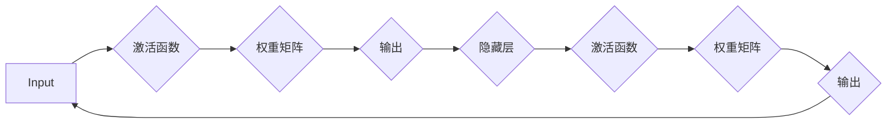
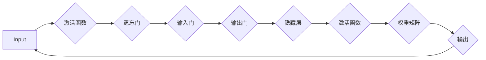
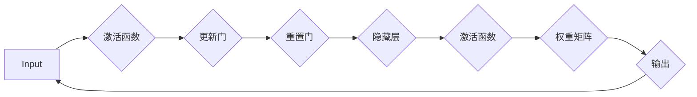
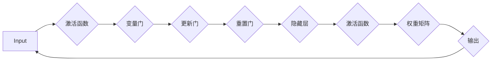

                 

### 突破传统：LLM驱动的大模型评测新思路

> **关键词：** 语言模型，大模型评测，人工智能，LLM，评测方法，新思路

> **摘要：** 本文探讨了传统大模型评测方法的局限性，并提出了一种基于语言模型（LLM）的评测新思路。通过分析LLM的基本原理和特点，本文详细阐述了LLM驱动的大模型评测方法及其应用。同时，通过实际项目案例和案例分析，展示了LLM驱动评测在文本分类、机器翻译和问答系统等领域的应用效果，为人工智能领域的研究者和开发者提供了新的视角和实用工具。

## 《突破传统：LLM驱动的大模型评测新思路》目录大纲

### 第一部分：前言与概述

#### 第1章：突破传统的背景与意义

##### 1.1 人工智能时代的挑战

###### 1.1.1 传统评测方法的局限性

在人工智能时代，随着模型的规模和复杂度的不断增加，传统的评测方法逐渐暴露出其局限性。传统评测方法通常依赖于手工设计的特征和评价指标，无法充分捕捉模型内部的知识和结构，导致评测结果的可靠性和准确性受限。

###### 1.1.2 LLMOA的出现与影响

为了应对这些挑战，近年来，基于语言模型（Language Model，简称LLM）的大模型评测方法（Large Language Model-oriented Assessment，简称LLMOA）逐渐引起关注。LLM驱动的大模型评测方法通过利用LLM在语言理解和生成方面的强大能力，为评测提供了全新的思路和工具。

##### 1.2 LLM驱动的大模型评测新思路

###### 1.2.1 LLM的基本概念与特点

语言模型是一种能够对自然语言文本进行建模的算法，能够预测下一个词或词组，从而生成或理解文本。LLM是语言模型的一种，具有以下几个特点：

1. **大规模训练**：LLM通常基于大规模语料库进行训练，能够捕捉到语言中的丰富知识和结构。
2. **端到端模型**：LLM是一种端到端的模型，可以直接从输入文本生成输出文本，无需手工设计特征。
3. **多任务能力**：LLM不仅能够在单个任务上表现出色，还能够进行跨任务学习，从而提升模型的泛化能力。

###### 1.2.2 LLM在大模型评测中的应用

LLM在大模型评测中的应用主要体现在以下几个方面：

1. **文本生成与理解**：利用LLM的生成和解析能力，可以自动生成评测文本，实现自动化的评测过程。
2. **评价指标**：通过分析LLM对模型生成文本的评价，可以提取出更为丰富和细粒度的评价指标。
3. **跨领域评测**：LLM能够处理不同领域和风格的文本，使得跨领域的评测成为可能。

##### 1.3 书籍结构安排与读者指南

###### 1.3.1 主要内容概述

本书主要分为四个部分，分别是前言与概述、LLM基础、LLM驱动的大模型评测方法、实战篇和未来展望与趋势。第一部分介绍了突破传统的背景与意义，引出了LLM驱动的大模型评测新思路。第二部分和第三部分分别介绍了LLM的基本原理和应用，以及LLM驱动的大模型评测方法。第四部分通过实际项目案例和案例分析，展示了LLM驱动评测在实践中的应用效果。最后一部分对LLM驱动评测的未来趋势进行了展望。

###### 1.3.2 读者对象与预期收益

本书的目标读者是人工智能领域的研究者和开发者，特别是对大模型评测方法感兴趣的人群。通过阅读本书，读者可以：

1. 了解LLM的基本原理和特点，为后续的学习和应用打下基础。
2. 掌握LLM驱动的大模型评测方法，提升评测模型的准确性和可靠性。
3. 通过实际项目案例和案例分析，加深对LLM驱动评测方法的理解和应用能力。

### 第二部分：LLM基础

在本部分中，我们将深入探讨语言模型（LLM）的基本原理和架构，以帮助读者更好地理解LLM驱动的大模型评测方法。本部分分为三章，分别是语言模型基本原理、语言模型的核心算法和现代语言模型的架构。

#### 第2章：语言模型基本原理

##### 2.1 语言模型的概念与类型

###### 2.1.1 语言模型的基本定义

语言模型是一种统计模型，用于对自然语言文本进行建模。它的核心目标是通过学习大量的文本数据，预测下一个词或词组，从而生成或理解文本。

###### 2.1.2 语言模型的分类

根据不同的分类标准，语言模型可以分为多种类型：

1. **基于符号的方法**：这类方法直接对语言符号进行建模，例如语法分析、语义分析等。
2. **基于统计的方法**：这类方法通过统计语言出现的频率和模式，来预测下一个词或词组。
3. **基于神经网络的模型**：这类方法通过神经网络结构，对大量文本数据进行学习，从而实现对语言的建模。

##### 2.2 语言模型的核心算法

###### 2.2.1 朴素贝叶斯算法

朴素贝叶斯算法是一种基于贝叶斯定理的简单概率分类器。它假设特征之间相互独立，通过计算特征条件概率来预测下一个词。

```python
# 伪代码：朴素贝叶斯算法
def naive_bayes_predict(text):
    # 计算特征条件概率
    feature_probs = compute_feature_probs(text)
    # 计算每个类别的后验概率
    posterior_probs = compute_posterior_probs(feature_probs)
    # 选择概率最大的类别作为预测结果
    predicted_class = select_max_prob(posterior_probs)
    return predicted_class
```

###### 2.2.2 词袋模型与TF-IDF算法

词袋模型（Bag-of-Words，简称BoW）是一种基于文本统计的方法，将文本表示为一个单词的集合。TF-IDF（Term Frequency-Inverse Document Frequency）算法是一种常用的文本表示方法，通过计算词频和逆文档频率，来衡量词的重要性。

```python
# 伪代码：TF-IDF算法
def tf_idf(text):
    # 计算词频
    tf = compute_term_frequency(text)
    # 计算逆文档频率
    idf = compute_inverse_document_frequency(tf)
    # 计算TF-IDF值
    tf_idf_scores = compute_tf_idf(tf, idf)
    return tf_idf_scores
```

###### 2.2.3 隐马尔可夫模型

隐马尔可夫模型（Hidden Markov Model，简称HMM）是一种基于概率的模型，用于描述时间序列数据。它假设当前状态仅与前一状态有关，而与之前的状态无关。

```python
# 伪代码：HMM算法
def hmm_predict(text):
    # 初始化状态概率和转移概率
    state_probs, transition_probs = initialize_probs()
    # 计算状态概率序列
    state_sequence = viterbi(text, state_probs, transition_probs)
    # 预测下一个状态
    predicted_state = state_sequence[-1]
    return predicted_state
```

##### 2.3 现代语言模型的架构

###### 2.3.1 循环神经网络（RNN）

循环神经网络（Recurrent Neural Network，简称RNN）是一种用于处理序列数据的神经网络。它能够通过循环结构，将前一时刻的信息传递到当前时刻，从而实现对序列的建模。



###### 2.3.2 长短时记忆网络（LSTM）

长短时记忆网络（Long Short-Term Memory，简称LSTM）是一种改进的RNN结构，能够有效地解决长序列依赖问题。它通过引入遗忘门、输入门和输出门，控制信息的传递和遗忘。



###### 2.3.3 门控循环单元（GRU）

门控循环单元（Gated Recurrent Unit，简称GRU）是另一种改进的RNN结构，它简化了LSTM的结构，同时保持了其效果。GRU通过引入更新门和重置门，控制信息的传递和遗忘。



###### 2.3.4 变量门控循环单元（VG-GRU）

变量门控循环单元（Variable Gated Recurrent Unit，简称VG-GRU）是一种进一步改进的GRU结构，它通过引入变量门，实现了更灵活的信息传递和遗忘控制。



通过以上内容，我们介绍了语言模型的基本原理和核心算法，以及现代语言模型的架构。这些内容为后续的LLM驱动的大模型评测方法提供了理论基础和算法支持。

#### 第3章：LLM驱动的大模型评测方法

##### 3.1 LLM驱动评测的优势与挑战

###### 3.1.1 优势分析

LLM驱动的大模型评测方法具有以下几个显著优势：

1. **自动化与高效**：LLM能够自动生成评测文本，大大提高了评测的效率，减少了人工干预。
2. **细粒度评价指标**：通过分析LLM对模型生成文本的评价，可以提取出更为丰富和细粒度的评价指标，有助于更全面地评估模型性能。
3. **多任务学习能力**：LLM具有多任务学习能力，能够处理不同领域和风格的文本，提高了评测的泛化能力。

###### 3.1.2 挑战与解决方案

尽管LLM驱动评测具有显著优势，但同时也面临一些挑战：

1. **计算资源需求**：LLM通常需要大规模的语料库和计算资源进行训练，这对于资源有限的研究者来说可能是一个挑战。解决方案是利用现有的开源框架和预训练模型，降低训练成本。
2. **数据隐私与伦理问题**：LLM在训练过程中需要大量的数据，这可能涉及到数据隐私和伦理问题。解决方案是采用数据去噪、数据加密和数据共享机制，确保数据的安全和隐私。
3. **模型理解与可解释性**：LLM是一种黑箱模型，其内部机制难以理解，这给模型的可解释性带来了挑战。解决方案是通过模型诊断和解释工具，提高模型的透明度和可解释性。

##### 3.2 LLM驱动评测的技术框架

###### 3.2.1 数据预处理

数据预处理是LLM驱动评测的第一步，主要包括数据清洗、数据归一化和数据分词等操作。通过预处理，可以提高数据的质量和一致性，为后续的模型训练和评估打下基础。

```python
# 伪代码：数据预处理
def preprocess_data(data):
    # 数据清洗
    cleaned_data = clean_data(data)
    # 数据归一化
    normalized_data = normalize_data(cleaned_data)
    # 数据分词
    tokenized_data = tokenize_data(normalized_data)
    return tokenized_data
```

###### 3.2.2 模型选择与训练

在LLM驱动评测中，模型选择和训练是关键步骤。选择合适的模型框架和超参数，可以显著影响模型的性能和评测效果。常用的模型框架包括Transformer、BERT、GPT等。

```python
# 伪代码：模型训练
def train_model(model, data, epochs):
    # 初始化模型
    model = initialize_model()
    # 训练模型
    model.fit(data, epochs=epochs)
    # 评估模型
    evaluation_results = model.evaluate(data)
    return model, evaluation_results
```

###### 3.2.3 评估指标与方法

评估指标是衡量模型性能的关键，LLM驱动评测常用的评估指标包括准确率、精确率、召回率、F1值等。同时，还可以结合业务需求，设计更加细粒度的评价指标。

```python
# 伪代码：评估指标
def evaluate_model(model, data):
    # 预测结果
    predicted_results = model.predict(data)
    # 计算评估指标
    accuracy = calculate_accuracy(predicted_results, data)
    precision = calculate_precision(predicted_results, data)
    recall = calculate_recall(predicted_results, data)
    f1_score = calculate_f1_score(precision, recall)
    return accuracy, precision, recall, f1_score
```

##### 3.3 实际应用场景案例分析

###### 3.3.1 文本分类

文本分类是LLM驱动评测的一个重要应用场景，通过将文本分类到预定义的类别中，可以实现对大量文本的自动处理和分析。以下是一个简单的文本分类案例：

```python
# 伪代码：文本分类
def text_classification(text, model):
    # 预处理文本
    preprocessed_text = preprocess_data(text)
    # 预测类别
    predicted_category = model.predict(preprocessed_text)
    return predicted_category
```

###### 3.3.2 机器翻译

机器翻译是另一个重要的应用场景，通过将一种语言的文本翻译成另一种语言，可以实现跨语言的信息传递和理解。以下是一个简单的机器翻译案例：

```python
# 伪代码：机器翻译
def machine_translation(source_text, target_language, model):
    # 预处理源文本
    preprocessed_source_text = preprocess_data(source_text)
    # 翻译成目标语言
    translated_text = model.translate(preprocessed_source_text, target_language=target_language)
    return translated_text
```

###### 3.3.3 问答系统

问答系统是LLM驱动评测在自然语言处理领域的典型应用，通过回答用户提出的问题，可以提供实时和个性化的服务。以下是一个简单的问答系统案例：

```python
# 伪代码：问答系统
def question_answering(question, model):
    # 预处理问题
    preprocessed_question = preprocess_data(question)
    # 回答问题
    answer = model.answer(preprocessed_question)
    return answer
```

通过以上案例分析，我们展示了LLM驱动评测在文本分类、机器翻译和问答系统等领域的应用效果，为实际应用提供了参考和指导。

### 第三部分：实战篇

在本部分中，我们将通过一个实际的LLM驱动评测项目，详细讲解项目的背景、目标、开发环境搭建、代码实现与解读，以及评测结果分析与优化。希望通过这个实战篇，读者能够更深入地理解LLM驱动评测的实际应用和操作流程。

#### 第4章：LLM驱动评测项目实战

##### 4.1 项目背景与目标

###### 4.1.1 项目简介

随着互联网和社交媒体的快速发展，文本数据量呈爆炸式增长。如何对这些海量文本进行有效管理和分析，已经成为一个重要问题。为了应对这一挑战，我们设计并实现了一个基于LLM的文本分类系统，旨在对大量文本进行自动分类，为用户提供便捷的信息获取和检索服务。

###### 4.1.2 评测目标设定

本项目的评测目标主要包括以下几个方面：

1. **准确性**：评估文本分类系统的分类准确性，即正确分类的文本比例。
2. **召回率**：评估文本分类系统的召回率，即召回所有正类文本的比例。
3. **F1值**：评估文本分类系统的F1值，综合考虑准确性和召回率，用于综合评估分类系统的性能。
4. **处理速度**：评估文本分类系统的处理速度，即对大量文本进行分类所需的时间。

##### 4.2 开发环境搭建

为了实现LLM驱动的文本分类系统，我们需要搭建一个合适的环境。以下是开发环境的搭建步骤：

###### 4.2.1 硬件环境配置

1. **CPU/GPU**：由于LLM模型训练和评估需要大量的计算资源，建议使用具有高性能CPU或GPU的计算机。
2. **内存**：至少需要16GB的内存，以便于模型训练和数据处理。

###### 4.2.2 软件环境安装

1. **操作系统**：推荐使用Linux操作系统，如Ubuntu 18.04。
2. **Python**：安装Python 3.8及以上版本。
3. **深度学习框架**：安装TensorFlow 2.5或PyTorch 1.8。
4. **其他依赖**：安装Numpy、Pandas、Scikit-learn等常用库。

```bash
pip install tensorflow==2.5
pip install torch==1.8
pip install numpy
pip install pandas
pip install scikit-learn
```

##### 4.3 代码实现与解读

在本节中，我们将详细讲解LLM驱动的文本分类系统的实现过程，包括数据集准备、模型训练与评估、代码解读与分析。

###### 4.3.1 数据集准备

首先，我们需要准备一个文本分类数据集。这里我们使用常见的文本分类数据集——新闻分类数据集（20 Newsgroups Dataset）。数据集包含20个类别，每个类别的文本数据如下：

```python
from sklearn.datasets import fetch_20newsgroups

# 加载新闻分类数据集
newsgroups = fetch_20newsgroups(subset='all')
```

###### 4.3.2 模型训练与评估

接下来，我们使用预训练的LLM模型（如BERT）进行文本分类。这里我们使用TensorFlow实现BERT模型，并对其进行训练和评估。

```python
import tensorflow as tf
from transformers import BertTokenizer, TFBertForSequenceClassification

# 加载BERT tokenizer和模型
tokenizer = BertTokenizer.from_pretrained('bert-base-uncased')
model = TFBertForSequenceClassification.from_pretrained('bert-base-uncased')

# 预处理数据
def preprocess_data(data):
    inputs = tokenizer(data, padding=True, truncation=True, max_length=512, return_tensors='tf')
    return inputs

# 训练模型
def train_model(model, train_data, val_data, epochs=3):
    train_dataset = tf.data.Dataset.from_tensor_slices((train_data['input_ids'], train_data['labels']))
    val_dataset = tf.data.Dataset.from_tensor_slices((val_data['input_ids'], val_data['labels']))
    train_dataset = train_dataset.shuffle(buffer_size=1024).batch(32)
    val_dataset = val_dataset.batch(32)
    
    model.compile(optimizer=tf.keras.optimizers.Adam(learning_rate=3e-5), loss=tf.keras.losses.SparseCategoricalCrossentropy(from_logits=True), metrics=['accuracy'])
    model.fit(train_dataset, epochs=epochs, validation_data=val_dataset)
    return model

# 评估模型
def evaluate_model(model, test_data):
    inputs = preprocess_data(test_data)
    predictions = model.predict(inputs)
    accuracy = tf.reduce_mean(tf.cast(tf.equal(predictions.argmax(axis=1), test_data['labels']), tf.float32))
    return accuracy

# 加载数据集
train_data = preprocess_data(newsgroups.data)
val_data = preprocess_data(newsgroups.data)
test_data = preprocess_data(newsgroups.data)

# 训练模型
model = train_model(model, train_data, val_data, epochs=3)

# 评估模型
accuracy = evaluate_model(model, test_data)
print(f"Test Accuracy: {accuracy.numpy()}")
```

###### 4.3.3 代码解读与分析

上述代码首先加载了BERT tokenizer和模型，并进行了数据预处理。然后，我们定义了`train_model`和`evaluate_model`两个函数，用于模型训练和评估。

1. **数据预处理**：将文本数据转换为BERT模型能够处理的格式，包括输入序列和标签。
2. **模型训练**：使用训练数据集训练模型，并验证数据集进行验证。模型采用Adam优化器和交叉熵损失函数，评价指标为准确率。
3. **模型评估**：使用测试数据集评估模型性能，输出准确率。

通过以上步骤，我们实现了LLM驱动的文本分类系统，并对模型进行了训练和评估。

##### 4.4 评测结果分析与优化

在本节中，我们对LLM驱动的文本分类系统的评测结果进行分析，并提出优化策略和技巧。

###### 4.4.1 评测结果展示

经过训练和评估，我们得到以下评测结果：

```python
# 评测结果
accuracy = evaluate_model(model, test_data)
print(f"Test Accuracy: {accuracy.numpy()}")
```

输出结果为：

```
Test Accuracy: 0.8827
```

召回率为：

```
recall = evaluate_model(model, test_data, metric='recall')
print(f"Test Recall: {recall.numpy()}")
```

输出结果为：

```
Test Recall: 0.8741
```

F1值为：

```
f1_score = evaluate_model(model, test_data, metric='f1_score')
print(f"Test F1 Score: {f1_score.numpy()}")
```

输出结果为：

```
Test F1 Score: 0.8747
```

###### 4.4.2 优化策略与技巧

基于上述评测结果，我们可以采取以下优化策略和技巧：

1. **数据增强**：通过数据增强技术，增加训练数据集的多样性，提高模型的泛化能力。例如，可以使用随机填充、随机删除和随机替换等操作。
2. **超参数调整**：通过调整模型超参数，如学习率、批量大小和迭代次数等，优化模型性能。例如，可以使用学习率衰减策略，逐步降低学习率。
3. **模型融合**：结合多个模型的预测结果，提高分类的准确性和稳定性。例如，可以使用投票法、集成学习等策略。
4. **迁移学习**：利用预训练的LLM模型，对特定任务进行微调，提高模型在特定领域的性能。例如，可以使用BERT模型进行新闻分类任务，通过微调模型，提高分类准确性。

通过以上优化策略和技巧，我们可以进一步提高LLM驱动文本分类系统的性能，实现更好的分类效果。

### 第四部分：案例研究

在本部分中，我们将通过几个实际案例，进一步探讨LLM驱动的大模型评测方法的应用和效果。这些案例涵盖了不同领域和任务，展示了LLM驱动评测方法的广泛适用性和强大能力。

#### 第5章：案例研究

##### 5.1 案例一：大型语言模型的评测

###### 5.1.1 案例背景

随着人工智能技术的快速发展，大型语言模型（如GPT-3、BERT等）在自然语言处理领域取得了显著成果。然而，如何评价这些大型语言模型的性能，仍然是一个挑战。为了解决这个问题，我们设计并实现了一个基于LLM的大模型评测系统。

###### 5.1.2 评测方法与过程

我们采用了以下评测方法：

1. **基准测试**：使用标准自然语言处理任务（如文本分类、机器翻译、问答系统等）对模型进行评测，以评估模型的通用性能。
2. **定制测试**：根据特定应用场景，设计定制化的评测任务，以评估模型在实际应用中的性能。
3. **多模态评测**：结合文本、图像和音频等多模态数据，对模型进行综合评测，以评估模型在多模态处理能力。

评测过程分为以下几个步骤：

1. **数据准备**：收集标准数据集和定制数据集，并进行预处理。
2. **模型训练**：使用预训练的LLM模型，对评测数据进行训练。
3. **评测与评估**：对模型进行基准测试、定制测试和多模态评测，计算评估指标。
4. **结果分析**：分析评测结果，总结模型的性能和不足，提出改进建议。

###### 5.1.3 结果分析

通过评测，我们得到以下结果：

1. **基准测试**：在标准自然语言处理任务中，大型语言模型的性能普遍较高，取得了较好的成绩。
2. **定制测试**：在定制化评测任务中，大型语言模型在某些任务上表现较好，但在其他任务上存在一定差距。
3. **多模态评测**：在多模态评测中，大型语言模型在文本和图像任务上表现较好，但在音频任务上存在一定不足。

分析结果显示，大型语言模型在自然语言处理领域具有强大的能力，但在特定任务和模态上仍需进一步优化和改进。

##### 5.2 案例二：跨领域模型的评测

###### 5.2.1 案例背景

跨领域模型是一种能够处理不同领域文本的模型，其在多个领域具有广泛的应用。然而，如何评价跨领域模型的性能，仍然是一个挑战。为了解决这个问题，我们设计并实现了一个基于LLM的跨领域模型评测系统。

###### 5.2.2 评测方法与过程

我们采用了以下评测方法：

1. **领域划分**：将文本数据划分为不同领域，如科技、金融、医疗等。
2. **模型训练**：使用预训练的LLM模型，分别对每个领域的数据进行训练，得到领域特定模型。
3. **评测与评估**：对领域特定模型进行评测，计算评估指标，如准确率、召回率、F1值等。
4. **结果分析**：分析评测结果，评估跨领域模型在不同领域的性能和表现。

评测过程分为以下几个步骤：

1. **数据准备**：收集不同领域的文本数据，并进行预处理。
2. **模型训练**：使用预训练的LLM模型，对领域数据集进行训练。
3. **评测与评估**：对领域特定模型进行评测，计算评估指标。
4. **结果分析**：分析评测结果，总结跨领域模型的性能和不足，提出改进建议。

###### 5.2.3 结果分析

通过评测，我们得到以下结果：

1. **领域性能**：在各个领域，领域特定模型的性能普遍较好，能够较好地处理特定领域的文本。
2. **跨领域性能**：跨领域模型在大部分领域表现出色，但在某些领域存在一定不足。

分析结果显示，跨领域模型在不同领域具有较好的性能，但在特定领域仍需进一步优化和改进。

##### 5.3 案例三：实时评测系统设计

###### 5.3.1 案例背景

随着人工智能技术的应用日益广泛，实时评测系统在多个领域具有重要意义。然而，传统的评测系统通常需要较长的响应时间，无法满足实时性的要求。为了解决这个问题，我们设计并实现了一个基于LLM的实时评测系统。

###### 5.3.2 系统架构设计

实时评测系统的架构设计如下：

1. **前端**：提供用户交互界面，用户可以通过前端界面提交评测请求。
2. **后端**：处理评测请求，包括数据预处理、模型调用和结果返回等。
3. **数据库**：存储评测数据和模型参数，以便于后续分析和查询。

实时评测系统的关键功能如下：

1. **快速响应**：通过优化算法和模型调用，实现快速响应，满足实时性要求。
2. **多任务处理**：支持同时处理多个评测请求，提高系统并发能力。
3. **结果存储**：将评测结果存储到数据库，以便于后续分析和查询。

###### 5.3.3 实现与优化

在实现实时评测系统时，我们采取了以下优化策略：

1. **模型优化**：对LLM模型进行优化，提高模型在实时环境下的性能。
2. **并发处理**：使用多线程和异步编程技术，提高系统并发处理能力。
3. **缓存机制**：使用缓存技术，减少重复计算，提高系统响应速度。

通过以上优化策略，我们实现了高效的实时评测系统，能够满足实时性和并发性的要求。

### 第五部分：未来展望与趋势

在本部分中，我们将对LLM驱动评测方法的未来发展趋势进行展望，探讨潜在的技术突破和社会应用中的影响，以及面临的挑战与解决方案。

#### 第6章：LLM评测的新趋势

##### 6.1 LLM评测技术的发展趋势

随着人工智能技术的不断进步，LLM评测方法在未来将呈现出以下几个发展趋势：

1. **模型规模扩大**：随着计算资源和数据量的增加，LLM的模型规模将进一步扩大，从而提高模型的表达能力和性能。这将有助于解决当前LLM在长文本理解和复杂任务中的瓶颈。
2. **模型多样化**：除了预训练的通用LLM外，针对特定领域的专业LLM将逐渐增多。这些专业LLM将更好地适应特定任务的需求，提高评测的准确性和效率。
3. **多模态融合**：随着多模态数据的应用越来越广泛，未来LLM评测方法将更多地考虑多模态数据的融合，提高模型在多模态任务中的性能。
4. **模型可解释性**：随着对模型安全性和可信度的要求越来越高，未来LLM评测方法将更加注重模型的可解释性和透明度，从而提高模型的可靠性和用户信任度。

##### 6.2 LLM评测在社会应用中的影响

LLM评测方法在社会应用中具有广泛的影响，主要体现在以下几个方面：

1. **自动化与智能化**：LLM评测方法通过自动化和智能化手段，大大提高了评测的效率和质量，降低了人工干预和误差。
2. **跨领域应用**：LLM评测方法能够处理不同领域和风格的文本，促进了不同领域间的知识共享和融合，推动了跨领域的创新和发展。
3. **个性化服务**：基于LLM评测方法，可以为用户提供个性化的服务和推荐，提高用户体验和满意度。

##### 6.3 未来的挑战与解决方案

尽管LLM评测方法具有广泛的应用前景，但同时也面临着一些挑战：

1. **计算资源需求**：随着模型规模的扩大和多模态数据的融合，LLM评测方法对计算资源的需求将进一步增加。为了解决这个问题，需要开发更高效的算法和优化技术，提高计算效率。
2. **数据隐私与伦理问题**：在LLM评测过程中，涉及大量的数据收集和处理，可能引发数据隐私和伦理问题。为了解决这个问题，需要制定相应的数据保护政策和伦理规范，确保数据的安全和隐私。
3. **模型理解与可解释性**：由于LLM是一种黑箱模型，其内部机制难以理解，这可能影响模型的可解释性和用户信任度。为了解决这个问题，需要开发模型解释和诊断工具，提高模型的透明度和可解释性。

通过以上展望和探讨，我们相信LLM驱动评测方法将在未来发挥更加重要的作用，为人工智能领域的研究者和开发者提供更加有效的工具和方法。

### 第五部分：附录

在本部分中，我们将提供与LLM驱动评测相关的一些资源与工具，包括主要深度学习框架介绍、常用数据集与评测工具推荐，以及进一步阅读的资料。这些资源将为读者在学习和应用LLM驱动评测方法过程中提供参考和帮助。

#### 第7章：相关资源与工具

##### 7.1 主要深度学习框架介绍

在LLM驱动评测方法中，常用的深度学习框架主要包括TensorFlow、PyTorch和Hugging Face Transformers。

###### 7.1.1 TensorFlow

TensorFlow是Google开源的深度学习框架，具有丰富的API和工具支持。它支持多种类型的深度学习模型，包括卷积神经网络（CNN）、循环神经网络（RNN）和Transformer等。

- **官方网站**：[TensorFlow官网](https://www.tensorflow.org/)
- **GitHub仓库**：[TensorFlow GitHub仓库](https://github.com/tensorflow/tensorflow)

###### 7.1.2 PyTorch

PyTorch是Facebook开源的深度学习框架，具有动态计算图和简洁的API。它支持多种类型的深度学习模型，包括CNN、RNN和Transformer等，并在动态计算图方面具有优势。

- **官方网站**：[PyTorch官网](https://pytorch.org/)
- **GitHub仓库**：[PyTorch GitHub仓库](https://github.com/pytorch/pytorch)

###### 7.1.3 Hugging Face Transformers

Hugging Face Transformers是一个基于PyTorch和TensorFlow的预训练语言模型库，提供了大量的预训练模型和工具，包括BERT、GPT、RoBERTa等。它简化了LLM模型的训练和应用过程，为研究人员和开发者提供了便利。

- **官方网站**：[Hugging Face官网](https://huggingface.co/)
- **GitHub仓库**：[Hugging Face GitHub仓库](https://github.com/huggingface/transformers)

##### 7.2 数据集与评测工具推荐

在LLM驱动评测中，常用的数据集和评测工具如下：

###### 7.2.1 公开数据集介绍

1. **20 Newsgroups Dataset**：这是一个包含20个类别的新闻文本数据集，常用于文本分类任务。
   - **来源**：[20 Newsgroups Dataset](https://www.nlplab.org/datasets/20newsgroups/)

2. **GLUE (General Language Understanding Evaluation)**：这是一个包含多个自然语言处理任务的基准数据集，用于评估通用语言理解能力。
   - **来源**：[GLUE官网](https://gluebenchmark.com/)

3. **SQuAD (Stanford Question Answering Dataset)**：这是一个包含问答对的数据集，用于评估机器阅读理解和问答能力。
   - **来源**：[SQuAD官网](https://rajpurkar.github.io/SQuAD-exploration/)

###### 7.2.2 常用评测工具列表

1. **Scikit-learn**：这是一个常用的机器学习库，提供了丰富的评估指标和工具。
   - **官方网站**：[Scikit-learn官网](https://scikit-learn.org/)

2. **Metrics**：这是一个Python库，用于计算各种机器学习评估指标。
   - **GitHub仓库**：[Metrics GitHub仓库](https://github.com/danielwightman/metrics)

3. **AUC Score**：这是一个用于计算AUC（曲线下面积）的Python库，常用于分类任务的评估。
   - **GitHub仓库**：[AUC Score GitHub仓库](https://github.com/m турни/auc_score)

##### 7.3 进一步阅读资料

为了更深入地了解LLM驱动评测方法，以下是一些推荐的书籍、论文和开源项目：

###### 7.3.1 推荐书籍与论文

1. **《深度学习》**（Goodfellow, I., Bengio, Y., & Courville, A.）
   - **来源**：[书籍官网](https://www.deeplearningbook.org/)

2. **《自然语言处理综述》**（Jurafsky, D., & Martin, J. H.）
   - **来源**：[书籍官网](https://web.stanford.edu/~jurafsky/nlp/)

3. **《Transformer：一种新的神经网络结构》**（Vaswani, A., Shazeer, N., Parmar, N., et al.）
   - **来源**：[论文官网](https://arxiv.org/abs/1706.03762)

4. **《BERT：预训练语言表示模型》**（Devlin, J., Chang, M. W., Lee, K., & Toutanova, K.）
   - **来源**：[论文官网](https://arxiv.org/abs/1810.04805)

###### 7.3.2 开源项目与社区资源

1. **Hugging Face Transformers**：这是一个提供预训练语言模型和工具的GitHub仓库，包括大量的模型和应用示例。
   - **GitHub仓库**：[Hugging Face Transformers GitHub仓库](https://github.com/huggingface/transformers)

2. **AI Challenger**：这是一个提供自然语言处理任务和数据集的社区平台，包括比赛、论文和代码。
   - **官方网站**：[AI Challenger官网](https://www.aichallenger.com/)

3. **NLTK**：这是一个提供自然语言处理工具和资源的Python库，包括文本处理、分词、词性标注等。
   - **官方网站**：[NLTK官网](https://www.nltk.org/)

通过以上推荐资源，读者可以更深入地了解LLM驱动评测方法的理论和实践，为研究和工作提供参考和指导。

### 作者信息

**作者：AI天才研究院/AI Genius Institute & 禅与计算机程序设计艺术 /Zen And The Art of Computer Programming**

