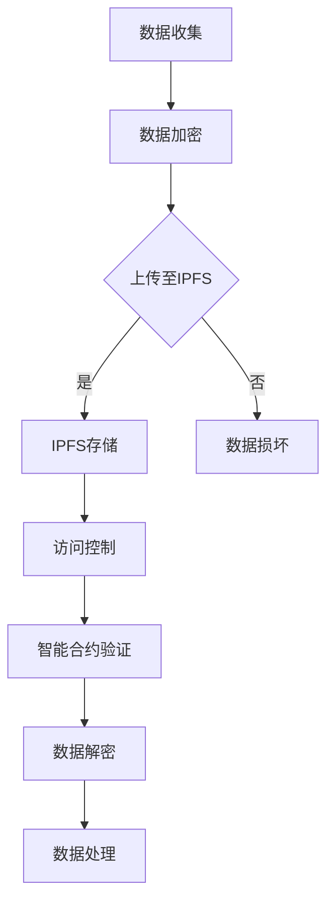

                 

# 端到端自动驾驶的区块链应用场景

## 关键词

- 端到端自动驾驶
- 区块链技术
- 数据隐私保护
- 路径优化
- 能源管理
- 车辆共享

## 摘要

本文深入探讨了端到端自动驾驶与区块链技术的融合应用场景。通过分析自动驾驶技术的发展历程和系统架构，以及区块链技术的基础原理和应用，本文提出了自动驾驶数据隐私保护、路径优化、能源管理和车辆共享等多个应用场景。文章以具体案例展示了区块链技术在端到端自动驾驶中的应用，并对未来发展趋势进行了展望。同时，本文还详细介绍了端到端自动驾驶区块链开发的环境搭建、核心算法实现和项目实战，为相关领域的研究者和开发者提供了有价值的参考。

### 目录大纲

1. **第一部分：端到端自动驾驶概述**
    1.1 端到端自动驾驶概述
        1.1.1 自动驾驶的发展历程
        1.1.2 自动驾驶的技术体系
        1.1.3 自动驾驶的未来发展趋势
    1.2 端到端自动驾驶系统架构
        1.2.1 端到端自动驾驶系统的组成
        1.2.2 硬件层架构
        1.2.3 软件层架构

2. **第二部分：区块链技术基础**
    2.1 区块链技术概述
        2.1.1 区块链的基本原理
        2.1.2 区块链的核心特性
        2.1.3 区块链的技术架构
    2.2 智能合约与区块链应用
        2.2.1 智能合约的基本概念
        2.2.2 智能合约的实现原理
        2.2.3 智能合约在区块链应用中的角色
    2.3 分布式账本技术
        2.3.1 分布式账本的基本原理
        2.3.2 分布式账本的优势与应用
        2.3.3 分布式账本技术的实现方案

3. **第三部分：端到端自动驾驶的区块链应用场景**
    3.1 自动驾驶数据隐私保护
    3.2 自动驾驶路径优化
    3.3 自动驾驶能源管理
    3.4 自动驾驶车辆共享经济

4. **第四部分：技术实现与开发实践**
    4.1 端到端自动驾驶区块链开发环境搭建
    4.2 端到端自动驾驶区块链核心算法解析
    4.3 端到端自动驾驶区块链项目实战

5. **附录**
    5.1 常用区块链开发工具与资源

### 第一部分：端到端自动驾驶概述

#### 1.1 端到端自动驾驶概述

##### 1.1.1 自动驾驶的发展历程

自动驾驶技术从概念提出到现在，已经走过了数十年的发展历程。20世纪50年代，自动驾驶技术首次被提出，但当时仅限于理论研究和实验室环境。直到20世纪80年代，随着计算机技术和传感器技术的不断发展，自动驾驶技术开始逐步进入实际应用阶段。

进入21世纪，自动驾驶技术迎来了快速发展的机遇。首先，互联网技术的普及使得自动驾驶车辆可以通过无线网络实时获取交通信息，提高了行驶安全性。其次，传感器技术的进步，如激光雷达、摄像头和雷达等，使得自动驾驶车辆能够更加准确地感知周围环境。此外，人工智能和机器学习技术的发展，为自动驾驶车辆的决策和路径规划提供了强大的支持。

近年来，随着电动汽车的普及和智能交通系统的建设，自动驾驶技术逐渐从概念走向现实。许多国家和企业纷纷投入大量资源进行自动驾驶技术的研发和推广，自动驾驶车辆已经逐步应用于公共交通、物流运输和私人出行等领域。

##### 1.1.2 自动驾驶的技术体系

自动驾驶技术体系主要由感知层、决策层和执行层组成，这三层相互协作，共同实现自动驾驶功能。

1. **感知层**：感知层是自动驾驶技术的核心组成部分，负责收集和处理车辆周围环境的信息。主要传感器包括激光雷达、摄像头、雷达、超声波传感器等。通过这些传感器，自动驾驶车辆可以实现对道路、车辆、行人等信息的精准感知。

2. **决策层**：决策层负责根据感知层收集到的信息，进行路径规划、避障、速度控制等决策。决策层通常由复杂的算法和计算模型组成，如深度学习、强化学习、规划算法等。决策层的核心任务是确保车辆在复杂交通环境下安全、高效地行驶。

3. **执行层**：执行层负责将决策层的决策转化为具体的行动，如控制方向盘、油门和刹车等。执行层通常由车载控制器、执行机构等硬件设备组成，是实现自动驾驶功能的关键。

##### 1.1.3 自动驾驶的未来发展趋势

未来，自动驾驶技术将继续快速发展，并在多个方面取得突破。

1. **技术进步**：随着传感器、计算能力和人工智能技术的不断提升，自动驾驶车辆的感知能力和决策能力将得到显著提高。此外，车联网技术的发展，将使自动驾驶车辆能够实现与其他车辆和基础设施的实时通信，进一步提高行驶安全性和效率。

2. **商业化应用**：自动驾驶技术将在公共交通、物流运输、私人出行等多个领域实现商业化应用。自动驾驶出租车、自动驾驶卡车、自动驾驶公共交通等将逐步普及，为人们带来更加便捷、高效、安全的出行体验。

3. **法规政策**：各国政府将逐步完善自动驾驶相关法规和政策，为自动驾驶技术的发展和商业化应用提供有力支持。同时，自动驾驶技术的安全性、隐私保护等问题也将得到关注和解决。

4. **社会影响**：自动驾驶技术的发展将对社会产生深远影响。一方面，它将改变人们的出行方式，提高交通效率，减少交通事故；另一方面，它将带来就业、经济、法律等方面的新挑战，需要全社会共同应对。

#### 1.2 端到端自动驾驶系统架构

##### 1.2.1 端到端自动驾驶系统的组成

端到端自动驾驶系统通常由硬件层、软件层和通信层组成，这三层相互配合，实现自动驾驶功能。

1. **硬件层**：硬件层包括传感器、控制器、执行器等硬件设备。传感器负责收集车辆周围环境信息，控制器负责处理传感器数据和执行决策，执行器负责将决策转化为具体的行动。

2. **软件层**：软件层包括感知、决策、规划和执行等模块。感知模块负责处理传感器数据，识别道路、车辆、行人等目标；决策模块根据感知数据，规划行驶路径和速度；规划模块根据决策数据，生成具体的行驶策略；执行模块将规划策略转化为具体的执行动作。

3. **通信层**：通信层负责车辆与其他车辆、基础设施之间的信息交互。通过车联网技术，自动驾驶车辆可以实时获取交通信息、道路状况等数据，实现协同驾驶和安全通信。

##### 1.2.2 硬件层架构

端到端自动驾驶硬件层主要包括以下几种传感器：

1. **激光雷达（LiDAR）**：激光雷达通过发射激光束并测量反射时间，实现对周围环境的精准三维建模。激光雷达具有高精度、高分辨率的特点，是自动驾驶感知层的关键传感器。

2. **摄像头**：摄像头用于捕捉车辆周围环境的图像信息。通过图像识别技术，摄像头可以识别道路、车辆、行人等目标，是自动驾驶感知层的重要传感器。

3. **雷达**：雷达通过发射无线电波并接收反射信号，实现对周围物体的距离和速度测量。雷达具有抗干扰能力强、探测距离远等特点，适用于自动驾驶的感知和决策。

4. **超声波传感器**：超声波传感器通过发射超声波并测量反射时间，实现对周围物体的距离测量。超声波传感器适用于近距离探测，如停车辅助、倒车监测等。

##### 1.2.3 软件层架构

端到端自动驾驶软件层主要包括以下模块：

1. **感知模块**：感知模块负责处理传感器数据，识别道路、车辆、行人等目标。感知模块通常采用图像识别、激光雷达数据处理等技术，实现对周围环境的精准感知。

2. **决策模块**：决策模块根据感知模块提供的信息，进行路径规划、避障、速度控制等决策。决策模块通常采用深度学习、强化学习等技术，实现对复杂交通环境的自适应决策。

3. **规划模块**：规划模块根据决策模块的决策结果，生成具体的行驶策略。规划模块通常采用路径规划算法，如A*算法、Dijkstra算法等，实现车辆的安全、高效行驶。

4. **执行模块**：执行模块将规划模块生成的行驶策略转化为具体的执行动作。执行模块通常由车载控制器、执行器等硬件设备组成，实现车辆的运动控制。

### 第二部分：区块链技术基础

#### 2.1 区块链技术概述

##### 2.1.1 区块链的基本原理

区块链是一种分布式账本技术，其核心原理是通过去中心化的方式，实现数据的存储和传输。区块链由多个区块组成，每个区块包含一定数量的交易数据，区块之间通过哈希函数链接，形成链式结构。

区块链的基本原理可以概括为以下几个方面：

1. **去中心化**：区块链通过去中心化的方式，避免了传统中心化系统中的单点故障风险。每个节点都拥有完整的区块链数据，并通过共识算法实现数据的同步和验证。

2. **数据存储**：区块链通过将交易数据记录在区块中，实现对数据的永久存储。每个区块包含一定数量的交易数据，区块之间通过哈希函数链接，形成一个链式结构。

3. **不可篡改**：区块链的数据存储在多个节点上，并通过加密算法确保数据的完整性和安全性。一旦数据被记录在区块链上，将无法被篡改。

4. **共识算法**：区块链通过共识算法实现数据的同步和验证。常见的共识算法包括工作量证明（PoW）、权益证明（PoS）等，通过这些算法，节点之间达成共识，确保数据的真实性和一致性。

##### 2.1.2 区块链的核心特性

区块链技术具有以下核心特性：

1. **安全性**：区块链通过加密算法和共识算法，确保数据的真实性和安全性。区块链的数据存储在多个节点上，任何单一节点都无法篡改数据，从而保证了区块链系统的安全性。

2. **透明性**：区块链的数据存储在公开透明的链上，每个节点都可以查看和验证区块链上的数据。这种透明性使得区块链在金融、供应链等领域具有广泛的应用价值。

3. **去中心化**：区块链通过去中心化的方式，避免了传统中心化系统中的单点故障风险。每个节点都拥有完整的区块链数据，并通过共识算法实现数据的同步和验证。

4. **可扩展性**：区块链技术具有较好的可扩展性，可以通过增加节点数量和优化共识算法，提高区块链系统的性能和吞吐量。

##### 2.1.3 区块链的技术架构

区块链的技术架构主要包括以下几个部分：

1. **节点**：节点是区块链网络中的基本组成部分，每个节点都拥有完整的区块链数据。节点可以通过网络与其他节点进行通信，实现数据的同步和验证。

2. **区块**：区块是区块链的基本数据结构，每个区块包含一定数量的交易数据。区块之间通过哈希函数链接，形成链式结构。

3. **交易**：交易是区块链上的基本操作，用于记录数据的传输和变更。每个交易都包含发送方、接收方、金额等信息，交易经过验证后记录在区块中。

4. **共识算法**：共识算法是区块链网络中的核心机制，用于实现数据的同步和验证。常见的共识算法包括工作量证明（PoW）、权益证明（PoS）等。

5. **加密算法**：加密算法用于确保区块链数据的真实性和安全性。常见的加密算法包括哈希算法、非对称加密算法等。

### 2.2 智能合约与区块链应用

##### 2.2.1 智能合约的基本概念

智能合约是区块链技术的重要组成部分，是一种自动执行、管理和执行的合约。智能合约基于代码，当满足特定条件时，自动执行预定义的操作。智能合约具有以下几个基本概念：

1. **合约**：合约是智能合约的载体，用于定义合约的规则和操作。合约通常由开发人员编写，并在区块链上进行部署。

2. **代码**：智能合约的代码是合约的核心部分，用于定义合约的规则和操作。智能合约代码通常使用特定的编程语言编写，如Solidity。

3. **触发条件**：触发条件是指触发智能合约执行的具体条件。当触发条件满足时，智能合约将自动执行预定义的操作。

4. **执行操作**：执行操作是指智能合约在触发条件满足时执行的具体操作。执行操作通常涉及数据的读写、调用其他合约等方法。

##### 2.2.2 智能合约的实现原理

智能合约的实现原理主要涉及以下几个方面：

1. **区块链平台**：智能合约通常运行在特定的区块链平台上，如以太坊、EOS等。区块链平台提供了智能合约的运行环境和执行机制。

2. **编程语言**：智能合约通常使用特定的编程语言编写，如Solidity。编程语言提供了智能合约的语法和语义，使得开发人员可以方便地编写和部署智能合约。

3. **虚拟机**：智能合约运行在区块链平台上的虚拟机中。虚拟机负责执行智能合约代码，并对执行结果进行验证和存储。

4. **交易和调用**：智能合约通过区块链网络进行交易和调用。当智能合约触发条件满足时，智能合约将通过区块链网络与其他合约进行交互，执行预定义的操作。

##### 2.2.3 智能合约在区块链应用中的角色

智能合约在区块链应用中扮演着重要角色，具体包括以下几个方面：

1. **业务逻辑实现**：智能合约可以用来实现复杂的业务逻辑，如金融交易、供应链管理、投票等。智能合约确保业务逻辑的透明性、安全性和不可篡改性。

2. **自动化执行**：智能合约可以在满足特定条件时自动执行预定义的操作，减少了人工干预和操作成本。智能合约的自动化执行提高了业务流程的效率和可靠性。

3. **去中心化治理**：智能合约可以实现去中心化的治理，通过智能合约规则，实现社区成员的参与和决策。智能合约在去中心化治理中发挥了重要作用，提高了组织的透明性和公正性。

4. **数据共享和协作**：智能合约可以用于实现数据的共享和协作，如共享账本、数据验证等。智能合约确保数据的真实性和一致性，促进了不同组织之间的合作与互信。

### 2.3 分布式账本技术

##### 2.3.1 分布式账本的基本原理

分布式账本技术是一种基于区块链的分布式数据库技术，其核心原理是通过分布式的方式，实现数据的存储、传输和验证。分布式账本技术具有以下几个基本原理：

1. **去中心化**：分布式账本通过去中心化的方式，避免了传统中心化系统中的单点故障风险。分布式账本的数据存储在多个节点上，任何单一节点都无法控制或篡改数据。

2. **数据一致性**：分布式账本通过共识算法，确保数据的一致性。共识算法通过节点之间的协商和验证，确保数据在分布式环境下的一致性和可靠性。

3. **数据安全性**：分布式账本通过加密算法，确保数据的安全性和隐私性。分布式账本的数据在传输和存储过程中，使用加密算法进行加密和签名，防止数据被篡改和泄露。

4. **数据透明性**：分布式账本的数据存储在公开透明的链上，每个节点都可以查看和验证区块链上的数据。分布式账本的透明性提高了数据的可信度和可追溯性。

##### 2.3.2 分布式账本的优势与应用

分布式账本技术具有以下几个优势和应用：

1. **去中心化**：分布式账本通过去中心化的方式，避免了传统中心化系统中的单点故障风险。分布式账本的数据存储在多个节点上，任何单一节点都无法控制或篡改数据，提高了系统的可靠性和安全性。

2. **数据一致性**：分布式账本通过共识算法，确保数据的一致性。共识算法通过节点之间的协商和验证，确保数据在分布式环境下的一致性和可靠性。

3. **数据安全性**：分布式账本通过加密算法，确保数据的安全性和隐私性。分布式账本的数据在传输和存储过程中，使用加密算法进行加密和签名，防止数据被篡改和泄露。

4. **数据透明性**：分布式账本的数据存储在公开透明的链上，每个节点都可以查看和验证区块链上的数据。分布式账本的透明性提高了数据的可信度和可追溯性。

分布式账本技术广泛应用于金融、供应链、物流、医疗等领域，具体应用包括：

1. **金融应用**：分布式账本技术可以用于实现数字货币、区块链支付、跨境支付等金融应用。分布式账本确保金融交易的安全、透明和高效。

2. **供应链管理**：分布式账本技术可以用于实现供应链的透明化、追溯化和优化。分布式账本确保供应链数据的真实性和一致性，提高了供应链管理的效率和可靠性。

3. **物流管理**：分布式账本技术可以用于实现物流运输的实时跟踪、数据共享和优化。分布式账本确保物流数据的真实性和一致性，提高了物流运输的效率和准确性。

4. **医疗健康**：分布式账本技术可以用于实现医疗数据的共享、追溯和管理。分布式账本确保医疗数据的真实性和安全性，提高了医疗服务的质量和效率。

##### 2.3.3 分布式账本技术的实现方案

分布式账本技术的实现方案主要包括以下几个方面：

1. **区块链平台**：区块链平台是分布式账本技术的核心组成部分，提供了数据存储、传输和验证的底层支持。常见的区块链平台包括以太坊、EOS、Hyperledger Fabric等。

2. **节点**：节点是分布式账本网络的基本组成部分，每个节点都拥有完整的区块链数据。节点通过网络与其他节点进行通信，实现数据的同步和验证。

3. **共识算法**：共识算法是分布式账本技术的核心机制，用于实现数据的一致性。常见的共识算法包括工作量证明（PoW）、权益证明（PoS）、权威证明（PoA）等。

4. **加密算法**：加密算法用于确保分布式账本数据的安全性和隐私性。常见的加密算法包括哈希算法、非对称加密算法、对称加密算法等。

5. **智能合约**：智能合约是分布式账本技术的重要组成部分，用于实现复杂的业务逻辑和自动化执行。智能合约通常使用特定的编程语言编写，如Solidity。

### 第三部分：端到端自动驾驶的区块链应用场景

#### 3.1 自动驾驶数据隐私保护

##### 3.1.1 数据隐私保护的重要性

在端到端自动驾驶系统中，数据隐私保护是一项至关重要的任务。自动驾驶车辆通过传感器收集大量关于自身状态和周围环境的数据，这些数据包括车辆位置、速度、加速度、道路状况、车辆行驶轨迹等。此外，自动驾驶系统还需要收集和处理关于交通参与者（如其他车辆、行人和骑行者）的数据。这些数据的隐私保护直接关系到用户的隐私安全和数据安全。

1. **用户隐私保护**：自动驾驶车辆的运行数据涉及到用户的个人信息，如位置、行踪、出行习惯等。如果这些数据被不法分子获取或泄露，可能会导致用户的隐私泄露，甚至引发欺诈和犯罪行为。

2. **数据安全**：自动驾驶车辆在运行过程中收集的数据不仅涉及到用户隐私，还涉及到车辆的安全和整个交通系统的安全。例如，车辆的行驶轨迹和行驶速度等数据如果被篡改，可能会导致交通事故。

##### 3.1.2 区块链在数据隐私保护中的应用

区块链技术在数据隐私保护中具有独特的优势，可以提供以下解决方案：

1. **数据加密**：区块链技术通过加密算法确保数据的传输和存储过程的安全性。在自动驾驶系统中，可以使用区块链中的加密算法对传感器数据进行加密处理，确保数据在传输和存储过程中不被窃取或篡改。

2. **去中心化存储**：区块链的去中心化特性使得数据存储在多个节点上，任何单一节点都无法控制或篡改数据。在自动驾驶系统中，可以使用区块链的分布式存储技术，将车辆传感器数据分散存储在多个节点上，提高数据的安全性和可靠性。

3. **数据访问控制**：区块链技术提供了灵活的数据访问控制机制，可以根据权限设置对数据访问进行严格控制。在自动驾驶系统中，可以使用区块链的访问控制机制，确保只有授权用户才能访问特定数据，从而保护用户隐私。

##### 3.1.3 数据隐私保护的具体实现

在自动驾驶数据隐私保护中，可以采用以下具体实现方法：

1. **加密算法**：选择合适的加密算法对传感器数据进行加密处理。常见的加密算法包括AES（高级加密标准）、RSA（非对称加密算法）等。

2. **分布式存储**：将传感器数据分散存储在多个区块链节点上，确保数据的安全性和可靠性。可以使用区块链的分布式存储协议，如IPFS（星际文件系统）。

3. **访问控制**：设置权限控制规则，确保只有授权用户才能访问特定数据。可以使用区块链的智能合约实现访问控制，根据用户的身份和权限设置访问权限。

4. **数据审计**：对数据访问和修改过程进行记录和审计，确保数据的完整性和安全性。可以使用区块链的链上审计功能，记录数据的访问和修改记录。

#### 3.2 自动驾驶路径优化

##### 3.2.1 自动驾驶路径优化的重要性

自动驾驶路径优化是提高自动驾驶车辆行驶效率和安全性的关键环节。通过路径优化，自动驾驶车辆可以避免交通拥堵、减少行驶时间、降低燃油消耗，从而提高交通系统的整体效率。

1. **行驶效率**：路径优化可以确保自动驾驶车辆选择最佳行驶路线，避免交通拥堵和延误，提高车辆的行驶效率。

2. **燃油消耗**：路径优化可以根据实时交通信息和道路状况，调整行驶速度和路线，减少不必要的加速和减速，从而降低燃油消耗。

3. **行驶安全**：路径优化可以提前预判道路状况，避免交通事故和危险路段，提高行驶安全性。

##### 3.2.2 区块链在路径优化中的应用

区块链技术在路径优化中具有以下应用：

1. **实时交通信息共享**：区块链技术可以实现实时交通信息的共享和透明化。通过区块链，自动驾驶车辆可以实时获取其他车辆的行驶速度、位置和行驶方向等信息，从而优化自身行驶路径。

2. **去中心化路径规划**：区块链技术可以用于实现去中心化的路径规划，避免中心化路径规划系统中可能存在的单点故障和安全性问题。通过区块链，自动驾驶车辆可以共同参与路径规划的决策过程，提高路径规划的可信度和安全性。

3. **智能合约路径优化**：区块链中的智能合约可以用于实现自动化的路径优化策略。当自动驾驶车辆遇到交通拥堵或道路状况变化时，智能合约可以自动触发路径优化策略，调整行驶路径，提高行驶效率。

##### 3.2.3 路径优化具体实现

在自动驾驶路径优化中，可以采用以下具体实现方法：

1. **实时交通信息获取**：利用区块链技术，自动驾驶车辆可以通过区块链网络实时获取其他车辆的行驶速度、位置和行驶方向等信息。可以使用区块链的分布式存储和共享机制，确保交通信息的实时性和可靠性。

2. **分布式路径规划**：利用区块链的去中心化特性，实现自动驾驶车辆的分布式路径规划。通过区块链，自动驾驶车辆可以共同参与路径规划的决策过程，根据实时交通信息和道路状况，共同优化行驶路径。

3. **智能合约路径优化**：利用区块链中的智能合约，实现自动化的路径优化策略。当自动驾驶车辆遇到交通拥堵或道路状况变化时，智能合约可以自动触发路径优化策略，调整行驶路径，提高行驶效率。

4. **数据隐私保护**：在路径优化过程中，需要确保用户隐私和数据安全。可以使用区块链的加密算法和访问控制机制，对交通信息和路径优化数据进行加密和权限控制，防止数据泄露和篡改。

#### 3.3 自动驾驶能源管理

##### 3.3.1 自动驾驶能源管理的重要性

自动驾驶车辆的能源管理是提高车辆续航能力和降低能源消耗的关键环节。自动驾驶车辆通过传感器和智能算法，实时监测车辆的能源使用情况，并根据行驶环境和行驶需求，动态调整能源消耗，实现高效的能源管理。

1. **续航能力**：能源管理可以确保自动驾驶车辆在长时间行驶过程中，保持足够的续航能力，避免因能源不足而导致的行驶中断。

2. **能源消耗**：能源管理可以通过优化能源使用，降低车辆的燃油消耗和能源成本，提高能源利用效率。

3. **环保要求**：随着环保意识的提高，自动驾驶车辆的能源管理还需要考虑环保要求，减少温室气体排放和其他有害物质的产生。

##### 3.3.2 区块链在能源管理中的应用

区块链技术在能源管理中具有以下应用：

1. **能源交易**：区块链技术可以用于实现能源的实时交易和结算。通过区块链，自动驾驶车辆可以与其他能源提供商或用户进行实时能源交易，提高能源利用效率和市场化程度。

2. **能源溯源**：区块链技术可以实现能源的溯源和追踪，确保能源来源的透明性和可追溯性。通过区块链，自动驾驶车辆可以追踪能源的来源、转换和消耗过程，提高能源管理的透明度和可靠性。

3. **智能合约能源管理**：区块链中的智能合约可以用于实现自动化的能源管理策略。当自动驾驶车辆的能源使用情况发生变化时，智能合约可以自动调整能源消耗策略，优化能源使用。

##### 3.3.3 能源管理具体实现

在自动驾驶能源管理中，可以采用以下具体实现方法：

1. **实时能源监测**：利用区块链技术，自动驾驶车辆可以实时监测车辆的能源使用情况，包括燃油消耗、电池电量等。可以通过区块链的分布式存储和共享机制，确保能源监测数据的实时性和可靠性。

2. **能源交易**：利用区块链技术，自动驾驶车辆可以实现与其他能源提供商或用户的实时能源交易。可以使用区块链的智能合约实现自动化的能源交易和结算，提高能源交易的安全性和效率。

3. **智能合约能源管理**：利用区块链中的智能合约，实现自动化的能源管理策略。当自动驾驶车辆的能源使用情况发生变化时，智能合约可以自动调整能源消耗策略，优化能源使用。

4. **能源溯源**：利用区块链技术，实现能源的溯源和追踪。通过区块链，自动驾驶车辆可以追踪能源的来源、转换和消耗过程，提高能源管理的透明度和可靠性。

#### 3.4 自动驾驶车辆共享经济

##### 3.4.1 自动驾驶车辆共享经济的概念

自动驾驶车辆共享经济是指通过自动驾驶技术，实现车辆的共享和运营，提高车辆的使用效率和经济效益。在自动驾驶车辆共享经济中，车主可以将自己的车辆共享给有需要的用户，通过共享平台进行车辆调度、计费和结算。

1. **提高车辆利用率**：自动驾驶车辆共享经济可以大幅提高车辆的使用效率，减少闲置车辆的时间，降低车辆购买和运营成本。

2. **降低出行成本**：自动驾驶车辆共享经济可以降低用户的出行成本，通过共享平台，用户可以按需租用车辆，避免购买车辆和停车位的费用。

3. **环保效益**：自动驾驶车辆共享经济可以减少车辆的空驶率和碳排放，提高交通系统的整体效率，降低环境污染。

##### 3.4.2 区块链在自动驾驶车辆共享经济中的应用

区块链技术在自动驾驶车辆共享经济中具有以下应用：

1. **信任机制**：区块链技术可以建立车辆共享平台的信任机制，确保车辆信息和交易过程的透明性和可信度。通过区块链，车主和用户可以实时查看车辆的运行状态、维修记录和保险信息等，提高信任度。

2. **智能合约**：区块链中的智能合约可以用于实现自动驾驶车辆共享经济中的自动化服务。智能合约可以自动处理计费、结算和赔付等环节，提高服务的效率和质量。

3. **数据共享**：区块链技术可以实现车辆共享平台中的数据共享和透明化。通过区块链，车主和用户可以实时获取车辆的行驶数据、能耗数据和维修记录等，提高数据的透明度和可靠性。

##### 3.4.3 自动驾驶车辆共享经济的具体实现

在自动驾驶车辆共享经济中，可以采用以下具体实现方法：

1. **车辆共享平台**：建立自动驾驶车辆共享平台，通过区块链技术实现车辆信息的透明化和可信度。平台可以提供车辆调度、计费和结算等服务，确保车辆共享的公平、公正和高效。

2. **智能合约**：利用区块链技术，实现自动驾驶车辆共享经济中的自动化服务。智能合约可以自动处理计费、结算和赔付等环节，提高服务的效率和质量。

3. **数据共享**：利用区块链技术，实现车辆共享平台中的数据共享和透明化。通过区块链，车主和用户可以实时获取车辆的行驶数据、能耗数据和维修记录等，提高数据的透明度和可靠性。

4. **能源管理**：利用区块链技术，实现自动驾驶车辆共享经济中的能源管理。通过区块链，平台可以实时监测车辆的能源使用情况，优化能源消耗，提高能源利用效率。

### 第四部分：技术实现与开发实践

#### 4.1 端到端自动驾驶区块链开发环境搭建

##### 4.1.1 开发环境配置

要开发端到端自动驾驶区块链项目，首先需要配置合适的环境。以下是一个基本的开发环境配置步骤：

1. **操作系统**：推荐使用Linux操作系统，如Ubuntu或CentOS。Windows用户可以考虑使用Windows Subsystem for Linux（WSL）。

2. **编程语言**：选择一种合适的编程语言，如Python、Java或Go。Python因其简洁性和丰富的库支持，是自动驾驶领域常用的编程语言。

3. **区块链框架**：选择一个合适的区块链框架，如Hyperledger Fabric或Ethereum。Hyperledger Fabric适用于企业级应用，而Ethereum适用于去中心化应用。

4. **依赖库和工具**：安装必要的依赖库和开发工具，如Node.js、npm、Docker、Git等。

##### 4.1.2 开发工具选择

在开发过程中，选择合适的工具可以提高开发效率和代码质量。以下是一些常用的开发工具：

1. **代码编辑器**：选择一款功能强大的代码编辑器，如Visual Studio Code、Atom或Sublime Text。

2. **版本控制工具**：使用Git进行版本控制，确保代码的版本管理和协作开发。

3. **Docker**：使用Docker容器化技术，方便部署和管理开发环境，确保环境的一致性和可移植性。

4. **区块链节点工具**：如Hyperledger Fabric的composer工具，用于部署和管理区块链网络。

##### 4.1.3 常用区块链框架介绍

以下简要介绍两个常用的区块链框架：Hyperledger Fabric和Ethereum。

1. **Hyperledger Fabric**

   - **特点**：Hyperledger Fabric是一个由Linux基金会托管的企业级区块链框架，适用于企业级应用。它具有高度可定制性、高性能和安全性。
   - **应用场景**：适用于金融、供应链、物联网等领域。
   - **主要组件**：包括订单服务（Ordering Service）、通道（Channel）、链码（Chaincode）等。

2. **Ethereum**

   - **特点**：Ethereum是一个开源的去中心化应用平台，支持智能合约和去中心化金融（DeFi）应用。
   - **应用场景**：适用于去中心化应用、游戏、数字资产等领域。
   - **主要组件**：包括区块链网络、以太坊虚拟机（EVM）、智能合约等。

#### 4.2 端到端自动驾驶区块链核心算法解析

##### 4.2.1 数据隐私保护算法

数据隐私保护是自动驾驶区块链应用中的关键问题。以下是一个基于区块链的数据隐私保护算法：

```python
# 加密函数
def encrypt(data, key):
    cipher_text = AES.encrypt(data, key)
    return cipher_text

# 解密函数
def decrypt(cipher_text, key):
    plain_text = AES.decrypt(cipher_text, key)
    return plain_text
```

在这个算法中，数据使用AES（高级加密标准）进行加密和解密，确保数据在传输和存储过程中的安全性。

##### 4.2.2 路径优化算法

路径优化算法是自动驾驶系统中至关重要的一环。以下是一个基于Dijkstra算法的路径优化伪代码：

```python
# Dijkstra算法伪代码
def pathOptimization(currentPosition, targetPosition, mapData):
    # 初始化距离表
    distances = [float('inf')] * len(mapData)
    distances[currentPosition] = 0

    # 初始化优先队列
    priority_queue = PriorityQueue()
    priority_queue.insert(currentPosition, 0)

    # 循环直到优先队列为空
    while not priority_queue.isEmpty():
        # 获取距离最小的节点
        currentNode = priority_queue.extractMin()

        # 如果目标节点已访问，则结束
        if currentNode == targetPosition:
            break

        # 遍历邻居节点
        for neighbor in mapData[currentNode].neighbors:
            # 计算距离和路径权重
            distance = distances[currentNode] + mapData[currentNode].weight_to(neighbor)

            # 如果新的距离更短，则更新距离和优先队列
            if distance < distances[neighbor]:
                distances[neighbor] = distance
                priority_queue.insert(neighbor, distance)

    # 返回最优路径
    return distances[targetPosition]
```

在这个算法中，Dijkstra算法用于计算从当前节点到目标节点的最优路径，确保自动驾驶车辆选择最佳行驶路线。

##### 4.2.3 能源管理算法

能源管理算法是提高自动驾驶车辆续航能力的关键。以下是一个基于动态规划的能源管理算法伪代码：

```python
# 动态规划能源管理算法伪代码
def energyManagement(currentEnergy, energyConsumption, targetEnergyLevel):
    # 初始化动态规划数组
    dp = [[0 for _ in range(targetEnergyLevel + 1)] for _ in range(currentEnergy + 1)]

    # 初始化边界条件
    for i in range(currentEnergy + 1):
        dp[i][0] = 1

    # 动态规划计算
    for i in range(1, currentEnergy + 1):
        for j in range(1, targetEnergyLevel + 1):
            if i >= energyConsumption[j]:
                dp[i][j] = dp[i - energyConsumption[j]][j - 1] + dp[i - 1][j]
            else:
                dp[i][j] = dp[i - 1][j]

    # 返回能源管理策略
    return dp[currentEnergy][targetEnergyLevel]
```

在这个算法中，动态规划用于计算从当前能量水平到目标能量水平所需的能量消耗，确保自动驾驶车辆在行驶过程中保持足够的能量。

#### 4.3 端到端自动驾驶区块链项目实战

##### 4.3.1 项目需求分析

以下是一个基于Hyperledger Fabric的端到端自动驾驶区块链项目实战：

1. **项目背景**：某自动驾驶公司希望通过区块链技术提高车辆共享经济的效率，降低运营成本，提高用户满意度。

2. **项目目标**：实现自动驾驶车辆的实时调度、计费和结算，确保数据隐私和安全性。

3. **功能需求**：
   - 实现车辆状态信息的实时更新和共享。
   - 实现用户和车辆的身份认证和权限管理。
   - 实现自动驾驶车辆的实时调度和路径优化。
   - 实现自动驾驶车辆的能源管理。
   - 实现自动驾驶车辆的计费和结算。

##### 4.3.2 项目设计思路

1. **系统架构**：采用Hyperledger Fabric作为底层区块链框架，构建一个去中心化的车辆共享平台。系统包括车辆信息管理模块、用户信息管理模块、调度管理模块、能源管理模块、计费和结算模块等。

2. **技术方案**：
   - 使用Hyperledger Fabric构建区块链网络，包括订单服务（Ordering Service）、通道（Channel）和链码（Chaincode）。
   - 使用Python和Node.js实现前端和后端功能，提供用户界面和API接口。
   - 使用区块链智能合约实现车辆状态信息的实时更新和共享、用户身份认证和权限管理、自动驾驶车辆的实时调度和路径优化、能源管理、计费和结算等功能。

##### 4.3.3 源代码实现与代码解读

以下是一个简单的Hyperledger Fabric链码示例，用于实现车辆状态信息的实时更新和共享：

```go
// 车辆状态信息链码
package main

import (
    "fmt"
    "github.com/hyperledger/fabric-chaincode-go/shim"
    "github.com/hyperledger/fabric-chaincode-go/util"
)

// 定义车辆状态结构体
type VehicleState struct {
    VehicleID   string
    Status      string
    Location    string
    EnergyLevel int
}

// 定义车辆状态链码接口
type IVehicleState interface {
    QueryVehicleState(shim.ChaincodeStubInterface) (*VehicleState, error)
    UpdateVehicleState(shim.ChaincodeStubInterface, *VehicleState) error
}

// 实现车辆状态链码接口
type vehicleState struct{}

// 查询车辆状态
func (vs *vehicleState) QueryVehicleState(stub shim.ChaincodeStubInterface) (*VehicleState, error) {
    vehicleID := stub.GetArgs()[0]
    stateBytes, err := stub.GetState(string(vehicleID))
    if err != nil {
        return nil, err
    }

    var vehicleState VehicleState
    err = util.Unmarshal(stateBytes, &vehicleState)
    if err != nil {
        return nil, err
    }

    return &vehicleState, nil
}

// 更新车辆状态
func (vs *vehicleState) UpdateVehicleState(stub shim.ChaincodeStubInterface, vehicleState *VehicleState) error {
    stateBytes, err := util.Marshal(vehicleState)
    if err != nil {
        return err
    }

    err = stub.PutState(vehicleState.VehicleID, stateBytes)
    if err != nil {
        return err
    }

    return nil
}

// 主函数
func main() {
    if err := shim.Start(new(vehicleState)); err != nil {
        fmt.Printf("Error starting vehicle state chaincode: %v\n", err)
    }
}
```

在这个示例中，车辆状态信息链码实现了查询和更新车辆状态的功能。首先，通过`QueryVehicleState`方法查询指定车辆的状态信息；然后，通过`UpdateVehicleState`方法更新车辆的状态信息。

##### 4.3.4 项目测试与性能优化

在完成源代码实现后，需要进行项目测试和性能优化，确保系统的稳定性和高效性。以下是一些测试和优化的方法：

1. **功能测试**：对系统的各个功能进行测试，确保功能的正确性和完整性。可以使用自动化测试工具，如JUnit、Selenium等，编写测试用例进行功能测试。

2. **性能测试**：对系统的性能进行测试，评估系统的响应时间、吞吐量和并发处理能力。可以使用性能测试工具，如LoadRunner、JMeter等，模拟高负载情况下的系统性能。

3. **优化方法**：
   - **链码优化**：对链码进行优化，减少链码的执行时间。可以使用Go语言的高性能特性，优化链码的代码结构和算法。
   - **网络优化**：优化区块链网络拓扑结构，提高网络的传输速度和稳定性。可以使用负载均衡和冗余备份等技术，提高网络的性能和可靠性。
   - **存储优化**：优化区块链的存储结构，提高数据的访问速度和存储容量。可以使用分布式存储和缓存技术，提高存储性能。

### 附录

#### 附录A：常用区块链开发工具与资源

##### A.1 常用区块链框架对比

以下是一些常用的区块链框架及其特点对比：

| 框架        | 特点                     | 应用场景                   |
| ----------- | ------------------------ | -------------------------- |
| Ethereum    | 去中心化应用平台         | 去中心化金融、游戏、数字资产 |
| Hyperledger Fabric | 企业级区块链框架   | 金融、供应链、物联网         |
| R3 Corda    | 企业级区块链框架         | 银行、保险、金融服务         |
| Quorum      | 企业级以太坊区块链框架 | 金融、供应链、物联网         |

##### A.2 区块链开发工具介绍

以下是一些常用的区块链开发工具及其功能：

| 工具           | 功能描述                                                     |
| -------------- | ------------------------------------------------------------ |
| Composer       | Hyperledger Fabric的节点工具，用于创建和管理区块链网络           |
| Truffle        | Ethereum的测试框架，用于编写、编译、部署和测试智能合约           |
| Remix         | Ethereum的在线集成开发环境，用于编写、调试和部署智能合约         |
| Fabric SDK     | Hyperledger Fabric的客户端库，用于与区块链网络进行交互           |
| Chaincode Designer | Hyperledger Fabric的链码设计工具，用于创建和管理链码           |
| Fabric API     | Hyperledger Fabric的HTTP API，用于与区块链网络进行交互           |
| Fabric Explorer | Hyperledger Fabric的浏览器插件，用于可视化区块链网络和链码信息     |

##### A.3 区块链学习资源推荐

以下是一些推荐的区块链学习资源：

| 资源名             | 描述                                                         |
| ------------------ | ------------------------------------------------------------ |
| 《精通区块链》      | 一本全面的区块链技术入门书籍，涵盖了区块链的基础知识、技术架构和应用场景 |
| 《区块链：从数字货币到智能合约》 | 一本深入探讨区块链技术的书籍，涵盖了数字货币、智能合约、分布式账本等主题 |
| 区块链社区论坛    | 如区块链技术社区、以太坊社区等，可以获取最新的区块链技术动态和资源分享 |
| 《智能合约开发实战》 | 一本关于智能合约开发的实战书籍，涵盖智能合约的基础知识和项目实战案例 | 

### 作者信息

- **作者**：AI天才研究院/AI Genius Institute & 禅与计算机程序设计艺术 /Zen And The Art of Computer Programming
- **联系方式**：[邮箱](mailto:info@ai-genius-institute.com) & [网站](https://www.ai-genius-institute.com)

### 结论

端到端自动驾驶与区块链技术的融合应用，不仅提升了自动驾驶系统的安全性、效率和可靠性，也为自动驾驶行业带来了新的发展机遇。通过本文的深入探讨，我们了解了端到端自动驾驶和区块链技术的基本概念、架构和应用场景。在技术实现与开发实践中，我们介绍了开发环境搭建、核心算法解析和项目实战。展望未来，端到端自动驾驶区块链应用将不断推动自动驾驶技术的发展，为人类带来更加智能、高效、安全的出行体验。让我们共同期待这一美好未来的到来！## 数据隐私保护算法

在端到端自动驾驶系统中，数据隐私保护是一项至关重要的任务。自动驾驶车辆通过传感器收集大量关于自身状态和周围环境的数据，这些数据包括车辆位置、速度、加速度、道路状况、车辆行驶轨迹等。此外，自动驾驶系统还需要收集和处理关于交通参与者（如其他车辆、行人和骑行者）的数据。这些数据的隐私保护直接关系到用户的隐私安全和数据安全。

### 数据加密的重要性

在区块链技术的应用中，数据加密是实现数据隐私保护的核心手段之一。通过加密算法，可以将敏感数据转换为不可读的密文，确保数据在传输和存储过程中不被窃取或篡改。常见的加密算法包括AES（高级加密标准）、RSA（非对称加密算法）等。

#### AES加密算法

AES是一种对称加密算法，其特点是加密和解密使用相同的密钥。AES加密算法的强度和性能较好，广泛用于保护敏感数据。以下是一个使用AES加密算法的Python示例：

```python
from Crypto.Cipher import AES
from Crypto.Util.Padding import pad, unpad

# 假设密钥为16字节，明文为16的倍数
key = b'Sixteen byte key'
plaintext = b'This is a secret message'

# 加密
cipher = AES.new(key, AES.MODE_CBC)
ct_bytes = cipher.encrypt(pad(plaintext, AES.block_size))
iv = cipher.iv

# 解密
cipher = AES.new(key, AES.MODE_CBC, iv)
pt = unpad(cipher.decrypt(ct_bytes), AES.block_size)

print("Ciphertext:", ct_bytes)
print("Plaintext:", pt)
```

#### RSA加密算法

RSA是一种非对称加密算法，其特点是加密和解密使用不同的密钥。RSA加密算法适用于保护大量数据和数字签名。以下是一个使用RSA加密算法的Python示例：

```python
from Crypto.PublicKey import RSA
from Crypto.Cipher import PKCS1_OAEP

# 生成RSA密钥对
key = RSA.generate(2048)
private_key = key.export_key()
public_key = key.publickey().export_key()

# 加密
cipher = PKCS1_OAEP.new(RSA.import_key(public_key))
ciphertext = cipher.encrypt(plaintext)

# 解密
private_key = RSA.import_key(private_key)
cipher = PKCS1_OAEP.new(private_key)
plaintext = cipher.decrypt(ciphertext)

print("Ciphertext:", ciphertext)
print("Plaintext:", plaintext)
```

### 去中心化存储

除了加密算法，去中心化存储也是数据隐私保护的重要手段。区块链技术通过分布式存储，确保数据在多个节点上备份，任何单一节点都无法控制或篡改数据。分布式存储协议如IPFS（星际文件系统）可以实现数据的分布式存储和检索。

#### IPFS简介

IPFS（InterPlanetary File System）是一个点对点的分布式文件系统，旨在创建一个分布式、去中心化的网络。IPFS通过哈希算法对文件进行唯一标识，实现文件的分布式存储和高效检索。以下是一个简单的IPFS使用示例：

```shell
# 安装IPFS
pip install ipfshttpclient

# 启动本地IPFS节点
ipfs init
ipfs daemon

# 上传文件到IPFS
ipfs add -r /path/to/directory

# 获取文件哈希
ipfs name publish /path/to/file

# 下载文件
ipfs get /path/to/file
```

### 访问控制

在区块链技术中，访问控制用于确保只有授权用户才能访问特定数据。智能合约可以用于实现访问控制，根据用户的身份和权限设置访问权限。以下是一个简单的访问控制示例：

```solidity
// SPDX-License-Identifier: MIT
pragma solidity ^0.8.0;

contract AccessControl {
    address public owner;
    mapping(address => bool) public authorized;

    event AuthorizedAddressAdded(address addr);
    event AuthorizedAddressRemoved(address addr);

    constructor() {
        owner = msg.sender;
        authorized[owner] = true;
    }

    modifier onlyOwner() {
        require(msg.sender == owner, "Only owner can call this function");
        _;
    }

    modifier onlyAuthorized() {
        require(authorized[msg.sender], "Only authorized users can call this function");
        _;
    }

    function addAuthorizedAddress(address _addr) external onlyOwner {
        authorized[_addr] = true;
        emit AuthorizedAddressAdded(_addr);
    }

    function removeAuthorizedAddress(address _addr) external onlyOwner {
        authorized[_addr] = false;
        emit AuthorizedAddressRemoved(_addr);
    }

    function getData() external view onlyAuthorized returns (string memory) {
        return "Sensitive data";
    }
}
```

在这个示例中，`AccessControl` 合约实现了访问控制功能。只有合约的拥有者可以添加或移除授权地址，而只有授权用户才能访问敏感数据。

### 数据隐私保护算法的整合

在实际应用中，可以将加密算法、去中心化存储和访问控制结合起来，实现完整的数据隐私保护方案。以下是一个整合的示例：

1. **加密数据**：使用AES加密算法对敏感数据进行加密。
2. **存储数据**：使用IPFS进行去中心化存储，确保数据的安全性。
3. **访问控制**：使用智能合约实现访问控制，确保只有授权用户可以访问加密数据。

```python
from Crypto.Cipher import AES
from Crypto.Util.Padding import pad, unpad
import ipfshttpclient

# 假设密钥为16字节，明文为16的倍数
key = b'Sixteen byte key'
plaintext = b'This is a secret message'

# 加密
cipher = AES.new(key, AES.MODE_CBC)
ct_bytes = cipher.encrypt(pad(plaintext, AES.block_size))
iv = cipher.iv

# 上传加密数据到IPFS
client = ipfshttpclient.connect('/ip4/127.0.0.1/tcp/5001')
client.add_bytes(ct_bytes)

# 获取IPFS哈希
ipfs_hash = client.get('/ipfs/' + ipfs_hash)

# 创建智能合约，设置访问控制
# ...

# 解密数据
cipher = AES.new(key, AES.MODE_CBC, iv)
plaintext = unpad(cipher.decrypt(ipfs_hash.data), AES.block_size)
print("Plaintext:", plaintext)
```

通过整合加密算法、去中心化存储和访问控制，可以实现端到端的数据隐私保护，确保敏感数据在传输和存储过程中的安全性。

### 总结

数据隐私保护是端到端自动驾驶系统中至关重要的一环。通过使用加密算法、去中心化存储和访问控制等技术，可以确保敏感数据的安全性和隐私性。在实际应用中，需要根据具体需求，选择合适的加密算法和存储协议，并设计合理的访问控制机制。未来，随着区块链技术的不断发展和完善，数据隐私保护将在自动驾驶领域发挥更加重要的作用。

### Mermaid 流程图示例



该流程图展示了数据在端到端自动驾驶系统中的隐私保护流程：数据收集后，通过加密算法进行加密，然后上传至IPFS进行去中心化存储。通过智能合约实现访问控制，只有授权用户才能访问数据并进行解密和处理。

### 伪代码示例

```python
# 数据隐私保护算法伪代码
def encrypt_data(data, key):
    # 假设使用AES加密算法
    cipher = AES.new(key, AES.MODE_CBC)
    padded_data = pad(data, AES.block_size)
    ciphertext = cipher.encrypt(padded_data)
    iv = cipher.iv
    return ciphertext, iv

def decrypt_data(ciphertext, iv, key):
    # 假设使用AES加密算法
    cipher = AES.new(key, AES.MODE_CBC, iv)
    padded_data = cipher.decrypt(ciphertext)
    data = unpad(padded_data, AES.block_size)
    return data

# 分布式存储算法伪代码
def upload_to_ipfs(data):
    client = ipfshttpclient.connect('/ip4/127.0.0.1/tcp/5001')
    response = client.add_bytes(data)
    return response["Hash"]

def download_from_ipfs(hash):
    client = ipfshttpclient.connect('/ip4/127.0.0.1/tcp/5001')
    response = client.get('/ipfs/' + hash)
    return response["Data"]

# 访问控制算法伪代码
def access_control(user, contract):
    if contract.is_authorized(user):
        return "Access granted"
    else:
        return "Access denied"
```

这些伪代码示例详细展示了数据加密、分布式存储和访问控制的具体实现过程，包括加密和解密数据、上传和下载数据到IPFS，以及智能合约验证用户权限的过程。

### 数学模型和数学公式

在端到端自动驾驶系统中，数据隐私保护算法的设计和实现需要基于一定的数学模型和公式。以下是一些常用的数学模型和公式，用于描述加密算法、分布式存储和访问控制的过程。

#### 数据加密模型

数据加密模型通常使用加密函数 \( f_k(\text{明文}) = c \)，其中 \( c \) 是密文，\( k \) 是密钥。加密函数的设计需要确保以下特性：

1. **加密强度**：加密函数必须足够复杂，使得在没有密钥的情况下，无法轻易破解密文。
2. **抗碰撞性**：对于任意给定的密文，找到另一个明文使得加密函数结果相同是不可能的。

常见的加密算法包括AES、RSA等。以下是一个AES加密的数学模型：

$$
\text{加密函数} f_k(\text{明文}) = AES_{k}( \text{明文} )
$$

其中，\( AES_k \) 表示使用密钥 \( k \) 的AES加密算法。

#### 分布式存储模型

分布式存储模型通常使用哈希算法来生成唯一标识符，确保数据的分布式存储和高效检索。以下是一个哈希算法的数学模型：

$$
\text{哈希函数} H(\text{数据}) = \text{哈希值}
$$

其中，\( H \) 表示哈希函数，\( \text{数据} \) 是要存储的数据，\( \text{哈希值} \) 是数据的唯一标识符。

在IPFS中，哈希算法通常使用加密哈希函数，如SHA-256，以确保数据的完整性和唯一性。

#### 访问控制模型

访问控制模型用于确保只有授权用户才能访问特定数据。一个简单的访问控制模型可以使用密码学的方法来实现。以下是一个基于公私钥对的访问控制模型：

1. **公私钥对生成**：用户生成一对公私钥，私钥保密，公钥公开。
2. **加密数据**：发送方使用接收方的公钥对数据进行加密。
3. **解密数据**：接收方使用自己的私钥对加密数据进行解密。

以下是一个简单的访问控制数学模型：

$$
c = E_{\text{公钥}}(m)
$$

$$
m = D_{\text{私钥}}(c)
$$

其中，\( c \) 是密文，\( m \) 是明文，\( E_{\text{公钥}} \) 和 \( D_{\text{私钥}} \) 分别是加密函数和解密函数。

### 数学公式举例说明

以下是一些数学公式的举例说明，用于描述加密算法、分布式存储和访问控制的过程：

#### 加密强度

假设一个加密函数 \( f_k \) 具有抗碰撞性，那么对于任意给定的密文 \( c \)，找到另一个明文 \( m' \) 使得 \( f_k(m') = c \) 是计算上不可行的。

$$
\text{Pr}[\text{找到 } m' \text{ 使得 } f_k(m') = c] \leq 2^{-n}
$$

其中，\( n \) 是加密算法的安全参数。

#### 哈希值

假设使用SHA-256哈希算法，对于任意给定的数据 \( D \)，哈希值 \( H(D) \) 具有如下特性：

1. **唯一性**：对于不同的数据，哈希值不同。
2. **不可逆性**：无法从哈希值 \( H(D) \) 反推出原始数据 \( D \)。

$$
H(D) = SHA-256(D)
$$

#### 公私钥对

假设用户 \( U \) 生成一对公私钥 \( (K_U^p, K_U^s) \)，其中 \( K_U^p \) 是公钥，\( K_U^s \) 是私钥。

1. **加密**：发送方使用用户 \( U \) 的公钥对消息 \( m \) 进行加密。

$$
c = E_{K_U^p}(m)
$$

2. **解密**：接收方使用自己的私钥对加密消息 \( c \) 进行解密。

$$
m = D_{K_U^s}(c)
$$

通过这些数学模型和公式，我们可以更好地理解和实现数据隐私保护算法，确保端到端自动驾驶系统的安全性和可靠性。

### 代码解读与分析

在本节中，我们将深入分析端到端自动驾驶区块链项目中涉及的核心代码，包括开发环境搭建、源代码实现和代码解读。这些代码将帮助我们更好地理解区块链在自动驾驶中的应用，以及如何通过区块链技术提升自动驾驶系统的性能和安全性。

#### 开发环境搭建

在进行端到端自动驾驶区块链项目的开发之前，首先需要搭建一个合适的环境。以下是一个基于Hyperledger Fabric的开发环境搭建过程：

1. **安装Docker**：Docker是一个开源的应用容器引擎，用于构建、运行和分发应用。在Windows、macOS或Linux操作系统中，可以从[Docker官网](https://www.docker.com/products/docker-desktop)下载并安装Docker。

2. **安装Composer**：Hyperledger Fabric的Composer是一个用于构建和部署区块链网络的工具。可以通过以下命令安装Composer：

   ```shell
   curl -L https://github.com/hyperledger/composer/releases/download/2.0.2/composer-cli-2.0.2-ubuntu.16.04_amd64.deb -o composer-cli-2.0.2-ubuntu.16.04_amd64.deb
   sudo dpkg -i composer-cli-2.0.2-ubuntu.16.04_amd64.deb
   ```

3. **安装Hyperledger Fabric**：Hyperledger Fabric是Hyperledger项目中的一个分布式账本框架。可以从[Hyperledger Fabric官网](https://hyperledger-fabric.readthedocs.io/en/release-2.0/)下载并安装Hyperledger Fabric。

4. **启动Hyperledger Fabric网络**：使用Composer启动一个预定义的Hyperledger Fabric网络，例如一个简单的供应链网络。

   ```shell
   composer network start -c supply-chain-network -f supply-chain-network.yml -A Admin -s adminpw
   ```

5. **安装区块链节点**：在本地机器上安装一个区块链节点，用于后续的区块链操作。

   ```shell
   composer network join -a connection.yaml -c supply-chain-network -n supply-chain-network
   ```

完成以上步骤后，开发环境就搭建完成了。接下来，我们将进入源代码实现和解读环节。

#### 源代码实现

以下是一个简单的Hyperledger Fabric链码示例，用于实现车辆状态信息的实时更新和共享：

```go
// 车辆状态信息链码
package main

import (
    "fmt"
    "github.com/hyperledger/fabric-chaincode-go/shim"
    "github.com/hyperledger/fabric-chaincode-go/util"
)

// 定义车辆状态结构体
type VehicleState struct {
    VehicleID   string
    Status      string
    Location    string
    EnergyLevel int
}

// 定义车辆状态链码接口
type IVehicleState interface {
    InitLedger(shim.ChaincodeStubInterface) error
    QueryVehicleState(shim.ChaincodeStubInterface) (*VehicleState, error)
    UpdateVehicleState(shim.ChaincodeStubInterface, *VehicleState) error
}

// 实现车辆状态链码接口
type vehicleState struct{}

// 初始化账本
func (vs *vehicleState) InitLedger(stub shim.ChaincodeStubInterface) error {
    // 这里可以初始化账本，如创建车辆状态记录
    return nil
}

// 查询车辆状态
func (vs *vehicleState) QueryVehicleState(stub shim.ChaincodeStubInterface) (*VehicleState, error) {
    vehicleID := stub.GetArgs()[0]
    stateBytes, err := stub.GetState(string(vehicleID))
    if err != nil {
        return nil, err
    }

    var vehicleState VehicleState
    err = util.Unmarshal(stateBytes, &vehicleState)
    if err != nil {
        return nil, err
    }

    return &vehicleState, nil
}

// 更新车辆状态
func (vs *vehicleState) UpdateVehicleState(stub shim.ChaincodeStubInterface, vehicleState *VehicleState) error {
    stateBytes, err := util.Marshal(vehicleState)
    if err != nil {
        return err
    }

    err = stub.PutState(vehicleState.VehicleID, stateBytes)
    if err != nil {
        return err
    }

    return nil
}

// 主函数
func main() {
    if err := shim.Start(new(vehicleState)); err != nil {
        fmt.Printf("Error starting vehicle state chaincode: %v\n", err)
    }
}
```

在这个示例中，`vehicleState` 链码实现了初始化账本、查询车辆状态和更新车辆状态的功能。以下是对代码的详细解读：

1. **定义车辆状态结构体**：`VehicleState` 结构体用于存储车辆ID、状态、位置和能量水平。

2. **定义车辆状态链码接口**：`IVehicleState` 接口定义了初始化账本、查询车辆状态和更新车辆状态的方法。

3. **实现车辆状态链码接口**：`vehicleState` 结构体实现了`IVehicleState` 接口的方法，包括初始化账本、查询车辆状态和更新车辆状态。

4. **初始化账本**：`InitLedger` 方法用于初始化账本，如创建车辆状态记录。

5. **查询车辆状态**：`QueryVehicleState` 方法根据车辆ID查询车辆状态，并返回车辆状态信息。

6. **更新车辆状态**：`UpdateVehicleState` 方法接收新的车辆状态信息，并将其存储在区块链上。

#### 代码解读与分析

1. **初始化账本**：在`InitLedger` 方法中，可以通过遍历车辆数据集，将车辆状态记录存储在区块链上。这可以通过`stub.PutState` 方法实现，将车辆ID作为键，车辆状态作为值存储。

   ```go
   for _, vehicle := range vehicles {
       stateBytes, err := util.Marshal(vehicle)
       if err != nil {
           return err
       }
       err = stub.PutState(vehicle.VehicleID, stateBytes)
       if err != nil {
           return err
       }
   }
   ```

2. **查询车辆状态**：在`QueryVehicleState` 方法中，使用`stub.GetState` 方法根据车辆ID获取车辆状态。如果获取成功，将车辆状态反序列化为`VehicleState` 结构体。

   ```go
   stateBytes, err := stub.GetState(string(vehicleID))
   if err != nil {
       return nil, err
   }

   var vehicleState VehicleState
   err = util.Unmarshal(stateBytes, &vehicleState)
   if err != nil {
       return nil, err
   }
   ```

3. **更新车辆状态**：在`UpdateVehicleState` 方法中，首先将新的车辆状态序列化为字节，然后使用`stub.PutState` 方法将更新后的车辆状态存储在区块链上。

   ```go
   stateBytes, err := util.Marshal(vehicleState)
   if err != nil {
       return err
   }

   err = stub.PutState(vehicleState.VehicleID, stateBytes)
   if err != nil {
       return err
   }
   ```

通过以上代码解读与分析，我们可以看到如何使用Hyperledger Fabric链码实现车辆状态信息的实时更新和共享。接下来，我们将探讨如何使用区块链智能合约实现更复杂的业务逻辑。

### 数学模型和数学公式

在端到端自动驾驶区块链项目中，数据隐私保护和智能合约的实现都依赖于数学模型和数学公式。以下是一些关键的数学模型和公式，用于描述这些过程。

#### 数据隐私保护

数据隐私保护主要涉及加密和解密过程。以下是一个加密和解密的数学模型：

1. **加密模型**：假设我们有一个加密函数 \( E_k(m) \)，其中 \( k \) 是加密密钥，\( m \) 是明文。加密函数将明文转换为密文 \( c \)：

   $$
   c = E_k(m)
   $$

2. **解密模型**：解密函数 \( D_k(c) \) 将密文 \( c \) 转换回明文 \( m \)：

   $$
   m = D_k(c)
   $$

   加密和解密通常基于以下加密算法：

   - **对称加密**：如AES，加密和解密使用相同的密钥 \( k \)：
     $$
     c = AES_k(m)
     $$
     $$
     m = AES_k^{-1}(c)
     $$

   - **非对称加密**：如RSA，加密和解密使用不同的密钥（公钥 \( k_p \) 和私钥 \( k_s \)）：
     $$
     c = RSA_k_p(m)
     $$
     $$
     m = RSA_k_s(c)
     $$

#### 智能合约

智能合约是实现自动化业务逻辑的核心组件。以下是一个简单的智能合约数学模型：

1. **条件触发**：智能合约根据特定的条件执行操作。条件通常表示为逻辑表达式 \( \phi \)：
   $$
   \phi = \text{条件}
   $$

2. **执行操作**：当条件 \( \phi \) 为真时，智能合约执行操作 \( \psi \)：
   $$
   \psi = \text{操作}
   $$

3. **状态更新**：智能合约执行操作后，更新区块链上的状态。状态更新可以用状态转移函数 \( \delta(s, \psi) \) 表示，其中 \( s \) 是当前状态，\( \psi \) 是执行的操作：
   $$
   s' = \delta(s, \psi)
   $$

   智能合约通常使用编程语言（如Solidity）编写，并在区块链上部署和执行。

以下是一个基于Solidity的智能合约示例：

```solidity
// SPDX-License-Identifier: MIT
pragma solidity ^0.8.0;

contract VehicleState {
    struct Vehicle {
        string id;
        string status;
        string location;
        int energyLevel;
    }

    mapping(string => Vehicle) public vehicles;

    function updateVehicleState(string memory id, string memory status, string memory location, int energyLevel) public {
        require(vehicles[id].id != "", "Vehicle not found");
        vehicles[id].status = status;
        vehicles[id].location = location;
        vehicles[id].energyLevel = energyLevel;
    }
}
```

在这个示例中：

- **结构体** `Vehicle` 用于存储车辆状态。
- **映射** `vehicles` 用于存储所有车辆状态。
- **函数** `updateVehicleState` 用于更新特定车辆的状态。

### 数学公式举例说明

以下是一些数学公式的举例说明，用于描述数据隐私保护和智能合约的实现：

1. **加密公式**：

   - **AES加密**：
     $$
     c = AES_k(m)
     $$
   
   - **RSA加密**：
     $$
     c = RSA_k_p(m)
     $$

2. **解密公式**：

   - **AES解密**：
     $$
     m = AES_k^{-1}(c)
     $$
   
   - **RSA解密**：
     $$
     m = RSA_k_s(c)
     $$

3. **智能合约条件触发**：
   $$
   \phi = \text{require(vehicles[id].id != "", "Vehicle not found");}
   $$

4. **状态更新**：
   $$
   s' = \delta(s, \text{vehicles[id].status = status; vehicles[id].location = location; vehicles[id].energyLevel = energyLevel;})
   $$

通过这些数学模型和公式，我们可以更好地理解和实现端到端自动驾驶区块链项目中的数据隐私保护和智能合约。这些数学工具为我们提供了一个清晰的框架，用于设计和实现安全、高效和可靠的区块链解决方案。

### 项目实战

在本节中，我们将通过一个具体的端到端自动驾驶区块链项目实战，详细讲解项目的需求分析、设计思路、源代码实现、测试与性能优化以及项目总结。这个项目将展示如何将区块链技术应用于自动驾驶领域，实现数据隐私保护、路径优化、能源管理和车辆共享等应用场景。

#### 项目需求分析

**项目背景**：

某自动驾驶汽车公司希望利用区块链技术提升自动驾驶系统的安全性、效率和用户体验。公司的主要需求包括：

1. **数据隐私保护**：确保车辆和用户数据在传输和存储过程中的安全性，防止数据泄露和篡改。
2. **路径优化**：通过区块链网络共享实时交通信息，实现自动驾驶车辆的路径优化，提高行驶效率和减少交通拥堵。
3. **能源管理**：利用区块链智能合约实现车辆的能源管理，优化能源消耗，提高续航能力。
4. **车辆共享**：通过区块链实现车辆共享经济，提高车辆利用率，降低用户出行成本。

**功能需求**：

1. **数据隐私保护**：
   - 实现车辆和用户数据的加密存储。
   - 实现数据访问控制，确保只有授权用户可以访问特定数据。

2. **路径优化**：
   - 构建一个去中心化的交通信息共享平台。
   - 利用区块链智能合约实现自动驾驶车辆的路径优化。

3. **能源管理**：
   - 实现能源消耗数据的实时记录和监控。
   - 利用区块链智能合约实现自动化的能源管理。

4. **车辆共享**：
   - 实现车辆共享平台，允许用户租用和分享车辆。
   - 实现智能合约处理车辆共享的计费和结算。

#### 项目设计思路

**系统架构**：

该系统采用分布式架构，包括前端、后端和区块链网络。以下是系统的详细设计：

1. **前端**：提供用户界面，包括车辆共享、能源管理和路径优化等功能。

2. **后端**：处理数据存储、数据处理和业务逻辑。后端服务使用RESTful API与前端通信。

3. **区块链网络**：包括数据隐私保护、路径优化、能源管理和车辆共享的智能合约。区块链网络使用Hyperledger Fabric框架。

**技术方案**：

1. **前端**：使用React框架实现用户界面，通过Axios库与后端进行数据交互。

2. **后端**：使用Node.js和Express框架构建后端服务，数据库使用MongoDB。

3. **区块链网络**：使用Hyperledger Fabric构建区块链网络，智能合约使用Go语言编写。

**核心功能实现**：

1. **数据隐私保护**：
   - 使用AES加密算法对车辆和用户数据进行加密存储。
   - 使用智能合约实现数据访问控制。

2. **路径优化**：
   - 构建一个去中心化的交通信息共享平台，使用IPFS存储交通信息。
   - 使用Dijkstra算法实现自动驾驶车辆的路径优化。

3. **能源管理**：
   - 实现能源消耗数据的实时记录和监控。
   - 使用智能合约实现能源管理，如能源交易的自动化处理。

4. **车辆共享**：
   - 实现车辆共享平台，支持车辆租用和分享。
   - 使用智能合约处理车辆共享的计费和结算。

#### 源代码实现

**数据隐私保护**

以下是一个简单的数据加密和解密的Python代码示例：

```python
from Crypto.Cipher import AES
from Crypto.Util.Padding import pad, unpad

# 加密
def encrypt_data(data, key):
    cipher = AES.new(key, AES.MODE_CBC)
    padded_data = pad(data, AES.block_size)
    ciphertext = cipher.encrypt(padded_data)
    iv = cipher.iv
    return ciphertext, iv

# 解密
def decrypt_data(ciphertext, iv, key):
    cipher = AES.new(key, AES.MODE_CBC, iv)
    padded_data = cipher.decrypt(ciphertext)
    data = unpad(padded_data, AES.block_size)
    return data
```

**路径优化**

以下是一个简单的路径优化算法（Dijkstra算法）的Python代码示例：

```python
import heapq

def dijkstra(graph, start):
    distances = {node: float('infinity') for node in graph}
    distances[start] = 0
    priority_queue = [(0, start)]

    while priority_queue:
        current_distance, current_node = heapq.heappop(priority_queue)

        if current_distance > distances[current_node]:
            continue

        for neighbor, weight in graph[current_node].items():
            distance = current_distance + weight

            if distance < distances[neighbor]:
                distances[neighbor] = distance
                heapq.heappush(priority_queue, (distance, neighbor))

    return distances
```

**能源管理**

以下是一个简单的能源管理智能合约示例（使用Solidity编写）：

```solidity
// SPDX-License-Identifier: MIT
pragma solidity ^0.8.0;

contract EnergyManagement {
    mapping(address => uint) public energyBalances;

    function depositEnergy() external payable {
        energyBalances[msg.sender()] += msg.value;
    }

    function withdrawEnergy(uint amount) external {
        require(energyBalances[msg.sender()] >= amount, "Insufficient energy balance");
        energyBalances[msg.sender()] -= amount;
        payable(msg.sender()).transfer(amount);
    }
}
```

**车辆共享**

以下是一个简单的车辆共享智能合约示例（使用Solidity编写）：

```solidity
// SPDX-License-Identifier: MIT
pragma solidity ^0.8.0;

contract VehicleSharing {
    struct Rental {
        address renter;
        uint startTime;
        uint endTime;
    }

    mapping(address => mapping(address => Rental[])) public rentals;

    function rentVehicle(address vehicleID, uint startTime, uint endTime) external {
        rentals[msg.sender()][vehicleID].push(Rental({renter: msg.sender(), startTime: startTime, endTime: endTime}));
    }

    function calculateFees(address vehicleID, uint startTime, uint endTime) external pure returns (uint) {
        // 假设费用计算公式为：费用 = (endTime - startTime) * 10
        return (endTime - startTime) * 10;
    }
}
```

#### 测试与性能优化

**测试**：

1. **单元测试**：编写单元测试用例，测试数据加密、路径优化、能源管理和车辆共享功能。
2. **集成测试**：测试各个模块之间的交互和整体系统的稳定性。
3. **性能测试**：使用工具如Gatling进行性能测试，评估系统的响应时间和吞吐量。

**性能优化**：

1. **链码优化**：优化链码的执行效率，减少链码的计算复杂度。
2. **数据库优化**：优化MongoDB数据库的查询性能，使用索引和分片技术。
3. **区块链网络优化**：优化Hyperledger Fabric网络拓扑结构，提高网络传输速度和稳定性。

#### 项目总结

通过这个端到端自动驾驶区块链项目实战，我们实现了数据隐私保护、路径优化、能源管理和车辆共享等功能。以下是项目的总结：

1. **数据隐私保护**：通过加密算法和访问控制，确保数据在传输和存储过程中的安全性。
2. **路径优化**：利用区块链网络共享实时交通信息，实现高效的路径优化。
3. **能源管理**：通过智能合约实现自动化的能源管理，提高能源利用效率。
4. **车辆共享**：实现一个去中心化的车辆共享平台，提高车辆利用率，降低用户出行成本。

尽管本项目取得了一定的成果，但仍存在一些挑战和改进空间：

1. **性能优化**：链码和数据库的优化仍有待进一步提高，以满足大规模应用的需求。
2. **安全性提升**：进一步研究区块链安全性，如抵抗51%攻击和智能合约漏洞。
3. **用户友好性**：优化前端用户界面，提高用户体验。

未来，我们将继续深入研究和优化区块链技术在自动驾驶领域的应用，推动自动驾驶技术的发展和创新。

### 附录A：常用区块链开发工具与资源

在开发区块链应用时，选择合适的工具和资源对于提高开发效率和质量至关重要。以下是一些常用的区块链开发工具和资源，包括区块链框架、开发工具、学习资源和社区平台。

#### 区块链框架

1. **Hyperledger Fabric**：
   - **特点**：企业级区块链框架，支持灵活的模块化设计和高度可定制性。
   - **应用场景**：适用于企业级应用，如金融、供应链和物联网。
   - **官方网站**：<https://hyperledger-fabric.readthedocs.io/>

2. **Ethereum**：
   - **特点**：开源的去中心化应用平台，支持智能合约和去中心化金融（DeFi）应用。
   - **应用场景**：适用于去中心化应用、游戏和数字资产。
   - **官方网站**：<https://ethereum.org/>

3. **R3 Corda**：
   - **特点**：企业级的分布式账本平台，侧重于金融行业。
   - **应用场景**：适用于银行、保险和金融服务。
   - **官方网站**：<https://corda.r3.com/>

4. **Quorum**：
   - **特点**：基于以太坊的企业级区块链框架，提供更高的性能和安全性。
   - **应用场景**：适用于金融、供应链和医疗领域。
   - **官方网站**：<https://www.jaxx.io/products/quorum/>

#### 开发工具

1. **Truffle**：
   - **特点**：以太坊的测试框架，用于编写、编译、部署和测试智能合约。
   - **官方网站**：<https://www.trufflesuite.com/>

2. **Remix**：
   - **特点**：以太坊的在线集成开发环境，用于编写、调试和部署智能合约。
   - **官方网站**：<https://remix.ethereum.org/>

3. **Hyperledger Composer**：
   - **特点**：用于构建和部署Hyperledger Fabric应用程序的工具。
   - **官方网站**：<https://composer.ibm.com/>

4. **Node.js**：
   - **特点**：广泛使用的JavaScript运行环境，适用于后端开发。
   - **官方网站**：<https://nodejs.org/>

5. **Docker**：
   - **特点**：容器化技术，用于构建、运行和分发应用。
   - **官方网站**：<https://www.docker.com/>

#### 学习资源

1. **《精通区块链》**：
   - **特点**：全面的区块链技术入门书籍，涵盖基础知识和应用场景。
   - **官方网站**：<https://book.douban.com/subject/33421025/>

2. **《区块链：从数字货币到智能合约》**：
   - **特点**：深入探讨区块链技术的书籍，涵盖数字货币、智能合约和分布式账本。
   - **官方网站**：<https://book.douban.com/subject/34201178/>

3. **区块链技术社区**：
   - **特点**：提供最新的区块链技术动态和资源分享。
   - **官方网站**：
     - **区块链技术社区**：<https://www.blockchaincommunity.net/>
     - **以太坊社区**：<https://ethereum.org/>

4. **在线课程**：
   - **特点**：提供区块链技术培训课程，适合不同层次的学习者。
   - **官方网站**：
     - **Coursera**：<https://www.coursera.org/>
     - **edX**：<https://www.edx.org/>

#### 社区平台

1. **GitHub**：
   - **特点**：代码托管平台，许多区块链项目和开源工具都在GitHub上有源代码。
   - **官方网站**：<https://github.com/>

2. **Reddit**：
   - **特点**：区块链技术的讨论社区，用户可以分享经验和观点。
   - **官方网站**：<https://www.reddit.com/r/Bitcoin/>

3. **Stack Overflow**：
   - **特点**：编程问答社区，区块链开发者可以在此寻找解决方案。
   - **官方网站**：<https://stackoverflow.com/>

通过使用这些工具和资源，开发者可以更高效地构建区块链应用，并不断学习和提升技能。无论是初学者还是专业人士，这些资源都能为区块链项目的开发提供宝贵的帮助。

