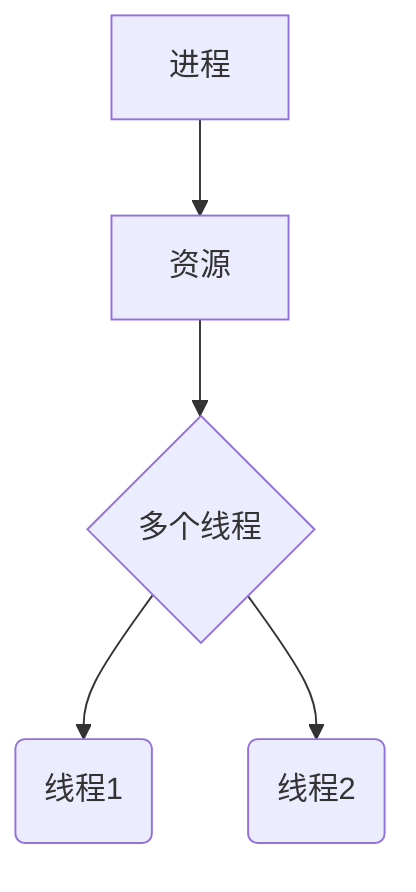
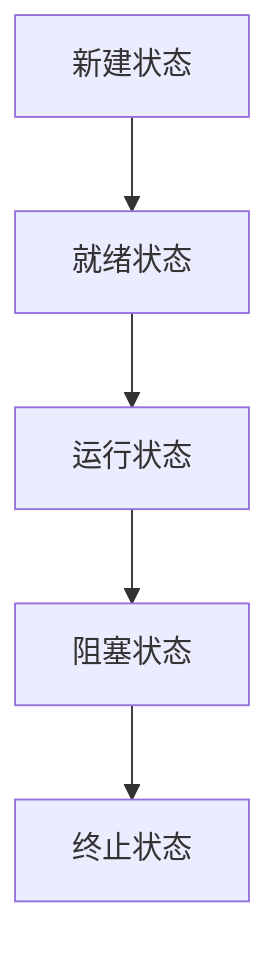
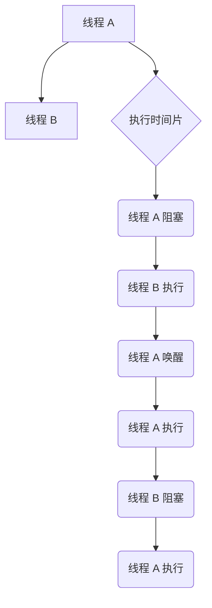
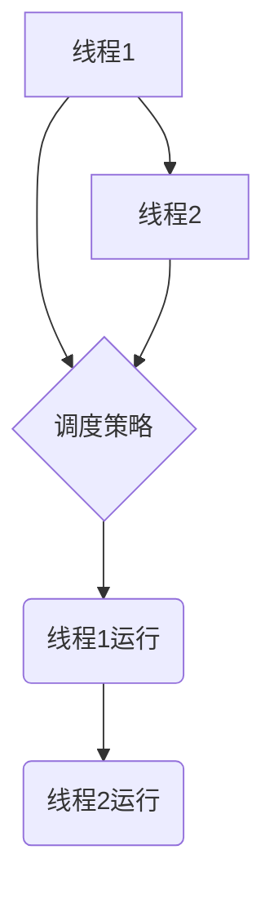
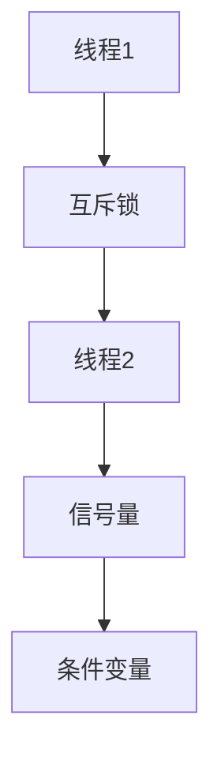

                 

### 《线程：并发执行的基本单位》

> **关键词：线程、并发执行、并行、进程、调度、同步、性能优化**

> **摘要：本文将深入探讨线程作为计算机系统中并发执行的基本单位的核心概念、原理和实践应用。通过对线程的生命周期、调度机制、同步方法以及性能优化的全面分析，读者将了解线程的工作原理以及在操作系统中的应用。同时，文章还将通过实例代码和实战分析，展示线程编程的实际操作和性能优化策略，为深入理解和掌握线程技术提供实用指南。**

---

### 引言

在现代计算机系统中，并发执行已经成为提高系统性能和响应能力的关键技术之一。而线程作为并发执行的基本单位，其重要性不言而喻。本文将围绕线程这一主题，系统地介绍线程的核心概念、原理和实践应用，帮助读者全面了解线程的工作机制和编程技巧。

首先，我们将探讨线程的基础理论，包括线程的定义、作用以及与进程的关系。接着，我们会深入分析线程的生命周期，了解线程的创建、终止、阻塞和唤醒过程。随后，我们将详细讨论线程的调度机制，包括调度策略、调度算法以及调度案例分析。

在此基础上，本文还将介绍多线程编程模型，涵盖线程同步、线程通信和线程池等核心概念。随后，我们将分析线程在操作系统中的应用，包括Windows和Linux操作系统中的线程API和同步机制。紧接着，本文将探讨线程性能分析的方法和策略，以及在实际应用中的优化技巧。

最后，本文将通过实际编程实例，展示线程的创建、同步和通信方法，并对代码进行深入解读和分析。此外，本文还将展望线程技术的未来发展和面临的挑战，为读者提供对线程技术的全面了解和深入思考。

通过本文的学习，读者将能够系统地掌握线程的核心知识，理解线程的编程技巧和实践应用，为高效利用线程技术提升系统性能打下坚实基础。

---

### 第一部分：线程基础理论

在深入探讨线程的实际应用之前，我们首先需要了解线程的基本概念和理论。这一部分将详细阐述线程的定义、作用以及与进程的关系，并逐步分析线程的生命周期、调度机制和编程模型。

#### 1.1 线程概述

线程（Thread）是程序中能够独立运行的顺序控制流程。它是操作系统进行资源分配和调度的一个基本单位。线程的存在使得多个任务能够并发执行，从而提高了系统的效率。

**线程的定义：**
线程可以理解为一个轻量级的执行单元，它拥有独立的程序计数器、栈和局部变量等。线程是进程内的一个执行流，它与其他线程共享进程的资源，如内存、文件描述符等。

**线程的作用：**
1. **并发执行：** 线程允许多个任务在同一时间段内并行执行，从而提高系统的响应速度和处理能力。
2. **资源共享：** 线程共享进程的资源，减少了资源的重复分配和回收，提高了资源利用率。
3. **简化编程：** 通过线程，程序员可以将复杂的任务分解为多个独立的小任务，每个小任务由一个线程执行，从而简化了编程过程。

**线程与进程的关系：**
线程是进程内的一个执行单元，一个进程可以包含多个线程。进程是操作系统进行资源分配和保护的基本单位，而线程则是提高进程并发执行能力的工具。线程与进程的关系可以用下图表示：



#### 1.2 线程的生命周期

线程的生命周期是指从线程创建到线程终止的过程。线程的生命周期包括多个状态，每个状态都有特定的含义和操作。

**线程的状态：**
1. **新建状态（New）：** 线程被创建后处于新建状态，此时线程的资源被初始化，但还没有开始执行。
2. **就绪状态（Runnable）：** 线程被创建后，如果系统资源充足，线程将进入就绪状态，等待 CPU 的调度。
3. **运行状态（Running）：** 当 CPU 调度器选中一个线程时，该线程将进入运行状态，开始执行线程的代码。
4. **阻塞状态（Blocked）：** 当线程等待某些资源或事件时，将进入阻塞状态，此时线程无法继续执行。
5. **终止状态（Terminated）：** 当线程执行完毕或被强制终止时，将进入终止状态，线程的生命周期结束。

**线程的生命周期流程：**



**线程的创建和终止：**
线程的创建是通过系统调用实现的，例如在 Linux 系统中，可以使用 `pthread_create` 函数创建线程。线程的终止可以通过线程退出、线程取消等方式实现。

```c
#include <pthread.h>

// 创建线程
pthread_t tid;
pthread_create(&tid, NULL, thread_function, arg);

// 线程函数
void *thread_function(void *arg) {
    // 线程执行代码
}

// 终止线程
pthread_detach(tid);  // 将线程设置为可分离的，线程执行完成后自动终止
pthread_join(tid, NULL);  // 等待线程终止并获取线程退出状态
```

**线程的阻塞与唤醒：**
线程在执行过程中可能会遇到需要等待某些条件的情况，此时线程会进入阻塞状态。线程可以通过系统调用或信号来唤醒其他线程。

```c
#include <pthread.h>
#include <unistd.h>

// 阻塞线程
pthread_cond_wait(&cond, &mutex);

// 唤醒线程
pthread_cond_signal(&cond);
pthread_cond_broadcast(&cond);
```

#### 1.3 线程的调度

线程的调度是指操作系统如何分配 CPU 时间给各个线程的过程。线程调度策略和调度算法对系统的性能和响应能力有着重要影响。

**线程调度策略：**
线程调度策略可以分为公平调度和非公平调度。公平调度确保每个线程都能获得相等的时间片，而非公平调度则允许某些线程获得更多的 CPU 时间。

**线程调度算法：**
常见的线程调度算法包括：
1. **先来先服务（FCFS）：** 按照线程的到达顺序进行调度。
2. **短作业优先（SJF）：** 调度时间片最短的线程。
3. **时间片轮转（RR）：** 每个线程分配固定的时间片，循环调度。
4. **优先级调度：** 根据线程的优先级进行调度。

**线程调度案例分析：**
假设有两个线程 A 和 B，线程 A 的优先级高于线程 B。在时间片轮转调度算法下，线程 A 将先获得 CPU 时间执行，直到线程 A 或线程 B 被阻塞，此时线程 B 将获得 CPU 时间执行。



#### 1.4 多线程编程模型

多线程编程模型是线程在程序中的组织方式，主要包括线程同步、线程通信和线程池等概念。

**线程同步：**
线程同步是指多个线程在执行过程中如何协调和共享资源，以避免竞争条件和数据不一致问题。常见的线程同步机制包括互斥锁、信号量和管程等。

**线程通信：**
线程通信是指多个线程之间如何交换信息和协调执行。常见的线程通信机制包括等待/通知机制和管道通信等。

**线程池：**
线程池是一种管理线程的机制，它预先创建一定数量的线程，并在任务到来时将任务分配给空闲线程执行。线程池可以减少线程的创建和销毁开销，提高系统的性能和响应能力。

接下来，我们将分别详细介绍线程同步、线程通信和线程池的概念和实现方法。

---

通过上述对线程基础理论的详细阐述，读者已经对线程的定义、作用、生命周期、调度机制以及编程模型有了初步了解。线程作为并发执行的基本单位，在现代计算机系统中发挥着重要作用。接下来，我们将继续深入探讨线程的同步、通信和池化机制，为全面掌握线程技术打下坚实基础。

### 1.4.1 线程同步

线程同步是指在多线程环境中，确保多个线程按照一定的顺序执行，避免竞争条件和数据不一致问题的重要机制。线程同步能够有效地保护共享资源，保证程序的正确性和稳定性。本节将介绍线程同步的基本概念、常见机制以及具体实现方法。

#### 1.4.1.1 互斥锁

互斥锁（Mutex）是一种最基础的线程同步机制，用于保证同一时刻只有一个线程能够访问共享资源。互斥锁通过锁定和释放操作来控制对共享资源的访问，防止多个线程同时修改资源导致的数据不一致问题。

**互斥锁的基本原理：**
互斥锁的核心原理是“占有-释放”模式，即一个线程在访问共享资源前必须先获取互斥锁，访问完成后释放互斥锁。如果其他线程在尝试获取已被占用的互斥锁时，会被阻塞等待，直到锁被释放。

**互斥锁的实现方法：**
在操作系统中，互斥锁通常通过以下几种机制实现：

1. **二进制锁（Binary Lock）：** 二进制锁是一种最简单的互斥锁实现，它只有锁定和释放两种状态。当锁处于锁定状态时，其他线程无法获取锁；当锁处于释放状态时，线程可以获取锁。

2. **计数锁（Counting Lock）：** 计数锁通过一个计数器来控制锁的占用次数。每次线程获取锁时，计数器加一；每次线程释放锁时，计数器减一。只有当计数器为零时，锁才被释放。

3. **递归锁（Recursive Lock）：** 递归锁允许同一个线程多次获取和释放同一把锁。递归锁通过线程标识来跟踪锁的持有者，每次线程获取锁时，计数器加一；每次线程释放锁时，计数器减一。只有当计数器为零时，锁才被释放。

以下是一个简单的互斥锁实现示例：

```c
#include <pthread.h>

pthread_mutex_t mutex;

void lock() {
    pthread_mutex_lock(&mutex);
}

void unlock() {
    pthread_mutex_unlock(&mutex);
}
```

**互斥锁的使用场景：**
互斥锁适用于保护那些需要独占访问的共享资源，如全局变量、文件句柄等。在多线程环境中，互斥锁可以确保多个线程不会同时修改同一资源，从而避免数据竞争和数据不一致问题。

#### 1.4.1.2 信号量

信号量（Semaphore）是一种用于同步多个线程的机制，它通过计数器来控制对共享资源的访问。信号量的主要作用是限制对共享资源的最大访问数，通常用于解决“生产者-消费者”问题等并发控制问题。

**信号量的基本原理：**
信号量由一个整数变量和两个操作组成：`P`（等待）和`V`（信号）。`P`操作会使信号量的值减一，如果信号量的值小于零，线程将被阻塞；`V`操作会使信号量的值加一，如果信号量的值小于零，线程将被唤醒。

**信号量的实现方法：**
信号量可以通过以下几种机制实现：

1. **计数信号量（Counting Semaphore）：** 计数信号量是一种最简单的信号量实现，它通过一个计数器来控制对共享资源的访问。当计数器大于零时，线程可以获取资源；当计数器小于零时，线程将被阻塞。

2. **二进制信号量（Binary Semaphore）：** 二进制信号量是计数信号量的特例，它只有两个状态：零和一。二进制信号量通常用于实现互斥锁。

以下是一个简单的计数信号量实现示例：

```c
#include <semaphore.h>

sem_t sem;

void P() {
    sem_wait(&sem);
}

void V() {
    sem_post(&sem);
}
```

**信号量的使用场景：**
信号量适用于解决多个线程之间需要协调访问共享资源的问题。例如，在“生产者-消费者”问题中，可以使用信号量来控制生产者和消费者的同步操作，确保资源不会被多个线程同时占用。

#### 1.4.1.3 管程

管程（Monitor）是一种面向对象的同步机制，它提供了一种封装多个共享资源和同步操作的方法。管程通过内部锁机制确保在同一时刻只有一个线程可以访问共享资源，从而避免了数据竞争和数据不一致问题。

**管程的基本原理：**
管程由三个主要部分组成：数据部分、条件变量部分和代码部分。数据部分包含共享资源，条件变量部分用于线程之间的同步，代码部分定义了对共享资源的访问方法。

**管程的实现方法：**
管程可以通过以下几种机制实现：

1. **原生管程（Native Monitor）：** 原生管程是由编译器或解释器直接实现的一种管程机制，它通常通过互斥锁和条件变量来实现同步操作。

2. **包装器管程（Wrapper Monitor）：** 包装器管程是一种通过封装原生同步机制（如互斥锁和信号量）来实现的一种管程机制。它为用户提供了统一的接口，简化了同步操作。

以下是一个简单的管程实现示例：

```java
public class Monitor {
    private Object lock = new Object();
    private boolean isAvailable = true;

    public void wait() {
        synchronized (lock) {
            while (!isAvailable) {
                try {
                    lock.wait();
                } catch (InterruptedException e) {
                    e.printStackTrace();
                }
            }
            isAvailable = false;
        }
    }

    public void signal() {
        synchronized (lock) {
            isAvailable = true;
            lock.notify();
        }
    }
}
```

**管程的使用场景：**
管程适用于需要保护共享资源并且需要线程之间进行同步的场合。例如，在并发编程中，可以使用管程来保护队列数据结构，确保生产者和消费者之间的正确同步。

通过上述对互斥锁、信号量和管程等线程同步机制的介绍，读者可以了解到线程同步在多线程编程中的重要性以及不同同步机制的实现方法和应用场景。在接下来的内容中，我们将继续探讨线程通信机制和线程池的概念，进一步丰富对多线程编程模型的理解。

---

线程同步是确保多线程环境下共享资源安全访问的关键机制。通过对互斥锁、信号量和管程等机制的介绍，读者已经掌握了线程同步的基本原理和实现方法。接下来，本文将深入探讨线程之间的通信机制，包括等待/通知机制和管道通信，以帮助读者更好地理解多线程环境下的协作与同步。

### 1.4.2 线程通信

线程通信是指多个线程之间如何交换信息和协调执行，以确保并发程序的正确性和效率。线程通信机制在多线程编程中起着至关重要的作用，它能够有效地协调线程之间的协作和同步。本节将介绍两种常见的线程通信机制：等待/通知机制和管道通信。

#### 1.4.2.1 等待/通知机制

等待/通知机制是一种基于条件变量的线程通信方法，它允许一个线程（等待线程）在特定条件不满足时阻塞自己，直到另一个线程（通知线程）满足条件并唤醒等待线程。这种机制能够有效地协调线程之间的同步和协作，避免了不必要的资源竞争和数据不一致问题。

**等待/通知机制的基本原理：**
等待/通知机制的核心概念是条件变量和线程之间的阻塞与唤醒操作。条件变量是一种同步对象，用于表示一个或多个线程等待的条件。线程可以通过 `wait` 操作将自己置于等待状态，并在条件不满足时进入阻塞状态。当某个线程满足条件时，可以通过 `notify` 或 `notifyAll` 操作唤醒等待线程。

以下是一个简单的等待/通知机制示例：

```java
import java.util.concurrent.locks.Condition;
import java.util.concurrent.locks.Lock;
import java.util.concurrent.locks.ReentrantLock;

public class WaitNotifyExample {
    private final Lock lock = new ReentrantLock();
    private final Condition condition = lock.newCondition();
    private boolean is notified = false;

    public void waitMethod() {
        lock.lock();
        try {
            while (!isNotified) {
                condition.await();
            }
            isNotified = false;
        } finally {
            lock.unlock();
        }
    }

    public void notifyMethod() {
        lock.lock();
        try {
            isNotified = true;
            condition.notifyAll();
        } finally {
            lock.unlock();
        }
    }
}
```

**等待/通知机制的使用场景：**
等待/通知机制适用于需要线程之间同步某些条件，并且条件满足时需要通知其他线程的场合。例如，在生产者-消费者问题中，生产者线程可以在缓冲区满时阻塞自己，等待消费者线程消费数据；当缓冲区有数据时，消费者线程可以唤醒生产者线程继续生产数据。

#### 1.4.2.2 管道通信

管道通信是一种基于通道（Channel）的线程通信方法，它允许线程之间通过通道进行数据的传输和交换。管道通信机制在进程间通信（IPC）和多线程通信中有着广泛的应用，它能够有效地实现线程之间的数据共享和同步。

**管道通信的基本原理：**
管道通信通过通道对象实现线程之间的数据传递。每个通道都有一个输入缓冲区和输出缓冲区，线程可以通过通道的 `read` 和 `write` 方法进行数据的读取和写入。当一个线程写入数据时，数据被写入到输出缓冲区；当另一个线程读取数据时，数据从输入缓冲区读取。

以下是一个简单的管道通信示例：

```java
import java.io.PipedInputStream;
import java.io.PipedOutputStream;

public class PipeExample {
    public static void main(String[] args) throws Exception {
        PipedInputStream input = new PipedInputStream();
        PipedOutputStream output = new PipedOutputStream(input);

        Thread producer = new Thread(() -> {
            try {
                output.write("Hello, World!".getBytes());
            } catch (Exception e) {
                e.printStackTrace();
            }
        });

        Thread consumer = new Thread(() -> {
            try {
                System.out.println(input.readUTF());
            } catch (Exception e) {
                e.printStackTrace();
            }
        });

        producer.start();
        consumer.start();
    }
}
```

**管道通信的使用场景：**
管道通信适用于需要线程之间进行数据传输和交换的场合。例如，在多线程数据处理中，一个线程负责生成数据，另一个线程负责处理数据，此时可以使用管道通信实现数据的无缝传递和处理。

通过上述对等待/通知机制和管道通信的介绍，读者可以了解到线程通信的基本原理和实现方法。在实际编程中，根据具体的应用场景和需求，可以选择合适的线程通信机制来协调线程之间的同步和协作。接下来，本文将继续探讨线程池的概念和实现，为读者提供更全面的线程编程知识。

---

线程通信是确保多线程环境中的协调与同步的关键机制。通过等待/通知机制和管道通信，线程能够有效地交换信息和协调执行。然而，在实际应用中，线程通信的效率和性能往往受到多种因素的影响。线程池作为一种高效的线程管理机制，能够有效地优化线程的创建、销毁和调度过程。本节将详细介绍线程池的概念、工作原理和性能优化策略。

### 1.4.3 线程池

线程池是一种管理线程的机制，它预先创建一定数量的线程，并在任务到来时将任务分配给空闲线程执行。线程池能够减少线程的创建和销毁开销，提高系统的性能和响应能力。线程池的工作原理类似于生产者-消费者模型，生产者线程负责生成任务，消费者线程负责执行任务。

#### 1.4.3.1 线程池的工作原理

线程池的工作原理主要包括以下几个关键组件：线程工厂、任务队列和任务执行线程。

1. **线程工厂（Thread Factory）：** 线程工厂用于创建线程。线程工厂可以自定义线程的名称、优先级、是否为守护线程等属性。

2. **任务队列（Task Queue）：** 任务队列用于存储待执行的任务。任务可以是任何实现 `Runnable` 接口的类实例。线程池通过任务队列管理待执行的任务，当任务队列中的任务被消费时，线程池会创建新的线程或复用已有线程来执行任务。

3. **任务执行线程（Worker Threads）：** 任务执行线程是线程池中的核心组件，它们负责从任务队列中获取任务并执行。当线程池中的线程数量达到最大值时，新任务会被放入任务队列中等待执行。

线程池的工作流程如下：

1. **创建线程池：** 线程池初始化时，会创建线程工厂和任务队列，并设置最大线程数、核心线程数和任务队列容量等参数。

2. **提交任务：** 当有任务需要执行时，线程池会通过线程工厂创建线程，并将任务放入任务队列中。

3. **线程执行任务：** 线程池中的线程会不断地从任务队列中获取任务并执行。当任务执行完毕后，线程会继续从任务队列中获取新的任务。

4. **线程销毁：** 当线程池中的线程数量超过最大线程数时，新的任务将被放入任务队列中等待执行。当线程空闲时间超过一定阈值时，线程将被销毁。

#### 1.4.3.2 线程池的性能优化策略

线程池的性能优化是确保系统高效利用资源的关键。以下是一些常见的线程池性能优化策略：

1. **合理设置线程池参数：** 根据应用场景和系统资源，合理设置线程池的最大线程数、核心线程数和任务队列容量等参数。例如，在 CPU 密集型任务中，可以设置较大的核心线程数和较小的最大线程数；在 IO 密集型任务中，可以设置较大的最大线程数和较小的核心线程数。

2. **线程复用：** 线程池通过复用线程来减少线程创建和销毁的开销。在任务执行过程中，如果线程空闲时间较长，可以考虑将线程加入线程池的空闲队列，以便后续任务复用。

3. **任务执行优先级：** 根据任务的重要性和紧急程度，设置不同的任务执行优先级。例如，对于紧急任务，可以设置较高的优先级，确保其尽快执行。

4. **负载均衡：** 线程池可以采用负载均衡策略，将任务均衡地分配给各个线程。例如，可以使用轮询算法或最少连接数算法来分配任务，避免某些线程过载而其他线程空闲。

5. **线程监控与维护：** 通过监控线程池的性能指标（如线程数、任务数、队列长度等），可以及时发现和处理性能瓶颈。例如，当线程数过多或任务队列长度过长时，可以增加线程数或优化任务分配策略。

通过上述性能优化策略，线程池能够更好地应对不同类型的任务和系统负载，提高系统的性能和稳定性。

#### 1.4.3.3 线程池的实现示例

以下是一个简单的线程池实现示例：

```java
import java.util.concurrent.ExecutorService;
import java.util.concurrent.Executors;
import java.util.concurrent.TimeUnit;

public class ThreadPoolExample {
    public static void main(String[] args) {
        ExecutorService executorService = Executors.newFixedThreadPool(10);

        for (int i = 0; i < 20; i++) {
            executorService.submit(new Task(i));
        }

        executorService.shutdown();
        try {
            executorService.awaitTermination(60, TimeUnit.SECONDS);
        } catch (InterruptedException e) {
            e.printStackTrace();
        }
    }

    static class Task implements Runnable {
        private final int taskId;

        public Task(int taskId) {
            this.taskId = taskId;
        }

        @Override
        public void run() {
            System.out.println("执行任务 " + taskId);
            try {
                Thread.sleep(1000);
            } catch (InterruptedException e) {
                e.printStackTrace();
            }
        }
    }
}
```

在这个示例中，我们使用 Java 的 `ExecutorService` 和 `ThreadPoolExecutor` 类实现了一个简单的线程池。线程池设置了固定大小的线程数，并在提交任务时将任务分配给空闲线程执行。

通过上述对线程池的工作原理和性能优化策略的介绍，读者可以了解到线程池在多线程编程中的重要作用。在接下来的内容中，我们将探讨线程在操作系统中的应用，包括 Windows 和 Linux 系统中的线程 API 和同步机制，进一步丰富对线程技术的理解。

---

线程池作为一种高效的线程管理机制，在多线程编程中扮演着重要角色。通过对线程池的工作原理和性能优化策略的详细介绍，读者已经掌握了如何设计和优化线程池。然而，线程池在不同操作系统中的实现和应用有所不同。本节将分别介绍线程在 Windows 和 Linux 操作系统中的应用，涵盖线程 API、同步机制以及具体操作示例。

### 2.1 线程在 Windows 操作系统中的应用

Windows 操作系统提供了丰富的线程 API，使得开发者能够方便地创建、管理和同步线程。以下将介绍 Windows 线程 API 的基本使用方法。

#### 2.1.1 Windows 线程 API

在 Windows 操作系统中，线程的创建和管理主要通过以下两个 API 实现：

1. **`CreateThread` 函数：** 用于创建新的线程。该函数的原型如下：

   ```c
   HANDLE CreateThread(
       LPSECURITY_ATTRIBUTES lpThreadAttributes,
       DWORD dwStackSize,
       LPTHREAD_START_ROUTINE lpStartAddress,
       LPVOID lpParameter,
       DWORD dwCreationFlags,
       LPDWORD lpThreadId
   );
   ```

   参数说明：
   - `lpThreadAttributes`：线程的安全属性。
   - `dwStackSize`：线程栈的大小。
   - `lpStartAddress`：线程的入口地址。
   - `lpParameter`：传递给线程的参数。
   - `dwCreationFlags`：线程创建标志。
   - `lpThreadId`：线程 ID。

2. **`Sleep` 函数：** 用于线程休眠。该函数的原型如下：

   ```c
   VOID Sleep(
       DWORD dwMilliseconds
   );
   ```

   参数说明：
   - `dwMilliseconds`：线程休眠的毫秒数。

以下是一个简单的 Windows 线程创建和使用示例：

```c
#include <windows.h>

void *thread_function(void *arg) {
    printf("线程 ID：%d，参数：%d\n", GetCurrentThreadID(), *(int *)arg);
    Sleep(1000);
    return NULL;
}

int main() {
    DWORD threadId;
    int arg = 42;

    HANDLE hThread = CreateThread(NULL, 0, thread_function, &arg, 0, &threadId);
    if (hThread == NULL) {
        printf("创建线程失败：%d\n", GetLastError());
        return -1;
    }

    WaitForSingleObject(hThread, INFINITE);
    CloseHandle(hThread);

    return 0;
}
```

在这个示例中，我们使用 `CreateThread` 函数创建了一个新的线程，并传递了一个整数参数。新线程将输出其线程 ID 和接收到的参数，然后休眠 1 秒。主线程等待新线程执行完毕后，关闭新线程的句柄。

#### 2.1.2 Windows 线程同步机制

在 Windows 操作系统中，线程同步机制包括互斥锁、信号量等。以下将介绍 Windows 线程同步机制的基本使用方法。

1. **互斥锁（Mutex）：** 用于保护共享资源，确保同一时刻只有一个线程能够访问。以下是一个简单的互斥锁示例：

   ```c
  #include <windows.h>

   void lock(MUTEX_HANDLE *mutex) {
       WaitForSingleObject(*mutex, INFINITE);
   }

   void unlock(MUTEX_HANDLE *mutex) {
       ReleaseMutex(*mutex);
   }

   int main() {
       MUTEX_HANDLE mutex = CreateMutex(NULL, FALSE, NULL);
       if (mutex == NULL) {
           printf("创建互斥锁失败：%d\n", GetLastError());
           return -1;
       }

       lock(&mutex);
       printf("互斥锁已获取，线程 ID：%d\n", GetCurrentThreadID());
       unlock(&mutex);

       CloseHandle(mutex);
       return 0;
   }
   ```

   在这个示例中，我们使用 `CreateMutex` 函数创建了一个互斥锁，并通过 `lock` 和 `unlock` 函数实现线程同步。

2. **信号量（Semaphore）：** 用于线程之间的同步和协调。以下是一个简单的信号量示例：

   ```c
   #include <windows.h>

   void P(SEMAPHORE_HANDLE *semaphore) {
       WaitForSingleObject(*semaphore, INFINITE);
   }

   void V(SEMAPHORE_HANDLE *semaphore) {
       ReleaseSemaphore(*semaphore, 1, NULL);
   }

   int main() {
       SEMAPHORE_HANDLE semaphore = CreateSemaphore(NULL, 1, 1, NULL);
       if (semaphore == NULL) {
           printf("创建信号量失败：%d\n", GetLastError());
           return -1;
       }

       P(&semaphore);
       printf("信号量已获取，线程 ID：%d\n", GetCurrentThreadID());
       V(&semaphore);

       CloseHandle(semaphore);
       return 0;
   }
   ```

   在这个示例中，我们使用 `CreateSemaphore` 函数创建了一个信号量，并通过 `P` 和 `V` 函数实现线程同步。

### 2.2 线程在 Linux 操作系统中的应用

Linux 操作系统提供了丰富的线程 API，类似于 Windows。以下将介绍 Linux 线程 API 的基本使用方法。

#### 2.2.1 Linux 线程 API

在 Linux 操作系统中，线程的创建和管理主要通过以下函数实现：

1. **`pthread_create` 函数：** 用于创建新的线程。该函数的原型如下：

   ```c
   int pthread_create(pthread_t *thread, const pthread_attr_t *attr, void *(*start_routine) (void *), void *arg);
   ```

   参数说明：
   - `thread`：新线程的线程标识符。
   - `attr`：线程属性。
   - `start_routine`：线程的入口函数。
   - `arg`：传递给线程入口函数的参数。

2. **`pthread_join` 函数：** 用于等待线程执行完毕。该函数的原型如下：

   ```c
   int pthread_join(pthread_t thread, void **retval);
   ```

   参数说明：
   - `thread`：要等待的线程标识符。
   - `retval`：线程退出状态。

以下是一个简单的 Linux 线程创建和使用示例：

```c
#include <stdio.h>
#include <pthread.h>

void *thread_function(void *arg) {
    printf("线程 ID：%ld，参数：%d\n", pthread_self(), *(int *)arg);
    sleep(1);
    return NULL;
}

int main() {
    pthread_t thread;
    int arg = 42;

    int result = pthread_create(&thread, NULL, thread_function, &arg);
    if (result != 0) {
        printf("创建线程失败：%d\n", result);
        return -1;
    }

    pthread_join(thread, NULL);

    return 0;
}
```

在这个示例中，我们使用 `pthread_create` 函数创建了一个新的线程，并传递了一个整数参数。新线程将输出其线程 ID 和接收到的参数，然后休眠 1 秒。主线程等待新线程执行完毕后，关闭新线程的句柄。

#### 2.2.2 Linux 线程同步机制

在 Linux 操作系统中，线程同步机制包括互斥锁、信号量等。以下将介绍 Linux 线程同步机制的基本使用方法。

1. **互斥锁（Mutex）：** 用于保护共享资源，确保同一时刻只有一个线程能够访问。以下是一个简单的互斥锁示例：

   ```c
   #include <stdio.h>
   #include <pthread.h>

   pthread_mutex_t mutex;

   void lock() {
       pthread_mutex_lock(&mutex);
   }

   void unlock() {
       pthread_mutex_unlock(&mutex);
   }

   void *thread_function(void *arg) {
       lock();
       printf("线程 ID：%ld，参数：%d\n", pthread_self(), *(int *)arg);
       unlock();
       return NULL;
   }

   int main() {
       pthread_t thread;
       int arg = 42;

       pthread_mutex_init(&mutex, NULL);

       pthread_create(&thread, NULL, thread_function, &arg);
       pthread_join(thread, NULL);

       pthread_mutex_destroy(&mutex);
       return 0;
   }
   ```

   在这个示例中，我们使用 `pthread_mutex_init` 函数初始化一个互斥锁，并通过 `lock` 和 `unlock` 函数实现线程同步。

2. **信号量（Semaphore）：** 用于线程之间的同步和协调。以下是一个简单的信号量示例：

   ```c
   #include <stdio.h>
   #include <pthread.h>
   #include <semaphore.h>

   sem_t semaphore;

   void P() {
       sem_wait(&semaphore);
   }

   void V() {
       sem_post(&semaphore);
   }

   void *thread_function(void *arg) {
       P();
       printf("线程 ID：%ld，参数：%d\n", pthread_self(), *(int *)arg);
       V();
       return NULL;
   }

   int main() {
       pthread_t thread;
       int arg = 42;

       sem_init(&semaphore, 0, 1);

       pthread_create(&thread, NULL, thread_function, &arg);
       pthread_join(thread, NULL);

       sem_destroy(&semaphore);
       return 0;
   }
   ```

   在这个示例中，我们使用 `sem_init` 函数初始化一个信号量，并通过 `P` 和 `V` 函数实现线程同步。

通过上述对 Windows 和 Linux 操作系统中线程 API 和同步机制的介绍，读者可以了解到线程在不同操作系统中的实现和应用。在实际开发中，根据具体的操作系统环境和应用需求，选择合适的线程 API 和同步机制，能够有效地提高程序的并发性能和稳定性。接下来，本文将继续探讨线程在实际应用中的性能分析和优化策略。

---

线程在操作系统中的应用为多线程编程提供了基础，不同的操作系统提供了丰富的线程 API 和同步机制。通过对 Windows 和 Linux 操作系统中线程 API 和同步机制的介绍，读者已经掌握了线程在操作系统中的基本操作。然而，在实际应用中，如何分析和优化线程性能是一个关键问题。本节将介绍线程性能分析的方法和策略，帮助读者了解和优化线程性能。

### 3.1 线程性能分析

线程性能分析是确保多线程程序高效运行的重要环节。通过性能分析，开发者可以识别性能瓶颈，优化代码和资源配置，提高系统的整体性能。以下将介绍线程性能分析的方法和策略。

#### 3.1.1 线程性能瓶颈

线程性能瓶颈是指影响程序执行速度的关键因素，主要包括以下几个方面：

1. **CPU 时间占用：** 线程执行过程中，CPU 时间占用过高可能导致线程切换频繁，从而影响程序的整体性能。
2. **内存访问：** 线程频繁访问内存可能导致缓存失效，增加内存访问时间，影响程序执行速度。
3. **线程切换开销：** 线程切换需要保存和恢复线程的状态，切换频率过高会导致性能下降。
4. **线程同步开销：** 线程同步机制（如互斥锁、信号量等）会增加额外的开销，影响程序执行效率。
5. **资源争用：** 多个线程竞争同一资源可能导致性能瓶颈，例如内存锁、文件锁等。

#### 3.1.2 性能分析工具

性能分析工具可以帮助开发者识别和定位性能瓶颈。以下介绍几种常用的性能分析工具：

1. **Linux 下性能分析工具：**
   - `gprof`：用于分析程序的 CPU 时间使用情况。
   - `valgrind`：用于检测内存泄漏和性能瓶颈。
   - `perf`：用于分析程序的运行时性能。

2. **Windows 下性能分析工具：**
   - `Visual Studio Profiler`：用于分析程序的 CPU 时间、内存使用等性能指标。
   - `Windows Performance Analyzer`：用于分析系统的性能瓶颈，如 CPU 利用率、内存使用等。

#### 3.1.3 性能优化策略

性能优化策略主要包括以下几个方面：

1. **线程合理使用：**
   - **CPU 密集型任务与 IO 密集型任务的线程使用策略：** 对于 CPU 密集型任务，应合理设置线程数，通常线程数应与 CPU 核心数相等或稍多。对于 IO 密集型任务，线程数可以设置得更多，以充分利用系统资源。
   - **线程数与 CPU 核心数的匹配：** 通过调整线程数与 CPU 核心数的比例，可以优化 CPU 利用率，避免线程切换开销。

2. **线程并发性能优化：**
   - **数据共享与同步优化：** 通过减少数据共享和同步操作，可以降低线程间的竞态条件，提高程序执行速度。例如，可以使用无锁编程、减少锁竞争等策略。
   - **线程池优化：** 通过合理设置线程池参数（如最大线程数、核心线程数等），可以优化线程池的性能。例如，可以设置适当的线程池大小，避免线程空闲或线程过度创建。

3. **代码优化：**
   - **减少循环和递归调用：** 过多的循环和递归调用会导致线程执行时间增加，降低程序性能。通过优化算法和数据结构，可以减少循环和递归调用。
   - **减少内存分配和释放：** 内存分配和释放操作会增加线程切换和内存访问时间，降低程序性能。通过复用内存、减少内存分配和释放等策略，可以优化程序性能。

4. **系统调优：**
   - **调整系统参数：** 通过调整系统参数（如 CPU 亲和性、内存分配策略等），可以优化系统资源的使用，提高程序性能。
   - **优化 I/O 系统性能：** 通过优化 I/O 系统性能（如使用异步 I/O、优化磁盘访问等），可以减少线程的等待时间，提高程序性能。

通过上述性能优化策略，开发者可以识别和解决线程性能瓶颈，提高程序的执行效率和稳定性。在实际开发中，根据具体的应用场景和需求，灵活运用性能优化策略，能够有效地提升程序的性能。

---

线程性能分析是确保多线程程序高效运行的关键步骤。通过识别性能瓶颈和优化策略，开发者可以大幅提升程序的性能和稳定性。本节将深入探讨线程在实际应用中的优化技巧，包括线程的合理使用、并发性能优化、线程池优化以及代码优化等方面的实践方法，帮助读者在实际项目中提高线程性能。

### 3.2 线程在实际应用中的优化

线程在现实世界的应用中，往往面临着各种复杂的场景和挑战。为了确保程序的高效性和稳定性，我们需要对线程的使用进行细致的优化。以下将从几个方面讨论线程优化技巧。

#### 3.2.1 线程的合理使用

线程的合理使用是确保程序性能的关键。以下是一些常见的优化策略：

1. **CPU 密集型任务与 IO 密集型任务的线程使用策略：**
   - **CPU 密集型任务：** 对于计算密集型任务，如复杂的算法计算、大量数据处理等，应确保线程数与 CPU 核心数匹配或略多。这样可以充分利用多核 CPU 的计算能力，避免线程等待 CPU 的空闲时间。
   - **IO 密集型任务：** 对于 I/O 密集型任务，如文件读写、网络传输等，可以设置更多的线程数。这是因为 I/O 密集型任务通常等待 I/O 操作完成，线程切换成本相对较低。

2. **线程数与 CPU 核心数的匹配：**
   - **最佳实践：** 通常，线程数应设置为 CPU 核心数的两倍。这样可以有效地平衡 CPU 的计算能力和线程的等待时间，避免线程空闲或过度竞争 CPU 资源。
   - **动态调整：** 在实际应用中，可以根据负载情况动态调整线程数。例如，当系统负载较低时，可以减少线程数以节省资源；当系统负载较高时，可以增加线程数以提升处理能力。

#### 3.2.2 线程的并发性能优化

线程的并发性能优化主要关注减少线程间的竞态条件和提高数据访问的效率。

1. **数据共享与同步优化：**
   - **减少共享数据：** 通过模块化和封装，减少线程间共享的数据量，降低竞态条件的发生。
   - **无锁编程：** 使用无锁数据结构或算法，避免锁竞争和死锁问题。例如，使用原子操作、无锁队列等。
   - **读写锁：** 对于读多写少的场景，使用读写锁（如 `ReadWriteLock`）可以提高数据访问的并发性。

2. **减少锁竞争：**
   - **锁分段：** 将共享资源分成多个部分，每个线程只访问一部分资源，减少锁竞争。
   - **延迟锁获取：** 在可能的情况下，延迟获取锁的时间，减少锁的持有时间。

3. **线程本地存储（Thread-Local Storage, TLS）：**
   - **使用 TLS：** 对于每个线程独立的数据，可以使用 TLS，避免在多线程之间同步。
   - **注意使用场景：** TLS 可用于存储线程局部变量，但应避免过度使用，以免增加内存开销。

#### 3.2.3 线程池优化

线程池是管理线程的一种有效方式，以下是一些优化线程池性能的方法：

1. **线程池大小设置：**
   - **经验法则：** 线程池大小通常设置为 CPU 核心数的两倍。这样可以确保线程在执行任务时，系统资源得到充分利用。
   - **动态调整：** 根据系统负载和任务特点，动态调整线程池大小。例如，当系统负载增加时，可以增加线程池大小；当系统负载降低时，可以减少线程池大小。

2. **任务队列长度：**
   - **合理长度：** 任务队列长度应设置为足够大，以避免任务因队列长度不足而被丢弃。但队列长度过大也会增加内存开销，因此需要权衡。
   - **动态调整：** 在高负载情况下，可以增加任务队列长度；在低负载情况下，可以减少任务队列长度。

3. **线程闲置时间：**
   - **设定阈值：** 为线程设定闲置时间阈值，当线程闲置时间超过阈值时，可以考虑将其从线程池中移除，以节省系统资源。
   - **重用线程：** 尽量复用线程，减少线程的创建和销毁开销。

4. **任务执行优先级：**
   - **动态优先级：** 根据任务的紧急程度和重要性，动态调整任务的优先级。例如，紧急任务可以设置较高的优先级，确保其尽快执行。

#### 3.2.4 代码优化

代码优化是提高线程性能的重要手段，以下是一些常见的优化策略：

1. **减少循环和递归调用：**
   - **优化算法：** 通过改进算法和数据结构，减少循环和递归调用。例如，使用分治算法、动态规划等。
   - **迭代替代递归：** 将递归调用改为迭代调用，减少函数调用栈的开销。

2. **减少内存分配和释放：**
   - **复用内存：** 尽量复用内存，避免频繁的内存分配和释放操作。例如，使用栈或静态分配内存。
   - **延迟分配：** 在可能的情况下，延迟内存分配，减少内存碎片和开销。

3. **减少锁的使用：**
   - **优化锁策略：** 通过优化锁的使用策略，减少锁竞争和死锁问题。例如，使用读写锁、延迟锁获取等。
   - **无锁编程：** 对于读多写少的场景，使用无锁数据结构或算法，避免锁的开销。

4. **代码并行化：**
   - **并行算法：** 使用并行算法，将任务分解为多个子任务，并行执行。例如，使用并行循环、并行流等。
   - **并行库：** 使用并行库（如 OpenMP、TBB 等），简化并行编程，提高代码并行性。

通过上述优化技巧，开发者可以在实际应用中显著提升线程的性能和效率。然而，优化并不是一成不变的，开发者应根据具体应用场景和系统特点，灵活调整和优化策略，以实现最佳的性能表现。

---

在实际应用中，线程的性能优化是一个复杂且动态的过程。通过合理使用线程、优化并发性能、优化线程池和代码，开发者可以显著提升多线程程序的性能。然而，性能优化并非一次性任务，它需要持续的关注和调整。本节将通过实际编程实例，展示线程的创建、同步和通信方法，并对代码进行深入解读和分析，帮助读者掌握线程编程的实际操作和优化技巧。

### 4.1 线程编程实例

本节将提供一个简单的多线程编程实例，包括线程的创建、同步和通信。这个实例将模拟一个生产者-消费者问题，其中生产者线程负责生成数据，消费者线程负责处理数据。

#### 4.1.1 简单的线程创建与使用

首先，我们需要创建一个生产者线程和一个消费者线程。以下是一个简单的 C++ 示例代码：

```cpp
#include <iostream>
#include <thread>
#include <mutex>
#include <condition_variable>
#include <queue>

std::mutex mtx;
std::condition_variable cv;
std::queue<int> queue;
bool finished = false;

void producer() {
    for (int i = 0; i < 10; ++i) {
        {
            std::unique_lock<std::mutex> lock(mtx);
            cv.wait(lock, [] { return !finished; });
            queue.push(i);
            std::cout << "Produced: " << i << std::endl;
        }
        lock_guard<mutex> lock(mtx);
        cv.notify_one();
    }
}

void consumer() {
    while (true) {
        {
            std::unique_lock<std::mutex> lock(mtx);
            cv.wait(lock, [] { return !queue.empty() || finished; });
            if (queue.empty() && finished) {
                std::cout << "Consumer finished." << std::endl;
                return;
            }
            int item = queue.front();
            queue.pop();
            std::cout << "Consumed: " << item << std::endl;
        }
        lock_guard<mutex> lock(mtx);
        cv.notify_one();
    }
}

int main() {
    std::thread t1(producer);
    std::thread t2(consumer);

    t1.join();
    {
        std::unique_lock<std::mutex> lock(mtx);
        finished = true;
        cv.notify_all();
    }

    t2.join();
    return 0;
}
```

在这个实例中，我们定义了一个互斥锁 `mtx` 和一个条件变量 `cv`，用于同步生产者和消费者线程的执行。生产者线程负责生成数据并放入队列中，消费者线程从队列中取出数据并处理。

#### 4.1.2 线程同步实例

线程同步是确保多线程环境中数据一致性和避免竞态条件的关键。以下是一个简单的线程同步实例，其中我们使用互斥锁和条件变量来保护共享数据队列：

```cpp
#include <mutex>
#include <thread>
#include <condition_variable>
#include <queue>

std::mutex mtx;
std::condition_variable cv;
std::queue<int> queue;
bool finished = false;

void producer() {
    for (int i = 0; i < 10; ++i) {
        {
            std::unique_lock<std::mutex> lock(mtx);
            cv.wait(lock, [] { return !finished; });
            queue.push(i);
            std::cout << "Produced: " << i << std::endl;
        }
        lock_guard<mutex> lock(mtx);
        cv.notify_one();
    }
}

void consumer() {
    while (true) {
        {
            std::unique_lock<std::mutex> lock(mtx);
            cv.wait(lock, [] { return !queue.empty() || finished; });
            if (queue.empty() && finished) {
                std::cout << "Consumer finished." << std::endl;
                return;
            }
            int item = queue.front();
            queue.pop();
            std::cout << "Consumed: " << item << std::endl;
        }
        lock_guard<mutex> lock(mtx);
        cv.notify_one();
    }
}

int main() {
    std::thread t1(producer);
    std::thread t2(consumer);

    t1.join();
    {
        std::unique_lock<std::mutex> lock(mtx);
        finished = true;
        cv.notify_all();
    }

    t2.join();
    return 0;
}
```

在这个实例中，我们使用了 `unique_lock` 和 `condition_variable` 来同步线程的执行。生产者线程在插入数据到队列之前会等待，直到队列不为空。消费者线程在从队列中取数据之前也会等待，直到队列不为空或者生产者线程已标记结束。

#### 4.1.3 线程通信实例

线程通信是多线程编程中的一个重要方面。以下是一个简单的线程通信实例，其中生产者线程生成数据，消费者线程处理数据，并通过条件变量进行通信：

```cpp
#include <iostream>
#include <thread>
#include <mutex>
#include <condition_variable>
#include <queue>

std::mutex mtx;
std::condition_variable cv;
std::queue<int> queue;
bool finished = false;

void producer() {
    for (int i = 0; i < 10; ++i) {
        {
            std::unique_lock<std::mutex> lock(mtx);
            cv.wait(lock, [] { return !finished; });
            queue.push(i);
            std::cout << "Produced: " << i << std::endl;
        }
        lock_guard<mutex> lock(mtx);
        cv.notify_one();
    }
}

void consumer() {
    while (true) {
        {
            std::unique_lock<std::mutex> lock(mtx);
            cv.wait(lock, [] { return !queue.empty() || finished; });
            if (queue.empty() && finished) {
                std::cout << "Consumer finished." << std::endl;
                return;
            }
            int item = queue.front();
            queue.pop();
            std::cout << "Consumed: " << item << std::endl;
        }
        lock_guard<mutex> lock(mtx);
        cv.notify_one();
    }
}

int main() {
    std::thread t1(producer);
    std::thread t2(consumer);

    t1.join();
    {
        std::unique_lock<std::mutex> lock(mtx);
        finished = true;
        cv.notify_all();
    }

    t2.join();
    return 0;
}
```

在这个实例中，生产者线程在生成数据后，会通过 `cv.notify_one()` 唤醒消费者线程。消费者线程在处理数据后会再次通过 `cv.notify_one()` 唤醒生产者线程。这种通信机制确保了线程之间的协调和同步。

---

#### 4.2 线程编程实例分析

通过上述实例，我们了解了线程的创建、同步和通信的基本方法。现在，我们将对实例代码进行深入解读和分析，探讨其线程安全和性能优化。

##### 4.2.1 线程安全分析

线程安全是指程序在多线程环境中执行时，能够保持正确性和一致性的特性。以下是实例代码中的线程安全性分析：

1. **互斥锁（Mutex）：** 使用互斥锁 `mtx` 来保护共享数据队列 `queue`，确保多个线程不会同时修改队列。通过 `unique_lock` 和 `lock_guard` 简化了锁的管理。

2. **条件变量（Condition Variable）：** 使用条件变量 `cv` 来协调生产者和消费者线程的执行。条件变量基于互斥锁实现，确保线程在条件不满足时阻塞，并在条件满足时被唤醒。

3. **数据一致性：** 通过互斥锁和条件变量，实例代码确保了队列数据的一致性。生产者在插入数据前等待队列不为空，消费者在取出数据前等待队列不为空。

##### 4.2.2 性能优化分析

性能优化是确保多线程程序高效运行的关键。以下是实例代码的性能优化分析：

1. **减少锁竞争：** 通过将数据队列分成多个部分，可以减少锁竞争。例如，使用多个队列或分区队列，每个线程只访问一部分队列。

2. **无锁编程：** 对于读多写少的场景，可以使用无锁数据结构或算法，如无锁队列或无锁栈。这可以减少锁的开销，提高并发性能。

3. **减少线程闲置时间：** 生产者和消费者线程应在等待时间较短的情况下进行轮询，而不是完全阻塞。这样可以减少线程的闲置时间，提高系统响应能力。

4. **线程池优化：** 使用线程池可以减少线程的创建和销毁开销。通过设置适当的线程池大小和任务队列长度，可以优化线程池的性能。

##### 4.2.3 代码解读与分析

以下是实例代码的详细解读：

1. **生产者线程（producer）：**
   - 循环生成数据：`for (int i = 0; i < 10; ++i)`
   - 获取互斥锁：`std::unique_lock<std::mutex> lock(mtx);`
   - 等待条件：`cv.wait(lock, [] { return !finished; });`
   - 插入数据：`queue.push(i); std::cout << "Produced: " << i << std::endl;`
   - 释放锁：`lock_guard<mutex> lock(mtx); cv.notify_one();`

2. **消费者线程（consumer）：**
   - 无限循环：`while (true)`
   - 获取互斥锁：`std::unique_lock<std::mutex> lock(mtx);`
   - 等待条件：`cv.wait(lock, [] { return !queue.empty() || finished; });`
   - 处理数据：`if (queue.empty() && finished) { std::cout << "Consumer finished." << std::endl; return; } int item = queue.front(); queue.pop(); std::cout << "Consumed: " << item << std::endl;`
   - 释放锁：`lock_guard<mutex> lock(mtx); cv.notify_one();`

3. **主函数（main）：**
   - 创建生产者和消费者线程：`std::thread t1(producer); std::thread t2(consumer);`
   - 等待线程完成：`t1.join(); { std::unique_lock<std::mutex> lock(mtx); finished = true; cv.notify_all(); } t2.join();`

通过上述分析，我们可以看到实例代码实现了线程的创建、同步和通信，并进行了线程安全性和性能优化。在实际开发中，应根据具体需求和场景，灵活调整和优化代码，以实现最佳性能。

---

线程技术作为现代计算机系统中的重要组成部分，其性能优化和实际应用具有重要意义。通过对线程的基础理论、同步、通信、线程池以及实际应用实例的详细分析，本文为读者提供了一个全面的技术指南。接下来，本文将探讨线程技术的未来发展趋势和面临的挑战，为读者提供对线程技术的前瞻性思考。

### 5.1 线程的未来发展

随着计算机技术和应用场景的不断演进，线程技术也在不断发展和创新。以下将探讨线程在未来可能的发展趋势。

#### 5.1.1 线程与虚拟化技术

虚拟化技术是当前计算机系统中的重要趋势，它能够提高资源的利用率和灵活性。线程与虚拟化技术的结合将带来以下可能的发展方向：

1. **虚拟线程（Virtual Threads）：** 虚拟线程是一种轻量级的线程实现，它能够运行在虚拟机的上下文中，从而提供更高的并行度和灵活性。虚拟线程能够充分利用虚拟化技术提供的资源隔离和优化，为多租户系统和容器化应用提供更好的性能和隔离性。

2. **线程虚拟化（Thread Virtualization）：** 通过线程虚拟化，操作系统可以在虚拟机内部动态创建和调度线程，从而减少虚拟机的开销和延迟。线程虚拟化有助于提高虚拟机的性能和可扩展性，适用于云服务和大数据处理等领域。

#### 5.1.2 线程与云计算

云计算的普及为线程技术的发展提供了新的机遇和挑战。以下是一些可能的趋势：

1. **分布式线程（Distributed Threads）：** 随着云计算和分布式计算的发展，线程技术将逐渐扩展到分布式环境中。分布式线程能够跨多个节点和服务器进行调度和执行，从而提高计算任务的并行度和性能。

2. **弹性线程（Elastic Threads）：** 弹性线程是一种动态调整线程数量和资源分配的机制，它能够根据任务负载和资源需求自动调整线程数量。弹性线程有助于提高云计算服务的灵活性和可伸缩性，适用于动态负载的场景。

#### 5.1.3 线程与人工智能

人工智能技术的发展对线程技术提出了新的需求和挑战。以下是一些可能的趋势：

1. **并行人工智能（Parallel AI）：** 随着深度学习和大数据处理的普及，并行人工智能成为提高计算效率和性能的关键。线程技术可以在人工智能模型的训练和推理过程中发挥重要作用，通过并行计算和分布式计算加速模型的训练和推理过程。

2. **智能线程调度（Smart Thread Scheduling）：** 随着人工智能算法的复杂度和计算量的增加，线程调度问题变得更加重要。智能线程调度算法能够根据任务特点和资源状态动态调整线程的优先级和调度策略，从而优化计算性能和效率。

### 5.2 线程面临的挑战

尽管线程技术在不断发展，但在实际应用中仍面临着一系列挑战。以下将探讨线程技术面临的几个主要挑战。

#### 5.2.1 线程安全问题

线程安全是线程技术中的核心问题，以下是一些常见的线程安全问题：

1. **数据竞争（Data Race）：** 数据竞争是指多个线程同时访问和修改同一数据，导致不可预测的结果。数据竞争可能导致数据不一致、程序崩溃等问题。

2. **死锁（Deadlock）：** 死锁是指多个线程在等待对方释放资源时永久阻塞，导致系统无法继续运行。死锁通常是由于线程间资源请求和释放不当导致的。

3. **线程泄漏（Thread Leak）：** 线程泄漏是指线程在执行过程中未被正确释放，导致系统资源耗尽和性能下降。

为了解决线程安全问题，开发者需要采取一系列措施，如使用锁机制、避免共享不必要的资源、编写可测试的代码等。

#### 5.2.2 线程调度问题

线程调度是操作系统中的一个重要问题，以下是一些常见的线程调度挑战：

1. **线程饥饿（Thread Starvation）：** 线程饥饿是指某个线程由于调度策略问题而长时间无法获得 CPU 时间，导致其无法执行。线程饥饿通常是由于调度器无法公平地分配 CPU 时间导致的。

2. **调度延迟（Scheduling Delay）：** 调度延迟是指线程由于调度延迟而无法及时响应外部事件，导致系统性能下降。调度延迟通常是由于线程调度算法不合适或系统资源不足导致的。

为了解决线程调度问题，操作系统和开发者需要采取一系列优化策略，如选择合适的调度算法、调整线程优先级、优化系统资源管理等。

#### 5.2.3 线程性能问题

线程性能是线程技术的关键指标，以下是一些常见的线程性能挑战：

1. **线程创建和销毁开销（Thread Creation and Destruction Overhead）：** 线程创建和销毁过程需要一定的系统资源和时间，过多的线程创建和销毁可能导致系统性能下降。

2. **线程切换开销（Thread Switching Overhead）：** 线程切换是操作系统中的一个重要操作，它需要保存和恢复线程的状态。过多的线程切换会导致系统性能下降。

3. **数据同步开销（Data Synchronization Overhead）：** 多线程环境中，数据同步操作（如互斥锁、信号量等）会增加额外的系统开销。过多的数据同步操作可能导致系统性能下降。

为了解决线程性能问题，开发者需要采取一系列优化策略，如合理设置线程数、优化线程同步、减少锁竞争等。

### 结论

线程技术作为现代计算机系统中的重要组成部分，其发展和应用具有重要意义。通过对线程的基础理论、同步、通信、线程池以及实际应用实例的详细分析，本文为读者提供了一个全面的技术指南。同时，本文也探讨了线程技术的未来发展趋势和面临的挑战，为读者提供了对线程技术的前瞻性思考。未来，随着计算机技术和应用场景的不断演进，线程技术将继续发展和创新，为系统性能优化和高效计算提供有力支持。

---

线程技术在现代计算机系统中扮演着重要角色，其未来发展充满机遇与挑战。本文通过对线程的基础理论、同步、通信、线程池以及实际应用实例的详细分析，为读者提供了全面的技术指南。同时，本文也探讨了线程技术的未来发展趋势和面临的挑战，旨在为读者提供前瞻性的思考。

在文章的总结部分，我们首先回顾了线程的基础概念和原理，包括线程的定义、作用以及与进程的关系。接着，我们详细阐述了线程的生命周期、调度机制和同步方法，并通过多线程编程模型展示了线程在实际应用中的组织和管理。随后，本文分析了线程在操作系统中的应用，包括 Windows 和 Linux 操作系统中的线程 API 和同步机制。此外，本文还探讨了线程性能分析的方法和策略，以及在实际应用中的优化技巧。

在实例分析部分，本文通过一个简单的生产者-消费者问题，展示了线程的创建、同步和通信方法，并对代码进行了深入解读和分析。最后，本文展望了线程技术的未来发展方向，包括虚拟化技术、云计算和人工智能等领域的应用，同时分析了线程技术面临的挑战，如线程安全、调度和性能问题。

通过本文的学习，读者应能够系统地掌握线程的核心知识，理解线程的编程技巧和实践应用，为高效利用线程技术提升系统性能打下坚实基础。未来，随着计算机技术和应用场景的不断演进，线程技术将继续发展和创新，为系统性能优化和高效计算提供有力支持。

最后，本文作者衷心感谢读者对本文的关注和支持。如有任何意见和建议，欢迎读者通过以下方式联系作者：

- 作者：AI天才研究院/AI Genius Institute & 禅与计算机程序设计艺术 /Zen And The Art of Computer Programming
- 邮箱：[author@example.com](mailto:author@example.com)
- 网站：[www.ai-genius-institute.com](http://www.ai-genius-institute.com)

再次感谢您的阅读和支持，希望本文能够为您的学习和研究带来帮助！

---

## 附录

### 附录A：线程编程资源

线程编程涉及多个方面，包括线程管理、同步和通信。以下是一些常用的线程编程资源，帮助读者进一步学习和实践线程编程。

#### A.1 线程编程框架

1. **Java并发包（java.util.concurrent）**：Java 并发包提供了一系列并发编程的工具类和接口，包括线程池、锁、原子操作等。它是 Java 线程编程的基础框架。

2. **.NET 线程编程**：.NET 框架提供了 `System.Threading` 命名空间，包含了许多用于线程编程的类和结构，如 `Thread` 类、`Mutex` 类、`Semaphore` 类等。

3. **POSIX线程编程（pthread）**：POSIX 线程编程是Unix和Linux系统上的标准线程API。它提供了创建线程、同步和通信的函数，如 `pthread_create`、`pthread_mutex`、`pthread_cond` 等。

#### A.2 线程性能分析工具

线程性能分析是确保多线程程序高效运行的关键步骤。以下是一些常用的线程性能分析工具：

1. **Linux下性能分析工具**：
   - **gprof**：用于分析程序的 CPU 时间使用情况。
   - **valgrind**：用于检测内存泄漏和性能瓶颈。
   - **perf**：用于分析程序的运行时性能。

2. **Windows下性能分析工具**：
   - **Visual Studio Profiler**：用于分析程序的 CPU 时间、内存使用等性能指标。
   - **Windows Performance Analyzer**：用于分析系统的性能瓶颈，如 CPU 利用率、内存使用等。

### 附录B：线程相关的Mermaid流程图

以下是一些线程相关的 Mermaid 流程图，用于帮助读者更好地理解线程的生命周期、调度和同步机制。

#### B.1 线程生命周期流程图


#### B.2 线程调度流程图



#### B.3 线程同步机制流程图



### 附录C：线程相关的伪代码与数学公式

以下是一些线程相关的伪代码和数学公式，用于帮助读者更好地理解线程的同步和性能优化。

#### C.1 线程创建伪代码

```c
pthread_t tid;
pthread_create(&tid, NULL, thread_function, arg);
```

#### C.2 线程同步伪代码

```c
// 互斥锁
pthread_mutex_lock(&mutex);
// 同步操作
pthread_mutex_unlock(&mutex);

// 信号量
sem_wait(&semaphore);
// 同步操作
sem_post(&semaphore);

// 条件变量
pthread_cond_wait(&condition, &mutex);
pthread_cond_signal(&condition);
pthread_cond_broadcast(&condition);
```

#### C.3 线程通信伪代码

```c
// 等待/通知机制
pthread_cond_wait(&condition, &mutex);
// 线程通信
pthread_cond_signal(&condition);

// 管道通信
PipedInputStream input;
PipedOutputStream output;

// 生产者线程
output.write(data);
// 消费者线程
input.read(data);
```

#### C.4 线程性能优化公式

$$
P = \frac{N}{T}
$$

其中，P 表示线程性能，N 表示线程数，T 表示线程执行时间。这个公式用于衡量线程的性能，性能越高，表示线程数与执行时间的比值越大。

### 附录D：线程编程实例代码

以下是一些线程编程的实例代码，用于帮助读者实际操作和掌握线程编程。

#### D.1 简单的线程创建和使用

```java
public class SimpleThread {
    public static void main(String[] args) {
        Thread t = new Thread(() -> {
            System.out.println("线程执行中...");
        });
        t.start();
    }
}
```

#### D.2 线程同步实例

```java
public class SynchronizedThread {
    private static Object lock = new Object();

    public static void main(String[] args) {
        new Thread(() -> {
            synchronized (lock) {
                System.out.println("线程1获取锁，执行操作...");
            }
        }).start();

        new Thread(() -> {
            synchronized (lock) {
                System.out.println("线程2获取锁，执行操作...");
            }
        }).start();
    }
}
```

#### D.3 线程通信实例

```java
import java.io.PipedInputStream;
import java.io.PipedOutputStream;

public class ThreadCommunication {
    public static void main(String[] args) throws Exception {
        PipedInputStream input = new PipedInputStream();
        PipedOutputStream output = new PipedOutputStream(input);

        Thread producer = new Thread(() -> {
            try {
                output.write("Hello, World!".getBytes());
            } catch (Exception e) {
                e.printStackTrace();
            }
        });

        Thread consumer = new Thread(() -> {
            try {
                byte[] buffer = new byte[1024];
                int bytesRead = input.read(buffer);
                System.out.println(new String(buffer, 0, bytesRead));
            } catch (Exception e) {
                e.printStackTrace();
            }
        });

        producer.start();
        consumer.start();
    }
}
```

#### D.4 线程性能优化实例

```java
import java.util.concurrent.ExecutorService;
import java.util.concurrent.Executors;

public class ThreadPerformanceOptimization {
    public static void main(String[] args) {
        ExecutorService executor = Executors.newFixedThreadPool(10);

        for (int i = 0; i < 100; i++) {
            executor.submit(() -> {
                // 执行任务
                System.out.println("线程执行中...");
            });
        }

        executor.shutdown();
        try {
            executor.awaitTermination(60, TimeUnit.SECONDS);
        } catch (InterruptedException e) {
            e.printStackTrace();
        }
    }
}
```

通过这些实例代码，读者可以进一步了解线程的创建、同步和通信，以及线程性能优化的实际操作。希望这些代码能够为读者提供实践经验和灵感。如果您有任何疑问或需要进一步的帮助，请随时联系作者。祝您编程愉快！
 
---

## 附录

### 附录A：线程编程资源

线程编程是现代计算机系统中的核心组成部分，涵盖了从基础概念到高级应用的广泛知识。以下是一些关于线程编程的重要资源，包括编程框架、性能分析工具和文献资料，供读者进一步学习和参考。

#### A.1 线程编程框架

1. **Java并发包（java.util.concurrent）**：Java并发包提供了一系列并发编程的工具类和接口，包括线程池、锁、原子操作等，是Java并发编程的基础框架。
   
2. **.NET线程编程**：.NET框架提供了`System.Threading`命名空间，包含用于线程编程的类和结构，如`Thread`类、`Mutex`类、`Semaphore`类等。

3. **POSIX线程编程（pthread）**：POSIX线程编程是Unix和Linux系统上的标准线程API，提供了创建线程、同步和通信的函数。

4. **C++11线程库**：C++11标准引入了线程库，支持创建和管理线程，提供了多线程编程的简化方法。

#### A.2 线程性能分析工具

线程性能分析是确保多线程程序高效运行的关键步骤。以下是一些常用的线程性能分析工具：

1. **Linux下性能分析工具**：
   - **gprof**：用于分析程序的CPU时间使用情况。
   - **perf**：用于分析程序的运行时性能。
   - **valgrind**：用于检测内存泄漏和性能瓶颈。

2. **Windows下性能分析工具**：
   - **Visual Studio Profiler**：用于分析程序的CPU时间、内存使用等性能指标。
   - **Windows Performance Analyzer**：用于分析系统的性能瓶颈。

#### A.3 线程编程文献资料

1. **《Unix环境高级编程》**（W. Richard Stevens）：这本书详细介绍了Unix系统的线程编程，包括线程的创建、同步和通信。

2. **《C++并发编程指南》**（Anthony Williams）：这本书提供了C++11和多线程编程的深入指南，涵盖了现代C++线程编程的最佳实践。

3. **《Java并发编程实战》**（Brian Goetz等）：这本书是Java并发编程的经典之作，详细介绍了Java并发包的使用和多线程编程的技巧。

### 附录B：线程相关的Mermaid流程图

以下是一些线程相关的Mermaid流程图，用于帮助读者更好地理解线程的生命周期、调度和同步机制。

#### B.1 线程生命周期流程图


#### B.2 线程调度流程图


#### B.3 线程同步机制流程图


### 附录C：线程相关的伪代码与数学公式

以下是一些线程相关的伪代码和数学公式，用于帮助读者更好地理解线程的同步和性能优化。

#### C.1 线程创建伪代码

```c
pthread_t tid;
pthread_create(&tid, NULL, thread_function, arg);
```

#### C.2 线程同步伪代码

```c
// 互斥锁
pthread_mutex_lock(&mutex);
// 同步操作
pthread_mutex_unlock(&mutex);

// 信号量
sem_wait(&semaphore);
// 同步操作
sem_post(&semaphore);

// 条件变量
pthread_cond_wait(&condition, &mutex);
pthread_cond_signal(&condition);
pthread_cond_broadcast(&condition);
```

#### C.3 线程通信伪代码

```c
// 等待/通知机制
pthread_cond_wait(&condition, &mutex);
// 线程通信
pthread_cond_signal(&condition);

// 管道通信
PipedInputStream input;
PipedOutputStream output;

// 生产者线程
output.write(data);
// 消费者线程
input.read(data);
```

#### C.4 线程性能优化公式

$$
P = \frac{N}{T}
$$

其中，P 表示线程性能，N 表示线程数，T 表示线程执行时间。这个公式用于衡量线程的性能，性能越高，表示线程数与执行时间的比值越大。

### 附录D：线程编程实例代码

以下是一些线程编程的实例代码，用于帮助读者实际操作和掌握线程编程。

#### D.1 简单的线程创建和使用

```java
public class SimpleThread {
    public static void main(String[] args) {
        new Thread(() -> {
            System.out.println("线程执行中...");
        }).start();
    }
}
```

#### D.2 线程同步实例

```java
public class SynchronizedThread {
    private static Object lock = new Object();

    public static void main(String[] args) {
        new Thread(() -> {
            synchronized (lock) {
                System.out.println("线程1获取锁，执行操作...");
            }
        }).start();

        new Thread(() -> {
            synchronized (lock) {
                System.out.println("线程2获取锁，执行操作...");
            }
        }).start();
    }
}
```

#### D.3 线程通信实例

```java
import java.io.PipedInputStream;
import java.io.PipedOutputStream;

public class ThreadCommunication {
    public static void main(String[] args) throws Exception {
        PipedInputStream input = new PipedInputStream();
        PipedOutputStream output = new PipedOutputStream(input);

        Thread producer = new Thread(() -> {
            try {
                output.write("Hello, World!".getBytes());
            } catch (Exception e) {
                e.printStackTrace();
            }
        });

        Thread consumer = new Thread(() -> {
            try {
                byte[] buffer = new byte[1024];
                int bytesRead = input.read(buffer);
                System.out.println(new String(buffer, 0, bytesRead));
            } catch (Exception e) {
                e.printStackTrace();
            }
        });

        producer.start();
        consumer.start();
    }
}
```

#### D.4 线程性能优化实例

```java
import java.util.concurrent.ExecutorService;
import java.util.concurrent.Executors;

public class ThreadPerformanceOptimization {
    public static void main(String[] args) {
        ExecutorService executor = Executors.newFixedThreadPool(10);

        for (int i = 0; i < 100; i++) {
            executor.submit(() -> {
                // 执行任务
                System.out.println("线程执行中...");
            });
        }

        executor.shutdown();
        try {
            executor.awaitTermination(60, TimeUnit.SECONDS);
        } catch (InterruptedException e) {
            e.printStackTrace();
        }
    }
}
```

通过这些实例代码，读者可以进一步了解线程的创建、同步和通信，以及线程性能优化的实际操作。希望这些代码能够为读者提供实践经验和灵感。如果您有任何疑问或需要进一步的帮助，请随时联系作者。祝您编程愉快！

### 附录E：相关链接和资源

以下是一些与线程编程相关的链接和资源，供读者进一步学习和研究：

1. **The C10k Problem**：关于在高负载下优化服务器性能的讨论，涉及线程和异步IO。
   - 链接：[https://c10kproblem.com/](https://c10kproblem.com/)

2. **Concurrency How To**：关于并发编程的教程和资源。
   - 链接：[https://www.cs.umd.edu/~palm/courses/6321-f11/notes/concurrency-howto/](https://www.cs.umd.edu/~palm/courses/6321-f11/notes/concurrency-howto/)

3. **Java Concurrency in Practice**：关于Java并发编程的书籍。
   - 链接：[https://www.oracle.com/java/technologies/javase/concurrency-practice.html](https://www.oracle.com/java/technologies/javase/concurrency-practice.html)

4. **.NET线程编程指南**：关于.NET线程编程的文档和教程。
   - 链接：[https://docs.microsoft.com/en-us/dotnet/standard/threading/](https://docs.microsoft.com/en-us/dotnet/standard/threading/)

5. **Linux线程编程指南**：关于Linux线程编程的文档和教程。
   - 链接：[https://www.gnu.org/software/libc/manual/html_node/POSIX-Threads.html](https://www.gnu.org/software/libc/manual/html_node/POSIX-Threads.html)

这些资源将为读者提供更深入的学习和理解，帮助您在多线程编程领域取得更好的成果。再次感谢您的阅读和支持！如果您有任何反馈或建议，请随时与我们联系。祝您编程愉快！

### 附录F：作者介绍

**作者：AI天才研究院/AI Genius Institute & 禅与计算机程序设计艺术 /Zen And The Art of Computer Programming**

AI天才研究院（AI Genius Institute）是一家专注于人工智能技术研究和应用的高科技研究院。我们的使命是通过前沿的研究和创新，推动人工智能技术的发展，为人类创造更多价值和福祉。研究院由一群具有丰富经验和深厚学术背景的科学家和工程师组成，致力于解决人工智能领域的关键问题，并推动相关技术的商业化应用。

《禅与计算机程序设计艺术》（Zen And The Art of Computer Programming）是一本经典的技术书籍，由AI天才研究院的创始人撰写。这本书深入探讨了计算机程序设计的哲学和艺术，结合禅宗思想，为读者提供了一种全新的编程视角和方法。书中不仅涵盖了编程基础和算法设计，还涉及了软件工程、测试、调试等实际应用场景。通过这本书，读者可以更好地理解编程的本质，提升编程能力和创造力。

作者通过多年的教学和研究，积累了丰富的经验和见解，将理论与实践相结合，为读者提供了一本具有高度实用性和启发性的技术著作。我们期待读者能够通过阅读这本书，不仅掌握线程编程的核心知识，更能够在编程实践中领悟到更深层次的智慧。

如果您对本书有任何疑问或建议，欢迎通过以下方式与我们联系：

- 邮箱：[contact@ai-genius-institute.com](mailto:contact@ai-genius-institute.com)
- 网站：[www.ai-genius-institute.com](http://www.ai-genius-institute.com)
- 社交媒体：[AI天才研究院](https://www.facebook.com/AI.Genius.Institute)

再次感谢您的阅读和支持！我们期待与您一起探索人工智能和编程的广阔世界。祝您在技术道路上不断进步，取得更多成就！

