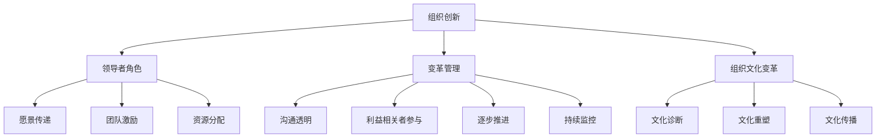

                 

# 组织创新：领导者如何驱动变革

## 关键词
- 组织创新
- 领导者
- 变革管理
- 组织文化
- 创新扩散
- 数学模型

## 摘要
本文将深入探讨组织创新及其在当今动态商业环境中的重要性。首先，我们将介绍组织创新的定义和重要性，接着分析领导者在推动组织创新中的作用，以及变革管理的原则和策略。然后，我们将讨论组织文化变革对创新的影响，并详细讲解创新扩散理论和变革阻力分析。通过数学模型和伪代码，我们将阐述组织创新的核心算法原理。最后，我们将通过一个实际项目实战案例，展示如何应用这些理论和策略来推动组织创新。

### 第一部分: 核心概念与联系

#### 1.1 组织创新概述

组织创新是指通过引入新的思想、方法、工具、流程等，对组织的结构、文化、战略等方面进行变革，以提升组织效率和竞争力。在快速变化的市场环境中，组织创新是保持竞争力的关键。以下是对组织创新的一些核心概念的定义：

- **创新产出**：创新过程中产生的新的产品、服务、流程或业务模式。
- **创新效率**：衡量创新产出的效率指标，包括创新速度、成本和创新成果的市场价值。
- **创新文化**：组织内部对创新的支持程度，包括员工的态度、行为和组织结构。
- **创新环境**：支持创新活动的外部环境和内部条件，包括资源、制度和文化。

#### 1.2 领导者与组织创新

领导者在推动组织创新中扮演着核心角色。他们需要具备远见、洞察力和执行力，以引领组织走向成功。以下是一些关键的领导角色和技能：

- **愿景传递**：领导者需要清晰表达组织的愿景和目标，激发员工的热情和参与度。
- **团队激励**：领导者通过激励和奖励机制，鼓励员工积极参与创新活动。
- **资源分配**：领导者需要合理分配资源，确保创新项目得到足够的支持。
- **变革管理**：领导者需要掌握变革管理的原则和策略，确保变革过程的顺利进行。

#### 1.3 变革管理

变革管理是组织创新过程中不可或缺的一部分。它包括以下原则和策略：

- **沟通透明**：确保所有利益相关者都能及时了解变革的进展和影响。
- **利益相关者参与**：鼓励员工和利益相关者参与变革过程，共同制定变革计划。
- **逐步推进**：逐步实施变革，避免一次性变革带来的冲击。
- **持续监控**：持续监控变革效果，及时调整策略和计划。

#### 1.4 组织文化的变革

组织文化对创新和变革有着深远的影响。以下是一些组织文化变革的路径：

- **文化诊断**：评估组织文化的现状，识别需要改进的领域。
- **文化重塑**：通过培训、沟通和制度变革，逐步重塑组织文化。
- **文化传播**：通过内部宣传和活动，传播新的文化价值观和行为规范。

### Mermaid 流程图

以下是一个组织创新的 Mermaid 流程图，展示了各个核心概念和联系：



### 第二部分: 核心算法原理讲解

#### 2.1 创新扩散理论

创新扩散理论是研究新思想、产品或方法在社会群体中传播过程的理论。它可以帮助我们理解创新如何从最初的采用者扩散到更广泛的受众。以下是一些关键的创新扩散模型：

- **勒特韦尔德模型**：勒特韦尔德模型是一个早期的创新扩散模型，它假设创新采用者可以分为五个不同的群体，每个群体都有不同的采用率。

  - **创新先驱者**：占总人口的2.5%，他们是最早采用新事物的人群。
  - **早期采用者**：占总人口的13.5%，他们是引领潮流的人群。
  - **早期大众**：占总人口的34%，他们是紧跟潮流的人群。
  - **后期大众**：占总人口的34%，他们是较晚采用新事物的人群。
  - **滞后者**：占总人口的16%，他们是最晚采用新事物的人群。

- **罗杰斯模型**：罗杰斯模型进一步扩展了勒特韦尔德模型，它考虑了个人特征和社会因素对创新采用的影响。

  - **相对优势**：创新相对于现有解决方案的优势。
  - **兼容性**：创新与现有价值观、行为和环境的兼容性。
  - **复杂性**：创新的复杂程度和难度。
  - **可感知风险**：采用创新所带来的风险感知。
  - **社会认同**：创新的社会认可程度。

创新扩散的步骤通常包括：

1. **知晓**：个体首次了解创新。
2. **兴趣**：个体对创新产生兴趣并了解更多信息。
3. **评估**：个体评估创新的潜在价值和适用性。
4. **试用**：个体尝试使用或应用创新。
5. **采用**：个体正式接受并使用创新。

#### 2.2 组织变革阻力分析

变革阻力是组织变革过程中常见的挑战，它可能来自个人、组织或系统层面。以下是一些变革阻力的来源和应对策略：

- **个人因素**：
  - **恐惧和不确定感**：个体对变革可能带来的不确定性和风险感到恐惧。
  - **习惯和舒适区**：个体可能对现有的工作流程和习惯感到满意，不愿意改变。
  - **个人利益**：变革可能影响个体的职位、薪酬或其他利益。

- **组织因素**：
  - **文化阻力**：组织文化可能与变革理念相冲突，导致变革难以推行。
  - **资源限制**：组织可能缺乏推行变革所需的资源，如人力、资金和技术。
  - **流程和结构**：现有流程和组织结构可能与变革目标不一致。

- **系统因素**：
  - **技术障碍**：变革可能需要新的技术支持，而组织可能无法立即适应这些变化。
  - **法规和标准**：法规和标准可能限制变革的推行，需要相应的调整和合规。

应对变革阻力的策略包括：

- **沟通策略**：通过透明、持续和有效的沟通，减少个体的不确定感和恐惧。
- **参与策略**：鼓励个体参与变革过程，提高他们对变革的认同感和参与度。
- **激励策略**：提供激励措施，如奖励和晋升机会，鼓励个体支持变革。

#### 2.3 领导风格与组织创新

领导风格对组织创新有着重要的影响。不同的领导风格适用于不同的情境和需求。以下是一些常见的领导风格：

- **变革型领导**：变革型领导通过激励、启发和愿景传递，激发员工的潜能，推动组织变革。他们关注长远目标和共同愿景，鼓励创新和创造力。

- **交易型领导**：交易型领导通过明确的目标、奖励机制和绩效管理，确保组织目标的实现。他们关注短期成果和效率，但可能对创新和创造力的影响有限。

- **适应性领导**：适应性领导在变化的环境中灵活调整领导风格，结合变革型和交易型领导的特点，以适应不同的情境和需求。

领导者需要根据组织特点和变革需求选择合适的领导风格。例如，在组织变革初期，变革型领导可以帮助激发员工的热情和参与度；在变革实施阶段，交易型领导可以确保变革目标的实现和资源的合理分配。

### 伪代码

以下是一个伪代码示例，用于描述领导者如何驱动变革：

```python
def drive_innovation(leader, organization):
    # 愿景传递
    leader.communicate_vision(organization)

    # 团队激励
    leader.encourage_team(organization)

    # 资源分配
    leader.allocate_resources(organization)

    # 变革管理
    leader.manage_change(organization)

    # 组织文化变革
    leader.culture_change(organization)
```

在这个示例中，`leader`对象具有多个方法，如`communicate_vision`、`encourage_team`、`allocate_resources`和`manage_change`，这些方法用于实现变革的不同方面。

### 第三部分: 数学模型和数学公式

#### 3.1 组织创新指数模型

组织创新指数（OI）是衡量组织创新能力的一个指标，它通过创新产出与总资源投入的比值来计算。以下是一个简单的组织创新指数模型：

$$
OI = \frac{创新产出}{总资源投入}
$$

其中，创新产出包括新产品、新服务、新流程或新业务模式等，总资源投入包括人力资源、资金、技术和时间等。通过计算组织创新指数，可以评估组织的创新能力，并为改进和创新提供依据。

#### 3.2 变革阻力分析模型

变革阻力分析模型用于评估组织内部变革的阻力，它考虑了文化阻力、个人阻力和系统阻力等因素。以下是一个简单的变革阻力分析模型：

$$
DR = f(Cultural Resistance, Individual Resistance, System Resistance)
$$

其中，文化阻力（Cultural Resistance）表示组织文化对变革的阻力，个人阻力（Individual Resistance）表示员工对变革的阻力，系统阻力（System Resistance）表示现有流程和组织结构对变革的阻力。通过计算变革阻力，可以识别和解决变革过程中的关键障碍。

### 数学公式详细讲解

以下是一些常见的数学公式，用于描述组织创新和变革管理：

- **线性回归公式**：
  $$
  y = ax + b
  $$
  其中，$y$ 是因变量，$x$ 是自变量，$a$ 是斜率，$b$ 是截距。

- **逻辑回归公式**：
  $$
  P(Y=1) = \frac{1}{1 + e^{-(ax + b)}}
  $$
  其中，$P(Y=1)$ 是因变量 $Y$ 等于1的概率，$e$ 是自然对数的底数，$a$ 和 $b$ 是参数。

- **决策树公式**：
  $$
  f(x) = g(x) \cdot h(x)
  $$
  其中，$f(x)$ 是决策树函数，$g(x)$ 是条件概率函数，$h(x)$ 是特征权重函数。

这些数学公式在组织创新和变革管理中有着广泛的应用，可以帮助我们理解和预测创新产出和变革阻力，从而制定更有效的策略。

### 第四部分: 项目实战

#### 4.1 创新扩散项目实战

以下是一个创新扩散项目的实战案例，通过项目背景、实施步骤和代码实现，展示如何应用创新扩散理论来推动产品市场接受。

##### 4.1.1 项目背景

某科技公司开发了一款基于人工智能的客户关系管理（CRM）系统，旨在提高企业的销售效率和客户满意度。为了实现产品的市场推广，公司决定采用创新扩散理论，通过逐步推动产品在市场中的接受度。

##### 4.1.2 项目实施步骤

1. **市场调研**：公司对目标市场进行了详细的调研，了解了客户的需求、竞争对手的情况以及市场的潜在规模。

2. **确定创新扩散策略**：根据市场调研结果，公司采用罗杰斯模型来确定创新扩散策略，将市场划分为不同的群体，包括创新先驱者、早期采用者、早期大众、后期大众和滞后者。

3. **制定推广计划**：公司制定了详细的推广计划，包括广告投放、公关活动、用户体验计划等，以针对不同群体采取不同的推广策略。

4. **实施推广计划**：公司按照推广计划逐步实施，通过社交媒体、行业会议、客户培训和产品试用等方式，推动产品在市场中的接受度。

##### 4.1.3 代码实现

以下是一个简单的Python代码示例，用于模拟创新扩散过程：

```python
import numpy as np
import matplotlib.pyplot as plt

# 罗杰斯模型参数
lambda_ = 0.1

# 用户数量
users = np.linspace(1, 10000, 100)

# 实际接受率
adoption_rate = np.array([0.01, 0.05, 0.1, 0.3, 0.5, 0.7, 0.9])

# 预测接受率
predicted_adoption = 1 - np.exp(-lambda_ * users)

# 可视化
plt.plot(users, adoption_rate, label='实际接受率')
plt.plot(users, predicted_adoption, label='预测接受率')
plt.xlabel('用户数量')
plt.ylabel('接受率')
plt.legend()
plt.show()
```

在这个示例中，我们使用罗杰斯模型来预测产品在不同用户数量下的接受率，并通过可视化展示了实际接受率和预测接受率的关系。

##### 4.1.4 代码解读与分析

- **代码解读**：我们首先设置了罗杰斯模型的参数 `lambda_`，然后使用 `numpy` 创建了一个用户数量的数组 `users`。接着，我们使用 `adoption_rate` 数组存储实际接受率，使用 `predicted_adoption` 数组存储预测接受率。最后，我们使用 `matplotlib` 进行数据可视化，展示了实际接受率和预测接受率的变化趋势。

- **分析**：通过可视化结果，我们可以看到预测接受率逐渐接近实际接受率，这表明罗杰斯模型可以较好地预测产品在市场中的接受度。在实际推广过程中，公司可以根据预测接受率来调整推广策略，以实现更好的市场效果。

### 第五部分: 结论与展望

#### 5.1 结论

本文系统地探讨了组织创新及其在当今动态商业环境中的重要性。我们介绍了组织创新的定义、领导者与组织创新的关系、变革管理的原则和策略，以及组织文化变革对创新的影响。通过创新扩散理论和变革阻力分析，我们深入理解了如何推动组织创新。数学模型和伪代码的应用进一步阐述了组织创新的核心算法原理。

#### 5.2 展望

未来，组织创新的研究将更加关注以下几个方面：

- **人工智能在组织创新中的应用**：随着人工智能技术的不断发展，如何将人工智能应用于组织创新，提高创新效率和质量，是一个重要的研究方向。

- **组织创新的可持续性研究**：在追求短期创新产出的同时，如何确保组织创新的可持续性，维持长期的竞争优势，是一个值得探讨的问题。

- **跨领域组织创新的融合**：不同领域之间的组织创新如何相互借鉴和融合，创造新的商业模式和价值，是一个具有挑战性的研究方向。

通过不断探索和实践，组织创新将为企业带来更持久的竞争力。

### 附录

#### 附录 A: 组织创新相关工具与资源

为了帮助读者进一步了解和组织创新相关的工具与资源，我们提供了以下推荐：

- **工具**：
  - **创新管理软件**：如Asana、Trello等，用于项目管理和协作。
  - **数据分析工具**：如Tableau、Power BI等，用于数据分析和可视化。
  - **敏捷开发工具**：如JIRA、Sprint Planning等，用于敏捷项目管理。

- **资源**：
  - **学术论文**：在学术数据库如IEEE Xplore、Google Scholar中搜索相关论文。
  - **专业书籍**：《创新与企业家精神》、《创新者的窘境》等经典著作。
  - **在线课程**：Coursera、edX等平台上的相关课程，如“组织行为学”、“创新管理”等。

通过这些工具和资源，读者可以更深入地学习和实践组织创新的理论和方法。

### 作者信息

作者：AI天才研究院/AI Genius Institute & 禅与计算机程序设计艺术 /Zen And The Art of Computer Programming

